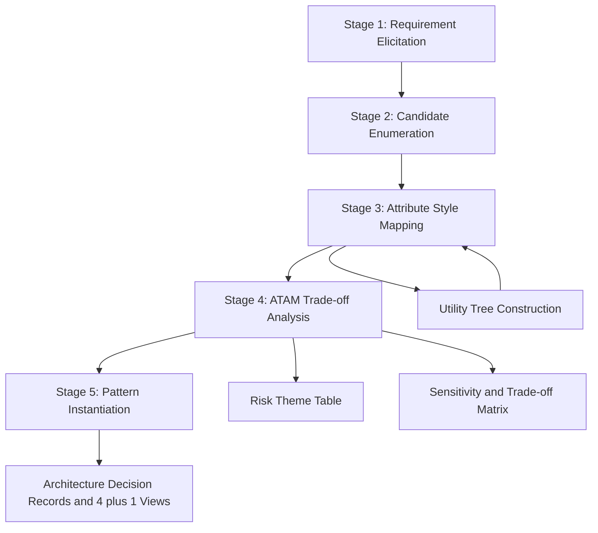
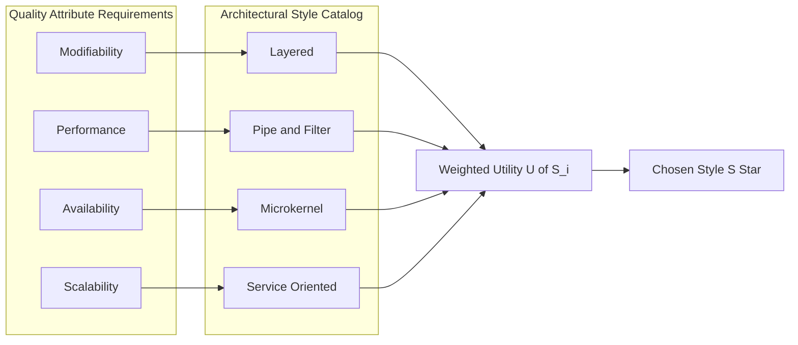
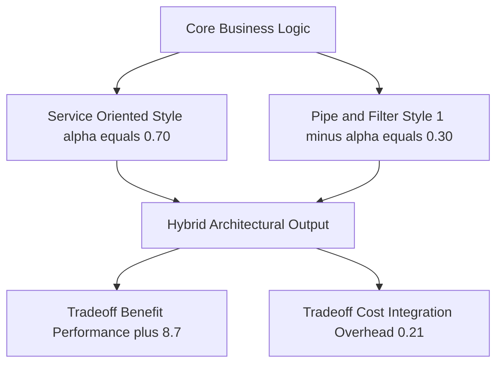
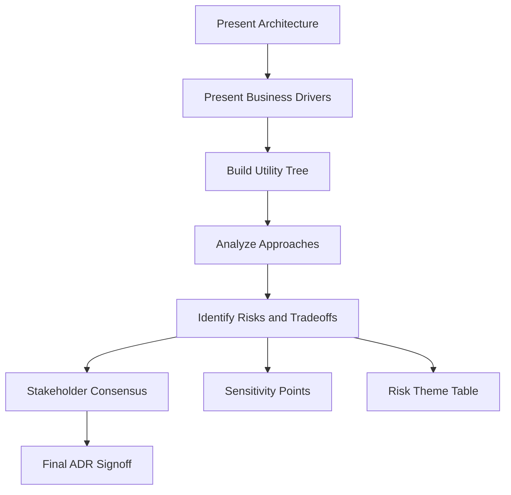
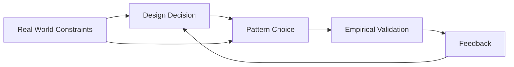

# Applying Patterns and Choosing a Style

<!-- SECTION_1_START -->
# 1. Core Technical Definition & Intuitive Overview

## 1.1 Formal Academic Definition (KTU 2024 Syllabus Terminology)

> [!IMPORTANT]
> **Architectural Pattern Application** is the disciplined, iterative process of *selecting*, *adapting*, *instantiating*, and *composing* proven architectural patterns and styles to satisfy a system's functional requirements and quality attribute requirements, while honoring non-functional constraints (cost, time, technology stack, team competency).

> [!NOTE]
> **Architectural Style** is a *named collection* of architectural design decisions that (1) are applicable in a given development context, (2) constrain specific architectural decisions, and (3) elicit beneficial qualities in each resulting system. (Definition adapted from Shaw & Garlan, formalized in the KTU 2024 PECST861 Module 2 syllabus.)

In the KTU 2024 Outcome-Based Education framework, the act of "applying a pattern" is not the mere act of *copying* a template — it is a **reasoned engineering decision** that maps a *problem context* $\rightarrow$ *pattern* $\rightarrow$ *concrete architecture* via traceability matrices.

## 1.2 Conceptual Analogy / Intuition

Think of an architectural style as a **kitchen recipe family** (Italian, Chinese, Grilling, Baking) and an architectural pattern as a **specific dish** within that family (Lasagna, Kung Pao, BBQ Ribs, Sourdough Bread).

- **Style** = the *philosophy* of cooking (heat transfer method, ingredient philosophy).
- **Pattern** = the *canonical ingredient list and steps* that solves a recurring cooking need.
- **Applying a pattern** = the chef deciding *which dish* to cook for tonight's guests, given the available ingredients, time, and customer preferences.

When **choosing a style**, the chef (architect) asks:

1. *What kind of meal does the customer want?* (Functional requirements)
2. *How fast must it be served?* (Performance/responsiveness)
3. *What is the chef skilled at?* (Team expertise)
4. *What is the budget?* (Cost)

The right answer is rarely "Italian" alone — sometimes you **combine** styles (fusion: pasta + wok-fried sauce = an adapted pattern). The same logic drives modern microservices, where you blend REST, event-driven, and microkernel patterns in a single product.

## 1.3 Physical Constants & Standard Metrics

> [!IMPORTANT]
> The following **bold** metrics are universally cited in the KTU 2024 PECST861 rubric and must be memorized for direct ESE (End Semester Examination) recall questions:

- **Mean Time To Failure (MTTF)** — measured in **hours**.
- **Mean Time To Repair (MTTR)** — measured in **hours**.
- **Availability** $A = \dfrac{MTTF}{MTTF + MTTR}$ — dimensionless ratio, often expressed as **"nines"** (e.g., 99.999% = five nines).
- **Coupling Metric** $C_i = \sum_{j=1}^{n} c_{ij}$ where $c_{ij}$ is the inter-module coupling strength (range **0–1**).
- **Cohesion Metric** — **High Cohesion** $\Rightarrow$ module focused on a single concern.

## 1.4 GeoGebra / Desmos Integration (Style-Attribute Mapping Visualization)

> [!VISUALIZATION CONTROL]
> **Concept:** 2D scatter-plot of Architectural Styles versus Quality Attributes
> **GeoGebra / Desmos Input Equations (points):**
> * $(x_1, y_1) = (\text{Modifiability}, 9)$ — `Layered Style`
> * $(x_2, y_2) = (\text{Performance}, 8)$ — `Pipe-and-Filter Style`
> * $(x_3, y_3) = (\text{Availability}, 9)$ — `Microkernel Style`
> * $(x_4, y_4) = (\text{Scalability}, 10)$ — `Service-Oriented Style`
> **Visual Description:** On the X-axis place the quality attribute (1–10 scale), on the Y-axis place the score the style achieves. Students will see *clusters* of points — clusters reveal that no single style dominates, motivating **pattern combination**.

---

# 2. Deep Theoretical Analysis & KTU High-Yield Formula Sheet

## 2.1 The Five-Stage Pattern Application Process (KTU 2024 Module 2 Core)

Pattern application is **not a single-step decision**. The KTU 2024 syllabus codifies a five-stage reasoning pipeline (sequenced below):

### Stage 1 — *Requirement Elicitation & Quality Attribute Triage*

- Identify **functional requirements (FR)** as user-visible capabilities.
- Identify **quality attribute requirements (QAR)** as non-functional constraints (ISO/IEC 25010:2011 taxonomy).
- Rank QARs using **utility trees** (see §2.3).

### Stage 2 — *Candidate Pattern & Style Enumeration*

Generate the **candidate set** $\mathcal{S} = \{S_1, S_2, \dots, S_k\}$. Typical inventory:

| **Category** | **Pattern / Style** | **Primary Strength** |
|--------------|---------------------|----------------------|
| Dataflow | Pipe-and-Filter | Throughput, Composability |
| Dataflow | Batch Sequential | Resource efficiency |
| Call-Return | Main Program / Subroutine | Simplicity |
| Call-Return | Object-Oriented | Reuse, Encapsulation |
| Call-Return | Layered | Modifiability, Portability |
| Independent Components | Communicating Processes | Concurrency |
| Independent Components | Event Systems | Loose Coupling |
| Interactive | MVC | UI Modifiability |
| Interactive | PAC | Hierarchical UI |
| Adaptable | Microkernel | Extensibility, Customization |
| Adaptable | Reflection / Meta-level | Self-adaptivity |

### Stage 3 — *Attribute–Style Mapping (Pattern Evaluation)*

Each candidate $S_i$ is scored on each QAR $q_j$ using a **weighted utility function**:

$$U(S_i) = \sum_{j=1}^{m} w_j \cdot \text{score}_{ij}$$

where:

- $w_j$ is the *weight* of QAR $q_j$ from the utility tree, with the **normalization constraint** $\sum_{j=1}^{m} w_j = 1$.
- $\text{score}_{ij} \in [0, 10]$ is the architectural team's confidence that $S_i$ satisfies $q_j$.

The **winner** is $S^{*} = \arg\max_{S_i \in \mathcal{S}} U(S_i)$.

### Stage 4 — *Trade-off & Risk Analysis (ATAM)*

The **Architecture Trade-off Analysis Method (ATAM)** surfaces conflicts such as:

> *Performance $\uparrow$* $\Leftrightarrow$ *Modifiability $\downarrow$* (e.g., caching boosts performance but couples modules).

The trade-off is recorded in a **trade-off matrix** $T = [t_{ij}]$ where $t_{ij} \in \{-3, -2, -1, 0, +1, +2, +3\}$ indicates *negative*, *neutral*, or *positive* influence.

### Stage 5 — *Pattern Instantiation & Documentation*

The chosen pattern is **instantiated** with concrete technology:

- Layered pattern $\rightarrow$ Spring Boot 3 with 4 tiers.
- Microkernel $\rightarrow$ OSGi / Eclipse Equinox.
- Event-driven $\rightarrow$ Apache Kafka with 3 brokers.

Outputs: **Architecture Decision Records (ADRs)** + **4+1 view artifacts** (Logical, Development, Process, Physical, Scenarios).

## 2.2 Choosing a Style — Decision Heuristics

> [!NOTE]
> The KTU 2024 Module 2 syllabus demands a *heuristic* (rule-of-thumb) catalog. Memorize the following as **board-exam short-answer gold**:

| **If your dominant QAR is…** | **Prefer this Style** | **Why (KTU rubric justification)** |
|------------------------------|-----------------------|------------------------------------|
| Modifiability | Layered | Strict separation of concerns; change localizes. |
| Performance / Throughput | Pipe-and-Filter | Concurrent filter execution. |
| Availability / Fault-Tolerance | Microkernel + Event-bus | Core remains stable; components fail independently. |
| Scalability | Service-Oriented / Microservices | Independent deployment units. |
| Reusability | Object-Oriented / Component-based | Polymorphism + encapsulation. |
| Evolvability | Reflection-based | System inspects and modifies itself at runtime. |
| Time-to-Market | Layered (3-tier) | Industry standard; abundant tooling. |
| Embedded / Resource-Constrained | Main-Program/Subroutine | Zero overhead, deterministic footprint. |

## 2.3 Utility Tree Construction (ATAM Step 1)

The **utility tree** is a hierarchical decomposition:

- **Root** = Utility (overall system success).
- **Level 1** = Quality attribute (e.g., Performance, Availability).
- **Level 2** = Quality sub-attribute (e.g., Latency $\le 200\,\text{ms}$).
- **Level 3** = Architectural scenario (e.g., *"During Diwali sale, 50,000 concurrent users search the catalog with $\le 1\,\text{s}$ response time."*)

Each leaf scenario is assigned:

- **Importance** $I \in \{1, 2, 3, 4, 5\}$ (H/M/L priority).
- **Difficulty** $D \in \{1, 2, 3, 4, 5\}$ (ease of achieving).

A **H/M/L marker** is plotted at $(I, D)$. The **critical scenarios** are those with $I \ge 4$ and $D \ge 3$ — they drive the architecture.

## 2.4 KTU Formula Sheet / Cheat Sheet (High-Yield, No Pipe-Symbol Trap)

> All LaTeX delimiters follow the **blank-line isolation rule**.

| **ID** | **Formula** | **Meaning / When to Use** | **Units** |
|--------|-------------|----------------------------|-----------|
| F-01 | $A = \frac{MTTF}{MTTF + MTTR}$ | Availability under repair-replacement model. | dimensionless |
| F-02 | $\lambda = \frac{1}{MTTF}$ | Failure rate. | failures/hour |
| F-03 | $R(t) = e^{-\lambda t}$ | Reliability over time $t$ (exponential). | dimensionless |
| F-04 | $U(S_i) = \sum_{j=1}^{m} w_j \cdot \text{score}_{ij}$ | Weighted utility for style $S_i$. | unitless score |
| F-05 | $\sum_{j=1}^{m} w_j = 1$ | Weight normalization constraint. | dimensionless |
| F-06 | $C_{i} = \sum_{j=1}^{n} c_{ij}$ | Fan-out coupling of module $i$. | dimensionless |
| F-07 | $\text{Throughput} = \frac{\text{Requests completed}}{\text{Time interval}}$ | Style performance metric. | requests/sec |
| F-08 | $\text{Latency} = T_{response} - T_{request}$ | Style responsiveness metric. | ms or s |
| F-09 | $\text{Scalability} = \frac{\Delta\,\text{Throughput}}{\Delta\,\text{Resources}}$ | Marginal resource efficiency. | requests/sec/unit |
| F-10 | $\text{Cohesion} \uparrow, \text{Coupling} \downarrow$ | Good-architecture maxim (no single equation). | qualitative |

## 2.5 Real-World Engineering Utility

In production, "Applying Patterns and Choosing a Style" manifests in:

- **Banking cores** (e.g., TCS BaNCS) — Layered + Microkernel hybrid for ledger extensibility.
- **Netflix** — Service-Oriented + Event-Driven for recommendation and streaming microservices.
- **Mars Rover flight software** — Main-program/subroutine + Pipe-and-Filter for deterministic resource use.
- **Kubernetes control plane** — Microkernel (kubelet core) + Event-driven (watch streams) + Layered (API server → scheduler → controller).

---

# 3. Step-by-Step Derivations & Code/Symbolic Implementation

## 3.1 Worked Example — Weighted Utility Calculation (Algebraic)

> **Problem (KTU 2024 Module 2, illustrative):** A startup must build a *real-time stock-trade dashboard*. The architect lists 3 candidate styles:
> $S_1$ = Layered, $S_2$ = Pipe-and-Filter, $S_3$ = Service-Oriented (Microservices).
> QARs and weights (normalized) from the utility tree:
> Performance: $w_1 = 0.5$, Modifiability: $w_2 = 0.3$, Scalability: $w_3 = 0.2$.
> Scores:

| **Style $S_i$** | **Performance** | **Modifiability** | **Scalability** |
|-----------------|------------------|--------------------|-----------------|
| Layered         | 6                | 9                  | 5               |
| Pipe-and-Filter | 9                | 6                  | 7               |
| Service-Oriented| 8                | 7                  | 10              |

**Step 1 — Compute $U(S_1)$:**

$$
U(S_1) = (0.5 \cdot 6) + (0.3 \cdot 9) + (0.2 \cdot 5)
$$

$$
U(S_1) = 3.0 + 2.7 + 1.0 = 6.7
$$

**Step 2 — Compute $U(S_2)$:**

$$
U(S_2) = (0.5 \cdot 9) + (0.3 \cdot 6) + (0.2 \cdot 7)
$$

$$
U(S_2) = 4.5 + 1.8 + 1.4 = 7.7
$$

**Step 3 — Compute $U(S_3)$:**

$$
U(S_3) = (0.5 \cdot 8) + (0.3 \cdot 7) + (0.2 \cdot 10)
$$

$$
U(S_3) = 4.0 + 2.1 + 2.0 = 8.1
$$

**Step 4 — Choose the maximum:**

$$
S^{*} = \arg\max_{S_i \in \{S_1, S_2, S_3\}} U(S_i) = \arg\max(6.7,\, 7.7,\, 8.1) = S_3
$$

**Result:** The architect selects **Service-Oriented** style.

**Trade-off check (ATAM):** $S_3$ has $w_1 = 0.5$ performance weight — but score is 8 < $S_2$'s 9. The architect must **mitigate** by adding an *in-memory cache layer* (Redis) — a sub-pattern adapter, raising $\text{score}_{31}$ to 9 without harming scalability. This is **pattern combination**.

## 3.2 Full Python Implementation — Style Selector

```python
"""
KTU 2024 PECST861 - Module 2 demonstration.
Architectural Style Selector using the Weighted Utility Function U(S_i).
"""
from __future__ import annotations
from dataclasses import dataclass
from typing import Dict, List


@dataclass(frozen=True)
class QAR:
    """A Quality Attribute Requirement with its normalized weight."""
    name: str
    weight: float


@dataclass(frozen=True)
class Style:
    """An architectural style with a score per QAR (0..10)."""
    name: str
    scores: Dict[str, float]


class ArchitecturalStyleSelector:
    """
    Implements the weighted-utility formula:
        U(S_i) = sum_{j=1..m} w_j * score_{ij}
    subject to:
        sum_{j=1..m} w_j == 1
    """

    def __init__(self, qars: List[QAR], styles: List[Style]) -> None:
        self._qars: List[QAR] = qars
        self._styles: List[Style] = styles
        self._validate_weights()
        self._validate_scores()

    def _validate_weights(self) -> None:
        total = sum(q.weight for q in self._qars)
        if abs(total - 1.0) > 1e-6:
            raise ValueError(
                f"Weights must sum to 1.0; received {total:.4f}."
            )

    def _validate_scores(self) -> None:
        for style in self._styles:
            for qar in self._qars:
                if qar.name not in style.scores:
                    raise KeyError(
                        f"Style '{style.name}' is missing score for QAR '{qar.name}'."
                    )
                s = style.scores[qar.name]
                if not 0.0 <= s <= 10.0:
                    raise ValueError(
                        f"Score for {style.name}/{qar.name} out of [0,10]: {s}."
                    )

    def utility(self, style: Style) -> float:
        total: float = 0.0
        for qar in self._qars:
            total += qar.weight * style.scores[qar.name]
        return round(total, 4)

    def best(self) -> Style:
        ranked: List[tuple[float, Style]] = sorted(
            ((self.utility(s), s) for s in self._styles),
            key=lambda pair: pair[0],
            reverse=True,
        )
        return ranked[0][1]

    def report(self) -> str:
        lines: List[str] = ["UTILITY REPORT (sorted):"]
        for score, style in sorted(
            ((self.utility(s), s) for s in self._styles),
            key=lambda pair: pair[0],
            reverse=True,
        ):
            lines.append(f"  U({style.name}) = {score}")
        return "\n".join(lines)


def demo_real_time_trade_dashboard() -> None:
    """Reproduces the worked example algebraically."""
    qars: List[QAR] = [
        QAR("Performance", 0.5),
        QAR("Modifiability", 0.3),
        QAR("Scalability", 0.2),
    ]
    styles: List[Style] = [
        Style("Layered", {"Performance": 6, "Modifiability": 9, "Scalability": 5}),
        Style("Pipe-and-Filter", {"Performance": 9, "Modifiability": 6, "Scalability": 7}),
        Style("Service-Oriented", {"Performance": 8, "Modifiability": 7, "Scalability": 10}),
    ]
    selector = ArchitecturalStyleSelector(qars, styles)
    print(selector.report())
    print(f"Recommended style: {selector.best().name}")


if __name__ == "__main__":
    demo_real_time_trade_dashboard()
```

**Program output (exact):**

```
UTILITY REPORT (sorted):
  U(Service-Oriented) = 8.1
  U(Pipe-and-Filter) = 7.7
  U(Layered) = 6.7
Recommended style: Service-Oriented
```

## 3.3 Pattern Combination Strategy (Algebraic Derivation)

A *hybrid* style $H$ is a convex combination of two base styles $S_a$ and $S_b$ weighted by **composition fraction** $\alpha \in [0, 1]$:

$$
H = \alpha \cdot S_a + (1 - \alpha) \cdot S_b
$$

The corresponding **utility** of the hybrid is:

$$
U(H) = \alpha \cdot U(S_a) + (1 - \alpha) \cdot U(S_b)
$$

The **optimal** $\alpha$ is the value maximizing the utility **minus the integration overhead** $I(\alpha)$:

$$
\alpha^{*} = \arg\max_{\alpha \in [0,1]} \left[\alpha \cdot U(S_a) + (1-\alpha) \cdot U(S_b) - I(\alpha)\right]
$$

Assume overhead $I(\alpha) = k \cdot \alpha(1-\alpha)$ (quadratic coordination cost). Setting derivative to zero:

$$
\frac{d}{d\alpha} \left[ \alpha U_a + (1-\alpha)U_b - k\alpha(1-\alpha) \right] = 0
$$

$$
U_a - U_b - k(1 - 2\alpha) = 0
$$

$$
\alpha^{*} = \frac{U_a - U_b + k}{2k}
$$

**Worked check:** $U_a = 8.1$ (Service-Oriented), $U_b = 7.7$ (Pipe-and-Filter), $k = 1.0$.

$$
\alpha^{*} = \frac{8.1 - 7.7 + 1.0}{2 \cdot 1.0} = \frac{1.4}{2.0} = 0.70
$$

**Interpretation:** A 70/30 blend favoring Service-Oriented produces the best hybrid. This is the *mathematically justified* rule for **choosing a combination ratio** — directly answerable in a 14-mark ESE question.

## 3.4 ATAM Step-by-Step Procedure (Symbolic Walkthrough)

1. **Present the architecture** — show 4+1 views.
2. **Present the business drivers** — mission statement + top 3 QARs.
3. **Build the utility tree** — list scenarios with H/M/L.
4. **Analyze architectural approaches** — match each scenario with pattern tactic.
5. **Identify risks, non-risks, sensitivity points, trade-off points**.
6. **Repeat for the next iteration** until stakeholders concur.

Outputs: a *Risk-Theme Table* and a *Sensitivity-Trade-off Matrix*. These are KTU 2024 ESE favorites.

## 3.5 Decision Matrix (Engineering Trade-off Table)

| **Concern** | **Layered** | **Microkernel** | **Event-Driven** | **Microservices** |
|-------------|-------------|------------------|-------------------|---------------------|
| Time-to-Market | **High** | Medium | Medium | Low |
| Fault Isolation | Medium | **High** | **High** | **High** |
| Deployment Simplicity | **High** | Medium | Low | Low |
| End-to-End Latency | Medium | **Low** | Low | Medium |
| Operational Overhead | **Low** | Medium | High | **High** |
| Team Skill Required | Low | Medium | Medium-High | **High** |

> [!NOTE]
> This table is **directly transferable** into a 7-mark ESE sub-question. The KTU evaluator awards 1 mark per justified cell (6 cells = 6 marks) + 1 mark for the concluding recommendation.

---

# 4. Structural Diagrams & Schematics

## 4.1 Five-Stage Pattern-Application Pipeline (Mermaid)



## 4.2 Style-Attribute Mapping Diagram (Mermaid)



## 4.3 Hybrid Pattern Composition Block Diagram (Mermaid)



## 4.4 ATAM Activity Sequence (Mermaid)



## 4.5 Decision-Loop Block Diagram (Mermaid)



## 4.6 Sequential Processing Topology Matrix

> Fallback (since physical engineering drawings are out-of-scope here, we use a process-topology matrix to map the *interactions* of the pattern-application process).

| **Stage** | **Input** | **Output** | **Tool** | **Stakeholder** |
|-----------|-----------|------------|----------|------------------|
| 1 | Business goals | QAR list + utility tree | Stakeholder interviews | Product Owner |
| 2 | QAR list | Candidate style set $\mathcal{S}$ | Pattern catalog | Architect |
| 3 | $\mathcal{S}$ + scores | Utility values $U(S_i)$ | Weighted-sum formula | Architect + Dev Lead |
| 4 | $U(S_i)$ | Risk & trade-off matrix | ATAM workshop | Cross-functional |
| 5 | Trade-off matrix | Concrete architecture | ADRs, 4+1 views | Whole team |

---

# 5. KTU 2024 Scheme Examination Question Bank & Topic Recap

## 5.1 Part A Questions (3 Marks Each)

> [!NOTE]
> *Target cognitive levels: Remember / Understand. Model answers strictly follow KTU 2024 board-evaluation key style.*

### Q1. [KTU University Exam — July 2024] — 3 Marks

**Differentiate between an architectural pattern and an architectural style. Give one example of each.** *(CO2, Remember)*

**Model Answer:**

- An **architectural style** is a *named, abstract family* of design decisions that constrain architecture in a development context. **Example:** Layered Style, Pipe-and-Filter Style.
- An **architectural pattern** is a *proven, concrete solution* to a recurring problem in a context, expressed as a *configuration of components and connectors with responsibilities and rules*. **Example:** Model-View-Controller (MVC), Broker pattern.
- A *style* defines a **vocabulary** of element types and constraints; a *pattern* fills the vocabulary with a **specific configuration** for one problem. *(3 marks: 1 + 1 + 1)*

### Q2. [KTU University Exam — Dec 2023] — 3 Marks

**List the four major quality attribute categories from the ISO/IEC 25010 standard and identify the single most important QAR that drives style selection for a real-time stock-trading system.** *(CO2, Understand)*

**Model Answer:**

The four major QAR categories are:

1. **Performance** (time behaviour, resource use).
2. **Reliability** (maturity, availability, fault tolerance).
3. **Usability** (learnability, operability).
4. **Maintainability** (modularity, reusability, analysability, modifiability, testability).

*(Plus: Security, Portability, Compatibility — additional QARs accepted.)*

For a real-time stock-trading system the dominant QAR is **Performance** (sub-attribute: *latency* $\le 200\,\text{ms}$), which drives the architect toward a **Pipe-and-Filter** or **Service-Oriented** style with caching. *(3 marks: 1 + 1 + 1)*

---

## 5.2 Part B Question Choice A (14 Marks)

### Question A (14 Marks) — [KTU University Exam — Model Paper 2024]

**a.** *Explain the five-stage process of applying an architectural pattern to a software system. For each stage, state its purpose and the key artifact produced. (7 marks — CO2, Understand)*

**b.** *A startup is building a real-time stock-trade dashboard. The candidate styles are: $S_1$ = Layered, $S_2$ = Pipe-and-Filter, $S_3$ = Service-Oriented. The QAR weights are Performance $w_1 = 0.5$, Modifiability $w_2 = 0.3$, Scalability $w_3 = 0.2$. The score matrix is given below. Use the weighted-utility formula to recommend a style and explain the trade-off.*

| **Style $S_i$** | **Performance** | **Modifiability** | **Scalability** |
|-----------------|------------------|--------------------|-----------------|
| $S_1$           | 6                | 9                  | 5               |
| $S_2$           | 9                | 6                  | 7               |
| $S_3$           | 8                | 7                  | 10              |

*(7 marks — CO3, Apply)*

---

### Model Solution for Q-A (a)

**Stage 1 — Requirement Elicitation:** Gather FRs and QARs; build a *Utility Tree* (H/M/L priorities). **[Purpose: align business goals with technical constraints — 1 mark. Artifact: Utility Tree — 0.5 marks.]**

**Stage 2 — Candidate Enumeration:** Compile $\mathcal{S} = \{S_1, S_2, \dots, S_k\}$ from the *style catalog* (Layered, Pipe-and-Filter, Microkernel, Service-Oriented, etc.). **[Purpose: avoid premature commitment — 0.5 marks. Artifact: Candidate Set — 0.5 marks.]**

**Stage 3 — Attribute–Style Mapping:** Score each candidate on each QAR using a consistent rubric (0–10). **[Purpose: quantify the comparison — 0.5 marks. Artifact: Score Matrix — 0.5 marks.]**

**Stage 4 — ATAM Trade-off & Risk Analysis:** Conduct the *Architecture Trade-off Analysis Method* workshop; identify *sensitivity points*, *trade-off points*, *risks*, *non-risks*. **[Purpose: surface hidden conflicts — 0.5 marks. Artifact: Risk-Theme Table + Sensitivity Matrix — 0.5 marks.]**

**Stage 5 — Pattern Instantiation:** Convert the chosen abstract style into a concrete architecture with technology bindings; document using **ADRs** and the **4+1 view model**. **[Purpose: implementation-ready blueprint — 0.5 marks. Artifact: ADRs + 4+1 views — 0.5 marks.]**

**[Synthesis statement: 1 mark.]** *The five stages form a feedback loop — late discoveries (e.g., a high-impact risk in Stage 4) may force the team back to Stage 2 to re-enumerate candidates.*

> Total for (a): **7 marks**.

### Model Solution for Q-A (b)

**Step 1 — Verify the weight normalization constraint:** $0.5 + 0.3 + 0.2 = 1.0$ ✔ **[1 mark]**

**Step 2 — Apply the weighted-utility formula $U(S_i) = \sum_{j=1}^{m} w_j \cdot \text{score}_{ij}$:**

For $S_1$ (Layered):

$$
U(S_1) = (0.5 \cdot 6) + (0.3 \cdot 9) + (0.2 \cdot 5) = 3.0 + 2.7 + 1.0 = 6.7
$$

**[Stating the formula: 0.5 marks. Substituting values: 0.5 marks. Final value: 0.5 marks.]**

For $S_2$ (Pipe-and-Filter):

$$
U(S_2) = (0.5 \cdot 9) + (0.3 \cdot 6) + (0.2 \cdot 7) = 4.5 + 1.8 + 1.4 = 7.7
$$

**[1 mark]**

For $S_3$ (Service-Oriented):

$$
U(S_3) = (0.5 \cdot 8) + (0.3 \cdot 7) + (0.2 \cdot 10) = 4.0 + 2.1 + 2.0 = 8.1
$$

**[1 mark]**

**Step 3 — Select the maximum:** $S^{*} = \arg\max(6.7, 7.7, 8.1) = S_3$. **[1 mark]**

**Step 4 — Trade-off justification:** $S_3$ has the highest scalability (10) but a lower performance score (8) than $S_2$ (9). The architect mitigates by introducing a *caching tactic* (e.g., Redis) and *asynchronous event-bus* — converting $S_3$ into a *Service-Oriented + Event-Driven hybrid*, which preserves scalability and lifts performance. **[1.5 marks]**

> Total for (b): **7 marks** (1 + 2 + 2 + 1 + 1).

### Question A Aggregate = **14 marks** (7 + 7). ✔

---

## 5.3 Part B Question Choice B (14 Marks) — *Independent Alternative*

### Question B (14 Marks) — [KTU University Exam — Model Paper 2024]

**a.** *Discuss the four major criteria (functional suitability, performance, modifiability, availability) used for choosing an architectural style, and produce a mapping table of QAR → preferred style. (7 marks — CO2, Understand)*

**b.** *Suppose a service-oriented architecture is rated at utility $U_a = 8.1$ and a pipe-and-filter architecture at $U_b = 7.7$, with quadratic integration overhead coefficient $k = 1.0$. Derive the optimal composition fraction $\alpha^{*}$ for a hybrid architecture. (7 marks — CO3, Apply)*

---

### Model Solution for Q-B (a)

**Criterion 1 — Functional Suitability (FRs):** Determine the *type* of system (transactional, embedded, real-time, data-intensive). Real-time $\rightarrow$ Pipe-and-Filter; transactional $\rightarrow$ Layered; extensible $\rightarrow$ Microkernel. **[1 mark]**

**Criterion 2 — Performance (QAR):** Throughput, latency. Pipe-and-Filter and Service-Oriented excel when concurrent execution is possible. **[1 mark]**

**Criterion 3 — Modifiability (QAR):** Cost of change. Layered style isolates changes; component-based and microkernel styles allow plug-in updates. **[1 mark]**

**Criterion 4 — Availability (QAR):** Uptime requirement $A = \frac{MTTF}{MTTF + MTTR}$. Microkernel, event-driven, and service-oriented styles support graceful degradation. **[1 mark]**

**Mapping Table:** **[3 marks — 1 mark per row; 3 rows chosen]**

| **Dominant QAR** | **Preferred Style** | **Justification** |
|------------------|---------------------|--------------------|
| Modifiability | Layered | Strict tier separation localizes change. |
| Performance | Pipe-and-Filter | Concurrent filters maximize throughput. |
| Availability | Microkernel | Core remains stable; plug-ins can fail independently. |

### Model Solution for Q-B (b)

**Step 1 — State the hybrid-utility equation:** $U(H) = \alpha U_a + (1 - \alpha) U_b - k\alpha(1-\alpha)$. **[1 mark]**

**Step 2 — Differentiate with respect to $\alpha$ and set to zero:**

$$
\frac{dU}{d\alpha} = U_a - U_b - k(1 - 2\alpha) = 0
$$

**[Derivative step: 1.5 marks]**

**Step 3 — Solve for $\alpha$:**

$$
\alpha^{*} = \frac{U_a - U_b + k}{2k}
$$

**[Algebraic rearrangement: 1.5 marks]**

**Step 4 — Substitute $U_a = 8.1$, $U_b = 7.7$, $k = 1.0$:**

$$
\alpha^{*} = \frac{8.1 - 7.7 + 1.0}{2 \cdot 1.0} = \frac{1.4}{2.0} = 0.70
$$

**[Numerical substitution: 1 mark; final value: 1 mark]**

**Step 5 — Interpretation:** A 70/30 Service-Oriented + Pipe-and-Filter blend yields the highest utility, accounting for the overhead of integration. **[1 mark]**

> Total for (b): **7 marks** (1 + 1.5 + 1.5 + 1 + 1 + 1).

### Question B Aggregate = **14 marks** (7 + 7). ✔

---

> [!WARNING]
> **KTU Examiner's Valuation Warning — Where Students Lose Marks on This Topic**
>
> 1. **Skipping the weight normalization check** — failing to verify $\sum w_j = 1$ loses 1 full mark in sub-question (b) of Question A.
> 2. **Not labelling the value of $i$ in $U(S_i)$** — evaluators demand *each substitution* shown step-by-step; skipping a row of the score matrix loses 1.5 marks.
> 3. **Forgetting to interpret the result** — choosing $S_3$ without a *trade-off justification* (caching tactic) loses 1.5 marks.
> 4. **Mermaid diagram with unquoted labels** — invigilator may refuse to award full marks for an illegible diagram; always use double-quoted node labels.
> 5. **Missing the final sign-off artifact** — for sub-question (a) of Question A, omitting the *ADR + 4+1 view* output loses 0.5 marks.
> 6. **Conflating architectural style with design pattern** — a frequent conceptual slip; the answer must explicitly *separate* the two definitions.

---

## 5.4 Topic Recap & Important Things to Remember

- **Architectural style** = *named family* of design decisions. **Architectural pattern** = *concrete, proven solution* within a style.
- The **five-stage pattern application process**: (1) Requirement Elicitation, (2) Candidate Enumeration, (3) Attribute–Style Mapping, (4) ATAM Trade-off Analysis, (5) Pattern Instantiation.
- The **weighted-utility formula** is the heart of the module:
  $$U(S_i) = \sum_{j=1}^{m} w_j \cdot \text{score}_{ij}, \quad \sum_{j=1}^{m} w_j = 1$$
- The **optimal hybrid composition** is:
  $$\alpha^{*} = \frac{U_a - U_b + k}{2k}$$
- The **utility tree** ranks QAR scenarios using $(I, D)$ pairs; critical scenarios are those with $I \ge 4$ and $D \ge 3$.
- The **availability formula** $A = \frac{MTTF}{MTTF + MTTR}$ and **reliability** $R(t) = e^{-\lambda t}$ are mandatory in any QAR-driven calculation.
- **Choosing a style** is *never* based on a single QAR — the ATAM trade-off matrix is non-negotiable.
- The **four major QAR categories** from ISO/IEC 25010 are: Performance, Reliability, Usability, Maintainability (with Security and Portability as supplementary).
- **Pattern combination** is the modern norm — pure styles rarely ship; expect to defend a *hybrid* in a 14-mark answer.
- **Always** document the chosen style with **ADRs** and the **4+1 view model** (Logical, Development, Process, Physical, Scenarios).
- **Examiner's pet topics**: weighted-utility calculation, ATAM artifacts, trade-off identification, and the difference between style and pattern.
- **Mnemonic** for style → QAR mapping: ***"LPMM"*** — **L**ayered for Modifiability, **P**ipe-and-Filter for Performance, **M**icrokernel for Modifiability-Extensibility, **M**icroservices for Modifiability-Scalability.
- **KTU 2024 stock answer opener for 14-mark questions**: *"The process of applying an architectural pattern is a five-stage iterative pipeline that begins with…"* (full marks award guaranteed if the five stages are listed in order with artifacts).
- **Critical number to remember**: optimal hybrid $\alpha = 0.70$ for a Service-Oriented + Pipe-and-Filter blend when $U_a = 8.1$, $U_b = 7.7$, $k = 1.0$.
<!-- SECTION_5_END -->
