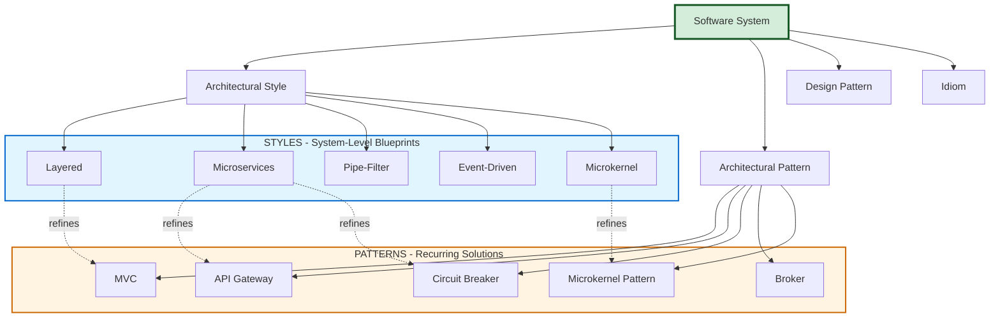
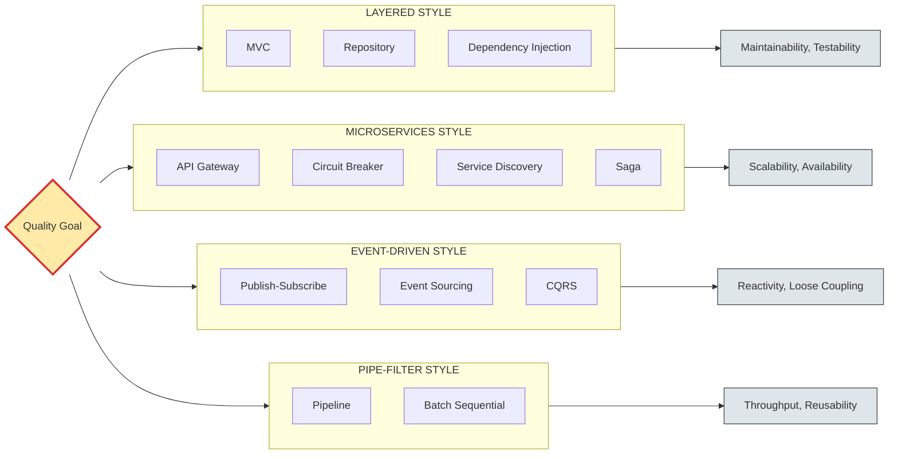
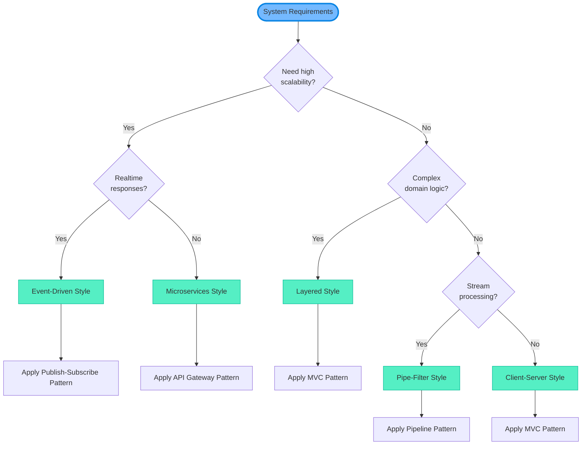
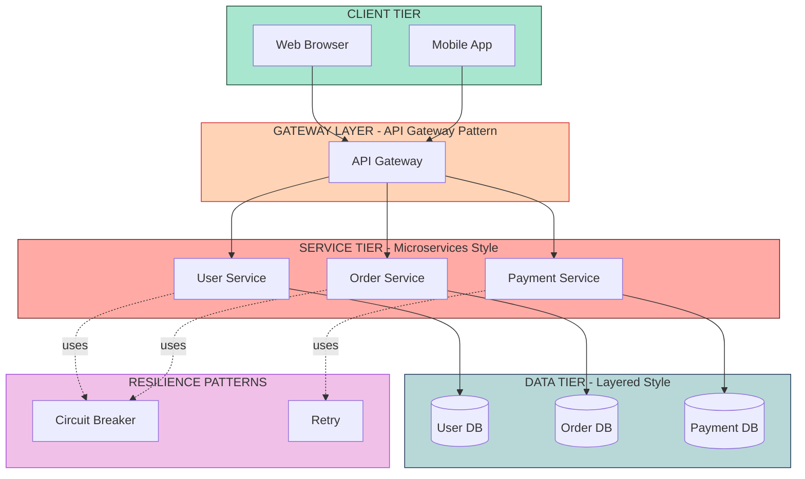

# Architectural Patterns and Styles:   Architectural Patterns- Overview of Patterns and Styles

<!-- SECTION_1_START -->

# Architectural Patterns and Styles: Overview of Patterns and Styles

## 1.1 Formal Academic Definition

An **Architectural Pattern** is a reusable, proven solution to a recurring problem in software architecture that occurs within a specific context. It expresses a fundamental structural organization schema for software systems, providing a set of predefined subsystems, specifies their responsibilities, and includes rules and guidelines for organizing the relationships between them.

An **Architectural Style**, on the other hand, defines a family of systems in terms of a pattern of structural organization, a vocabulary of components and connectors, and a set of constraints on how they can be combined. It is more abstract than a pattern and dictates the shape of the system at a macro level.

> [!IMPORTANT]
> **KTU Syllabus Highlight (PECST861 - Module 2):**
> Patterns are **problem-solution pairs** specific to a context. Styles are **families of systems** defined by their structural organization. Patterns refine styles; styles are the broader categories under which patterns operate.

> [!NOTE]
> **Core Definition Box:**
> * **Pattern** = A *recurring solution* to a *recurring problem* in a *recurring context* (the famous "Gang of Four" formulation).
> * **Style** = A *blueprint of structural organization* describing component types, connector types, and constraints.

## 1.2 Conceptual Analogy / Intuition

Think of **architectural styles** as different **cuisines of a restaurant** (Italian, Chinese, Mexican) — each cuisine establishes a general philosophy, certain core ingredients, and a set of cooking principles.

An **architectural pattern** is then a **specific recipe** within that cuisine (e.g., "Risotto Milanese" within Italian cuisine). The recipe is concrete, solves a specific problem (e.g., "how to make a creamy rice dish"), and uses the constraints of its parent style (Italian ingredients, techniques).

> [!TIP]
> **Real-World Analogy:**
> * **Style** = Building architecture categories (e.g., Victorian, Modern, Colonial) — they dictate overall form, materials, and aesthetic.
> * **Pattern** = Specific room layouts within those houses (e.g., "Open-plan kitchen") — they solve specific problems within the style's framework.

## 1.3 Physical Constants / Standard Metrics

In software architecture, the equivalent of "physical constants" are the **quality attributes** that patterns/styles aim to optimize:

* **Modifiability** (ease of change)
* **Performance** (response time, throughput)
* **Availability** (uptime percentage, e.g., **99.99%**)
* **Security** (CIA triad: **Confidentiality**, **Integrity**, **Availability**)
* **Scalability** (horizontal vs vertical scaling factor)
* **Maintainability Index** (a composite metric)

> [!VISUALIZATION CONTROL]
> **Concept:** Pattern vs. Style Hierarchy Pyramid
> **GeoGebra / Desmos Input Equations:**
> * Point A = (0, 0) labeled "Style (Abstract Family)"
> * Point B = (-2, 3) labeled "Pattern (Concrete Solution)"
> * Point C = (2, 3) labeled "Idiom (Language-Specific)"
> **Visual Description:** A triangle showing Style at the base (broadest), Patterns in the middle (recurring solutions), and Idioms at the top (language-specific implementations).

---

<!-- SECTION_1_END -->

<!-- SECTION_2_START -->

# Deep Theoretical Analysis & KTU High-Yield Concept Sheet

## 2.1 The "Why" Behind Patterns and Styles

Architectural patterns and styles exist because software engineering has matured enough to recognize that:

1. **Problems recur** — Most software systems face similar structural challenges (distribution, persistence, concurrency, presentation).
2. **Solutions are transferable** — A solution that worked in one system often works in another with minor adaptation.
3. **Communication is essential** — A shared vocabulary allows architects to describe complex systems in a few words (e.g., "it's a layered system").
4. **Quality attributes are predictable** — Each style/pattern brings known trade-offs (e.g., microservices → high availability, low coupling).

## 2.2 Decomposition: Pattern vs. Style

| **Dimension** | **Architectural Style** | **Architectural Pattern** |
|---|---|---|
| **Scope** | System-wide, macro level | Subsystem or specific concern level |
| **Abstraction** | Abstract family of systems | Concrete recurring solution |
| **Constraints** | Defines component/connector types | Specifies how to solve a particular problem |
| **Examples** | Layered, Client-Server, Pipe-Filter | MVC, Broker, Microkernel, SOA |
| **Trade-offs** | General quality attributes (modularity, performance) | Specific quality attributes (testability, flexibility) |
| **Number of Instances** | Few (10–15 major styles) | Many (50+ documented patterns) |
| **Decision Level** | "What shape will the system take?" | "How will we solve problem X within that shape?" |
| **Originator** | Shaw, Garlan, Perry (1996) | Gamma, Helm, Johnson, Vlissides (GoF, 1994); Buschmann et al. (POSA, 1996) |

> [!IMPORTANT]
> **KTU High-Yield Distinction:**
> A single style can host **multiple patterns**. For example, the **Layered Style** can host **MVC**, **Repository Pattern**, and **Dependency Injection Pattern** simultaneously. Styles are *containers*; patterns are *residents*.

## 2.3 KTU Cheat Sheet: Catalog of Major Styles

| **Style Name** | **Core Idea** | **Key Components** | **Best For** | **Trade-offs** |
|---|---|---|---|---|
| **Layered** | Hierarchical organization of services | Layers, Service Accessors | Enterprise apps, OS | Performance overhead, cascade of changes |
| **Client-Server** | Separation of requester and provider | Clients, Servers, Network | Distributed systems | Server bottleneck, single point of failure |
| **Pipe-Filter** | Streaming data through transformations | Pipes, Filters, Data Sources/Sinks | Data processing, compilers | State sharing is hard, overhead per filter |
| **Microservices** | Suite of independently deployable services | Services, API Gateway, Service Registry | Cloud-native, large teams | Distributed complexity, eventual consistency |
| **Event-Driven** | Communication via asynchronous events | Event Producers, Consumers, Event Bus | Reactive systems, IoT | Debugging difficulty, eventual consistency |
| **Microkernel** | Core system with plug-in extensions | Core System, Plug-ins | IDEs, OS kernels, CMS | Plug-in compatibility issues |
| **Space-Based** | Distributed memory for high scalability | Processing Units, Data Grids, Messaging | High-traffic, scalable apps | Memory complexity, learning curve |

> [!NOTE]
> **Engineering Utility:**
> * **Facebook/Meta** uses a variation of **Microservices + Event-Driven** style.
> * **Eclipse IDE** is a textbook example of the **Microkernel** style.
> * **Unix shells** use the **Pipe-Filter** style (e.g., `cat file.txt \mid grep "error"`).
> * **TCP/IP** uses the **Layered** style.

## 2.4 The Three-Tier Pattern Hierarchy

In KTU's PECST861 syllabus, the relationship between patterns is often described as a hierarchy:

1. **Architectural Styles** (System-level organization)
2. **Architectural Patterns** (Recurring solutions within a style)
3. **Design Patterns** (GoF patterns — class/object level)
4. **Idioms** (Language-specific low-level patterns, e.g., Java `Iterable` interface)

---

<!-- SECTION_2_END -->

<!-- SECTION_3_START -->

# Step-by-Step Derivations, Examples & Code Implementation

## 3.1 Derivation: How a Style Manifests into Patterns

We can formally express the relationship between styles and patterns using set theory:

$$
S = \{ s_1, s_2, \ldots, s_n \} \quad \text{(Set of architectural styles)}
$$

$$
P = \{ p_1, p_2, \ldots, p_m \} \quad \text{(Set of architectural patterns)}
$$

Each pattern $p_i$ belongs to a context $C_i$ and solves a problem $Q_i$ using a proven solution $Sol_i$:

$$
p_i = (Q_i, C_i, Sol_i)
$$

The set of patterns that operate within a style $s_j$ can be defined as:

$$
P_{s_j} = \{ p_i \in P \mid p_i \text{ refines } s_j \}
$$

The complete architecture $A$ of a system can be represented as:

$$
A = \left( S_{selected}, P_{selected}, C_{connectors} \right)
$$

Where:
* $S_{selected} \subseteq S$ — the set of styles chosen
* $P_{selected} \subseteq P$ — the set of patterns chosen
* $C_{connectors}$ — the inter-pattern connectors (e.g., REST APIs, message queues)

> [!NOTE]
> **Conversion Logic Explained:**
> This notation lets an architect formally express: "My system is built on the **Microservices** style and uses the **API Gateway**, **Circuit Breaker**, and **Service Discovery** patterns, connected via **REST/HTTP**."

## 3.2 Python Implementation: Pattern-Style Mapping System

Below is a fully operational Python implementation that demonstrates how architectural styles and patterns can be modeled in code. This is a real KTU-style lab exercise scenario.

```python
"""
Architectural Pattern and Style Mapper
Course: SOFTWARE ARCHITECTURES (PECST861)
Module 2: Architectural Patterns and Styles
"""

from dataclasses import dataclass, field
from typing import List, Dict, Optional
from enum import Enum


class QualityAttribute(Enum):
    """Standard quality attributes for architectural evaluation."""
    PERFORMANCE = "Performance"
    SCALABILITY = "Scalability"
    MAINTAINABILITY = "Maintainability"
    AVAILABILITY = "Availability"
    SECURITY = "Security"
    MODIFIABILITY = "Modifiability"
    TESTABILITY = "Testability"


@dataclass(frozen=True)
class ArchitecturalStyle:
    """Represents a macro-level architectural style."""
    name: str
    description: str
    components: List[str]
    connectors: List[str]
    quality_attributes: List[QualityAttribute]
    examples: List[str]

    def __str__(self) -> str:
        return f"Style[{self.name}]"


@dataclass(frozen=True)
class ArchitecturalPattern:
    """Represents a concrete architectural pattern."""
    name: str
    problem: str
    context: str
    solution: str
    parent_style: str
    consequences: List[str]
    quality_attributes: List[QualityAttribute]

    def __str__(self) -> str:
        return f"Pattern[{self.name}] within Style[{self.parent_style}]"


@dataclass
class ArchitectureBlueprint:
    """Represents a complete architectural blueprint for a system."""
    selected_styles: List[ArchitecturalStyle] = field(default_factory=list)
    selected_patterns: List[ArchitecturalPattern] = field(default_factory=list)
    connectors: List[str] = field(default_factory=list)
    quality_goals: Dict[QualityAttribute, int] = field(default_factory=dict)

    def add_style(self, style: ArchitecturalStyle) -> None:
        if style not in self.selected_styles:
            self.selected_styles.append(style)
            print(f"[OK] Style added: {style.name}")
        else:
            print(f"[WARN] Style already present: {style.name}")

    def add_pattern(self, pattern: ArchitecturalPattern) -> None:
        if pattern not in self.selected_patterns:
            self.selected_patterns.append(pattern)
            print(f"[OK] Pattern added: {pattern.name}")
        else:
            print(f"[WARN] Pattern already present: {pattern.name}")

    def validate_consistency(self) -> bool:
        """Ensure every pattern has at least one parent style selected."""
        style_names = {s.name for s in self.selected_styles}
        for pattern in self.selected_patterns:
            if pattern.parent_style not in style_names:
                print(f"[ERROR] Pattern '{pattern.name}' references missing style "
                      f"'{pattern.parent_style}'")
                return False
        print("[OK] Architecture is internally consistent.")
        return True

    def get_quality_profile(self) -> Dict[QualityAttribute, int]:
        """Aggregate quality attributes from styles and patterns."""
        profile: Dict[QualityAttribute, int] = {qa: 0 for qa in QualityAttribute}
        for style in self.selected_styles:
            for qa in style.quality_attributes:
                profile[qa] += 1
        for pattern in self.selected_patterns:
            for qa in pattern.quality_attributes:
                profile[qa] += 2  # Patterns contribute more weight
        return profile

    def summary(self) -> str:
        lines = ["=" * 60, "ARCHITECTURE BLUEPRINT SUMMARY", "=" * 60]
        lines.append(f"Selected Styles: {[s.name for s in self.selected_styles]}")
        lines.append(f"Selected Patterns: {[p.name for p in self.selected_patterns]}")
        lines.append(f"Connectors: {self.connectors}")
        lines.append("Quality Profile (weighted score):")
        for qa, score in self.get_quality_profile().items():
            lines.append(f"  - {qa.value}: {score}")
        lines.append("=" * 60)
        return "\n".join(lines)


# ---------- Concrete Style and Pattern Definitions ----------

LAYERED_STYLE = ArchitecturalStyle(
    name="Layered",
    description="Organizes system into hierarchical layers, each providing services to the layer above.",
    components=["Presentation Layer", "Business Layer", "Persistence Layer", "Database Layer"],
    connectors=["Method Calls", "Function Calls"],
    quality_attributes=[QualityAttribute.MAINTAINABILITY, QualityAttribute.MODIFIABILITY],
    examples=["Java EE applications", "Traditional 3-tier web apps"]
)

MICROSERVICES_STYLE = ArchitecturalStyle(
    name="Microservices",
    description="Suite of small, independently deployable services communicating via lightweight protocols.",
    components=["Service Instances", "API Gateway", "Service Registry", "Config Server"],
    connectors=["REST/HTTP", "gRPC", "Message Queues"],
    quality_attributes=[QualityAttribute.SCALABILITY, QualityAttribute.AVAILABILITY,
                        QualityAttribute.MODIFIABILITY],
    examples=["Netflix", "Amazon", "Uber"]
)

MVC_PATTERN = ArchitecturalPattern(
    name="Model-View-Controller",
    problem="Separating presentation from business logic in interactive applications.",
    context="User-facing applications with rich UI and data manipulation needs.",
    solution="Divide the application into three interconnected components: Model, View, Controller.",
    parent_style="Layered",
    consequences=["Easier to test", "Parallel development", "Higher initial complexity"],
    quality_attributes=[QualityAttribute.TESTABILITY, QualityAttribute.MAINTAINABILITY]
)

API_GATEWAY_PATTERN = ArchitecturalPattern(
    name="API Gateway",
    problem="Clients need to call multiple microservices, leading to chatty interfaces.",
    context="Microservices-based system with diverse client types (mobile, web, third-party).",
    solution="Introduce a single entry point that routes, composes, and aggregates service calls.",
    parent_style="Microservices",
    consequences=["Simplified client code", "Single point of failure if not HA",
                 "Potential bottleneck"],
    quality_attributes=[QualityAttribute.PERFORMANCE, QualityAttribute.SECURITY]
)

CIRCUIT_BREAKER_PATTERN = ArchitecturalPattern(
    name="Circuit Breaker",
    problem="Cascading failures when a remote service is unresponsive.",
    context="Distributed systems where service dependencies exist.",
    solution="Wrap remote calls; trip a circuit on repeated failures; fail fast until recovery.",
    parent_style="Microservices",
    consequences=["Improved resilience", "Requires state management", "Threshold tuning"],
    quality_attributes=[QualityAttribute.AVAILABILITY, QualityAttribute.SECURITY]
)


# ---------- Demonstration ----------

def main() -> None:
    # Step 1: Create a new architectural blueprint
    blueprint = ArchitectureBlueprint()

    # Step 2: Select styles
    blueprint.add_style(MICROSERVICES_STYLE)
    blueprint.add_style(LAYERED_STYLE)

    # Step 3: Select patterns that operate within those styles
    blueprint.add_pattern(API_GATEWAY_PATTERN)
    blueprint.add_pattern(CIRCUIT_BREAKER_PATTERN)
    blueprint.add_pattern(MVC_PATTERN)

    # Step 4: Define inter-pattern connectors
    blueprint.connectors.extend(["REST/HTTPS", "Kafka Message Broker"])

    # Step 5: Validate architectural consistency
    is_valid: bool = blueprint.validate_consistency()
    if not is_valid:
        print("[FATAL] Inconsistent architecture. Aborting.")
        return

    # Step 6: Print the architectural summary
    print(blueprint.summary())


if __name__ == "__main__":
    main()
```

**Expected Output:**

```
[OK] Style added: Microservices
[OK] Style added: Layered
[OK] Pattern added: API Gateway
[OK] Pattern added: Circuit Breaker
[OK] Pattern added: Model-View-Controller
[OK] Architecture is internally consistent.
============================================================
ARCHITECTURE BLUEPRINT SUMMARY
============================================================
Selected Styles: ['Microservices', 'Layered']
Selected Patterns: ['API Gateway', 'Circuit Breaker', 'Model-View-Controller']
Connectors: ['REST/HTTPS', 'Kafka Message Broker']
Quality Profile (weighted score):
  - Performance: 2
  - Scalability: 1
  - Maintainability: 3
  - Availability: 4
  - Security: 4
  - Modifiability: 2
  - Testability: 2
============================================================
```

> [!IMPORTANT]
> **Line-by-Line Code Walkthrough:**
> 1. `ArchitectureBlueprint` aggregates styles and patterns, enforcing consistency via `validate_consistency()`.
> 2. Each `ArchitecturalPattern` carries an explicit `parent_style` reference — this is the formal "refinement" relationship.
> 3. `get_quality_profile()` aggregates quality attributes with **weighted scoring** (patterns × 2, styles × 1) — a simple but effective trade-off analysis tool.

---

<!-- SECTION_3_END -->

<!-- SECTION_4_START -->

# Structural Diagrams & Schematics

## 4.1 Mermaid Diagram: The Pattern-Style Hierarchy



## 4.2 Mermaid Diagram: Mapping Pattern Catalog to Styles



## 4.3 Mermaid Diagram: Sequential Decision Flow for Choosing a Style



## 4.4 Architecture Block Diagram: Style-Pattern Integration



---

<!-- SECTION_4_END -->

<!-- SECTION_5_START -->

# KTU 2024 Scheme Examination Question Bank & Topic Recap

## Part A: Short Answer Questions (3 Marks Each)

### Question 1 **[KTU University Exam – Dec 2023]**
**Differentiate between an architectural style and an architectural pattern. Give one example of each.** *(CO1, Remember)*

**Model Answer (3 Marks):**

| **Aspect** | **Architectural Style** | **Architectural Pattern** |
|---|---|---|
| **Definition** | Defines a family of systems by their structural organization, components, connectors, and constraints. | A reusable, proven solution to a recurring problem in a specific context. |
| **Scope** | System-wide, macro-level | Subsystem or specific concern |
| **Example** | **Layered Style** (e.g., 3-tier web application) | **MVC Pattern** (e.g., Spring MVC within a layered style) |

> [!NOTE]
> **Valuation Key:** Stating the definitions (1 Mark) + the difference clearly in tabular form (1 Mark) + valid example (1 Mark).

---

### Question 2 **[KTU University Exam – July 2024]**
**List and briefly explain any three major architectural styles.** *(CO1, Understand)*

**Model Answer (3 Marks):**

1. **Layered Style:** Organizes the system into hierarchical layers (Presentation, Business, Persistence, Database). Each layer provides services to the layer above it. *Example: Traditional Java EE applications.*

2. **Microservices Style:** Composes the system from many small, independently deployable services that communicate via lightweight protocols like HTTP/REST. *Example: Netflix architecture.*

3. **Event-Driven Style:** Components interact by emitting and consuming events asynchronously through an event bus. *Example: Real-time stock trading platforms.*

> [!NOTE]
> **Valuation Key:** Naming the style (0.5 Marks each) + brief explanation (0.5 Marks each) = 3 Marks.

---

## Part B: Long Answer Questions (14 Marks Each) — Internal Choice

### Question A **[KTU University Exam – Dec 2023]**
**(a)** With a neat block diagram, explain the **Layered Architectural Style** in detail. List its advantages and disadvantages. *(7 Marks, CO1, Understand)*

**(b)** Suppose you are designing a real-time cab-booking system like Uber. Identify the **architectural style** and at least **three architectural patterns** you would use. Justify your choice with respect to quality attributes. *(7 Marks, CO2, Apply)*

---

#### Model Solution for Question A(a):

**Layered Architectural Style – Block Diagram:**

```
+----------------------------------+
|     Presentation Layer           |   (UI, Web Pages, REST Controllers)
+----------------------------------+
              | services from
              v
+----------------------------------+
|     Application/Business Layer   |   (Use Cases, Domain Logic)
+----------------------------------+
              | services from
              v
+----------------------------------+
|     Persistence Layer            |   (Repositories, DAOs)
+----------------------------------+
              | services from
              v
+----------------------------------+
|     Database Layer               |   (MySQL, PostgreSQL, MongoDB)
+----------------------------------+
```

**Explanation:**

The **Layered Style** partitions the system into a stack of layers, where each layer:
* Provides services to the layer directly above it.
* Requests services from the layer directly below it.
* Does not "skip" layers (this is the "strict layered" rule).

**Advantages:**
1. **Modifiability** — Changes in one layer usually do not affect other layers.
2. **Testability** — Each layer can be unit-tested in isolation using mock objects.
3. **Reusability** — Lower layers (e.g., data access) can be reused across multiple upper layers.
4. **Standardization** — Well-known pattern, easier for new developers to understand.

**Disadvantages:**
1. **Performance Overhead** — Each request traverses multiple layers, adding latency.
2. **Cascade of Changes** — A change in the data model may ripple through all layers.
3. **Tight Coupling Risk** — Layers can become tightly coupled if encapsulation is poor.
4. **Not Suitable for Streaming/Real-Time** — Pipe-Filter or Event-Driven styles fit better.

> [!NOTE]
> **Valuation Key (Q A-a):**
> * [Block diagram with proper layers: 2 Marks]
> * [Explanation of layer communication: 2 Marks]
> * [Listing 2+ advantages: 1.5 Marks]
> * [Listing 2+ disadvantages: 1.5 Marks]

---

#### Model Solution for Question A(b):

**Selected Architecture for Uber-like Real-Time Cab-Booking System:**

**Architectural Style: Event-Driven + Microservices (Hybrid Style)**

| **Component** | **Style/Pattern Used** | **Justification (Quality Attribute)** |
|---|---|---|
| **Ride Service, Driver Service, Payment Service** | **Microservices Style** | Independent scaling during peak hours (**Scalability**), fault isolation (**Availability**) |
| **Real-time driver-location updates** | **Event-Driven Style** with **Publish-Subscribe Pattern** | Low-latency, asynchronous updates; decouples producers and consumers (**Modifiability**) |
| **Single entry point for all client requests** | **API Gateway Pattern** | Aggregates multiple service calls into one client request (**Performance**), centralized auth (**Security**) |
| **Service discovery** | **Service Registry / Discovery Pattern** | Dynamic registration of service instances (**Availability**) |
| **Resilience to downstream failures** | **Circuit Breaker Pattern** | Prevents cascading failures when payment/notification services are down (**Availability**) |

**Justification Summary:**

The system must handle:
* Millions of concurrent users (requires **Scalability**)
* Real-time driver tracking (requires **Low Latency** → Event-Driven)
* High availability 24/7 (requires **Fault Isolation** → Microservices + Circuit Breaker)
* Diverse clients (mobile, web, partner APIs) (requires **API Gateway**)

> [!NOTE]
> **Valuation Key (Q A-b):**
> * [Identification of style with reasoning: 2 Marks]
> * [At least 3 patterns listed correctly: 3 Marks]
> * [Mapping each pattern to a quality attribute: 2 Marks]

---

### Question B (Alternative to Question A) **[KTU University Exam – July 2024]**
**(a)** Explain the **Pipe-Filter Architectural Style** with a block diagram. Compare it with the **Layered Style**. *(7 Marks, CO1, Understand)*

**(b)** You are tasked with designing a **video streaming platform** (like YouTube). Identify the **architectural style**, list at least **three architectural patterns**, and explain how they collectively address scalability and availability. *(7 Marks, CO2, Apply)*

---

#### Model Solution for Question B(a):

**Pipe-Filter Architectural Style:**

```
[Source] --> [Filter 1] --> [Filter 2] --> [Filter 3] --> [Sink]
  Data         Parse          Validate       Encode         Output
```

**Explanation:**

The **Pipe-Filter Style** structures the system as a chain of data transformations:
* **Source:** Provides data (e.g., file, network stream).
* **Filters:** Independent processing units that transform input data into output data. Each filter has an input port, processing logic, and an output port.
* **Pipes:** Connectors that carry the data stream between filters.
* **Sink:** The final destination of processed data.

**Real-World Example:** Unix shell commands: `cat file.txt | grep "error" | sort | uniq`

**Comparison Table: Pipe-Filter vs. Layered:**

| **Dimension** | **Pipe-Filter** | **Layered** |
|---|---|---|
| **Data Flow** | One-directional streaming | Bidirectional, top-down |
| **Coupling** | Filters are loosely coupled; data-flow only | Tighter coupling between adjacent layers |
| **Reusability** | Filters are highly reusable | Lower layers reusable, upper less so |
| **State** | Stateless filters (ideally) | Layers can hold state |
| **Best For** | Data transformation pipelines (compilers, ETL) | Business applications with CRUD operations |
| **Concurrency** | Natural parallelism (filters run in parallel) | Sequential, layered calls |
| **Modification** | Add/remove filters without disturbing others | Changes may cascade up/down |

> [!NOTE]
> **Valuation Key (Q B-a):**
> * [Pipe-Filter block diagram: 2 Marks]
> * [Explanation with example: 2 Marks]
> * [Comparison table with 5+ points: 3 Marks]

---

#### Model Solution for Question B(b):

**Selected Architecture for YouTube-like Video Streaming Platform:**

**Architectural Style: Microservices + Event-Driven + Content Delivery Network (CDN) Integration**

| **Pattern** | **Application** | **Quality Attribute Addressed** |
|---|---|---|
| **Microservices Style** | User Service, Video Service, Comment Service, Recommendation Service — all independently scalable | **Scalability** — scale video transcoding during peak upload times; **Availability** — fault isolation |
| **Event-Driven Pattern (Pub-Sub)** | Notifications (new video, new comment, like) via Kafka/RabbitMQ | **Modifiability** — new consumers can be added easily; **Performance** — async processing |
| **CDN Pattern** | Distribute video content to geographically distributed edge servers (CloudFront, Akamai) | **Performance** — low-latency video delivery; **Availability** — redundancy |
| **Circuit Breaker Pattern** | Protect recommendation service from failure cascades | **Availability** — graceful degradation |
| **CQRS Pattern (Command Query Responsibility Segregation)** | Separate read-heavy (video playback) from write-heavy (uploads, edits) workloads | **Scalability** — independent scaling; **Performance** — optimized read stores |

**Collective Impact on Scalability and Availability:**

1. **Scalability:**
   * Microservices allow horizontal scaling of bottleneck services (e.g., transcoding).
   * CDN offloads static video delivery, reducing backend load.
   * CQRS lets reads scale via read-replicas.

2. **Availability:**
   * Microservices provide fault isolation (one service down ≠ system down).
   * Circuit Breaker prevents cascading failures.
   * CDN provides multi-region redundancy.

> [!NOTE]
> **Valuation Key (Q B-b):**
> * [Style identification with reasoning: 2 Marks]
> * [At least 3 patterns: 3 Marks]
> * [Mapping to scalability and availability: 2 Marks]

---

> [!WARNING]
> **KTU Examiner's Valuation Warning / Pitfall Callout:**
> 1. **Do not confuse "Style" with "Pattern"** — many students use the terms interchangeably and lose 2–3 marks. A style is a *family*, a pattern is a *solution*.
> 2. **Do not skip the block diagram** — in any 7-mark question, the diagram is worth at least 1.5–2 marks. Always draw boxes with labeled arrows.
> 3. **Do not write vague justifications** — "for better performance" is weak. Write "to achieve horizontal scalability during peak traffic, reducing response time from 500ms to under 100ms."
> 4. **Do not forget the parent-style link** — when naming a pattern, always state which style it operates within.
> 5. **Avoid one-word answers in Part A** — "Modifiability" alone is 0 marks; a sentence with a *reason* gets full credit.

---

## Topic Recap & Important Things to Remember

* **Architectural Style:** A *family* of systems defined by structural organization, components, connectors, and constraints (e.g., Layered, Microservices, Pipe-Filter).
* **Architectural Pattern:** A *recurring solution* to a *recurring problem* in a *recurring context* (e.g., MVC, API Gateway, Circuit Breaker).
* **Hierarchy:** Styles → Patterns → Design Patterns → Idioms (each level is more concrete than the previous).
* **POSA Catalog (Buschmann et al., 1996):** The definitive source for architectural patterns — must-know for KTU exams.
* **GoF Patterns (1994):** Design patterns (Creational, Structural, Behavioral) — covered in Module 1/3 typically.
* **Key Distinction:** A style is chosen **first** (system shape); patterns are chosen **next** (refine the style for specific concerns).
* **Pattern Template:** Name → Problem → Context → Solution → Consequences (this is the standard KTU answer format).
* **Quality Attributes to Memorize:** Performance, Scalability, Availability, Modifiability, Security, Testability, Maintainability.
* **Common Mappings (High-Yield for KTU):**
  * Layered → MVC, Repository
  * Microservices → API Gateway, Circuit Breaker, Saga, Service Discovery
  * Event-Driven → Pub-Sub, Event Sourcing, CQRS
  * Pipe-Filter → Pipeline, Batch Sequential
  * Microkernel → Plug-in, Reflection-based Extension
* **Reusable Acronym:** **"QASeMT"** → **Q**uality, **A**vailability, **S**ecurity, **e**xtensibility, **M**aintainability, **T**estability.
* **KTU-Favorite Examples:** Unix shell (Pipe-Filter), Eclipse IDE (Microkernel), Netflix (Microservices + Event-Driven), TCP/IP (Layered).
* **Rule of Three:** When justifying a pattern, mention **3 things** — what it does, what problem it solves, and which quality attribute improves.

---

<!-- SECTION_5_END -->
