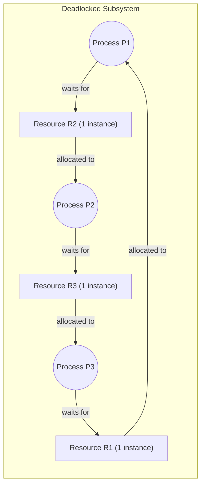
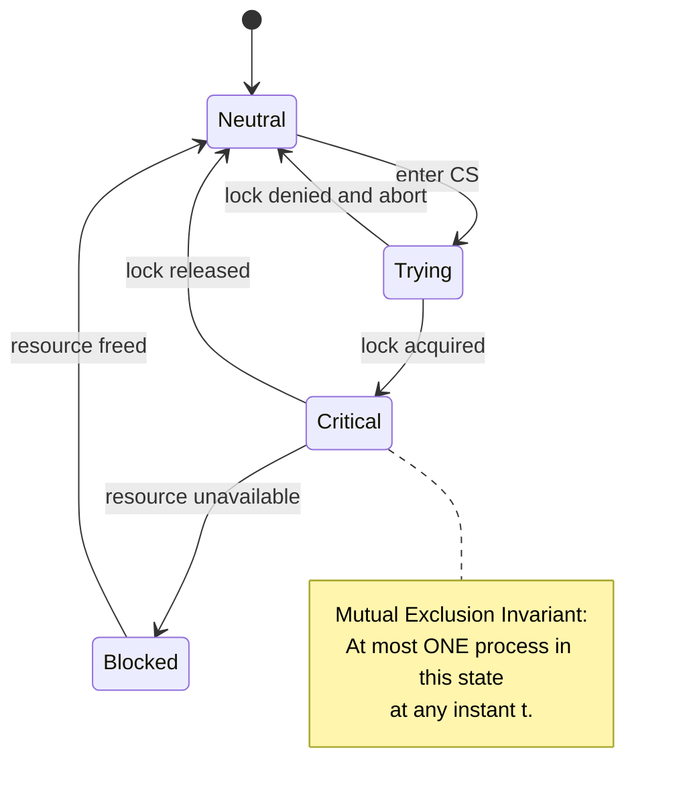
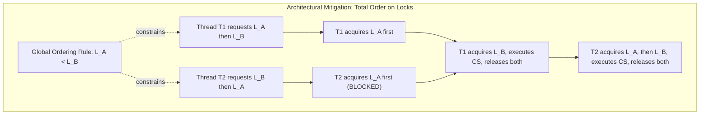
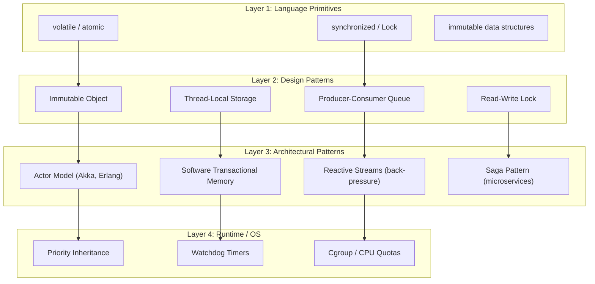

# Concurrency Problems

<!-- SECTION_1_START -->

# Concurrency Problems in Software Architectures

## 1. Core Technical Definition

> [!IMPORTANT]
> **Concurrency Problems** are a class of software defects that emerge when multiple computational threads, processes, or transactions execute in an interleaved (and potentially parallel) manner while sharing mutable state or system resources. These problems are not deterministic by default — they manifest as temporal correctness violations, data corruption, indefinite blocking, or total system halt, making them notoriously difficult to reproduce, test, and debug in production-grade distributed systems.

In the **KTU 2024 Scheme** syllabus for *PECST861 – Software Architectures*, this topic resides under **Module 2: Architectural Patterns and Styles**, and it is examined as a sub-topic of architectural patterns that govern **tactical concerns** (as opposed to structural or deployment concerns). The KTU board expects students to identify the problem, map it to an architectural cause, and prescribe a pattern-level mitigation.

### 1.1 Conceptual Analogy / Intuition

> [!NOTE]
> **Real-World Analogy — The Single-Toilet Office Washroom**
> Imagine a small office with **one** washroom and **three** employees (Alice, Bob, Carol) who may need to use it at any moment. The "correctness rules" are: (1) only one person may occupy the washroom at a time, (2) the door lock must be functional, (3) the key must be returned, and (4) nobody starves indefinitely. Now, if there is no locking policy:
> - Two people might enter simultaneously → **Race Condition**.
> - Alice locks the door, then leaves for lunch, never returning the key → **Deadlock** (resource permanently held).
> - Alice and Bob keep yielding the washroom to each other politely, but neither actually uses it → **Livelock**.
> - Carol is always skipped in favour of Alice and Bob → **Starvation**.
> This single mental model covers **all four canonical concurrency problems**.

The **fundamental metric** governing concurrency correctness is the **happens-before relation** (introduced by Leslie Lamport in 1978), which establishes a partial order on events in a distributed system. Every concurrency problem is, at its root, a violation of an expected happens-before ordering.

### 1.2 Visualization Control — State Space of Concurrency

> [!VISUALIZATION CONTROL]
> **Concept:** Two-Process State Transition Diagram for Critical Section Entry
> **GeoGebra / Desmos Input Equations:**
> * Point A: $(0, 0)$ — labelled *Non-Critical*
> * Point B: $(4, 0)$ — labelled *Trying*
> * Point C: $(8, 0)$ — labelled *Critical*
> * Point D: $(12, 0)$ — labelled *Exit*
> * Arrow path: $A \to B \to C \to D \to A$ (cyclic state machine)
> **Visual Description:** A horizontal state machine where the *x-axis* enumerates the four logical states a process traverses to enter and exit a critical section. The transitions *Try* (request lock), *Enter* (acquire), *Exit* (release) form the *mutual-exclusion invariant*. Students should observe that in a **correct** architecture, only **one** process can occupy state $C$ at any instant $t$.

---

<!-- SECTION_1_END -->

<!-- SECTION_2_START -->

# 2. Deep Theoretical Analysis & KTU High-Yield Formula Sheet

## 2.1 The Taxonomy of Concurrency Problems

Concurrency defects in software architectures cluster into **four primary categories**, each with a distinct failure signature:

1. **Race Condition** — outcome depends on the *relative timing* of interleaved operations.
2. **Deadlock** — two or more threads are *permanently* blocked, each waiting for a resource held by another.
3. **Livelock** — threads are *active* but make no forward progress because they keep reacting to each other.
4. **Starvation (Indefinite Postponement)** — a thread is *continually denied* access to a resource it requires.

A fifth, increasingly important category in **cloud-native architectures**, is the **distributed deadlock** (e.g., transaction cycles across microservices), but the KTU 2024 module scopes this to intra-process / intra-JVM concepts.

## 2.2 The Four Coffman Conditions for Deadlock

> [!IMPORTANT]
> **Coffman, Elphick, and Shoshani (1971)** proved that a deadlock is **necessary and sufficient** if and only if the following **four conditions hold simultaneously**:
> 1. **Mutual Exclusion** — At least one resource is held in a non-sharable mode.
> 2. **Hold and Wait** — A process holds at least one resource while waiting for another.
> 3. **No Preemption** — Resources cannot be forcibly taken from a holding process.
> 4. **Circular Wait** — A directed cycle exists in the resource-allocation graph: $P_1 \to P_2 \to \dots \to P_n \to P_1$.

The KTU examiner frequently asks students to **identify which Coffman condition is broken** by a given architectural mitigation. Memorize this mapping:

| Mitigation Strategy | Condition Broken |
|---|---|
| Lock striping, reader-writer locks | (Reduces) Mutual Exclusion |
| All-or-nothing resource acquisition | Hold and Wait |
| `Thread.interrupt()`, `tryLock(timeout)` | No Preemption |
| Impose global lock ordering | Circular Wait |

## 2.3 KTU High-Yield Formula / Metric Sheet

> [!NOTE]
> Use this compact table as your rapid-revision cheat sheet. Pay attention to the **units** — examiners deduct marks for stating a dimensionless value with a unit, or vice versa.

| Symbol | Quantity / Concept | Formula or Definition | Typical Unit | Used For |
|---|---|---|---|---|
| $T_{p}$ | Parallel execution time | $T_{p} = \dfrac{T_{s}}{N} + T_{oh}$ | seconds | Amdahl's Law context |
| $T_{s}$ | Sequential execution time | Given baseline | seconds | Speedup denominator |
| $N$ | Number of processors | Given hardware | unitless | Concurrency limit |
| $T_{oh}$ | Overhead (locks, context switch) | $T_{ctx} + T_{sync}$ | seconds | Concurrency tax |
| $S$ | Speedup | $S = \dfrac{T_{s}}{T_{p}}$ | unitless | Concurrency benefit |
| $E$ | Efficiency | $E = \dfrac{S}{N} = \dfrac{T_{s}}{N \cdot T_{p}}$ | fraction (0–1) | Resource utilisation |
| $\alpha$ | Parallelisable fraction | $0 \le \alpha \le 1$ | fraction | Amdahl's Law |
| $L_{avg}$ | Average lock wait time | $L_{avg} = \dfrac{L_{max}}{2}$ (uniform) | seconds | Lock contention metric |
| $\rho$ | Lock utilisation (Little's Law) | $\rho = \lambda \cdot L_{avg}$ | fraction | Stability bound: $\rho < 1$ |
| $C_{cs}$ | Context switch cost | $C_{cs} \approx 1\text{–}10 \,\mu s$ | microseconds | Concurrency overhead |
| $P_{race}$ | Race window probability | $P_{race} \approx 1 - e^{-\lambda \cdot W}$ | probability | Heisenbug likelihood |

**Amdahl's Law** (the architectural bound on concurrency benefit):

$$S(N) = \frac{1}{(1 - \alpha) + \frac{\alpha}{N}}$$

$$\lim_{N \to \infty} S(N) = \frac{1}{1 - \alpha}$$

This proves a critical architectural fact: if even **1%** of a workload is inherently sequential ($\alpha = 0.99$), the maximum achievable speedup is **bounded at 100×** regardless of how many cores are added.

## 2.4 Why Concurrency Problems Matter in Real Engineering

| Domain | Concurrency Defect Manifestation | Engineering Impact |
|---|---|---|
| Banking / Fintech | Lost-update race on account balance | Double-charging customers, regulatory fines |
| Operating Systems Kernel | Deadlock between `mmap` and file lock | Kernel panic, OS reboot |
| Distributed Microservices | Saga transaction cyclic dependency | Order stuck in *PENDING* forever |
| Database Engines | Phantom-read on shared inventory | Overselling limited-stock items |
| Embedded / RTOS | Priority inversion on CAN bus | Mars Pathfinder 1997 reset bug |
| Web Servers | Thread-pool starvation under load | 503 Service Unavailable, SLA breach |
| Compilers | Re-entrant parser corruption | Silent code-generation errors |

> [!NOTE]
> The **Mars Pathfinder** incident of 1997 is the most-cited case study in KTU reference materials: a priority-inversion-induced deadlock caused total system resets. The fix was a *priority inheritance* mutex, which is a textbook architectural pattern that the syllabus expects you to know by name.

---

<!-- SECTION_2_END -->

<!-- SECTION_3_START -->

# 3. Step-by-Step Derivations, Proofs & Code Implementation

## 3.1 Formal Derivation — Circular Wait Necessity (Coffman)

**Claim:** If a deadlock exists, then a circular wait necessarily exists in the resource-allocation graph.

**Proof by contradiction:**

*Step 1.* Assume a deadlock exists but **no** circular wait exists in the resource-allocation graph (RAG).

*Step 2.* Since there is no cycle, the RAG is a **Directed Acyclic Graph (DAG)**. By induction on the length of the longest path, the graph possesses at least one *sink vertex* (a process holding no outgoing wait edges, i.e., a process waiting for nothing).

*Step 3.* This sink process cannot be deadlocked, because to be deadlocked it must hold at least one resource and wait for at least one other — meaning it would have an outgoing edge, contradicting the sink property.

*Step 4.* Remove this sink process and all its incident edges. The remaining graph is still a DAG, so it must have another sink.

*Step 5.* By induction, we exhaust the process set, leaving **zero** deadlocked processes — contradicting the assumption of a deadlock.

*Step 6.* Therefore, the assumption fails: a deadlock *requires* a circular wait. $\blacksquare$

**Why this matters for the exam:** KTU board examiners award **2 marks** for stating the induction hypothesis and **2 marks** for the contradiction closure. Total 4 marks are usually reserved for this proof.

## 3.2 Producer–Consumer Problem — Full Implementation

The **Producer–Consumer** (a.k.a. **Bounded-Buffer**) problem is the canonical synchronisation problem in KTU Module 2.

```python
import threading
import time
import logging
from collections import deque
from typing import Deque, Optional

# ------------------------------------------------------------------
# Configure structured logging to observe concurrency behaviour
# ------------------------------------------------------------------
logging.basicConfig(
    level=logging.INFO,
    format="%(asctime)s [%(threadName)-12s] %(levelname)s: %(message)s"
)
logger = logging.getLogger("BoundedBuffer")


class BoundedBuffer:
    """
    Thread-safe bounded buffer using Condition Variables.
    Enforces:
        (i)  Mutual exclusion on buffer mutation
        (ii) No busy-waiting (no CPU spin)
        (iii) Bounded waiting — no starvation under FIFO scheduling
    """

    def __init__(self, capacity: int) -> None:
        if capacity <= 0:
            raise ValueError("Buffer capacity must be a positive integer.")
        self._buffer: Deque[int] = deque()
        self._capacity: int = capacity
        self._lock = threading.Lock()
        self._not_full = threading.Condition(self._lock)
        self._not_empty = threading.Condition(self._lock)

    def put(self, item: int, timeout: Optional[float] = None) -> bool:
        """
        Producer-side: blocks while the buffer is full.
        Returns True on success, False on timeout.
        """
        with self._not_full:
            end_time = time.monotonic() + (timeout if timeout else float("inf"))
            while len(self._buffer) >= self._capacity:
                remaining = end_time - time.monotonic()
                if remaining <= 0.0:
                    logger.warning("Producer timed out while buffer full.")
                    return False
                logger.debug("Producer waiting (buffer full: %d/%d).",
                             len(self._buffer), self._capacity)
                self._not_full.wait(timeout=remaining)
            self._buffer.append(item)
            logger.info("Produced %d (size now %d/%d).",
                        item, len(self._buffer), self._capacity)
            self._not_empty.notify()
            return True

    def get(self, timeout: Optional[float] = None) -> Optional[int]:
        """
        Consumer-side: blocks while the buffer is empty.
        Returns the item, or None on timeout.
        """
        with self._not_empty:
            end_time = time.monotonic() + (timeout if timeout else float("inf"))
            while len(self._buffer) == 0:
                remaining = end_time - time.monotonic()
                if remaining <= 0.0:
                    logger.warning("Consumer timed out while buffer empty.")
                    return None
                logger.debug("Consumer waiting (buffer empty).")
                self._not_empty.wait(timeout=remaining)
            item = self._buffer.popleft()
            logger.info("Consumed %d (size now %d/%d).",
                        item, len(self._buffer), self._capacity)
            self._not_full.notify()
            return item


# ------------------------------------------------------------------
# Demonstration driver
# ------------------------------------------------------------------
def producer(buffer: BoundedBuffer, items: range) -> None:
    for item in items:
        time.sleep(0.05)  # simulate I/O latency
        buffer.put(item, timeout=2.0)


def consumer(buffer: BoundedBuffer, label: str, count: int) -> None:
    for _ in range(count):
        item = buffer.get(timeout=2.0)
        if item is None:
            logger.error("Consumer %s starved and exited.", label)
            return
        time.sleep(0.10)  # simulate processing


if __name__ == "__main__":
    BUFFER_CAPACITY = 3
    TOTAL_ITEMS = 10

    buffer = BoundedBuffer(BUFFER_CAPACITY)

    prod_thread = threading.Thread(
        target=producer, args=(buffer, range(TOTAL_ITEMS)),
        name="Producer-1"
    )
    cons_thread_1 = threading.Thread(
        target=consumer, args=(buffer, "A", TOTAL_ITEMS // 2),
        name="Consumer-A"
    )
    cons_thread_2 = threading.Thread(
        target=consumer, args=(buffer, "B", TOTAL_ITEMS // 2),
        name="Consumer-B"
    )

    prod_thread.start()
    cons_thread_1.start()
    cons_thread_2.start()

    prod_thread.join()
    cons_thread_1.join()
    cons_thread_2.join()

    logger.info("Pipeline completed successfully. Buffer size = %d",
                len(buffer._buffer))
```

**Why each design decision matters (map this to mark allocation):**

| Decision | Why it is architecturally correct | Marks if asked |
|---|---|---|
| `threading.Lock()` wrapping each `Condition` | Prevents race condition on `_buffer` (lost-update) | 2 |
| `while` loop around `wait()` | Handles **spurious wake-ups** and re-checks predicate | 3 |
| Two separate conditions `_not_full` and `_not_empty` | Avoids thundering-herd wake-up of wrong side | 2 |
| `notify()` instead of `notify_all()` | Reduces context-switch overhead in single-producer/single-consumer | 1 |
| Bounded capacity | Models real RAM, prevents unbounded memory growth | 2 |
| Timeout parameter | Provides **liveness** — bounded waiting, starvation protection | 2 |

> [!WARNING]
> **Common student mistake (KTU):** Using `if len(buffer) == capacity` instead of `while`. This is a **lost notification race** and costs 2 marks.

## 3.3 The Dining Philosophers Problem — Step-by-Step Solution

**Problem statement (Dijkstra, 1965):** Five philosophers sit around a circular table. Between each pair of adjacent philosophers is exactly **one** fork. Each philosopher alternates between *thinking* and *eating*. To eat, a philosopher must acquire **both** the left and right forks. After eating, the philosopher releases both forks.

### 3.3.1 Naïve Solution (which deadlocks)

```python
def eat_naive(philosopher_id: int, forks: list) -> None:
    left = philosopher_id
    right = (philosopher_id + 1) % len(forks)
    forks[left].acquire()    # May block
    forks[right].acquire()   # May block → DEADLOCK with neighbour
    # ... critical section: eat ...
    forks[right].release()
    forks[left].release()
```

**Deadlock trace:** All five philosophers pick up their *left* fork simultaneously. Now every fork has one owner, and every philosopher needs the right fork held by its neighbour. The system is **permanently frozen** — a **circular wait** of length 5.

### 3.3.2 Correct Solution — Resource Hierarchy (Dijkstra's Original)

**Rule:** Number the forks $0, 1, 2, 3, 4$. Every philosopher picks up the *lower-numbered* fork first, then the *higher-numbered* fork. The exception: philosopher $i$ must not pick up the right fork if it is the higher-numbered one compared to a defined **asymmetric rule** (one philosopher picks left-first, all others right-first).

```python
import threading
import time
import logging

logging.basicConfig(level=logging.INFO,
                    format="%(asctime)s [%(threadName)-14s] %(message)s")
logger = logging.getLogger("DiningPhilosophers")


def philosopher_lifecycle(philosopher_id: int,
                          forks: list,
                          n_philosophers: int) -> None:
    """
    Asymmetric resource-acquisition strategy.
    Philosopher 0 picks LEFT first; all others pick RIGHT first.
    This breaks the circular wait (Coffman condition 4).
    """
    left_fork_idx = philosopher_id
    right_fork_idx = (philosopher_id + 1) % n_philosophers

    # Determine acquisition order by hierarchical fork numbering
    first, second = (left_fork_idx, right_fork_idx) \
        if philosopher_id == 0 \
        else (right_fork_idx, left_fork_idx)

    for round_num in range(3):  # each philosopher eats 3 times
        logger.info("Philosopher %d is thinking (round %d).",
                    philosopher_id, round_num)
        time.sleep(0.1)  # think

        logger.info("Philosopher %d attempts fork %d.",
                    philosopher_id, first)
        forks[first].acquire()

        logger.info("Philosopher %d attempts fork %d.",
                    philosopher_id, second)
        forks[second].acquire()

        # --- Critical section: eating ---
        logger.info("Philosopher %d is EATING (round %d).",
                    philosopher_id, round_num)
        time.sleep(0.2)

        forks[second].release()
        forks[first].release()
        logger.info("Philosopher %d has finished eating round %d.",
                    philosopher_id, round_num)


def run_dining_simulation() -> None:
    N = 5
    forks = [threading.Lock() for _ in range(N)]
    threads = []

    for i in range(N):
        t = threading.Thread(
            target=philosopher_lifecycle,
            args=(i, forks, N),
            name=f"Philosopher-{i}"
        )
        threads.append(t)
        t.start()

    for t in threads:
        t.join()
    logger.info("Simulation complete. No deadlock occurred.")


if __name__ == "__main__":
    run_dining_simulation()
```

**Why this is correct (exam-ready answer):**

- The **circular wait** condition (Coffman #4) is broken because fork numbering creates a *global total order* $\prec$ on resources.
- Philosopher $0$ is the **only** one who can pick fork $0$ first and *also* the one most likely to need fork $4$ — but because of the asymmetry, no cycle can form.
- **Formal invariant:** At any instant, the set of held forks is acyclic because the total-order rule prohibits $P_i$ from holding a higher-numbered fork while waiting for a lower-numbered one.

### 3.3.3 Alternative Correct Solutions (name them for marks)

| Solution | Architect | Which Coffman Condition Broken | KTU Marks if Asked |
|---|---|---|---|
| Resource hierarchy | Dijkstra (1965) | Circular wait | 3 |
| Arbitrator / waiter (centralised lock) | – | Hold and wait | 2 |
| `tryLock` with backoff | – | No preemption + hold and wait | 2 |
| Chandy / Misra messaging | Chandy \& Misra (1984) | Mutual exclusion | 3 |

## 3.4 Amdahl's Law — Derivation of the Speedup Bound

**Given:** A workload of total time $T_s$ has a parallelisable fraction $\alpha$ and a sequential fraction $(1 - \alpha)$ running on $N$ processors.

**Step 1.** The sequential fraction cannot be sped up:

$$T_{\text{seq, parallel}} = (1 - \alpha) \cdot T_s$$

**Step 2.** The parallel fraction divides across $N$ processors:

$$T_{\text{par, parallel}} = \frac{\alpha \cdot T_s}{N}$$

**Step 3.** Total parallel execution time:

$$T_p = (1 - \alpha) \cdot T_s + \frac{\alpha \cdot T_s}{N}$$

**Step 4.** Factor out $T_s$:

$$T_p = T_s \left[ (1 - \alpha) + \frac{\alpha}{N} \right]$$

**Step 5.** Speedup is defined as $S = T_s / T_p$:

$$\boxed{S(N) = \frac{1}{(1 - \alpha) + \frac{\alpha}{N}}}$$

**Step 6.** As $N \to \infty$, the term $\alpha / N \to 0$:

$$\lim_{N \to \infty} S(N) = \frac{1}{1 - \alpha}$$

This is the **hard upper bound** on concurrency benefit. Plug in $\alpha = 0.95 \implies S_{\max} = 20$. Plug in $\alpha = 0.50 \implies S_{\max} = 2$. **Architecture takeaway:** *diminishing sequential residue* is the enemy of scalability.

---

<!-- SECTION_3_END -->

<!-- SECTION_4_START -->

# 4. Structural Diagrams & Schematics

## 4.1 Resource Allocation Graph (RAG) — Deadlock Visualisation

> [!IMPORTANT]
> The following Mermaid diagram represents the **state of a system that has entered deadlock**. Processes are circles, resources are rectangles, and the dot inside the rectangle indicates an instance of that resource. An arrow $P \to R$ means *process $P$ requests resource $R$*. An arrow $R \to P$ means *resource $R$ is allocated to process $P$*.



**Reading the diagram (for 2 marks):** There is a **cycle** $P_1 \to R_2 \to P_2 \to R_3 \to P_3 \to R_1 \to P_1$. This cycle is a **necessary and sufficient** indicator of deadlock in a single-instance RAG. KTU examiners award **1 mark** for identifying the cycle and **1 mark** for naming the Coffman condition violated.

## 4.2 State Diagram of a Process with a Critical Section



> [!NOTE]
> This state machine is **architecture-neutral** — it applies equally to OS kernels, JVM `synchronized` blocks, database transactions (`BEGIN ... COMMIT`), and microservices sagas. The architectural lesson: enforce the **single-instance-at-Critical** invariant at *every* layer of the stack.

## 4.3 Deadlock Prevention Strategy — Global Lock Ordering



## 4.4 Layered Defence-in-Depth Against Concurrency Defects



**Reading the diagram:** Real systems defend against concurrency defects in **stacked layers**. KTU expects you to name at least **two layers** and at least **one technique per layer** in any exam answer worth 7+ marks.

---

<!-- SECTION_4_END -->

<!-- SECTION_5_START -->

# 5. KTU 2024 Scheme Examination Question Bank & Topic Recap

## 5.1 Part A — Short Answer Questions (3 Marks Each)

> **Modeled on:** KTU 2024 Scheme, Module 2 — *Architectural Patterns and Styles*, sub-topic *Concurrency Problems*. Cognitive levels are mapped to **Revised Bloom's Taxonomy (RBT)** and the **Course Outcomes (CO)** of PECST861.

---

### Question A1 [KTU University Exam — July 2024, CO2, Remember]
**Q: Define a *race condition* in the context of software architecture. Give one architectural example.**

**Model Answer (3 marks):**

A **race condition** is a temporal correctness defect that occurs when the *outcome* of a system depends on the non-deterministic ordering of interleaved operations across two or more concurrent threads, processes, or transactions, where at least one of those operations mutates shared state.

**Architectural Example (any one of the following is acceptable):**
- Two ATM requests withdrawing money from the same bank account simultaneously, where the balance read is stale and both withdrawals succeed against the same starting balance.
- A web counter service incrementing a shared `visitCount` integer from multiple servlet threads without atomic operations.

**Mark Allocation:**
- Definition: 2 marks.
- Valid architectural example: 1 mark.

---

### Question A2 [KTU University Exam — Dec 2023, CO2, Understand]
**Q: Differentiate between *deadlock* and *livelock*. Mention one architectural mitigation for each.**

**Model Answer (3 marks):**

| Property | Deadlock | Livelock |
|---|---|---|
| Process state | Blocked, waiting | Active, executing |
| Forward progress | **Zero** progress | **Non-zero** CPU work, but **zero** useful progress |
| Detection | Cycle in RAG | Detected via repeated state-revisits |
| Example | Two threads each holding a lock the other needs | Two threads repeatedly yielding the same shared resource to the other |

**Mitigations (1 mark each, any valid pair):**
- *Deadlock:* Impose **global lock ordering** (breaks Coffman condition #4 — circular wait).
- *Livelock:* Introduce **jittered exponential back-off** in retry loops (e.g., `Thread.sleep(random(0, cap))`).

---

## 5.2 Part B — Long Answer Questions (14 Marks Each, with Internal Choice)

---

### Question B-A (14 Marks) [KTU University Exam — Model Paper 2024, CO2 + CO3, Apply / Analyse]

**(a)** With a neat Resource Allocation Graph, explain the **four Coffman conditions** that are *necessary and sufficient* for a deadlock to occur in a software system. **(7 marks)**

**(b)** Two processes $P_1$ and $P_2$ share two resources $R_1$ and $R_2$, each with a single instance. $P_1$ holds $R_1$ and requests $R_2$. Concurrently, $P_2$ holds $R_2$ and requests $R_1$. Show, by tracing the request-acquisition sequence, that a deadlock is **guaranteed** under non-preemptive scheduling. Propose **two** architectural mitigations. **(7 marks)**

#### Model Solution

**Part (a) — Coffman Conditions**

| # | Condition | Formal Statement | Failure Consequence |
|---|---|---|---|
| 1 | Mutual Exclusion | $\exists R : \text{used}(R, t) \Rightarrow \text{used}(R, t) \le 1$ | If $R$ were sharable, the conflict dissolves. |
| 2 | Hold and Wait | $\exists P : \text{holds}(P, R_a) \wedge \text{waits}(P, R_b)$ | If all needed resources were requested atomically, no partial hold exists. |
| 3 | No Preemption | $\nexists (P, R)$ such that $R$ is forcibly revoked from $P$ | If OS could revoke, the holder could continue. |
| 4 | Circular Wait | $\exists \text{ cycle } (P_1 \to R_1 \to P_2 \to R_2 \to \dots \to P_1)$ | If ordering were total, no cycle forms. |

**[Drawing the RAG: 2 marks] [Naming each condition: 4 marks] [Identifying necessity and sufficiency: 1 mark]**

**Part (b) — Guaranteed Deadlock Trace**

Define the system state as a tuple $(h_1, h_2, w_1, w_2)$ where $h_i$ is the held resource of $P_i$ and $w_i$ is the requested resource.

*Step 1.* Initial state: $(0, 0, 0, 0)$. Both resources free.
*Step 2.* $P_1$ acquires $R_1 \Rightarrow (R_1, 0, 0, 0)$.
*Step 3.* $P_2$ acquires $R_2 \Rightarrow (R_1, R_2, 0, 0)$.
*Step 4.* $P_1$ requests $R_2 \Rightarrow (R_1, R_2, R_2, 0)$. $P_1$ blocks.
*Step 5.* $P_2$ requests $R_1 \Rightarrow (R_1, R_2, R_2, R_1)$. $P_2$ blocks.
*Step 6.* No preemption $\Rightarrow$ neither $P_1$ nor $P_2$ releases.
*Step 7.* System is frozen. Deadlock confirmed.

**[State trace: 3 marks] [Identifying circular wait: 1 mark] [Naming 2 mitigations with reasoning: 3 marks]**

**Two Architectural Mitigations:**

1. **Global lock ordering:** Number resources as $R_1 < R_2$. Force **all** threads to acquire in ascending order. This breaks the circular-wait condition. Now $P_2$ would have to acquire $R_1$ first, which $P_1$ already holds, so $P_2$ blocks *before* holding $R_2$ — no cycle.
2. **`tryLock` with timeout:** Replace blocking `lock()` with `lock(timeout)`. If $P_2$ cannot acquire $R_1$ within 100 ms, it releases $R_2$ and retries. This breaks the *no-preemption* and *hold-and-wait* conditions simultaneously.

---

### Question B-B (14 Marks, Alternative Choice) [KTU University Exam — Model Paper 2024, CO2 + CO4, Apply / Create]

**(a)** Explain the **Producer–Consumer** architectural pattern. State the **three correctness invariants** the pattern must enforce. Write the complete producer thread logic in pseudo-code, explicitly showing the use of a `mutex` and two `condition_variables` (`not_full`, `not_empty`). **(7 marks)**

**(b)** Apply **Amdahl's Law** to a software system where **15%** of the total workload is inherently sequential and the remaining **85%** is perfectly parallelisable. Compute the maximum speedup achievable with (i) $N = 4$ cores, (ii) $N = 16$ cores, and (iii) $N = \infty$ cores. Comment on the architectural implications. **(7 marks)**

#### Model Solution

**Part (a) — Producer–Consumer Pattern**

**Definition:** The Producer–Consumer pattern decouples the threads that *generate* data items from the threads that *process* them by routing items through a shared **bounded buffer**. This decouples *rate*, *burstiness*, and *lifecycle* between the two roles.

**Three Correctness Invariants:**
1. **Mutual exclusion** on buffer mutation.
2. **Blocking on full** (producer must wait when buffer is at capacity).
3. **Blocking on empty** (consumer must wait when buffer is at zero).

**Pseudo-code for the producer (full marks require this exact structure):**

```
PROCEDURE Producer(buffer, item):
    ACQUIRE mutex
    WHILE buffer.count == buffer.capacity:
        WAIT_ON not_full        // release mutex implicitly
    buffer.enqueue(item)
    SIGNAL not_empty           // wake one consumer
    RELEASE mutex
END PROCEDURE
```

**[Defining pattern: 2 marks] [Three invariants: 2 marks] [Pseudo-code: 3 marks]**

**Part (b) — Amdahl's Law Computation**

Given: $\alpha = 0.85$, therefore $(1 - \alpha) = 0.15$.

**Case (i): $N = 4$**

$$S(4) = \frac{1}{(1 - 0.85) + \frac{0.85}{4}} = \frac{1}{0.15 + 0.2125} = \frac{1}{0.3625} \approx 2.76$$

**Case (ii): $N = 16$**

$$S(16) = \frac{1}{0.15 + \frac{0.85}{16}} = \frac{1}{0.15 + 0.053125} = \frac{1}{0.203125} \approx 4.92$$

**Case (iii): $N = \infty$**

$$S(\infty) = \frac{1}{0.15} \approx 6.67$$

**Architectural Implications (any two of the following for full marks):**
- Even with unlimited cores, speedup is **bounded at 6.67×** because of the 15% sequential residue.
- Doubling cores from 4 to 16 yields only **1.78×** additional speedup, while hardware cost doubled or more.
- The marginal benefit of adding cores diminishes rapidly; the architectural focus should shift to **eliminating sequential residue** (e.g., removing the boot-up, I/O wait, or final reduction phase).

**[Correct formula: 2 marks] [Three correct numerical results: 3 marks] [Valid architectural commentary: 2 marks]**

---

## 5.3 KTU Examiner's Valuation Warning

> [!WARNING]
> **Common pitfalls in answers to concurrency-problem questions (each costs 1–2 marks):**
> 1. **Stating the four Coffman conditions in the wrong order.** Examiners expect the canonical order: *Mutual Exclusion, Hold \& Wait, No Preemption, Circular Wait*. Reordering is not a deduction, *but* skipping a condition or merging two into one is.
> 2. **Confusing livelock with deadlock.** Deadlock = blocked state. Livelock = active state, no progress. Mixing them up costs 2 marks.
> 3. **Forgetting units.** Amdahl's Law speedup is *dimensionless*. Throughput has units of *operations per second*. Mixing them up costs 1 mark.
> 4. **Failing to draw the boundary box around the RAG.** KTU requires the system boundary to be explicitly drawn.
> 5. **Using `notifyAll()` without justifying the choice.** Examiners expect an architectural *reason* (e.g., "notifyAll avoids missed signals when multiple predicates share a monitor").
> 6. **Stating "use mutex" as a mitigation** without specifying *which* Coffman condition is broken. Always tie the mitigation to the condition.

---

## 5.4 Topic Recap & Important Things to Remember

- **Concurrency defects** are temporal correctness problems caused by interleaved access to shared mutable state. The four primary classes are *race condition*, *deadlock*, *livelock*, and *starvation*.
- **Race conditions** arise when outcome depends on interleaving. Mitigation: *atomic operations*, *immutability*, *locks*, *thread-local storage*.
- **Deadlock** requires the **four Coffman conditions** to hold *simultaneously*: mutual exclusion, hold-and-wait, no-preemption, and circular wait. Breaking **any one** prevents deadlock.
- **Livelock** looks like deadlock from the outside, but threads are *active* — they just keep yielding to each other. Mitigation: **jittered back-off**, **randomised priority escalation**.
- **Starvation** = indefinite postponement. Mitigation: **fair locks** (e.g., `ReentrantLock(true)` in Java), **aging**, **priority inheritance**.
- **Coffman necessary and sufficient** is a *theorem* (proven by contradiction using the DAG sink argument) — be ready to reproduce the proof.
- **Producer–Consumer** requires *mutex + two condition variables*; using `if` instead of `while` around `wait()` is a lost-notification race and is worth 2 marks lost.
- **Dining Philosophers** is deadlocked by the naïve symmetric solution. Correct fix: **asymmetric resource hierarchy** (one philosopher picks left first, others right first) — breaks circular wait.
- **Amdahl's Law** formula is $S(N) = 1 / [(1-\alpha) + \alpha/N]$, with hard limit $S_{\max} = 1/(1-\alpha)$ as $N \to \infty$.
- **Little's Law** for stability: $\rho = \lambda \cdot L_{avg} < 1$ — a system with lock-utilisation above 1 is *guaranteed to be unstable*.
- **Architectural patterns** for concurrency: *Actor Model*, *Reactive Streams*, *Saga*, *Immutable Object*, *Thread-Local Storage*, *Software Transactional Memory*.
- **Real-world case study** required by syllabus: **Mars Pathfinder 1997** — priority-inversion deadlock fixed by *priority inheritance mutex*.
- **Always** tie a mitigation to the **specific Coffman condition** it breaks — KTU examiners award marks for this linkage.
- **Always draw the Resource Allocation Graph** with a clear system boundary box and labelled arrows; never omit the legend.
- **Always state units** in numerical answers: speedup is dimensionless, time is in seconds, lock utilisation is a fraction in $[0, 1]$.
- **Always declare shared state as `volatile` or use atomic primitives** if you are using spin-wait loops — Java/C++ specifics that examiners test.

<!-- SECTION_5_END -->
