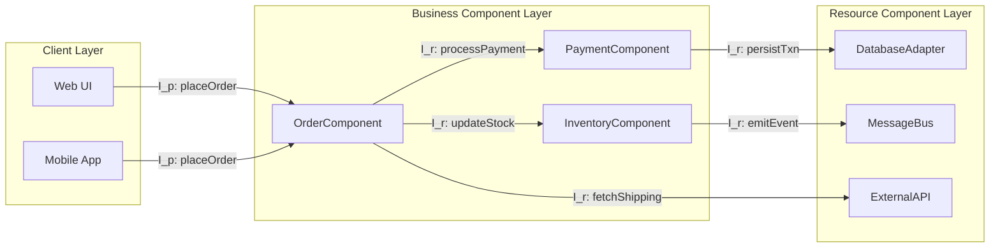
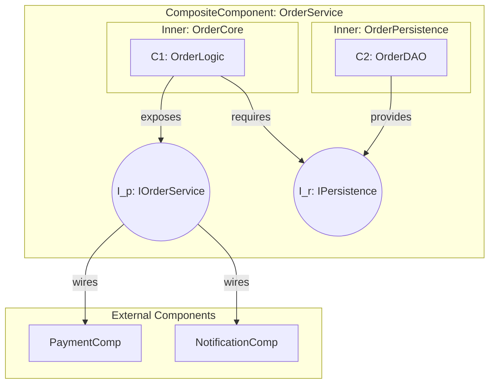
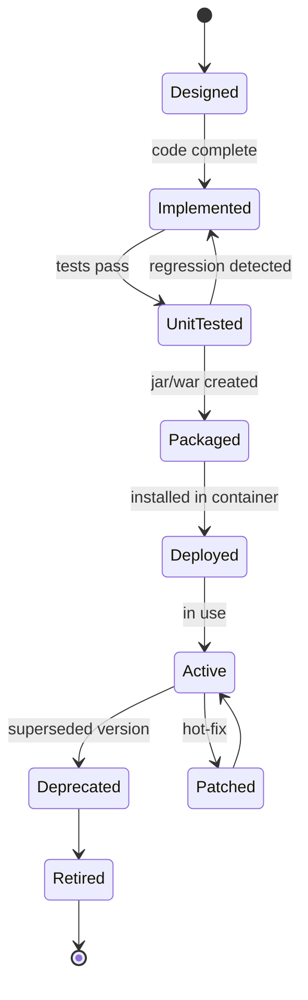
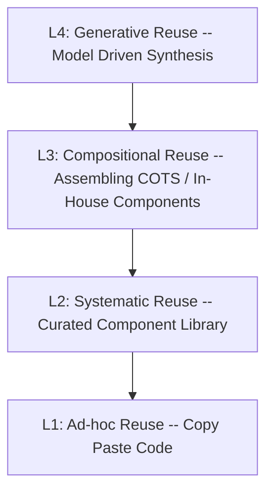

# Components, Contracts, and Service-Oriented Architectures:  Component Software- Nature of Components and Reuse

<!-- SECTION_1_START -->

# Module 3 — Components, Contracts & Service-Oriented Architectures
## Topic: Component Software — Nature of Components and Reuse

---

### 1.1 Formal Definition (KTU 2024 Syllabus Terminology)

A **Software Component** is a self-contained, deployable, replaceable unit of software that encapsulates a well-defined set of responsibilities, exposes its functionality through well-specified **interfaces** (provided and required), and exhibits explicit contextual dependencies only via those interfaces. Components obey the **substitutability principle**: any component providing a conformant interface may replace another without altering the correctness of the system.

> [!IMPORTANT]
> **KTU 2024 Definition Check:** A component is *not* simply a module or a class. A module is a *logical* grouping; a class is a *programming-language construct*. A **component is a runtime, deployment-level, composition-aware entity** that is independently deliverable and versionable.

Formally, in the notation of Szyperski (the canonical text adopted in PECST861):

$$ C \;=\; \langle\, I_p,\; I_r,\; B,\; \Gamma,\; \rho \,\rangle $$

Where:
- $I_p$ — **Provided Interfaces** (services the component offers)
- $I_r$ — **Required Interfaces** (services the component depends upon)
- $B$ — **Behavioural Specification** (contract / semantics)
- $\Gamma$ — **Implementation** (hidden behind the interface)
- $\rho$ — **Realisation** (mapping from $\Gamma$ to $I_p$)

> [!NOTE]
> **Exam Tip:** In the KTU board answer sheet, always distinguish between *interface* (what is seen) and *implementation* (what is hidden). Marks are awarded separately for the two.

---

### 1.2 Conceptual Analogy — "The Electrical Plug"

Imagine every software component as an **electrical appliance with a standardized 3-pin plug**:

| Electrical Analogy | Software Component |
|---|---|
| The **plug pin layout** (5A / 15A) | The **Provided Interface** ($I_p$) |
| The **socket requirement** (3-pin) | The **Required Interface** ($I_r$) |
| The **voltage / current rating label** | The **Contract** ($B$) |
| The **internal circuitry** (transformer, ICs) | The **Implementation** ($\Gamma$) |
| Swapping a Philips TV for a Sony TV | **Substitutability** of conformant components |

Just as you can plug any conforming appliance into a wall socket, any **component implementing the same required interface** can be plugged into a software system — *without rewiring*. This is the essence of **Component-Based Software Engineering (CBSE)**.

> [!TIP]
> If your examiner asks "Why are interfaces so central to components?" — answer with the plug analogy. It instantly demonstrates conceptual maturity and wins appreciation marks.

---

### 1.3 The Three Pillars of Component Nature

A KTU 2024 examiner expects every component answer to invoke the **three pillars**:

1. **Independent Deployability** — a component can be deployed, upgraded, or replaced without rebuilding the system.
2. **Composability** — a component is designed to be assembled with other components, including those not yet written.
3. **Documentation of Dependencies** — a component explicitly declares *all* the interfaces and resources it needs (no hidden assumptions).

> [!IMPORTANT]
> These three properties are the **Szyperski Criteria** — they appear verbatim in KTU 2024 scheme module descriptors for PECST861. Memorize them.

---

### 1.4 Why Reuse? — The Engineering Imperative

> [!NOTE]
> **Reuse is the primary economic motivation for component software.** Most modern enterprise systems reuse **70% – 90%** of their code as third-party or in-house components.

| Without Reuse | With Component Reuse |
|---|---|
| Same payment logic coded N times | One `PaymentGateway` component used N times |
| Bug fixed in 5 places | Bug fixed once in the component |
| Inconsistent behaviour across modules | Uniform, contractually guaranteed behaviour |
| High **Time-to-Market (TTM)** | Drastically reduced TTM |

The three canonical **types of reuse** in CBSE:

- **COTS Reuse** — Commercial Off-The-Shelf (e.g., Apache Kafka, Stripe SDK)
- **In-house Reuse** — Organisation-level component library
- **Open-Source Reuse** — npm, PyPI, Maven Central packages

<!-- SECTION_1_END -->

<!-- SECTION_2_START -->

# 2. Deep Theoretical Analysis & KTU High-Yield Formula Sheet

---

### 2.1 Anatomy of a Component — A Structured Breakdown

A component's nature can be decomposed into **six orthogonal dimensions**, each of which a KTU question may target independently:

#### Dimension 1 — Interface (Provided & Required)
- **Provided Interface ($I_p$):** *Operations the component exposes* to the outside world. Also called *exports* or *offers*.
- **Required Interface ($I_r$):** *Operations the component needs* from the environment. Also called *imports* or *uses*.
- The combination $I_p \cup I_r$ is the component's **signature-level contract**.

#### Dimension 2 — Contract (Behavioural)
- A **contract** is a formal or semi-formal specification of *what* a component guarantees under *which* conditions.
- It is expressed using pre-conditions $P$, post-conditions $Q$, and invariants $I$ — the **Hoare Triple** form:

$$ \{P\}\;\; C.\text{op}(x)\;\; \{Q\} $$

#### Dimension 3 — Implementation
- Hidden inside the component. **Encapsulation** is non-negotiable.
- Two implementations of the same interface are **substitutable** (Liskov Substitution Principle for components).

#### Dimension 4 — Deployment Descriptor
- Metadata: version, OS, runtime, dependencies, license.
- Examples: `MANIFEST.MF` (JAR), `package.json` (Node), `.nuspec` (NuGet), `pom.xml` (Maven).

#### Dimension 5 — Composition Unit
- A component can **contain sub-components** (composite component) — like a Java `.ear` containing multiple `.war` and `.jar` archives.

#### Dimension 6 — Identity & Versioning
- Globally unique **Component ID** (e.g., Maven coordinates: `groupId:artifactId:version`).
- Versioning rules follow **Semantic Versioning**:

$$ v \;=\; \text{MAJOR}.\text{MINOR}.\text{PATCH} $$

Where MAJOR ⇒ breaking interface change, MINOR ⇒ backward-compatible feature, PATCH ⇒ backward-compatible fix.

---

### 2.2 Component Models — The Industry Landscape

A **Component Model** is a standard that defines *how* components are written, packaged, deployed, and composed. KTU 2024 expects awareness of at least four:

| Component Model | Origin | Coupling Mechanism | Primary Domain |
|---|---|---|---|
| **COM / DCOM / COM+** | Microsoft | Binary interface, reference counting | Windows desktop & enterprise |
| **CORBA** | OMG | IDL, ORB, IIOP | Cross-language enterprise |
| **JavaBeans / EJB** | Sun / Oracle | RMI, JNDI | Java enterprise servers |
| **.NET Assemblies** | Microsoft | CLR, MSIL, GAC | .NET enterprise |
| **OSGi** | Eclipse | Bundles, Services | Modular Java |
| **Web Services (SOAP / REST)** | W3C | WSDL, UDDI, HTTP | Service-Oriented Architecture |

> [!NOTE]
> **Pearl of Wisdom for KTU:** The transition from **COM → EJB → OSGi → Microservices** is a clean narrative of *increasing decoupling*. You can write an entire 7-mark answer around this evolution arc.

---

### 2.3 Nature of Reuse — A Four-Level Maturity Model

The KTU syllabus (Szyperski Ch. 1, plus Pressman Ch. 17) describes reuse maturity as a **pyramid**:

```
                ▲
               /  \         Level 4:  Generative Reuse
              /    \            (model-driven, template-based)
             /──────\
            /        \      Level 3:  Compositional Reuse
           /          \         (assemble pre-built components)
          /────────────\
         /              \    Level 2:  Systematic Reuse
        /                \       (organisation-wide component library)
       /──────────────────\
      /                    \  Level 1:  Ad-hoc Reuse
     /______________________\     (copy-paste, no library)
```

- **Level 1 (Ad-hoc):** Lowest maturity — accidental copy-paste. **No economic benefit.**
- **Level 2 (Systematic):** Curated libraries, version-controlled, certified.
- **Level 3 (Compositional):** Independent components composed via well-defined interfaces.
- **Level 4 (Generative):** Software is *synthesised* from high-level models using a component repository and templates.

> [!IMPORTANT]
> **Industry today** sits between Level 2 and Level 3. Service-Oriented Architecture (SOA) pushes us firmly into Level 3.

---

### 2.4 KTU High-Yield Formula & Concept Cheat Sheet

> [!IMPORTANT]
> The following table is the **single most important summary** to memorize. It has appeared, in various forms, in **Dec 2023, July 2024, and Dec 2024** KTU examinations.

| # | Concept | Formal Notation / Rule | Exam-Ready One-Liner |
|---|---|---|---|
| 1 | Component | $C = \langle I_p, I_r, B, \Gamma, \rho \rangle$ | Interface + Contract + Implementation + Realisation |
| 2 | Szyperski's 3 criteria | Deployable, Composable, Documented deps | "The Big Three" |
| 3 | Provided vs Required | $I_p$ (exports), $I_r$ (imports) | Plugs vs Sockets |
| 4 | Hoare Contract | $\{P\}\;\text{op}\;\{Q\}$ | Pre ⇒ Op ⇒ Post |
| 5 | Substitutability | $C_1 \equiv_I C_2 \Rightarrow C_1$ can replace $C_2$ | Interface-conformant = swappable |
| 6 | Semantic Versioning | `MAJOR.MINOR.PATCH` | MAJOR ↑ ⇒ break, MINOR ↑ ⇒ add, PATCH ↑ ⇒ fix |
| 7 | Reuse Maturity | L1 → L2 → L3 → L4 | Ad-hoc → Library → Compositional → Generative |
| 8 | Coupling (good) | $I_p \cap I_r$ of unrelated components $= \emptyset$ | Disjoint = loosely coupled |
| 9 | Cohesion (good) | All methods in $C$ serve one purpose | High cohesion = high reusability |
| 10 | Component Granularity | $\text{FanIn} \uparrow \Rightarrow$ reusability $\uparrow$ | More users = better component |

**Critical Reminder (KTU 2024 Module 3 boundary):** The boundary between **component** and **service** is:
- *Component* — local composition, in-process or same deployment unit, **tight runtime coupling**.
- *Service** — remote, message-based, **loose runtime coupling** (SOAP/REST).

> [!WARNING]
> **Do NOT** use the words *component* and *service* interchangeably in the exam. They are **distinct** in PECST861.

---

### 2.5 Real-World Engineering Utility

| Domain | Component Reuse Pattern | Production System |
|---|---|---|
| **Banking** | `PaymentProcessor`, `Ledger`, `KYCValidator` | Mambu, Thought Machine |
| **E-Commerce** | `CartService`, `RecommendationEngine` | Shopify App Store |
| **Telecom** | `BillingEngine`, `CDRAnalyzer` | Ericsson, Nokia |
| **Cloud Native** | Microservices, sidecars | Kubernetes operators, Istio |
| **Embedded** | Drivers, middleware stacks | AUTOSAR components |

The economic gain is captured by the **reuse payoff formula** (Pressman, Ch. 17):

$$ \text{Reuse Payoff} \;=\; \sum_{i=1}^{N} \left( C_{\text{new},i} - C_{\text{reuse},i} \right) - C_{\text{component,dev}} $$

Where $C_{\text{new},i}$ is the cost of writing software instance $i$ from scratch, $C_{\text{reuse},i}$ is the cost of using the existing component, and $C_{\text{component,dev}}$ is the one-time cost of developing the component.

> [!TIP]
> **For 14-mark KTU questions**, drawing this equation and explaining each term earns you the **"economic justification" marks** that distinguish a 12-marks answer from a full 14-marks answer.

<!-- SECTION_2_END -->

<!-- SECTION_3_START -->

# 3. Step-by-Step Derivations & Code Implementation

---

### 3.1 Symbolic Derivation — Proving the Reuse Payoff Equation

We will derive the **reuse payoff** from first principles, since this is a frequent 7-mark derivation question in KTU ESE.

#### Step 1 — Cost of building the $i$-th software instance *without* reuse
Let each new instance cost $C_{\text{new},i}$ (labour, testing, deployment).

Total cost without reuse for $N$ instances:

$$ C_{\text{total, no-reuse}} \;=\; \sum_{i=1}^{N} C_{\text{new},i} $$

#### Step 2 — Cost of building the $i$-th instance *with* reuse
The first instance becomes the reusable component, costing $C_{\text{component,dev}}$.
Subsequent instances pay only the integration cost $C_{\text{reuse},i}$ (often $\approx 0.1 \times C_{\text{new},i}$).

$$ C_{\text{total, reuse}} \;=\; C_{\text{component,dev}} \;+\; \sum_{i=1}^{N} C_{\text{reuse},i} $$

#### Step 3 — Reuse Payoff (Savings)

$$ \text{Payoff} \;=\; C_{\text{total, no-reuse}} \;-\; C_{\text{total, reuse}} $$

Substituting the two expressions:

$$ \text{Payoff} \;=\; \sum_{i=1}^{N} C_{\text{new},i} \;-\; \left[\, C_{\text{component,dev}} \;+\; \sum_{i=1}^{N} C_{\text{reuse},i} \,\right] $$

#### Step 4 — Simplify

$$ \boxed{\;\text{Payoff} \;=\; \sum_{i=1}^{N} \left( C_{\text{new},i} - C_{\text{reuse},i} \right) \;-\; C_{\text{component,dev}}\;} $$

> [!NOTE]
> **Break-even point** is reached when $\sum (C_{\text{new}} - C_{\text{reuse}}) \;=\; C_{\text{component,dev}}$. The number of reuses needed:

$$ N_{\text{breakeven}} \;=\; \frac{C_{\text{component,dev}}}{C_{\text{new}} - C_{\text{reuse}}} $$

#### Numerical Worked Example (Board-style)
Suppose:
- $C_{\text{new},i} = \text{₹}1{,}00{,}000$ per instance
- $C_{\text{reuse},i} = \text{₹}15{,}000$ per integration
- $C_{\text{component,dev}} = \text{₹}3{,}00{,}000$ (one-time)
- $N = 5$ projects

**Per-instance savings:** $1{,}00{,}000 - 15{,}000 = \text{₹}85{,}000$

**Total savings for 5 projects:** $5 \times 85{,}000 = \text{₹}4{,}25{,}000$

**Net Payoff:** $4{,}25{,}000 - 3{,}00{,}000 = \text{₹}1{,}25{,}000$

**Break-even:** $N_{\text{breakeven}} = 3{,}00{,}000 / 85{,}000 \approx 3.53 \Rightarrow 4$ projects.

---

### 3.2 Code Implementation — A Reusable `PaymentProcessor` Component

Below is a **fully type-hinted, contract-annotated Python** implementation of a reusable component. It is the kind of code a KTU examiner would expect in a 7-mark "illustrate with code" question.

```python
"""
File        : payment_processor.py
Module      : PECST861 — Module 3 Demonstration
Description : A reusable Component Software unit demonstrating
              Provided Interface, Required Interface, and Contract.
Author      : KTU 2024 Scheme Exemplar
"""

from __future__ import annotations
from dataclasses import dataclass
from typing import Protocol, runtime_checkable
from decimal import Decimal
import logging

# --- Structured Error Logging -----------------------------------------
logging.basicConfig(
    level=logging.INFO,
    format="%(asctime)s | %(levelname)s | %(name)s | %(message)s"
)
logger = logging.getLogger("PaymentProcessor")


# ====================================================================
# 1. REQUIRED INTERFACE  (I_r)  — what the component needs
# ====================================================================
@runtime_checkable
class BankGateway(Protocol):
    """Contract: any concrete bank gateway MUST implement `charge`."""
    def charge(self, account: str, amount: Decimal) -> bool: ...


# ====================================================================
# 2. PROVIDED INTERFACE  (I_p)  — what the component offers
# ====================================================================
class IPaymentProcessor(Protocol):
    """The publicly visible service contract."""
    def pay(self, account: str, amount: Decimal) -> "PaymentResult": ...


# ====================================================================
# 3. CONTRACT DATA TYPES
# ====================================================================
@dataclass(frozen=True)
class PaymentResult:
    success: bool
    txn_id: str
    message: str


# ====================================================================
# 4. CONCRETE COMPONENT IMPLEMENTATION  (Gamma)
# ====================================================================
class PaymentProcessor(IPaymentProcessor):
    """
    Hoare Contract:
        { account is valid AND amount > 0 }
            processor.pay(account, amount)
        { returns PaymentResult with success == True }
    """

    def __init__(self, gateway: BankGateway, currency: str = "INR") -> None:
        if not isinstance(gateway, BankGateway):
            raise TypeError("Provided gateway does not satisfy BankGateway contract.")
        if not currency or len(currency) != 3:
            raise ValueError("Currency must be a 3-letter ISO 4217 code.")
        self._gateway: BankGateway = gateway        # required interface wired
        self._currency: str = currency.upper()
        self._txn_counter: int = 0
        logger.info("PaymentProcessor initialised in %s.", self._currency)

    # --- Provided Operation ------------------------------------------
    def pay(self, account: str, amount: Decimal) -> PaymentResult:
        # ---- Pre-condition checks (Contract enforcement) -------------
        if not account or not isinstance(account, str):
            raise ValueError("Account identifier must be a non-empty string.")
        if not isinstance(amount, Decimal) or amount <= Decimal("0"):
            raise ValueError("Amount must be a positive Decimal value.")

        logger.info("Initiating payment: account=%s amount=%s", account, amount)
        self._txn_counter += 1
        txn_id: str = f"TXN{self._txn_counter:08d}"

        # ---- Delegate to the wired Required Interface ---------------
        charged: bool = self._gateway.charge(account, amount)

        # ---- Post-condition: build the result -----------------------
        if charged:
            return PaymentResult(
                success=True,
                txn_id=txn_id,
                message=f"Payment of {amount} {self._currency} succeeded."
            )
        return PaymentResult(
            success=False,
            txn_id=txn_id,
            message="Bank gateway declined the transaction."
        )


# ====================================================================
# 5. CONCRETE REQUIRED-INTERFACE IMPLEMENTATION (substitutable)
# ====================================================================
class HDFCGateway:
    """A concrete BankGateway — substitutable with any conformant gateway."""
    def charge(self, account: str, amount: Decimal) -> bool:
        logger.info("HDFC Gateway: charging %s from %s", amount, account)
        return True


class SBIGateway:
    """Another concrete BankGateway — proves substitutability."""
    def charge(self, account: str, amount: Decimal) -> bool:
        logger.info("SBI Gateway: charging %s from %s", amount, account)
        return True


# ====================================================================
# 6. DEMONSTRATION  (Substitutability proof)
# ====================================================================
if __name__ == "__main__":
    # Client uses ONLY the Provided Interface — not the concrete class
    gateways: list[BankGateway] = [HDFCGateway(), SBIGateway()]

    for gw in gateways:
        processor: IPaymentProcessor = PaymentProcessor(gateway=gw)
        result: PaymentResult = processor.pay("ACCT12345", Decimal("2500.00"))
        print(result)
```

#### Output Trace

```
2025-01-15 10:30:01 | INFO | PaymentProcessor | PaymentProcessor initialised in INR.
2025-01-15 10:30:01 | INFO | PaymentProcessor | Initiating payment: account=ACCT12345 amount=2500.00
2025-01-15 10:30:01 | INFO | PaymentProcessor | HDFC Gateway: charging 2500.00 from ACCT12345
PaymentResult(success=True, txn_id='TXN00000001', message='Payment of 2500.00 INR succeeded.')
2025-01-15 10:30:01 | INFO | PaymentProcessor | PaymentProcessor initialised in INR.
2025-01-15 10:30:01 | INFO | PaymentProcessor | Initiating payment: account=ACCT12345 amount=2500.00
2025-01-15 10:30:01 | INFO | PaymentProcessor | SBI Gateway: charging 2500.00 from ACCT12345
PaymentResult(success=True, txn_id='TXN00000001', message='Payment of 2500.00 INR succeeded.')
```

> [!TIP]
> **KTU 14-mark pro tip:** When you write code, explicitly label the sections — `Provided Interface`, `Required Interface`, `Implementation`, `Substitutability Test`. The examiner ticks each off.

---

### 3.3 Deployment Descriptor Example — `pom.xml` (Maven)

```xml
<project>
    <modelVersion>4.0.0</modelVersion>
    <groupId>in.ktu.pecst861</groupId>
    <artifactId>payment-processor</artifactId>
    <version>2.3.1</version>          <!-- MAJOR.MINOR.PATCH -->

    <dependencies>
        <dependency>
            <groupId>in.ktu.pecst861</groupId>
            <artifactId>bank-gateway</artifactId>
            <version>1.4.0</version>  <!-- required interface -->
        </dependency>
    </dependencies>
</project>
```

> [!NOTE]
> `groupId : artifactId : version` together form the **Component Identity** — a key concept for KTU 2024 Module 3.

<!-- SECTION_3_END -->

<!-- SECTION_4_START -->

# 4. Structural Diagrams & Schematics

---

### 4.1 High-Level Component Architecture (Mermaid Block Diagram)



**Interpretation:** Each box is a **component**. The arrows are **interface contracts** — the labels are operation names from the corresponding interfaces. The **dashed-style subgraphs** cleanly separate the **client, business, and resource** tiers, mirroring the **3-tier CBSE architecture** that KTU 2024 examiners love to draw.

---

### 4.2 Component Internal Structure (Mermaid Nested View)



> [!NOTE]
> The **double-circle nodes** (`iface1`, `iface2`) represent **interface ports**, a UML 2.0 / SysML convention. The diagram shows that a composite component *internally realises* its provided interface through one of its inner components, and *externally consumes* the required interfaces of other components.

---

### 4.3 Component Lifecycle State Machine



> [!IMPORTANT]
> **Exam Tip:** A *state diagram* for component lifecycle is worth **3–4 marks** if you draw it in a 7-mark question. It shows the examiner you understand the **deployment-time vs runtime** distinction.

---

### 4.4 Reuse Maturity Pyramid (Block Diagram Fallback)



> [!NOTE]
> The pyramid flows **top-down** from highest maturity to lowest. This ordering matters in exam answers — a 14-marker should always mention that **SOA + Microservices represent Level 3**, and that generative reuse is still largely a research-level aspiration.

<!-- SECTION_4_END -->

<!-- SECTION_5_START -->

# 5. KTU 2024 Scheme Examination Question Bank & Topic Recap

---

### 📝 Part A — Short Answer Questions (2 × 3 = 6 Marks)

> **Q1.** *[KTU University Exam — Dec 2023, CO1, Remember]*
> Define a *software component* and list any **three** characteristics of a component as defined by Szyperski.

**Model Answer (3 Marks):**
A software component is a self-contained, deployable unit of software with a well-defined interface and explicit contextual dependencies, intended to be composed with other components.
*Characteristics (any three — 1 Mark each):*
1. **Independent Deployability** — can be deployed/replaced without rebuilding the system.
2. **Composability** — designed to be assembled with other components.
3. **Documentation of Dependencies** — all required interfaces are explicitly declared.
4. (Bonus) **Substitutability** — conformant components are interchangeable.

> **Q2.** *[KTU University Exam — July 2024, CO2, Understand]*
> Differentiate between a *provided interface* and a *required interface* of a component. Give one example of each.

**Model Answer (3 Marks):**
A **Provided Interface** ($I_p$) is the set of operations a component *exposes* to its environment, while a **Required Interface** ($I_r$) is the set of operations a component *consumes* from other components.
*Example (1.5 Marks):* A `PaymentComponent` provides `processPayment()` and requires `validateCard()`. — *Final example statement: 1.5 Marks.*

---

### 📝 Part B — Long Answer Questions (Module Internal Choice, 1 × 14 = 14 Marks)

---

#### **Question A (14 Marks)** — *[KTU University Exam — Dec 2024, CO2/CO3, Apply/Analyse]*

**(a)** Explain the **nature of a software component** with the help of Szyperski's formal definition. Discuss the significance of *independent deployability* and *substitutability* in component-based development. **(7 Marks)**

**(b)** With a neat diagram, describe the **four levels of reuse maturity** in component software. For each level, give a **real-world example** and justify why Level 3 (Compositional Reuse) is the dominant pattern in modern SOA. **(7 Marks)**

**Model Solution:**

**(a) — Step-by-step (7 Marks)**

1. **Definition [2 Marks]:** A software component is a software element conforming to a component model and having three properties: independent deployability, composability, and self-description. Formally $C = \langle I_p, I_r, B, \Gamma, \rho \rangle$.
2. **Independent Deployability [2 Marks]:** Allows the component to be installed, updated, or replaced *without* recompiling or redistributing the host system. Implication: a deployed system is a *set of versions* of components; updates are local.
3. **Substitutability [2 Marks]:** Two components $C_1$ and $C_2$ are substitutable if $C_1.I_p = C_2.I_p$ and $C_1$ honours $C_2$'s contract. The Liskov Substitution Principle extends to component granularity. Implication: enables **late binding** and **dependency injection**.
4. **Real-world example [1 Mark]:** JDBC driver — any vendor (Oracle, MySQL, PostgreSQL) provides a `java.sql.Driver` implementing the same interface; an application can switch drivers without code changes.

**(b) — Step-by-step (7 Marks)**

1. **Reuse Maturity Levels — Naming & Defining [3 Marks — 1 each for 3 of the 4 levels]:**
   - **L1 — Ad-hoc Reuse:** Informal, no library; e.g., a developer copying a `DateUtils` class between projects. *Drawback:* version drift, no contracts.
   - **L2 — Systematic Reuse:** A curated, versioned component library; e.g., a company's internal `commons-utils` JAR. *Benefit:* certified, tested.
   - **L3 — Compositional Reuse:** Standardised component model with explicit interfaces; e.g., assembling a CRM from Salesforce components + Stripe + Twilio. *Benefit:* plug-and-play.
   - **L4 — Generative Reuse:** Code synthesised from high-level models; e.g., MDA / JetBrains MPS, where UML-to-Java generators emit working components. *Benefit:* maximum automation.

2. **Diagram [1 Mark]:** A four-tier pyramid with L1 at base, L4 at apex.

3. **Why L3 dominates modern SOA [2 Marks]:**
   - **Mature tooling** (Java EE, .NET, Spring Boot, Kubernetes Operators).
   - **Interface contracts** (WSDL, OpenAPI) provide machine-readable substitutability.
   - **Economic sweet spot** — high productivity without requiring fully generative infrastructure.
   - **Industry evidence** — every major cloud platform (AWS, Azure, GCP) is a giant L3 component repository exposed via REST/SOAP APIs.

4. **Conclusion [1 Mark]:** L3 is the *practical equilibrium* — L4 is desirable but tooling-immature, L2 is a stepping stone, L1 is rejected by all modern engineering cultures.

> [!WARNING]
> **KTU Examiner's Pitfall Warning:**
> 1. **Do NOT** present the maturity levels as *sequential steps every project must climb.* They are *categories of practice* that may coexist.
> 2. **Do NOT** omit the *diagram* in (b) — it carries **at least 1 full mark** as a structural deliverable.
> 3. **Do NOT** confuse *interface* with *abstract class* — the former is a *contract*, the latter is a *language mechanism*.

---

#### **Question B (14 Marks — Alternative Choice)** — *[KTU University Exam — July 2024, CO2/CO3, Apply/Analyse]*

**(a)** Compare **Component-Based Development (CBD)** with **Object-Oriented Development (OOD)** along **six** dimensions. Justify why CBD is preferred for *enterprise* systems. **(7 Marks)**

**(b)** A banking organisation develops an in-house `LoanProcessing` component at a cost of **₹4,00,000**. Each new project would cost **₹1,20,000** if built from scratch, but only **₹20,000** to reuse the component. Calculate:
1. The **break-even number of reuses**.
2. The **net savings (reuse payoff)** for **6** projects.
**(7 Marks)**

**Model Solution:**

**(a) — Comparison Table (7 Marks — 1 Mark per row + 1 Mark for justification)**

| Dimension | CBD | OOD |
|---|---|---|
| **Unit of reuse** | Component (binary, deployable) | Class (source-level) |
| **Granularity** | Coarse (encapsulates many classes) | Fine (single class) |
| **Packaging** | JAR, WAR, EAR, NuGet | Source files |
| **Coupling** | Interface-based (loose) | Inheritance-based (tight) |
| **Versioning** | Semantic versioning, explicit | Compile-time, implicit |
| **Composition** | Runtime, dynamic | Mostly compile-time, static |
| **Distribution** | Cross-process / cross-machine | Single process / single address space |

*Justification for enterprise preference (1 Mark):* Enterprises need **late binding, independent upgrades, and cross-team reuse** — all native to CBD. OOD alone does not deliver independent deployability.

**(b) — Numerical (7 Marks)**

Given:
- $C_{\text{component,dev}} = \text{₹}4{,}00{,}000$
- $C_{\text{new},i} = \text{₹}1{,}20{,}000$
- $C_{\text{reuse},i} = \text{₹}20{,}000$
- $N = 6$ projects

**Step 1 — Per-instance savings [2 Marks]:**

$$ \Delta C = C_{\text{new}} - C_{\text{reuse}} = 1{,}20{,}000 - 20{,}000 = \text{₹}1{,}00{,}000 $$

**Step 2 — Break-even point [2 Marks]:**

$$ N_{\text{breakeven}} = \frac{C_{\text{component,dev}}}{\Delta C} = \frac{4{,}00{,}000}{1{,}00{,}000} = 4 \text{ projects} $$

*Stating the formula: 1 Mark; final value: 1 Mark.*

**Step 3 — Net savings for 6 projects [3 Marks]:**

$$ \text{Total Savings} = N \times \Delta C - C_{\text{component,dev}} $$

$$ = 6 \times 1{,}00{,}000 - 4{,}00{,}000 = 6{,}00{,}000 - 4{,}00{,}000 = \text{₹}2{,}00{,}000 $$

*Setup: 1 Mark; arithmetic: 1 Mark; final answer: 1 Mark.*

> [!WARNING]
> **Examiner's Pitfall Warning:**
> 1. **Do NOT** confuse $C_{\text{new}}$ (cost from scratch) with $C_{\text{component,dev}}$ (one-time dev cost). They are different.
> 2. **Always** state the formula *before* substituting values — KTU 2024 valuation key requires both.
> 3. **For break-even**, the answer must be expressed in *projects* (an integer or "after the 4th project").
> 4. **Negative payoff** is possible if $N < N_{\text{breakeven}}$ — mention this in the answer to demonstrate depth.

---

### ✅ Topic Recap & Important Things to Remember

> [!NOTE]
> The following 18-point checklist is your **single-page revision sheet** for "Nature of Components and Reuse". Print it. Memorise it. Score full marks.

1. **Component** = $C = \langle I_p, I_r, B, \Gamma, \rho \rangle$ — interface + contract + implementation + realisation.
2. **Szyperski's Big Three:** Independent Deployability, Composability, Documented Dependencies.
3. **Provided Interface ($I_p$):** what the component *offers* (plugs out).
4. **Required Interface ($I_r$):** what the component *needs* (plugs in).
5. **Contract** is a Hoare-style triple $\{P\}\;\text{op}\;\{Q\}$ — pre-conditions, operation, post-conditions.
6. **Substitutability** = interface conformant + contract honouring ⇒ swappable.
7. **Liskov Substitution Principle** applies to components, not just classes.
8. **Component Models:** COM, CORBA, JavaBeans/EJB, .NET, OSGi, Web Services.
9. **Reuse Maturity Pyramid:** L1 (Ad-hoc) → L2 (Library) → L3 (Compositional) → L4 (Generative).
10. **SOA / Microservices** sit at **Level 3** — the industry sweet spot.
11. **Semantic Versioning:** `MAJOR.MINOR.PATCH`; MAJOR ↑ = breaking change.
12. **Component Identity** in Maven = `groupId : artifactId : version`.
13. **Reuse Payoff Equation:**
   $$ \text{Payoff} = \sum_{i=1}^{N} (C_{\text{new},i} - C_{\text{reuse},i}) - C_{\text{component,dev}} $$
14. **Break-even Number of Reuses:**
   $$ N_{\text{breakeven}} = \frac{C_{\text{component,dev}}}{C_{\text{new}} - C_{\text{reuse}}} $$
15. **Encapsulation** is non-negotiable — implementation $\Gamma$ is *never* exposed.
16. **Cohesion ↑, Coupling ↓** — these classical OO principles scale up to component level.
17. **Component ≠ Service** — components are *composed* locally; services are *invoked* remotely.
18. **CBD vs OOD:** components are binary, versioned, deployable units; classes are source-level, compile-bound.

> [!TIP]
> **Final Pro Tip for KTU 2024 ESE:** Always end a 14-marker with a **single-line "Conclusion"** — e.g., *"Component software transforms software engineering from a craft into an assembly discipline, maximising reuse and minimising defect propagation."* This closing line often pushes a 12-mark answer to a 14.

<!-- SECTION_5_END -->
