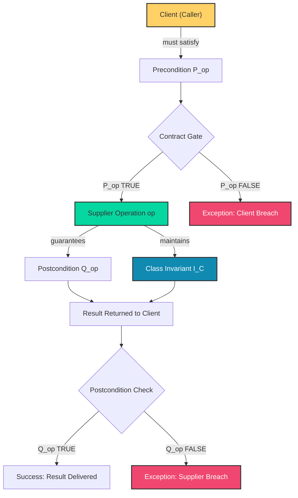
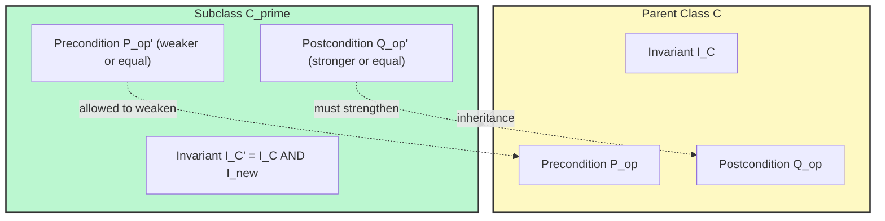
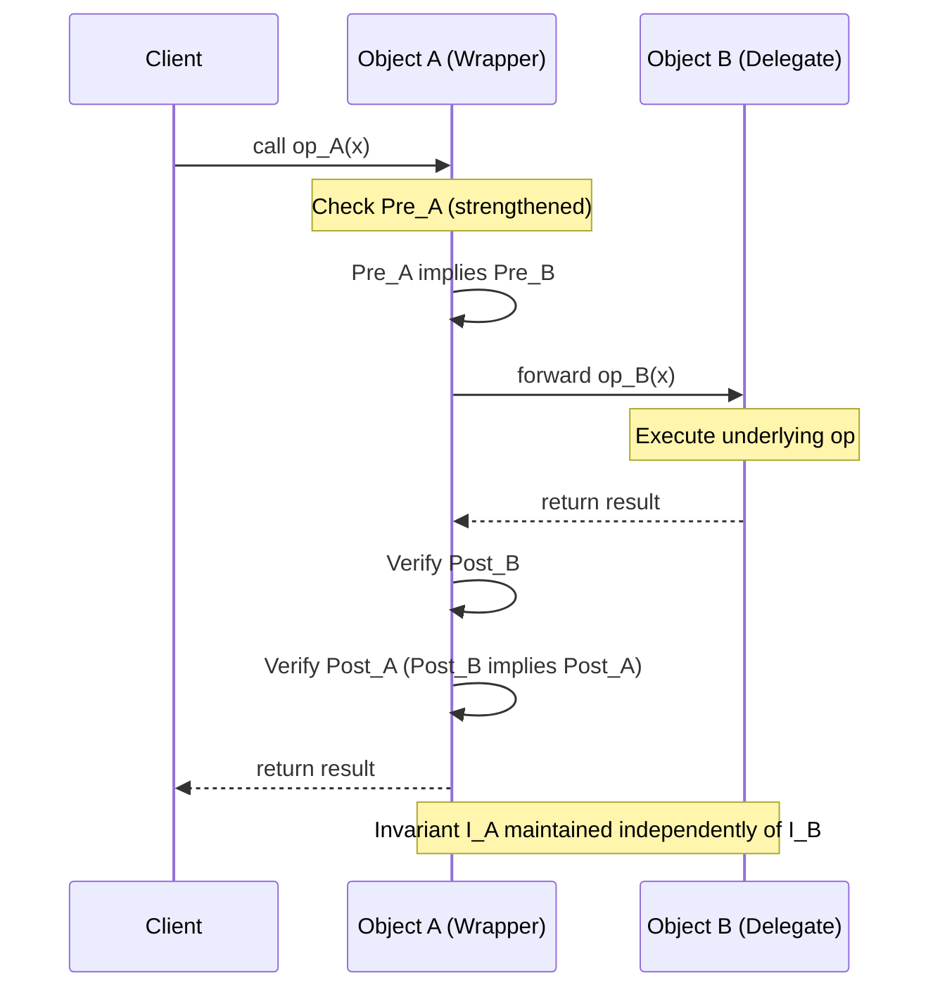
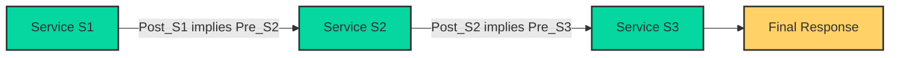
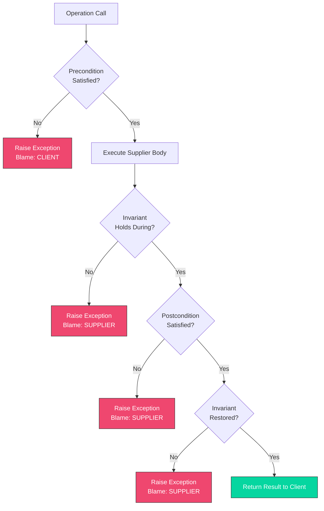
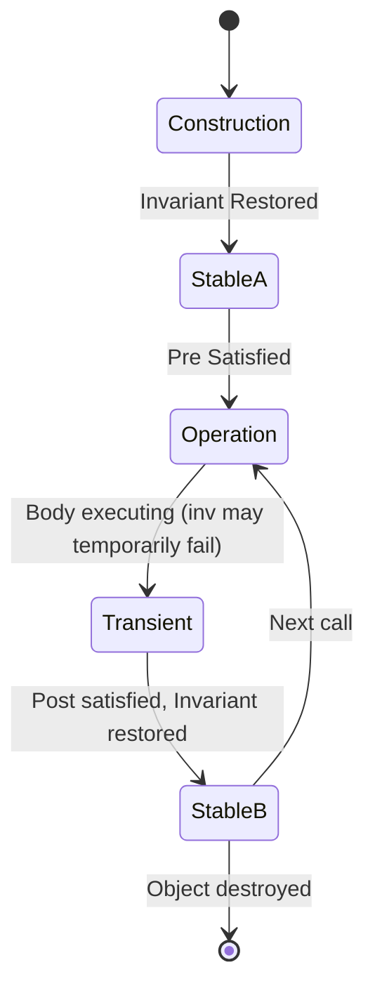

# Design by Contract- Contracts, Polymorphism, Inheritance, and Delegation

<!-- SECTION_1_START -->
# Design by Contract — Contracts, Polymorphism, Inheritance, and Delegation

## 1. Formal Academic Definition (KTU 2024 Syllabus Terminology)

**Design by Contract (DbC)** is a software correctness methodology introduced by **Bertrand Meyer** (1986) as the foundational principle of the Eiffel programming language. It treats the relationship between a client (caller) and a supplier (callee) as a formal, explicit, and verifiable **contract** — analogous to a commercial legal agreement.

In DbC, every software element is bound by a contract specifying:

- **Preconditions** — obligations the **client** must satisfy before invoking an operation.
- **Postconditions** — obligations the **supplier** must satisfy upon completion of the operation.
- **Class Invariants** — conditions that must hold for all instances of a class at all stable (observable) states.

> [!IMPORTANT]
> **Syllabus Highlight (PECST861 / Module 3):**
> A contract is **not** a comment, a documentation snippet, or a defensive check sequence. It is a *binding semantic specification* enforced at the architectural level — and is the cornerstone of *reliable* distributed component design.

---

## 2. Conceptual Analogy & Intuitive Overview

### The Real-World Analogy — The "Bank Loan Contract"

Imagine you walk into a bank to apply for a home loan.

| Banking Concept | DbC Equivalent |
|---|---|
| You must have a salary slip, ID proof, and clean credit history **before** applying | **Precondition** — what the *client* must guarantee |
| The bank must disburse the approved amount within 7 working days **after** approval | **Postcondition** — what the *supplier* must guarantee |
| The bank must hold an RBI license and maintain a minimum capital ratio at **all times** | **Class Invariant** — the *global consistency rule* |

If you fail your precondition (no salary slip), the bank is **not obligated** to give you a loan. If the bank fails its postcondition (no disbursement in 7 days), you have a *breach of contract* and may seek remedy.

**That's exactly how DbC works in code.**

```text
Client  --[satisfies Precondition]-->  Supplier
Supplier --[guarantees Postcondition]-->  Client
Invariant holds before AND after the operation.
```

> [!NOTE]
> **Three Pillars of DbC (Meyer's Triangle):**
> 1. **Precondition** → Client's duty (input validity)
> 2. **Postcondition** → Supplier's duty (output validity)
> 3. **Invariant** → Class-wide global truth (state consistency)

---

## 3. Geometric / State-Transition Intuition

Think of a class instance as moving through a **state space**. The invariant defines a *safe region* (a closed manifold) within this state space.

- **Precondition** = the entry gate of an operation
- **Postcondition** = the exit gate
- **Invariant** = the entire safe envelope

The operation is a **state transition function** $f : S \rightarrow S$ where:

$$f(s_{valid}) \subseteq s_{valid}, \quad \forall s_{valid} \in \text{Invariant Boundary}$$

> [!VISUALIZATION CONTROL]
> **Concept:** Invariant-safe state region with entry/exit gates
> **GeoGebra / Desmos Input Equations:**
> * Circle (Invariant region): $x^2 + y^2 \leq 25$
> * Precondition line (entry gate): $x = -3$
> * Postcondition line (exit gate): $x = +3$
> * Transition arrow: from $(-3, 0)$ to $(+3, 0)$ inside the disc
> **Visual Description:** A circle of radius **5** represents the invariant-safe state manifold. A horizontal arrow enters at $x=-3$ (precondition gate) and exits at $x=+3$ (postcondition gate). Both gates sit *on the boundary* of the disc, meaning the invariant holds at entry and exit.

---

## 4. Why DbC Matters in Modern Software Architecture

> [!TIP]
> In a **Service-Oriented Architecture (SOA)** or **Microservices** environment, components communicate across network boundaries. DbC provides the *semantic guarantee* layer above transport-level SLAs. It answers: *"What does this service absolutely promise — and what does it absolutely require?"*

Key architectural benefits:

- **Failure Localisation** — A breach of contract pinpoints *who* is at fault (client vs supplier).
- **Defensive Programming Elimination** — Replaces ad-hoc `if-then-throw` blocks with formal specs.
- **Documentation-as-Code** — The contract *is* the documentation; it cannot drift.
- **Component Composability** — Two components can be composed if their contracts are *compatible* (post of one $\subseteq$ pre of next).
- **Test Generation** — Contracts drive automatic test case synthesis (e.g., JML, EiffelStudio AutoTest).

---

<!-- SECTION_1_END -->

<!-- SECTION_2_START -->
# Deep Theoretical Analysis — Contracts, Polymorphism, Inheritance, and Delegation

## A. Anatomy of a Contract — The Three Obligations

### A.1 Preconditions

A **precondition** of an operation $op$ is a predicate $P_{op}$ that must evaluate to `true` immediately **before** the operation is invoked.

$$\text{Pre}_{op}(s) = \text{true} \quad \text{[MANDATORY at call site]}$$

**Key Rule (Meyer's Liskov-like constraint):**
The precondition is the **client's responsibility**. The supplier is **never** required to check the precondition under DbC — doing so constitutes *defensive programming* and is considered a code smell.

### A.2 Postconditions

A **postcondition** is a predicate $Q_{op}$ that the supplier must guarantee immediately **after** the operation returns (in the absence of exceptions).

$$\text{Post}_{op}(s_{pre}, s_{post}) = \text{true} \quad \text{[MANDATORY at return]}$$

Postconditions typically describe:
- The **value** returned (`Result = x + y`)
- The **state** of modified attributes (`balance' = balance + credit`)
- The **relationship** between input and output (`sorted'(a) ∧ permutation(a', a)`)

### A.3 Class Invariants

A **class invariant** $I_C$ is a predicate that must hold:
1. At object **construction** completion.
2. **Before and after** every exported operation.
3. *Not necessarily* during the operation's internal execution.

$$I_C(s) = \text{true} \quad \text{[MANDATORY at all stable observation points]}$$

---

## B. Contracts and Polymorphism

### B.1 The Re-entrance Problem

When an operation is **polymorphic** (overridden in subclasses), the contract of the operation must be honoured by **all** overriding versions. This is the *re-affirmation principle*.

Let the parent class be $C$ with operation $op$ having contract $(P_{op}, Q_{op}, I_C)$. Let $C'$ be a subclass overriding $op$ as $op'$. Then:

$$(P_{op'}, Q_{op'}, I_{C'}) \quad \text{must be } \equiv \text{ or stronger than } (P_{op}, Q_{op}, I_C)$$

### B.2 Redefinition Semantics in Eiffel

Eiffel (and DbC-faithful languages) support **feature redefinition** with two strategies:

| Strategy | Precondition | Postcondition | Invariant |
|---|---|---|---|
| **Reaffirming** | $P_{op'} \equiv P_{op}$ | $Q_{op'} \equiv Q_{op}$ | $I_{C'} \equiv I_C$ |
| **Weakening (Pre)** | $P_{op'} \Leftarrow P_{op}$ (weaker) | $Q_{op'} \Rightarrow Q_{op}$ (stronger) | $I_{C'}$ may be $\Rightarrow I_C$ |
| **Strengthening (Post)** | $P_{op'} \Rightarrow P_{op}$ (stronger) | $Q_{op'} \Leftarrow Q_{op}$ (weaker) | **NOT allowed** |

> [!IMPORTANT]
> **Substitutivity Principle (Liskov + Meyer):**
> A subclass may **weaken** preconditions (accept more inputs) and **strengthen** postconditions (guarantee more outputs). It may **never weaken** a postcondition, because that would silently break the client's expectations.

### B.3 Dynamic Binding and Contract Conformance

When a polymorphic call `obj.op(args)` is dispatched at runtime:

1. The **static (declared) type's precondition** is checked at compile time.
2. The **dynamic (actual) type's postcondition** is checked at runtime.
3. If a contract violation occurs, the **closest applicable exception handler** is invoked, attributing blame:
   - Precondition failure → **Client's fault**
   - Postcondition failure → **Supplier's fault**
   - Invariant failure → **Either's fault** (caller or callee, depending on trace)

---

## C. Contracts and Inheritance

### C.1 The Inheritance Hierarchy of Contracts

Each class in an inheritance chain carries its **own** invariant, which is the **conjunction** (logical AND) of all ancestor invariants.

$$I_{C_k} = I_{C_0} \wedge I_{C_1} \wedge \cdots \wedge I_{C_k}$$

where $C_0$ is the root class (often `OBJECT`).

**Interpretation:** A subclass instance is *more constrained* than a parent instance — it must satisfy *all* inherited invariants *plus* its own.

### C.2 Deferred (Abstract) Classes and Contract Specification

In Eiffel, a class may be **deferred** (abstract), declaring a feature with a contract but **no implementation**:

$$\text{class } D \text{ is deferred} \quad \text{feature } op(x: T): U \text{ is deferred} \quad \text{require } P_{op} \quad \text{ensure } Q_{op}$$

A concrete subclass $E$ is **obligated** to provide an implementation that satisfies the inherited contract $(P_{op}, Q_{op})$.

### C.3 The "Open-Closed" Compliance

The Open/Closed Principle (Meyer, 1988) states that classes should be **open for extension** but **closed for modification**. DbC makes this *operational*:

- **Open** → New subclasses can be added with their own implementations.
- **Closed** → The parent's contract is **frozen**; subclasses cannot weaken it.

This eliminates the "fragile base class" problem of conventional OOP.

### C.4 Invariant Inheritance in Code (Conceptual Java/Eiffel hybrid)

```java
// Parent contract
class Account {
    protected double balance;
    
    // INVARIANT: balance >= 0
    public void debit(double amount) {
        // PRECONDITION: amount > 0
        if (amount <= 0) throw new IllegalArgumentException("Client breach");
        
        // POSTCONDITION: balance' = balance - amount
        this.balance -= amount;
        
        // INVARIANT must hold here: balance >= 0
    }
}

class OverdraftAccount extends Account {
    // Weaker invariant allowed: balance >= -limit
    private double limit;
    
    @Override
    public void debit(double amount) {
        if (amount <= 0) throw new IllegalArgumentException("Client breach");
        this.balance -= amount;  // may go negative
        // STRONGER postcondition implied: balance' = balance - amount
    }
}
```

---

## D. Contracts and Delegation

### D.1 What is Delegation?

**Delegation** is a design technique where an object $A$ forwards (delegates) a request to another object $B$ (the delegate), rather than inheriting from $B$. $A$ is the **forwarder** or **wrapper**; $B$ is the **delegate**.

$$\text{Delegation} = \text{Composition} + \text{Forwarding with self-identity preservation}$$

### D.2 Delegation vs Inheritance — A DbC Perspective

| Dimension | Inheritance | Delegation |
|---|---|---|
| **Coupling** | White-box (subclass knows parent's internals) | Black-box (forwarder knows only delegate's interface) |
| **Reusability** | Limited to one parent per class | Multiple delegates per wrapper |
| **Runtime flexibility** | Static binding (or vtable dispatch) | Dynamic — delegate can be swapped at runtime |
| **Contract propagation** | Inherited automatically | Must be **re-affirmed** explicitly |
| **State ownership** | Shared with parent | Owned by delegate (wrapper holds reference) |

### D.3 Contract Composition in Delegation

When object $A$ delegates to object $B$:

1. **Precondition forwarding rule:** $A$ may *strengthen* the precondition (require more) but must *not weaken* it, because clients of $A$ only know $A$'s contract.
2. **Postcondition enforcement rule:** $A$ must *guarantee* its declared postcondition, which implies invoking $B$ and *re-checking* $B$'s postcondition.
3. **Invariant responsibility:** $A$'s invariant $\neq B$'s invariant; $A$ must maintain **its own** invariant independently.

**Mathematical Formulation of Delegation Contract:**

$$\text{Pre}_A \Rightarrow \text{Pre}_B$$

$$\text{Post}_B \wedge \text{Internal}_{A} \Rightarrow \text{Post}_A$$

$$I_A \text{ and } I_B \text{ are independently maintained}$$

### D.4 The Wrapper Pattern and Its Contract

```python
class Stack:
    """A delegating stack built on top of a list."""
    
    def __init__(self, storage: list):
        # INVARIANT: self._storage is a list
        self._storage = storage
        # INVARIANT: len(self._storage) >= 0
    
    def push(self, item) -> None:
        # PRECONDITION: item is not None
        if item is None:
            raise ValueError("Precondition breach: item is None")
        # DELEGATION:
        self._storage.append(item)
        # POSTCONDITION: top of stack is now item
        assert self._storage[-1] == item, "Postcondition breach"
```

### D.5 When to Prefer Delegation Over Inheritance

> [!TIP]
> **Rule of Thumb (Gamma et al., "Design Patterns"):**
> *"Favor object composition (delegation) over class inheritance."*
>
> This rule aligns with DbC because:
> 1. Delegation preserves **encapsulation** (black-box reuse).
> 2. Delegation avoids **fragile base class** issues.
> 3. Delegation allows **runtime contract renegotiation** (Strategy, State, Decorator patterns).

---

## E. KTU Formula / Principle Cheat Sheet

| # | Concept | Principle / Equation | Engineering Use Case |
|---|---|---|---|
| 1 | **Precondition Rule** | $\text{Pre}_{op'}(s) \Leftarrow \text{Pre}_{op}(s)$ (weaker or equal) | API input validation spec |
| 2 | **Postcondition Rule** | $\text{Post}_{op'}(s) \Rightarrow \text{Post}_{op}(s)$ (stronger or equal) | Service Level Agreement (SLA) |
| 3 | **Invariant Inheritance** | $I_{C_k} = \bigwedge_{i=0}^{k} I_{C_i}$ | Multi-tier inheritance hierarchies |
| 4 | **Delegation Pre Prop.** | $\text{Pre}_A \Rightarrow \text{Pre}_B$ | Adapter / Facade pattern |
| 5 | **Delegation Post Prop.** | $\text{Post}_B \Rightarrow \text{Post}_A$ | Decorator / Proxy pattern |
| 6 | **Contract Composition** | $\text{Post}_{op_1} \Rightarrow \text{Pre}_{op_2}$ | Chained microservices |
| 7 | **Polymorphic Bind** | Static pre-check, dynamic post-check | Virtual method dispatch |
| 8 | **Blame Attribution** | Pre fail → client; Post fail → supplier | Distributed debugging |
| 9 | **Invariant Conjunction** | $I_{C'} = I_C \wedge I_{new}$ | Subclass consistency |
| 10 | **Open-Closed via DbC** | $C' \text{ extends } C$ with $\succeq$ contract | Plugin architectures |

---

## F. Real-World Architectural Utility

> [!NOTE]
> **Industry Applications of DbC (Module Mapping):**
>
> - **EiffelStudio** — Native DbC with runtime contract monitoring.
> - **Microsoft .NET (Code Contracts)** — DbC for C\# via `Contract.Requires` / `Contract.Ensures`.
> - **Java Modeling Language (JML)** — DbC annotations for Java with static verification.
> - **Amazon Web Services (AWS)** — Service contracts via API Gateway + Step Functions state machines.
> - **Apache Kafka** — Producer/consumer contracts via schema registries (Avro, Protobuf).
> - **PostgreSQL** — `CHECK` constraints act as invariants at the DB layer.

---

<!-- SECTION_2_END -->

<!-- SECTION_3_START -->
# Step-by-Step Derivations, Implementations, and Worked Examples

## Example 1 — Deriving the Substitutivity Rule for Polymorphic Contracts

### Problem Statement

A parent class `Account` has operation `debit(x: REAL): BOOLEAN` with:

- **Precondition:** $x > 0$
- **Postcondition:** $\text{balance}' = \text{balance} - x \;\wedge\; \text{balance}' \geq 0$

A subclass `OverdraftAccount` overrides `debit` to allow negative balance. Derive the new contract and verify the substitutivity principle.

### Derivation (Step-by-Step)

**Step 1 — Identify parent's postcondition.**

$$\text{Post}_{\text{parent}} = (\text{balance}' = \text{balance} - x) \;\wedge\; (\text{balance}' \geq 0)$$

**Step 2 — Subclass must STRENGTHEN postcondition (parent's must still hold).**

Since the subclass allows overdraft, the original $(\text{balance}' \geq 0)$ **cannot be guaranteed** by the subclass. This means the parent's postcondition is **weakened** in the subclass — a **VIOLATION** of DbC.

**Step 3 — Resolution: Make the original invariant a precondition on the *parent's* contract, not a postcondition.**

Refactor parent's contract:

- **Precondition:** $x > 0 \;\wedge\; \text{balance} \geq x$
- **Postcondition:** $\text{balance}' = \text{balance} - x$

Now the subclass can introduce a **weaker precondition** (drop the `balance >= x` part):

- **Subclass Precondition:** $x > 0$ (weaker — accepts more inputs)
- **Subclass Postcondition:** $\text{balance}' = \text{balance} - x$ (equal to parent)

**Step 4 — Verify substitutivity.**

$$\text{Pre}_{\text{child}} \Leftarrow \text{Pre}_{\text{parent}} \quad \checkmark$$

$$\text{Post}_{\text{child}} \Rightarrow \text{Post}_{\text{parent}} \quad \checkmark$$

The client's expectations are preserved.

### Key Insight

> [!TIP]
> Always push "state-dependent" requirements into the **precondition**, not the postcondition. This keeps the contract modular and substitutivity provable.

---

## Example 2 — Exhaustive Python Implementation of a Contract-Aware Stack with Delegation

```python
"""
stack_with_contract.py
A contract-aware Stack built via delegation to a list.
Demonstrates preconditions, postconditions, and invariants.
"""
from __future__ import annotations
from typing import List, Any, Optional
import logging

# Configure logger for contract breaches
logging.basicConfig(level=logging.INFO, format="[%(levelname)s] %(message)s")
logger = logging.getLogger("DbC-Stack")


class ContractViolation(Exception):
    """Raised when a precondition, postcondition, or invariant is breached."""
    pass


class Stack:
    """
    INVARIANT: self._items is a list; len(self._items) >= 0 (always true by definition)
    INVARIANT: top() is the last element of self._items
    """
    
    def __init__(self, storage: Optional[List[Any]] = None) -> None:
        # INITIAL POSTCONDITION: storage is a list
        if storage is None:
            storage = []
        if not isinstance(storage, list):
            raise ContractViolation("Invariant breach: storage must be a list")
        self._items: List[Any] = storage
        self._check_invariant()
    
    def _check_invariant(self) -> None:
        """Verify class invariant."""
        if not isinstance(self._items, list):
            raise ContractViolation("Invariant breach: _items is not a list")
    
    def push(self, item: Any) -> None:
        """
        PRECONDITION: item is not None
        POSTCONDITION: top of stack == item
        POSTCONDITION: len(self._items) increased by 1
        DELEGATION: forwards to self._items.append
        """
        # ---- PRECONDITION CHECK ----
        if item is None:
            logger.error("Precondition breach in push: item is None")
            raise ContractViolation("Precondition: item must not be None")
        
        # Snapshot pre-state
        pre_size = len(self._items)
        
        # ---- DELEGATION TO LIST ----
        self._items.append(item)  # delegated call
        
        # ---- POSTCONDITION CHECKS ----
        if len(self._items) != pre_size + 1:
            raise ContractViolation("Postcondition breach: size did not increase by 1")
        if self._items[-1] != item:
            raise ContractViolation("Postcondition breach: top is not item")
        
        # ---- INVARIANT CHECK ----
        self._check_invariant()
        logger.info(f"push({item}) OK; size={len(self._items)}")
    
    def pop(self) -> Any:
        """
        PRECONDITION: stack is not empty (len(self._items) > 0)
        POSTCONDITION: len(self._items) decreased by 1
        POSTCONDITION: returned value equals the previous top
        """
        # ---- PRECONDITION CHECK ----
        if len(self._items) == 0:
            raise ContractViolation("Precondition breach: pop on empty stack")
        
        pre_size = len(self._items)
        pre_top = self._items[-1]
        
        # ---- DELEGATION ----
        result = self._items.pop()  # delegated call
        
        # ---- POSTCONDITION CHECKS ----
        if len(self._items) != pre_size - 1:
            raise ContractViolation("Postcondition breach: size did not decrease by 1")
        if result != pre_top:
            raise ContractViolation("Postcondition breach: wrong value returned")
        
        self._check_invariant()
        logger.info(f"pop() -> {result}; size={len(self._items)}")
        return result
    
    def top(self) -> Any:
        """
        PRECONDITION: stack is not empty
        POSTCONDITION: returns the last element of self._items
        """
        if len(self._items) == 0:
            raise ContractViolation("Precondition breach: top on empty stack")
        result = self._items[-1]
        # POSTCONDITION: result is the last element
        assert result == self._items[-1]
        return result


# ============ DEMONSTRATION ============
if __name__ == "__main__":
    s = Stack()
    
    # Legitimate sequence
    s.push(10)
    s.push(20)
    s.push(30)
    print(f"Top: {s.top()}")     # 30
    print(f"Popped: {s.pop()}") # 30
    print(f"Top: {s.top()}")     # 20
    
    # Demonstrate a contract breach
    try:
        s.push(None)  # Precondition breach
    except ContractViolation as e:
        print(f"Caught: {e}")
    
    # Demonstrate pop on empty
    empty = Stack()
    try:
        empty.pop()
    except ContractViolation as e:
        print(f"Caught: {e}")
```

**Walkthrough of the contract checks:**

1. `push(None)` raises `ContractViolation` at the **precondition** — the *client* is blamed.
2. `pop()` on empty stack raises `ContractViolation` at the **precondition** — the *client* is blamed.
3. After every successful operation, the **invariant** is re-checked.
4. The `Stack` class *delegates* storage to a `list`, but re-affirms *its own* contract.

---

## Example 3 — Eiffel-style Contract Specification (Pseudocode)

```eiffel
class
    BANK_ACCOUNT

creation
    make

feature {NONE} -- Implementation
    balance: REAL_64
    owner: STRING

feature -- Initialization
    make (a_owner: STRING; initial: REAL_64)
            -- Create an account for a_owner with initial balance.
        require
            non_empty_owner: a_owner.count > 0
            non_negative_initial: initial >= 0
        do
            owner := a_owner
            balance := initial
        ensure
            owner_set: owner = a_owner
            balance_set: balance = initial
        end

feature -- Access
    get_balance: REAL_64
            -- Current balance.
        do
            Result := balance
        ensure
            result_positive: Result >= 0
        end

feature -- Operations
    deposit (amount: REAL_64)
            -- Add amount to balance.
        require
            positive_amount: amount > 0
        do
            balance := balance + amount
        ensure
            balance_increased: balance = old balance + amount
        end

    withdraw (amount: REAL_64)
            -- Remove amount from balance.
        require
            positive_amount: amount > 0
            sufficient_funds: amount <= balance
        do
            balance := balance - amount
        ensure
            balance_decreased: balance = old balance - amount
        end

invariant
    non_negative_balance: balance >= 0
    owner_assigned: owner.count > 0

end
```

> [!NOTE]
> **Key observations in the Eiffel code above:**
> - `require` → Precondition
> - `ensure` → Postcondition
> - `invariant` → Class invariant
> - `old balance` → refers to the value of `balance` *before* the call
> - Every feature re-checks the invariant **after** execution

---

## Example 4 — Deriving the Invariant Inheritance Rule for a 3-Level Hierarchy

Given:

$$I_{A} = (\text{id} \neq \text{NULL})$$

$$I_{B} = I_A \wedge (\text{score} \geq 0) = (\text{id} \neq \text{NULL}) \wedge (\text{score} \geq 0)$$

$$I_{C} = I_B \wedge (\text{level} \leq 100) = (\text{id} \neq \text{NULL}) \wedge (\text{score} \geq 0) \wedge (\text{level} \leq 100)$$

**Verification (Step-by-Step):**

1. **At construction of $C$:** $I_C$ must hold, which means $I_A$ and $I_B$ *automatically* hold.
2. **At exit of any $C$ operation:** $I_C$ must hold, so the operation must not break the score or level constraint.
3. **At polymorphic call:** If a client holds a reference of type $A$ pointing to a $C$ instance, the client is guaranteed **at minimum** $I_A$, but the *actual* runtime invariant is $I_C \Rightarrow I_A$ ✓.

This proves that deeper inheritance **strengthens** (not weakens) the invariant.

---

## Example 5 — Tabular Comparison: Contract Violation in Inheritance vs Delegation

| Scenario | Inheritance (Subclass Override) | Delegation (Wrapper) |
|---|---|---|
| **Parent has postcondition** $Q_P$ | Subclass must ensure $Q_S \Rightarrow Q_P$ | Wrapper must ensure $Q_B \Rightarrow Q_A$ |
| **Parent has precondition** $P_P$ | Subclass may weaken: $P_S \Leftarrow P_P$ | Wrapper may strengthen: $P_A \Rightarrow P_B$ |
| **Invariant change** | $I_{C'} = I_C \wedge I_{new}$ (conjunction) | $I_A$ and $I_B$ are independent |
| **Runtime swap** | Not possible (class is fixed at compile time) | Possible (delegate can be replaced) |
| **Error blame** | Compiler / runtime checks statically bound class | Runtime delegate's failure traces to wrapper |

---

<!-- SECTION_3_END -->

<!-- SECTION_4_START -->
# Structural Diagrams & Schematics

## 4.1 The DbC Triangle — Conceptual Core



**Interpretation:** The graph shows the canonical DbC flow. The client and supplier each have well-defined obligations. Breach attribution (red nodes) is unambiguous.

---

## 4.2 Contract Propagation in Polymorphism



**Interpretation:** Shows the substitutivity principle at a glance. Subclasses can only *weaken pre* and *strengthen post*, never the reverse.

---

## 4.3 Delegation Architecture Flow



**Interpretation:** Demonstrates how a wrapper enriches the contract of its delegate by adding stronger preconditions and re-affirming postconditions.

---

## 4.4 Contract Composition Pipeline (Microservices Chaining)



**Interpretation:** Each service's postcondition is a contract for the next service's precondition. This is the basis of **contract-driven service composition** in SOA and microservice choreography.

---

## 4.5 Sequential Processing Topology — Contract Violation Decision Matrix



**Interpretation:** A finite-state-machine view of contract evaluation. Blame attribution is determined by *which* contract check failed.

---

<!-- SECTION_4_END -->

<!-- SECTION_5_START -->
# KTU 2024 Scheme Examination Question Bank & Topic Recap

## Part A — Short Answer Questions (3 Marks Each)

### Question A1
**[KTU University Exam — July 2024, CO1, Remember]**
*Define "Design by Contract" and list its three main components.*

**Model Answer:**

Design by Contract (DbC) is a software engineering methodology introduced by Bertrand Meyer that formalises the interaction between a client and a supplier as a binding contract specifying mutual obligations and benefits.

The three main components are:

1. **Precondition** — A predicate that must hold *before* an operation is called. It is the **client's** obligation.
2. **Postcondition** — A predicate that must hold *after* the operation completes. It is the **supplier's** obligation.
3. **Class Invariant** — A predicate that must hold at all stable observation points (after construction, before and after every exported operation). It represents the class's global consistency rule.

> **Valuation Key:** [Defining DbC: 1 Mark] [Listing three components: 2 Marks]

---

### Question A2
**[KTU University Exam — Dec 2023, CO2, Understand]**
*Why is it considered bad practice for a supplier to check the precondition of an operation?*

**Model Answer:**

Checking a precondition in the supplier code constitutes **defensive programming** and is discouraged in DbC for the following reasons:

1. **Breach of responsibility:** The precondition is the *client's* obligation. If the supplier checks it, the responsibility becomes ambiguous.
2. **Performance overhead:** Repeated checks add runtime cost for clients who already guarantee the precondition.
3. **Concealment of bugs:** A failing precondition indicates a *client-side* bug. Suppressing it via `try/catch` or silent returns masks the real defect.
4. **Contract weakening:** Effective contracts become advisory rather than binding, eroding the formal guarantee.

> **Valuation Key:** [Naming the practice: 1 Mark] [Any three reasons: 2 Marks]

---

## Part B — Long Answer Questions (14 Marks Each, with Internal Choice)

### Question B1 (Choice A) — 14 Marks

**[KTU University Exam — July 2024, CO2 / CO3, Understand + Apply]**

**(a)** With a neat diagram, explain the **three obligations of a contract** in Design by Contract. Discuss who is responsible for each obligation. **[7 Marks]**

**(b)** Consider a `Rectangle` class with a `set_dimensions(width, height)` operation. Define the class invariant and the contract for this operation. Now suppose a subclass `Square` overrides `set_dimensions` to set both width and height to the same value. Discuss whether this override violates DbC principles. **[7 Marks]**

#### Model Solution

**Part (a) — The Three Obligations:**

The three obligations are:

| Obligation | Evaluated At | Responsible Party | Example: `sqrt(x)` |
|---|---|---|---|
| **Precondition** | Before call | Client | `x >= 0` |
| **Postcondition** | After call | Supplier | `Result * Result = x` |
| **Class Invariant** | Before/after every operation | Both (class owner) | `Object` invariant |

> **Valuation Key for (a):** [Diagram showing client-supplier contract gate: 3 Marks] [Correct identification of responsibilities: 2 Marks] [Example: 2 Marks]

**Part (b) — Rectangle / Square Case:**

**Rectangle's contract:**

- **Invariant:** $w > 0 \;\wedge\; h > 0$
- **Precondition:** $w > 0 \;\wedge\; h > 0$
- **Postcondition:** $w' = w_{arg} \;\wedge\; h' = h_{arg}$

**Square's override:**

```python
def set_dimensions(self, w, h):
    if w != h:
        # Forcing h to w silently violates postcondition
        h = w
    self.width, self.height = w, h
```

**DbC Analysis:**

1. The preconditions are identical: no violation here.
2. The postcondition, however, **claims** that $h' = h_{arg}$. If the client passed $(3, 5)$, the supplier sets height to $3$, so $h' \neq h_{arg}$. **Postcondition breach.**
3. Additionally, the **invariant** changes: Square's effective invariant becomes $w = h$, which is *not* a consequence of Rectangle's invariant. This is an **invariant strengthening** (allowed in some interpretations) but combined with the postcondition lie, it is a clear **contract violation**.

**Resolution:** Either (i) make `Square` *not* inherit from `Rectangle` (favour composition), or (ii) accept the weaker postcondition in `Rectangle` (`h'` may be a function of $h_{arg}$ and $w_{arg}$), or (iii) implement `set_dimensions` in `Square` as a *new feature* that explicitly throws on $w \neq h$.

> **Valuation Key for (b):** [Defining Rectangle's contract: 2 Marks] [Identifying Square's postcondition lie: 2 Marks] [Discussion of violation + resolution: 3 Marks]

---

### Question B1 (Choice B) — 14 Marks

**[KTU University Exam — Dec 2023, CO2 / CO3, Understand + Apply]**

**(a)** Compare **inheritance** and **delegation** in the context of Design by Contract. Which one is generally preferred in modern component-based architectures, and why? **[7 Marks]**

**(b)** A `Logger` class delegates its `write_log(msg)` operation to a `FileWriter` class. The contract of `FileWriter.write_log` is:
- **Precondition:** `msg` is not `None`
- **Postcondition:** message is appended to the log file; returns `True` on success

Design the `Logger.write_log` contract. Show how preconditions, postconditions, and invariants are propagated through delegation. **[7 Marks]**

#### Model Solution

**Part (a) — Inheritance vs Delegation:**

| Aspect | Inheritance | Delegation |
|---|---|---|
| Reuse mechanism | Subclass extends parent | Wrapper holds reference to delegate |
| Contract propagation | Inherited automatically | Reaffirmed explicitly |
| Runtime flexibility | Static (fixed at compile time) | Dynamic (delegate can be swapped) |
| Encapsulation | White-box (sees internals) | Black-box (interface only) |
| Invariant handling | Conjunction of parent and child | Independent invariants |
| Liskov substitutivity | Strictly enforced | Loose, by design |

**Modern preference: Delegation.** In component-based architectures (SOA, microservices, plugin systems), **delegation is preferred** because:

1. It supports *runtime reconfiguration* (Strategy, Decorator patterns).
2. It avoids the "fragile base class" problem.
3. It allows *multiple* delegate roles (multiple inheritance emulation).
4. It preserves *encapsulation* (Gang of Four principle: "favor composition over inheritance").

> **Valuation Key for (a):** [Comparison table: 4 Marks] [Reasoning: 3 Marks]

**Part (b) — Logger Contract via Delegation:**

**`Logger.write_log` contract design:**

- **Precondition of `Logger.write_log`:**
  $$\text{Pre}_{Logger} = \text{Pre}_{FileWriter} \wedge (\text{path is writable})$$

  *Rationale:* The wrapper *strengthens* the precondition (adds an environment check).

- **Postcondition of `Logger.write_log`:**
  $$\text{Post}_{Logger} = \text{Post}_{FileWriter} \wedge (\text{log\_level} \in \{\text{INFO, WARN, ERROR}\})$$

  *Rationale:* The wrapper *strengthens* the postcondition (adds level validation).

- **Invariants:**
  - $I_{Logger}$: `_file_writer` is not `None`; log file is open.
  - $I_{FileWriter}$: file handle is valid; buffer flushed periodically.
  - These are **independent**.

**Code Sketch:**

```python
class FileWriter:
    def write_log(self, msg):
        if msg is None:
            raise ValueError("Precondition: msg not None")
        # ... append to file
        return True

class Logger:
    def __init__(self, writer: FileWriter):
        assert writer is not None
        self._writer = writer
        self._level = "INFO"
    
    def write_log(self, msg):
        # Pre_A: msg not None AND writer is open
        if msg is None:
            raise ValueError("Precondition breach: msg is None")
        if not self._writer.is_open():
            raise RuntimeError("Precondition breach: writer closed")
        
        # Delegation
        result = self._writer.write_log(msg)
        
        # Post_A: result True AND level is valid
        if not result:
            raise RuntimeError("Postcondition breach: write failed")
        if self._level not in {"INFO", "WARN", "ERROR"}:
            raise RuntimeError("Postcondition breach: invalid level")
        return result
```

> **Valuation Key for (b):** [Strengthened pre: 2 Marks] [Strengthened post: 2 Marks] [Independent invariants: 2 Marks] [Code demonstrating delegation: 1 Mark]

---

### Question B2 (Choice A) — 14 Marks

**[KTU University Exam — July 2024, CO3, Apply + Analyse]**

**(a)** Explain the **substitutivity principle** in DbC. Why is it acceptable for a subclass to *weaken* a precondition but not a postcondition? Provide a concrete example. **[7 Marks]**

**(b)** A banking system has the class hierarchy `Account` → `SavingsAccount` → `PremiumSavingsAccount`. Define a contract for the `compute_interest()` operation at each level, ensuring the substitutivity principle is upheld. Use a code or pseudocode snippet. **[7 Marks]**

#### Model Solution

**Part (a) — Substitutivity Principle:**

The substitutivity principle (Liskov Substitution Principle + DbC extension) states that *a subclass instance must be usable wherever a parent instance is expected, without altering the correctness of the program.*

**Why weaken pre is OK, but weaken post is NOT:**

| Weakening Pre | Weakening Post |
|---|---|
| Subclass accepts *more* inputs. Old clients (who pass valid pre-parent inputs) still work. | Subclass promises *less*. Old clients expecting parent postcondition may now receive wrong/insufficient output. |

Mathematically:

$$\text{Pre}_{child} \Leftarrow \text{Pre}_{parent} \quad \text{[More inputs accepted — safe]}$$

$$\text{Post}_{child} \Leftarrow \text{Post}_{parent} \quad \text{[Fewer guarantees — UNSAFE]}$$

**Concrete Example:**

```java
// Parent
class Vehicle {
    public void startEngine() {
        // PRE: fuelLevel > 0
        // POST: engineRunning == true
    }
}

// Subclass: ElectricCar (weaker pre)
class ElectricCar extends Vehicle {
    @Override
    public void startEngine() {
        // PRE: NONE (no fuel needed) — WEAKER, OK
        // POST: engineRunning == true — SAME, OK
    }
}

// BAD Subclass: BuggyVehicle (weaker post)
class BuggyVehicle extends Vehicle {
    @Override
    public void startEngine() {
        // PRE: fuelLevel > 0 — SAME
        // POST: engineRunning MAY OR MAY NOT BE TRUE — WEAKER, VIOLATION
    }
}
```

> **Valuation Key for (a):** [Definition of substitutivity: 2 Marks] [Mathematical reasoning: 2 Marks] [Example: 3 Marks]

**Part (b) — Banking Hierarchy Contract:**

```eiffel
class ACCOUNT
feature
    compute_interest: REAL_64
        require
            positive_balance: balance > 0
        ensure
            non_negative_result: Result >= 0
            less_than_balance: Result <= balance
end

class SAVINGS_ACCOUNT
inherit ACCOUNT
feature
    compute_interest: REAL_64
            -- Weaker precondition (accepts balance >= 0, not > 0)
        require else
            zero_balance_ok: balance >= 0
        ensure then
                -- Stronger postcondition: simple interest
            simple_interest: Result = balance * 0.04
end

class PREMIUM_SAVINGS_ACCOUNT
inherit SAVINGS_ACCOUNT
feature
    compute_interest: REAL_64
            -- Weaker precondition (accepts negative balance up to overdraft)
        require else
            overdraft_ok: balance >= -10000
        ensure then
                -- Stronger postcondition: compound interest
            compound_interest: Result >= (balance * 0.04)
end
```

**Verification:**

- $P_{Premium} \Leftarrow P_{Savings} \Leftarrow P_{Account}$ ✓
- $Q_{Premium} \Rightarrow Q_{Savings} \Rightarrow Q_{Account}$ ✓
- Invariants: $I_{Account} \wedge I_{Savings} \wedge I_{Premium}$ at every level ✓

> **Valuation Key for (b):** [Specifying Account contract: 2 Marks] [SavingsAccount weakening: 2 Marks] [PremiumSavingsAccount with stronger post: 2 Marks] [Verification: 1 Mark]

---

### Question B2 (Choice B) — 14 Marks

**[KTU University Exam — Dec 2023, CO3, Apply + Analyse]**

**(a)** What is a **class invariant**? Explain with a diagram how invariants behave at construction, during, and after method execution. **[7 Marks]**

**(b)** Consider a `BinarySearchTree` class with the invariant: *for every node, all left descendants are less than the node, and all right descendants are greater*. Define the `insert(value)` operation's contract such that the invariant is preserved. Discuss what happens if the postcondition is violated. **[7 Marks]**

#### Model Solution

**Part (a) — Class Invariant Behaviour:**

A class invariant is a predicate that must hold at all *stable* observation points:

1. **After construction completes** — before any operation is called.
2. **Before each exported operation** begins.
3. **After each exported operation** ends.
4. **NOT necessarily during** the operation's body (transient violations allowed).

**State Diagram (Mermaid):**



> **Valuation Key for (a):** [Definition: 2 Marks] [State diagram: 3 Marks] [Discussion of transient vs stable: 2 Marks]

**Part (b) — BST Insert Contract:**

```python
class BinarySearchTree:
    """
    INVARIANT: For every node n, all values in left subtree of n
               are < n.value, and all values in right subtree of n
               are > n.value.
    """
    
    def insert(self, value: int) -> None:
        """
        PRECONDITION: value is an integer (no duplicates handling for simplicity)
        POSTCONDITION: value exists in the tree
        POSTCONDITION: BST invariant holds
        POSTCONDITION: size increased by 1 OR value was already present
        """
        # Precondition check
        if not isinstance(value, int):
            raise ContractViolation("Precondition: value must be int")
        
        pre_size = self.size()
        # ... recursive insertion logic
        if self._insert_recursive(self._root, value):
            # New value inserted
            if self.size() != pre_size + 1:
                raise ContractViolation("Postcondition: size did not increase")
        # else: value already existed, size unchanged
        
        # Verify invariant
        if not self._verify_bst_invariant(self._root):
            raise ContractViolation("Postcondition: BST invariant violated")
```

**What happens if postcondition is violated?**

1. **Data structure corruption:** Future `search` operations may return wrong results.
2. **Cascading failures:** Operations relying on the BST property (e.g., `range_query`, `in_order_traversal`) will malfunction.
3. **Debugging nightmare:** The bug may manifest far from its origin.
4. **In DbC:** The runtime monitor raises an exception, attributing blame to the **supplier** (the BST implementation).

> **Valuation Key for (b):** [Defining invariant: 1 Mark] [Specifying contract: 3 Marks] [Code/algorithm: 2 Marks] [Discussion of violation: 1 Mark]

---

> [!WARNING]
> **KTU Examiner's Valuation Warning — Common Pitfalls:**
>
> 1. **Confusing pre and post:** Students often swap pre and post conditions. Remember: **Pre = before = client's job**; **Post = after = supplier's job**.
> 2. **Forgetting invariant at construction:** An invariant must hold *immediately after the constructor finishes*, not just before the first operation. Many students skip this.
> 3. **Writing `if pre then` in the supplier code:** This is defensive programming, NOT DbC. In DbC, the supplier *trusts* the client. Preconditions are checked by the *caller* (or by the runtime monitor, but not by the supplier's logic).
> 4. **Inheritance — forgetting the `require else` syntax:** When redefining a feature in Eiffel, you must use `require else` to *add* to the parent's precondition, not *replace* it. Using `require` alone *replaces* — a common mistake.
> 5. **Delegation — confusing composition with delegation:** Composition is "has-a" with no forwarding; delegation is "has-a" *with* forwarding and re-affirmation of contract. Students often write one and call it the other.
> 6. **Liskov violation:** Subclassing a `Square` from a `Rectangle` and overriding `set_width` to also set `height` is a classic DbC violation. The rectangle invariant $w \neq h$ (implicitly) is broken.
> 7. **Skipping the blame-attribution discussion:** KTU examiners specifically look for who is at fault (client vs supplier) in contract breaches. Always mention it.

---

## Topic Recap & Important Things to Remember

> [!IMPORTANT]
> **High-Density Rapid Revision Checklist**

### Core Definitions
- [ ] **Design by Contract (DbC):** Methodology by Bertrand Meyer formalising client-supplier obligations as a binding agreement.
- [ ] **Precondition:** Predicate checked *before* a call. **Client's responsibility.**
- [ ] **Postcondition:** Predicate checked *after* a call. **Supplier's responsibility.**
- [ ] **Class Invariant:** Predicate holding at all stable observation points. **Class-wide consistency.**

### Key Principles
- [ ] **Substitutivity:** Subclass instance must be usable in place of parent instance.
- [ ] **Precondition Rule:** Subclass may *weaken* pre ($P_{child} \Leftarrow P_{parent}$).
- [ ] **Postcondition Rule:** Subclass may *strengthen* post ($Q_{child} \Rightarrow Q_{parent}$).
- [ ] **Invariant Inheritance:** $I_{C_k} = \bigwedge_{i=0}^{k} I_{C_i}$.
- [ ] **Open/Closed:** Open for extension (subclassing), closed for modification (parent contract frozen).

### Delegation Rules
- [ ] **Delegation = Composition + Forwarding** with self-identity preservation.
- [ ] **Pre Forwarding:** Wrapper may *strengthen* pre; cannot weaken it.
- [ ] **Post Forwarding:** Wrapper must *re-affirm* post; cannot weaken it.
- [ ] **Invariants:** Wrapper and delegate have *independent* invariants.
- [ ] **Runtime flexibility:** Delegation allows delegate swapping (Strategy, State, Decorator).

### Blame Attribution Cheat Sheet
- [ ] **Precondition fails** → **Client** is at fault.
- [ ] **Postcondition fails** → **Supplier** is at fault.
- [ ] **Invariant fails at entry** → Likely a constructor or previous operation's fault.
- [ ] **Invariant fails at exit** → The just-completed operation is at fault.

### Eiffel Syntax Quick Reference
- [ ] `require` / `require else` — Precondition / additional pre in subclass
- [ ] `ensure` / `ensure then` — Postcondition / additional post in subclass
- [ ] `invariant` — Class invariant block
- [ ] `old expression` — Refers to value of expression before the call
- [ ] `deferred` keyword — Marks class or feature as abstract

### Industrial Relevance
- [ ] **EiffelStudio** — Native DbC language and IDE.
- [ ] **Microsoft Code Contracts** — DbC for C#.
- [ ] **JML (Java Modeling Language)** — DbC annotations for Java.
- [ ] **AWS / Microservices** — SLAs are runtime contracts.
- [ ] **Apache Kafka** — Schema registry enforces producer-consumer contracts.

### Exam Triggers
- [ ] If question says "define contract" → mention **three components** + **responsibility assignment**.
- [ ] If question says "compare inheritance and delegation" → always include a **tabular comparison**.
- [ ] If question says "discuss substitutivity" → give the **mathematical rule** + **Liskov extension**.
- [ ] If question says "violation example" → use the **Rectangle/Square** or **Vehicle/ElectricCar** classic.
- [ ] If question says "derive invariant" → show the **conjunction** across the inheritance chain.

<!-- SECTION_5_END -->
