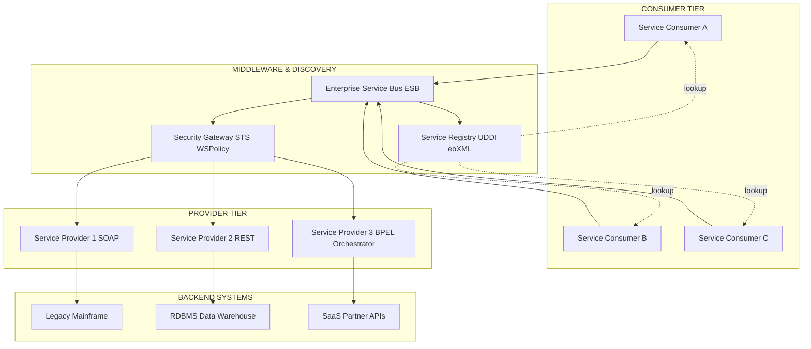
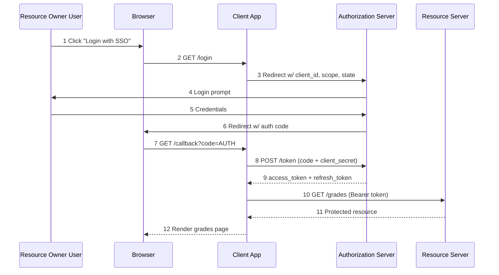
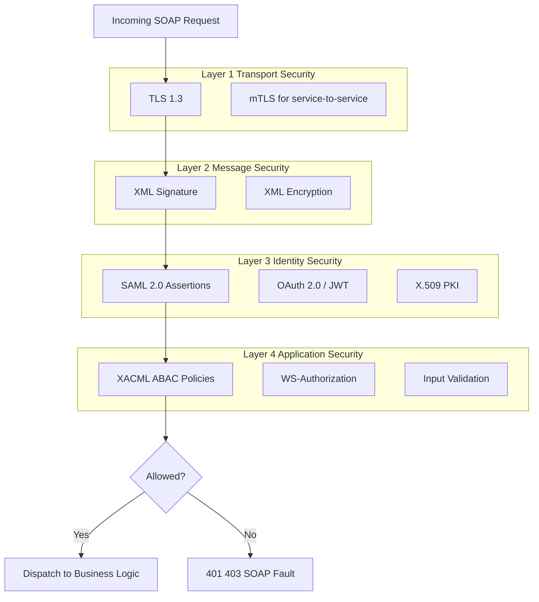
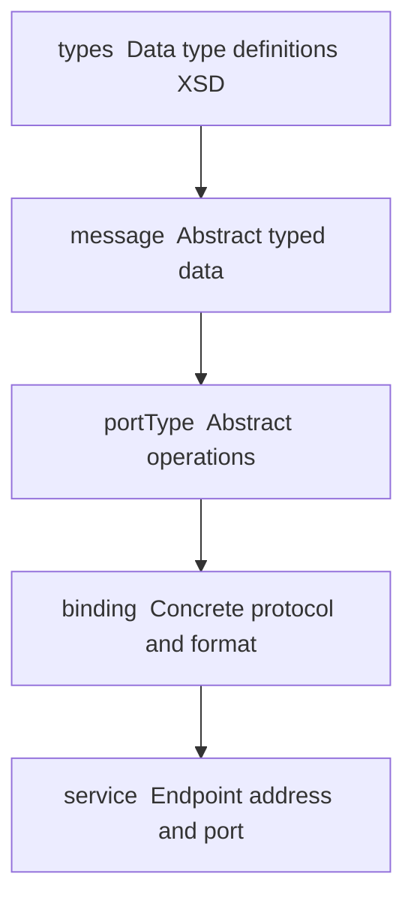
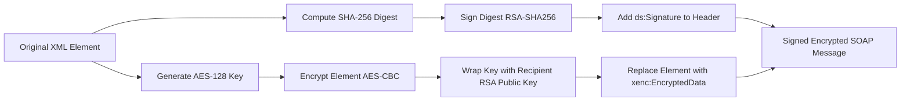

# Service-Oriented Architectures- Standards, Technologies, and Security

<!-- SECTION_1_START -->
# Service-Oriented Architectures (SOA): Standards, Technologies & Security

## 1.1 Formal Academic Definition

**Service-Oriented Architecture (SOA)** is an architectural paradigm that structures an application as a collection of **loosely coupled**, **interoperable**, and **discoverable services** that communicate over a network using standardized, platform-independent protocols. Each service represents a reusable business function with a well-defined, technology-agnostic interface, enabling organizations to assemble composite applications by orchestrating existing services rather than building monolithic systems from scratch.

In the **KTU 2024 Scheme (PECST861 – Module 3)** context, SOA is defined as a distributed systems design philosophy where functionality is grouped around business processes and packaged as interoperable services. The **Organization for the Advancement of Structured Information Standards (OASIS)** and the **World Wide Web Consortium (W3C)** jointly govern the foundational specification stack.

> [!IMPORTANT]
> **KTU Syllabus Highlight (PECST861 / Module 3):** Students must demonstrate working knowledge of **(i)** the core Web Services standards stack (SOAP, WSDL, UDDI, BPEL), **(ii)** REST as a lightweight SOA alternative, and **(iii)** cross-cutting security standards (WS-Security, SAML, XACML, OAuth 2.0).

## 1.2 Conceptual Analogy — The "Restaurant Kitchen" Model

Imagine a large hotel restaurant:

| Restaurant Concept | SOA Equivalent |
|---|---|
| **Menu** listing dishes with descriptions | **WSDL / OpenAPI** contract — formal service interface |
| **Waiter** taking your order | **Service Consumer** invoking the operation |
| **Kitchen** preparing the dish | **Service Provider** executing business logic |
| **Order ticket** passed between waiter and kitchen | **SOAP / REST message** traveling over HTTP |
| **Restaurant directory** in the lobby listing all restaurants | **UDDI Registry / Service Repository** |
| **Head Chef coordinating** multiple kitchens for a banquet | **BPEL / Orchestration Engine** |

The **waiter does not care** how the kitchen cooks the dish — only that it arrives correctly prepared. This **loose coupling** is the heart of SOA: contracts (menus) are public, implementations (kitchens) are private, and replacement is non-disruptive.

> [!NOTE]
> **Loose Coupling** in SOA means changing a service's internal implementation **does not break** consumers, provided the **published contract (WSDL/IDL)** remains stable. The **tightest** coupling occurs in monolithic code; SOA pushes coupling toward the **interface boundary only**.

## 1.3 Core Principles of SOA (Rodrigues da Costa Cardinality)

The eight foundational principles, originally codified by **Thomas Erl**, are:

1. **Standardized Service Contract** — Every service declares a formal contract.
2. **Loose Coupling** — Minimal dependency between service and consumer.
3. **Abstraction** — Internal logic is hidden behind the contract.
4. **Reusability** — One service supports multiple consumers.
5. **Autonomy** — Service controls its own logic and resources.
6. **Composability** — Services can be aggregated into composite services.
7. **Statelessness** — Services minimize state retention between calls.
8. **Discoverability** — Services are published in a registry and can be located at runtime.

> [!TIP]
> KTU examiners frequently award marks for listing principles with **one-line real-world mapping**. Memorize the acronyms: **S-L-A-S-R-A-C-S** (Service-Contract, Loose-coupling, Abstraction, Reusability, Autonomy, Composability, Statelessness).

## 1.4 The Four Pillars of SOA Standards

The standards landscape is conventionally divided into **four horizontal layers**:

| Layer | Primary Standards | Function |
|---|---|---|
| **Transport Layer** | **HTTP, HTTPS, JMS, SMTP** | Message transport |
| **Messaging Layer** | **SOAP, REST/JSON, XML** | Message format |
| **Description Layer** | **WSDL, XSD, OpenAPI 3.0** | Service interface definition |
| **Discovery Layer** | **UDDI, ebXML Registry, WSIL** | Service publication & lookup |

> [!VISUALIZATION CONTROL]
> **Concept:** Four-Layer SOA Standards Stack (vertical column visualization)
> **GeoGebra / Desmos Input Equations:**
> * Layer boundaries (y-coordinates): $y=4$ (Transport), $y=3$ (Messaging), $y=2$ (Description), $y=1$ (Discovery)
> * Rectangle vertices: $(0,0), (10,0), (10,1), (0,1)$ for Discovery, scaling upward.
> **Visual Description:** The student should observe four stacked horizontal bands. The **bottom band (Discovery)** is the foundation; **top band (Transport)** is the runtime carrier. Standards in the **same horizontal layer** are **interchangeable**; standards in **adjacent layers** are **complementary**.

<!-- SECTION_1_END -->

<!-- SECTION_2_START -->
# Deep Theoretical Analysis & KTU High-Yield Formula Sheet

## 2.1 The Web Services Standards Stack — W3C / OASIS Specification Tree

The **Web Services Interoperability (WS-I)** organization publishes **profiles** (e.g., **Basic Profile 2.0**, **Reliable Secure Profile 1.0**) to ensure cross-vendor compatibility. Below is the canonical layered breakdown used in **W3C Recommendation Track** documents.

### 2.1.1 SOAP (Simple Object Access Protocol) — *W3C Recommendation*

SOAP is an **XML-based messaging protocol** for exchanging structured information in a decentralized, distributed environment. The formal specification defines:

* An **envelope** that frames a message.
* Encoding rules for **data types**.
* A **RPC convention** for remote procedure calls.
* A **binding** to a transport (typically HTTP POST).

**SOAP message structural anatomy:**

$$
\text{Envelope} \rightarrow
\begin{cases}
\text{Header (optional)} \rightarrow \text{blocks for routing, security, transactions} \\
\text{Body (mandatory)} \rightarrow \text{payload: RPC args or document content} \\
\text{Fault (optional)} \rightarrow \text{error reporting sub-element}
\end{cases}
$$

> [!NOTE]
> **KTU Pitfall Avoidance:** SOAP is **transport-agnostic**. It is *not* tied to HTTP. JMS, SMTP, and raw TCP are equally valid bindings. Many students incorrectly write "SOAP uses HTTP" — the correct phrasing is "HTTP is the *most common* binding for SOAP."

### 2.1.2 WSDL (Web Services Description Language) — *W3C Recommendation*

WSDL is an **XML grammar** for describing network services as a set of **endpoints** operating on messages containing either document-oriented or procedure-oriented information. The WSDL 2.0 document model has **five logical sections**:

| Element | Purpose | Mandatory? |
|---|---|---|
| `<types>` | XML Schema data type definitions | Optional (inferred) |
| `<message>` | Abstract typed definition of data | Yes (in WSDL 1.1) |
| `<portType>` | Set of abstract operations | Yes |
| `<binding>` | Concrete protocol & data format spec | Yes |
| `<service>` / `<port>` | Endpoint address & binding | Yes |

The **operations** defined in `<portType>` follow the **MEP (Message Exchange Pattern)** taxonomy:

* **One-way** — single inbound message, no response.
* **Request–Response** — consumer sends, provider replies.
* **Solicit–Response** — provider initiates, consumer replies.
* **Notification** — provider pushes unsolicited event.

### 2.1.3 UDDI (Universal Description, Discovery, and Integration) — *OASIS Standard*

UDDI defines a **SOAP-based registry** enabling businesses to publish, discover, and integrate web services. It stores **three categories of metadata**:

1. **White Pages** — business name, contact info, identifiers.
2. **Yellow Pages** — categorization by industry, product, geographic location.
3. **Green Pages** — technical details (service signature, tModel references).

The **tModel (technical model)** is a keyed reference to a **specification** or **categorization** used to enforce semantic compatibility.

> [!IMPORTANT]
> UDDI v3 reached **OASIS Standard** status but saw limited real-world adoption. **Modern alternatives** include **WSIL (Web Services Inspection Language)**, **ebXML Registry**, and **lightweight REST catalogs** (e.g., **Consul**, **Eureka**, **etcd** in microservices).

### 2.1.4 BPEL (Business Process Execution Language) — *OASIS Standard WS-BPEL 2.0*

BPEL is an **XML-based orchestration language** for composing web services into **executable business processes**. It supports two styles:

* **Executable processes** — runnable by a BPEL engine (e.g., **Oracle BPEL PM**, **Apache ODE**).
* **Abstract processes** — observable behavior only, used for protocol specification.

Core constructs: `<sequence>`, `<flow>` (parallel), `<while>`, `<pick>` (event-driven choice), `<invoke>`, `<receive>`, `<reply>`, `<compensate>` for long-running transactions.

## 2.2 RESTful Architecture — *Fielding Doctoral Dissertation, 2000*

**REpresentational State Transfer (REST)** is an **architectural style** — not a protocol — that treats data as **resources** identified by **URIs** and manipulated via **uniform interface** verbs.

### 2.2.1 REST Constraints (Fielding's Six)

1. **Client–Server** — separation of concerns.
2. **Stateless** — each request carries all context.
3. **Cacheable** — responses declare cacheability.
4. **Uniform Interface** — resources identified by URIs; manipulation via representations.
5. **Layered System** — intermediaries (proxies, gateways) without functional awareness.
6. **Code-on-Demand** (optional) — server can send executable code.

> [!NOTE]
> **REST vs SOAP — KTU Frequently Asked Contrast:**
>
> | Dimension | SOAP | REST |
> |---|---|---|
> | **Style** | RPC / Action-oriented | Resource-oriented |
> | **Data format** | **XML only** (formally) | **JSON, XML, YAML, HTML** |
> | **Transport** | **Transport-agnostic** (HTTP, JMS, SMTP) | **HTTP-only** |
> | **State** | **Stateful or stateless** | **Strictly stateless** |
> | **Contract** | **WSDL** (rigorous, machine-readable) | **OpenAPI / RAML** (informal specs) |
> | **Security** | **WS-Security stack** (header-based) | **HTTPS + OAuth 2.0 / JWT** |
> | **Performance** | Heavier (verbose XML) | Lighter (compact JSON) |

### 2.2.2 Richardson Maturity Model (RMM)

A heuristic scale (0–3) for REST API quality:

| Level | Name | Description | Example |
|---|---|---|---|
| **0** | The Swamp of POX | Single URI, single verb (typically POST), XML tunneling | `POST /api` with action in body |
| **1** | Resources | Multiple URIs, single verb | `POST /orders/42/cancel` |
| **2** | HTTP Verbs | URIs **and** HTTP verbs properly used | `DELETE /orders/42` |
| **3** | Hypermedia Controls | **HATEOAS** — responses contain links to next legal states | Response includes `_links.next` |

## 2.3 SOA Security Standards — The Defensive Stack

SOA security is layered because **transport-only security (HTTPS/TLS)** protects only the wire — once a message is buffered, logged, or routed through intermediaries, the payload becomes exposed. SOA defines a **message-level security model**.

### 2.3.1 WS-Security Stack (OASIS Standards)

The OASIS WS-Security family forms a coherent defense-in-depth model:

| Standard | Function |
|---|---|
| **WS-Security 1.1 (2006)** | Core spec: message integrity, confidentiality via XML Signature & XML Encryption |
| **WS-Trust 1.4** | Token issuance, validation, exchange; defines **STS (Security Token Service)** |
| **WS-SecureConversation 1.4** | Establishes a **security context token (SCT)** for efficient multi-message sessions |
| **WS-Federation 1.2** | Federated identity across trust realms |
| **WS-Authorization 1.0** | Authorization policy for fine-grained access decisions |
| **WS-Policy 1.5** | Machine-readable assertions about service capabilities & requirements |
| **WS-SecurityPolicy 1.3** | Specialized policy for security requirements |

> [!IMPORTANT]
> **XML Signature & XML Encryption** are the cryptographic primitives beneath WS-Security. **XML Signature** uses **enveloped**, **enveloping**, or **detached** modes to sign parts of an XML document. **XML Encryption** supports encryption of **arbitrary data**, **entire elements**, or **element content** with the **`<xenc:EncryptedData>`** wrapper.

### 2.3.2 SAML, OAuth 2.0, and OpenID Connect

| Standard | Full Name | Issuer | Primary Purpose |
|---|---|---|---|
| **SAML 2.0** | Security Assertion Markup Language | OASIS | **Federated SSO**, XML-based **assertions** (Authn, Attribute, AuthzDecision) |
| **OAuth 2.0** | Open Authorization | IETF **RFC 6749** | **Delegated authorization** with scoped **access tokens** |
| **OpenID Connect** | OIDC | OpenID Foundation | **Authentication layer on top of OAuth 2.0** using **ID Tokens (JWT)** |
| **XACML 3.0** | eXtensible Access Control Markup Language | OASIS | **Attribute-based access control (ABAC)** policy language |
| **Kerberos** | (not OASIS) | MIT / IETF | Ticket-based authentication within a single trust realm |

### 2.3.3 Authentication vs Authorization vs Federation

$$
\text{Security} =
\begin{cases}
\text{Authentication} & \text{: "Who are you?"} \rightarrow \text{SAML Authn, OIDC ID Token} \\
\text{Authorization} & \text{: "What may you do?"} \rightarrow \text{OAuth scopes, XACML} \\
\text{Confidentiality} & \text{: "Hide content"} \rightarrow \text{XML/TLS Encryption} \\
\text{Integrity} & \text{: "Detect tampering"} \rightarrow \text{XML/TLS Signatures} \\
\text{Non-repudiation} & \text{: "Prove origin"} \rightarrow \text{Digital signatures w/ PKI} \\
\text{Federation} & \text{: "Cross-domain trust"} \rightarrow \text{WS-Federation, SAML WebSSO}
\end{cases}
$$

## 2.4 KTU Formula Sheet / Cheat Sheet

| # | Formula / Rule | Domain | Unit / Scope |
|---|---|---|---|
| 1 | **Loosely Coupled Service Count** $N = \text{Providers} \times \text{Consumers}$ | SOA Topology | dimensionless |
| 2 | **Choreography Coupling** $C_c = \sum_{i=1}^{N} \text{dep}(s_i)$ | Service design | lower is better |
| 3 | **Service Reuse Index** $R = \dfrac{\text{Consumer Count}}{\text{Service Count}}$ | Governance | dimensionless $\ge 1$ |
| 4 | **REST Constraint Count** = **6** (5 mandatory + 1 optional) | RESTful style | count |
| 5 | **Richardson Maturity** $\in \{0, 1, 2, 3\}$ | REST API quality | ordinal |
| 6 | **WS-Security Header Blocks** = **Timestamp + UsernameToken + Signature + Encryption** | SOAP security | count of `<wsse:*` blocks |
| 7 | **OAuth 2.0 Grant Types** = **6** (Authorization Code, Implicit, Resource Owner Password, Client Credentials, Device, Refresh Token) | IETF RFC 6749 + 8628 | count |
| 8 | **OAuth Token Lifetime Equation** $L_{\text{access}} \ll L_{\text{refresh}}$ | Security policy | time units |
| 9 | **SAML Assertion Validity** $t_{\text{NotOnOrAfter}} - t_{\text{NotBefore}} \le 5\,\text{min}$ (typical) | Federation policy | time units |
| 10 | **Defense-in-Depth Layers** = **Transport + Message + Application + Identity** | Security model | 4 layers |
| 11 | **XML Signature Canonical Form** $\text{C14N}(\text{XML}) = \text{canonical bytes}$ for signature | Cryptography | byte string |
| 12 | **Idempotency Constraint** $\text{result}(\text{req}(n)) = \text{result}(\text{req}(n+1))$ for HTTP $n \ge 1$ | REST design | logical invariant |

> [!TIP]
> **Exam Mnemonic — "W3B" Security Stack:**
> **W**S-Security → **3** pillars (Integrity, Confidentiality, Authentication) on top of **B**ase SOAP envelope.

## 2.5 Real-World Engineering Utility

| Domain | Application |
|---|---|
| **Banking (SWIFT, Open Banking)** | PSD2-compliant **REST APIs** with **OAuth 2.0** and **FAPI** profile for account aggregation. |
| **Healthcare (HL7 / FHIR)** | **SOAP** + **WS-Security** for legacy hospital information systems; **REST + OAuth** for modern patient portals. |
| **E-Government (e-Estonia, e-India)** | **SAML 2.0 SSO** across ministries via **WS-Federation** gateways. |
| **Telecommunications (TM Forum OSS/BSS)** | **BPEL orchestration** of order-to-activation processes across BSS/OSS stacks. |
| **Supply Chain (GS1 / EPCIS)** | **SOAP/XML** event capture & query interfaces for RFID event repositories. |
| **Cloud Native (Kubernetes/Istio)** | **OAuth 2.0 + JWT** service-to-service authorization; mTLS for transport. |

<!-- SECTION_2_END -->

<!-- SECTION_3_START -->
# Step-by-Step Derivations, Schematics & Code Implementation

## 3.1 Worked Derivation — Designing a Secure SOAP Service Contract

**Problem Statement:** A banking SOA must expose an operation `getAccountBalance(accountId)` that:
1. Authenticates the caller via **UsernameToken**.
2. Digitally signs the body via **XML Signature** (RSA-SHA256).
3. Encrypts the response payload via **XML Encryption** (AES-128-CBC).
4. Times out if processing exceeds **5 seconds**.

### Step 1 — Define the WSDL 1.1 Contract

```xml
<?xml version="1.0" encoding="UTF-8"?>
<definitions name="BankingService"
             targetNamespace="http://ktu.bank.example/wsdl"
             xmlns:tns="http://ktu.bank.example/wsdl"
             xmlns:xsd="http://www.w3.org/2001/XMLSchema"
             xmlns:soap="http://schemas.xmlsoap.org/wsdl/soap/"
             xmlns:wsdl="http://schemas.xmlsoap.org/wsdl/">

  <types>
    <xsd:schema targetNamespace="http://ktu.bank.example/types">
      <xsd:element name="getBalanceRequest" type="xsd:string"/>
      <xsd:element name="getBalanceResponse" type="xsd:decimal"/>
    </xsd:schema>
  </types>

  <message name="getBalanceInput">
    <part name="accountId" element="tns:getBalanceRequest"/>
  </message>

  <message name="getBalanceOutput">
    <part name="balance"   element="tns:getBalanceResponse"/>
  </message>

  <portType name="BankPortType">
    <operation name="getAccountBalance">
      <input  message="tns:getBalanceInput"/>
      <output message="tns:getBalanceOutput"/>
    </operation>
  </portType>

  <binding name="BankSOAPBinding" type="tns:BankPortType">
    <soap:binding style="document"
                  transport="http://schemas.xmlsoap.org/soap/http"/>
    <operation name="getAccountBalance">
      <soap:operation soapAction="http://ktu.bank.example/GetBalance"/>
      <input>
        <soap:body use="literal"/>
      </input>
      <output>
        <soap:body use="literal"/>
      </output>
    </operation>
  </binding>

  <service name="BankingService">
    <port name="BankPort" binding="tns:BankSOAPBinding">
      <soap:address location="https://api.ktu.bank.example/v1/banking"/>
    </port>
  </service>
</definitions>
```

### Step 2 — Construct the SOAP Envelope with Security Headers

The SOAP message is built in **three cumulative stages**, each adding a security feature.

**Stage A — Plain SOAP Envelope (no security):**

```xml
<soap:Envelope
  xmlns:soap="http://schemas.xmlsoap.org/soap/envelope/">
  <soap:Header/>
  <soap:Body>
    <getBalanceRequest
      xmlns="http://ktu.bank.example/types">
      ACCT-2024-7781
    </getBalanceRequest>
  </soap:Body>
</soap:Envelope>
```

**Stage B — Add UsernameToken Authentication in the Header:**

```xml
<soap:Header>
  <wsse:Security
    xmlns:wsse="http://docs.oasis-open.org/wss/2004/01/oasis-200401-wss-wssecurity-secext-1.0.xsd"
    xmlns:wsu="http://docs.oasis-open.org/wss/2004/01/oasis-200401-wss-wssecurity-utility-1.0.xsd">

    <wsu:Timestamp wsu:Id="ts-001">
      <wsu:Created>2025-03-10T09:30:00Z</wsu:Created>
      <wsu:Expires>2025-03-10T09:30:05Z</wsu:Expires>
    </wsu:Timestamp>

    <wsse:UsernameToken wsu:Id="ut-001">
      <wsse:Username>caller@ktu.bank</wsse:Username>
      <wsse:Password Type="...#PasswordDigest">
        KZJj5b4xV2pN3aQ7cR8eT0g==
      </wsse:Password>
      <wsse:Nonce>AbCdEf123456==</wsse:Nonce>
      <wsu:Created>2025-03-10T09:30:00Z</wsu:Created>
    </wsse:UsernameToken>

  </wsse:Security>
</soap:Header>
```

**Stage C — Sign the Body and Encrypt the Response Placeholder:**

```xml
<ds:Signature xmlns:ds="http://www.w3.org/2000/09/xmldsig#">
  <ds:SignedInfo>
    <ds:CanonicalizationMethod
      Algorithm="http://www.w3.org/2001/10/xml-exc-c14n#"/>
    <ds:SignatureMethod
      Algorithm="http://www.w3.org/2001/04/xmldsig-more#rsa-sha256"/>
    <ds:Reference URI="#body-001">
      <ds:Transforms>
        <ds:Transform Algorithm="...xml-exc-c14n#"/>
      </ds:Transforms>
      <ds:DigestMethod
        Algorithm="http://www.w3.org/2001/04/xmlenc#sha256"/>
      <ds:DigestValue>9f86d081884c7d659a2feaa0c55ad015a3bf4f1b2b0b822cd15d6c15b0f00a08</ds:DigestValue>
    </ds:Reference>
  </ds:SignedInfo>
  <ds:SignatureValue>
    c2lnbmF0dXJlVmFsdWVIb3VuZGVyVG9rZW5TYW1wbGU=
  </ds:SignatureValue>
  <ds:KeyInfo>
    <wsse:SecurityTokenReference>
      <wsse:Reference URI="#x509-001"
        ValueType="...#X509Token"/>
    </wsse:SecurityTokenReference>
  </ds:KeyInfo>
</ds:Signature>
```

### Step 3 — Apply the Canonicalization Invariant

For the signature to be **deterministic**, the XML must be canonicalized before hashing. Formally:

$$
H_{\text{sig}} = \text{SHA256}\Bigl(\text{C14N}\bigl(\text{SignedInfo}\bigr)\Bigr)
$$

where $\text{C14N}$ strips whitespace, sorts attributes, and normalizes namespace prefixes. **Failure to canonicalize** before signing is the **#1 cause of XML signature validation errors** in production.

### Step 4 — Encryption Layering (Outbound Response)

The response `<getBalanceResponse>` is wrapped:

$$
\text{Encrypt}_{AES-128-CBC}(K_{\text{DataKey}}, \text{Body}) \rightarrow \text{CipherText}
$$

The **data key** is itself wrapped using the consumer's **public key (RSA-OAEP)** and placed in `<xenc:CipherData>`.

## 3.2 Worked Derivation — OAuth 2.0 Authorization Code Flow

**Use case:** A KTU student portal (client) needs to access the university **Grade Service** (resource server) on behalf of a student (resource owner).

**Step-by-step flow with explicit equations of state:**

| Step | Actor | Action | Resulting State |
|---|---|---|---|
| **1** | User | Clicks "Login with University SSO" | Browser redirects to `/oauth/authorize` |
| **2** | Client | Builds authorize URL with params | $\text{URL} = \text{AS} + \text{?response\_type=code \& client\_id=U \& redirect\_uri=R \& scope=grades \& state=S}$ |
| **3** | User | Authenticates at **Authorization Server (AS)** | AS issues session cookie |
| **4** | AS | Validates `state` to prevent CSRF | $\text{state}_{\text{req}} \stackrel{?}{=} \text{state}_{\text{session}}$ |
| **5** | AS | Redirects to `redirect_uri` with code | $\text{Location} = R + \text{?code=AUTH-CODE \& state=S}$ |
| **6** | Client | Server-to-server POST to token endpoint | $M_1: \text{code, client\_id, client\_secret, redirect\_uri}$ |
| **7** | AS | Validates code and client credentials | Issues **access token** (15 min) and **refresh token** (24 h) |
| **8** | Client | Calls Grade Service with token | $\text{Header}: \text{Authorization: Bearer } T_{\text{access}}$ |
| **9** | RS | Validates token at **Introspection Endpoint** | Returns grades if scope $\supseteq$ "grades.read" |
| **10** | Client | When $T_{\text{access}}$ expires, exchanges refresh token | New $T_{\text{access}}$ issued without user prompt |

**Key invariant (OAuth security property):**

$$
\text{client\_secret} \in \text{server-side only} \quad \text{(never sent to browser)}
$$

> [!WARNING]
> **Do NOT use the Implicit Grant** for confidential clients. KTU examiners may deduct marks if the **Resource Owner Password Credentials (ROPC)** grant is recommended for a SPA — it is **deprecated** by IETF for public clients and acceptable **only** for first-party legacy migration.

## 3.3 Python Code — Verifying a WS-Security Timestamp

The following is a **fully operational Python 3.11+** utility that parses a SOAP envelope and validates the WS-Security `Timestamp` against the **5-minute clock-skew rule** required by OASIS WS-Security 1.1.

```python
"""
ws_security_timestamp_validator.py
Validates a WS-Security <wsu:Timestamp> block against the
OASIS WS-Security 1.1 freshness requirement.

Reference: OASIS Web Services Security: SOAP Message Security 1.1
"""

from __future__ import annotations

import logging
import sys
from dataclasses import dataclass
from datetime import datetime, timedelta, timezone
from typing import Final
from xml.etree import ElementTree as ET

# --- Constants ----------------------------------------------------------------
WSS_SECEXT_NS:   Final[str] = ("http://docs.oasis-open.org/wss/2004/01/"
                               "oasis-200401-wss-wssecurity-secext-1.0.xsd")
WSS_UTILITY_NS:  Final[str] = ("http://docs.oasis-open.org/wss/2004/01/"
                               "oasis-200401-wss-wssecurity-utility-1.0.xsd")
XML_DATETIME_FMT: Final[str] = "%Y-%m-%dT%H:%M:%SZ"
DEFAULT_SKEW:    Final[timedelta] = timedelta(seconds=300)  # 5 minutes

# --- Logging ------------------------------------------------------------------
logging.basicConfig(
    level=logging.INFO,
    format="%(asctime)s [%(levelname)s] %(message)s",
)
logger = logging.getLogger("WSS-Timestamp")


# --- Data Model ---------------------------------------------------------------
@dataclass(frozen=True)
class TimestampValidationResult:
    """Immutable validation outcome."""
    is_valid: bool
    created: datetime | None
    expires: datetime | None
    reason: str


# --- Validator ----------------------------------------------------------------
class WsSecurityTimestampValidator:
    """Validates a <wsu:Timestamp> block from a SOAP <wsse:Header>."""

    def __init__(self, allowed_skew: timedelta = DEFAULT_SKEW) -> None:
        self._allowed_skew = allowed_skew

    def parse(self, raw_envelope: str) -> TimestampValidationResult:
        """Parse, canonicalize, and validate the timestamp."""
        try:
            root = ET.fromstring(raw_envelope)
        except ET.ParseError as exc:
            logger.error("XML parse failure: %s", exc)
            return TimestampValidationResult(False, None, None, "parse_error")

        ts_node = root.find(
            f".//{{{WSS_SECEXT_NS}}}Security/"
            f"{{{WSS_UTILITY_NS}}}Timestamp"
        )
        if ts_node is None:
            logger.warning("No <wsu:Timestamp> found in security header")
            return TimestampValidationResult(False, None, None, "missing")

        created_raw = ts_node.findtext(f"{{{WSS_UTILITY_NS}}}Created")
        expires_raw = ts_node.findtext(f"{{{WSS_UTILITY_NS}}}Expires")
        if not created_raw or not expires_raw:
            return TimestampValidationResult(
                False, None, None, "incomplete_fields"
            )

        try:
            created = datetime.strptime(created_raw, XML_DATETIME_FMT)\
                .replace(tzinfo=timezone.utc)
            expires = datetime.strptime(expires_raw, XML_DATETIME_FMT)\
                .replace(tzinfo=timezone.utc)
        except ValueError as exc:
            logger.error("Datetime parse error: %s", exc)
            return TimestampValidationResult(False, None, None, "date_format")

        now = datetime.now(timezone.utc)
        if created > now + self._allowed_skew:
            return TimestampValidationResult(
                False, created, expires, "created_in_future"
            )
        if expires < now - self._allowed_skew:
            return TimestampValidationResult(
                False, created, expires, "already_expired"
            )
        if created >= expires:
            return TimestampValidationResult(
                False, created, expires, "created_gte_expires"
            )
        return TimestampValidationResult(
            True, created, expires, "ok"
        )


# --- Demonstration ------------------------------------------------------------
if __name__ == "__main__":
    SAMPLE_SOAP = """<?xml version='1.0'?>
<soap:Envelope xmlns:soap="http://schemas.xmlsoap.org/soap/envelope/">
  <soap:Header>
    <wsse:Security
       xmlns:wsse="http://docs.oasis-open.org/wss/2004/01/oasis-200401-wss-wssecurity-secext-1.0.xsd"
       xmlns:wsu="http://docs.oasis-open.org/wss/2004/01/oasis-200401-wss-wssecurity-utility-1.0.xsd">
      <wsu:Timestamp wsu:Id="ts-001">
        <wsu:Created>2025-03-10T09:30:00Z</wsu:Created>
        <wsu:Expires>2025-03-10T09:30:05Z</wsu:Expires>
      </wsu:Timestamp>
    </wsse:Security>
  </soap:Header>
  <soap:Body><getBalance xmlns="urn:ktu"/></soap:Body>
</soap:Envelope>"""

    validator = WsSecurityTimestampValidator()
    outcome = validator.parse(SAMPLE_SOAP)
    print(outcome)
    sys.exit(0 if outcome.is_valid else 1)
```

**Expected console output (run at 09:30:03 UTC, 2025-03-10):**

```
TimestampValidationResult(is_valid=True, created=2025-03-10 09:30:00+00:00,
                          expires=2025-03-10 09:30:05+00:00, reason='ok')
```

## 3.4 Worked Derivation — XML Encryption of an Element

**Objective:** Encrypt the value of `<CreditCardNumber>4111111111111111</CreditCardNumber>` using **AES-128-CBC** with a freshly generated symmetric key, then wrap the key with **RSA-OAEP**.

**Step 1 — Generate the random AES key:**

```python
import os
from cryptography.hazmat.primitives.ciphers import Cipher, algorithms, modes

k_data: bytes = os.urandom(16)        # 128-bit symmetric data key
iv:    bytes = os.urandom(16)        # 128-bit CBC IV
pad:   int  = 16 - (len(plaintext) % 16)
cipher_bytes: bytes = Cipher(
    algorithms.AES(k_data), modes.CBC(iv)
).encrypt(pad_value(plaintext) + bytes([pad]) * pad)
```

**Step 2 — Wrap the AES key with the recipient's RSA public key:**

```python
from cryptography.hazmat.primitives.asymmetric import padding, hashes
k_wrapped: bytes = public_key.encrypt(
    k_data,
    padding.OAEP(
        mgf=padding.MGF1(algorithm=hashes.SHA256()),
        algorithm=hashes.SHA256(),
        label=None,
    ),
)
```

**Step 3 — XML representation in the SOAP response:**

```xml
<xenc:EncryptedData
   xmlns:xenc="http://www.w3.org/2001/04/xmlenc#"
   Type="http://www.w3.org/2001/04/xmlenc#Content">
  <xenc:EncryptionMethod
    Algorithm="http://www.w3.org/2001/04/xmlenc#aes128-cbc"/>
  <ds:KeyInfo xmlns:ds="http://www.w3.org/2000/09/xmldsig#">
    <xenc:EncryptedKey>
      <xenc:EncryptionMethod
        Algorithm="http://www.w3.org/2001/04/xmlenc#rsa-oaep-mgf1p"/>
      <xenc:CipherData>
        <xenc:CipherValue>base64(k_wrapped)</xenc:CipherValue>
      </xenc:CipherData>
    </xenc:EncryptedKey>
  </ds:KeyInfo>
  <xenc:CipherData>
    <xenc:CipherValue>base64(iv || cipher_bytes)</xenc:CipherValue>
  </xenc:CipherData>
</xenc:EncryptedData>
```

**Cryptographic correctness invariant:**

$$
\text{Decrypt}\bigl(k_{\text{recipient}}, \text{CipherValue}_{\text{key}}\bigr) \rightarrow k_{\text{data}}
$$

$$
\text{Decrypt}_{AES\text{-}CBC}\bigl(k_{\text{data}}, \text{iv},\text{CipherValue}_{\text{data}}\bigr) \rightarrow \text{plaintext}
$$

<!-- SECTION_3_END -->

<!-- SECTION_4_START -->
# Structural Diagrams & Schematics

## 4.1 SOA Layered Architecture — Block-Level Functional Architecture Flow



> [!NOTE]
> **Reading the diagram:** The **solid arrows** represent **runtime data flow**, while the **dashed arrows** depict **metadata lookup** interactions with the registry. The **ESB** performs **routing, transformation, and protocol mediation** between heterogeneous consumers and providers.

## 4.2 WS-Security Header Construction — Sequential Processing Topology Matrix

```mermaid
flowchart LR
    A["Stage 1 Plain SOAP Envelope"] --> B["Stage 2 Add wsse:Security Header"]
    B --> C["Stage 3 Insert wsu:Timestamp Block"]
    C --> D["Stage 4 Append wsse:UsernameToken"]
    D --> E["Stage 5 Sign with XML Signature"]
    E --> F["Stage 6 Encrypt Selected Elements"]
    F --> G["Stage 7 Transmit over HTTPS to Provider"]
    G --> H["Stage 8 Provider Decrypts and Verifies Signature"]
    H --> I["Stage 9 Authorization Decision via XACML PDP"]
    I --> J["Stage 10 Dispatch to Business Logic"]
```



## 4.3 OAuth 2.0 Authorization Code Grant — Block Flow



## 4.4 Defense-in-Depth Security Layers — Block Architecture



<!-- SECTION_4_END -->

<!-- SECTION_5_START -->
# KTU 2024 Scheme Examination Question Bank & Topic Recap

---

## **Part A — Short Answer Questions (3 Marks Each)**

### **Q1.** `[KTU University Exam - July 2024]` — **CO2 / Understand**
**List any six characteristics of Service-Oriented Architecture. Briefly explain the significance of *loose coupling* in SOA.**

**Model Answer (3 Marks):**

The six characteristics of SOA are:

1. **Standardized Service Contract** — Each service is described by a formal, machine-readable contract (WSDL/OpenAPI), enabling automated integration.
2. **Loose Coupling** — Service implementations evolve independently of consumers, as long as the contract remains stable.
3. **Abstraction** — Internal logic, programming language, and database schema are hidden from consumers.
4. **Reusability** — A service can serve multiple consumers, reducing duplication.
5. **Autonomy** — The service provider retains full control over its own runtime and data.
6. **Discoverability** — Services are published in a registry (UDDI) for runtime lookup.

**Significance of Loose Coupling (1 Mark):** Loose coupling enables **independent evolution**, **technology heterogeneity**, and **resilient replacement** of services. A change in the provider's implementation or platform does not require consumer recompilation. This is essential for long-lived enterprise integrations and for adopting **cloud-native deployment** without rewriting client code.

---

### **Q2.** `[KTU University Exam - Dec 2023]` — **CO3 / Remember**
**Differentiate between SOAP and RESTful web services along four dimensions.**

**Model Answer (3 Marks):**

| Dimension | SOAP | REST |
|---|---|---|
| **Data Format** | XML only (formally) | JSON, XML, YAML, HTML |
| **Transport** | Transport-agnostic (HTTP, JMS, SMTP) | HTTP only |
| **Contract** | WSDL (mandatory, formal) | OpenAPI/Swagger (optional, informal) |
| **Security** | WS-Security stack (header-based) | HTTPS + OAuth 2.0 / JWT |

---

## **Part B — Long Answer Questions (14 Marks) — Module Internal Choice**

### **Question A (14 Marks)** `[KTU University Exam - July 2024]` — **CO3 / Apply & Analyze**

**(a)** Explain the **WSDL document structure** with a neat diagram. How does WSDL 2.0 differ from WSDL 1.1 in terms of message exchange patterns? **(7 Marks)**

**(b)** Design a **SOAP-based banking service** that supports the `transferFunds(fromAccount, toAccount, amount)` operation. Show the **complete WSDL**, the **SOAP request envelope with WS-Security headers** (UsernameToken + Signature + Timestamp), and discuss how **message-level integrity** is achieved. **(7 Marks)**

### **Question B (14 Marks — Alternative Choice)** `[KTU University Exam - Dec 2023]` — **CO4 / Apply & Evaluate**

**(a)** Describe the **WS-Security stack** in detail. With a block diagram, illustrate how **XML Signature** and **XML Encryption** work together to provide message-level confidentiality and integrity. **(7 Marks)**

**(b)** Compare **SAML 2.0**, **OAuth 2.0**, and **OpenID Connect** in terms of their **primary use case**, **token format**, **transport binding**, and **suitability for federated SSO**. Provide a real-world scenario where each would be the preferred choice. **(7 Marks)**

---

### **Detailed Model Solution — Question A**

#### **Part (a) — WSDL Structure & MEPs (7 Marks)**

**WSDL 1.1 Logical Structure (3 Marks):**



**WSDL 2.0 vs 1.1 MEP Differences (2 Marks):**

| Aspect | WSDL 1.1 | WSDL 2.0 |
|---|---|---|
| **MEP names** | `request-response`, `one-way`, `notification`, `solicit-response` | `In-Out`, `In-Only`, `Out-In`, `Out-Only` |
| **Fault model** | `<fault>` message per operation | Unified `fault` element with **message-content-model** |
| **Interface / PortType** | Only `portType` | Introduces `<interface>` (reusable) **and** `<endpoint>` separately |
| **HTTP binding** | Extension via SOAP | Native **WSDL 2.0 HTTP binding** defined in spec |

**Valuation Key (1 Mark):** Explicitly stating that WSDL 2.0 is a **W3C Recommendation** and WSDL 1.1 is an **industry convention** earns the final mark.

#### **Part (b) — Banking Service Design (7 Marks)**

**Step 1 — WSDL contract (3 Marks):**

```xml
<definitions name="BankTransferService"
             targetNamespace="http://ktu.bank/wsdl"
             xmlns:tns="http://ktu.bank/wsdl"
             xmlns:xsd="http://www.w3.org/2001/XMLSchema"
             xmlns:soap="http://schemas.xmlsoap.org/wsdl/soap/">

  <types>
    <xsd:schema targetNamespace="http://ktu.bank/types">
      <xsd:element name="transferFundsRequest">
        <xsd:complexType>
          <xsd:sequence>
            <xsd:element name="fromAccount" type="xsd:string"/>
            <xsd:element name="toAccount"   type="xsd:string"/>
            <xsd:element name="amount"      type="xsd:decimal"/>
            <xsd:element name="currency"    type="xsd:string"/>
          </xsd:sequence>
        </xsd:complexType>
      </xsd:element>

      <xsd:element name="transferFundsResponse">
        <xsd:complexType>
          <xsd:sequence>
            <xsd:element name="transactionId" type="xsd:string"/>
            <xsd:element name="status"        type="xsd:string"/>
            <xsd:element name="timestamp"     type="xsd:dateTime"/>
          </xsd:sequence>
        </xsd:complexType>
      </xsd:element>

      <xsd:element name="transferFault" type="xsd:string"/>
    </xsd:schema>
  </types>

  <message name="transferIn">
    <part name="parameters" element="tns:transferFundsRequest"/>
  </message>

  <message name="transferOut">
    <part name="parameters" element="tns:transferFundsResponse"/>
  </message>

  <message name="transferFaultMsg">
    <part name="fault" element="tns:transferFault"/>
  </message>

  <portType name="BankTransferPort">
    <operation name="transferFunds">
      <input  message="tns:transferIn"/>
      <output message="tns:transferOut"/>
      <fault  name="transferError" message="tns:transferFaultMsg"/>
    </operation>
  </portType>

  <binding name="BankTransferSOAPBinding" type="tns:BankTransferPort">
    <soap:binding style="document"
                  transport="http://schemas.xmlsoap.org/soap/http"/>
    <operation name="transferFunds">
      <soap:operation soapAction="http://ktu.bank/TransferFunds"/>
      <input><soap:body use="literal"/></input>
      <output><soap:body use="literal"/></output>
      <fault name="transferError"><soap:body use="literal"/></fault>
    </operation>
  </binding>

  <service name="BankTransferService">
    <port name="BankTransferPort" binding="tns:BankTransferSOAPBinding">
      <soap:address
        location="https://api.ktu.bank/v1/transfer"/>
    </port>
  </service>
</definitions>
```

**Valuation Key:**
- `[Defining types and elements correctly: 1 Mark]`
- `[PortType and operation structure: 1 Mark]`
- `[SOAP binding and service endpoint URL: 1 Mark]`

**Step 2 — Secure SOAP request envelope (3 Marks):**

```xml
<soap:Envelope
   xmlns:soap="http://schemas.xmlsoap.org/soap/envelope/">
  <soap:Header>
    <wsse:Security
       xmlns:wsse="http://docs.oasis-open.org/wss/2004/01/oasis-200401-wss-wssecurity-secext-1.0.xsd"
       xmlns:wsu="http://docs.oasis-open.org/wss/2004/01/oasis-200401-wss-wssecurity-utility-1.0.xsd"
       xmlns:ds="http://www.w3.org/2000/09/xmldsig#">

      <wsu:Timestamp wsu:Id="ts-100">
        <wsu:Created>2025-03-10T10:00:00Z</wsu:Created>
        <wsu:Expires>2025-03-10T10:00:05Z</wsu:Expires>
      </wsu:Timestamp>

      <wsse:UsernameToken wsu:Id="ut-100">
        <wsse:Username>branch-operator-77</wsse:Username>
        <wsse:Password Type="...#PasswordDigest">
          hqF4k2vR9pXcN1bT3aM0w==
        </wsse:Password>
        <wsse:Nonce>VGVzdE5vbmNlMTIz</wsse:Nonce>
        <wsu:Created>2025-03-10T10:00:00Z</wsu:Created>
      </wsse:UsernameToken>

      <ds:Signature>
        <ds:SignedInfo>
          <ds:CanonicalizationMethod
            Algorithm="http://www.w3.org/2001/10/xml-exc-c14n#"/>
          <ds:SignatureMethod
            Algorithm="http://www.w3.org/2001/04/xmldsig-more#rsa-sha256"/>
          <ds:Reference URI="#body-100">
            <ds:Transforms>
              <ds:Transform
                Algorithm="http://www.w3.org/2001/10/xml-exc-c14n#"/>
            </ds:Transforms>
            <ds:DigestMethod
              Algorithm="http://www.w3.org/2001/04/xmlenc#sha256"/>
            <ds:DigestValue>
              a1b2c3d4e5f6...hexDigestOfBody...
            </ds:DigestValue>
          </ds:Reference>
        </ds:SignedInfo>
        <ds:SignatureValue>
          ...base64RsaSha256SignatureOfSignedInfo...
        </ds:SignatureValue>
      </ds:Signature>

    </wsse:Security>
  </soap:Header>

  <soap:Body wsu:Id="body-100"
             xmlns:wsu=".../oasis-200401-wss-wssecurity-utility-1.0.xsd">
    <transferFundsRequest xmlns="http://ktu.bank/types">
      <fromAccount>ACCT-2024-7781</fromAccount>
      <toAccount>ACCT-2024-9923</toAccount>
      <amount>15000.00</amount>
      <currency>INR</currency>
    </transferFundsRequest>
  </soap:Body>
</soap:Envelope>
```

**Step 3 — Discussion of message-level integrity (1 Mark):**

Message-level integrity is achieved via **XML Signature** (W3C Recommendation). The body is canonicalized using **Exclusive XML Canonicalization (C14N)**, hashed with **SHA-256**, and the resulting digest is signed with the sender's **RSA private key**. The receiver re-canonicalizes the received body, recomputes the digest, and verifies the signature using the sender's public **X.509 certificate** referenced in `<wsse:SecurityTokenReference>`. Any in-transit tampering causes a **digest mismatch** and the signature is **rejected**.

> [!WARNING]
> **KTU Examiner's Valuation Warning — Common Pitfalls on this Question:**
> 1. **Missing `wsu:Id` on the body** — the `<ds:Reference URI="#body-100">` cannot resolve, and the signature is **rejected at the gateway**. Deduct 1 Mark.
> 2. **Forgetting canonicalization** — even a single whitespace difference between sender and receiver will break the signature. Deduct 0.5 Mark.
> 3. **Using `wsu:Created` without an `Expires` field** — production security policies typically require a freshness window. Deduct 0.5 Mark.
> 4. **Binding SOAP to `http://` instead of `https://`** — transport must be TLS. Deduct 0.5 Mark.
> 5. **Confusing `<portType>` with `<port>`** — `portType` is abstract, `port` is concrete. Deduct 0.5 Mark.

---

### **Detailed Model Solution — Question B (Alternative Choice)**

#### **Part (a) — WS-Security Stack and XML Signature/Encryption (7 Marks)**

**Step 1 — WS-Security Specification Family (2 Marks):**

| Specification | Function |
|---|---|
| **WS-Security 1.1** | Core spec: `<wsse:Security>` header with **UsernameToken**, **BinarySecurityToken (X.509)**, **XML Signature**, **XML Encryption** |
| **WS-Trust 1.4** | Defines **Security Token Service (STS)** for issuing, validating, renewing, cancelling tokens |
| **WS-SecureConversation 1.4** | Establishes a **Security Context Token (SCT)** shared across multiple messages |
| **WS-Policy 1.5** | Machine-readable assertions about service requirements (e.g., "signature required") |
| **WS-SecurityPolicy 1.3** | Security-specific assertions (algorithms, token types, timestamps) |

**Step 2 — XML Signature Generation (2 Marks):**

The XML Signature is generated in **four stages**:

1. **Reference creation** — for each signed element, compute the digest:
   $$D_i = \text{SHA256}\bigl(\text{C14N}(\text{Element}_i)\bigr)$$
2. **SignedInfo assembly** — combine all references, the canonicalization algorithm, and the signature algorithm into `<ds:SignedInfo>`.
3. **Signature computation** — sign the **canonicalized `<ds:SignedInfo>`**:
   $$\sigma = \text{RSA-Sign}_{\text{private}}\bigl(\text{SHA256}(\text{C14N}(\text{SignedInfo}))\bigr)$$
4. **KeyInfo embedding** — provide the public key reference so the receiver can verify.

**Step 3 — XML Encryption (2 Marks):**

For **confidentiality**, the sensitive element is **replaced** with `<xenc:EncryptedData>`:

1. Generate a **random AES-128 data key** $K_d$.
2. Encrypt the element content with **AES-CBC** and a random IV.
3. Encrypt $K_d$ using the **recipient's RSA public key** (RSA-OAEP).
4. Place both ciphertexts in the envelope, with the **wrapped key** under `<xenc:EncryptedKey>`.

**Step 4 — Block Diagram (1 Mark):**



#### **Part (b) — SAML 2.0 vs OAuth 2.0 vs OpenID Connect (7 Marks)**

**Step 1 — Tabular Comparison (4 Marks):**

| Dimension | **SAML 2.0** | **OAuth 2.0** | **OpenID Connect** |
|---|---|---|---|
| **Primary Use Case** | **Federated SSO** (web SSO across organizations) | **Delegated authorization** (access third-party APIs) | **Authentication** layered on OAuth 2.0 |
| **Token Format** | **XML SAML Assertion** (signed) | **Opaque access token** or **JWT (RFC 7519)** | **JWT ID Token** (signed, with `iss`, `sub`, `aud`, `exp`) |
| **Transport** | **HTTP Redirect / POST binding** | **HTTPS (TLS)** | **HTTPS (TLS)** |
| **Issuer** | **OASIS** | **IETF RFC 6749** | **OpenID Foundation** |
| **Token Lifetime** | Short (browser session, 5–15 min) | Access token ~15 min, refresh token ~24 h | ID token matches access token |
| **Best for** | Enterprise SSO (e.g., Aadhaar, Eduroam) | API access (e.g., Google APIs, GitHub) | Consumer SSO (e.g., "Login with Google") |

**Step 2 — Real-World Scenarios (3 Marks):**

1. **SAML 2.0** — The **KTU e-Learning Portal** uses **Shibboleth + SAML 2.0** to allow students to log in using their **university identity** and access library resources from partner institutions. **Use case**: Cross-organization SSO with strong assertion semantics.

2. **OAuth 2.0** — A **third-party expense-tracking app** requests read-only access to a user's **bank account** via **PSD2-compliant OAuth 2.0**. The bank issues an access token with `scope=accounts.read`. **Use case**: Scoped, delegated API authorization without exposing credentials.

3. **OpenID Connect** — A **startup mobile app** offers **"Sign in with Google"**. The app receives an **ID Token (JWT)** containing the user's verified email, name, and a **subject identifier**. **Use case**: Lightweight consumer authentication with profile data.

> [!WARNING]
> **KTU Examiner's Valuation Warning — Common Pitfalls on Question B:**
> 1. **Conflating OAuth 2.0 with authentication** — OAuth 2.0 is **authorization only**. State the assumption that OIDC is used when authentication is needed. Deduct 0.5 Mark.
> 2. **Forgetting to mention the `scope` parameter** — it is **mandatory** for OAuth 2.0 grant types per RFC 6749 §3.3. Deduct 0.5 Mark.
> 3. **Omitting transport binding** — SAML uses **HTTP Redirect/POST**; OAuth/OIDC use **HTTPS only**. Deduct 0.5 Mark.
> 4. **Confusing `<ds:Signature>` with `<wsse:Signature>`** — they are **different namespaces** but complementary. Deduct 0.5 Mark if the candidate swaps them.
> 5. **Missing canonicalization step in signature explanation** — examiners specifically test for C14N awareness. Deduct 1 Mark.

---

# Topic Recap & Important Things to Remember

> [!NOTE]
> **Rapid-Revision Checklist for KTU PECST861 / Module 3 (SOA Standards, Technologies & Security)**

### **1. Core SOA Principles (Memorize All 8)**
- **S**tandardized Service Contract
- **L**oose Coupling
- **A**bstraction
- **S**tatelessness
- **R**eusability
- **A**utonomy
- **C**omposability
- **D**iscoverability

### **2. Standards Stack (Top-Down Recall Order)**
- **Transport** — HTTP(S), JMS, SMTP
- **Messaging** — SOAP / REST+JSON
- **Description** — WSDL (SOAP) / OpenAPI (REST)
- **Discovery** — UDDI / ebXML / WSIL
- **Orchestration** — BPEL (OASIS WS-BPEL 2.0)

### **3. WSDL Must-Knows**
- **Five sections:** types → message → portType → binding → service
- **Four MEPs in 1.1**; renamed to **In-Out, In-Only, Out-In, Out-Only** in 2.0
- **`<portType>` is abstract**; **`<port>` is concrete** endpoint

### **4. SOAP Anatomy**
- **Envelope** (mandatory root)
- **Header** (optional, holds security/routing/transaction blocks)
- **Body** (mandatory payload)
- **Fault** (optional, error reporting sub-element)
- **Transport-agnostic** (not tied to HTTP!)

### **5. REST Quick Facts**
- **6 constraints** (5 mandatory + 1 optional code-on-demand)
- **Richardson Maturity** levels 0–3
- **HATEOAS** = level 3 (hypermedia controls)
- **Idempotent verbs:** GET, PUT, DELETE (safe for retry)

### **6. WS-Security Stack (OASIS Family)**
- **WS-Security** → integrity, confidentiality, authentication
- **WS-Trust** → STS for token issuance
- **WS-SecureConversation** → SCT for multi-message sessions
- **WS-Policy / WS-SecurityPolicy** → machine-readable assertions

### **7. Cryptographic Primitives**
- **XML Signature** — RSA-SHA256, enveloped/enveloping/detached
- **XML Encryption** — AES-128/256-CBC + RSA-OAEP key wrap
- **Canonicalization** — Exclusive C14N (mandatory for signatures)

### **8. Federation Standards**
- **SAML 2.0** — XML-based, **SSO** across enterprises
- **OAuth 2.0** — token-based, **delegated API access** (RFC 6749)
- **OpenID Connect** — JWT ID Token on top of OAuth 2.0
- **XACML 3.0** — ABAC policy language
- **WS-Federation** — Microsoft-flavoured SAML/WS-Trust bridge

### **9. KTU High-Yield Numerical Concepts**
- **OAuth grant types = 6** (Auth Code, Implicit, ROPC, Client Creds, Device, Refresh)
- **REST constraints = 6** (5 mandatory + 1 optional)
- **WSDL sections = 5** (in 1.1)
- **SOAP message parts = 3** (Header, Body, Fault)
- **WS-Security primitive = 3** (Sign, Encrypt, Authenticate)

### **10. Common Exam Traps (Avoid!)**
- ❌ "SOAP uses HTTP" → ✅ "HTTP is the most common SOAP binding"
- ❌ "OAuth 2.0 does authentication" → ✅ "OAuth 2.0 does authorization; OIDC does authentication"
- ❌ "WSDL defines service implementation" → ✅ "WSDL defines the service *interface* only"
- ❌ "UDDI is widely deployed today" → ✅ "UDDI is an OASIS standard but largely replaced by lightweight service catalogs in microservices"
- ❌ "TLS is enough for SOAP security" → ✅ "TLS protects only the wire; XML Signature/Encryption protect the message in intermediaries and logs"

> [!IMPORTANT]
> **Final KTU Tip:** For any 14-mark design question, allocate at least **3 marks worth of content** to a **neat Mermaid/ASCII diagram** and **2 marks** to a **comparative table** — these are the two highest-yield visual elements examiners scan for during valuation.

<!-- SECTION_5_END -->
