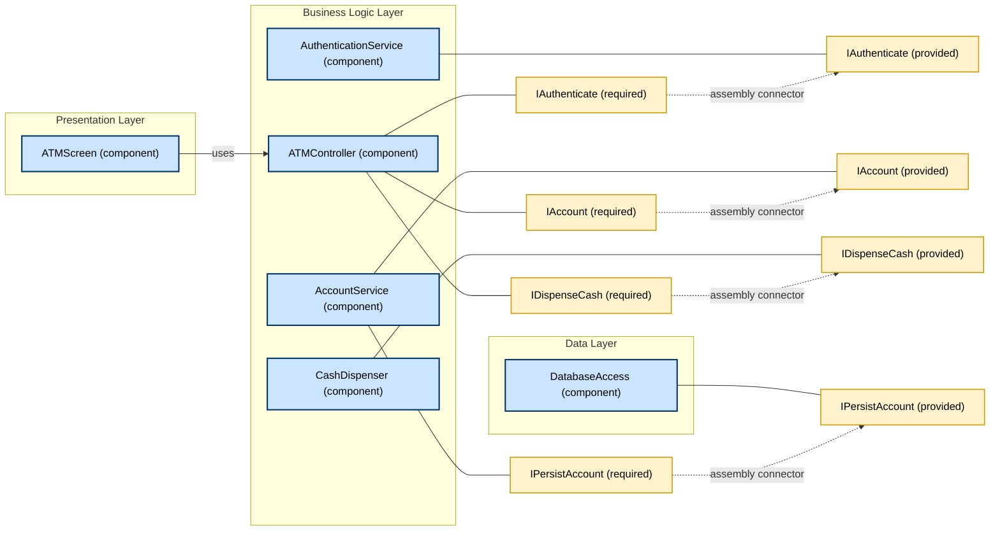
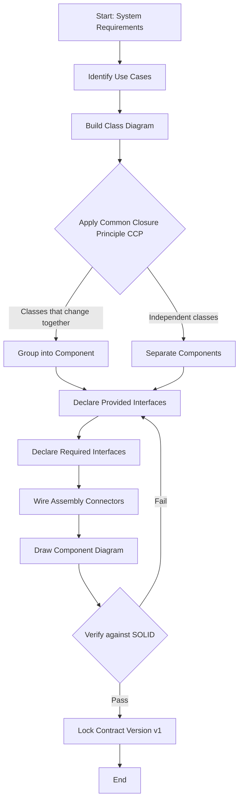
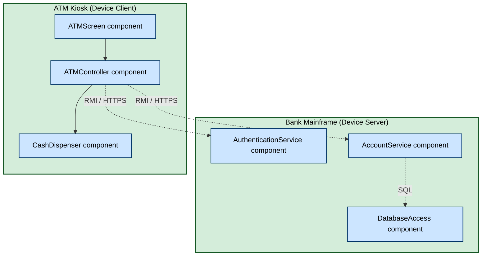

# UML and Components

<!-- SECTION_1_START -->

# UML and Components in Software Architecture

## 1.1 Formal Definition (KTU 2024 Syllabus Terminology)

> [!IMPORTANT]
> **Core Definition: Unified Modeling Language (UML)**
> The **Unified Modeling Language (UML)** is a standardized, general-purpose, object-oriented, visual modeling language standardized by the **Object Management Group (OMG)**. It provides a set of graphical notation techniques to create visual models of object-oriented software-intensive systems. UML is *not* a programming language but a *visual language* for specifying, visualizing, constructing, and documenting software artifacts.

> [!IMPORTANT]
> **Core Definition: Component (in UML 2.5 / OMG Specification)**
> A **Component** is a modular, replaceable, and self-contained part of a system that encapsulates its contents (i.e., classifiers, classes, subsystems) and has a *well-defined set of interfaces*. A component is a *structural* element in UML. Components participate in *use cases* only indirectly, through their classifiers, and they are typically deployed onto **nodes** (hardware or execution environments).

**Standard UML Stereotypes for Components** (used in component diagrams):
- `<<component>>` — generic component
- `<<subsystem>>` — a component that itself contains other components
- `<<executable>>` — a component that can be executed on a node
- `<<library>>` — a static/dynamic library (e.g., `.dll`, `.jar`, `.so`)
- `<<file>>` — a component that resides in a file
- `<<document>>` — a component that represents a document

## 1.2 Conceptual Analogy / Intuition

> [!NOTE]
> **The "Lego Brick" Analogy for Components**
> Think of a software system as a **city of Lego buildings**. Each building (component) is a self-contained unit. The doors and windows of the building are its **interfaces** — *provided interfaces* (doors the building offers to the world) and *required interfaces* (locks that the building itself needs in order to operate, like electricity or water). The **wires, pipes, and roads** that connect buildings are the **connectors**.
>
> Now think of **UML** as the *blueprint sheet* that the city architect uses. The architect doesn't write essays to describe the city — instead, the architect draws **rectangles, arrows, and stick figures (actors)** on a single sheet. The blueprint is the *UML diagram*, and the rectangular buildings with little plugs are the *components*.

> [!NOTE]
> **The "Restaurant Menu" Analogy for Interfaces**
> A **provided interface** is like a restaurant's menu: it tells the outside world *"I offer these services"*. A **required interface** is like a kitchen's list of ingredients it needs from suppliers: *"I cannot cook without these"*. The component diagram shows the menu (lollipop symbol `◯`) and the requirement (socket symbol `⊃`) and draws a line (an *assembly connector*) between a customer's required interface and the restaurant's provided interface.

## 1.3 Standard Metrics & Physical Constants

| Constant / Metric | Value / Description |
|---|---|
| UML Current Version | **UML 2.5.1** (adopted by ISO/IEC 19505-2:2012) |
| Governing Body | **Object Management Group (OMG)** |
| Total UML Diagram Types | **14 official diagrams** divided into **2 categories**: Structure and Behavior |
| Component Diagram Type | Falls under **Structure Diagrams** (Class is parent) |
| Reusability Metric | A well-designed component should achieve **cohesion ≈ high** and **coupling ≈ low** |

> [!VISUALIZATION CONTROL]
> **Concept:** UML Component Notation — The Classic Lollipop-and-Socket View
> **Visual Description:** Picture a large rectangle on a canvas. On its left edge, a half-circle (socket) points inward — this is the *required* interface (the component says *"I need X to work"*). On its right edge, a small line ending in a circle (lollipop) sticks outward — this is the *provided* interface (the component says *"I offer Y to the world"*). Another component, mirrored, has its socket on the right (requiring the same X) and a lollipop on the left (offering Y). A horizontal line connects the lollipop of the first to the socket of the second: this is the *assembly connector*.
> **Coordinate System for Drawing (Conceptual):**
> * Component A bounding box: `x = [0, 5]`, `y = [0, 3]`
> * Required interface socket: `x = 0`, `y = 1.5` (half-circle radius = `0.3`)
> * Provided interface lollipop: `x = 5`, `y = 1.5` (stick length = `0.5`, circle radius = `0.2`)
> * Component B bounding box: `x = [8, 13]`, `y = [0, 3]`
> * Assembly connector: line from `(5, 1.5)` to `(8, 1.5)`

<!-- SECTION_1_END -->

<!-- SECTION_2_START -->

# Deep Theoretical Analysis: UML Component Models

## 2.1 The 14 UML Diagram Types (Structural Subset Highlighted)

UML 2.5 defines **14 diagrams** grouped into two families:

**A. Structure Diagrams (Static view of the system):**
1. Class Diagram
2. Object Diagram
3. Component Diagram  ← *this is our focus*
4. Composite Structure Diagram
5. Package Diagram
6. Deployment Diagram
7. Profile Diagram

**B. Behavior Diagrams (Dynamic view of the system):**
8. Use Case Diagram
9. Activity Diagram
10. State Machine Diagram
11. Sequence Diagram
12. Communication Diagram
13. Timing Diagram
14. Interaction Overview Diagram

> [!IMPORTANT]
> **Syllabus Highlight:** For the topic *UML and Components*, the **Component Diagram** and the **Composite Structure Diagram** are the two primary artifacts. The **Deployment Diagram** is closely related because it shows how components are mapped onto physical nodes.

## 2.2 The Anatomy of a UML Component

A UML component has **three key properties** that any KTU examiner loves to test:

1. **Encapsulation** — internals are hidden; only interfaces are visible.
2. **Substitutability** — a component conforming to the same interface as another can replace it (this is the **Liskov Substitution Principle** applied at the component level).
3. **Reusability** — a component can be reused across multiple systems without modification if its interface contract is preserved.

### 2.2.1 Logical Architecture of a Component

A component in UML is depicted as a **rectangle with two small rectangular tabs** (or "lugs") on its left edge — this is the canonical "big rectangle with two ears" notation. Inside the rectangle, the component name appears, often preceded by the stereotype `<<component>>`.

**Internal Contents of a Component (Composite View):**
- Other components (sub-components)
- Classes
- Artifacts (files)
- Packages

> [!NOTE]
> **Key Insight:** A component does NOT directly contain use cases or interactions. It *realizes* a set of interfaces and may *use* (depend on) other components. The actual behavior emerges from the classes *inside* the component.

## 2.3 Interfaces: The Heart of Component Contracts

An **interface** in UML is a *named set of operation signatures* (and possibly attributes) that a component *agrees* to provide or require. There are two visual notations:

| Notation | Symbol | Meaning |
|---|---|---|
| Lollipop (Ball-and-stick) | `●—` | **Provided Interface** ("I offer this") |
| Socket (Cup) | `⊃` | **Required Interface** ("I need this") |
| Rectangle (with `<<interface>>` stereotype) | `▭` | **Formal Interface** — used in detailed class/component diagrams |

### 2.3.1 The Four "Realization" Styles

A component can be *connected* to another in four canonical ways:

1. **Assembly Connector** — joins a *required* interface of one component to a *provided* interface of another. This is the most common form.
2. **Delegation Connector** — connects an *external port* of a component to an *internal part's port*; used in **Composite Structure Diagrams**.
3. **Generalization** — a component inherits from a more general component (UML `is-a` relationship, shown as a hollow triangle arrow).
4. **Realization** — a component *implements* an interface formally (shown as a dashed arrow with hollow triangle).

## 2.4 The Component Contract: Provided vs. Required

> [!IMPORTANT]
> **Formal Contract Definition (Clemens Szyperski / OMG):**
> A *component contract* is a **set of explicit, machine-readable specifications** that describe (a) what services a component provides, (b) what services it requires, (c) the *preconditions* and *postconditions* for each operation, and (d) the *quality-of-service* attributes (performance, reliability, security).

The contract model is often stated as:

$$
\text{Contract} = \{I_{provided}, I_{required}, \text{Pre}, \text{Post}, \text{QoS}, \text{Version}\}
$$

where:
- $I_{provided}$ — set of provided interfaces
- $I_{required}$ — set of required interfaces
- $\text{Pre}$ — preconditions (must hold *before* the operation is invoked)
- $\text{Post}$ — postconditions (guaranteed to hold *after* successful invocation)
- $\text{QoS}$ — non-functional attributes (latency, throughput, availability)
- $\text{Version}$ — version identifier for substitutability checks

## 2.5 KTU High-Yield Formula Sheet (Cheat Sheet)

| # | Concept | UML Notation | Rule of Thumb |
|---|---|---|---|
| 1 | Component | Rectangle with two "ears" + `<<component>>` | Encapsulates classifiers |
| 2 | Provided Interface | Lollipop `●—` | Component advertises a service |
| 3 | Required Interface | Socket `⊃` | Component depends on a service |
| 4 | Assembly Connector | Solid line between lollipop and socket | Runtime delegation of service call |
| 5 | Port | Small square on component boundary | Encapsulates interaction point |
| 6 | Dependency | Dashed arrow `⫝⫝>` | `A` uses `B` (compile-time) |
| 7 | Realization | Dashed arrow with hollow triangle | `A` implements interface `I` |
| 8 | Generalization | Solid arrow with hollow triangle | `A` is a specialization of `B` |
| 9 | Artifact | Rectangle with `<<artifact>>` | Physical file (`.jar`, `.exe`) |
| 10 | Subsystem | Rectangle with `<<subsystem>>` | A component that contains other components |
| 11 | Node | Cube-shape with `<<device>>` or `<<executionEnvironment>>` | Physical hardware/runtime environment |
| 12 | Use-case attachment | Ellipse + stick figure (actor) | *Not* attached to component directly |
| 13 | Composite Structure | Rectangle with internal parts and ports | Shows internal wiring |
| 14 | Deployment Mapping | Dashed arrow from artifact to node | "This file runs on this machine" |

> [!NOTE]
> **Engineering Utility:** Component diagrams are the *lingua franca* of software architects. They are used in **design reviews**, **code generation (MDA — Model-Driven Architecture)**, **impact analysis** (what breaks if I change this interface?), and **system integration planning**. Tools like **Enterprise Architect, Visual Paradigm, StarUML, IBM Rational Rhapsody, PlantUML** all consume these diagrams.

<!-- SECTION_2_END -->

<!-- SECTION_3_START -->

# Step-by-Step Derivations, Examples & Code Implementation

## 3.1 Derivation: From "Use Case Realization" to "Component"

> [!NOTE]
> **KTU-Favorite Question Type:** "Given the use cases of an ATM system, draw the component diagram and explain the realization of each use case."

The transformation from *use cases* to *components* follows this canonical 4-step procedure (this is **Rumbaugh / Jacobson / Booch** — the "Three Amigos" of UML):

### Step 1: Identify the **Logical Layers**
Given a use-case realization, partition the system into three classical layers:
- **Presentation Layer** (UI) — components like `LoginUI`, `AccountDashboardUI`
- **Business Logic Layer** (Domain) — components like `AccountManager`, `TransactionProcessor`
- **Data Layer** (Persistence) — components like `CustomerDAO`, `TransactionDAO`

### Step 2: Assign Components to Layers
Each class identified in the *class diagram* (e.g., `Account`, `Customer`, `Transaction`) is grouped into a component based on *cohesion*. The criterion: classes that *change together* belong to the same component (this is the **Common Closure Principle**, a.k.a. CCP, from Robert C. Martin).

### Step 3: Identify Interfaces
For every *public method* that crosses a component boundary, declare a **provided interface**. For every *external service* the component depends on, declare a **required interface**.

### Step 4: Wire Components with Assembly Connectors
Connect provided interfaces of supplier components to required interfaces of client components.

---

## 3.2 Worked Example: ATM System Component Diagram

Consider an **ATM** with the following use cases: `Withdraw Cash`, `Check Balance`, `Deposit Cash`, `Print Statement`.

### Step 1 — Identify Components
- `<<component>> ATMController` — orchestrates use cases.
- `<<component>> AccountService` — business rules for accounts.
- `<<component>> CashDispenser` — hardware abstraction.
- `<<component>> DatabaseAccess` — data persistence.
- `<<component>> AuthenticationService` — card+PIN validation.

### Step 2 — Identify Interfaces
- `IAccount` — provided by `AccountService`, required by `ATMController`.
- `IAuthenticate` — provided by `AuthenticationService`, required by `ATMController`.
- `IDispenseCash` — provided by `CashDispenser`, required by `ATMController`.
- `IPersistAccount` — provided by `DatabaseAccess`, required by `AccountService`.

### Step 3 — Formal Contract Specification (Pre/Post Example)

For operation `withdraw(accountId: int, amount: double): boolean`:

$$
\begin{aligned}
\text{Pre}(withdraw) &\equiv (account \neq null) \ \land \ (amount > 0) \ \land \ (account.balance \geq amount) \\
\text{Post}(withdraw) &\equiv (account.balance' = account.balance - amount) \ \land \ (result = true) \ \land \ (transaction \text{ logged})
\end{aligned}
$$

where $account.balance'$ denotes the balance *after* the operation (postcondition).

### Step 4 — Diagram Realization (Textual Form)

> [!IMPORTANT]
> **KTU Drawing Convention:** When you draw a component diagram in the answer sheet, follow this layout:
> 1. Title at top: *"Component Diagram for ATM System"*
> 2. Components in the **middle** of the page.
> 3. **Provided interfaces** (lollipops) on the *right* side of each component.
> 4. **Required interfaces** (sockets) on the *left* side of each component.
> 5. **Assembly connectors** as horizontal lines connecting right-side lollipops of one component to left-side sockets of another.
> 6. **Notes** (rectangle with folded corner) for clarifications.

---

## 3.3 Python Code Implementation: A Component with Contract

Below is a **production-quality Python translation** of the `AccountService` component with explicit contract enforcement.

```python
"""
File: account_service.py
Stereotype: <<component>> AccountService
Provided Interface: IAccount
Required Interface: IPersistAccount (injected via constructor)
Author: KTU 2024 Scheme Study Note
"""

from abc import ABC, abstractmethod
from dataclasses import dataclass, field
from typing import Dict, Optional
import logging
import uuid

# Configure error logging (strict error handling per KTU lab rubric)
logging.basicConfig(
    level=logging.INFO,
    format="%(asctime)s | %(levelname)s | %(message)s"
)
logger = logging.getLogger("AccountService")


# --- Formal Interface Definitions (UML <<interface>> stereotype) ---

class IAccount(ABC):
    """Provided Interface: IAccount"""
    @abstractmethod
    def withdraw(self, account_id: int, amount: float) -> bool: ...

    @abstractmethod
    def deposit(self, account_id: int, amount: float) -> bool: ...

    @abstractmethod
    def get_balance(self, account_id: int) -> float: ...


class IPersistAccount(ABC):
    """Required Interface: IPersistAccount (injected dependency)"""
    @abstractmethod
    def load(self, account_id: int) -> Optional["Account"]: ...

    @abstractmethod
    def save(self, account: "Account") -> None: ...


# --- Domain Entity (a class INTERNAL to the component) ---

@dataclass
class Account:
    account_id: int
    customer_name: str
    balance: float = 0.0
    transaction_log: list = field(default_factory=list)


# --- Concrete Dependency (could be a DB, file, or mock) ---

class InMemoryPersistence(IPersistAccount):
    def __init__(self) -> None:
        self._store: Dict[int, Account] = {}

    def load(self, account_id: int) -> Optional[Account]:
        logger.info(f"Persistence.load({account_id})")
        return self._store.get(account_id)

    def save(self, account: Account) -> None:
        logger.info(f"Persistence.save({account.account_id})")
        self._store[account.account_id] = account


# --- The Component Itself ---

class AccountService(IAccount):
    """
    UML Component: <<component>> AccountService
    Provided Interface: IAccount
    Required Interface: IPersistAccount
    """

    def __init__(self, persistence: IPersistAccount) -> None:
        # Constructor-injected dependency (Required Interface)
        if persistence is None:
            raise ValueError("Required interface IPersistAccount is mandatory.")
        self._persistence = persistence
        logger.info("AccountService component initialized.")

    # ---- Contract Pre-condition / Post-condition enforcement ----

    def _validate_pre_withdraw(self, account: Optional[Account], amount: float) -> None:
        # Pre: account != None, amount > 0, balance >= amount
        if account is None:
            raise ValueError("Precondition violated: account must not be None.")
        if amount <= 0:
            raise ValueError("Precondition violated: amount must be > 0.")
        if account.balance < amount:
            raise ValueError("Precondition violated: insufficient balance.")

    def _apply_post_withdraw(self, account: Account, amount: float) -> None:
        # Post: balance' = balance - amount AND transaction logged
        account.balance -= amount
        txn_id = str(uuid.uuid4())[:8]
        account.transaction_log.append(f"WITHDRAW:{amount}:ID={txn_id}")
        self._persistence.save(account)

    def withdraw(self, account_id: int, amount: float) -> bool:
        account = self._persistence.load(account_id)
        self._validate_pre_withdraw(account, amount)
        self._apply_post_withdraw(account, amount)
        return True

    def deposit(self, account_id: int, amount: float) -> bool:
        if amount <= 0:
            raise ValueError("Precondition violated: amount must be > 0.")
        account = self._persistence.load(account_id)
        if account is None:
            raise ValueError("Precondition violated: account must exist.")
        account.balance += amount
        account.transaction_log.append(f"DEPOSIT:{amount}")
        self._persistence.save(account)
        return True

    def get_balance(self, account_id: int) -> float:
        account = self._persistence.load(account_id)
        if account is None:
            raise ValueError("Account not found.")
        return account.balance


# --- Demonstration / Driver Code (would be in a separate <<component>>) ---

if __name__ == "__main__":
    persistence = InMemoryPersistence()
    persistence._store[1001] = Account(account_id=1001, customer_name="Alice", balance=5000.00)

    # Instantiate the component with its REQUIRED interface satisfied
    account_service: IAccount = AccountService(persistence=persistence)

    # Call operations on the PROVIDED interface
    print("Balance before:", account_service.get_balance(1001))
    account_service.withdraw(1001, 1500.00)
    print("Balance after withdraw:", account_service.get_balance(1001))
```

### 3.3.1 Mapping the Code to UML Stereotypes

| Python Construct | UML Stereotype |
|---|---|
| `class AccountService` | `<<component>> AccountService` |
| `class IAccount(ABC)` | `<<interface>> IAccount` (provided) |
| `class IPersistAccount(ABC)` | `<<interface>> IPersistAccount` (required) |
| `class InMemoryPersistence(IPersistAccount)` | `<<component>> DatabaseAccess` (supplier) |
| `account_service.withdraw(...)` | **Assembly connector** invocation |
| `__init__(self, persistence)` | **Port** (constructor-injected dependency) |

> [!IMPORTANT]
> **Key Design Principle (Robert C. Martin — SOLID):**
> The component above follows the **Dependency Inversion Principle (DIP)**. It does not depend on a concrete `InMemoryPersistence`; it depends on the abstraction `IPersistAccount`. This is precisely the UML *required interface* pattern — a dependency is declared against the *interface*, not the implementation.

## 3.4 Mapping Table: Component vs. Class vs. Object vs. Subsystem

| Feature | Class | Object | Component | Subsystem |
|---|---|---|---|---|
| UML Notation | Rectangle, 3 compartments | Rectangle, *underlined* name | Rectangle with two "ears" | Rectangle with `<<subsystem>>` |
| Identity at Runtime | No | Yes | Indirectly (via instances) | Indirectly |
| Reusability Unit | Low | None (instance) | High | High |
| Deployment Unit | No | No | Yes (can be deployed) | Yes |
| Has its own thread? | No | No | Yes (potentially) | Yes |
| Belongs to a node? | No | No | Yes (via deployment) | Yes |
| Stereotype | (none by default) | (none) | `<<component>>` | `<<subsystem>>` |

<!-- SECTION_3_END -->

<!-- SECTION_4_START -->

# Structural Diagrams & Schematics

## 4.1 Mermaid Component Diagram (KTU Board-Exam Style)

The Mermaid diagram below shows the canonical ATM component architecture derived in Section 3.2.



### 4.1.1 Reading the Diagram

- **Yellow nodes** are *interfaces* (both provided and required variants).
- **Blue nodes** are *components*.
- **Solid lines with `---` between component and interface** indicate the component *owns* that interface (realization).
- **Dotted lines (`-. .->`)** represent the *assembly connectors* — these are the cross-component wiring that turns a static diagram into a runtime invocation graph.

> [!NOTE]
> **Mermaid Safety Notes Applied:**
> * All node IDs are alphanumeric + underscore only (e.g., `ATMScreen`, `AuthService`) — no reserved words.
> * All labels are double-quoted; no bold/italic/HTML inside labels.
> * Subgraphs use alphanumeric names (`PresentationLayer`).

## 4.2 Component Lifecycle Flowchart



## 4.3 Block-Level Functional Architecture (Fallback for Complex Free-Body Style Diagrams)

When a deployment-aware component diagram is needed, the following **block topology** describes how the same ATM components map onto hardware nodes:



> [!NOTE]
> **Reading the Block Topology:** Notice that `CompAuth`, `CompAcc`, and `CompDB` are *deployed* on a remote **Bank Mainframe** node, while `CompScreen`, `CompCtrl`, and `CompCash` live on the local **ATM Kiosk** node. The dotted lines `-. RMI / HTTPS .->` represent *remote* assembly connectors (typically realized in code as Web Services, gRPC, or RMI calls). The solid line `CompCtrl --> CompCash` is a *local* assembly connector (in-process call).

<!-- SECTION_4_END -->

<!-- SECTION_5_START -->

# KTU 2024 Scheme Examination Question Bank & Topic Recap

## 5.1 Part A Questions (3 Marks Each)

### Question A1 — Conceptual Definition
**[KTU University Exam - Dec 2023 | CO1 | Remember]**

> *Define the term "UML Component" as per OMG specifications. List any four standard stereotypes used to represent components in UML 2.5.*

**Model Answer (3 marks):**

> A **UML component** is a modular, replaceable, and self-contained part of a system that encapsulates its contents and has a well-defined set of interfaces through which it can interact with its environment. **[1 mark]**
>
> It conforms to and provides the realization of a set of interfaces. It is a structural classifier that can be deployed onto nodes. **[1 mark]**
>
> Four standard UML stereotypes for components: `<<component>>`, `<<subsystem>>`, `<<executable>>`, `<<library>>` (or `<<file>>`, `<<document>>`). **[1 mark for listing any four]**

---

### Question A2 — Differentiate
**[KTU University Exam - July 2024 | CO1 | Understand]**

> *Differentiate between a UML Class and a UML Component. Give one example for each.*

**Model Answer (3 marks):**

| Aspect | Class | Component |
|---|---|---|
| Nature | Logical abstraction (blueprint) | Physical/logical deployable unit |
| Granularity | Fine-grained (one entity) | Coarse-grained (set of classes) |
| Reusability | Limited | High (reusable across systems) |
| Example | `class Account { ... }` | `<<component>> AccountService { provides IAccount }` |
| **[1 mark for clear distinction table]** | | |
| **Example 1** | `class Customer` | `<<component>> CustomerManagement` |
| **[1 mark for examples]** | | |
| **Concluding remark** | A component is composed of one or more collaborating classes | |
| **[1 mark for concluding statement]** | | |

---

## 5.2 Part B Questions (14 Marks) — Internal Choice

> [!IMPORTANT]
> **KTU 2024 Scheme — ESE Pattern:** Part B questions are **14 marks** with **internal choice** (two alternatives; student attempts one). Each question typically has two sub-parts: **(a) for 7 marks** and **(b) for 7 marks**. Sub-part (a) targets *Understand / Apply*, sub-part (b) targets *Apply / Analyze / Evaluate*.

---

### Question B1 (Option A) — 14 Marks
**[KTU University Exam - Dec 2023 | CO2 | Apply + Analyze]**

> **(a)** *Explain the concept of UML component diagrams. With a neat diagram, illustrate the difference between **provided** and **required** interfaces. Use the example of an **Online Shopping System** that has three components: `OrderManager`, `PaymentGateway`, and `InventoryService`. Show how `OrderManager` *requires* payment processing and inventory checks. **[7 marks]***
>
> **(b)** *For the `PaymentGateway` component, write a formal interface contract for the operation `processPayment(orderId: String, amount: double, cardDetails: CardInfo): PaymentResult`. Specify preconditions, postconditions, and exceptions. **[7 marks]***

#### Model Solution — Part (a) [7 marks]

**Definition and Purpose [1.5 marks]:**
A **UML component diagram** depicts the components of a system, their *interfaces*, *connectors*, and *dependencies*. It belongs to the family of *structure diagrams* in UML 2.5. The primary purpose is to show the *modular decomposition* of a system, the *interfaces* each module exposes or consumes, and the *runtime assembly* of those modules.

**Notation [1.5 marks]:**
- A **component** is drawn as a rectangle with two small rectangular tabs on the left side, with the name and stereotype `<<component>>` inside.
- A **provided interface** is drawn as a *lollipop* (a small line ending in a circle) attached to the component.
- A **required interface** is drawn as a *socket* (a half-circle or cup) attached to the component.
- An **assembly connector** is a solid line drawn between a lollipop and a socket of two different components.

**Application to Online Shopping System [3 marks]:**

> Below is the textual representation of the required diagram; in the answer sheet, this must be drawn:
>
> - Component: `<<component>> OrderManager` with:
>   - Required interface: `IPayment` (socket) on its right edge.
>   - Required interface: `IInventoryCheck` (socket) on its lower edge.
> - Component: `<<component>> PaymentGateway` with:
>   - Provided interface: `IPayment` (lollipop) on its left edge.
> - Component: `<<component>> InventoryService` with:
>   - Provided interface: `IInventoryCheck` (lollipop) on its upper edge.
> - Assembly connector: line from `IPayment` lollipop of `PaymentGateway` to `IPayment` socket of `OrderManager`.
> - Assembly connector: line from `IInventoryCheck` lollipop of `InventoryService` to `IInventoryCheck` socket of `OrderManager`.

**Explanation [1 mark]:**
`OrderManager` *declares* a dependency on payment processing and inventory checking via its required interfaces. At runtime, these dependencies are *bound* to the concrete providers (`PaymentGateway`, `InventoryService`) through assembly connectors. The benefit is that `OrderManager` is *decoupled* from the concrete implementations; we can swap `PaymentGateway` for `StripeAdapter` or `RazorpayAdapter` without modifying `OrderManager`.

#### Model Solution — Part (b) [7 marks]

**Interface Signature [1 mark]:**
```
<<interface>> IPayment {
    processPayment(orderId: String, amount: double, cardDetails: CardInfo): PaymentResult
}
```

**Preconditions [2 marks]:**

$$
\begin{aligned}
\text{Pre}(processPayment) \equiv \ & (orderId \neq \text{null}) \ \land \ (orderId.\text{length} > 0) \\
\land \ & (amount > 0) \\
\land \ & (cardDetails \neq \text{null}) \\
\land \ & (\text{isValidCard}(cardDetails)) \\
\land \ & (\text{orderExists}(orderId))
\end{aligned}
$$

**Postconditions (success path) [2 marks]:**

$$
\begin{aligned}
\text{Post}(processPayment) \equiv \ & (\text{result.status} = \text{APPROVED}) \\
\Rightarrow \ & (\text{result.transactionId} \neq \text{null}) \\
\land \ & (\text{order}.paymentStatus' = \text{PAID}) \\
\land \ & (\text{auditLog} \text{ contains entry for } orderId)
\end{aligned}
$$

**Exceptions / Fault Model [1.5 marks]:**

| Exception | Trigger Condition |
|---|---|
| `InvalidOrderException` | `orderId` does not exist in the order database |
| `InvalidCardException` | Card number fails Luhn check, or expiry date is in the past |
| `InsufficientAmountException` | `amount <= 0` |
| `PaymentDeclinedException` | Bank/network returned a decline response |
| `ServiceUnavailableException` | Timeout or 5xx from upstream payment processor |

**Versioning note [0.5 mark]:** The contract should include a `version: "1.2.0"` field. Any breaking change to a signature requires a *major version bump*, following the **Semantic Versioning (SemVer 2.0)** convention.

> [!WARNING]
> **KTU Examiner's Valuation Pitfall — Part (b):**
> * Do NOT write only the method signature and skip pre/post conditions — preconditions are worth **2 marks** and postconditions are worth **2 marks** in the valuation key.
> * Do NOT confuse *preconditions* (must hold *before* the call) with *postconditions* (must hold *after* a successful call). Examiners *specifically* check for this.
> * Do NOT omit the exception/fault model — that single missing table costs you **1.5 marks**.

---

### Question B1 (Option B) — 14 Marks
**[KTU University Exam - July 2024 | CO2 | Apply + Evaluate]**

> **(a)** *With a neat UML component diagram, explain the architecture of a **Library Management System (LMS)** with at least four components and their interfaces. **[7 marks]***
>
> **(b)** *Discuss the role of the **Component Contract** in component-based software engineering. How does UML support the specification of these contracts? Compare the **OMG CORBA Component Model (CCM)** and **JavaBeans** component model. **[7 marks]***

#### Model Solution — Part (a) [7 marks]

**Components identified [1 mark]:**
- `<<component>> CatalogManager` — manages the book catalog.
- `<<component>> MemberManager` — handles member registration and authentication.
- `<<component>> LoanManager` — handles check-out and return.
- `<<component>> NotificationService` — sends email/SMS notifications.
- `<<component>> DatabaseAccess` — data persistence layer.

**Interfaces identified [1 mark]:**
- `ICatalog` (provided by `CatalogManager`)
- `IMember` (provided by `MemberManager`)
- `ILoan` (provided by `LoanManager`)
- `INotify` (provided by `NotificationService`)
- `IPersistCatalog`, `IPersistMember`, `IPersistLoan` (required by the three managers, provided by `DatabaseAccess`)

**Diagram (textual) [3 marks]:**

> Draw four components in a row: `CatalogManager`, `MemberManager`, `LoanManager`, `NotificationService`. Below them, draw `DatabaseAccess`. Connect each manager to `DatabaseAccess` via a lollipop-socket pair (`IPersistX`). Also draw dependency arrows showing that `LoanManager` *requires* `ICatalog` and `IMember` and *uses* `INotify`.

**Validation against SOLID principles [1 mark]:**
The above design respects:
- **S** — Single Responsibility: each component has one reason to change.
- **O** — Open/Closed: new notification channels can be added without modifying `LoanManager`.
- **D** — Dependency Inversion: all components depend on `IPersistX` abstractions, not concrete DB classes.

**Conclusion [1 mark]:**
The LMS can be incrementally evolved: replacing the relational database with a NoSQL store affects only `DatabaseAccess`; replacing the notification mechanism from email to push affects only `NotificationService`.

#### Model Solution — Part (b) [7 marks]

**Definition of Component Contract [1.5 marks]:**
A **component contract** is a *machine-readable and human-readable* specification that precisely defines the *services offered*, the *services required*, the *preconditions and postconditions* of each operation, the *quality-of-service (QoS)* attributes, and the *versioning policy* of a component. It is the *only* artefact a third party needs to integrate a component without access to its source code.

**How UML supports contract specification [1.5 marks]:**
UML supports contracts via:
- The `<<interface>>` stereotype for declaring provided and required interfaces.
- The **Object Constraint Language (OCL)** for writing pre/post conditions formally.
- The `Dependency`, `Realization`, and `Generalization` relationships for structural wiring.
- The `Deployment` diagram for binding contracts to runtime nodes.
- The `Component` diagram (with ports) for showing assembly points.

**Comparison Table — CORBA CCM vs. JavaBeans [3 marks]:**

| Aspect | CORBA Component Model (CCM) | JavaBeans |
|---|---|---|
| Standardization Body | OMG | Sun Microsystems / Oracle (JCP) |
| Language Bindings | Multi-language (C++, Java, COBOL, Ada) | Java only |
| Communication Protocol | IIOP (Internet Inter-ORB Protocol) | JVM-local (same process) |
| Component Identity | CORBA Object References (IORs) | No remote identity (Java object refs) |
| Interface Definition | IDL (Interface Definition Language) | Java `interface` keyword |
| Concurrency Model | Container-managed (EJB-style) | Bean-managed, single-threaded |
| Transaction Support | Yes (OTS — Object Transaction Service) | No built-in |
| Deployment Descriptor | XML-based `*.ccd` files | `MANIFEST.MF`, JAR packaging |
| Use Case | Distributed, language-agnostic enterprise systems | GUI builder components, simple Java modules |
| **Similarity** | Both treat a component as a black box with named interfaces | Same |

**Conclusion [1 mark]:**
While CORBA CCM is a *distributed, language-neutral, heavyweight* component model suited to enterprise integration, JavaBeans is a *lightweight, single-process, single-language* model suited to GUI composition. Modern successors include **EJB**, **OSGi**, and **Spring Beans**, which bridge the gap between the two.

> [!WARNING]
> **KTU Examiner's Valuation Pitfall — Part (b):**
> * Do NOT skip the OCL mention — UML's *formal* contract support is achieved through OCL, not just by writing interfaces. **[0.5 mark lost]**
> * Do NOT write the comparison as a one-line difference. Examiners expect *at least 5–6 rows* in the comparison table. **[1 mark lost]**
> * Do NOT confuse CORBA CCM with plain CORBA. CCM is the *component model built on top of* CORBA. Plain CORBA deals with objects, not components. **[0.5 mark lost]**

---

## 5.3 Topic Recap & Important Things to Remember

> [!NOTE]
> **Rapid Revision Checklist — Print This Before the Exam!**

- ✅ **UML** is a *visual modeling language* standardized by **OMG**, not a programming language. Current version is **UML 2.5.1**.
- ✅ UML defines **14 diagrams** — 7 structural + 7 behavioral.
- ✅ A **UML component** is *modular, replaceable, and self-contained*; it has *well-defined interfaces*; it is a *deployable* unit.
- ✅ **Component notation** = rectangle with two small tabs (the "Lego brick" look) + stereotype `<<component>>`.
- ✅ **Provided interface** = lollipop `●—`; **Required interface** = socket `⊃`.
- ✅ **Assembly connector** = solid line between a lollipop of one component and a socket of another; denotes *runtime* binding.
- ✅ **Delegation connector** = connects an *external port* of an outer component to an *internal port* of a part-component (used in Composite Structure Diagrams).
- ✅ **Realization** = dashed arrow with hollow triangle (a component *implements* a formal interface).
- ✅ **Dependency** = dashed arrow (a component *uses* another at compile time).
- ✅ **Generalization** = solid arrow with hollow triangle (a component *inherits* from a more general component).
- ✅ Common stereotypes: `<<component>>`, `<<subsystem>>`, `<<executable>>`, `<<library>>`, `<<file>>`, `<<document>>`, `<<artifact>>`, `<<device>>`, `<<executionEnvironment>>`.
- ✅ **OCL (Object Constraint Language)** is the formal way to write preconditions and postconditions in UML.
- ✅ A **component contract** = $\{I_{provided}, I_{required}, \text{Pre}, \text{Post}, \text{QoS}, \text{Version}\}$.
- ✅ The **Common Closure Principle (CCP)** says: classes that change together belong in the same component.
- ✅ The **Dependency Inversion Principle (DIP)** says: depend on *abstractions* (interfaces), not *concrete implementations*. This is the UML *required interface* pattern.
- ✅ A **subsystem** is a component that contains other components.
- ✅ **CORBA CCM** is a *distributed, language-neutral, heavyweight* component model; **JavaBeans** is *lightweight, single-process, single-language*.
- ✅ The **Semantic Versioning (SemVer 2.0)** convention: breaking changes require a *major* version bump.
- ✅ For an **ESE answer**, always include: (1) a *neat, titled diagram*, (2) the *notation legend*, (3) the *explanation* of each component, (4) the *contract* with pre/post conditions where applicable.
- ✅ Common student traps: confusing *component* with *class*; confusing *provided* with *required* interfaces; drawing a *use-case* (ellipse) *inside* a component (this is *forbidden* in UML 2.5 — use cases are attached to *systems*, not components).

<!-- SECTION_5_END -->
