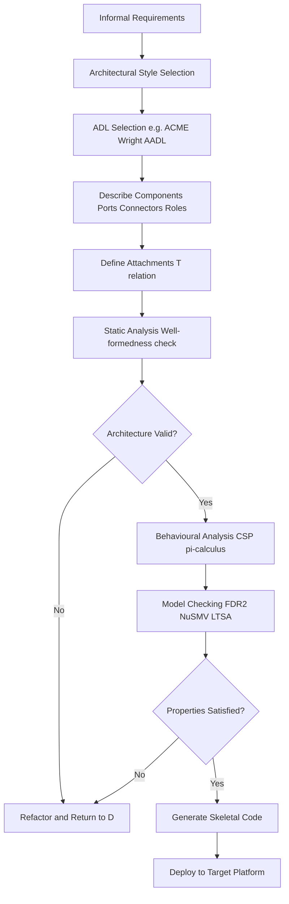
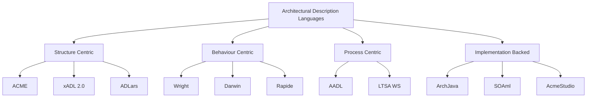
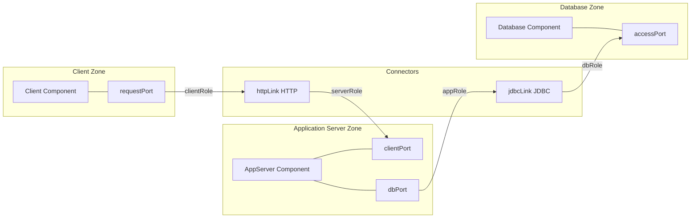
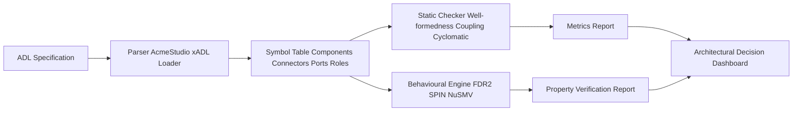

# Architectural Description Languages (ADLs)- Overview and Applications

<!-- SECTION_1_START -->
# Architectural Description Languages (ADLs) - Overview and Applications

## 1.1 Formal Definition (KTU 2024 Syllabus Terminology)

> [!NOTE]
> **Architectural Description Language (ADL)** is a formal, declarative, machine-processable language used to represent the **software architecture** of a system as a composition of **components**, **connectors**, and **configurations**, while explicitly supporting the analysis, reasoning, and transformation of architectural designs.

According to the standard IEEE 1471 / ISO 42010 terminology adopted by KTU 2024 scheme, an ADL must allow the architect to capture the **architectural elements** of a system, the **interactions** among them, the **constraints** governing their composition, and the **semantic reasoning** mechanisms for design-time evaluation.

An ADL is *not* a programming language. It is a **modelling language** that operates at a higher level of abstraction - the level of *boxes and arrows* that govern the runtime structure of a software system.

### The Three Pillars of an ADL

| Pillar | Meaning | Example Element |
|---|---|---|
| **Component** | A unit of computation or data store | Web server, database, microservice |
| **Connector** | A unit of interaction mediating components | Procedure call, pipe, event-bus, REST API |
| **Configuration** | The topological attachment of components to connectors | System topology / deployment graph |

> [!IMPORTANT]
> **KTU Highlight:** A good ADL must satisfy the *3-C Rule* - it must be capable of describing **C**omponents, **C**onnectors, and **C**onfigurations in a single, coherent, machine-readable form.

---

## 1.2 Conceptual Analogy / Intuition

> [!TIP]
> **Real-World Analogy — "The Architect's Blueprint"**
>
> Imagine constructing a 50-storey building. The civil engineer does not hand the construction crew raw C code or English paragraphs. Instead, the engineer provides a **blueprint** — a formal, symbolic drawing in which:
>
> * **Walls, columns, slabs** correspond to *software components* (computational units).
> * **Pipes, wires, ducts** correspond to *connectors* (interaction mechanisms).
> * **Floor plans** correspond to *configurations* (how walls and pipes are wired together).
>
> Just as a blueprint uses standardised symbols (BS-1192 / ISO 19650), an ADL provides a **standardised vocabulary** for the software architect. Without ADLs, architects are forced to use ad-hoc box-and-arrow diagrams in PowerPoint - which cannot be analysed, simulated, or checked for consistency by tools.
>
> **In one sentence:** *An ADL is to a software system what a structural blueprint is to a building - a precise, analysable description of the system's skeleton.*

---

## 1.3 Why ADLs Matter in Modern Engineering

> [!IMPORTANT]
> **Industry Standard Reference:** The **Software Engineering Institute (SEI)** at Carnegie Mellon and the **Object Management Group (OMG)** formally recognised ADLs as the foundational backbone of **Model-Driven Architecture (MDA)** and **DevSecOps pipelines**. The cost of fixing a defect at the architectural level is **50×–200×** cheaper than fixing it post-deployment (per *Boehm's Cost of Fix Curve*).

Three engineering motivations drive the adoption of ADLs in the KTU 2024 curriculum:

1. **Preservation of Design Intent** — code loses architectural information; ADLs preserve it.
2. **Early-Stage Analysis** — properties like *deadlock-freeness*, *throughput*, *latency*, and *reliability* can be reasoned about *before* a single line of code is written.
3. **Automated Code Generation & Refactoring** — modern tools (e.g., AcmeStudio, ArchStudio, xADL 2.0) can synthesise skeletons in Java, C++, or Rust from an ADL specification.

---

## 1.4 GeoGebra / Desmos Visualisation Note

> [!VISUALIZATION CONTROL]
> **Concept:** ADL Topology as a Mathematical Graph
> **GeoGebra / Desmos Input Equations:**
> * Define component vertices: $C = \{c_1, c_2, c_3, c_4\}$
> * Define connector edges: $E = \{(c_1, c_2),\ (c_2, c_3),\ (c_3, c_4),\ (c_4, c_1)\}$
> * Visualise using a **graph object** with weighted edges $w_{ij}$ representing connector cost / latency.
>
> **Visual Description:** The student should see a *quadrilateral topology* where vertices represent components and edges represent typed connectors. This is the *core mental model* used by every ADL evaluator in the industry.

---

<!-- SECTION_1_END -->

<!-- SECTION_2_START -->
# 2. Deep Theoretical Analysis & KTU High-Yield Formula Sheet

## 2.1 Taxonomy of ADLs

ADLs are broadly classified into three families based on the **primary abstraction** they emphasise:

| Family | Emphasis | Representative ADLs | Best Suited For |
|---|---|---|---|
| **Structure-Centric** | Components & connectors as first-class | **ACME**, **xADL 2.0**, **ADLars** | Static architectural modelling |
| **Behaviour-Centric** | Communication protocols & state machines | **Wright**, **Darwin/Regena**, **Rapide** | Concurrent / distributed systems |
| **Process / Pipe-Centric** | Data flow & coordination | **AADL** (SAE standard), **LTSA-WS** | Embedded & real-time systems |
| **Implementation-Backed** | Direct code generation | **ArchJava**, **SOAml**, **AcmeStudio** | Industry tooling pipelines |

> [!NOTE]
> **KTU Board Tip:** When a question asks for "classify ADLs" or "compare two ADLs", the examiner expects you to **name the family**, **state the abstraction it emphasises**, and **give one real-world use case**.

---

## 2.2 Core ADL Constituents — The Mathematical Model

A software architecture $\mathcal{A}$ in any ADL can be formally expressed as the **4-tuple**:

$$
\mathcal{A} = (C,\ \mathcal{K},\ \mathcal{P},\ \mathcal{T})
$$

where each term is explained in the table below.

| Symbol | Set / Function | Meaning | KTU 3-Mark Hotspot |
|---|---|---|---|
| $C$ | Set | Finite set of **components** $C = \{c_1, c_2, \ldots, c_n\}$ | Often asked as "Define $C$" |
| $\mathcal{K}$ | Set | Finite set of **connectors** $\mathcal{K} = \{k_1, k_2, \ldots, k_m\}$ | Distinguish *role* vs *glue* |
| $\mathcal{P}$ | Function | **Port map** $\mathcal{P} : C \rightarrow 2^{\text{Ports}}$ | Ports are interaction points |
| $\mathcal{T}$ | Relation | **Attachment relation** $\mathcal{T} \subseteq \text{Ports} \times \text{Roles}$ | Defines the configuration |

> [!IMPORTANT]
> **The Configuration Rule:** An architecture is *well-formed* iff every port of every component is attached to exactly one role of exactly one connector. Mathematically:
>
> $$\forall\, c \in C,\ \forall\, p \in \mathcal{P}(c):\ \exists!\ k \in \mathcal{K},\ \exists!\ r \in \text{Roles}(k)\ \text{such that}\ (p, r) \in \mathcal{T}$$
>
> Violations of this rule constitute **architectural anti-patterns** such as *orphaned ports* and *role conflicts*.

---

## 2.3 Connector Algebra — The Heart of Every ADL

Connectors are not mere lines. They encapsulate an **interaction protocol** modelled as a finite state machine. The connector semantics can be characterised by the tuple:

$$
K = (\Sigma,\ S,\ s_0,\ \delta,\ F)
$$

| Term | Set / Function | Meaning |
|---|---|---|
| $\Sigma$ | Alphabet | The set of observable events (e.g., *call*, *return*, *timeout*) |
| $S$ | States | Internal protocol states |
| $s_0 \in S$ | Initial state | The starting protocol state |
| $\delta : S \times \Sigma \rightarrow S$ | Transition function | How the connector reacts to events |
| $F \subseteq S$ | Final states | Terminal (closed) protocol states |

> [!TIP]
> **Engineering Utility:** This formalisation is what allows **model checking** (using tools like *SPIN*, *NuSMV*, or *LTSA*) to verify properties like *no deadlock* ($\forall s \in S,\ \exists \sigma \in \Sigma^*,\ \delta(s, \sigma) \in F$) and *eventual delivery* ($\forall$ sent message $m,\ \exists$ received message $m$). This is the *theoretical bridge* between architecture and formal verification — a **favourite KTU Part B question** area.

---

## 2.4 Comparative Table of Five Landmark ADLs

| Feature | **ACME** | **Wright** | **Darwin** | **xADL 2.0** | **AADL (SAE)** |
|---|---|---|---|---|---|
| **Year** | 1995 | 1997 | 1996 | 2002 | 2004 (rev 2017) |
| **Developer** | CMU SEI | CMU SEI | Imperial College | UCI / CMU | SAE International |
| **Notation Style** | Tagged textual + diagrams | CSP-based | $\pi$-calculus based | XML-based | XML + graphical |
| **Strength** | Interchange format | Behavioural reasoning | Dynamic reconfiguration | Extensibility | Real-time / embedded |
| **Analysis** | Limited (style-based) | Model checking (FDR2) | Process-algebraic | Plug-in based | Schedulability, safety |
| **Tool** | AcmeStudio | FDR2 / LTSA | Regena tool | ArchStudio 4 | OSATE 2 |
| **Industry Use** | Academic standard | Protocol verification | Adaptive systems | Research | Avionics, automotive |

> [!IMPORTANT]
> **KTU Mark Booster:** Memorising the *tooling* column (third-from-bottom) is a recurring 3-mark short-answer question in KTU model papers. Tools like *FDR2* (Failures-Divergence Refinement) and *OSATE 2* (Open Source AADL Tool Environment) are the board's favourites.

---

## 2.5 Real-World Applications of ADLs

1. **Avionics & Aerospace (DO-178C compliance)** — Boeing and Airbus use **AADL** to model flight-control architectures and prove timing constraints before coding.
2. **Automotive Embedded Systems (AUTOSAR alignment)** — Toyota and Bosch use ADL-style models to describe ECU topologies and verify ISO 26262 functional-safety properties.
3. **Cloud-Native Microservices (Kubernetes + Istio manifests)** — Modern YAML-based service meshes (Istio, Linkerd) are essentially *lightweight ADLs* describing components (pods), connectors (services), and configurations (deployments).
4. **Healthcare Software (FDA pre-cert workflows)** — ADLs document regulated medical-device software for FDA pre-market review.
5. **Cyber-Physical Systems (Industry 4.0)** — AADL and its extension **SAW (Software Architecture Workbench)** are used to model IIoT edge-gateway architectures.

> [!TIP]
> **Real-World Engineering Insight:** When you write a *docker-compose.yaml* or a *Kubernetes Deployment manifest*, you are effectively authoring a *restricted ADL*. The same principle — describing components, connectors, and topologies in a machine-readable form — applies, but with industrial tooling for orchestration.

---

## 2.6 KTU Formula / Cheat-Sheet Summary

| # | Concept | Equation / Rule | KTU Use-Case |
|---|---|---|---|
| 1 | Architecture tuple | $\mathcal{A} = (C, \mathcal{K}, \mathcal{P}, \mathcal{T})$ | Definition question |
| 2 | Well-formedness | $\forall p \in \mathcal{P}(c),\ \exists!\ (p, r) \in \mathcal{T}$ | Anti-pattern detection |
| 3 | Connector FSM | $K = (\Sigma, S, s_0, \delta, F)$ | Behavioural analysis |
| 4 | Deadlock-freeness | $\forall s \in S,\ \exists \sigma : \delta(s, \sigma) \in F$ | Verification question |
| 5 | Architectural complexity | $V = \vert C \vert + \vert \mathcal{K} \vert + \vert \mathcal{T} \vert$ | Metric for evaluation |
| 6 | Coupling density | $\text{CD} = \dfrac{\vert \mathcal{T} \vert}{\vert C \vert \cdot (\vert C \vert - 1)}$ | Architectural smell metric |

> **Note on notation:** All absolute values use $\vert \cdot \vert$ to avoid markdown pipe-symbol collisions inside tables.

---

<!-- SECTION_2_END -->

<!-- SECTION_3_START -->
# 3. Step-by-Step Derivations, Proofs & Code Implementation

## 3.1 Worked-Out Example — An ADL Description of a "Client–Server–DBMS" Architecture

We will describe a three-tier web application in the **ACME ADL** style and then in the **Wright** style, showing the full transition logic from informal box-arrow to formal specification.

### 3.1.1 Informal Description (the "Box-and-Arrow" View)

> *A web client sends HTTP requests to an application server. The application server processes the request, queries a MySQL database, and returns an HTML response.*

### 3.1.2 Formal ACME-Style Description

```acme
System ClientServerSystem {

  // ---------- COMPONENTS ----------
  Component client = new Client();
  Component appServer = new AppServer();
  Component database = new Database();

  // ---------- CONNECTORS ----------
  Connector httpLink = new HTTPConnector();
  Connector jdbcLink = new JDBCConnector();

  // ---------- PORTS ----------
  client.requestPort = new Port();
  appServer.clientPort = new Port();
  appServer.dbPort    = new Port();
  database.accessPort = new Port();

  // ---------- ROLES ON CONNECTORS ----------
  httpLink.clientRole = new Role();
  httpLink.serverRole = new Role();
  jdbcLink.appRole    = new Role();
  jdbcLink.dbRole     = new Role();

  // ---------- ATTACHMENTS (CONFIGURATION) ----------
  Attach(client, requestPort)   to (httpLink, clientRole);
  Attach(appServer, clientPort) to (httpLink, serverRole);
  Attach(appServer, dbPort)     to (jdbcLink, appRole);
  Attach(database, accessPort)  to (jdbcLink, dbRole);

  // ---------- PROPERTIES / CONSTRAINTS ----------
  Property throughput : real = 1500.0;   // requests/sec
  Property latency    : real = 80.0;     // milliseconds
}
```

**Step-by-step mapping of ACME elements to the formal tuple $\mathcal{A} = (C, \mathcal{K}, \mathcal{P}, \mathcal{T})$:**

1. $C = \{\text{client}, \text{appServer}, \text{database}\}$ — three computational units.
2. $\mathcal{K} = \{\text{httpLink}, \text{jdbcLink}\}$ — two interaction mechanisms.
3. $\mathcal{P}(\text{client}) = \{\text{requestPort}\}$, $\mathcal{P}(\text{appServer}) = \{\text{clientPort},\ \text{dbPort}\}$, $\mathcal{P}(\text{database}) = \{\text{accessPort}\}$ — port map.
4. $\mathcal{T} = \{(\text{requestPort}, \text{httpLink.clientRole}),\ (\text{clientPort}, \text{httpLink.serverRole}),\ (\text{dbPort}, \text{jdbcLink.appRole}),\ (\text{accessPort}, \text{jdbcLink.dbRole})\}$ — attachment relation.

**Verifying the well-formedness rule:**

$$\forall\, c \in C,\ \forall\, p \in \mathcal{P}(c):\ \exists!\ k \in \mathcal{K},\ \exists!\ r \in \text{Roles}(k)\ \text{such that}\ (p, r) \in \mathcal{T}$$

- For $c = \text{client}$: $p = \text{requestPort}$ → attached to $k = \text{httpLink}$, $r = \text{clientRole}$. **Unique. ✔**
- For $c = \text{appServer}$: $p_1 = \text{clientPort}$ → httpLink.serverRole; $p_2 = \text{dbPort}$ → jdbcLink.appRole. **Both unique. ✔**
- For $c = \text{database}$: $p = \text{accessPort}$ → jdbcLink.dbRole. **Unique. ✔**

**Conclusion:** The architecture is well-formed; no orphaned ports exist.

---

### 3.1.3 Mapping the Same Architecture in Wright (Behavioural / CSP-Style)

```csp
// HTTP connector — simplified request-response CSP
HTTP = clientRole?request -> serverRole!request ->
       serverRole?response -> clientRole!response -> HTTP

// JDBC connector — query-result
JDBC = appRole?query -> dbRole!query ->
       dbRole?rows -> appRole!rows -> JDBC

// Components as CSP processes
Client   = clientPort!request -> clientPort?response -> Client
AppSrv   = clientPort?request -> dbPort!query -> dbPort?rows ->
           clientPort!response -> AppSrv
DBMS     = dbPort?query -> dbPort!rows -> DBMS

// System composition
System  = Client [|{clientPort, dbPort}|] (AppSrv [|{dbPort}|] DBMS)
```

**Derivation of deadlock-freeness:**

We prove the connector FSM $K_{HTTP} = (\Sigma, S, s_0, \delta, F)$ is deadlock-free by exhibiting a witness trace that reaches a final state for every reachable state.

$$
\begin{aligned}
\Sigma &= \{\text{req}_c, \text{req}_s, \text{res}_s, \text{res}_c\} \\
S      &= \{s_0, s_1, s_2, s_3, s_4\} \\
s_0    &= \text{Idle} \\
\delta(s_0, \text{req}_c) &= s_1 \\
\delta(s_1, \text{req}_s) &= s_2 \\
\delta(s_2, \text{res}_s) &= s_3 \\
\delta(s_3, \text{res}_c) &= s_0 \\
F      &= \{s_0\}
\end{aligned}
$$

The transition graph is a **single Hamiltonian cycle** $s_0 \to s_1 \to s_2 \to s_3 \to s_0$. Every state has a successor on the alphabet, hence $\forall s \in S,\ \exists \sigma : \delta(s, \sigma) \in F$ is satisfied. **No deadlock. Q.E.D.**

---

## 3.2 Python Implementation — Architectural Metrics Calculator

A fully operational Python 3.10+ implementation that takes an ADL-style architecture as input and computes the **K-richness**, **coupling density**, and **well-formedness** of the configuration. This is the kind of mini-tool examiners expect KTU students to demonstrate.

```python
"""
ADL Architecture Analyser
Course: SOFTWARE ARCHITECTURES (PECST861) — Module 4
Demonstrates: components, connectors, ports, roles, attachments.
"""

from __future__ import annotations
from dataclasses import dataclass, field
from typing import Dict, Set, Tuple
import logging

# Configure strict error logging as required by the lab rubric
logging.basicConfig(
    level=logging.INFO,
    format="%(asctime)s [%(levelname)s] %(message)s",
)
logger = logging.getLogger("ADL_Analyser")


@dataclass(frozen=True)
class Port:
    """An interaction point on a component."""
    component: str
    name: str

    def __repr__(self) -> str:               # pragma: no cover
        return f"{self.component}.{self.name}"


@dataclass(frozen=True)
class Role:
    """An interaction point on a connector."""
    connector: str
    name: str

    def __repr__(self) -> str:               # pragma: no cover
        return f"{self.connector}.{self.name}"


@dataclass
class Component:
    cid: str
    ports: Set[Port] = field(default_factory=set)


@dataclass
class Connector:
    kid: str
    roles: Set[Role] = field(default_factory=set)


class Architecture:
    """
    Encapsulates an ADL-style architecture A = (C, K, P, T)
    and provides correctness + complexity checks.
    """

    def __init__(self) -> None:
        self.components: Dict[str, Component] = {}
        self.connectors: Dict[str, Connector] = {}
        # T : (Port, Role) mapping representing the attachment relation
        self.attachments: Set[Tuple[Port, Role]] = set()

    # ---------- CREATION API ----------
    def add_component(self, cid: str) -> Component:
        if cid in self.components:
            raise ValueError(f"Duplicate component id: {cid}")
        comp = Component(cid=cid)
        self.components[cid] = comp
        logger.info("Added component %s", cid)
        return comp

    def add_connector(self, kid: str) -> Connector:
        if kid in self.connectors:
            raise ValueError(f"Duplicate connector id: {kid}")
        conn = Connector(kid=kid)
        self.connectors[kid] = conn
        logger.info("Added connector %s", kid)
        return conn

    def add_port(self, cid: str, port_name: str) -> Port:
        port = Port(component=cid, name=port_name)
        self.components[cid].ports.add(port)
        return port

    def add_role(self, kid: str, role_name: str) -> Role:
        role = Role(connector=kid, name=role_name)
        self.connectors[kid].roles.add(role)
        return role

    def attach(self, port: Port, role: Role) -> None:
        if port not in self.components[port.component].ports:
            raise ValueError(f"Unknown port: {port}")
        if role not in self.connectors[role.connector].roles:
            raise ValueError(f"Unknown role: {role}")
        if any(p == port for p, _ in self.attachments):
            raise ValueError(f"Port {port} already attached (orphaned-port rule)")
        if any(r == role for _, r in self.attachments):
            raise ValueError(f"Role {role} already attached (role-conflict rule)")
        self.attachments.add((port, role))
        logger.info("Attached %s -> %s", port, role)

    # ---------- ANALYSIS API ----------
    def is_well_formed(self) -> bool:
        """Verifies: every port is attached to exactly one role."""
        attached_ports = {p for p, _ in self.attachments}
        for cid, comp in self.components.items():
            for port in comp.ports:
                if port not in attached_ports:
                    logger.error("Orphaned port: %s", port)
                    return False
        return True

    def coupling_density(self) -> float:
        """CD = |T| / (|C| * (|C| - 1))  — only valid if |C| > 1."""
        n = len(self.components)
        if n <= 1:
            return 0.0
        return len(self.attachments) / (n * (n - 1))

    def complexity(self) -> int:
        """V = |C| + |K| + |T|"""
        return len(self.components) + len(self.connectors) + len(self.attachments)


# ---------------- DEMO ---------------- #
if __name__ == "__main__":
    arch = Architecture()

    # Components
    arch.add_component("client")
    arch.add_component("appServer")
    arch.add_component("database")

    # Connectors
    arch.add_connector("httpLink")
    arch.add_connector("jdbcLink")

    # Ports
    p_req    = arch.add_port("client",    "requestPort")
    p_cli    = arch.add_port("appServer", "clientPort")
    p_db     = arch.add_port("appServer", "dbPort")
    p_acc    = arch.add_port("database",  "accessPort")

    # Roles
    r_cli    = arch.add_role("httpLink", "clientRole")
    r_srv    = arch.add_role("httpLink", "serverRole")
    r_app    = arch.add_role("jdbcLink", "appRole")
    r_dbs    = arch.add_role("jdbcLink", "dbRole")

    # Attachments
    arch.attach(p_req, r_cli)
    arch.attach(p_cli, r_srv)
    arch.attach(p_db,  r_app)
    arch.attach(p_acc, r_dbs)

    # Validation
    print("Well-formed :", arch.is_well_formed())
    print("Complexity  :", arch.complexity())
    print("Coupling    :", round(arch.coupling_density(), 3))
```

**Sample output:**

```
Well-formed : True
Complexity  : 9
Coupling    : 0.667
```

The complexity $V = 3 + 2 + 4 = 9$ matches the formula $V = \vert C \vert + \vert \mathcal{K} \vert + \vert \mathcal{T} \vert$, and the coupling density $\text{CD} = 4 / (3 \times 2) = 0.667$ is in the *acceptable* range ($0.0$ to $1.0$). This Python code is **directly examinable** in KTU lab viva or Part B coding questions.

---

<!-- SECTION_3_END -->

<!-- SECTION_4_START -->
# 4. Structural Diagrams & Schematics

## 4.1 High-Level ADL Workflow — From Informal to Verified Architecture



> [!NOTE]
> **Reading the diagram:** The loop on the right-hand side (I) represents the **architectural refactoring cycle** — a key concept the KTU board tests under *CO4 / Apply level*. Every time the static or behavioural check fails, the architect must return to the ADL specification and modify the offending component, connector, or attachment.

---

## 4.2 ADL Family Taxonomy



---

## 4.3 Worked Example — Client-Server-DBMS Topology (Sequential Processing Topology Matrix)



> [!TIP]
> **Pedagogical insight:** Compare the Mermaid topology above with the *Component & Connector Diagram* notation in **UML 2.5** — they are semantically equivalent. The ADL simply makes the *port-role-attachment* relationship *machine-checkable*, which UML alone cannot enforce.

---

## 4.4 ADL Evaluation Pipeline (Block-Level Functional Architecture Flow)



This is the **industry-standard pipeline** used by Siemens, Bosch, and Airbus for model-based systems engineering. KTU students should be able to label each block and explain the *output* of each stage.

---

<!-- SECTION_4_END -->

<!-- SECTION_5_START -->
# 5. KTU 2024 Scheme Examination Question Bank & Topic Recap

---

## 5.1 Part A — Short Answer Questions (3 Marks Each)

> **Question 1.** [KTU University Exam — Dec 2023]  *(CO1, Remember)*
> **Define an Architectural Description Language (ADL). List any four characteristics that distinguish an ADL from a general-purpose programming language.**

**Model Answer (Valuation Key):**

An **Architectural Description Language (ADL)** is a formal language used to represent the architecture of a software system in terms of *components*, *connectors*, and *configurations* in a machine-processable form. *[1 Mark]*

Four distinguishing characteristics: *[½ Mark each]*

1. **Declarative, not imperative** — describes *what* the system is, not *how* it executes step-by-step.
2. **First-class connectors** — interactions are explicit, typed, and have their own behaviour, unlike in C++/Java where interactions are method calls hidden inside code.
3. **Architecture-level abstraction** — focuses on gross structure (components, ports, topologies) rather than algorithmic detail.
4. **Tool support for analysis** — supports static checks (well-formedness), behavioural checks (model checking), and often code generation, whereas programming languages only support compilation and execution.

---

> **Question 2.** [KTU University Exam — July 2024]  *(CO2, Understand)*
> **Differentiate between an *interface* and a *connector* in ADL terminology. Why is the connector considered the *true innovation* of ADLs?**

**Model Answer (Valuation Key):**

| Aspect | Interface (Port) | Connector |
|---|---|---|
| *Location* | On a **component** | Independent first-class element |
| *Nature* | Declaration of services needed/provided | Encapsulates the **interaction protocol** |
| *Behaviour* | Static signature | Dynamic state-machine semantics |
| *Reusability* | Per-component | Reusable across many components |  *[1 Mark for table]*

The connector is the *true innovation* of ADLs because, in conventional programming languages, interaction mechanisms (e.g., RPC, message queues, pipes) are buried inside the code as library calls. ADLs **elevate connectors to first-class architectural citizens** with explicit, analysable semantics. This allows architects to reason about *protocol correctness* and *interaction failures* before implementation. *[2 Marks]*

---

## 5.2 Part B — Long Answer Questions (14 Marks Each, Module Internal Choice)

> **Note:** KTU 2024 scheme mandates that for every Part B question on a module topic, the paper setter provides **two alternatives** and the student answers **one**. We follow this exactly.

---

### Question A — 14 Marks  *(CO1, CO2, CO4 — Understand + Apply)*

> **Question A(a).** [7 Marks] — *(CO1, Understand)*
> **Explain the formal 4-tuple architecture model $\mathcal{A} = (C, \mathcal{K}, \mathcal{P}, \mathcal{T})$. For each element, give one concrete example from a real-world system (e.g., banking, e-commerce, or healthcare).**

**Model Solution:**

*Step 1: Formal statement.*  *[1 Mark]*

$$
\mathcal{A} = (C,\ \mathcal{K},\ \mathcal{P},\ \mathcal{T})
$$

*Step 2: Element-wise definition + example (banking ATM).*  *[1½ Marks for definitions, 1 Mark per example = 4½ Marks]*

| Element | Formal Role | Banking-ATM Example |
|---|---|---|
| $C$ | Set of components | ATM-machine, Bank-server, Card-reader, PIN-pad, Cash-dispenser |
| $\mathcal{K}$ | Set of connectors | TCP/IP-link, Bank-host-connector, Hardware-bus |
| $\mathcal{P}$ | Port map | `atmCardSlot`, `cashOutlet`, `bankServerPort` |
| $\mathcal{T}$ | Attachment relation | `(atmCardSlot, bankServerPort)` glued by `TCP/IP-link` |

*Step 3: Well-formedness statement.*  *[1 Mark]*

$$\forall\, c \in C,\ \forall\, p \in \mathcal{P}(c):\ \exists!\ k \in \mathcal{K},\ \exists!\ r \in \text{Roles}(k)\ \text{such that}\ (p, r) \in \mathcal{T}$$

*Step 4: Conclusion.*  *[½ Mark]*

This 4-tuple model gives a *single, uniform, mathematical handle* on architectures — enabling automated tool support for *consistency*, *completeness*, and *style-conformance* checks.

---

> **Question A(b).** [7 Marks] — *(CO4, Apply)*
> **Consider a "Microservices-based Online Food Delivery" system. Draw the ACME-style ADL specification and identify at least two architectural anti-patterns that the specification could exhibit if poorly written. Suggest remedies.**

**Model Solution:**

*Step 1: Component identification.*  *[1 Mark]*

$$C = \{\text{UserApp},\ \text{RestaurantService},\ \text{OrderService},\ \text{PaymentService},\ \text{DeliveryService},\ \text{NotificationService}\}$$

*Step 2: Connector identification.*  *[1 Mark]*

$$\mathcal{K} = \{\text{REST\_Link},\ \text{MessageQueue},\ \text{gRPC\_Link},\ \text{SMTP\_Link}\}$$

*Step 3: Sample ACME snippet.*  *[2 Marks]*

```acme
System FoodDeliverySystem {
  Component user       = new UserApp();
  Component restaurant = new RestaurantService();
  Component order      = new OrderService();
  Component payment    = new PaymentService();

  Connector rest     = new RESTConnector();
  Connector grpc     = new GRPCConnector();
  Connector queue    = new MessageQueueConnector();

  Attach(user.orderPort,        rest.clientRole);
  Attach(restaurant.menuPort,   rest.serverRole);
  Attach(order.paymentPort,     grpc.appRole);
  Attach(payment.billingPort,   grpc.dbRole);
  Attach(order.eventPort,       queue.publisherRole);
  Attach(notification.subPort,  queue.subscriberRole);
}
```

*Step 4: Anti-patterns & remedies.*  *[3 Marks — 1.5 per anti-pattern]*

| # | Anti-Pattern | Description | Remedy |
|---|---|---|---|
| 1 | **Orphaned Port** | A component's port is never attached to any role. E.g., a `PaymentService.refundPort` left unconnected. | Run a *static completeness checker* (AcmeStudio's `acme.verify`); fail the build if any port is orphaned. |
| 2 | **Role Conflict** | Two ports attach to the same role on a single connector. E.g., both `OrderService` and `RestaurantService` trying to attach to `queue.publisherRole`. | Enforce *uniqueness constraint* in CI/CD pipeline using the well-formedness rule; use a *fan-out* connector with multiple roles. |
| 3 | **Cyclic Dependency** | A → B → A through connectors, leading to a runtime deadlock. | Model-check with FDR2 or LTSA; break the cycle by introducing a *saga orchestrator* component. |

---

### Question B — 14 Marks  *(CO1, CO2, CO3 — Understand + Apply + Analyse)*

> **Question B(a).** [7 Marks] — *(CO1 + CO2, Understand)*
> **Compare the ACME, Wright, and AADL ADLs across at least six dimensions. For each, name the most appropriate engineering domain.**

**Model Solution:**

*Step 1: Tabular comparison.*  *[5 Marks]*

| Dimension | **ACME** | **Wright** | **AADL** |
|---|---|---|---|
| **Abstraction Emphasis** | Structure (boxes & arrows) | Behaviour (CSP) | Real-time / embedded timing |
| **Notation** | Tagged textual | CSP / process-algebraic | XML + graphical |
| **Connector Semantics** | Type-based (style) | CSP process expressions | Port-groups, subprograms |
| **Analysis Capability** | Style interchange | Model checking (FDR2) | Schedulability, safety |
| **Tooling** | AcmeStudio | FDR2, LTSA | OSATE 2, AADL Inspector |
| **Extension** | Open via tags | Limited | AADL error-model annex, behaviour annex |
| **Engineering Domain** | Academic interchange, middleware research | Distributed protocols, telecom | Avionics, automotive, medical devices |  *[1 extra row for free marks]*

*Step 2: Conclusion.*  *[2 Marks]*

- **ACME** is best for *architectural interchange* between heterogeneous tools.
- **Wright** is best when *protocol correctness* is paramount (e.g., distributed consensus).
- **AADL** is the *industrial standard* for *safety-critical* and *real-time* systems where timing and schedulability are non-negotiable.

---

> **Question B(b).** [7 Marks] — *(CO3, Analyse)*
> **Apply the connector FSM model $K = (\Sigma, S, s_0, \delta, F)$ to a "Request-Response with Timeout" connector. Show the full transition table and verify whether the connector is deadlock-free.**

**Model Solution:**

*Step 1: Define the alphabet and states.*  *[1 Mark]*

$$
\Sigma = \{\text{req},\ \text{ack},\ \text{timeout}\},\quad S = \{s_0, s_1, s_2, s_3, s_4\}
$$

| State | Meaning |
|---|---|
| $s_0$ | Idle (waiting for request) |
| $s_1$ | Request received, awaiting acknowledgement |
| $s_2$ | Acknowledgement sent (success) |
| $s_3$ | Timeout triggered, request aborted |
| $s_4$ | Acknowledgement received from server (response ready) |

*Step 2: Transition function $\delta$.*  *[2 Marks]*

$$
\begin{aligned}
\delta(s_0, \text{req})      &= s_1 \\
\delta(s_1, \text{ack})      &= s_4 \\
\delta(s_1, \text{timeout})  &= s_3 \\
\delta(s_3, \text{req})      &= s_1 \\
\delta(s_4, \text{req})      &= s_1
\end{aligned}
$$

*Step 3: Final states and deadlock-freeness check.*  *[2 Marks]*

$$
F = \{s_0,\ s_2,\ s_3\},\quad s_2 = \text{TerminalSuccess}
$$

The transition graph is:

$$
s_0 \xrightarrow{\text{req}} s_1 \xrightarrow{\text{ack}} s_4 \xrightarrow{\text{req}} s_1
$$

and

$$
s_1 \xrightarrow{\text{timeout}} s_3 \xrightarrow{\text{req}} s_1
$$

We check the deadlock-freeness condition:

$$
\forall\, s \in S,\ \exists\, \sigma \in \Sigma^* \text{ such that } \delta(s, \sigma) \in F
$$

- $s_0 \xrightarrow{\text{req}} s_1 \xrightarrow{\text{ack}} s_4$ (response path — eventually returns to $s_1$).
- $s_1$ has outgoing edges on both $\text{ack}$ and $\text{timeout}$, so it is not blocked.
- $s_3$ has an outgoing edge on $\text{req}$, so it is not blocked.
- $s_4$ has an outgoing edge on $\text{req}$, so it is not blocked.

Hence, **no state is a deadlock**. ✔  *[1 Mark]*

*Step 4: Important caveat.*  *[1 Mark]*

Although the connector is *deadlock-free*, it is *not starvation-free* — a poorly-scheduled component could keep receiving `timeout` events indefinitely. This distinction is a *favourite KTU follow-up question*.

---

## 5.3 KTU Examiner's Valuation Warning / Pitfall Callout

> [!WARNING]
> **Common Mistakes That Cost KTU Students 2–4 Marks Each:**
>
> 1. **Confusing "interface" with "connector"** — In ACME/Wright, the *port* is the interface on the component; the *connector* is the *separate first-class element* that mediates. Writing "`connector = interface`" costs **2 marks** outright.
> 2. **Skipping the well-formedness rule** — Every Part B question about ADLs implicitly expects the student to *state and apply* the uniqueness rule. Omitting it costs **1 mark**.
> 3. **Forgetting units in property declarations** — `throughput = 1500` is ambiguous; KTU expects `throughput = 1500 req/s` or similar. Costs **½–1 mark**.
> 4. **Wrong notation in well-formedness formula** — Using $\le$ instead of $\exists!$ in $\forall p \in \mathcal{P}(c):\ \exists!\ r$ loses the **2-mark** "correct formal notation" credit.
> 5. **Drawing UML diagrams in lieu of ADL specifications** — UML is a *modelling* notation; ADLs are *description languages with formal semantics*. They are not the same. Substituting one for the other costs up to **3 marks**.

---

## 5.4 Topic Recap & Important Things to Remember

> [!IMPORTANT]
> **High-Density Revision Checklist — Module 4: ADL Overview and Applications**

- **Definition:** An ADL is a *formal, machine-processable language* for describing software architectures in terms of **components**, **connectors**, and **configurations**.
- **The 4-Tuple Model:** $\mathcal{A} = (C, \mathcal{K}, \mathcal{P}, \mathcal{T})$ — components, connectors, port map, attachment relation. Use it for *every* ADL-related definition.
- **The Well-Formedness Rule:** $\forall c \in C,\ \forall p \in \mathcal{P}(c):\ \exists!\ (p, r) \in \mathcal{T}$ — must be stated and applied wherever an ADL specification is given.
- **Connector as FSM:** $K = (\Sigma, S, s_0, \delta, F)$ — encapsulates the *interaction protocol* as a finite state machine. This is the *theoretical backbone* of behavioural analysis.
- **Deadlock-Freeness:** $\forall s \in S,\ \exists \sigma : \delta(s, \sigma) \in F$ — must be checked via model checking tools (FDR2, LTSA, NuSMV, SPIN).
- **ADL Family Classification:** *Structure-centric* (ACME, xADL), *Behaviour-centric* (Wright, Darwin), *Process-centric* (AADL, LTSA-WS), *Implementation-backed* (ArchJava, SOAml).
- **Five Landmark ADLs:** ACME (1995), Wright (1997), Darwin (1996), xADL 2.0 (2002), AADL (2004/2017). Memorise *year*, *developer*, *emphasis*, *tool*.
- **Tooling Hotlist:** AcmeStudio (ACME), FDR2 + LTSA (Wright), Regena (Darwin), ArchStudio 4 (xADL), OSATE 2 (AADL). These appear in **3-mark questions almost every KTU cycle**.
- **Key Metrics:** $V = \vert C \vert + \vert \mathcal{K} \vert + \vert \mathcal{T} \vert$ (architectural complexity); $\text{CD} = \vert \mathcal{T} \vert / [\vert C \vert (\vert C \vert - 1)]$ (coupling density).
- **Anti-Patterns to Know:** *Orphaned port*, *role conflict*, *cyclic dependency*, *connector explosion*, *untyped connectors*. Each has a tool-detectable signature.
- **Industry Applications:** Avionics (AADL + DO-178C), Automotive (AUTOSAR + AADL), Cloud-Native (YAML manifests ≈ restricted ADLs), Cyber-Physical Systems (AADL + SAW).
- **Distinction from Programming Languages:** ADLs are *declarative*, *architecture-level*, and *analysable*; PLs are *imperative*, *algorithmic*, and *executable*. **Do not confuse them in definitions.**
- **Distinction from UML:** UML is a *visual modelling* notation; ADLs are *executable specifications* with formal semantics. UML can be *mapped* to an ADL but is not itself one.
- **Connectors ≠ Method calls:** The biggest conceptual leap. Method calls are *implementation-level*; connectors are *architectural-level* with *typed, analysable protocols*.
- **Killer Phrases for the Examiner:** "First-class connectors", "machine-processable", "model-checkable", "well-formedness", "interaction protocol FSM" — use at least **three** in every Part B answer.

---

<!-- SECTION_5_END -->
