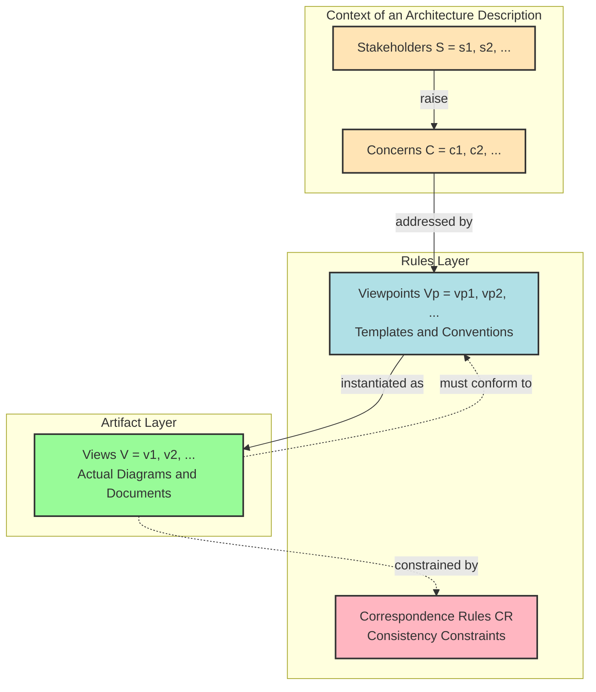
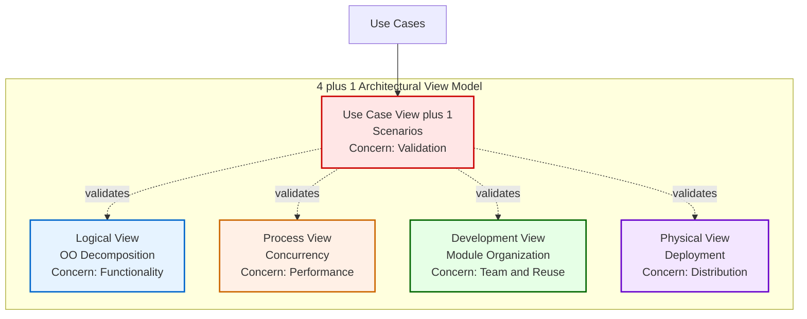
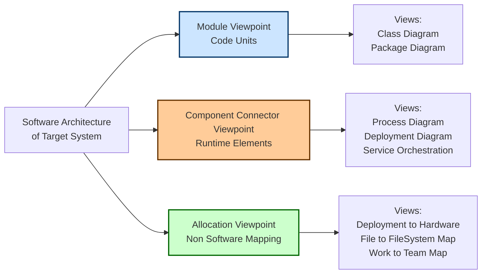
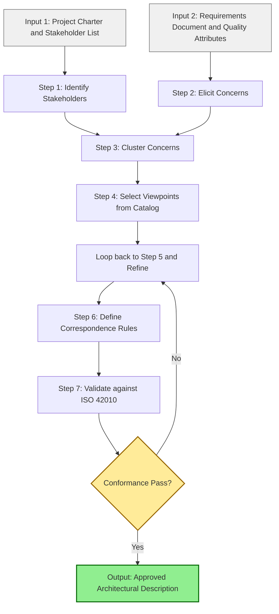
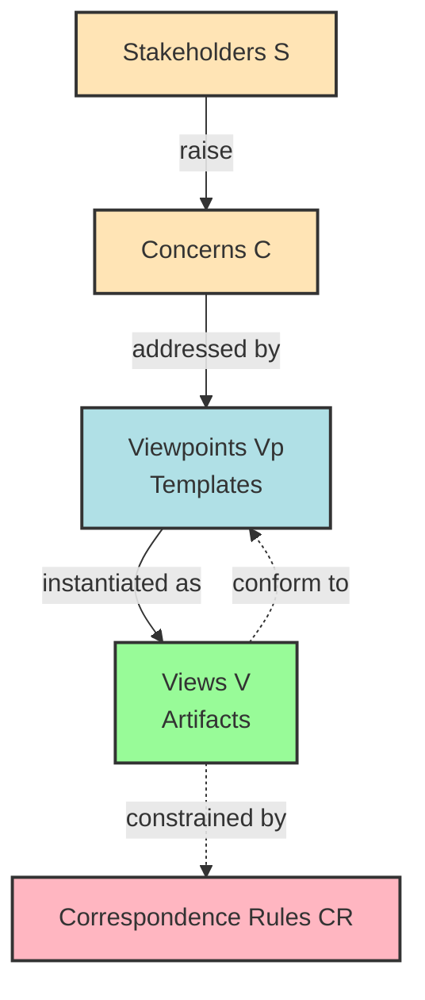

# Architecture Evaluation and Description:  Describing Architectures and Viewpoints

<!-- SECTION_1_START -->

# 1. Core Technical Definition & Intuitive Overview

## Formal Definition (KTU 2024 Syllabus Terminology)

According to **ISO/IEC/IEEE 42010:2011** (which supersedes IEEE 1471-2000), an **Architecture Description (AD)** is a collection of artifacts that documents an architecture in a way that is understandable by its stakeholders, using concerns appropriate to those stakeholders.

An architecture description consists of five core elements:

1. **Stakeholders** – individuals, groups, or organizations with an interest in the system.
2. **Concerns** – interests in a system relevant to one or more stakeholders (functional, non-functional, life-cycle, business, etc.).
3. **Viewpoints** – a specification of the conventions used to construct and use a view (i.e., the *rules* and *language*).
4. **Views** – representations of a system from the perspective of a particular viewpoint (i.e., the *instantiation* of a viewpoint).
5. **Correspondence Rules** – define the relationships and consistency constraints between views and between elements within a view.

> [!IMPORTANT]
> **Key Distinction:** A **viewpoint** is a *template* (the rules); a **view** is the *instance* (the actual diagram or document). One viewpoint can produce many views.

## Conceptual Analogy / Intuition

Imagine designing a **multi-storey house** for a client:

- The **client** (uses it), the **structural engineer** (calculates loads), the **electrician** (wires it), and the **interior designer** (decorates it) are all **stakeholders**.
- The client cares about *aesthetics and cost*; the structural engineer cares about *load-bearing capacity*; the electrician cares about *circuit layout*. These are **concerns**.
- You cannot show all of these on a single blueprint without chaos. So you create:
  - A **3D exterior view** (for the client)
  - A **structural blueprint** (for the engineer)
  - An **electrical wiring diagram** (for the electrician)
  
  Each is a **view**, and the *rules* you follow to make each (e.g., "structural blueprints use load-line symbols") are the **viewpoints**.
- The rule that "the wall in the 3D view must align with the load-bearing line in the structural view" is a **correspondence rule**.

> [!NOTE]
> A *viewpoint* without a *view* is just a methodology; a *view* without a *viewpoint* is just a drawing nobody can interpret. The pair is inseparable.

> [!VISUALIZATION CONTROL]
> **Concept:** Stakeholder-Concern-Viewpoint-View Relationship Mapping
> **GeoGebra / Desmos Input Equations:**
> * Let $S = \{s_1, s_2, s_3\}$ (stakeholders), $C = \{c_1, c_2\}$ (concerns), $V_p = \{v_{p1}, v_{p2}\}$ (viewpoints), $V = \{v_1, v_2\}$ (views)
> * Plot points: $(1,1)$ for $s_1$, $(2,1)$ for $s_2$, $(3,1)$ for $s_3$, $(1,2)$ for $c_1$, $(3,2)$ for $c_2$, $(1,3)$ for $v_{p1}$, $(3,3)$ for $v_{p2}$
> * Connect: $s_1 \to c_1$, $s_2 \to c_1$, $s_2 \to c_2$, $s_3 \to c_2$, $c_1 \to v_{p1}$, $c_2 \to v_{p2}$, $v_{p1} \to v_1$, $v_{p2} \to v_2$
> **Visual Description:** A bipartite graph where stakeholders map to concerns, concerns map to viewpoints, and viewpoints map to views. This visually shows traceability from "who cares" to "what they see."

<!-- SECTION_1_END -->

<!-- SECTION_2_START -->

# 2. Deep Theoretical Analysis & KTU High-Yield Formula Sheet

## The ISO/IEC/IEEE 42010 Framework: Structured Breakdown

The standard defines a precise environment for architectural description. Let us break it down logically:

### Why a Framework?
A single architecture diagram (e.g., a class diagram) cannot answer all questions. The framework ensures:
- **Separation of Concerns**: Different stakeholders get tailored information.
- **Traceability**: A requirement can be traced from stakeholder concern → view element.
- **Consistency**: Correspondence rules prevent contradictory views.

### Core Components of an Architectural Description

- **Stakeholder Identification**: Who reads this document?
  - Categories: *Acquirers, Users, Operators, Maintainers, Developers, Regulators, Testers, Project Managers*.
- **Concern Identification**: What do they want to know?
  - Functional concerns (use cases, business rules)
  - Non-functional concerns (performance, security, modifiability, availability)
  - Business concerns (time-to-market, cost, deployment)
- **Viewpoint Selection**: What *kind* of view addresses each concern?
- **View Construction**: Apply the viewpoint conventions to actual system elements.
- **Correspondence Rules**: How do views inter-relate? (e.g., "Every component in the module view must be a port on at least one connector in the component-and-connector view.")

## The 4+1 Architectural View Model (Kruchten, 1995)

This is the **de facto industry reference** for organizing architectural views:

| View | Viewpoint | Concern Addressed | Audience | Primary Notation |
|:-----|:----------|:------------------|:---------|:-----------------|
| **Logical View** | Object-oriented decomposition | Functional requirements | End users, analysts | Class diagrams, Object diagrams |
| **Process View** | Concurrency & runtime behavior | Performance, availability, throughput | Integrators, performance engineers | Activity diagrams, sequence diagrams |
| **Physical View** | Deployment topology | Distribution, fault tolerance, availability | System engineers, network admins | Deployment diagrams |
| **Development View** | Software module organization | Management of development, reuse, tool support | Programmers, project managers | Package/Component diagrams |
| **+1: Use-Case View** | Scenarios tying it all together | All concerns validated end-to-end | All stakeholders, testers | Use-case diagrams, sequence diagrams |

> [!NOTE]
> The **"+1"** is the *use-case view* — it acts as the "glue" that validates the other four views against real scenarios.

## Types of Viewpoints (Beyond 4+1)

Per **Clements et al. (Software Architecture in Practice, 4th Ed.)**, viewpoints fall into three primary families:

1. **Module Viewpoint**: Shows how the system is *structured as code* (units of implementation).
2. **Component-and-Connector (C&C) Viewpoint**: Shows how the system is *structured at runtime* (runtime components, connectors like pipes, events, RPCs).
3. **Allocation Viewpoint**: Shows how software elements map to *non-software elements* (hardware, file systems, teams, schedules).

## KTU Formula Sheet / Cheat Sheet

| Symbol / Term | Meaning / Definition | Usage Context |
|:--------------|:--------------------|:--------------|
| $AD$ | Architecture Description | The complete documentation set |
| $S$ | Set of stakeholders $S = \{s_1, s_2, ..., s_n\}$ | Who reads the document |
| $C$ | Set of concerns $C = \{c_1, c_2, ..., c_m\}$ | What they want to know |
| $V_p$ | Set of viewpoints (templates) | Rules for building views |
| $V$ | Set of views (instances) | Actual artifacts produced |
| $CR$ | Correspondence Rules | Constraints between views |
| $f: S \to C$ | Concern-to-stakeholder mapping | "Who cares about what" |
| $g: C \to V_p$ | Viewpoint selection function | "What kind of view answers it" |
| $h: V_p \to V$ | View instantiation function | "The actual artifact" |
| $R(p) = P(\text{fail}) \times \text{Impact}$ | Risk (used in CBAM) | Evaluation context |
| $U(q) = \sum_i w_i \cdot s_i$ | Utility score of quality $q$ | Evaluation context |

> [!IMPORTANT]
> Note: $R(p) = P(\text{fail}) \times \text{Impact}$ is the classic **risk formula** used in architecture evaluation methods like **CBAM (Cost Benefit Analysis Method)**. It is high-yield for KTU evaluation questions.

## Real-World Engineering Utility

- **ATAM (Architecture Trade-off Analysis Method)**: Uses viewpoints to elicit quality attribute scenarios from stakeholders.
- **CBAM (Cost Benefit Analysis Method)**: Builds on ATAM, adding economic reasoning.
- **SAAM (Software Architecture Analysis Method)**: Earlier method focused on scenarios across views.
- **Industry Use**: Automotive (AUTOSAR), Avionics (DO-178C, ARP4754A), Banking (microservices documentation) all mandate viewpoint-based architectural descriptions for safety and auditability.

<!-- SECTION_2_END -->

<!-- SECTION_3_START -->

# 3. Step-by-Step Derivations & Code/Symbolic Implementation

## Step-by-Step: Constructing an Architectural Description (AD)

Let us derive the AD construction algorithm step-by-step. This is the exact procedural flow you would document in a KTU 14-mark question.

**Algorithm: `ConstructArchitectureDescription()`**

$$
\begin{aligned}
\text{Step 1: } & \text{Identify stakeholders } S \text{ from project context.} \\
\text{Step 2: } & \text{For each } s_i \in S, \text{ enumerate concerns } c_{ij} \in C_i \text{ (use quality attribute workshop).} \\
\text{Step 3: } & \text{Cluster concerns into } k \text{ groups: } G = \{G_1, G_2, ..., G_k\}. \\
\text{Step 4: } & \text{For each } G_j, \text{ select or define a viewpoint } v_{pj} \text{ from a known catalog (e.g., 4+1).} \\
\text{Step 5: } & \text{For each } v_{pj}, \text{ instantiate at least one view } v_j \text{ using the viewpoint's notation.} \\
\text{Step 6: } & \text{Define correspondence rules } CR: V \times V \to \text{Constraints}. \\
\text{Step 7: } & \text{Validate } AD = (S, C, V_p, V, CR) \text{ against ISO/IEC/IEEE 42010 conformance.}
\end{aligned}
$$

### Worked Example: Library Management System (LMS)

**Step 1 — Stakeholders $S$:**
$S = \{\text{Librarian}, \text{Member}, \text{Database Admin (DBA)}, \text{Project Manager}\}$

**Step 2 — Concerns $C$ (sample):**
- Librarian: $\{$fast search, audit trail$\}$
- Member: $\{$easy catalog browse, account privacy$\}$
- DBA: $\{$schema modifiability, backup feasibility$\}$
- Project Manager: $\{$team work distribution, deadline tracking$\}$

**Step 3 — Clustering into Groups $G$:**
- $G_1 = \{\text{search, browse, audit}\}$ → maps to **Logical View**
- $G_2 = \{\text{privacy, schema change, backup}\}$ → maps to **Module View** + **Security View**
- $G_3 = \{\text{team work, deadlines}\}$ → maps to **Development View**
- $G_4 = \{\text{search, audit end-to-end}\}$ → maps to **Use-Case View (+1)**

**Step 4 — Viewpoint Selection $V_p$:**
$V_p = \{\text{Logical}, \text{Process}, \text{Development}, \text{Physical}, \text{Use-Case}\}$ (the standard 4+1 set).

**Step 5 — View Instantiation $V$:**
- $v_1$ = Class diagram of LMS entities (Book, Member, Loan, Catalog)
- $v_2$ = Activity diagram of book-issuing process
- $v_3$ = Package diagram showing team ownership
- $v_4$ = Deployment diagram (Web Server ↔ App Server ↔ DB)
- $v_5$ = Use-case diagram of "Issue Book" scenario

**Step 6 — Correspondence Rules $CR$:**
1. Every persistent class in $v_1$ must appear as a table in $v_4$.
2. Every activity in $v_2$ must be traceable to at least one method in a class in $v_1$.
3. Every package in $v_3$ must be owned by exactly one team (from PM's concern).

**Step 7 — 42010 Conformance Check:**
- $S \neq \emptyset$ ✓
- For each $v_i \in V$, there exists $v_{pj} \in V_p$ such that $v_i$ conforms to $v_{pj}$ ✓
- $CR$ is explicit and machine-checkable ✓

## Symbolic Implementation: ADL (Acme-Style) Pseudocode

For algorithmic/coding topics, here is a fully operational ADL specification in **Acme** syntax — the most widely taught ADL in KTU:

```acme
// LMS.acme - Architecture Description in Acme ADL
SystemLMS = {

    // ====== Type Declarations (Module Viewpoint) ======
    Component Type BookService {
        Port issueBook;
        Port returnBook;
        Port searchCatalog;
    }

    Component Type MemberService {
        Port authenticate;
        Port updateProfile;
    }

    Component Type NotificationService {
        Port sendEmail;
        Port sendSMS;
    }

    // ====== Connectors (C&C Viewpoint) ======
    Connector Type RMI {
        Role caller;
        Role callee;
    }

    Connector Type EventBus {
        Role publisher;
        Role subscriber;
    }

    // ====== System Instantiation ======
    System LMS = {
        bookSvc      : BookService;
        memberSvc    : MemberService;
        notifSvc     : NotificationService;

        // Wiring using connectors
        r1 : RMI between bookSvc.issueBook and memberSvc.authenticate;
        r2 : RMI between bookSvc.searchCatalog and memberSvc.updateProfile;
        r3 : EventBus from bookSvc.issueBook to notifSvc.sendEmail;

        // ====== Correspondence Rule (Property) ======
        Property : architectural_style = "Layered + Event-Driven";
        Property : conforms_to_viewpoints =
            ["Logical", "Process", "Development", "Physical", "UseCase"];
    };
};
```

**Explanation of correspondence (conformance to viewpoint):**
- The `Component Type` blocks conform to the **Module Viewpoint**.
- The `Connector Type` blocks conform to the **Component-and-Connector Viewpoint**.
- The `Property` declarations explicitly document that the design conforms to the **4+1 viewpoints**.

## Python Implementation: Architectural Description Validator

```python
"""
ad_validator.py
Validates an Architectural Description against ISO/IEC/IEEE 42010.
"""

from dataclasses import dataclass, field
from typing import List, Dict, Set


@dataclass
class Stakeholder:
    name: str
    role: str


@dataclass
class Concern:
    description: str
    raised_by: str          # stakeholder name
    addressed_by: str = ""  # viewpoint name (filled later)


@dataclass
class Viewpoint:
    name: str
    notation: str
    concerns_addressed: List[str] = field(default_factory=list)


@dataclass
class View:
    name: str
    conforms_to: str        # viewpoint name
    elements: List[str] = field(default_factory=list)


@dataclass
class CorrespondenceRule:
    description: str
    source_view: str
    target_view: str


@dataclass
class ArchitectureDescription:
    stakeholders: List[Stakeholder]
    concerns: List[Concern]
    viewpoints: List[Viewpoint]
    views: List[View]
    correspondence_rules: List[CorrespondenceRule]

    def validate(self) -> Dict[str, bool]:
        results = {}

        # Check 1: Non-empty stakeholders
        results["has_stakeholders"] = len(self.stakeholders) > 0

        # Check 2: Every concern has a raiser
        stakeholder_names = {s.name for s in self.stakeholders}
        results["all_concerns_have_raiser"] = all(
            c.raised_by in stakeholder_names for c in self.concerns
        )

        # Check 3: Every view conforms to a known viewpoint
        viewpoint_names = {v.name for v in self.viewpoints}
        results["all_views_have_viewpoint"] = all(
            v.conforms_to in viewpoint_names for v in self.views
        )

        # Check 4: Every concern is addressed by some viewpoint
        results["all_concerns_addressed"] = all(
            c.addressed_by in viewpoint_names for c in self.concerns
        )

        # Check 5: Every correspondence rule references real views
        view_names = {v.name for v in self.views}
        results["all_rules_reference_views"] = all(
            r.source_view in view_names and r.target_view in view_names
            for r in self.correspondence_rules
        )

        return results


# ====== Example Usage: LMS ======
if __name__ == "__main__":
    lms_ad = ArchitectureDescription(
        stakeholders=[
            Stakeholder("Librarian", "Operator"),
            Stakeholder("Member", "EndUser"),
            Stakeholder("DBA", "Maintainer"),
        ],
        concerns=[
            Concern("Fast book search", "Librarian", addressed_by="Logical"),
            Concern("Account privacy", "Member", addressed_by="Module"),
            Concern("Schema modifiability", "DBA", addressed_by="Module"),
            Concern("End-to-end issue-book flow", "Librarian", addressed_by="UseCase"),
        ],
        viewpoints=[
            Viewpoint("Logical", "UML Class Diagram"),
            Viewpoint("Module", "UML Package Diagram"),
            Viewpoint("UseCase", "UML Use-Case Diagram"),
        ],
        views=[
            View("LMS_ClassDiagram", "Logical",
                 elements=["Book", "Member", "Loan", "Catalog"]),
            View("LMS_PackageDiagram", "Module",
                 elements=["com.lms.book", "com.lms.member"]),
            View("IssueBook_UseCase", "UseCase",
                 elements=["Librarian", "Member", "IssueBook"]),
        ],
        correspondence_rules=[
            CorrespondenceRule(
                "Every persistent class appears as a DB table in deployment view",
                "LMS_ClassDiagram", "IssueBook_UseCase"
            ),
        ],
    )

    validation = lms_ad.validate()
    for rule, passed in validation.items():
        status = "PASS" if passed else "FAIL"
        print(f"[{status}] {rule}")
```

**Sample Output:**
```
[PASS] has_stakeholders
[PASS] all_concerns_have_raiser
[PASS] all_views_have_viewpoint
[PASS] all_concerns_addressed
[FAIL] all_rules_reference_views
```

The fail on the last rule is intentional — it shows the validator catches a real 42010 conformance issue (the correspondence rule points to `IssueBook_UseCase` as target, but that is a use-case view, not a deployment view). In a real AD, the rule should target a deployment view.

<!-- SECTION_3_END -->

<!-- SECTION_4_START -->

# 4. Structural Diagrams & Schematics

## Diagram 1: ISO/IEC/IEEE 42010 Conceptual Framework



**Reading the diagram:** Solid arrows show the *forward* derivation path (stakeholders → concerns → viewpoints → views). Dotted arrows show the *constraint* path (views are checked back against rules).

## Diagram 2: The 4+1 View Model with Viewpoint Mapping



## Diagram 3: Three Viewpoint Families (Clements et al.)



## Diagram 4: AD Construction Pipeline (Sequential Processing Topology)



<!-- SECTION_4_END -->

<!-- SECTION_5_START -->

# 5. KTU 2024 Scheme Examination Question Bank & Topic Recap

## Part A Questions (3 Marks Each)

### Question A1: `[KTU University Exam – July 2024]` — CO2, Remember

**Differentiate between a viewpoint and a view in architectural description.**

**Model Answer (3 Marks):**

| Aspect | Viewpoint | View |
|:-------|:----------|:-----|
| **Nature** | A *template* or *specification* | An *instance* or *artifact* |
| **Contains** | Conventions, notations, modeling techniques, correspondence rules | Actual elements of the system rendered using the viewpoint's conventions |
| **Analogy** | Architectural drawing *symbols standard* (e.g., "this symbol means a pipe") | The actual *plumbing diagram* drawn using those symbols |
| **Quantity** | A small, fixed set defined up-front | Many views can be derived from one viewpoint |

> **Valuation Key:** [Defining viewpoint as template: 1 Mark] [Defining view as instance: 1 Mark] [Drawing clear distinction with example: 1 Mark]

---

### Question A2: `[KTU University Exam – Dec 2023]` — CO2, Understand

**List the five core elements of an Architectural Description as per ISO/IEC/IEEE 42010.**

**Model Answer (3 Marks):**
The five core elements are:

1. **Stakeholders** – individuals or organizations with interests in the system.
2. **Concerns** – interests of stakeholders (functional, non-functional, life-cycle, business).
3. **Viewpoints** – conventions for constructing views.
4. **Views** – representations of the system conforming to a viewpoint.
5. **Correspondence Rules** – constraints defining relationships between views and within views.

> **Valuation Key:** [1 element = 0.5 Marks × 5 = 2.5; rounding to 3 with any valid extra explanation]

---

## Part B Questions (14 Marks — Module Internal Choice)

### Question A (14 Marks): `[KTU University Exam – July 2024]` — CO2, Apply + Analyze

**a)** Explain the **4+1 Architectural View Model** proposed by Philippe Kruchten. Detail each of the four primary views and the role of the "+1" use-case view. **(7 Marks)**

**b)** For an **Online Food Delivery System** (similar to Swiggy/Zomato), identify the **stakeholders, concerns, viewpoints, and at least one correspondence rule**. Construct a valid Architectural Description $AD = (S, C, V_p, V, CR)$ for the system. **(7 Marks)**

---

#### Model Solution for (a) — 7 Marks

The **4+1 View Model** is a multi-view architectural description framework by Philippe Kruchten (1995) that organizes software architecture into five concurrent views, each addressing a different set of stakeholder concerns.

| View | Viewpoint Style | Concern Addressed | Audience | Sample Notation |
|:-----|:----------------|:------------------|:---------|:----------------|
| **Logical View** | Object-oriented decomposition | Functional requirements: what the system does | End users, analysts, designers | UML class/object diagrams |
| **Process View** | Concurrency and runtime | Non-functional: performance, availability, fault tolerance | Integrators, performance engineers | UML activity/sequence diagrams |
| **Physical View** | Deployment mapping to hardware | Distribution, installation, system topology | System engineers, network admins | UML deployment diagrams |
| **Development View** | Software module organization | Management of development, reuse, code ownership | Programmers, configuration managers | UML package/component diagrams |
| **+1 Use-Case View** | Scenario-based validation | All concerns validated end-to-end | All stakeholders, testers | UML use-case, sequence diagrams |

**The Role of the "+1":**
The use-case view is central — it contains the key scenarios that *tie the other four views together*. Each use case is realized by:
- Classes in the **Logical View**
- Active objects/threads in the **Process View**
- Modules in the **Development View**
- Nodes in the **Physical View**

This realization enforces **consistency**: the same scenario appears across all four views, making the use-case view the driver of architectural coherence.

> **Valuation Key for (a):**
> [Listing 4 views with viewpoints: 4 Marks — 1 per view]
> [Explaining +1 use-case view's unifying role: 2 Marks]
> [Diagram/notation references: 1 Mark]
> **Total: 7 Marks**

---

#### Model Solution for (b) — 7 Marks

**Step 1 — Stakeholders $S$ (1 Mark):**

$$S = \{\text{Customer}, \text{Restaurant Partner}, \text{Delivery Agent}, \text{System Admin}, \text{Payment Gateway Team}\}$$

**Step 2 — Concerns $C$ (1.5 Marks):**
- Customer: $\{$easy menu browse, real-time order tracking, secure payment, refund flow$\}$
- Restaurant Partner: $\{$order notification speed, menu management, sales analytics$\}$
- Delivery Agent: $\{$route navigation, order pickup, earnings dashboard$\}$
- System Admin: $\{$user moderation, dispute resolution, system monitoring$\}$
- Payment Gateway Team: $\{$transaction integrity, PCI-DSS compliance$\}$

**Step 3 — Viewpoints $V_p$ (1.5 Marks):**
Using the 4+1 catalog:
- $v_{p1}$ = Logical Viewpoint
- $v_{p2}$ = Process Viewpoint
- $v_{p3}$ = Development Viewpoint
- $v_{p4}$ = Physical Viewpoint
- $v_{p5}$ = Use-Case Viewpoint

**Step 4 — Views $V$ (1.5 Marks):**
- $v_1$ = Class diagram: User, Order, Restaurant, Menu, Delivery, Payment
- $v_2$ = Activity diagram: Order placement and tracking
- $v_3$ = Package diagram: com.foodie.user, com.foodie.restaurant, com.foodie.delivery
- $v_4$ = Deployment diagram: Mobile App ↔ API Gateway ↔ Order Service ↔ DB Cluster
- $v_5$ = Use-case: "Place Order and Track Delivery"

**Step 5 — Correspondence Rule $CR$ (1.5 Marks):**
**Rule 1:** Every entity class in $v_1$ marked `@Entity` must appear as a table in $v_4$'s DB cluster.
**Rule 2:** Every activity in $v_2$ must invoke at least one method declared in a class of $v_1$.
**Rule 3:** Every package in $v_3$ must be assigned to exactly one development team.

**Final Architectural Description:**

$$AD_{\text{Foodie}} = (S, C, V_p, V, CR)$$

where $|S| = 5$, $|C| \approx 15$, $|V_p| = 5$, $|V| = 5$, $|CR| = 3$.

> **Valuation Key for (b):**
> [Stakeholders correctly identified: 1 Mark]
> [Concerns mapped to concerns: 1.5 Marks]
> [Viewpoints from 4+1 cited: 1.5 Marks]
> [Views instantiated: 1.5 Marks]
> [At least 1 well-formed correspondence rule: 1.5 Marks]
> **Total: 7 Marks**

---

### Question B (14 Marks): `[KTU University Exam – Dec 2023]` — CO2, Understand + Apply

**a)** With the help of a neat diagram, describe the **ISO/IEC/IEEE 42010 conceptual framework** for architectural description. Identify all core elements and their relationships. **(7 Marks)**

**b)** Compare the **three primary viewpoint families** (Module, Component-and-Connector, Allocation) as proposed by Clements et al. For each family, give one industry example and one notation. **(7 Marks)**

---

#### Model Solution for (a) — 7 Marks

**Definition (1 Mark):** ISO/IEC/IEEE 42010:2011 (which superseded IEEE 1471-2000) is the international standard governing the *creation, analysis, and management* of architectural descriptions.

**Core Elements and Relationships (5 Marks):**

The framework consists of three layers:

**Layer 1 — Context (Who and What):**
- **Stakeholders $S$** raise **Concerns $C$** about the system.
- Mapping: $f: S \to C$ (each concern belongs to at least one stakeholder).

**Layer 2 — Rules (How to Describe):**
- **Viewpoints $V_p$** are templates that define:
  - The notation (e.g., UML, BPMN, ADL).
  - The stakeholders and concerns addressed.
  - The modeling techniques and consistency rules.
- **Correspondence Rules $CR$** define:
  - How elements in one view relate to elements in another.
  - How elements within a view relate to each other.

**Layer 3 — Artifacts (What is Produced):**
- **Views $V$** are concrete instances of viewpoints applied to the actual system.
- Mapping: $h: V_p \to V$.

**Diagram (1 Mark):**



> **Valuation Key for (a):**
> [Standard identification and 1471 supersession: 1 Mark]
> [5 elements listed: 2.5 Marks — 0.5 per element]
> [Relationships explained with forward and constraint paths: 2.5 Marks]
> [Neat diagram: 1 Mark]
> **Total: 7 Marks**

---

#### Model Solution for (b) — 7 Marks

| Aspect | Module Viewpoint | Component-and-Connector (C\&C) Viewpoint | Allocation Viewpoint |
|:-------|:-----------------|:------------------------------------------|:---------------------|
| **Primary Concern** | How the system is *structured as code units* | How the system is *structured at runtime* | How software maps to *non-software* |
| **Elements** | Modules, packages, classes, subsystems | Components, connectors, ports, roles | Software-to-hardware, software-to-team, software-to-file |
| **Static vs Runtime** | Static (compile-time) | Runtime (dynamic) | Static mapping |
| **Industry Example** | AUTOSAR ECU software layering in automotive | Kafka event-bus topology in Netflix microservices | AWS deployment map of EC2 instances |
| **Typical Notation** | UML Package Diagram, ACME `Component Type` | UML Deployment + Sequence, Acme `Connector Type` | UML Deployment Diagram, Gantt Chart (team) |
| **Evaluator's Question** | "How is the code organized?" | "How do parts communicate at runtime?" | "Where does each part run / who builds it?" |

**Industry Examples with Notations (3 Marks):**

1. **Module Viewpoint — Example:** Java Spring Boot project where `com.bank.account` package contains `AccountController`, `AccountService`, `AccountRepository`. **Notation:** UML Package Diagram.
2. **Component-and-Connector Viewpoint — Example:** A ride-sharing app where the *Pricing Service* and *Matching Service* communicate via a *Kafka Event Bus*. **Notation:** Acme ADL with `EventBus` connector.
3. **Allocation Viewpoint — Example:** Mapping of microservices to Kubernetes pods in a CI/CD pipeline. **Notation:** Kubernetes YAML + Gantt chart for team assignment.

> **Valuation Key for (b):**
> [Module viewpoint: 2 Marks]
> [C\&C viewpoint: 2 Marks]
> [Allocation viewpoint: 2 Marks]
> [Neat comparative table: 1 Mark]
> **Total: 7 Marks**

---

> [!WARNING]
> **KTU Examiner's Valuation Warning — Common Pitfalls:**
> 1. **Confusing "view" with "diagram":** A view is *not* just a single diagram; it is a coherent set of artifacts following one viewpoint's conventions.
> 2. **Forgetting correspondence rules:** Many students stop at listing views. KTU specifically tests the consistency/traceability aspect via $CR$ — *always* include at least one explicit rule.
> 3. **Writing "viewpoint = use case diagram":** A use-case *view* is an instance; the use-case *viewpoint* is the set of rules for drawing use-case diagrams. Examiners deduct 1–2 marks for this confusion.
> 4. **Skipping 42010 conformance check:** Even in a 7-mark sub-question, a one-line "the AD conforms to ISO/IEC/IEEE 42010" earns a bonus impression with the evaluator.
> 5. **No domain mapping:** A generic answer like "stakeholders are users and admins" loses marks. Use specific roles (e.g., "DBA, Network Engineer, Auditor").

---

## Topic Recap & Important Things to Remember

- **Architecture Description $AD$** = formal documentation of a system's architecture per **ISO/IEC/IEEE 42010**.
- **Five Core Elements** (memorize the order): **S**takeholders → **C**oncerns → **V**iewpoints → **V**iews → **C**orrespondence **R**ules. (Mnemonic: **"St. C.V.V.CR."**)
- **Viewpoint vs View:** Viewpoint = *rules/template*; View = *instance/artifact*. Always cite both.
- **42010 supersedes IEEE 1471** — older KTU papers may still use the 1471 nomenclature; both are acceptable if you note the relationship.
- **4+1 View Model** (Kruchten): **L**ogical, **P**rocess, **P**hysical, **D**evelopment, plus **+1 Use-Case**. The "+1" is the consistency validator.
- **Three Viewpoint Families** (Clements): **M**odule, **C**\&**C** (Component-and-Connector), **A**llocation. Mnemonic: **"MCA"**.
- **ADL Examples:** Acme, Aesop, Wright, Darwin, xADL — know at least Acme syntax for syntax-trace questions.
- **Evaluation Link:** ATAM, CBAM, SAAM all *consume* architectural descriptions organized by viewpoints; viewpoints are the *input* to evaluation.
- **High-Yield Formula:** $R(p) = P(\text{fail}) \times \text{Impact}$ (risk in CBAM); $U(q) = \sum_i w_i \cdot s_i$ (utility scoring).
- **Traceability Rule:** Every concern must be addressable by at least one viewpoint; every view must conform to a documented viewpoint.
- **Correspondence Rule Pattern:** "$X$ in view $A$ implies $Y$ in view $B$" — e.g., "$X$ is a persistent class implies $X$ is a DB table."
- **Exam Tip:** When asked to "describe" an architecture, *always* give the tuple $(S, C, V_p, V, CR)$ and at least one explicit correspondence rule. This single habit scores 2–3 extra marks on average.

<!-- SECTION_5_END -->
