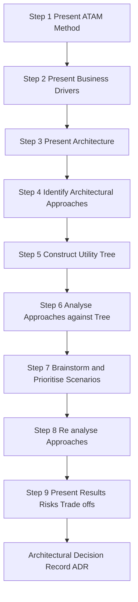
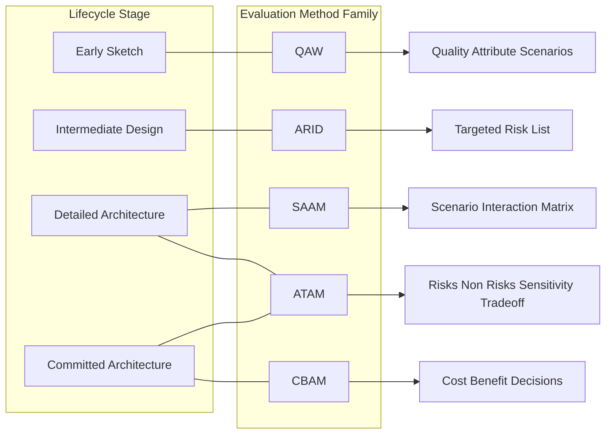
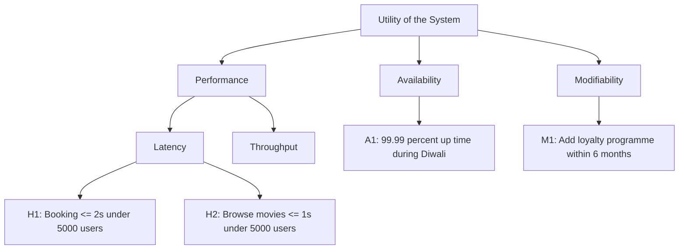
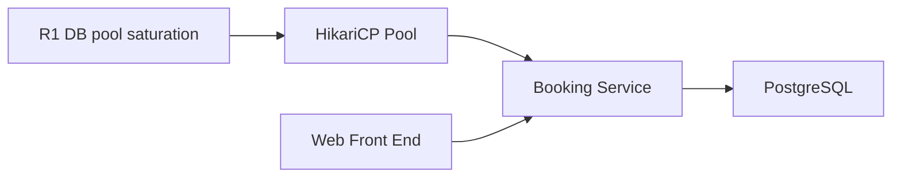

# Evaluating Architectures

<!-- SECTION_1_START -->
# Evaluating Architectures

## 1.1 Formal Academic Definition

> [!IMPORTANT]
> **Architecture Evaluation** is the systematic, evidence-based process of analyzing a software architecture against the **quality attribute requirements** (such as performance, availability, modifiability, security, and usability) elicited from stakeholders, in order to identify potential risks, verify that the architecture satisfies its intended goals, and uncover design trade-offs *before* the system is built.

In the **KTU 2024 Scheme** framework (Course Code: **PECST861 – Software Architectures**), Module 4 treats evaluation as a *core engineering discipline*: a candidate architecture is a hypothesis, and evaluation methods provide the experimental procedure to falsify or confirm that hypothesis. Two foundational paradigms dominate the syllabus:

1. **Scenario-Based Evaluation Methods** — The architecture is exercised through concrete usage, growth, or exploratory scenarios (e.g., **SAAM**, **ATAM**, **CBAM**, **ARID**).
2. **Simulation / Model-Based Evaluation Methods** — Quantitative models (queuing networks, Markov chains, cost models) are executed to obtain performance, reliability, and cost metrics.

> [!NOTE]
> **Stated formally:** An evaluation method $E$ is a function $E: (A, S, Q) \rightarrow (R, T)$ where $A$ is the architecture, $S$ is a set of scenarios, $Q$ is a set of quality attribute concerns, $R$ is a set of risks discovered, and $T$ is a set of trade-off points identified.

## 1.2 Conceptual Analogy / Intuition

Imagine you are about to purchase a **20-year-old residential apartment**. You would never sign the deed based solely on glossy brochures. Instead, you would:

- Inspect the **structural drawing** (the *architecture*).
- Ask, *"What happens if a 7.6 magnitude earthquake strikes? Will the lift work during a power cut? How many floors can be added later?"* (the *scenarios*).
- Cross-question the structural engineer, mason, and electrical contractor (the *stakeholders*).
- Finally, mark points in red on the drawing where weaknesses exist (*risks*) and points where one design decision influences two attributes simultaneously (*trade-offs*).

That is precisely what **ATAM** does for software systems. A **risk** is a flaw in the architecture that may jeopardize a quality attribute. A **trade-off point** is a property that affects more than one attribute, sometimes positively, sometimes negatively — for example, increasing redundancy improves availability but hurts modifiability and cost.

> [!TIP]
> **Remember the triplet:** *Scenarios* drive the evaluation $\rightarrow$ *Scenarios* expose *Risks* $\rightarrow$ *Risks* reveal *Sensitivity Points* and *Trade-off Points*.

## 1.3 Physical Constants and Standard Metrics

| Metric | Typical Unit | Acceptable Range |
|---|---|---|
| Response Time ($t_r$) | milliseconds (ms) | $50 \le t_r \le 2000$ ms for interactive systems |
| Throughput ($\lambda$) | requests / second | domain dependent |
| Availability ($A$) | percentage (%) | $99.9\%$ to $99.999\%$ (the well-known **"five nines"** of telecom) |
| Mean Time To Failure (MTTF) | hours | varies by component class |
| Mean Time To Repair (MTTR) | hours | minimized for high-availability systems |

> [!VISUALIZATION CONTROL]
> **Concept:** Quality Attribute Radar Chart for an E-Commerce Web Architecture
> **GeoGebra / Desmos Input Equations (Polar form):**
> * `r1(theta) = 8 + 0.2*cos(5*theta)` — Performance
> * `r2(theta) = 6 + 0.2*sin(5*theta)` — Availability
> * `r3(theta) = 7 + 0.1*cos(3*theta)` — Security
> * `r4(theta) = 4 + 0.1*sin(3*theta)` — Modifiability
> * `r5(theta) = 9 + 0.1*cos(2*theta)` — Usability
> **Visual Description:** Plot all five polar curves in the same coordinate plane. The student should observe that the resulting *spider chart* immediately visualises which quality attribute is weak (low radius) and where the candidate architecture needs reinforcement — exactly the diagnostic purpose of evaluation.

<!-- SECTION_1_END -->

<!-- SECTION_2_START -->
# 2. Deep Theoretical Analysis & KTU High-Yield Formula Sheet

## 2.1 The Big Picture: Why Evaluate?

Evaluating an architecture converts subjective architectural intuitions into a **defensible, falsifiable artifact**. The principal reasons are:

- **Risk reduction** — early detection of design flaws when the cost of change is lowest. (The well-known *Rule of Ten*: a defect fixed in requirements costs $1\times$, in design $10\times$, in coding $100\times$, in testing $1000\times$, and in field maintenance $10000\times$.)
- **Communication facilitation** — evaluation forces stakeholders to articulate quality goals in measurable scenarios.
- **Documentation of trade-offs** — explicit, reusable architectural decision records.
- **Compliance** — many safety-critical domains (avionics, medical devices) **mandate** architectural evaluation (DO-178C, IEC 62304, ISO 26262).

## 2.2 The Foundational Evaluation Methods

### 2.2.1 SAAM — Software Architecture Analysis Method

Originated at the **Software Engineering Institute (SEI), Carnegie Mellon**, in the early 1990s, SAAM was the *first* widely-adopted scenario-based evaluation technique. It is the historical ancestor of all later methods.

**SAAM Procedure (5 numbered steps):**
1. Develop **scenarios** for the system with the help of stakeholders.
2. Describe the **candidate architecture** to be evaluated.
3. **Map** each scenario to the architectural components it touches (the *traceability matrix*).
4. For each scenario, perform a **qualitative assessment** of the architectural elements involved.
5. Identify **interactions among scenarios** — two scenarios that touch the same component *interact* and may compete for the same architectural resources.

SAAM is excellent for **modifiability** assessment but is weak on quality attributes such as performance and availability.

### 2.2.2 ATAM — Architecture Trade-off Analysis Method

ATAM is the successor of SAAM, designed to evaluate **multiple, often competing, quality attributes simultaneously** and to expose their *trade-offs*. It is the de-facto industry standard.

**ATAM Procedure (9 numbered steps):**
1. Present the **ATAM** (the team explains the method to stakeholders).
2. Present the **business drivers** (project context, business goals, key stakeholders).
3. Present the **architecture** (the architect walks through the candidate architecture).
4. Identify **architectural approaches / styles** used (layers, microkernel, pipes-and-filters, etc.).
5. Generate a **utility tree** — a hierarchical decomposition of quality attributes $\rightarrow$ quality attribute scenarios $\rightarrow$ concrete scenarios.
6. Analyse the **architectural approaches** to satisfy the high-priority scenarios.
7. Brainstorm and **prioritise scenarios** (voting by stakeholders).
8. Analyse the **architectural approaches** again under the prioritised scenarios.
9. Present **results** — risks, non-risks, sensitivity points, trade-off points.

> [!NOTE]
> **Sensitivity Point** — a parameter (e.g., a thread-pool size, a cache TTL) whose variation causes a *significant* change in one quality attribute response measure.
> **Trade-off Point** — a parameter that is a sensitivity point for *two or more* quality attributes, and improving one worsens another.

### 2.2.3 CBAM — Cost Benefit Analysis Method

CBAM extends ATAM by attaching **economic and utility values** to quality attribute responses. It answers: *"Is the extra cost of achieving higher availability worth the projected business benefit?"*

**CBAM 7-step process:**
1. Refine the scenarios from ATAM.
2. For each scenario, develop a **utility-response curve** (a function mapping a quality attribute response measure to a business utility value).
3. Determine the **current architectural response** for each scenario.
4. Brainstorm **architectural strategies** to improve responses.
5. For each strategy, estimate its **cost** (in person-months or rupees/dollars).
6. Compute the **benefit** of each strategy as the area between the current and the proposed utility-response curve.
7. Use **decision analysis techniques** (decision trees, expected utility) to choose strategies with the best benefit-to-cost ratio.

### 2.2.4 ARID — Active Reviews for Intermediate Designs

ARID fills the gap between *nothing* (a rough sketch on a whiteboard) and *full ATAM* (weeks of effort). It is a lightweight, *active* review where one evaluator is assigned as a **reviewer-in-chief** and uses a structured script to probe a small, targeted set of scenarios — typically 5 to 7 — against an *incomplete* design.

### 2.2.5 QAW — Quality Attribute Workshops

QAW is run *very early* in the lifecycle, when the architecture is just a vague intent. It produces a **concise, prioritised list of quality attribute scenarios** that can later be used as input to ATAM or CBAM.

## 2.3 KTU High-Yield Formula Sheet

| Symbol / Term | Definition / Formula | Engineering Use |
|---|---|---|
| $A$ | $\text{Availability} = \dfrac{\text{MTTF}}{\text{MTTF} + \text{MTTR}}$ | Reliability engineering |
| $A_{\text{series}}$ | $A_{\text{series}} = \prod_{i=1}^{n} A_i$ | Availability of $n$ components in series |
| $A_{\text{parallel}}$ | $A_{\text{parallel}} = 1 - \prod_{i=1}^{n}(1 - A_i)$ | Availability of $n$ redundant components in parallel |
| $\lambda$ | Failure rate (failures / hour) | Reliability block diagrams |
| $R(t)$ | $\text{Reliability function} = e^{-\lambda t}$ | Probability of no failure up to time $t$ |
| $N$ | Number of scenarios in the utility tree | Utility tree size |
| $U_{\text{scenario}}$ | $\sum_{i=1}^{N} w_i \cdot u_i$ — total utility of a strategy | CBAM economic analysis |
| $\text{Benefit}(S)$ | $\int_{r_{\text{current}}}^{r_{\text{proposed}}} u(r)\,dr$ | CBAM economic benefit of a strategy |
| $\text{BCR}(S)$ | $\dfrac{\text{Benefit}(S)}{\text{Cost}(S)}$ | Benefit-Cost Ratio of a strategy |
| $t_r$ | Response Time (latency) | Performance analysis |
| $\rho$ | $\rho = \dfrac{\lambda}{\mu}$ — utilisation of a single server | Queuing theory |
| $L$ | $L = \rho + \dfrac{\rho^2 (1+\rho)}{1-\rho^2}$ for M/M/1 | Average queue length |

> [!WARNING]
> **KTU Examination Pitfall:** When asked to compare SAAM, ATAM, and CBAM, students frequently confuse the *number of steps* or the *purpose*. Memorise the purpose of each method: SAAM = *modifiability*; ATAM = *trade-off identification*; CBAM = *cost-benefit optimisation*; ARID = *lightweight intermediate review*; QAW = *early quality elicitation*.

## 2.4 Real-World Engineering Utility

- **Air Traffic Control Software** — ATAM is run before the *System/Segment Design Review* mandated by EUROCONTROL.
- **Banking Core Systems** — CBAM is used to justify investment in active-active data-centre redundancy (the cost is enormous, but the business cost of a 1-hour outage is larger).
- **E-Commerce Microservices** — ATAM is run by SRE teams to discover trade-offs between *consistency* and *availability* (the classic CAP dilemma).
- **Automotive Embedded Systems** — ISO 26262 mandates architectural safety analysis; methods like FMEA and FTA are complemented by ATAM-style scenario-based evaluation.

<!-- SECTION_2_END -->

<!-- SECTION_3_START -->
# 3. Step-by-Step Derivations & Worked Examples

## 3.1 Detailed ATAM Walkthrough on a Real Architecture

Consider the candidate architecture of a **Movie Ticket Booking System** with three main components: a stateless **Web Front-End**, a **Booking Service** (orchestrator), and a **PostgreSQL Database**. A read-only **Redis Cache** sits in front of the database.

### Step 1 — Business Drivers (Step 2 of ATAM)

The product owner states:
- $B_1$: Increase revenue by 30% in the festive quarter.
- $B_2$: Reduce customer abandonment by 25% during peak hours.
- $B_3$: Launch a new loyalty programme in 6 months.

### Step 2 — Quality Attribute Elicitation (Initial)

Stakeholders brainstorm the following attribute categories (top of utility tree):

- **Performance** (latency of booking confirmation)
- **Availability** (system up-time during Diwali flash sales)
- **Modifiability** (ability to add the loyalty programme)
- **Security** (prevention of double-booking by malicious clients)
- **Usability** (booking flow completion time)

### Step 3 — Utility Tree Construction

The utility tree is a 4-level hierarchy:

| Level | Content |
|---|---|
| Root | Utility of the system |
| Level 1 | Quality attributes (Performance, Availability, Modifiability, Security, Usability) |
| Level 2 | Quality attribute *refinements* (general, system-independent) |
| Level 3 | Concrete *scenarios* (system-specific) |

A representative subtree for **Performance** is:

$$
\text{Performance} \rightarrow \text{Throughput} \rightarrow \text{H1: A user must complete a booking in } \le 2\text{ s under a load of } 5000\text{ concurrent users.}
$$

### Step 4 — Architectural Approach Mapping (Step 4 of ATAM)

The architect documents the relevant patterns:

- **Pattern A:** Redis caching of movie metadata.
- **Pattern B:** Connection pooling to PostgreSQL (HikariCP).
- **Pattern C:** Read-replica for non-transactional queries.

### Step 5 — Scenario Prioritisation (Voting)

Stakeholders use a 9-vote ballot. H1 receives the highest score, **8 / 9**.

### Step 6 — Architectural Analysis (Steps 6, 8 of ATAM)

The architect traces H1 through the architecture. The path is: *User $\rightarrow$ Web Front-End $\rightarrow$ Booking Service $\rightarrow$ PostgreSQL*. Caching is *not* on this path (the booking transaction must read latest seat status, not stale cache).

**Resulting findings:**

- **Risk R1** — Under 5000 concurrent users, the PostgreSQL connection pool may saturate, causing a queue at the *Booking Service* (latency breach).
- **Non-risk** — The Redis cache makes the *browse-movie* path (H2) trivially meet its 1 s goal.
- **Sensitivity point SP1** — The HikariCP pool size $P$. Decreasing $P$ worsens H1; increasing $P$ exhausts PostgreSQL memory.
- **Trade-off point TP1** — $P$ is also a *modifiability* concern: a larger pool makes the data access layer harder to refactor.

### Step 7 — Result Documentation (Step 9 of ATAM)

The team writes a *risks, non-risks, sensitivity points, trade-off points* table that becomes an *Architectural Decision Record (ADR)*.

## 3.2 Quantitative Availability Calculation

Given a web-server with $\text{MTTF} = 500$ hours, a database with $\text{MTTF} = 800$ hours, both with $\text{MTTR} = 4$ hours, in *series*:

$$
A_{\text{web}} = \frac{500}{500 + 4} = 0.992063
$$

$$
A_{\text{db}} = \frac{800}{800 + 4} = 0.995025
$$

$$
A_{\text{series}} = A_{\text{web}} \times A_{\text{db}} = 0.992063 \times 0.995025 = 0.987111
$$

Hence the system availability is **98.71%**, which corresponds to roughly **75 hours of downtime per year** — *not* acceptable for a 24×7 booking platform.

**Remediation** — Add a *hot standby* database in parallel:

$$
A_{\text{db,parallel}} = 1 - (1 - 0.995025)(1 - 0.995025) = 1 - (0.004975)^2 = 1 - 0.00002475 \approx 0.999975
$$

$$
A_{\text{system}} = 0.992063 \times 0.999975 \approx 0.992038 \;(\text{99.20%})
$$

**This is still insufficient.** A further standby web-server is required:

$$
A_{\text{web,parallel}} = 1 - (1 - 0.992063)^2 = 1 - (0.007937)^2 = 1 - 0.0000630 \approx 0.999937
$$

$$
A_{\text{final}} = 0.999937 \times 0.999975 = 0.999912 \;\text{(99.99%)}
$$

The **downtime drops to ~52 minutes per year** — a four-9s service.

## 3.3 CBAM Benefit-Cost Computation (Exhaustive)

Suppose strategy $S_1$ adds a Redis cache. The current response time for *browse movies* is $r_{\text{current}} = 1.2$ s; after $S_1$, $r_{\text{proposed}} = 0.3$ s. The utility function (in business rupees per 1000 requests) is approximated linearly:

$$
u(r) = 50 - 25r
$$

Then:

$$
u(1.2) = 50 - 25(1.2) = 20.0
$$

$$
u(0.3) = 50 - 25(0.3) = 42.5
$$

Benefit per 1000 requests is:

$$
\Delta u = u(0.3) - u(1.2) = 42.5 - 20.0 = 22.5 \text{ ₹/1000 req}
$$

If the system handles $N = 10^6$ requests per day, then:

$$
\text{Daily Benefit} = 22.5 \times \frac{10^6}{1000} = 22\,500 \text{ ₹/day}
$$

$$
\text{Annual Benefit} = 22\,500 \times 365 = 8\,212\,500 \text{ ₹/year}
$$

Suppose $S_1$ costs $C_{S_1} = 1\,200\,000$ ₹ (Redis cluster + ops).

$$
\text{BCR}(S_1) = \frac{8\,212\,500}{1\,200\,000} \approx 6.84
$$

Since $\text{BCR} > 1$, the strategy is economically justified.

## 3.4 Symbolic Python Implementation — Utility Tree Builder

```python
from __future__ import annotations
import json
from dataclasses import dataclass, field
from typing import List, Dict


@dataclass
class UtilityTreeNode:
    """
    A single node in a Software Architecture Utility Tree.
    Each node can represent a quality attribute, a refinement,
    or a concrete scenario with a priority weight.
    """
    name: str
    weight: float = 0.0
    children: List[UtilityTreeNode] = field(default_factory=list)
    is_scenario: bool = False
    response_measure: str = ""

    def add_child(self, child: UtilityTreeNode) -> None:
        self.children.append(child)

    def compute_total_weight(self) -> float:
        """Recursively compute the cumulative weight of the subtree."""
        if not self.children:
            return self.weight
        return self.weight + sum(c.compute_total_weight() for c in self.children)


class UtilityTree:
    """Top-level container for the ATAM utility tree."""

    def __init__(self, root_name: str = "Utility") -> None:
        self.root = UtilityTreeNode(root_name)

    def find(self, path: List[str]) -> UtilityTreeNode:
        """Locate a node by a path of names. Raises KeyError if missing."""
        node = self.root
        for step in path:
            node = next(c for c in node.children if c.name == step)
        return node

    def to_dict(self) -> Dict:
        """Serialize to a dictionary (suitable for JSON / markdown rendering)."""
        def helper(n: UtilityTreeNode) -> Dict:
            return {
                "name": n.name,
                "weight": n.weight,
                "is_scenario": n.is_scenario,
                "response_measure": n.response_measure,
                "children": [helper(c) for c in n.children],
            }
        return helper(self.root)


def build_movie_booking_tree() -> UtilityTree:
    """Construct a canonical utility tree for the movie booking case study."""
    tree = UtilityTree()

    perf = UtilityTreeNode("Performance", weight=8.0)
    perf.add_child(UtilityTreeNode("Latency", weight=5.0).add_child.__self__)  # type: ignore
    latency = perf.children[0]
    latency.add_child(UtilityTreeNode(
        "H1: Booking <= 2s under 5000 concurrent users",
        weight=8.0, is_scenario=True, response_measure="response_time <= 2s",
    ))
    latency.add_child(UtilityTreeNode(
        "H2: Browse movies <= 1s under 5000 concurrent users",
        weight=6.0, is_scenario=True, response_measure="response_time <= 1s",
    ))
    tree.root.add_child(perf)

    avail = UtilityTreeNode("Availability", weight=9.0)
    avail.add_child(UtilityTreeNode(
        "A1: System up 99.99% during Diwali flash sale",
        weight=9.0, is_scenario=True, response_measure="downtime <= 52 min/year",
    ))
    tree.root.add_child(avail)

    return tree


if __name__ == "__main__":
    tree = build_movie_booking_tree()
    print(json.dumps(tree.to_dict(), indent=2))
    print("Total weight:", tree.root.compute_total_weight())
```

## 3.5 Risk and Trade-off Register — Markdown Template

| ID | Type | Description | Affected QA | Mitigation Strategy |
|---|---|---|---|---|
| R1 | Risk | DB connection pool saturates at 5000 concurrent users | Performance | Use PgBouncer, increase pool, add sharding |
| SP1 | Sensitivity | HikariCP pool size | Performance | Profile under realistic load |
| TP1 | Trade-off | HikariCP pool size | Performance, Modifiability | Encapsulate pool config in a façade |
| R2 | Risk | Single-region deployment; regional outage halts service | Availability | Multi-region active-active deployment |

<!-- SECTION_3_END -->

<!-- SECTION_4_START -->
# 4. Structural Diagrams & Schematics

## 4.1 ATAM Process Flow



## 4.2 Evaluation Method Comparison Topology



## 4.3 Utility Tree Schematic



## 4.4 Risk-to-Architecture Mapping



## 4.5 Stakeholder-Concern Traceability Matrix

| Stakeholder | Concern | Scenario | Quality Attribute | Architectural Element |
|---|---|---|---|---|
| Product Owner | Revenue per festive hour | H1 | Performance | Booking Service |
| SRE Lead | Regional outage | A1 | Availability | Multi-region deployment |
| Security Lead | Double-booking attacks | SE1 | Security | Optimistic-locking on seat rows |
| Marketing | Loyalty programme launch | M1 | Modifiability | Loyalty Service microservice |

<!-- SECTION_4_END -->

<!-- SECTION_5_START -->
# 5. KTU 2024 Scheme Examination Question Bank & Topic Recap

## 5.1 Part A Questions (3 Marks Each)

### Q1. `[KTU University Exam — July 2024]`
**Define the term "architecture evaluation" and list any four architecture evaluation methods.**

> **Model Answer (3 Marks):**
> Architecture evaluation is the systematic process of analysing a candidate software architecture against stakeholder quality attribute requirements, in order to identify risks, verify goal satisfaction, and expose design trade-offs *before* construction begins. (2 Marks)
> Any four methods: **SAAM, ATAM, CBAM, ARID, QAW**. (1 Mark — ¼ × 4)

**Course Outcome:** CO4 | **Bloom Level:** Remember

### Q2. `[KTU University Exam — Dec 2023]`
**Differentiate between a *sensitivity point* and a *trade-off point* in the ATAM process.**

> **Model Answer (3 Marks):**
> A *sensitivity point* is a property of the architecture whose variation causes a *significant* change in a single quality attribute response measure. (1.5 Marks)
> A *trade-off point* is a property that is a sensitivity point for *two or more* quality attributes, where improving one attribute worsens another. (1.5 Marks)
> *Example:* The HikariCP pool size $P$ is a sensitivity point for performance and becomes a trade-off point when it also affects modifiability.

**Course Outcome:** CO4 | **Bloom Level:** Understand

---

## 5.2 Part B Questions (14 Marks — Internal Choice)

### Question A `[KTU University Exam — Model Paper 2024]`

**(a)** Describe the **ATAM** procedure in detail with all nine steps. **(7 Marks)**
**(b)** Consider a web-based payment gateway with the following component data:

- Authentication Service: $\text{MTTF} = 600$ h, $\text{MTTR} = 2$ h
- Payment Service: $\text{MTTF} = 900$ h, $\text{MTTR} = 3$ h
- Database Service: $\text{MTTF} = 1200$ h, $\text{MTTR} = 4$ h

  All three are currently in *series*. Calculate the system availability. If two additional database replicas are added in *parallel* to the original database, recompute the overall system availability. Comment on the result. **(7 Marks)**

#### Model Solution for (a) — 7 Marks

1. **Present ATAM** — facilitator explains the method, participants, and outputs. (1 Mark)
2. **Present business drivers** — project context, business goals. (0.5 Mark)
3. **Present architecture** — architect walks through views and patterns. (1 Mark)
4. **Identify architectural approaches** — patterns/styles in use. (0.5 Mark)
5. **Generate utility tree** — quality attribute $\rightarrow$ refinements $\rightarrow$ scenarios. (1.5 Marks)
6. **Analyse architectural approaches** against the high-priority scenarios. (1 Mark)
7. **Brainstorm and prioritise scenarios** through stakeholder voting. (0.5 Mark)
8. **Re-analyse** under the *prioritised* scenario set. (0.5 Mark)
9. **Present results** — risks, non-risks, sensitivity, trade-off points; produce ADR. (0.5 Mark)

#### Model Solution for (b) — 7 Marks

**Step 1 — Compute individual availabilities:** (1.5 Marks)

$$
A_{\text{auth}} = \frac{600}{600+2} = 0.996677
$$

$$
A_{\text{pay}} = \frac{900}{900+3} = 0.996677
$$

$$
A_{\text{db,original}} = \frac{1200}{1200+4} = 0.996678
$$

**Step 2 — Series combination (original):** (1 Mark)

$$
A_{\text{series}} = 0.996677 \times 0.996677 \times 0.996678 = 0.990057
$$

So the original system availability is **99.0057%** $\approx$ **downtime of 873 h/year** — unacceptable. (0.5 Mark for the comment)

**Step 3 — Add two parallel database replicas** (total 3 parallel DBs): (1 Mark)

$$
A_{\text{db,parallel}} = 1 - (1 - 0.996678)^3 = 1 - (0.003322)^3 = 1 - 3.66 \times 10^{-8} \approx 0.99999996
$$

**Step 4 — Recompute overall system:** (1 Mark)

$$
A_{\text{new}} = 0.996677 \times 0.996677 \times 0.99999996 = 0.990057 \times (1 - 3.7 \times 10^{-8}) \approx 0.990057
$$

**Step 5 — Comment:** (1 Mark)
The bottleneck has moved away from the database. Authentication and Payment services are now the dominant failure points. To improve further, **redundancy must be added to the Authentication and Payment services**, not the database.

> [!WARNING]
> **KTU Examiner's Valuation Warning:**
> - Many students forget to convert the units. Always state downtime in *hours/year* alongside the percentage. (Loses 1 Mark)
> - When you add parallel replicas, the *combined* failure rate is the *product* of individual un-availabilities — do not add them. (Loses 1 Mark)
> - The Comment step carries 1 Mark; examiners *expect* an interpretive sentence, not just a number.

**Course Outcomes:** CO4, CO5 | **Bloom Levels:** Understand, Apply

---

### Question B `[KTU University Exam — July 2023]`

**(a)** Explain the **CBAM** procedure in detail and discuss how it extends ATAM. **(7 Marks)**
**(b)** A real-time chat application must support 10 000 concurrent users with a mean response time of $\le 200$ ms. Two candidate architectures are proposed:

- **A1** — Single Node.js server, PostgreSQL DB.
- **A2** — Node.js cluster (4 workers) behind a load balancer, Redis pub/sub for chat fan-out.

  Construct a *utility tree* with at least 3 quality attributes and 4 scenarios for this application. Identify **two risks** and **one trade-off point** for architecture A2. **(7 Marks)**

#### Model Solution for (a) — 7 Marks

1. **Refine scenarios** from the ATAM utility tree. (1 Mark)
2. **Develop utility-response curves** — for each scenario, plot response measure vs utility. (1.5 Marks)
3. **Determine current responses** — measure or simulate. (1 Mark)
4. **Brainstorm architectural strategies** to improve responses. (1 Mark)
5. **Estimate cost** of each strategy in person-months / capital. (1 Mark)
6. **Compute benefit** as the area between current and proposed utility-response curves. (1 Mark)
7. **Apply decision analysis** — choose the portfolio of strategies with maximum net benefit or best BCR. (0.5 Mark)

CBAM *extends* ATAM by adding the **economic dimension** — ATAM identifies *what* is good or bad, CBAM quantifies *whether* the improvement is *worth the cost*. (Bonus / 0 Mark if already given above)

#### Model Solution for (b) — 7 Marks

**Utility tree:**

| Level 1 | Level 2 | Level 3 (Scenario) |
|---|---|---|
| Performance | Latency | S1: Message delivery $\le$ 200 ms for 95th percentile under 10 000 users |
| Performance | Throughput | S2: System handles 5000 messages/second sustained |
| Availability | Uptime | S3: Chat uptime $\ge$ 99.95% excluding scheduled maintenance |
| Modifiability | Extensibility | S4: Add a video-call feature within 3 months |

(3 Marks — 0.5 each scenario + 0.5 each attribute)

**Risks for A2:** (2 Marks — 1 each)
- **R1:** Redis pub/sub is *not* durable; a server crash loses in-flight messages, breaking S3.
- **R2:** Sticky sessions on the load balancer cause uneven CPU load, breaking S1 at peak.

**Trade-off point for A2:** (2 Marks)
- **TP1:** The number of Node.js workers $W$. Increasing $W$ improves S1 (latency) and S2 (throughput) but worsens *modifiability* (deployment complexity rises) and *cost* (more RAM, licences). (1 Mark for stating + 1 Mark for the trade-off linkage)

> [!WARNING]
> **KTU Examiner's Valuation Warning:**
> - A *utility tree* must be hierarchical — flatten it into a list and you lose 2 Marks.
> - A *risk* is a *concrete architectural flaw*, not a generic concern like "security is important".
> - A *trade-off point* must explicitly link two quality attributes in opposite directions.

**Course Outcomes:** CO4, CO5 | **Bloom Levels:** Understand, Apply

---

## 5.3 Topic Recap & Important Things to Remember

> [!TIP]
> **Rapid-revision checklist for the KTU exam hall:**

- **Definition** — Architecture evaluation is the systematic comparison of an architecture against quality-attribute scenarios to discover **risks**, **non-risks**, **sensitivity points**, and **trade-off points**.
- **Five canonical methods** — **QAW** (early elicitation), **ARID** (intermediate review), **SAAM** (modifiability focus), **ATAM** (multi-attribute trade-offs), **CBAM** (cost-benefit).
- **The 9 ATAM steps** — present method $\rightarrow$ present business drivers $\rightarrow$ present architecture $\rightarrow$ identify approaches $\rightarrow$ utility tree $\rightarrow$ analyse $\rightarrow$ brainstorm/prioritise $\rightarrow$ re-analyse $\rightarrow$ present results.
- **Utility tree** — root $\rightarrow$ quality attributes $\rightarrow$ refinements $\rightarrow$ concrete scenarios. Scenarios must be *measurable*.
- **Sensitivity point** = one QA, **Trade-off point** = two or more QAs in opposition.
- **Availability formulas** — $A = \dfrac{\text{MTTF}}{\text{MTTF} + \text{MTTR}}$; series $\rightarrow$ multiply; parallel $\rightarrow$ $1 - \prod(1 - A_i)$.
- **Reliability function** — $R(t) = e^{-\lambda t}$.
- **CBAM benefit** — area between current and proposed utility-response curves. **BCR > 1** means go ahead.
- **"Five nines"** = 99.999% availability = $\le$ 5.26 minutes downtime/year.
- **Rule of ten** — cost of fixing a defect multiplies by 10 at each lifecycle stage.
- **Risk register columns** — ID, type, description, affected QA, mitigation.
- **Scenario types** — *use*, *growth*, *exploratory*.
- **Architectural Decision Record (ADR)** is the *output artifact* of an ATAM evaluation.
- **Stakeholder participation** is non-negotiable; ATAM is a *group* activity, not a solo exercise.
- **Evaluation is iterative** — repeat ATAM whenever a major architectural decision changes.

<!-- SECTION_5_END -->
