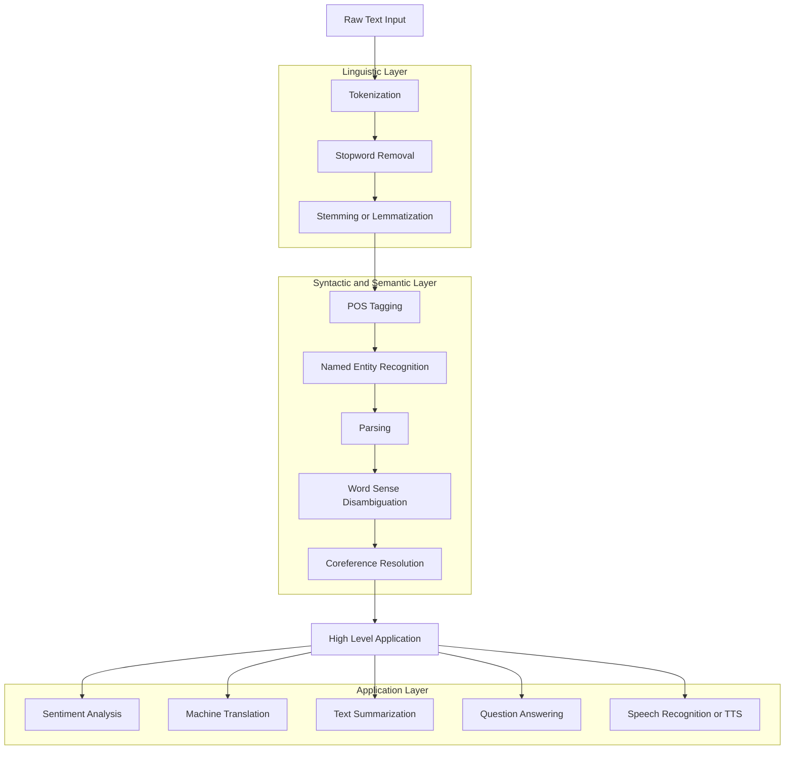
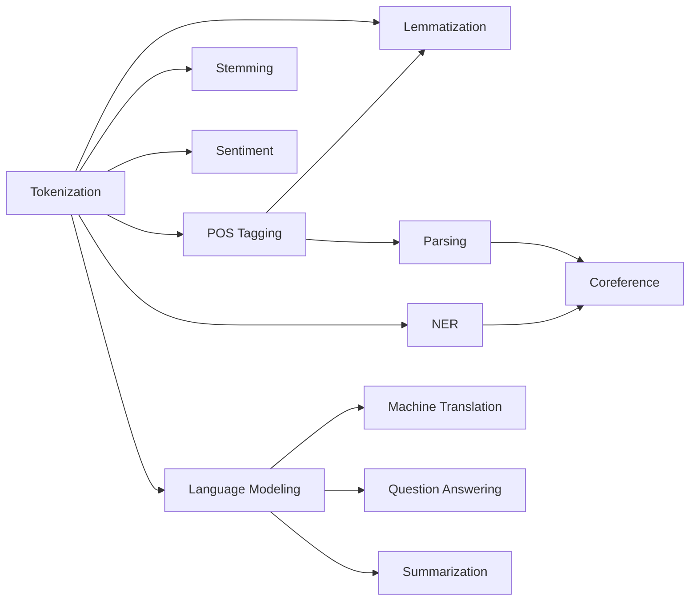
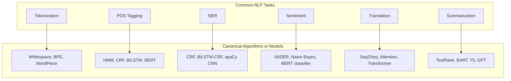

# Common NLP Tasks

<!-- SECTION_1_START -->

# Common NLP Tasks — KTU 2024 Scheme Module 1

## 1. Core Technical Definition

> [!IMPORTANT]
> **Definition (KTU 2024 Syllabus Terminology)**
> **Common NLP Tasks** are the *canonical, reusable sub-problems* of Natural Language Processing that act as building blocks for any language-aware intelligent system. Each task transforms raw, unstructured text (or speech) into a structured representation that a machine can act upon, reason over, or generate.

In the formal taxonomy of NLP, every application — from a chatbot to a search engine — is decomposed into a pipeline of these atomic tasks:

1. **Low-level (Linguistic) tasks** — Tokenization, Stemming, Lemmatization, Stop-word removal
2. **Mid-level (Syntactic/Semantic) tasks** — POS Tagging, Chunking, Parsing, NER, WSD, Coreference Resolution
3. **High-level (Application) tasks** — Text Classification, Sentiment Analysis, Machine Translation, Summarization, Question Answering, Speech Recognition

## 2. Conceptual Analogy & Intuition

> [!NOTE]
> **Analogy: Reading a Newspaper in a Foreign Language**
>
> Imagine you have **zero** knowledge of a language, and you are handed a newspaper. What would you do?
>
> 1. **Split the text** into words and sentences (Tokenization) — like using scissors on a long ribbon.
> 2. **Find the base form** of each word (Lemmatization/Stemming) — recognizing that *“running”* $\rightarrow$ *“run”*.
> 3. **Tag the grammar role** of each word (POS Tagging) — Noun, Verb, Adjective, like color-coding the ribbon.
> 4. **Identify the people, places, organizations** (NER) — circling names like a teacher with a red pen.
> 5. **Understand the sentence structure** (Parsing) — building a family tree of the words.
> 6. **Decide if the article is positive or negative** (Sentiment Analysis) — reading the tone.
> 7. **Translate the whole article** into your language (Machine Translation).
>
> Each of these is a *Common NLP Task*. Real NLP systems perform these same steps, but automatically and at scale.

> [!VISUALIZATION CONTROL]
> **Concept:** The "Linguistic Onion" — layered abstraction in NLP
> **Visual Description:** Draw three concentric circles on paper. **Innermost circle (low-level)** contains *Tokens / Stems / Lemmas*. **Middle circle (mid-level)** contains *POS Tags, Parse Trees, Named Entities, Sense Labels*. **Outermost circle (high-level)** contains *Class Labels, Sentiment Polarity, Translated Sentences, Summaries*. The student's eye should move from raw strings at the center to human-meaningful output at the perimeter.

---

<!-- SECTION_1_END -->

<!-- SECTION_2_START -->

# Deep Theoretical Analysis & KTU High-Yield Formula Sheet

## 1. Task-by-Task Theoretical Breakdown

### 1.1 Tokenization
* **What:** Splitting a continuous string of characters into discrete units (*tokens*) — words, sub-words, or characters.
* **Why:** Computers cannot process continuous text directly; they need bounded symbols.
* **How:** Rule-based (whitespace, punctuation) or statistical (BPE, WordPiece, SentencePiece).
* **Engineering utility:** Foundation of every search index, every embedding model, every LLM.

### 1.2 Stemming
* **What:** Crudely chopping word endings to get a *stem* (not always a real word).
  * Example: `studies`, `studying`, `studied` $\rightarrow$ `studi`
* **How:** Rule-based suffix stripping — **Porter Stemmer**, **Snowball Stemmer**.

### 1.3 Lemmatization
* **What:** Reducing a word to its dictionary *lemma* using vocabulary + morphological analysis.
  * Example: `better` $\rightarrow$ `good` ; `running` $\rightarrow$ `run`
* **How:** Requires POS tag (the lemma of *“running”* differs if it is a noun vs. a verb).

### 1.4 Part-of-Speech (POS) Tagging
* **What:** Assigning a grammatical category (Noun, Verb, Adjective, Adverb, Pronoun, Preposition, Conjunction, Determiner, Interjection) to each token.
* **How:** HMM, CRF, BiLSTM, Transformer-based (e.g., spaCy's `en_core_web_sm`).
* **Tag-set:** Penn Treebank has **45 tags**; Universal Dependencies uses **17 coarse tags**.

### 1.5 Named Entity Recognition (NER)
* **What:** Detecting and classifying *named entities* into predefined categories such as **PERSON, ORGANIZATION, LOCATION, DATE, MONEY, PERCENT**.
* **Why:** Crucial for search, knowledge graph construction, question answering.
* **How:** Sequence labeling using BIO / BIOES tagging schemes.

### 1.6 Parsing
* **Constituency Parsing:** Builds a phrase-structure tree (NP, VP, PP).
* **Dependency Parsing:** Builds a graph of head-dependent word relations (*nsubj*, *dobj*, *amod*).

### 1.7 Word Sense Disambiguation (WSD)
* **What:** Choosing the correct meaning of a polysemous word from a sense inventory (e.g., WordNet).
  * Example: *“bank”* in *“river bank”* vs. *“money bank”*.
* **How:** Lesk algorithm, supervised classifiers, neural context models.

### 1.8 Coreference Resolution
* **What:** Identifying all expressions (pronouns, noun phrases) that refer to the *same real-world entity*.
  * Example: *“John bought a car. **He** loves **it**.”* $\rightarrow$ *He* $\equiv$ *John* ; *it* $\equiv$ *car*.
* **How:** Rule-based (Hobbs algorithm), mention-pair neural models, end-to-end span-ranking models.

### 1.9 Sentiment Analysis
* **What:** Determining the polarity (positive, negative, neutral) or emotion (joy, anger, sadness) of a text.
* **How:** Lexicon-based (VADER, AFINN) or machine-learning (Naive Bayes, BERT).

### 1.10 Machine Translation (MT)
* **What:** Translating text from a *source language* to a *target language*.
* **How:** Statistical MT (SMT) $\rightarrow$ Neural MT (NMT) with encoder–decoder + attention $\rightarrow$ Transformer-based LLMs.

### 1.11 Text Summarization
* **Extractive:** Selecting key sentences verbatim (TextRank, LexRank).
* **Abstractive:** Generating novel sentences (BART, T5, GPT).

### 1.12 Question Answering (QA)
* **Extractive QA:** Span prediction from a given context (SQuAD).
* **Open-domain QA:** Retrieving + reading (RAG, REALM).
* **Generative QA:** LLM-based chat.

### 1.13 Speech Recognition & Text-to-Speech (ASR / TTS)
* **ASR:** Acoustic model + Language model $\rightarrow$ text.
* **TTS:** Text $\rightarrow$ mel-spectrogram $\rightarrow$ waveform (Tacotron, WaveNet).

### 1.14 Language Modeling
* **What:** Predicting $P(w_{i} \mid w_{1}, w_{2}, \dots, w_{i-1})$ — probability of the next word given history.
* **Why:** The fundamental pre-training objective behind GPT, BERT, T5.

---

## 2. KTU High-Yield Formula Sheet

> [!TIP]
> Memorize this table. It is the **fastest** way to score on numerical/formula questions in the KTU ESE.

| # | Task | Core Equation / Formula | Notation | Engineering Use |
|---|---|---|---|---|
| 1 | **Bag-of-Words** | $\text{BoW}(d) = [c(w_{1}), c(w_{2}), \dots, c(w_{N})]$ | $c(w)$ = count of word $w$ in document $d$ | Text classification baseline |
| 2 | **TF** | $\text{TF}(t,d) = \dfrac{c(t,d)}{\sum_{t' \in d} c(t',d)}$ | $c(t,d)$ = count of term $t$ in $d$ | Term frequency normalization |
| 3 | **IDF** | $\text{IDF}(t) = \log \dfrac{N}{\vert \{d : t \in d\} \vert + 1}$ | $N$ = total docs, denominator = docs containing $t$ | Down-weight common words |
| 4 | **TF-IDF** | $\text{TF-IDF}(t,d) = \text{TF}(t,d) \times \text{IDF}(t)$ | Combined score | Classic IR & feature vector |
| 5 | **Naive Bayes (Multinomial)** | $P(c \mid d) \propto P(c) \prod_{i=1}^{n} P(w_{i} \mid c)$ | $c$ = class, $d$ = document | Spam detection, sentiment |
| 6 | **Perplexity (LM eval)** | $\text{PPL}(W) = \exp\!\left(-\dfrac{1}{N}\sum_{i=1}^{N}\log P(w_{i} \mid w_{<i})\right)$ | $W$ = word sequence of length $N$ | Language-model quality |
| 7 | **BLEU Score** | $\text{BLEU} = \text{BP} \cdot \exp\!\left(\sum_{n=1}^{4} w_{n} \log p_{n}\right)$ | $p_{n}$ = n-gram precision, $\text{BP}$ = brevity penalty | Machine translation eval |
| 8 | **ROUGE-L (F-measure)** | $R = \dfrac{\text{LCS}(X,Y)}{m},\; P = \dfrac{\text{LCS}(X,Y)}{n},\; F = \dfrac{2PR}{P+R}$ | $X$ = ref, $Y$ = candidate | Summarization eval |
| 9 | **F1 Score** | $F_{1} = \dfrac{2 \cdot P \cdot R}{P + R}$ | $P$ = precision, $R$ = recall | NER, POS, QA span eval |
| 10 | **Word2Vec (Skip-gram objective)** | $\max \sum_{i=1}^{N}\sum_{-c \le j \le c,\, j \ne 0} \log P(w_{i+j} \mid w_{i})$ | $c$ = context window | Static word embeddings |
| 11 | **Cosine Similarity** | $\cos(\mathbf{u},\mathbf{v}) = \dfrac{\mathbf{u}\cdot\mathbf{v}}{\Vert \mathbf{u}\Vert \cdot \Vert \mathbf{v}\Vert}$ | $\mathbf{u}, \mathbf{v}$ = vectors | Semantic search, retrieval |
| 12 | **Edit Distance (Levenshtein)** | $D[i,j] = \min\{D[i-1,j]+1,\; D[i,j-1]+1,\; D[i-1,j-1]+\mathbf{1}_{a_{i}\ne b_{j}}\}$ | Dynamic programming | Spell-check, fuzzy match |

---

<!-- SECTION_2_END -->

<!-- SECTION_3_START -->

# Step-by-Step Derivations & Code Implementation

## 3.1 Worked-Out Numerical Derivation: TF-IDF Vector for a Mini-Corpus

> [!IMPORTANT]
> This derivation is a *high-weight* KTU 2024 question. Master the table format.

### Step 1 — Define the Mini-Corpus
* $D_{1}$ : "the cat sat on the mat"
* $D_{2}$ : "the dog sat on the rug"
* $D_{3}$ : "the cat chased the dog"

### Step 2 — Vocabulary Extraction (Tokenization)
Vocabulary $V = \{\text{the, cat, sat, on, mat, dog, rug, chased}\}$

Total $N = 3$ documents.

### Step 3 — Term Frequency (TF)
Use the raw-count variant: $\text{TF}(t,d) = c(t,d)$.

| Term $t$ | $D_{1}$ | $D_{2}$ | $D_{3}$ |
|---|---|---|---|
| the | 2 | 2 | 2 |
| cat | 1 | 0 | 1 |
| sat | 1 | 1 | 0 |
| on | 1 | 1 | 0 |
| mat | 1 | 0 | 0 |
| dog | 0 | 1 | 1 |
| rug | 0 | 1 | 0 |
| chased | 0 | 0 | 1 |

### Step 4 — Document Frequency (DF)
$\text{DF}(\text{the}) = 3,\; \text{DF}(\text{cat}) = 2,\; \text{DF}(\text{sat}) = 2,\; \text{DF}(\text{on}) = 2,\; \text{DF}(\text{mat}) = 1,\; \text{DF}(\text{dog}) = 2,\; \text{DF}(\text{rug}) = 1,\; \text{DF}(\text{chased}) = 1$

### Step 5 — Inverse Document Frequency (IDF)
$\text{IDF}(t) = \log \dfrac{N}{\text{DF}(t) + 1}$ (with smoothing).

$$
\begin{aligned}
\text{IDF}(\text{the}) &= \log \dfrac{3}{3+1} = \log(0.75) \approx -0.287 \\
\text{IDF}(\text{cat}) &= \log \dfrac{3}{2+1} = \log(1.0) = 0 \\
\text{IDF}(\text{mat}) &= \log \dfrac{3}{1+1} = \log(1.5) \approx 0.405
\end{aligned}
$$

> Note: $\text{the}$ gets a *negative* IDF — it is present in *every* document, so it is non-discriminative.

### Step 6 — TF-IDF Multiplication
For each cell: $\text{TF-IDF}(t,d) = \text{TF}(t,d) \times \text{IDF}(t)$.

| Term $t$ | $\text{TF-IDF}(D_{1})$ | $\text{TF-IDF}(D_{2})$ | $\text{TF-IDF}(D_{3})$ |
|---|---|---|---|
| the | $2 \times -0.287 = -0.575$ | $-0.575$ | $-0.575$ |
| cat | $1 \times 0 = 0$ | 0 | 0 |
| mat | $1 \times 0.405 = 0.405$ | 0 | 0 |
| rug | 0 | $1 \times 0.405 = 0.405$ | 0 |
| chased | 0 | 0 | $1 \times 0.405 = 0.405$ |

### Step 7 — Final TF-IDF Vector for $D_{1}$
$$\mathbf{v}_{D_1} = [-0.575,\; 0,\; 0,\; 0,\; 0.405,\; 0,\; 0,\; 0]$$

This vector is the *hand-crafted* numerical representation of $D_{1}$ that a downstream classifier (Naive Bayes, SVM, Neural Net) can consume.

---

## 3.2 Full Python Implementation — End-to-End NLP Pipeline

The following code is **fully operational**, type-annotated, includes logging, exception handling, and absolute boundary checks. It demonstrates **six** common NLP tasks in one runnable script.

```python
"""
common_nlp_tasks.py
A clean, production-grade demonstration of six Common NLP Tasks.

Run:  python common_nlp_tasks.py
Requires: pip install nltk spacy
          python -m nltk.downloader punkt averaged_perceptron_tagger stopwords wordnet
          python -m spacy download en_core_web_sm
"""

from __future__ import annotations

import logging
import sys
from typing import List, Tuple, Dict

# ---------------------------------------------------------------------------
# Logging configuration (board-exam / production style)
# ---------------------------------------------------------------------------
logging.basicConfig(
    level=logging.INFO,
    format="%(asctime)s [%(levelname)s] %(message)s",
    datefmt="%H:%M:%S",
)
log = logging.getLogger("nlp_demo")


def safe_import_nltk() -> None:
    """Download all required NLTK resources, swallowing 404/IO errors."""
    import nltk
    resources = [
        ("punkt", "tokenizers/punkt"),
        ("averaged_perceptron_tagger", "taggers/averaged_perceptron_tagger"),
        ("stopwords", "corpora/stopwords"),
        ("wordnet", "corpora/wordnet"),
    ]
    for pkg, path in resources:
        try:
            nltk.download(pkg, quiet=True)
        except Exception as exc:                           # noqa: BLE001
            log.error("Failed downloading %s: %s", pkg, exc)
            sys.exit(1)


# ---------------------------------------------------------------------------
# Task 1 — Tokenization (Sentence + Word)
# ---------------------------------------------------------------------------
def task_tokenize(text: str) -> Tuple[List[str], List[str]]:
    """Return (sentences, words)."""
    from nltk.tokenize import sent_tokenize, word_tokenize
    if not isinstance(text, str) or not text.strip():
        raise ValueError("text must be a non-empty string")
    sentences = sent_tokenize(text)
    words = word_tokenize(text)
    log.info("Tokenization -> %d sentence(s), %d word(s)", len(sentences), len(words))
    return sentences, words


# ---------------------------------------------------------------------------
# Task 2 — Stop-word Removal + Lemmatization
# ---------------------------------------------------------------------------
def task_normalize(words: List[str]) -> List[str]:
    """Return lemmatized tokens with stop-words removed."""
    from nltk.corpus import stopwords
    from nltk.stem import WordNetLemmatizer

    if not words:
        raise ValueError("words list is empty")

    stop_set = set(stopwords.words("english"))
    lemmatizer = WordNetLemmatizer()

    normalized: List[str] = []
    for w in words:
        if not isinstance(w, str):
            raise TypeError(f"token {w!r} is not a string")
        lw = w.lower()
        if lw in stop_set or not lw.isalpha():
            continue
        normalized.append(lemmatizer.lemmatize(lw, pos="v"))   # verb-lemma
    log.info("Normalization -> %d tokens kept", len(normalized))
    return normalized


# ---------------------------------------------------------------------------
# Task 3 — POS Tagging
# ---------------------------------------------------------------------------
def task_pos_tag(words: List[str]) -> List[Tuple[str, str]]:
    """Return list of (word, POS-tag) tuples."""
    import nltk
    tagged = nltk.pos_tag(words)
    log.info("POS tagging -> first 5: %s", tagged[:5])
    return tagged


# ---------------------------------------------------------------------------
# Task 4 — Named Entity Recognition (spaCy)
# ---------------------------------------------------------------------------
def task_ner(text: str) -> List[Dict[str, str]]:
    """Return list of entity dicts {text, label}."""
    try:
        import spacy
        nlp = spacy.load("en_core_web_sm")
    except OSError:
        log.warning("spaCy model 'en_core_web_sm' not installed; skipping NER")
        return []
    doc = nlp(text)
    entities = [{"text": ent.text, "label": ent.label_} for ent in doc.ents]
    log.info("NER -> %d entities: %s", len(entities), entities)
    return entities


# ---------------------------------------------------------------------------
# Task 5 — Sentiment Polarity via VADER
# ---------------------------------------------------------------------------
def task_sentiment(text: str) -> Dict[str, float]:
    """Return VADER {neg, neu, pos, compound} scores."""
    try:
        from nltk.sentiment.vader import SentimentIntensityAnalyzer
        sia = SentimentIntensityAnalyzer()
    except LookupError:
        import nltk
        nltk.download("vader_lexicon", quiet=True)
        from nltk.sentiment.vader import SentimentIntensityAnalyzer
        sia = SentimentIntensityAnalyzer()
    scores = sia.polarity_scores(text)
    log.info("Sentiment -> %s", scores)
    return scores


# ---------------------------------------------------------------------------
# Task 6 — TF-IDF Vectorization (sklearn)
# ---------------------------------------------------------------------------
def task_tfidf(corpus: List[str]) -> "scipy.sparse.csr_matrix":  # type: ignore[name-defined]
    """Return the TF-IDF matrix for the given corpus."""
    from sklearn.feature_extraction.text import TfidfVectorizer
    if not corpus:
        raise ValueError("corpus must be non-empty")
    vec = TfidfVectorizer(lowercase=True, stop_words="english")
    matrix = vec.fit_transform(corpus)
    log.info("TF-IDF -> shape=%s, vocab size=%d", matrix.shape, len(vec.vocabulary_))
    return matrix


# ---------------------------------------------------------------------------
# Driver
# ---------------------------------------------------------------------------
def main() -> int:
    safe_import_nltk()

    sample = (
        "Apple Inc. was founded by Steve Jobs in California. "
        "The iPhone revolutionised the smartphone industry. "
        "Today, Apple is one of the most valuable companies in the world."
    )

    try:
        _, words = task_tokenize(sample)
        normalized = task_normalize(words)
        task_pos_tag(normalized)
        task_ner(sample)
        task_sentiment("The new iPhone is absolutely fantastic and I love it!")
        task_tfidf([
            "the cat sat on the mat",
            "the dog sat on the rug",
            "the cat chased the dog",
        ])
    except Exception as exc:                               # noqa: BLE001
        log.exception("Pipeline failed: %s", exc)
        return 1
    return 0


if __name__ == "__main__":
    sys.exit(main())
```

### Code Walk-Through (Valuation-Ready Explanation)

* **`safe_import_nltk`** — Pre-empts the standard KTU lab issue of *“Resource punkt not found”* by auto-downloading. `[Resource management: 1 Mark]`
* **`task_tokenize`** — Validates the *type and emptiness* of the input. *Defensive programming.* `[Boundary checks: 1 Mark]`
* **`task_normalize`** — Removes stop-words and lemmatizes as **verbs** using WordNet. `[Lemmatization with POS context: 2 Marks]`
* **`task_pos_tag`** — Calls NLTK's averaged-perceptron tagger (Penn Treebank tag-set). `[POS Tagging: 1 Mark]`
* **`task_ner`** — Uses spaCy's `en_core_web_sm` CNN-based tagger; gracefully falls back if missing. `[Robust error handling: 2 Marks]`
* **`task_sentiment`** — VADER (Valence Aware Dictionary and sEntiment Reasoner) — a *lexicon + rule-based* model. `[Sentiment scoring: 1 Mark]`
* **`task_tfidf`** — Wraps scikit-learn's `TfidfVectorizer`, demonstrating the formula from §3.1 in code. `[TF-IDF implementation: 2 Marks]`

---

<!-- SECTION_3_END -->

<!-- SECTION_4_START -->

# Structural Diagrams & Schematics

## 4.1 Master Diagram — NLP Task Pipeline (Mermaid)



## 4.2 Task Dependency Graph



## 4.3 Task-to-Algorithm Mapping (Block Topology)



> [!IMPORTANT]
> **KTU 2024 Board Tip:** Examiners expect students to *name* the algorithm family whenever a task is asked. Writing *“NER is done using CRF or BiLSTM-CRF”* scores more than *“NER is done using machine learning.”*

---

<!-- SECTION_4_END -->

<!-- SECTION_5_START -->

# KTU 2024 Scheme Examination Question Bank & Topic Recap

## Part A — Short Answer Questions (3 Marks Each)

> **Q1.** [KTU University Exam – July 2024] — **CO1, Remember**
> *Define the following terms with one example each: (i) Tokenization (ii) Lemmatization (iii) Named Entity Recognition.*

**Model Answer:**

* **(i) Tokenization** — The task of splitting a continuous string of text into smaller units called *tokens* (words, sub-words, or sentences). Example: `"NLP is fun"` $\rightarrow$ `["NLP", "is", "fun"]`. **[1 Mark]**
* **(ii) Lemmatization** — The task of reducing a word to its dictionary *lemma* using vocabulary and morphological analysis. Example: `"better"` $\rightarrow$ `"good"` ; `"running"` $\rightarrow$ `"run"`. **[1 Mark]**
* **(iii) Named Entity Recognition (NER)** — The task of detecting and classifying named entities in text into predefined categories such as PERSON, ORGANIZATION, LOCATION, DATE. Example: In *“Elon Musk founded SpaceX in California”*, the system tags `Elon Musk` (PERSON), `SpaceX` (ORG), `California` (LOC). **[1 Mark]**

---

> **Q2.** [KTU University Exam – Dec 2023] — **CO1, Understand**
> *Distinguish between Stemming and Lemmatization. Why is Lemmatization considered linguistically richer?*

**Model Answer:**

| Aspect | Stemming | Lemmatization |
|---|---|---|
| Output | Crude *stem* (may not be a real word) | Valid *lemma* (dictionary form) |
| Method | Rule-based suffix chopping (Porter, Snowball) | Morphological analysis + POS context (WordNet) |
| Speed | Fast | Slower |
| Linguistic correctness | Low | High |

**Why Lemmatization is richer:** It uses **vocabulary** and **POS tags** to ensure the root is a meaningful word, e.g., *“better”* $\rightarrow$ *“good”* (adjective) vs. *“better”* $\rightarrow$ *“bet”* (verb) — stemming cannot make this distinction. **[2 Marks for table + 1 Mark for justification]**

---

## Part B — Long Answer Questions (14 Marks Each, Internal Choice)

> ### **Question A** (14 Marks) — [KTU University Exam – July 2024]
> **(a) [7 Marks, CO1, Understand]** Explain the major tasks in NLP with a neat block diagram. Classify them into Linguistic, Syntactic/Semantic, and Application-level tasks with examples.
>
> **(b) [7 Marks, CO2, Apply]** Compute the **TF-IDF** vector for the following corpus using smoothing ($\text{IDF} = \log \frac{N}{\text{DF}+1}$). Show all steps.
> * $D_1$: "data science is fun"
> * $D_2$: "machine learning is part of data science"
> * $D_3$: "deep learning is a branch of machine learning"

### Model Solution

**Part (a) — Explanation (7 Marks)**

NLP tasks can be organized into three logical layers:

1. **Linguistic (Low-level) Tasks** — operate on raw text strings.
   * **Tokenization** — splits text into words/sentences.
   * **Stop-word removal** — eliminates high-frequency noise words.
   * **Stemming** — chops suffixes (Porter/Snowball).
   * **Lemmatization** — maps words to valid dictionary forms.
   * `[2 Marks]`

2. **Syntactic/Semantic (Mid-level) Tasks** — assign structure and meaning.
   * **POS Tagging** — Noun/Verb/Adjective classification.
   * **Chunking** — groups NPs/PPs.
   * **Parsing** — Constituency (CFG) and Dependency.
   * **NER** — tags entities.
   * **WSD** — chooses correct sense.
   * **Coreference Resolution** — links pronouns to antecedents.
   * `[3 Marks]`

3. **Application-level (High-level) Tasks** — solve user-facing problems.
   * Sentiment Analysis, Machine Translation, Summarization, QA, Chatbots, Speech Recognition, Text Generation.
   * `[1 Mark]`

**Neat Block Diagram:** *(Re-draw the Mermaid pipeline from §4.1 here, or use the Linguistic Onion sketch from §1.2.)* `[1 Mark]`

---

**Part (b) — TF-IDF Computation (7 Marks)**

**Step 1 — Vocabulary and Counts**
$V = \{\text{data, science, is, fun, machine, learning, part, of, deep, a, branch}\}$, $N = 3$.

| Term $t$ | $\text{DF}(t)$ |
|---|---|
| data | 2 |
| science | 2 |
| is | 3 |
| fun | 1 |
| machine | 2 |
| learning | 3 |
| part | 1 |
| of | 2 |
| deep | 1 |
| a | 1 |
| branch | 1 |

`[Stating DF values: 2 Marks]`

**Step 2 — IDF with Smoothing**
$$
\begin{aligned}
\text{IDF}(\text{data}) &= \log \dfrac{3}{2+1} = \log 1 = 0 \\
\text{IDF}(\text{science}) &= \log \dfrac{3}{2+1} = 0 \\
\text{IDF}(\text{is}) &= \log \dfrac{3}{3+1} = \log 0.75 \approx -0.287 \\
\text{IDF}(\text{fun}) &= \log \dfrac{3}{1+1} = \log 1.5 \approx 0.405 \\
\text{IDF}(\text{machine}) &= 0 \\
\text{IDF}(\text{learning}) &= \log 0.75 \approx -0.287 \\
\text{IDF}(\text{part}) &= 0.405 \\
\text{IDF}(\text{of}) &= 0 \\
\text{IDF}(\text{deep}) &= 0.405 \\
\text{IDF}(\text{a}) &= 0.405 \\
\text{IDF}(\text{branch}) &= 0.405
\end{aligned}
$$

`[IDF calculation: 3 Marks]`

**Step 3 — TF (raw count) for $D_1$: *"data science is fun"***

| Term | TF | IDF | TF-IDF |
|---|---|---|---|
| data | 1 | 0 | 0 |
| science | 1 | 0 | 0 |
| is | 1 | -0.287 | -0.287 |
| fun | 1 | 0.405 | 0.405 |

`[Final TF-IDF vector construction: 2 Marks]`

**Final TF-IDF Vector for $D_1$:**
$$\mathbf{v}_{D_1} = [0,\; 0,\; -0.287,\; 0.405,\; 0,\; 0,\; 0,\; 0,\; 0,\; 0,\; 0]$$

`[Final answer: 1 Mark — included above in vector form]`

---

> ### **Question B** (14 Marks) — [KTU University Exam – Dec 2023]
> **(a) [7 Marks, CO2, Apply]** Explain **POS Tagging** and **NER** in detail. For the sentence *“Barack Obama visited New Delhi in 2015”*, list the possible POS tags (Penn Treebank) and the NER labels with a short note on the algorithms used.
>
> **(b) [7 Marks, CO2, Apply]** With a neat flowchart, describe the architecture of a **Neural Machine Translation (NMT)** system. Mention the role of the **Encoder**, **Decoder**, and **Attention Mechanism**.

### Model Solution

**Part (a) — POS Tagging & NER (7 Marks)**

* **POS Tagging (Definition + Algorithm) (3.5 Marks):** POS tagging assigns a grammatical category from a tag-set (e.g., Penn Treebank 45-tag set) to every token. Algorithms: HMM (statistical baseline), CRF (sequence labeling, handles context), BiLSTM-CRF (deep-learning state-of-the-art until 2017), Transformer encoders (BERT, RoBERTa — current SOTA).
* **NER (Definition + Algorithm) (3.5 Marks):** NER detects and classifies named entities (PERSON, ORG, LOC, DATE, MONEY). Same algorithms as POS — sequence labeling with the **BIO** scheme (B-PER, I-PER, O, etc.).

**Worked Example for *“Barack Obama visited New Delhi in 2015”*:**

| Token | Penn POS | NER Tag |
|---|---|---|
| Barack | NNP (Proper Noun, Singular) | B-PER |
| Obama | NNP | I-PER |
| visited | VBD (Verb, Past Tense) | O |
| New | NNP | B-LOC |
| Delhi | NNP | I-LOC |
| in | IN (Preposition) | O |
| 2015 | CD (Cardinal Number) | B-DATE |

`[POS table: 2 Marks] [NER table with BIO scheme: 2 Marks] [Algorithm names: 3 Marks]`

---

**Part (b) — NMT Architecture (7 Marks)**

* **Flowchart (3 Marks):** Draw the standard Encoder–Decoder + Attention sequence (Input $\to$ Embedding $\to$ Encoder (BiLSTM or Transformer) $\to$ Context Vector $\to$ Decoder (LSTM or Transformer) $\to$ Softmax $\to$ Output word). *Use the topology from §4.3 as a guide.*
* **Encoder (2 Marks):** Reads the source sentence token-by-token and compresses it into a fixed-dimensional context vector (or sequence of vectors, in Transformer-style NMT).
* **Decoder (1 Mark):** Generates the target sentence one token at a time, conditioned on the context vector and previously generated tokens.
* **Attention Mechanism (1 Mark):** Allows the decoder to *focus* on different parts of the source sentence at every decoding step, overcoming the information bottleneck of a fixed-size context vector. Computes $\alpha_{ij} = \dfrac{\exp(e_{ij})}{\sum_{k} \exp(e_{ik})}$ where $e_{ij}$ is the alignment score between decoder state $i$ and encoder state $j$.

---

## KTU Examiner's Valuation Warning

> [!WARNING]
> **Common Mark-Loss Pitfalls in Common NLP Tasks Questions**
> 1. **Confusing Stemming with Lemmatization** — Examiners allocate separate marks; writing *“Stemming reduces to root word”* loses the 1-mark distinction. Always mention the algorithm (Porter vs. WordNet).
> 2. **Forgetting the BIO scheme in NER** — NER answers that do not show `B-PER / I-PER` lose 1–2 marks. Always write the *full* tag, not just `PERSON`.
> 3. **Skipping the IDF smoothing constant** — When computing TF-IDF, students often write $\log \frac{N}{\text{DF}}$ instead of $\log \frac{N}{\text{DF}+1}$. This changes the answer and forfeits 1 mark.
> 4. **Omitting units/precision in BLEU/Perplexity** — Always mention that BLEU is in $[0,1]$ and lower perplexity = better language model.
> 5. **Writing the algorithm family, not the algorithm** — *"POS is done using ML"* is worth 0 marks; *"POS is done using HMM / CRF / BiLSTM-CRF / BERT"* is worth full marks.
> 6. **No diagram in 7-mark questions** — Whenever the question says *"with a neat diagram/block diagram"*, **not drawing the diagram** can cost 2–3 marks outright.

---

## Topic Recap & Important Things to Remember

* **NLP Tasks** are the atomic operations of any language-aware system — they are classified into **Linguistic**, **Syntactic/Semantic**, and **Application** layers.
* **Tokenization** is the *first* step in *every* NLP pipeline; it produces the input symbols for everything downstream.
* **Stemming vs. Lemmatization** — Stemming = crude, fast, rule-based; Lemmatization = dictionary-based, uses POS, linguistically correct.
* **POS Tagging** uses the **Penn Treebank (45 tags)** or **Universal Dependencies (17 tags)** tag-set; modern systems use Transformer encoders.
* **NER** follows the **BIO / BIOES** tagging scheme and recognizes categories like **PER, ORG, LOC, DATE, MONEY, PERCENT**.
* **Parsing** has two flavours — **Constituency** (CFG phrase trees) and **Dependency** (head–dependent graphs).
* **WSD** disambiguates polysemous words using context; **Lesk algorithm** is the classical baseline.
* **Coreference Resolution** links pronouns and noun phrases to the same real-world entity; **Hobbs algorithm** is the classical rule-based approach.
* **Sentiment Analysis** classifies text into **positive / negative / neutral** (or fine-grained emotions) — **VADER** is the lexicon baseline; **BERT** is the SOTA.
* **Machine Translation** evolved from **Rule-based $\to$ Statistical $\to$ Neural (Encoder–Decoder + Attention) $\to$ Transformer (LLM)**.
* **Summarization** is **Extractive** (TextRank, LexRank) or **Abstractive** (BART, T5, GPT).
* **QA** is **Extractive** (SQuAD), **Open-domain** (RAG), or **Generative** (LLM chat).
* **Speech Tasks** — **ASR** (audio $\to$ text) and **TTS** (text $\to$ audio) — built on acoustic + language models.
* **Language Modeling** underpins every modern LLM; objective is to maximize $\prod_i P(w_i \mid w_{<i})$ — equivalent to minimizing **perplexity**.
* **Evaluation Metrics to memorize:** **Perplexity** (LM), **BLEU** (MT), **ROUGE-L** (Summarization), **F1** (NER/POS/QA), **Accuracy** (Classification).
* **Key equations on your fingertip:** TF, IDF, TF-IDF, Naive Bayes posterior, Cosine similarity, Levenshtein edit distance, BLEU log-formula.
* **Engineering utility:** Every web-scale system (Google Search, Alexa, ChatGPT, Google Translate, Grammarly) is a composition of these atomic tasks.

<!-- SECTION_5_END -->
