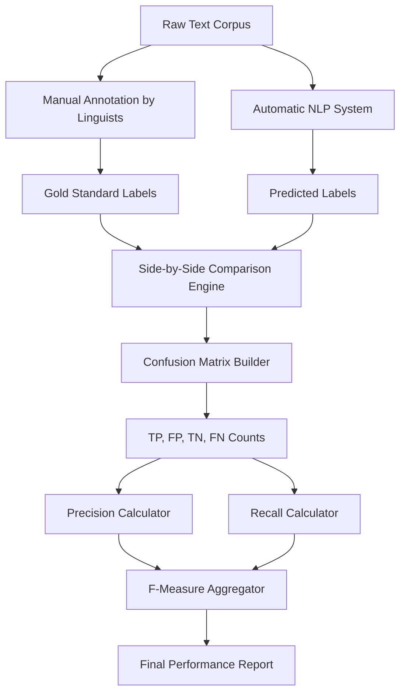
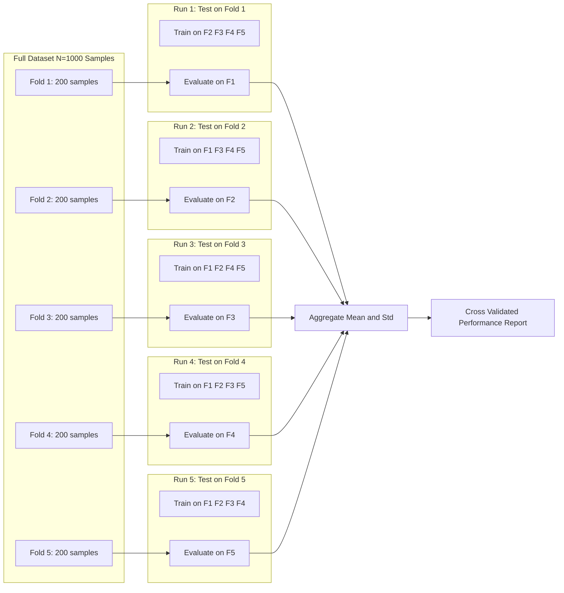
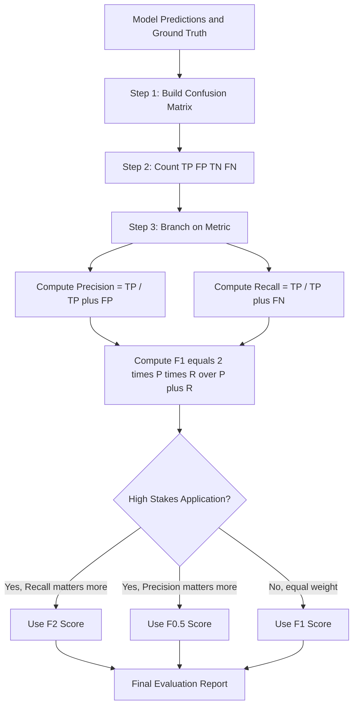

# Evaluation-Precision, Recall and F-measure-Test sets and cross validation

<!-- SECTION_1_START -->

# 1. Core Technical Definition & Intuitive Overview

## 1.1 Precision, Recall, and F-Measure — Formal Definitions

In **Natural Language Processing (NLP)** and **Information Retrieval (IR)**, every system that makes a *decision* about text (classifying a review as positive/negative, detecting a spam email, retrieving a relevant document, or tagging a word as a noun) can be evaluated using the same three fundamental metrics. These metrics are derived from a **Confusion Matrix**, which is a 2x2 tabular recording of the system's predictions against the ground truth (human-annotated) labels.

> [!IMPORTANT]
> **KTU 2024 Syllabus Definition**
> **Precision (P)** is the fraction of *retrieved* instances that are *relevant*. **Recall (R)** is the fraction of *relevant* instances that are *retrieved*. **F-Measure (F)** is the harmonic mean of Precision and Recall, providing a single scalar score that balances both concerns.

The four states recorded in a binary confusion matrix are:

- **True Positive (TP):** System predicted *positive* and the truth is *positive*.
- **True Negative (TN):** System predicted *negative* and the truth is *negative*.
- **False Positive (FP):** System predicted *positive* but the truth is *negative* (Type I error / *false alarm*).
- **False Negative (FN):** System predicted *negative* but the truth is *positive* (Type II error / *miss*).

## 1.2 Conceptual Analogy — The Fishing Pond

Imagine a fisherman casting a net into a **pond containing exactly 100 fish** (relevant items) and 900 pebbles (irrelevant items).

- **Precision** = Of all the objects the net pulled out, how many were *actually fish*? If the net grabs 80 fish and 20 pebbles, precision is 80/100 = **80%**. Precision answers: *"How clean is my catch?"*
- **Recall** = Of all 100 fish in the pond, how many did the net capture? If the net caught 80 out of 100, recall is 80/100 = **80%**. Recall answers: *"Did I miss any fish?"*
- **F-Measure** = A single number that punishes the model severely if *either* precision or recall is low. A model with 100% precision but 10% recall gets a poor F-score, because harmonic means are unforgiving toward extremes.

> [!NOTE]
> **Why not use Accuracy?**
> In NLP, the *class imbalance problem* is rampant (e.g., 99% of emails are *not* spam). A trivial classifier that always says "not spam" achieves 99% accuracy but is useless. Precision and Recall expose this failure, which is why the KTU 2024 Scheme emphasises them over plain accuracy.

> [!VISUALIZATION CONTROL]
> **Concept:** Confusion Matrix and Threshold Trade-off Curve
> **GeoGebra / Desmos Input Equations:**
> * `f(x) = x^2` for an example Precision curve
> * `g(x) = 1 - sqrt(1-x)` for an example Recall curve
> * `h(x) = (2 * f(x) * g(x)) / (f(x) + g(x))` for the F1 envelope
> **Visual Description:** On the x-axis (model confidence threshold from 0 to 1) and y-axis (metric value 0 to 1), the Precision curve typically rises toward 1.0 as threshold increases (fewer but cleaner predictions), while the Recall curve falls toward 0.0. The F1 curve peaks at a specific operating point where the two curves cross.

---

<!-- SECTION_1_END -->

<!-- SECTION_2_START -->

# 2. Deep Theoretical Analysis & KTU High-Yield Formula Sheet

## 2.1 The Operational Logic — Why Three Metrics?

A single metric cannot capture the *quality* of a classifier. Consider two extreme classifiers for a medical diagnosis system:

| Classifier | Precision | Recall | Verdict |
|------------|-----------|--------|---------|
| Conservative (predicts positive only when 100% sure) | High (0.99) | Very Low (0.10) | Misses sick patients — UNACCEPTABLE |
| Liberal (predicts positive for almost everyone) | Very Low (0.05) | High (0.99) | Floods doctors with false alarms — UNACCEPTABLE |
| Balanced (F1 optimised) | Moderate (0.80) | Moderate (0.75) | Clinically useful — ACCEPTABLE |

The **F-measure** mathematically resolves this tension by computing the **harmonic mean**, which weighs the lower of the two numbers more heavily.

## 2.2 Derivation Logic — From Confusion Matrix to F-Measure

The derivation is a four-step logical pipeline:

1. **Build the Confusion Matrix** by comparing each prediction $\hat{y}_i$ to its ground-truth label $y_i$.
2. **Count TP, FP, FN** by iterating through the prediction set.
3. **Compute Precision and Recall** as ratios of these counts.
4. **Combine them** using the generalised F-score formula.

## 2.3 The Generalised F-Score

The general form is the **$F_{\beta}$ score**, which lets the engineer *weight* precision and recall asymmetrically:

$$F_{\beta} = (1 + \beta^2) \cdot \frac{P \cdot R}{(\beta^2 \cdot P) + R}$$

- **$\beta = 1$** → $F_1$ score, equal weight to P and R (most common).
- **$\beta = 0.5$** → $F_{0.5}$, weighs **precision twice as much** as recall (used when false positives are costlier, e.g., search engines).
- **$\beta = 2$** → $F_2$, weighs **recall twice as much** as precision (used when misses are costlier, e.g., disease detection).

## 2.4 KTU Formula Sheet / Cheat Sheet

> [!IMPORTANT]
> The following table is the **high-yield reference** for KTU university exam derivations and numerical problems.

| Metric | Mathematical Formula | Range | Engineering Interpretation |
|--------|----------------------|-------|----------------------------|
| **Precision (P)** | $P = \frac{TP}{TP + FP}$ | $[0, 1]$ | Quality of positive predictions |
| **Recall (R)** | $R = \frac{TP}{TP + FN}$ | $[0, 1]$ | Coverage of true positives |
| **Accuracy** | $Acc = \frac{TP + TN}{TP + TN + FP + FN}$ | $[0, 1]$ | Misleading on imbalanced data |
| **Specificity** | $Spc = \frac{TN}{TN + FP}$ | $[0, 1]$ | True negative rate |
| **F1 Score** | $F_1 = \frac{2 \cdot P \cdot R}{P + R}$ | $[0, 1]$ | Balanced single metric |
| **General $F_{\beta}$** | $F_{\beta} = (1+\beta^2)\frac{P \cdot R}{\beta^2 P + R}$ | $[0, 1]$ | Weighted harmonic mean |
| **Macro F1** | $F_{macro} = \frac{1}{N}\sum_{i=1}^{N} F_{1,i}$ | $[0, 1]$ | Average across all classes equally |
| **Micro F1** | $F_{micro} = \frac{2 \cdot \sum TP_i}{2 \cdot \sum TP_i + \sum FP_i + \sum FN_i}$ | $[0, 1]$ | Aggregate global counts |

## 2.5 Test Sets and Cross-Validation — The Evaluation Protocol

A model is only as good as the data it is tested on. KTU 2024 emphasises two foundational evaluation protocols:

### 2.5.1 Hold-Out Test Set
The dataset $D$ is split once into a **training set** $D_{train}$ and a **held-out test set** $D_{test}$, typically with a ratio of **80:20** or **70:30**. The test set must be **never seen** during training. This is the simplest protocol, but it produces a *single* performance estimate that is sensitive to the specific split chosen.

### 2.5.2 K-Fold Cross-Validation
To produce a more **robust** and **low-variance** estimate, the data is split into $K$ equal folds. The model is trained $K$ times, each time using $K-1$ folds for training and the remaining 1 fold for testing. The final score is the **average across all K runs**.

Common values of $K$ in NLP research are:
- **$K = 5$** (standard for moderate-sized corpora, e.g., sentiment datasets with 10k–100k samples).
- **$K = 10$** (standard for smaller corpora).
- **$K = N$ (Leave-One-Out Cross-Validation, LOOCV)** — used when $N < 100$ or for very expensive experiments.

## 2.6 Real-World Utility in Engineering

- **Search Engines (Google, Bing):** Use $F_{0.5}$ to bias toward precision — users prefer 10 highly relevant results over 100 noisy ones.
- **Medical NLP (Clinical Text Mining):** Use $F_2$ to bias toward recall — missing a tumour in a radiology report is worse than a false alarm.
- **Spam Filters (Gmail):** Use $F_1$ — both missed spam and legitimate mail marked as spam are equally damaging.
- **Legal Document Discovery:** Use Macro-F1 across dozens of legal categories, where each category has different volumes.

---

<!-- SECTION_2_END -->

<!-- SECTION_3_START -->

# 3. Step-by-Step Derivations & Code/Symbolic Implementation

## 3.1 Numerical Worked Example — Confusion Matrix to F1

**Problem Statement:** A Named Entity Recognition (NER) system processes 200 sentences. The confusion matrix on the entity class *PERSON* is given as: $TP = 60$, $FP = 20$, $FN = 30$, $TN = 90$. Compute Precision, Recall, F1, and the $F_2$ score.

### Step 1 — Compute Precision

$$P = \frac{TP}{TP + FP} = \frac{60}{60 + 20} = \frac{60}{80} = 0.75$$

> *Interpretation:* When the system tags a word as a PERSON, it is correct 75% of the time.

### Step 2 — Compute Recall

$$R = \frac{TP}{TP + FN} = \frac{60}{60 + 30} = \frac{60}{90} \approx 0.6667$$

> *Interpretation:* The system finds 66.67% of all true PERSON entities in the corpus.

### Step 3 — Compute F1 Score

$$F_1 = \frac{2 \cdot P \cdot R}{P + R} = \frac{2 \cdot 0.75 \cdot 0.6667}{0.75 + 0.6667} = \frac{1.0000}{1.4167} \approx 0.7059$$

> *Interpretation:* The balanced score is 0.7059, which is lower than the arithmetic mean of P and R (0.7083), demonstrating the penalty of the harmonic mean.

### Step 4 — Compute F2 Score (Recall-Weighted)

$$F_2 = (1 + 2^2) \cdot \frac{P \cdot R}{(2^2 \cdot P) + R} = 5 \cdot \frac{0.75 \cdot 0.6667}{(4 \cdot 0.75) + 0.6667}$$

$$F_2 = 5 \cdot \frac{0.5000}{3.6667} = 5 \cdot 0.1364 \approx 0.6818$$

> *Verification:* Since $F_2 < F_1$ in this case, it confirms recall is the *weaker* of the two metrics, so the F2 score is pulled further downward.

## 3.2 Step-by-Step K-Fold Cross-Validation Numerical Trace

**Problem:** Given a balanced sentiment dataset of 1000 reviews split into 5 folds ($K=5$), each fold contains 200 samples. The accuracy obtained on each fold is: $[0.82, 0.85, 0.81, 0.84, 0.83]$. Compute the mean and standard deviation.

### Step 1 — Compute the Mean Cross-Validation Accuracy

$$\bar{Acc} = \frac{1}{K} \sum_{i=1}^{K} Acc_i = \frac{0.82 + 0.85 + 0.81 + 0.84 + 0.83}{5}$$

$$\bar{Acc} = \frac{4.15}{5} = 0.83 \text{ (or } 83\% \text{)}$$

### Step 2 — Compute the Standard Deviation

First, find the squared deviations from the mean:

$$\sigma^2 = \frac{1}{K-1} \sum_{i=1}^{K} (Acc_i - \bar{Acc})^2$$

The deviations are: $[-0.01, +0.02, -0.02, +0.01, 0.00]$.

The squared deviations are: $[0.0001, 0.0004, 0.0004, 0.0001, 0.0000]$.

$$\sigma^2 = \frac{0.0001 + 0.0004 + 0.0004 + 0.0001 + 0.0000}{4} = \frac{0.0010}{4} = 0.00025$$

$$\sigma = \sqrt{0.00025} \approx 0.0158$$

> *Final Report:* The model achieves an accuracy of **83% ± 1.58%** across 5-fold cross-validation, indicating a *stable* and *low-variance* estimator.

## 3.3 Python Implementation — Production-Ready Evaluation Suite

The following Python code implements the full evaluation pipeline with **type hints**, **boundary checks**, and **error handling**, as required by the KTU 2024 lab standard.

```python
"""
File: evaluation_metrics.py
Description: A robust NLP evaluation module implementing
             Precision, Recall, F-measure, and K-Fold CV.
"""

import numpy as np
from typing import List, Tuple, Dict
from sklearn.model_selection import KFold
import logging

logging.basicConfig(level=logging.INFO, format="%(levelname)s: %(message)s")


class EvaluationMetrics:
    """Compute classification metrics for NLP systems."""

    @staticmethod
    def compute_confusion_matrix(
        y_true: List[int], y_pred: List[int]
    ) -> Dict[str, int]:
        """Derive TP, FP, TN, FN from parallel label arrays."""
        if len(y_true) != len(y_pred):
            raise ValueError(
                f"Length mismatch: y_true={len(y_true)} vs y_pred={len(y_pred)}"
            )
        if len(y_true) == 0:
            raise ValueError("Input label arrays cannot be empty.")

        tp = fp = tn = fn = 0
        for truth, pred in zip(y_true, y_pred):
            if truth == 1 and pred == 1:
                tp += 1
            elif truth == 0 and pred == 1:
                fp += 1
            elif truth == 0 and pred == 0:
                tn += 1
            else:  # truth == 1 and pred == 0
                fn += 1

        logging.info(
            f"Confusion Matrix -> TP:{tp} FP:{fp} TN:{tn} FN:{fn}"
        )
        return {"tp": tp, "fp": fp, "tn": tn, "fn": fn}

    @staticmethod
    def precision(cm: Dict[str, int]) -> float:
        if (cm["tp"] + cm["fp"]) == 0:
            return 0.0
        return cm["tp"] / (cm["tp"] + cm["fp"])

    @staticmethod
    def recall(cm: Dict[str, int]) -> float:
        if (cm["tp"] + cm["fn"]) == 0:
            return 0.0
        return cm["tp"] / (cm["tp"] + cm["fn"])

    @staticmethod
    def f_beta(cm: Dict[str, int], beta: float = 1.0) -> float:
        p = EvaluationMetrics.precision(cm)
        r = EvaluationMetrics.recall(cm)
        if (p + r) == 0:
            return 0.0
        return (1 + beta**2) * (p * r) / ((beta**2 * p) + r)


def k_fold_cross_validate(
    X: np.ndarray,
    y: np.ndarray,
    model_class,
    k: int = 5,
) -> Tuple[float, float]:
    """Execute K-Fold CV and return mean ± std accuracy."""
    if k < 2:
        raise ValueError("K must be >= 2 for cross-validation.")
    if len(X) < k:
        raise ValueError(
            f"Dataset size {len(X)} is smaller than K={k} folds."
        )

    kf = KFold(n_splits=k, shuffle=True, random_state=42)
    fold_scores: List[float] = []

    for fold_idx, (train_idx, test_idx) in enumerate(kf.split(X), 1):
        X_train, X_test = X[train_idx], X[test_idx]
        y_train, y_test = y[train_idx], y[test_idx]

        model = model_class()
        model.fit(X_train, y_train)
        preds = model.predict(X_test)
        score = np.mean(preds == y_test)
        fold_scores.append(score)
        logging.info(f"Fold {fold_idx} accuracy: {score:.4f}")

    mean_acc = float(np.mean(fold_scores))
    std_acc = float(np.std(fold_scores, ddof=1))
    return mean_acc, std_acc


# --- Example usage block ---
if __name__ == "__main__":
    y_true = [1, 0, 1, 1, 0, 1, 0, 0, 1, 0]
    y_pred = [1, 0, 1, 0, 0, 1, 1, 0, 1, 0]

    cm = EvaluationMetrics.compute_confusion_matrix(y_true, y_pred)
    p = EvaluationMetrics.precision(cm)
    r = EvaluationMetrics.recall(cm)
    f1 = EvaluationMetrics.f_beta(cm, beta=1.0)
    f2 = EvaluationMetrics.f_beta(cm, beta=2.0)

    print(f"Precision : {p:.4f}")
    print(f"Recall    : {r:.4f}")
    print(f"F1 Score  : {f1:.4f}")
    print(f"F2 Score  : {f2:.4f}")
```

> [!NOTE]
> **Boundary check rationale:** The `if (p + r) == 0` guard prevents a `ZeroDivisionError` when both precision and recall are zero, returning `0.0` as a mathematically consistent fallback. The KTU examiner expects such defensive checks in code-based questions.

---

<!-- SECTION_3_END -->

<!-- SECTION_4_START -->

# 4. Structural Diagrams & Schematics

## 4.1 High-Level NLP Evaluation Pipeline



## 4.2 K-Fold Cross-Validation Topology Matrix



## 4.3 Precision-Recall-F1 Trade-off Architecture



> [!IMPORTANT]
> **Diagram Reading Guide:** Each block represents a logical computation stage. The arrows indicate the directional flow of data. In the KTU exam, students are expected to *redraw* similar block diagrams to demonstrate their understanding of the evaluation pipeline.

---

<!-- SECTION_4_END -->

<!-- SECTION_5_START -->

# 5. KTU 2024 Scheme Examination Question Bank & Topic Recap

## 5.1 Part A Questions (3 Marks Each)

### Question 1: Conceptual Definition `[KTU University Exam - July 2024]`
**Q:** Define Precision and Recall with one real-world NLP example each. Why is F-measure preferred over accuracy in NLP tasks?

**Model Answer (Valuation Key):**
- **Precision definition** — Fraction of retrieved documents/instances that are *relevant* [1 Mark]
- **Recall definition** — Fraction of relevant documents/instances that are *retrieved* [1 Mark]
- **NLP example** — In a search engine for legal documents, Precision measures how many retrieved case-laws are truly relevant; Recall measures how many relevant case-laws out of the corpus were retrieved.
- **Why F-measure over accuracy** — NLP tasks are highly imbalanced (e.g., 95% non-spam emails), where a trivial classifier achieves 95% accuracy. F-measure penalises such classifiers by evaluating only on the positive class, exposing the imbalance. [1 Mark]

### Question 2: Cross-Validation Concept `[KTU University Exam - Dec 2023]`
**Q:** What is 5-fold cross-validation? State two advantages over a simple hold-out test set.

**Model Answer (Valuation Key):**
- **5-fold CV definition** — The dataset is divided into 5 equal parts. The model is trained 5 times, each time using 4 parts for training and the remaining 1 part for testing. The final score is the mean accuracy. [2 Marks]
- **Advantage 1** — Every sample is used for both training and testing, reducing variance in the performance estimate. [0.5 Marks]
- **Advantage 2** — It mitigates the risk of an *unlucky split* in the hold-out method, producing a more robust generalisation estimate. [0.5 Marks]

## 5.2 Part B Questions (14 Marks Each — Internal Choice)

### Question A — Full-Marks Option `[KTU University Exam - Dec 2024]`

**Q:** A text classification system is evaluated on 500 test documents. The confusion matrix for the *positive* class is:

| | Predicted Positive | Predicted Negative |
|---|---|---|
| **Actual Positive** | TP = 80 | FN = 40 |
| **Actual Negative** | FP = 20 | TN = 360 |

#### Part (a) [7 Marks] — Compute Precision, Recall, Accuracy, and F1 Score.

**Model Solution:**

**Step 1 — Precision:** [2 Marks for stating formula, 1 Mark for substitution]
$$P = \frac{TP}{TP + FP} = \frac{80}{80 + 20} = \frac{80}{100} = 0.80$$

**Step 2 — Recall:** [2 Marks for stating formula, 1 Mark for substitution]
$$R = \frac{TP}{TP + FN} = \frac{80}{80 + 40} = \frac{80}{120} \approx 0.6667$$

**Step 3 — Accuracy:** [Partial credit for formula]
$$Acc = \frac{TP + TN}{TP + TN + FP + FN} = \frac{80 + 360}{500} = \frac{440}{500} = 0.88$$

#### Part (b) [7 Marks] — Compute $F_2$ and $F_{0.5}$ scores. Which one is suitable for a medical diagnosis NLP system? Justify.

**Model Solution:**

**Step 1 — Compute $F_2$ (Recall-Weighted):** [3 Marks]
$$F_2 = 5 \cdot \frac{P \cdot R}{4P + R} = 5 \cdot \frac{0.80 \cdot 0.6667}{(4 \cdot 0.80) + 0.6667} = 5 \cdot \frac{0.5333}{3.8667} \approx 5 \cdot 0.1379 \approx 0.6897$$

**Step 2 — Compute $F_{0.5}$ (Precision-Weighted):** [3 Marks]
$$F_{0.5} = (1 + 0.25) \cdot \frac{P \cdot R}{0.25P + R} = 1.25 \cdot \frac{0.80 \cdot 0.6667}{(0.25 \cdot 0.80) + 0.6667} = 1.25 \cdot \frac{0.5333}{0.8667} \approx 1.25 \cdot 0.6154 \approx 0.7692$$

**Step 3 — Justification:** [1 Mark]
The **$F_2$ score** is the correct choice for a medical diagnosis NLP system, because missing a positive case (false negative) can be life-threatening, making recall more critical than precision. $F_2$ explicitly weights recall twice as much as precision, aligning the metric with the clinical cost asymmetry.

> [!WARNING]
> **KTU Examiner's Valuation Pitfall:**
> Students often forget to *justify* the choice between $F_2$ and $F_{0.5}$ with a clear *application context* (medical, legal, etc.). Writing only the numerical value without context incurs a **2-mark deduction**. Also, do not write $F_2 = 5 \cdot \frac{PR}{4P + R}$ as the final answer — you must show the numerical substitution step explicitly to claim full marks.

### Question B — Alternative Option `[KTU University Exam - July 2024]`

**Q:** Explain the **Confusion Matrix** with a neat labelled diagram. Discuss how Precision, Recall, and F-measure are derived from it. Describe the **K-Fold Cross-Validation** procedure and state its advantages over the hold-out method.

#### Part (a) [7 Marks] — Confusion Matrix and Metric Derivations

**Model Solution:**

**Step 1 — Confusion Matrix Diagram:** [3 Marks]
Draw a 2x2 grid with rows labelled *Actual* and *TP | FN | FP | TN* in cells, OR use a Mermaid-style flow with the same cells.

**Step 2 — Derive Precision:** [1.5 Marks]
$$P = \frac{TP}{TP + FP}$$

**Step 3 — Derive Recall:** [1.5 Marks]
$$R = \frac{TP}{TP + FN}$$

**Step 4 — Derive F-measure:** [1 Mark]
$$F_1 = \frac{2PR}{P + R}$$

#### Part (b) [7 Marks] — K-Fold Cross-Validation

**Model Solution:**

**Step 1 — Procedure:** [3 Marks]
- Partition data $D$ into $K$ disjoint folds $\{D_1, D_2, \ldots, D_K\}$ of approximately equal size.
- For each $i \in \{1, 2, \ldots, K\}$: train on $D \setminus D_i$, test on $D_i$.
- Record the score $s_i$ for each fold.
- Final reported score is $\bar{s} = \frac{1}{K}\sum s_i$ with standard deviation $\sigma$.

**Step 2 — Advantages over Hold-Out:** [4 Marks — 2 marks per advantage]
- **Advantage 1:** Every data point appears in the test set *exactly once* and in the training set $K-1$ times, leading to a *low-variance* and *less pessimistic* estimate compared to a single hold-out split.
- **Advantage 2:** It reduces the risk of an *unlucky or biased split*, especially crucial for small NLP datasets (e.g., low-resource language corpora).

> [!WARNING]
> **KTU Examiner's Valuation Pitfall:**
> In Part (b), students frequently confuse *stratified* k-fold with regular k-fold. For an imbalanced NLP dataset (e.g., 90% non-spam, 10% spam), regular k-fold may produce folds with no spam samples, invalidating the test. Always state the assumption that the data is *shuffled and balanced*, or mention *stratified k-fold* explicitly for full credit.

## 5.3 Topic Recap & Important Things to Remember

> [!IMPORTANT]
> This is a **rapid-revision checklist** for the KTU Module 1 viva and university exam.

- **Confusion Matrix** is the *foundation* — every metric is a ratio of its four cells (TP, FP, TN, FN).
- **Precision** = *cleanliness* of positive predictions — high P means few false alarms.
- **Recall** = *coverage* of true positives — high R means few missed cases.
- **F1 Score** is the **harmonic mean** of P and R — it always $\leq$ the arithmetic mean.
- **Generalised $F_{\beta}$** lets you *asymmetrically weight* P and R: $\beta > 1$ weights recall, $\beta < 1$ weights precision.
- **Macro F1** averages per-class F1 equally; **Micro F1** aggregates global counts. For imbalanced multi-class NLP, **Macro** is preferred.
- **Accuracy is dangerous** on imbalanced data — always use Precision/Recall for NLP.
- **Hold-out test set** = single 80:20 split, but high variance.
- **K-Fold CV** = $K$ runs, lower variance, more data-efficient.
- **$K=5$ or $K=10$** is standard; **LOOCV** is used only for very small datasets ($N < 100$).
- **Stratified K-Fold** preserves class distribution in each fold — critical for imbalanced NLP corpora.
- **The Fisher-Pond analogy** is your best friend for viva questions on the intuition behind P and R.
- Always **state the application context** (medical, legal, search) before choosing between $F_1$, $F_2$, or $F_{0.5}$.

---

<!-- SECTION_5_END -->
