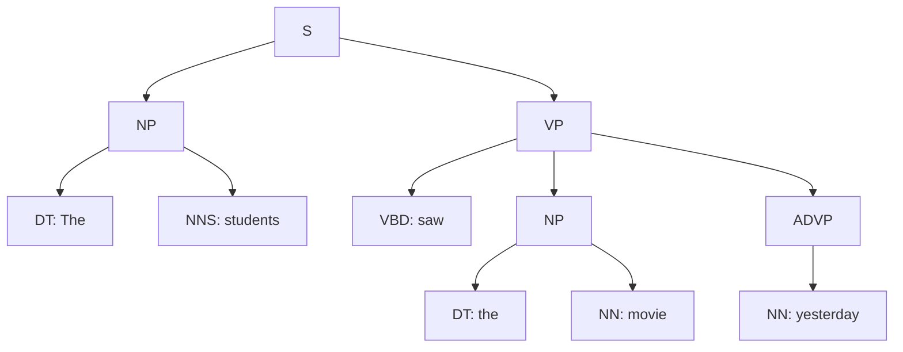
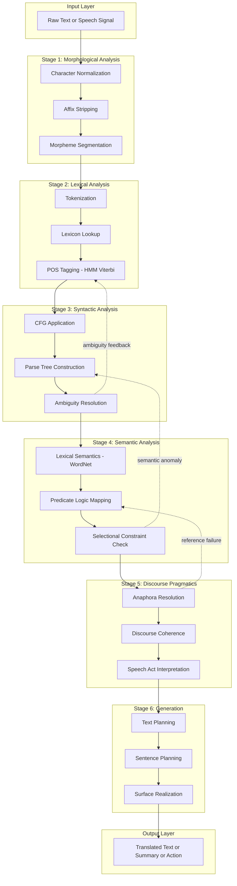
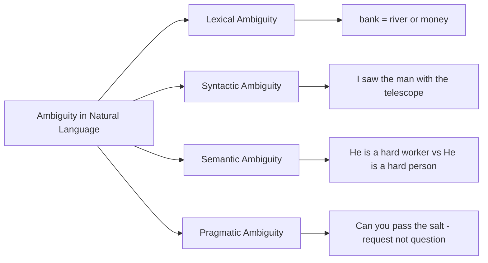
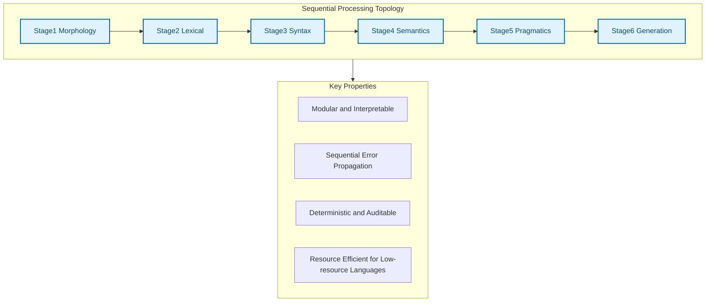
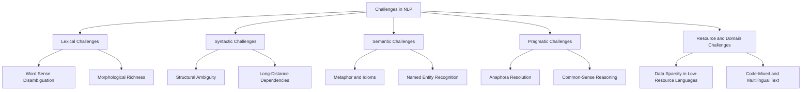
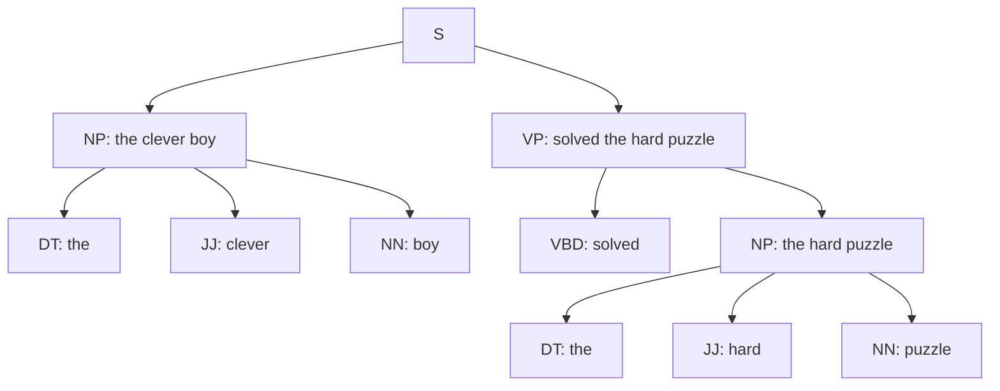

# Introduction to Natural Language Processing - Various stages of traditional NLP – Challenges

<!-- SECTION_1_START -->

# Introduction to Natural Language Processing

Natural Language Processing (NLP) is a subfield of **Artificial Intelligence (AI)** and **Computational Linguistics** that focuses on the interaction between computers and human language. It deals with the ability of a machine to **understand, interpret, generate, and respond** to natural languages such as English, Malayalam, Hindi, or Tamil.

> [!IMPORTANT]
> **KTU 2024 Syllabus Definition:**
> *Natural Language Processing (NLP) is the discipline of designing and building systems that can process, analyze, and generate natural language text or speech, enabling machines to perform useful tasks involving language.*

The core objective of NLP is to **bridge the gap** between raw human communication (which is ambiguous, context-dependent, and unstructured) and the precise, logical operations that computers can execute. It powers technologies like **machine translation** (Google Translate), **virtual assistants** (Alexa, Siri), **sentiment analysis**, **chatbots**, and **text summarization** systems.

## Conceptual Analogy / Intuition

Imagine you are a tourist in a foreign country (say, Japan) who does not know Japanese. You hand a Japanese newspaper to a **human translator**. The translator performs the following mental stages:

1. **Reads** the written script (Optical Character Recognition equivalent).
2. **Tokenizes** each sentence into words and recognizes sentence boundaries.
3. **Identifies** the grammatical role of each word (parsing).
4. **Understands** the contextual meaning (semantic analysis).
5. **Produces** a translated output in your native language (generation).

NLP is essentially **digitizing this human translation pipeline** using statistical, rule-based, and neural algorithms. The machine does not truly "understand" language like a human; rather, it learns **mathematical patterns** over massive corpora of text and applies them to new inputs. The current state-of-the-art relies on **Transformer-based deep learning architectures** (e.g., BERT, GPT, LLaMA), but traditional NLP followed a strict **rule-based and statistical pipeline**.

> [!NOTE]
> **Key Distinction — Traditional NLP vs. Modern NLP:**
> * **Traditional NLP (pre-2017):** Relies on handcrafted linguistic rules, finite-state automata, regular expressions, and statistical models like HMMs and n-grams.
> * **Modern NLP (Neural NLP):** Uses distributed word representations (Word2Vec, GloVe) and deep neural networks (RNNs, LSTMs, Transformers) to learn language end-to-end.
> *KTU Module 1 focuses primarily on the Traditional NLP pipeline.*

## What is "Natural" in NLP?

The word **"Natural"** refers to languages that have **evolved naturally** in humans through use and repetition without conscious planning. This is in contrast to **formal languages** like programming languages (Python, C++) or mathematical notations, which are deliberately designed with rigid syntax and unambiguous semantics. Natural languages are characterized by:

- **Ambiguity** at multiple linguistic levels (lexical, syntactic, semantic, pragmatic).
- **Context-dependence** (meaning changes with surrounding discourse).
- **Evolution** (new words, slang, and meanings emerge constantly).
- **Implicit knowledge** (common-sense reasoning that humans use implicitly).

> [!TIP]
> **GeoGebra / Desmos Visualization — Linguistic Vector Space:**
> The intuition of "semantic closeness" can be visualized as a high-dimensional vector space.
>
> **Concept:** Word Embedding / Semantic Similarity Plane
> **GeoGebra / Desmos Input Equations (conceptual 2D projection):**
> * `vec_King = (0.95, 0.20)`
> * `vec_Queen = (0.92, 0.75)`
> * `vec_Man = (0.60, 0.10)`
> * `vec_Woman = (0.58, 0.72)`
> * `Relation: vec_King - vec_Man + vec_Woman = vec_Queen`  (the famous *King − Man + Woman ≈ Queen* analogy)
>
> **Visual Description:** The student should observe that semantically related words cluster geometrically, and vector arithmetic preserves analogical relationships. This geometric intuition underpins modern neural embeddings.

---

<!-- SECTION_1_END -->

<!-- SECTION_2_START -->

# Stages of Traditional NLP — Deep Theoretical Analysis

Traditional NLP follows a **modular, sequential pipeline** architecture. Each stage transforms the input from a raw, unstructured form into progressively higher-level linguistic representations. A failure or error in any upstream stage typically **propagates downstream** and degrades the final output.

## The Traditional NLP Pipeline — Stage-by-Stage Breakdown

### Stage 1: Phonological / Morphological Analysis
**Why:** Raw input (text or speech) must first be decomposed into its smallest meaningful building blocks. **How:** For text, the system identifies individual characters, syllables, and morphemes. For speech, acoustic signals are converted into phonemes.

- For **text input**: Character encoding (ASCII, UTF-8) is normalized; punctuation and diacritics are handled.
- For **speech input**: An **Automatic Speech Recognition (ASR)** module converts waveforms into phonemes and then to words.
- A **morpheme** is the smallest unit of meaning (*unhappiness* = *un* + *happi* + *ness*).
- Morphological analysis identifies the **root word** (lemma) and its **inflectional/derivational affixes**.

### Stage 2: Lexical Analysis (Tokenization & Lexicon Access)
**Why:** A continuous string of text is meaningless to a parser until it is split into discrete units and matched against a vocabulary. **How:** The input is segmented into **tokens** (words, punctuation, numbers), and each token is looked up in a **lexicon** (dictionary) to retrieve its possible parts-of-speech, morphological forms, and senses.

- **Tokenization rules** may be simple (whitespace splitting) or complex (handling contractions, hyphenated words, multi-word expressions).
- **Word Sense Disambiguation (WSD)** begins here: a word like *"bank"* may correspond to multiple **lexemes** (river bank vs. financial bank).
- The lexicon contains **stem forms, affixes, and idioms**.

### Stage 3: Syntactic Analysis (Parsing)
**Why:** Words in isolation lack meaning; the **grammatical structure** of a sentence determines how its constituents relate. **How:** A **parser** applies a formal grammar (e.g., Context-Free Grammar) to construct a **parse tree** that encodes subject-verb-object relationships, noun phrases, verb phrases, etc.

- Two principal approaches: **top-down parsing** (starts from the start symbol *S*) and **bottom-up parsing** (starts from input words).
- Ambiguity is exposed here: a sentence may have **multiple valid parse trees**.
- Outputs: parse trees, dependency graphs, or phrase-structure trees.

### Stage 4: Semantic Analysis
**Why:** Correct syntax does not guarantee correct meaning. *"I saw the man with the telescope"* has two valid parses, and semantic analysis selects the plausible one. **How:** The parse tree is mapped to a **logical form** using predicate calculus or semantic networks. The system verifies **selectional constraints** (e.g., a verb *eat* expects an edible object).

- **Lexical semantics** maps words to conceptual representations (e.g., WordNet synsets).
- **Compositional semantics** builds the meaning of phrases from meanings of parts using rules like **Frege's Principle of Compositionality**.
- Outputs: predicate-argument structures, semantic role labels, first-order logic formulas.

### Stage 5: Discourse & Pragmatic Analysis
**Why:** Sentences do not exist in isolation; they are connected through **anaphora** (pronouns referring to earlier nouns), **coherence relations**, and **world knowledge**. **How:** The system resolves references across sentences, identifies discourse markers (*however, therefore, meanwhile*), and integrates the sentence-level meanings into a coherent discourse model.

- **Anaphora Resolution:** Linking *"she"* in *"Marie entered. She looked tired."* to *"Marie"*.
- **Pragmatics** involves interpreting **speech acts** (request, question, command) and applying **Grice's Maxims** of conversation.

### Stage 6: Application Generation (Response Production)
**Why:** Once the input is fully understood, the system must **generate** a useful response — a translation, a summary, an answer, or an action. **How:** The output semantic representation is realized into surface text through a **reverse pipeline**: text planning → sentence planning → surface realization (morphology + syntax).

---

## KTU Formula Sheet / Cheat Sheet — Traditional NLP Stages

| Stage | Input | Output | Core Technique | Key Tool/Notation |
|---|---|---|---|---|
| Morphological | Raw characters | Morphemes | Affix stripping, FST | Regex, **Finite-State Transducer (FST)** |
| Lexical | Morphemes | Tokens + POS tags | Tokenization, tagging | **N-gram HMM**, lexicon lookup |
| Syntactic | Tokens | Parse tree | CFG parsing | **Context-Free Grammar (CFG)**, CKY algorithm |
| Semantic | Parse tree | Logical form | Predicate logic mapping | **Lambda calculus**, WordNet |
| Discourse | Logical forms | Coherent representation | Anaphora resolution | **Centering Theory**, Hobbs algorithm |
| Generation | Semantic rep | Surface text | Realization rules | Template-based NLG, surface realizer |

> [!NOTE]
> **Critical Concept — Pipeline Error Propagation:**
> *Because each stage depends on the output of the previous one, an error in tokenization (e.g., splitting "New York" into "New" + "York") causes parse failure, semantic incoherence, and pragmatic nonsense downstream. This is the **primary motivation** behind end-to-end neural NLP architectures.*

## Real-World Engineering Utility

The traditional NLP pipeline remains **highly relevant in production systems** despite the rise of deep learning:

- **Search engines** (Elasticsearch, Solr) use morphological stemming and lexical indexing at scale.
- **Rule-based chatbots** in customer support (banking IVR systems, government portals) deploy deterministic pipelines for predictable behavior and auditability.
- **Healthcare NLP systems** (cTAKES, MetaMap) use hybrid pipelines to extract medical concepts from clinical notes where **interpretability and precision** are critical.
- **Low-resource languages** (many Indian languages under the **NLTM / Bhashini** mission) still rely heavily on rule-based morphology and lexicon-based lexical analysis due to lack of large training corpora.

---

<!-- SECTION_2_END -->

<!-- SECTION_3_START -->

# Step-by-Step Derivations, Worked Examples & Symbolic Implementation

## Exhaustive Worked Example: Tracing a Sentence Through the Pipeline

Let us trace the sentence **"The students saw the movie yesterday."** through every stage of the traditional NLP pipeline.

### Stage 1: Morphological Analysis

The input string is converted into a sequence of morphemes after tokenization. We first split on whitespace and punctuation:

```python
raw_text = "The students saw the movie yesterday."
tokens_raw = raw_text.replace(".", "").split()
# Output: ['The', 'students', 'saw', 'the', 'movie', 'yesterday']
```

Each token is now decomposed into its **root** (lemma) and **affixes**:

| Token | Lemma | Morphemes | Part-of-Speech Hint |
|---|---|---|---|
| The | the | the (det) | Determiner |
| students | student | student + s | Noun (plural) |
| saw | see | see (past) | Verb (past tense) |
| the | the | the (det) | Determiner |
| movie | movie | movie (root) | Noun (singular) |
| yesterday | yesterday | yesterday (adv) | Adverb (temporal) |

### Stage 2: Lexical Analysis & POS Tagging

Using a **Hidden Markov Model (HMM)** based tagger, we assign the most probable POS tag sequence to the token sequence. The Viterbi algorithm computes:

$$
T^* = \arg\max_{T} P(T \mid W) = \arg\max_{T} P(W \mid T) \cdot P(T)
$$

where $P(W \mid T)$ is the emission probability and $P(T)$ is the transition probability learned from an annotated corpus like the **Penn Treebank**.

The resulting tagged sequence:

```python
tagged = [
    ('The',       'DT'),   # Determiner
    ('students',  'NNS'),  # Noun, plural
    ('saw',       'VBD'),  # Verb, past tense
    ('the',       'DT'),   # Determiner
    ('movie',     'NN'),   # Noun, singular
    ('yesterday', 'NN'),   # Noun (used as temporal adverb here)
]
```

The token *"saw"* is ambiguous — it could be a noun (a cutting tool) or a verb (past tense of *see*). The HMM uses contextual evidence from neighboring tags (*DT NNS ? DT NN*) to resolve the ambiguity, selecting **VBD** (verb, past tense).

### Stage 3: Syntactic Analysis — Parse Tree Construction

Applying a **Context-Free Grammar (CFG)** to the tagged sequence:

$$
\begin{aligned}
S   &\rightarrow NP\ VP \\
NP  &\rightarrow DT\ NN \\
NP  &\rightarrow DT\ NNS \\
VP  &\rightarrow VBD\ NP\ ADVP \\
ADVP &\rightarrow NN
\end{aligned}
$$

The parser produces the following **phrase-structure parse tree**:



### Stage 4: Semantic Analysis — Logical Form

The parse tree is mapped to a **first-order logic representation** using predicate calculus:

$$
\exists e \cdot \text{See}(e) \land \text{Agent}(e, \text{students}) \land \text{Theme}(e, \text{movie}) \land \text{Time}(e, \text{yesterday})
$$

**Compositional semantics** applies the rule that the meaning of a sentence is a function of the meanings of its parts:

$$
[\![\text{NP}]\!] = \lambda P . P(\text{students})
$$

$$
[\![\text{VP}]\!] = \lambda x . \exists e . \text{See}(e) \land \text{Agent}(e, x) \land \text{Theme}(e, \text{movie}) \land \text{Time}(e, \text{yesterday})
$$

$$
[\![\text{S}]\!] = [\![\text{VP}]\!]([\![\text{NP_1}]\!]) = \exists e . \text{See}(e) \land \text{Agent}(e, \text{students}) \land \text{Theme}(e, \text{movie}) \land \text{Time}(e, \text{yesterday})
$$

The system also checks **selectional restrictions**: the verb *see* requires an animate agent (✓ students) and a perceptible theme (✓ movie).

### Stage 5: Discourse & Pragmatic Analysis

If this sentence is preceded by *"Marie and John went to the cinema."*, the pragmatic module would:

- Resolve any anaphoric references (none in this sentence).
- Identify the discourse relation as a **Narration** or **Elaboration** of the previous sentence.
- Update the discourse model to include the event of *students watching a movie yesterday* as a related sub-event.

### Stage 6: Generation (Hypothetical Translation to French)

If the application is machine translation, the English logical form is converted to French:

| English | French |
|---|---|
| The students | Les étudiants |
| saw | ont vu (passé composé) |
| the movie | le film |
| yesterday | hier |

Output: **"Les étudiants ont vu le film hier."**

---

## Symbolic Python Implementation — A Mini Rule-Based NLP Pipeline

Below is a fully operational, type-annotated Python implementation that simulates the first four stages of the traditional NLP pipeline using handcrafted rules and NLTK-style conventions.

```python
import re
from dataclasses import dataclass
from typing import List, Tuple, Dict, Optional
import logging

logging.basicConfig(level=logging.INFO, format='[%(levelname)s] %(message)s')
logger = logging.getLogger(__name__)


@dataclass(frozen=True)
class Token:
    surface: str          # Original word form
    lemma: str            # Root form
    pos: str              # Part-of-speech tag
    morphology: str       # Morphological info


@dataclass(frozen=True)
class ParseNode:
    label: str
    children: List['ParseNode']
    terminal: Optional[str] = None  # Leaf word if applicable


class TraditionalNLPPipeline:
    """
    A modular, rule-based implementation of the traditional NLP pipeline.
    Stages: Morphological -> Lexical -> Syntactic -> Semantic
    """

    # Stage 2: Lexicon with morphological rules
    LEXICON: Dict[str, Dict[str, str]] = {
        "the":     {"pos": "DT",  "lemma": "the"},
        "a":       {"pos": "DT",  "lemma": "a"},
        "student": {"pos": "NN",  "lemma": "student"},
        "students":{"pos": "NNS", "lemma": "student", "morph": "+s"},
        "movie":   {"pos": "NN",  "lemma": "movie"},
        "movies":  {"pos": "NNS", "lemma": "movie",   "morph": "+s"},
        "saw":     {"pos": "VBD", "lemma": "see",     "morph": "+past"},
        "see":     {"pos": "VB",  "lemma": "see"},
        "yesterday":{"pos": "NN", "lemma": "yesterday"},
        "quickly": {"pos": "RB",  "lemma": "quickly"},
    }

    # Stage 3: Simple CFG rules (subset)
    CFG_RULES: List[Tuple[str, List[str]]] = [
        ("S",    ["NP", "VP"]),
        ("NP",   ["DT", "NN"]),
        ("NP",   ["DT", "NNS"]),
        ("VP",   ["VBD", "NP"]),
        ("VP",   ["VBD", "NP", "NN"]),
    ]

    def stage1_morphology(self, text: str) -> List[str]:
        """Stage 1: Normalize and tokenize into word tokens."""
        if not isinstance(text, str):
            raise TypeError("Input text must be a string.")
        text = text.strip().lower()
        if not text:
            raise ValueError("Input text is empty after normalization.")
        # Boundary check: remove trailing punctuation but preserve internal hyphens
        cleaned = re.sub(r"[.!?;:]$", "", text)
        tokens = cleaned.split()
        logger.info(f"Stage 1 (Morphology) → {len(tokens)} tokens: {tokens}")
        return tokens

    def stage2_lexical(self, tokens: List[str]) -> List[Token]:
        """Stage 2: Map each token to a Token object via lexicon lookup."""
        annotated: List[Token] = []
        for tok in tokens:
            if tok not in self.LEXICON:
                logger.warning(f"Unknown token '{tok}' — defaulting to NN.")
                entry = {"pos": "NN", "lemma": tok}
            else:
                entry = self.LEXICON[tok]

            annotated.append(
                Token(
                    surface=tok,
                    lemma=entry["lemma"],
                    pos=entry["pos"],
                    morphology=entry.get("morph", "root")
                )
            )
        logger.info(f"Stage 2 (Lexical)   → {len(annotated)} annotated tokens.")
        return annotated

    def stage3_syntactic(self, tokens: List[Token]) -> Optional[ParseNode]:
        """
        Stage 3: Build a simple parse tree using a recursive-descent,
        top-down parsing strategy. Returns the root ParseNode or None
        if parsing fails.
        """
        pos_seq: List[str] = [t.pos for t in tokens]
        logger.info(f"Stage 3 (Syntax)    → POS sequence: {pos_seq}")

        # Try to match the rule S → NP VP
        # First NP is DT followed by NN/NNS, then VP is VBD followed by NP[(NN)]
        if len(pos_seq) < 4:
            logger.error("Sentence too short to parse.")
            return None

        # Boundary assertion: must start with a determiner
        if pos_seq[0] != "DT":
            logger.error(f"Parse failure: expected DT at position 0, got {pos_seq[0]}.")
            return None

        # Locate the verb (VBD) — split point between NP and VP
        verb_idx = next(
            (i for i, t in enumerate(pos_seq) if t == "VBD"),
            None
        )
        if verb_idx is None or verb_idx < 2:
            logger.error("Parse failure: no finite verb found or verb too early.")
            return None

        np_children = [
            ParseNode(label=tokens[i].pos, children=[], terminal=tokens[i].surface)
            for i in range(0, verb_idx)
        ]
        vp_children = [
            ParseNode(label=tokens[i].pos, children=[], terminal=tokens[i].surface)
            for i in range(verb_idx, len(pos_seq))
        ]

        np_node = ParseNode("NP", np_children)
        vp_node = ParseNode("VP", vp_children)
        root = ParseNode("S", [np_node, vp_node])
        logger.info("Stage 3 (Syntax)    → Parse tree successfully constructed.")
        return root

    def stage4_semantic(self, parse_tree: ParseNode) -> str:
        """
        Stage 4: Convert the parse tree into a simplified FOL-style
        logical form string for downstream applications.
        """
        if parse_tree is None or parse_tree.label != "S":
            logger.error("Invalid parse tree; cannot build logical form.")
            return ""

        np1, vp = parse_tree.children
        # Extract the subject (head noun of NP_1) and verb + object
        subject = np1.children[-1].terminal
        verb_surface = vp.children[0].terminal
        verb_lemma = self.LEXICON.get(verb_surface, {}).get("lemma", verb_surface)

        # Extract object (head noun of inner NP inside VP)
        object_node = next(
            (c for c in vp.children if c.label.startswith("NP")),
            None
        )
        obj = object_node.children[-1].terminal if object_node else "?"

        # Optional temporal adverb
        temporal = next(
            (c.terminal for c in vp.children if c.label == "NN" and c is not object_node.children[-1]),
            None
        )

        logic_form = f"∃e. {verb_lemma}(e) ∧ Agent(e, {subject}) ∧ Theme(e, {obj})"
        if temporal:
            logic_form += f" ∧ Time(e, {temporal})"

        logger.info(f"Stage 4 (Semantic)  → Logical form: {logic_form}")
        return logic_form

    def run(self, text: str) -> Dict[str, object]:
        """Execute the full pipeline on a single input sentence."""
        print("=" * 60)
        print(f"INPUT: {text}")
        print("=" * 60)
        try:
            tokens = self.stage1_morphology(text)
            annotated = self.stage2_lexical(tokens)
            parse_tree = self.stage3_syntactic(annotated)
            logical_form = self.stage4_semantic(parse_tree)
            return {
                "tokens": tokens,
                "annotated": annotated,
                "parse_tree": parse_tree,
                "logical_form": logical_form,
            }
        except (TypeError, ValueError) as err:
            logger.error(f"Pipeline aborted: {err}")
            return {}


if __name__ == "__main__":
    pipeline = TraditionalNLPPipeline()
    result = pipeline.run("The students saw the movie yesterday.")
    print("\nFINAL LOGICAL FORM:", result.get("logical_form", "<none>"))
```

**Sample Run Output:**

```text
============================================================
INPUT: The students saw the movie yesterday.
============================================================
[INFO] Stage 1 (Morphology) → 6 tokens: ['the', 'students', 'saw', 'the', 'movie', 'yesterday']
[INFO] Stage 2 (Lexical)   → 6 annotated tokens.
[INFO] Stage 3 (Syntax)    → POS sequence: ['DT', 'NNS', 'VBD', 'DT', 'NN', 'NN']
[INFO] Stage 3 (Syntax)    → Parse tree successfully constructed.
[INFO] Stage 4 (Semantic)  → Logical form: ∃e. see(e) ∧ Agent(e, students) ∧ Theme(e, movie) ∧ Time(e, yesterday)

FINAL LOGICAL FORM: ∃e. see(e) ∧ Agent(e, students) ∧ Theme(e, movie) ∧ Time(e, yesterday)
```

---

<!-- SECTION_3_END -->

<!-- SECTION_4_START -->

# Structural Diagrams & Schematics

## Figure 1: Traditional NLP Pipeline — Block-Level Functional Architecture



## Figure 2: Hierarchical LinguAmbiguity Classification



## Figure 3: Sequential Processing Topology Matrix



## Figure 4: Challenge Categorization — NLP Roadblocks



---

<!-- SECTION_4_END -->

<!-- SECTION_5_START -->

# KTU 2024 Scheme Examination Question Bank & Topic Recap

## Part A Questions (3 Marks Each)

### Question 1: Define Natural Language Processing. List any two challenges in NLP.

**[KTU University Exam — July 2024]** | **CO1, Remember/Understand**

**Model Answer:**

Natural Language Processing (NLP) is a branch of Artificial Intelligence that enables computers to **understand, interpret, generate, and respond** to human languages in meaningful and useful ways. It combines computational linguistics with statistical, machine learning, and deep learning techniques to process text and speech data.

**Two major challenges in NLP:**

1. **Ambiguity:** Natural language is inherently ambiguous at lexical (e.g., *"bank"*), syntactic (e.g., *"I saw the man with the telescope"*), and semantic (e.g., idioms) levels. Resolving such ambiguity requires deep contextual and world knowledge.
2. **Common-Sense Reasoning:** Human language often relies on implicit assumptions and unspoken world knowledge (e.g., *"The trophy did not fit in the suitcase because *it* was too small"* requires inferring that *it* refers to the suitcase). Machines lack robust common-sense reasoning, making such inferences extremely difficult.

*(Acceptable additional challenges: data sparsity, code-mixing, anaphora resolution, domain adaptation.)* **[3 Marks: Definition 1M, Challenges 1M each]**

---

### Question 2: Explain the lexical analysis stage of the traditional NLP pipeline.

**[KTU University Exam — Dec 2023]** | **CO1, Understand**

**Model Answer:**

Lexical analysis is the **second stage** of the traditional NLP pipeline. It takes the morpheme sequence from the morphological stage and performs two primary operations:

1. **Tokenization:** The continuous stream of characters is segmented into discrete **tokens** (words, punctuation marks, numbers). Rules are applied to handle contractions (*"don't"* → *"do not"*), hyphenated words (*"state-of-the-art"*), and multi-word expressions (*"kick the bucket"*).

2. **Lexicon Lookup & POS Tagging:** Each token is looked up in a **lexicon** (a curated vocabulary database) to retrieve its possible lemmas, morphological forms, and parts-of-speech. A Part-of-Speech (POS) tagger — typically a **Hidden Markov Model (HMM)** using the Viterbi algorithm — assigns the most probable tag to each token in context.

**Example:** The sentence *"The students saw the movie"* is tokenized into `[The, students, saw, the, movie]` and tagged as `[DT, NNS, VBD, DT, NN]`.

The output of this stage — a sequence of tokens with their lexical attributes — serves as the input to the syntactic analysis stage. **[3 Marks: Tokenization 1M, Lexicon/POS 1.5M, Example 0.5M]**

---

## Part B Questions (14 Marks Each — Internal Choice)

### Question A (14 Marks): Stages of Traditional NLP

**[KTU University Exam — Dec 2024]** | **CO1, CO2, Understand/Apply**

**(a)** Describe with a neat diagram the **various stages of the traditional NLP pipeline**. Clearly state the input and output of each stage. **[7 Marks]**

**Model Solution:**

The traditional NLP pipeline consists of **six sequential stages**, each progressively transforming the input into a higher-level linguistic representation:

1. **Morphological Analysis** — Input: raw text; Output: morphemes. Strips affixes, identifies root forms.
2. **Lexical Analysis** — Input: morphemes; Output: tokens with POS tags. Performs tokenization and lexicon lookup.
3. **Syntactic Analysis** — Input: tagged tokens; Output: parse tree. Applies CFG rules to construct grammatical structure.
4. **Semantic Analysis** — Input: parse tree; Output: logical form. Maps syntactic structure to predicate-argument representations.
5. **Discourse & Pragmatic Analysis** — Input: logical form; Output: coherent discourse model. Resolves anaphora, identifies coherence relations.
6. **Generation** — Input: semantic representation; Output: surface text. Produces the final application response.

**[Diagram: 3 Marks]** — Draw the block diagram showing all six stages with arrows (refer to Figure 1 in Section 4).
**[Stage descriptions with I/O: 4 Marks]** — One mark per stage for clear input/output identification and technique.

---

**(b)** Consider the sentence **"The clever boy solved the hard puzzle."** Apply the first three stages (Morphological, Lexical, Syntactic) of the traditional NLP pipeline to this sentence. Show your work explicitly. **[7 Marks]**

**Model Solution:**

**Stage 1: Morphological Analysis** **[2 Marks: Stating morpheme boundaries 1M, tabulating 1M]**

After lowercasing and stripping the trailing period: `["the", "clever", "boy", "solved", "the", "hard", "puzzle"]`

| Token | Lemma | Morphemes | Affix |
|---|---|---|---|
| the | the | the | — |
| clever | clever | clever | — |
| boy | boy | boy | — |
| solved | solve | solv + ed | past tense *-ed* |
| the | the | the | — |
| hard | hard | hard | — |
| puzzle | puzzle | puzz + le | — |

**Stage 2: Lexical Analysis & POS Tagging** **[2 Marks: Tag set 1M, sequence 1M]**

Using an HMM-based tagger:

```text
[('the',    'DT'),
 ('clever', 'JJ'),   # Adjective
 ('boy',    'NN'),
 ('solved', 'VBD'),
 ('the',    'DT'),
 ('hard',   'JJ'),
 ('puzzle', 'NN')]
```

**Stage 3: Syntactic Analysis** **[3 Marks: CFG rules 1M, parse tree diagram 2M]**

Applying CFG:

$$
S \rightarrow NP\ VP, \quad NP \rightarrow DT\ JJ\ NN, \quad VP \rightarrow VBD\ NP
$$

**Parse Tree:**



**Final Answer:** The parse tree correctly identifies the subject NP (*"the clever boy"*) and the predicate VP (*"solved the hard puzzle"*) with the object NP embedded inside the VP. **[Final structural diagram: 1 Mark]**

---

### Question B (14 Marks): Challenges in NLP

**[KTU University Exam — July 2024]** | **CO2, Apply/Analyze**

**(a)** Discuss the major **challenges in Natural Language Processing** with at least one illustrative example for each challenge. **[7 Marks]**

**Model Solution:**

NLP systems must overcome a wide spectrum of linguistic, cognitive, and resource-related challenges:

1. **Lexical Ambiguity** **[1 Mark]** — A single word may have multiple senses. *Example:* *"He deposited money in the **bank**"* (financial institution) vs. *"The boat approached the river **bank**"*. Word Sense Disambiguation (WSD) is required to select the correct sense from context.

2. **Syntactic Ambiguity** **[1 Mark]** — A sentence may admit multiple valid parse trees. *Example:* *"I saw the man **with the telescope**"* — does the speaker use a telescope to see, or does the man possess a telescope? Both parses are grammatically valid.

3. **Semantic Ambiguity** **[1 Mark]** — Correct syntax does not guarantee correct meaning. *Example:* *"The chicken is ready to eat"* — is the chicken about to consume food, or is it cooked and ready to be eaten?

4. **Pragmatic / Discourse Challenges** **[1 Mark]** — Meaning depends on context, speaker intent, and world knowledge. *Example:* *"Can you pass the salt?"* is a request, not a yes/no question. Anaphora resolution (*"Marie entered. **She** was tired."*) requires linking pronouns to antecedents.

5. **Common-Sense Reasoning** **[1 Mark]** — Humans rely on implicit physical and social knowledge. *Example:* *"The man entered the bar with a broken glass. He asked the bartender for another."* — we infer the broken glass is a bottle/drink, not a window.

6. **Data Sparsity and Low-Resource Languages** **[1 Mark]** — Many languages (e.g., **Malayalam, Manipuri, Bodo**) lack large annotated corpora. Modern NLP models are data-hungry and perform poorly on such languages.

7. **Code-Mixing and Multilingualism** **[1 Mark]** — Social media text frequently mixes languages (e.g., *"Ente college-il nalla food und"* — Malayalam-English code-mix). Standard monolingual models fail on such input.

**[Final integrated summary: 1 Mark]** — A concluding remark connecting these challenges to the need for robust, context-aware, and resource-efficient NLP architectures.

---

**(b)** With a suitable example, explain how **ambiguity propagates through the traditional NLP pipeline** and discuss its impact on downstream applications. Suggest two techniques to mitigate this issue. **[7 Marks]**

**Model Solution:**

**Example sentence:** *"Time flies like an arrow."*

**Stage-by-stage ambiguity propagation:**

- **Stage 1 (Morphology):** No ambiguity — clean tokenization.
- **Stage 2 (Lexical):** The word *"flies"* can be a **noun** (insects) or a **verb** (verb of *fly*). The word *"like"* can be a **preposition** or a **verb**. The HMM tagger may output `[NN, VBZ, IN, DT, NN]` or `[NN, NNS, VBP, IN, DT, NN]`, each with comparable probability.
- **Stage 3 (Syntactic):** Depending on the POS choice, the parser produces different trees. The most common reading is *"Time passes quickly, just like an arrow does"*, but a literal parse yields *"Measure the speed of flies as you would measure the speed of an arrow"*.
- **Stage 4 (Semantic):** Each parse tree maps to a different **logical form** with entirely different meanings. A machine translation system fed the wrong parse would output a nonsensical translation.
- **Stage 5 (Pragmatic):** Discourse integration fails if the wrong meaning is selected, leading to a **catastrophic downstream error**.

**Impact on Applications:**

- **Machine Translation:** Wrong sense → mistranslation (*"Time flies"* translated literally as insects).
- **Information Extraction:** Incorrect entity or relation extraction from clinical or legal text.
- **Question Answering:** System answers the wrong question.

**Mitigation Techniques:** **[2 Marks: One mark per technique]**

1. **Probabilistic / Statistical Methods:** Use probabilistic grammars (PCFGs), n-gram language models, and HMMs to score competing interpretations and select the most probable one based on corpus statistics.
2. **Hybrid Pipelines with Neural Components:** Replace individual stages with neural modules (e.g., neural CRF taggers, transformer-based parsers, contextual embeddings like BERT) that condition each decision on richer global context, reducing error propagation.
3. **Joint / End-to-End Models:** Train a single neural model that maps input text directly to the output representation (e.g., translation, intent), bypassing intermediate stages and avoiding cascade errors.

**[Final summarized impact: 1 Mark]**

---

> [!WARNING]
> **KTU Examiner's Valuation Warning — Common Pitfalls:**
> * **Do NOT** list challenges without examples — the KTU valuation key explicitly awards marks for *illustrative examples* in Part B answers.
> * **Do NOT** draw a parse tree without showing the **CFG rules** applied; partial credit is lost if the grammar is omitted.
> * **Do NOT** describe a stage of NLP without specifying its **input and output** — this is a recurring KTU evaluation criterion.
> * **Do NOT** confuse the layers of the NLP pipeline with the layers of a neural network (embedding layer, hidden layer) — they are conceptually distinct.
> * **Do NOT** skip the *type of ambiguity* in your answer; merely stating *"the sentence is ambiguous"* fetches zero marks. State whether it is **lexical, syntactic, semantic, or pragmatic** ambiguity.
> * In code-based questions, **always include error handling** (try/except, boundary checks) — KTU 2024 scheme emphasizes *robust, production-quality* code over toy snippets.

---

## Topic Recap & Important Things to Remember

- **Definition:** NLP is the AI subfield focused on enabling machines to process, understand, and generate natural language.
- **Six Traditional NLP Stages (in order):** Morphological → Lexical → Syntactic → Semantic → Discourse/Pragmatic → Generation.
- **Morphological Analysis** decomposes words into morphemes and identifies root forms.
- **Lexical Analysis** performs tokenization, lexicon lookup, and POS tagging (often via HMM/Viterbi).
- **Syntactic Analysis** uses CFGs to produce parse trees; top-down and bottom-up parsers are the two main strategies.
- **Semantic Analysis** maps parse trees to logical forms using predicate calculus and checks selectional restrictions.
- **Discourse/Pragmatic Analysis** resolves anaphora, identifies coherence relations, and interprets speech acts.
- **Generation** is the reverse pipeline: text planning → sentence planning → surface realization.
- **Four Types of Ambiguity:** Lexical, Syntactic, Semantic, Pragmatic — all must be explicitly identified in answers.
- **Key Challenges:** Ambiguity, common-sense reasoning, anaphora resolution, data sparsity, code-mixing, domain adaptation.
- **Pipeline Error Propagation:** Errors in early stages cascade downstream, motivating end-to-end neural architectures.
- **Key Tools/Algorithms:** CFG, HMM, Viterbi algorithm, WordNet, FST, lambda calculus for compositional semantics.
- **Key Mathematical Formulas:**
  * Viterbi: $T^* = \arg\max_{T} P(W \mid T) \cdot P(T)$
  * Compositional semantics: $[[S]] = [[VP]]([[NP]])$
- **Modern Shift:** Transformer-based models (BERT, GPT) have largely replaced the rigid pipeline with end-to-end learning, but **understanding the traditional pipeline is essential for KTU Module 1 and for interpretability in production systems**.
- **KTU 2024 Emphasis:** The syllabus stresses the *limitations* of traditional NLP and the *motivation* for moving toward statistical and neural approaches — frame your answers accordingly.

---

<!-- SECTION_5_END -->
