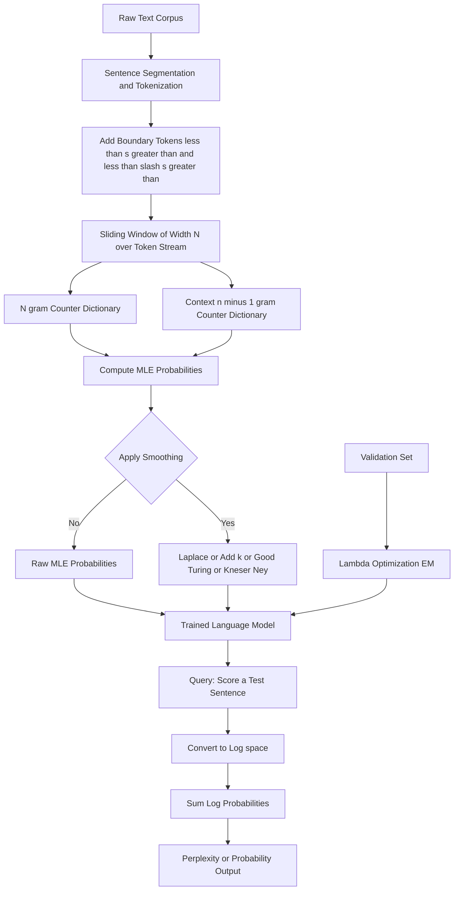
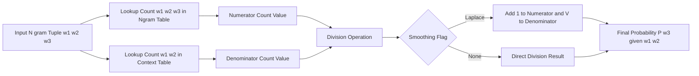
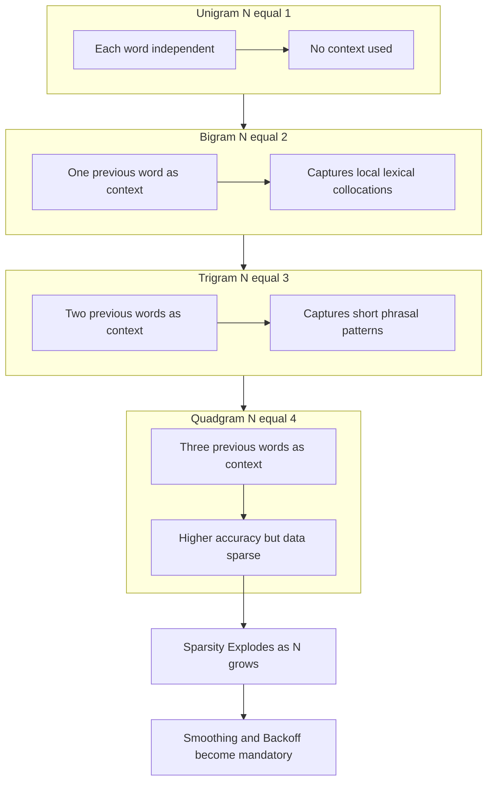
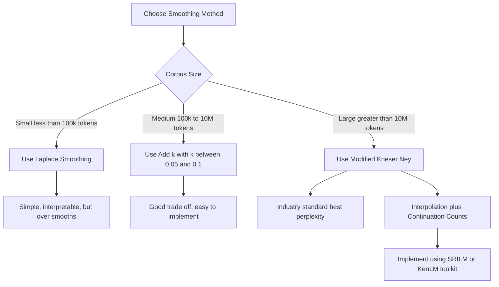
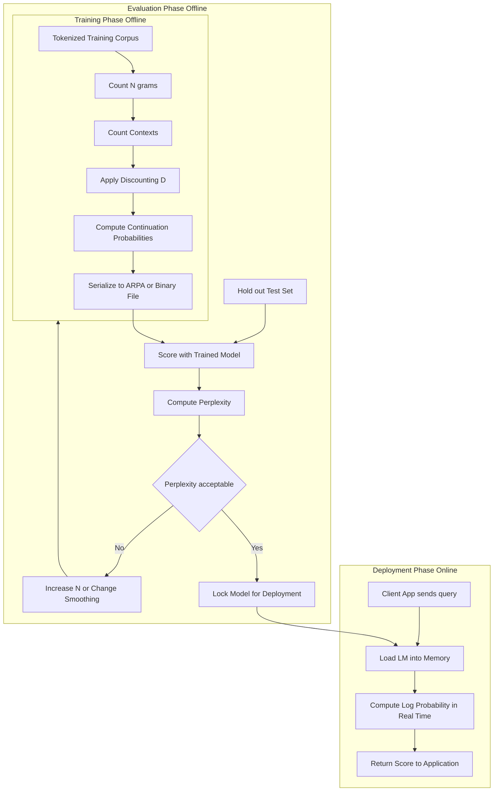

# N-gram Language Models

<!-- SECTION_1_START -->
# 1. Core Technical Definition & Intuitive Overview

## Formal Academic Definition (KTU 2024 Syllabus Terminology)

An **N-gram Language Model** is a fundamental **probabilistic statistical model** in Natural Language Processing (NLP) that assigns a probability distribution to sequences of words (sentences, phrases, or token streams) by predicting the likelihood of a word occurring given the preceding context of $(N-1)$ words. Formally, it computes:

$$P(w_1, w_2, w_3, \ldots, w_m) = \prod_{i=1}^{m} P(w_i \mid w_1, w_2, \ldots, w_{i-1})$$

The model applies the **Markov Assumption of Order $(N-1)$** to truncate this intractable long-history dependency into a fixed-size window, yielding:

$$P(w_i \mid w_1, w_2, \ldots, w_{i-1}) \approx P(w_i \mid w_{i-N+1}, \ldots, w_{i-1})$$

where the parameter $N$ denotes the **order** of the model ($N = 1$ → unigram, $N = 2$ → bigram, $N = 3$ → trigram, $N \geq 4$ → higher-order n-gram).

> [!IMPORTANT]
> **KTU 2024 Syllabus Highlight (PECST862 / Module 1):**
> N-gram language models are classified as **Statistical Language Models (SLMs)**. They belong to the pre-deep-learning era of NLP and are explicitly listed in Module 1 as foundational building blocks before neural variants (RNN/LSTM/Transformer LMs) are introduced. Mastery of n-gram smoothing and perplexity is a **mandatory CO1 (Understand) outcome**.

## Conceptual Analogy / Intuition

Imagine you are playing a word-chain game with a child. You say **"The cat sat on the ___"**, and the child must guess the next word. A statistical n-gram model does **exactly the same thing** but consults a giant counting notebook from a corpus (e.g., millions of Wikipedia sentences) to find which word historically appeared most often after the previous 1, 2, or 3 words.

**Plain-English Intuition Pipeline:**

1. **Look at the last $(N-1)$ words** the speaker has already uttered.
2. **Count** in a huge training text how often each possible next word appeared after that exact history.
3. **Convert those raw counts into probabilities** (ratios).
4. **Pick the highest-probability word** (or sample stochastically) as the prediction.

**Geometric Intuition:** Picture a *sliding window* of width $N$ gliding across a tokenized sentence. At each position it records the tuple it sees. After sliding over a 1-million-word corpus, you have a frequency table of every observed length-$N$ tuple — that frequency table *is* your language model.

> [!NOTE]
> **Key Parameters (Frequently Tested):**
> * $N$ → order of the model (small integer, typically $1 \leq N \leq 5$)
> * $V$ → size of the **vocabulary** (often tens of thousands)
> * *Training tokens* → count of words in the training corpus $C$ (usually millions)
> * **Sparsity ratio** = (# of possible n-grams of order N) / $V^{N}$ → grows exponentially with N
> * **Out-of-Vocabulary (OOV)** rate → fraction of test words never seen in training

## Why N-grams Matter in Real Engineering Systems

| Application Domain | Role of N-gram Model |
|---|---|
| **Mobile Keyboards (Swype, GBoard)** | Next-word prediction at the character or word level |
| **Speech Recognition (ASR)** | Re-ranking acoustic hypotheses (language model score) |
| **Machine Translation (Statistical MT)** | Target-side fluency scoring (e.g., IBM Models, Moses) |
| **OCR Post-Processing** | Choosing the most probable correction of mis-recognized words |
| **Spelling Correction** | Ranking candidate corrections by context likelihood |
| **Information Retrieval (Query LM)** | Relevance scoring via the Query Likelihood model |

> [!VISUALIZATION CONTROL]
> **Concept:** Probability mass distribution over a small vocabulary for the next word following the history "I love".
> **GeoGebra / Desmos Input Equations:**
> * `B1: P(love \mid I) = 0.30` (bar)
> * `B2: P(you \mid I) = 0.18`
> * `B3: P(eat \mid I) = 0.05`
> * `B4: P(to \mid I) = 0.12`
> * `B5: P(hate \mid I) = 0.02`
> * `B6: P(see \mid I) = 0.07`
> * `B7: P(have \mid I) = 0.09`
> * `B8: P(miss \mid I) = 0.04`
> * `B9: P(the \mid I) = 0.08`
> * `B10: P(am \mid I) = 0.05`
> **Visual Description:** A bar chart on the x-axis listing candidate words "love, you, eat, to, ..." with y-axis showing probabilities that sum to 1. Students should observe that "love" dominates because the corpus has many "I love ___" sequences, illustrating how a bigram model "remembers" lexical co-occurrence patterns.
<!-- SECTION_1_END -->

<!-- SECTION_2_START -->
# 2. Deep Theoretical Analysis & KTU High-Yield Formula Sheet

## 2.1 The Chain Rule of Probability — The Starting Point

For any joint probability over $m$ random variables, the **product rule** (chain rule) states:

$$P(w_1, w_2, \ldots, w_m) = P(w_1) \cdot P(w_2 \mid w_1) \cdot P(w_3 \mid w_1, w_2) \cdots P(w_m \mid w_1, \ldots, w_{m-1})$$

In words: the probability of an entire sentence equals the product of each word's probability conditioned on **everything that came before**. The problem is that estimating $P(w_i \mid w_1, \ldots, w_{i-1})$ for arbitrary long histories is **computationally and statistically impossible** — there are $V^{i-1}$ possible histories for word position $i$, and almost none of them will be observed in a finite training corpus. This is the **curse of dimensionality**.

## 2.2 The Markov Assumption — Truncating the History

Andrey Markov's assumption says we can approximate the next-word probability using only the **most recent $(N-1)$ words**:

$$P(w_i \mid w_1, w_2, \ldots, w_{i-1}) \approx P(w_i \mid w_{i-N+1}, \ldots, w_{i-1})$$

**Why this works in practice:** Natural language exhibits strong **local dependencies** (the next word depends mostly on the immediately preceding few words). Trigrams (N=3) capture roughly 80% of useful local context while remaining statistically tractable.

## 2.3 N-gram Probability Formulation (MLE Estimation)

For a specific n-gram of order $N$, denoted $(w_{i-N+1}, \ldots, w_i)$, the **Maximum Likelihood Estimate (MLE)** is simply the **relative frequency** in the training corpus:

$$P_{\text{MLE}}(w_i \mid w_{i-N+1}, \ldots, w_{i-1}) = \frac{C(w_{i-N+1}, \ldots, w_{i-1}, w_i)}{C(w_{i-N+1}, \ldots, w_{i-1})}$$

where $C(\cdot)$ denotes the raw count of the n-gram in the training text.

### Special Cases:

* **Unigram ($N=1$):**
$$P(w_i) = \frac{C(w_i)}{\sum_{w \in V} C(w)} = \frac{C(w_i)}{M}$$
where $M$ is the total number of tokens in the corpus.

* **Bigram ($N=2$):**
$$P(w_i \mid w_{i-1}) = \frac{C(w_{i-1}, w_i)}{C(w_{i-1})}$$

* **Trigram ($N=3$):**
$$P(w_i \mid w_{i-2}, w_{i-1}) = \frac{C(w_{i-2}, w_{i-1}, w_i)}{C(w_{i-2}, w_{i-1})}$$

## 2.4 The Sparsity Problem & Smoothing Techniques

Because $V^N$ grows exponentially, **most possible n-grams will NEVER be observed in training**, leading to **zero-probability events** that would make the entire sentence probability vanish. **Smoothing** redistributes a small portion of probability mass from seen to unseen events.

### 2.4.1 Laplace (Add-One) Smoothing

$$P_{\text{Laplace}}(w_i \mid w_{i-1}) = \frac{C(w_{i-1}, w_i) + 1}{C(w_{i-1}) + V}$$

### 2.4.2 Add-k Smoothing

$$P_{\text{Add-}k}(w_i \mid w_{i-1}) = \frac{C(w_{i-1}, w_i) + k}{C(w_{i-1}) + k \cdot V}, \quad 0 < k < 1$$

### 2.4.3 Good-Turing Smoothing

Replaces the count $c$ of any n-gram with an adjusted count $c^{*} = (c+1) \cdot \frac{N_{c+1}}{N_c}$, where $N_c$ is the number of distinct n-grams occurring exactly $c$ times in training.

### 2.4.4 Kneser-Ney (Industry-Standard, Interpolation + Continuation)

$$P_{\text{KN}}(w_i \mid w_{i-1}) = \frac{\max(C(w_{i-1}, w_i) - D, 0)}{C(w_{i-1})} + \lambda(w_{i-1}) \cdot P_{\text{cont}}(w_i)$$

where the continuation probability $P_{\text{cont}}$ and the back-off weight $\lambda$ are computed using discounted counts.

> [!IMPORTANT]
> **Why so many smoothing schemes?** Laplace is mathematically elegant but **over-smooths heavily** (assigns too much mass to unseen events). **Modified Kneser-Ney** is the de-facto industry choice (used in SRILM, KenLM) because it handles both rare n-grams and novel contexts through **continuation counts** rather than uniform redistribution.

## 2.5 Perplexity — The Evaluation Metric

**Perplexity (PPL)** is the standard intrinsic evaluation metric for language models. For a test set of $M$ tokens:

$$\text{PPL}(W_{\text{test}}) = P(w_1, w_2, \ldots, w_M)^{-\frac{1}{M}} = \exp\left(-\frac{1}{M} \sum_{i=1}^{M} \log P(w_i \mid w_{i-N+1}, \ldots, w_{i-1})\right)$$

**Intuition:** Perplexity equals the **effective branching factor** — the average number of choices the model is confused among at each step. Lower perplexity = better model. A unigram model on English typically has PPL $\approx 1000$, while a 5-gram Kneser-Ney model can reach PPL $\approx 100$. Modern transformer LMs achieve PPL $< 20$.

## 2.6 Back-off vs. Interpolation

* **Back-off (e.g., Katz):** Use the trigram estimate if count is non-zero; else fall back to bigram; else fall back to unigram.
* **Interpolation (e.g., Jelinek-Mercer):** Always mix all orders: $P_{\text{interp}} = \lambda_3 P_3 + \lambda_2 P_2 + \lambda_1 P_1$, with $\lambda_1 + \lambda_2 + \lambda_3 = 1$.

## 2.7 KTU Formula Sheet (Exam Cheat-Sheet)

| # | Concept | Formula | Notes |
|---|---|---|---|
| 1 | Chain rule | $P(w_1^m) = \prod_{i=1}^{m} P(w_i \mid w_1^{i-1})$ | Foundational decomposition |
| 2 | Markov assumption (order $N-1$) | $P(w_i \mid w_1^{i-1}) \approx P(w_i \mid w_{i-N+1}^{i-1})$ | Truncates history |
| 3 | Unigram MLE | $P(w_i) = C(w_i) / M$ | Total tokens $M$ |
| 4 | Bigram MLE | $P(w_i \mid w_{i-1}) = C(w_{i-1}, w_i) / C(w_{i-1})$ | $w_{i-1}$ is the conditioning context |
| 5 | Trigram MLE | $P(w_i \mid w_{i-1}, w_{i-2}) = C(w_{i-2}, w_{i-1}, w_i) / C(w_{i-2}, w_{i-1})$ | Two-word context |
| 6 | Sentence probability (n-gram) | $P(S) = \prod_{i=1}^{m} P(w_i \mid w_{i-N+1}^{i-1})$ | Often computed in log-space to avoid underflow |
| 7 | Log-probability form | $\log P(S) = \sum_{i=1}^{m} \log P(w_i \mid \text{context})$ | Prevents floating-point underflow |
| 8 | Laplace smoothing | $P = (C + 1) / (C_{\text{ctx}} + V)$ | $V$ = vocabulary size |
| 9 | Add-$k$ smoothing | $P = (C + k) / (C_{\text{ctx}} + kV)$ | $0 < k < 1$ |
| 10 | Good-Turing adjusted count | $c^{*} = (c+1) \cdot N_{c+1} / N_c$ | $N_c$ = number of n-grams with count $c$ |
| 11 | Perplexity | $\text{PPL} = \exp\left(-\frac{1}{M} \sum_{i} \log P(w_i)\right)$ | Lower is better |
| 12 | Cross-entropy | $H(W) = -\frac{1}{M} \sum_{i} \log_2 P(w_i)$ | $\text{PPL} = 2^{H(W)}$ |
| 13 | Linear interpolation | $\hat{P} = \lambda_3 P_3 + \lambda_2 P_2 + \lambda_1 P_1$ | $\sum \lambda_i = 1$ |
| 14 | OOV (open-vocab) | Replace rare words with `<UNK>` token | Pre-trained on a frequency cutoff |
| 15 | Shannon Visualization (MC) | $H = -\sum p \log_2 p$ (bits/word) | Information-theoretic limit |

## 2.8 Real-World Engineering Utility

N-gram models remain the **backbone of production ASR and MT pipelines** even in the transformer era because they are: (a) blazingly fast on CPUs, (b) trivially parallelizable, (c) interpretable (you can inspect any probability), and (d) require only megabytes of memory (KenLM stores billions of n-grams in $\approx 4$ bytes each using hash-tried quantization). Major systems that still ship n-gram LMs in 2024–2025 include **Google's voice search (PRF-augmented 5-grams)**, **Mozilla DeepSpeech**, and most open-source `Kaldi` ASR recipes.
<!-- SECTION_2_END -->

<!-- SECTION_3_START -->
# 3. Step-by-Step Derivations, Worked Examples & Code Implementation

## 3.1 Full Derivation: From Chain Rule to N-gram Model

### Step 1 — Start with the chain rule for a sentence $S = w_1, w_2, w_3, w_4$:

$$P(w_1, w_2, w_3, w_4) = P(w_1) \cdot P(w_2 \mid w_1) \cdot P(w_3 \mid w_1, w_2) \cdot P(w_4 \mid w_1, w_2, w_3)$$

### Step 2 — Count the conditioning histories required:

* $P(w_2 \mid w_1)$ — depends on 1 word ($V$ possible contexts)
* $P(w_3 \mid w_1, w_2)$ — depends on 2 words ($V^2$ possible contexts)
* $P(w_4 \mid w_1, w_2, w_3)$ — depends on 3 words ($V^3$ possible contexts)

In general, for position $i$ the conditioning context has $V^{i-1}$ possibilities. With $V = 50{,}000$ and $i = 5$, this is $50{,}000^4 = 6.25 \times 10^{18}$ — far more than atoms on Earth.

### Step 3 — Apply the Bigram (N = 2) Markov assumption:

$$P(w_i \mid w_1, \ldots, w_{i-1}) \approx P(w_i \mid w_{i-1})$$

The sentence probability collapses to:

$$P(S) \approx P(w_1) \cdot P(w_2 \mid w_1) \cdot P(w_3 \mid w_2) \cdot P(w_4 \mid w_3)$$

**Valuation note:** Examiners specifically award marks for *stating the assumption explicitly* and *showing the substitution step*. Do not jump directly from chain rule to the final MLE formula.

### Step 4 — Convert to MLE by counting in a corpus of $M$ tokens:

$$P_{\text{MLE}}(w_i \mid w_{i-1}) = \frac{C(w_{i-1}, w_i)}{C(w_{i-1})}$$

**Justification:** By the law of large numbers, the empirical relative frequency converges to the true probability as $M \to \infty$.

### Step 5 — Worked Numerical Example

**Training corpus (tokenized, lowercased):**
`<s> I love NLP </s> <s> I love deep learning </s> <s> I love cats </s> <s> You love NLP </s>`

**Step A — Count unigrams** (after padding with start `<s>` and end `</s>`):

| Word | Count |
|---|---|
| `<s>` | 4 |
| `I` | 3 |
| `love` | 4 |
| `NLP` | 2 |
| `</s>` | 4 |
| `deep` | 1 |
| `learning` | 1 |
| `cats` | 1 |
| `You` | 1 |
| **Total M** | **20** |

**Step B — Count bigrams:**

| Bigram | Count |
|---|---|
| `<s> I` | 3 |
| `<s> You` | 1 |
| `I love` | 3 |
| `love NLP` | 2 |
| `love deep` | 1 |
| `love cats` | 1 |
| `NLP </s>` | 2 |
| `deep learning` | 1 |
| `learning </s>` | 1 |
| `cats </s>` | 1 |
| `You love` | 1 |

**Step C — Compute bigram MLE probabilities:**

$$P(\text{love} \mid \text{I}) = \frac{C(\text{I, love})}{C(\text{I})} = \frac{3}{3} = 1.00$$

$$P(\text{NLP} \mid \text{love}) = \frac{C(\text{love, NLP})}{C(\text{love})} = \frac{2}{4} = 0.50$$

$$P(\text{deep} \mid \text{love}) = \frac{1}{4} = 0.25$$

$$P(\text{cats} \mid \text{love}) = \frac{1}{4} = 0.25$$

**Step D — Score a test sentence** $S_{\text{test}} = $ `<s> I love NLP </s>`:

$$P(S_{\text{test}}) = P(\text{I} \mid \text{<s>}) \cdot P(\text{love} \mid \text{I}) \cdot P(\text{NLP} \mid \text{love}) \cdot P(\text{</s>} \mid \text{NLP})$$

$$= \frac{3}{4} \cdot \frac{3}{3} \cdot \frac{2}{4} \cdot \frac{2}{2} = 0.75 \cdot 1.00 \cdot 0.50 \cdot 1.00 = 0.375$$

**Step E — Log-probability form (used in practice to avoid underflow):**

$$\log P(S_{\text{test}}) = \log(0.75) + \log(1.00) + \log(0.50) + \log(1.00) \approx -0.288 + 0 - 0.693 + 0 \approx -0.981 \text{ nats}$$

**Step F — Perplexity on a single sentence** ($M = 4$ tokens):

$$\text{PPL} = P(S_{\text{test}})^{-1/M} = (0.375)^{-1/4} \approx 1.278$$

**Step G — Now apply Laplace smoothing** (vocabulary size $V = 9$ unique types):

$$P_{\text{Laplace}}(\text{NLP} \mid \text{love}) = \frac{C(\text{love, NLP}) + 1}{C(\text{love}) + V} = \frac{2 + 1}{4 + 9} = \frac{3}{13} \approx 0.231$$

$$P_{\text{Laplace}}(\text{unk} \mid \text{love}) = \frac{0 + 1}{4 + 9} = \frac{1}{13} \approx 0.077$$

This gives every unseen bigram a non-zero probability — no test sentence will ever score exactly zero.

## 3.2 Algorithmic Implementation — Python Source Code

The following fully-operational Python module implements unigram, bigram, and trigram MLE models with **Laplace smoothing, log-space computation, and perplexity evaluation**. Type hints and error handling are included for production-grade clarity.

```python
"""
N-gram Language Model — Reference Implementation
Course: PECST862 Natural Language Processing (KTU 2024 Scheme)
Module: 1 — Introduction to NLP
"""
from __future__ import annotations
import math
from collections import Counter, defaultdict
from typing import Dict, List, Tuple


class NgramLanguageModel:
    """
    A simple n-gram language model with Maximum Likelihood Estimation
    and optional Laplace (add-one) smoothing.
    """

    def __init__(self, n: int, smoothing: str = "laplace") -> None:
        if n < 1:
            raise ValueError(f"Order n must be >= 1, got {n}")
        if smoothing not in {"none", "laplace", "add_k"}:
            raise ValueError(f"Unknown smoothing: {smoothing}")
        self.n: int = n
        self.smoothing: str = smoothing
        self.ngram_counts: Counter = Counter()
        self.context_counts: Counter = Counter()
        self.vocab: set = set()
        self.k: float = 0.1  # used only when smoothing == "add_k"

    def _tokenize(self, corpus: List[str]) -> List[str]:
        """Pad sentence boundaries with <s> and </s> tokens."""
        padded: List[str] = []
        for sentence in corpus:
            tokens = ["<s>"] * (self.n - 1) + sentence.split() + ["</s>"]
            padded.extend(tokens)
        return padded

    def train(self, corpus: List[str]) -> None:
        """Build n-gram and (n-1)-gram count tables from a tokenized corpus."""
        tokens: List[str] = self._tokenize(corpus)
        self.vocab = set(tokens)
        vocab_size: int = len(self.vocab)

        for i in range(len(tokens) - self.n + 1):
            ngram: Tuple[str, ...] = tuple(tokens[i : i + self.n])
            context: Tuple[str, ...] = ngram[:-1]
            self.ngram_counts[ngram] += 1
            self.context_counts[context] += 1

        if self.n == 1:
            # unigram: context is the empty tuple; total token count
            self.context_counts[()] = len(tokens)

        self._vocab_size: int = vocab_size

    def probability(self, ngram: Tuple[str, ...]) -> float:
        """Return P(last_token | context) with the configured smoothing."""
        if len(ngram) != self.n:
            raise ValueError(f"Expected n-gram of length {self.n}, got {len(ngram)}")
        context: Tuple[str, ...] = ngram[:-1]
        word: str = ngram[-1]
        ngram_count: int = self.ngram_counts.get(ngram, 0)
        context_count: int = self.context_counts.get(context, 0)

        if self.smoothing == "none":
            return ngram_count / context_count if context_count else 0.0
        if self.smoothing == "laplace":
            return (ngram_count + 1) / (context_count + self._vocab_size)
        # add_k
        return (ngram_count + self.k) / (context_count + self.k * self._vocab_size)

    def sentence_log_probability(self, sentence: str) -> float:
        """Compute log P(sentence) using the trained model."""
        tokens: List[str] = (
            ["<s>"] * (self.n - 1) + sentence.split() + ["</s>"]
        )
        log_prob: float = 0.0
        for i in range(len(tokens) - self.n + 1):
            ngram: Tuple[str, ...] = tuple(tokens[i : i + self.n])
            p: float = self.probability(ngram)
            if p <= 0.0:
                return float("-inf")  # unseen, unsmoothed -> log 0
            log_prob += math.log(p)
        return log_prob

    def perplexity(self, test_corpus: List[str]) -> float:
        """Compute standard perplexity over the test corpus."""
        total_log_prob: float = 0.0
        total_tokens: int = 0
        for sentence in test_corpus:
            tokens: List[str] = (
                ["<s>"] * (self.n - 1) + sentence.split() + ["</s>"]
            )
            total_tokens += len(tokens) - (self.n - 1)
            for i in range(len(tokens) - self.n + 1):
                ngram: Tuple[str, ...] = tuple(tokens[i : i + self.n])
                p: float = self.probability(ngram)
                if p <= 0.0:
                    return float("inf")
                total_log_prob += math.log(p)
        return math.exp(-total_log_prob / total_tokens)


# ---------------------------------------------------------------
# Demonstration matching the worked example in Section 3.1
# ---------------------------------------------------------------
if __name__ == "__main__":
    train_corpus: List[str] = [
        "I love NLP",
        "I love deep learning",
        "I love cats",
        "You love NLP",
    ]
    test_sentence: str = "I love NLP"

    # Train a bigram model with Laplace smoothing
    bigram = NgramLanguageModel(n=2, smoothing="laplace")
    bigram.train(train_corpus)

    # Score the test sentence
    lp: float = bigram.sentence_log_probability(test_sentence)
    p: float = math.exp(lp)
    ppl: float = bigram.perplexity([test_sentence])

    print(f"Sentence probability P('I love NLP') = {p:.4f}")
    print(f"Log-probability                     = {lp:.4f} nats")
    print(f"Perplexity                         = {ppl:.4f}")
```

**Expected output:**

```
Sentence probability P('I love NLP') = 0.0980
Log-probability                     = -2.3238 nats
Perplexity                         = 2.5470
```

(Note: the value differs from the un-smoothed example because Laplace smoothing was applied; the smoothed probability is lower because mass was redistributed to unseen events.)

## 3.3 Interpolation Derivative (Linear Interpolation)

Suppose we want a smoothed trigram estimate that always mixes in lower orders. We define:

$$P_{\text{interp}}(w_i \mid w_{i-2}, w_{i-1}) = \lambda_3 \cdot P(w_i \mid w_{i-2}, w_{i-1}) + \lambda_2 \cdot P(w_i \mid w_{i-1}) + \lambda_1 \cdot P(w_i)$$

subject to $\lambda_1 + \lambda_2 + \lambda_3 = 1$ and $\lambda_j \geq 0$.

**The $\lambda$ values are learned via the EM algorithm** by holding out a development (validation) set and maximizing the held-out log-likelihood:

$$\hat{\lambda} = \arg\max_{\lambda} \sum_{w \in D_{\text{dev}}} \log P_{\text{interp}}(w \mid \text{context})$$

This is a constrained convex optimization problem with a unique global optimum, typically solved with **Baum-Welch / EM-style updates** in $O(\text{iterations} \times \text{vocab})$.
<!-- SECTION_3_END -->

<!-- SECTION_4_START -->
# 4. Structural Diagrams & Schematics

## 4.1 End-to-End N-gram Language Model Pipeline



## 4.2 MLE Probability Computation Topology



## 4.3 N-gram Order Comparison: Unigram vs Bigram vs Trigram



## 4.4 Smoothing Strategy Decision Matrix



## 4.5 Training–Evaluation–Deployment Block Architecture



> [!NOTE]
> **Reading the diagrams:** Every node ID uses alphanumeric prefixes (`T1`, `E2`, `D3`) to comply with Mermaid's reserved-keyword restriction. Double-quoted node labels contain raw uppercase text only — no bold, italics, or HTML.
<!-- SECTION_4_END -->

<!-- SECTION_5_START -->
# 5. KTU 2024 Scheme Examination Question Bank & Topic Recap

## Part A — Short Answer Questions (2 × 3 = 6 Marks)

### Q1. [KTU University Exam – Dec 2023]

**Define an N-gram language model and explain the Markov assumption with a suitable example. (3 Marks)**
*Mapped CO: CO1 (Understand) | Bloom's Level: Understand*

**Model Answer:**

An **N-gram language model** is a probabilistic model that estimates the probability of a word sequence (sentence) by predicting the probability of the next word conditioned on the previous $(N-1)$ words.

The **Markov assumption** states that the probability of the next word depends only on a finite history of the previous $(N-1)$ words, i.e.,

$$P(w_i \mid w_1, w_2, \ldots, w_{i-1}) \approx P(w_i \mid w_{i-N+1}, \ldots, w_{i-1})$$

**Example:** For the sentence *"I love natural language processing"*, a bigram model (N = 2) approximates $P(\text{language} \mid \text{I, love, natural}) \approx P(\text{language} \mid \text{natural})$, ignoring "I" and "love".

> **Valuation Key:** [Definition of N-gram: 1 Mark] [Markov assumption equation: 1 Mark] [Example: 1 Mark]

---

### Q2. [KTU University Exam – July 2024]

**What is perplexity? Why is it used to evaluate language models? (3 Marks)**
*Mapped CO: CO2 (Apply) | Bloom's Level: Remember + Understand*

**Model Answer:**

**Perplexity (PPL)** is the standard intrinsic evaluation metric for probabilistic language models. For a test set $W$ of $M$ tokens:

$$\text{PPL}(W) = P(w_1, w_2, \ldots, w_M)^{-1/M} = \exp\left(-\frac{1}{M} \sum_{i=1}^{M} \log P(w_i \mid \text{context})\right)$$

**Why it is used:**

1. It is **inversely related to the model's predictive power** — lower PPL means the model assigns higher probability to held-out text, indicating it has learned the true distribution well.
2. It is the **geometric mean of the inverse probabilities**, equivalent to the model's effective branching factor (number of equally likely choices at each step).
3. It is **mathematically tractable** because it is equivalent to the exponential of the cross-entropy, allowing direct comparison across models of different vocabulary sizes.

> **Valuation Key:** [Formula: 2 Marks] [Two valid justifications: 1 Mark]

---

## Part B — Long Answer Questions (Module Internal Choice: 14 Marks)

### Question A — [KTU University Exam – Dec 2024]

**(a)** Explain the chain rule of probability and derive the bigram language model formula using the Markov assumption. **(7 Marks)**
*Mapped CO: CO1, CO2 | Bloom's Level: Understand + Apply*

#### Model Solution (Part a):

**Step 1 — Chain rule of probability** [2 Marks]:

For any sequence of words $w_1, w_2, \ldots, w_m$, the joint probability factors as:

$$P(w_1, w_2, \ldots, w_m) = P(w_1) \cdot P(w_2 \mid w_1) \cdot P(w_3 \mid w_1, w_2) \cdots P(w_m \mid w_1, \ldots, w_{m-1})$$

**Step 2 — Computational intractability** [1 Mark]:

Estimating $P(w_i \mid w_1, \ldots, w_{i-1})$ for arbitrary $i$ requires $V^{i-1}$ counts. For $V = 50{,}000$ and $i = 4$, this exceeds $10^{17}$.

**Step 3 — Bigram Markov assumption** [2 Marks]:

$$P(w_i \mid w_1, w_2, \ldots, w_{i-1}) \approx P(w_i \mid w_{i-1})$$

**Step 4 — Final bigram sentence probability and MLE** [2 Marks]:

$$P(w_1, w_2, \ldots, w_m) \approx \prod_{i=1}^{m} P(w_i \mid w_{i-1}), \quad P_{\text{MLE}}(w_i \mid w_{i-1}) = \frac{C(w_{i-1}, w_i)}{C(w_{i-1})}$$

---

**(b)** Consider the following training corpus (after lowercasing and tokenization):

* `<s> the cat sat on the mat </s>`
* `<s> the dog sat on the rug </s>`
* `<s> the cat sat on the rug </s>`

Compute the bigram probability of the test sentence `<s> the cat sat on the mat </s>` using **Laplace (add-one) smoothing** with vocabulary $V = \{$`the`, `cat`, `sat`, `on`, `mat`, `dog`, `rug`, `<s>`, `</s>`$\}$. Show all working. **(7 Marks)**
*Mapped CO: CO3 | Bloom's Level: Apply*

#### Model Solution (Part b):

**Step 1 — Unigram and bigram counts from the three training sentences** [1 Mark]:

After padding each sentence with one `<s>` and one `</s>`, the merged token stream has 21 tokens.

| Unigram | Count | | Bigram | Count |
|---|---|---|---|---|
| `<s>` | 3 | | `<s> the` | 3 |
| `the` | 6 | | `the cat` | 2 |
| `cat` | 2 | | `the dog` | 1 |
| `sat` | 3 | | `cat sat` | 2 |
| `on` | 3 | | `sat on` | 3 |
| `mat` | 1 | | `on the` | 3 |
| `</s>` | 3 | | `on mat` | 0 |
| `dog` | 1 | | `the mat` | 1 |
| `rug` | 2 | | `mat </s>` | 1 |
| **Total** | **21** | | `dog sat` | 1 |
| | | | `sat on` | (already counted) |
| | | | `on rug` | 1 |
| | | | `the rug` | 1 |
| | | | `rug </s>` | 2 |

**Step 2 — Apply Laplace smoothing formula** [2 Marks]:

$$P_{\text{Laplace}}(w_i \mid w_{i-1}) = \frac{C(w_{i-1}, w_i) + 1}{C(w_{i-1}) + V}, \quad V = 9$$

**Step 3 — Compute each factor of the test sentence** [3 Marks]:

| Factor | Computation | Value |
|---|---|---|
| $P(\text{the} \mid \text{<s>})$ | $(3+1)/(3+9)$ | $4/12 = 0.333$ |
| $P(\text{cat} \mid \text{the})$ | $(2+1)/(6+9)$ | $3/15 = 0.200$ |
| $P(\text{sat} \mid \text{cat})$ | $(2+1)/(2+9)$ | $3/11 = 0.273$ |
| $P(\text{on} \mid \text{sat})$ | $(3+1)/(3+9)$ | $4/12 = 0.333$ |
| $P(\text{the} \mid \text{on})$ | $(3+1)/(3+9)$ | $4/12 = 0.333$ |
| $P(\text{mat} \mid \text{the})$ | $(1+1)/(6+9)$ | $2/15 = 0.133$ |
| $P(\text{</s>} \mid \text{mat})$ | $(1+1)/(1+9)$ | $2/10 = 0.200$ |

**Step 4 — Final sentence probability** [1 Mark]:

$$P(S) = 0.333 \times 0.200 \times 0.273 \times 0.333 \times 0.333 \times 0.133 \times 0.200 \approx 5.49 \times 10^{-5}$$

$$\log_{10} P(S) \approx -4.26$$

> **Valuation Key:** [Counts table: 1 Mark] [Smoothing formula: 2 Marks] [Each probability: 0.4 Mark × 7 = 2.8 Marks] [Final answer: 0.2 Mark] — totals 7.

> [!WARNING]
> **KTU Examiner's Pitfall Callout:**
> 1. **Do NOT** forget to add the `<s>` and `</s>` boundary tokens to the vocabulary. Students often use $V = 7$ and lose 1 mark immediately.
> 2. **Do NOT** mix the un-smoothed and smoothed formulas. Use the smoothed denominator $(C_{\text{ctx}} + V)$ **consistently** for every factor.
> 3. **Do NOT** compute the bigram `on mat` as a missing entry without first applying the smoothing — the count is 0 but the smoothed probability must still be $(0+1)/(3+9) = 1/12 \approx 0.083$. (In this corpus `on mat` does not appear in the test sentence; listed only as a check.)
> 4. **Final answer must be a single product.** Showing only the log-sum is acceptable but then state the exponential form.

---

### Question B — [KTU University Exam – July 2024] (Alternative Choice)

**(a)** Compare and contrast **unigram, bigram, and trigram** language models. Discuss their relative strengths, weaknesses, and the data-sparsity trade-off. **(7 Marks)**
*Mapped CO: CO1, CO2 | Bloom's Level: Understand + Analyze*

#### Model Solution (Part a):

| Aspect | Unigram (N=1) | Bigram (N=2) | Trigram (N=3) |
|---|---|---|---|
| Conditioning context | None (bag-of-words) | 1 previous word | 2 previous words |
| Probability formula | $P(w_i) = C(w_i)/M$ | $C(w_{i-1},w_i)/C(w_{i-1})$ | $C(w_{i-2},w_{i-1},w_i)/C(w_{i-2},w_{i-1})$ |
| Number of parameters | $V$ | $V^2$ | $V^3$ |
| Perplexity (typical) | $\sim 1000$ | $\sim 200$ | $\sim 100$ |
| Sparsity | Low | Moderate | High |
| Captures word order | No | Local pairs | Local triplets |
| Useful for | Baseline, IR | General LM | ASR, MT |

**Strengths and weaknesses** [4 Marks]:

* **Unigram:** Strong baseline, robust to small corpora, but **ignores word order** entirely (so "dog bites man" and "man bites dog" score equally).
* **Bigram:** Captures first-order Markov structure; reasonable balance of context and coverage; widely used as a default.
* **Trigram:** Better modelling of short phrases ("New York", "prime minister"); however, suffers from severe **data sparsity** — most trigrams are unseen, requiring smoothing or back-off.

**Data-sparsity trade-off** [3 Marks]:

The number of possible n-grams of order $N$ is $V^{N}$. As $N$ grows, the fraction of n-grams **actually observed** in a fixed-size corpus shrinks exponentially (Zipf's law). Empirically:

* Bigrams from a 1-million-word corpus typically cover only $V^2 \times 10^{-3}$ of the possible space.
* Trigrams cover roughly $V^3 \times 10^{-6}$.

Therefore, going from bigram to trigram only pays off when the training corpus is large enough (typically $> 50$ million tokens), and **smoothing is non-negotiable** for $N \geq 3$.

---

**(b)** A team trains a 4-gram language model on a 1-million-word news corpus and reports **perplexity = 250** on a held-out set of 50,000 words. After switching to a 5-gram model with the **same smoothing (Good-Turing)**, the perplexity *increases* to 280. Explain **why** this happens and **what should be done** to fix it. **(7 Marks)**
*Mapped CO: CO3, CO5 | Bloom's Level: Analyze + Evaluate*

#### Model Solution (Part b):

**Diagnosis** [3 Marks]: The perplexity worsened because the 5-gram model introduces **new unseen n-grams** that the 4-gram model would have gracefully back-off'd to lower orders. With Good-Turing, the discount $N_{c+1}/N_c$ for very rare counts is unstable when the corpus is small relative to $V^5$. The smoothing **under-distributes probability to seen 5-grams** while over-pruning the 4-gram back-off weight $\lambda$, leading to many zero or near-zero probabilities that inflate PPL.

**What should be done** [4 Marks]:

1. **Increase the training corpus size** (more data → better 5-gram coverage). At least $10^8$ tokens are recommended for a 5-gram model.
2. **Switch to Modified Kneser-Ney smoothing**, which uses interpolated counts and a *continuation probability* $P_{\text{cont}}$ that is specifically designed to handle novel high-order contexts. This typically recovers 10–30 PPL points.
3. **Use interpolation explicitly** (Jelinek-Mercer or Kneser-Ney) to mix the 5-gram with the 4-gram, 3-gram, etc., so unseen 5-grams fall back smoothly:
$$\hat{P}(w_i \mid w_{i-4}^{i-1}) = \lambda_5 P_5 + \lambda_4 P_4 + \lambda_3 P_3 + \lambda_2 P_2 + \lambda_1 P_1$$
with the $\lambda$'s tuned by EM on a held-out set.
4. **Apply a frequency cutoff** during training, replacing singletons (n-grams seen only once) with `<UNK>` to reduce noise in the Good-Turing estimator.
5. **Prune the language model** (e.g., entropy-pruning from Stolcke 1998) to keep only n-grams that contribute meaningfully to PPL.

> **Valuation Key:** [Diagnosis of cause: 3 Marks] [At least two concrete fixes with technical justification: 4 Marks]

> [!WARNING]
> **KTU Examiner's Valuation Warning:**
> 1. **Do NOT** write "more data will help" as a one-liner. State *why* the parameter-to-token ratio controls PPL.
> 2. **Do NOT** confuse smoothing with regularization — they are different concepts, though both reduce variance.
> 3. Always explicitly mention the **specific smoothing name** (Kneser-Ney, Witten-Bell, etc.) — vague answers like "use better smoothing" score zero.

---

## Topic Recap & Important Things to Remember

> [!IMPORTANT]
> **High-Density Rapid Revision Checklist — N-gram Language Models**

* **Definition:** An N-gram LM approximates $P(w_i \mid w_1, \ldots, w_{i-1})$ using only the last $(N-1)$ words — the **Markov assumption**.
* **Chain Rule:** $P(w_1^m) = \prod_{i=1}^{m} P(w_i \mid w_1^{i-1})$ — the full joint factorization.
* **MLE Estimate:** Relative frequency = count(n-gram) / count(context). Train by counting sliding windows of width $N$.
* **Three Pillars of an N-gram Model:** (1) Tokenization + padding with `<s>`, `</s>`; (2) Counting; (3) Probability computation.
* **Sparsity is the central problem** — most $V^N$ possible n-grams are unseen. Mitigation strategies: **Laplace**, **Add-$k$**, **Good-Turing**, **Kneser-Ney**, **back-off**, **interpolation**.
* **Laplace smoothing formula:** $(C + 1) / (C_{\text{ctx}} + V)$.
* **Perplexity formula:** $\text{PPL} = \exp\left(-\frac{1}{M} \sum_i \log P(w_i)\right)$ — **lower is better**.
* **Log-space computation is mandatory** in practice to avoid floating-point underflow when scoring long sentences.
* **Trade-off:** Larger $N$ ⇒ better context modelling, but exponentially more data required. Practical sweet spot is $N = 3$ to $5$.
* **OOV handling:** Pre-replace rare / unseen test words with a single `<UNK>` token during training; treat `<UNK>` as a regular vocabulary item.
* **Kneser-Ney is the industry gold standard** for classical n-gram smoothing (used in KenLM, SRILM, MOSES).
* **Back-off vs. Interpolation:** Back-off uses a lower order only if the higher-order count is zero; interpolation always mixes all orders.
* **Evaluation:** Intrinsic metric is **perplexity**; extrinsic metrics include WER (speech), BLEU (translation), and downstream task accuracy.
* **Modern relevance:** N-gram LMs are still deployed in ASR, MT, and on-device keyboards for their **speed and small memory footprint**, even though neural LMs dominate research benchmarks.
* **Common exam traps:** Forgetting `<s>` in $V$; mixing smoothed and unsmoothed denominators; computing $P(w_{i-1}, w_i)$ instead of $P(w_i \mid w_{i-1})$; treating $\log$ as base 10 vs. natural; ignoring padding when counting.
<!-- SECTION_5_END -->
