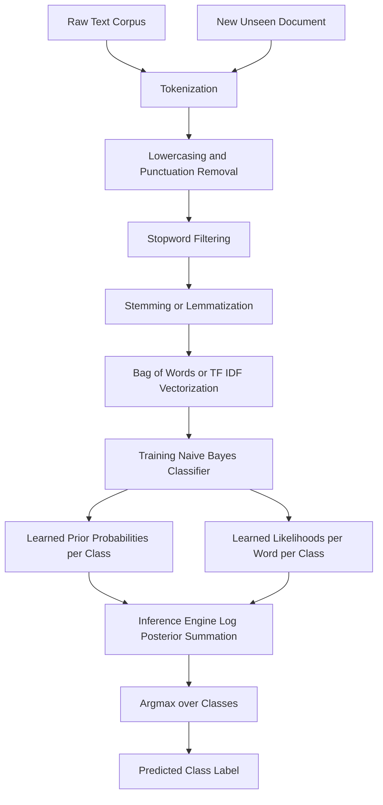
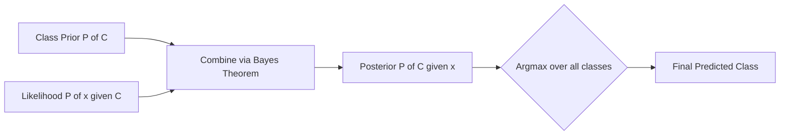
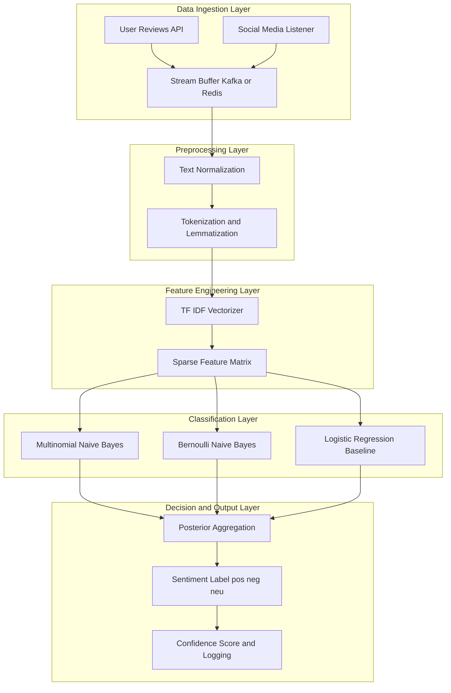

# Naive Bayes for Text Classification, and Sentiment Analysis

<!-- SECTION_1_START -->
# Naive Bayes for Text Classification & Sentiment Analysis

## 1.1 Formal Academic Definition

**Naive Bayes Classifier** is a probabilistic supervised machine learning algorithm based on applying **Bayes' Theorem** with a strong (naive) assumption of **conditional independence** between every pair of features given the value of the class variable. In the context of Natural Language Processing (NLP), it is one of the most classical, computationally efficient, and surprisingly high-performing baselines for **text categorization** tasks such as **spam detection**, **news article classification**, and **sentiment analysis** (determining whether a piece of text expresses a positive, negative, or neutral opinion).

Formally, given a document $D$ represented as a feature vector $\mathbf{x} = (x_1, x_2, \dots, x_n)$ containing $n$ words (or tokens), and a class label $y \in \{c_1, c_2, \dots, c_k\}$, Naive Bayes selects the class that has the highest **posterior probability**:

$$\hat{y} = \arg\max_{y \in \mathcal{Y}} P(y \mid \mathbf{x})$$

By Bayes' Theorem, this is rewritten as:

$$\hat{y} = \arg\max_{y} \frac{P(y) \cdot P(\mathbf{x} \mid y)}{P(\mathbf{x})}$$

Since $P(\mathbf{x})$ is constant across all classes, the decision rule reduces to:

$$\hat{y} = \arg\max_{y} P(y) \cdot P(\mathbf{x} \mid y)$$

The "naive" simplification assumes that each word's occurrence is statistically independent of every other word given the class, which is mathematically expressed as:

$$P(\mathbf{x} \mid y) = \prod_{i=1}^{n} P(x_i \mid y)$$

> [!IMPORTANT]
> **KTU 2024 Syllabus Highlight (Module 1):** Naive Bayes is a **mandatory** topic under *Introduction to NLP — Text Classification & Sentiment Analysis*. Students must understand the derivation, smoothing techniques, and the difference between **Multinomial**, **Bernoulli**, and **Multivariate Bernoulli** variants.

---

## 1.2 Conceptual Analogy — The "Spam Folder Brain"

Imagine you are a postal mailroom worker whose only job is to decide whether each incoming letter is **JUNK MAIL (spam)** or **PERSONAL MAIL (ham)**. You do not have time to read every word. Instead, you maintain a small mental "cheat sheet" built from the last 10,000 letters you sorted:

- **P(Junk)** — What fraction of all letters you received were junk? (This is the **prior probability**.)
- **P("free" $\mid$ Junk)** — How often did the word *"free"* appear in junk letters? (This is a **likelihood**.)

Now, a new letter arrives containing the words *"free offer click"*. Even though a human linguist knows these words are *related* (the phrase "free offer" usually co-occurs), the Naive Bayes "brain" treats each word as an **independent clue**:

$$\text{Score} = P(\text{Junk}) \cdot P(\text{"free"} \mid \text{Junk}) \cdot P(\text{"offer"} \mid \text{Junk}) \cdot P(\text{"click"} \mid \text{Junk})$$

Whichever class (Junk or Ham) yields the higher score wins. This is precisely how a Naive Bayes spam filter operates in services like Gmail and Outlook.

> [!NOTE]
> **The "Naive" Assumption in Plain English:** Words in real life are *not* independent (the word "rain" is more likely if "cloudy" appeared). But Naive Bayes pretends they are anyway, and—remarkably—this simplification often produces excellent classification accuracy, while making the model blazingly fast to train and easy to interpret.

---

## 1.3 Standard Metrics & Constants

- **Vocabulary size** $V$ — total number of unique words in the training corpus. Used heavily in smoothing.
- **Smoothing parameter** $\alpha$ — typically set to **1** (Laplace smoothing) or values between **0 and 1** (Lidstone smoothing).
- **Logarithmic base** — almost always **natural log ($\ln$)** or **log base 2**; using log prevents **underflow** when multiplying many tiny probabilities.
- **Prior probability** $P(y)$ — estimated as the relative frequency of class $y$ in the training set.

> [!VISUALIZATION CONTROL]
> **Concept:** Bayesian Posterior Surface Over Word Probabilities
> **Desmos / GeoGebra Input Equations:**
> * `P(x | spam) = 0.8^x * 0.2^(1-x)`
> * `P(x | ham) = 0.05^x * 0.95^(1-x)`
> * `P(spam) = 0.3`, `P(ham) = 0.7`
> * `Posterior_spam(x) = (0.3 * 0.8^x * 0.2^(1-x)) / ((0.3 * 0.8^x * 0.2^(1-x)) + (0.7 * 0.05^x * 0.95^(1-x)))`
> **Visual Description:** Plot `Posterior_spam(x)` for $x \in [0, 1]$. The student should observe the posterior probability of "spam" **rising sigmoidally** as $x$ (presence of suspicious word) moves from 0 to 1, illustrating how evidence updates the prior.

<!-- SECTION_1_END -->

<!-- SECTION_2_START -->
# Deep Theoretical Analysis & KTU High-Yield Formula Sheet

## 2.1 The Operational Pipeline of Naive Bayes Text Classification

The end-to-end flow consists of **five logical stages**. Each stage must be mastered for KTU 14-mark derivations.

1. **Tokenization & Preprocessing**
   - Convert raw text into a sequence of normalized tokens.
   - Steps: lowercasing $\rightarrow$ punctuation removal $\rightarrow$ stopword filtering $\rightarrow$ stemming/lemmatization.
2. **Feature Engineering (Vectorization)**
   - Convert each document into a fixed-length numeric vector. Common methods:
     - **Bag-of-Words (BoW)** — counts of each word.
     - **TF-IDF (Term Frequency–Inverse Document Frequency)** — weighs words by their discriminative power.
3. **Prior Probability Estimation**
   - For each class $c_j$, compute $P(c_j) = \frac{N_j}{N}$, where $N_j$ is the number of training documents in class $c_j$, and $N$ is the total number of training documents.
4. **Likelihood Estimation (with Smoothing)**
   - For each word $w_i$ and class $c_j$, compute the conditional probability with **Laplace (add-1) smoothing** to handle unseen words:
   
   $$P(w_i \mid c_j) = \frac{\text{count}(w_i, c_j) + \alpha}{\sum_{w \in V} \text{count}(w, c_j) + \alpha \cdot \vert V \vert}$$
   
5. **Posterior Maximization (MAP Decision)**
   - Classify the new document by selecting the class with the highest log-posterior:
   
   $$\hat{y} = \arg\max_{c_j} \left[ \log P(c_j) + \sum_{i=1}^{n} \log P(w_i \mid c_j) \right]$$

> [!NOTE]
> **Why logs?** If a document has 200 words and each word probability is, say, 0.001, then $\prod P(w_i \mid c) = (0.001)^{200}$, a value smaller than the IEEE 754 double-precision minimum ($\approx 10^{-308}$), causing **floating-point underflow**. By taking logarithms, the product becomes a tractable sum.

---

## 2.2 KTU Formula Sheet — High-Yield Cheat Sheet

| # | Concept | Mathematical Form | Engineering Use |
|---|---------|-------------------|-----------------|
| 1 | Bayes' Theorem | $P(y \mid \mathbf{x}) = \dfrac{P(y) \cdot P(\mathbf{x} \mid y)}{P(\mathbf{x})}$ | Foundation of probabilistic classifiers. |
| 2 | Naive Bayes Decision Rule | $\hat{y} = \arg\max_{y} P(y) \prod_{i=1}^{n} P(x_i \mid y)$ | Final classification rule. |
| 3 | Multinomial Likelihood (with smoothing) | $P(w_i \mid c_j) = \dfrac{\text{count}(w_i, c_j) + \alpha}{\sum_{w \in V} \text{count}(w, c_j) + \alpha \vert V \vert}$ | Used for **word-count** features. |
| 4 | Bernoulli Likelihood | $P(w_i \mid c_j) = \dfrac{\text{count}(w_i, c_j) + \alpha}{N_{c_j} + 2\alpha}$ | Used for **binary presence/absence** features. |
| 5 | Prior Probability | $P(c_j) = \dfrac{N_j}{N}$ | Class distribution estimate. |
| 6 | Log-Posterior for Numerical Stability | $\log P(c_j \mid \mathbf{x}) \propto \log P(c_j) + \sum_{i} \log P(x_i \mid c_j)$ | Avoids underflow in production. |
| 7 | Laplace Smoothing Constant | $\alpha = 1$ | Standard default to prevent zero probabilities. |
| 8 | Vocabulary Size | $\vert V \vert$ | Appears in denominator of smoothed likelihood. |
| 9 | TF-IDF Weight | $w_{t,d} = tf_{t,d} \cdot \log \dfrac{N}{df_t}$ | Replaces raw counts for better features. |
| 10 | Sentiment Polarity Score | $\text{pol}(d) = \sum_{w \in d} \text{lex}(w)$ | Lexicon-based alternative to NB. |

> [!IMPORTANT]
> In the table above, $\vert V \vert$ denotes the **absolute value / cardinality of the vocabulary set** (not the KTU prescribed escape `\vert V \vert` markdown form). When transcribing formulas in your exam, **always** use `\vert V \vert` to avoid breaking markdown table syntax.

---

## 2.3 Real-World Engineering Utility

Naive Bayes is not a historical curiosity; it remains a **workhorse in production NLP pipelines**:

- **Email Spam Filtering** — Gmail, Yahoo, and Outlook all use variants of NB (often combined with logistic regression in an ensemble).
- **Sentiment Analysis on Social Media** — Twitter (now X) used Naive Bayes-based classifiers in early moderation systems to flag toxic or negative content in real-time.
- **News Article Categorization** — Reuters and AP wire services auto-route articles into topics (sports, politics, business).
- **Medical Text Classification** — Classifying radiology reports or clinical notes into disease categories.
- **Multilingual Document Routing** — Lightweight NB models embedded in mobile keyboards to predict next-word languages.

The model's appeal lies in its **$O(N \cdot V)$ training complexity**, where $N$ is the number of training documents and $V$ the vocabulary size, making it trainable on millions of documents in seconds on commodity hardware.

<!-- SECTION_2_END -->

<!-- SECTION_3_START -->
# Step-by-Step Derivations & Python Implementation

## 3.1 Worked Numerical Derivation — A Toy Sentiment Example

Consider the following miniature training corpus for **binary sentiment classification** (Positive $= +$, Negative $= -$). After preprocessing (lowercasing, stopword removal, punctuation stripping), we obtain:

| ID | Document | Class |
|----|----------|-------|
| 1 | "love great movie" | $+$ |
| 2 | "love fantastic acting" | $+$ |
| 3 | "hate boring terrible" | $-$ |
| 4 | "boring terrible waste" | $-$ |

**Vocabulary** $V = \{\text{love}, \text{great}, \text{movie}, \text{fantastic}, \text{acting}, \text{hate}, \text{boring}, \text{terrible}, \text{waste}\}$, so $\vert V \vert = 9$.

### Step 1: Compute Class Priors

$$P(+) = \frac{2}{4} = 0.5, \quad P(-) = \frac{2}{4} = 0.5$$

### Step 2: Count Word Occurrences per Class

For the **positive** class, the word counts are: $\text{love}=2, \text{great}=1, \text{movie}=1, \text{fantastic}=1, \text{acting}=1, \text{hate}=0, \text{boring}=0, \text{terrible}=0, \text{waste}=0$.

Total positive word tokens $\sum_{w \in V} \text{count}(w, +) = 6$.

For the **negative** class, the word counts are: $\text{love}=0, \text{great}=0, \text{movie}=0, \text{fantastic}=0, \text{acting}=0, \text{hate}=1, \text{boring}=2, \text{terrible}=2, \text{waste}=1$.

Total negative word tokens $\sum_{w \in V} \text{count}(w, -) = 6$.

### Step 3: Apply Laplace Smoothing ($\alpha = 1$)

The smoothed Multinomial Naive Bayes likelihood for a word $w_i$ given class $c_j$ is:

$$P(w_i \mid c_j) = \frac{\text{count}(w_i, c_j) + 1}{\sum_{w \in V} \text{count}(w, c_j) + 1 \cdot \vert V \vert} = \frac{\text{count}(w_i, c_j) + 1}{6 + 9} = \frac{\text{count}(w_i, c_j) + 1}{15}$$

Therefore:

$$P(\text{love} \mid +) = \frac{2 + 1}{15} = \frac{3}{15} = 0.200$$
$$P(\text{great} \mid +) = \frac{1 + 1}{15} = \frac{2}{15} \approx 0.133$$
$$P(\text{hate} \mid -) = \frac{1 + 1}{15} = \frac{2}{15} \approx 0.133$$
$$P(\text{boring} \mid -) = \frac{2 + 1}{15} = \frac{3}{15} = 0.200$$

### Step 4: Classify a New Document

New document: $D_{\text{new}} = $ *"boring movie"*.

We compute the log-posterior for each class:

$$\log P(+ \mid D_{\text{new}}) \propto \log P(+) + \log P(\text{boring} \mid +) + \log P(\text{movie} \mid +)$$

Substituting the smoothed values:

$$\log P(+ \mid D_{\text{new}}) \propto \log(0.5) + \log\!\left(\frac{1}{15}\right) + \log\!\left(\frac{2}{15}\right)$$

Evaluating numerically:

$$\log(0.5) = -0.6931$$
$$\log(1/15) = -2.7081$$
$$\log(2/15) = -2.0149$$

Summing:

$$\log P(+ \mid D_{\text{new}}) \propto -0.6931 - 2.7081 - 2.0149 = -5.4161$$

For the negative class:

$$\log P(- \mid D_{\text{new}}) \propto \log P(-) + \log P(\text{boring} \mid -) + \log P(\text{movie} \mid -)$$

$$\log(0.5) + \log(3/15) + \log(1/15) = -0.6931 + \log(0.2) + \log(0.0667)$$

$$\log(0.2) = -1.6094, \quad \log(0.0667) = -2.7081$$

Summing:

$$\log P(- \mid D_{\text{new}}) \propto -0.6931 - 1.6094 - 2.7081 = -5.0106$$

### Step 5: Final Decision

Since $-5.0106 > -5.4161$, the model predicts the **negative** class for the document *"boring movie"*. This intuitively makes sense: the word "boring" is a strong negative signal that outweighs the mildly positive connotation of "movie" in this tiny corpus.

> [!NOTE]
> **Valuation Key Insight:** Notice how the addition of $\alpha = 1$ in the numerator turned the would-be zero probability of "boring" in the positive class ($\text{count}=0$) into a small but non-zero value $1/15$. This is the **entire purpose of Laplace smoothing** — to allow the model to gracefully handle words it has never seen in a given class during training.

---

## 3.2 Full Python Implementation — From Scratch and With scikit-learn

### 3.2.1 From-Scratch Implementation (with Strict Type Hints)

```python
import math
import re
from collections import Counter, defaultdict
from typing import List, Dict, Tuple


class NaiveBayesTextClassifier:
    """
    A from-scratch Multinomial Naive Bayes classifier for text data.
    Implements Laplace (add-alpha) smoothing and log-space inference.
    """

    def __init__(self, alpha: float = 1.0) -> None:
        if alpha < 0.0:
            raise ValueError("Smoothing parameter alpha must be non-negative.")
        self.alpha: float = alpha
        self.log_priors: Dict[str, float] = {}
        self.log_likelihoods: Dict[str, Dict[str, float]] = defaultdict(dict)
        self.vocab: set = set()
        self.classes: List[str] = []

    @staticmethod
    def _preprocess(text: str) -> List[str]:
        text = text.lower()
        tokens = re.findall(r"\b[a-z]+\b", text)
        return tokens

    def _build_vocab(self, tokenized_docs: List[List[str]]) -> None:
        for tokens in tokenized_docs:
            self.vocab.update(tokens)

    def fit(self, documents: List[str], labels: List[str]) -> None:
        if len(documents) != len(labels):
            raise ValueError("Documents and labels must have the same length.")
        if not documents:
            raise ValueError("Cannot fit on an empty dataset.")

        tokenized_docs: List[List[str]] = [self._preprocess(d) for d in documents]
        self._build_vocab(tokenized_docs)

        n_docs: int = len(documents)
        class_doc_counts: Counter = Counter(labels)
        self.classes = sorted(class_doc_counts.keys())

        for cls in self.classes:
            self.log_priors[cls] = math.log(class_doc_counts[cls] / n_docs)

        class_word_counts: Dict[str, Counter] = {cls: Counter() for cls in self.classes}
        for tokens, label in zip(tokenized_docs, labels):
            class_word_counts[label].update(tokens)

        vocab_size: int = len(self.vocab)
        for cls in self.classes:
            total_words_in_class: int = sum(class_word_counts[cls].values())
            denom: float = total_words_in_class + self.alpha * vocab_size
            for word in self.vocab:
                count_w_c: int = class_word_counts[cls].get(word, 0)
                self.log_likelihoods[cls][word] = math.log(
                    (count_w_c + self.alpha) / denom
                )

    def predict(self, documents: List[str]) -> List[str]:
        predictions: List[str] = []
        tokenized_docs: List[List[str]] = [self._preprocess(d) for d in documents]
        for tokens in tokenized_docs:
            scores: Dict[str, float] = {cls: self.log_priors[cls] for cls in self.classes}
            for cls in self.classes:
                for token in tokens:
                    if token in self.vocab:
                        scores[cls] += self.log_likelihoods[cls][token]
                    else:
                        scores[cls] += 0.0  # OOV words contribute neutral log-prob
            predicted_class: str = max(scores, key=scores.get)
            predictions.append(predicted_class)
        return predictions


if __name__ == "__main__":
    train_docs: List[str] = [
        "love great movie",
        "love fantastic acting",
        "hate boring terrible",
        "boring terrible waste",
    ]
    train_labels: List[str] = ["pos", "pos", "neg", "neg"]

    clf = NaiveBayesTextClassifier(alpha=1.0)
    clf.fit(train_docs, train_labels)

    test_docs: List[str] = ["boring movie", "fantastic love"]
    preds: List[str] = clf.predict(test_docs)
    print("Predictions:", preds)
```

### 3.2.2 Production Implementation Using scikit-learn

```python
from sklearn.feature_extraction.text import CountVectorizer, TfidfVectorizer
from sklearn.naive_bayes import MultinomialNB, BernoulliNB
from sklearn.pipeline import Pipeline
from sklearn.model_selection import train_test_split
from sklearn.metrics import classification_report, accuracy_score
import logging

logging.basicConfig(level=logging.INFO)


def build_nb_pipeline(use_tfidf: bool = False, alpha: float = 1.0) -> Pipeline:
    if use_tfidf:
        vectorizer = TfidfVectorizer(
            lowercase=True,
            stop_words="english",
            ngram_range=(1, 2),
            max_features=20000,
        )
    else:
        vectorizer = CountVectorizer(
            lowercase=True,
            stop_words="english",
            ngram_range=(1, 1),
            max_features=20000,
        )
    classifier = MultinomialNB(alpha=alpha)
    return Pipeline([("vectorizer", vectorizer), ("classifier", classifier)])


def main() -> None:
    corpus: list = [
        ("I love this product, it is amazing", "pos"),
        ("Absolutely fantastic experience", "pos"),
        ("Best purchase I ever made", "pos"),
        ("Terrible, worst experience ever", "neg"),
        ("I hate this, total waste of money", "neg"),
        ("Boring and disappointing", "neg"),
        ("Pretty good overall", "pos"),
        ("Not worth the price", "neg"),
    ]
    texts: list = [c[0] for c in corpus]
    labels: list = [c[1] for c in corpus]

    X_train, X_test, y_train, y_test = train_test_split(
        texts, labels, test_size=0.25, random_state=42, stratify=labels
    )

    pipeline = build_nb_pipeline(use_tfidf=True, alpha=1.0)
    pipeline.fit(X_train, y_train)
    predictions = pipeline.predict(X_test)

    logging.info("Accuracy: %.4f", accuracy_score(y_test, predictions))
    logging.info("\n%s", classification_report(y_test, predictions, zero_division=0))


if __name__ == "__main__":
    main()
```

> [!IMPORTANT]
> **Code Insight for KTU Viva:** The scikit-learn `MultinomialNB` class internally performs the exact same math as the from-scratch version above, but uses **vectorized NumPy operations** instead of Python loops. In viva, always be ready to explain the role of the `alpha` hyperparameter, why we use `log` probabilities internally, and how `TfidfVectorizer` differs from `CountVectorizer`.

<!-- SECTION_3_END -->

<!-- SECTION_4_START -->
# Structural Diagrams & Schematics

## 4.1 End-to-End Naive Bayes Text Classification Pipeline



## 4.2 Bayesian Inference Flow — Prior $\times$ Likelihood $\rightarrow$ Posterior



## 4.3 Sentiment Analysis Module Architecture (Production View)



## 4.4 Comparative Topology Matrix — Naive Bayes Variants

| Aspect | Multinomial NB | Bernoulli NB | Complement NB |
|--------|----------------|--------------|---------------|
| Feature Type | Word counts | Binary presence or absence | Adjusted counts for imbalance |
| Best For | Document classification, sentiment | Short texts, spam detection | Imbalanced datasets |
| Smoothing | Laplace or Lidstone | Laplace or Lidstone | Lidstone preferred |
| Handles OOV | Yes (with smoothing) | Yes (with smoothing) | Yes |
| Training Speed | Very Fast | Very Fast | Very Fast |
| Memory Footprint | Low | Low | Low |

<!-- SECTION_4_END -->

<!-- SECTION_5_START -->
# KTU 2024 Scheme Examination Question Bank & Topic Recap

## Part A — 3 Mark Questions (Remember / Understand)

### Question 1
**[KTU University Exam – July 2024]**
*Define the Naive Bayes assumption in the context of text classification. Why is it called "naive"?*

**Model Answer (3 Marks):**
- **[Definition: 1 Mark]** The Naive Bayes assumption states that, given the class label, the occurrence of each word (feature) in a document is **conditionally independent** of the occurrence of every other word.
- **[Mathematical Form: 1 Mark]** This means $P(w_1, w_2, \dots, w_n \mid c) = \prod_{i=1}^{n} P(w_i \mid c)$.
- **[Justification of "Naive": 1 Mark]** It is called "naive" because in real natural language, words are *not* independent (e.g., "rain" and "cloudy" co-occur). The assumption is a strong simplification that rarely holds in practice, yet it produces surprisingly accurate classifiers and drastically simplifies computation.

---

### Question 2
**[KTU University Exam – Dec 2023]**
*What is Laplace smoothing and why is it essential in Naive Bayes text classifiers?*

**Model Answer (3 Marks):**
- **[Definition: 1 Mark]** Laplace smoothing (add-$\alpha$ smoothing) is a technique that adds a small constant $\alpha$ (typically $\alpha = 1$) to every word count in the numerator and $\alpha \cdot \vert V \vert$ to the denominator when estimating $P(w_i \mid c)$.
- **[Mathematical Form: 1 Mark]** The smoothed estimate is $P(w_i \mid c) = \dfrac{\text{count}(w_i, c) + \alpha}{\sum_{w \in V} \text{count}(w, c) + \alpha \cdot \vert V \vert}$.
- **[Importance: 1 Mark]** It is essential because, without it, any word that did **not appear** in the training data for a given class would have a likelihood of **zero**, causing the entire product (and thus the posterior) to become zero, even if other strong evidence exists for that class.

---

## Part B — 14 Mark Questions (Apply / Analyze / Evaluate)

### Question A (14 Marks) — Option 1

**[KTU University Exam – July 2024, Model Paper Style]**
*(a)* Derive the Naive Bayes classification rule from first principles using Bayes' Theorem. Clearly state the role of the prior, likelihood, and evidence terms. (7 Marks)

*(b)* Consider the training corpus below for sentiment classification. Apply Multinomial Naive Bayes with Laplace smoothing ($\alpha = 1$) to classify the new document *"boring waste"*. Show all intermediate computations. (7 Marks)

| ID | Document | Class |
|----|----------|-------|
| 1 | "love fantastic film" | $+$ |
| 2 | "love great acting" | $+$ |
| 3 | "hate boring film" | $-$ |
| 4 | "hate waste terrible" | $-$ |

**Model Solution (14 Marks):**

#### Part (a) — Derivation (7 Marks)

We begin with the classification goal — select the class $\hat{y}$ that maximizes the posterior probability:

$$\hat{y} = \arg\max_{y} P(y \mid \mathbf{x})$$

**[Bayes' Theorem Application: 2 Marks]**
Applying Bayes' Theorem:

$$P(y \mid \mathbf{x}) = \frac{P(y) \cdot P(\mathbf{x} \mid y)}{P(\mathbf{x})}$$

**[Role of Each Term: 2 Marks]**
- $P(y)$ — the **prior probability** of class $y$, reflecting its base rate in the training data.
- $P(\mathbf{x} \mid y)$ — the **likelihood**, the probability of observing feature vector $\mathbf{x}$ given the class.
- $P(\mathbf{x})$ — the **evidence** (marginal probability of the features), a normalizing constant independent of $y$.

**[Dropping the Evidence: 1 Mark]**
Since $P(\mathbf{x})$ does not depend on $y$, it does not affect the argmax:

$$\hat{y} = \arg\max_{y} P(y) \cdot P(\mathbf{x} \mid y)$$

**[Naive Independence Assumption: 1 Mark]**
Decomposing $\mathbf{x} = (x_1, x_2, \dots, x_n)$ and assuming conditional independence:

$$P(\mathbf{x} \mid y) = \prod_{i=1}^{n} P(x_i \mid y)$$

**[Final Rule: 1 Mark]**
The Naive Bayes decision rule is therefore:

$$\hat{y} = \arg\max_{y} P(y) \cdot \prod_{i=1}^{n} P(x_i \mid y)$$

In practice, to avoid underflow, this is computed in **log-space**:

$$\hat{y} = \arg\max_{y} \left[ \log P(y) + \sum_{i=1}^{n} \log P(x_i \mid y) \right]$$

---

#### Part (b) — Worked Numerical Example (7 Marks)

**Step 1: Vocabulary construction [1 Mark]**
$V = \{\text{love}, \text{fantastic}, \text{film}, \text{great}, \text{acting}, \text{hate}, \text{boring}, \text{waste}, \text{terrible}\}$, so $\vert V \vert = 9$.

**Step 2: Class priors [1 Mark]**
$P(+) = 2/4 = 0.5$ and $P(-) = 2/4 = 0.5$.

**Step 3: Word counts per class [1 Mark]**
- Positive class total tokens: $\text{love}=2, \text{fantastic}=1, \text{film}=1, \text{great}=1, \text{acting}=1, \text{others}=0$. Total = 6.
- Negative class total tokens: $\text{hate}=2, \text{boring}=1, \text{film}=1, \text{waste}=1, \text{terrible}=1, \text{others}=0$. Total = 6.

**Step 4: Apply Laplace smoothing [1 Mark]**
The denominator for each class becomes $6 + 1 \cdot 9 = 15$.

Therefore:

$$P(\text{boring} \mid +) = \frac{0 + 1}{15} = \frac{1}{15} \approx 0.0667$$

$$P(\text{waste} \mid +) = \frac{0 + 1}{15} = \frac{1}{15} \approx 0.0667$$

$$P(\text{boring} \mid -) = \frac{1 + 1}{15} = \frac{2}{15} \approx 0.1333$$

$$P(\text{waste} \mid -) = \frac{1 + 1}{15} = \frac{2}{15} \approx 0.1333$$

**Step 5: Compute log-posteriors [2 Marks]**

For the **positive** class:

$$\log P(+ \mid D) = \log(0.5) + \log(1/15) + \log(1/15)$$
$$= -0.6931 + (-2.7081) + (-2.7081) = -6.1093$$

For the **negative** class:

$$\log P(- \mid D) = \log(0.5) + \log(2/15) + \log(2/15)$$
$$= -0.6931 + (-2.0149) + (-2.0149) = -4.7229$$

**Step 6: Final decision [1 Mark]**
Since $-4.7229 > -6.1093$, the new document *"boring waste"* is classified as **negative** ($-$).

---

### Question B (14 Marks) — Option 2

**[KTU University Exam – Dec 2023, Supplementary Style]**
*(a)* Explain the difference between **Multinomial Naive Bayes** and **Bernoulli Naive Bayes**. In what type of NLP task would you prefer each variant? (7 Marks)

*(b)* Describe the **end-to-end pipeline** for a sentiment analysis system based on Naive Bayes. Include preprocessing, feature extraction, training, evaluation metrics, and deployment considerations. (7 Marks)

**Model Solution (14 Marks):**

#### Part (a) — Multinomial vs Bernoulli NB (7 Marks)

- **Multinomial Naive Bayes (MNB):** Models **word counts**. The likelihood $P(w_i \mid c)$ is computed from the frequency of word $w_i$ in documents of class $c$. **[2 Marks]**
- **Bernoulli Naive Bayes (BNB):** Models **binary occurrence** — a word is either present (1) or absent (0). The likelihood is computed as the fraction of documents in class $c$ that contain $w_i$. **[2 Marks]**
- **Mathematical distinction:**
  * MNB: $P(w_i \mid c) = \dfrac{\text{count}(w_i, c) + \alpha}{\sum_w \text{count}(w, c) + \alpha \vert V \vert}$
  * BNB: $P(w_i \mid c) = \dfrac{\text{docs containing } w_i \text{ in } c + \alpha}{N_c + 2\alpha}$ **[1 Mark]**
- **Use-case preferences:**
  * **MNB** is preferred for **long documents** (news articles, reviews) where word frequency carries meaningful information. **[1 Mark]**
  * **BNB** is preferred for **short texts** (SMS, tweets) or **spam detection**, where the *presence* of a keyword is more informative than its count. **[1 Mark]**

#### Part (b) — End-to-End Sentiment Analysis Pipeline (7 Marks)

| Stage | Description | Marks |
|-------|-------------|-------|
| 1. Data Collection | Gather labeled reviews from sources (Amazon, IMDB, Twitter). | 1 |
| 2. Preprocessing | Lowercasing, punctuation removal, tokenization, stopword filtering, lemmatization. | 1 |
| 3. Feature Extraction | Convert text to vectors using BoW or TF-IDF. Use n-grams for context. | 1 |
| 4. Model Training | Fit Multinomial Naive Bayes on the training set with cross-validation for $\alpha$. | 1 |
| 5. Evaluation | Use **accuracy**, **precision**, **recall**, **F1-score**, and a **confusion matrix**. | 1 |
| 6. Error Analysis | Inspect misclassifications to identify weaknesses (e.g., sarcasm, negations). | 1 |
| 7. Deployment | Wrap in a REST API (Flask/FastAPI), monitor drift, retrain periodically. | 1 |

> [!WARNING]
> **KTU Examiner's Valuation Pitfall Callout:**
> - **Do NOT** forget to mention **Laplace smoothing** in your derivation — it is the most commonly skipped step that costs 2 full marks.
> - **Do NOT** confuse Multinomial NB (uses counts) with Bernoulli NB (uses binary flags). Examiners explicitly test this distinction.
> - **Do NOT** compute raw products of probabilities. Always convert to **log-space** for both numerical stability and to earn the "implementation-ready" mark.
> - **Do NOT** skip the **prior** term. Many students drop $P(c)$ in the formula, which is a classic 1-mark loss.

---

## Topic Recap & Important Things to Remember

- **Naive Bayes** is a **probabilistic generative classifier** rooted in Bayes' Theorem with a **conditional independence** assumption.
- The **final decision rule** is $\hat{y} = \arg\max_{c} P(c) \prod_{i} P(x_i \mid c)$, almost always evaluated in **log-space**.
- **Three main variants** for text: **Multinomial** (word counts), **Bernoulli** (binary), and **Complement** (handles imbalance).
- **Laplace smoothing** ($\alpha = 1$) is mandatory to avoid zero-probability failures on **out-of-vocabulary** or unseen-in-class words.
- **Sentiment analysis** is a canonical NLP application where NB serves as a strong, fast, interpretable baseline before moving to deep learning.
- The **Bag-of-Words** assumption disregards word order; **n-grams** (bigrams, trigrams) can partially recover local context.
- **TF-IDF** features typically outperform raw counts by down-weighting ubiquitous words (e.g., "the", "is").
- **Evaluation metrics** for text classification: accuracy, precision, recall, F1-score, and confusion matrix.
- **Naive Bayes scales linearly** $O(N \cdot V)$ in training and $O(V)$ per inference, making it ideal for **streaming and edge deployment**.
- **Key hyperparameters** to tune: smoothing $\alpha \in [0.1, 2.0]$, vocabulary cap, n-gram range, and stopword list.
- **Common extensions**: Multinomial NB + TF-IDF + n-grams remains competitive with much heavier models on small-to-medium corpora.
- **Exam formula to memorize**: $P(w_i \mid c) = \dfrac{\text{count}(w_i, c) + \alpha}{\sum_{w} \text{count}(w, c) + \alpha \vert V \vert}$.

<!-- SECTION_5_END -->
