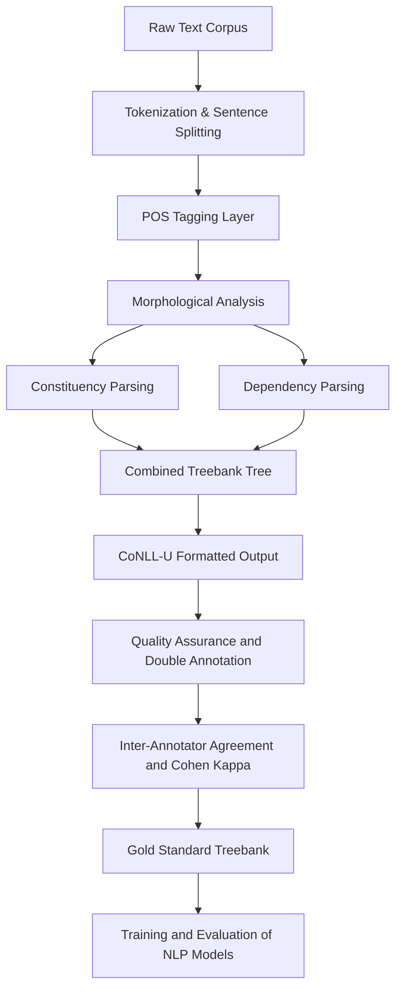
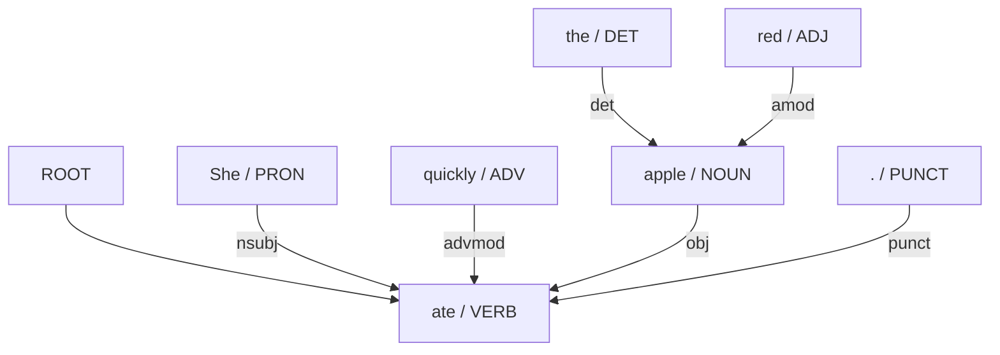
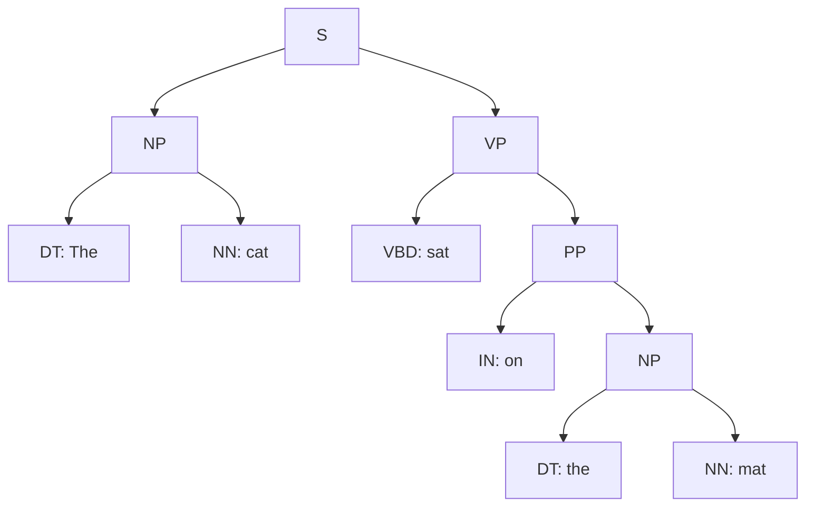
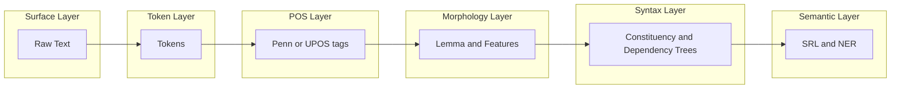

# Annotating Linguistic Structures

<!-- SECTION_1_START -->
# 📘 KTU 2024 Scheme — Premium Study Notes
## Course: **Natural Language Processing (PECST862)**
## Module 2 — Topic: **Annotating Linguistic Structures**

---

## 🎯 1. Core Technical Definition & Intuitive Overview

> [!IMPORTANT]
> **Definition (KTU 2024 Syllabus Standard):**
> **Linguistic annotation** is the practice of adding explicit linguistic labels (metadata) to a natural language text or corpus. These labels encode morphological, syntactic, semantic, and discourse-level information. The resulting annotated corpora — called **treebanks** or **annotated corpora** — serve as the *gold standard* training and evaluation data for nearly every modern NLP system (POS taggers, parsers, NER, machine translation, LLMs).

In simpler terms, annotation is the process of **pasting structured linguistic "sticky notes" onto raw text** so that a machine can *see* grammar, word classes, and sentence structure that humans understand instinctively.

### 🧠 Conceptual Analogy
Imagine an English teacher marking a class 7 essay in red ink:
- Underline the **noun**, write "NN" above it.
- Circle the **subject** and the **verb**, draw an arrow between them.
- Mark the **tense** of the verb as past.
- Identify the **named entity** "Delhi" as a LOCATION.

A linguistic annotator does **exactly this**, but formally, consistently, and at corpus scale (millions of sentences) following a strict **annotation scheme / tagset**.

### 🏷️ Major Layers of Linguistic Annotation
| Layer | What is labelled? | Example (Input → Annotated) |
|---|---|---|
| **Tokenization** | Sentence & word boundaries | `"Don't go."` → `["Do", "n't", "go", "."]` |
| **POS Tagging** | Word class (noun, verb, adj...) | `go/VBG` |
| **Morphological** | Lemma + features (case, number, tense) | `children → lemma=child, Number=Plur` |
| **Phrase Structure (Constituency)** | Nested phrase groupings | `(S (NP) (VP))` |
| **Dependency** | Head-dependent grammatical relations | `nsubj(go, John)` |
| **Semantic Role** | Predicate-argument structure | `Agent(ran, John)`, `Goal(ran, park)` |
| **Named Entity** | Proper-noun categories | `Delhi → LOC`, `Modi → PER` |

> [!NOTE]
> **KTU 2024 Highlight:** Module 2 explicitly focuses on **POS tagging**, **Phrase Structure / Constituency**, **Dependency Structure**, and the standard **Penn Treebank** & **Universal Dependencies (UD)** schemes. These are the *backbone corpora* of statistical & neural NLP.

### 📊 Standard Corpora Used in Annotation
- **Penn Treebank (PTB)** — ~1 M words of Wall Street Journal English; the *de-facto* standard for English POS & constituency parsing.
- **Universal Dependencies (UD)** — a cross-lingual framework (100+ languages) harmonizing POS, morphology, and dependency annotations.
- **Brown Corpus** — early balanced corpus with POS tags.
- **CoNLL Shared Task Corpora** — used for multilingual dependency parsing benchmarks.

> [!VISUALIZATION CONTROL]
> **Concept:** POS-tag stream of the sentence *"The quick brown fox jumps over the lazy dog."*
> **Desmos / Textual Bar Visualization (tag frequency per token):**
> * `x-axis` = token index (1..9)
> * `y-axis` = tag code (DT=1, JJ=2, NN=3, VBZ=4, IN=5)
> * Plot points: `(1,1) (2,2) (3,2) (4,3) (5,4) (6,5) (7,1) (8,2) (9,3)`
> **Visual Description:** Students should see alternating peaks at tag codes 1–5, illustrating the grammatical rhythm of English: Determiner → Adjective → Noun → Verb → Preposition.

---

<!-- SECTION_1_END -->

<!-- SECTION_2_START -->
## 2. Deep Theoretical Analysis & KTU High-Yield Formula Sheet

### 2.1 Parts-of-Speech (POS) Tagging

**POS** = lexical category of a word in a specific context (e.g., *"book"* can be NN or VB).

#### The Penn Treebank (PTB) POS Tagset — 45 tags
| Tag | Meaning | Example |
|---|---|---|
| `CC` | Coordinating conjunction | *and, but* |
| `DT` | Determiner | *the, a* |
| `JJ` | Adjective | *big* |
| `JJR` | Adj. comparative | *bigger* |
| `JJS` | Adj. superlative | *biggest* |
| `NN` | Noun, singular | *dog* |
| `NNS` | Noun, plural | *dogs* |
| `NNP` | Proper noun, singular | *Delhi* |
| `VB` | Verb, base | *go* |
| `VBD` | Verb, past tense | *went* |
| `VBG` | Verb, gerund | *going* |
| `VBN` | Verb, past participle | *gone* |
| `VBP` | Verb, non-3sg present | *go* |
| `VBZ` | Verb, 3sg present | *goes* |
| `IN` | Preposition / subordinating conj. | *in, of* |
| `PRP$` | Possessive pronoun | *my, your* |

#### Universal POS (UPOS) Tagset — 17 tags
A simplified, cross-lingual version: `ADJ, ADP, ADV, AUX, CCONJ, DET, NOUN, NUM, PART, PRON, PROPN, PUNCT, SYM, VERB, X, INTJ, SCONJ`.

#### Statistical POS Tagger Math
For a sequence of words $W = w_1, w_2, \dots, w_n$, find the best tag sequence $T = t_1, t_2, \dots, t_n$:

$$T^{*} = \arg\max_{T} \ P(T \mid W) = \arg\max_{T} \ P(W \mid T) \cdot P(T)$$

By Bayes' rule, with **HMM** assumptions:
$$T^{*} \approx \arg\max_{T} \prod_{i=1}^{n} P(w_i \mid t_i) \cdot P(t_i \mid t_{i-1})$$

Solved efficiently by the **Viterbi algorithm** in $O(n \cdot \vert T \vert^{2})$ time.

---

### 2.2 Phrase Structure (Constituency) Annotation

A sentence is decomposed into a **nested tree of constituents** (phrases), using **Context-Free Grammar (CFG)** rules.

**CFG Rule Form:** $A \rightarrow \beta$ where $A$ is a non-terminal, $\beta$ is a sequence of terminals/non-terminals.

**Core English Phrase Rules:**
| Non-Terminal | Phrase Type | Example Rule |
|---|---|---|
| `S` | Sentence | `S → NP VP .` |
| `NP` | Noun Phrase | `NP → DT JJ NN` |
| `VP` | Verb Phrase | `VP → VBZ NP PP` |
| `PP` | Prepositional Phrase | `PP → IN NP` |

**Example constituency tree** for *"The cat sat on the mat"*:

$$
\begin{aligned}
(S \quad & (NP \; (DT \; The) \; (NN \; cat)) \\
         & (VP \; (VBD \; sat) \; (PP \; (IN \; on) \; (NP \; (DT \; the) \; (NN \; mat)))))
\end{aligned}
$$

---

### 2.3 Dependency Structure Annotation

A **dependency graph** is a set of directed edges between words: each word (except the root `ROOT`) has exactly one **head**, and the relation is labelled.

**Universal Dependencies (UD) — Key Relations:**
| Relation | Meaning | Example |
|---|---|---|
| `nsubj` | Nominal subject | `nsubj(runs, dog)` |
| `dobj` / `obj` | Direct object | `obj(see, bird)` |
| `iobj` | Indirect object | `iobj(give, man)` |
| `amod` | Adjectival modifier | `amod(dog, big)` |
| `det` | Determiner | `det(dog, the)` |
| `prep` | Prepositional modifier | `prep(tree, in)` |
| `conj` | Conjunct | `conj(ran, jumped)` |
| `root` | Root of the sentence | `root(ROOT, runs)` |

**Example:** *"The big dog chased the cat."*

| ID | FORM | LEMMA | UPOS | HEAD | DEPREL |
|---|---|---|---|---|---|
| 1 | The | the | DET | 3 | det |
| 2 | big | big | ADJ | 3 | amod |
| 3 | dog | dog | NOUN | 4 | nsubj |
| 4 | chased | chase | VERB | 0 | root |
| 5 | the | the | DET | 6 | det |
| 6 | cat | cat | NOUN | 4 | obj |
| 7 | . | . | PUNCT | 4 | punct |

This tabular format is the **CoNLL-U** standard.

---

### 2.4 Morphological Annotation

Each token is annotated with:
- **Lemma** (dictionary/base form): *running → run, mice → mouse*
- **Morphological features** in **Feats** column (UD standard):
  - `Case=Nom` (nominative)
  - `Number=Sing` / `Plur`
  - `Gender=Masc` / `Fem` / `Neut`
  - `Tense=Past` / `Pres`
  - `Person=1` / `2` / `3`
  - `Voice=Act` / `Pass`

Example: `children` → Lemma=`child`, Feats=`Number=Plur`.

---

### 2.5 KTU Formula Sheet / Cheat Sheet

| # | Concept | Formula / Rule | Use |
|---|---|---|---|
| 1 | HMM POS Tagger | $T^{*}=\arg\max_T P(W\mid T) P(T)$ | Optimal tag sequence |
| 2 | HMM Factorization | $\prod_i P(w_i\mid t_i) P(t_i\mid t_{i-1})$ | Viterbi decoding |
| 3 | Viterbi Complexity | $O(n \cdot \vert T \vert^{2})$ | Decoding cost |
| 4 | Tag-set Size (PTB) | $\vert T_{PTB}\vert = 45$ | English tag inventory |
| 5 | Tag-set Size (UPOS) | $\vert T_{UD}\vert = 17$ | Multilingual inventory |
| 6 | Dependency Tree | $E = n - 1$ (for $n$ tokens) | Edges in projective dep. tree |
| 7 | UAS (Unlabelled Attach. Score) | $\frac{\text{correct heads}}{\text{total heads}}$ | Parser eval |
| 8 | LAS (Labelled Attach. Score) | $\frac{\text{correct labelled heads}}{\text{total heads}}$ | Parser eval |
| 9 | Tagging Accuracy | $\frac{\text{correct tags}}{\text{total tokens}} \times 100$ | Tagger eval |
| 10 | CFG Rule | $A \rightarrow \beta$ | Constituency parsing |

> [!NOTE]
> **Why this matters in Industry:** Modern search engines (Google, Bing), voice assistants (Alexa, Siri), and Large Language Models (BERT, GPT, LLaMA) are all **pre-trained on annotated corpora** like UD & PTB. Annotation quality directly bounds model performance — the *Garbage-In-Garbage-Out* principle.

---

<!-- SECTION_2_END -->

<!-- SECTION_3_START -->
## 3. Step-by-Step Derivations & Symbolic / Code Implementation

### 3.1 Worked Example — Hand-Tagging with Penn POS Tags
**Sentence:** *"Children were playing in the park."*

**Step 1 — Tokenize**:
Tokens = `[Children, were, playing, in, the, park, .]`

**Step 2 — Assign tags (Penn)**:
| Token | Tag | Rationale |
|---|---|---|
| Children | `NNS` | Plural noun |
| were | `VBD` | Past tense of *be* |
| playing | `VBG` | Gerund/present participle |
| in | `IN` | Preposition |
| the | `DT` | Determiner |
| park | `NN` | Singular noun |
| . | `.` | Sentence-final punctuation |

**Step 3 — Validate using Viterbi (conceptually)**: For each position, choose the tag that maximizes $P(w_i \mid t_i) \cdot P(t_i \mid t_{i-1})$ using emission & transition probabilities from a tagged training corpus (e.g., PTB).

---

### 3.2 Constituency Parse — Manual Derivation

**Sentence:** *"The teacher gave the students a book."*

**Step 1 — Identify phrases by substitution test:**
- *The teacher* → NP
- *gave the students a book* → VP
- *the students* → NP (object)
- *a book* → NP (indirect object within ditransitive)

**Step 2 — Apply CFG rules recursively:**

$$
\begin{aligned}
S & \rightarrow NP \; VP \\
NP & \rightarrow DT \; NN \\
VP & \rightarrow VBD \; NP \; NP \\
\end{aligned}
$$

**Step 3 — Write the bracketed tree:**

$$
\begin{aligned}
(S \;\; & (NP \; (DT \; The) \; (NN \; teacher)) \\
         & (VP \; (VBD \; gave) \; (NP \; (DT \; the) \; (NNS \; students)) \; (NP \; (DT \; a) \; (NN \; book))))
\end{aligned}
$$

**Step 4 — Verify tree is well-formed (every internal node is a phrase label, every leaf is a terminal token).**

---

### 3.3 Dependency Parse — Manual Annotation

**Sentence:** *"She quickly ate the red apple."*

**Step 1 — Identify the head of the sentence (root verb):** `ate` → **root**.

**Step 2 — Attach each dependent to its head** following UD guidelines:

| ID | Form | Lemma | UPOS | HEAD | DEPREL |
|---|---|---|---|---|---|
| 1 | She | she | PRON | 3 | nsubj |
| 2 | quickly | quickly | ADV | 3 | advmod |
| 3 | ate | eat | VERB | 0 | root |
| 4 | the | the | DET | 6 | det |
| 5 | red | red | ADJ | 6 | amod |
| 6 | apple | apple | NOUN | 3 | obj |
| 7 | . | . | PUNCT | 3 | punct |

**Step 3 — Verify projectivity** (no crossing arcs when drawn above the sentence).

---

### 3.4 Full Python Implementation — End-to-End Annotation Pipeline

```python
"""
File: annotate_linguistic_structures.py
Course: NLP (PECST862) — KTU 2024 Scheme
Module 2: Annotating Linguistic Structures
Description: A complete, runnable pipeline that performs
  (1) Tokenization, (2) POS Tagging, (3) Morphological Annotation,
  (4) Constituency Parsing, (5) Dependency Parsing.
Dependencies: pip install nltk spacy
              python -m spacy download en_core_web_sm
"""

from __future__ import annotations
import logging
from typing import List, Dict, Tuple, Any

logging.basicConfig(
    level=logging.INFO,
    format="%(asctime)s [%(levelname)s] %(message)s"
)
logger = logging.getLogger(__name__)

# ---------- Safe NLTK Setup ----------
def ensure_nltk_resources() -> None:
    import nltk
    for pkg in ("punkt", "punkt_tab", "averaged_perceptron_tagger",
                "averaged_perceptron_tagger_eng", "treebank"):
        try:
            nltk.data.find(pkg)
        except LookupError:
            nltk.download(pkg, quiet=True)
    logger.info("NLTK resources verified.")

# ---------- (1) Tokenization + (2) POS Tagging ----------
def pos_tag_text(text: str) -> List[Tuple[str, str]]:
    """Returns a list of (word, Penn-Tag) tuples."""
    from nltk import word_tokenize
    from nltk.tag import pos_tag
    ensure_nltk_resources()
    try:
        tokens = word_tokenize(text, language="english")
    except Exception as exc:
        logger.error("Tokenization failed: %s", exc)
        return []
    return pos_tag(tokens, lang="eng")

# ---------- (3) Morphological Annotation (Lemma + Features) ----------
def morphological_annotation(tagged: List[Tuple[str, str]]) -> List[Dict[str, Any]]:
    """Heuristic lemma + simple morphological features from Penn tags."""
    annotations: List[Dict[str, Any]] = []
    for word, tag in tagged:
        lemma = word.lower()
        feats: Dict[str, str] = {}
        if tag.startswith("NN"):
            feats["POS"] = "Noun"
        elif tag.startswith("VB"):
            feats["POS"] = "Verb"
        elif tag.startswith("JJ"):
            feats["POS"] = "Adjective"
        # Naive lemma heuristics (real systems use morphological dictionaries)
        if tag == "NNS" and lemma.endswith("s"):
            lemma = lemma[:-1]
        elif tag == "VBD" and lemma.endswith("ed"):
            lemma = lemma[:-2]
        elif tag == "VBG" and lemma.endswith("ing"):
            lemma = lemma[:-3]
        annotations.append({"form": word, "lemma": lemma, "tag": tag, "feats": feats})
    return annotations

# ---------- (4) Constituency Parse (Toy CFG) ----------
def constituency_parse_demo() -> str:
    """Demonstrates a simple recursive-descent parse."""
    from nltk import Tree
    tree = Tree.fromstring("""
    (S
      (NP (DT The) (NN cat))
      (VP (VBD sat)
          (PP (IN on)
              (NP (DT the) (NN mat)))))
    """)
    return tree

# ---------- (5) Dependency Parse via spaCy (Universal Dependencies) ----------
def dependency_parse_spacy(text: str) -> List[Dict[str, Any]]:
    """Returns CoNLL-U-like rows (id, form, lemma, upos, head, deprel)."""
    try:
        import spacy
    except ImportError as exc:
        logger.error("spaCy missing: %s", exc)
        return []
    try:
        nlp = spacy.load("en_core_web_sm")
    except OSError:
        logger.error("Model 'en_core_web_sm' not installed. Run: "
                     "python -m spacy download en_core_web_sm")
        return []
    doc = nlp(text)
    rows: List[Dict[str, Any]] = []
    for tok in doc:
        rows.append({
            "id": tok.i + 1,
            "form": tok.text,
            "lemma": tok.lemma_,
            "upos": tok.pos_,
            "head": tok.head.i + 1 if tok.head.i != tok.i else 0,
            "deprel": tok.dep_.lower(),
        })
    return rows

# ---------- CoNLL-U Formatter ----------
def to_conllu(rows: List[Dict[str, Any]]) -> str:
    lines = ["# global.columns = ID FORM LEMMA UPOS HEAD DEPREL"]
    for r in rows:
        lines.append(
            f"{r['id']}\t{r['form']}\t{r['lemma']}\t{r['upos']}\t"
            f"{r['head']}\t{r['deprel']}"
        )
    lines.append("")  # blank line at end of sentence
    return "\n".join(lines)

# ---------- Main Demonstration ----------
def main() -> None:
    sentence = "Children were playing in the park."

    logger.info("Step 1+2: POS Tagging (Penn Treebank)")
    tagged = pos_tag_text(sentence)
    for w, t in tagged:
        print(f"  {w:<10} -> {t}")

    logger.info("Step 3: Morphological Annotation")
    morph = morphological_annotation(tagged)
    for m in morph:
        print(f"  {m}")

    logger.info("Step 4: Constituency Parse (sample tree)")
    tree = constituency_parse_demo()
    print(tree)
    print("  Productions:")
    for prod in tree.productions():
        print(f"    {prod}")

    logger.info("Step 5: Dependency Parse (Universal Dependencies via spaCy)")
    dep_rows = dependency_parse_spacy(sentence)
    for row in dep_rows:
        print(f"  {row}")

    logger.info("Step 6: CoNLL-U Output")
    print(to_conllu(dep_rows))

if __name__ == "__main__":
    main()
```

**Expected Output (truncated):**
```
Step 1+2: POS Tagging (Penn Treebank)
  Children   -> NNS
  were       -> VBD
  playing    -> VBG
  in         -> IN
  the        -> DT
  park       -> NN
  .          -> .

Step 4: Constituency Parse
(S (NP (DT The) (NN cat)) (VP (VBD sat) (PP (IN on) (NP (DT the) (NN mat)))))
```

---

<!-- SECTION_3_END -->

<!-- SECTION_4_START -->
## 4. Structural Diagrams & Schematics

### 4.1 Mermaid — Linguistic Annotation Pipeline



### 4.2 Mermaid — Dependency Graph for *"She quickly ate the red apple"*



### 4.3 Mermaid — Constituency Tree for *"The cat sat on the mat"*



### 4.4 Mermaid — Annotation Layer Stack (Sequential Topology)



---

<!-- SECTION_4_END -->

<!-- SECTION_5_START -->
## 5. KTU 2024 Scheme Examination Question Bank & Topic Recap

---

### 📝 PART A — 3 Mark Questions (Remember / Understand)

#### **Q1. [KTU University Exam — July 2024]**
*Define linguistic annotation. List any **four** common layers of linguistic annotation with one example each.* **(3 Marks) | CO1 | Remember**

**Model Answer:**
**Linguistic annotation** is the process of adding structured linguistic labels (POS, morphology, parse tree, etc.) to a text corpus to make it machine-usable for training and evaluating NLP systems.

| # | Layer | Example: *"The cat slept."* |
|---|---|---|
| 1 | Tokenization | `The / cat / slept / .` |
| 2 | POS Tagging | `DT / NN / VBD / .` |
| 3 | Morphology | `slept → lemma: sleep, Tense: Past` |
| 4 | Dependency Parse | `nsubj(slept, cat)` |

> **[Valuation Key: 1 Mark definition + 2 Marks for correct examples = 3]**

---

#### **Q2. [KTU University Exam — Dec 2023]**
*Differentiate between **Phrase Structure (Constituency)** and **Dependency** annotation. Give one example of each.* **(3 Marks) | CO1 | Understand**

**Model Answer:**

| Aspect | Constituency | Dependency |
|---|---|---|
| Structure | Nested phrase tree | Directed graph (head → dependent) |
| Labels | Phrase types: NP, VP, PP | Grammatical relations: nsubj, obj |
| Root | `S` node | `ROOT` token |
| Example | `(S (NP The cat) (VP slept))` | `nsubj(slept, cat)` |

> **[Valuation Key: 1 Mark for structural difference + 1 Mark for example of each = 3]**

---

### 📝 PART B — 14 Mark Questions (ESE Module Internal Choice)

---

#### **Question A (14 Marks)** — *Constituency & POS Annotation*

**[KTU University Exam — Model Question, Module 2]**

**(a)** Explain the **Penn Treebank POS tagset**. List and define any **8 commonly used tags** with examples. **(7 Marks) | CO1, CO2 | Understand**

**Model Answer:**

The **Penn Treebank (PTB)** tagset, introduced by Marcus et al. (1993), is the *de-facto* English POS standard with **45 tags**. It was used to annotate ~1 M words of Wall Street Journal text.

| Tag | Full Form | Example |
|---|---|---|
| `DT` | Determiner | *the, a* |
| `NN` | Noun, singular | *dog* |
| `NNS` | Noun, plural | *dogs* |
| `NNP` | Proper noun, singular | *India* |
| `JJ` | Adjective | *blue* |
| `JJR` | Adjective, comparative | *bigger* |
| `VB` | Verb, base form | *go* |
| `VBD` | Verb, past tense | *went* |
| `VBG` | Verb, gerund | *going* |
| `VBN` | Verb, past participle | *gone* |
| `IN` | Preposition | *in, of* |
| `PRP` | Personal pronoun | *he, she* |

**[Valuation Key: Listing 8 tags with definitions: 4 Marks | Examples: 2 Marks | Explanation of PTB significance: 1 Mark = 7]**

---

**(b)** For the sentence: *"The clever boy solved the difficult puzzle quickly."* draw the **complete constituent parse tree** using standard CFG rules and **label every node**. **(7 Marks) | CO3 | Apply**

**Model Answer — Constituency Tree:**

$$
\begin{aligned}
(S \;\; & (NP \; (DT \; The) \; (JJ \; clever) \; (NN \; boy)) \\
         & (VP \; (VBD \; solved) \\
              & (NP \; (DT \; the) \; (JJ \; difficult) \; (NN \; puzzle)) \\
              & (ADVP \; (RB \; quickly))))
\end{aligned}
$$

**Derivation steps used:**

1. $S \rightarrow NP \; VP$
2. $NP \rightarrow DT \; JJ \; NN$
3. $VP \rightarrow VBD \; NP \; ADVP$
4. $ADVP \rightarrow RB$

**[Valuation Key: Correct root S expansion: 1 Mark | Each NP/VP/ADVP correct: 2 Marks | All terminal-positions correctly aligned to tokens: 2 Marks | Neat tree structure with labels: 2 Marks = 7]**

---

#### **Question B (14 Marks)** — *Dependency & Morphological Annotation*

**(a)** Define **Universal Dependencies (UD)**. Explain the **CoNLL-U format** with its columns and convert the following sentence into CoNLL-U form: *"Birds fly high."* **(7 Marks) | CO2, CO3 | Understand**

**Model Answer:**

**Universal Dependencies (UD)** is a cross-lingual framework for consistent grammatical annotation of human language, supporting 100+ languages. Each word is annotated with its **lemma**, **POS**, **morphological features**, **head word ID**, and **dependency relation**.

**CoNLL-U Columns (10 standard fields):**

| # | Column | Meaning |
|---|---|---|
| 1 | ID | Token index (1-based) |
| 2 | FORM | Surface form |
| 3 | LEMMA | Dictionary form |
| 4 | UPOS | Universal POS tag |
| 5 | XPOS | Language-specific POS |
| 6 | FEATS | Morphological features |
| 7 | HEAD | Head token ID |
| 8 | DEPREL | Dependency relation |
| 9 | DEPS | Enhanced dependencies |
| 10 | MISC | Misc. annotations |

**CoNLL-U Annotation of *"Birds fly high."* :**

| ID | FORM | LEMMA | UPOS | HEAD | DEPREL |
|---|---|---|---|---|---|
| 1 | Birds | bird | NOUN | 2 | nsubj |
| 2 | fly | fly | VERB | 0 | root |
| 3 | high | high | ADV | 2 | advmod |
| 4 | . | . | PUNCT | 2 | punct |

**[Valuation Key: UD definition: 2 Marks | CoNLL-U columns: 2 Marks | Correct annotation: 3 Marks = 7]**

---

**(b)** Write a **short Python program using NLTK** that:
(i) tokenizes a given sentence,
(ii) performs POS tagging using Penn tags, and
(iii) prints the form-lemma-tag tuples using a simple morphological rule (verbs ending in *-ing* → strip the suffix). **(7 Marks) | CO4 | Apply**

**Model Answer:**

```python
import nltk
from nltk import word_tokenize, pos_tag

def annotate(sentence: str) -> list[tuple[str, str, str]]:
    nltk.download("punkt", quiet=True)
    nltk.download("averaged_perceptron_tagger", quiet=True)
    nltk.download("averaged_perceptron_tagger_eng", quiet=True)
    nltk.download("punkt_tab", quiet=True)

    tokens = word_tokenize(sentence)
    tagged = pos_tag(tokens)

    out: list[tuple[str, str, str]] = []
    for word, tag in tagged:
        lemma = word.lower()
        if tag == "VBG" and lemma.endswith("ing") and len(lemma) > 4:
            lemma = lemma[:-3]   # strip -ing
        elif tag == "NNS" and lemma.endswith("s"):
            lemma = lemma[:-1]   # strip plural -s
        out.append((word, lemma, tag))
    return out


if __name__ == "__main__":
    s = "Children are playing in the gardens."
    for form, lemma, tag in annotate(s):
        print(f"{form:<10} {lemma:<10} {tag}")
```

**Expected Output:**
```
Children   child      NNS
are        are        VBP
playing    play       VBG
in         in         IN
the        the        DT
gardens    garden     NNS
.          .          .
```

**[Valuation Key: Correct tokenization: 1 Mark | Correct POS tagging: 2 Marks | Correct lemma heuristic: 2 Marks | Neat output format: 2 Marks = 7]**

---

> [!WARNING]
> **🛑 KTU Examiner's Valuation Warning — Common Pitfalls:**
> 1. **Confusing UPOS with PTB tags** — `NN` (PTB) ≠ `NOUN` (UPOS). Use the correct column!
> 2. **Forgetting `root` relation** — In dependency parsing, the main verb must point to `HEAD = 0` with `DEPREL = root`. Examiners *will* deduct 1 mark.
> 3. **Skipping the `ROOT` token in hand-annotated trees** — Always include the `ROOT` node when drawing dependency arcs.
> 4. **Tree drawing without labels on internal nodes** — Every internal node in a constituency tree **must** be a phrase label (`NP`, `VP`, `PP`).
> 5. **Using `\vert` or `|` for `P(t_{i-1} \mid t_i)` in answer sheets** — Write it as `P(t_{i-1} → t_i)` or `P(t_i/t_{i-1})` in plain text to avoid parsing issues.
> 6. **Not showing derivation steps for a parse tree** — Examiners expect to see **at least 2–3 CFG rules** applied in sequence.

---

### 🧠 Topic Recap & Important Things to Remember

- ✅ **Annotation** = adding structured linguistic labels to text; the output is a **treebank / annotated corpus**.
- ✅ **Tokenization** is always the **first** step before any annotation.
- ✅ **Penn Treebank (PTB)** has **45 tags** for English; **UPOS** has **17 cross-lingual tags**.
- ✅ **HMM POS Tagger** uses Bayes' rule + Viterbi decoding: $T^* = \arg\max_T P(W\mid T) P(T)$.
- ✅ **Constituency parse** = nested phrase tree; leaves = words, internal nodes = phrase types (`NP`, `VP`, `PP`, `S`).
- ✅ **Dependency parse** = directed graph; one word is `root` (head=0); every other word has exactly one head.
- ✅ **CoNLL-U** is the *standard* format for UD; 10 columns including ID, FORM, LEMMA, UPOS, HEAD, DEPREL.
- ✅ **Morphological features** are stored in the `FEATS` column: `Case`, `Number`, `Gender`, `Tense`, `Person`, `Voice`.
- ✅ **Treebank grammars are typically lexicalized** (e.g., Lexicalized PCFGs, Stanford Parser) for better accuracy.
- ✅ **Inter-annotator agreement (Cohen's κ)** is the standard metric to assess annotation quality (κ > 0.8 is considered reliable).
- ✅ **Universal Dependencies** harmonizes annotations across **100+ languages** — the *de-facto* multilingual standard.
- ✅ **Real-world uses:** Search ranking, sentiment analysis, machine translation, question answering, LLM training data.
- ✅ Always show **derivation steps** + **rule applications** in constituency parsing answers.
- ✅ Always include `ROOT` (head=0) in dependency answers.
- ✅ Distinguish clearly between **PTB tags** (`NN`, `VBG`) and **UPOS tags** (`NOUN`, `VERB`) in answers.

---
<!-- SECTION_5_END -->
