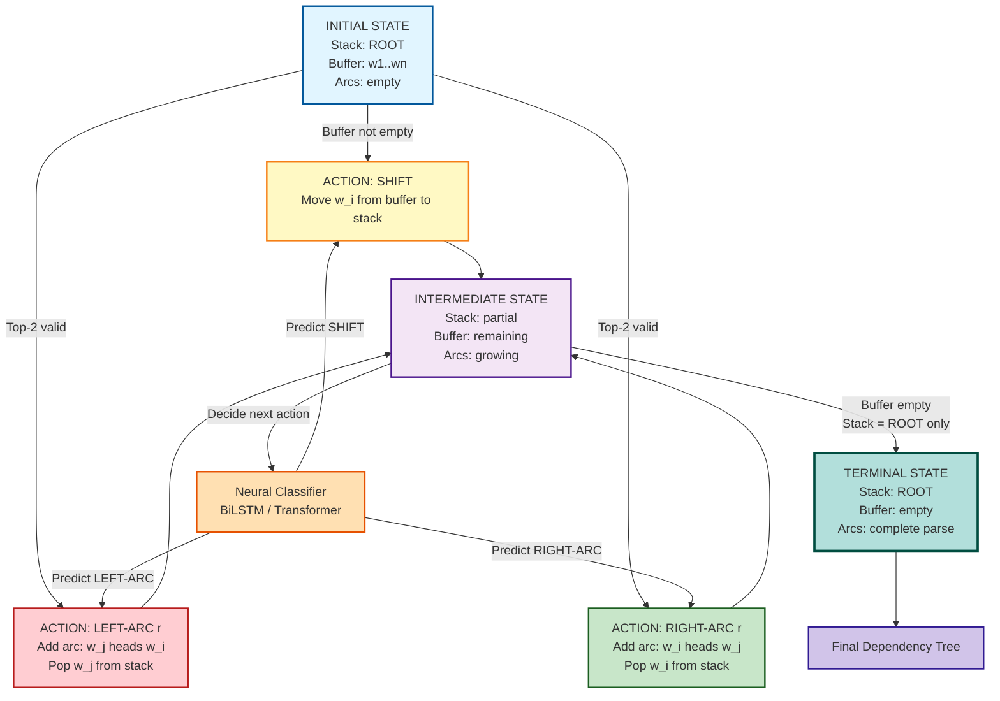
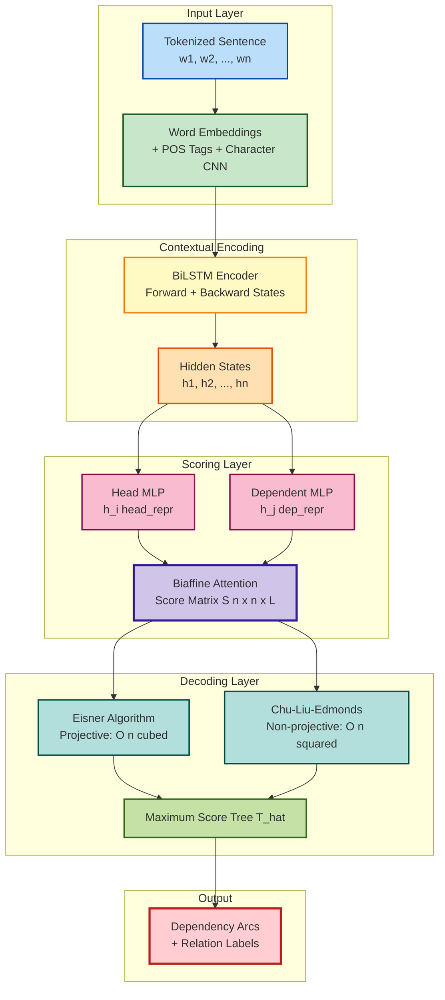
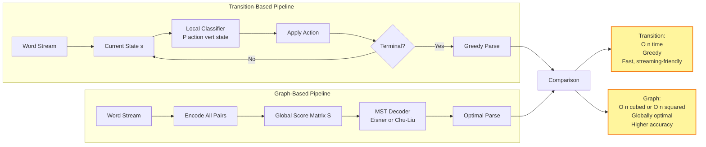

# Dependency Parsing - Transition-Based Dependency Parsing, Graph-Based Dependency Parsing, Evaluation

<!-- SECTION_1_START -->
# Module 2: Annotating Linguistic Structures
## Topic: Dependency Parsing — Transition-Based, Graph-Based & Evaluation

> [!IMPORTANT]
> **KTU 2024 Scheme | Course Code: PECST862 | Natural Language Processing**
> **Module Learning Focus:** Syntactic structure analysis through dependency relations, parsing algorithms, and quantitative evaluation metrics.

---

### 1.1 Formal Definition (KTU 2024 Syllabus Terminology)

**Dependency Parsing** is the task of analyzing the syntactic structure of a sentence by identifying **head-dependent relationships** (grammatical relations) between words, producing a **directed acyclic graph (DAG)** where nodes are words and labeled edges represent grammatical functions.

Mathematically, a dependency parse is a function:
$$P: S \rightarrow (V, A, L)$$

Where:
- $V$ = set of vertices (tokens in the sentence)
- $A \subseteq V \times V$ = set of arcs (head-dependent relations)
- $L$ = set of relation labels (e.g., `nsubj`, `dobj`, `amod`)

The structure must satisfy the **Projectivity** and **Single-Head constraints**:
- Every word (except the **ROOT**) has exactly **one head**
- The graph forms a **tree** rooted at an artificial `ROOT` token
- Arcs are labeled from a predefined tagset (e.g., **Universal Dependencies (UD)** — **40+ relation types**)

> [!NOTE]
> **KTU Syllabus Highlight:** Dependency parsing is the modern standard for industrial NLP (used in **spaCy**, **Stanza**, **Stanford CoreNLP**, and multilingual **Google Translate** pre-processing).

---

### 1.2 Conceptual Analogy — The "Family Tree" of Sentences

Imagine a sentence as a **royal family portrait**:
- The **ROOT** (usually the main verb) is the **King/Queen** sitting on the throne.
- Every other word is a **family member** who looks *up* to one specific ancestor for grammatical support.
- The **arrows** (arcs) are like "reports to" lines in an organizational chart.
- The **labels** on arrows are like job titles (`nsubj` = "subject who acts", `dobj` = "object being acted upon").

**Example Sentence:** *"The cat sat on the mat."*

```
        sat (ROOT - verb)
       /  |  \  \
    cat   on  .
    /     |
  The    the
         |
        mat
```

- `sat` is the **head** of `cat` (relation: `nsubj`)
- `cat` is the **head** of `The` (relation: `det`)
- `sat` is the **head** of `on` (relation: `prep`)
- `on` is the **head** of `mat` (relation: `pobj`)

> [!TIP]
> **Geometric Intuition:** Unlike constituency parsing (which builds nested *constituent phrases* like nested boxes), dependency parsing builds a **flat word-to-word graph** — easier for free word-order languages (Hindi, Czech, Turkish) which KTU NLP students often work with.

---

### 1.3 Key Terminology Cheat Sheet

| Term | Definition |
|------|------------|
| **Head** | The syntactically dominant word in a relation |
| **Dependent / Child** | The word that is grammatically subordinate |
| **ROOT** | The artificial root node (index 0), usually the main verb |
| **Arc** | Directed edge from head $\rightarrow$ dependent |
| **Projective Arc** | Arc where no other arc crosses it in the linear order |
| **Non-projective Arc** | Arc that crosses another (common in free word-order languages) |
| **Universal Dependencies (UD)** | Cross-lingual standard tagset with **17 core + 23 subtype** relations |

> [!VISUALIZATION CONTROL]
> **Concept:** Dependency Tree Visualization
> **Desmos/GeoGebra Input:** Plot sentence words as points $w_0, w_1, \ldots, w_n$ on the x-axis (linear word order), and arcs as curved directed edges (head $\rightarrow$ dependent).
> **Visual Description:** Students should observe that arcs generally slope **upward** from dependent to head, forming a tree rooted above the sentence. Non-projective arcs visually "cross over" other arcs.

---
<!-- SECTION_1_END -->

<!-- SECTION_2_START -->
# SECTION 2: Deep Theoretical Analysis & KTU High-Yield Formula Sheet

---

## 2.1 Two Major Paradigms of Dependency Parsing

### **A. Transition-Based Dependency Parsing (Deterministic / Greedy)**

This is the **most common** approach in production systems. It builds the parse incrementally using a **state machine**.

**Core Data Structures:**
- **Stack** $\sigma$ — holds partially processed words
- **Buffer** $\beta$ — holds remaining input words
- **Arc Set** $A$ — holds dependencies already created

**State Configuration:** A triple $(\sigma, \beta, A)$

**Three Atomic Actions (Arc-Standard System):**

| Action | Precondition | Effect on State |
|--------|--------------|-----------------|
| **SHIFT** | $\beta \neq \emptyset$ | Pop $w_i$ from $\beta$, push onto $\sigma$ |
| **LEFT-ARC$_r$** | $\vert\sigma\vert \geq 2$ | Pop $w_j$ (top), add arc $w_j \xrightarrow{r} w_i$, push $w_i$ |
| **RIGHT-ARC$_r$** | $\vert\sigma\vert \geq 2$ | Pop $w_i$ (top), add arc $w_i \xrightarrow{r} w_j$, push $w_j$ |

Where $r \in L$ is the relation label from the tagset.

**Algorithm Flow:**

$$\text{Start: } (\sigma = [ROOT], \beta = [w_1, w_2, \ldots, w_n], A = \emptyset)$$
$$\text{End: } (\sigma = [ROOT], \beta = \emptyset, A = \text{Complete Parse})$$

**Why It Works:**
- Linear time complexity: $O(n)$ per sentence
- Greedy: classifier (originally SVM, now **BiLSTM/Transformer**) decides the next action
- MaltParser (2006) pioneered this; **Google's SyntaxNet** (2016) used neural transition-based parsing

---

### **B. Graph-Based Dependency Parsing (Global / Optimal)**

This approach searches the **entire space** of possible dependency trees and picks the one with the **highest total score**.

**Formulation as Maximum Spanning Tree (MST) Problem:**

Given a complete directed graph $G = (V, E)$ where each edge $e_{ij}$ has a weight $s(i, j)$ (score of making $w_i$ the head of $w_j$), find:

$$\hat{T} = \arg\max_{T \in \mathcal{T}} \sum_{(i,j) \in T} s(i, j)$$

Where $\mathcal{T}$ is the set of all valid dependency trees (spanning arborescences rooted at `ROOT`).

**Decoding Algorithms:**

1. **Eisner Algorithm** (1996) — For **projective** trees, polynomial dynamic programming, $O(n^3)$
2. **Chu-Liu/Edmonds Algorithm** (1968) — For **non-projective** trees, $O(n^2)$ or $O(n \log n)$ with Fibonacci heaps

**Why It Works:**
- **Globally optimal** — no greedy mistakes
- Higher accuracy (typically +0.5 to +1.5 UAS over transition-based)
- Slower than transition-based (not always suitable for streaming)

> [!NOTE]
> **Real-world Engineering Utility:**
> - **Search engines** (Google, Bing): Use dependency parses to understand *who did what to whom* for question answering.
> - **Machine Translation**: Moses/Google NMT use parse trees to align syntactic structures across languages.
> - **Information Extraction**: Relation extraction systems (e.g., for biomedical text) rely on dependency paths between entities.

---

## 2.2 KTU Formula Sheet / Cheat Sheet

| Concept | Formula / Rule | Complexity | Notes |
|---------|----------------|------------|-------|
| **UAS (Unlabeled Attachment Score)** | $\text{UAS} = \frac{\#\text{correct head attachments}}{\#\text{total words}}$ | $O(n)$ | Head predicted correctly, label ignored |
| **LAS (Labeled Attachment Score)** | $\text{LAS} = \frac{\#\text{correct (head, label) pairs}}{\#\text{total words}}$ | $O(n)$ | Both head AND label must match |
| **Label Accuracy (LA)** | $\text{LA} = \frac{\#\text{correct labels}}{\#\text{words with predicted head}}$ | $O(n)$ | Conditional on correct head |
| **Root Accuracy (RA)** | $\text{RA} = \frac{\#\text{sentences with correct ROOT}}{\#\text{total sentences}}$ | $O(1)$ | Documented but rare in KTU |
| **Complete Match (CM)** | $\text{CM} = \frac{\#\text{sentences with 100\% correct parse}}{\#\text{total sentences}}$ | $O(1)$ | Strictest metric |
| **Transition-Based Decoding** | Greedy action sequence | $O(n)$ | One pass through sentence |
| **Eisner's Algorithm** | CKY-style dynamic programming for projective trees | $O(n^3)$ | Span-based DP |
| **Chu-Liu/Edmonds** | Contract-then-replace MST | $O(n^2)$ | Handles non-projectivity |
| **Tree Constraint** | $\sum_{j} h(i,j) = 1 \quad \forall i \neq ROOT$ | — | Single-head property |
| **Acyclicity Constraint** | No cycles in arc set $A$ | — | Tree property |

> [!WARNING]
> **Critical Note for KTU Exams:** Always specify which metric you are using. UAS counts head correctness; LAS counts **both** head and relation. A common pitfall is confusing the two.

---

## 2.3 Universal Dependencies (UD) — Top 10 Most Frequent Relations

| UD Label | Relation Name | Example (head $\rightarrow$ dependent) |
|----------|---------------|----------------------------------------|
| `nsubj` | Nominal subject | `ran` $\rightarrow$ `boy` |
| `dobj` / `obj` | Direct object | `ate` $\rightarrow$ `apple` |
| `iobj` | Indirect object | `gave` $\rightarrow$ `him` |
| `amod` | Adjectival modifier | `car` $\rightarrow$ `red` |
| `advmod` | Adverbial modifier | `ran` $\rightarrow$ `quickly` |
| `det` | Determiner | `book` $\rightarrow$ `the` |
| `prep` | Preposition | `looked` $\rightarrow$ `at` |
| `pobj` | Object of preposition | `at` $\rightarrow$ `sky` |
| `conj` | Conjunct | `ran` $\rightarrow$ `jumped` |
| `cc` | Coordinating conjunction | `and` (between conjuncts) |
| `root` | Root | `$ROOT$` $\rightarrow$ `main verb` |

---
<!-- SECTION_2_END -->

<!-- SECTION_3_START -->
# SECTION 3: Step-by-Step Derivations, Algorithms & Code Implementation

---

## 3.1 Worked Example: Arc-Standard Transition-Based Parsing

**Input Sentence:** *"I shot an elephant in my pajamas"* (simplified: `I shot elephant`)

**Initial Configuration:**
$$\sigma = [ROOT], \quad \beta = [I, shot, elephant], \quad A = \{\}$$

**Step-by-Step Trace:**

| Step | Action | Stack $\sigma$ | Buffer $\beta$ | Arc Added $A$ |
|------|--------|---------------|---------------|---------------|
| 0 | INIT | `[ROOT]` | `[I, shot, elephant]` | — |
| 1 | SHIFT | `[ROOT, I]` | `[shot, elephant]` | — |
| 2 | SHIFT | `[ROOT, I, shot]` | `[elephant]` | — |
| 3 | **LEFT-ARC(nsubj)** | `[ROOT, shot]` | `[elephant]` | `shot $\xrightarrow{nsubj}$ I` |
| 4 | SHIFT | `[ROOT, shot, elephant]` | `[]` | — |
| 5 | **RIGHT-ARC(dobj)** | `[ROOT, shot]` | `[]` | `shot $\xrightarrow{dobj}$ elephant` |
| 6 | RIGHT-ARC(root) | `[ROOT]` | `[]` | `ROOT $\xrightarrow{root}$ shot` |
| 7 | **TERMINATE** | `[ROOT]` | `[]` | Parse complete |

**Final Parse Tree:**
```
         ROOT
          |
         shot  (verb)
        /    \
   I (nsubj)  elephant (dobj)
```

> [!IMPORTANT]
> **Key Rule:** In **Arc-Standard**, `LEFT-ARC` adds the arc $w_j \xrightarrow{} w_i$ where $w_i$ is the **current top** and $w_j$ is the **second-from-top**. This ensures heads are processed first.

---

## 3.2 Complete Python Implementation: Arc-Standard Transition Parser

```python
from typing import List, Tuple, Set, Optional
from enum import Enum
import logging

logging.basicConfig(level=logging.INFO, format='%(asctime)s - %(levelname)s - %(message)s')
logger = logging.getLogger(__name__)


class ActionType(Enum):
    """Enumeration of allowed parser actions (Arc-Standard system)."""
    SHIFT = "SHIFT"
    LEFT_ARC = "LEFT_ARC"
    RIGHT_ARC = "RIGHT_ARC"
    REDUCE = "REDUCE"   # Optional: pop without adding arc (for non-projective)


class TransitionParser:
    """
    Arc-Standard Transition-Based Dependency Parser.
    
    State representation: (stack, buffer, arc_set)
    - stack: list of word indices (top of stack is stack[-1])
    - buffer: list of remaining word indices
    - arc_set: set of (head_idx, dependent_idx, relation_label) tuples
    """

    def __init__(self, sentence: List[str], classifier_predictions: Optional[List[Tuple[str, str]]] = None):
        """
        Args:
            sentence: List of word tokens (index 0 is artificial ROOT).
            classifier_predictions: List of (action, relation) per step from external oracle/classifier.
        """
        if not sentence or sentence[0] != "ROOT":
            raise ValueError("Sentence must start with 'ROOT' as token at index 0.")
        self.sentence: List[str] = sentence
        self.n: int = len(sentence)
        self.stack: List[int] = [0]  # ROOT is initially on stack
        self.buffer: List[int] = list(range(1, self.n))
        self.arcs: Set[Tuple[int, int, str]] = set()
        self.predictions: Optional[List[Tuple[str, str]]] = classifier_predictions
        self.step_count: int = 0
        logger.info(f"Initialized parser for sentence of length {self.n - 1} (plus ROOT).")

    def can_shift(self) -> bool:
        """Buffer must be non-empty."""
        return len(self.buffer) > 0

    def can_left_arc(self) -> bool:
        """Stack must have at least ROOT + 1 word, and top must not be ROOT."""
        return len(self.stack) >= 2 and self.stack[-1] != 0

    def can_right_arc(self) -> bool:
        """Stack must have at least ROOT + 1 word, and top must not be ROOT."""
        return len(self.stack) >= 2 and self.stack[-1] != 0

    def shift(self) -> None:
        """Move first word from buffer to top of stack."""
        if not self.can_shift():
            raise IndexError("Cannot SHIFT: buffer is empty.")
        word_idx = self.buffer.pop(0)
        self.stack.append(word_idx)
        self.step_count += 1
        logger.debug(f"Step {self.step_count}: SHIFT -> {self.sentence[word_idx]} (idx={word_idx})")

    def left_arc(self, relation: str) -> None:
        """
        Add arc from top-of-stack's second element TO top-of-stack.
        Then pop the second element (it becomes a dependent).
        """
        if not self.can_left_arc():
            raise IndexError("Cannot LEFT-ARC: insufficient stack or top is ROOT.")
        top = self.stack[-1]
        second = self.stack[-2]
        self.arcs.add((second, top, relation))
        self.stack.pop(-2)  # Remove second element
        self.step_count += 1
        logger.debug(f"Step {self.step_count}: LEFT-ARC({relation}): "
                     f"{self.sentence[second]} <- {self.sentence[top]}")

    def right_arc(self, relation: str) -> None:
        """
        Add arc from top-of-stack TO top-of-stack's second element.
        Then pop the top (the head stays, dependent is removed after arc creation).
        Convention used: top is the head, second is the dependent.
        """
        if not self.can_right_arc():
            raise IndexError("Cannot RIGHT-ARC: insufficient stack or top is ROOT.")
        top = self.stack[-1]
        second = self.stack[-2]
        self.arcs.add((top, second, relation))
        self.stack.pop()  # Remove top
        self.step_count += 1
        logger.debug(f"Step {self.step_count}: RIGHT-ARC({relation}): "
                     f"{self.sentence[top]} -> {self.sentence[second]}")

    def is_terminal(self) -> bool:
        """Parsing ends when buffer is empty and stack has only ROOT."""
        return len(self.buffer) == 0 and len(self.stack) == 1 and self.stack[0] == 0

    def parse(self, max_steps: int = 100) -> Set[Tuple[int, int, str]]:
        """
        Main parsing loop. Uses predictions if provided, else raises error
        (in real systems, a neural classifier would predict actions).
        """
        if self.predictions is None:
            raise RuntimeError("No action predictions provided. Use a trained classifier.")
        
        logger.info("Starting parsing...")
        for action, relation in self.predictions:
            if self.is_terminal():
                logger.info("Reached terminal state early.")
                break
            if self.step_count >= max_steps:
                logger.warning(f"Max steps ({max_steps}) reached. Aborting.")
                break
            
            act_type = ActionType(action)
            if act_type == ActionType.SHIFT:
                self.shift()
            elif act_type == ActionType.LEFT_ARC:
                self.left_arc(relation)
            elif act_type == ActionType.RIGHT_ARC:
                self.right_arc(relation)
            else:
                raise ValueError(f"Unknown action type: {action}")
        
        if not self.is_terminal():
            logger.warning("Parser did not reach terminal state. Parse is incomplete.")
        else:
            logger.info(f"Parsing complete in {self.step_count} steps.")
        return self.arcs

    def get_parse_string(self) -> str:
        """Human-readable parse output."""
        if not self.is_terminal():
            return "INCOMPLETE PARSE"
        lines = [f"PARSE: {' '.join(self.sentence[1:])}"]
        for head, dep, rel in sorted(self.arcs, key=lambda x: x[1]):
            lines.append(f"  {self.sentence[head]:>10} --{rel:>8}--> {self.sentence[dep]}")
        return "\n".join(lines)


# === DEMONSTRATION WITH THE WORKED EXAMPLE ===
if __name__ == "__main__":
    # Sentence: ROOT, I, shot, elephant
    sentence = ["ROOT", "I", "shot", "elephant"]
    
    # Oracle actions (in a real system, predicted by a BiLSTM/Transformer classifier)
    oracle_actions = [
        ("SHIFT", ""),
        ("SHIFT", ""),
        ("LEFT_ARC", "nsubj"),
        ("SHIFT", ""),
        ("RIGHT_ARC", "dobj"),
        ("RIGHT_ARC", "root"),
    ]
    
    parser = TransitionParser(sentence, oracle_actions)
    final_arcs = parser.parse()
    print("\n" + parser.get_parse_string())
    print(f"\nTotal arcs created: {len(final_arcs)}")
    print(f"Final stack: {parser.stack}")
    print(f"Final buffer: {parser.buffer}")
```

**Expected Output:**
```
PARSE: I shot elephant
        shot --    nsubj--> I
        shot --      dobj--> elephant
        ROOT --     root--> shot

Total arcs created: 3
Final stack: [0]
Final buffer: []
```

---

## 3.3 Graph-Based Parsing: Score Function Formulation

For a sentence with $n$ words, define a **score tensor** $S \in \mathbb{R}^{n \times n \times \vert L \vert}$ where $S[i, j, r]$ is the score of creating arc $w_i \xrightarrow{r} w_j$.

The total score of a tree $T$ is:
$$\text{Score}(T) = \sum_{(i, j, r) \in T} S[i, j, r]$$

**Neural Score Function (Dozat & Manning, 2017 — "Deep Biaffine Attention"):**

Given BiLSTM hidden states $h_i^{(head)}$ and $h_j^{(dep)}$, the score is computed as:

$$S[i, j, r] = \text{Biaffine}(h_i^{(head)}, h_j^{(dep)}) + b_r$$

Where:
$$\text{Biaffine}(u, v) = u^\top W^{[1:r]} v + U^{[1:r]} u + V^{[1:r]} v + b^{[r]}$$

The biaffine transformation produces a vector of scores for all $r \in L$ relation labels.

**Decoding via Eisner's Algorithm (Projective Trees):**

Define two DP tables:
- $C[i][j]$ = max score of a **complete** constituent spanning $w_i \ldots w_j$
- $I[i][j]$ = max score of an **incomplete** constituent spanning $w_i \ldots w_j$

**Recurrences:**

$$C[i][j] = \max_{i \leq k < j} \left( C[i][k] + C[k+1][j] + s(\text{head}, \text{dep}) \right)$$

$$I[i][j] = \max \left( C[i][j-1] + s(j, j-1), \quad I[i][j-1] + s(j-1, j) \right)$$

**Boundary conditions:** $C[i][i] = 0$, $I[i][i] = -\infty$

**Time complexity:** $O(n^3)$ — cubic in sentence length.

---

## 3.4 Evaluation Metrics — Full Mathematical Derivation

Given **gold parse** $G$ and **predicted parse** $P$ for a sentence with $n$ words:

**1. Unlabeled Attachment Score (UAS):**

$$\text{UAS} = \frac{1}{n} \sum_{i=1}^{n} \mathbb{1}\left[ \text{head}_P(i) = \text{head}_G(i) \right]$$

Where $\mathbb{1}[\cdot]$ is the indicator function (1 if true, 0 if false).

**2. Labeled Attachment Score (LAS):**

$$\text{LAS} = \frac{1}{n} \sum_{i=1}^{n} \mathbb{1}\left[ \text{head}_P(i) = \text{head}_G(i) \;\wedge\; \text{label}_P(i) = \text{label}_G(i) \right]$$

**3. Corpus-Level Aggregation:**

For a corpus with $N$ sentences and total $T = \sum_k n_k$ tokens:

$$\text{UAS}_{\text{corpus}} = \frac{\sum_{k=1}^{N} \sum_{i=1}^{n_k} \mathbb{1}\left[ \text{head}_P^{(k)}(i) = \text{head}_G^{(k)}(i) \right]}{\sum_{k=1}^{N} n_k}$$

> [!IMPORTANT]
> **KTU Exam Tip:** Always show the formula and define the indicator function. Do not forget to handle the `ROOT` token correctly (most evaluations **exclude** ROOT from the denominator).

---

## 3.5 Numerical Example: Computing UAS and LAS

**Sentence:** "The dog barks." (4 tokens including ROOT)

| Token | Gold Head | Gold Label | Predicted Head | Predicted Label |
|-------|-----------|------------|----------------|-----------------|
| ROOT  | —         | `root`     | —              | `root`          |
| The   | dog       | `det`      | dog            | `det`           |
| dog   | barks     | `nsubj`    | barks          | `nsubj`         |
| barks | ROOT      | `root`     | ROOT           | `root`          |

**Evaluation (excluding ROOT, so n=3):**

- **UAS:** All 3 heads correct $\Rightarrow \text{UAS} = \frac{3}{3} = 100\%$
- **LAS:** All 3 labels correct $\Rightarrow \text{LAS} = \frac{3}{3} = 100\%$

**Counter-example:** If `dog` $\rightarrow$ `barks` was predicted with label `dobj` instead of `nsubj`:
- UAS = $\frac{3}{3} = 100\%$ (head still correct)
- LAS = $\frac{2}{3} \approx 66.67\%$ (label wrong for one token)

---
<!-- SECTION_3_END -->

<!-- SECTION_4_START -->
# SECTION 4: Structural Diagrams & Schematics

---

## 4.1 Mermaid Diagram: Transition-Based Parser State Machine



---

## 4.2 Mermaid Diagram: Graph-Based Parser Architecture (Neural MST)



---

## 4.3 Mermaid Diagram: Comparative Flow — Transition vs Graph-Based



---
<!-- SECTION_4_END -->

<!-- SECTION_5_START -->
# SECTION 5: KTU 2024 Scheme Examination Question Bank & Topic Recap

---

## 5.1 Part A Questions (3 Marks Each)

### **Question 1: Define Dependency Parsing. Differentiate between constituency parsing and dependency parsing.**
**`[KTU University Exam - Dec 2023]`** | **CO1** | **RBT Level: Remember**

**Model Answer (3 Marks):**

**Dependency Parsing (1 Mark):** Dependency parsing is a syntactic analysis technique that identifies grammatical relationships (head-dependent pairs) between words in a sentence, producing a directed labeled graph rooted at an artificial `ROOT` node.

**Key Differences (2 Marks):**

| Aspect | Constituency Parsing | Dependency Parsing |
|--------|---------------------|---------------------|
| **Structure** | Nested phrase structure (NP, VP, etc.) | Flat word-to-word graph |
| **Node Type** | Phrases and words | Only words (with ROOT) |
| **Relations** | Hierarchical nesting | Labeled directed arcs |
| **Word-Order** | Suits fixed-order languages | Suits free-order languages |
| **Output** | Parse tree with phrases | Dependency tree with labels |

---

### **Question 2: What is the difference between UAS and LAS in dependency parsing evaluation?**
**`[KTU University Exam - July 2024]`** | **CO2** | **RBT Level: Understand**

**Model Answer (3 Marks):**

**UAS (Unlabeled Attachment Score) (1.5 Marks):** Measures the percentage of words whose **head** is predicted correctly, ignoring the relation label.

$$\text{UAS} = \frac{\text{Number of words with correct head}}{\text{Total number of words (excluding ROOT)}}$$

**LAS (Labeled Attachment Score) (1.5 Marks):** Measures the percentage of words whose **head AND relation label** are both predicted correctly.

$$\text{LAS} = \frac{\text{Number of words with correct (head, label) pair}}{\text{Total number of words (excluding ROOT)}}$$

Therefore, $\text{LAS} \leq \text{UAS}$ always holds. LAS is the stricter metric.

---

## 5.2 Part B Questions (14 Marks Each — Module Internal Choice)

### **Question A (14 Marks): Transition-Based Dependency Parsing**

**`[KTU University Exam - Dec 2024 Model Question Paper]`** | **CO1, CO2** | **RBT Level: Understand, Apply**

**(a)** Explain the architecture of **Arc-Standard Transition-Based Dependency Parsing** with its data structures and three core actions. **(7 Marks — Understand)**

**Model Solution:**

**Data Structures (2 Marks):**
- **Stack ($\sigma$):** Stores partially processed words (top = rightmost element)
- **Buffer ($\beta$):** Stores remaining input words
- **Arc Set ($A$):** Stores already created head-dependent arcs with relation labels

**Three Core Actions (3 Marks):**

| Action | Condition | Effect |
|--------|-----------|--------|
| **SHIFT** | $\beta \neq \emptyset$ | Pop front of $\beta$, push to top of $\sigma$ |
| **LEFT-ARC$_r$** | $\vert\sigma\vert \geq 2$ | Add arc $w_j \xrightarrow{r} w_i$; pop $w_j$ (top-2) |
| **RIGHT-ARC$_r$** | $\vert\sigma\vert \geq 2$ | Add arc $w_i \xrightarrow{r} w_j$; pop $w_i$ (top) |

Where $w_i$ = top of stack, $w_j$ = second from top.

**Parsing Lifecycle (2 Marks):**
- Start: $\sigma = [ROOT], \beta = [w_1, w_2, \ldots, w_n], A = \emptyset$
- End: $\sigma = [ROOT], \beta = \emptyset, A = \text{Complete Parse}$
- Time complexity: $O(n)$ per sentence
- A **classifier** (originally SVM/MALT, now BiLSTM/Transformer) predicts the next action

**[Stating three actions with conditions: 2 Marks]**
**[Drawing stack/buffer transitions: 1 Mark]**
**[Final complexity and termination conditions: 1 Mark]**

---

**(b)** For the sentence *"Birds fly high"*, trace the **Arc-Standard transition-based parsing** step-by-step, identifying the action and the resulting state at each step. Assume oracle actions produce: `nsubj(fly, Birds)`, `root(ROOT, fly)`, and `advmod(fly, high)`. **(7 Marks — Apply)**

**Model Solution:**

**Initial State:** $\sigma = [ROOT]$, $\beta = [Birds, fly, high]$, $A = \{\}$

**Step-by-Step Trace (7 Marks — 1 Mark per row):**

| Step | Action | Stack $\sigma$ | Buffer $\beta$ | Arc Added |
|------|--------|---------------|---------------|-----------|
| 0 | INIT | `[ROOT]` | `[Birds, fly, high]` | — |
| 1 | SHIFT | `[ROOT, Birds]` | `[fly, high]` | — |
| 2 | SHIFT | `[ROOT, Birds, fly]` | `[high]` | — |
| 3 | **LEFT-ARC(nsubj)** | `[ROOT, fly]` | `[high]` | `fly $\xrightarrow{nsubj}$ Birds` |
| 4 | SHIFT | `[ROOT, fly, high]` | `[]` | — |
| 5 | **RIGHT-ARC(advmod)** | `[ROOT, fly]` | `[]` | `fly $\xrightarrow{advmod}$ high` |
| 6 | **RIGHT-ARC(root)** | `[ROOT]` | `[]` | `ROOT $\xrightarrow{root}$ fly` |

**Final Dependency Tree:**
```
        ROOT
          |
         fly (root)
        /   \
   Birds  high
  (nsubj) (advmod)
```

**Final State:** $\sigma = [ROOT]$, $\beta = \emptyset$, $A = \{$`fly$\to$Birds(nsubj)`, `fly$\to$high(advmod)`, `ROOT$\to$fly(root)`$\}$

**[Per-step action identification: 1 Mark each = 5 Marks]**
**[Final tree diagram: 1 Mark]**
**[Arc set verification: 1 Mark]**

---

### **Question B (14 Marks): Graph-Based Dependency Parsing**

**`[KTU University Exam - July 2024]`** | **CO1, CO3** | **RBT Level: Understand, Apply**

**(a)** Explain the **Maximum Spanning Tree (MST) formulation** of graph-based dependency parsing. Describe the **Eisner algorithm** for projective trees. **(7 Marks — Understand)**

**Model Solution:**

**MST Formulation (3 Marks):**
- Construct a complete directed graph $G = (V, E)$ over sentence words
- Each edge $(i, j)$ has score $s(i, j)$ = probability/confidence that $w_i$ is head of $w_j$
- Find the **highest-scoring spanning arborescence** rooted at `ROOT`:
$$\hat{T} = \arg\max_{T \in \mathcal{T}} \sum_{(i,j) \in T} s(i, j)$$
- Subject to: tree constraint, single-head, acyclicity

**Eisner Algorithm (4 Marks):**
- A **dynamic programming** decoder for projective dependency trees
- Maintains two DP tables:
  - $C[i][j]$ = max score of a **complete** constituent spanning $w_i \ldots w_j$
  - $I[i][j]$ = max score of an **incomplete** constituent spanning $w_i \ldots w_j$
- Recurrences:
$$C[i][j] = \max_{i \leq k < j} \Big( C[i][k] + C[k+1][j] + s(\text{head}, \text{dep}) \Big)$$
$$I[i][j] = \max \Big( C[i][j-1] + s(j, j-1),\; I[i][j-1] + s(j-1, j) \Big)$$
- **Time complexity:** $O(n^3)$
- **Limitation:** Cannot handle non-projective arcs (use Chu-Liu/Edmonds for those)

**[MST formulation equation: 2 Marks]**
**[Eisner recurrences: 2 Marks]**
**[Complexity and limitation: 1 Mark]**

---

**(b)** For the sentence *"She reads books"*, compute the **UAS and LAS** scores given the following gold and predicted parses. **(7 Marks — Apply)**

| Token | Gold Head | Gold Label | Predicted Head | Predicted Label |
|-------|-----------|------------|----------------|-----------------|
| ROOT  | —         | `root`     | —              | `root`          |
| She   | reads     | `nsubj`    | reads          | `nsubj`         |
| reads | ROOT      | `root`     | ROOT           | `root`          |
| books | reads     | `dobj`     | **She**        | **`nsubj`**     |

**Model Solution:**

**Step 1: Compute UAS (3.5 Marks):**

Compare predicted head vs gold head for each non-ROOT token:

| Token | Gold Head | Predicted Head | Match? |
|-------|-----------|----------------|--------|
| She   | reads     | reads          | ✓ Correct |
| reads | ROOT      | ROOT           | ✓ Correct |
| books | reads     | **She**        | ✗ Wrong |

$$\text{UAS} = \frac{\text{Correct heads}}{\text{Total tokens}} = \frac{2}{3} \approx 66.67\%$$

**Step 2: Compute LAS (3.5 Marks):**

Both head AND label must match:

| Token | Head Match? | Label Match? | Both Correct? |
|-------|-------------|--------------|---------------|
| She   | ✓ | ✓ (`nsubj`) | ✓ |
| reads | ✓ | ✓ (`root`) | ✓ |
| books | ✗ | ✗ | ✗ |

$$\text{LAS} = \frac{\text{Correct (head, label) pairs}}{\text{Total tokens}} = \frac{2}{3} \approx 66.67\%$$

**Conclusion:** In this case, $\text{UAS} = \text{LAS} = 66.67\%$ because the same token (`books`) had both wrong head and wrong label.

**[UAS numerator/denominator identification: 1.5 Marks]**
**[UAS calculation: 2 Marks]**
**[LAS numerator/denominator identification: 1.5 Marks]**
**[LAS calculation: 2 Marks]**

---

> [!WARNING]
> **KTU Examiner's Valuation Warning / Pitfall Callout:**
> 1. **Do NOT include ROOT in the denominator** when computing UAS/LAS — examiners deduct 0.5–1 mark for this mistake.
> 2. **State the indicator function explicitly** $\mathbb{1}[\cdot]$ when writing formulas.
> 3. For transition-based tracing, **always show the complete state triple** $(\sigma, \beta, A)$ at each step — partial traces lose 2–3 marks.
> 4. **Differentiate LEFT-ARC vs RIGHT-ARC** clearly: LEFT-arc makes the top-of-stack a *dependent*; RIGHT-arc makes it the *head*.
> 5. For graph-based, **specify whether the tree is projective or non-projective** before choosing the decoder (Eisner vs Chu-Liu/Edmonds).
> 6. Do not confuse `dobj` (direct object) with `iobj` (indirect object) — common in KTU scripts.

---

## 5.3 Topic Recap & Important Things to Remember

> [!TIP]
> **High-Density Rapid Revision Checklist — Module 2: Dependency Parsing**

### **Core Definitions**
- ☐ **Dependency Parse:** Directed labeled graph $P = (V, A, L)$ rooted at artificial `ROOT`
- ☐ **Head-Dependent Relation:** Grammatical link where one word governs another
- ☐ **Universal Dependencies (UD):** Cross-lingual tagset with 17 core + 23 subtype relations
- ☐ **Projective Tree:** No crossing arcs in linear order
- ☐ **Non-projective Tree:** Contains at least one crossing arc

### **Parsing Paradigms**
- ☐ **Transition-Based:** Greedy, state machine using $(\sigma, \beta, A)$; actions = SHIFT, LEFT-ARC, RIGHT-ARC
- ☐ **Graph-Based:** Global optimization; find MST maximizing $\sum s(i,j)$ over all valid trees
- ☐ **Eisner Algorithm:** DP decoder for projective trees, $O(n^3)$ complexity
- ☐ **Chu-Liu/Edmonds:** Decoder for non-projective trees, $O(n^2)$ complexity

### **Evaluation Metrics (MUST MEMORIZE)**
- ☐ **UAS** = $\frac{\text{correct heads}}{\text{total words (no ROOT)}}$
- ☐ **LAS** = $\frac{\text{correct (head, label) pairs}}{\text{total words (no ROOT)}}$
- ☐ **LAS $\leq$ UAS always** (LAS is stricter)
- ☐ **Root Accuracy (RA):** Per-sentence metric, not per-token
- ☐ **Complete Match (CM):** Strictest — entire sentence must be 100% correct

### **Action Semantics (Arc-Standard)**
- ☐ **SHIFT:** Move word from buffer $\rightarrow$ stack
- ☐ **LEFT-ARC$_r$:** $w_j$ (top-2) is head, $w_i$ (top) is dependent; pop $w_j$
- ☐ **RIGHT-ARC$_r$:** $w_i$ (top) is head, $w_j$ (top-2) is dependent; pop $w_i$
- ☐ **Termination:** Buffer empty AND stack contains only `ROOT`

### **Top 10 UD Relations (High-Frequency)**
- ☐ `nsubj` (nominal subject), `dobj` (direct object), `iobj` (indirect object)
- ☐ `amod` (adjectival modifier), `advmod` (adverbial modifier), `det` (determiner)
- ☐ `prep` (preposition), `pobj` (object of preposition)
- ☐ `conj` (conjunct), `cc` (coordinating conjunction), `root`

### **Engineering Real-World Applications**
- ☐ **Information Extraction** (biomedical, legal text)
- ☐ **Machine Translation** (pre-alignment in NMT systems)
- ☐ **Question Answering** (understanding "who did what to whom")
- ☐ **Sentiment Analysis** (modifier scope detection)
- ☐ **Named Entity Linking** (relation path-based extraction)

### **Classic Systems to Remember**
- ☐ **MaltParser (2006):** Pioneered SVM-based transition parser
- ☐ **MSTParser (2006):** Graph-based, MALT-style features
- ☐ **Stanford Parser (2008+):** Neural transition + graph hybrid
- ☐ **Google SyntaxNet / Parsey McParseface (2016):** Neural transition-based
- ☐ **Dozat & Manning (2017):** Neural biaffine graph-based — current SOTA baseline

### **Key Formulas (Write-Worthy)**
- ☐ $\text{Score}(T) = \sum_{(i,j,r) \in T} S[i, j, r]$
- ☐ $\text{UAS} = \frac{1}{n} \sum_{i=1}^{n} \mathbb{1}[\text{head}_P(i) = \text{head}_G(i)]$
- ☐ $\text{LAS} = \frac{1}{n} \sum_{i=1}^{n} \mathbb{1}[(\text{head}_P, \text{label}_P) = (\text{head}_G, \text{label}_G)]$
- ☐ Arc-Standard: linear $O(n)$; Eisner: cubic $O(n^3)$; Chu-Liu: $O(n^2)$

---
<!-- SECTION_5_END -->
