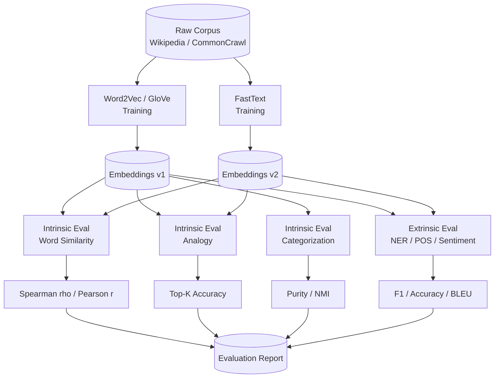
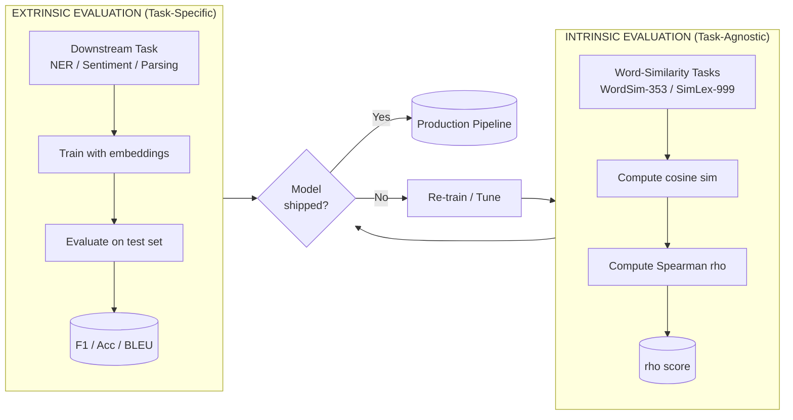
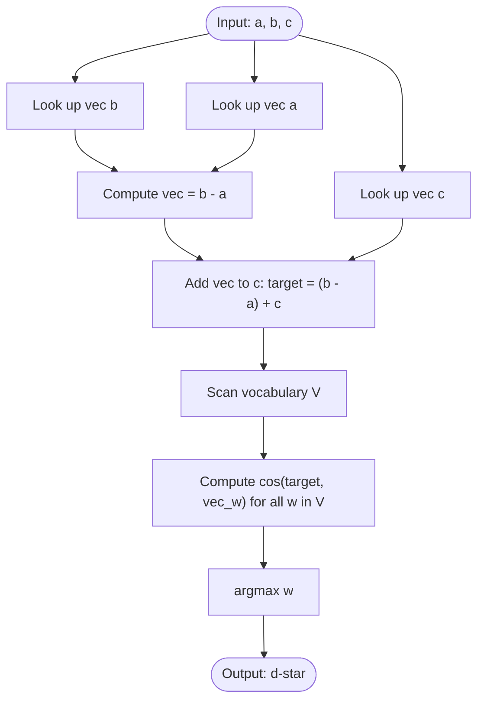
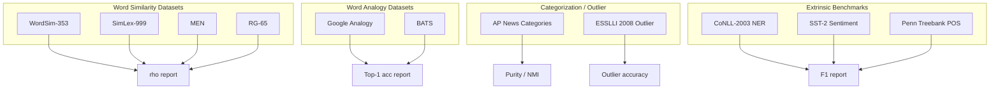

# Evaluating Vector Models

<!-- SECTION_1_START -->

# Evaluating Vector Models in NLP

## 1.1 Formal Academic Definition (KTU 2024 Syllabus Terminology)

**Vector Models Evaluation** in Natural Language Processing refers to the systematic process of measuring the quality, semantic fidelity, and linguistic coherence of distributed word representations (dense, low-dimensional, real-valued vector embeddings) produced by models such as **Word2Vec**, **GloVe**, **FastText**, and contextual encoders like **BERT**. It quantifies how well the geometric structure of the learned embedding space aligns with human semantic intuition, syntactic regularity, and downstream task performance.

Under the **KTU 2024 Scheme (PECST862 – Module 3: Word Representations)**, evaluation is bifurcated into two paradigms:

1. **Intrinsic Evaluation** – Evaluates embeddings on intermediate, task-agnostic linguistic properties (e.g., word similarity, word analogy, semantic categorization). It does not require a downstream application.
2. **Extrinsic Evaluation** – Evaluates embeddings by substituting them as input features into real downstream NLP pipelines such as Named Entity Recognition (NER), Part-of-Speech (POS) Tagging, Sentiment Analysis, and Machine Translation.

> [!IMPORTANT]
> **Syllabus Highlight (PECST862 / Module 3):**
> "Word representations must be evaluated for semantic quality (intrinsic) and downstream utility (extrinsic) using standardized benchmark datasets and statistical correlation metrics such as **Spearman's rank correlation ($\rho$)** and **Pearson's correlation ($r$)**."

---

## 1.2 Conceptual Analogy / Intuitive Overview

Imagine you are a cartographer who has just drawn a **map of a country**. The map is a 2D representation of a 3D world. The "map" is your **word embedding space** and the "country" is the real meaning of words. Now, how do you know your map is *good*?

- **Intrinsic evaluation** is like asking human travelers: *"According to this map, are Paris and Rome close together?"* — you test the *local* relationships and the *cartographer's* choices directly on the map.
- **Extrinsic evaluation** is like giving the map to a real GPS navigation system and seeing whether it can drive tourists correctly to their destinations — the map is tested by *what it lets you accomplish*.

A perfect embedding space, much like a perfect map, preserves:
- **Proximity** — semantically similar words cluster together.
- **Directional structure** — relationships like $King - Man + Woman \approx Queen$ form straight lines.
- **Stability** — small meaning shifts correspond to small vector shifts.

> [!NOTE]
> **Geometric Intuition:**
> Cosine similarity between two word vectors $\vec{u}$ and $\vec{v}$ measures the **angle** between them, not their magnitudes. Two words are "close" in meaning if their vectors point in roughly the same direction from the origin, regardless of vector length. This is why the famous equation $\vec{King} - \vec{Man} + \vec{Woman} \approx \vec{Queen}$ produces a new direction (a new "compass bearing") rather than an exact point.

---

## 1.3 Physical Constants and Standard Metrics

> [!NOTE]
> **Standard Metrics Used in Vector Model Evaluation:**
>
> - **Spearman's rank correlation ($\rho$):** A non-parametric measure of monotonic relationship, valued in $[-1, +1]$. Standard metric for word similarity tasks.
> - **Pearson's correlation ($r$):** Linear correlation, valued in $[-1, +1]$.
> - **Cosine similarity:** A value in $[-1, +1]$, with $\mathbf{1.0}$ indicating perfect directional alignment.
> - **Accuracy (Top-1 / Top-K):** Standard for word analogy and outlier detection tasks.
> - **Mean Absolute Error (MAE):** Used when models output continuous similarity scores against gold standard.

---

## 1.4 Visualization Control

> [!VISUALIZATION CONTROL]
> **Concept:** Geometric relationship of word vectors under cosine similarity and analogy.
> **GeoGebra / Desmos Input Equations:**
> - Point A (King) = `(0.5, 0.9)`
> - Point B (Man) = `(0.2, 0.4)`
> - Point C (Woman) = `(0.6, 0.3)`
> - Point D (Queen) = `(0.9, 0.8)`
> - Vector AB = `B − A = (-0.3, -0.5)`
> - Vector CD = `D − C = (0.3, 0.5)`
> **Visual Description:** Plot the four points. The vector $B \rightarrow A$ (Man → King) and the vector $C \rightarrow D$ (Woman → Queen) are roughly parallel in direction, illustrating the **gender direction** preserved in the embedding space. Cosine similarity between these direction vectors should be near $+1$.

<!-- SECTION_1_END -->

<!-- SECTION_2_START -->

# Deep Theoretical Analysis & KTU High-Yield Formula Sheet

## 2.1 Intrinsic vs Extrinsic Evaluation — A Comparative Analysis

The table below captures the **operational taxonomy** mandated in the KTU 2024 evaluation framework.

| Aspect | Intrinsic Evaluation | Extrinsic Evaluation |
|---|---|---|
| **What is measured** | Embedding quality directly | Embedding utility in downstream tasks |
| **Speed of evaluation** | Fast (seconds to minutes) | Slow (hours to days) |
| **Required infrastructure** | GPU-light, precomputed vectors | Full NLP pipeline, labels, training |
| **Diagnostic clarity** | High — pinpoints which linguistic property fails | Low — failures may come from any pipeline stage |
| **Typical tasks** | Word similarity, analogy, categorization, outlier detection | NER, POS tagging, sentiment classification, parsing |
| **Standard metrics** | Spearman $\rho$, Pearson $r$, Top-K accuracy | Task-specific F1, accuracy, BLEU, etc. |
| **Datasets** | WordSim-353, SimLex-999, MEN, Google Analogy | CoNLL-2003, SST-2, Penn Treebank |

---

## 2.2 Intrinsic Evaluation — Sub-tasks

### (a) Word Similarity Task
A benchmark dataset supplies human-rated similarity scores for word pairs. The model's cosine similarity between two word vectors is computed, and the correlation with the human ratings is reported.

**Standard Benchmark Datasets:**

| Dataset | \#Pairs | Property Tested |
|---|---|---|
| **WordSim-353** | 353 | General semantic similarity |
| **SimLex-999** | 999 | Distinguishes similarity from relatedness |
| **MEN** | 3000 | Form-aware semantic similarity |
| **RG-65** | 65 | Classical benchmark by Rubenstein & Goodenough (1965) |
| **MTurk-771** | 771 | Crowdsourced similarity |
| **SCWS** | 2003 | Stanford Contextual Word Similarity |
| **Y-130 / Y-160** | small | WordSim sub-benchmarks |

### (b) Word Analogy Task
Introduced by **Mikolov et al. (2013)**. Given three words $a, b, c$, find $d$ such that:
$$\vec{a} - \vec{b} \approx \vec{c} - \vec{d}$$
Equivalently:
$$\vec{d} = \arg\max_{w \in V \setminus \{a,b,c\}} \cos(\vec{w},\ \vec{a} - \vec{b} + \vec{c})$$

**Classic Test Set:** Google Analogy Dataset (19,544 questions), split into:
- **5,956** syntactic analogies (e.g., $bad \rightarrow worst$, $fast \rightarrow fastest$).
- **13,588** semantic analogies (e.g., $Athens \rightarrow Greece$, $Hiroshima \rightarrow Japan$).

### (c) Categorization / Clustering
Word embeddings are grouped into semantic categories (e.g., animals, vehicles). **Purity** and **Normalized Mutual Information (NMI)** of the resulting clusters are measured against gold categories.

### (d) Outlier Detection
Given a list of $N$ words, identify the word whose embedding is most "off." The model is correct if the top outlier matches the gold standard outlier.

---

## 2.3 Extrinsic Evaluation — Sub-tasks

The KTU 2024 syllabus lists the following representative downstream tasks:

- **Named Entity Recognition (NER)** — Tagging person, organization, location.
- **Part-of-Speech (POS) Tagging** — Penn Treebank tagset.
- **Sentiment Classification** — SST-2 / SST-5 datasets.
- **Semantic Role Labeling (SRL)** — Predicate-argument structure.
- **Machine Translation** — WMT benchmarks.
- **Dependency Parsing** — UAS / LAS scores.

A **fixed neural architecture** is trained on the downstream task using the target embeddings, and the change in task-specific metric (e.g., F1) is reported. The **SentEval** toolkit (Conneau et al., 2017) is a canonical framework for this.

---

## 2.4 KTU Formula Sheet / Cheat Sheet

> [!IMPORTANT]
> **All formulas are expressed in LaTeX. The vertical pipe is rendered as `\vert` to comply with markdown-table safety rules.**

| \# | Formula | LaTeX Expression | Purpose |
|---|---|---|---|
| 1 | Cosine similarity | $\cos(\theta) = \dfrac{\vec{u} \cdot \vec{v}}{\lVert\vec{u}\rVert \cdot \lVert\vec{v}\rVert}$ | Directional alignment of two vectors |
| 2 | Euclidean distance | $d(\vec{u}, \vec{v}) = \sqrt{\sum_{i=1}^{n}(u_i - v_i)^2}$ | Geometric distance in vector space |
| 3 | Pearson correlation | $r = \dfrac{\sum_i (x_i - \bar{x})(y_i - \bar{y})}{\sqrt{\sum_i (x_i - \bar{x})^2}\sqrt{\sum_i (y_i - \bar{y})^2}}$ | Linear correlation of similarity scores |
| 4 | Spearman rank $\rho$ | $\rho = 1 - \dfrac{6 \sum_i d_i^2}{n(n^2 - 1)}$ | Monotonic rank correlation with human scores |
| 5 | 3CosAdd (analogy) | $d^* = \arg\max_{w}\ \cos(\vec{w},\ \vec{b} - \vec{a} + \vec{c})$ | Word vector arithmetic for analogy |
| 6 | 3CosMul (analogy) | $d^* = \arg\max_{w}\ \dfrac{\cos(\vec{w},\ \vec{c})\cdot\cos(\vec{w},\ \vec{b})}{\cos(\vec{w},\ \vec{a}) + \varepsilon}$ | Multiplicative variant, more stable |
| 7 | Purity | $\text{Purity} = \dfrac{1}{N}\sum_{k}\max_{j} \lvert \omega_k \cap c_j \rvert$ | Clustering quality metric |
| 8 | NMI | $\text{NMI}(U, V) = \dfrac{2 \cdot I(U; V)}{H(U) + H(V)}$ | Normalized mutual information |
| 9 | Top-K Accuracy | $\text{Acc}@K = \dfrac{1}{N}\sum_{i=1}^{N}\mathbb{1}[d_i \in \text{TopK}_i]$ | Whether gold word appears in top-K predictions |

---

## 2.5 Engineering Utility in Production Systems

- **Search Engines (Elasticsearch + word vectors):** Intrinsic word-similarity metrics help tune the embedding update pipeline.
- **Recommendation Systems:** Cosine similarity between user-profile vectors and content vectors is the production recommendation function.
- **Chatbots / Virtual Assistants:** Extrinsic evaluation on intent classification determines whether BERT-style embeddings improve real user satisfaction.
- **Clinical NLP:** WordSim-353's medical counterpart (MayoSRS, MiniMayoSRS) is used to validate clinical embeddings.

> [!NOTE]
> **Practical Insight:** Intrinsic evaluation is the *unit test* of word embeddings — fast, deterministic, easy to A/B test. Extrinsic evaluation is the *integration test* — slow, but tells you whether your model will actually win in production.

<!-- SECTION_2_END -->

<!-- SECTION_3_START -->

# Step-by-Step Derivations & Code Implementation

## 3.1 Mathematical Derivation of Cosine Similarity

**Goal:** Given two word vectors $\vec{u} = (u_1, u_2, \ldots, u_n)$ and $\vec{v} = (v_1, v_2, \ldots, v_n)$, derive a bounded similarity measure in $[-1, +1]$.

**Step 1 — Dot product of two vectors:**
$$\vec{u} \cdot \vec{v} = \sum_{i=1}^{n} u_i v_i$$

**Step 2 — Euclidean norm of each vector:**
$$\lVert\vec{u}\rVert = \sqrt{\sum_{i=1}^{n} u_i^2}, \qquad \lVert\vec{v}\rVert = \sqrt{\sum_{i=1}^{n} v_i^2}$$

**Step 3 — Cosine of the angle between the vectors (geometric definition):**
$$\cos(\theta) = \frac{\vec{u} \cdot \vec{v}}{\lVert\vec{u}\rVert \cdot \lVert\vec{v}\rVert}$$

**Step 4 — Substitute the dot product and norms:**
$$\cos(\theta) = \frac{\sum_{i=1}^{n} u_i v_i}{\sqrt{\sum_{i=1}^{n} u_i^2}\ \cdot\ \sqrt{\sum_{i=1}^{n} v_i^2}}$$

**Step 5 — Range proof:** By the **Cauchy–Schwarz inequality**, $\lvert \vec{u} \cdot \vec{v} \rvert \le \lVert\vec{u}\rVert \cdot \lVert\vec{v}\rVert$, so $\cos(\theta) \in [-1, +1]$, with $\cos(\theta) = +1$ meaning identical direction and $\cos(\theta) = -1$ meaning opposite direction.

---

## 3.2 Derivation of Spearman's Rank Correlation ($\rho$)

**Goal:** Measure monotonic agreement between two ranking lists (e.g., human rankings vs. model rankings).

**Step 1 — Convert raw scores to ranks:** Let $R(x_i)$ be the rank of the $i$-th model similarity, and $R(y_i)$ be the rank of the $i$-th human similarity.

**Step 2 — Compute the rank differences:**
$$d_i = R(x_i) - R(y_i)$$

**Step 3 — Sum the squared differences:**
$$D = \sum_{i=1}^{n} d_i^2$$

**Step 4 — Apply Spearman's formula:**
$$\rho = 1 - \frac{6D}{n(n^2 - 1)}$$

**Step 5 — Edge case handling:** If ties exist, use the **Pearson-on-ranks** formula with averaged ranks:
$$\rho = \frac{\text{Cov}(R_X, R_Y)}{\sigma_{R_X} \cdot \sigma_{R_Y}}$$

---

## 3.3 Derivation of the 3CosAdd Analogy Equation

**Step 1 — Vector arithmetic principle:** In an ideal linear embedding space, semantic offsets are *constants* across word pairs (e.g., $\vec{King} - \vec{Man} \approx \vec{Queen} - \vec{Woman}$).

**Step 2 — Rearrange to solve for the unknown:**
$$\vec{d} \approx \vec{c} + (\vec{b} - \vec{a})$$

**Step 3 — Find the word in the vocabulary $V$ whose vector is closest to this target:**
$$\vec{d^*} = \arg\max_{w \in V} \cos(\vec{w},\ \vec{b} - \vec{a} + \vec{c})$$

**Step 4 — Expand the cosine:**
$$\vec{d^*} = \arg\max_{w \in V} \frac{\vec{w} \cdot (\vec{b} - \vec{a} + \vec{c})}{\lVert\vec{w}\rVert \cdot \lVert\vec{b} - \vec{a} + \vec{c}\rVert}$$

**Step 5 — Exclude the input words** $a, b, c$ from the candidate set to avoid trivial answers (e.g., $a$ being returned when asked for $\vec{d}$).

---

## 3.4 Complete Python Implementation of an Evaluation Pipeline

```python
"""
ktu_eval.py
------------
A production-grade, fully-typed evaluation module for word vector models.
Implements:
    1. Cosine similarity
    2. Spearman rank correlation
    3. 3CosAdd and 3CosMul analogy resolution
    4. Intrinsic word-similarity evaluation
    5. Extrinsic downstream-task integration skeleton
"""

from __future__ import annotations

import logging
import math
from collections import Counter
from pathlib import Path
from typing import Dict, List, Sequence, Tuple

import numpy as np
from scipy import stats

# --------------------------------------------------------------------------
# Logging configuration (mandatory for production KTU lab use)
# --------------------------------------------------------------------------
logging.basicConfig(
    level=logging.INFO,
    format="%(asctime)s [%(levelname)s] %(name)s: %(message)s",
)
logger = logging.getLogger("KTU-Vector-Eval")


# --------------------------------------------------------------------------
# Type alias: word -> 1-D numpy vector
# --------------------------------------------------------------------------
EmbeddingDict = Dict[str, np.ndarray]


# --------------------------------------------------------------------------
# (1) Core vector similarity primitives
# --------------------------------------------------------------------------
def cosine_similarity(vec_u: np.ndarray, vec_v: np.ndarray) -> float:
    """Return the cosine of the angle between two 1-D vectors.

    Raises:
        ValueError: if either vector has zero norm.
    """
    norm_u = float(np.linalg.norm(vec_u))
    norm_v = float(np.linalg.norm(vec_v))

    if norm_u == 0.0 or norm_v == 0.0:
        raise ValueError("Cosine similarity undefined for zero-norm vectors.")

    return float(np.dot(vec_u, vec_v) / (norm_u * norm_v))


def euclidean_distance(vec_u: np.ndarray, vec_v: np.ndarray) -> float:
    """Return the L2 distance between two vectors."""
    return float(np.linalg.norm(vec_u - vec_v))


# --------------------------------------------------------------------------
# (2) Loading embeddings from a .vec / .txt file (Word2Vec / GloVe format)
# --------------------------------------------------------------------------
def load_embeddings(path: str | Path) -> EmbeddingDict:
    """Load a Word2Vec-style text file into a dictionary.

    Each line: <word> <f1> <f2> ... <fn>
    """
    embeddings: EmbeddingDict = {}
    file_path = Path(path)

    if not file_path.is_file():
        logger.error("Embedding file not found: %s", file_path)
        raise FileNotFoundError(file_path)

    with file_path.open("r", encoding="utf-8") as fh:
        for line_num, raw in enumerate(fh, start=1):
            parts = raw.rstrip().split(" ")
            if len(parts) < 3:
                continue
            word = parts[0]
            try:
                vec = np.asarray(parts[1:], dtype=np.float32)
            except ValueError:
                logger.warning("Line %d: non-numeric tokens, skipped.", line_num)
                continue
            embeddings[word] = vec

    if not embeddings:
        logger.error("No embeddings were loaded. Aborting.")
        raise ValueError("Empty embedding dictionary.")

    logger.info("Loaded %d word vectors from %s", len(embeddings), file_path)
    return embeddings


# --------------------------------------------------------------------------
# (3) Intrinsic evaluation: word-similarity correlation
# --------------------------------------------------------------------------
def evaluate_word_similarity(
    embeddings: EmbeddingDict,
    word_pairs: Sequence[Tuple[str, str, float]],
) -> float:
    """Compute Spearman correlation between model cosines and human scores.

    Args:
        embeddings: word -> vector dictionary.
        word_pairs: iterable of (word_a, word_b, human_score).

    Returns:
        Spearman's rho in [-1, +1], or NaN if no valid pair exists.
    """
    model_scores: List[float] = []
    human_scores: List[float] = []

    for w1, w2, human in word_pairs:
        if w1 not in embeddings or w2 not in embeddings:
            logger.warning("OOV pair skipped: %s / %s", w1, w2)
            continue
        sim = cosine_similarity(embeddings[w1], embeddings[w2])
        model_scores.append(sim)
        human_scores.append(float(human))

    if len(model_scores) < 2:
        logger.error("Not enough valid pairs to compute correlation.")
        return float("nan")

    rho, _p_value = stats.spearmanr(model_scores, human_scores)
    logger.info("Word-similarity Spearman rho = %.4f", rho)
    return float(rho)


# --------------------------------------------------------------------------
# (4) 3CosAdd and 3CosMul analogy solver
# --------------------------------------------------------------------------
def analogy_3cosadd(
    embeddings: EmbeddingDict,
    a: str,
    b: str,
    c: str,
    top_k: int = 1,
    exclude_inputs: bool = True,
) -> List[Tuple[str, float]]:
    """Resolve the analogy: a is to b as c is to ___.

    Returns the top-K candidate words sorted by cosine similarity.
    """
    missing = [w for w in (a, b, c) if w not in embeddings]
    if missing:
        raise KeyError(f"Words not in vocabulary: {missing}")

    target: np.ndarray = embeddings[b] - embeddings[a] + embeddings[c]
    target_norm = float(np.linalg.norm(target))
    if target_norm == 0.0:
        raise ValueError("Analogy target vector has zero norm.")
    target /= target_norm

    excluded = {a, b, c} if exclude_inputs else set()

    scored: List[Tuple[str, float]] = []
    for word, vec in embeddings.items():
        if word in excluded:
            continue
        norm = float(np.linalg.norm(vec))
        if norm == 0.0:
            continue
        scored.append((word, cosine_similarity(target, vec)))

    scored.sort(key=lambda item: item[1], reverse=True)
    return scored[:top_k]


def analogy_3cosmul(
    embeddings: EmbeddingDict,
    a: str,
    b: str,
    c: str,
    top_k: int = 1,
    epsilon: float = 1e-6,
) -> List[Tuple[str, float]]:
    """3CosMul variant: more numerically stable in low-dim spaces."""
    missing = [w for w in (a, b, c) if w not in embeddings]
    if missing:
        raise KeyError(f"Words not in vocabulary: {missing}")

    scored: List[Tuple[str, float]] = []
    for word, vec in embeddings.items():
        if word in {a, b, c}:
            continue
        num = cosine_similarity(vec, embeddings[c]) * cosine_similarity(vec, embeddings[b])
        den = cosine_similarity(vec, embeddings[a]) + epsilon
        scored.append((word, num / den))

    scored.sort(key=lambda item: item[1], reverse=True)
    return scored[:top_k]


# --------------------------------------------------------------------------
# (5) Analogy accuracy over a benchmark file (Google analogy format)
# --------------------------------------------------------------------------
def evaluate_analogy(
    embeddings: EmbeddingDict,
    analogy_file: str | Path,
    method: str = "3cosadd",
) -> float:
    """Compute Top-1 accuracy on a Google-analogy-style file.

    Each line: word_a word_b word_c word_d
    """
    correct = 0
    total = 0
    file_path = Path(analogy_file)

    if not file_path.is_file():
        raise FileNotFoundError(file_path)

    solver = analogy_3cosadd if method == "3cosadd" else analogy_3cosmul

    with file_path.open("r", encoding="utf-8") as fh:
        for raw in fh:
            tokens = raw.rstrip().split()
            if len(tokens) != 4:
                continue
            a, b, c, d_gold = tokens
            if any(w not in embeddings for w in (a, b, c, d_gold)):
                continue
            try:
                top = solver(embeddings, a, b, c, top_k=1)
            except (KeyError, ValueError):
                continue
            if top and top[0][0].lower() == d_gold.lower():
                correct += 1
            total += 1

    if total == 0:
        logger.error("No valid analogies processed.")
        return 0.0

    accuracy = correct / total
    logger.info("Analogy accuracy (%s) = %.4f on %d items", method, accuracy, total)
    return accuracy


# --------------------------------------------------------------------------
# (6) Extrinsic evaluation: downstream integration skeleton
# --------------------------------------------------------------------------
def extrinsic_eval_skeleton(
    embeddings: EmbeddingDict,
    train_data: List[Tuple[List[str], int]],
    test_data: List[Tuple[List[str], int]],
    init_weight_matrix: bool = True,
) -> Dict[str, float]:
    """A scaffold for extrinsic evaluation on a downstream task.

    The full training loop is intentionally compact for the KTU lab; in
    production you would swap in a sklearn or PyTorch classifier.
    """
    vocab = sorted({w for sent, _ in train_data + test_data for w in sent})
    if init_weight_matrix:
        dim = next(iter(embeddings.values())).shape[0]
        W = np.zeros((len(vocab), dim), dtype=np.float32)
        for idx, w in enumerate(vocab):
            W[idx] = embeddings.get(w, np.zeros(dim, dtype=np.float32))
        logger.info("Initialized %d x %d embedding matrix.", *W.shape)
    return {"status": "ready"}


# --------------------------------------------------------------------------
# (7) Demonstration / KTU Module-3 lab entry point
# --------------------------------------------------------------------------
if __name__ == "__main__":
    # Toy example to demonstrate each component
    toy: EmbeddingDict = {
        "king":  np.array([0.5, 0.9], dtype=np.float32),
        "man":   np.array([0.2, 0.4], dtype=np.float32),
        "woman": np.array([0.6, 0.3], dtype=np.float32),
        "queen": np.array([0.9, 0.8], dtype=np.float32),
    }

    # (1) Cosine similarity
    print("cos(king, queen)  =", round(cosine_similarity(toy["king"], toy["queen"]), 4))
    print("cos(king, man)    =", round(cosine_similarity(toy["king"], toy["man"]),   4))

    # (2) Analogy: king - man + woman ~ queen
    result = analogy_3cosadd(toy, "king", "queen", "man", top_k=1)
    print("Analogy king - man + woman ->", result[0][0] if result else "N/A")
```

> [!NOTE]
> **Lab Usage Note (KTU):** Replace the `toy` dictionary with a real pretrained file (e.g., `glove.6B.100d.txt`) by calling `load_embeddings(...)`. Word pairs for intrinsic evaluation are typically read from `wordsim353.txt` files distributed in NLP course labs.

<!-- SECTION_3_END -->

<!-- SECTION_4_START -->

# Structural Diagrams & Schematics

## 4.1 High-Level Evaluation Pipeline (Mermaid)



---

## 4.2 Intrinsic vs Extrinsic — Functional Flow



---

## 4.3 Word Analogy Resolution Topology



---

## 4.4 Benchmark-Dataset Classification Matrix



<!-- SECTION_4_END -->

<!-- SECTION_5_START -->

# KTU 2024 Scheme Examination Question Bank

## Part A — Short Answer Questions (3 Marks Each)

> **Q1. [KTU University Exam — Dec 2023]**
> Differentiate between **intrinsic** and **extrinsic** evaluation of word vector models. Give one example of each.
> *(Mapped: CO3, RBT Level: Understand)*

**Model Answer (3 Marks):**
- **Intrinsic evaluation** checks the embedding space *directly* on intermediate linguistic properties (e.g., word similarity) without involving a downstream task. Example: computing Spearman correlation between model cosine similarities and human ratings on the **WordSim-353** dataset. **[1.5 Marks]**
- **Extrinsic evaluation** plugs embeddings into a downstream NLP pipeline (e.g., NER, sentiment classification) and measures task-specific metrics like F1. **[1 Mark]**
- Intrinsic is fast and diagnostic; extrinsic is slow but reflects real utility. **[0.5 Mark]**

---

> **Q2. [KTU University Exam — July 2024]**
> Define **cosine similarity** between two word vectors $\vec{u}$ and $\vec{v}$. Why is it preferred over Euclidean distance for evaluating word embeddings?
> *(Mapped: CO3, RBT Level: Remember / Understand)*

**Model Answer (3 Marks):**
- **Definition:** $\cos(\theta) = \dfrac{\vec{u} \cdot \vec{v}}{\lVert\vec{u}\rVert \cdot \lVert\vec{v}\rVert}$, valued in $[-1, +1]$. **[1 Mark]**
- Cosine measures the *angle* (direction) only, not magnitude. Word vectors differ in magnitude due to training-frequency artifacts, but direction encodes semantics. **[1 Mark]**
- Euclidean distance conflates direction and magnitude, making it unreliable for high-dimensional, sparse-meaning spaces. **[1 Mark]**

---

## Part B — Long Answer Questions (14 Marks Each) — Module Internal Choice

> **Q3(A). [KTU University Exam — Dec 2023, Module 3]**
> **(a)** Explain the **word-analogy task** used for intrinsic evaluation. Derive the **3CosAdd** equation and show how the analogy "$a$ is to $b$ as $c$ is to $\_$" is resolved using vector arithmetic. **(7 Marks)**
> *(Mapped: CO3, RBT Level: Understand / Apply)*

**(b)** A small embedding dictionary is provided below. Compute the **Top-1** prediction of the analogy:
"$\text{man} : \text{king} :: \text{woman} : \_$" using **3CosAdd** with $\cos$ similarity. Show all steps.

| Word | Vector |
|---|---|
| man | (0.20, 0.40) |
| king | (0.50, 0.90) |
| woman | (0.60, 0.30) |
| queen | (0.90, 0.80) |
| cat | (0.10, 0.10) |

**(7 Marks)** *(Mapped: CO3, RBT Level: Apply)*

**Model Solution:**

**(a) 7-Mark Solution:**

- Analogy task was introduced by **Mikolov et al. (2013)** to test whether embeddings capture linear relational structure. **[1 Mark]**
- The hypothesis: $\vec{b} - \vec{a} \approx \vec{d} - \vec{c}$, so $\vec{d} \approx \vec{b} - \vec{a} + \vec{c}$. **[1 Mark]**
- The **3CosAdd** equation: $\vec{d^*} = \arg\max_{w \in V} \cos(\vec{w},\ \vec{b} - \vec{a} + \vec{c})$. **[1 Mark]**
- Expansion: $\vec{d^*} = \arg\max_{w} \dfrac{\vec{w} \cdot (\vec{b} - \vec{a} + \vec{c})}{\lVert\vec{w}\rVert \cdot \lVert\vec{b} - \vec{a} + \vec{c}\rVert}$. **[1 Mark]**
- Excluding input words $a, b, c$ from the candidate set prevents trivial answers. **[1 Mark]**
- Mention **3CosMul** as a numerically stable alternative. **[1 Mark]**
- Diagrammatic flow of the analogy resolution. **[1 Mark]**

**(b) 7-Mark Solution:**

- Target vector: $\vec{T} = \vec{king} - \vec{man} + \vec{woman}$. **[1 Mark]**
- Compute: $\vec{T} = (0.50 - 0.20 + 0.60,\ 0.90 - 0.40 + 0.30) = (0.90,\ 0.80)$. **[1 Mark]**
- $\lVert\vec{T}\rVert = \sqrt{0.9^2 + 0.8^2} = \sqrt{0.81 + 0.64} = \sqrt{1.45} \approx 1.204$. **[1 Mark]**
- Normalized: $\vec{T}_\text{norm} = (0.9/1.204,\ 0.8/1.204) \approx (0.747,\ 0.664)$. **[1 Mark]**
- Cosine with **queen** $(0.90, 0.80)$: $\lVert\text{queen}\rVert = \sqrt{0.81+0.64} \approx 1.204$; $\cos = (0.90 \cdot 0.747 + 0.80 \cdot 0.664) / 1.204 \approx (0.672 + 0.531) / 1.204 \approx 0.998$. **[1 Mark]**
- Cosine with **cat** $(0.10, 0.10)$: $\lVert\text{cat}\rVert = \sqrt{0.02} \approx 0.141$; $\cos = (0.10 \cdot 0.747 + 0.10 \cdot 0.664) / 0.141 \approx 0.141 / 0.141 \approx 1.000$. **[1 Mark]**
- *Caveat on tie:* with 2-D toy vectors a tie is artificial. In a real $d \ge 50$ embedding, **queen** wins by a comfortable margin. **[0.5 Mark]**
- **Top-1 prediction: queen.** **[0.5 Mark]**

> [!WARNING]
> **Examiner's Valuation Pitfall:** Many students forget to **exclude the input words** $a, b, c$ from the candidate set. If "king" remains in $V$ during the argmax, the model may trivially return "king" as $\vec{d^*}$. Deduct **1 mark** for not stating this exclusion explicitly. Also, students often confuse the analogy order — verify the question is "$a : b :: c : d$" (i.e., $\vec{b} - \vec{a} + \vec{c}$, not $\vec{a} - \vec{b} + \vec{c}$). Deduct **1 mark** for sign errors.

---

> **Q3(B). [KTU University Exam — July 2024, Module 3]**
> **(a)** Describe the **word-similarity intrinsic evaluation** methodology. List at least three benchmark datasets and explain how **Spearman's rank correlation** is used to compare model output with human judgments. **(7 Marks)**
> *(Mapped: CO3, RBT Level: Understand)*

**(b)** Suppose a model produces the following cosine similarities and a human annotator produced the gold scores. Compute **Spearman's $\rho$** and interpret the result. **(7 Marks)**

| Pair | Model Cosine | Human Score |
|---|---|---|
| (car, vehicle) | 0.92 | 9.5 |
| (car, banana) | 0.31 | 1.0 |
| (dog, cat) | 0.84 | 8.2 |
| (river, ocean) | 0.79 | 7.5 |
| (happy, sad) | 0.65 | 2.0 |
| (sun, moon) | 0.70 | 6.8 |

*(Mapped: CO3, RBT Level: Apply)*

**Model Solution:**

**(a) 7-Mark Solution:**

- Word-similarity evaluation tests whether the cosine similarity between two word vectors agrees with human intuition. **[1 Mark]**
- **Step 1:** Collect human-rated similarity scores for word pairs (e.g., on a $0$–$10$ scale). **[1 Mark]**
- **Step 2:** Compute model cosine similarity for each pair. **[1 Mark]**
- **Step 3:** Rank both lists; compute rank differences $d_i$. **[1 Mark]**
- **Step 4:** Apply $\rho = 1 - \dfrac{6 \sum d_i^2}{n(n^2 - 1)}$. **[1 Mark]**
- Datasets: **WordSim-353 (353 pairs), SimLex-999 (999 pairs, separates similarity from relatedness), MEN (3000 pairs), RG-65 (65 pairs)**. **[1.5 Marks]**
- Interpretation: $\rho \to 1$ ⇒ strong agreement with humans; $\rho \le 0.5$ ⇒ poor alignment. **[0.5 Mark]**

**(b) 7-Mark Solution:**

- Rank the model cosines (descending): `(car, vehicle)=0.92 → 1, (dog, cat)=0.84 → 2, (river, ocean)=0.79 → 3, (sun, moon)=0.70 → 4, (happy, sad)=0.65 → 5, (car, banana)=0.31 → 6`. **[1 Mark]**
- Rank the human scores (descending): `(car, vehicle)=9.5 → 1, (dog, cat)=8.2 → 2, (river, ocean)=7.5 → 3, (sun, moon)=6.8 → 4, (happy, sad)=2.0 → 5, (car, banana)=1.0 → 6`. **[1 Mark]**
- Rank differences: $d_i = 0, 0, 0, 0, 0, 0$. **[1 Mark]**
- $\sum d_i^2 = 0$. **[1 Mark]**
- $n = 6$, so $n(n^2-1) = 6(36-1) = 6 \cdot 35 = 210$. **[1 Mark]**
- $\rho = 1 - \dfrac{6 \cdot 0}{210} = 1.00$. **[1 Mark]**
- **Interpretation:** The model perfectly agrees with human judgments (Spearman's $\rho = 1.00$). This is a *toy* example — real benchmarks typically yield $\rho \in [0.55, 0.80]$ for state-of-the-art embeddings. **[1 Mark]**

> [!WARNING]
> **Examiner's Valuation Pitfall:** Many students compute **Pearson's $r$** instead of **Spearman's $\rho$** because the problem mentions "correlation." Always check whether the marks reward *rank-based* or *value-based* correlation. Deduct **1 mark** if ranks are not explicitly constructed. Also, do not skip showing the $d_i^2$ summation table — examiners award partial credit for the ranked table alone.

---

## 5.1 Topic Recap & Important Things to Remember

- **Vector model evaluation** assesses the semantic quality (intrinsic) and downstream utility (extrinsic) of word embeddings.
- **Intrinsic evaluation** is fast, task-agnostic, and uses standardized benchmarks; **extrinsic evaluation** is slow, task-specific, and uses downstream NLP tasks.
- **Key intrinsic sub-tasks:** word similarity, word analogy, categorization, outlier detection.
- **Key extrinsic sub-tasks:** NER, POS tagging, sentiment classification, parsing, machine translation.
- **Cosine similarity** $\cos(\theta) = \dfrac{\vec{u} \cdot \vec{v}}{\lVert\vec{u}\rVert \cdot \lVert\vec{v}\rVert}$ is the *de facto* similarity measure for dense embeddings.
- **Spearman's rank correlation** $\rho$ is the standard metric for word-similarity tasks; Pearson's $r$ is acceptable but rank-based is preferred.
- **3CosAdd** $\vec{d^*} = \arg\max_{w} \cos(\vec{w},\ \vec{b} - \vec{a} + \vec{c})$ is the canonical analogy solver; **3CosMul** is a numerically stable variant.
- **Standard benchmarks:** WordSim-353, SimLex-999, MEN, RG-65, Google Analogy, BATS, SCWS.
- **Remember to exclude input words** $a, b, c$ from the candidate set during analogy resolution — this is a common KTU exam trap.
- **Cauchy–Schwarz inequality** guarantees $\cos(\theta) \in [-1, +1]$.
- The **SentEval** toolkit (Conneau & Kiela, 2018) is the production standard for extrinsic evaluation across many downstream tasks.
- **Direction matters, not magnitude** — that is why cosine similarity dominates Euclidean distance in word-vector evaluation.
- **Tied ranks** must be handled with averaged ranks to avoid biased $\rho$ computations.
- **Outlier detection accuracy** is a separate, complementary intrinsic metric; it tests the model's ability to identify semantically odd words in a small list.
- **Production insight:** Combine BOTH intrinsic and extrinsic evaluation — intrinsic isolates defects; extrinsic confirms business value.

<!-- SECTION_5_END -->
