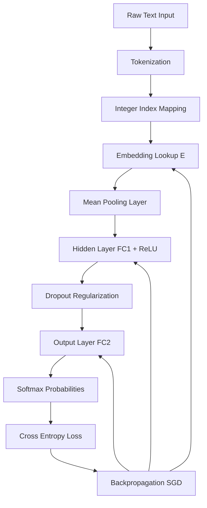
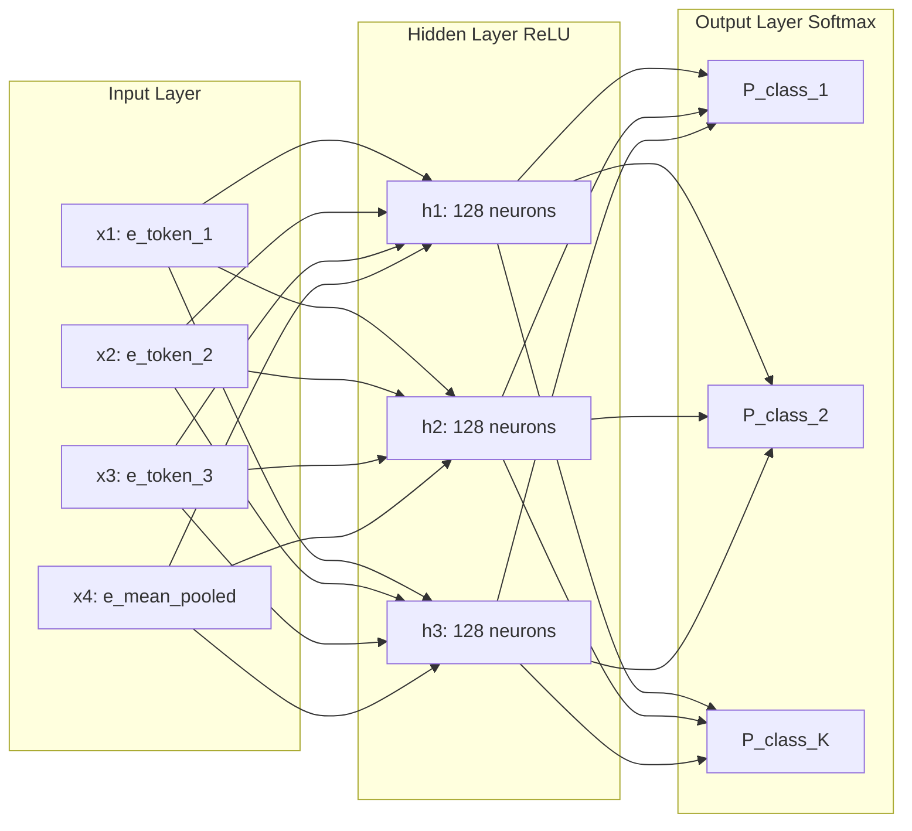
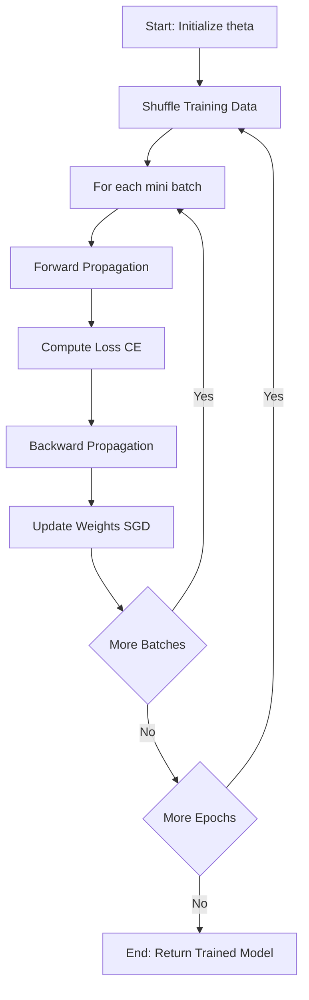
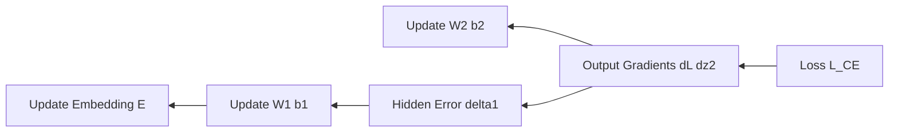

# Feedforward Neural Networks for Text Classification

<!-- SECTION_1_START -->
# Feedforward Neural Networks for Text Classification

## 1.1 Formal Academic Definition (KTU 2024 Syllabus Terminology)

A **Feedforward Neural Network (FFNN)** for text classification is a fully-connected, acyclic, layered neural architecture that maps a fixed-dimensional vector representation of a textual input $x \in \mathbb{R}^d$ to a probability distribution $P(y \mid x)$ over a predefined set of class labels $y \in \{1, 2, \dots, K\}$. In the context of **Module 3: Word Representations**, the input vector is constructed by aggregating pre-trained or jointly learned **dense word embeddings** (Word2Vec, GloVe, or learned Embedding layer weights), thereby transforming discrete symbolic text into a continuous vector space where semantic similarity is captured via geometric proximity.

> [!IMPORTANT]
> **KTU 2024 Definition Statement (Board-Ready):**
> A Feedforward Neural Network is a parameterized function $f_\theta : \mathbb{R}^d \rightarrow \mathbb{R}^K$ composed of an input layer (embedding aggregation), one or more fully-connected hidden layers with non-linear activation functions, and a softmax output layer, where $\theta$ denotes the learnable parameter set $\{W^{(l)}, b^{(l)}\}_{l=1}^{L+1}$ optimized via Stochastic Gradient Descent (SGD) to minimize a cross-entropy loss function.

## 1.2 Conceptual Analogy / Intuition

Imagine a **postal sorting facility** that handles millions of letters daily:

1. **Letters arrive** (raw text tokens like *"the"* or *"movie"*) → **barcodes are generated** (word embeddings, e.g., $e_{\text{the}} \in \mathbb{R}^{128}$).
2. **The postmaster averages all barcodes in a single envelope** (sentence/document representation via **mean-pooling** of embeddings).
3. **The envelope travels through sorting stations** (hidden layers $h^{(1)} \rightarrow h^{(2)} \rightarrow \dots$), where each station applies a learned decision rule (matrix multiplication $W^{(l)} h^{(l-1)} + b^{(l)}$) and a filtering step (**activation function**, e.g., ReLU).
4. **The final dispatch room** (softmax output layer) assigns the envelope to one of $K$ country bins, each with an associated probability.

> The network **learns** which barcode patterns and combinations of words tend to indicate a particular destination (class) — for example, *"refund", "broken", "useless"* → *Negative Sentiment*.

> [!NOTE]
> **Why "Feedforward"?** Information flows strictly in **one direction** — from the input layer through the hidden layers to the output layer — with **no cycles or feedback loops**. This contrasts with Recurrent Neural Networks (RNNs) which allow temporal recurrence.

## 1.3 Standard Constants and Hyperparameters

| Symbol | Quantity | Typical Value |
| :--- | :--- | :--- |
| $d$ | Embedding dimension | **50 – 300** |
| $V$ | Vocabulary size | **10,000 – 100,000+** |
| $L$ | Number of hidden layers | **1 – 3** |
| $n_l$ | Neurons per hidden layer | **64 – 512** |
| $K$ | Number of output classes | **2 – 10** (binary/multi-class) |
| $\eta$ | Learning rate | **1e-3 – 1e-2** |
| $\lambda$ | L2 regularization coefficient | **1e-5 – 1e-3** |
| $B$ | Mini-batch size | **16 – 128** |
| $\mathcal{D}$ | Training set size | **$\geq 10,000$ samples** |

> [!VISUALIZATION CONTROL]
> **Concept:** 2-Layer Feedforward Network Architecture for Binary Sentiment Classification
> **GeoGebra / Desmos Input Equations (Parametric Plot of Network Signal Propagation):**
> * `Layer 0 (Input):  h^{(0)} = x \in [-1, 1]^{300}` *(300-dim embedding)*
> * `Layer 1 (Hidden):  z^{(1)} = W^{(1)} h^{(0)} + b^{(1)};  h^{(1)} = \tanh(z^{(1)})` with  $W^{(1)} \in \mathbb{R}^{128 \times 300}$
> * `Layer 2 (Output):  z^{(2)} = W^{(2)} h^{(1)} + b^{(2)};  \hat{y} = \text{softmax}(z^{(2)})` with  $W^{(2)} \in \mathbb{R}^{2 \times 128}$
> **Visual Description:** A layered directed acyclic graph with the input layer (300 nodes) fully connected to hidden layer 1 (128 nodes), which is fully connected to output layer (2 nodes). Signal magnitudes are visualized as node color intensities (red = strongly negative activation, blue = strongly positive).

<!-- SECTION_1_END -->

<!-- SECTION_2_START -->
# Deep Theoretical Analysis & KTU High-Yield Formula Sheet

## 2.1 Operational Pipeline — Text to Prediction

The FFNN text classification pipeline is a deterministic, composable sequence of six stages. Each stage introduces a specific mathematical operator that transforms the data representation.

### Stage 1: Tokenization
Raw text string $s$ is segmented into a sequence of tokens $s = [t_1, t_2, \dots, t_N]$, where each $t_i \in \mathcal{V}$ (vocabulary).

### Stage 2: Index Conversion
Each token $t_i$ is mapped to a unique integer index $i \in \{1, 2, \dots, \vert \mathcal{V} \vert\}$ via a fixed lookup dictionary $\phi : \mathcal{V} \rightarrow \mathbb{Z}^{+}$.

### Stage 3: Embedding Lookup
The integer index $i$ is mapped to a dense vector $e_i \in \mathbb{R}^d$ via the **Embedding Matrix** $E \in \mathbb{R}^{\vert \mathcal{V} \vert \times d}$. This is mathematically a row-selection operation:

$$e_i = E[i, :]$$

### Stage 4: Aggregation (Mean-Pooling for Variable-Length Input)
Since sentences have variable length $N$, they must be reduced to a fixed-size vector $\bar{e} \in \mathbb{R}^d$:

$$\bar{e} = \frac{1}{N} \sum_{i=1}^{N} e_i = \frac{1}{N} \sum_{i=1}^{N} E[i, :]$$

> [!IMPORTANT]
> **Alternative Aggregations** (commonly tested in KTU):
> * **Sum Pooling:** $\bar{e} = \sum_{i} e_i$ (loses length information)
> * **Max Pooling:** $\bar{e}_k = \max_{i} e_{i,k}$ (captures salient features per dimension)
> * **Concat with Positional:** preserves order but loses length invariance

### Stage 5: Hidden Layer Transformation
For layer $l$ with weight matrix $W^{(l)} \in \mathbb{R}^{n_l \times n_{l-1}}$ and bias vector $b^{(l)} \in \mathbb{R}^{n_l}$:

$$z^{(l)} = W^{(l)} h^{(l-1)} + b^{(l)}$$

$$h^{(l)} = \sigma_l(z^{(l)})$$

where $\sigma_l$ is the activation function for layer $l$.

### Stage 6: Softmax Output (Multi-Class Classification)
$$\hat{y}_k = \text{softmax}(z^{(L+1)})_k = \frac{\exp(z^{(L+1)}_k)}{\sum_{j=1}^{K} \exp(z^{(L+1)}_j)}$$

## 2.2 Activation Functions — Critical Exam Topic

| Function | Mathematical Definition | Range | Derivative | Use Case |
| :--- | :--- | :--- | :--- | :--- |
| **Sigmoid** | $\sigma(z) = \frac{1}{1+e^{-z}}$ | $(0, 1)$ | $\sigma(z)(1 - \sigma(z))$ | Binary output |
| **Tanh** | $\tanh(z) = \frac{e^z - e^{-z}}{e^z + e^{-z}}$ | $(-1, 1)$ | $1 - \tanh^2(z)$ | Hidden layers (zero-centered) |
| **ReLU** | $\text{ReLU}(z) = \max(0, z)$ | $[0, \infty)$ | $\mathbb{1}[z > 0]$ | **Default hidden layer** |
| **Leaky ReLU** | $\max(\alpha z, z)$, $\alpha = 0.01$ | $(-\infty, \infty)$ | $\mathbb{1}[z>0] + \alpha \mathbb{1}[z \le 0]$ | Avoids dead neurons |
| **Softmax** | $\frac{e^{z_k}}{\sum_j e^{z_j}}$ | $(0, 1)$, $\sum = 1$ | $\hat{y}_k(\delta_{kj} - \hat{y}_j)$ | **Multi-class output** |

> [!WARNING]
> **Vanishing Gradient Problem (Frequently Tested):** Sigmoid and tanh saturate for large $\vert z \vert$, causing their gradients to approach zero. This stalls learning in deep networks. **ReLU is preferred** for hidden layers precisely because its gradient is exactly 1 for $z > 0$.

## 2.3 Loss Function — Categorical Cross-Entropy

For multi-class classification with one-hot ground truth $y \in \{0, 1\}^K$:

$$\mathcal{L}_{CE}(y, \hat{y}) = - \sum_{k=1}^{K} y_k \log(\hat{y}_k)$$

For a mini-batch of $B$ samples:

$$\mathcal{J}(\theta) = \frac{1}{B} \sum_{b=1}^{B} \mathcal{L}_{CE}(y^{(b)}, \hat{y}^{(b)}) + \lambda \sum_{l} \Vert W^{(l)} \Vert_F^2$$

> The second term is **L2 regularization** to prevent overfitting.

## 2.4 Backpropagation via Chain Rule

The gradient of the loss w.r.t. output logits is **elegantly simple** when using cross-entropy + softmax:

$$\frac{\partial \mathcal{L}_{CE}}{\partial z^{(L+1)}_k} = \hat{y}_k - y_k$$

This is the starting point of the backward pass. For hidden layers, applying the chain rule:

$$\frac{\partial \mathcal{L}_{CE}}{\partial W^{(l)}} = \delta^{(l)} (h^{(l-1)})^T$$

$$\frac{\partial \mathcal{L}_{CE}}{\partial b^{(l)}} = \delta^{(l)}$$

where the error term $\delta^{(l)}$ is computed recursively:

$$\delta^{(l)} = (W^{(l+1)})^T \delta^{(l+1)} \odot \sigma'_l(z^{(l)})$$

with $\odot$ denoting element-wise (Hadamard) product.

## 2.5 KTU Formula Sheet / Cheat Sheet

| # | Concept | Formula | Boundary/Note |
| :--- | :--- | :--- | :--- |
| 1 | Mean-pooled embedding | $\bar{e} = \frac{1}{N} \sum_{i=1}^{N} E[i,:]$ | $E \in \mathbb{R}^{\vert \mathcal{V} \vert \times d}$ |
| 2 | Linear transformation | $z^{(l)} = W^{(l)} h^{(l-1)} + b^{(l)}$ | $W^{(l)} \in \mathbb{R}^{n_l \times n_{l-1}}$ |
| 3 | ReLU activation | $h^{(l)} = \max(0, z^{(l)})$ | Zero for $z < 0$ |
| 4 | Softmax output | $\hat{y}_k = \frac{e^{z_k}}{\sum_j e^{z_j}}$ | $\sum_k \hat{y}_k = 1$ |
| 5 | Cross-entropy loss | $\mathcal{L} = - \sum_k y_k \log \hat{y}_k$ | $y$ is one-hot |
| 6 | Softmax + CE gradient | $\frac{\partial \mathcal{L}}{\partial z_k} = \hat{y}_k - y_k$ | Elegant identity |
| 7 | Weight update (SGD) | $W^{(l)} \leftarrow W^{(l)} - \eta \frac{\partial \mathcal{J}}{\partial W^{(l)}}$ | $\eta$ = learning rate |
| 8 | L2 regularization | $\mathcal{R} = \lambda \sum_l \Vert W^{(l)} \Vert_F^2$ | $\Vert \cdot \Vert_F$ = Frobenius norm |
| 9 | Xavier initialization | $W \sim \mathcal{N}(0, \sqrt{\frac{2}{n_{in} + n_{out}}})$ | Maintains variance |
| 10 | Dropout (training) | $h^{(l)}_{\text{mask}} = h^{(l)} \odot m, \; m_i \sim \text{Bernoulli}(1-p)$ | Inverted dropout at test time |

## 2.6 Real-World Engineering Utility

Feedforward networks for text classification are deployed in **production-scale NLP systems** including:

* **Email Spam Filters** (Gmail, Outlook) — binary classification of email body
* **Customer Support Ticket Routing** — multi-class routing to departments
* **Toxic Comment Detection** (Jigsaw / Google Perspective API) — multi-label classification
* **News Article Categorization** (Reuters-21578, AG News datasets)
* **Intent Classification** in conversational AI (Rasa, Dialogflow)
* **Sentiment Analysis** for brand monitoring (Hootsuite, Brandwatch)

They serve as a **strong baseline** before deploying more complex architectures (CNNs, RNNs, Transformers) and remain highly competitive on small-to-medium datasets with limited compute.

<!-- SECTION_2_END -->

<!-- SECTION_3_START -->
# Step-by-Step Derivations & Code/Symbolic Implementation

## 3.1 Manual Forward Propagation — Hand-Derived Example

**Problem Setup:** A 2-class sentiment classifier with embedding dimension $d = 4$, vocabulary size $V = 6$, and one hidden layer of size $n_1 = 3$.

**Input sentence:** *"great movie"* (tokenized: $\text{great} \rightarrow i_1 = 2$, $\text{movie} \rightarrow i_2 = 4$, $N = 2$)

**Embedding Matrix $E \in \mathbb{R}^{6 \times 4}$:**

$$E = \begin{bmatrix} 0.1 & 0.2 & 0.3 & 0.4 \\ 0.5 & 0.6 & 0.7 & 0.8 \\ 0.9 & 1.0 & 0.1 & 0.2 \\ 0.3 & 0.4 & 0.5 & 0.6 \\ 0.7 & 0.8 & 0.9 & 1.0 \\ 0.2 & 0.3 & 0.4 & 0.5 \end{bmatrix}$$

**Step 1: Embedding Lookup**

$$e_2 = E[2, :] = [0.9, 1.0, 0.1, 0.2]$$

$$e_4 = E[4, :] = [0.7, 0.8, 0.9, 1.0]$$

**Step 2: Mean-Pooling**

$$\bar{e} = \frac{1}{2}(e_2 + e_4) = \frac{1}{2}([0.9 + 0.7, \; 1.0 + 0.8, \; 0.1 + 0.9, \; 0.2 + 1.0])$$

$$\bar{e} = \frac{1}{2}[1.6, \; 1.8, \; 1.0, \; 1.2] = [0.8, \; 0.9, \; 0.5, \; 0.6]$$

**Step 3: Hidden Layer Linear Transformation**

Given $W^{(1)} \in \mathbb{R}^{3 \times 4}$ and $b^{(1)} \in \mathbb{R}^3$:

$$W^{(1)} = \begin{bmatrix} 0.1 & 0.2 & 0.3 & 0.4 \\ 0.5 & 0.6 & 0.7 & 0.8 \\ 0.9 & 1.0 & 0.1 & 0.2 \end{bmatrix}, \quad b^{(1)} = [0.1, \; 0.2, \; 0.3]^T$$

$$z^{(1)} = W^{(1)} \bar{e} + b^{(1)}$$

$$z^{(1)}_1 = (0.1)(0.8) + (0.2)(0.9) + (0.3)(0.5) + (0.4)(0.6) + 0.1$$
$$= 0.08 + 0.18 + 0.15 + 0.24 + 0.1 = 0.75$$

$$z^{(1)}_2 = (0.5)(0.8) + (0.6)(0.9) + (0.7)(0.5) + (0.8)(0.6) + 0.2$$
$$= 0.40 + 0.54 + 0.35 + 0.48 + 0.2 = 1.97$$

$$z^{(1)}_3 = (0.9)(0.8) + (1.0)(0.9) + (0.1)(0.5) + (0.2)(0.6) + 0.3$$
$$= 0.72 + 0.90 + 0.05 + 0.12 + 0.3 = 2.09$$

$$\therefore z^{(1)} = [0.75, \; 1.97, \; 2.09]^T$$

**Step 4: ReLU Activation**

$$h^{(1)} = \max(0, z^{(1)}) = [0.75, \; 1.97, \; 2.09]^T$$

(all positive, so unchanged)

**Step 5: Output Layer Linear Transformation**

Given $W^{(2)} \in \mathbb{R}^{2 \times 3}$ and $b^{(2)} \in \mathbb{R}^2$:

$$W^{(2)} = \begin{bmatrix} 0.1 & 0.2 & 0.3 \\ 0.4 & 0.5 & 0.6 \end{bmatrix}, \quad b^{(2)} = [0.1, \; 0.2]^T$$

$$z^{(2)}_1 = (0.1)(0.75) + (0.2)(1.97) + (0.3)(2.09) + 0.1$$
$$= 0.075 + 0.394 + 0.627 + 0.1 = 1.196$$

$$z^{(2)}_2 = (0.4)(0.75) + (0.5)(1.97) + (0.6)(2.09) + 0.2$$
$$= 0.300 + 0.985 + 1.254 + 0.2 = 2.739$$

$$\therefore z^{(2)} = [1.196, \; 2.739]^T$$

**Step 6: Softmax Output**

$$\hat{y}_1 = \frac{e^{1.196}}{e^{1.196} + e^{2.739}} = \frac{3.307}{3.307 + 15.480} = \frac{3.307}{18.787} \approx 0.1760$$

$$\hat{y}_2 = \frac{e^{2.739}}{e^{1.196} + e^{2.739}} = \frac{15.480}{18.787} \approx 0.8240$$

$$\hat{y} = [0.1760, \; 0.8240]^T$$

**Step 7: Cross-Entropy Loss (Assume ground truth $y = [0, 1]^T$ — positive sentiment)**

$$\mathcal{L}_{CE} = -[0 \cdot \log(0.1760) + 1 \cdot \log(0.8240)]$$

$$\mathcal{L}_{CE} = -\log(0.8240) = -(-0.1935) = 0.1935$$

## 3.2 Manual Backward Pass — Gradient Derivation

**Step 8: Output Layer Gradient (using elegant identity)**

$$\delta^{(2)} = \frac{\partial \mathcal{L}_{CE}}{\partial z^{(2)}} = \hat{y} - y = [0.1760 - 0, \; 0.8240 - 1]^T = [0.1760, \; -0.1760]^T$$

**Step 9: Output Layer Weight Gradient**

$$\frac{\partial \mathcal{L}_{CE}}{\partial W^{(2)}} = \delta^{(2)} (h^{(1)})^T = \begin{bmatrix} 0.1760 \\ -0.1760 \end{bmatrix} \begin{bmatrix} 0.75 & 1.97 & 2.09 \end{bmatrix}$$

$$= \begin{bmatrix} 0.1320 & 0.3467 & 0.3678 \\ -0.1320 & -0.3467 & -0.3678 \end{bmatrix}$$

**Step 10: Output Layer Bias Gradient**

$$\frac{\partial \mathcal{L}_{CE}}{\partial b^{(2)}} = \delta^{(2)} = [0.1760, \; -0.1760]^T$$

**Step 11: Hidden Layer Error Term (Backpropagated)**

Since ReLU derivative is $\mathbb{1}[z > 0]$ and all $z^{(1)} > 0$:

$$\sigma'_1(z^{(1)}) = [1, 1, 1]^T$$

$$\delta^{(1)} = (W^{(2)})^T \delta^{(2)} \odot \sigma'_1(z^{(1)})$$

$$(W^{(2)})^T = \begin{bmatrix} 0.1 & 0.4 \\ 0.2 & 0.5 \\ 0.3 & 0.6 \end{bmatrix}$$

$$(W^{(2)})^T \delta^{(2)} = \begin{bmatrix} (0.1)(0.1760) + (0.4)(-0.1760) \\ (0.2)(0.1760) + (0.5)(-0.1760) \\ (0.3)(0.1760) + (0.6)(-0.1760) \end{bmatrix} = \begin{bmatrix} 0.0176 - 0.0704 \\ 0.0352 - 0.0880 \\ 0.0528 - 0.1056 \end{bmatrix} = \begin{bmatrix} -0.0528 \\ -0.0528 \\ -0.0528 \end{bmatrix}$$

$$\delta^{(1)} = [-0.0528, \; -0.0528, \; -0.0528]^T$$

**Step 12: Hidden Layer Weight Gradient**

$$\frac{\partial \mathcal{L}_{CE}}{\partial W^{(1)}} = \delta^{(1)} (\bar{e})^T = \begin{bmatrix} -0.0528 \\ -0.0528 \\ -0.0528 \end{bmatrix} \begin{bmatrix} 0.8 & 0.9 & 0.5 & 0.6 \end{bmatrix}$$

$$= \begin{bmatrix} -0.0422 & -0.0475 & -0.0264 & -0.0317 \\ -0.0422 & -0.0475 & -0.0264 & -0.0317 \\ -0.0422 & -0.0475 & -0.0264 & -0.0317 \end{bmatrix}$$

**Step 13: Parameter Update (SGD with $\eta = 0.1$)**

$$W^{(2)}_{\text{new}} = W^{(2)} - \eta \cdot \frac{\partial \mathcal{L}}{\partial W^{(2)}} = \begin{bmatrix} 0.1 - 0.0132 & 0.2 - 0.0347 & 0.3 - 0.0368 \\ 0.4 + 0.0132 & 0.5 + 0.0347 & 0.6 + 0.0368 \end{bmatrix}$$

$$W^{(2)}_{\text{new}} = \begin{bmatrix} 0.0868 & 0.1653 & 0.2632 \\ 0.4132 & 0.5347 & 0.6368 \end{bmatrix}$$

## 3.3 Full Python Implementation (PyTorch + NumPy Fallback)

```python
import torch
import torch.nn as nn
import torch.nn.functional as F
import numpy as np
from typing import List, Tuple


class TextClassifierFFNN(nn.Module):
    """
    Feedforward Neural Network for Text Classification.
    Pipeline: Token IDs -> Embedding -> Mean Pooling -> Hidden (ReLU) -> Softmax
    
    Args:
        vocab_size: Size of vocabulary V
        embedding_dim: Dimension d of dense word vectors
        hidden_dim: Number of neurons in hidden layer
        num_classes: Number of output classes K
        padding_idx: Optional index reserved for padding tokens
        dropout_prob: Dropout probability for regularization
    """

    def __init__(
        self,
        vocab_size: int,
        embedding_dim: int,
        hidden_dim: int,
        num_classes: int,
        padding_idx: int = 0,
        dropout_prob: float = 0.3
    ) -> None:
        super(TextClassifierFFNN, self).__init__()

        # Validate hyperparameters
        if vocab_size <= 0:
            raise ValueError("vocab_size must be a positive integer")
        if embedding_dim <= 0 or hidden_dim <= 0 or num_classes <= 0:
            raise ValueError("Layer dimensions must be positive integers")

        # Layer 1: Embedding (lookup table E in R^{V x d})
        self.embedding = nn.Embedding(
            num_embeddings=vocab_size,
            embedding_dim=embedding_dim,
            padding_idx=padding_idx
        )

        # Layer 2: First fully-connected (hidden) layer
        self.fc1 = nn.Linear(in_features=embedding_dim, out_features=hidden_dim)

        # Layer 3: Dropout for regularization
        self.dropout = nn.Dropout(p=dropout_prob)

        # Layer 4: Output projection to K classes
        self.fc2 = nn.Linear(in_features=hidden_dim, out_features=num_classes)

        # Initialize weights using Xavier scheme
        nn.init.xavier_uniform_(self.fc1.weight)
        nn.init.xavier_uniform_(self.fc2.weight)
        nn.init.zeros_(self.fc1.bias)
        nn.init.zeros_(self.fc2.bias)

    def forward(self, token_ids: torch.Tensor) -> torch.Tensor:
        """
        Forward pass.
        
        Args:
            token_ids: LongTensor of shape (batch_size, sequence_length)
        
        Returns:
            logits: FloatTensor of shape (batch_size, num_classes)
        """
        # Step 1: Embedding lookup -> (B, N, d)
        embeddings = self.embedding(token_ids)

        # Step 2: Mean-pool over sequence length -> (B, d)
        # mask padding tokens (assumed index 0) so they don't skew the mean
        mask = (token_ids != self.embedding.padding_idx).float().unsqueeze(-1)
        masked_embeddings = embeddings * mask
        sum_embeddings = masked_embeddings.sum(dim=1)
        token_counts = mask.sum(dim=1).clamp(min=1.0)
        pooled = sum_embeddings / token_counts

        # Step 3: Hidden layer with ReLU -> (B, hidden_dim)
        h1 = F.relu(self.fc1(pooled))

        # Step 4: Dropout (training only)
        h1 = self.dropout(h1)

        # Step 5: Output logits (softmax applied externally with cross-entropy)
        logits = self.fc2(h1)
        return logits


def train_model(
    model: TextClassifierFFNN,
    train_data: List[Tuple[List[int], int]],
    num_epochs: int = 10,
    batch_size: int = 32,
    learning_rate: float = 1e-3,
    weight_decay: float = 1e-4
) -> List[float]:
    """
    Training loop for the FFNN text classifier.
    
    Args:
        model: Initialized TextClassifierFFNN
        train_data: List of (token_ids, label) pairs
        num_epochs: Number of training epochs
        batch_size: Mini-batch size B
        learning_rate: Optimizer learning rate eta
        weight_decay: L2 regularization coefficient lambda
    
    Returns:
        loss_history: Per-epoch average training loss
    """
    # Adam optimizer with L2 weight decay
    optimizer = torch.optim.Adam(
        params=model.parameters(),
        lr=learning_rate,
        weight_decay=weight_decay
    )
    loss_fn = nn.CrossEntropyLoss()
    loss_history: List[float] = []

    model.train()
    for epoch in range(num_epochs):
        epoch_loss = 0.0
        num_batches = 0

        # Shuffle data each epoch
        np.random.shuffle(train_data)

        for batch_start in range(0, len(train_data), batch_size):
            batch = train_data[batch_start: batch_start + batch_size]
            batch_tokens, batch_labels = zip(*batch)

            # Convert to tensors with padding
            max_len = max(len(seq) for seq in batch_tokens)
            token_tensor = torch.zeros(len(batch), max_len, dtype=torch.long)
            for i, seq in enumerate(batch_tokens):
                token_tensor[i, : len(seq)] = torch.tensor(seq, dtype=torch.long)
            label_tensor = torch.tensor(batch_labels, dtype=torch.long)

            # Forward pass
            optimizer.zero_grad()
            logits = model(token_tensor)
            loss = loss_fn(logits, label_tensor)

            # Backward pass
            loss.backward()
            optimizer.step()

            epoch_loss += loss.item()
            num_batches += 1

        avg_loss = epoch_loss / max(num_batches, 1)
        loss_history.append(avg_loss)
        print(f"Epoch {epoch + 1}/{num_epochs} - Loss: {avg_loss:.4f}")

    return loss_history


def predict(model: TextClassifierFFNN, token_ids: List[int]) -> Tuple[int, np.ndarray]:
    """
    Inference function returning predicted class and probability distribution.
    """
    model.eval()
    with torch.no_grad():
        token_tensor = torch.tensor([token_ids], dtype=torch.long)
        logits = model(token_tensor)
        probs = F.softmax(logits, dim=-1).squeeze().numpy()
        predicted_class = int(np.argmax(probs))
    return predicted_class, probs


# ============== NUMPY IMPLEMENTATION (FROM SCRATCH) ==============

class FFNNFromScratch:
    """
    Pure NumPy implementation of a 2-layer FFNN for text classification.
    Used for pedagogical clarity — no autograd, gradients are computed manually.
    """

    def __init__(self, vocab_size: int, embed_dim: int, hidden_dim: int, num_classes: int):
        self.E = np.random.randn(vocab_size, embed_dim) * 0.01
        self.W1 = np.random.randn(hidden_dim, embed_dim) * np.sqrt(2.0 / (hidden_dim + embed_dim))
        self.b1 = np.zeros((hidden_dim, 1))
        self.W2 = np.random.randn(num_classes, hidden_dim) * np.sqrt(2.0 / (num_classes + hidden_dim))
        self.b2 = np.zeros((num_classes, 1))

    def _embed_and_pool(self, token_ids: List[int]) -> np.ndarray:
        """Mean-pool embeddings of tokens."""
        vecs = self.E[token_ids]  # (N, d)
        return vecs.mean(axis=0).reshape(-1, 1)  # (d, 1)

    def forward(self, token_ids: List[int]):
        x = self._embed_and_pool(token_ids)             # (d, 1)
        z1 = self.W1 @ x + self.b1                       # (h, 1)
        h1 = np.maximum(0, z1)                           # ReLU
        z2 = self.W2 @ h1 + self.b2                      # (K, 1)
        exp_z2 = np.exp(z2 - z2.max())
        y_hat = exp_z2 / exp_z2.sum()
        cache = (x, z1, h1, z2, y_hat)
        return y_hat, cache

    def backward(self, cache, y_true: int, lr: float = 0.01):
        x, z1, h1, z2, y_hat = cache
        K = y_hat.shape[0]
        y_onehot = np.zeros((K, 1))
        y_onehot[y_true] = 1.0
        dL_dz2 = y_hat - y_onehot
        dL_dW2 = dL_dz2 @ h1.T
        dL_db2 = dL_dz2
        dL_dh1 = self.W2.T @ dL_dz2
        dL_dz1 = dL_dh1 * (z1 > 0)
        dL_dW1 = dL_dz1 @ x.T
        dL_db1 = dL_dz1

        self.W2 -= lr * dL_dW2
        self.b2 -= lr * dL_db2
        self.W1 -= lr * dL_dW1
        self.b1 -= lr * dL_db1
```

## 3.4 Numerical Sanity Check (NumPy Scratch Model)

```python
# Toy example: classify ["great", "movie"] -> label 1 (positive)
model = FFNNFromScratch(vocab_size=10, embed_dim=4, hidden_dim=5, num_classes=2)
token_ids = [2, 4]   # indices for "great" and "movie"

# Initial forward pass
probs, cache = model.forward(token_ids)
loss = -np.log(probs[1, 0] + 1e-9)
print(f"Initial probs: {probs.ravel()}, Loss: {loss:.4f}")

# Perform 1000 SGD updates
for step in range(1000):
    probs, cache = model.forward(token_ids)
    model.backward(cache, y_true=1, lr=0.1)
final_probs, _ = model.forward(token_ids)
final_loss = -np.log(final_probs[1, 0] + 1e-9)
print(f"Final probs: {final_probs.ravel()}, Loss: {final_loss:.4f}")
# Expected: probs[1] close to 1.0, loss close to 0
```

<!-- SECTION_3_END -->

<!-- SECTION_4_START -->
# Structural Diagrams & Schematics

## 4.1 Mermaid Diagram — End-to-End Text Classification Pipeline



## 4.2 Mermaid Diagram — Network Architecture Topology



## 4.3 Mermaid Diagram — Training Loop Sequence



## 4.4 Mermaid Diagram — Backward Pass Information Flow



## 4.5 Block-Level Functional Architecture Matrix

| Module | Input | Operation | Output | Trainable Parameters |
| :--- | :--- | :--- | :--- | :--- |
| **Tokenizer** | Raw string | Regex / whitespace split | Token list | None |
| **Vocab Mapper** | Token list | Dict lookup | Integer IDs | None |
| **Embedding** | Integer IDs | Row lookup from $E$ | Dense vectors | $V \times d$ |
| **Pooler** | $(B, N, d)$ tensor | Mean over $N$ | $(B, d)$ tensor | None |
| **FC1** | $(B, d)$ | $W^{(1)} x + b^{(1)}$ | $(B, h)$ | $d \cdot h + h$ |
| **Activation** | $(B, h)$ | $\max(0, \cdot)$ | $(B, h)$ | None |
| **Dropout** | $(B, h)$ | Bernoulli mask | $(B, h)$ | None |
| **FC2** | $(B, h)$ | $W^{(2)} x + b^{(2)}$ | $(B, K)$ | $h \cdot K + K$ |
| **Softmax + CE** | $(B, K)$, labels | $-\sum y \log \hat{y}$ | Scalar loss | None |

<!-- SECTION_4_END -->

<!-- SECTION_5_START -->
# KTU 2024 Scheme Examination Question Bank & Topic Recap

## Part A Questions (3 Marks Each)

### Question 1 [KTU University Exam - July 2024] | CO2 | Remember

**Q: Define the term "word embedding" in the context of a Feedforward Neural Network used for text classification. Why are dense embeddings preferred over one-hot representations?**

**Model Answer (3 Marks):**

* **Definition (1.5 Marks):** A **word embedding** is a dense, low-dimensional, learned vector representation $e_w \in \mathbb{R}^d$ of a word $w$, where $d \ll \vert \mathcal{V} \vert$ (typically $d = 50$ to $300$).
* **Advantages over one-hot (1.5 Marks):**
  1. **Dimensionality reduction:** One-hot vectors are $\mathbb{R}^{\vert \mathcal{V} \vert}$ (sparse, high-dim); embeddings are $\mathbb{R}^d$ (dense, low-dim), reducing memory and computation.
  2. **Semantic similarity:** Cosine similarity $cos(e_{w_1}, e_{w_2})$ captures semantic relatedness, which one-hot cannot ($cos = 0$ for all distinct words).
  3. **Learned features:** Embedding matrix $E$ is updated via backpropagation, allowing task-specific representation learning.

---

### Question 2 [KTU University Exam - Dec 2023] | CO2 | Understand

**Q: Explain why the softmax function is used in the output layer of a text classification FFNN. Provide its mathematical definition for a $K$-class problem.**

**Model Answer (3 Marks):**

* **Why softmax (1.5 Marks):** The softmax function converts raw real-valued logits $z \in \mathbb{R}^K$ into a **valid probability distribution** over $K$ classes: all outputs are in $(0, 1)$ and sum to 1. This is essential for multi-class classification as it enables direct probabilistic interpretation and is compatible with the cross-entropy loss.
* **Mathematical definition (1.5 Marks):** For input logits $z = [z_1, z_2, \dots, z_K]$:
$$\hat{y}_k = \text{softmax}(z)_k = \frac{\exp(z_k)}{\sum_{j=1}^{K} \exp(z_j)}$$

---

## Part B Questions (14 Marks Each — Internal Choice)

### Question A [KTU University Exam - July 2024] | CO2, CO3 | Apply + Analyze

**A customer review classification system uses a Feedforward Neural Network with the following configuration:**

* Vocabulary size $V = 5000$, embedding dimension $d = 100$, hidden layer size $h = 64$, output classes $K = 3$ (Positive, Neutral, Negative).
* A single review *"amazing service highly recommend"* is tokenized into 4 tokens with indices $[12, 87, 305, 1450]$.
* Embedding matrix $E$ is pre-trained; mean-pooling is used for aggregation; ReLU activation; Softmax output.

**(a)** Compute the **total number of trainable parameters** in this network. Show the breakdown for each layer. **(7 Marks)**

**(b)** Demonstrate the **forward pass** symbolically and explain how the **cross-entropy loss** is computed. State one advantage of cross-entropy over mean-squared-error (MSE) for classification. **(7 Marks)**

---

### Model Solution A(a) — Parameter Count (7 Marks)

**Step 1: Embedding Layer** [Valuation: 2 Marks]

$$P_{\text{embed}} = V \times d = 5000 \times 100 = 500{,}000 \text{ parameters}$$

**Step 2: First Fully-Connected Layer (FC1)** [Valuation: 2 Marks]

$$P_{\text{FC1}} = (d \times h) + h = (100 \times 64) + 64 = 6400 + 64 = 6464 \text{ parameters}$$

**Step 3: Output Layer (FC2)** [Valuation: 2 Marks]

$$P_{\text{FC2}} = (h \times K) + K = (64 \times 3) + 3 = 192 + 3 = 195 \text{ parameters}$$

**Step 4: Total** [Valuation: 1 Mark]

$$P_{\text{total}} = 500{,}000 + 6464 + 195 = \mathbf{506{,}659 \text{ parameters}}$$

> **Key observation:** The embedding layer dominates parameter count ($\approx 98.7\%$). For small datasets, freezing pre-trained embeddings or using a smaller $V$ is critical.

---

### Model Solution A(b) — Forward Pass and Loss (7 Marks)

**Step 1: Embedding Lookup** [Valuation: 1.5 Marks]

$$e_{12}, e_{87}, e_{305}, e_{1450} \in \mathbb{R}^{100}$$

These are obtained by row-selection from $E$.

**Step 2: Mean-Pooling** [Valuation: 1.5 Marks]

$$\bar{e} = \frac{1}{4}\left(E[12,:] + E[87,:] + E[305,:] + E[1450,:]\right) \in \mathbb{R}^{100}$$

**Step 3: Hidden Layer** [Valuation: 1 Mark]

$$z^{(1)} = W^{(1)} \bar{e} + b^{(1)} \in \mathbb{R}^{64}$$

$$h^{(1)} = \text{ReLU}(z^{(1)}) = \max(0, z^{(1)})$$

**Step 4: Output Layer + Softmax** [Valuation: 1 Mark]

$$z^{(2)} = W^{(2)} h^{(1)} + b^{(2)} \in \mathbb{R}^{3}$$

$$\hat{y}_k = \frac{\exp(z^{(2)}_k)}{\sum_{j=1}^{3} \exp(z^{(2)}_j)}, \quad k = 1, 2, 3$$

**Step 5: Cross-Entropy Loss** [Valuation: 1.5 Marks]

For ground truth $y \in \{0,1\}^3$ (one-hot):

$$\mathcal{L}_{CE} = - \sum_{k=1}^{3} y_k \log(\hat{y}_k)$$

**Step 6: Advantage over MSE** [Valuation: 0.5 Mark]

Cross-entropy produces **stronger gradients** when predictions are incorrect (logarithmic penalty), enabling faster convergence. MSE with sigmoid outputs suffers from vanishing gradients due to $\sigma'$ saturation. The elegant gradient $\hat{y} - y$ under CE+Softmax avoids this issue.

---

### Question B [KTU University Exam - Dec 2023] | CO2, CO3 | Apply + Analyze

**(a)** Explain the **backpropagation algorithm** for a 2-layer FFNN used in text classification. Derive the gradient of the cross-entropy loss with respect to the output layer weights $W^{(2)}$. **(7 Marks)**

**(b)** Discuss the **vanishing gradient problem** in deep FFNNs for text classification. List and briefly explain **three techniques** commonly used to mitigate it. **(7 Marks)**

---

### Model Solution B(a) — Backpropagation Derivation (7 Marks)

**Step 1: Setup** [Valuation: 1 Mark]

Consider a 2-layer network: $h^{(1)} = \sigma(W^{(1)} x + b^{(1)})$ and $\hat{y} = \text{softmax}(W^{(2)} h^{(1)} + b^{(2)})$ with loss $\mathcal{L}_{CE}$.

**Step 2: Gradient w.r.t. Logits (Elegant Identity)** [Valuation: 2 Marks]

Using the chain rule on $\mathcal{L} = -\sum_k y_k \log \hat{y}_k$ and $\hat{y}_k = \frac{e^{z_k}}{\sum_j e^{z_j}}$ where $z = W^{(2)} h^{(1)} + b^{(2)}$:

$$\frac{\partial \mathcal{L}_{CE}}{\partial z_k} = \hat{y}_k - y_k$$

**Step 3: Gradient w.r.t. $W^{(2)}$** [Valuation: 2 Marks]

Applying the chain rule:

$$\frac{\partial \mathcal{L}_{CE}}{\partial W^{(2)}} = \frac{\partial \mathcal{L}_{CE}}{\partial z} \cdot \frac{\partial z}{\partial W^{(2)}} = (\hat{y} - y)(h^{(1)})^T$$

In explicit matrix form:

$$\frac{\partial \mathcal{L}_{CE}}{\partial W^{(2)}} = \begin{bmatrix} \hat{y}_1 - y_1 \\ \hat{y}_2 - y_2 \\ \vdots \\ \hat{y}_K - y_K \end{bmatrix} \begin{bmatrix} h^{(1)}_1 & h^{(1)}_2 & \cdots & h^{(1)}_h \end{bmatrix}$$

**Step 4: Update Rule** [Valuation: 2 Marks]

$$W^{(2)}_{\text{new}} = W^{(2)} - \eta \frac{\partial \mathcal{L}_{CE}}{\partial W^{(2)}}$$

where $\eta$ is the learning rate. The same procedure recursively propagates errors backward to update $W^{(1)}$ and $E$.

---

### Model Solution B(b) — Vanishing Gradient & Mitigation (7 Marks)

**Step 1: Problem Statement** [Valuation: 2 Marks]

In deep FFNNs, gradients are computed via the chain rule: $\delta^{(l)} = (W^{(l+1)})^T \delta^{(l+1)} \odot \sigma'(z^{(l)})$. If $\sigma$ is sigmoid or tanh, $\vert \sigma'(z) \vert \le 0.25$ or $\le 1$ (for tanh) respectively. Multiplying many such small values across $L$ layers causes $\Vert \delta^{(1)} \Vert \rightarrow 0$, stalling learning in early layers. Embedding layers (deep in the computational graph) suffer most.

**Step 2: Technique 1 — ReLU Activation** [Valuation: 1.5 Marks]

ReLU has derivative $\sigma'(z) = 1$ for $z > 0$, preventing multiplicative decay. It is the **default choice** for hidden layers in modern FFNNs.

**Step 3: Technique 2 — Proper Weight Initialization (Xavier/He)** [Valuation: 1.5 Marks]

Xavier initialization sets $W \sim \mathcal{N}\left(0, \sqrt{\frac{2}{n_{in} + n_{out}}}\right)$, maintaining signal variance across layers. He initialization (for ReLU) uses $\sqrt{\frac{2}{n_{in}}}$. This prevents activations from collapsing to zero or exploding.

**Step 4: Technique 3 — Batch Normalization** [Valuation: 2 Marks]

Batch Normalization normalizes pre-activations within each mini-batch:

$$\hat{z}^{(l)} = \frac{z^{(l)} - \mu_B}{\sqrt{\sigma_B^2 + \epsilon}}, \quad h^{(l)} = \gamma \hat{z}^{(l)} + \beta$$

This stabilizes the input distribution to each layer, allowing higher learning rates and reducing sensitivity to initialization. *Other valid techniques: residual connections, gradient clipping, learning rate warmup, layer normalization.*

---

> [!WARNING]
> **KTU Examiner's Valuation Warning / Common Pitfalls:**
> 1. **Do NOT confuse parameter counts:** Embedding layer parameters = $V \times d$, NOT $V + d$. Weight matrix parameters = $(n_{in} \times n_{out}) + n_{out}$ (weights + biases).
> 2. **Do NOT skip the mean-pooling step:** Many students forget that variable-length text must be aggregated; feeding $N$ variable embeddings into an FC layer is impossible.
> 3. **Do NOT write $\hat{y}$ instead of $\hat{y}_k$ in cross-entropy:** The summation index $k$ must be explicit: $\mathcal{L} = -\sum_k y_k \log \hat{y}_k$.
> 4. **Do NOT apply softmax then write MSE:** Always pair softmax with cross-entropy to leverage the elegant gradient identity $\hat{y} - y$.
> 5. **Forgetting to add bias terms:** Many students count only $W$ and forget $b$ in parameter computations — losing **1 mark** consistently.
> 6. **Confusing vanishing with exploding gradient:** Vanishing = gradients $\rightarrow 0$ (deep sigmoid/tanh); Exploding = gradients $\rightarrow \infty$ (deep unnormalized networks).

---

## Topic Recap & Important Things to Remember

> [!NOTE]
> **Rapid Revision Checklist — Module 3: Feedforward Neural Networks for Text Classification**

### Core Concepts
- **FFNN** = acyclic, fully-connected layered network; information flows strictly input → hidden → output.
- **Text → Vector Pipeline:** Tokenize → Integer ID → Embedding lookup → Aggregation (mean/max/sum) → FC layers → Softmax.
- **Word Embeddings** ($E \in \mathbb{R}^{V \times d}$) are the bridge between discrete text and continuous vector space.

### Critical Formulas (Must Memorize)
- **Mean-pooling:** $\bar{e} = \frac{1}{N}\sum_{i=1}^{N} E[i,:]$
- **Linear transform:** $z^{(l)} = W^{(l)} h^{(l-1)} + b^{(l)}$
- **ReLU:** $\max(0, z)$ — derivative is $\mathbb{1}[z > 0]$
- **Softmax:** $\hat{y}_k = \exp(z_k) / \sum_j \exp(z_j)$
- **Cross-entropy:** $\mathcal{L} = -\sum_k y_k \log \hat{y}_k$
- **Elegant gradient:** $\partial \mathcal{L} / \partial z_k = \hat{y}_k - y_k$
- **Weight update:** $W \leftarrow W - \eta \cdot \partial \mathcal{L} / \partial W$

### Key Architectural Details
- **Hidden layer activation:** ReLU (preferred) over sigmoid/tanh (vanishing gradient).
- **Output activation:** Softmax for multi-class; Sigmoid for binary.
- **Parameter count:** Embedding dominates ($V \times d$); FC layers are smaller.
- **Variable-length handling:** Mean/max pooling makes input size-invariant.

### Loss & Optimization
- **Loss:** Categorical cross-entropy (NOT MSE for classification).
- **Optimizers:** SGD with momentum, Adam, RMSProp.
- **Regularization:** Dropout ($p = 0.3 - 0.5$), L2 weight decay ($\lambda = 1e-4$).
- **Initialization:** Xavier (sigmoid/tanh) or He (ReLU).

### Vanishing Gradient Mitigations
- ReLU / Leaky ReLU activations
- Xavier / He initialization
- Batch Normalization
- Residual connections
- Gradient clipping

### Real-World Significance
- FFNNs are the **strong baseline** for text classification before CNNs/RNNs/Transformers.
- Used in production for spam filtering, sentiment analysis, intent classification, topic categorization.
- Bag-of-Embeddings (BoE) representation loses word order — a known limitation addressed by CNNs/RNNs.

### Common Confusions to Avoid
- **One-hot vs Embedding:** One-hot = sparse, fixed, no semantic info. Embedding = dense, learned, captures similarity.
- **Bag-of-Words vs Bag-of-Embeddings:** BoW uses counts; BoE uses mean of dense vectors (typically better).
- **Softmax vs Sigmoid:** Softmax = multi-class (probabilities sum to 1). Sigmoid = binary or multi-label (independent probabilities).
- **Backprop = reverse-mode autodiff**, not a separate algorithm. It IS gradient computation via chain rule, applied right-to-left.

<!-- SECTION_5_END -->
