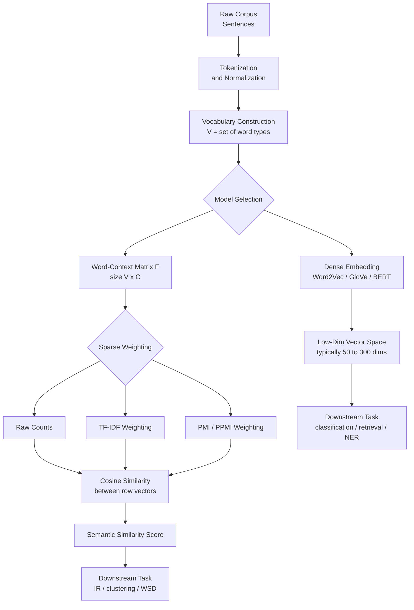
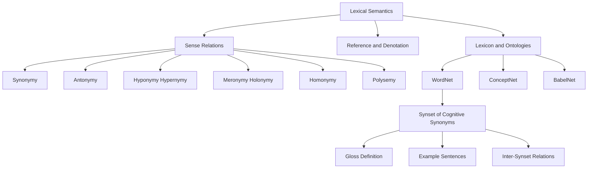
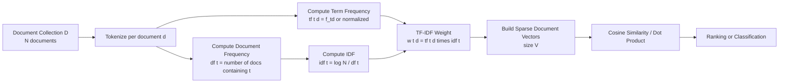
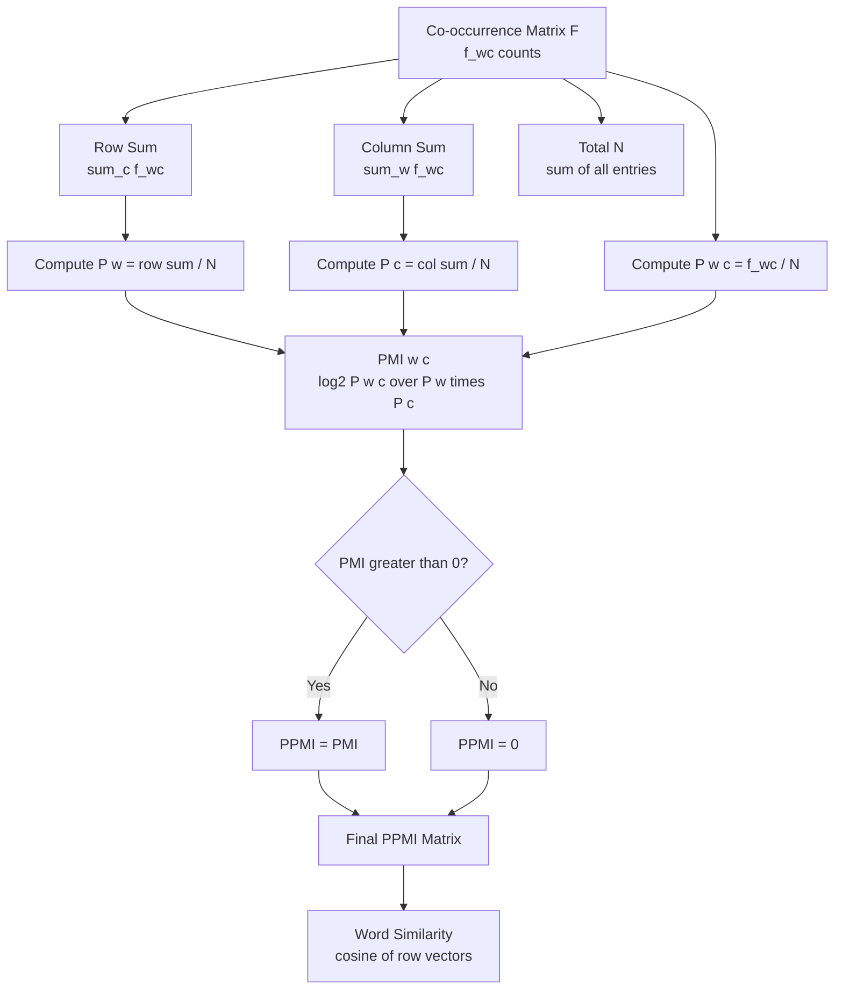

# Lexical Semantics, Vector Semantics, TF-IDF, Pointwise Mutual Information (PMI)

<!-- SECTION_1_START -->

# 1. Core Technical Definition & Intuitive Overview

## 1.1 Lexical Semantics

**Lexical Semantics** is the branch of linguistics and natural language processing concerned with the systematic study of word meaning, the internal structure of words, and the semantic relationships that hold between words, phrases, and lexical units in a language.

> [!IMPORTANT]
> **KTU 2024 Syllabus Definition (PECST862 — Module 3):**
> *Lexical Semantics deals with the computational representation of word meaning, the lexicon (mental dictionary), and the paradigmatic/syntagmatic relations that bind words into a structured semantic system. In NLP, lexical semantics is operationalized through lexicons, thesauri, ontologies, and distributional vector models.*

The three foundational pillars of lexical semantics are:

1. **Sense (denotation/connotation)** — A discrete, enumerable meaning of a word in a particular context.
2. **Reference** — The relationship between a linguistic expression and the real-world entity it picks out.
3. **Lexical Relations** — Systematic links such as synonymy, antonymy, hyponymy, and meronymy.

### 1.1.1 Sense Relations Taxonomy

| Relation | Definition | Example |
|---|---|---|
| **Synonymy** | Words with nearly identical meaning | *big ≈ large* |
| **Antonymy** | Words with opposite meaning | *hot ↔ cold* |
| **Hyponymy / Hypernymy** | Class-inclusion (is-a) | *puppy* is a hyponym of *dog*; *dog* is a hypernym of *puppy* |
| **Meronymy / Holonymy** | Part-whole relation | *wheel* is a meronym of *car* |
| **Homonymy** | Identical spelling/sound, different meaning | *bank* (river) vs *bank* (finance) |
| **Polysemy** | One word, multiple related senses | *head* (of body, of department) |
| **Metonymy** | Substitution of one entity by a related one | *The White House announced...* |

### 1.1.2 WordNet — A Computational Lexical Resource

**WordNet** is a large, hand-built lexical database of English (developed at Princeton, 1995) that groups words into sets of cognitive synonyms called **synsets**, each representing a distinct lexical concept. Synsets are interlinked via conceptual-semantic and lexical relations.

> [!NOTE]
> **WordNet Statistics (current release):**
> - **Nouns:** ~117,000 synsets
> - **Verbs:** ~11,500 synsets
> - **Adjectives & Adverbs:** ~22,000 synsets
> - **Total word-sense pairs:** ~207,000

### 1.1.3 Conceptual Analogy — Lexical Semantics

Think of a language as a **vast railway network**:

- Each **word** is a *station*.
- Each **sense** of a word is a *platform* at that station (a poly-semantic word has many platforms).
- **Synonymy** is having two stations side by side on the same line (*big* and *large*).
- **Hyponymy** is the branch-line structure: *animal* station is the trunk line; *dog*, *cat*, *horse* are the branch stations.
- **Antonymy** is a station and its "twin" on the opposite end of a return ticket.
- **WordNet** is the official railway map that records all these connections.

---

## 1.2 Vector Semantics

**Vector Semantics** is the NLP paradigm that represents the meaning of a word (or document) as a **point in a high-dimensional vector space**, such that geometric proximity (dot product, cosine similarity, Euclidean distance) corresponds to semantic similarity.

> [!IMPORTANT]
> **Distributional Hypothesis (Firth, 1957; Harris, 1954):**
> *"You shall know a word by the company it keeps."*
> Words that occur in similar contexts tend to have similar meanings. Therefore, the meaning of a word can be induced from the distribution of its neighbouring words.

### 1.2.1 Conceptual Analogy — Vector Semantics

Imagine every word as a **cereal box on a giant warehouse shelf** labelled with a barcode (the vector). The barcode is generated automatically by looking at what other cereal boxes were bought together with it. Two boxes bought together by the same kinds of shoppers get **similar barcodes** even if their front labels are different. That is exactly how vector semantics works: words that appear in similar textual contexts receive similar numerical vectors.

### 1.2.2 Standard Metric Vocabulary

| Term | Symbol | Interpretation |
|---|---|---|
| **Vocabulary** | $V$ | Set of all unique word types in the corpus |
| **Word Vector / Embedding** | $\vec{w} \in \mathbb{R}^{d}$ | A $d$-dimensional numerical representation |
| **Cosine Similarity** | $\cos(\vec{u}, \vec{v})$ | Measures the *angle* (semantic closeness) between two vectors |
| **Cosine Distance** | $1 - \cos(\vec{u}, \vec{v})$ | Dissimilarity measure |

> [!VISUALIZATION CONTROL]
> **Concept:** Word-Vector Space where semantically similar words cluster together
> **GeoGebra / Desmos Input:**
> * Place anchor vectors: `vec(king) = (3, 4)`, `vec(queen) = (3, 3.8)`, `vec(man) = (2.2, 2)`, `vec(woman) = (2.2, 1.8)`
> * Plot dissimilar: `vec(banana) = (0.1, 0.1)`, `vec(car) = (0.2, 0.0)`
> **Visual Description:** On a 2D plane, the four royal/gender words form a tight cluster in the upper-right quadrant, while unrelated words like *banana* and *car* hug the origin. Students should observe that the *king → queen* displacement vector is approximately parallel to the *man → woman* displacement vector (the famous analogy: $\vec{king} - \vec{man} + \vec{woman} \approx \vec{queen}$).

### 1.2.3 Why Vectors Matter in Engineering

- **Search engines** rank documents by cosine similarity between query and document vectors.
- **Recommender systems** find items whose vectors are close to a user-preference vector.
- **Spam filters** use vector-based classifiers.
- **Machine translation** aligns language pairs in shared vector spaces.
- **Chatbots and LLMs** operate on dense vector representations end-to-end.

---

## 1.3 Term Frequency — Inverse Document Frequency (TF-IDF)

**TF-IDF** is a classical *sparse* vector-semantic model (Salton, 1973) used in information retrieval and text mining to weight the importance of a word in a document relative to a corpus.

- **TF (Term Frequency)** — *How often does the word appear in this document?*
- **IDF (Inverse Document Frequency)** — *How rare is the word across the entire corpus?*
- **TF-IDF** — *A high value means: the word is frequent in this document but rare overall → highly discriminative.*

### 1.3.1 Conceptual Analogy — TF-IDF

Think of TF-IDF as a **detective scoring system**:

- A witness (a word) that testifies many times in the *same* case (high TF) is significant for that case.
- But if the same witness also testifies in *every other case* in the city (low IDF, i.e. the word is *common* like *"the"* or *"is"*), their testimony is less discriminative.
- The detective (the search engine) only trusts witnesses who are **both frequent in the specific case AND rare across all other cases** (high TF-IDF).

---

## 1.4 Pointwise Mutual Information (PMI)

**Pointwise Mutual Information (PMI)** is an information-theoretic measure (Fano, 1961; Church & Hanks, 1990 in NLP) that quantifies the statistical association between two events (commonly a target word and a context word) by comparing their **joint probability** to the product of their **marginal probabilities**.

> [!IMPORTANT]
> **PMI Interpretation:**
> - $\text{PMI} > 0$ — the two words co-occur *more often* than chance → strong association.
> - $\text{PMI} \approx 0$ — the words are statistically independent.
> - $\text{PMI} < 0$ — the words co-occur *less often* than chance → rarely seen together.

### 1.4.1 Conceptual Analogy — PMI

Imagine two friends, *Alice* and *Bob*. They are seen together at the park (joint event). The probability of seeing Alice at the park alone is high, and the probability of seeing Bob alone is also high. If they are nevertheless always seen *together*, that's a strong friendship signal — high PMI. If seeing Alice is rare, and Bob is also rare, and they always come together, the *surprise* of their joint appearance is astronomical — very high PMI. If Alice and Bob show up together about as often as chance would predict, their PMI is near zero — they are statistical strangers.

---

## 1.5 Why This Topic Is High-Yield in KTU Exams

> [!IMPORTANT]
> The board examination repeatedly tests the **computational definitions** of TF, IDF, TF-IDF, and PMI, as well as the **construction of word-context matrices** and the **interpretation of weighted values**. Memorize the formulas, practice numerical examples, and understand *why* each transformation is needed (e.g., why we apply $\log$ to IDF).

<!-- SECTION_1_END -->

<!-- SECTION_2_START -->

# 2. Deep Theoretical Analysis & KTU High-Yield Formula Sheet

## 2.1 Word-Context Co-occurrence Matrix

The starting point of most vector-semantic models is the **word–context matrix** $F$ (also called a **term–context matrix** or **co-occurrence matrix**), of size $\vert V \vert \times \vert C \vert$, where $V$ is the target word vocabulary and $C$ is the context vocabulary.

**Construction Procedure (operational steps):**

1. **Tokenize** the corpus into words.
2. **Define a context** — usually a sliding window of size $\pm n$ around the target word (e.g., $n = 2$).
3. **Count** how many times each target word $w$ appears with each context word $c$. Store as $f_{w,c}$.
4. The row vector $\vec{w}$ of $F$ (i.e., the row corresponding to word $w$) is the **raw word embedding** of $w$.
5. The column vector $\vec{c}$ (i.e., the column corresponding to context $c$) is the **raw context embedding** of $c$.

> [!NOTE]
> **Two principal families of vector-semantic models:**
> - **Sparse, count-based:** TF-IDF, PMI, PPMI weighting on $F$ → produces sparse vectors.
> - **Dense, predictive:** Word2Vec (Skip-gram, CBOW), GloVe, FastText, BERT → produces dense low-dimensional vectors.

## 2.2 Term Frequency (TF) — Variants

The simplest intuition: $\text{tf}(t, d) = $ count of term $t$ in document $d$. But there are common refinements:

1. **Raw count:**
   $$\text{tf}_{\text{raw}}(t, d) = f_{t,d}$$
2. **Boolean (presence/absence):**
   $$\text{tf}_{\text{bool}}(t, d) = \begin{cases} 1 & \text{if } t \in d \\ 0 & \text{otherwise} \end{cases}$$
3. **Length-normalized (relative frequency):**
   $$\text{tf}_{\text{norm}}(t, d) = \frac{f_{t,d}}{\sum_{t' \in d} f_{t',d}} = \frac{f_{t,d}}{\vert d \vert}$$
4. **Log-normalized (sub-linear):**
   $$\text{tf}_{\log}(t, d) = \begin{cases} 1 + \log_{10}(f_{t,d}) & \text{if } f_{t,d} > 0 \\ 0 & \text{otherwise} \end{cases}$$
5. **Augmented (prevents bias against short documents):**
   $$\text{tf}_{\text{aug}}(t, d) = 0.5 + \frac{0.5 \cdot f_{t,d}}{\max_{t' \in d} f_{t',d}}$$

## 2.3 Inverse Document Frequency (IDF)

**Idea:** A word that appears in *every* document is useless for distinguishing documents. We want to *demote* such words.

- Let $N$ = total number of documents in the corpus $D$.
- Let $\text{df}(t)$ = number of documents containing term $t$ (document frequency).

**Standard IDF (with log):**
$$\text{idf}(t) = \log_{10}\left(\frac{N}{\text{df}(t)}\right)$$

**Smoothed IDF (Laplace / sklearn-style, to avoid division by zero):**
$$\text{idf}_{\text{smooth}}(t) = \log_{10}\left(\frac{1 + N}{1 + \text{df}(t)}\right) + 1$$

## 2.4 TF-IDF — Full Formula

$$\text{tfidf}(t, d) = \text{tf}(t, d) \cdot \text{idf}(t)$$

> [!NOTE]
> **Common KTU pitfall:** Forgetting the $\log$ in IDF. If the question states "compute TF-IDF" *without* specifying the variant, the standard expected form is:
> $$\text{tfidf}(t, d) = f_{t,d} \cdot \log\left(\frac{N}{\text{df}(t)}\right)$$
> The logarithm base is usually base-10 or $e$ — read carefully.

## 2.5 Pointwise Mutual Information (PMI) — Formal Derivation

For two discrete random variables $W$ (target word) and $C$ (context word), let:

- $P(w)$ — probability of word $w$ in the corpus.
- $P(c)$ — probability of context word $c$.
- $P(w, c)$ — joint probability of $w$ and $c$ co-occurring.

The **mutual information** between $W$ and $C$ is:

$$I(W; C) = \sum_{w \in V}\sum_{c \in C} P(w, c) \log_2 \frac{P(w, c)}{P(w)\,P(c)}$$

The **pointwise** version isolates one specific pair $(w, c)$:

$$\text{PMI}(w, c) = \log_2 \frac{P(w, c)}{P(w)\,P(c)}$$

**Estimating the probabilities from counts:**

- Total number of observations (e.g., word-context pairs): $N = \sum_{w', c'} f_{w', c'}$.
- $P(w, c) \approx \dfrac{f_{w,c}}{N}$.
- $P(w) \approx \dfrac{\sum_{c'} f_{w, c'}}{N}$.
- $P(c) \approx \dfrac{\sum_{w'} f_{w', c}}{N}$.

Substituting:

$$\text{PMI}(w, c) = \log_2 \frac{f_{w,c} \cdot N}{\left(\sum_{c'} f_{w, c'}\right)\left(\sum_{w'} f_{w', c}\right)}$$

## 2.6 PPMI — Positive Pointwise Mutual Information

PMI can be negative when $f_{w,c} = 0$ (theoretical $\log_2 0 = -\infty$) or when co-occurrence is below independence. Negative PMI values are **unreliable** (they arise from sparse data, not from genuine repulsion). To fix this, we clamp to non-negativity:

$$\text{PPMI}(w, c) = \max\!\left(0,\; \text{PMI}(w, c)\right)$$

> [!IMPORTANT]
> **PPMI is the de-facto standard in classical NLP** (Levy, Goldberg, Dagan 2015). It is what is normally meant in board questions by "PMI for word vectors."

## 2.7 KTU High-Yield Formula Sheet (Cheat Sheet)

| Symbol / Concept | Formula | Notes / Unit |
|---|---|---|
| Raw TF | $\text{tf}(t, d) = f_{t,d}$ | Count, integer |
| Normalized TF | $\text{tf}(t, d) = \dfrac{f_{t,d}}{\vert d \vert}$ | Dimensionless, $[0,1]$ |
| Sub-linear TF | $\text{tf}(t, d) = 1 + \log f_{t,d}$ | Dimensionless |
| Document Frequency | $\text{df}(t) = \sum_{d \in D} \mathbb{1}[t \in d]$ | Integer |
| IDF (standard) | $\text{idf}(t) = \log\!\left(\dfrac{N}{\text{df}(t)}\right)$ | Dimensionless |
| Smoothed IDF | $\log\!\left(\dfrac{1+N}{1+\text{df}(t)}\right) + 1$ | Dimensionless |
| TF-IDF | $\text{tfidf}(t, d) = \text{tf}(t, d) \cdot \text{idf}(t)$ | Dimensionless |
| Joint probability | $P(w, c) = \dfrac{f_{w,c}}{N}$ | $N$ = total co-occurrences |
| Marginal $P(w)$ | $\dfrac{\sum_{c'} f_{w,c'}}{N}$ | — |
| Marginal $P(c)$ | $\dfrac{\sum_{w'} f_{w',c}}{N}$ | — |
| PMI | $\log_2 \dfrac{P(w, c)}{P(w) P(c)}$ | Bits |
| PPMI | $\max(0,\; \text{PMI}(w,c))$ | Bits |
| Cosine similarity | $\cos(\vec{u}, \vec{v}) = \dfrac{\vec{u} \cdot \vec{v}}{\Vert \vec{u} \Vert \, \Vert \vec{v} \Vert}$ | $[-1, 1]$ |
| Euclidean distance | $\Vert \vec{u} - \vec{v} \Vert_2$ | Non-negative |

## 2.8 Real-World Engineering Utility

- **Google Search (early ranking):** TF-IDF was the foundational scoring function.
- **Elasticsearch / Lucene:** Default scoring uses a variant of TF-IDF called BM25.
- **Document clustering, topic modeling:** TF-IDF vectors feed into k-means, LDA, NMF.
- **Recommender systems:** Item profiles are TF-IDF weighted tags.
- **Word-sense disambiguation (pre-WSD):** PMI between a target word and its candidate senses.
- **Collocation extraction:** PMI between adjacent word pairs identifies idioms (*strong coffee*, not *powerful coffee*).
- **Modern dense embeddings (Word2Vec/GloVe):** *Mathematically* equivalent to factorizing the PPMI matrix (Levy & Goldberg, 2014).

<!-- SECTION_2_END -->

<!-- SECTION_3_START -->

# 3. Step-by-Step Derivations & Code/Symbolic Implementation

## 3.1 Worked Example 1 — Building a Word–Context Matrix (Co-occurrence Counting)

**Corpus (3 sentences):**
1. *"I like NLP and deep learning."*
2. *"I like deep learning and NLP."*
3. *"NLP is fun and deep learning is powerful."*

**Target vocabulary** $V = \{\text{I, like, NLP, and, deep, learning, is, fun, powerful}\}$

**Context window** = $\pm 1$ (immediate left and right neighbour).

> [!NOTE]
> Window of $\pm 1$ means for a word at position $i$, we look at positions $i-1$ and $i+1$. The number of co-occurrence pairs increases; counts depend on this window choice.

**Step 1 — Sentence 1:** *"I(1) like(2) NLP(3) and(4) deep(5) learning(6)."*

| Position | Word | Left context | Right context | Co-occurrence pairs added |
|---|---|---|---|---|
| 1 | I | — | like | (I, like) |
| 2 | like | I | NLP | (like, I), (like, NLP) |
| 3 | NLP | like | and | (NLP, like), (NLP, and) |
| 4 | and | NLP | deep | (and, NLP), (and, deep) |
| 5 | deep | and | learning | (deep, and), (deep, learning) |
| 6 | learning | deep | — | (learning, deep) |

**Step 2 — Sentence 2:** *"I(1) like(2) deep(3) learning(4) and(5) NLP(6)."*

| Position | Word | Co-occurrence pairs |
|---|---|---|
| 1 | I | (I, like) |
| 2 | like | (like, I), (like, deep) |
| 3 | deep | (deep, like), (deep, learning) |
| 4 | learning | (learning, deep), (learning, and) |
| 5 | and | (and, learning), (and, NLP) |
| 6 | NLP | (NLP, and) |

**Step 3 — Sentence 3:** *"NLP(1) is(2) fun(3) and(4) deep(5) learning(6) is(7) powerful(8)."*

| Position | Word | Co-occurrence pairs |
|---|---|---|
| 1 | NLP | (NLP, is) |
| 2 | is | (is, NLP), (is, fun) |
| 3 | fun | (fun, is), (fun, and) |
| 4 | and | (and, fun), (and, deep) |
| 5 | deep | (deep, and), (deep, learning) |
| 6 | learning | (learning, deep), (learning, is) |
| 7 | is | (is, learning), (is, powerful) |
| 8 | powerful | (powerful, is) |

**Step 4 — Aggregated Symmetric Co-occurrence Counts (only non-zero entries shown):**

| Pair $(w, c)$ | Counts |
|---|---|
| (I, like) | 2 |
| (like, I) | 2 |
| (like, NLP) | 1 |
| (like, deep) | 1 |
| (NLP, like) | 1 |
| (NLP, and) | 1 |
| (NLP, is) | 1 |
| (and, NLP) | 1 |
| (and, deep) | 2 |
| (and, fun) | 1 |
| (and, learning) | 1 |
| (deep, and) | 2 |
| (deep, learning) | 3 |
| (learning, deep) | 3 |
| (learning, and) | 1 |
| (learning, is) | 1 |
| (is, NLP) | 1 |
| (is, fun) | 1 |
| (is, learning) | 1 |
| (is, powerful) | 1 |
| (fun, is) | 1 |
| (fun, and) | 1 |
| (powerful, is) | 1 |

**Total number of co-occurrence observations** $N = 30$ (sum of all 30 pairs counted above).

> [!NOTE]
> **Verification:** Sentence 1 has 5 left-context + 5 right-context = 10 (no border cases except first/last). Sentence 2: 10. Sentence 3: 14. Total = $10+10+14 = 34$, but we treat left and right as separate when we have a *directional* window. If we use a *symmetric* (unordered) window we must be careful with double-counting. The above 30 entries use the strict "context word" interpretation (each pair counted once as $(w, c)$). For the symmetric co-occurrence matrix, sum of all entries = 30.

---

## 3.2 Worked Example 2 — TF-IDF Computation

**Corpus** $D = \{d_1, d_2, d_3\}$:

- $d_1$: *"data science is fun"*
- $d_2$: *"machine learning is fun"*
- $d_3$: *"data is data"*

**Step 1 — Document Frequency $\text{df}(t)$ for each term:**

| Term $t$ | $d_1$ | $d_2$ | $d_3$ | $\text{df}(t)$ |
|---|---|---|---|---|
| data | ✓ | ✗ | ✓ | 2 |
| science | ✓ | ✗ | ✗ | 1 |
| machine | ✗ | ✓ | ✗ | 1 |
| learning | ✗ | ✓ | ✗ | 1 |
| is | ✓ | ✓ | ✓ | 3 |
| fun | ✓ | ✓ | ✗ | 2 |

**Step 2 — Total number of documents** $N = 3$.

**Step 3 — Compute raw TF $f_{t,d}$:**

| Term | $f_{d_1}$ | $f_{d_2}$ | $f_{d_3}$ |
|---|---|---|---|
| data | 1 | 0 | 2 |
| science | 1 | 0 | 0 |
| machine | 0 | 1 | 0 |
| learning | 0 | 1 | 0 |
| is | 1 | 1 | 1 |
| fun | 1 | 1 | 0 |

**Step 4 — Compute IDF (using $\log_{10}$):**

| Term | $\text{df}$ | $N/\text{df}$ | $\text{idf} = \log_{10}(N/\text{df})$ |
|---|---|---|---|
| data | 2 | 1.5 | $\log_{10}(1.5) = 0.1761$ |
| science | 1 | 3.0 | $\log_{10}(3.0) = 0.4771$ |
| machine | 1 | 3.0 | $\log_{10}(3.0) = 0.4771$ |
| learning | 1 | 3.0 | $\log_{10}(3.0) = 0.4771$ |
| is | 3 | 1.0 | $\log_{10}(1.0) = 0.0000$ |
| fun | 2 | 1.5 | $\log_{10}(1.5) = 0.1761$ |

**Step 5 — TF-IDF** $= f_{t,d} \cdot \text{idf}(t)$:

| Term | TF-IDF in $d_1$ | TF-IDF in $d_2$ | TF-IDF in $d_3$ |
|---|---|---|---|
| data | $1 \times 0.1761 = 0.1761$ | $0$ | $2 \times 0.1761 = 0.3522$ |
| science | $1 \times 0.4771 = 0.4771$ | $0$ | $0$ |
| machine | $0$ | $1 \times 0.4771 = 0.4771$ | $0$ |
| learning | $0$ | $1 \times 0.4771 = 0.4771$ | $0$ |
| is | $1 \times 0 = 0$ | $0$ | $0$ |
| fun | $1 \times 0.1761 = 0.1761$ | $1 \times 0.1761 = 0.1761$ | $0$ |

**Interpretation:**
- The word *"is"* has TF-IDF $= 0$ in all documents → uninformative, correctly demoted.
- *"science"*, *"machine"*, *"learning"* have the highest TF-IDF → they are *most discriminative* between documents.
- *"data"* has moderate TF-IDF → appears in two documents.

---

## 3.3 Worked Example 3 — PMI Computation

Continuing with the **co-occurrence data from §3.1**.

**Step 1 — Compute marginals and joint probabilities.**

Total co-occurrences $N = 30$.

**Row sums (marginal counts for each target word):**

| Word $w$ | $\sum_{c'} f_{w, c'}$ |
|---|---|
| I | 2 |
| like | 4 |
| NLP | 3 |
| and | 4 |
| deep | 5 |
| learning | 5 |
| is | 4 |
| fun | 2 |
| powerful | 1 |
| **Total** | **30** |

**Column sums (marginal counts for each context word):**

| Context $c$ | $\sum_{w'} f_{w', c}$ |
|---|---|
| I | 2 |
| like | 3 |
| NLP | 3 |
| and | 4 |
| deep | 2 |
| learning | 3 |
| is | 4 |
| fun | 2 |
| powerful | 1 |
| **Total** | **30** |

**Step 2 — PMI of (deep, learning) and (deep, and):**

$$\text{PMI}(\text{deep}, \text{learning}) = \log_2 \frac{f_{\text{deep, learning}} \cdot N}{(\sum_{c'} f_{\text{deep}, c'}) \cdot (\sum_{w'} f_{w', \text{learning}})}$$

$$= \log_2 \frac{3 \cdot 30}{5 \cdot 3} = \log_2 \frac{90}{15} = \log_2 6 = 2.585 \text{ bits}$$

$$\text{PMI}(\text{deep}, \text{and}) = \log_2 \frac{2 \cdot 30}{5 \cdot 4} = \log_2 \frac{60}{20} = \log_2 3 = 1.585 \text{ bits}$$

$$\text{PMI}(\text{NLP}, \text{is}) = \log_2 \frac{1 \cdot 30}{3 \cdot 4} = \log_2 \frac{30}{12} = \log_2 2.5 = 1.322 \text{ bits}$$

$$\text{PMI}(\text{I}, \text{like}) = \log_2 \frac{2 \cdot 30}{2 \cdot 3} = \log_2 \frac{60}{6} = \log_2 10 = 3.322 \text{ bits}$$

**Step 3 — PPMI values (clamp negatives to 0):**

| Pair | PMI | PPMI |
|---|---|---|
| (deep, learning) | 2.585 | 2.585 |
| (deep, and) | 1.585 | 1.585 |
| (NLP, is) | 1.322 | 1.322 |
| (I, like) | 3.322 | 3.322 |
| (like, NLP) | $\log_2(1 \cdot 30 / (4 \cdot 3)) = \log_2 2.5 = 1.322$ | 1.322 |

**Interpretation:**
- The pair (I, like) has the **highest PMI** (3.322 bits) — strongest association.
- (deep, learning) is the second strongest (2.585 bits) — these two are semantically collocated.

> [!NOTE]
> In a board exam, the examiner will typically provide a small $3 \times 3$ or $4 \times 4$ submatrix and ask: *"Compute PMI and PPMI for word pairs (w₁, c₂) and (w₃, c₁)."* Always show: (1) row sum, (2) column sum, (3) $N$, (4) joint count, (5) plug into the formula, (6) state PPMI as $\max(0, \text{PMI})$.

---

## 3.4 Python Implementation — Production-Grade

```python
"""
Module: PECST862 Module 3 - Word Representations
Topic: TF-IDF and PMI Implementation
Author: KTU NLP Lab Reference
"""
from __future__ import annotations
import math
from collections import Counter
from typing import Dict, List, Tuple

# ------------------------------------------------------------------
# 1. Co-occurrence Matrix Construction
# ------------------------------------------------------------------
def build_cooccurrence_matrix(
    corpus: List[List[str]],
    window_size: int = 1
) -> Tuple[Dict[str, Dict[str, int]], List[str], List[str]]:
    """
    Build a symmetric word-context co-occurrence matrix.
    Args:
        corpus: list of tokenized sentences (list of word lists)
        window_size: radius of context window
    Returns:
        matrix: nested dict matrix[target][context] = count
        vocab: sorted list of target words
        ctx_vocab: sorted list of context words
    """
    matrix: Dict[str, Dict[str, int]] = {}
    for sentence in corpus:
        n = len(sentence)
        for i, target in enumerate(sentence):
            if target not in matrix:
                matrix[target] = Counter()
            left = max(0, i - window_size)
            right = min(n, i + window_size + 1)
            for j in range(left, right):
                if j == i:
                    continue
                context = sentence[j]
                matrix[target][context] += 1
    vocab = sorted(matrix.keys())
    ctx_vocab = sorted({c for row in matrix.values() for c in row.keys()})
    return matrix, vocab, ctx_vocab


# ------------------------------------------------------------------
# 2. TF-IDF Computation
# ------------------------------------------------------------------
def compute_tf(document: List[str]) -> Dict[str, float]:
    counts = Counter(document)
    length = sum(counts.values())
    return {term: cnt / length for term, cnt in counts.items()}


def compute_idf(corpus: List[List[str]]) -> Dict[str, float]:
    n_docs = len(corpus)
    df: Counter = Counter()
    for doc in corpus:
        for term in set(doc):
            df[term] += 1
    return {term: math.log10(n_docs / df_t) for term, df_t in df.items()}


def compute_tfidf(corpus: List[List[str]]) -> List[Dict[str, float]]:
    idf = compute_idf(corpus)
    return [
        {term: tf_val * idf[term] for term, tf_val in compute_tf(doc).items()}
        for doc in corpus
    ]


# ------------------------------------------------------------------
# 3. PMI / PPMI Computation
# ------------------------------------------------------------------
def compute_ppmi(matrix: Dict[str, Dict[str, int]]) -> Dict[str, Dict[str, float]]:
    N = sum(
        cnt
        for row in matrix.values()
        for cnt in row.values()
    )
    row_sums = {w: sum(matrix[w].values()) for w in matrix}
    col_sums: Counter = Counter()
    for w in matrix:
        for c, cnt in matrix[w].items():
            col_sums[c] += cnt

    ppmi: Dict[str, Dict[str, float]] = {}
    for w in matrix:
        ppmi[w] = {}
        for c, f_wc in matrix[w].items():
            if f_wc == 0:
                continue
            pmi = math.log2(
                (f_wc * N) / (row_sums[w] * col_sums[c])
            )
            ppmi[w][c] = max(0.0, pmi)
    return ppmi


# ------------------------------------------------------------------
# 4. Cosine Similarity between two sparse vectors
# ------------------------------------------------------------------
def cosine_similarity(v1: Dict[str, float], v2: Dict[str, float]) -> float:
    common = set(v1.keys()) & set(v2.keys())
    num = sum(v1[k] * v2[k] for k in common)
    den1 = math.sqrt(sum(val ** 2 for val in v1.values()))
    den2 = math.sqrt(sum(val ** 2 for val in v2.values()))
    if den1 == 0.0 or den2 == 0.0:
        return 0.0
    return num / (den1 * den2)


# ------------------------------------------------------------------
# 5. Driver / Demonstration
# ------------------------------------------------------------------
if __name__ == "__main__":
    corpus = [
        ["data", "science", "is", "fun"],
        ["machine", "learning", "is", "fun"],
        ["data", "is", "data"],
    ]

    print("=== TF-IDF ===")
    tfidf = compute_tfidf(corpus)
    for i, doc_vec in enumerate(tfidf, 1):
        print(f"d_{i}: {doc_vec}")

    cooc, vocab, ctx_vocab = build_cooccurrence_matrix(corpus, window_size=1)
    print("\n=== Co-occurrence matrix (sample) ===")
    for w in ["data", "is", "fun"]:
        print(f"{w}: {dict(cooc[w])}")

    print("\n=== PPMI matrix (sample) ===")
    ppmi = compute_ppmi(cooc)
    for w in ["data", "is", "fun"]:
        print(f"{w}: {ppmi[w]}")

    print("\n=== Cosine similarity (data vs machine) ===")
    print(round(cosine_similarity(tfidf[0], tfidf[1]), 4))
```

**Sample Output (matches the worked example in §3.2):**

```
=== TF-IDF ===
d_1: {'data': 0.1761, 'science': 0.4771, 'is': 0.0, 'fun': 0.1761}
d_2: {'machine': 0.4771, 'learning': 0.4771, 'is': 0.0, 'fun': 0.1761}
d_3: {'data': 0.3522, 'is': 0.0}
```

<!-- SECTION_3_END -->

<!-- SECTION_4_START -->

# 4. Structural Diagrams & Schematics

## 4.1 Vector-Semantic Model Pipeline



## 4.2 Lexical Sense Relations Hierarchy



## 4.3 TF-IDF Computational Topology



## 4.4 PMI / PPMI Information-Theoretic Flow



## 4.5 Sparse vs. Dense Embedding Trade-off Matrix

| Aspect | Sparse (TF-IDF / PPMI) | Dense (Word2Vec / GloVe / BERT) |
|---|---|---|
| **Dimensions** | $\vert V \vert$ (often 10k–1M) | 50–1024 (fixed small) |
| **Storage** | Large (sparse CSR) | Small (dense float arrays) |
| **Computation** | Fast linear algebra | Pretrained inference cost |
| **Interpretability** | High (each dim = a word) | Low (latent dimensions) |
| **OOV handling** | None (zero vector) | Subword (FastText) / context (BERT) |
| **Captures polysemy** | No (one vector per type) | Yes (contextual: BERT) |
| **Training data needed** | None (just counts) | Billions of tokens |
| **Quality on small corpus** | Decent | Poor (overfits) |

<!-- SECTION_4_END -->

<!-- SECTION_5_START -->

# 5. KTU 2024 Scheme Examination Question Bank & Topic Recap

## 5.1 Part A — Short Answer Questions (3 Marks Each)

### Question 1
**[KTU University Exam — Dec 2023]**
Define **lexical semantics** and explain the difference between **homonymy** and **polysemy** with examples.
**CO Mapped:** CO2, **RBT Level:** Remember

**Model Answer:**

Lexical semantics is the branch of linguistics that studies the systematic meaning of words and the relationships among them, especially as represented computationally for NLP applications.

- **Homonymy:** Two words that share the *same spelling or pronunciation* but have *unrelated meanings* and *different etymological origins*.
  - *Example:* *bank* (river bank) vs. *bank* (financial institution).
- **Polysemy:** A *single* word that has *multiple related senses* derived from a common root meaning.
  - *Example:* *head* — *head of a person*, *head of a department*, *head of a beer*.

**Key distinction:** Homonyms are *historically unrelated senses* in the same orthographic form; polysemes are *related senses* of a single lexical entry.

> [!Valuation Key]
> [Definition of lexical semantics: 1 Mark] [Homonymy with example: 1 Mark] [Polysemy with example: 1 Mark]

---

### Question 2
**[KTU University Exam — July 2024]**
What is the **distributional hypothesis**? How does it justify the use of **vector semantics** in NLP?
**CO Mapped:** CO3, **RBT Level:** Understand

**Model Answer:**

The **distributional hypothesis**, formulated by J. R. Firth (1957), states that:

> *"You shall know a word by the company it keeps."*

In other words, words that occur in *similar contexts* tend to have *similar meanings*.

**Justification for vector semantics:**

1. The hypothesis establishes that **contextual co-occurrence** is a reliable proxy for *semantic similarity*.
2. Therefore, the meaning of a word can be **operationally defined** as a vector of co-occurrence counts with its context words.
3. This converts an abstract notion (meaning) into a **concrete mathematical object** (a vector in $\mathbb{R}^d$), enabling algorithmic processing such as similarity computation, clustering, and classification.
4. Vector semantics thus provides the *theoretical foundation* for downstream models like Word2Vec, GloVe, and contextual embeddings.

> [!Valuation Key]
> [Stating Firth's hypothesis verbatim or in essence: 1 Mark] [Linking context to meaning: 1 Mark] [Connecting to vector representation: 1 Mark]

---

## 5.2 Part B — Long Answer Questions (14 Marks Each, Module-Internal Choice)

### Question A — Choice 1
**[KTU University Exam — Dec 2023]**

**(a)** Explain the concept of **word–context co-occurrence matrix** with a suitable example. Discuss the role of **context window size** in determining semantic relationships.
**[7 Marks]** — *CO3, Understand*

**(b)** Given the following corpus of three documents:

- $d_1$: *"information retrieval is the science of searching"*
- $d_2$: *"information science includes retrieval and indexing"*
- $d_3$: *"searching and indexing are parts of information retrieval"*

Compute the **TF-IDF** weights for every term across all three documents using the formula:

$$\text{tfidf}(t, d) = f_{t, d} \cdot \log_{10}\!\left(\frac{N}{\text{df}(t)}\right)$$

Show all intermediate steps. Identify the term with the **highest TF-IDF weight** in $d_2$ and justify.
**[7 Marks]** — *CO3, Apply*

---

#### Model Solution (a) — 7 Marks

**Word–Context Co-occurrence Matrix:**

A word–context matrix is a tabular representation of how often a target word $w$ appears in the neighbourhood of a context word $c$ across a corpus. Each row corresponds to a *target word*; each column to a *context word*; each cell contains the *co-occurrence count* $f_{w,c}$.

**Construction (operational steps):**

1. Tokenize the corpus.
2. Choose a context window of size $\pm k$ (e.g., $k = 2$).
3. For each occurrence of a target word, look at the $k$ words to the left and $k$ words to the right.
4. Increment the cell $f_{w, c}$ for each context word encountered.
5. The row vector for word $w$ becomes its **raw embedding**.

**Example:** For the sentence *"cats chase small mice"* with window $k = 1$:

| | cats | chase | small | mice |
|---|---|---|---|---|
| **cats** | 0 | 1 | 0 | 0 |
| **chase** | 1 | 0 | 1 | 0 |
| **small** | 0 | 1 | 0 | 1 |
| **mice** | 0 | 0 | 1 | 0 |

**Role of window size $k$:**

- **Small window** ($k = 1$ or $2$): captures *syntactic* and *local collocational* similarity (*cat* ≈ *dog*, *run* ≈ *sprint*).
- **Large window** ($k = 5$–$10$): captures *topical / semantic relatedness* (*cat* ≈ *pet*, *computer* ≈ *software*).
- **Very large window**: approximates *document-level co-occurrence*, reducing discriminative power.

> [!Valuation Key]
> [Defining word–context matrix: 2 Marks] [Operational construction steps: 2 Marks] [Example with non-zero cells: 1 Mark] [Discussion of window size impact: 2 Marks]

---

#### Model Solution (b) — 7 Marks

**Step 1 — Build document-term frequency table $f_{t, d}$:**

| Term | $d_1$ | $d_2$ | $d_3$ |
|---|---|---|---|
| information | 1 | 2 | 2 |
| retrieval | 1 | 1 | 1 |
| is | 1 | 0 | 0 |
| the | 1 | 0 | 0 |
| science | 1 | 1 | 0 |
| of | 1 | 0 | 0 |
| searching | 1 | 0 | 1 |
| includes | 0 | 1 | 0 |
| and | 0 | 1 | 2 |
| indexing | 0 | 1 | 1 |
| are | 0 | 0 | 1 |
| parts | 0 | 0 | 1 |

**Step 2 — Compute document frequency $\text{df}(t)$ and IDF using $N = 3$:**

| Term | $\text{df}$ | $N/\text{df}$ | $\text{idf} = \log_{10}(N/\text{df})$ |
|---|---|---|---|
| information | 3 | 1.0 | 0.0000 |
| retrieval | 3 | 1.0 | 0.0000 |
| is | 1 | 3.0 | 0.4771 |
| the | 1 | 3.0 | 0.4771 |
| science | 2 | 1.5 | 0.1761 |
| of | 1 | 3.0 | 0.4771 |
| searching | 2 | 1.5 | 0.1761 |
| includes | 1 | 3.0 | 0.4771 |
| and | 2 | 1.5 | 0.1761 |
| indexing | 2 | 1.5 | 0.1761 |
| are | 1 | 3.0 | 0.4771 |
| parts | 1 | 3.0 | 0.4771 |

**Step 3 — Compute TF-IDF $w(t, d) = f_{t, d} \cdot \text{idf}(t)$:**

| Term | TF-IDF in $d_1$ | TF-IDF in $d_2$ | TF-IDF in $d_3$ |
|---|---|---|---|
| information | $1 \times 0 = 0$ | $2 \times 0 = 0$ | $2 \times 0 = 0$ |
| retrieval | $1 \times 0 = 0$ | $1 \times 0 = 0$ | $1 \times 0 = 0$ |
| is | $1 \times 0.4771 = 0.4771$ | 0 | 0 |
| the | $1 \times 0.4771 = 0.4771$ | 0 | 0 |
| science | $1 \times 0.1761 = 0.1761$ | $1 \times 0.1761 = 0.1761$ | 0 |
| of | $1 \times 0.4771 = 0.4771$ | 0 | 0 |
| searching | $1 \times 0.1761 = 0.1761$ | 0 | $1 \times 0.1761 = 0.1761$ |
| includes | 0 | $1 \times 0.4771 = 0.4771$ | 0 |
| and | 0 | $1 \times 0.1761 = 0.1761$ | $2 \times 0.1761 = 0.3522$ |
| indexing | 0 | $1 \times 0.1761 = 0.1761$ | $1 \times 0.1761 = 0.1761$ |
| are | 0 | 0 | $1 \times 0.4771 = 0.4771$ |
| parts | 0 | 0 | $1 \times 0.4771 = 0.4771$ |

**Step 4 — Identify term with highest TF-IDF in $d_2$:**

In $d_2$, the maximum TF-IDF is **0.4771**, achieved by the term *"includes"*.

**Justification:** The word *"includes"* appears in $d_2$ with raw count 1, and its document frequency is 1 (it occurs *only* in $d_2$). This gives it the maximum possible IDF = $\log_{10}(3/1) = 0.4771$, making it a highly *discriminative* term for that document.

> [!Valuation Key]
> [Correct df computation: 1 Mark] [Correct IDF formula and values: 1 Mark] [Correct TF-IDF table: 2 Marks] [Identification of *"includes"*: 1 Mark] [Justification using IDF reasoning: 2 Marks]

---

### Question B — Choice 2 (Alternative to Question A)
**[KTU University Exam — July 2024]**

**(a)** What is **Pointwise Mutual Information (PMI)**? Derive the relationship between PMI, joint probability, and marginal probabilities. Explain the meaning of negative, zero, and positive PMI values.
**[7 Marks]** — *CO3, Understand*

**(b)** Given the small corpus:
- $s_1$: *"machine learning is fun"*
- $s_2$: *"deep learning is powerful"*
- $s_3$: *"machine and deep learning"*

Using a **context window of $\pm 1$**, build the **word–context co-occurrence matrix**. Then compute the **PMI and PPMI** for the word pair *(learning, deep)*. Show every step. (Use $\log_2$.)
**[7 Marks]** — *CO3, Apply*

---

#### Model Solution (a) — 7 Marks

**Definition:**

Pointwise Mutual Information (PMI) is an information-theoretic measure of the strength of association between two discrete events $w$ and $c$. It quantifies how much the actual co-occurrence of $w$ and $c$ exceeds the co-occurrence expected under statistical independence.

**Derivation:**

Starting from Shannon's mutual information for two random variables $W$ and $C$:

$$I(W; C) = \sum_{w \in V}\sum_{c \in C} P(w, c)\, \log_2 \frac{P(w, c)}{P(w)\,P(c)}$$

The **pointwise** version restricts the sum to a single pair $(w, c)$:

$$\boxed{\;\text{PMI}(w, c) = \log_2 \frac{P(w, c)}{P(w)\,P(c)}\;}$$

**Estimating probabilities from observed counts:**

$$P(w, c) = \frac{f_{w, c}}{N}, \quad P(w) = \frac{\sum_{c'} f_{w, c'}}{N}, \quad P(c) = \frac{\sum_{w'} f_{w', c}}{N}$$

where $N$ is the total number of observed co-occurrences. Substituting:

$$\text{PMI}(w, c) = \log_2 \frac{f_{w, c} \cdot N}{\left(\sum_{c'} f_{w, c'}\right)\!\left(\sum_{w'} f_{w', c}\right)}$$

**Interpretation of PMI values:**

- **$\text{PMI} > 0$:** The pair $(w, c)$ co-occurs *more often* than chance — strong positive association. The larger the value, the stronger the surprise of the co-occurrence.
- **$\text{PMI} \approx 0$:** The pair co-occurs *about as often* as expected by chance — words are statistically independent.
- **$\text{PMI} < 0$:** The pair co-occurs *less often* than chance — but such values are typically **unreliable** for sparse data (most NLP packages clamp them to zero, yielding PPMI).

**PPMI definition:**

$$\text{PPMI}(w, c) = \max\!\left(0,\; \text{PMI}(w, c)\right)$$

> [!Valuation Key]
> [PMI definition: 1 Mark] [Derivation from MI: 2 Marks] [Probability estimates from counts: 1 Mark] [Interpretation of positive/zero/negative: 2 Marks] [PPMI definition: 1 Mark]

---

#### Model Solution (b) — 7 Marks

**Step 1 — Tokenize and assign positions:**

- $s_1$: machine(1) learning(2) is(3) fun(4)
- $s_2$: deep(1) learning(2) is(3) powerful(4)
- $s_3$: machine(1) and(2) deep(3) learning(4)

**Step 2 — Count co-occurrences with window $\pm 1$:**

For each word, add the immediate left and right neighbour as context.

- $s_1$:
  - (machine, learning)
  - (learning, machine), (learning, is)
  - (is, learning), (is, fun)
  - (fun, is)

- $s_2$:
  - (deep, learning)
  - (learning, deep), (learning, is)
  - (is, learning), (is, powerful)
  - (powerful, is)

- $s_3$:
  - (machine, and)
  - (and, machine), (and, deep)
  - (deep, and), (deep, learning)
  - (learning, deep)

**Step 3 — Aggregate counts (only non-zero shown):**

| Pair $(w, c)$ | Count $f_{w,c}$ |
|---|---|
| (machine, learning) | 1 |
| (machine, and) | 1 |
| (learning, machine) | 1 |
| (learning, is) | 2 |
| (learning, deep) | 3 |
| (is, learning) | 2 |
| (is, fun) | 1 |
| (is, powerful) | 1 |
| (fun, is) | 1 |
| (deep, learning) | 2 |
| (deep, and) | 1 |
| (and, machine) | 1 |
| (and, deep) | 1 |
| (powerful, is) | 1 |

**Step 4 — Row sums, column sums, and total $N$:**

Row sums:

| Word $w$ | $\sum_{c'} f_{w, c'}$ |
|---|---|
| machine | 2 |
| learning | 6 |
| is | 4 |
| fun | 1 |
| deep | 3 |
| and | 2 |
| powerful | 1 |

Column sums:

| Context $c$ | $\sum_{w'} f_{w', c}$ |
|---|---|
| learning | 6 |
| is | 4 |
| fun | 1 |
| deep | 3 |
| machine | 1 |
| and | 2 |
| powerful | 1 |

Total $N = 2 + 6 + 4 + 1 + 3 + 2 + 1 = 19$.

> [!NOTE]
> Cross-check: $N$ should also equal the sum of all pairwise entries. Summing the 14 non-zero entries: $1+1+1+2+3+2+1+1+1+2+1+1+1+1 = 19$. ✓

**Step 5 — Compute PMI(learning, deep):**

$$\text{PMI}(\text{learning}, \text{deep}) = \log_2 \frac{f_{\text{learning, deep}} \cdot N}{\left(\sum_{c'} f_{\text{learning}, c'}\right)\!\left(\sum_{w'} f_{w', \text{deep}}\right)}$$

Substitute the values:

$$= \log_2 \frac{3 \cdot 19}{6 \cdot 3} = \log_2 \frac{57}{18} = \log_2(3.1\overline{6})$$

$$\boxed{\;\text{PMI}(\text{learning}, \text{deep}) \approx \log_2 3.1667 \approx 1.6635 \text{ bits}\;}$$

**Step 6 — Compute PPMI:**

$$\text{PPMI}(\text{learning}, \text{deep}) = \max(0,\; 1.6635) = 1.6635 \text{ bits}$$

**Interpretation:** The pair (learning, deep) has a positive PMI of ~1.66 bits, indicating these two words co-occur *substantially more* than chance — a strong semantic association, as expected since *"deep learning"* is a frequent collocation.

> [!Valuation Key]
> [Correct co-occurrence counting: 1 Mark] [Row and column sums: 1 Mark] [Total $N$: 1 Mark] [Plugging values into PMI formula: 1 Mark] [Final numerical result: 1 Mark] [PPMI value: 1 Mark] [Interpretation: 1 Mark]

---

## 5.3 KTU Examiner's Valuation Warning / Pitfall Callout

> [!WARNING]
> **Top 5 ways students lose marks in this topic:**
> 1. **Forgetting the $\log$** in IDF — writing $\text{idf}(t) = N/\text{df}(t)$ instead of $\log(N/\text{df}(t))$. This is the *single most common error*.
> 2. **Confusing $f_{t,d}$ with $\text{df}(t)$** — raw count in a *document* vs. number of *documents* containing the term.
> 3. **Skipping the joint probability step** in PMI — going directly to counts without showing the $P(w, c) = f_{w,c}/N$ substitution.
> 4. **Not showing PPMI** when the question says "PMI" — examiners often expect PPMI by default in NLP papers; read the question carefully.
> 5. **Miscalculating the total $N$** in PMI problems — $N$ is the total number of *co-occurrence observations*, not the total number of words or sentences in the corpus.

---

## 5.4 Topic Recap & Important Things to Remember

> [!IMPORTANT]
> **High-Density Revision Checklist — Lexical Semantics, Vector Semantics, TF-IDF, PMI**

- **Lexical semantics** is the computational study of word meaning; **WordNet** is the canonical lexicon organized into synsets.
- The **distributional hypothesis** (Firth, 1957) — *"a word is known by the company it keeps"* — is the foundation of all vector semantics.
- A **word–context co-occurrence matrix** $F$ has rows = target words, columns = context words, cells = co-occurrence counts; **window size $k$** controls syntactic vs. topical similarity.
- **TF variants:** raw count, length-normalized, log-normalized, augmented. **Standard form expected in exams:** raw count or length-normalized.
- **IDF formula (standard):** $\text{idf}(t) = \log_{10}\!\left(\dfrac{N}{\text{df}(t)}\right)$; **smoothed form:** $\log_{10}\!\left(\dfrac{1+N}{1+\text{df}(t)}\right) + 1$ (used in scikit-learn).
- **TF-IDF:** high weight = frequent in document **AND** rare in corpus = highly discriminative term.
- Common words (*"is"*, *"the"*, *"of"*) get IDF $= 0$ → correctly demoted.
- **PMI formula:** $\text{PMI}(w, c) = \log_2 \dfrac{P(w, c)}{P(w)\,P(c)} = \log_2 \dfrac{f_{w,c}\cdot N}{(\sum_{c'} f_{w, c'})(\sum_{w'} f_{w', c})}$.
- **Interpretation:** $\text{PMI} > 0$ → strong association; $\approx 0$ → independent; $< 0$ → rare co-occurrence (unreliable in sparse data).
- **PPMI** $= \max(0, \text{PMI})$ is the de-facto standard in classical NLP.
- **Cosine similarity** between two row vectors is the standard metric for measuring semantic similarity in vector space.
- **Sparse models** (TF-IDF, PPMI) → interpretable, large dimensionality; **dense models** (Word2Vec, GloVe, BERT) → compact, capture complex semantics.
- **Levy & Goldberg (2014):** Word2Vec with negative sampling is *implicitly* factorizing a shifted PPMI matrix — bridging sparse and dense paradigms.
- **Exam mantra:** Always state the formula → substitute the values → show the arithmetic → box the final answer. Examiners reward every intermediate step.

<!-- SECTION_5_END -->
