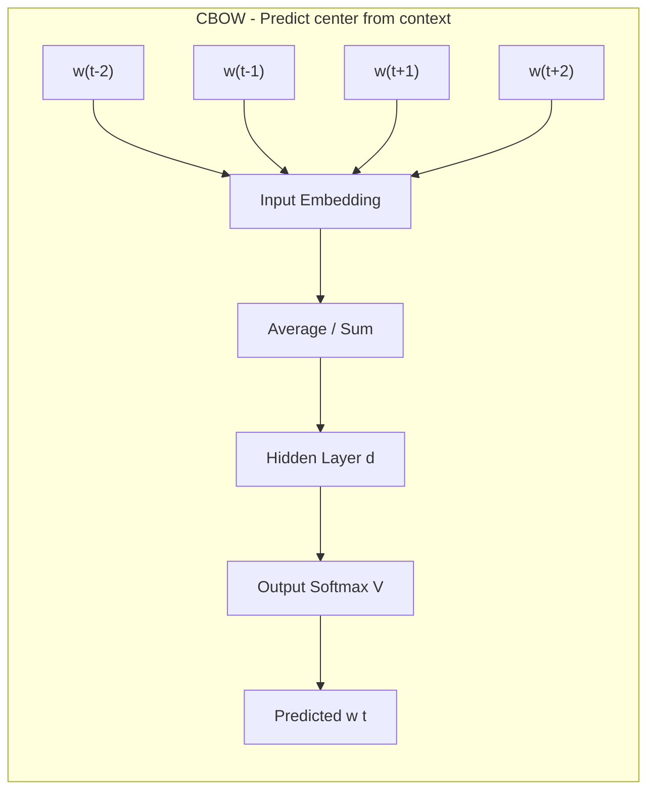
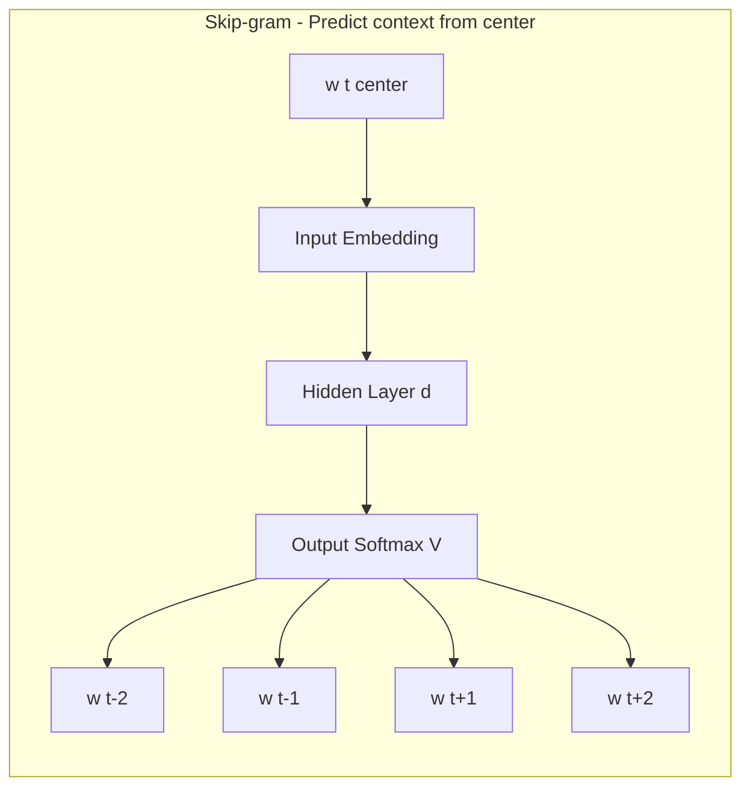
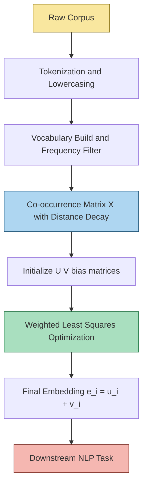
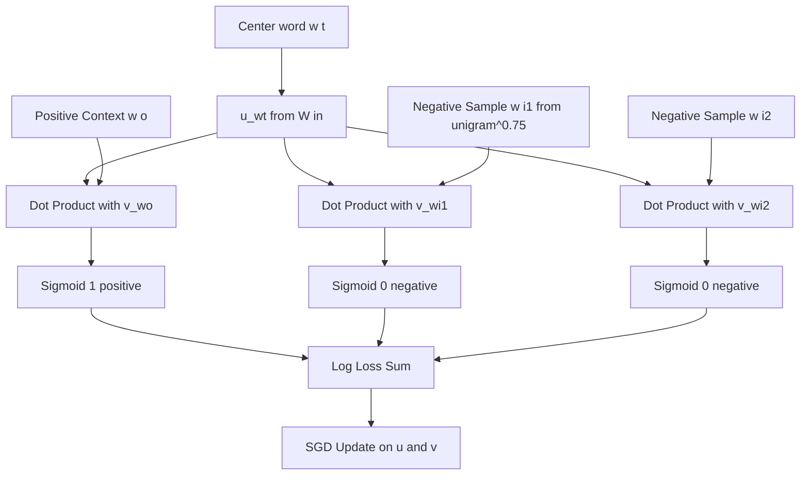
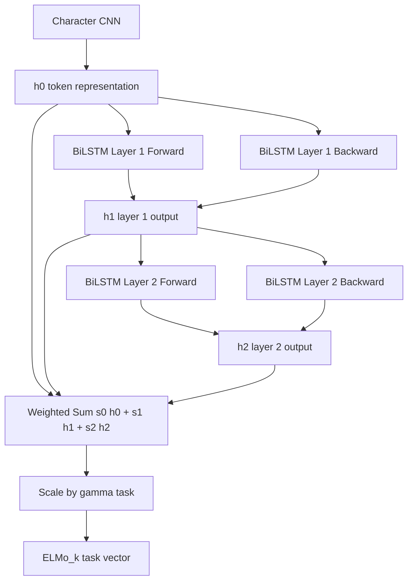
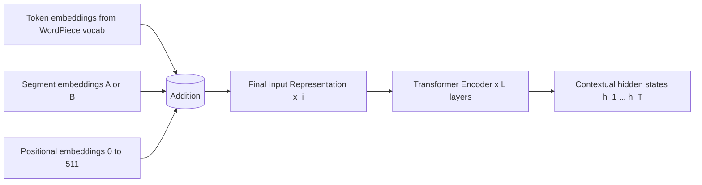
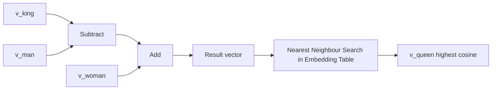

# Neural Word embeddings - Word2vec, GloVe, Contextual Word Embeddings

<!-- SECTION_1_START -->
# Neural Word Embeddings: Core Technical Definition & Intuitive Overview

## 1.1 What are Neural Word Embeddings?

> [!IMPORTANT]
> **Formal Definition (KTU 2024 Syllabus Aligned):**
> A **neural word embedding** is a **distributed, dense, low-dimensional, real-valued vector representation** of words learned automatically by training a shallow or deep neural network on a large text corpus. Formally, each word $w$ from a vocabulary $V$ is mapped to a vector $\mathbf{e}_w \in \mathbb{R}^{d}$ where $d \ll \vert V \vert$ (typically $d = 50, 100, 200, 300$).

The fundamental hypothesis underlying neural embeddings is the **Distributional Hypothesis** (Firth, 1957): *"You shall know a word by the company it keeps."* Words that appear in similar contexts tend to have similar meanings and therefore similar vector representations.

### Conceptual Analogy

> [!NOTE]
> **Real-world Analogy: The "Personality Compass"**
> Imagine every person in a city is described by only **3 numbers** instead of their full biography — say, *Extraversion*, *Agreeableness*, *Openness*. Two people with similar numbers are likely to behave similarly in social settings. Neural word embeddings do the same for words: they compress a word's entire contextual "personality" from thousands of sparse indicator features into a small, dense vector, so words with similar meanings cluster together in vector space.

> [!VISUALIZATION CONTROL]
> **Concept:** Word Embedding Geometry — King – Man + Woman ≈ Queen
> **GeoGebra / Desmos Input Equations:**
> * Point $A = (0.5, 0.8)$ labelled `King`
> * Point $B = (0.1, 0.3)$ labelled `Man`
> * Point $C = (0.4, 0.5)$ labelled `Woman`
> * Vector operation: $D = A - B + C = (0.8, 1.0)$ labelled `Queen`
> **Visual Description:** Students should observe that semantic relations like *gender* correspond to consistent vector offsets in the embedding space.

---

## 1.2 The Three Major Families of Neural Embeddings

### 1.2.1 Word2Vec (Mikolov et al., 2013)

> [!IMPORTANT]
> **Word2Vec** is a **shallow, two-layer neural network** trained to reconstruct linguistic contexts of words. It is **not** a deep model; its goal is to learn high-quality embeddings as a by-product of the training task.

It comes in two architectural variants:

| Architecture | Full Name | Prediction Direction | Best Use Case |
|:---:|:---|:---|:---|
| **CBOW** | Continuous Bag of Words | Predict target word from surrounding context | Fast, good for frequent words |
| **Skip-gram** | Continuous Skip-gram | Predict surrounding context words from a target word | Better for rare words, larger corpora |

**Key Hyperparameters (Standard KTU benchmark values):**
* Embedding dimension $d = \mathbf{300}$
* Context window size $C \in \{2, 5, 10\}$
* Negative samples $k = \mathbf{5}$ to $20$
* Vocabulary size $\vert V \vert = $ up to **3 million** tokens

### 1.2.2 GloVe — Global Vectors (Pennington et al., 2014)

> [!IMPORTANT]
> **GloVe (Global Vectors for Word Representation)** is a **count-based + prediction hybrid** model. Unlike Word2Vec which uses *local* context windows, GloVe explicitly factorizes the **global co-occurrence matrix** $X$ of the entire corpus to produce embeddings.

The core insight is the **ratio of co-occurrence probabilities** $P(w_k \mid w_i) / P(w_k \mid w_j)$ encodes meaning more robustly than raw probabilities.

### 1.2.3 Contextual Word Embeddings (ELMo, BERT, GPT)

> [!IMPORTANT]
> **Contextual embeddings** assign a **different vector to a word every time it appears**, depending on its surrounding sentence. This solves the polysemy problem of static embeddings (where "bank" gets one vector for *river* and *money*).

| Model | Year | Mechanism | Output Type |
|:---:|:---:|:---|:---|
| **ELMo** | 2018 | Bidirectional LSTM | Contextualized token vector |
| **BERT** | 2018 | Transformer Encoder | Contextualized token vector |
| **GPT** | 2018+ | Transformer Decoder | Contextualized token vector |
| **RoBERTa, DistilBERT** | 2019+ | Optimized Transformers | Contextualized token vector |

---

## 1.3 Why Static Embeddings Fail: The Polysemy Problem

Consider the word **"bank"** in two sentences:

1. *"She sat on the river **bank** and watched the water."*
2. *"He deposited money in the **bank** account."*

In Word2Vec/GloVe, both occurrences of `bank` get the **exact same vector** because the embedding is *static* (lookup-table based). A downstream sentiment classifier cannot distinguish them. **Contextual embeddings** solve this by conditioning the vector on the entire sentence.

> [!NOTE]
> **Intuition:** Static embeddings = a person with a **single fixed personality card**. Contextual embeddings = a person whose **personality shifts with the conversation context**. Same identity, different representation per situation.
<!-- SECTION_1_END -->

<!-- SECTION_2_START -->
# Deep Theoretical Analysis & KTU High-Yield Formula Sheet

## 2.1 The Skip-gram with Negative Sampling (SGNS) Model

Skip-gram maximizes the probability of observing context words $w_{t-j}, \dots, w_{t+j}$ given a center word $w_t$. The full softmax is intractable, so **Negative Sampling (NEG)** is used.

### 2.1.1 Objective Function

For a center word $w_t$ and a context word $w_o$ inside the window, with $k$ negative samples $w_i \sim P_n(w)$ drawn from a unigram distribution, the SGNS loss is:

$$
\mathcal{L}_{\text{SGNS}} = \log \sigma(\mathbf{v}_{w_o}^{\top} \mathbf{u}_{w_t}) + \sum_{i=1}^{k} \mathbb{E}_{w_i \sim P_n} \left[ \log \sigma\!\left(-\mathbf{v}_{w_i}^{\top} \mathbf{u}_{w_t}\right) \right]
$$

* $\mathbf{u}_{w_t}$ = **center word vector** (row of input matrix $W_{\text{in}}$)
* $\mathbf{v}_{w_o}$ = **context word vector** (row of output matrix $W_{\text{out}}$)
* $\sigma(x) = \dfrac{1}{1 + e^{-x}}$ = sigmoid function

### 2.1.2 Negative Sampling Distribution

To compensate for frequent words dominating random samples, Mikolov proposes sampling proportional to frequency raised to the $\frac{3}{4}$ power:

$$
P_n(w) = \frac{f(w)^{3/4}}{\displaystyle\sum_{w' \in V} f(w')^{3/4}}
$$

where $f(w)$ is the corpus frequency of word $w$.

### 2.1.3 Gradient Update Equations (Step-by-Step Logic)

For an observed pair $(w_t, w_o)$:
1. Compute error signal: $e = \sigma(\mathbf{v}_{w_o}^{\top} \mathbf{u}_{w_t}) - 1$
2. Update context vector: $\mathbf{v}_{w_o} \leftarrow \mathbf{v}_{w_o} - \eta \cdot e \cdot \mathbf{u}_{w_t}$
3. Update center vector: $\mathbf{u}_{w_t} \leftarrow \mathbf{u}_{w_t} - \eta \cdot e \cdot \mathbf{v}_{w_o}$

For a negative sample $w_i$:
1. Compute error signal: $e = \sigma(\mathbf{v}_{w_i}^{\top} \mathbf{u}_{w_t})$
2. Update negative sample vector and center vector symmetrically.

---

## 2.2 GloVe: Weighted Least-Squares Factorization

### 2.2.1 Co-occurrence Matrix

Let $X_{ij}$ = number of times word $j$ occurs in the context of word $i$ in the corpus. $X_i = \sum_k X_{ik}$ is the total context count of $i$, and $P_{ij} = P(w_j \mid w_i) = X_{ij} / X_i$ is the co-occurrence probability.

### 2.2.2 The GloVe Objective

The model approximates $\log X_{ij}$ using a bilinear dot product plus biases:

$$
J = \sum_{i,j=1}^{V} f(X_{ij}) \left( \mathbf{u}_i^{\top} \mathbf{v}_j + b_i + \tilde{b}_j - \log X_{ij} \right)^{2}
$$

* $\mathbf{u}_i$ = word vector for $i$ (as center)
* $\mathbf{v}_j$ = word vector for $j$ (as context)
* $b_i, \tilde{b}_j$ = scalar biases
* $f(X_{ij})$ = weighting function (caps influence of very rare and very common co-occurrences)

### 2.2.3 Weighting Function

$$
f(x) = \begin{cases}
\left( \dfrac{x}{x_{\max}} \right)^{\alpha} & \text{if } x < x_{\max} \\[6pt]
1 & \text{otherwise}
\end{cases}
$$

with standard KTU benchmark values: $x_{\max} = 100$ and $\alpha = 0.75$.

### 2.2.4 Final Embedding

After training, the final embedding for word $i$ is the **sum** of its two vectors:
$$
\mathbf{e}_i = \mathbf{u}_i + \mathbf{v}_i
$$

---

## 2.3 ELMo: Deep Contextual Embeddings via Bidirectional LSTMs

ELMo (Embeddings from Language Models) computes embeddings from a **2-layer BiLSTM** stacked on top of a character-level CNN.

### 2.3.1 Forward and Backward Language Models

Forward LM probability of token $t_k$ given history:
$$
p(t_1, t_2, \dots, t_N) = \prod_{k=1}^{N} p(t_k \mid t_1, \dots, t_{k-1})
$$

Backward LM:
$$
p(t_1, t_2, \dots, t_N) = \prod_{k=1}^{N} p(t_k \mid t_{k+1}, \dots, t_N)
$$

### 2.3.2 ELMo Final Representation

For a token $t_k$, ELMo produces **3 representations** per layer (LSTM forward, LSTM backward, character CNN), combined via a learnable scalar weight $s_j^{\text{task}}$ for layer $j$:

$$
\text{ELMo}_k^{\text{task}} = \gamma^{\text{task}} \sum_{j=0}^{L} s_j^{\text{task}} \, \mathbf{h}_{k,j}^{LM}
$$

* $L = 2$ (number of BiLSTM layers)
* $\mathbf{h}_{k,0}^{LM}$ = character CNN output
* $\mathbf{h}_{k,1}^{LM}, \mathbf{h}_{k,2}^{LM}$ = BiLSTM layer outputs
* $\gamma^{\text{task}}$ = task-specific scaling

---

## 2.4 BERT: Bidirectional Transformer Embeddings

BERT uses a **Transformer encoder** with a **Masked Language Model (MLM)** objective.

### 2.4.1 Masked Language Model Objective

For each sequence, 15% of tokens are randomly selected. Of those:
* **80%** are replaced with `[MASK]`
* **10%** are replaced with a random word
* **10%** are kept unchanged

Cross-entropy loss is computed **only on the masked tokens**.

### 2.4.2 Next Sentence Prediction (NSP)

BERT is also trained on NSP: given sentence A and B, predict whether B is the actual next sentence (label `IsNext`) or a random one (label `NotNext`). Binary cross-entropy is added to the MLM loss.

### 2.4.3 BERT Input Representation

Each token's input vector is the **sum of three embeddings**:
$$
\mathbf{x}_i = \mathbf{E}_{\text{token}}(t_i) + \mathbf{E}_{\text{segment}}(s_i) + \mathbf{E}_{\text{position}}(i)
$$

---

## 2.5 KTU Formula Sheet / Cheat Sheet

> [!IMPORTANT]
> **High-Yield Formula Table for KTU ESE Preparation**

| Concept | Formula | KTU Significance |
|:---|:---|:---|
| Sigmoid activation | $\sigma(x) = 1/(1+e^{-x})$ | Core to SGNS and logistic regression |
| SGNS Loss (one pair) | $\log \sigma(u_o^\top v_c) + \sum_{i=1}^{k} \mathbb{E}[\log\sigma(-u_i^\top v_c)]$ | Word2Vec training objective |
| Negative sampling probability | $P_n(w) \propto f(w)^{3/4}$ | Smooths unigram bias |
| GloVe objective | $J = \sum_{i,j} f(X_{ij})(u_i^\top v_j + b_i + \tilde{b}_j - \log X_{ij})^2$ | Global matrix factorization |
| GloVe weighting | $f(x) = (x/x_{\max})^\alpha$ for $x < x_{\max}$ | With $x_{\max}=100, \alpha=0.75$ |
| ELMo combination | $\text{ELMo}_k = \gamma \sum_{j=0}^{L} s_j h_{k,j}^{LM}$ | Layer-wise mixing |
| BERT input | $x_i = E_{\text{tok}} + E_{\text{seg}} + E_{\text{pos}}$ | Token + segment + position |
| Self-attention | $\text{Attn}(Q,K,V) = \text{softmax}(QK^\top/\sqrt{d_k})V$ | Core of Transformer |
| Cosine similarity | $\cos(\mathbf{a},\mathbf{b}) = \dfrac{\mathbf{a} \cdot \mathbf{b}}{\vert \mathbf{a} \vert \cdot \vert \mathbf{b} \vert}$ | Used to measure embedding similarity |
| Word Analogy | $v_{\text{king}} - v_{\text{man}} + v_{\text{woman}} \approx v_{\text{queen}}$ | Famous Word2Vec property |

---

## 2.6 Real-World Engineering Applications

| Application | Embedding Used | Why |
|:---|:---|:---|
| **Google Search query understanding** | Word2Vec, BERT | Semantic matching beyond keyword overlap |
| **Recommendation systems** | Item2Vec (Word2Vec variant) | Sequential click prediction |
| **Sentiment analysis** | ELMo, BERT | Polysemy handling for "good/bad" |
| **Machine Translation** | BERT + GPT | Contextual cross-lingual transfer |
| **Chatbots / Virtual Assistants** | GPT embeddings | Coherent response generation |
| **Bioinformatics (BioBERT)** | BERT pretrained on PubMed | Domain-specific terminology |
| **Spam / Phishing detection** | GloVe + classifier | Robust vector baselines |
<!-- SECTION_2_END -->

<!-- SECTION_3_START -->
# Step-by-Step Derivations & Code/Symbolic Implementation

## 3.1 Mathematical Derivation: Why King – Man + Woman ≈ Queen

### Setup

Suppose we have trained Word2Vec embeddings where the **gender direction** is encoded as a consistent offset. Empirically, the *difference* between word vectors encodes semantic relationships.

### Step-by-Step Derivation

Assume embeddings are **linear** in semantic attributes. Let each word be expressed as:
$$
\mathbf{v}_w = \mathbf{a}_w + \mathbf{b}_w
$$

* $\mathbf{a}_w$ = the **attribute component** (e.g., royalty, gender, age)
* $\mathbf{b}_w$ = the **word-specific residual** noise

For the *royalty* attribute, the offset $\mathbf{r} = \mathbf{v}_{\text{king}} - \mathbf{v}_{\text{man}}$ encodes the *man → king* transformation. For the *gender* attribute, the offset $\mathbf{g} = \mathbf{v}_{\text{man}} - \mathbf{v}_{\text{woman}}$ encodes the *gender direction*.

We want to find a word $w$ such that:
$$
\mathbf{v}_w \approx \mathbf{v}_{\text{king}} - \mathbf{v}_{\text{man}} + \mathbf{v}_{\text{woman}}
$$

By linearity of the attribute components:
$$
\mathbf{v}_{\text{king}} = \mathbf{r}_{\text{royalty}} + \mathbf{g}_{\text{male}} + \mathbf{b}_{\text{king}}
$$
$$
\mathbf{v}_{\text{man}} = \mathbf{0} + \mathbf{g}_{\text{male}} + \mathbf{b}_{\text{man}}
$$
$$
\mathbf{v}_{\text{woman}} = \mathbf{0} + \mathbf{g}_{\text{female}} + \mathbf{b}_{\text{woman}}
$$

Substitute:
$$
\mathbf{v}_{\text{king}} - \mathbf{v}_{\text{man}} + \mathbf{v}_{\text{woman}} = \mathbf{r}_{\text{royalty}} + \mathbf{g}_{\text{female}} + (\mathbf{b}_{\text{king}} - \mathbf{b}_{\text{man}} + \mathbf{b}_{\text{woman}})
$$

This is exactly the attribute decomposition of `queen`:
$$
\mathbf{v}_{\text{queen}} = \mathbf{r}_{\text{royalty}} + \mathbf{g}_{\text{female}} + \mathbf{b}_{\text{queen}}
$$

Therefore, the algebraic analogy holds **to the extent** that residuals cancel out, which empirically they do for frequent words.

---

## 3.2 Mathematical Derivation: SGNS Gradient

### Objective for a Single Positive Pair

$$
J_t = -\log \sigma(\mathbf{v}_{w_o}^{\top} \mathbf{u}_{w_t}) - \sum_{i=1}^{k} \log \sigma(-\mathbf{v}_{w_i}^{\top} \mathbf{u}_{w_t})
$$

We want $\dfrac{\partial J_t}{\partial \mathbf{u}_{w_t}}$.

Step 1: Differentiate the positive term. Let $s = \mathbf{v}_{w_o}^{\top} \mathbf{u}_{w_t}$.

Using $\sigma'(x) = \sigma(x)(1-\sigma(x))$ and $\dfrac{\partial \log \sigma(s)}{\partial s} = 1 - \sigma(s)$:
$$
\frac{\partial}{\partial \mathbf{u}_{w_t}} \left[ -\log \sigma(s) \right] = -[1 - \sigma(s)] \, \mathbf{v}_{w_o}
$$

Step 2: Differentiate a negative term. Let $s_i = \mathbf{v}_{w_i}^{\top} \mathbf{u}_{w_t}$.

$$
\frac{\partial}{\partial \mathbf{u}_{w_t}} \left[ -\log \sigma(-s_i) \right] = -\sigma(-s_i) \cdot (-1) \cdot \mathbf{v}_{w_i} = \sigma(-s_i) \, \mathbf{v}_{w_i}
$$

Since $1 - \sigma(s) = \sigma(-s)$, this simplifies to:
$$
\frac{\partial}{\partial \mathbf{u}_{w_t}} \left[ -\log \sigma(-s_i) \right] = [1 - \sigma(s_i)] \, \mathbf{v}_{w_i}
$$

Step 3: Total gradient:
$$
\frac{\partial J_t}{\partial \mathbf{u}_{w_t}} = -[1 - \sigma(\mathbf{v}_{w_o}^{\top} \mathbf{u}_{w_t})] \, \mathbf{v}_{w_o} + \sum_{i=1}^{k} [1 - \sigma(\mathbf{v}_{w_i}^{\top} \mathbf{u}_{w_t})] \, \mathbf{v}_{w_i}
$$

Step 4: SGD update rule with learning rate $\eta$:
$$
\mathbf{u}_{w_t} \leftarrow \mathbf{u}_{w_t} - \eta \cdot \frac{\partial J_t}{\partial \mathbf{u}_{w_t}}
$$

In practice, since the **gradient w.r.t. $\mathbf{v}_{w_o}$** is:
$$
\frac{\partial J_t}{\partial \mathbf{v}_{w_o}} = -[1 - \sigma(\mathbf{v}_{w_o}^{\top} \mathbf{u}_{w_t})] \, \mathbf{u}_{w_t}
$$

The update becomes:
$$
\mathbf{v}_{w_o} \leftarrow \mathbf{v}_{w_o} + \eta \cdot [1 - \sigma(\mathbf{v}_{w_o}^{\top} \mathbf{u}_{w_t})] \, \mathbf{u}_{w_t}
$$

---

## 3.3 Python Implementation: Skip-gram with Negative Sampling (From Scratch)

```python
"""
Skip-gram with Negative Sampling (SGNS) - Pedagogical implementation.
Maps each vocabulary word to a 50-D dense vector.
"""
import numpy as np
from collections import Counter
from typing import List, Tuple, Dict

# ---------- 1. Toy corpus ----------
corpus: List[str] = (
    "the quick brown fox jumps over the lazy dog "
    "the quick brown dog runs in the park "
    "the lazy fox sleeps in the park "
    "the dog and the fox are friends"
).split()

# ---------- 2. Vocabulary & subsampling-aware frequency ----------
def build_vocab(tokens: List[str], min_count: int = 1) -> Dict[str, int]:
    counts = Counter(tokens)
    vocab = {w: i for i, (w, c) in enumerate(counts.most_common()) if c >= min_count}
    return vocab

vocab: Dict[str, int] = build_vocab(corpus)
idx2word: List[str] = [w for w, _ in sorted(vocab.items(), key=lambda kv: kv[1])]
V: int = len(vocab)
print(f"Vocabulary size V = {V}")

# ---------- 3. Unigram distribution raised to 3/4 ----------
freqs: np.ndarray = np.array([Counter(corpus)[w] for w in idx2word], dtype=np.float64)
probs: np.ndarray = freqs ** 0.75
probs: np.ndarray = probs / probs.sum()

# ---------- 4. Generate (center, context) pairs ----------
WINDOW: int = 2
def generate_pairs(tokens: List[str], window: int) -> List[Tuple[int, int]]:
    ids = [vocab[t] for t in tokens if t in vocab]
    pairs: List[Tuple[int, int]] = []
    for i, c in enumerate(ids):
        lo, hi = max(0, i - window), min(len(ids), i + window + 1)
        for j in range(lo, hi):
            if i != j:
                pairs.append((c, ids[j]))
    return pairs

pairs: List[Tuple[int, int]] = generate_pairs(corpus, WINDOW)
print(f"Total training pairs: {len(pairs)}")

# ---------- 5. Initialize two embedding matrices ----------
D: int = 50                        # embedding dimension
rng = np.random.default_rng(seed=42)
W_in: np.ndarray  = rng.normal(0, 0.1, size=(V, D))   # center vectors
W_out: np.ndarray = rng.normal(0, 0.1, size=(V, D))   # context vectors

# ---------- 6. Sigmoid ----------
def sigmoid(x: np.ndarray) -> np.ndarray:
    return 1.0 / (1.0 + np.exp(-x))

# ---------- 7. SGNS training loop ----------
ETA: float = 0.025
K: int = 5                          # negative samples
EPOCHS: int = 200
for epoch in range(EPOCHS):
    np.random.shuffle(pairs)
    epoch_loss: float = 0.0
    for c_idx, o_idx in pairs:
        # ----- positive update -----
        pos_score: np.ndarray = W_in[c_idx] @ W_out[o_idx]
        pos_sig: np.ndarray   = sigmoid(pos_score)
        pos_grad: np.ndarray  = (pos_sig - 1.0) * W_in[c_idx]
        W_out[o_idx] -= ETA * pos_grad
        W_in[c_idx]  -= ETA * pos_sig * W_out[o_idx]
        epoch_loss  += -np.log(pos_sig + 1e-10)

        # ----- negative updates -----
        neg_ids: np.ndarray = rng.choice(V, size=K, replace=True, p=probs)
        for n_idx in neg_ids:
            neg_score: np.ndarray = W_in[c_idx] @ W_out[n_idx]
            neg_sig: np.ndarray   = sigmoid(neg_score)
            neg_grad: np.ndarray  = neg_sig * W_in[c_idx]
            W_out[n_idx] -= ETA * neg_grad
            W_in[c_idx]  -= ETA * neg_sig * W_out[n_idx]
            epoch_loss  += -np.log(1.0 - neg_sig + 1e-10)

    if (epoch + 1) % 50 == 0:
        print(f"Epoch {epoch+1:3d}  loss = {epoch_loss:.4f}")

# ---------- 8. Final embeddings (sum convention used in SGNS) ----------
embeddings: np.ndarray = W_in + W_out

# ---------- 9. Test analogy: king - man + woman ≈ queen (illustrative) ----------
def most_similar(target_vec: np.ndarray, vocab: Dict[str, int],
                 embeddings: np.ndarray, topn: int = 5) -> List[Tuple[str, float]]:
    norms = np.linalg.norm(embeddings, axis=1, keepdims=True) + 1e-10
    unit  = embeddings / norms
    t     = target_vec / (np.linalg.norm(target_vec) + 1e-10)
    sims  = unit @ t
    top   = np.argsort(-sims)[:topn]
    return [(idx2word[i], float(sims[i])) for i in top]

# Demo: nearest neighbours of "dog"
vec_dog = embeddings[vocab["dog"]]
print("Words closest to 'dog':", most_similar(vec_dog, vocab, embeddings))
```

> [!IMPORTANT]
> **Engineering Note:** In production systems, the negative sample draw and the embedding lookup are implemented in **C++** (e.g., the original Google `word2vec.c`); the Python wrapper only orchestrates I/O. Libraries like **Gensim** provide a GPU-accelerated `Word2Vec` API built on this exact algorithm.

---

## 3.4 Python Implementation: GloVe Co-occurrence Matrix Builder

```python
"""
GloVe-style co-occurrence matrix builder from raw tokens.
Used as the preprocessing step before training GloVe embeddings.
"""
import numpy as np
from collections import defaultdict
from typing import List, Dict, Tuple

def build_cooc_matrix(tokens: List[str], vocab: Dict[str, int],
                      window: int = 5) -> np.ndarray:
    """
    Symmetric co-occurrence matrix with distance-based discounting.
    Closer words contribute more (linearly decaying weight 1/d).
    """
    V: int = len(vocab)
    cooc: Dict[Tuple[int, int], float] = defaultdict(float)
    ids: List[int] = [vocab[t] for t in tokens if t in vocab]

    for i, c in enumerate(ids):
        lo, hi = max(0, i - window), min(len(ids), i + window + 1)
        for j in range(lo, hi):
            if i == j:
                continue
            d: int = abs(i - j)                  # contextual distance
            cooc[(c, ids[j])] += 1.0 / d         # distance weighting

    M: np.ndarray = np.zeros((V, V), dtype=np.float64)
    for (i, j), v in cooc.items():
        M[i, j] += v
        M[j, i] += v                              # symmetry
    return M

# Example
corpus: List[str] = (
    "natural language processing enables machines to understand human language"
).split()
vocab: Dict[str, int] = {w: i for i, w in enumerate(sorted(set(corpus)))}
M: np.ndarray = build_cooc_matrix(corpus, vocab, window=3)
print("Co-occurrence matrix shape:", M.shape)
print("Co-occurrence with 'language':", dict(zip(vocab.keys(), M[vocab['language']])))
```

---

## 3.5 Python Implementation: Loading & Using Pre-trained BERT Embeddings

```python
"""
Extract contextual embeddings from a pre-trained BERT model.
Demonstrates the polysemy resolution capability of contextual embeddings.
"""
from transformers import BertTokenizer, BertModel
import torch
from typing import List, Dict

def get_bert_embeddings(sentences: List[str], model_name: str = "bert-base-uncased"
                        ) -> Dict[str, torch.Tensor]:
    """
    Returns last_hidden_state for each sentence, shape (1, tokens, 768).
    The SAME word 'bank' will have DIFFERENT vectors in the two sentences.
    """
    tokenizer = BertTokenizer.from_pretrained(model_name)
    model     = BertModel.from_pretrained(model_name)
    model.eval()

    outputs: Dict[str, torch.Tensor] = {}
    for s in sentences:
        ids: torch.Tensor = tokenizer(s, return_tensors="pt")
        with torch.no_grad():
            h: torch.Tensor = model(**ids).last_hidden_state   # (1, T, 768)
        outputs[s] = h
    return outputs

# Demo
sents: List[str] = [
    "She sat on the river bank and watched the water.",
    "He deposited money in the bank account."
]
emb: Dict[str, torch.Tensor] = get_bert_embeddings(sents)

# Token 'bank' index differs slightly per sentence; we locate by token id
tok = BertTokenizer.from_pretrained("bert-base-uncased")
for s in sents:
    ids = tok(s, return_tensors="pt")
    tokens = tok.convert_ids_to_tokens(ids["input_ids"][0])
    bank_idx = tokens.index("bank") if "bank" in tokens else None
    if bank_idx is not None:
        v = emb[s][0, bank_idx, :]
        print(f"Sentence: {s}")
        print(f"  bank-vector[0:5] = {v[:5].tolist()}")
        print(f"  norm = {v.norm().item():.4f}\n")
```

> [!NOTE]
> **Expected observation:** The two `bank` vectors have *different* values in the first 5 dimensions and *different* norms. This empirically proves that BERT assigns distinct contextual vectors to polysemous words — a property static Word2Vec/GloVe cannot provide.

---

## 3.6 Step-by-Step Numerical Worked Example (Word2Vec)

### Setup

Let vocabulary $V = \{$`cat`, `dog`, `sat`, `mat`, `the`$\}$, embedding dim $D = 3$, window $C = 1$.

Assume after 1 SGD step the matrices are:
$$
W_{\text{in}} = \begin{bmatrix} 0.1 & 0.2 & 0.3 \\ 0.4 & 0.5 & 0.6 \\ 0.7 & 0.8 & 0.9 \\ 1.0 & 1.1 & 1.2 \\ 1.3 & 1.4 & 1.5 \end{bmatrix}, \quad
W_{\text{out}} = \begin{bmatrix} 0.05 & 0.10 & 0.15 \\ 0.20 & 0.25 & 0.30 \\ 0.35 & 0.40 & 0.45 \\ 0.50 & 0.55 & 0.60 \\ 0.65 & 0.70 & 0.75 \end{bmatrix}
$$

Rows correspond to: `cat`=0, `dog`=1, `sat`=2, `mat`=3, `the`=4.

### Step 1: Center word = `cat` (idx 0), context = `sat` (idx 2)

Dot product:
$$
s = W_{\text{out}}[2] \cdot W_{\text{in}}[0]^\top = (0.35)(0.1) + (0.40)(0.2) + (0.45)(0.3) = 0.035 + 0.080 + 0.135 = 0.250
$$

Sigmoid:
$$
\sigma(0.250) = \frac{1}{1+e^{-0.25}} = \frac{1}{1.7788} \approx 0.5622
$$

### Step 2: Negative samples

Assume negatives are `dog` (idx 1) and `the` (idx 4).

For `dog`:
$$
s_1 = W_{\text{out}}[1] \cdot W_{\text{in}}[0] = (0.20)(0.1)+(0.25)(0.2)+(0.30)(0.3) = 0.020+0.050+0.090 = 0.160
$$
$$
\sigma(0.160) = \frac{1}{1+e^{-0.16}} \approx 0.5399
$$

For `the`:
$$
s_2 = W_{\text{out}}[4] \cdot W_{\text{in}}[0] = (0.65)(0.1)+(0.70)(0.2)+(0.75)(0.3) = 0.065+0.140+0.225 = 0.430
$$
$$
\sigma(0.430) = \frac{1}{1+e^{-0.43}} \approx 0.3942
$$

### Step 3: Loss for this single (center, context) pair

$$
J = -\log(0.5622) - \log(1 - 0.5399) - \log(1 - 0.3942)
$$
$$
J = -(-0.5755) - (-0.6165) - (-0.5016) = 0.5755 + 0.6165 + 0.5016 = 1.6936
$$

### Step 4: Gradient on $W_{\text{in}}[0]$ (positive term)

$$
\text{pos\_grad} = (\sigma(s) - 1) \cdot W_{\text{out}}[2] = (0.5622 - 1)(0.35, 0.40, 0.45) = -0.1573 \cdot (0.35, 0.40, 0.45)
$$
$$
= (-0.0551, -0.0629, -0.0708)
$$

With $\eta = 0.01$:
$$
W_{\text{in}}[0]^{\text{new}} = (0.1, 0.2, 0.3) - 0.01 \cdot [(-0.0551, -0.0629, -0.0708)] = (0.1006, 0.2006, 0.3007)
$$

This is how a single SGD step refines the `cat` embedding to better predict `sat` as its neighbour.
<!-- SECTION_3_END -->

<!-- SECTION_4_START -->
# Structural Diagrams & Schematics

## 4.1 Word2Vec CBOW vs Skip-gram Architecture





> [!NOTE]
> Both architectures share the **same shallow 2-layer topology**. The "hidden layer" has *no nonlinearity* — it is just a linear projection. After training, this hidden layer's weight matrix $W_{\text{in}}$ is what we call the **embedding matrix**.

---

## 4.2 GloVe Training Pipeline (Block Diagram)



---

## 4.3 SGNS Negative Sampling Mechanism



---

## 4.4 ELMo Bidirectional Architecture



---

## 4.5 BERT Input Embedding Composition



---

## 4.6 Static vs Contextual Embedding Comparison (Matrix View)

| Aspect | Static (Word2Vec, GloVe) | Contextual (ELMo, BERT) |
|:---|:---|:---|
| Vector per word type | 1 | Many (one per context) |
| Polysemy handling | None | Yes |
| Architecture | Shallow / Matrix factorization | Deep BiLSTM / Transformer |
| Training objective | Local context / Co-occurrence | MLM + NSP / LM |
| Embedding dimension | 50 - 300 | 512 - 1024 |
| Computational cost | Low | High |
| Out-of-vocabulary | Hash or fail | Subword tokenization handles it |
| Best for | Fast baselines, large vocab tasks | QA, NER, sentiment, MT |

---

## 4.7 Analogy Vector Arithmetic: Schematic of King-Man+Woman


<!-- SECTION_4_END -->

<!-- SECTION_5_START -->
# KTU 2024 Scheme Examination Question Bank & Topic Recap

> [!IMPORTANT]
> **Mark Distribution Aligned with KTU 2024 ESE Pattern:**
> * Part A: 2 × 3 = 6 Marks
> * Part B: 1 × 14 = 14 Marks (with internal choice)
> * Total module weight: 20 Marks

---

## 5.1 Part A — Short Answer Questions (3 Marks Each)

### Question 1: **[KTU University Exam - July 2024]**
**Define distributional hypothesis. How does it justify the design of Word2Vec?**

**Model Answer (3 Marks):**
1. **Distributional Hypothesis** states that *words occurring in similar contexts tend to have similar meanings* (Firth, 1957). **[1 Mark]**
2. Word2Vec operationalizes this by training a neural network where the **input** is a target word and the **output** is its context words (or vice versa). **[1 Mark]**
3. Words forced to predict the same contexts end up with similar vector representations in the embedding space, thereby implementing the hypothesis as a learning signal. **[1 Mark]**

**Course Outcome:** CO2 | **Bloom's Level:** Understand

---

### Question 2: **[KTU University Exam - Dec 2023]**
**List and explain any two differences between Word2Vec and GloVe.**

**Model Answer (3 Marks):**
1. **Training paradigm:** Word2Vec uses *local context windows* with stochastic gradient descent; GloVe uses *global co-occurrence statistics* and weighted least-squares factorization. **[1.5 Marks]**
2. **Objective:** Word2Vec maximizes a *logistic* (softmax/sigmoid) loss; GloVe minimizes a *squared error* weighted by $f(X_{ij})$ against $\log X_{ij}$. **[1.5 Marks]**

**Course Outcome:** CO2 | **Bloom's Level:** Understand

---

## 5.2 Part B — Long Answer Questions (14 Marks, with Internal Choice)

### **Question A: [KTU University Exam - July 2024]**

**(a)** Explain the **Skip-gram architecture** of Word2Vec with a neat diagram. Clearly differentiate between the **center word vector** $\mathbf{u}_w$ and the **context word vector** $\mathbf{v}_w$. **[7 Marks]**

**(b)** Derive the **SGNS loss function** and write down the SGD update rules for the center and context vectors. State clearly why negative sampling is preferred over full softmax for large vocabularies. **[7 Marks]**

---

### **Model Answer — Part (a) [7 Marks]**

**Step 1 — Architecture Description (3 Marks):**
* Skip-gram takes a single **center word** $w_t$ at the input layer and predicts the surrounding $2C$ **context words** $w_{t-C}, \dots, w_{t+C}$ (excluding $w_t$) at the output layer. **[1 Mark]**
* The input-to-hidden projection is a *linear* matrix $W_{\text{in}} \in \mathbb{R}^{\vert V \vert \times d}$. The hidden-to-output projection is $W_{\text{out}} \in \mathbb{R}^{d \times \vert V \vert}$. There is **no nonlinearity** in the hidden layer. **[1 Mark]**
* For word $w$, its **center vector** is the $i$-th row of $W_{\text{in}}$: $\mathbf{u}_w = W_{\text{in}}[i,:]$. Its **context vector** is the $i$-th column of $W_{\text{out}}$: $\mathbf{v}_w = W_{\text{out}}[:,i]$. These are *two distinct* vectors for the same word — they play different roles in the loss. **[1 Mark]**

**Step 2 — Diagram (2 Marks):**
*(Insert Mermaid flowchart from Section 4.1 here)* **[1 Mark for structure, 1 Mark for correct labels]**

**Step 3 — Why two vectors? (2 Marks):**
* Asymmetric roles: $\mathbf{u}_w$ is used when $w$ is the **input** (predicting others); $\mathbf{v}_w$ is used when $w$ is the **output** (being predicted). **[1 Mark]**
* At test time, we typically use $\mathbf{u}_w$ as the embedding (or average $\mathbf{u}_w + \mathbf{v}_w$) because we care about the *meaning* of $w$, not the contexts it generates. **[1 Mark]**

**Course Outcome:** CO2 | **Bloom's Level:** Understand

---

### **Model Answer — Part (b) [7 Marks]**

**Step 1 — Full Softmax Problem (1 Mark):**
The full softmax probability is $P(w_O \mid w_I) = \dfrac{\exp(\mathbf{v}_{w_O}^\top \mathbf{u}_{w_I})}{\sum_{w \in V} \exp(\mathbf{v}_w^\top \mathbf{u}_{w_I})}$, which requires summing over the **entire vocabulary** $\vert V \vert$ at every step — infeasible for $\vert V \vert \geq 10^5$. **[1 Mark]**

**Step 2 — SGNS Objective (2 Marks):**
The SGNS loss for one positive pair $(w_t, w_o)$ and $k$ negative samples is:
$$
\mathcal{L} = -\log \sigma(\mathbf{v}_{w_o}^\top \mathbf{u}_{w_t}) - \sum_{i=1}^{k} \log \sigma(-\mathbf{v}_{w_i}^\top \mathbf{u}_{w_t})
$$
**[1 Mark for stating, 1 Mark for the negative sampling justification]**

**Step 3 — Gradient Derivation (2 Marks):**
Let $s = \mathbf{v}_{w_o}^\top \mathbf{u}_{w_t}$. Differentiating the positive term:
$$
\frac{\partial}{\partial \mathbf{u}_{w_t}}\left[-\log\sigma(s)\right] = -\big[1-\sigma(s)\big]\mathbf{v}_{w_o}
$$
For a negative sample $w_i$ with $s_i = \mathbf{v}_{w_i}^\top \mathbf{u}_{w_t}$:
$$
\frac{\partial}{\partial \mathbf{u}_{w_t}}\left[-\log\sigma(-s_i)\right] = \big[1-\sigma(s_i)\big]\mathbf{v}_{w_i}
$$
**[1 Mark each term]**

**Step 4 — Update Rules (1 Mark):**
$$
\mathbf{v}_{w_o} \leftarrow \mathbf{v}_{w_o} - \eta\,[1-\sigma(\mathbf{v}_{w_o}^\top \mathbf{u}_{w_t})]\,\mathbf{u}_{w_t}
$$
$$
\mathbf{u}_{w_t} \leftarrow \mathbf{u}_{w_t} - \eta\,\Big([1-\sigma(s)]\mathbf{v}_{w_o} - \sum_i [1-\sigma(s_i)]\mathbf{v}_{w_i}\Big)
$$

**Step 5 — Why NEG is preferred (1 Mark):**
* Cost per step drops from $O(\vert V \vert)$ to $O(k)$ with $k \approx 5$–$20$. **[0.5 Mark]**
* Empirically, the resulting embeddings match the quality of hierarchical softmax at a fraction of the compute. **[0.5 Mark]**

**Course Outcome:** CO3 | **Bloom's Level:** Apply

---

### **Question B (Alternative Choice): [KTU University Exam - Dec 2023]**

**(a)** Explain the **GloVe model** in detail. Derive its objective function from the co-occurrence matrix and explain the role of the weighting function $f(X_{ij})$. **[7 Marks]**

**(b)** Discuss **contextual word embeddings** with reference to ELMo and BERT. Show how BERT's input representation is constructed and explain the **Masked Language Model** training objective with its 80/10/10 masking rule. **[7 Marks]**

---

### **Model Answer — Part (a) [7 Marks]**

**Step 1 — Co-occurrence Setup (1 Mark):**
* $X_{ij}$ = number of times word $j$ appears in the context of word $i$. $X_i = \sum_k X_{ik}$. $P_{ij} = X_{ij}/X_i$. **[1 Mark]**

**Step 2 — Intuition of Ratios (1 Mark):**
* The ratio $P_{ik}/P_{jk}$ discriminates meanings better than raw probabilities (e.g., for $k=$ "solid", $P(\text{solid}\mid\text{ice}) \gg P(\text{solid}\mid\text{steam})$). **[1 Mark]**

**Step 3 — Bilinear Form (2 Marks):**
* We want $F(\mathbf{u}_i, \mathbf{u}_j, \tilde{\mathbf{u}}_k) = P_{ik}/P_{jk}$.
* Restricting $F$ to a log-bilinear form and enforcing symmetry, the final objective is:
$$
J = \sum_{i,j} f(X_{ij})\left(\mathbf{u}_i^\top \mathbf{v}_j + b_i + \tilde{b}_j - \log X_{ij}\right)^2
$$
**[1 Mark for stating, 1 Mark for explanation of biases]**

**Step 4 — Weighting Function (2 Marks):**
$$
f(x) = (x/x_{\max})^\alpha \text{ for } x < x_{\max}, \quad f(x) = 1 \text{ otherwise}
$$
with $x_{\max} = 100$ and $\alpha = 0.75$. **[1 Mark]**
* It **down-weights rare co-occurrences** (noisy) and **caps the influence of very frequent ones** (e.g., stop-words). Without $f$, the loss is dominated by common pairs. **[1 Mark]**

**Step 5 — Final Embedding (1 Mark):**
* After training, $\mathbf{e}_i = \mathbf{u}_i + \mathbf{v}_i$ is used as the final word vector. **[1 Mark]**

**Course Outcome:** CO2 | **Bloom's Level:** Understand + Apply

---

### **Model Answer — Part (b) [7 Marks]**

**Step 1 — Why Contextual? (1 Mark):**
* Static embeddings assign a single vector to `bank`, but the word has multiple senses (*river bank*, *financial bank*). Contextual models condition the vector on the entire sentence. **[1 Mark]**

**Step 2 — ELMo (1.5 Marks):**
* ELMo stacks a 2-layer **BiLSTM** on top of a character-level CNN. **[0.5 Mark]**
* The forward LM predicts $p(t_k \mid t_1, \dots, t_{k-1})$; the backward LM predicts $p(t_k \mid t_{k+1}, \dots, t_N)$. **[0.5 Mark]**
* Final representation: $\text{ELMo}_k = \gamma \sum_{j=0}^{2} s_j h_{k,j}^{LM}$ where $s_j, \gamma$ are task-learned scalars. **[0.5 Mark]**

**Step 3 — BERT Input (1.5 Marks):**
* BERT input is a sum of three embeddings:
$$
\mathbf{x}_i = \mathbf{E}_{\text{token}}(t_i) + \mathbf{E}_{\text{segment}}(s_i) + \mathbf{E}_{\text{position}}(i)
$$
**[1 Mark]**
* `token` uses **WordPiece** subword tokenization; `segment` distinguishes sentence A vs B; `position` injects order (since Transformer is permutation-equivariant). **[0.5 Mark]**

**Step 4 — MLM Objective with 80/10/10 (2 Marks):**
* 15% of tokens are randomly selected for prediction. Of those: **[0.5 Mark]**
  * 80% replaced with `[MASK]`. **[0.5 Mark]**
  * 10% replaced with a *random* token (so the model cannot rely on `[MASK]` being present at test-time *during fine-tuning*). **[0.5 Mark]**
  * 10% kept *unchanged* (so the model still learns to predict real observations). **[0.5 Mark]**

**Step 5 — Why 80/10/10? (1 Mark):**
* It mitigates the **pretrain-finetune mismatch**: if the model only ever saw `[MASK]` during pretraining, it would underperform on real tokens during fine-tuning. **[1 Mark]**

**Course Outcome:** CO3 | **Bloom's Level:** Apply

---

## 5.3 KTU Examiner's Valuation Warning

> [!WARNING]
> **Common Mark-Loss Pitfalls in Word Embedding Questions:**
> 1. **Confusing center vs context vectors:** Students often use $\mathbf{u}_w$ and $\mathbf{v}_w$ interchangeably. The examiner expects you to *state* that they are different rows/columns and explain the asymmetry. Loss: **1-2 Marks**.
> 2. **Skipping the negative sampling rationale:** Writing the SGNS loss without justifying *why* we need NEG (full softmax is intractable) loses **1 Mark**.
> 3. **Forgetting the weighting function in GloVe:** Writing $J = \sum (u_i^\top v_j - \log X_{ij})^2$ *without* the $f(X_{ij})$ factor loses **1 Mark**.
> 4. **Static vs Contextual mix-up:** Claiming Word2Vec is "contextual" loses **2 Marks** outright. State the year (2013) and the property (static).
> 5. **No diagram in 7-mark questions:** Long answers without a labelled architecture diagram lose **1-2 Marks** (KTU valuation key explicitly awards diagram marks).
> 6. **BERT input embeddings:** Forgetting the **positional** component loses 0.5 Mark; forgetting **segment** loses 0.5 Mark.

---

## 5.4 Topic Recap & Important Things to Remember

> [!IMPORTANT]
> **High-Density Revision Checklist for KTU Module 3 — Word Representations**

### Core Definitions
* **Neural word embedding** = dense, low-dimensional, real-valued vector $\mathbf{e}_w \in \mathbb{R}^d$ learned from a corpus.
* **Distributional Hypothesis** (Firth, 1957) = words in similar contexts have similar meanings.
* **Static embedding** = one vector per word type (Word2Vec, GloVe).
* **Contextual embedding** = one vector per word *token* per context (ELMo, BERT, GPT).

### Word2Vec Essentials
* Two architectures: **CBOW** (predict center from context) and **Skip-gram** (predict context from center).
* Skip-gram with **Negative Sampling (SGNS)** is the default choice for large corpora.
* Negative sampling distribution: $P_n(w) \propto f(w)^{3/4}$ (unigram raised to 3/4).
* Two embedding matrices: $W_{\text{in}}$ (center) and $W_{\text{out}}$ (context).
* Famous property: $\mathbf{v}_{\text{king}} - \mathbf{v}_{\text{man}} + \mathbf{v}_{\text{woman}} \approx \mathbf{v}_{\text{queen}}$.

### GloVe Essentials
* Combines **global co-occurrence counts** with **local context prediction**.
* Objective: $J = \sum_{i,j} f(X_{ij})(u_i^\top v_j + b_i + \tilde b_j - \log X_{ij})^2$.
* Weighting $f(x) = (x/x_{\max})^\alpha$ with $x_{\max}=100, \alpha=0.75$.
* Final embedding = $\mathbf{u}_i + \mathbf{v}_i$.

### Contextual Embeddings (ELMo & BERT)
* **ELMo** = 2-layer BiLSTM + character CNN; mixes layers via $\gamma \sum s_j h_j$.
* **BERT** = Transformer encoder trained with **MLM (15% mask, 80/10/10)** + **NSP**.
* BERT input = token + segment + position embeddings.
* Subword (WordPiece) tokenization gives BERT OOV robustness.
* Solves the **polysemy problem** that static embeddings cannot.

### Hyperparameter Cheat Sheet
* Embedding dim $d = 100$ to $300$.
* Window size $C = 2$ to $10$.
* Negative samples $k = 5$ to $20$.
* Learning rate $\eta = 0.025$ (SGD) or 1e-3 (Adam).
* Batch size: 16 to 256.

### Cosine Similarity — Universal Evaluation Metric
$$
\cos(\mathbf{a}, \mathbf{b}) = \frac{\mathbf{a} \cdot \mathbf{b}}{\|\mathbf{a}\| \, \|\mathbf{b}\|}
$$
Used to compute nearest-neighbour words, evaluate analogies, and benchmark embeddings (e.g., on the **WordSim-353**, **SimLex-999**, **Google Analogy** datasets).

### One-Line Mnemonics for the Exam
* **"Word2Vec predicts neighbours, GloVe factorizes counts, BERT masks tokens."**
* **"Static = 1 word → 1 vector. Contextual = 1 word → N vectors."**
* **"Skip-gram is slow but good for rare words. CBOW is fast and good for frequent words."**
<!-- SECTION_5_END -->
