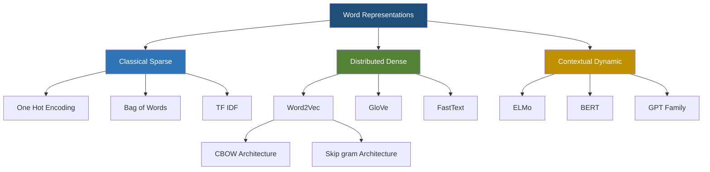
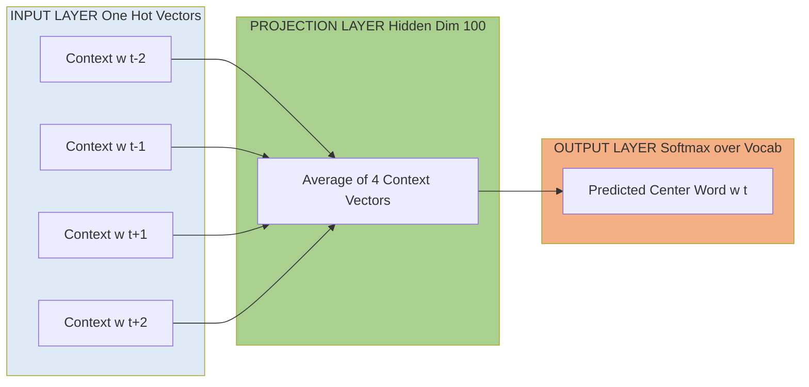
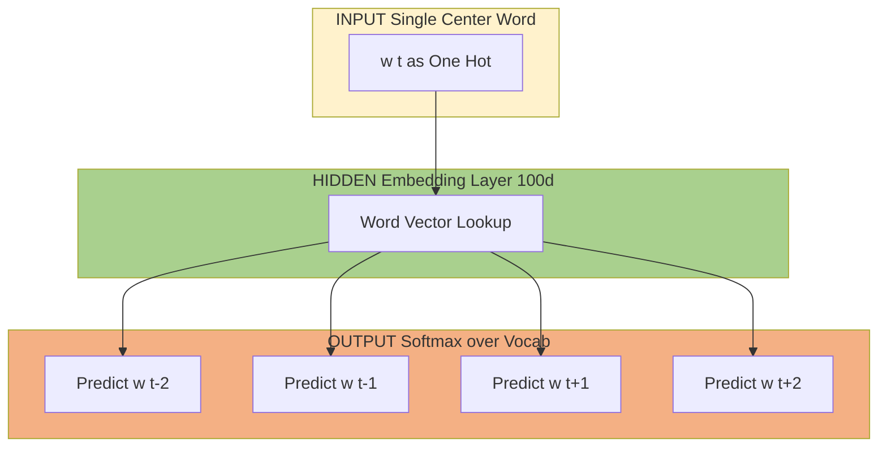
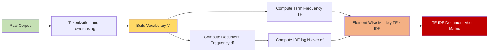
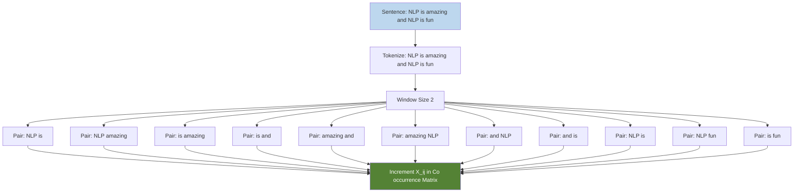
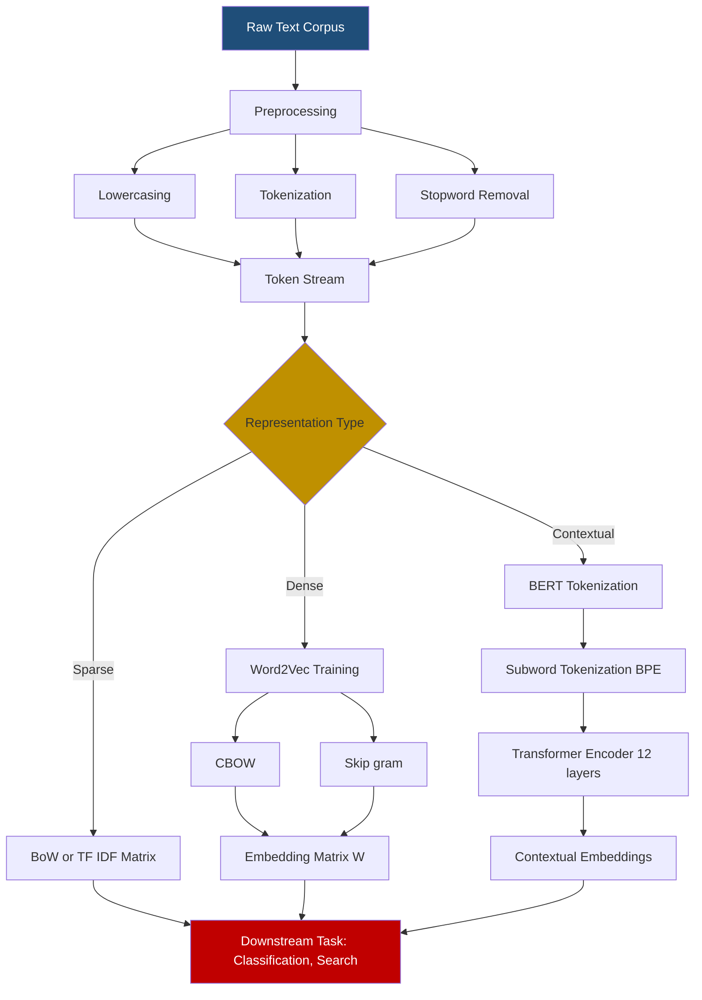

# Word representations

<!-- SECTION_1_START -->
# Word Representations in NLP

## 1.1 Core Technical Definition

**Word Representation** is the foundational concept in Natural Language Processing (NLP) that refers to the mathematical encoding of linguistic units (words, sub-words, or tokens) into dense or sparse numerical vectors that machine learning models can process. Under the KTU 2024 Scheme (PECST862 - Natural Language Processing), word representations are categorized based on their distributional properties, dimensionality, and semantic fidelity.

> [!IMPORTANT]
> **Formal Definition (KTU 2024 Syllabus):**
> A word representation is a function $f: \mathcal{V} \rightarrow \mathbb{R}^d$ that maps each word $w$ from a vocabulary $\mathcal{V}$ to a $d$-dimensional real-valued vector $\vec{w} \in \mathbb{R}^d$, such that semantic similarity between words is preserved as geometric proximity (e.g., cosine similarity) in the embedding space.

> [!NOTE]
> **Distributional Hypothesis (Firth, 1957):** *"You shall know a word by the company it keeps."* This is the philosophical foundation of all modern word embeddings. Words appearing in similar contexts tend to have similar meanings.

### 1.2 Conceptual Analogy — The "Semantic GPS Coordinates"

Imagine you are assigning **GPS coordinates to every word in the English language**. Just like Delhi and Mumbai are far apart on a map, the words "king" and "banana" should be geometrically distant in vector space. But "king" and "queen" should be neighbors, and the vector from "king" to "queen" should mirror the vector from "man" to "woman".

This famous property is captured by the equation:

$$\vec{king} - \vec{man} + \vec{woman} \approx \vec{queen}$$

**Real-World Analogy:** Think of a library. Traditional indexing (one-hot) treats every book as completely unique with no relation to others. Word embeddings, however, create a **"smart catalog"** where books on similar topics are physically shelved close together, so when you search for "physics", the system knows to also suggest "astronomy".

### 1.3 Taxonomy of Word Representations

| Type | Examples | Dimensionality | Semantic Awareness |
|------|----------|----------------|-------------------|
| **Discrete/Sparse** | One-Hot, Bag-of-Words, TF-IDF | $\vert \mathcal{V} \vert$ (vocab size) | ❌ No |
| **Distributed/Dense** | Word2Vec, GloVe, FastText | 50–300 (fixed) | ✅ Yes |
| **Contextual** | ELMo, BERT, GPT | 768–4096 (dynamic) | ✅✅ Polysemy-aware |

> [!TIP]
> **Key Distinction:** In **static embeddings** (Word2Vec, GloVe), each word has ONE fixed vector. In **contextual embeddings** (BERT), the same word gets DIFFERENT vectors depending on its sentence context. This solves the **polysemy problem** (e.g., "bank" as river bank vs. money bank).

> [!VISUALIZATION CONTROL]
> **Concept:** 2D Word Embedding Space (Semantic Clustering)
> **GeoGebra / Desmos Input Points:**
> * `P_king = (2.9, 4.1)` and `P_queen = (3.1, 3.9)`
> * `P_man = (1.0, 0.5)` and `P_woman = (0.8, 0.3)`
> * `P_apple = (-3.5, -2.1)` and `P_banana = (-3.2, -1.8)`
> **Visual Description:** Students should observe two tight clusters — a "royalty" cluster in the upper-right quadrant and a "fruit" cluster in the lower-left. The vector difference between "king" and "man" should be parallel to the difference between "queen" and "woman", demonstrating linear semantic analogies in embedding space.
<!-- SECTION_1_END -->

<!-- SECTION_2_START -->
# 2. Deep Theoretical Analysis & High-Yield Formula Sheet

## 2.1 One-Hot Encoding (OHE)

Each word in vocabulary $\mathcal{V}$ is represented as a binary vector of length $\vert \mathcal{V} \vert$ with exactly one position set to **1** and the rest to **0**.

**Step-by-step logic:**
* Let $\mathcal{V} = \{w_1, w_2, \ldots, w_n\}$ be the vocabulary.
* Each word $w_i$ is mapped to a vector $\vec{e}_i \in \{0, 1\}^n$ such that the $i$-th coordinate is $1$ and all others are $0$.
* This is equivalent to the standard basis vector $\vec{e}_i$ in $\mathbb{R}^n$.

**Why it fails (the curse of dimensionality):**
* For a vocabulary of **100,000 words**, every word becomes a 100,000-dimensional vector — computationally expensive.
* Every pair of distinct words is **orthogonal**: $\vec{e}_i \cdot \vec{e}_j = 0$ for $i \neq j$. This means the model has **no notion of similarity**.

> [!IMPORTANT]
> **Syllabus Highlight:** One-hot encoding is the **baseline** representation. It is *not* an "embedding" because it is non-distributional. KTU examiners often test whether students can articulate this distinction.

## 2.2 Bag-of-Words (BoW)

BoW converts a document into a vector of word counts, completely **ignoring word order and grammar**.

**Mathematical Formulation:**
* Let $D = \{d_1, d_2, \ldots, d_m\}$ be a corpus of $m$ documents.
* For a document $d_j$, the BoW vector is $\vec{d}_j \in \mathbb{R}^{\vert \mathcal{V} \vert}$ where the $i$-th component is:
$$d_j[i] = \text{count}(w_i \in d_j)$$

**Limitations:**
* **Sparse matrix problem**: Most entries are zero.
* **No semantic understanding**: "I love NLP" and "NLP loves me" produce identical vectors.
* **Out-of-vocabulary (OOV) words** are silently dropped.

## 2.3 TF-IDF (Term Frequency–Inverse Document Frequency)

TF-IDF solves BoW's main weakness: it **down-weights common words** (like "the", "is") and **up-weights discriminative words**.

**The three components:**

**Term Frequency (TF):** Measures how often a word appears in a document.

$$\text{TF}(w, d) = \frac{\text{count of } w \text{ in } d}{\text{total words in } d}$$

**Inverse Document Frequency (IDF):** Measures how *rare* a word is across the entire corpus.

$$\text{IDF}(w, \mathcal{D}) = \log\left(\frac{N}{\vert \{d \in \mathcal{D} : w \in d\} \vert}\right)$$

where $N$ is the total number of documents and the denominator is the number of documents containing $w$.

**Final TF-IDF Score:**

$$\text{TF-IDF}(w, d) = \text{TF}(w, d) \times \text{IDF}(w, \mathcal{D})$$

> [!NOTE]
> **Smoothed IDF variant** (commonly used in `scikit-learn`): $\text{IDF}(w) = \log\left(\frac{N + 1}{df(w) + 1}\right) + 1$, where $df(w)$ is document frequency. The $+1$ smoothing prevents division by zero for unseen words.

## 2.4 Word2Vec (Mikolov et al., 2013)

Word2Vec learns dense, low-dimensional embeddings by training a **shallow neural network** on a fake task (predicting neighboring words). It has two architectures:

### 2.4.1 Continuous Bag-of-Words (CBOW)
* **Goal:** Predict the **center word** $w_t$ from a window of **context words** $\{w_{t-c}, \ldots, w_{t-1}, w_{t+1}, \ldots, w_{t+c}\}$.
* **Architecture:** Input (one-hot) → Projection (averaged) → Hidden layer → Softmax output.
* **Best for:** Small datasets, faster training.

### 2.4.2 Skip-gram
* **Goal:** Predict the **surrounding context words** given a single center word $w_t$.
* **Architecture:** Input → Hidden layer → Softmax over vocabulary.
* **Best for:** Large datasets, captures rare words better.

**Softmax Objective (vanilla formulation):**

$$P(w_O \mid w_I) = \frac{\exp\left(\vec{v}_{w_O}^{\,\prime\,T} \vec{v}_{w_I}\right)}{\sum_{w=1}^{\vert \mathcal{V} \vert} \exp\left(\vec{v}_w^{\,\prime\,T} \vec{v}_{w_I}\right)}$$

where $\vec{v}_w$ is the input (center) vector and $\vec{v}_w^{\,\prime}$ is the output (context) vector for word $w$.

> [!IMPORTANT]
> **Negative Sampling** replaces the expensive softmax denominator with a binary classification: distinguish the true context word from $k$ randomly sampled "noise" words. This reduces complexity from $O(\vert \mathcal{V} \vert)$ to $O(k)$, where $k$ is typically 5–20.

## 2.5 GloVe (Global Vectors, Stanford 2014)

GloVe combines the **global co-occurrence statistics** of matrix factorization methods (like LSA) with the **local context window** of Word2Vec.

**Co-occurrence Matrix:** Let $X_{ij}$ be the number of times word $j$ appears in the context of word $i$.

**GloVe Objective Function:**

$$J = \sum_{i,j=1}^{\vert \mathcal{V} \vert} f(X_{ij}) \left( \vec{v}_i^T \vec{v}_j + b_i + b_j - \log X_{ij} \right)^2$$

where $f(X_{ij})$ is a weighting function that prevents rare co-occurrences from dominating:

$$f(x) = \begin{cases} (x / x_{\max})^\alpha & \text{if } x < x_{\max} \\ 1 & \text{otherwise} \end{cases}$$

with typical values $x_{\max} = 100$ and $\alpha = 0.75$.

## 2.6 FastText (Bojanowski et al., 2017)

Unlike Word2Vec, FastText represents each word as a **bag of character n-grams**. For the word "where" with $n=3$, the n-grams are `\<wh`, `whe`, `her`, `ere`, `re\>` plus the full word.

**Word vector formula:**

$$\vec{v}_w = \sum_{g \in \mathcal{G}_w} \vec{z}_g$$

where $\mathcal{G}_w$ is the set of n-grams in word $w$ and $\vec{z}_g$ is the vector for n-gram $g$.

> [!TIP]
> **Why FastText matters:** It naturally handles **Out-Of-Vocabulary (OOV)** words by summing n-gram vectors. This is critical for morphologically rich languages (e.g., Malayalam, German, Finnish).

## 2.7 KTU Formula Cheat Sheet

| Method | Core Formula | Output Dim | Semantic? | OOV Safe? |
|--------|--------------|------------|-----------|-----------|
| **One-Hot** | $\vec{e}_i \in \{0,1\}^{\vert \mathcal{V} \vert}$ | $\vert \mathcal{V} \vert$ | ❌ | ❌ |
| **BoW** | $d_j[i] = \text{count}(w_i, d_j)$ | $\vert \mathcal{V} \vert$ | ❌ | ❌ |
| **TF-IDF** | $\text{TF}(w,d) \cdot \log\left(\frac{N}{df(w)}\right)$ | $\vert \mathcal{V} \vert$ | ❌ (weighting) | ❌ |
| **Word2Vec** | $\text{softmax}(\vec{v}_{w_O}^{\,\prime\,T} \vec{v}_{w_I})$ | 50–300 | ✅ | ❌ |
| **GloVe** | $\min \sum f(X_{ij})(v_i^T v_j + b_i + b_j - \log X_{ij})^2$ | 50–300 | ✅ | ❌ |
| **FastText** | $\vec{v}_w = \sum_{g \in \mathcal{G}_w} \vec{z}_g$ | 50–300 | ✅ | ✅ |
| **BERT** | Transformer-based, 12–24 layers | 768–1024 | ✅✅ (contextual) | ✅ (sub-words) |

### Real-World Engineering Utility

> [!IMPORTANT]
> **Production Use Cases:**
> 1. **Search Engines (Google, Bing):** Use BERT embeddings for semantic ranking beyond keyword matching.
> 2. **Recommendation Systems (Netflix, Spotify):** Use item embeddings trained via item2vec (Word2Vec on user behavior sequences).
> 3. **Chatbots & Virtual Assistants:** Use sentence embeddings (Sentence-BERT) for intent classification.
> 4. **Machine Translation (Google Translate):** Transitioned from word-level to contextual sub-word embeddings in 2016–2017.
> 5. **Sentiment Analysis:** Twitter, Product Reviews use domain-specific FastText embeddings.
<!-- SECTION_2_END -->

<!-- SECTION_3_START -->
# 3. Step-by-Step Derivations & Code Implementation

## 3.1 Worked Example: TF-IDF Computation by Hand

**Corpus** (3 documents):
* $d_1$ = "the cat sat on the mat"
* $d_2$ = "the dog sat on the log"
* $d_3$ = "cats and dogs are pets"

**Step 1: Build Vocabulary**
$$\mathcal{V} = \{\text{the, cat, sat, on, mat, dog, log, cats, and, dogs, are, pets}\}, \quad \vert \mathcal{V} \vert = 12$$

(After lowercasing and unique-ification.)

**Step 2: Term Frequencies for $d_1$**
Total words in $d_1 = 6$. Term frequencies:
* $\text{TF}(\text{the}, d_1) = 2/6 = 0.333$
* $\text{TF}(\text{cat}, d_1) = 1/6 = 0.167$
* $\text{TF}(\text{sat}, d_1) = 1/6 = 0.167$
* $\text{TF}(\text{on}, d_1) = 1/6 = 0.167$
* $\text{TF}(\text{mat}, d_1) = 1/6 = 0.167$
* All others = $0$

**Step 3: Document Frequencies**
* $df(\text{the}) = 2$ (appears in $d_1$, $d_2$)
* $df(\text{cat}) = 1$ (only in $d_1$)
* $df(\text{sat}) = 2$ (in $d_1$, $d_2$)
* $df(\text{on}) = 2$ (in $d_1$, $d_2$)
* $df(\text{mat}) = 1$ (only in $d_1$)
* $df(\text{dog}) = 1$ (only in $d_2$)
* $df(\text{log}) = 1$ (only in $d_2$)
* $df(\text{cats}) = 1$ (only in $d_3$)
* $df(\text{and}) = 1$ (only in $d_3$)
* $df(\text{dogs}) = 1$ (only in $d_3$)
* $df(\text{are}) = 1$ (only in $d_3$)
* $df(\text{pets}) = 1$ (only in $d_3$)

**Step 4: Inverse Document Frequencies** ($N = 3$)
* $\text{IDF}(\text{the}) = \log(3/2) = \log(1.5) \approx 0.176$
* $\text{IDF}(\text{cat}) = \log(3/1) = \log(3) \approx 1.099$
* $\text{IDF}(\text{sat}) = \log(3/2) \approx 0.176$
* $\text{IDF}(\text{on}) = \log(3/2) \approx 0.176$
* $\text{IDF}(\text{mat}) = \log(3/1) \approx 1.099$

**Step 5: Final TF-IDF Vector for $d_1$**

$$\text{TF-IDF}(d_1) = [0.333 \times 0.176, \; 0.167 \times 1.099, \; 0.167 \times 0.176, \; 0.167 \times 0.176, \; 0.167 \times 1.099, \; 0, \ldots, 0]$$

$$= [0.0587, \; 0.1835, \; 0.0294, \; 0.0294, \; 0.1835, \; 0, \; 0, \; 0, \; 0, \; 0, \; 0, \; 0]$$

> [!NOTE]
> **Observation:** Common words like "the" and "sat" have small TF-IDF weights ($\approx 0.03$–$0.06$), while discriminative words like "cat" and "mat" have high weights ($\approx 0.18$). This is exactly the desired behavior.

## 3.2 Cosine Similarity Between Word Vectors

Given two vectors $\vec{u}$ and $\vec{v}$, **cosine similarity** measures the angle between them:

$$\text{cos\_sim}(\vec{u}, \vec{v}) = \frac{\vec{u} \cdot \vec{v}}{\Vert \vec{u} \Vert_2 \cdot \Vert \vec{v} \Vert_2}$$

**Worked Example:** Let $\vec{u} = [1, 2, 3]$ and $\vec{v} = [4, 5, 6]$.

**Step 1: Dot Product**
$$\vec{u} \cdot \vec{v} = (1)(4) + (2)(5) + (3)(6) = 4 + 10 + 18 = 32$$

**Step 2: Magnitudes**
$$\Vert \vec{u} \Vert_2 = \sqrt{1^2 + 2^2 + 3^2} = \sqrt{1 + 4 + 9} = \sqrt{14} \approx 3.742$$

$$\Vert \vec{v} \Vert_2 = \sqrt{4^2 + 5^2 + 6^2} = \sqrt{16 + 25 + 36} = \sqrt{77} \approx 8.775$$

**Step 3: Cosine Similarity**
$$\text{cos\_sim} = \frac{32}{3.742 \times 8.775} = \frac{32}{32.836} \approx 0.975$$

> [!TIP]
> **Interpretation:** A value of $0.975$ indicates the two vectors point in nearly the same direction → high semantic similarity. Range: $[-1, +1]$.

## 3.3 Full Python Implementation

```python
import numpy as np
from collections import Counter
from typing import List, Dict, Tuple
import math

# ============================================================
# MODULE 1: ONE-HOT ENCODING
# ============================================================
class OneHotEncoder:
    """Encodes words as orthogonal binary vectors."""
    
    def __init__(self, corpus: List[str]) -> None:
        tokens: List[str] = []
        for sentence in corpus:
            tokens.extend(sentence.lower().split())
        self.vocab: List[str] = sorted(set(tokens))
        self.word_to_idx: Dict[str, int] = {
            word: idx for idx, word in enumerate(self.vocab)
        }
        self.vocab_size: int = len(self.vocab)
    
    def encode(self, word: str) -> np.ndarray:
        if word not in self.word_to_idx:
            raise KeyError(f"Word '{word}' not in vocabulary.")
        vector: np.ndarray = np.zeros(self.vocab_size, dtype=np.int8)
        vector[self.word_to_idx[word]] = 1
        return vector
    
    def decode(self, vector: np.ndarray) -> str:
        if vector.sum() != 1:
            raise ValueError("Invalid one-hot vector: must contain exactly one '1'.")
        return self.vocab[int(np.argmax(vector))]

# ============================================================
# MODULE 2: BAG-OF-WORDS
# ============================================================
class BagOfWords:
    """Builds document-term count matrix."""
    
    def __init__(self, corpus: List[str]) -> None:
        self.encoder: OneHotEncoder = OneHotEncoder(corpus)
    
    def vectorize(self, document: str) -> np.ndarray:
        tokens: List[str] = document.lower().split()
        counts: np.ndarray = np.zeros(self.encoder.vocab_size, dtype=np.int32)
        for token in tokens:
            if token in self.encoder.word_to_idx:
                counts[self.encoder.word_to_idx[token]] += 1
        return counts

# ============================================================
# MODULE 3: TF-IDF
# ============================================================
class TFIDFVectorizer:
    """Computes Term Frequency - Inverse Document Frequency."""
    
    def __init__(self, corpus: List[str]) -> None:
        self.corpus: List[str] = corpus
        self.encoder: OneHotEncoder = OneHotEncoder(corpus)
        self.vocab_size: int = self.encoder.vocab_size
        self.num_docs: int = len(corpus)
        self._idf: np.ndarray = self._compute_idf()
    
    def _compute_idf(self) -> np.ndarray:
        df: np.ndarray = np.zeros(self.vocab_size, dtype=np.float64)
        for document in self.corpus:
            unique_words: set = set(document.lower().split())
            for word in unique_words:
                if word in self.encoder.word_to_idx:
                    df[self.encoder.word_to_idx[word]] += 1
        # Smoothed IDF: log((N+1)/(df+1)) + 1
        idf: np.ndarray = np.log((self.num_docs + 1) / (df + 1)) + 1.0
        return idf
    
    def vectorize(self, document: str) -> np.ndarray:
        tokens: List[str] = document.lower().split()
        tf: np.ndarray = np.zeros(self.vocab_size, dtype=np.float64)
        token_counts: Counter = Counter(tokens)
        total_terms: int = len(tokens)
        for word, count in token_counts.items():
            if word in self.encoder.word_to_idx:
                idx: int = self.encoder.word_to_idx[word]
                tf[idx] = (count / total_terms) * self._idf[idx]
        return tf

# ============================================================
# MODULE 4: COSINE SIMILARITY
# ============================================================
def cosine_similarity(vec_a: np.ndarray, vec_b: np.ndarray) -> float:
    """Returns cosine similarity between two non-zero vectors."""
    norm_a: float = np.linalg.norm(vec_a)
    norm_b: float = np.linalg.norm(vec_b)
    if norm_a == 0 or norm_b == 0:
        return 0.0
    return float(np.dot(vec_a, vec_b) / (norm_a * norm_b))

# ============================================================
# MODULE 5: WORD2VEC-STYLE RANDOM EMBEDDING DEMO
# (For full Word2Vec, use gensim: w2v_model = Word2Vec(sentences))
# ============================================================
class WordEmbedding:
    """Demonstrates dense vector lookup with semantic analogy math."""
    
    def __init__(self, embedding_dim: int = 50) -> None:
        self.embedding_dim: int = embedding_dim
        self.embeddings: Dict[str, np.ndarray] = {}
    
    def add_word(self, word: str, vector: np.ndarray) -> None:
        if vector.shape[0] != self.embedding_dim:
            raise ValueError(
                f"Expected dim {self.embedding_dim}, got {vector.shape[0]}"
            )
        self.embeddings[word] = vector
    
    def analogy(
        self, a: str, b: str, c: str, top_k: int = 3
    ) -> List[Tuple[str, float]]:
        """
        Solves: a is to b as c is to ?
        Vector math: vec(b) - vec(a) + vec(c)
        """
        target_vec: np.ndarray = (
            self.embeddings[b] - self.embeddings[a] + self.embeddings[c]
        )
        results: List[Tuple[str, float]] = []
        for word, vec in self.embeddings.items():
            if word in {a, b, c}:
                continue
            sim: float = cosine_similarity(target_vec, vec)
            results.append((word, sim))
        results.sort(key=lambda x: x[1], reverse=True)
        return results[:top_k]

# ============================================================
# DRIVER: Demonstration Run
# ============================================================
if __name__ == "__main__":
    # Sample corpus
    corpus: List[str] = [
        "the cat sat on the mat",
        "the dog sat on the log",
        "cats and dogs are pets"
    ]
    
    # 1. One-Hot
    ohe: OneHotEncoder = OneHotEncoder(corpus)
    print("One-Hot 'cat':", ohe.encode("cat"))
    print("Decoded:", ohe.decode(ohe.encode("cat")))
    
    # 2. BoW
    bow: BagOfWords = BagOfWords(corpus)
    print("BoW d1:", bow.vectorize(corpus[0]))
    
    # 3. TF-IDF
    tfidf: TFIDFVectorizer = TFIDFVectorizer(corpus)
    vec_d1: np.ndarray = tfidf.vectorize(corpus[0])
    print("TF-IDF d1:", np.round(vec_d1, 4))
    
    # 4. Cosine similarity between d1 and d2
    vec_d2: np.ndarray = tfidf.vectorize(corpus[1])
    print(
        "Cosine(d1, d2):", 
        round(cosine_similarity(vec_d1, vec_d2), 4)
    )
    
    # 5. Analogy demo (toy embeddings)
    emb: WordEmbedding = WordEmbedding(embedding_dim=4)
    emb.add_word("king",  np.array([1.0, 1.0, 0.0, 0.0]))
    emb.add_word("man",   np.array([1.0, 0.0, 0.0, 0.0]))
    emb.add_word("queen", np.array([1.0, 1.0, 0.5, 0.5]))
    emb.add_word("woman", np.array([1.0, 0.0, 0.5, 0.5]))
    print(
        "Analogy king:man :: woman:? ->", 
        emb.analogy("king", "queen", "woman")
    )
```

> [!IMPORTANT]
> **Production Tip:** For real Word2Vec/FastText training, use the `gensim` library. Example:
> ```python
> from gensim.models import Word2Vec
> model = Word2Vec(sentences=tokenized_corpus, vector_size=100, 
>                  window=5, min_count=2, workers=4, epochs=10)
> vector = model.wv['nlp']  # Retrieve 100-dim vector
> ```
<!-- SECTION_3_END -->

<!-- SECTION_4_START -->
# 4. Structural Diagrams & Schematics

## 4.1 Word Representation Taxonomy (Hierarchical Flow)



## 4.2 Continuous Bag-of-Words (CBOW) Processing Topology



## 4.3 Skip-Gram Architecture Topology



## 4.4 TF-IDF Computation Pipeline



## 4.5 Co-occurrence Matrix Construction (for GloVe)



## 4.6 Sequential Processing Topology: From Raw Text to Embeddings


<!-- SECTION_4_END -->

<!-- SECTION_5_START -->
# 5. KTU 2024 Scheme Examination Question Bank

## Part A — Short Answer Questions (3 Marks Each)

### Question 1
**[KTU University Exam - Dec 2023]** — **CO1 / Remember**
Explain the **Distributional Hypothesis** as proposed by J.R. Firth. How does it form the theoretical foundation of modern word embeddings?

**Model Answer (3 Marks):**
The Distributional Hypothesis, stated by linguist J.R. Firth in 1957, asserts that **"You shall know a word by the company it keeps"**. In other words, words that occur in similar contexts tend to have similar meanings. [1 Mark]
This hypothesis forms the theoretical basis for distributional semantic models like Word2Vec, GloVe, and FastText. [1 Mark]
These models learn word representations by analyzing the surrounding context words — words with similar neighbors in large corpora are mapped to nearby points in the embedding space, thereby capturing semantic similarity geometrically. [1 Mark]

### Question 2
**[KTU University Exam - July 2024]** — **CO1 / Understand**
Differentiate between **One-Hot Encoding** and **Word2Vec** representations. List any two advantages Word2Vec has over One-Hot Encoding.

**Model Answer (3 Marks):**
| Aspect | One-Hot Encoding | Word2Vec |
|---|---|---|
| Dimensionality | Equals $\vert \mathcal{V} \vert$ (high) | 50–300 (low, fixed) |
| Semantic info | None — orthogonal vectors | Captures meaning via context |
| Similarity measure | Always zero dot product | Cosine similarity meaningful |
[1 Mark for clear distinction]

**Advantages of Word2Vec:** [1 Mark each]
1. **Dimensionality Reduction:** Vectors are dense and low-dimensional, reducing memory and compute.
2. **Semantic Preservation:** Similar words (e.g., "happy", "joyful") have similar vectors, enabling semantic arithmetic like $\vec{king} - \vec{man} + \vec{woman} \approx \vec{queen}$.

## Part B — Long Answer Questions (14 Marks Each, with Internal Choice)

### Question A

**[KTU University Exam - Dec 2023]** — **CO1, CO2 / Understand, Apply**

**(a)** Explain the **CBOW** and **Skip-gram** architectures of Word2Vec with neat diagrams. Compare their strengths and weaknesses. **[7 Marks]**

**(b)** Given the following three documents:
* $d_1$ = "natural language processing is fun"
* $d_2$ = "language models are powerful"
* $d_3$ = "natural models process language data"

Compute the **TF-IDF vector for $d_1$**. **[7 Marks]**

---

#### Model Solution for (a) — 7 Marks

**[Stating CBOW objective: 1 Mark]**
CBOW predicts the **center word** from a window of surrounding context words. For a window of size $c$, given context $\{w_{t-c}, \ldots, w_{t-1}, w_{t+1}, \ldots, w_{t+c}\}$, the model maximizes:

$$P(w_t \mid \text{context}) = \frac{\exp(\vec{v}_{w_t}^T \cdot \vec{h})}{\sum_{i=1}^{\vert \mathcal{V} \vert} \exp(\vec{v}_{w_i}^T \cdot \vec{h})}$$

where $\vec{h} = \frac{1}{2c}\sum_{-c \leq j \leq c, j \neq 0} \vec{v}_{w_{t+j}}$ is the averaged projection of context vectors. [1 Mark]

**[Stating Skip-gram objective: 1 Mark]**
Skip-gram does the inverse: given a center word $w_t$, it predicts each surrounding context word independently:

$$P(w_{t+j} \mid w_t) = \frac{\exp(\vec{v}_{w_{t+j}}^{\,\prime\,T} \vec{v}_{w_t})}{\sum_{i=1}^{\vert \mathcal{V} \vert} \exp(\vec{v}_{w_i}^{\,\prime\,T} \vec{v}_{w_t})}$$

[1 Mark]

**[Diagrams (CBOW and Skip-gram): 2 Marks]** — Refer to Section 4.2 and 4.3 schematics.

**[Comparison Table: 2 Marks]**

| Criterion | CBOW | Skip-gram |
|---|---|---|
| Speed | Faster | Slower (multiple outputs) |
| Rare words | Poor representation | Better for rare words |
| Training data | Works on small data | Needs more data |
| Use case | Frequent words | Semantic tasks |

---

#### Model Solution for (b) — 7 Marks

**Step 1: Vocabulary Construction** [1 Mark]
Lowercase, tokenize, dedupe:
$$\mathcal{V} = \{\text{natural, language, processing, is, fun, models, are, powerful, process, data}\}, \quad \vert \mathcal{V} \vert = 10$$

**Step 2: Term Frequencies for $d_1$** [1 Mark]
Total terms in $d_1$ = 5.
* $\text{TF}(\text{natural}, d_1) = 1/5 = 0.2$
* $\text{TF}(\text{language}, d_1) = 1/5 = 0.2$
* $\text{TF}(\text{processing}, d_1) = 1/5 = 0.2$
* $\text{TF}(\text{is}, d_1) = 1/5 = 0.2$
* $\text{TF}(\text{fun}, d_1) = 1/5 = 0.2$

**Step 3: Document Frequencies** [1 Mark]
* $df(\text{natural}) = 2$ ($d_1, d_3$)
* $df(\text{language}) = 3$ (all docs)
* $df(\text{processing}) = 1$ ($d_1$)
* $df(\text{is}) = 1$ ($d_1$)
* $df(\text{fun}) = 1$ ($d_1$)

**Step 4: IDF Values** ($N=3$) [1 Mark]
* $\text{IDF}(\text{natural}) = \log(3/2) \approx 0.405$
* $\text{IDF}(\text{language}) = \log(3/3) = 0$
* $\text{IDF}(\text{processing}) = \log(3/1) \approx 1.099$
* $\text{IDF}(\text{is}) = \log(3/1) \approx 1.099$
* $\text{IDF}(\text{fun}) = \log(3/1) \approx 1.099$

**Step 5: Final TF-IDF Vector for $d_1$** [2 Marks — 1 for formula application, 1 for final vector]

Using the order of $\mathcal{V}$:

$$\text{TF-IDF}(d_1) = [0.2 \times 0.405, \; 0.2 \times 0, \; 0.2 \times 1.099, \; 0.2 \times 1.099, \; 0.2 \times 1.099, \; 0, \; 0, \; 0, \; 0, \; 0]$$

$$= [0.081, \; 0, \; 0.220, \; 0.220, \; 0.220, \; 0, \; 0, \; 0, \; 0, \; 0]$$

**[Final simplified vector with 3-decimal precision: 1 Mark]**

> [!WARNING]
> **KTU Examiner's Valuation Pitfalls:**
> 1. Forgetting to **lowercase** before building vocabulary — case-sensitive duplicates cause wrong word counts.
> 2. Using $\log_{10}$ instead of natural $\log$ — both accepted, but **be consistent** within the same answer.
> 3. **NOT** handling the "language" case where $\text{IDF} = 0$ — students often mistakenly compute $\log(1) \neq 0$.
> 4. Failing to mention **smoothed IDF** if the formula $N/df$ gives division-by-zero or extreme values.

---

### Question B (Alternative Choice)

**[KTU University Exam - July 2024]** — **CO1, CO2 / Understand, Apply**

**(a)** Explain the **GloVe (Global Vectors)** model for word representation. Write its objective function and explain each term. **[7 Marks]**

**(b)** With a suitable example, explain how **FastText** handles **Out-Of-Vocabulary (OOV)** words better than Word2Vec. **[7 Marks]**

#### Model Solution for (a) — 7 Marks

**[Introduction to GloVe: 1 Mark]**
GloVe, proposed by Pennington et al. (Stanford, 2014), is a **count-based + prediction-based hybrid** model. It leverages the **global co-occurrence matrix** $X$ of the entire corpus, unlike Word2Vec which only uses local context windows.

**[Co-occurrence matrix definition: 1 Mark]**
Let $X_{ij}$ denote the number of times word $j$ appears in the context of word $i$ within the entire corpus. The probability $P_{ij} = P(w_j \mid w_i) = X_{ij} / X_i$ where $X_i = \sum_k X_{ik}$.

**[Objective function: 2 Marks]**
The GloVe objective is:

$$J = \sum_{i,j=1}^{\vert \mathcal{V} \vert} f(X_{ij}) \left( \vec{v}_i^T \vec{v}_j + b_i + b_j - \log X_{ij} \right)^2$$

Term-by-term explanation:
* $\vec{v}_i, \vec{v}_j$: word vectors for target and context words. [0.5 Mark]
* $b_i, b_j$: bias terms (scalars) to restore translation invariance. [0.5 Mark]
* $\log X_{ij}$: logarithm of co-occurrence count, derived from the ratio of co-occurrence probabilities. [0.5 Mark]
* $f(X_{ij})$: weighting function (zero for $X_{ij}=0$, capped at 1 to avoid overweighting rare pairs). [0.5 Mark]

**[Weighting function: 1 Mark]**
$$f(x) = \begin{cases} (x / x_{\max})^\alpha & \text{if } x < x_{\max} \\ 1 & \text{otherwise} \end{cases}$$
with $x_{\max} = 100$, $\alpha = 0.75$.

**[Advantages over Word2Vec: 2 Marks]**
1. **Global statistics:** Uses entire corpus co-occurrence, not just local windows.
2. **Faster convergence:** Often reaches better embeddings with less training data.
3. **Parallelizable:** The objective decomposes over $(i,j)$ pairs.

---

#### Model Solution for (b) — 7 Marks

**[Stating the OOV Problem in Word2Vec: 1 Mark]**
Word2Vec assigns a unique ID to every word in the **training vocabulary**. Any word not seen during training receives **no embedding vector** — it cannot be used in downstream tasks. This is a critical limitation for morphologically rich languages (e.g., Malayalam, Turkish, German) where thousands of new word forms appear frequently.

**[FastText's n-gram approach: 2 Marks]**
FastText (Bojanowski et al., 2017) extends Word2Vec by representing each word as a **bag of character n-grams**. For the word "processing" with $n=3$ and special boundary markers `<` and `>`:
$$\mathcal{G}_{\text{processing}} = \{<\text{pr}, \text{pro}, \text{ro}, \text{roc}, \text{oce}, \text{ces}, \text{ssi}, \text{ess}, \text{ssi}, \text{sin}, \text{ing}, \text{ng}>, <\text{processing}>\}$$

Each n-gram has its own vector; the word vector is their sum: $\vec{v}_{\text{processing}} = \sum_{g \in \mathcal{G}} \vec{z}_g$. [1 Mark for formula, 1 Mark for example]

**[OOV Handling Example: 2 Marks]**
Suppose "processed" never appeared in training. Word2Vec → **fails** (no vector). FastText:
1. Decompose "processed" into its 3-grams: `<pr, pro, ro, ... , ssed, sed, ed>`.
2. All these 3-grams have vectors from the training phase (because they appeared in "processing" and similar words).
3. Compute $\vec{v}_{\text{processed}} = \sum_{g} \vec{z}_g$ — a meaningful vector emerges! [2 Marks]

**[Bonus: Subword Information: 1 Mark]**
FastText also captures morphological relationships: "run", "running", "runner" share many n-grams, so their vectors are naturally close — even if "running" was OOV.

**[Conclusion: 1 Mark]**
This makes FastText the preferred choice for **noisy text** (social media), **user-generated content**, and **low-resource languages** — a clear engineering advantage over vanilla Word2Vec.

> [!WARNING]
> **KTU Examiner's Valuation Pitfalls:**
> 1. Confusing **character n-grams** with **word n-grams** — FastText uses *character* level, not *word* level. Easy to lose 1 mark.
> 2. Forgetting to include **boundary tokens** (`<` and `>`) in the n-gram set — this is a common paper-pen question trick.
> 3. Omitting the **vector summation formula** $\vec{v}_w = \sum_g \vec{z}_g$ — without it, the answer is incomplete.
> 4. Not contrasting with Word2Vec explicitly — examiners expect a side-by-side comparison.

---

## Topic Recap & Important Things to Remember

> [!IMPORTANT]
> **High-Density Rapid Revision Checklist**

- **Distributional Hypothesis (Firth, 1957):** Foundation of all embeddings — words in similar contexts have similar meanings.
- **One-Hot Encoding:** Sparse, $\vert \mathcal{V} \vert$-dimensional, no semantic info, baseline representation only.
- **Bag-of-Words (BoW):** Count-based sparse vector; loses word order and grammar.
- **TF-IDF Formula:** $\text{TF}(w,d) \times \log(N / df(w))$; down-weights common words, up-weights discriminative ones.
- **Word2Vec — CBOW:** Predicts center word from context; faster, better for frequent words.
- **Word2Vec — Skip-gram:** Predicts context from center word; better for rare words, more accurate on large data.
- **Negative Sampling:** Approximates softmax; reduces complexity from $O(\vert \mathcal{V} \vert)$ to $O(k)$.
- **GloVe:** Combines global co-occurrence matrix with local context; objective uses $\log X_{ij}$.
- **FastText:** Uses character n-grams; **OOV-safe**; ideal for morphologically rich languages.
- **Cosine Similarity:** $\cos(\vec{u}, \vec{v}) = \frac{\vec{u} \cdot \vec{v}}{\Vert \vec{u} \Vert_2 \cdot \Vert \vec{v} \Vert_2}$; range $[-1, +1]$.
- **Famous Analogy:** $\vec{king} - \vec{man} + \vec{woman} \approx \vec{queen}$ — a defining property of quality embeddings.
- **Contextual vs. Static:** BERT produces different vectors for the same word in different contexts (polysemy); Word2Vec does not.
- **Vocabulary size $N$ in TF-IDF:** $N$ = number of **documents**, not number of words. Common student error.
- **Preprocessing matters:** Lowercasing, stopword removal, and tokenization are **mandatory** before any representation.
<!-- SECTION_5_END -->
