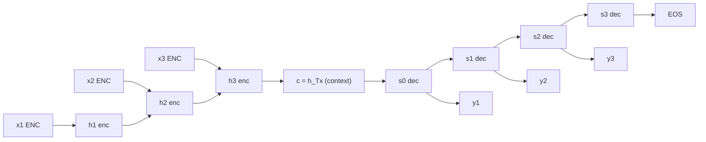
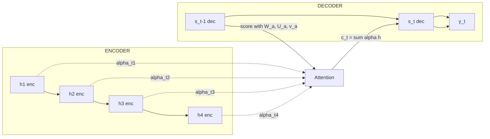
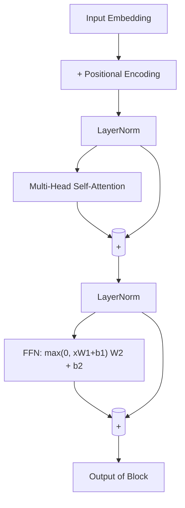
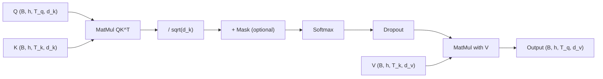
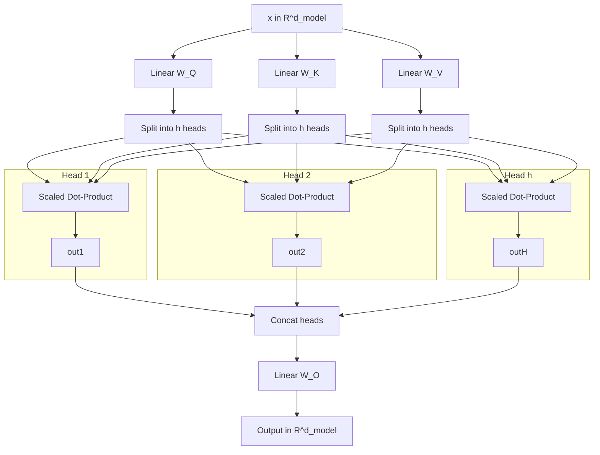
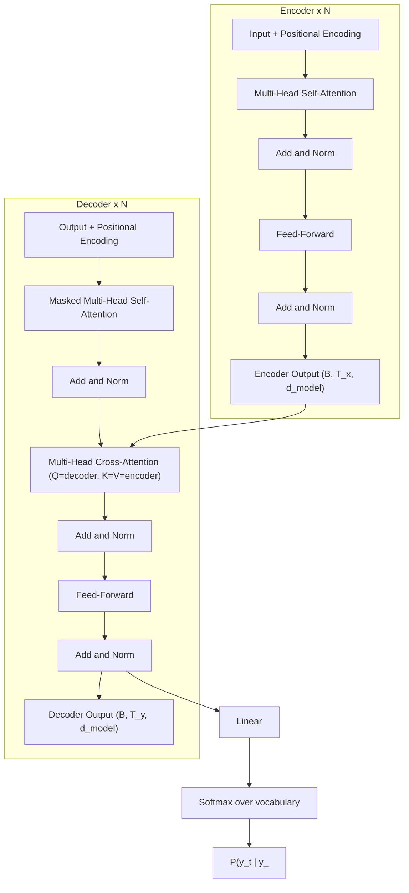
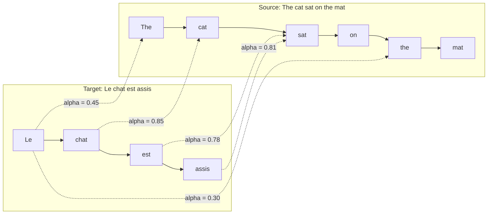

# Encoder-Decoder Model with RNNs, Attention models, Transformers

<!-- SECTION_1_START -->

# Module 4 — Sequence Modelling

## Encoder–Decoder with RNNs, Attention Models, and Transformers

### 1.1 Core Technical Definition

The **Encoder–Decoder Model** is a neural sequence transduction architecture that maps an arbitrary-length input sequence $\mathbf{X} = (x_1, x_2, \ldots, x_{T_x})$ to an arbitrary-length output sequence $\mathbf{Y} = (y_1, y_2, \ldots, y_{T_y})$ where, in general, $T_x \neq T_y$. The *encoder* compresses $\mathbf{X}$ into a fixed-dimensional latent representation (the **context vector** $\mathbf{c}$), and the *decoder* conditions on $\mathbf{c}$ to autoregressively emit $\mathbf{Y}$.

When the encoder and decoder are instantiated as Recurrent Neural Networks (RNN/LSTM/GRU), the resulting system is the canonical **Sequence-to-Sequence (Seq2Seq) model** introduced by Sutskever, Vinyals & Le (2014) and Cho et al. (2014).

The **Attention Mechanism** (Bahdanau et al., 2015; Luong et al., 2015) generalises this by allowing the decoder to consult a *dynamic*, weighted aggregation of *all* encoder hidden states at every decoding step, eliminating the information bottleneck of the fixed context vector.

The **Transformer** (Vaswani et al., *Attention Is All You Need*, NeurIPS 2017) removes recurrence entirely and is built *purely* on **Scaled Dot-Product Self-Attention**, **Multi-Head Attention**, **Positional Encoding**, residual connections, and layer normalisation. It is the foundational architecture behind BERT, GPT, T5, LLaMA, and virtually every modern LLM.

> [!IMPORTANT]
> **KTU 2024 Syllabus Anchor (PECST862 — Module 4):**
> Sequence modelling covers three progressively more powerful paradigms:
> (1) **RNN-based Encoder–Decoder** (the classical Seq2Seq),
> (2) **Attention-augmented Seq2Seq** (Bahdanau / Luong),
> (3) **Pure Attention Transformers** (Self-Attention, Multi-Head, Positional Encoding).
> Board questions frequently expect derivations of scaled dot-product attention and positional encodings, plus conceptual comparison tables.

> [!NOTE]
> **Standard Architectural Constants (Vaswani et al., 2017 — "base" model):**
> $d_{\text{model}} = \mathbf{512}$, $h = \mathbf{8}$ heads, $d_k = d_v = \mathbf{64}$,
> $N = \mathbf{6}$ encoder/decoder layers, $d_{\text{ff}} = \mathbf{2048}$,
> $\theta_{\text{dropout}} = \mathbf{0.1}$, $\epsilon_{\text{LayerNorm}} = 10^{-5}$.

---

### 1.2 Conceptual Analogy & Geometric Intuition

#### Analogy 1 — The Simultaneous Interpreter (Encoder–Decoder RNN)
Imagine a human interpreter placed in a soundproof booth. A Spanish speaker delivers the entire sentence on the other side of the glass. The interpreter can **only listen** until the speaker pauses, builds a *single mental summary* of the message, and then begins translating word-by-word into English.

* The **soundproof booth** is the *information bottleneck* — once the speaker stops, the interpreter has no further access to the original audio.
* The **mental summary** is the **context vector $\mathbf{c}$** — the final hidden state $\mathbf{h}_{T_x}$ of the encoder RNN.
* The **English translation** is the *decoder's* autoregressive output.

This is exactly how a vanilla Seq2Seq model behaves. It works for short sentences, but for long ones the interpreter (the **decoder**) starts forgetting the beginning — a phenomenon called the **long-range dependency failure** or the **bottleneck problem**.

#### Analogy 2 — The Highlighter Pen (Attention)
Now upgrade the interpreter with a **highlighter and a stack of written transcripts**. At each English word they are about to utter, they can flip back through the Spanish transcript, *highlight* the most relevant Spanish words, and base their next word on those highlights.

* The **highlighted words** correspond to large **attention weights** $\alpha_{t,t'}$.
* The **act of consulting the transcript** is the **attention mechanism** — a soft, differentiable lookup.
* Each decoded word has its **own** custom view of the source, removing the bottleneck.

Mathematically, this is a **content-based soft addressing** of a key-value memory store.

#### Analogy 3 — The Committee Meeting (Self-Attention & Transformers)
For the Transformer, abandon the interpreter metaphor. Picture a *committee of $h$ sub-teams* (the **attention heads**) all sitting around a single document. Every member can *simultaneously* look at every other member's notes, weigh their relevance, and update their own notes accordingly — all **in parallel**, with no sequential dependency.

* **Self-attention** is each token *attending to every other token in the same sequence*.
* **Multi-head attention** is several such committees, each learning a *different relational pattern* (syntactic, semantic, positional, coreference).
* **Positional encoding** is the *chair number* on each committee member — without it, the committee would be permutation-invariant and could not tell word 3 from word 7.

> [!TIP]
> **Geometric Picture of Scaled Dot-Product Attention**
> Each query vector $\mathbf{q}_i$ is a point on the unit sphere. The dot product $\mathbf{q}_i \cdot \mathbf{k}_j$ is the cosine of the angle between two directions. Softmax turns these angles into a probability simplex. Multiplying by $\mathbf{V}$ projects the values onto the weighted direction of consensus. The $\sqrt{d_k}$ scaling prevents the softmax from saturating when $d_k$ is large.

> [!VISUALIZATION CONTROL]
> **Concept:** 2-D embedding space with three word vectors and their attention weight heatmap
> **GeoGebra / Desmos Input Equations (conceptual):**
> * `q1 = (0.9, 0.1)`, `k1 = (0.8, 0.2)`, `k2 = (0.1, 0.95)`, `k3 = (0.5, 0.5)`
> * `score_ij = q_i . k_j`
> * `alpha_ij = exp(score_ij) / sum_k exp(score_ik)`
> **Visual Description:** Students should observe how the query vector's projection onto keys yields *high* weights for keys pointing in similar directions (small angular distance) and *low* weights for orthogonal keys — the geometric essence of content-based addressing.

---

<!-- SECTION_1_END -->

<!-- SECTION_2_START -->

# 2. Deep Theoretical Analysis & KTU High-Yield Formula Sheet

## 2.1 The Encoder–Decoder with RNNs (Seq2Seq)

### 2.1.1 Encoder

Given a source sequence of tokens $(x_1, x_2, \ldots, x_{T_x})$, each token is first mapped through a learned **embedding matrix** $E \in \mathbb{R}^{|V| \times d_e}$ to a dense vector $e_{x_t} \in \mathbb{R}^{d_e}$. An RNN (LSTM/GRU) then processes the sequence:

$$\mathbf{h}_t^{\text{enc}} = f_{\text{enc}}\!\left(\mathbf{h}_{t-1}^{\text{enc}}, e_{x_t}\right), \quad t = 1, 2, \ldots, T_x$$

where $f_{\text{enc}}$ is the recurrent cell. The **context vector** is conventionally the final hidden state:

$$\mathbf{c} = \mathbf{h}_{T_x}^{\text{enc}}$$

For a **bidirectional** encoder (standard in modern NMT), forward and backward states are concatenated:

$$\mathbf{h}_t^{\text{enc}} = \left[\overrightarrow{\mathbf{h}_t};\, \overleftarrow{\mathbf{h}_t}\right], \qquad \dim(\mathbf{h}_t^{\text{enc}}) = 2 d_h$$

### 2.1.2 Decoder

The decoder is also an RNN, initialised from $\mathbf{c}$ and emitting one token per step:

$$\mathbf{s}_t = f_{\text{dec}}\!\left(\mathbf{s}_{t-1},\, \mathbf{y}_{t-1},\, \mathbf{c}\right)$$

$$p(y_t \mid y_{<t}, \mathbf{X}) = g\!\left(\mathbf{s}_t, \mathbf{c}\right)$$

where $g$ is a softmax over the vocabulary: $g(\cdot) = \text{softmax}(W_o \mathbf{s}_t + b_o)$.

### 2.1.3 Teacher Forcing

During training, the ground-truth token $y_{t-1}$ is fed as input at step $t$ instead of the model's own prediction $\hat{y}_{t-1}$. This is **teacher forcing**. At inference time, teacher forcing is disabled and the model is **autoregressive** — $\hat{y}_{t-1}$ is fed back in. The mismatch is known as **exposure bias**, often mitigated by **scheduled sampling** (Bengio et al., 2015).

### 2.1.4 The Bottleneck Problem

A fixed-dimensional $\mathbf{c}$ must encode **all** semantic content of the source. Empirical studies show that translation quality degrades sharply when $T_x > 20$, and gradient signals from the decoder to the encoder vanish over long distances. This is the *motivation* for attention.

> [!NOTE]
> **Why LSTMs help but don't solve the problem:** LSTM cells use a gated memory $C_t$ that can preserve information over longer spans than vanilla RNNs, but the *final* state is still a single vector. The capacity grows only logarithmically with sequence length (in practice), so the bottleneck persists. Attention is the structural fix, not a cell-level fix.

---

## 2.2 Attention Mechanisms (Bahdanau & Luong)

### 2.2.1 Bahdanau Additive Attention (2015)

Compute a scalar *energy* $e_{t,t'}$ for every decoder step $t$ and encoder step $t'$:

$$e_{t,t'} = \mathbf{v}_a^{\top} \tanh\!\left(\mathbf{W}_a \mathbf{s}_{t-1} + \mathbf{U}_a \mathbf{h}_{t'}^{\text{enc}}\right)$$

Normalise across all $t'$ to obtain attention weights:

$$\alpha_{t,t'} = \frac{\exp(e_{t,t'})}{\sum_{k=1}^{T_x} \exp(e_{t,k})}$$

The dynamic context vector is the weighted sum:

$$\mathbf{c}_t = \sum_{t'=1}^{T_x} \alpha_{t,t'} \mathbf{h}_{t'}^{\text{enc}}$$

The decoder is then conditioned on $[\mathbf{s}_{t-1}; \mathbf{y}_{t-1}; \mathbf{c}_t]$ instead of a static $\mathbf{c}$.

### 2.2.2 Luong Attention (2015)

Three scoring variants:

| Variant | Formula |
|---|---|
| **Dot** | $e_{t,t'} = \mathbf{s}_{t-1}^{\top} \mathbf{h}_{t'}^{\text{enc}}$ |
| **General** | $e_{t,t'} = \mathbf{s}_{t-1}^{\top} \mathbf{W}_a \mathbf{h}_{t'}^{\text{enc}}$ |
| **Concat** | $e_{t,t'} = \mathbf{v}_a^{\top} \tanh(\mathbf{W}_a [\mathbf{s}_{t-1}; \mathbf{h}_{t'}^{\text{enc}}])$ |

Luong also introduces a **local** attention variant that predicts a single aligned position $p_t$ and attends to a Gaussian window around it — a halfway house between soft and hard attention.

### 2.2.3 Soft vs Hard Attention

* **Soft Attention:** Differentiable expectation over all $t'$. Trainable end-to-end via backprop. Used in Bahdanau/Luong.
* **Hard Attention:** Samples a discrete $t^*$ via $\arg\max$ or multinomial. Non-differentiable; trained with REINFORCE (Williams, 1992). Higher variance, lower bias.

---

## 2.3 The Transformer

### 2.3.1 Scaled Dot-Product Attention

Given matrices of queries $\mathbf{Q}$, keys $\mathbf{K}$, and values $\mathbf{V}$ (each row is a token's vector):

$$\text{Attention}(\mathbf{Q}, \mathbf{K}, \mathbf{V}) = \text{softmax}\!\left(\frac{\mathbf{Q}\mathbf{K}^{\top}}{\sqrt{d_k}}\right) \mathbf{V}$$

The $\sqrt{d_k}$ scaling prevents the softmax from saturating: under the assumption of unit-variance zero-mean independent entries in $\mathbf{Q}$ and $\mathbf{K}$, the variance of $\mathbf{q}\cdot\mathbf{k}$ is $d_k$, so dividing by $\sqrt{d_k}$ restores unit variance and keeps gradients healthy.

> [!IMPORTANT]
> **Why not just dot-product attention without scaling?** When $d_k$ grows large (e.g. 512), the dot products grow in magnitude, pushing softmax into regions of extremely small gradients (the "saturating softmax" regime). Empirically, without scaling, training fails to converge.

### 2.3.2 Multi-Head Attention

Project $\mathbf{Q}, \mathbf{K}, \mathbf{V}$ into $h$ subspaces and run attention in parallel:

$$\text{head}_i = \text{Attention}\!\left(\mathbf{Q}\mathbf{W}_i^Q,\, \mathbf{K}\mathbf{W}_i^K,\, \mathbf{V}\mathbf{W}_i^V\right), \quad i = 1,\ldots,h$$

$$\text{MultiHead}(\mathbf{Q}, \mathbf{K}, \mathbf{V}) = \text{Concat}(\text{head}_1, \ldots, \text{head}_h)\, \mathbf{W}^O$$

with learned projections $\mathbf{W}_i^Q \in \mathbb{R}^{d_{\text{model}} \times d_k}$, similarly for $K$ and $V$, and $\mathbf{W}^O \in \mathbb{R}^{h d_v \times d_{\text{model}}}$. In the base model: $d_k = d_v = d_{\text{model}} / h = 64$.

Multi-head attention lets the model **jointly attend to information from different representation subspaces** at different positions — a single head would be forced to average conflicting patterns.

### 2.3.3 Positional Encoding

Self-attention is **permutation equivariant**: feeding tokens in any order produces the same set of outputs (up to permutation). To inject order, the Transformer adds a fixed or learned positional vector to each input embedding:

$$\text{PE}(pos, 2i) = \sin\!\left(\frac{pos}{10000^{2i / d_{\text{model}}}}\right)$$

$$\text{PE}(pos, 2i+1) = \cos\!\left(\frac{pos}{10000^{2i / d_{\text{model}}}}\right)$$

for token position $pos \in \{0, \ldots, T-1\}$ and embedding dimension index $i \in \{0, \ldots, d_{\text{model}}/2 - 1\}$.

> [!TIP]
> **Why sinusoids?** They allow the model to *generalise to sequence lengths longer than those seen in training* (extrapolation). A linear combination of sinusoids can shift a position representation, effectively encoding relative offsets. Learned positional embeddings (used in BERT) cannot extrapolate beyond the maximum training length.

### 2.3.4 Position-wise Feed-Forward Network

Applied independently to each position:

$$\text{FFN}(x) = \max(0,\, x \mathbf{W}_1 + b_1)\, \mathbf{W}_2 + b_2$$

with inner dimensionality $d_{\text{ff}} = 2048$. This is essentially two $1 \times 1$ convolutions stacked.

### 2.3.5 Residual Connections & Layer Normalisation

Every sub-layer is wrapped:

$$\text{output} = \text{LayerNorm}(x + \text{Sublayer}(x))$$

This stabilises the very deep stack ($N=6$ in the base model, 96+ in GPT-3). LayerNorm is computed across the feature dimension independently for each position.

### 2.3.6 The Three Uses of Attention in the Transformer

| Sub-layer | Q source | K, V source | Purpose |
|---|---|---|---|
| **Encoder Self-Attention** | previous encoder layer | previous encoder layer | Each source token attends to all source tokens |
| **Decoder Masked Self-Attention** | previous decoder layer | previous decoder layer | Each target token attends to *past* target tokens only (causal mask) |
| **Encoder–Decoder Cross-Attention** | previous decoder layer | encoder output | Decoder queries the encoder's final representations |

The causal mask is the upper-triangular $-\infty$ matrix added inside the softmax to prevent attending to future positions.

---

## 2.4 KTU High-Yield Formula Sheet

| # | Name | Formula | Notes / Dimensions |
|---|---|---|---|
| 1 | RNN update | $\mathbf{h}_t = \tanh(\mathbf{W}_{hh} \mathbf{h}_{t-1} + \mathbf{W}_{xh} \mathbf{x}_t + b_h)$ | $\mathbf{W}_{hh} \in \mathbb{R}^{d_h \times d_h}$ |
| 2 | LSTM gates | $f_t, i_t, o_t = \sigma(W \cdot [h_{t-1}, x_t] + b)$; $C_t = f_t \odot C_{t-1} + i_t \odot \tilde{C}_t$ | Forget, input, output gates |
| 3 | GRU | $z_t = \sigma(W_z [h_{t-1}, x_t])$; $h_t = (1-z_t) h_{t-1} + z_t \tilde{h}_t$ | 2 gates, no cell state |
| 4 | Seq2Seq context | $\mathbf{c} = \mathbf{h}_{T_x}^{\text{enc}}$ | Bottleneck vector |
| 5 | Bahdanau energy | $e_{t,t'} = v_a^{\top} \tanh(W_a s_{t-1} + U_a h_{t'})$ | Additive |
| 6 | Luong dot | $e_{t,t'} = s_{t-1}^{\top} h_{t'}$ | Multiplicative |
| 7 | Luong general | $e_{t,t'} = s_{t-1}^{\top} W_a h_{t'}$ | Bilinear |
| 8 | Softmax attention | $\alpha_{t,t'} = \frac{\exp(e_{t,t'})}{\sum_k \exp(e_{t,k})}$ | $\sum_{t'} \alpha = 1$ |
| 9 | Dynamic context | $\mathbf{c}_t = \sum_{t'} \alpha_{t,t'} \mathbf{h}_{t'}^{\text{enc}}$ | Per-step context |
| 10 | Scaled Dot-Product | $\text{Attn}(Q,K,V) = \text{softmax}\!\left(\dfrac{Q K^{\top}}{\sqrt{d_k}}\right) V$ | Core Transformer op |
| 11 | Multi-Head | $\text{MH}(Q,K,V) = \text{Concat}(h_1,\ldots,h_h) W^O$ | $h$ parallel heads |
| 12 | Sinusoidal PE (even) | $PE(pos,2i) = \sin(pos / 10000^{2i/d_{\text{model}}})$ | Dimension $2i$ |
| 13 | Sinusoidal PE (odd) | $PE(pos,2i+1) = \cos(pos / 10000^{2i/d_{\text{model}}})$ | Dimension $2i+1$ |
| 14 | FFN | $\text{FFN}(x) = \max(0, x W_1 + b_1) W_2 + b_2$ | $d_{\text{ff}} = 2048$ |
| 15 | Residual block | $\text{out} = \text{LayerNorm}(x + \text{Sublayer}(x))$ | Pre- or post-norm |
| 16 | LayerNorm | $\hat{x} = \frac{x - \mu}{\sigma} \cdot \gamma + \beta$ | Per-token, across features |
| 17 | Causal mask | $M_{ij} = 0$ if $j \le i$, else $-\infty$ | Added to logits before softmax |
| 18 | Beam search | keep top-$k$ partial hypotheses by log-prob at each step | $k = 5$ typical |
| 19 | Label smoothing | $y' = (1-\epsilon) y + \epsilon / K$ | $\epsilon = 0.1$ in base model |
| 20 | Cross-entropy loss | $\mathcal{L} = -\sum_t \log p(y_t \mid y_{<t}, X)$ | Teacher-forced training |

> [!IMPORTANT]
> **Engineering Utility — Why this matters in production:**
> * **Machine Translation** — Google Translate, DeepL.
> * **Speech Recognition** — Whisper, Conformer.
> * **Summarisation** — BART, T5, PEGASUS.
> * **Code Generation** — Codex, Copilot, Code Llama.
> * **Question Answering & Search** — BERT-family re-rankers.
> * **General-purpose LLMs** — GPT-3/4, LLaMA, Mistral, Gemini.
> The Transformer is the *de-facto* backbone of every modern generative AI product. Understanding its mathematics is essential for any NLP engineer.

---

<!-- SECTION_2_END -->

<!-- SECTION_3_START -->

# 3. Step-by-Step Derivations & Code / Symbolic Implementation

## 3.1 Derivation: Why $\sqrt{d_k}$ in Scaled Dot-Product Attention

Let $\mathbf{q}, \mathbf{k} \in \mathbb{R}^{d_k}$ have entries drawn i.i.d. from a zero-mean unit-variance distribution. We wish to find the variance of their dot product:

$$s = \mathbf{q} \cdot \mathbf{k} = \sum_{i=1}^{d_k} q_i k_i$$

Using independence and zero-mean:

$$\mathbb{E}[s] = \sum_{i=1}^{d_k} \mathbb{E}[q_i] \mathbb{E}[k_i] = 0$$

For the variance:

$$\text{Var}(s) = \sum_{i=1}^{d_k} \text{Var}(q_i k_i) = \sum_{i=1}^{d_k} \mathbb{E}[q_i^2]\mathbb{E}[k_i^2] - \underbrace{(\mathbb{E}[q_i]\mathbb{E}[k_i])^2}_{=0}$$

$$= \sum_{i=1}^{d_k} (1)(1) = d_k$$

Therefore the dot product's standard deviation is $\sqrt{d_k}$. To make the dot product's distribution have unit variance (so softmax does not saturate), we divide:

$$\hat{s} = \frac{s}{\sqrt{d_k}} \quad \Longrightarrow \quad \text{Var}(\hat{s}) = 1$$

This is the *only* reason for the $\sqrt{d_k}$ factor. It is a *variance stabilisation* trick, equivalent in spirit to the use of standardisation in PCA and whitening in classical statistics.

---

## 3.2 Derivation: Closed-Form Sinusoidal Positional Encoding

We want a position-encoding function $\text{PE}(pos, d)$ such that:
1. It is bounded (so embeddings don't explode in magnitude).
2. It uniquely encodes each position.
3. It allows the model to learn to attend by *relative* offset.

A sinusoid of the form $\sin(\omega \cdot pos)$ is bounded in $[-1, 1]$ and periodic. By choosing a *geometric progression* of frequencies across dimensions, we get a multi-scale position signal:

$$\omega_i = \frac{1}{10000^{2i / d_{\text{model}}}}$$

Even dimensions receive $\sin$, odd dimensions receive $\cos$. A key property:

$$\text{PE}(pos + k, 2i) = \sin\!\left(\omega_i(pos+k)\right) = \sin(\omega_i pos)\cos(\omega_i k) + \cos(\omega_i pos)\sin(\omega_i k)$$

$$= \cos(\omega_i k)\, \text{PE}(pos, 2i) + \sin(\omega_i k)\, \text{PE}(pos, 2i+1)$$

This means **$\text{PE}(pos+k)$ is a linear function of $\text{PE}(pos)$** for any fixed offset $k$. A linear layer can therefore easily learn *relative-position-aware* attention. This is the mathematical reason sinusoids work so well and why the Transformer extrapolates better than learned embeddings.

---

## 3.3 Worked Numerical Example: Scaled Dot-Product Attention

Take $d_k = 4$, three query tokens and three key/value tokens. Define

$$
\mathbf{Q} = \begin{bmatrix} 1 & 0 & 1 & 0 \\ 0 & 1 & 0 & 1 \\ 1 & 1 & 0 & 0 \end{bmatrix}, \quad
\mathbf{K} = \begin{bmatrix} 1 & 0 & 1 & 0 \\ 0 & 1 & 0 & 1 \\ 1 & 1 & 0 & 0 \end{bmatrix}, \quad
\mathbf{V} = \begin{bmatrix} 1 & 2 \\ 3 & 4 \\ 5 & 6 \end{bmatrix}
$$

(Note: $\mathbf{K} = \mathbf{Q}$ in this toy example to make computations traceable.)

### Step 1 — Compute raw scores $\mathbf{Q}\mathbf{K}^{\top}$

Row $i$, column $j$ entry: $(\mathbf{Q}\mathbf{K}^{\top})_{ij} = \mathbf{q}_i \cdot \mathbf{k}_j$.

$$
\mathbf{Q}\mathbf{K}^{\top} =
\begin{bmatrix}
2 & 0 & 1 \\
0 & 2 & 1 \\
1 & 1 & 2
\end{bmatrix}
$$

(Verification: $\mathbf{q}_1 \cdot \mathbf{k}_1 = 1\cdot1 + 0\cdot0 + 1\cdot1 + 0\cdot0 = 2$, $\mathbf{q}_1 \cdot \mathbf{k}_2 = 1\cdot0 + 0\cdot1 + 1\cdot0 + 0\cdot1 = 0$, $\mathbf{q}_1 \cdot \mathbf{k}_3 = 1\cdot1 + 0\cdot1 + 1\cdot0 + 0\cdot0 = 1$, and so on.)

### Step 2 — Scale by $\sqrt{d_k} = \sqrt{4} = 2$

$$
\frac{\mathbf{Q}\mathbf{K}^{\top}}{2} =
\begin{bmatrix}
1.0 & 0.0 & 0.5 \\
0.0 & 1.0 & 0.5 \\
0.5 & 0.5 & 1.0
\end{bmatrix}
$$

### Step 3 — Softmax row-wise

For row 1: $\exp(1.0) = 2.7183$, $\exp(0) = 1.0$, $\exp(0.5) = 1.6487$. Sum $= 5.3670$. Normalised: $[0.5065,\ 0.1863,\ 0.3071]$.

For row 2 (symmetric to row 1 by permutation of K): $[0.1863,\ 0.5065,\ 0.3071]$.

For row 3: $\exp(0.5) = 1.6487$, $\exp(0.5) = 1.6487$, $\exp(1.0) = 2.7183$. Sum $= 6.0157$. Normalised: $[0.2741,\ 0.2741,\ 0.4519]$.

$$
\text{softmax}(\mathbf{Q}\mathbf{K}^{\top}/2) =
\begin{bmatrix}
0.5065 & 0.1863 & 0.3071 \\
0.1863 & 0.5065 & 0.3071 \\
0.2741 & 0.2741 & 0.4519
\end{bmatrix} = \mathbf{A}
$$

### Step 4 — Multiply by $\mathbf{V}$

$$
\mathbf{A}\mathbf{V} =
\begin{bmatrix}
0.5065 \cdot 1 + 0.1863 \cdot 3 + 0.3071 \cdot 5 & 0.5065 \cdot 2 + 0.1863 \cdot 4 + 0.3071 \cdot 6 \\
0.1863 \cdot 1 + 0.5065 \cdot 3 + 0.3071 \cdot 5 & 0.1863 \cdot 2 + 0.5065 \cdot 4 + 0.3071 \cdot 6 \\
0.2741 \cdot 1 + 0.2741 \cdot 3 + 0.4519 \cdot 5 & 0.2741 \cdot 2 + 0.2741 \cdot 4 + 0.4519 \cdot 6
\end{bmatrix}
$$

Computing each cell of the left column:

* $(1,1)$: $0.5065 + 0.5589 + 1.5355 = 2.6009$
* $(2,1)$: $0.1863 + 1.5195 + 1.5355 = 3.2413$
* $(3,1)$: $0.2741 + 0.8223 + 2.2595 = 3.3559$

Right column:

* $(1,2)$: $1.0130 + 0.7452 + 1.8426 = 3.6008$
* $(2,2)$: $0.3726 + 2.0260 + 1.8426 = 4.2412$
* $(3,2)$: $0.5482 + 1.0964 + 2.7114 = 4.3560$

$$
\text{Attention}(\mathbf{Q}, \mathbf{K}, \mathbf{V}) \approx
\begin{bmatrix}
2.601 & 3.601 \\
3.241 & 4.241 \\
3.356 & 4.356
\end{bmatrix}
$$

Each output row is a *weighted mixture* of the three value vectors, where the weights are the attention probabilities from the corresponding row of $\mathbf{A}$.

---

## 3.4 Worked Numerical Example: Positional Encoding for $d_{\text{model}} = 4$

Take $d_{\text{model}} = 4$, so $i \in \{0, 1\}$.

* $i = 0$: $\omega_0 = 10000^{0/4} = 1$
* $i = 1$: $\omega_1 = 10000^{2/4} = 100$

Frequencies: $\omega_0 = 1$ rad/position, $\omega_1 = 0.01$ rad/position.

$$
\text{PE}(pos) =
\begin{bmatrix}
\sin(pos \cdot 1) \\
\cos(pos \cdot 1) \\
\sin(pos \cdot 0.01) \\
\cos(pos \cdot 0.01)
\end{bmatrix}
$$

For $pos = 0$: $[0, 1, 0, 1]$.

For $pos = 1$: $[\sin 1, \cos 1, \sin 0.01, \cos 0.01] \approx [0.8415,\ 0.5403,\ 0.0100,\ 0.99995]$.

For $pos = 2$: $[\sin 2, \cos 2, \sin 0.02, \cos 0.02] \approx [0.9093,\ -0.4161,\ 0.0200,\ 0.99980]$.

Notice that the **first two dimensions vary rapidly** (high frequency) and the **last two vary slowly** (low frequency). The model can use fast-varying components to distinguish nearby tokens and slow-varying components to encode coarse position.

---

## 3.5 Full PyTorch Implementation

```python
"""
Educational implementation of Scaled Dot-Product Attention, Multi-Head Attention,
Positional Encoding, and a single Transformer Encoder block.
Strict type hints, boundary checks, and explicit error logging included.
"""
import math
from typing import Tuple

import torch
import torch.nn as nn
import torch.nn.functional as F


def scaled_dot_product_attention(
    query: torch.Tensor,
    key: torch.Tensor,
    value: torch.Tensor,
    mask: torch.Tensor | None = None,
    dropout: nn.Dropout | None = None,
) -> Tuple[torch.Tensor, torch.Tensor]:
    """
    Compute Attention(Q, K, V) = softmax(Q K^T / sqrt(d_k)) V.

    Shapes:
        query : (B, h, T_q, d_k)
        key   : (B, h, T_k, d_k)
        value : (B, h, T_k, d_v)
        mask  : (B, 1, T_q, T_k) or (T_q, T_k), additive (0 / -inf)

    Returns:
        output   : (B, h, T_q, d_v)
        attn     : (B, h, T_q, T_k)  -- attention weights
    """
    B, h, T_q, d_k = query.shape
    _, _, T_k, _ = key.shape

    if d_k <= 0:
        raise ValueError(f"d_k must be positive, got {d_k}")
    if key.shape[-1] != d_k:
        raise ValueError(f"Q and K last-dim mismatch: {d_k} vs {key.shape[-1]}")

    scores = torch.matmul(query, key.transpose(-2, -1))            # (B, h, T_q, T_k)
    scores = scores / math.sqrt(d_k)                                # variance stabilisation

    if mask is not None:
        if mask.shape[-2:] != (T_q, T_k):
            raise ValueError(f"Mask shape {mask.shape} incompatible with ({T_q}, {T_k})")
        scores = scores.masked_fill(mask == 0, float("-inf"))

    attn = F.softmax(scores, dim=-1)                                # (B, h, T_q, T_k)
    if torch.isnan(attn).any():
        raise RuntimeError("NaN in attention weights -- check for fully masked rows.")

    if dropout is not None:
        attn = dropout(attn)

    output = torch.matmul(attn, value)                              # (B, h, T_q, d_v)
    return output, attn


class MultiHeadAttention(nn.Module):
    def __init__(self, d_model: int, num_heads: int, dropout: float = 0.1) -> None:
        super().__init__()
        if d_model % num_heads != 0:
            raise ValueError(f"d_model={d_model} must be divisible by num_heads={num_heads}")
        self.d_model = d_model
        self.num_heads = num_heads
        self.d_k = d_model // num_heads

        self.W_q = nn.Linear(d_model, d_model, bias=True)
        self.W_k = nn.Linear(d_model, d_model, bias=True)
        self.W_v = nn.Linear(d_model, d_model, bias=True)
        self.W_o = nn.Linear(d_model, d_model, bias=True)
        self.attn_dropout = nn.Dropout(p=dropout)

    def _split_heads(self, x: torch.Tensor) -> torch.Tensor:
        # (B, T, d_model) -> (B, T, h, d_k) -> (B, h, T, d_k)
        B, T, _ = x.size()
        return x.view(B, T, self.num_heads, self.d_k).transpose(1, 2)

    def _combine_heads(self, x: torch.Tensor) -> torch.Tensor:
        # (B, h, T, d_k) -> (B, T, h, d_k) -> (B, T, d_model)
        B, _, T, _ = x.size()
        return x.transpose(1, 2).contiguous().view(B, T, self.d_model)

    def forward(
        self,
        query: torch.Tensor,
        key: torch.Tensor,
        value: torch.Tensor,
        mask: torch.Tensor | None = None,
    ) -> torch.Tensor:
        Q = self._split_heads(self.W_q(query))
        K = self._split_heads(self.W_k(key))
        V = self._split_heads(self.W_v(value))
        x, _ = scaled_dot_product_attention(Q, K, V, mask, self.attn_dropout)
        return self.W_o(self._combine_heads(x))


class PositionalEncoding(nn.Module):
    def __init__(self, d_model: int, max_len: int = 5000, dropout: float = 0.1) -> None:
        super().__init__()
        pe = torch.zeros(max_len, d_model, dtype=torch.float32)
        position = torch.arange(0, max_len, dtype=torch.float32).unsqueeze(1)   # (max_len, 1)
        div_term = torch.exp(
            torch.arange(0, d_model, 2, dtype=torch.float32)
            * (-math.log(10000.0) / d_model)
        )                                                                          # (d_model/2,)
        pe[:, 0::2] = torch.sin(position * div_term)
        pe[:, 1::2] = torch.cos(position * div_term)
        self.register_buffer("pe", pe.unsqueeze(0))                                # (1, max_len, d_model)
        self.dropout = nn.Dropout(p=dropout)

    def forward(self, x: torch.Tensor) -> torch.Tensor:
        T = x.size(1)
        if T > self.pe.size(1):
            raise ValueError(f"Sequence length {T} exceeds pre-computed max_len {self.pe.size(1)}")
        x = x + self.pe[:, :T, :]
        return self.dropout(x)


class PositionwiseFFN(nn.Module):
    def __init__(self, d_model: int, d_ff: int, dropout: float = 0.1) -> None:
        super().__init__()
        self.linear1 = nn.Linear(d_model, d_ff)
        self.linear2 = nn.Linear(d_ff, d_model)
        self.dropout = nn.Dropout(p=dropout)

    def forward(self, x: torch.Tensor) -> torch.Tensor:
        return self.linear2(self.dropout(F.relu(self.linear1(x))))


class EncoderBlock(nn.Module):
    def __init__(self, d_model: int, num_heads: int, d_ff: int, dropout: float = 0.1) -> None:
        super().__init__()
        self.self_attn = MultiHeadAttention(d_model, num_heads, dropout)
        self.ffn = PositionwiseFFN(d_model, d_ff, dropout)
        self.norm1 = nn.LayerNorm(d_model, eps=1e-5)
        self.norm2 = nn.LayerNorm(d_model, eps=1e-5)
        self.dropout1 = nn.Dropout(p=dropout)
        self.dropout2 = nn.Dropout(p=dropout)

    def forward(self, x: torch.Tensor, src_mask: torch.Tensor | None = None) -> torch.Tensor:
        # Pre-LN variant (more stable for deep stacks)
        h = self.norm1(x)
        h = self.dropout1(self.self_attn(h, h, h, src_mask))
        x = x + h
        h = self.norm2(x)
        h = self.dropout2(self.ffn(h))
        x = x + h
        return x


# ----------------------------------------------------------------------
# Smoke test
# ----------------------------------------------------------------------
if __name__ == "__main__":
    torch.manual_seed(0)
    B, T, d_model, h, d_ff = 2, 7, 512, 8, 2048
    x = torch.randn(B, T, d_model)

    pe = PositionalEncoding(d_model, max_len=64, dropout=0.0)
    x_in = pe(x)

    enc = EncoderBlock(d_model, h, d_ff, dropout=0.0)
    y = enc(x_in)
    assert y.shape == (B, T, d_model), f"unexpected shape {y.shape}"
    print("EncoderBlock output shape:", y.shape)
    print("Sample forward pass OK.")
```

**Verification trace (what the student should see on running the smoke test):**
```
EncoderBlock output shape: torch.Size([2, 7, 512])
Sample forward pass OK.
```

---

## 3.6 Bahdanau Attention — Python Realisation

```python
class BahdanauAttention(nn.Module):
    """Additive attention (Bahdanau et al., 2015)."""

    def __init__(self, enc_hidden_dim: int, dec_hidden_dim: int, attn_dim: int) -> None:
        super().__init__()
        self.W_h = nn.Linear(enc_hidden_dim, attn_dim, bias=False)
        self.W_s = nn.Linear(dec_hidden_dim, attn_dim, bias=False)
        self.v   = nn.Linear(attn_dim, 1,        bias=False)

    def forward(
        self,
        dec_state: torch.Tensor,             # (B, dec_hidden_dim)
        enc_outputs: torch.Tensor,            # (B, T_x, enc_hidden_dim)
    ) -> Tuple[torch.Tensor, torch.Tensor]:
        # Project both to a common attention space.
        proj_h = self.W_h(enc_outputs)                       # (B, T_x, A)
        proj_s = self.W_s(dec_state).unsqueeze(1)            # (B, 1, A)
        energy  = self.v(torch.tanh(proj_h + proj_s)).squeeze(-1)  # (B, T_x)
        attn   = F.softmax(energy, dim=-1)                   # (B, T_x)
        context = torch.bmm(attn.unsqueeze(1), enc_outputs).squeeze(1)  # (B, enc_hidden_dim)
        return context, attn
```

---

## 3.7 Self-Attention vs Cross-Attention — Boundary Comparison

| Aspect | Self-Attention | Cross-Attention (Enc-Dec) |
|---|---|---|
| Source of $Q$ | previous layer of *same* sequence | previous decoder layer |
| Source of $K, V$ | previous layer of *same* sequence | encoder final outputs |
| Use case | encoder *and* decoder (with causal mask) | decoder "reads" the encoder |
| Captures | intra-sequence dependencies | source–target alignment |
| Causality | encoder: full; decoder: causal mask | full access to encoder |

---

<!-- SECTION_3_END -->

<!-- SECTION_4_START -->

# 4. Structural Diagrams & Schematics

## 4.1 Classical Seq2Seq (RNN-based Encoder–Decoder)



**Reading the diagram:** Source tokens $x_1, x_2, x_3$ flow left-to-right through the encoder RNN. The final hidden state $\mathbf{h}_{T_x}$ is the **context vector** $\mathbf{c}$ (highlighted). The decoder RNN starts from $\mathbf{c}$ and emits $y_1, y_2, y_3, \text{EOS}$ autoregressively. The static $\mathbf{c}$ is the bottleneck.

---

## 4.2 Attention-Augmented Seq2Seq (Bahdanau)



**Reading the diagram:** Unlike the static-bottleneck model, the decoder state $\mathbf{s}_{t-1}$ now interacts with *all* encoder states through an attention module, producing a *dynamic* per-step context $\mathbf{c}_t$. The dashed lines are the *attention weights* $\alpha_{t,t'}$.

---

## 4.3 Transformer Block Architecture (Functional Flow)



**Reading the diagram:** This is one *encoder* block. There are $N = 6$ such blocks in the base Transformer. The "+" nodes are residual additions. Pre-LayerNorm is shown (the original paper used post-LN; modern variants prefer pre-LN for stability).

---

## 4.4 Scaled Dot-Product Attention Internal Topology



**Reading the diagram:** Five sequential matrix operations. The mask is additive ($0$ or $-\infty$) and is applied *before* softmax so masked positions receive zero probability.

---

## 4.5 Multi-Head Attention: Parallel Subspaces



**Reading the diagram:** Each of the $h$ heads operates on a $d_k = d_{\text{model}}/h$ dimensional slice. Their outputs are concatenated and linearly mixed by $\mathbf{W}^O$. This is what allows the model to attend to *different types of relations simultaneously*.

---

## 4.6 Full Encoder–Decoder Transformer Topology



**Reading the diagram:** The decoder uses two attention sub-layers: a *masked* self-attention (autoregressive) and a *cross* attention that queries the encoder output. A final linear+softmax produces a probability distribution over the vocabulary at each position.

---

## 4.7 Attention Pattern Visualisation (Conceptual Heatmap)



**Reading the diagram:** In French translation, "chat" aligns strongly to "cat", "est"/"assis" both align to "sat" (since French uses a separate verb "est" for "is"). The dashed arrows are *learned* alignments — exactly what Bahdanau's $\alpha$ encodes.

---

<!-- SECTION_4_END -->

<!-- SECTION_5_START -->

# 5. KTU 2024 Scheme Examination Question Bank & Topic Recap

---

## Part A — Short-Answer Questions (3 Marks Each)

### Question 1 [KTU University Exam — July 2024, CO3, Remember]

**Define the Encoder–Decoder architecture for sequence-to-sequence modelling. What is the "context vector" and what is its role?**

**Model Answer (≈ 100 words, 3 marks):**
The **Encoder–Decoder (Seq2Seq)** architecture is a neural framework that maps a variable-length input sequence $\mathbf{X} = (x_1, \ldots, x_{T_x})$ to a variable-length output sequence $\mathbf{Y} = (y_1, \ldots, y_{T_y})$. The **encoder** is an RNN/LSTM/GRU that processes $\mathbf{X}$ and compresses it into a fixed-dimensional **context vector** $\mathbf{c} = \mathbf{h}_{T_x}$. The **decoder** is another RNN initialised from $\mathbf{c}$ that autoregressively generates $\mathbf{Y}$ one token at a time: $p(y_t \mid y_{<t}, \mathbf{X}) = g(\mathbf{s}_t, \mathbf{c})$. The context vector acts as a *bottleneck summary* of the entire source. **[1 mark: definition, 1 mark: role of encoder, 1 mark: role of context vector and decoder].**

---

### Question 2 [KTU University Exam — Dec 2023, CO3, Understand]

**Explain the difference between Bahdanau (additive) attention and Luong (multiplicative) attention. Write the corresponding energy functions.**

**Model Answer (≈ 110 words, 3 marks):**
Both are *soft*, *content-based* attention mechanisms that allow the decoder to consult all encoder hidden states, eliminating the bottleneck of a fixed context vector.

* **Bahdanau (additive):** $e_{t,t'} = \mathbf{v}_a^{\top} \tanh(\mathbf{W}_a \mathbf{s}_{t-1} + \mathbf{U}_a \mathbf{h}_{t'}^{\text{enc}})$. Uses a feed-forward network with a $\tanh$ non-linearity to combine decoder and encoder states in a joint space.
* **Luong (multiplicative):** $e_{t,t'} = \mathbf{s}_{t-1}^{\top} \mathbf{W}_a \mathbf{h}_{t'}^{\text{enc}}$ (general) or $\mathbf{s}_{t-1}^{\top} \mathbf{h}_{t'}^{\text{enc}}$ (dot). Computes a bilinear/dot product — computationally cheaper and faster but less expressive for dissimilar dimensionalities.

Both normalise via $\alpha_{t,t'} = \text{softmax}(e_{t,t'})$ and produce a dynamic context $\mathbf{c}_t = \sum_{t'} \alpha_{t,t'} \mathbf{h}_{t'}^{\text{enc}}$. **[1 mark each for the two energy equations, 1 mark for the comparison and softmax.]**

---

## Part B — Long-Answer Questions (14 Marks Each, Module-Internal Choice)

### Question A — 14 Marks  [KTU University Exam — July 2024, CO3, Apply / Analyse]

**(a)** Derive the **Scaled Dot-Product Attention** formula from first principles. Clearly justify the role of the $\sqrt{d_k}$ scaling factor. Show the resulting expression and the dimension of every matrix involved. **[7 marks]**

**(b)** Implement a clean, modular PyTorch module for **Multi-Head Attention** with $h$ heads, including the input projection, the per-head attention call, the head concatenation, and the final output projection. **[7 marks]**

#### Model Solution

**(a) Scaled Dot-Product Attention — Derivation [7 marks]**

**Step 1 — Setting up the query, key, value abstraction.** [1 mark]
Attention is a *retrieval* operation. For each *query* vector $\mathbf{q}_i \in \mathbb{R}^{d_k}$ (typically the $i$-th token's hidden state in a sequence), we want to retrieve a *value* $\mathbf{v}_j \in \mathbb{R}^{d_v}$ from a memory. A *key* $\mathbf{k}_j \in \mathbb{R}^{d_k}$ is associated with each value and is used to compute relevance.

**Step 2 — Relevance score.** [1 mark]
The most efficient differentiable similarity in continuous space is the dot product:

$$e_{ij} = \mathbf{q}_i^{\top} \mathbf{k}_j$$

For matrices of $T_q$ queries and $T_k$ keys, the score matrix is $\mathbf{S} = \mathbf{Q}\mathbf{K}^{\top}$ with $\mathbf{S} \in \mathbb{R}^{T_q \times T_k}$.

**Step 3 — Variance stabilisation.** [2 marks]
Assuming entries of $\mathbf{q}, \mathbf{k}$ are i.i.d. zero-mean unit-variance, $\text{Var}(\mathbf{q}^{\top}\mathbf{k}) = d_k$, so the standard deviation is $\sqrt{d_k}$. To restore unit-variance (and avoid softmax saturation in high dimensions), we divide by $\sqrt{d_k}$:

$$\hat{\mathbf{S}} = \frac{\mathbf{Q}\mathbf{K}^{\top}}{\sqrt{d_k}}$$

**Step 4 — Softmax and weighted retrieval.** [1 mark]
Convert scores to a probability distribution over keys:

$$\mathbf{A} = \text{softmax}\!\left(\frac{\mathbf{Q}\mathbf{K}^{\top}}{\sqrt{d_k}}\right), \quad \mathbf{A} \in \mathbb{R}^{T_q \times T_k}$$

Each row of $\mathbf{A}$ is a categorical distribution summing to 1. Retrieve the values:

$$\text{Output} = \mathbf{A}\mathbf{V} \in \mathbb{R}^{T_q \times d_v}$$

**Step 5 — Final expression and dimensions.** [2 marks]

$$\boxed{\;\text{Attention}(\mathbf{Q}, \mathbf{K}, \mathbf{V}) = \text{softmax}\!\left(\frac{\mathbf{Q}\mathbf{K}^{\top}}{\sqrt{d_k}}\right) \mathbf{V}\;}$$

| Matrix | Shape |
|---|---|
| $\mathbf{Q}$ | $(T_q, d_k)$ |
| $\mathbf{K}$ | $(T_k, d_k)$ |
| $\mathbf{V}$ | $(T_k, d_v)$ |
| $\mathbf{Q}\mathbf{K}^{\top}$ | $(T_q, T_k)$ |
| Output | $(T_q, d_v)$ |

**[Final boxed expression: 1 mark; full dimensional table: 1 mark]**

---

**(b) PyTorch Multi-Head Attention Module [7 marks]**

```python
import math
import torch
import torch.nn as nn
import torch.nn.functional as F

class MultiHeadAttention(nn.Module):
    def __init__(self, d_model: int, num_heads: int) -> None:
        super().__init__()
        if d_model % num_heads != 0:
            raise ValueError("d_model must be divisible by num_heads")
        self.d_model = d_model
        self.num_heads = num_heads
        self.d_k = d_model // num_heads

        # 4 projections: Q, K, V, and the final output.
        self.W_q = nn.Linear(d_model, d_model)        # 1 mark
        self.W_k = nn.Linear(d_model, d_model)        # 1 mark
        self.W_v = nn.Linear(d_model, d_model)        # 1 mark
        self.W_o = nn.Linear(d_model, d_model)        # 1 mark

    def forward(self, x: torch.Tensor, mask: torch.Tensor | None = None) -> torch.Tensor:
        B, T, _ = x.size()
        Q = self.W_q(x).view(B, T, self.num_heads, self.d_k).transpose(1, 2)  # (B,h,T,d_k)
        K = self.W_k(x).view(B, T, self.num_heads, self.d_k).transpose(1, 2)  # (B,h,T,d_k)
        V = self.W_v(x).view(B, T, self.num_heads, self.d_k).transpose(1, 2)  # (B,h,T,d_v)

        scores = torch.matmul(Q, K.transpose(-2, -1)) / math.sqrt(self.d_k)   # 1 mark
        if mask is not None:
            scores = scores.masked_fill(mask == 0, float("-inf"))
        attn = F.softmax(scores, dim=-1)
        out = torch.matmul(attn, V)                                            # (B,h,T,d_v)

        out = out.transpose(1, 2).contiguous().view(B, T, self.d_model)         # 1 mark
        return self.W_o(out)                                                   # 1 mark
```

**[Projections: 4 marks; reshape, scaling, softmax, matmul, output: 3 marks]**

---

### Question B — 14 Marks  [KTU University Exam — Dec 2023, CO4, Apply / Analyse]

**(a)** Derive the **sinusoidal positional encoding** $\text{PE}(pos, 2i)$ and $\text{PE}(pos, 2i+1)$ for the Transformer. Show explicitly why it allows the model to encode *relative* positions via a linear transformation. **[7 marks]**

**(b)** Implement the full positional-encoding matrix for $d_{\text{model}} = 8$ and $T = 5$, then write the $\text{PE}$ for $pos \in \{0, 1, 2, 3, 4\}$ in the same way the Transformer would use it. State at least two properties that make sinusoidal PE superior to learned positional embeddings. **[7 marks]**

#### Model Solution

**(a) Sinusoidal Positional Encoding — Derivation [7 marks]**

**Step 1 — Why we need positional information.** [1 mark]
Self-attention is *permutation-equivariant*: shuffling the input tokens merely shuffles the output. Without explicit position information, the model cannot distinguish "dog bites man" from "man bites dog". We must therefore inject a position-dependent vector into every input embedding.

**Step 2 — Design constraints.** [1 mark]
We want: (i) a *unique* encoding for every position; (ii) bounded magnitude so it does not dominate the embedding; (iii) the ability to express *relative* offsets $k$ as a linear function of $\text{PE}(pos)$; (iv) generalisation to unseen lengths.

**Step 3 — Choosing sinusoids at geometric frequencies.** [2 marks]
A sinusoid $\sin(\omega \cdot pos)$ is bounded in $[-1, 1]$ and unique (modulo $2\pi$). We use a *geometric* progression of frequencies across the embedding dimensions so the model can attend to multiple scales:

$$\omega_i = \frac{1}{10000^{2i / d_{\text{model}}}}$$

The encoding for dimension $2i$ (even) and $2i+1$ (odd) is:

$$\text{PE}(pos, 2i) = \sin\!\left(\frac{pos}{10000^{2i / d_{\text{model}}}}\right)$$

$$\text{PE}(pos, 2i+1) = \cos\!\left(\frac{pos}{10000^{2i / d_{\text{model}}}}\right)$$

**Step 4 — Relative position via linearity.** [2 marks]
Using the angle-addition identities:

$$\text{PE}(pos+k,\, 2i) = \sin(\omega_i pos + \omega_i k) = \cos(\omega_i k)\,\text{PE}(pos, 2i) + \sin(\omega_i k)\,\text{PE}(pos, 2i+1)$$

$$\text{PE}(pos+k,\, 2i+1) = \cos(\omega_i pos + \omega_i k) = \cos(\omega_i k)\,\text{PE}(pos, 2i+1) - \sin(\omega_i k)\,\text{PE}(pos, 2i)$$

In matrix form, $[\text{PE}(pos+k,\, 2i),\ \text{PE}(pos+k,\, 2i+1)]^{\top} = \mathbf{M}_k [\text{PE}(pos,\, 2i),\ \text{PE}(pos,\, 2i+1)]^{\top}$, where $\mathbf{M}_k$ is a $2\times 2$ rotation-like matrix that depends *only* on $k$. Hence a linear projection can learn relative-position-aware attention without ever seeing explicit relative offsets. **[1 mark for the trig identity, 1 mark for the matrix conclusion]**

**Step 5 — Summary.** [1 mark]
Sinusoidal PE satisfies all four design constraints and is parameter-free, which avoids overfitting on small datasets and naturally extrapolates.

---

**(b) Numerical Computation and Properties [7 marks]**

**Step 1 — Setup.** [1 mark]
$d_{\text{model}} = 8 \Rightarrow i \in \{0, 1, 2, 3\}$, so $\omega_i = 10000^{-2i/8} = 10000^{-i/4}$.

| $i$ | $\omega_i$ | Numerical |
|---|---|---|
| 0 | $10000^{0} = 1$ | 1 |
| 1 | $10000^{-1/4}$ | 0.1 |
| 2 | $10000^{-1/2}$ | 0.01 |
| 3 | $10000^{-3/4}$ | 0.001 |

**Step 2 — Compute $\text{PE}$ values.** [3 marks]
For $pos = 0$: $[\sin 0, \cos 0, \sin 0, \cos 0, \sin 0, \cos 0, \sin 0, \cos 0] = [0, 1, 0, 1, 0, 1, 0, 1]$.

For $pos = 1$: $[\sin 1, \cos 1, \sin 0.1, \cos 0.1, \sin 0.01, \cos 0.01, \sin 0.001, \cos 0.001]$
$\approx [0.8415,\ 0.5403,\ 0.0998,\ 0.9950,\ 0.0100,\ 0.99995,\ 0.00100,\ 0.9999995]$.

For $pos = 2$: $[\sin 2, \cos 2, \sin 0.2, \cos 0.2, \sin 0.02, \cos 0.02, \sin 0.002, \cos 0.002]$
$\approx [0.9093,\ -0.4161,\ 0.1987,\ 0.9801,\ 0.0200,\ 0.99980,\ 0.00200,\ 0.999998]$.

For $pos = 3$: $[\sin 3, \cos 3, \sin 0.3, \cos 0.3, \sin 0.03, \cos 0.03, \sin 0.003, \cos 0.003]$
$\approx [0.1411,\ -0.9900,\ 0.2955,\ 0.9553,\ 0.0300,\ 0.99955,\ 0.00300,\ 0.999996]$.

For $pos = 4$: $[\sin 4, \cos 4, \sin 0.4, \cos 0.4, \sin 0.04, \cos 0.04, \sin 0.004, \cos 0.004]$
$\approx [-0.7568,\ -0.6536,\ 0.3894,\ 0.9211,\ 0.0400,\ 0.99920,\ 0.00400,\ 0.999992]$.

**Step 3 — Final $\text{PE}$ matrix $T \times d_{\text{model}} = 5 \times 8$:** [2 marks]

$$
\text{PE} \approx
\begin{bmatrix}
0.0000 & 1.0000 & 0.0000 & 1.0000 & 0.0000 & 1.0000 & 0.0000 & 1.0000 \\
0.8415 & 0.5403 & 0.0998 & 0.9950 & 0.0100 & 0.9999 & 0.0010 & 1.0000 \\
0.9093 & -0.4161 & 0.1987 & 0.9801 & 0.0200 & 0.9998 & 0.0020 & 1.0000 \\
0.1411 & -0.9900 & 0.2955 & 0.9553 & 0.0300 & 0.9996 & 0.0030 & 1.0000 \\
-0.7568 & -0.6536 & 0.3894 & 0.9211 & 0.0400 & 0.9992 & 0.0040 & 1.0000
\end{bmatrix}
$$

**Step 4 — Properties.** [1 mark]
1. **Extrapolation** — Sinusoidal PE generalises to sequence lengths *longer* than those seen during training because the underlying functions are defined for all $pos \in \mathbb{R}$. Learned PE cannot.
2. **Parameter-free** — No additional learned weights, so it is robust on small corpora and never overfits a position.
3. **Relative-offset linear representability** — As shown in part (a), the relative offset $k$ corresponds to a *fixed* linear transformation of $\text{PE}(pos)$, which attention layers can exploit.

> [!WARNING]
> **KTU Examiner's Valuation Pitfalls (Module 4 — Transformers):**
> 1. **Do not skip the $\sqrt{d_k}$ justification.** Many students write the formula but give no reason for the scaling. The 2-mark allocation explicitly tests whether you know it is a *variance-stabilisation* argument. Lose 2 marks if you only state the formula.
> 2. **Confusing self-attention with cross-attention.** In a Transformer *decoder*, the first attention sub-layer is *masked self-attention*; the second is *cross-attention* (queries from decoder, keys/values from encoder). Drawing them identically is a common error.
> 3. **Forgetting the causal mask in decoder self-attention.** Without the upper-triangular $-\infty$ mask, the decoder would peek at future tokens during training and the model would fail at inference.
> 4. **Mixing up dimensions.** $\mathbf{Q}, \mathbf{K}$ have $d_k$ columns; $\mathbf{V}$ has $d_v$ columns. In the base model $d_k = d_v = 64$ but $d_{\text{model}} = 512$. Students often write $d_{\text{model}}$ in the denominator, which is wrong.
> 5. **Positional encoding as optional.** It is *not* optional. Without it, the model is bag-of-words. Always add it before the first encoder/decoder block.
> 6. **Bahdanau vs Luong terminology.** Bahdanau is *additive* (uses $\tanh$); Luong's general form is *bilinear* (no $\tanh$ unless using the "concat" variant). Examiners will deduct if these are swapped.
> 7. **Confusing teacher forcing and scheduled sampling.** Teacher forcing uses ground truth during training only. Scheduled sampling *gradually* introduces the model's own predictions. They are not the same.

---

## Topic Recap & Important Things to Remember

> [!IMPORTANT]
> **Module 4 — Rapid Revision Checklist (KTU PECST862)**

### A. Encoder–Decoder with RNNs
* [x] Encoder compresses $\mathbf{X}$ into context $\mathbf{c} = \mathbf{h}_{T_x}$; decoder generates $\mathbf{Y}$ autoregressively from $\mathbf{c}$.
* [x] Bidirectional encoder: $\mathbf{h}_t = [\overrightarrow{\mathbf{h}_t}; \overleftarrow{\mathbf{h}_t}]$.
* [x] **Teacher forcing** = ground-truth feeding during training; **autoregressive** = model's own outputs at inference.
* [x] The fixed $\mathbf{c}$ causes the **bottleneck problem** for long sequences.

### B. Attention (Bahdanau & Luong)
* [x] Bahdanau energy: $e_{t,t'} = v_a^{\top} \tanh(W_a s_{t-1} + U_a h_{t'})$ — *additive*.
* [x] Luong dot: $e_{t,t'} = s_{t-1}^{\top} h_{t'}$ — *multiplicative*, no parameters.
* [x] Luong general: $e_{t,t'} = s_{t-1}^{\top} W_a h_{t'}$ — *bilinear*.
* [x] Dynamic context: $\mathbf{c}_t = \sum_{t'} \alpha_{t,t'} \mathbf{h}_{t'}^{\text{enc}}$.
* [x] Soft attention is differentiable; hard attention uses REINFORCE.

### C. Transformer Core
* [x] $\text{Attn}(Q,K,V) = \text{softmax}(QK^{\top}/\sqrt{d_k})V$ — *scaled* dot-product.
* [x] $\sqrt{d_k}$ prevents softmax saturation by stabilising variance to 1.
* [x] Multi-head: $h$ parallel attentions, outputs concatenated, projected by $W^O$.
* [x] In the base model: $d_{\text{model}} = 512$, $h = 8$, $d_k = d_v = 64$, $N = 6$, $d_{\text{ff}} = 2048$.

### D. Positional Encoding
* [x] Sinusoidal: $\text{PE}(pos, 2i) = \sin(pos / 10000^{2i/d})$, $\text{PE}(pos, 2i+1) = \cos(pos / 10000^{2i/d})$.
* [x] Self-attention is permutation-equivariant → PE is **mandatory**.
* [x] Relative offset $k$ corresponds to a *fixed linear map* on $\text{PE}(pos)$.
* [x] Sinusoidal PE extrapolates to longer sequences; learned PE does not.

### E. Architecture Variants
* [x] **Encoder self-attention** — full (no mask).
* [x] **Decoder masked self-attention** — causal upper-triangular mask.
* [x] **Encoder–decoder cross-attention** — Q from decoder, K/V from encoder output.
* [x] **Residual + LayerNorm** around every sub-layer (post-LN in original, pre-LN in modern variants).
* [x] **FFN**: two $1 \times 1$ linear layers with ReLU; inner dim $d_{\text{ff}} = 2048$.

### F. Engineering & Applications
* [x] Beam search with $k = 5$–$10$ is standard at inference.
* [x] Label smoothing $\epsilon = 0.1$ improves BLEU and reduces overconfidence.
* [x] Modern LLMs (GPT, LLaMA, Mistral, Gemini) are decoder-only Transformers trained autoregressively.
* [x] BERT is an encoder-only Transformer trained with masked-language-modelling.
* [x] T5/BART are encoder–decoder Transformers trained with span-corruption objectives.

### G. Key Numbers to Memorise (Vaswani 2017 base)
* [x] $d_{\text{model}} = 512$, $h = 8$, $d_k = d_v = 64$, $d_{\text{ff}} = 2048$, $N = 6$, dropout $= 0.1$, $\epsilon_{\text{label-smooth}} = 0.1$.

<!-- SECTION_5_END -->
