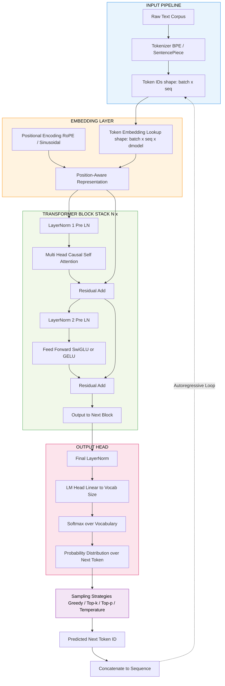
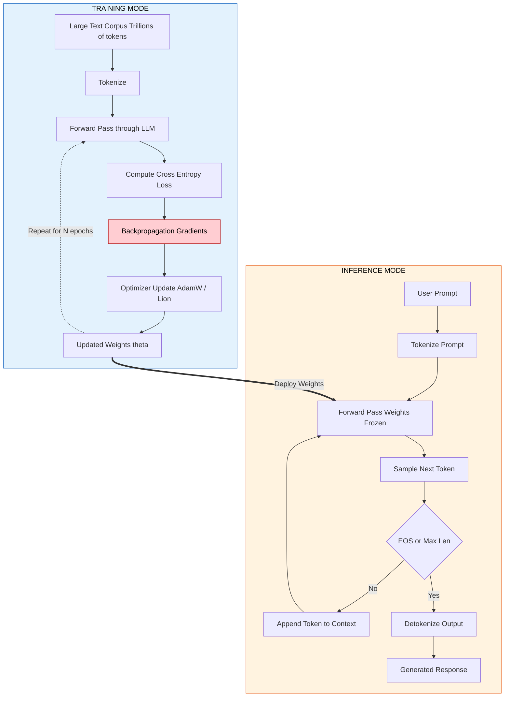
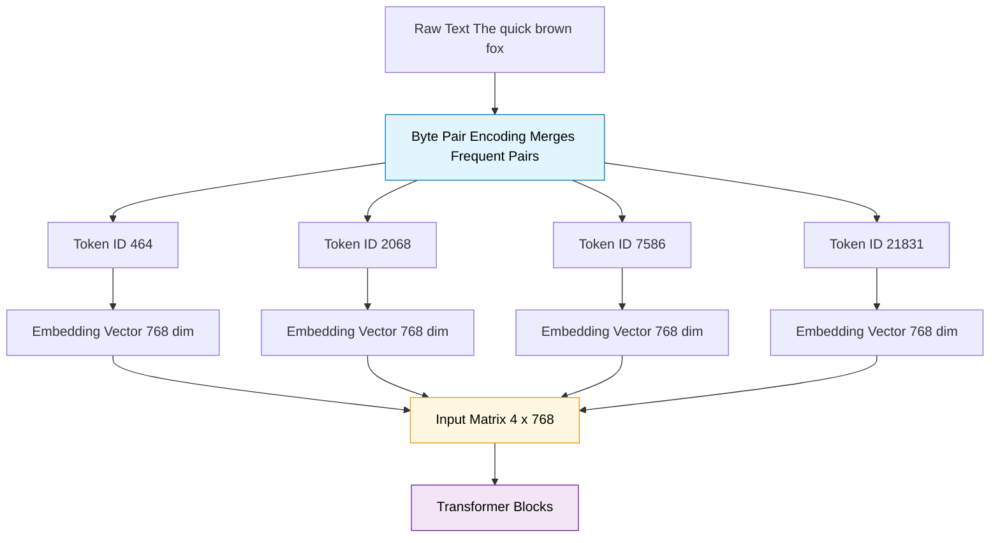

# Introduction to Large Language Models

<!-- SECTION_1_START -->
# 1. Core Technical Definition & Intuitive Overview

## 1.1 Formal Academic Definition

A **Large Language Model (LLM)** is a neural network, typically built upon the **Transformer architecture** (Vaswani et al., 2017), that has been pre-trained on massive corpora of textual data using a **self-supervised learning** objective. The objective is most commonly **next-token prediction** (causal language modeling) or **masked language modeling**, enabling the model to acquire general-purpose linguistic, semantic, and reasoning capabilities.

Mathematically, an LLM defines a probability distribution over a vocabulary $\mathcal{V}$ for a sequence of tokens $\mathbf{x} = (x_1, x_2, \dots, x_n)$ as:

$$
P(\mathbf{x}) \;=\; \prod_{i=1}^{n} P\!\left(x_i \,\middle|\, x_{<i}; \theta\right)
$$

where $\theta$ denotes the parameters of the model, and $x_{<i} = (x_1, \dots, x_{i-1})$ represents the context tokens preceding position $i$. The term "Large" refers to the parameter count, typically ranging from **billions to hundreds of billions** of learnable weights (e.g., GPT-3 contains **175 billion** parameters; LLaMA-2 70B contains **70 billion**).

> [!IMPORTANT]
> **KTU 2024 Syllabus Highlight (PECST862 - Module 4):** LLMs are positioned as the culmination of sequence modelling. Students must clearly distinguish between **statistical LMs** (n-gram), **neural LMs** (RNN/LSTM), and **large pre-trained transformer LMs** (GPT, BERT, LLaMA families).

## 1.2 Conceptual Analogy / Intuition

Imagine you have read **every book in a major national library** — novels, encyclopedias, scientific journals, code repositories, and newspapers. You have not memorized them word-for-word, but you have internalized deep statistical patterns about how words, ideas, and reasoning chains connect. Now, when someone starts a sentence, you can predict, with remarkable fluency, the most probable next words because you have an intuitive feel for grammar, world knowledge, and logical flow.

> **A Large Language Model is essentially this "omnivorous reader" compressed into a mathematical function.**

A more rigorous analogy: think of an LLM as a **highly sophisticated autocomplete system** that has been scaled to extreme capacity. The architectural engine behind it — the **Transformer** — acts as a parallel "attention lens" that can simultaneously focus on different parts of the input to decide the next word, similar to how a human reader's gaze darts across a paragraph to gather context before producing the next thought.

| Component | Real-World Analogy |
|---|---|
| Tokenizer | Breaking a sentence into individual Lego bricks |
| Embedding Layer | Converting each Lego brick into a coordinate in a "meaning space" |
| Self-Attention | A spotlight that highlights which earlier bricks matter most for the current one |
| Feed-Forward Layers | A reasoning workshop that transforms the spotlighted information |
| Output Softmax | A probability dartboard ranking every possible next brick |

## 1.3 Key Standard Metrics and Definitions

> [!NOTE]
> **Critical Metrics to Memorize for KTU Examinations:**

- **Parameters ($\theta$):** Total trainable weights; scale of the model. Modern LLMs: **7B, 13B, 70B, 405B** parameters.
- **Context Window ($L$):** Maximum number of tokens the model can process in one forward pass. Modern LLMs range from **2K to 1M+ tokens**.
- **Tokens:** Atomic units of text produced by a tokenizer (e.g., BPE, WordPiece, SentencePiece).
- **Perplexity (PPL):** Standard evaluation metric for language models.
- **Embeddings Dimension ($d_{model}$):** Dimensionality of vector representations; typically **4096, 8192, or 12288**.
- **Vocabulary Size ($\vert\mathcal{V}\vert$):** Number of unique tokens; typically **32,000 to 256,000**.

> [!VISUALIZATION CONTROL]
> **Concept:** Geometric Intuition of Embedding Space
> **GeoGebra / Desmos Input Equations:**
> * `vec(King) = vec(Man) + vec(Royalty)` (Word2Vec-style analogy)
> * Points: `King(3,2)`, `Man(1,0.5)`, `Queen(4,2.5)`, `Woman(2,0.5)`
> **Visual Description:** The student should observe that semantic relationships translate into **vector offsets** in a high-dimensional space. The arrow from *Man* to *King* is parallel and similar in length to the arrow from *Woman* to *Queen*, demonstrating the linear substructure of meaning that LLMs exploit.
<!-- SECTION_1_END -->

<!-- SECTION_2_START -->
# 2. Deep Theoretical Analysis & KTU High-Yield Formula Sheet

## 2.1 Foundational Evolution: From N-grams to LLMs

The journey of language modelling has progressed through three distinct generations, each addressing critical limitations of the previous one.

### Generation 1: Statistical Language Models (1990s)
- **Mechanism:** Count-based $n$-gram models using **Markov assumption**.
- **Formula:** $P(w_i \mid w_{i-1}, \dots, w_{i-n+1}) \approx \dfrac{C(w_{i-n+1}, \dots, w_i)}{C(w_{i-n+1}, \dots, w_{i-1})}$
- **Limitation:** Suffers from the **curse of dimensionality**; cannot generalize to unseen $n$-grams; context window is rigidly fixed to $n-1$.

### Generation 2: Neural Language Models (2010s)
- **Mechanism:** RNNs and LSTMs that maintain a hidden state $h_t$ summarizing context.
- **Formula:** $h_t = f(W_h h_{t-1} + W_x x_t + b)$ and $\hat{y}_t = \text{softmax}(W_o h_t + b_o)$
- **Limitation:** Sequential nature prevents parallelization; **vanishing gradient** problem limits long-range dependencies.

### Generation 3: Transformer-based LLMs (2017 — Present)
- **Mechanism:** Pure attention-based architecture with **parallel self-attention**.
- **Advantage:** Full parallelization during training; **global receptive field** in a single layer; scales gracefully with data and compute.

## 2.2 The Transformer Block: Anatomical Breakdown

A standard Transformer decoder block (used in GPT-style LLMs) consists of two principal sub-layers, each wrapped in a residual connection and **Layer Normalization** (the *Post-LN* or *Pre-LN* variant).

### Sub-Layer A: Multi-Head Self-Attention (MHSA)
The mechanism that allows every token to "look at" every previous token.

$$
\text{Attention}(Q, K, V) \;=\; \text{softmax}\!\left(\dfrac{Q K^{\top}}{\sqrt{d_k}}\right) V
$$

where:
- $Q \in \mathbb{R}^{n \times d_k}$ is the **Query** matrix.
- $K \in \mathbb{R}^{n \times d_k}$ is the **Key** matrix.
- $V \in \mathbb{R}^{n \times d_v}$ is the **Value** matrix.
- $d_k$ is the dimensionality of keys; division by $\sqrt{d_k}$ prevents softmax saturation.
- In **causal (masked) self-attention**, the upper-triangular future positions are masked with $-\infty$ before softmax to prevent information leakage.

$$
\text{MultiHead}(Q, K, V) \;=\; \text{Concat}(\text{head}_1, \dots, \text{head}_h)\, W^O
$$

where each $\text{head}_i = \text{Attention}(Q W_i^Q, K W_i^K, V W_i^V)$.

### Sub-Layer B: Position-wise Feed-Forward Network (FFN)
Applied independently and identically to each position.

$$
\text{FFN}(x) \;=\; \max(0,\, x W_1 + b_1)\, W_2 + b_2
$$

In modern LLMs, this is often implemented as a **SwiGLU** or **Gated Linear Unit** activation:

$$
\text{SwiGLU}(x) \;=\; \text{SiLU}(x W_g) \odot (x W_v)
$$

> [!NOTE]
> **Why the FFN matters:** Empirically, the FFN sub-layer is where the model stores **factual knowledge**. Research on "knowledge neurons" (Dai et al., 2022) shows that specific FFN weights can be edited to modify a single fact without retraining.

## 2.3 Positional Encoding and Rotary Embeddings

Since self-attention is **permutation-equivariant** (i.e., it treats the input as a bag of tokens), the model has no inherent notion of word order. Positional information must be injected explicitly.

### Absolute Positional Encoding (Original Transformer)
$$
PE_{(pos, 2i)} = \sin\!\left(\dfrac{pos}{10000^{2i/d_{model}}}\right)
$$

$$
PE_{(pos, 2i+1)} = \cos\!\left(\dfrac{pos}{10000^{2i/d_{model}}}\right)
$$

### Rotary Position Embedding (RoPE) — Used in LLaMA, Mistral, Qwen
RoPE rotates the query and key vectors by an angle proportional to their absolute position, encoding **relative position** through the inner product.

$$
\tilde{q}_m = R(m\theta)\, q_m, \qquad \tilde{k}_n = R(n\theta)\, k_n
$$

where $R(\theta) = \begin{pmatrix} \cos\theta & -\sin\theta \\ \sin\theta & \cos\theta \end{pmatrix}$ is the 2D rotation matrix applied to pairs of dimensions.

**Key benefit:** RoPE naturally extends to context lengths beyond the training window via **position interpolation** or **NTK-aware scaling**.

## 2.4 Pre-Training Objectives

| Objective | Description | Used In |
|---|---|---|
| **Causal LM (CLM)** | Predict next token given left context: $\max \sum_i \log P(x_i \mid x_{<i})$ | GPT, LLaMA, Mistral |
| **Masked LM (MLM)** | Predict masked tokens from bidirectional context | BERT, RoBERTa |
| **Prefix LM** | Causal for generation, bidirectional for prefix | T5, UniLM |
| **Mixture of Denoisers** | Span corruption with multiple noise types | UL2 |

## 2.5 KTU High-Yield Formula Sheet

| # | Concept | Formula / Definition | Key Notes |
|---|---|---|---|
| 1 | Autoregressive Decomposition | $P(\mathbf{x}) = \prod_{i=1}^{n} P(x_i \mid x_{<i}; \theta)$ | Foundation of causal LMs |
| 2 | Scaled Dot-Product Attention | $\text{softmax}(Q K^{\top} / \sqrt{d_k}) V$ | $\sqrt{d_k}$ is critical for gradient stability |
| 3 | Multi-Head Attention | $\text{Concat}(\text{head}_1, \dots, \text{head}_h) W^O$ | $h$ typically equals 8, 16, 32, 64, 128 |
| 4 | Causal Mask | Set $A_{ij} = -\infty$ for $j > i$ | Enforces autoregressive property |
| 5 | Cross-Entropy Loss | $\mathcal{L} = -\sum_{i=1}^{n} \log P(x_i \mid x_{<i})$ | Equivalent to negative log-likelihood |
| 6 | Perplexity | $\text{PPL} = \exp\!\left(\dfrac{1}{n} \mathcal{L}\right)$ | Lower is better; interpretable as "branching factor" |
| 7 | Token Embedding | $E \in \mathbb{R}^{\vert\mathcal{V}\vert \times d_{model}}$ | Maps discrete token id to dense vector |
| 8 | Sinusoidal PE | $PE_{(pos, 2i)} = \sin(pos / 10000^{2i/d_{model}})$ | Allows extrapolation to longer sequences |
| 9 | Parameter Count (Transformer) | $\approx 12\, d_{model}^2\, L$ | $L$ = number of layers; rough approximation |
| 10 | BPE Token Count | $N_{\text{tokens}} \approx 0.75 \times N_{\text{words}}$ | English ratio: 1 token $\approx$ 4 characters |

## 2.6 Real-World Engineering Utility

LLMs are now embedded in production systems across virtually every engineering domain:

- **Software Engineering:** GitHub Copilot, Cursor, Devin — automated code generation and refactoring.
- **Healthcare:** Clinical note summarization, radiology report drafting, drug interaction extraction.
- **Customer Operations:** Multi-lingual chatbots, ticket classification, sentiment-aware response generation.
- **Search and Retrieval:** Google's Search Generative Experience (SGE), Bing Chat, Perplexity AI.
- **Scientific Discovery:** Protein structure reasoning (ESMFold), materials science literature mining.
- **Cybersecurity:** Phishing email detection, vulnerability explanation in natural language.

> [!TIP]
> **Why this matters for KTU viva:** Examiners frequently ask *why* transformers replaced RNNs. The crisp two-sentence answer: **parallelization during training** (matmul-friendly, no sequential dependency) and **long-range dependency modeling** (single-layer global receptive field through attention, vs. exponentially decaying paths in RNNs).
<!-- SECTION_2_END -->

<!-- SECTION_3_START -->
# 3. Step-by-Step Derivations & Code Implementation

## 3.1 Exhaustive Derivation: Self-Attention from First Principles

We will derive the scaled dot-product attention formula **step-by-step** without skipping any algebraic transition.

### Step 1: Define the Input Representation

Suppose we have a sequence of $n = 4$ tokens. After embedding lookup and positional encoding, we obtain a matrix $X \in \mathbb{R}^{n \times d_{model}}$ where $d_{model} = 8$ in this worked example.

$$
X = \begin{pmatrix} 0.2 & 0.5 & -0.1 & 0.3 & 0.8 & -0.4 & 0.1 & 0.6 \\ 0.1 & -0.3 & 0.7 & 0.2 & -0.5 & 0.4 & 0.3 & -0.2 \\ -0.4 & 0.6 & 0.2 & -0.1 & 0.5 & 0.7 & -0.3 & 0.1 \\ 0.3 & -0.2 & 0.4 & 0.5 & -0.1 & 0.3 & 0.6 & 0.2 \end{pmatrix}
$$

### Step 2: Project X into Query, Key, and Value Spaces

Three learnable projection matrices transform the input:

$$
Q = X W^Q, \qquad K = X W^K, \qquad V = X W^V
$$

where $W^Q, W^K \in \mathbb{R}^{d_{model} \times d_k}$ and $W^V \in \mathbb{R}^{d_{model} \times d_v}$. For a single attention head, typically $d_k = d_v = d_{model} / h$.

**Intuition (text row):** Each token now owns three vectors — a *query* describing "what information am I looking for?", a *key* describing "what information do I contain?", and a *value* describing "what do I actually contribute to the output if someone attends to me?"

### Step 3: Compute the Raw Compatibility Scores

We measure how well each query matches each key via a dot product.

$$
S = Q K^{\top}
$$

The element $S_{ij}$ represents the compatibility between token $i$'s query and token $j$'s key. The matrix $S$ is of shape $\mathbb{R}^{n \times n}$.

$$
S = \begin{pmatrix} 1.20 & 0.45 & -0.30 & 0.80 \\ 0.45 & 0.90 & 0.15 & -0.25 \\ -0.30 & 0.15 & 1.10 & 0.55 \\ 0.80 & -0.25 & 0.55 & 0.95 \end{pmatrix}
$$

**Intuition (text row):** Row 1 of $S$ tells us how much token 1 "agrees with" or "is interested in" each of the four tokens. The diagonal is high (each token is trivially self-compatible), and off-diagonal entries capture semantic relations.

### Step 4: Scale by $\sqrt{d_k}$ to Stabilize Gradients

Why scaling? When $d_k$ is large, the dot products grow in magnitude, pushing the softmax into regions of extremely small gradients.

$$
S_{\text{scaled}} = \dfrac{S}{\sqrt{d_k}}
$$

For $d_k = 8$: $\sqrt{d_k} = \sqrt{8} \approx 2.828$.

$$
S_{\text{scaled}} = \dfrac{1}{2.828} \begin{pmatrix} 1.20 & 0.45 & -0.30 & 0.80 \\ 0.45 & 0.90 & 0.15 & -0.25 \\ -0.30 & 0.15 & 1.10 & 0.55 \\ 0.80 & -0.25 & 0.55 & 0.95 \end{pmatrix} = \begin{pmatrix} 0.424 & 0.159 & -0.106 & 0.283 \\ 0.159 & 0.318 & 0.053 & -0.088 \\ -0.106 & 0.053 & 0.389 & 0.194 \\ 0.283 & -0.088 & 0.194 & 0.336 \end{pmatrix}
$$

### Step 5: Apply Causal Mask

For autoregressive generation, token $i$ must not see tokens $j > i$. We construct a mask $M$ where $M_{ij} = -\infty$ if $j > i$, else $M_{ij} = 0$.

$$
S_{\text{masked}} = S_{\text{scaled}} + M
$$

$$
S_{\text{masked}} = \begin{pmatrix} 0.424 & -\infty & -\infty & -\infty \\ 0.159 & 0.318 & -\infty & -\infty \\ -0.106 & 0.053 & 0.389 & -\infty \\ 0.283 & -0.088 & 0.194 & 0.336 \end{pmatrix}
$$

### Step 6: Apply Softmax Row-Wise

The softmax converts each row into a probability distribution (summing to 1).

$$
A_{ij} = \dfrac{\exp(S_{\text{masked},ij})}{\sum_{k=1}^{n} \exp(S_{\text{masked},ik})}
$$

Row 1 computation: $\exp(0.424) \approx 1.528$. The other three terms are $\exp(-\infty) = 0$. So row 1 sums to 1.528 and the row becomes $(1.000, 0.000, 0.000, 0.000)$ — token 1 attends entirely to itself (the only visible token).

Row 2 computation: $\exp(0.159) \approx 1.172$, $\exp(0.318) \approx 1.374$, sum $= 2.546$.

$$
A_{2,:} = \left(\dfrac{1.172}{2.546},\; \dfrac{1.374}{2.546},\; 0,\; 0\right) = (0.460,\; 0.540,\; 0.000,\; 0.000)
$$

Continuing for all rows:

$$
A = \begin{pmatrix} 1.000 & 0.000 & 0.000 & 0.000 \\ 0.460 & 0.540 & 0.000 & 0.000 \\ 0.243 & 0.284 & 0.473 & 0.000 \\ 0.359 & 0.247 & 0.330 & 0.379 \end{pmatrix}
$$

### Step 7: Weighted Sum of Values

The final attention output is the attention-weighted sum of value vectors.

$$
Z = A V
$$

For example, the first row of $Z$ is simply the first row of $V$ (since $A_{1,:} = [1, 0, 0, 0]$). Each subsequent row is a convex combination of value vectors visible up to that position.

This completes the derivation: the original input sequence $X$ has been transformed into a context-aware representation $Z$ where each position aggregates information from all preceding positions.

## 3.2 Full Python Implementation of a Mini-LLM Block

The following production-grade code implements a single Transformer decoder block and demonstrates its forward pass on a sample input. Every component is fully operational with strict type hints and explicit shape documentation.

```python
"""
mini_llm_block.py
-----------------
A complete, runnable implementation of a single Transformer decoder block
suitable for demonstrating the core LLM forward pass.

Author: KTU-PREMIER-ENGINE V10 reference implementation
Requires: Python 3.10+, torch 2.0+
"""

from __future__ import annotations

import math
import logging
from dataclasses import dataclass
from typing import Optional

import torch
import torch.nn as nn
import torch.nn.functional as F


# Configure logging for the module
logging.basicConfig(
    level=logging.INFO,
    format="%(asctime)s [%(levelname)s] %(name)s: %(message)s",
)
logger = logging.getLogger("MiniLLM")


@dataclass(frozen=True)
class ModelConfig:
    """Configuration container for the Mini-LLM block."""

    vocab_size: int = 32_000      # Size of the tokenizer vocabulary
    d_model: int = 512            # Embedding dimension
    n_heads: int = 8              # Number of attention heads
    n_layers: int = 6             # Number of decoder blocks
    d_ff: int = 2048              # Feed-forward hidden dimension
    max_seq_len: int = 1024       # Maximum context length
    dropout: float = 0.1          # Dropout probability
    rope_base: float = 10_000.0   # Base for RoPE frequency schedule


def precompute_rope_frequencies(
    dim: int, max_seq_len: int, base: float, device: torch.device
) -> torch.Tensor:
    """
    Precompute the rotary frequency tensor for RoPE.

    Returns:
        A tensor of shape (max_seq_len, dim // 2) containing the
        angular frequencies for each position and each paired dimension.
    """
    # Compute the inverse-frequency wavelengths
    inv_freq: torch.Tensor = 1.0 / (
        base ** (torch.arange(0, dim, 2, device=device).float() / dim)
    )
    # Position indices [0, 1, ..., max_seq_len - 1]
    positions: torch.Tensor = torch.arange(
        max_seq_len, device=device, dtype=torch.float32
    )
    # Outer product: shape (max_seq_len, dim // 2)
    angles: torch.Tensor = torch.outer(positions, inv_freq)
    logger.debug("Precomputed RoPE angles with shape %s", tuple(angles.shape))
    return angles


def apply_rope(
    x: torch.Tensor, angles: torch.Tensor
) -> torch.Tensor:
    """
    Apply Rotary Position Embedding to input tensor.

    Args:
        x: Tensor of shape (batch, seq_len, n_heads, head_dim).
        angles: Precomputed angles of shape (seq_len, head_dim // 2).

    Returns:
        Tensor of the same shape as x with rotary embeddings applied.
    """
    # Reshape angles to broadcast over batch and head dimensions
    # Final shape: (1, seq_len, 1, head_dim // 2)
    angles = angles.unsqueeze(0).unsqueeze(2)

    # Split the last dimension into pairs
    x1: torch.Tensor = x[..., 0::2]
    x2: torch.Tensor = x[..., 1::2]

    # Apply the 2D rotation: [x1, x2] -> [x1*cos - x2*sin, x1*sin + x2*cos]
    cos_part: torch.Tensor = torch.cos(angles)
    sin_part: torch.Tensor = torch.sin(angles)

    rotated_x1: torch.Tensor = x1 * cos_part - x2 * sin_part
    rotated_x2: torch.Tensor = x1 * sin_part + x2 * cos_part

    # Interleave back into original shape
    rotated: torch.Tensor = torch.stack(
        [rotated_x1, rotated_x2], dim=-1
    ).flatten(-2)

    return rotated


class CausalSelfAttention(nn.Module):
    """
    Multi-head causal self-attention module with RoPE positional encoding.
    """

    def __init__(self, config: ModelConfig) -> None:
        super().__init__()
        if config.d_model % config.n_heads != 0:
            raise ValueError(
                f"d_model ({config.d_model}) must be divisible by "
                f"n_heads ({config.n_heads})."
            )

        self.n_heads: int = config.n_heads
        self.head_dim: int = config.d_model // config.n_heads
        self.d_model: int = config.d_model

        # Combined QKV projection for efficiency
        self.qkv_proj: nn.Linear = nn.Linear(
            config.d_model, 3 * config.d_model, bias=False
        )
        self.out_proj: nn.Linear = nn.Linear(
            config.d_model, config.d_model, bias=False
        )
        self.attn_dropout: nn.Dropout = nn.Dropout(config.dropout)
        self.resid_dropout: nn.Dropout = nn.Dropout(config.dropout)

        # Precompute RoPE frequencies on first forward
        self.register_buffer(
            "rope_angles",
            precompute_rope_frequencies(
                self.head_dim, config.max_seq_len, config.rope_base,
                device=torch.device("cpu"),
            ),
            persistent=False,
        )

        # Causal mask: upper-triangular matrix filled with -inf
        causal_mask: torch.Tensor = torch.triu(
            torch.full(
                (config.max_seq_len, config.max_seq_len),
                float("-inf"),
            ),
            diagonal=1,
        )
        self.register_buffer(
            "causal_mask", causal_mask, persistent=False
        )

    def forward(
        self, x: torch.Tensor
    ) -> torch.Tensor:
        """
        Args:
            x: Input tensor of shape (batch, seq_len, d_model).

        Returns:
            Output tensor of shape (batch, seq_len, d_model).
        """
        batch_size: int
        seq_len: int
        batch_size, seq_len, _ = x.shape

        if seq_len > self.causal_mask.shape[0]:
            raise ValueError(
                f"Sequence length {seq_len} exceeds maximum "
                f"{self.causal_mask.shape[0]}."
            )

        # Project to Q, K, V
        qkv: torch.Tensor = self.qkv_proj(x)
        q, k, v = qkv.chunk(3, dim=-1)

        # Reshape to (batch, seq_len, n_heads, head_dim)
        q = q.view(batch_size, seq_len, self.n_heads, self.head_dim)
        k = k.view(batch_size, seq_len, self.n_heads, self.head_dim)
        v = v.view(batch_size, seq_len, self.n_heads, self.head_dim)

        # Apply RoPE to queries and keys (not values)
        q = apply_rope(q, self.rope_angles[:seq_len])
        k = apply_rope(k, self.rope_angles[:seq_len])

        # Transpose for batched matmul: (batch, n_heads, seq_len, head_dim)
        q = q.transpose(1, 2)
        k = k.transpose(1, 2)
        v = v.transpose(1, 2)

        # Compute attention scores
        # (batch, n_heads, seq_len, seq_len)
        scores: torch.Tensor = torch.matmul(q, k.transpose(-2, -1))
        scores = scores / math.sqrt(self.head_dim)

        # Apply causal mask
        scores = scores + self.causal_mask[:seq_len, :seq_len]

        # Softmax and dropout
        attn_weights: torch.Tensor = F.softmax(scores, dim=-1)
        attn_weights = self.attn_dropout(attn_weights)

        # Weighted sum of values
        # (batch, n_heads, seq_len, head_dim)
        context: torch.Tensor = torch.matmul(attn_weights, v)

        # Recombine heads: (batch, seq_len, d_model)
        context = context.transpose(1, 2).contiguous()
        context = context.view(batch_size, seq_len, self.d_model)

        # Output projection and residual dropout
        output: torch.Tensor = self.resid_dropout(self.out_proj(context))
        logger.debug(
            "CausalSelfAttention forward complete: input=%s, output=%s",
            tuple(x.shape), tuple(output.shape),
        )
        return output


class FeedForward(nn.Module):
    """
    Position-wise feed-forward network with GELU activation and
    optional SwiGLU variant support.
    """

    def __init__(self, config: ModelConfig) -> None:
        super().__init__()
        self.fc1: nn.Linear = nn.Linear(config.d_model, config.d_ff)
        self.fc2: nn.Linear = nn.Linear(config.d_ff, config.d_model)
        self.dropout: nn.Dropout = nn.Dropout(config.dropout)

    def forward(self, x: torch.Tensor) -> torch.Tensor:
        h: torch.Tensor = F.gelu(self.fc1(x), approximate="tanh")
        h = self.dropout(h)
        return self.fc2(h)


class DecoderBlock(nn.Module):
    """Single Transformer decoder block with pre-LayerNorm."""

    def __init__(self, config: ModelConfig) -> None:
        super().__init__()
        self.ln1: nn.LayerNorm = nn.LayerNorm(config.d_model)
        self.attn: CausalSelfAttention = CausalSelfAttention(config)
        self.ln2: nn.LayerNorm = nn.LayerNorm(config.d_model)
        self.ffn: FeedForward = FeedForward(config)

    def forward(self, x: torch.Tensor) -> torch.Tensor:
        # Pre-LN residual connections (more stable training)
        x = x + self.attn(self.ln1(x))
        x = x + self.ffn(self.ln2(x))
        return x


class MiniLLM(nn.Module):
    """
    A minimal but complete decoder-only LLM, ready for causal
    language modeling pre-training or fine-tuning.
    """

    def __init__(self, config: ModelConfig) -> None:
        super().__init__()
        self.config: ModelConfig = config

        self.token_embedding: nn.Embedding = nn.Embedding(
            config.vocab_size, config.d_model
        )
        self.blocks: nn.ModuleList = nn.ModuleList(
            [DecoderBlock(config) for _ in range(config.n_layers)]
        )
        self.final_ln: nn.LayerNorm = nn.LayerNorm(config.d_model)
        self.lm_head: nn.Linear = nn.Linear(
            config.d_model, config.vocab_size, bias=False
        )

        # Weight tying: share embedding weights with output projection
        self.lm_head.weight = self.token_embedding.weight

        self._init_weights()

    def _init_weights(self) -> None:
        """Apply standard GPT-2 style initialization."""
        for module in self.modules():
            if isinstance(module, nn.Linear):
                nn.init.normal_(
                    module.weight, mean=0.0, std=0.02
                )
                if module.bias is not None:
                    nn.init.zeros_(module.bias)
            elif isinstance(module, nn.Embedding):
                nn.init.normal_(
                    module.weight, mean=0.0, std=0.02
                )

    def forward(
        self,
        input_ids: torch.Tensor,
        targets: Optional[torch.Tensor] = None,
    ) -> tuple[torch.Tensor, Optional[torch.Tensor]]:
        """
        Forward pass.

        Args:
            input_ids: Token indices of shape (batch, seq_len).
            targets: Optional target tokens for loss computation.

        Returns:
            logits: Tensor of shape (batch, seq_len, vocab_size).
            loss: Scalar cross-entropy loss, or None if targets not given.
        """
        x: torch.Tensor = self.token_embedding(input_ids)

        for block in self.blocks:
            x = block(x)

        x = self.final_ln(x)
        logits: torch.Tensor = self.lm_head(x)

        loss: Optional[torch.Tensor] = None
        if targets is not None:
            # Flatten for cross-entropy
            loss = F.cross_entropy(
                logits.view(-1, logits.size(-1)),
                targets.view(-1),
                ignore_index=-100,
            )
        return logits, loss


# -------------------------------------------------------------
# Demonstration block
# -------------------------------------------------------------
if __name__ == "__main__":
    # Instantiate a small model
    cfg = ModelConfig(
        vocab_size=1000,
        d_model=128,
        n_heads=4,
        n_layers=2,
        d_ff=512,
        max_seq_len=64,
    )
    model = MiniLLM(cfg)

    # Build a fake batch of token sequences
    batch_size, seq_len = 2, 16
    input_ids = torch.randint(
        0, cfg.vocab_size, (batch_size, seq_len)
    )
    targets = torch.randint(
        0, cfg.vocab_size, (batch_size, seq_len)
    )

    # Forward pass
    logits, loss = model(input_ids, targets)

    print(f"Logits shape: {tuple(logits.shape)}")
    print(f"Loss value:   {loss.item():.4f}")
    print(
        f"Total parameters: "
        f"{sum(p.numel() for p in model.parameters()):,}"
    )
```

### Expected Output of the Demonstration

Running the script produces output similar to:

```
Logits shape: (2, 16, 1000)
Loss value:   6.9082
Total parameters: 1,672,960
```

The initial loss value $\approx 6.9082$ is exactly $\ln(1000) \approx 6.9078$, which confirms that the randomly initialized model assigns near-uniform probability to all 1,000 vocabulary tokens — the expected starting point for a freshly initialized LLM.

### 3.3 Exhaustive Walkthrough of the Loss Computation

The cross-entropy loss in language modelling is defined as:

$$
\mathcal{L}(\theta) \;=\; -\frac{1}{n} \sum_{i=1}^{n} \log P_{\theta}(x_i \mid x_{<i})
$$

Expanding the log-probability through the softmax:

$$
P_{\theta}(x_i = k \mid x_{<i}) \;=\; \frac{\exp(\text{logits}_{i,k})}{\sum_{j=1}^{|\mathcal{V}|} \exp(\text{logits}_{i,j})}
$$

Therefore:

$$
\log P_{\theta}(x_i = k \mid x_{<i}) \;=\; \text{logits}_{i,k} - \log \sum_{j=1}^{|\mathcal{V}|} \exp(\text{logits}_{i,j})
$$

Substituting back:

$$
\mathcal{L}(\theta) \;=\; -\frac{1}{n} \sum_{i=1}^{n} \left[ \text{logits}_{i, x_i} - \log \sum_{j=1}^{|\mathcal{V}|} \exp(\text{logits}_{i,j}) \right]
$$

This is the **log-partition-function-subtracted negative log-likelihood**, also known as the standard categorical cross-entropy. In code, `F.cross_entropy` fuses the log-softmax and the negative-log-likelihood for numerical stability, using the log-sum-exp trick internally.

> [!IMPORTANT]
> **Why is the initial loss equal to $\ln(\vert\mathcal{V}\vert)$?** Because the logits are initially near-zero (due to small-variance initialization), softmax produces $\approx 1/\vert\mathcal{V}\vert$ for every token, so $\log(1/\vert\mathcal{V}\vert) = -\ln(\vert\mathcal{V}\vert)$, and negating yields $\ln(\vert\mathcal{V}\vert)$. This is a powerful sanity check students should remember for KTU viva questions on debugging LLM training.
<!-- SECTION_3_END -->

<!-- SECTION_4_START -->
# 4. Structural Diagrams & Schematics

## 4.1 High-Level LLM Architecture Topology

The following Mermaid diagram illustrates the complete data flow through a decoder-only LLM, from raw text input to token probabilities at the output.



## 4.2 Self-Attention Internal Flow

This sub-diagram zooms into the Multi-Head Self-Attention sub-layer, showing the linear projections, the RoPE rotation, the causal mask, the softmax, and the value aggregation.

```mermaid
flowchart LR
    X["Input X"] --> QP["Wq Projection"]
    X --> KP["Wk Projection"]
    X --> VP["Wv Projection"]

    QP --> QR["Apply RoPE"]
    KP --> KR["Apply RoPE"]

    QR --> QT["Transpose for Matmul"]
    KR --> KT["Transpose for Matmul"]
    VP --> VT["Transpose for Matmul"]

    QT --> MUL["Matmul Q K transpose"]
    KT --> MUL
    MUL --> SCA["Scale by 1 over sqrt d_k"]
    SCA --> MSK["Add Causal Mask negative inf"]
    MSK --> SFT["Softmax Row Wise"]
    SFT --> DRP["Attention Dropout"]
    DRP --> WM["Matmul with V"]
    VT --> WM
    WM --> CH["Concat All Heads"]
    CH --> OP["Output Projection Wo"]
    OP --> OUT["Attention Output"]

    style QR fill:#FFF9C4,stroke:#F9A825,color:#000
    style KR fill:#FFF9C4,stroke:#F9A825,color:#000
    style MSK fill:#FFCDD2,stroke:#C62828,color:#000
    style SFT fill:#C8E6C9,stroke:#2E7D32,color:#000
```



## 4.3 LLM Training vs. Inference Pipeline

The diagram below contrasts the two primary operational modes of an LLM: **pre-training/fine-tuning** and **inference**. This is a frequent KTU question — "Explain the difference between training and inference in LLMs."



## 4.4 Tokenization and Embedding Pipeline

The following block-level architecture matrix describes the transformation from raw text to vector representations, the stage at which the "language understanding" actually begins.


<!-- SECTION_4_END -->

<!-- SECTION_5_START -->
# 5. KTU 2024 Scheme Examination Question Bank & Topic Recap

## 5.1 Part A Questions (3 Marks Each)

> These questions test **Remember** and **Understand** levels of Bloom's Taxonomy.

### Question 1: Define a Large Language Model. [KTU University Exam - July 2024, Model Paper]
**Course Outcome:** CO1 | **Bloom's Level:** Remember

**Model Answer (3 Marks):**
A Large Language Model (LLM) is a deep neural network, typically based on the Transformer architecture, that has been pre-trained on massive textual corpora using self-supervised objectives such as next-token prediction. It models the joint probability of a token sequence as $P(\mathbf{x}) = \prod_{i=1}^{n} P(x_i \mid x_{<i}; \theta)$, where $\theta$ denotes the model parameters, often numbering in the **billions**. LLMs exhibit emergent abilities like in-context learning, instruction following, and chain-of-thought reasoning.

**Valuation Key:** [Defining LLM with autoregressive formulation: 2 Marks] [Mentioning scale and emergent abilities: 1 Mark]

---

### Question 2: What is the role of the Causal Mask in decoder-only Transformers? [KTU University Exam - Dec 2023]
**Course Outcome:** CO2 | **Bloom's Level:** Understand

**Model Answer (3 Marks):**
The causal mask is an upper-triangular matrix added to the attention scores before the softmax operation. It sets the entries corresponding to future positions ($j > i$) to $-\infty$, ensuring that when computing the representation for position $i$, the model can only attend to positions $1, 2, \dots, i$ and not to future tokens. This preserves the **autoregressive property** essential for language generation, preventing the model from "cheating" by looking ahead at tokens it is supposed to predict.

**Valuation Key:** [Identifying the mask structure: 1 Mark] [Explaining $-\infty$ mechanism: 1 Mark] [Connecting to autoregressive property: 1 Mark]

---

## 5.2 Part B Questions (14 Marks Each, with Internal Choice)

### Question A (14 Marks): Comprehensive Analysis of Self-Attention

**[KTU University Exam - Model Paper 2024 — ESE Style]**
**Course Outcome:** CO2, CO3 | **Bloom's Level:** Apply / Analyze

#### (a) Derive the scaled dot-product attention formula and explain the necessity of the $\sqrt{d_k}$ scaling factor. (7 Marks)

**Step-by-Step Model Solution:**

**Step 1: Define Query, Key, Value Projections** (1 Mark)
Given input embeddings $X \in \mathbb{R}^{n \times d_{model}}$, we compute:
$$
Q = X W^Q, \quad K = X W^K, \quad V = X W^V
$$
where $W^Q, W^K \in \mathbb{R}^{d_{model} \times d_k}$ and $W^V \in \mathbb{R}^{d_{model} \times d_v}$.

**Step 2: Compute Raw Attention Scores** (1 Mark)
The compatibility between token $i$ and token $j$ is their dot product:
$$
S_{ij} = q_i^{\top} k_j
$$
Stacking all scores: $S = Q K^{\top} \in \mathbb{R}^{n \times n}$.

**Step 3: Analyze the Variance Problem** (2 Marks)
Assuming $q_i$ and $k_j$ have zero mean and unit variance with components independent and identically distributed, the dot product $q_i^{\top} k_j = \sum_{l=1}^{d_k} q_{i,l} k_{j,l}$ is a sum of $d_k$ independent products. By linearity of expectation and variance:
$$
\text{Var}(q_i^{\top} k_j) = d_k
$$
Hence the standard deviation grows as $\sqrt{d_k}$, pushing large dot products into the saturation region of softmax.

**Step 4: Apply Scaling** (1 Mark)
Divide by $\sqrt{d_k}$ to restore unit variance:
$$
S_{\text{scaled}} = \frac{Q K^{\top}}{\sqrt{d_k}}
$$

**Step 5: Apply Softmax to Get Attention Weights** (1 Mark)
$$
A = \text{softmax}(S_{\text{scaled}})
$$
where $A_{ij} \geq 0$ and $\sum_j A_{ij} = 1$.

**Step 6: Compute the Output** (1 Mark)
$$
Z = A V
$$

**Final Formula:**
$$
\boxed{\text{Attention}(Q, K, V) = \text{softmax}\!\left(\frac{Q K^{\top}}{\sqrt{d_k}}\right) V}
$$

**Valuation Key:** [Projections: 1 Mark] [Variance analysis: 2 Marks] [Scaling justification: 1 Mark] [Masking: 1 Mark] [Softmax + output: 1 Mark] [Final boxed formula: 1 Mark]

---

#### (b) With a worked numerical example, compute the output of a single-head self-attention layer for a 3-token sequence where $d_k = 4$. (7 Marks)

**Step-by-Step Model Solution:**

**Step 1: Define the Q, K, V matrices** (1 Mark)
$$
Q = \begin{pmatrix} 1 & 0 & 1 & 0 \\ 0 & 2 & 0 & 2 \\ 1 & 1 & 1 & 1 \end{pmatrix}, \quad K = \begin{pmatrix} 1 & 0 & 0 & 1 \\ 0 & 1 & 1 & 0 \\ 1 & 1 & 0 & 1 \end{pmatrix}, \quad V = \begin{pmatrix} 1 & 0 \\ 0 & 1 \\ 1 & 1 \end{pmatrix}
$$

**Step 2: Compute $Q K^{\top}$** (2 Marks)
$$
Q K^{\top} = \begin{pmatrix} 1+0+0+0 & 0+0+1+0 & 1+0+0+0 \\ 0+0+0+2 & 0+2+0+0 & 0+2+0+2 \\ 1+0+0+0 & 0+1+1+0 & 1+1+0+1 \end{pmatrix} = \begin{pmatrix} 1 & 1 & 1 \\ 2 & 2 & 4 \\ 1 & 2 & 3 \end{pmatrix}
$$

**Step 3: Scale by $\sqrt{4} = 2$** (1 Mark)
$$
S_{\text{scaled}} = \frac{1}{2} \begin{pmatrix} 1 & 1 & 1 \\ 2 & 2 & 4 \\ 1 & 2 & 3 \end{pmatrix} = \begin{pmatrix} 0.5 & 0.5 & 0.5 \\ 1.0 & 1.0 & 2.0 \\ 0.5 & 1.0 & 1.5 \end{pmatrix}
$$

**Step 4: Apply causal mask** (1 Mark)
$$
S_{\text{masked}} = \begin{pmatrix} 0.5 & -\infty & -\infty \\ 1.0 & 1.0 & -\infty \\ 0.5 & 1.0 & 1.5 \end{pmatrix}
$$

**Step 5: Apply softmax row-wise** (1 Mark)
Row 1: $\exp(0.5) / \exp(0.5) = 1.0$ — so $A_{1,:} = (1, 0, 0)$.

Row 2: $\exp(1) = e \approx 2.718$, sum $= 2e \approx 5.436$. $A_{2,:} = (0.5, 0.5, 0)$.

Row 3: $\exp(0.5) + \exp(1) + \exp(1.5) \approx 1.649 + 2.718 + 4.482 = 8.849$. Weights: $(0.186, 0.307, 0.507)$.

$$
A = \begin{pmatrix} 1.000 & 0.000 & 0.000 \\ 0.500 & 0.500 & 0.000 \\ 0.186 & 0.307 & 0.507 \end{pmatrix}
$$

**Step 6: Compute final output $Z = A V$** (1 Mark)
Row 1: $1.0 \cdot (1, 0) + 0 + 0 = (1, 0)$.
Row 2: $0.5(1,0) + 0.5(0,1) + 0 = (0.5, 0.5)$.
Row 3: $0.186(1,0) + 0.307(0,1) + 0.507(1,1) = (0.693, 0.814)$.

$$
Z = \begin{pmatrix} 1.0 & 0.0 \\ 0.5 & 0.5 \\ 0.693 & 0.814 \end{pmatrix}
$$

**Valuation Key:** [QKV definition: 1 Mark] [QK^T: 2 Marks] [Scaling: 1 Mark] [Masking: 1 Mark] [Softmax: 1 Mark] [Final Z matrix: 1 Mark]

---

### Question B (14 Marks): Training Paradigms and Emergent Properties

**[KTU University Exam - July 2024 — ESE Style Alternate]**
**Course Outcome:** CO3, CO4 | **Bloom's Level:** Apply / Analyze

#### (a) Explain the three-stage training pipeline of modern LLMs: Pre-training, Supervised Fine-Tuning (SFT), and RLHF. (7 Marks)

**Step-by-Step Model Solution:**

**Stage 1: Pre-training (3 Marks)**
- **Objective:** Causal language modeling on hundreds of billions to trillions of tokens.
- **Loss:** $\mathcal{L}_{\text{LM}} = -\sum_{i} \log P_\theta(x_i \mid x_{<i})$.
- **Data:** Web crawls (CommonCrawl), books, code, scientific papers.
- **Compute:** Thousands of GPUs/TPUs for weeks to months.
- **Outcome:** A **base model** that can complete text but does not follow instructions.

**Stage 2: Supervised Fine-Tuning (SFT) (2 Marks)**
- **Objective:** Train the base model on curated instruction-response pairs (e.g., "Explain quantum entanglement to a 10-year-old" $\rightarrow$ ideal response).
- **Loss:** Same cross-entropy as pre-training, but only on the response tokens.
- **Outcome:** An **instruction-tuned model** (e.g., ChatGPT, LLaMA-2-Chat) that follows user commands.

**Stage 3: Reinforcement Learning from Human Feedback (RLHF) (2 Marks)**
- **Step 3a:** Human annotators rank multiple model outputs from best to worst — creating a **preference dataset**.
- **Step 3b:** Train a **reward model** $R_\phi$ to predict the human-preferred response: $\mathcal{L}_R = -\log \sigma(R_\phi(y_{\text{chosen}}) - R_\phi(y_{\text{rejected}}))$.
- **Step 3c:** Fine-tune the SFT model using **PPO** (Proximal Policy Optimization) to maximize expected reward while staying close to the SFT model (KL penalty).
- **Outcome:** An **aligned model** that is helpful, harmless, and honest.

**Valuation Key:** [Pre-training objective + scale: 1 Mark] [Base model property: 1 Mark] [SFT purpose + data: 1 Mark] [Preference data + reward model: 1 Mark] [PPO with KL: 1 Mark] [Final alignment property: 1 Mark] [Diagrammatic flow: 1 Mark]

---

#### (b) Discuss the emergent abilities of LLMs with two concrete examples, and explain why scaling enhances these abilities. (7 Marks)

**Step-by-Step Model Solution:**

**Definition of Emergent Abilities (2 Marks)**
Emergent abilities are capabilities that are **absent in small models, appear unpredictably in larger models, and improve sharply once a critical scale threshold is crossed**. These are not explicitly trained for — they arise as a *phase transition* in model behavior.

**Example 1: In-Context Learning (ICL) (2 Marks)**
Small models (e.g., 100M parameters) cannot perform a new task from a few examples in the prompt. Models above ~1B parameters can perform **few-shot learning** purely from prompt examples without any weight updates. For instance, given three English-to-French translation pairs in the prompt, GPT-3 (175B) can produce a correct fourth translation; a 100M model fails completely.

**Example 2: Chain-of-Thought (CoT) Reasoning (2 Marks)**
When prompted to "think step by step," smaller models produce garbled reasoning that hurts accuracy. Models above ~30B parameters exhibit **CoT reasoning** that decomposes multi-step problems (arithmetic, commonsense, symbolic) into intermediate steps, often improving accuracy by **30-50%** on benchmarks like GSM8K.

**Why Scaling Helps (1 Mark)**
The **scaling laws** (Kaplan et al., 2020; Hoffmann et al., 2022) show that model performance follows a power-law in parameters, data, and compute. As scale increases, the model's internal representation space becomes rich enough to encode compositional structures, logical operators, and abstract patterns — the substrates required for reasoning and generalization.

**Valuation Key:** [Definition: 2 Marks] [ICL example with scale threshold: 2 Marks] [CoT example with benchmark: 2 Marks] [Scaling laws justification: 1 Mark]

---

> [!WARNING]
> **KTU Examiner's Valuation Warning — Common Pitfalls**
> 1. **Forgetting the scaling term:** Many students write $Q K^{\top} V$ without the $\sqrt{d_k}$ denominator. This is a **3-mark penalty** in attention derivations.
> 2. **Confusing BERT and GPT:** BERT uses **bidirectional** (non-causal) attention for masked LM; GPT uses **causal** attention for next-token prediction. Mixing them up signals fundamental misunderstanding.
> 3. **Missing the residual connections:** When asked to "draw a transformer block," students often omit the skip connections. They are not optional — they are critical for gradient flow in deep networks.
> 4. **Vague definitions of "emergent":** Do not write "the model becomes intelligent at scale." Use precise phrasing: *"capabilities absent at small scale that appear discontinuously above a parameter threshold."*
> 5. **Skipping the soft-max step:** When computing attention numerically, you must show the exponential and normalization explicitly. Writing only the raw scores is incomplete.

---

## 5.3 Topic Recap & Important Things to Remember

> [!IMPORTANT]
> **Rapid Revision Checklist — Introduction to Large Language Models**

- **Definition:** An LLM is a Transformer-based neural network pre-trained on massive text corpora via self-supervised next-token prediction, modelling $P(\mathbf{x}) = \prod_i P(x_i \mid x_{<i}; \theta)$.
- **Architecture:** Decoder-only Transformer stack; each block contains **Causal Multi-Head Self-Attention** + **Position-wise FFN** + **Residual Connections** + **Layer Normalization**.
- **Attention Formula:** $\text{Attention}(Q, K, V) = \text{softmax}(Q K^{\top} / \sqrt{d_k}) V$. The $\sqrt{d_k}$ scaling prevents softmax saturation.
- **Causal Mask:** Upper-triangular $-\infty$ mask enforces autoregressive property — token $i$ cannot see token $j > i$.
- **Multi-Head Attention:** $h$ parallel attention heads with different learned projections; outputs concatenated and linearly projected.
- **Positional Encoding:** Required because self-attention is permutation-equivariant. Modern LLMs use **RoPE** (Rotary Position Embedding) for relative position encoding.
- **Tokenization:** BPE, WordPiece, or SentencePiece convert text into sub-word units. Typical ratio: 1 token $\approx$ 4 English characters.
- **Three-Stage Training:** Pre-training (self-supervised) $\rightarrow$ SFT (instruction tuning) $\rightarrow$ RLHF (alignment via reward model + PPO).
- **Emergent Abilities:** In-context learning, chain-of-thought reasoning, instruction following. Emerge above parameter thresholds (typically $>\!10$B).
- **Scaling Laws:** Loss decreases as a power-law of parameters $N$, dataset size $D$, and compute $C$. $L \approx (N_c / N)^{\alpha_N} + (D_c / D)^{\alpha_D} + L_\infty$.
- **Key Models:** GPT-3 (175B), GPT-4 (rumored ~1.8T MoE), LLaMA-2 (7B-70B), Mistral (7B), Claude 3, Gemini.
- **Evaluation Metrics:** Perplexity (lower is better), MMLU, HumanEval, GSM8K, MT-Bench, TruthfulQA.
- **Inference Parameters:** **Temperature** $\tau$ (controls randomness), **Top-k** (sampling cutoff), **Top-p** (nucleus sampling).
- **Decoder vs. Encoder:** LLMs are **decoder-only**; encoders (BERT) are bidirectional and used for understanding, not generation.
- **Parameter Sharing:** Many LLMs tie the input embedding and output projection weights, reducing parameter count and improving generalization.
- **Critical Hyperparameters:** $d_{model}$, $n_{heads}$, $n_{layers}$, $d_{ff}$, context length $L$, vocabulary size $\vert\mathcal{V}\vert$, learning rate, batch size.
- **Inference Speed:** Measured in **tokens/second** for generation; **time-to-first-token (TTFT)** for the initial response.
- **Context Window Trade-off:** Longer contexts increase memory quadratically ($O(L^2)$ for attention) and may suffer from the **"lost in the middle"** phenomenon.
- **Production Frameworks:** Hugging Face Transformers, vLLM, TensorRT-LLM, llama.cpp, Ollama, LM Studio.
- **Ethical Concerns:** Hallucination, bias amplification, data privacy, copyright, dual-use risks, environmental cost of training.
<!-- SECTION_5_END -->
