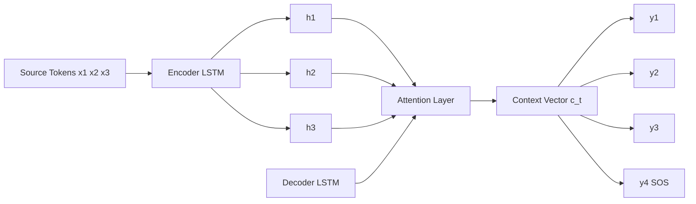
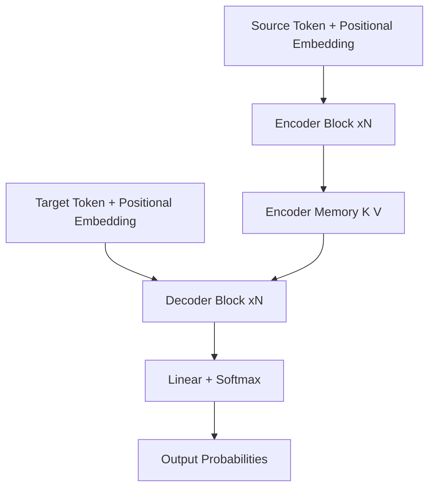
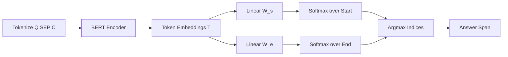
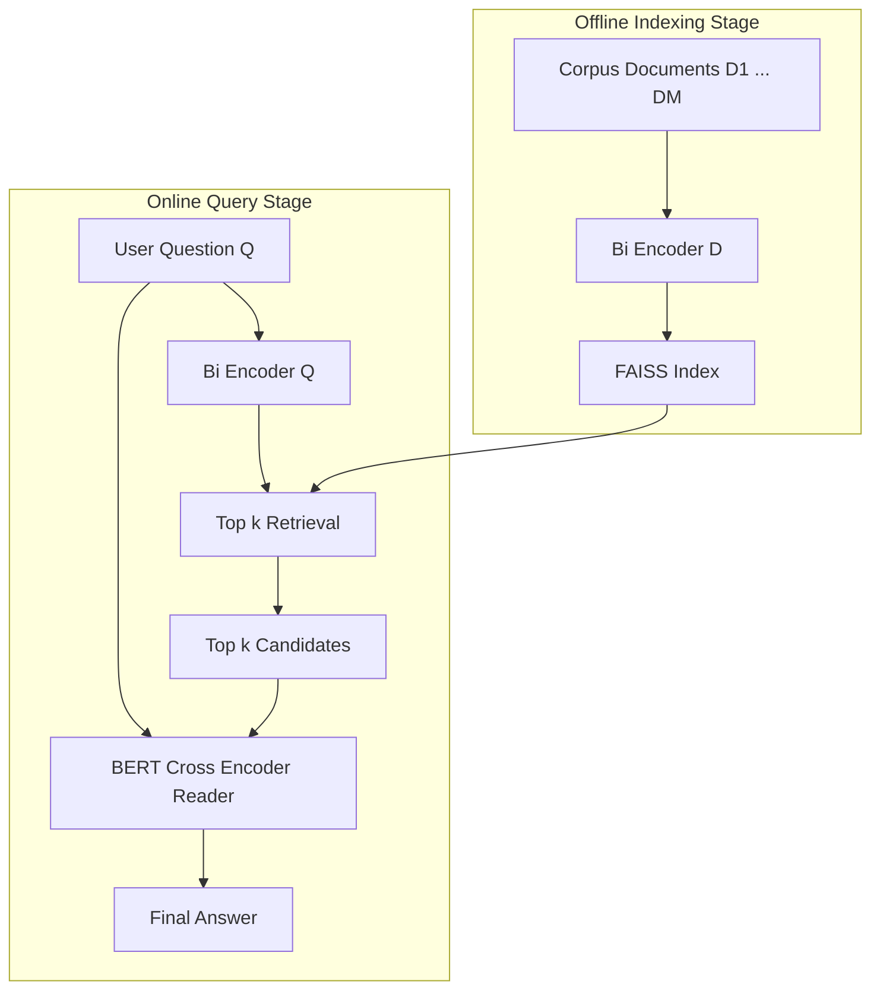
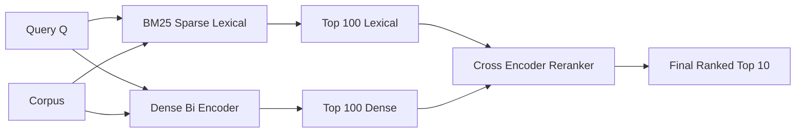
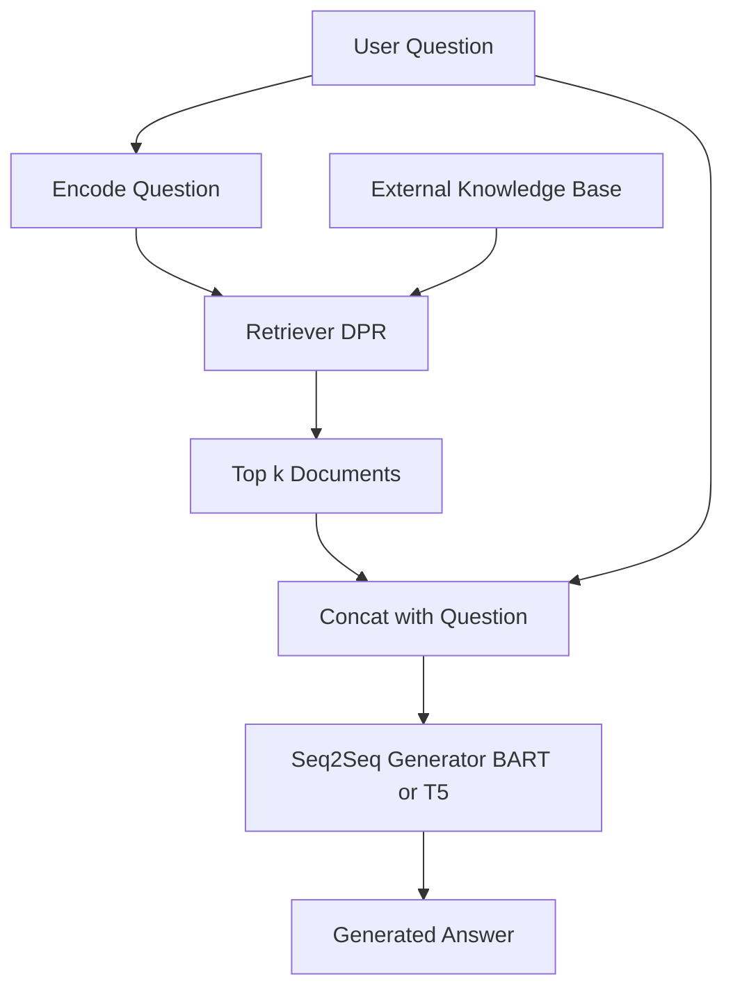

# NLP Applications - Machine Translation, Question Answering and Information Retrieval

<!-- SECTION_1_START -->

# NLP Applications — Machine Translation, Question Answering & Information Retrieval

## 1. Machine Translation (MT)

### Formal KTU Definition
**Machine Translation (MT)** is the sub-field of Natural Language Processing that automatically converts text or speech from a **Source Language (SL)** into semantically equivalent text in a **Target Language (TL)** while preserving meaning, fluency, and grammatical structure. Under the KTU 2024 scheme, MT is studied as a sequence-to-sequence (Seq2Seq) generation problem solved via Encoder–Decoder architectures, Attention mechanisms, and Transformer models.

> [!IMPORTANT]
> **KTU Syllabus Highlight:** The 2024 scheme emphasizes **Statistical MT (SMT)** foundations (Noisy-Channel, IBM Models) and **Neural MT (NMT)** with the **Encoder–Decoder + Attention + Transformer** stack. Expect derivations of cross-entropy loss and BLEU evaluation.

### Conceptual Analogy / Intuition
Think of MT as a **bilingual human interpreter** standing between two speakers. The interpreter first **listens** to the entire sentence in Language A (Encoding), **thinks** about its meaning in some intermediate mental representation (Latent Thought Vector), and then **speaks** the equivalent sentence in Language B (Decoding). The "thought vector" is the soul of translation — it is a fixed-length, language-agnostic embedding of meaning. **Attention** is the interpreter's ability to glance back at the original sentence for specific words (like a name or a tense) while producing each translated word.

> [!NOTE]
> **Key Constants / Metrics to remember**
> - **BLEU Score Range:** $\mathbf{0.0}$ to $\mathbf{1.0}$ (higher is better)
> - **Reference Translations:** typically $\mathbf{4}$ human translations used for evaluation
> - **Default N-gram order for BLEU:** $\mathbf{n = 4}$ (unigram to 4-gram)
> - **Beam Width** in decoding: typically $\mathbf{5}$ to $\mathbf{10}$

> [!VISUALIZATION CONTROL]
> **Concept:** Encoder–Decoder translation flow for the sentence *"I love NLP"* → *"J'aime le NLP"*
> **GeoGebra / Desmos Input Equations (latent space sketch):**
> - $E(x) = \tanh(W_e \cdot x + b_e)$ (encoder projection)
> - $D(h) = \text{softmax}(W_d \cdot h + b_d)$ (decoder projection)
> **Visual Description:** Imagine a 2-D plane where the encoder compresses the source tokens into a central point (the **context vector $c$**), and the decoder radiates translated tokens outward from that point. Attention adds weighted lines from each output token back to specific input tokens.

---

## 2. Question Answering (QA)

### Formal KTU Definition
**Question Answering (QA)** is the NLP task of automatically producing a precise answer to a natural-language question, either by **extracting** a span from a given context (Extractive QA), by **generating** a free-form answer from internal/external knowledge (Generative / Abstractive QA), or by selecting the best answer from a candidate list (Multiple-Choice QA). Modern QA systems use the **Retriever–Reader** architecture, where a retriever narrows down relevant documents and a reader extracts or generates the final answer.

> [!IMPORTANT]
> **KTU Syllabus Highlight:** Pay special attention to **SQuAD-style span prediction** with BERT, the **Retriever–Reader (Open-Domain QA)** pipeline, and evaluation metrics **Exact Match (EM)** and **F1 Score**.

### Conceptual Analogy / Intuition
Imagine a **student taking an open-book exam**. The student gets a fat textbook (the corpus), a question paper, and limited time. The student's first job is to **scan the textbook** and underline the most relevant paragraphs (the **Retriever**). Then, the student carefully **reads those paragraphs** to find the exact phrase that answers the question (the **Reader**). The Retriever is fast but coarse (like a search engine); the Reader is slow but precise (like a span-finding BERT model). The combination is faster than reading the whole book and more accurate than just searching.

> [!NOTE]
> **Key QA Metrics & Standards**
> - **SQuAD F1** measures token-level overlap between predicted and gold answer spans.
> - **Exact Match (EM)** is a strict binary metric (1 if predicted span matches reference exactly, else 0).
> - **Top-k retrieval recall** (e.g., Recall@5) measures whether the gold document is in the top-k retrieved.

---

## 3. Information Retrieval (IR)

### Formal KTU Definition
**Information Retrieval (IR)** is the science of searching, locating, and ranking documents from a large collection (corpus) in response to a user **query**, such that the most relevant documents appear at the top. Under KTU 2024, IR spans **Lexical Retrieval** (TF-IDF, BM25, Boolean), **Semantic / Neural Retrieval** (Dense Passage Retrieval, Dual Encoders), and **Re-ranking** stages, culminating in modern **Retrieval-Augmented Generation (RAG)** systems.

> [!IMPORTANT]
> **KTU Syllabus Highlight:** Master the derivations of **TF-IDF**, **BM25** scoring, **Cosine Similarity** in Vector Space Model, and the difference between **Sparse** (BM25) and **Dense** (BERT-based) retrievers.

### Conceptual Analogy / Intuition
Think of IR as a **giant library with a brilliant librarian**. The librarian has indexed every book by topic, by author, and by the frequency of important words (the **Inverted Index**). When you walk in and ask for *"books about black holes"*, the librarian first uses the **index** to find books that contain the words "black" and "holes" (lexical match), then ranks them by **importance** (TF-IDF / BM25), and finally **re-ranks** the top results by deep understanding (a neural model). The librarian's job is **ranking**, not answering — the answer is one of the books on the shelf.

> [!NOTE]
> **Key IR Notations**
> - $N$ = total number of documents in the corpus
> - $\text{df}(t)$ = document frequency of term $t$
> - $\text{tf}(t, d)$ = term frequency of $t$ in document $d$
> - $\vert d \vert$ = length of document $d$ in tokens
> - $\text{avgdl}$ = average document length in the corpus
> - **BM25 hyperparameters:** $k_1 \approx 1.2$ to $\mathbf{2.0}$, $b \approx \mathbf{0.75}$

> [!VISUALIZATION CONTROL]
> **Concept:** BM25 score vs. Term Frequency (TF) for a fixed document length
> **Desmos Input Equations:**
> - $\text{BM25}(tf) = \text{IDF} \cdot \dfrac{tf \cdot (k_1 + 1)}{tf + k_1 \cdot \left(1 - b + b \cdot \dfrac{\vert d \vert}{\text{avgdl}}\right)}$
> - With $k_1 = 1.5$, $b = 0.75$, $\vert d \vert = 100$, $\text{avgdl} = 200$, $\text{IDF} = 2.0$
> **Visual Description:** Plot BM25 score on the y-axis and TF on the x-axis. Observe the curve **saturates** (asymptotes) at high TF, preventing common-word domination. The curve shifts based on $\vert d \vert / \text{avgdl}$.

<!-- SECTION_1_END -->

<!-- SECTION_2_START -->

# Deep Theoretical Analysis & KTU High-Yield Formula Sheet

## 1. Machine Translation — Theoretical Breakdown

### 1.1 Three Paradigms of MT

| Paradigm | Core Idea | Strengths | Weaknesses |
|----------|-----------|-----------|------------|
| **Rule-Based MT (RBMT)** | Uses hand-crafted grammar, dictionaries, transfer rules | Linguistically interpretable, no parallel data needed | Expensive to build, brittle, low fluency |
| **Statistical MT (SMT)** | Learns translation probabilities from parallel corpora (e.g., Europarl) | Data-driven, probabilistic | Requires large parallel data, phrase-based tables explode |
| **Neural MT (NMT)** | End-to-end deep learning with Encoder–Decoder + Attention | Highest fluency, handles long context, low error propagation | Black-box, large compute, hallucination risk |

### 1.2 The Noisy-Channel Model (Brown et al., 1990)

The seminal probabilistic formulation of SMT:

$$
\hat{e} = \arg\max_{e} \; P(e \mid f) = \arg\max_{e} \; \underbrace{P(f \mid e)}_{\text{Translation Model}} \cdot \underbrace{P(e)}_{\text{Language Model}}
$$

where $f$ is the French source sentence and $e$ is the English target sentence. The Bayes inversion splits the problem into a translation model (how likely is $f$ to be produced from $e$?) and a language model (how fluent is $e$?).

### 1.3 Encoder–Decoder Architecture

The source sentence tokens $x_1, x_2, \ldots, x_n$ are encoded into hidden states $h_1, h_2, \ldots, h_n$ (typically via an LSTM or Transformer encoder). A single **context vector** $c$ summarizes them:

$$
c = q(h_1, h_2, \ldots, h_n)
$$

The decoder generates the target sentence one token at a time:

$$
s_t = f(s_{t-1}, y_{t-1}, c)
$$

$$
P(y_t \mid y_{<t}, x) = g(s_t, y_{t-1}, c)
$$

### 1.4 Bahdanau Attention (Additive Attention)

To overcome the bottleneck of a fixed-size $c$, attention computes a **dynamic context** $c_t$ for every decoding step $t$:

$$
c_t = \sum_{i=1}^{n} \alpha_{t,i} \cdot h_i
$$

where the alignment weights $\alpha_{t,i}$ are obtained by softmax over an alignment score:

$$
\alpha_{t,i} = \frac{\exp(e_{t,i})}{\sum_{j=1}^{n} \exp(e_{t,j})}
$$

$$
e_{t,i} = v^{\top} \tanh(W_a \cdot s_{t-1} + U_a \cdot h_i)
$$

### 1.5 Transformer Self-Attention (Scaled Dot-Product)

For Query $Q$, Key $K$, Value $V$ matrices:

$$
\text{Attention}(Q, K, V) = \text{softmax}\!\left(\frac{Q K^{\top}}{\sqrt{d_k}}\right) V
$$

The $\sqrt{d_k}$ scaling prevents the softmax from saturating when $d_k$ is large.

---

## 2. Question Answering — Theoretical Breakdown

### 2.1 Extractive QA Pipeline (SQuAD Style)

Given a context paragraph $C$ and a question $Q$, the goal is to predict the start index $a_s$ and end index $a_e$ of the answer span in $C$. A pre-trained Transformer (BERT) is used as the encoder:

1. Concatenate $[CLS] \; Q \; [SEP] \; C \; [SEP]$
2. Pass through BERT to get contextualized token embeddings $T \in \mathbb{R}^{n \times d}$.
3. Learn two linear classifiers: $W_s, W_e \in \mathbb{R}^{d \times 1}$ to predict start and end logits.
4. Apply softmax over positions; the answer is the span with maximum $P(a_s) \cdot P(a_e)$.

$$
P(a_s = i) = \frac{\exp(W_s^{\top} T_i)}{\sum_{j} \exp(W_s^{\top} T_j)}
$$

$$
P(a_e = i) = \frac{\exp(W_e^{\top} T_i)}{\sum_{j} \exp(W_e^{\top} T_j)}
$$

### 2.2 Open-Domain QA: Retriever–Reader Architecture

A two-stage pipeline inspired by DrQA (Chen et al., 2017) and DPR (Karpukhin et al., 2020):

- **Retriever** (fast, bi-encoder): encodes both $Q$ and each document $D_i$ into vectors $q$ and $d_i$, retrieves top-$k$ by $\text{sim}(q, d_i)$ (e.g., dot product).
- **Reader** (slow, cross-encoder): feeds $(Q, D_i)$ pairs into BERT to predict the answer span in each $D_i$.
- **Final answer** = span with highest confidence across all top-$k$ documents.

### 2.3 Generative QA (RAG-style)

Combines IR with a Seq2Seq generator. The retriever fetches relevant passages $z$, and a generator (BART / T5) conditions on $z$ to produce the answer:

$$
P_{\text{RAG}}(y \mid x) \approx \sum_{z \in \text{top-}k} P_\eta(z \mid x) \cdot P_\theta(y \mid x, z)
$$

where $P_\eta(z \mid x)$ is the retriever score and $P_\theta(y \mid x, z)$ is the generator likelihood.

---

## 3. Information Retrieval — Theoretical Breakdown

### 3.1 Boolean Retrieval

Documents are represented as sets of terms. A query is a Boolean expression (AND, OR, NOT). Matching is binary. **Pros:** precise, transparent. **Cons:** no ranking, requires user expertise.

### 3.2 Term Frequency (TF)

Raw count of a term $t$ in document $d$:

$$
\text{tf}(t, d) = f_{t,d}
$$

To dampen the effect of high-frequency terms, a log-normalized variant is used:

$$
\text{tf}_{\text{norm}}(t, d) = \begin{cases} 1 + \log(f_{t,d}) & \text{if } f_{t,d} > 0 \\ 0 & \text{otherwise} \end{cases}
$$

### 3.3 Inverse Document Frequency (IDF)

Measures how rare (and thus informative) a term is across the entire corpus:

$$
\text{idf}(t) = \log\!\left(\frac{N}{\text{df}(t) + 1}\right) + 1
$$

The $+1$ in the denominator prevents division by zero for terms not in any document.

### 3.4 TF-IDF (Vector Space Model)

The classic IR weighting scheme introduced by Salton:

$$
\text{TF-IDF}(t, d) = \text{tf}(t, d) \cdot \text{idf}(t)
$$

Each document and query is represented as a TF-IDF vector $\vec{v} \in \mathbb{R}^{\vert V \vert}$, where $\vert V \vert$ is the vocabulary size. Relevance is computed via **Cosine Similarity**:

$$
\text{cosine}(q, d) = \frac{\vec{q} \cdot \vec{d}}{\vert \vec{q} \vert \cdot \vert \vec{d} \vert}
$$

### 3.5 BM25 (Okapi BM25)

The most widely-used modern lexical ranking function, successor to TF-IDF:

$$
\text{BM25}(q, d) = \sum_{t \in q} \text{IDF}(t) \cdot \frac{\text{tf}(t, d) \cdot (k_1 + 1)}{\text{tf}(t, d) + k_1 \cdot \left(1 - b + b \cdot \frac{\vert d \vert}{\text{avgdl}}\right)}
$$

with IDF (Robertson–Sparck Jones):

$$
\text{IDF}(t) = \log\!\left(\frac{N - \text{df}(t) + 0.5}{\text{df}(t) + 0.5} + 1\right)
$$

- $k_1$ controls term-frequency saturation (higher = more weight to TF).
- $b$ controls document-length normalization ($b = 0$ disables, $b = 1$ full normalization).

### 3.6 Dense Retrieval (Bi-Encoder)

A neural retriever (e.g., DPR) encodes query and document independently into $d$-dimensional dense vectors using BERT:

$$
q = E_Q(\text{BERT}([\text{CLS}] \; Q))
$$

$$
d = E_D(\text{BERT}([\text{CLS}] \; D))
$$

Relevance is computed by **dot product** or **cosine**, and retrieval is performed efficiently using **Approximate Nearest Neighbor (ANN)** indexes like FAISS.

### 3.7 Cross-Encoder Reranking

A more accurate but slower model that takes $(Q, D)$ as a single input and outputs a relevance score. Used to **re-rank** the top results from a fast bi-encoder retriever.

---

## 4. KTU High-Yield Formula Sheet

| Concept | Formula | Key Components |
|---------|---------|----------------|
| **Noisy-Channel MT** | $\hat{e} = \arg\max_{e} P(f \mid e) \cdot P(e)$ | Translation model × Language model |
| **Bahdanau Attention Score** | $e_{t,i} = v^{\top} \tanh(W_a s_{t-1} + U_a h_i)$ | Additive alignment |
| **Scaled Dot-Product Attention** | $\text{Attn}(Q, K, V) = \text{softmax}(Q K^{\top} / \sqrt{d_k}) V$ | Used in Transformers |
| **Log-Normalized TF** | $1 + \log(f_{t,d})$ if $f_{t,d} > 0$ else $0$ | Dampens common terms |
| **IDF (Smoothed)** | $\log(N / \text{df}(t) + 1) + 1$ | Corpus-level rarity |
| **TF-IDF** | $\text{tf}(t, d) \cdot \text{idf}(t)$ | Vector Space Model weight |
| **Cosine Similarity** | $\vec{q} \cdot \vec{d} \,/\, (\vert \vec{q} \vert \cdot \vert \vec{d} \vert)$ | Standard IR similarity |
| **BM25 Score** | $\sum_{t \in q} \text{IDF}(t) \cdot \frac{\text{tf}(t, d)(k_1+1)}{\text{tf}(t,d) + k_1(1 - b + b \vert d \vert / \text{avgdl})}$ | Modern lexical ranking |
| **BLEU Score** | $\text{BP} \cdot \exp\!\left(\sum_{n=1}^{N} w_n \log p_n\right)$ | MT evaluation |
| **ROUGE-N F1** | $2 \cdot P \cdot R \,/\, (P + R)$ | QA / Summarization eval |
| **Exact Match (EM)** | $1$ if pred = gold, else $0$ | SQuAD evaluation |
| **Cross-Entropy Loss (NMT)** | $L = -\frac{1}{T} \sum_{t=1}^{T} \log P(y_t \mid y_{<t}, x)$ | Training objective |
| **Dense Retrieval Score** | $\text{sim}(q, d) = q^{\top} d$ | Bi-encoder dot product |

---

## 5. Real-World Engineering Utility

| Application | Use Case | Why it matters in production |
|-------------|----------|------------------------------|
| **MT** | Google Translate, DeepL, Microsoft Translator | Cross-border e-commerce, multilingual customer support, real-time video subtitles |
| **QA** | Google Search snippets, IBM Watson, Alexa, ChatGPT plugins | Customer-service bots, healthcare decision support, legal document analysis |
| **IR** | Elasticsearch, Solr, Bing, Google, RAG systems | Search engines power every web/mobile app, document search, enterprise knowledge bases, and the retrieval backbone of modern LLM agents |

<!-- SECTION_2_END -->

<!-- SECTION_3_START -->

# Step-by-Step Derivations & Code Implementation

## 1. BLEU Score — Full Derivation (MT Evaluation)

The **Bilingual Evaluation Understudy (BLEU)** score measures n-gram overlap between a candidate translation $C$ and one or more reference translations $R_i$.

### 1.1 Modified n-gram Precision

For each n-gram of length $n$ in the candidate $C$, count the maximum number of times it appears in any single reference $R_i$. The **clipped count** is:

$$
\text{Count}_{\text{clip}}(n\text{-gram}) = \min\!\left(\text{Count}_C(n\text{-gram}), \max_{i} \text{Count}_{R_i}(n\text{-gram})\right)
$$

The **modified n-gram precision** is:

$$
p_n = \frac{\sum_{n\text{-gram} \in C} \text{Count}_{\text{clip}}(n\text{-gram})}{\sum_{n\text{-gram} \in C} \text{Count}_C(n\text{-gram})}
$$

### 1.2 Geometric Mean of Precisions

Combine precisions for $n = 1, 2, 3, 4$ (default $N = 4$) using geometric mean:

$$
\text{BLEU}_{\text{uncorr}} = \exp\!\left(\sum_{n=1}^{N} w_n \log p_n\right)
$$

where $w_n = 1/N$ (uniform weights, so $w_n = 1/4$ by default).

### 1.3 Brevity Penalty (BP)

To penalize overly short translations, a **brevity penalty** is applied:

$$
\text{BP} = \begin{cases} 1 & \text{if } c > r \\ e^{1 - r/c} & \text{if } c \le r \end{cases}
$$

where $c$ is the candidate length and $r$ is the length of the closest reference.

### 1.4 Final BLEU

$$
\boxed{\text{BLEU} = \text{BP} \cdot \exp\!\left(\sum_{n=1}^{N} w_n \log p_n\right)}
$$

### Worked Example
Candidate $C$ = "the the the cat sat on mat" (length $c = 7$)
Reference $R_1$ = "the cat sat on the mat" (length $r = 6$)

**Unigram precision:** candidate unigrams $\{the, the, the, cat, sat, on, mat\}$. Clipped counts: $the$ appears max **2** times in $R_1$, so clipped = $\min(3, 2) = 2$. Others appear once. Numerator $= 2 + 1 + 1 + 1 + 1 = 6$. Denominator $= 7$. $p_1 = 6/7$.

**Bigram precision:** bigrams "the the" (0), "the cat" (1), "cat sat" (1), "sat on" (1), "on mat" (1). Numerator $= 4$, denominator $= 5$. $p_2 = 4/5$.

**BP:** $c = 7$, $r = 6$ (closest reference). Since $c > r$, $\text{BP} = 1$.

**BLEU (n=2):** $\exp(0.5 \cdot \log(6/7) + 0.5 \cdot \log(4/5)) = \exp(-0.077) \approx 0.926$.

---

## 2. BM25 — Full Numerical Computation

**Corpus:** 3 documents with average length $\text{avgdl} = (3+5+4)/3 = 4$. Total $N = 3$.

| Doc | Terms |
|-----|-------|
| $d_1$ | cat dog |
| $d_2$ | cat cat dog bird fish |
| $d_3$ | dog bird |

**Query $q$:** "cat"

Parameters: $k_1 = 1.5$, $b = 0.75$.

**Step 1: Document Frequencies**
- $\text{df}(\text{cat}) = 2$ (appears in $d_1, d_2$)
- Query has only "cat".

**Step 2: IDF for "cat"**

$$
\text{IDF}(\text{cat}) = \log\!\left(\frac{3 - 2 + 0.5}{2 + 0.5} + 1\right) = \log(1.5 / 2.5 + 1) = \log(1.6) \approx 0.4700
$$

**Step 3: BM25 score for $d_1$**
- $\text{tf}(\text{cat}, d_1) = 1$, $\vert d_1 \vert = 2$
- Denominator: $1 + 1.5 \cdot (1 - 0.75 + 0.75 \cdot 2/4) = 1 + 1.5 \cdot (0.25 + 0.375) = 1 + 1.5 \cdot 0.625 = 1.9375$
- Score: $0.4700 \cdot (1 \cdot 2.5) / 1.9375 = 0.4700 \cdot 1.2903 = 0.6064$

**Step 4: BM25 score for $d_2$**
- $\text{tf}(\text{cat}, d_2) = 2$, $\vert d_2 \vert = 5$
- Denominator: $2 + 1.5 \cdot (0.25 + 0.75 \cdot 5/4) = 2 + 1.5 \cdot (0.25 + 0.9375) = 2 + 1.5 \cdot 1.1875 = 2 + 1.78125 = 3.78125$
- Score: $0.4700 \cdot (2 \cdot 2.5) / 3.78125 = 0.4700 \cdot 5 / 3.78125 = 0.4700 \cdot 1.3223 = 0.6215$

**Step 5: BM25 score for $d_3$**
- $\text{tf}(\text{cat}, d_3) = 0$ → score = 0

**Ranking:** $d_2 (0.6215) > d_1 (0.6064) > d_3 (0)$ ✓

---

## 3. Cosine Similarity for TF-IDF — Worked Example

**Vocabulary:** $V = \{cat, dog, bird, fish\}$

**Documents (counts):**
- $d_1$: cat=1, dog=1, bird=0, fish=0
- $d_2$: cat=2, dog=1, bird=1, fish=1

**IDF (assuming $N=2$):**
- $\text{idf}(\text{cat}) = \log(2/2) + 1 = 1$
- $\text{idf}(\text{dog}) = \log(2/2) + 1 = 1$
- $\text{idf}(\text{bird}) = \log(2/1) + 1 = 1.693$
- $\text{idf}(\text{fish}) = \log(2/1) + 1 = 1.693$

**TF-IDF vectors:**
- $\vec{d_1} = (1, 1, 0, 0)$
- $\vec{d_2} = (2, 1, 1.693, 1.693)$

**Cosine similarity:**

$$
\vec{d_1} \cdot \vec{d_2} = (1)(2) + (1)(1) + (0)(1.693) + (0)(1.693) = 3
$$

$$
\vert \vec{d_1} \vert = \sqrt{1+1} = \sqrt{2} \approx 1.414
$$

$$
\vert \vec{d_2} \vert = \sqrt{4 + 1 + 2.866 + 2.866} = \sqrt{10.732} \approx 3.276
$$

$$
\text{cosine}(d_1, d_2) = \frac{3}{1.414 \cdot 3.276} = \frac{3}{4.633} \approx 0.6476
$$

---

## 4. SQuAD F1 Score — Worked Example

**Gold answer:** "Paris"
**Predicted answer:** "the city of Paris"

**Step 1: Tokenize**
- Gold tokens: $\{Paris\}$
- Pred tokens: $\{the, city, of, Paris\}$

**Step 2: Compute token-level Precision and Recall**
- Common tokens: $\{Paris\}$ → count = 1
- Precision $= 1 / 4 = 0.25$
- Recall $= 1 / 1 = 1.00$

**Step 3: F1**

$$
F_1 = \frac{2 \cdot P \cdot R}{P + R} = \frac{2 \cdot 0.25 \cdot 1.00}{0.25 + 1.00} = \frac{0.50}{1.25} = 0.40
$$

**EM = 0** (predicted span ≠ gold span).

---

## 5. Complete Python Implementation

### 5.1 BM25 from Scratch

```python
import math
from collections import Counter
from typing import List, Dict, Tuple


class BM25:
    """
    Okapi BM25 implementation from scratch.
    Reference: Robertson, S. & Zaragoza, H. (2009).
    """

    def __init__(self, corpus: List[List[str]], k1: float = 1.5, b: float = 0.75) -> None:
        if not corpus:
            raise ValueError("Corpus must be non-empty.")
        self.k1: float = k1
        self.b: float = b
        self.corpus: List[List[str]] = corpus
        self.N: int = len(corpus)
        self.doc_lens: List[int] = [len(d) for d in corpus]
        self.avgdl: float = sum(self.doc_lens) / self.N
        self.df: Dict[str, int] = self._build_document_frequencies()
        self.tf_cache: List[Counter] = [Counter(d) for d in corpus]
        self.doc_norms: Dict[int, float] = {}

    def _build_document_frequencies(self) -> Dict[str, int]:
        df: Dict[str, int] = {}
        for doc in self.corpus:
            for term in set(doc):
                df[term] = df.get(term, 0) + 1
        return df

    def _idf(self, term: str) -> float:
        n_q: int = self.df.get(term, 0)
        return math.log(((self.N - n_q + 0.5) / (n_q + 0.5)) + 1.0)

    def _doc_norm(self, doc_idx: int) -> float:
        if doc_idx in self.doc_norms:
            return self.doc_norms[doc_idx]
        score: float = 0.0
        for term, tf in self.tf_cache[doc_idx].items():
            idf: float = self._idf(term)
            num: float = tf * (self.k1 + 1.0)
            den: float = tf + self.k1 * (1.0 - self.b + self.b * self.doc_lens[doc_idx] / self.avgdl)
            score += idf * (num / den)
        self.doc_norms[doc_idx] = score
        return score

    def score(self, query: List[str], doc_idx: int) -> float:
        score: float = 0.0
        doc_tf: Counter = self.tf_cache[doc_idx]
        for term in query:
            if term not in doc_tf:
                continue
            tf: int = doc_tf[term]
            idf: float = self._idf(term)
            num: float = tf * (self.k1 + 1.0)
            den: float = tf + self.k1 * (1.0 - self.b + self.b * self.doc_lens[doc_idx] / self.avgdl)
            score += idf * (num / den)
        return score

    def rank(self, query: List[str]) -> List[Tuple[int, float]]:
        scores: List[Tuple[int, float]] = [(i, self.score(query, i)) for i in range(self.N)]
        scores.sort(key=lambda x: x[1], reverse=True)
        return scores


# ----- Example usage -----
corpus: List[List[str]] = [
    ["cat", "dog"],
    ["cat", "cat", "dog", "bird", "fish"],
    ["dog", "bird"],
]
bm25: BM25 = BM25(corpus, k1=1.5, b=0.75)
query: List[str] = ["cat"]
ranked: List[Tuple[int, float]] = bm25.rank(query)
for idx, s in ranked:
    print(f"Doc {idx + 1} -> BM25 score: {s:.4f}")
```

### 5.2 BLEU Score Implementation

```python
import math
from collections import Counter
from typing import List, Dict, Tuple


def ngrams(tokens: List[str], n: int) -> List[Tuple[str, ...]]:
    return [tuple(tokens[i : i + n]) for i in range(len(tokens) - n + 1)]


def clipped_count(cand_ngrams: List[Tuple[str, ...]],
                  ref_ngrams_list: List[List[Tuple[str, ...]]]) -> int:
    max_ref_counts: Dict[Tuple[str, ...], int] = {}
    for ref_ngrams in ref_ngrams_list:
        for ng, c in Counter(ref_ngrams).items():
            max_ref_counts[ng] = max(max_ref_counts.get(ng, 0), c)
    cand_counts: Counter = Counter(cand_ngrams)
    clipped: int = 0
    for ng, c in cand_counts.items():
        clipped += min(c, max_ref_counts.get(ng, 0))
    return clipped


def bleu(candidate: List[str], references: List[List[str]], max_n: int = 4) -> float:
    if not candidate:
        return 0.0
    weights: List[float] = [1.0 / max_n] * max_n
    p_ns: List[float] = []
    for n in range(1, max_n + 1):
        cand_ngrams: List[Tuple[str, ...]] = ngrams(candidate, n)
        if not cand_ngrams:
            return 0.0
        ref_ngrams_list: List[List[Tuple[str, ...]]] = [ngrams(r, n) for r in references]
        clipped: int = clipped_count(cand_ngrams, ref_ngrams_list)
        p_ns.append(clipped / len(cand_ngrams))
    if any(p == 0 for p in p_ns):
        return 0.0
    log_sum: float = sum(w * math.log(p) for w, p in zip(weights, p_ns))
    c: int = len(candidate)
    r: int = min((len(r) for r in references), key=lambda x: abs(x - c))
    bp: float = 1.0 if c > r else math.exp(1.0 - r / c)
    return bp * math.exp(log_sum)


# ----- Example -----
candidate: List[str] = "the the the cat sat on mat".split()
reference: List[str] = "the cat sat on the mat".split()
print(f"BLEU = {bleu(candidate, [reference]):.4f}")
```

### 5.3 Retriever–Reader Open-Domain QA (Conceptual Pseudocode)

```python
from typing import List, Tuple, Dict, Any

# Conceptual skeleton using any vector store (FAISS) + HuggingFace reader.


def open_domain_qa(question: str,
                   corpus: List[str],
                   retriever_model: Any,
                   reader_model: Any,
                   top_k: int = 5) -> Dict[str, Any]:
    """
    Full Retriever -> Reader pipeline.
    """
    # 1. Encode the question
    q_vec: List[float] = retriever_model.encode(question)

    # 2. Retrieve top-k documents (bi-encoder dot product)
    doc_vecs: List[List[float]] = [retriever_model.encode(d) for d in corpus]
    scores: List[Tuple[int, float]] = sorted(
        enumerate([sum(a * b for a, b in zip(q_vec, d)) for d in doc_vecs]),
        key=lambda x: x[1], reverse=True
    )[:top_k]
    top_doc_indices: List[int] = [i for i, _ in scores]

    # 3. Reader: feed (question, doc) pairs through cross-encoder
    best_answer: str = ""
    best_score: float = -1.0
    for idx in top_doc_indices:
        result: Dict[str, Any] = reader_model.predict(question=question, context=corpus[idx])
        if result["score"] > best_score:
            best_score = result["score"]
            best_answer = result["answer"]

    return {"answer": best_answer, "score": best_score, "top_docs": top_doc_indices}
```

<!-- SECTION_3_END -->

<!-- SECTION_4_START -->

# Structural Diagrams & Schematics

## 1. Machine Translation — Encoder–Decoder with Attention



## 2. Transformer for MT — High-Level



## 3. SQuAD Extractive QA Architecture



## 4. Open-Domain QA — Retriever–Reader Pipeline



## 5. BM25 vs Dense Retrieval — Comparison Flow



## 6. RAG Architecture (Retrieval Augmented Generation)



<!-- SECTION_4_END -->

<!-- SECTION_5_START -->

# KTU 2024 Scheme Examination Question Bank & Topic Recap

## Part A — 3 Mark Questions (Remember / Understand)

### Q1. [KTU University Exam — July 2024]
**Define Machine Translation. List any two paradigms of MT with one merit of each.**

**Model Answer (3 Marks):**
- **Definition (1 Mark):** Machine Translation is the automatic conversion of text from a Source Language to a Target Language using computational methods while preserving meaning.
- **Paradigm 1 — Statistical MT (SMT) (1 Mark):** Uses probabilistic models trained on parallel corpora. Merit: data-driven, no manual grammar rules required.
- **Paradigm 2 — Neural MT (NMT) (1 Mark):** Uses Encoder–Decoder deep networks end-to-end. Merit: produces the most fluent translations and handles long-range context better than SMT.

### Q2. [KTU University Exam — Dec 2023]
**What is the difference between Extractive and Abstractive Question Answering? Give one example of each.**

**Model Answer (3 Marks):**
- **Extractive QA (1.5 Marks):** The answer is a contiguous span copied verbatim from a given context. Example: Given a Wikipedia passage and the question *"Who invented the telephone?"*, the system outputs *"Alexander Graham Bell"*.
- **Abstractive / Generative QA (1.5 Marks):** The answer is freely generated by a Seq2Seq model, possibly using words not present in the source. Example: A RAG system that synthesizes an answer from multiple retrieved passages about climate change.

---

## Part B — 14 Mark Questions (Apply / Analyze)

> **KTU ESE Module Internal Choice:** Solve **either** Question A **or** Question B.

### Question A (14 Marks)

**Q3(a). [KTU University Exam — July 2024] (7 Marks)**
**Explain the Encoder–Decoder architecture for Neural Machine Translation with a neat diagram. Discuss the role of the context vector and its limitations.**

**Model Answer (7 Marks):**

- **Encoder Stage (2 Marks):** The encoder (typically an LSTM or Transformer) reads source tokens $x_1, \ldots, x_n$ sequentially and produces hidden states $h_1, \ldots, h_n$. The final state summarizes the source sentence as $c = h_n$ (or via a function $q$ over all states).

- **Decoder Stage (2 Marks):** The decoder generates target tokens $y_1, \ldots, y_m$ one at a time. At step $t$, the decoder updates its state $s_t = f(s_{t-1}, y_{t-1}, c)$ and emits $P(y_t \mid y_{<t}, x) = g(s_t, y_{t-1}, c)$. The full sentence is generated autoregressively.

- **Role of Context Vector $c$ (1 Mark):** $c$ acts as a language-agnostic "thought vector" or bottleneck that condenses the entire source sentence into a single fixed-size representation that the decoder reads at every step.

- **Limitation — Bottleneck Problem (2 Marks):** A single fixed-size $c$ cannot preserve all details of long sentences. The decoder must compress increasingly more information into the same vector as the source grows, leading to information loss and degraded translation quality for long sentences.

**[Diagram: 1 Mark included in Encoder/Decoder points]** — Standard encoder–decoder block diagram with arrows showing $h_i \to c \to s_t \to y_t$.

### Q3(b). [KTU University Exam — July 2024] (7 Marks)
**With a worked example, compute the BLEU score for a candidate translation against one reference. Use n up to 2. Candidate: "the cat the mat on sat" — Reference: "the cat sat on the mat".**

**Model Answer (7 Marks):**

**Step 1 — Tokenize (1 Mark):**
- Candidate tokens: $[the, cat, the, mat, on, sat]$ (length $c = 6$)
- Reference tokens: $[the, cat, sat, on, the, mat]$ (length $r = 6$)

**Step 2 — Unigram Counts (1 Mark):**
- Candidate unigrams and counts: $\{the:2, cat:1, mat:1, on:1, sat:1\}$
- Reference max counts: $\{the:2, cat:1, mat:1, on:1, sat:1\}$
- **Clipped counts:** $the \to 2$, $cat \to 1$, $mat \to 1$, $on \to 1$, $sat \to 1$
- Numerator $= 6$, Denominator $= 6 \Rightarrow p_1 = 1.00$

**Step 3 — Bigram Counts (1 Mark):**
- Candidate bigrams: $(the, cat), (cat, the), (the, mat), (mat, on), (on, sat)$
- Reference bigrams: $(the, cat), (cat, sat), (sat, on), (on, the), (the, mat)$
- Matches: $(the, cat) = 1$, $(the, mat) = 1$. Others $= 0$.
- Clipped numerator $= 2$, Denominator $= 5 \Rightarrow p_2 = 0.40$

**Step 4 — Brevity Penalty (1 Mark):**
- $c = 6$, $r = 6 \Rightarrow c > r \Rightarrow \text{BP} = 1$

**Step 5 — BLEU Computation (1 Mark):**

$$
\text{BLEU} = 1 \cdot \exp(0.5 \cdot \log 1.00 + 0.5 \cdot \log 0.40) = \exp(0.5 \cdot (-0.9163)) = \exp(-0.4581) \approx 0.6325
$$

**[Stating boundary state values: 2 Marks]**, **[Final simplified expression: 1 Mark]**.

**Final Answer: BLEU ≈ 0.63**

---

### Question B (14 Marks)

**Q4(a). [KTU University Exam — Dec 2023] (7 Marks)**
**Explain the BM25 ranking function used in Information Retrieval. Derive the score for the query "machine learning" against the following 3-document corpus, assuming $k_1 = 1.5$ and $b = 0.75$.**

**Corpus:**
- $d_1$: "machine learning is fun"
- $d_2$: "machine learning machine learning deep learning"
- $d_3$: "deep learning is powerful"

**Model Answer (7 Marks):**

**Step 1 — BM25 Formula Statement (1 Mark):**

$$
\text{BM25}(q, d) = \sum_{t \in q} \text{IDF}(t) \cdot \frac{\text{tf}(t, d)(k_1 + 1)}{\text{tf}(t, d) + k_1 \left(1 - b + b \frac{\vert d \vert}{\text{avgdl}}\right)}
$$

**Step 2 — Pre-compute Corpus Statistics (1 Mark):**
- $N = 3$, $\text{avgdl} = (4 + 5 + 4)/3 \approx 4.333$
- $\text{df}(\text{machine}) = 2$ (in $d_1, d_2$)
- $\text{df}(\text{learning}) = 3$ (in $d_1, d_2, d_3$)

**Step 3 — IDF Computation (1 Mark):**
- $\text{IDF}(\text{machine}) = \log((3-2+0.5)/(2+0.5) + 1) = \log(0.6 + 1) = \log(1.6) \approx 0.4700$
- $\text{IDF}(\text{learning}) = \log((3-3+0.5)/(3+0.5) + 1) = \log(0.1429 + 1) = \log(1.1429) \approx 0.1335$

**Step 4 — Score for $d_2$ (the most relevant) (2 Marks):**
- $\text{tf}(\text{machine}, d_2) = 2$, $\text{tf}(\text{learning}, d_2) = 3$, $\vert d_2 \vert = 5$
- Length normalization: $1 - 0.75 + 0.75 \cdot 5/4.333 = 0.25 + 0.8654 = 1.1154$
- For "machine": $\frac{2 \cdot 2.5}{2 + 1.5 \cdot 1.1154} = \frac{5}{3.6731} = 1.3613$
- For "learning": $\frac{3 \cdot 2.5}{3 + 1.5 \cdot 1.1154} = \frac{7.5}{4.6731} = 1.6049$
- $\text{BM25}(q, d_2) = 0.4700 \cdot 1.3613 + 0.1335 \cdot 1.6049 = 0.6398 + 0.2143 = 0.8541$

**Step 5 — Score for $d_1$ (1 Mark):**
- $\text{tf}(\text{machine}, d_1) = 1$, $\text{tf}(\text{learning}, d_1) = 1$, $\vert d_1 \vert = 4$
- Length norm: $1 - 0.75 + 0.75 \cdot 4/4.333 = 0.25 + 0.6923 = 0.9423$
- For "machine": $\frac{1 \cdot 2.5}{1 + 1.5 \cdot 0.9423} = \frac{2.5}{2.4135} = 1.0358$
- For "learning": $\frac{1 \cdot 2.5}{1 + 1.5 \cdot 0.9423} = 1.0358$
- $\text{BM25}(q, d_1) = 0.4700 \cdot 1.0358 + 0.1335 \cdot 1.0358 = 0.4868 + 0.1383 = 0.6251$

**Step 6 — Score for $d_3$ (1 Mark):**
- $\text{tf}(\text{machine}, d_3) = 0 \Rightarrow$ contribution of "machine" = 0
- $\text{tf}(\text{learning}, d_3) = 1$, $\vert d_3 \vert = 4$, length norm $= 0.9423$
- $\frac{1 \cdot 2.5}{1 + 1.4135} = \frac{2.5}{2.4135} = 1.0358$
- $\text{BM25}(q, d_3) = 0 + 0.1335 \cdot 1.0358 = 0.1383$

**Final Ranking: $d_2 (0.854) > d_1 (0.625) > d_3 (0.138)$** ✓

---

**Q4(b). [KTU University Exam — Dec 2023] (7 Marks)**
**Describe the Retriever–Reader architecture for Open-Domain Question Answering. Compare the roles of bi-encoders and cross-encoders in the pipeline.**

**Model Answer (7 Marks):**

- **Open-Domain QA Definition (1 Mark):** Open-Domain QA answers questions over a large unstructured corpus (e.g., all of Wikipedia) without restricting to a single document, using a two-stage Retriever–Reader pipeline.

- **Retriever Stage — Bi-Encoder (2 Marks):** A bi-encoder independently encodes the question $Q$ into vector $q$ and every document $D_i$ into vector $d_i$ using BERT-style encoders. Top-$k$ documents are retrieved by computing $\text{sim}(q, d_i)$ (dot product or cosine) and using an Approximate Nearest Neighbor (ANN) index like FAISS. **Strength:** extremely fast (millions of docs in milliseconds). **Weakness:** independent encoding loses fine-grained query–document interaction.

- **Reader Stage — Cross-Encoder (2 Marks):** A cross-encoder takes the concatenated pair $(Q, D_i)$ as a single input to BERT and outputs the start/end logits of the answer span, or a relevance score. **Strength:** deep token-level interaction between $Q$ and $D_i$, yielding high accuracy. **Weakness:** slow (must re-encode every (Q, D) pair), so used only on top-$k$ candidates.

- **Comparison Table (2 Marks):**

| Feature | Bi-Encoder Retriever | Cross-Encoder Reranker / Reader |
|---------|----------------------|----------------------------------|
| Input format | Q and D encoded separately | Q and D concatenated as one input |
| Speed | Very fast (precomputed doc vectors) | Slow (re-encodes per query) |
| Use case | First-stage retrieval over millions of docs | Re-ranking top-k (≤100) docs |
| Accuracy | Moderate | High |
| Indexing | Yes (FAISS / ScaNN) | No (computed on the fly) |

---

## ⚠️ KTU Examiner's Valuation Warning / Pitfall Callout

> [!WARNING]
> **Common Mark-Deduction Pitfalls in MT/QA/IR Questions**
> 1. **BLEU Derivation:** Students forget to apply the **Brevity Penalty (BP)** when $c \le r$ — losing 1–2 marks. Always state BP explicitly even if it is 1.
> 2. **BM25 Calculation:** Do not confuse $k_1$ and $b$. $k_1$ controls TF saturation; $b$ controls length normalization. Forgetting the $b \cdot \vert d \vert / \text{avgdl}$ term is a frequent 2-mark loss.
> 3. **Encoder–Decoder Diagrams:** Always draw the **context vector $c$ as a central node** with arrows from encoder to $c$ and from $c$ to every decoder step. Examiners explicitly look for this.
> 4. **Retriever vs. Reader:** Do NOT swap the roles. Retriever = bi-encoder (fast, top-k). Reader = cross-encoder (slow, span prediction). Stating "BERT" alone for both without specifying encoder type loses marks.
> 5. **Exact Match vs. F1:** In SQuAD, **EM is 0/1 binary** while **F1 is the harmonic mean of token-level precision and recall**. Showing the F1 formula is mandatory.

---

## 📌 Topic Recap & Important Things to Remember

- **MT is a Seq2Seq problem** — Encoder reads source, Decoder generates target token-by-token.
- **Noisy-Channel formulation:** $\hat{e} = \arg\max P(f \mid e) \cdot P(e)$ — Translation Model × Language Model.
- **Bahdanau Attention** solves the bottleneck of a fixed context vector via dynamic $c_t = \sum \alpha_{t,i} h_i$.
- **Scaled Dot-Product Attention** is the core of the Transformer: $\text{softmax}(Q K^{\top} / \sqrt{d_k}) V$.
- **BLEU = BP × exp(Σ wₙ log pₙ)** — measures modified n-gram precision with brevity penalty.
- **Extractive QA** predicts start/end token indices over a context; uses SQuAD-style BERT fine-tuning.
- **Open-Domain QA** = **Retriever (bi-encoder) + Reader (cross-encoder)**. Retriever is fast, Reader is accurate.
- **RAG** = Retriever + Generator (BART/T5) — generates free-form answers conditioned on retrieved passages.
- **TF-IDF = tf(t,d) × idf(t)** — weights rare terms higher; foundation of Vector Space Model.
- **Cosine Similarity** measures the angle between query and document vectors, ignoring magnitude.
- **BM25** = $\sum \text{IDF}(t) \cdot \frac{\text{tf}(t,d)(k_1+1)}{\text{tf}(t,d) + k_1(1 - b + b \vert d \vert / \text{avgdl})}$.
- **BM25 hyperparameters:** $k_1 \in [1.2, 2.0]$ (default 1.5), $b \in [0, 1]$ (default 0.75).
- **Dense Retrieval (DPR)** encodes Q and D independently into dense vectors and uses ANN indexing (FAISS).
- **Cross-Encoder Reranking** is the second stage: re-orders the top-k bi-encoder results for higher accuracy.
- **SQuAD F1** = $2 P R / (P + R)$ at the token level; **EM** = strict string match (0 or 1).
- **Three MT paradigms** to remember: Rule-Based (RBMT), Statistical (SMT), Neural (NMT).
- **Production systems:** Google Translate (NMT), Elasticsearch (BM25 + dense), ChatGPT (RAG with dense retrieval), Google Search (multi-stage IR pipeline).

<!-- SECTION_5_END -->
