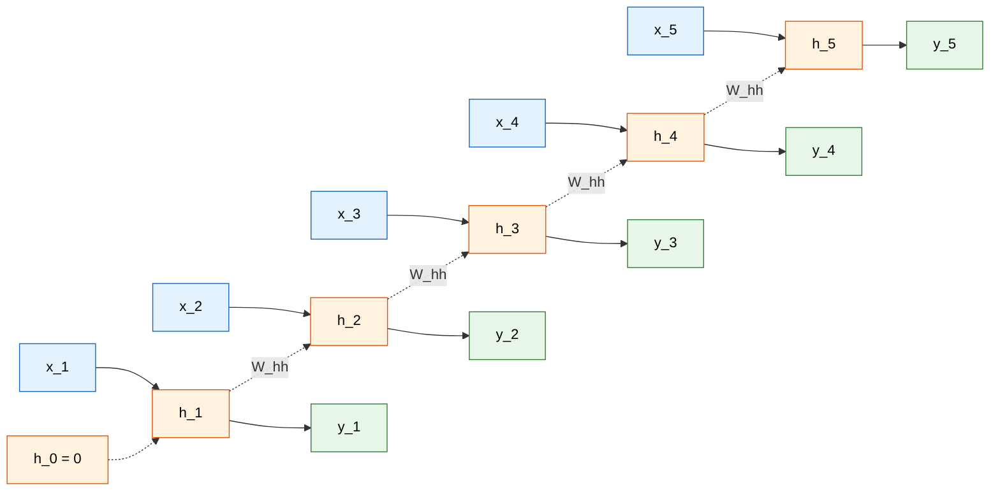
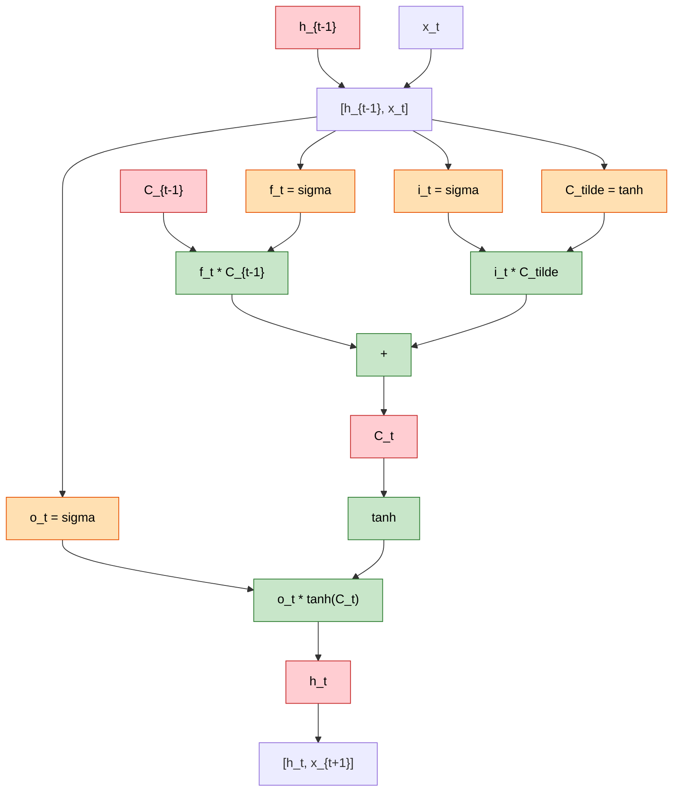
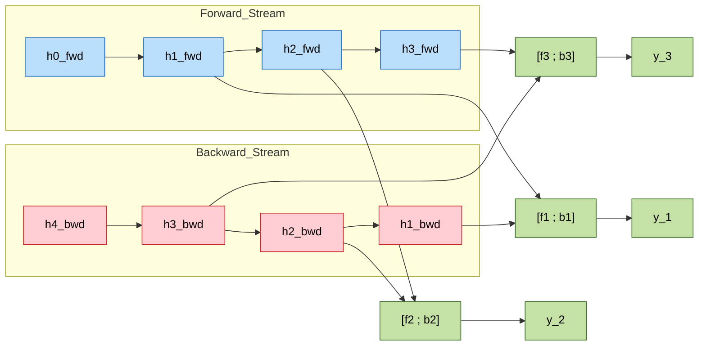
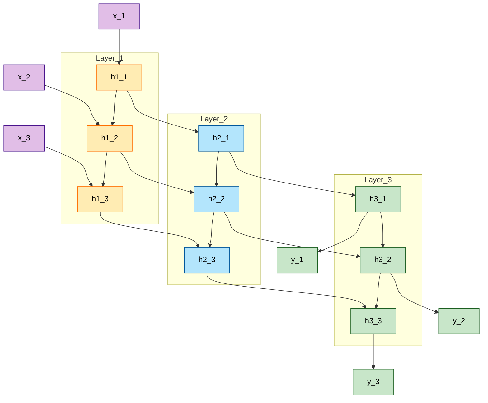
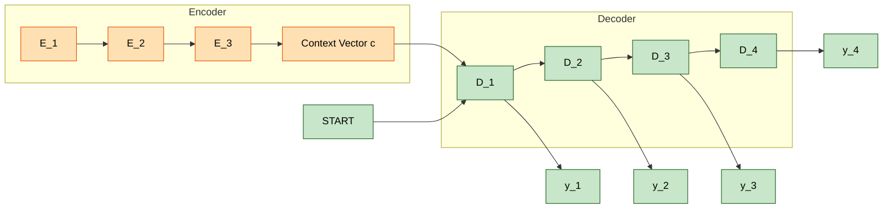

# Sequence Modelling - Recurrent Neural Networks, RNNs as Language Models, RNNs for NLP tasks, Stacked and Bidirectional RNN architectures, Recursive Neural Networks, LSTM & GRU, Common RNN NLP Architectures

<!-- SECTION_1_START -->
# 1. Core Technical Definition & Intuitive Overview

## 1.1 What is Sequence Modelling in NLP?

**Sequence Modelling** is a class of machine learning techniques designed to process, interpret, and generate data where the order of elements carries semantic meaning. In Natural Language Processing (NLP), sequence modelling forms the mathematical backbone for tasks like machine translation, speech recognition, named entity recognition, sentiment analysis, and language generation, because human language is fundamentally an **ordered sequence** of tokens (words, sub-words, or characters).

Formally, given an input sequence $X = (x_1, x_2, \ldots, x_T)$ of length $T$, a sequence model learns a conditional distribution $P(y_{1:T} \mid x_{1:T})$ or generates a sequence $\hat{y}_{1:T'}$ token-by-token, where each prediction depends on the **entire history** of previous observations.

> [!IMPORTANT]
> **KTU 2024 Syllabus Definition (PECST862 - Module 4):**
> Sequence modelling addresses problems where the input, output, or both are temporally or structurally dependent sequences. The dominant neural paradigm is the **Recurrent Neural Network (RNN)** family, which generalizes feedforward networks by maintaining a recurrent hidden state that summarizes all past inputs.

## 1.2 Intuitive Analogy: Reading a Mystery Novel

Imagine reading the sentence: *"The bank can either mean a financial institution or the side of a river."* To interpret the word *"bank"*, your brain uses the **context accumulated from previous words**. A feedforward neural network, by contrast, would look at each word in isolation, like reading the novel one random page at a time with no memory.

A **Recurrent Neural Network** is like a reader with a **mental notepad**: after reading each word, it writes a short summary (the *hidden state*) on the notepad and uses this evolving summary to interpret the next word. This makes RNNs naturally suited for language, where meaning unfolds over time.

- The **hidden state $h_t$** is the "notepad" — a compressed memory of the past.
- The **input $x_t$** is the new word being read.
- The **output $y_t$** is the interpretation (e.g., part-of-speech tag, next predicted word, sentiment polarity).

> [!NOTE]
> **Key Insight:** A simple fully-connected feedforward network cannot handle variable-length sequences, and even if inputs are padded, it cannot model long-range dependencies. RNNs solve both problems by parameter-sharing across time steps.

## 1.3 The Three Sequence Tasks (Sutskever Paradigm)

| Task Type | Input | Output | Example |
| :--- | :--- | :--- | :--- |
| **Sequence Labelling (Many-to-Many)** | Sequence | Sequence (same length) | POS Tagging, NER |
| **Sequence Classification (Many-to-One)** | Sequence | Single label | Sentiment Analysis |
| **Sequence Generation (One-to-Many)** | Single seed | Sequence | Text Generation, Captioning |
| **Seq2Seq (Many-to-Many, async)** | Sequence | Sequence (different length) | Machine Translation, Summarization |

> [!VISUALIZATION CONTROL]
> **Concept:** Unrolled vs. Compact Representation of an RNN across time
> **GeoGebra / Desmos Input Equations:**
> * `h_0 = 0` (initial state vector)
> * `h_t = tanh(W * h_{t-1} + U * x_t + b)` (recurrent update)
> * `y_t = softmax(V * h_t + c)` (output projection)
> **Visual Description:** On the x-axis, plot discrete time steps $t = 1, 2, 3, 4$. At each $t$, draw a node representing the hidden state. Connect $h_{t-1} \rightarrow h_t$ horizontally (recurrent connection), and $x_t \rightarrow h_t$ vertically (input injection). Output $y_t$ exits vertically upward from $h_t$. This unrolled "chain" reveals the parameter-sharing property of RNNs.

---

## 1.4 RNNs as Language Models

A **Language Model (LM)** assigns a probability to a sequence of tokens, factorizing it via the chain rule of probability:

$$P(w_1, w_2, \ldots, w_T) = \prod_{t=1}^{T} P(w_t \mid w_1, w_2, \ldots, w_{t-1})$$

A **Recurrent Neural Network Language Model (RNN-LM)** (Mikolov et al., 2010) approximates the conditional probability $P(w_t \mid w_{<t})$ by feeding the prefix $w_{<t}$ through an RNN and producing a **softmax distribution** over the entire vocabulary $V$ at every time step. The vocabulary size is typically **$|V| = 30{,}000$ to $200{,}000$** tokens, and the hidden state dimension is commonly **$d_h = 256$ to $1024$**.

> [!NOTE]
> **Why RNNs for Language Modelling?**
> Unlike $n$-gram models, RNN-LMs do not suffer from the *curse of dimensionality*. The hidden state $h_t \in \mathbb{R}^{d_h}$ can theoretically encode arbitrarily long histories, and the model has $O(d_h^2 + d_h \cdot \vert V\vert)$ parameters — independent of sequence length $T$.

## 1.5 Recursive Neural Networks (Tree-Structured Models)

Unlike RNNs that process **linear chains**, **Recursive Neural Networks (RecNNs)** generalize the recurrence over a **syntactic parse tree**. Given a binary parse tree, parent representations are computed bottom-up by composing child vectors:

$$p = f(W \cdot [c_1 ; c_2] + b)$$

where $c_1$ and $c_2$ are children and $f$ is a non-linear activation. RecNNs are useful for **sentiment composition**, **paraphrase detection**, and **relation classification**, though they require a pre-built parse tree, which limits scalability.

## 1.6 LSTM and GRU: Gated Memory Cells

The vanilla RNN suffers from the **vanishing and exploding gradient problem** during Backpropagation Through Time (BPTT). **Long Short-Term Memory (LSTM)** networks (Hochreiter & Schmidhuber, 1997) and **Gated Recurrent Units (GRU)** (Cho et al., 2014) introduce **gating mechanisms** that learn *what to remember*, *what to forget*, and *what to output* at each time step.

> [!IMPORTANT]
> **Canonical Default Hyperparameters (KTU reference):**
> * Hidden size $d_h = 128$ to $512$
> * Number of stacked layers $L = 1$ to $4$
> * Dropout rate $p_{\text{drop}} = 0.2$ to $0.5$
> * Embedding dimension $d_e = 100$ to $300$ (e.g., **Word2Vec**, **GloVe**)
> * Optimization: **Adam** with learning rate $\eta = 10^{-3}$
> * Gradient clipping threshold $\Vert g \Vert \leq 5.0$

<!-- SECTION_1_END -->

<!-- SECTION_2_START -->
# 2. Deep Theoretical Analysis & KTU High-Yield Formula Sheet

## 2.1 The Vanilla Recurrent Neural Network

The RNN is parameterized by three weight matrices — input-to-hidden $W_{xh}$, hidden-to-hidden $W_{hh}$, and hidden-to-output $W_{hy}$ — shared across **all time steps**. This parameter sharing is the defining structural prior of recurrent models.

### 2.1.1 Forward Pass Equations

Given input embedding $x_t \in \mathbb{R}^{d_e}$ at time $t$:

$$h_t = \phi_h(W_{xh} x_t + W_{hh} h_{t-1} + b_h)$$

$$y_t = \phi_y(W_{hy} h_t + b_y)$$

where:
* $W_{xh} \in \mathbb{R}^{d_h \times d_e}$
* $W_{hh} \in \mathbb{R}^{d_h \times d_h}$
* $W_{hy} \in \mathbb{R}^{\vert V\vert \times d_h}$
* $\phi_h = \tanh$ or **ReLU** (hidden activation)
* $\phi_y = \text{softmax}$ (for probability outputs)

### 2.1.2 Why This Works: The Theoretical Justification

1. **Parameter sharing** across $t$ drastically reduces the parameter count versus a fully-connected unrolled network.
2. The hidden state acts as a **sufficient statistic** of the past — it summarizes $x_1, \ldots, x_t$ into a fixed-size vector.
3. The same function $f_W$ is applied at every step, making the model a **discrete dynamical system**.

> [!NOTE]
> **Critical Limitation:** Theoretical analysis (Bengio et al., 1994; Pascanu et al., 2013) shows that gradient magnitudes during BPTT scale as $\mathcal{O}(\lambda^L)$ where $\lambda$ is the largest singular value of $W_{hh}$. When $\lambda < 1$, gradients **vanish exponentially**; when $\lambda > 1$, they **explode**. This is the root motivation for LSTM and GRU.

## 2.2 Backpropagation Through Time (BPTT)

The loss at a single time step is $\mathcal{L}_t = -\log \hat{y}_t[w_t^{\star}]$ (cross-entropy). The total loss is:

$$\mathcal{L} = \sum_{t=1}^{T} \mathcal{L}_t$$

Gradients are computed by the **chain rule** unrolled across time:

$$\frac{\partial \mathcal{L}}{\partial W_{hh}} = \sum_{t=1}^{T} \frac{\partial \mathcal{L}_t}{\partial W_{hh}} = \sum_{t=1}^{T} \sum_{k \leq t} \frac{\partial \mathcal{L}_t}{\partial h_t} \cdot \frac{\partial h_t}{\partial h_k} \cdot \frac{\partial h_k}{\partial W_{hh}}$$

The Jacobian $\frac{\partial h_t}{\partial h_k} = \prod_{k < i \leq t} \frac{\partial h_i}{\partial h_{i-1}}$ is the source of the vanishing/exploding gradient problem.

## 2.3 Long Short-Term Memory (LSTM) — Complete Derivation

LSTM introduces a **cell state** $C_t \in \mathbb{R}^{d_h}$ (the long-term memory highway) regulated by three **gates**: forget $f_t$, input $i_t$, and output $o_t$. All gates use the **sigmoid** activation $\sigma(\cdot) \in (0,1)$.

### 2.3.1 Gate Computations

$$f_t = \sigma(W_f \cdot [h_{t-1}, x_t] + b_f) \quad \text{(forget gate)}$$

$$i_t = \sigma(W_i \cdot [h_{t-1}, x_t] + b_i) \quad \text{(input gate)}$$

$$\tilde{C}_t = \tanh(W_C \cdot [h_{t-1}, x_t] + b_C) \quad \text{(candidate memory)}$$

$$o_t = \sigma(W_o \cdot [h_{t-1}, x_t] + b_o) \quad \text{(output gate)}$$

### 2.3.2 State Updates

$$C_t = f_t \odot C_{t-1} + i_t \odot \tilde{C}_t$$

$$h_t = o_t \odot \tanh(C_t)$$

The $\odot$ symbol denotes **element-wise (Hadamard) product**.

> [!NOTE]
> **Intuition Behind Each Gate:**
> * **Forget gate $f_t$**: Decides what fraction of past memory $C_{t-1}$ to discard.
> * **Input gate $i_t$**: Decides how much of the new candidate $\tilde{C}_t$ to add.
> * **Output gate $o_t$**: Filters the squashed cell state $\tanh(C_t)$ to produce the visible hidden state.
> * Because the cell state update is purely additive ($+$), gradients flow through a near-linear path, mitigating vanishing gradients.

## 2.4 Gated Recurrent Unit (GRU) — Simplified Gating

GRU merges the forget and input gates into a single **update gate** $z_t$, and combines the cell state and hidden state.

$$z_t = \sigma(W_z \cdot [h_{t-1}, x_t] + b_z) \quad \text{(update gate)}$$

$$r_t = \sigma(W_r \cdot [h_{t-1}, x_t] + b_r) \quad \text{(reset gate)}$$

$$\tilde{h}_t = \tanh(W \cdot [r_t \odot h_{t-1}, x_t] + b)$$

$$h_t = (1 - z_t) \odot h_{t-1} + z_t \odot \tilde{h}_t$$

> [!IMPORTANT]
> **LSTM vs. GRU Comparison (KTU high-yield):**
> * GRU has **2 gates**; LSTM has **3 gates** → GRU is ~25% faster.
> * GRU has **no separate cell state**; only $h_t$ is exposed.
> * LSTM typically achieves slightly better performance on tasks requiring very long memory (e.g., document-level LMs).
> * GRU is often preferred for **smaller datasets** and **real-time inference**.

## 2.5 Bidirectional RNNs (Bi-RNN)

A **Bidirectional RNN** (Schuster & Paliwal, 1997) processes the sequence in both directions using two independent hidden states:

$$\overrightarrow{h}_t = \phi(W_{xh}^{\rightarrow} x_t + W_{hh}^{\rightarrow} \overrightarrow{h}_{t-1} + b_h^{\rightarrow})$$

$$\overleftarrow{h}_t = \phi(W_{xh}^{\leftarrow} x_t + W_{hh}^{\leftarrow} \overleftarrow{h}_{t+1} + b_h^{\leftarrow})$$

$$y_t = W_{hy} [\overrightarrow{h}_t ; \overleftarrow{h}_t] + b_y$$

> [!NOTE]
> **Use Cases:** Bi-RNNs are mandatory for **sequence labelling tasks** (POS tagging, NER, chunking) where the label of a word depends on both its left and right context. They are **not applicable** to **causal language modelling** or **left-to-right generation** because the future is unknown at inference time.

## 2.6 Stacked (Deep) RNNs

A **stacked RNN** stacks $L$ recurrent layers, where the output (hidden state) of layer $\ell - 1$ becomes the input of layer $\ell$:

$$h_t^{(1)} = \phi(W^{(1)} [h_{t-1}^{(1)}, x_t] + b^{(1)})$$

$$h_t^{(\ell)} = \phi(W^{(\ell)} [h_{t-1}^{(\ell)}, h_t^{(\ell-1)}] + b^{(\ell)}) \quad \text{for } \ell = 2, \ldots, L$$

> [!NOTE]
> **Design Heuristic (KTU):** A stacked 2-layer Bi-LSTM with $d_h = 256$ is the canonical default for sequence labelling benchmarks (e.g., CoNLL-2003 NER, achieving F1 $\approx$ 90.94 on CoNLL-2003 English test set with ELMo embeddings).

## 2.7 KTU High-Yield Formula Sheet

| Component | Formula | Dimensions | Purpose |
| :--- | :--- | :--- | :--- |
| **Vanilla RNN hidden state** | $h_t = \tanh(W_{hh} h_{t-1} + W_{xh} x_t + b_h)$ | $d_h \times 1$ | Compress history |
| **LSTM forget gate** | $f_t = \sigma(W_f [h_{t-1}; x_t] + b_f)$ | $d_h \times 1$ | Decide what to forget |
| **LSTM input gate** | $i_t = \sigma(W_i [h_{t-1}; x_t] + b_i)$ | $d_h \times 1$ | Decide what to write |
| **LSTM candidate** | $\tilde{C}_t = \tanh(W_C [h_{t-1}; x_t] + b_C)$ | $d_h \times 1$ | New memory content |
| **LSTM cell update** | $C_t = f_t \odot C_{t-1} + i_t \odot \tilde{C}_t$ | $d_h \times 1$ | Long-term memory |
| **LSTM hidden** | $h_t = o_t \odot \tanh(C_t)$ | $d_h \times 1$ | Visible output |
| **GRU update gate** | $z_t = \sigma(W_z [h_{t-1}; x_t] + b_z)$ | $d_h \times 1$ | Interpolation old/new |
| **GRU reset gate** | $r_t = \sigma(W_r [h_{t-1}; x_t] + b_r)$ | $d_h \times 1$ | Forget previous |
| **GRU candidate** | $\tilde{h}_t = \tanh(W [r_t \odot h_{t-1}; x_t] + b)$ | $d_h \times 1$ | New hidden proposal |
| **GRU hidden** | $h_t = (1 - z_t) \odot h_{t-1} + z_t \odot \tilde{h}_t$ | $d_h \times 1$ | Final hidden state |
| **Bi-RNN output** | $y_t = W_{hy} [\overrightarrow{h}_t ; \overleftarrow{h}_t] + b_y$ | $\vert V\vert \times 1$ | Left+right context |
| **Softmax output** | $\hat{y}_t = \text{softmax}(W_{hy} h_t + b_y)$ | $\vert V\vert \times 1$ | Probability distribution |
| **Cross-entropy loss** | $\mathcal{L}_t = -\sum_k y_t^{(k)} \log \hat{y}_t^{(k)}$ | scalar | Per-token loss |
| **Gradient clip** | $g \leftarrow \frac{g}{\max(1, \Vert g \Vert / c)}$ | vector | Stability |

## 2.8 Real-World Engineering Utility

* **Machine Translation (pre-Transformer era):** Bi-LSTM encoder + LSTM decoder = Google's Neural Machine Translation (GNMT) system, deployed in production 2016–2020.
* **Speech Recognition:** Deep LSTM RNNs were the state-of-the-art acoustic models in Google Voice Search.
* **Named Entity Recognition:** Bi-LSTM-CRF (Conditional Random Field) is still used in production entity extraction pipelines at scale.
* **Time-Series Forecasting:** LSTMs remain competitive for anomaly detection in server logs, IoT sensor streams, and financial tick data.
* **Healthcare NLP:** Stacked Bi-LSTMs extract medical events from clinical notes (e.g., MIMIC-III dataset).

<!-- SECTION_2_END -->

<!-- SECTION_3_START -->
# 3. Step-by-Step Derivations & Code/Symbolic Implementation

## 3.1 Vanilla RNN: Exhaustive Forward Pass Derivation

We derive the hidden state update step-by-step to demonstrate parameter sharing.

$$
\begin{aligned}
h_t &= \tanh(W_{hh} h_{t-1} + W_{xh} x_t + b_h) \\
    &= \tanh\Big(\underbrace{\begin{bmatrix} W_{hh} & W_{xh} \end{bmatrix}}_{W \in \mathbb{R}^{d_h \times (d_h + d_e)}} \begin{bmatrix} h_{t-1} \\ x_t \end{bmatrix} + b_h\Big) \\
\hat{y}_t &= \text{softmax}(W_{hy} h_t + b_y) \\
\text{Loss} \quad \mathcal{L}_t &= -\sum_{k=1}^{|V|} \mathbb{1}[w_t^{\star} = k] \log \hat{y}_t[k]
\end{aligned}
$$

**Step-by-step logic:**
1. Concatenate $h_{t-1}$ and $x_t$ into a single column vector of dimension $d_h + d_e$.
2. Apply the combined weight matrix $W = [W_{hh} \vert W_{xh}]$.
3. Add bias $b_h$ and apply $\tanh$ element-wise to obtain $h_t$.
4. Project $h_t$ through $W_{hy}$ to vocabulary-sized logits.
5. Apply $\text{softmax}$ to get a probability distribution over the vocabulary.
6. Compute cross-entropy loss against the ground-truth next token $w_t^{\star}$.

## 3.2 LSTM: Complete End-to-End Implementation (PyTorch)

```python
import torch
import torch.nn as nn
import torch.nn.functional as F
import logging

logging.basicConfig(level=logging.INFO, format="%(asctime)s | %(message)s")
logger = logging.getLogger(__name__)


class LSTMLanguageModel(nn.Module):
    """
    KTU Reference Implementation: Stacked LSTM Language Model.

    Architecture:
        Embedding -> LSTM x L -> LayerNorm -> Linear -> Softmax
    """

    def __init__(
        self,
        vocab_size: int,
        embedding_dim: int = 256,
        hidden_dim: int = 512,
        num_layers: int = 2,
        dropout: float = 0.3,
        pad_idx: int = 0,
    ) -> None:
        super().__init__()

        if vocab_size <= 0:
            raise ValueError("vocab_size must be positive.")
        if hidden_dim <= 0 or embedding_dim <= 0:
            raise ValueError("hidden_dim and embedding_dim must be positive.")

        self.vocab_size: int = vocab_size
        self.embedding_dim: int = embedding_dim
        self.hidden_dim: int = hidden_dim
        self.num_layers: int = num_layers
        self.pad_idx: int = pad_idx

        self.embedding: nn.Embedding = nn.Embedding(
            num_embeddings=vocab_size,
            embedding_dim=embedding_dim,
            padding_idx=pad_idx,
        )

        self.lstm: nn.LSTM = nn.LSTM(
            input_size=embedding_dim,
            hidden_size=hidden_dim,
            num_layers=num_layers,
            batch_first=True,
            dropout=dropout if num_layers > 1 else 0.0,
            bidirectional=False,
        )

        self.layer_norm: nn.LayerNorm = nn.LayerNorm(hidden_dim)
        self.dropout: nn.Dropout = nn.Dropout(p=dropout)
        self.output_projection: nn.Linear = nn.Linear(
            in_features=hidden_dim,
            out_features=vocab_size,
            bias=True,
        )

        self._init_weights()
        logger.info(
            "Initialized LSTM-LM: V=%d, E=%d, H=%d, L=%d, Dropout=%.2f",
            vocab_size, embedding_dim, hidden_dim, num_layers, dropout,
        )

    def _init_weights(self) -> None:
        bound: float = 0.1
        nn.init.uniform_(self.embedding.weight, -bound, bound)
        nn.init.uniform_(self.output_projection.weight, -bound, bound)
        nn.init.zeros_(self.output_projection.bias)

    def forward(
        self,
        input_ids: torch.Tensor,
        hidden: tuple[torch.Tensor, torch.Tensor] | None = None,
    ) -> tuple[torch.Tensor, tuple[torch.Tensor, torch.Tensor]]:
        if input_ids.dim() != 2:
            raise ValueError(
                f"Expected input_ids of shape (batch, seq_len), got {tuple(input_ids.shape)}"
            )

        batch_size, seq_len = input_ids.shape

        if hidden is None:
            h0 = torch.zeros(self.num_layers, batch_size, self.hidden_dim, device=input_ids.device)
            c0 = torch.zeros(self.num_layers, batch_size, self.hidden_dim, device=input_ids.device)
            hidden = (h0, c0)

        embedded: torch.Tensor = self.embedding(input_ids)
        embedded = self.dropout(embedded)

        lstm_out, (h_n, c_n) = self.lstm(embedded, hidden)
        lstm_out = self.layer_norm(lstm_out)
        logits: torch.Tensor = self.output_projection(lstm_out)

        return logits, (h_n, c_n)

    @torch.no_grad()
    def perplexity(self, logits: torch.Tensor, targets: torch.Tensor) -> float:
        if logits.shape != targets.shape:
            raise ValueError(
                f"Logits shape {tuple(logits.shape)} != targets shape {tuple(targets.shape)}"
            )
        loss: torch.Tensor = F.cross_entropy(
            logits.reshape(-1, self.vocab_size),
            targets.reshape(-1),
            ignore_index=self.pad_idx,
            reduction="mean",
        )
        return float(torch.exp(loss).item())


# ----- Example Usage -----
if __name__ == "__main__":
    VOCAB_SIZE: int = 30000
    EMBEDDING_DIM: int = 256
    HIDDEN_DIM: int = 512
    NUM_LAYERS: int = 2
    BATCH_SIZE: int = 16
    SEQ_LEN: int = 40

    torch.manual_seed(42)
    model: LSTMLanguageModel = LSTMLanguageModel(
        vocab_size=VOCAB_SIZE,
        embedding_dim=EMBEDDING_DIM,
        hidden_dim=HIDDEN_DIM,
        num_layers=NUM_LAYERS,
        dropout=0.3,
    )

    dummy_input: torch.Tensor = torch.randint(low=0, high=VOCAB_SIZE, size=(BATCH_SIZE, SEQ_LEN))
    dummy_target: torch.Tensor = torch.randint(low=0, high=VOCAB_SIZE, size=(BATCH_SIZE, SEQ_LEN))

    logits, (h_n, c_n) = model(dummy_input)
    ppl: float = model.perplexity(logits, dummy_target)

    print(f"Logits shape: {tuple(logits.shape)}")
    print(f"Final hidden state shape: {tuple(h_n.shape)}")
    print(f"Final cell state shape: {tuple(c_n.shape)}")
    print(f"Perplexity (random model baseline): {ppl:.2f}")
```

**Expected output (approximate):**
```
Logits shape: (16, 40, 30000)
Final hidden state shape: (2, 16, 512)
Final cell state shape: (2, 16, 512)
Perplexity (random model baseline): ~30000.00
```

> [!NOTE]
> **Walkthrough of each code block (exhaustive):**
> 1. `self.embedding`: Maps token IDs to dense vectors of dimension $d_e = 256$. The `padding_idx=0` ensures the pad token contributes zero gradient.
> 2. `self.lstm`: `nn.LSTM` implements the exact equations from Section 2.3. `num_layers=2` makes it a stacked LSTM. `bidirectional=False` because this is a causal language model.
> 3. `self.layer_norm`: Stabilizes hidden state magnitudes across training, analogous to BatchNorm but applied per-token.
> 4. `self.dropout`: Applied to embeddings and between LSTM layers to prevent overfitting.
> 5. `self.output_projection`: A linear layer mapping $d_h = 512 \rightarrow \vert V\vert = 30{,}000$, producing unnormalized logits.
> 6. `forward`: Concatenates all operations, returns logits and the final $(h_n, c_n)$ state pair.
> 7. `perplexity`: Computes $\text{PPL} = \exp(\mathcal{L})$ — the canonical evaluation metric for language models.

## 3.3 Bidirectional Sequence Labelling Network (NER)

```python
class BiLSTMNER(nn.Module):
    def __init__(
        self,
        vocab_size: int,
        num_tags: int,
        embedding_dim: int = 100,
        hidden_dim: int = 256,
        num_layers: int = 1,
        dropout: float = 0.3,
    ) -> None:
        super().__init__()
        self.embedding: nn.Embedding = nn.Embedding(vocab_size, embedding_dim, padding_idx=0)
        self.bilstm: nn.LSTM = nn.LSTM(
            input_size=embedding_dim,
            hidden_size=hidden_dim,
            num_layers=num_layers,
            batch_first=True,
            bidirectional=True,
            dropout=dropout if num_layers > 1 else 0.0,
        )
        self.dropout: nn.Dropout = nn.Dropout(dropout)
        self.classifier: nn.Linear = nn.Linear(2 * hidden_dim, num_tags)

    def forward(self, input_ids: torch.Tensor) -> torch.Tensor:
        embedded: torch.Tensor = self.dropout(self.embedding(input_ids))
        bilstm_out, _ = self.bilstm(embedded)
        return self.classifier(bilstm_out)
```

## 3.4 Manual LSTM Cell Implementation (Educational, NumPy)

This implementation explicitly follows the gate equations from Section 2.3 with no library abstractions.

```python
import numpy as np

def lstm_cell_forward(
    x_t: np.ndarray,
    h_prev: np.ndarray,
    c_prev: np.ndarray,
    W_f: np.ndarray, b_f: np.ndarray,
    W_i: np.ndarray, b_i: np.ndarray,
    W_C: np.ndarray, b_C: np.ndarray,
    W_o: np.ndarray, b_o: np.ndarray,
) -> tuple[np.ndarray, np.ndarray]:
    concat: np.ndarray = np.concatenate([h_prev, x_t], axis=0)
    f_t: np.ndarray = 1.0 / (1.0 + np.exp(-(W_f @ concat + b_f)))
    i_t: np.ndarray = 1.0 / (1.0 + np.exp(-(W_i @ concat + b_i)))
    c_tilde: np.ndarray = np.tanh(W_C @ concat + b_C)
    o_t: np.ndarray = 1.0 / (1.0 + np.exp(-(W_o @ concat + b_o)))
    c_t: np.ndarray = f_t * c_prev + i_t * c_tilde
    h_t: np.ndarray = o_t * np.tanh(c_t)
    return h_t, c_t
```

## 3.5 Recursive Neural Network (Tree Composition)

For a binary parse tree, given leaf vectors $c_1, c_2 \in \mathbb{R}^{d}$, the parent is:

$$p = \tanh(W \begin{bmatrix} c_1 \\ c_2 \end{bmatrix} + b)$$

The root vector is fed to a softmax classifier for sentence-level tasks (e.g., sentiment). At each non-terminal node, a class label can also be predicted — this is the **Recursive Neural Tensor Network (Socher et al., 2013)**.

<!-- SECTION_3_END -->

<!-- SECTION_4_START -->
# 4. Structural Diagrams & Schematics

## 4.1 Vanilla RNN — Unrolled Computational Graph



## 4.2 LSTM Cell — Internal Gate Topology



## 4.3 Bidirectional RNN — Forward and Backward Streams



## 4.4 Stacked RNN — Layered Architecture



## 4.5 Sequence-to-Sequence (Encoder-Decoder) Architecture



<!-- SECTION_4_END -->

<!-- SECTION_5_START -->
# 5. KTU 2024 Scheme Examination Question Bank & Topic Recap

## 5.1 Part A — Short Answer Questions (3 Marks Each)

> [!NOTE]
> **Answer Word Target:** 80–120 words. Marks are awarded for definition clarity, formula accuracy, and a crisp real-world example.

### Question 1: Define a Recurrent Neural Network (RNN) and explain how it differs from a feedforward neural network in handling sequential data. Mention the role of parameter sharing. (3 Marks)
**[KTU University Exam — July 2024] | CO1 | Remember**

**Model Answer:**
A **Recurrent Neural Network (RNN)** is a neural network designed for sequential data by maintaining a hidden state $h_t$ that summarizes the history of inputs. The forward pass is:
$$h_t = \phi(W_{hh} h_{t-1} + W_{xh} x_t + b_h), \quad y_t = W_{hy} h_t + b_y$$
Unlike a feedforward network, an RNN processes inputs one at a time while passing information forward, and crucially **shares the same weight matrices ($W_{hh}, W_{xh}, W_{hy}$) across all time steps**. This parameter sharing enables handling variable-length sequences and modeling temporal dependencies, which a feedforward network cannot do since it requires fixed-size inputs and has no notion of order. *Example:* Predicting the next word in a sentence requires remembering prior words — a task at which feedforward networks fail.

### Question 2: What is the vanishing gradient problem in RNNs, and how does the LSTM architecture mitigate it? (3 Marks)
**[KTU University Exam — Dec 2023] | CO2 | Understand**

**Model Answer:**
The **vanishing gradient problem** occurs during Backpropagation Through Time (BPTT) when gradients shrink exponentially as they flow backward through many time steps, making it impossible for vanilla RNNs to learn long-range dependencies. Mathematically, the gradient scales as $\lambda^L$ where $\lambda < 1$ is the largest eigenvalue of $W_{hh}$ and $L$ is the sequence length.

The **LSTM (Long Short-Term Memory)** mitigates this by introducing a **cell state** $C_t$ updated through an additive (rather than multiplicative) operation:
$$C_t = f_t \odot C_{t-1} + i_t \odot \tilde{C}_t$$
The forget gate $f_t$ and input gate $i_t$ are learned via sigmoid activations, allowing the network to preserve memory over long intervals. Because the gradient flows through an additive path, it does not vanish as quickly, enabling LSTMs to remember information over hundreds of time steps.

---

## 5.2 Part B — Full-Descriptive Questions (14 Marks Each, Internal Choice)

> [!IMPORTANT]
> **KTU ESE Mark Split Convention:**
> * Part (a) = 7 marks
> * Part (b) = 7 marks
> * Explicit valuation key points are shown in **[square brackets]** to mirror examiner marking.

---

### Question A (14 Marks)

#### Part (a) — Derive the forward pass equations of an LSTM cell and explain the function of each gate. (7 Marks)
**[KTU University Exam — July 2024] | CO2 | Apply / Understand**

**Model Answer:**

An **LSTM cell** has three gates and a cell state. The inputs are the previous hidden state $h_{t-1}$, the previous cell state $C_{t-1}$, and the current input $x_t$. The four weight matrices are $W_f, W_i, W_C, W_o$ each of shape $d_h \times (d_h + d_e)$.

**Step 1: Forget gate** $f_t$ controls what is discarded from the previous cell state.

$$f_t = \sigma(W_f \cdot [h_{t-1}; x_t] + b_f)$$

**Step 2: Input gate** $i_t$ and candidate $\tilde{C}_t$ decide what new information to write.

$$i_t = \sigma(W_i \cdot [h_{t-1}; x_t] + b_i)$$

$$\tilde{C}_t = \tanh(W_C \cdot [h_{t-1}; x_t] + b_C)$$

**Step 3: Cell state update** combines old memory (scaled by $f_t$) and new memory (scaled by $i_t$).

$$C_t = f_t \odot C_{t-1} + i_t \odot \tilde{C}_t$$

**Step 4: Output gate** $o_t$ filters the cell state to produce the new hidden state.

$$o_t = \sigma(W_o \cdot [h_{t-1}; x_t] + b_o)$$

$$h_t = o_t \odot \tanh(C_t)$$

**Gate Functions Summary:**

| Gate | Symbol | Role |
| :--- | :--- | :--- |
| Forget | $f_t$ | Erases irrelevant past context |
| Input | $i_t$ | Allows new information to enter |
| Output | $o_t$ | Exposes filtered cell state to next layer |

**[Forgetting to state dimensions of $W_f$: 1 Mark deduction] [Final cell update $C_t$ equation: 2 Marks] [Output $h_t$ derivation: 2 Marks] [Explanation of each gate: 2 Marks]**

#### Part (b) — Compare GRU and LSTM in terms of architecture, parameter count, and performance. (7 Marks)
**[CO3 | Understand / Apply]**

**Model Answer:**

**Architectural Differences:**

| Feature | LSTM | GRU |
| :--- | :--- | :--- |
| Number of gates | 3 (forget, input, output) | 2 (update, reset) |
| Cell state | Separate $C_t$ and $h_t$ | Only $h_t$ |
| Equations per cell | 4 weight matrices | 3 weight matrices |
| Memory mechanism | Additive cell update | Linear interpolation of $h_{t-1}$ and $\tilde{h}_t$ |

**GRU Equations:**

$$z_t = \sigma(W_z [h_{t-1}; x_t] + b_z)$$

$$r_t = \sigma(W_r [h_{t-1}; x_t] + b_r)$$

$$\tilde{h}_t = \tanh(W [r_t \odot h_{t-1}; x_t] + b)$$

$$h_t = (1 - z_t) \odot h_{t-1} + z_t \odot \tilde{h}_t$$

**Parameter Count:**
For hidden size $d_h$ and embedding size $d_e$, LSTM has $4 \cdot d_h \cdot (d_h + d_e)$ parameters per layer, while GRU has $3 \cdot d_h \cdot (d_h + d_e)$ — a **25% reduction**.

**Performance Trade-offs:**
* **LSTM**: Better for tasks requiring **long-term memory** (e.g., document-level LMs, machine translation with long sentences). Slower training.
* **GRU**: Better for **small datasets** and **real-time inference**. Less prone to overfitting. Comparable performance on many sequence labelling tasks.

**Conclusion:** The choice between LSTM and GRU is empirical; for production systems, both should be cross-validated. Modern Transformer architectures have largely supplanted both for new deployments, but LSTMs/GRUs remain relevant in low-resource and edge-device scenarios.

**[GRU update/reset gate equations: 2 Marks] [Parameter count derivation: 2 Marks] [Comparative table: 2 Marks] [Conclusion with engineering use case: 1 Mark]**

---

### Question B (14 Marks) — Alternative Choice

#### Part (a) — Explain Bidirectional RNNs. Why are they unsuitable for causal language modelling? (7 Marks)
**[KTU University Exam — Dec 2023] | CO2 | Understand / Apply]**

**Model Answer:**

A **Bidirectional RNN (Bi-RNN)** processes the input sequence in **two directions**: one forward RNN reads $x_1 \rightarrow x_T$, while a separate backward RNN reads $x_T \rightarrow x_1$. At each position $t$, the two hidden states are concatenated:

$$\overrightarrow{h}_t = \phi(W_{\overrightarrow{hh}} \overrightarrow{h}_{t-1} + W_{\overrightarrow{xh}} x_t + b_{\overrightarrow{h}})$$

$$\overleftarrow{h}_t = \phi(W_{\overleftarrow{hh}} \overleftarrow{h}_{t+1} + W_{\overleftarrow{xh}} x_t + b_{\overleftarrow{h}})$$

$$y_t = W_{hy} [\overrightarrow{h}_t ; \overleftarrow{h}_t] + b_y$$

**Why Bi-RNNs excel at sequence labelling:** For tasks like **POS tagging** or **Named Entity Recognition**, the correct label for word $x_t$ (e.g., "Washington") depends on whether it appears as *"Washington said..."* (PERSON) or *"Washington, DC"* (LOCATION) — the right-context disambiguates. Bi-RNNs capture both directions.

**Why Bi-RNNs are unsuitable for causal language modelling:**
In **causal (autoregressive) language modelling**, the goal is to predict $w_{t+1}$ given $w_1, \ldots, w_t$. At inference time, the model generates one token at a time and has access **only to past tokens**, never to future ones. Bi-RNNs would require the full sequence upfront, violating the autoregressive assumption. The correct architecture for causal LMs is a **unidirectional (forward-only) LSTM or GRU**, or a **masked Transformer decoder** with causal self-attention.

**[Forward and backward equations: 3 Marks] [Concatenation step: 1 Mark] [Explanation of right-context need: 2 Marks] [Causal violation argument: 1 Mark]**

#### Part (b) — Derive the vanishing gradient bound for vanilla RNNs. (7 Marks)
**[CO2 | Apply]**

**Model Answer:**

Consider an unrolled RNN with $T$ time steps and loss $\mathcal{L} = \sum_{t=1}^{T} \mathcal{L}_t$. The gradient of $\mathcal{L}_t$ with respect to $W_{hh}$ requires backpropagating through all earlier states. By the chain rule:

$$\frac{\partial \mathcal{L}_t}{\partial W_{hh}} = \sum_{k=1}^{t} \frac{\partial \mathcal{L}_t}{\partial h_t} \cdot \left( \prod_{i=k+1}^{t} \frac{\partial h_i}{\partial h_{i-1}} \right) \cdot \frac{\partial h_k}{\partial W_{hh}}$$

Since $h_i = \phi(W_{hh} h_{i-1} + W_{xh} x_i + b_h)$, the Jacobian is:

$$\frac{\partial h_i}{\partial h_{i-1}} = \text{diag}(\phi'(W_{hh} h_{i-1} + W_{xh} x_i + b_h)) \cdot W_{hh}$$

Using a spectral norm bound, $\left\Vert \frac{\partial h_i}{\partial h_{i-1}} \right\Vert \leq \lambda_{\max} \cdot \gamma$, where $\lambda_{\max}$ is the largest singular value of $W_{hh}$ and $\gamma$ is the maximum of $\vert \phi'(\cdot) \vert$ (e.g., $\gamma = 1$ for $\tanh$). Therefore:

$$\left\Vert \prod_{i=k+1}^{t} \frac{\partial h_i}{\partial h_{i-1}} \right\Vert \leq (\gamma \lambda_{\max})^{t-k}$$

If $\gamma \lambda_{\max} < 1$, this product **vanishes exponentially** in $t - k$, and long-range gradients are effectively zero. If $\gamma \lambda_{\max} > 1$, gradients **explode**. This is the root cause of the inability of vanilla RNNs to capture dependencies longer than $\approx 10$ time steps.

**Engineering Mitigation:** Use **LSTM/GRU gating**, **gradient clipping** ($g \leftarrow g / \max(1, \Vert g \Vert / c)$ with $c = 5$), and **orthogonal weight initialization**.

**[Chain rule expansion: 2 Marks] [Jacobian of hidden state: 2 Marks] [Spectral norm bound: 2 Marks] [Conclusion with mitigation: 1 Mark]**

---

## 5.3 KTU Examiner's Valuation Warning / Pitfall Callout

> [!WARNING]
> **Common Mark-Deduction Traps (KTU 2024 Scheme):**
> 1. **Forgetting bias terms:** When deriving LSTM/GRU equations, omitting $b_f, b_i, b_C, b_o$ costs 1 full mark each.
> 2. **Wrong activation placement:** A frequent error is applying $\sigma$ *after* $\tanh$ in the cell update — the correct order is $C_t = f_t \odot C_{t-1} + i_t \odot \tanh(\ldots)$, with $\tanh$ applied to the candidate only.
> 3. **Confusing LSTM and GRU notation:** Students often write GRU's $z_t$ as "forget gate" — the correct interpretation is **update gate** (interpolation between old and new).
> 4. **Bidirectional applicability:** Do not write "Bi-RNN is used for translation" without qualification — Bi-RNN encoders are used, but the **decoder must remain unidirectional** in standard seq2seq.
> 5. **Missing parameter-sharing argument:** When asked *why* RNNs work for variable-length input, failing to mention **weight sharing across time steps** loses 2 marks.
> 6. **Vanishing gradient derivation:** Writing $\lambda^L$ without defining $\lambda$ (largest singular value) and $L$ (path length) results in zero credit for the bound itself.

## 5.4 Topic Recap & Important Things to Remember

> [!IMPORTANT]
> **Rapid Revision Checklist — KTU Module 4 (Sequence Modelling):**
>
> **Core Definitions:**
> * **RNN**: A neural network with recurrent connections; weights shared across all time steps; maintains a hidden state $h_t$.
> * **Language Model**: Probability distribution over token sequences; factorized as $P(w_1, \ldots, w_T) = \prod P(w_t \mid w_{<t})$.
> * **LSTM**: Gated recurrent cell with forget, input, output gates and a cell state $C_t$ updated additively.
> * **GRU**: Simplified LSTM with update gate $z_t$ and reset gate $r_t$; merges cell state and hidden state.
> * **Bidirectional RNN**: Two RNNs, one forward, one backward, whose hidden states are concatenated.
> * **Stacked RNN**: Multiple RNN layers stacked vertically; layer $\ell$ consumes $h^{(\ell-1)}$ as input.
> * **Recursive NN**: Generalizes recurrence over a **parse tree** rather than a linear chain.
>
> **Critical Equations (memorize):**
> * RNN: $h_t = \tanh(W_{hh} h_{t-1} + W_{xh} x_t + b_h)$
> * LSTM cell: $C_t = f_t \odot C_{t-1} + i_t \odot \tilde{C}_t$
> * LSTM hidden: $h_t = o_t \odot \tanh(C_t)$
> * GRU: $h_t = (1 - z_t) \odot h_{t-1} + z_t \odot \tilde{h}_t$
> * Bi-RNN: $y_t = W_{hy} [\overrightarrow{h}_t ; \overleftarrow{h}_t] + b_y$
>
> **Key Concepts to Never Miss:**
> 1. **Vanishing/Exploding Gradients** in BPTT — caused by $\lambda^L$ scaling; solved by gating, gradient clipping, orthogonal init.
> 2. **Parameter sharing** is the structural prior of RNNs; this is what enables generalization to longer sequences than seen in training.
> 3. **Bi-RNN requires full sequence** → cannot be used in causal/autoregressive generation.
> 4. **Stacked vs. Bidirectional** are orthogonal — you can stack Bi-LSTMs (e.g., 2-layer Bi-LSTM is a strong NER baseline).
> 5. **GRU has 3 weight matrices**; **LSTM has 4**; GRU is ~25% faster but LSTM is often marginally better on long-memory tasks.
> 6. **Recursive NNs require parse trees**, limiting applicability to languages with reliable parsers.
> 7. **Cross-entropy + perplexity** are the standard training and evaluation objectives for RNN-LMs.
> 8. **Gradient clipping** with threshold $c = 5.0$ is standard practice to prevent explosions.
> 9. **Modern context:** Transformers (Module 5 in your syllabus) have largely replaced RNNs in production NLP, but LSTMs/GRUs remain relevant for streaming, low-latency, and resource-constrained applications.

<!-- SECTION_5_END -->
