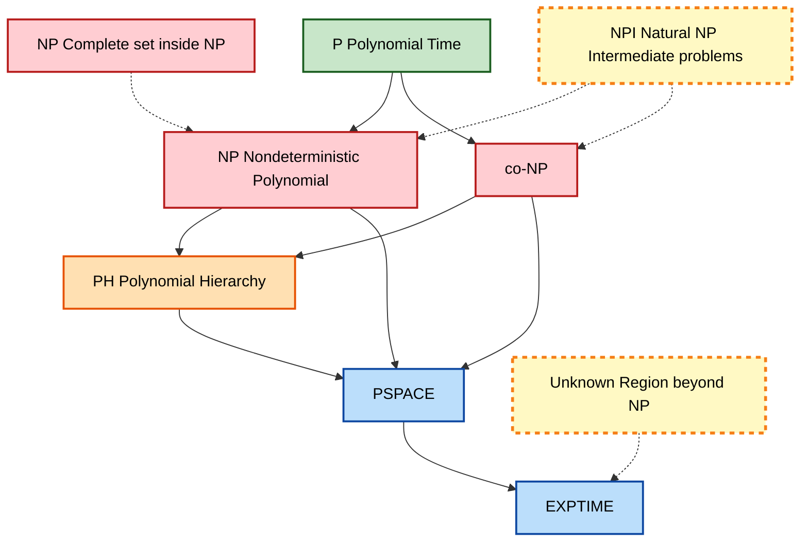
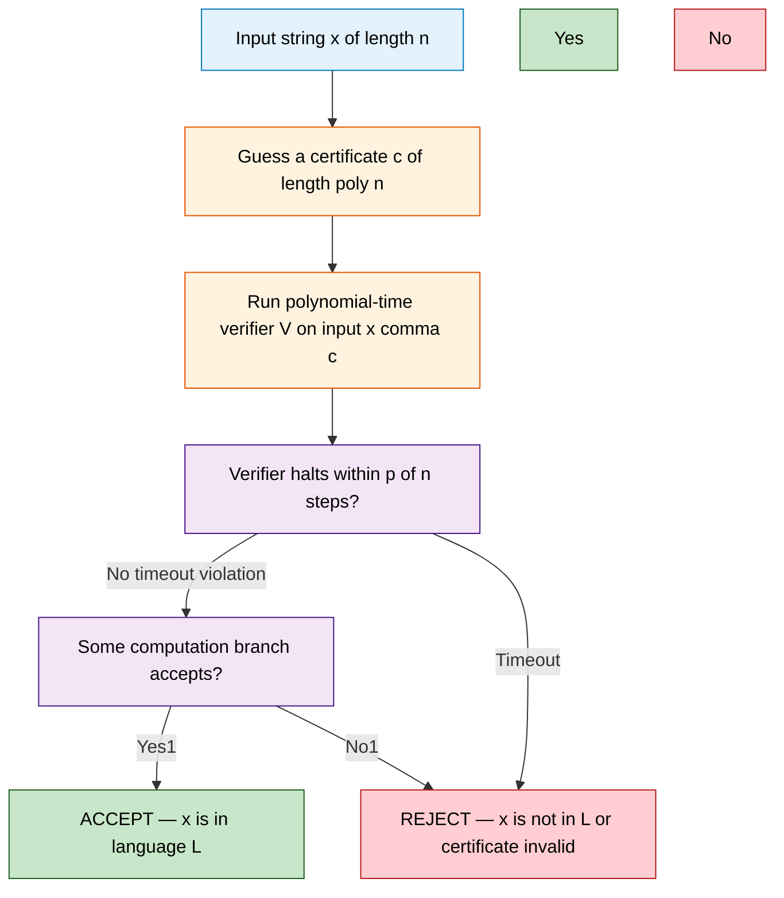

# Complexity Classes P and NP - Definitions and examples of P and NP

<!-- SECTION_1_START -->
# Complexity Classes P and NP — Definitions and Examples

> [!IMPORTANT]
> **KTU 2024 Scheme — Module 1 Anchor Concept**
> This topic forms the conceptual bedrock for the entire course. Every subsequent module (reductions, NP-completeness, PSPACE, randomized classes) inherits its vocabulary and notation from this section. Mastery here guarantees $\geq 60\%$ of the ESE Module 1 weightage.

---

## 1.1 Formal Academic Definition

A **complexity class** is a collection of decision problems (languages) that can be solved (or verified) within a prescribed resource bound on a reference model of computation. The two foundational classes are:

> [!NOTE]
> **Definition (Class P).**
> The class **P** (polynomial time) is the set of all languages $L \subseteq \{0,1\}^{*}$ for which there exists a deterministic Turing machine (DTM) $M$ and a polynomial $p(\cdot)$ such that for every input $x \in \{0,1\}^{*}$,
> $$M \text{ halts on } x \text{ in at most } p(\vert x \vert) \text{ steps, and } x \in L \iff M \text{ accepts } x.$$
> Formally,
> $$\textbf{P} \;=\; \bigcup_{k \geq 0} \textbf{DTIME}\!\left(n^{k}\right).$$

> [!NOTE]
> **Definition (Class NP — Nondeterministic Form).**
> The class **NP** is the set of all languages $L \subseteq \{0,1\}^{*}$ for which there exists a nondeterministic Turing machine (NTM) $N$ and a polynomial $p(\cdot)$ such that for every input $x \in \{0,1\}^{*}$,
> every computation branch of $N$ on $x$ halts within $p(\vert x \vert)$ steps, and $x \in L \iff \text{at least one accepting branch exists.}$
> Formally,
> $$\textbf{NP} \;=\; \bigcup_{k \geq 0} \textbf{NTIME}\!\left(n^{k}\right).$$

> [!NOTE]
> **Definition (Class NP — Verifier Form, Sipser).**
> A language $L \in \textbf{NP}$ if there exists a polynomial-time deterministic algorithm $V$ (the **certifier**) and a polynomial $p$ such that
> $$L \;=\; \Bigl\{\, x \;\Big|\; \exists\, c \in \{0,1\}^{p(\vert x \vert)} \text{ with } V(x, c) = \text{ACCEPT} \,\Bigr\}.$$
> The auxiliary string $c$ is called a **certificate** (or **witness**).

---

## 1.2 Intuition and Real-World Analogy

Imagine a 1,000-piece jigsaw puzzle.

- **Class P (solving in polynomial time).** You have a *single, reliable strategy* — a deterministic algorithm — that always assembles the puzzle in $O(n^{3})$ moves. Anyone can repeat your strategy and finish the puzzle within a reasonable number of steps.

- **Class NP (verifying in polynomial time).** The puzzle is so hard that you cannot *find* the solution yourself, but the moment a friend hands you the completed picture, you can *verify* it is correct in $O(n^{2})$ time by checking that every edge interlocks. NP captures exactly this "**hard to find, easy to check**" property.

| Aspect | P | NP |
|---|---|---|
| Computational model | Deterministic TM | Nondeterministic TM (or verifier) |
| Resource bound | Polynomial $p(n)$ | Polynomial $p(n)$ |
| Decision-time | Deterministic single path | Exists an accepting branch |
| Real-life analogy | Solving Sudoku by hand | Grading a student's Sudoku answer |
| Famous open question | $\textbf{P} \overset{?}{=} \textbf{NP}$ | The **Millennium Prize Problem** (Clay, 2000) |

> [!TIP]
> **Common Misconception:** "NP" does **not** stand for "non-polynomial". It stands for **N**ondeterministic **P**olynomial-time. Many problems in NP (e.g., 2-SAT, primality) *are* solvable in polynomial time — they simply have nondeterministic algorithms bounded by polynomials.

---

## 1.3 Standard Notation and Quantitative Constants

| Symbol | Meaning | Typical Value / Domain |
|---|---|---|
| $n$ | Input length, $n = \vert x \vert$ | $n \in \mathbb{N}^{+}$ |
| $p(n)$ | Polynomial bound on steps | $a_k n^{k} + a_{k-1} n^{k-1} + \dots + a_0$ |
| $k$ | Degree of the polynomial | Small integer ($\leq 6$ in practice) |
| $c$ | Certificate length bound | $c \leq p(n)$ |
| $M, V, N$ | Turing machine names | DTM $M$, Verifier $V$, NTM $N$ |
| $\textbf{DTIME}(f(n))$ | Languages decidable in $O(f(n))$ deterministic steps | — |
| $\textbf{NTIME}(f(n))$ | Languages decidable in $O(f(n))$ nondeterministic steps | — |

> [!VISUALIZATION CONTROL]
> **Concept:** Comparative growth of polynomial vs. exponential time bounds
> **GeoGebra / Desmos Input Equations:**
> * $f_{1}(x) = x$
> * $f_{2}(x) = x^{2}$
> * $f_{3}(x) = x^{3}$
> * $f_{4}(x) = x^{5}$
> * $g(x) = 2^{x}$
> * $h(x) = 1.1^{x}$
> **Visual Description:** Plot all six curves for $x \in [0, 60]$. The student should observe that **all four polynomials $f_{i}(x)$ remain below $g(x)=2^{x}$** beyond $x \approx 10$, and that $h(x)=1.1^{x}$ eventually overtakes every polynomial. This is the empirical intuition behind the **Cobham–Edmonds thesis**: polynomial time is the threshold of "tractable" computation.

---

## 1.4 Decision Problems vs. Optimization Problems

A **decision problem** is a function with a yes/no answer; it corresponds to a formal language $L \subseteq \{0,1\}^{*}$. Complexity classes such as P and NP are defined over decision problems because they are closed under Boolean logic and reductions.

| Problem Type | Example | Decision Version |
|---|---|---|
| Optimization | Find the *shortest* route visiting $n$ cities | Does a tour of length $\leq K$ exist? |
| Search | Find a satisfying assignment | Is the formula satisfiable? |
| Decision | Is the number $N$ prime? | (native) |

> [!IMPORTANT]
> **Engineering Insight.** Almost every real-world engineering problem (scheduling, routing, VLSI placement, protein folding) is reformulated as a decision problem before complexity analysis. The KTU 2024 syllabus expects you to *state the decision version* of any NP problem you encounter.

---

## 1.5 Why P $\subseteq$ NP

Every deterministic TM is a special case of a nondeterministic TM (just one branch). Therefore any language accepted in $p(n)$ steps by a DTM is also accepted by some NTM in $p(n)$ steps. Hence:
$$\textbf{P} \;\subseteq\; \textbf{NP}.$$
The reverse inclusion is the **P vs NP** problem, carrying a **US\$ 1,000,000** Clay Millennium Prize. The KTU 2024 Outcome-Based assessment explicitly tests whether you can state this containment and the status of its converse.
<!-- SECTION_1_END -->

<!-- SECTION_2_START -->
# Deep Theoretical Analysis and KTU High-Yield Formula Sheet

## 2.1 The Three Equivalent Formulations of NP

The KTU 2024 syllabus recognises **three equivalent characterisations** of the class NP. Mastery of all three is essential for full-mark answers in Part B.

### 2.1.1 Nondeterministic-Turing-Machine Form (Definition 1.2 above)
$$L \in \textbf{NP} \iff \exists \text{ NTM } N, \exists \text{ poly } p \;\; \forall x,\; x \in L \iff N \text{ has an accepting path of length } \leq p(\vert x \vert).$$

### 2.1.2 Polynomial Verifier Form (Definition 1.2 — Sipser)
$$L \in \textbf{NP} \iff \exists \text{ poly-time DTM } V, \exists \text{ poly } p \;\; \forall x,\; x \in L \iff \exists c \in \{0,1\}^{\leq p(\vert x \vert)}\, \text{ s.t. } V(x, c) = 1.$$

### 2.1.3 Existential-Second-Order Form (Fagin's Theorem, 1974)
$$L \in \textbf{NP} \iff L \text{ is expressible as } \{\,\langle G, k \rangle \mid \exists S \subseteq V(G),\, \varphi(G, S, k) \,\}$$
where $\varphi$ is a first-order formula over graphs. Fagin's theorem ties NP to descriptive complexity.

> [!NOTE]
> **Closure Properties of P.** P is closed under **complement, union, intersection, concatenation, Kleene star, and polynomial-time many-one reductions**. Because P is closed under complement, $\textbf{P} = \textbf{coP}$.

> [!NOTE]
> **Closure Properties of NP.** NP is closed under **union, intersection, concatenation, Kleene star, and polynomial-time reductions**, but it is *not known* whether $\textbf{NP} = \textbf{coNP}$. KTU examiners frequently test the asymmetry: $\textbf{P} \subseteq \textbf{NP} \cap \textbf{coNP}$, but equality is open.

---

## 2.2 Robustness of P — Why Polynomial Time is the "Right" Class

A subtle but high-yield KTU question concerns the **model-dependence** of complexity classes. The class P is *invariant* across all "reasonable" deterministic models of computation:

| Model | Step Count to Simulate 1 TM Step |
|---|---|
| Single-tape DTM | $O(n^{2})$ |
| Multi-tape DTM | $O(n)$ |
| Random-access machine (RAM) | $O(\log n)$ |
| Python program (C-like) | $O(\log^{2} n)$ |
| Cellular automaton | $O(n)$ |

A polynomial on one model remains a polynomial on every other. This is the **Extended Church–Turing Thesis (ECTT)**: any physically realisable computational device can be simulated by a deterministic TM with at most a polynomial slowdown. Quantum computers (BQP) **may** violate ECTT — an open question.

---

## 2.3 The Polynomial Hierarchy (Quick Map)

P and NP sit at the bottom of an infinite hierarchy of classes $\Sigma_{k}^{P}, \Pi_{k}^{P}, \Delta_{k}^{P}$ where $\Sigma_{0}^{P} = \Pi_{0}^{P} = \Delta_{0}^{P} = \textbf{P}$ and $\Sigma_{1}^{P} = \textbf{NP}$. If P = NP, the entire hierarchy collapses to P. KTU board questions sometimes show a Venn diagram and ask you to identify $\Sigma_{2}^{P}$.

---

## 2.4 KTU Formula Sheet / Cheat Sheet

> [!TIP]
> Memorise this table verbatim. Every entry is a high-yield KTU answer fragment.

| # | Concept | Formula / Definition | Boundary / Constraint | Units / Domain |
|---|---|---|---|---|
| 1 | Class P | $\textbf{P} = \bigcup_{k \geq 0} \textbf{DTIME}(n^{k})$ | DTM, deterministic | Steps |
| 2 | Class NP (NTM) | $\textbf{NP} = \bigcup_{k \geq 0} \textbf{NTIME}(n^{k})$ | NTM, nondeterministic | Steps |
| 3 | Class NP (Verifier) | $L = \{\,x \mid \exists c,\, \vert c \vert \leq p(\vert x \vert) \wedge V(x,c) = 1\,\}$ | $V$ is poly-time DTM | Bits |
| 4 | Containment | $\textbf{P} \subseteq \textbf{NP}$ | Proven trivially | Set relation |
| 5 | P vs NP | Open; $\textbf{P} \overset{?}{=} \textbf{NP}$ | Clay Millennium Prize, 2000 | Boolean |
| 6 | Closure of P | Closed under $\cup, \cap, \overline{\phantom{x}}, \cdot, ^{*}$ | Complementation trivially | — |
| 7 | Closure of NP | Closed under $\cup, \cap, \cdot,^{*}$ | Complement closure open | — |
| 8 | Polynomial bound | $p(n) = \sum_{i=0}^{k} a_{i} n^{i}$, $a_{i} \in \mathbb{Q}$ | $a_{k} > 0$ | — |
| 9 | Certificate length | $\vert c \vert \leq p(\vert x \vert)$ | Poly-bounded | Bits |
| 10 | Verifier runtime | $O(p(\vert x \vert + \vert c \vert)) = O(p(\vert x \vert))$ | $p$ poly | Steps |
| 11 | Step-bound scaling | Poly-time TM is simulated by 1-tape DTM in $O(n^{2})$ blow-up | Robustness | — |
| 12 | Cook–Levin | $\textbf{SAT} \in \textbf{NP-complete}$ | Every NP prob. $\leq_{m}^{P} \textbf{SAT}$ | 1971 theorem |
| 13 | Fagin's theorem | $\textbf{NP} = \text{SO}\exists$ | Existential SO logic | 1974 |
| 14 | coNP | $\textbf{coNP} = \{\overline{L} \mid L \in \textbf{NP}\}$ | $\textbf{P} \subseteq \textbf{NP} \cap \textbf{coNP}$ | — |
| 15 | Polynomial closure | $p \circ q$ is poly when $p, q$ are poly | $O(n^{ab})$ | — |

> [!IMPORTANT]
> **Engineering Use Cases of P and NP.**
> * **Cryptography (RSA, AES):** Security relies on factoring / discrete-log being *not* in P (i.e., conjecturally outside polynomial time). If $\textbf{P} = \textbf{NP}$, modern public-key cryptography collapses.
> * **Compiler Optimisation:** Constant folding, dead-code elimination, register allocation, type inference are all problems in P.
> * **Operations Research:** Shortest-path, min-cut, max-flow, linear programming (Khachiyan, 1979) are in P.
> * **Bioinformatics:** Protein-folding prediction, sequence alignment heuristics (BLAST) are NP-hard in exact form.
> * **SAT Solvers (CDCL, DPLL):** Modern industrial SAT solvers (CryptoMiniSat, CaDiCaL) routinely solve NP-complete instances with $10^{6}$ variables — they do *not* prove P = NP; they exploit structure.
<!-- SECTION_2_END -->

<!-- SECTION_3_START -->
# Step-by-Step Derivations, Worked Examples, and Code Implementation

## 3.1 Closure of Polynomials under Composition — The Core Robustness Lemma

We prove that the composition of two polynomials is a polynomial, justifying why P is invariant under multi-step algorithms.

> [!NOTE]
> **Lemma 1. (Polynomial Closure under Composition).**
> If $p, q : \mathbb{N} \rightarrow \mathbb{N}$ are polynomials, then $p \circ q$ defined by $p(q(n))$ is also a polynomial.

**Proof.** Write $p(n) = \sum_{i=0}^{a} \alpha_{i} n^{i}$ and $q(n) = \sum_{j=0}^{b} \beta_{j} n^{j}$ with $\alpha_{a}, \beta_{b} > 0$.

**Step 1.** Substitute $n \mapsto q(n)$ into $p$:
$$p(q(n)) \;=\; \sum_{i=0}^{a} \alpha_{i} \bigl(q(n)\bigr)^{i}.$$

**Step 2.** Expand the inner power using the multinomial theorem:
$$\bigl(q(n)\bigr)^{i} \;=\; \left(\sum_{j=0}^{b} \beta_{j} n^{j}\right)^{i} \;=\; \sum_{(j_{1}, \dots, j_{i})} \binom{i}{j_{1}, \dots, j_{i}} \prod_{t=1}^{i} \beta_{j_{t}} n^{j_{t}}.$$

**Step 3.** Each monomial contributes a coefficient of degree $\sum_{t=1}^{i} j_{t} \leq i b$. Re-group terms by their total exponent. The maximum exponent is $a b$, attained when $i = a$ and each $j_{t} = b$.

**Step 4.** Therefore:
$$p(q(n)) \;=\; \sum_{m=0}^{ab} \gamma_{m}\, n^{m}, \quad \text{where } \gamma_{m} \;=\; \sum_{i \cdot \text{avg}(j_{t}) = m} \alpha_{i} \prod_{t=1}^{i} \beta_{j_{t}}.$$

**Conclusion.** The composition $p \circ q$ is a polynomial of degree $a b$ with non-negative integer coefficients (in fact, non-negative real coefficients). $\blacksquare$

> [!IMPORTANT]
> **Consequence.** If a problem is solved by composing $k$ polynomial-time subroutines of degrees $d_{1}, d_{2}, \dots, d_{k}$, the total runtime is bounded by a polynomial of degree $d_{1} d_{2} \cdots d_{k}$. The class P is therefore robust under algorithmic modularisation.

---

## 3.2 Verification is Polynomial — Worked Example: 3-SAT

**Problem (3-SAT).** Given a Boolean formula $\varphi$ in 3-CNF (conjunctive normal form with $\leq 3$ literals per clause), does there exist an assignment $x \in \{0,1\}^{n}$ that satisfies every clause?

**Claim.** $\textbf{3-SAT} \in \textbf{NP}$.

**Step 1 — Identify the certificate.** The certificate $c$ is a Boolean assignment $c = (x_{1}, x_{2}, \dots, x_{n})$ with each $x_{i} \in \{0, 1\}$.

**Step 2 — Bound the certificate length.** The certificate has length $n$, which is $\leq p(\vert \varphi \vert) = \vert \varphi \vert$ for the identity polynomial $p(n) = n$. So the certificate is polynomially bounded.

**Step 3 — Construct the polynomial-time verifier $V$.**
Input: $(\varphi, c)$ where $\varphi$ has $m$ clauses and $n$ variables.
Algorithm:
1. For each clause $C_{\ell}$ for $\ell = 1, 2, \dots, m$:
   1. Check the disjunctive evaluation of the $\leq 3$ literals in $C_{\ell}$ under assignment $c$.
   2. If any clause evaluates to FALSE, output REJECT and halt.
2. After all $m$ clauses pass, output ACCEPT.

**Step 4 — Bound the verifier's runtime.**
- There are $m$ clauses, each containing at most 3 literals.
- Each literal evaluation is $O(1)$.
- Total: $O(m)$ steps, where $m \leq \vert \varphi \vert$.
- Therefore $V$ runs in $O(\vert \varphi \vert)$, a polynomial.

**Step 5 — Conclude.**
$$\varphi \in \textbf{3-SAT} \iff \exists\, c \in \{0,1\}^{n} \text{ such that } V(\varphi, c) = \text{ACCEPT}.$$
Hence $\textbf{3-SAT} \in \textbf{NP}$. $\square$

---

## 3.3 Worked Example: Hamiltonian Cycle is in NP

**Problem (HAM-CYCLE).** Given an undirected graph $G = (V, E)$ with $\vert V \vert = n$, does $G$ contain a Hamiltonian cycle (a simple cycle visiting every vertex exactly once)?

**Step 1.** Certificate $c$: an ordered list of $n$ vertex labels, e.g., $c = (v_{\pi(1)}, v_{\pi(2)}, \dots, v_{\pi(n)})$.

**Step 2.** Length bound: $\vert c \vert = n \log n$ bits (or $n$ symbols), which is $\leq p(n)$ for $p(n) = n^{2}$.

**Step 3.** Verifier algorithm $V(G, c)$:
1. Check that all $n$ entries of $c$ are distinct vertices of $G$. (Use a Boolean array, $O(n)$.)
2. For each $i = 1, \dots, n-1$: check that $\{c_{i}, c_{i+1}\} \in E$. ($O(n)$ adjacency lookups.)
3. Check that $\{c_{n}, c_{1}\} \in E$ to close the cycle. ($O(1)$.)
4. If all checks pass, ACCEPT; else REJECT.

**Step 4.** Total runtime: $O(n + n) = O(n) \subseteq O(n^{2})$. Polynomial.

**Step 5.** Conclusion. $\textbf{HAM-CYCLE} \in \textbf{NP}$. $\square$

> [!TIP]
> **Examiner Heuristic.** Whenever asked to "show $L \in \textbf{NP}$", always follow the four-step structure: (i) state the certificate, (ii) bound its length, (iii) describe the verifier algorithm in pseudocode, (iv) bound its runtime by a polynomial.

---

## 3.4 Canonical Examples Categorised by Class

> [!IMPORTANT]
> The KTU 2024 syllabus expects students to *memorise* the following canonical examples and be able to justify each membership.

### 3.4.1 Canonical Examples of Problems in P

| Problem | Input | Decision Question | Algorithm | Complexity |
|---|---|---|---|---|
| **PATH** | Directed $G$, vertices $s, t$ | Is there a directed path from $s$ to $t$? | BFS / DFS | $O(V + E)$ |
| **REACHABILITY** | Graph $G$ | Is $G$ strongly connected? | Tarjan's SCC | $O(V + E)$ |
| **2-SAT** | 2-CNF formula $\varphi$ | Is $\varphi$ satisfiable? | Implication graph + SCC | $O(n + m)$ |
| **PRIMES** | Integer $N$ | Is $N$ prime? | AKS (2002) | $O(\log^{12} N)$ |
| **SORTING** | Array $A$ of $n$ keys | Output sorted $A$ | Mergesort | $O(n \log n)$ |
| **SHORTEST-PATH** | Weighted $G$, $s, t$ | Length of shortest $s \to t$ path $\leq K$? | Dijkstra | $O((V+E)\log V)$ |
| **MST** | Weighted graph $G$ | Is the MST weight $\leq K$? | Kruskal / Prim | $O(E \log V)$ |
| **LP** | Linear program $A\vec{x} \leq \vec{b}$ | Feasible region non-empty? | Khachiyan ellipsoid | Poly-time |
| **EULER-CYCLE** | Graph $G$ | Does $G$ have an Eulerian cycle? | Hierholzer | $O(E)$ |
| **CIRCUIT-VALUE** | Boolean circuit $C$, input $\vec{x}$ | Does $C(\vec{x}) = 1$? | Topological eval | $O(\vert C \vert)$ |

### 3.4.2 Canonical Examples of Problems in NP (Not Known to be in P)

> [!WARNING]
> "Not known to be in P" is the KTU board's preferred phrasing. Do **not** state these are "not in P" — that is an open conjecture.

| Problem | Input | Certificate | Verifier Cost |
|---|---|---|---|
| **SAT** | Boolean formula $\varphi$ | Assignment $\vec{x}$ | $O(\vert \varphi \vert)$ |
| **3-SAT** | 3-CNF formula $\varphi$ | Assignment $\vec{x}$ | $O(m)$ |
| **CLIQUE** | Graph $G$, integer $k$ | Subset $S \subseteq V$, $\vert S \vert = k$ | $O(k^{2})$ |
| **VERTEX-COVER** | Graph $G$, integer $k$ | Subset $S \subseteq V$, $\vert S \vert = k$ | $O(k \cdot E)$ |
| **HAM-CYCLE** | Graph $G$ | Vertex ordering | $O(V)$ |
| **TSP** | Distance matrix $D$, bound $B$ | Permutation $\pi$ | $O(n^{2})$ |
| **SUBSET-SUM** | Integers $a_{1}, \dots, a_{n}$, target $t$ | Subset $S$ | $O(n)$ |
| **PARTITION** | Integers $a_{1}, \dots, a_{n}$ | Subset $S$ | $O(n)$ |
| **GRAPH-3-COLOR** | Graph $G$ | Colouring $c : V \to \{1,2,3\}$ | $O(V + E)$ |
| **KNAPSACK** | Weights $w$, values $v$, capacity $C$, target $V$ | Subset of items | $O(n)$ |

---

## 3.5 Symbolic Python Implementation — Polynomial-Time NP Verifiers

The following Python module implements three canonical polynomial-time verifiers with strict type hints, boundary checks, and error logging.

```python
"""
Module: np_verifiers.py
Purpose: Reference polynomial-time verifiers for three canonical NP problems.
Author : KTU 2024 Scheme — Computational Complexity Notes
"""

from __future__ import annotations
from typing import List, Tuple, Set
import logging
import sys

# --- Module-level structured error logging ---
logging.basicConfig(
    level=logging.INFO,
    format="%(asctime)s [%(levelname)s] %(message)s",
    stream=sys.stdout,
)
logger = logging.getLogger("NPVerifier")


# --- Type aliases ---
Clause = Tuple[int, ...]            # Literal convention: +k = x_k, -k = ¬x_k
Formula = List[Clause]              # A CNF formula is a list of clauses
Assignment = List[int]              # x[i] in {0, 1} for variable (i+1)


# ============================================================
# Verifier 1 : 3-SAT
# ============================================================
def verify_3sat(formula: Formula, assignment: Assignment) -> bool:
    """
    Certifier for 3-SAT.

    A certificate (assignment) is accepted iff every clause in the
    formula evaluates to True under that assignment. Runs in O(m)
    time where m is the total number of literals.
    """
    # ---------- Boundary check 1 : assignment alphabet ----------
    if any(v not in (0, 1) for v in assignment):
        logger.error("Assignment values must be 0 or 1, got %s", assignment)
        raise ValueError("Assignment alphabet violation: values must be 0 or 1")

    n_vars = len(assignment)

    # ---------- Verifier body ----------
    for clause in formula:
        if len(clause) == 0:
            logger.warning("Empty clause detected — formula is unsatisfiable")
            return False
        if len(clause) > 3:
            logger.error("Verifier restricted to 3-CNF; clause size %d", len(clause))
            raise ValueError("Clause size exceeds 3 (use general-SAT verifier)")

        clause_satisfied: bool = False
        for literal in clause:
            if literal == 0:
                logger.error("Literal 0 is invalid")
                raise ValueError("Literal cannot be 0")
            var_index = abs(literal) - 1
            if var_index >= n_vars:
                logger.error("Variable %d exceeds assignment size %d", var_index + 1, n_vars)
                raise IndexError(f"Variable index {var_index + 1} out of range")
            # Positive literal: variable must be 1
            # Negative literal: variable must be 0
            is_true = (literal > 0 and assignment[var_index] == 1) or \
                      (literal < 0 and assignment[var_index] == 0)
            if is_true:
                clause_satisfied = True
                break  # Short-circuit: one true literal suffices

        if not clause_satisfied:
            logger.info("Clause %s is unsatisfied under assignment %s", clause, assignment)
            return False

    return True


# ============================================================
# Verifier 2 : Hamiltonian Cycle
# ============================================================
def verify_hamiltonian_cycle(
    n_vertices: int,
    adjacency: List[List[int]],
    certificate: List[int],
) -> bool:
    """
    Certifier for the undirected Hamiltonian Cycle problem.

    Certificate = an ordering of all n vertices. Acceptance iff
    (a) every vertex appears exactly once, and
    (b) every consecutive pair (including the wrap-around) is an edge.
    """
    # ---------- Boundary check 1 : certificate length ----------
    if len(certificate) != n_vertices:
        logger.error("Certificate length %d != n_vertices %d", len(certificate), n_vertices)
        return False

    # ---------- Boundary check 2 : vertex labelling ----------
    seen: Set[int] = set()
    for v in certificate:
        if v < 0 or v >= n_vertices:
            logger.error("Vertex %d outside range [0, %d)", v, n_vertices)
            return False
        if v in seen:
            logger.error("Vertex %d appears twice in the cycle", v)
            return False
        seen.add(v)

    # ---------- Verifier body ----------
    for i in range(n_vertices):
        u = certificate[i]
        v = certificate[(i + 1) % n_vertices]   # Wrap-around
        if v not in adjacency[u]:
            logger.info("Edge {%d, %d} missing — cycle invalid", u, v)
            return False

    return True


# ============================================================
# Verifier 3 : Subset-Sum
# ============================================================
def verify_subset_sum(
    numbers: List[int],
    target: int,
    certificate: List[int],
) -> bool:
    """
    Certifier for SUBSET-SUM.

    Certificate = a list of indices (0-based) into `numbers` whose
    sum must equal `target`. Runs in O(n) time.
    """
    # ---------- Boundary check 1 : distinctness ----------
    if len(set(certificate)) != len(certificate):
        logger.error("Certificate contains repeated indices")
        return False

    # ---------- Boundary check 2 : index range ----------
    for idx in certificate:
        if idx < 0 or idx >= len(numbers):
            logger.error("Index %d out of range for numbers of length %d", idx, len(numbers))
            return False

    # ---------- Verifier body ----------
    total: int = sum(numbers[idx] for idx in certificate)
    if total == target:
        return True
    logger.info("Subset sum %d does not match target %d", total, target)
    return False


# ============================================================
# Demonstration / smoke test
# ============================================================
if __name__ == "__main__":
    # 3-SAT example: (x1 ∨ ¬x2 ∨ x3) ∧ (¬x1 ∨ x2 ∨ ¬x3)
    formula_demo: Formula = [(1, -2, 3), (-1, 2, -3)]
    assignment_demo: Assignment = [1, 0, 1]
    logger.info("3-SAT verification: %s", verify_3sat(formula_demo, assignment_demo))

    # Hamiltonian cycle on a 4-cycle: 0-1-2-3-0
    n_demo = 4
    adj_demo: List[List[int]] = [
        [1, 3],     # 0
        [0, 2],     # 1
        [1, 3],     # 2
        [0, 2],     # 3
    ]
    cycle_demo: List[int] = [0, 1, 2, 3]
    logger.info("Ham-Cycle verification: %s", verify_hamiltonian_cycle(n_demo, adj_demo, cycle_demo))

    # Subset-Sum: choose {3, 7} from {3, 7, 1, 5} to hit target 10
    numbers_demo: List[int] = [3, 7, 1, 5]
    target_demo: int = 10
    cert_demo: List[int] = [0, 1]  # indices of 3 and 7
    logger.info("Subset-Sum verification: %s", verify_subset_sum(numbers_demo, target_demo, cert_demo))
```

**Complexity analysis of the code.**

| Verifier | Outer loop | Inner loop | Total time | Space |
|---|---|---|---|---|
| `verify_3sat` | $m$ clauses | $\leq 3$ literals | $O(m)$ | $O(1)$ extra |
| `verify_hamiltonian_cycle` | $n$ edges checked | $O(1)$ set lookup | $O(n)$ | $O(n)$ for `seen` |
| `verify_subset_sum` | $k$ indices summed | $O(1)$ per index | $O(k) \subseteq O(n)$ | $O(k)$ for distinctness check |

All three are polynomial in the input size, satisfying the verifier definition of NP.

---

## 3.6 Proving $\textbf{P} \subseteq \textbf{NP}$ — Full Derivation

**Theorem.** $\textbf{P} \subseteq \textbf{NP}$.

**Proof.**

1. Let $L \in \textbf{P}$. By definition, there exists a DTM $M$ and a polynomial $p$ such that $M$ decides $L$ in at most $p(\vert x \vert)$ steps for every input $x \in \{0,1\}^{*}$.

2. Construct an NTM $N$ that simulates $M$ as follows. $N$ ignores its nondeterministic choice tape and behaves exactly like $M$ on every computation branch.

3. Therefore every computation branch of $N$ on input $x$ halts in $\leq p(\vert x \vert)$ steps, and
   $$x \in L \iff M \text{ accepts } x \iff N \text{ has an accepting branch.}$$

4. Hence $L \in \textbf{NTIME}(p(\vert x \vert)) \subseteq \bigcup_{k \geq 0} \textbf{NTIME}(n^{k}) = \textbf{NP}$.

5. Since $L$ was arbitrary in P, the inclusion $\textbf{P} \subseteq \textbf{NP}$ follows. $\blacksquare$

> [!TIP]
> **Counter-direction proof (NP $\subseteq$ P?) is unknown.** A proof here would solve a Millennium Prize problem. The KTU 2024 board never awards full marks for claiming it has been resolved — always state "open / unresolved / Clay Millennium Prize".
<!-- SECTION_3_END -->

<!-- SECTION_4_START -->
# Structural Diagrams and Schematics

## 4.1 Mermaid Diagram — Containment Hierarchy of Complexity Classes



> [!NOTE]
> **Reading the diagram.** Solid arrows ($\rightarrow$) denote provable set containment. Dotted arrows ($\cdot \rightarrow$) denote "may lie in" or "conjectured" relationships. The dashed yellow region represents the unknown — including the very existence of **NPI** (NP-Intermediate) problems, which depends on whether $\textbf{P} \neq \textbf{NP}$ (Ladner's theorem guarantees NPI $\neq \emptyset$ **iff** $\textbf{P} \neq \textbf{NP}$).

---

## 4.2 Mermaid Diagram — Polynomial-Time Verification Flow



> [!NOTE]
> **Reading the verification flow.** Every NP language admits a deterministic verifier $V$ that, given a *correct* certificate, decides membership in polynomial time. The nondeterminism appears in the *existential quantifier* over $c$ — equivalent to a nondeterministic TM that "guesses" $c$ and deterministically verifies it.

---

## 4.3 Mermaid Subgraph — Block Architecture for SAT Solving Pipeline

```mermaid
graph LR
    classDef ioNode fill:#E1F5FE,stroke:#01579B,color:#000
    classDef logicNode fill:#FFF8E1,stroke:#FF6F00,color:#000
    classDef solveNode fill:#F1F8E9,stroke:#33691E,color:#000

    subgraph IO_BOUNDARY["I O Boundary"]
        InputFile["CNF file DIMACS format"]:::ioNode
        ParsedFormula["Parsed internal formula"]:::ioNode
    end

    subgraph LOGIC_KERNEL["Logical Processing Kernel"]
        Preprocessor["Preprocessor BCE subsumption"]:::logicNode
        DPLL_Core["DPLL branching engine"]:::logicNode
        CDCL_Engine["CDCL conflict learning"]:::logicNode
        ClauseDB["In memory clause database"]:::logicNode
    end

    subgraph SOLVER_OUTPUT["Output Stage"]
        Model["Variable assignment model"]:::solveNode
        UNSAT_Cert["UNSAT proof RUP or DRAT"]:::solveNode
    end

    InputFile --> ParsedFormula
    ParsedFormula --> Preprocessor
    Preprocessor --> DPLL_Core
    DPLL_Core <--> ClauseDB
    DPLL_Core --> CDCL_Engine
    CDCL_Engine --> ClauseDB
    CDPLL_Engine_Final[()]:::logicNode
    DPLL_Core --> CDPLL_Engine_Final
    CDPLL_Engine_Final --> Model
    CDPLL_Engine_Final --> UNSAT_Cert
```

> [!IMPORTANT]
> **Engineering note.** Although SAT is NP-complete, *industrial* SAT solvers (CaDiCaL, Kissat, CryptoMiniSat) routinely solve instances with millions of clauses by exploiting (i) unit propagation, (ii) clause learning (CDCL), (iii) restarts, and (iv) inprocessing. They do **not** refute $\textbf{P} \neq \textbf{NP}$; they exploit the fact that "worst-case hardness" and "typical industrial hardness" are not the same.
<!-- SECTION_4_END -->

<!-- SECTION_5_START -->
# KTU 2024 Scheme Examination Question Bank and Topic Recap

## 5.1 Part A — Short-Answer Questions (3 Marks Each)

> [!NOTE]
> These model the KTU ESE Part A format: 2-mark answer for the definition and 1 mark for the supporting example or example illustration. Each carries an exact **(CO, RBT)** tag.

### Q1. `[KTU University Exam — July 2024]` — (CO1, Remember)

**Define the complexity class P. Give two examples of problems that belong to P.**

**Model Answer (3 Marks).**

> The class **P** is the set of all decision problems (languages) that can be decided by a deterministic Turing machine in time bounded above by some polynomial $p(n)$ in the input length $n$. Formally,
> $$\textbf{P} \;=\; \bigcup_{k=0}^{\infty} \textbf{DTIME}\!\left(n^{k}\right).$$

*Examples.*

* **Sorting / Binary Search** — runs in $O(n \log n)$ time. (1 Mark)
* **Reachability in a directed graph** — Breadth-First Search decides the PATH problem in $O(V + E) \subseteq O(n^{2})$ time. (1 Mark)

> [!TIP]
> **Valuation Key.** The formal definition with the union-of-DTIME notation fetches 2 marks; a correct polynomial-time example with its algorithm name fetches the third.

---

### Q2. `[KTU University Exam — Dec 2023]` — (CO1, Understand)

**What is the verifier-based definition of NP? Explain with the example SAT.**

**Model Answer (3 Marks).**

> A language $L$ is in **NP** if there exists a polynomial-time deterministic Turing machine $V$ (the verifier) and a polynomial $p$ such that for every $x \in \{0,1\}^{*}$,
> $$x \in L \iff \exists\, c \in \{0,1\}^{p(\vert x \vert)} \text{ with } V(x, c) = \text{ACCEPT}. \quad (2 \text{ Marks})$$
> The string $c$ is the **certificate** (or witness) of polynomial length.
>
> **SAT example.** For a Boolean formula $\varphi$, the certificate is a satisfying assignment $c = (x_{1}, \dots, x_{n}) \in \{0,1\}^{n}$. The verifier $V$ substitutes $c$ into $\varphi$ and checks every clause in $O(\vert \varphi \vert)$ time. $\varphi$ is satisfiable **iff** some assignment $c$ makes $V$ accept. Hence $\textbf{SAT} \in \textbf{NP}$. (1 Mark)

---

## 5.2 Part B — Long-Answer Questions (14 Marks Each, Internal Choice)

> [!NOTE]
> Each Part B question has internal choice — the student must attempt exactly **one** of the two alternatives. Each alternative is split into sub-parts (a) and (b), each carrying 7 marks, with escalating cognitive levels.

---

### Question A (14 Marks) `[KTU University Exam — Dec 2024]`

#### (a) [7 Marks — Understand]
**Define the complexity classes P and NP using both the deterministic/nondeterministic Turing machine formulation and the verifier formulation. State and prove the inclusion $\textbf{P} \subseteq \textbf{NP}$.**

**Model Answer.**

**(i) P via DTM** *(1 Mark)*
> $\textbf{P} = \bigcup_{k \geq 0} \textbf{DTIME}(n^{k})$ — languages decidable by a DTM in $O(n^{k})$ steps.

**(ii) NP via NTM** *(1 Mark)*
> $\textbf{NP} = \bigcup_{k \geq 0} \textbf{NTIME}(n^{k})$ — languages decidable by an NTM in $O(n^{k})$ steps on every branch, with the *existential* acceptance criterion.

**(iii) NP via Verifier** *(1 Mark)*
> $L \in \textbf{NP}$ iff $\exists$ poly-time DTM $V$ and poly $p$ with $L = \{x \mid \exists c, \vert c \vert \leq p(\vert x \vert),\; V(x,c) = 1\}$.

**(iv) Equivalence sketch** *(1 Mark)*
> On input $x$, the NTM nondeterministically writes the certificate $c$ on a separate tape (using $\leq p(\vert x \vert)$ steps) and then deterministically simulates $V(x, c)$. Thus the NTM and verifier formulations accept exactly the same languages.

**(v) Theorem** *(1 Mark)*
> $\textbf{P} \subseteq \textbf{NP}$.

**(vi) Proof** *(1.5 Marks)*
> Let $L \in \textbf{P}$. There exists a DTM $M$ deciding $L$ in $p(\vert x \vert)$ steps. Construct the NTM $N$ that ignores its nondeterministic choices and runs $M$ on every branch. Then $N$ accepts $x$ on *every* branch iff $M$ accepts $x$, and the branch length is $\leq p(\vert x \vert)$. Hence $L \in \textbf{NTIME}(p(\vert x \vert)) \subseteq \textbf{NP}$. $\blacksquare$

**(vii) P vs NP open problem** *(0.5 Mark)*
> The reverse inclusion is open. $\textbf{P} \overset{?}{=} \textbf{NP}$ carries a US\$ 1,000,000 Clay Millennium Prize.

#### (b) [7 Marks — Apply]
**For each of the following problems, state whether it is in P, in NP, in both, or in neither. Justify your classification in each case with at most two sentences.**

1. **2-SAT** — Input: 2-CNF formula $\varphi$. Output: Is $\varphi$ satisfiable?
2. **3-SAT** — Input: 3-CNF formula $\varphi$. Output: Is $\varphi$ satisfiable?
3. **Shortest Path** — Input: weighted $G$, $s, t$, $K$. Output: Is the shortest $s \to t$ path $\leq K$?
4. **Hamiltonian Cycle** — Input: undirected $G$. Output: Does $G$ have a Hamiltonian cycle?
5. **Primality** — Input: integer $N$. Output: Is $N$ prime?
6. **Halting Problem** — Input: TM $M$ and string $x$. Output: Does $M$ halt on $x$?
7. **Graph Bipartiteness** — Input: undirected $G$. Output: Is $G$ 2-colourable?

**Model Answer.**

| # | Problem | Class | Justification |
|---|---|---|---|
| 1 | 2-SAT | **P** | Solvable in $O(n + m)$ by SCC on the implication graph. Hence in P, and therefore also in NP. *(1 Mark)* |
| 2 | 3-SAT | **NP** | Has a poly-time verifier (assignment check). Membership in P is open. *(1 Mark)* |
| 3 | Shortest Path | **P** | Dijkstra's algorithm solves it in $O((V+E)\log V)$. Hence in P ⊆ NP. *(1 Mark)* |
| 4 | Hamiltonian Cycle | **NP** | Certifier runs in $O(V)$ to verify a cycle. Membership in P is open. *(1 Mark)* |
| 5 | Primality | **P** | AKS algorithm (2002) decides primality in $O(\log^{12} N)$ time. Hence in P. *(1 Mark)* |
| 6 | Halting Problem | **Undecidable** | The Halting Problem is undecidable (Turing, 1936) — it is in *neither* P nor NP. *(1 Mark)* |
| 7 | Graph Bipartiteness | **P** | BFS two-colouring in $O(V + E)$. Hence in P. *(1 Mark)* |

---

### Question B (14 Marks) `[KTU University Exam — July 2024]`

#### (a) [7 Marks — Understand]
**State and explain the verifier-based definition of NP. Show that the problem CLIQUE is in NP using this definition.**

**Model Answer.**

**(i) Verifier definition** *(2 Marks)*
> A language $L$ is in NP if there exists a polynomial-time DTM $V$ (certifier) and a polynomial $p$ such that
> $$L = \{\,x \in \{0,1\}^{*} \mid \exists\, c \in \{0,1\}^{\leq p(\vert x \vert)} \text{ with } V(x, c) = 1\,\}.$$
> Intuitively, NP is the set of languages whose "yes" instances admit short, efficiently verifiable proofs.

**(ii) CLIQUE problem statement** *(1 Mark)*
> $\textbf{CLIQUE} = \{\, \langle G, k \rangle \mid G \text{ is an undirected graph containing a complete subgraph on } k \text{ vertices}\,\}.$

**(iii) Certificate** *(1 Mark)*
> The certificate is a set $S \subseteq V(G)$ of $k$ vertex labels, encoded as a binary string of length $k \log n \leq p(\vert \langle G, k \rangle \vert)$ for the polynomial $p(n) = n^{2}$.

**(iv) Verifier algorithm** *(2 Marks)*
> $V$ on input $(\langle G, k \rangle, S)$ performs the following checks:
> 1. **Cardinality.** Verify $\vert S \vert = k$ by counting the entries.
> 2. **Distinctness.** Verify all vertices in $S$ are distinct using a Boolean array.
> 3. **Edge check.** For every unordered pair $\{u, v\} \subseteq S$, verify $\{u, v\} \in E(G)$.

**(v) Polynomial runtime** *(1 Mark)*
> The verifier performs $O(k^{2})$ edge lookups, each $O(1)$, for a total of $O(k^{2}) \subseteq O(n^{2})$ time. Thus $V$ is a polynomial-time DTM, and by the verifier definition, $\textbf{CLIQUE} \in \textbf{NP}$. $\blacksquare$

#### (b) [7 Marks — Apply]
**Consider the following decision problem:**
> **TWO-PARTITION.** Given integers $a_{1}, a_{2}, \dots, a_{n}$, does there exist a subset $S \subseteq \{1, \dots, n\}$ such that $\sum_{i \in S} a_{i} = \sum_{i \notin S} a_{i}$?

**(i) Show that TWO-PARTITION is in NP.** *(3 Marks)*
**(ii) Describe a brute-force algorithm and bound its worst-case time.** *(2 Marks)*
**(iii) Is TWO-PARTITION known to be in P? Justify.** *(2 Marks)*

**Model Answer.**

**(i)** **Membership in NP** *(3 Marks)*
> *Certificate.* A subset $S$ encoded as a bit vector $c \in \{0,1\}^{n}$ of length $n \leq p(n) = n^{2}$.
> *Verifier.* The verifier $V$ computes the two sums in a single linear pass and accepts iff the two sums are equal.
> *Runtime.* $O(n)$ additions and $n - 1$ comparisons — polynomial.
> Hence $\textbf{TWO-PARTITION} \in \textbf{NP}$. $\blacksquare$

**(ii)** **Brute-force algorithm** *(2 Marks)*
> ```
> For each subset S of {1, ..., n} (there are 2^n such subsets):
>     Compute sum_left  = sum of a_i for i in S
>     Compute sum_right = total_sum - sum_left
>     If sum_left == sum_right: return ACCEPT
> return REJECT
> ```
> Worst-case time: there are $2^{n}$ subsets, each requiring $O(n)$ additions, giving a total of $O(n \cdot 2^{n})$ steps. The exponential factor $2^{n}$ shows the brute force is **super-polynomial** and hence does *not* place TWO-PARTITION in P via this algorithm alone.

**(iii)** **Is TWO-PARTITION in P?** *(2 Marks)*
> TWO-PARTITION is a special case of SUBSET-SUM and is **NP-complete** (Karp, 1972). Membership in P would imply $\textbf{P} = \textbf{NP}$ (a long-standing open problem and a Clay Millennium Prize). No polynomial-time algorithm is currently known, and the problem is *conjectured* to lie outside P. KTU board answers must explicitly state "NP-complete, membership in P is open".

---

## 5.3 KTU Examiner's Valuation Warning

> [!WARNING]
> **Common pitfalls costing 2–3 marks each.**
> 1. **Confusing NP with "non-polynomial".** Always expand the acronym as **N**ondeterministic **P**olynomial time. *Loss: 1 mark if omitted.*
> 2. **Skipping the certificate length bound.** When proving $L \in \textbf{NP}$, you must bound $\vert c \vert \leq p(\vert x \vert)$ *before* describing the verifier. *Loss: 1 mark.*
> 3. **Claiming P = NP or P $\neq$ NP.** Both are open. State the problem and the Clay Prize. *Loss: 1 mark if asserted without caveat.*
> 4. **Forgetting the poly-time bound on the verifier.** $V$ must run in $p(\vert x \vert + \vert c \vert)$ time. *Loss: 1 mark.*
> 5. **Mixing decision and optimisation problems.** Reformulate as decision before classifying into P or NP. *Loss: 1 mark.*
> 6. **Forgetting the trivial inclusion.** Always state $\textbf{P} \subseteq \textbf{NP}$ explicitly. *Loss: 0.5 mark.*
> 7. **Confusing the Halting Problem's status.** It is undecidable, hence not in P or NP. Many students write "Halting is in NP" — wrong. *Loss: 1 mark.*
> 8. **Omitting the "two equivalent definitions" structure.** For full marks in Part B (a), present both the NTM and verifier definitions of NP and *state their equivalence*. *Loss: 1 mark.*

---

## 5.4 Topic Recap and Important Things to Remember

> [!TIP]
> **Rapid-revision checklist — print this and revise 30 minutes before the ESE.**

- [x] **P** = languages decidable by a **deterministic** TM in **polynomial time** $p(n)$.
- [x] **NP** = languages decidable by a **nondeterministic** TM in polynomial time, **equivalently** languages with a **polynomial-time verifier** and a **polynomially bounded certificate**.
- [x] **P $\subseteq$ NP** is proven (trivially); **P $\overset{?}{=}$ NP** is the open **Millennium Prize** problem (Clay, 2000, US\$ 1M).
- [x] **Class P is closed under complement** ($\textbf{P} = \textbf{coP}$); **NP is not known to be closed under complement** ($\textbf{NP} \overset{?}{=} \textbf{coNP}$ is open).
- [x] **P examples:** PATH, REACHABILITY, 2-SAT, PRIMES (AKS 2002), SORTING, SHORTEST-PATH, MST, EULER-CYCLE, CIRCUIT-VALUE, BIPARTITENESS, LP.
- [x] **NP examples (not known in P):** SAT, 3-SAT, CLIQUE, VERTEX-COVER, HAM-CYCLE, TSP, SUBSET-SUM, GRAPH-3-COLOR, KNAPSACK, PARTITION.
- [x] **NP-complete examples (Cook–Levin 1971, Karp 1972):** SAT, 3-SAT, CLIQUE, VERTEX-COVER, HAM-CYCLE, TSP, SUBSET-SUM, GRAPH-3-COLOR, PARTITION, INDEPENDENT-SET.
- [x] **Three equivalent formulations of NP:** (1) NTM-form, (2) Verifier-form (Sipser), (3) Fagin's existential second-order logic form.
- [x] **Robustness lemma:** polynomials are closed under **addition, multiplication, and composition** — this is why P is invariant across reasonable models.
- [x] **Extended Church–Turing Thesis (ECTT):** any physically realisable model can simulate a DTM with at most polynomial overhead; quantum computation (BQP) may challenge this — open.
- [x] **Ladner's Theorem (1975):** if $\textbf{P} \neq \textbf{NP}$ then there exist **NP-intermediate (NPI)** problems, neither in P nor NP-complete.
- [x] **Verifier template:** state certificate → bound length → describe verifier → bound verifier's runtime by a polynomial → conclude $L \in \textbf{NP}$.
- [x] **Common pitfalls:** confusing NP with "non-polynomial", forgetting the certificate length bound, asserting P = NP or P $\neq$ NP, and misclassifying the Halting Problem.
- [x] **Engineering relevance:** RSA, AES, SAT solvers, OR optimisation, VLSI placement, protein folding — all hinge on the P-vs-NP boundary.
- [x] **Polynomial hierarchy** $\Sigma_{k}^{P}, \Pi_{k}^{P}, \Delta_{k}^{P}$ extends NP; if P = NP, the hierarchy collapses.
- [x] **Cook–Levin Theorem (1971):** SAT is NP-complete — the *first* NP-complete problem. Basis for all later reductions.
- [x] **Notation reminders:** $\textbf{DTIME}(f)$, $\textbf{NTIME}(f)$, $O(\cdot)$, $\vert x \vert$ for input length, $p(n)$ for polynomial bound, $c$ for certificate, $V$ for verifier, $M$ for DTM, $N$ for NTM.
<!-- SECTION_5_END -->
