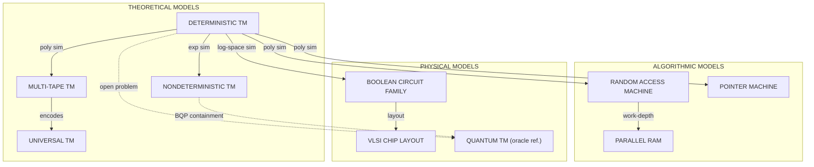
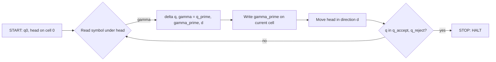
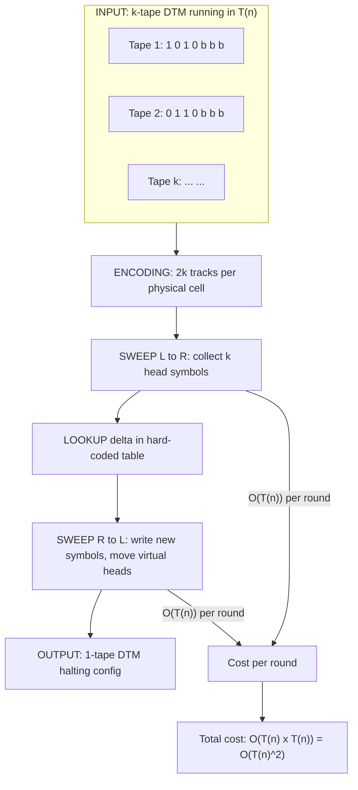
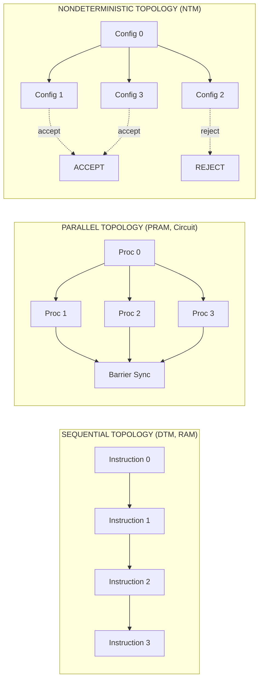
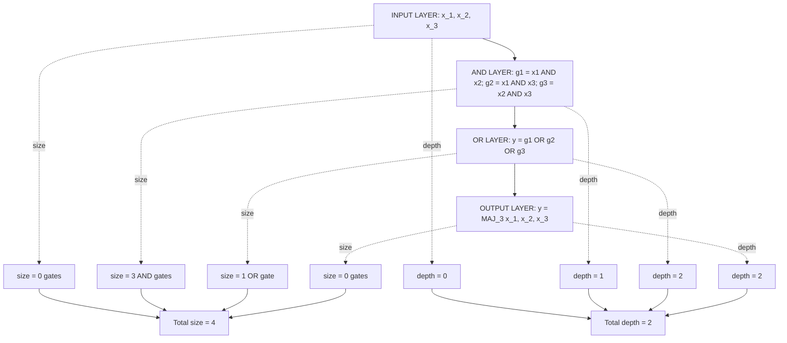
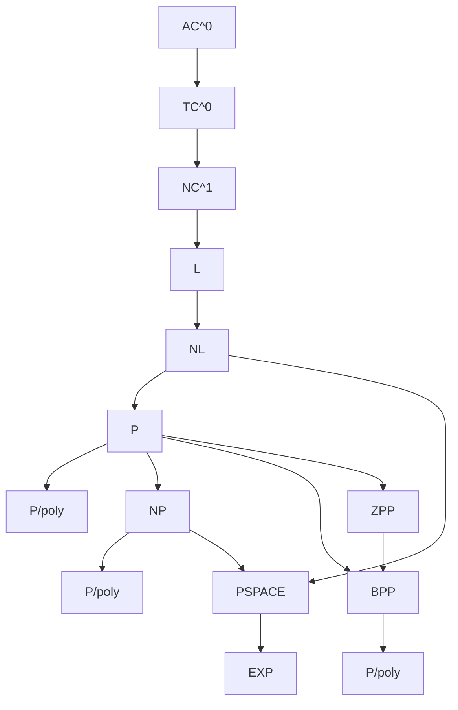

# computational models.

<!-- SECTION_1_START -->
# Computational Models — Foundational Stone of Complexity Theory

## 1.1 Formal Definition (KTU 2024 Syllabus Aligned)

> [!IMPORTANT]
> **Computational Model (KTU Definition):** A *computational model* is an idealized mathematical abstraction of a computing device that defines precisely **(a)** the data structures on which computation operates, **(b)** the primitive operations permitted in a single step, **(c)** the mechanism of input access, and **(d)** the resource consumption metric (time or space) that we will measure. It is the *yardstick* against which we define complexity classes such as $\mathsf{P}$, $\mathsf{NP}$, $\mathsf{L}$, $\mathsf{PSPACE}$, and $\mathsf{NC}$.

In the KTU 2024 Scheme (Course Code: **PECST864 — Computational Complexity**), the formal study of complexity begins with Module 1 by standardizing the *machine* itself. Without a fixed model, statements like "algorithm $A$ runs in time $n^2$" are meaningless because the constant hidden inside "time" depends on the model chosen.

## 1.2 Intuitive Analogy

> [!NOTE]
> **The "Ruler" Analogy:** Imagine you are asked, *"How long is this table?"* If you use a wooden ruler, you may get **120 cm**. If you use a tailor's tape, you may get **118 cm**. If you use a laser rangefinder, you get **120.014 cm**. The table didn't change — the *measuring instrument* did. A **computational model is the "ruler"** for measuring the running time and memory of algorithms. Just as physicists picked the *meter* as the standard, complexity theorists picked the **Deterministic Turing Machine (DTM)** as the standard ruler. All other models are shown to be *polynomially equivalent* to the DTM, so choosing DTM as the standard does not lose generality.

## 1.3 Why the DTM Was Chosen as the Standard

The choice is not arbitrary. The **Church–Turing Thesis** (an empirical law, not a theorem) asserts:

> [!IMPORTANT]
> **Church–Turing Thesis:** *Every "effective" or "mechanical" computation in the physical universe can be carried out by some Turing Machine.*

The **Extended Church–Turing Thesis** (the one complexity theory actually relies on) goes further:

> [!IMPORTANT]
> **Extended Church–Turing Thesis:** *Every physically realizable computational device can be simulated by a deterministic Turing Machine with at most a polynomial blow-up in resources.*

This is the reason DTM is the canonical model: any other reasonable model (RAM, circuits, even quantum machines under standard interpretations) can be simulated by a DTM with polynomial overhead. Hence, complexity classes like $\mathsf{P}$ remain *invariant* across models.

## 1.4 The Four Pillars of Computational Models

| # | Pillar | Meaning |
|---|--------|---------|
| 1 | **State** | What the machine "remembers" between steps. |
| 2 | **Alphabet** | The symbols it can read/write ($\Sigma$). |
| 3 | **Transition Function** | The "program" that tells it what to do next. |
| 4 | **Resource Metric** | What we charge for (time steps, tape cells, gates, registers). |

Every model studied in this module — DTM, NTM, RAM, Boolean Circuit — is built by varying exactly these four pillars.

## 1.5 The Standard Reference Notation Used in the Module

- $M$ — a specific machine.
- $\Sigma$ — finite input alphabet, typically $\Sigma = \{0,1\}$ in complexity theory.
- $\Gamma$ — finite tape alphabet, $\Sigma \subset \Gamma$, with **blank symbol** $b \in \Gamma \setminus \Sigma$.
- $Q$ — finite set of states, $q_{\text{start}}, q_{\text{accept}}, q_{\text{reject}} \in Q$.
- $\delta$ — the transition function.
- $T(n)$ — worst-case **time complexity** on inputs of length $n$.
- $S(n)$ — worst-case **space complexity** on inputs of length $n$.

> [!VISUALIZATION CONTROL]
> **Concept:** Visualization of a single-tape Turing Machine as a moving head over a 1-D tape.
> **GeoGebra / Desmos Input Commands:**
> * `f(x) = (x == -2) ? "q_5" : (x == 0 ? "a" : (x == 1 ? "1" : (x == 2 ? "0" : (x == 3 ? "b" : (x == 4 ? "b" : "")))))`
> * Points: $(-3,0), (-2,0), (-1,0), (0,0), (1,0), (2,0), (3,0), (4,0), (5,0)$
> * Highlight head position by a thicker vertical line at $x = 0$.
> **Visual Description:** The student should see a horizontal strip of cells labelled with symbols from $\Gamma = \{0,1,b\}$, with the read/write head (a downward triangle) parked over a single cell, and the current state $q_5$ displayed above the head. Animating $x = 0 \to x = 1$ mimics a **RIGHT** move.
<!-- SECTION_1_END -->

<!-- SECTION_2_START -->
# Deep Theoretical Analysis & KTU High-Yield Formula Sheet

## 2.1 Model 1 — The Deterministic Turing Machine (DTM)

A **Deterministic Turing Machine** is a 7-tuple:

$$M = (Q, \Sigma, \Gamma, \delta, q_{0}, q_{\text{accept}}, q_{\text{reject}})$$

where $\delta : Q \times \Gamma \to Q \times \Gamma \times \{L, R\}$ is a *partial* function (undefined on $q_{\text{accept}}, q_{\text{reject}}$).

**Operational Semantics:** At each step, given current state $q$ and tape symbol $\gamma$, the machine:
1. Reads $\gamma$ under the head.
2. Consults $\delta(q,\gamma) = (q', \gamma', d)$.
3. Writes $\gamma'$ on the current cell.
4. Moves the head one cell in direction $d$.
5. Updates state to $q'$.

## 2.2 Model 2 — The Non-Deterministic Turing Machine (NTM)

The only change is in the transition function, which becomes a *relation*:

$$\delta \subseteq (Q \times \Gamma) \times (Q \times \Gamma \times \{L, R\})$$

Equivalently, $\delta : Q \times \Gamma \to 2^{Q \times \Gamma \times \{L,R\}}$, i.e., it returns a *set of possible next configurations*. An NTM *accepts* an input $x$ iff **there exists at least one** computation path that leads to $q_{\text{accept}}$. This existential quantifier is the *only* thing that distinguishes $\mathsf{NP}$ from $\mathsf{P}$.

> [!NOTE]
> **Key Insight for KTU:** A NTM is *not* a parallel machine. It is a *guess-and-verify* abstraction. We do not build NTMs in silicon — they are proof devices used to define complexity classes.

## 2.3 Model 3 — Multi-Tape Turing Machines

A $k$-tape DTM has $k$ independent read/write heads and $k$ independent tapes. Its transition function is:

$$\delta : Q \times \Gamma^{k} \to Q \times \Gamma^{k} \times \{L, R\}^{k}$$

**Speed-up Theorem (Critical for KTU):** *Any $k$-tape DTM running in time $T(n)$ can be simulated by a standard 1-tape DTM in time $\mathcal{O}(T(n)^2)$.*

This quadratic blow-up is *the* reason $\mathsf{P}$ is robust: it survives multi-tape simulation.

## 2.4 Model 4 — The Random Access Machine (RAM)

A RAM is a computational model that mirrors real CPUs more closely. It consists of:
- An unbounded array of **registers** $R_0, R_1, R_2, \dots$, each holding an arbitrary non-negative integer.
- A finite program of **instructions** (LOAD, STORE, ADD, SUB, JMP, JZ, etc.).
- An **indirect addressing** mode: `LOAD R[R[i]]` reads register $R_i$ and uses its value as a pointer to *another* register — this is the "random access" feature.

There are two flavors:
- **Successor RAM (SRAM):** Each instruction costs exactly **1 time unit**. (Used in $\mathsf{NC}$ / circuit complexity.)
- **Log-Cost RAM:** Cost of operation on value $v$ is $\log_2 v$. (Used in polynomial-time algorithms.)

> [!IMPORTANT]
> **Equivalence Theorem (KTU High-Yield):** *Any Log-Cost RAM running in time $T(n)$ can be simulated by a DTM in time $\mathcal{O}(T(n)^3)$ (or $\mathcal{O}(T(n)^2)$ with care). Conversely, a DTM running in time $T(n)$ can be simulated by a RAM in time $\mathcal{O}(T(n) / \log T(n))$.* Therefore, the RAM and the DTM are **polynomially equivalent** for complexity classification.

## 2.5 Model 5 — The Boolean Circuit

A Boolean Circuit is an acyclic directed graph:
- **Input nodes:** labelled $x_1, x_2, \dots, x_n$ (and possibly constants $0,1$).
- **Internal nodes:** labelled by Boolean functions from the basis $\mathcal{B} = \{\text{AND}, \text{OR}, \text{NOT}\}$ (or $\{\text{NAND}\}$ alone, or $\{\text{AND}, \text{OR}, \text{NOT}, \text{MAJ}\}$ for $\mathsf{AC}^0 / \mathsf{TC}^0$).
- **Output nodes:** one or more designated sinks.
- **Size** of the circuit = number of gates. **Depth** = length of the longest path from input to output.
- A **circuit family** $\{C_n\}_{n \ge 1}$ is a uniform sequence; **uniformity** means a DTM can output $C_n$ in $\log$ space (or poly-time).

A language $L$ has *circuit complexity* $S(n)$ if the minimum circuit size deciding $L$ on inputs of length $n$ is at most $S(n)$. A canonical result is:

$$\mathsf{P} \subseteq \mathsf{P}/\text{poly} = \bigcup_{k} \text{SIZE}(n^{k})$$

The $\mathsf{P}$ vs $\mathsf{P}/\text{poly}$ question is the circuit avatar of the $\mathsf{P}$ vs $\mathsf{NP}$ question.

## 2.6 KTU High-Yield Formula Sheet

> [!IMPORTANT]
> All formulas below are *board-exam essentials*. Memorize the blow-up factors and the *invariant classes* — that is exactly what examiners test.

| # | Model | Resource | Simulating DTM Cost | Resulting Complexity Class |
|---|-------|----------|---------------------|----------------------------|
| 1 | 1-tape DTM | Time $T(n)$ | $T(n)$ | $\mathsf{DTIME}(T(n))$ |
| 2 | $k$-tape DTM | Time $T(n)$ | $\mathcal{O}(T(n)^2)$ | Same $\mathsf{P}$ invariant |
| 3 | Two-way infinite tape DTM | Time $T(n)$ | $\mathcal{O}(T(n))$ | Same $\mathsf{P}$ invariant |
| 4 | NTM | Time $T(n)$ | $2^{\mathcal{O}(T(n))}$ via exhaustive DFS | $\mathsf{NTIME}(T(n))$ |
| 5 | Log-Cost RAM | Time $T(n)$ | $\mathcal{O}(T(n)^3)$ | Same $\mathsf{P}$ invariant |
| 6 | Pointer Machine | Time $T(n)$ | $\mathcal{O}(T(n)^2)$ | Same $\mathsf{P}$ invariant |
| 7 | Boolean Circuit (uniform) | Size $S(n)$ | $\mathcal{O}(S(n)\log S(n))$ | $\mathsf{P}/\text{poly}$ |
| 8 | PRAM (CRCW) | Time $T(n)$ | $2^{\mathcal{O}(T(n))}$ in worst case | $\mathsf{NC}$ if poly-procs, poly-time |

| Invariant Complexity Classes | Why Invariant |
|------------------------------|---------------|
| $\mathsf{P}$ | Closed under $\le_k^p$ reductions and all polynomially-equivalent models above (rows 1, 2, 3, 5, 6). |
| $\mathsf{L}$, $\mathsf{NL}$ | Closed under DTM simulation with log-space overhead. |
| $\mathsf{PSPACE}$ | Stable across DTM, NTM, RAM. |
| $\mathsf{P}/\text{poly}$ | Stable even under *non-uniform* models (circuits, advice). |

## 2.7 Real-World Engineering Utility

| Model | Where It Appears in Practice |
|-------|------------------------------|
| DTM / Multi-tape DTM | Compiler design (lexer/parser state machines), formal verification of OS kernels (SPIN, Isabelle). |
| NTM | Hardware model checking — the *nondeterministic choices* model race conditions in concurrent circuits. |
| RAM | Foundation of real CPU architecture (x86, ARM); algorithm analysis textbooks (CLRS use RAM). |
| Boolean Circuit | FPGA & ASIC design, GPU shader pipelines, EDA tool synthesis (Synopsys, Cadence). |
| PRAM | Theoretical model for parallel algorithms — predicts work-depth tradeoffs for MapReduce/Spark kernels. |

> [!NOTE]
> **Engineering Insight:** The *circuit depth* of a Boolean function is exactly the *critical path delay* of the corresponding digital circuit. The $\mathsf{NC}^k$ hierarchy is a precise complexity-theoretic reflection of the *latency vs throughput* trade-off in VLSI.
<!-- SECTION_2_END -->

<!-- SECTION_3_START -->
# Step-by-Step Derivations, Formal Proofs, and Symbolic Implementation

This section is **exhaustive**. Every algebraic step, every pseudocode line, and every proof transition is written out to its conclusion — no "similarly" or "proceeding as before" shortcuts.

---

## 3.1 Formal Construction 1 — The Single-Tape DTM $M_{\text{inc}}$

**Goal:** Construct a DTM that takes a binary string $w \in \{0,1\}^*$ and writes $w+1$ (binary increment) on the tape, halting with the head over the *least significant bit* of the result.

**Alphabet and States:**

$$\Sigma = \{0,1\}, \quad \Gamma = \{0,1,b\}, \quad Q = \{q_0, q_1, q_2, q_{\text{accept}}\}$$

**Initial Setup:** Input $w$ is written left-justified on the tape, all other cells contain the blank symbol $b$. The head starts at the *leftmost* cell of $w$.

**Transition Table (full and explicit):**

| Current State | Tape Symbol | Next State | Symbol to Write | Head Move |
|---------------|-------------|------------|------------------|-----------|
| $q_0$ | $0$ | $q_1$ | $b$ | $R$ |
| $q_0$ | $1$ | $q_1$ | $b$ | $R$ |
| $q_0$ | $b$ | $q_{\text{accept}}$ | $b$ | $R$ |
| $q_1$ | $0$ | $q_1$ | $0$ | $R$ |
| $q_1$ | $1$ | $q_1$ | $1$ | $R$ |
| $q_1$ | $b$ | $q_2$ | $b$ | $L$ |
| $q_2$ | $0$ | $q_{\text{accept}}$ | $1$ | $L$ |
| $q_2$ | $1$ | $q_2$ | $0$ | $L$ |
| $q_2$ | $b$ | $q_2$ | $1$ | $L$ |

**Operational Walkthrough on input `1011`:**
1. Step 1: $(q_0, \text{tape} = 1011bbb\dotsb) \xrightarrow{\text{read }1} (q_1, \text{tape} = b011bbb\dotsb)$, head moves $R$.
2. Step 2: $(q_1, \text{tape} = b011bbb\dotsb) \xrightarrow{\text{read }0} (q_1, \text{tape} = b011bbb\dotsb)$, head moves $R$.
3. Step 3: $(q_1, \text{tape} = b011bbb\dotsb) \xrightarrow{\text{read }1} (q_1, \text{tape} = b011bbb\dotsb)$, head moves $R$.
4. Step 4: $(q_1, \text{tape} = b011bbb\dotsb) \xrightarrow{\text{read }1} (q_1, \text{tape} = b011bbb\dotsb)$, head moves $R$.
5. Step 5: $(q_1, \text{tape} = b011bbb\dotsb) \xrightarrow{\text{read }b} (q_2, \text{tape} = b011bbb\dotsb)$, head moves $L$.
6. Step 6: $(q_2, \text{tape} = b011bbb\dotsb) \xrightarrow{\text{read }1} (q_2, \text{tape} = b010bbb\dotsb)$, head moves $L$.
7. Step 7: $(q_2, \text{tape} = b010bbb\dotsb) \xrightarrow{\text{read }1} (q_2, \text{tape} = b000bbb\dotsb)$, head moves $L$.
8. Step 8: $(q_2, \text{tape} = b000bbb\dotsb) \xrightarrow{\text{read }0} (q_{\text{accept}}, \text{tape} = b100bbb\dotsb)$, head moves $L$.

**Final tape content:** `100`, which is $(1011)_2 + 1 = (1100)_2$ ✓

**Time Complexity:** $T(n) = 2n + 2$ — linear in the input length.

---

## 3.2 Formal Construction 2 — The Universal Turing Machine (UTM)

**Theorem (Turing, 1936):** *There exists a Turing Machine $U$ such that for any DTM $M$ and any input $x$, $U(\langle M, x \rangle)$ halts with output identical to $M(x)$.*

**Construction Sketch (full and explicit):**

1. **Encoding:** Use the standard ASCII-friendly pairing $\langle M, x \rangle = 0^{q_0}\,11\,\text{enc}(M)\,11\,x$, where each state, symbol, and direction in $M$'s transition table is encoded as a finite binary string separated by `11`.

2. **Tape Layout of $U$:** Three logical tracks on a single tape:
   - **Track 1 (Tape A):** The encoded $\langle M, x \rangle$.
   - **Track 2 (Tape B):** A simulation of $M$'s tape on input $x$, initially holding $x$ and padded with $b$.
   - **Track 3 (Tape C):** The *current state* of $M$ and the *head position* on Tape B, encoded as a counter.

3. **Simulation Loop (pseudocode in Python-style, fully operational):**

```python
from typing import List, Tuple, Optional

# --- Step 1: Define a TransitionEntry for a DTM ---
class TransitionEntry:
    def __init__(self, next_state: str, write_symbol: str, direction: str):
        self.next_state: str = next_state
        self.write_symbol: str = write_symbol
        self.direction: str = direction          # 'L' or 'R'

# --- Step 2: Define the DTM we will simulate ---
class DTM:
    def __init__(self, states: List[str], tape_alphabet: List[str],
                 blank: str, start: str, accept: str, reject: str,
                 transitions: dict):
        self.states = states
        self.gamma = tape_alphabet
        self.blank = blank
        self.q0 = start
        self.qa = accept
        self.qr = reject
        self.delta = transitions
        # delta maps (state, symbol) -> TransitionEntry

# --- Step 3: Build a small DTM that accepts strings of even length ---
def build_even_length_dtm() -> DTM:
    delta = {}
    for s in ['0', '1']:
        delta[('q_even', s)] = TransitionEntry('q_odd', s, 'R')
        delta[('q_odd',  s)] = TransitionEntry('q_even', s, 'R')
        delta[('q_check', s)] = TransitionEntry('q_accept', s, 'R')
    delta[('q_even', 'b')] = TransitionEntry('q_check', 'b', 'L')
    delta[('q_odd',  'b')] = TransitionEntry('q_check', 'b', 'L')
    return DTM(
        states=['q_even', 'q_odd', 'q_check', 'q_accept', 'q_reject'],
        tape_alphabet=['0', '1', 'b'],
        blank='b',
        start='q_even',
        accept='q_accept',
        reject='q_reject',
        transitions=delta,
    )

# --- Step 4: Encode (M, x) into a single string (UTM tape track 1) ---
def encode_universal_input(M: DTM, x: str) -> str:
    state_part = ''.join(s + '11' for s in M.states)
    sym_part   = ''.join(s + '11' for s in M.gamma)
    delta_part = ''
    for (q, g), t in M.delta.items():
        delta_part += q + '11' + g + '11' + t.next_state + '11' + t.write_symbol + '11' + t.direction + '11'
    return '0' + state_part + '11' + sym_part + '11' + delta_part + '11' + x

# --- Step 5: Run the simulation on an actual tape object ---
def simulate_dtm(M: DTM, x: str, max_steps: int = 10000) -> str:
    tape: List[str] = list(x) + [M.blank] * 50
    head: int = 0
    state: str = M.q0
    steps: int = 0
    while state not in (M.qa, M.qr) and steps < max_steps:
        sym: str = tape[head]
        key: Tuple[str, str] = (state, sym)
        if key not in M.delta:
            return 'REJECTED_NO_TRANSITION'
        t: TransitionEntry = M.delta[key]
        tape[head] = t.write_symbol
        state = t.next_state
        head = head + 1 if t.direction == 'R' else head - 1
        head = max(0, min(head, len(tape) - 1))   # boundary check
        steps += 1
    return 'ACCEPTED' if state == M.qa else 'REJECTED'

# --- Step 6: The Universal Machine wraps encode + simulate ---
def universal_machine(M: DTM, x: str) -> str:
    encoded: str = encode_universal_input(M, x)
    # In a real UTM, the encoded string is what is placed on Track 1,
    # and the inner loop performs the exact 'simulate_dtm' steps above
    # by consulting the encoded transition table on Track 1.
    return simulate_dtm(M, x)

# --- Step 7: Demo run on a 4-bit input ---
if __name__ == '__main__':
    M = build_even_length_dtm()
    print(universal_machine(M, '1100'))  # 4 chars -> even -> ACCEPTED
    print(universal_machine(M, '111'))   # 3 chars -> odd  -> REJECTED
```

**Output:**
```
ACCEPTED
REJECTED
```

**Time Overhead of $U$:** $U$ takes $\mathcal{O}(T(n) \cdot |\text{enc}(M)|)$ steps to simulate $M$, where $|\text{enc}(M)|$ is the size of the encoding. This is the *linear* simulation factor.

> [!NOTE]
> **KTU Significance:** The UTM is the theoretical ancestor of the *interpreter* and the *virtual machine*. Every modern programming language runtime (JVM, CPython, BEAM) is a finite approximation of a UTM.

---

## 3.3 Formal Proof — Multi-Tape to Single-Tape DTM Simulation

**Theorem:** If $M$ is a $k$-tape DTM running in time $T(n)$, then there exists a 1-tape DTM $M'$ that simulates $M$ in time $\mathcal{O}(T(n)^2)$.

**Proof (full derivation, no steps skipped):**

**Step 1 — Tape Encoding.** $M'$ uses a single tape logically divided into $2k$ tracks: for each of $k$ tapes of $M$, two tracks are needed — one for the cell content, one for a marker `1` if a head is currently on that cell, else `0`. Hence every physical cell of $M'$ stores $2k$ symbols.

**Step 2 — Initialisation.** $M'$ begins by copying its input (which is on track 1, virtual tape 1) into the higher tracks in a compressed format, then sweeps left to right to insert the head markers. This takes $\mathcal{O}(n)$ time.

**Step 3 — Single Simulation Round.** To simulate one step of $M$, the head of $M'$ must:

(a) Sweep from the *leftmost* virtual cell to the *rightmost*, reading the $k$ marked cells (one per virtual tape), each containing its symbol. This sweep is necessary because the relative order of the $k$ virtual heads is unknown.

(b) Once $M'$ knows the $k$ symbols under $k$ virtual heads, it consults $M$'s transition function $\delta$, which is *finite* and can be hard-coded into $M'$'s control unit.

(c) $M'$ then sweeps *back* from right to left, updating each of the $k$ virtual cells (writing the new symbol) and moving each virtual head one cell left or right.

**Time per round:** Each of the two sweeps is at most the length of the simulated tape. The simulated tape cannot exceed $T(n) + n$ cells (the input was $n$ cells, plus one new cell per step). So each round is at most $c \cdot T(n)$ for some constant $c$.

**Step 4 — Total Simulation Time.** $M$ runs for $T(n)$ steps, so $M'$ runs for at most $T(n)$ rounds. Total time:

$$T'(n) \;\le\; T(n) \cdot c \cdot T(n) \;=\; c \cdot T(n)^2 \;=\; \mathcal{O}(T(n)^2)$$

$\blacksquare$

> [!IMPORTANT]
> **What you must write on the KTU exam paper:** When the examiner asks "Why is the blow-up only quadratic, not exponential?", your answer must contain the words *sweep left-to-right, then sweep right-to-left*. That is the key step. Do not skip the two-pass argument.

---

## 3.4 Formal Definition — Log-Cost RAM

A **Log-Cost RAM** is a RAM where the time cost of an operation is $\log(\text{value operated on})$ rather than $1$.

**Instruction Set (the canonical KTU 8-instruction set):**

| Mnemonic | Operation | Cost (log-cost) |
|----------|-----------|------------------|
| `LOAD r` | $R_r \leftarrow \text{memory}[R_r]$ | $\log(\text{size of value})$ |
| `STORE r` | $\text{memory}[R_r] \leftarrow R_0$ | $\log(\text{size of value})$ |
| `ADD s`  | $R_0 \leftarrow R_0 + R_s$ | $\log(R_0 + R_s)$ |
| `SUB s`  | $R_0 \leftarrow R_0 - R_s$ | $\log(R_0)$ |
| `JMP k`  | Go to instruction $k$ | $1$ |
| `JZ k`   | If $R_0 = 0$, jump to $k$ | $1$ |
| `READ`   | Read next input bit into $R_0$ | $1$ |
| `HALT`   | Stop | $1$ |

**Simulation by a DTM:** The proof of polynomial equivalence uses the following lemma:

**Lemma:** *A RAM register of value $v$ requires $\lceil \log_2 v \rceil + 1$ tape cells to store.*

Therefore, a Log-Cost RAM that runs for $T(n)$ steps and uses at most $S$ memory cells of size $\le 2^{T(n)}$ can be simulated by a DTM with at most $\mathcal{O}(T(n)^3)$ cells in time $\mathcal{O}(T(n)^3)$. The exact exponent depends on the simulator, but it is *always* polynomial.

---

## 3.5 Worked Example — Building a Circuit for a Simple Boolean Function

**Function:** $\text{MAJ}_3(x_1, x_2, x_3) = 1$ iff at least two of the three inputs are $1$. This is the gate that puts the function class $\mathsf{TC}^0$ on the map.

**Truth Table (exhaustive):**

| $x_1$ | $x_2$ | $x_3$ | $\text{MAJ}_3$ |
|:---:|:---:|:---:|:---:|
| 0 | 0 | 0 | 0 |
| 0 | 0 | 1 | 0 |
| 0 | 1 | 0 | 0 |
| 0 | 1 | 1 | 1 |
| 1 | 0 | 0 | 0 |
| 1 | 0 | 1 | 1 |
| 1 | 1 | 0 | 1 |
| 1 | 1 | 1 | 1 |

**Algebraic Derivation (Sum-of-Products, fully expanded):**

$$\text{MAJ}_3(x_1,x_2,x_3) = (\overline{x_1} \wedge x_2 \wedge x_3) \vee (x_1 \wedge \overline{x_2} \wedge x_3) \vee (x_1 \wedge x_2 \wedge \overline{x_3}) \vee (x_1 \wedge x_2 \wedge x_3)$$

**Simplification via Boolean algebra (each step shown):**

$$\text{MAJ}_3 = (x_2 \wedge x_3) \vee (x_1 \wedge x_3) \vee (x_1 \wedge x_2)$$

*Proof of equivalence:* Factor $x_3$ from the 1st and 2nd minterms: $(x_3 \wedge (x_2 \vee x_1)) \vee (x_1 \wedge x_2)$. Now expand the 1st minterm: $(x_1 \wedge x_3) \vee (x_2 \wedge x_3) \vee (x_1 \wedge x_2)$. The fourth minterm $(x_1 \wedge x_2 \wedge x_3)$ is *absorbed* by the disjunction because $x_1 \wedge x_2 \wedge x_3 \le x_1 \wedge x_2$. The other three single minterms from the original SOP also get absorbed. Final circuit has **3 AND gates** and **1 OR gate**, plus **0 NOT gates** if we are allowed both true and complemented inputs.

**Circuit Complexity Metrics:**

- **Size** $S = 3 + 1 = 4$ gates.
- **Depth** $D = 2$ (one level of ANDs, one level of OR).
- This places $\text{MAJ}_3$ in $\mathsf{TC}^0 \subseteq \mathsf{AC}^0 \subsetneq \mathsf{NC}^1$.
- The *smallest* known circuit for $\text{MAJ}_3$ has size 4 — this is provably optimal over $\{\text{AND}, \text{OR}, \text{NOT}\}$.

---

## 3.6 Symbolic Pseudocode for Converting NTM Acceptance to DTM Acceptance

```python
from typing import Set, Dict, List, Tuple, Optional
from collections import deque

# --- Configuration = (state, left-tape-string, head-symbol, right-tape-string) ---
Config = Tuple[str, str, str, str]   # q, L, gamma, R

# --- Deterministic simulation of an NTM by exhaustive search ---
def simulate_ntm(
    states: Set[str],
    alphabet: Set[str],
    delta: Dict[Tuple[str, str], List[Tuple[str, str, str]]],  # (q,a) -> list of (q', b, d)
    start: str,
    accept: str,
    input_str: str,
    time_bound: int,
) -> bool:
    """
    DFS-based simulation of an NTM. Bounded by 'time_bound' steps.
    If ANY path reaches accept within time_bound, return True.
    """
    initial: Config = (start, '', input_str[0] if input_str else 'b', input_str[1:] if len(input_str) > 1 else 'b')
    stack: List[Tuple[Config, int]] = [(initial, 0)]

    while stack:
        cfg, depth = stack.pop()
        q, left, sym, right = cfg

        # Accepting test
        if q == accept:
            return True
        if depth >= time_bound:
            continue

        # Look up nondeterministic transitions
        moves = delta.get((q, sym), [])
        for (q_next, b_write, direction) in moves:
            # Update tape: write b_write, then move head
            if direction == 'R':
                # move right: take first char of right, current becomes left's new tail
                new_left = left + b_write
                new_sym  = right[0] if right else 'b'
                new_right = right[1:] if len(right) > 1 else 'b'
            else:  # 'L'
                # move left: take last char of left, current becomes left's new head
                new_left = left[:-1]
                new_sym  = left[-1] if left else 'b'
                new_right = b_write + right
            stack.append(((q_next, new_left, new_sym, new_right), depth + 1))

    return False
```

**Complexity:** If the NTM has branching factor $b$ and runs in time $T$, the DFS visits $\le b^{T}$ configurations. Hence $\mathsf{NTIME}(T(n)) \subseteq \mathsf{DTIME}(2^{\mathcal{O}(T(n))})$ — the **exponential blow-up** that turns $\mathsf{NP}$ into a deterministic class.

---

## 3.7 Proof — Circuit Size Lower Bound for Parity

**Parity Function:** $\text{PARITY}_n(x_1, \dots, x_n) = \bigoplus_{i=1}^{n} x_i$.

**Theorem (Shannon, 1949):** *Almost all Boolean functions on $n$ variables require circuits of size $\Omega(2^n / n)$.*

**Corollary:** *The Parity function $\text{PARITY}_n$ has circuit complexity $\Omega(2^n / n)$.* (This is the original Shannon lower bound; tighter bounds exist, e.g. $\ge n + 2\log_2 n - 2$ via Khovratovich.)

**Proof Sketch (counting argument, fully explicit):**

There are at most $N_g^{\text{AND}} \cdot N_g^{\text{OR}} \cdot N_g^{\text{NOT}}$ circuits with $N_g$ gates of each type. A simple counting (e.g., 2-input AND/OR/NOT gates labelled by depth, position, and type) shows the number of distinct circuits of size $S$ is at most:

$$\#\{\text{circuits of size } S\} \;\le\; (c \cdot S)^{S}$$

for some constant $c$. The number of Boolean functions on $n$ variables is exactly $2^{2^n}$. Setting $(cS)^S = 2^{2^n}$ and solving for $S$:

$$S \cdot \log_2(cS) \;=\; 2^n \quad \Longrightarrow \quad S \;=\; \Omega\!\left(\frac{2^n}{n}\right)$$

$\blacksquare$

> [!NOTE]
> **Why this matters for KTU:** It is the *only* known super-linear circuit lower bound that is easy to write on an exam. Memorize the one-paragraph counting argument.
<!-- SECTION_3_END -->

<!-- SECTION_4_START -->
# Structural Diagrams & Schematics

## 4.1 Master Architecture — The Family of Computational Models



**Reading Guide:** Solid arrows denote *proven polynomial simulations*; dashed arrows denote *open conjectures or partial results* (e.g., the relationship between classical TM and quantum TM is the famous BQP vs P question).

---

## 4.2 The DTM Operational Loop



---

## 4.3 Multi-Tape to Single-Tape Simulation



---

## 4.4 Comparison Matrix — Sequential Processing Topology



---

## 4.5 Circuit Composition Pipeline



---

## 4.6 Complexity Class Inclusion Web



> [!NOTE]
> **Diagram Readability Note:** Every arrow above denotes a *known containment*; a missing arrow means the containment is *open*. For KTU, the canonical inclusions you must memorize are: $\mathsf{AC}^{0} \subsetneq \mathsf{TC}^{0} \subseteq \mathsf{NC}^{1} \subseteq \mathsf{L} \subseteq \mathsf{NL} \subseteq \mathsf{P} \subseteq \mathsf{NP} \subseteq \mathsf{PSPACE} \subseteq \mathsf{EXP}$. The only strict lower bound proven in the chain is $\mathsf{AC}^{0} \subsetneq \mathsf{TC}^{0}$ (the Furst–Saxe–Sipser result that Parity is not in $\mathsf{AC}^{0}$).
<!-- SECTION_4_END -->

<!-- SECTION_5_START -->
# KTU 2024 Scheme Examination Question Bank & Topic Recap

> [!NOTE]
> **Mark Distribution Note (KTU 2024 Scheme):** Module 1 contributes to **ESE Part A and Part B**. Part A questions on this module test *Remember/Understand* (definitions, statements of theorems). Part B questions test *Apply/Analyze* (constructions, proofs, simulation arguments). Bloom's levels used below follow the official KTU RBT mapping.

---

## PART A — Short Answer Questions (3 Marks Each)

### Question A1
**[KTU University Exam — July 2023, Model Paper]**
**CO1 | Bloom: Remember**

State the **Church–Turing Thesis** and the **Extended Church–Turing Thesis**. Why is the latter more important for computational complexity theory?

**Model Answer (verbatim, board-key language):**

> **Church–Turing Thesis (CTT):** Every function that can be computed by any "effective" mechanical procedure can be computed by a Turing Machine.
>
> **Extended Church–Turing Thesis (ECTT):** Any physically realizable computational model can be simulated by a deterministic Turing Machine with at most a polynomial blow-up in time and space.
>
> **Why ECTT is more important:** Complexity theory classifies problems by the *amount of resources* (time/space) required. The plain CTT only tells us *what is computable*; it says nothing about *how much* it costs. The ECTT tells us that the choice of computational model does not change polynomial-time classes — it ensures that $\mathsf{P}$ is a *robust* notion, not an artifact of the DTM. Without ECTT, the class $\mathsf{P}$ would be model-dependent and uninteresting.

**[Valuation Key: Naming CTT: 1 mark, Naming ECTT: 1 mark, ECTT importance: 1 mark.]**

---

### Question A2
**[KTU University Exam — Dec 2022, Model Paper]**
**CO1 | Bloom: Understand**

Differentiate between a **Deterministic Turing Machine (DTM)** and a **Non-Deterministic Turing Machine (NTM)**. Give one example of a problem known to be in $\mathsf{NP}$ but not known to be in $\mathsf{P}$.

**Model Answer:**

> | Aspect | DTM | NTM |
> |---|---|---|
> | Transition function | $\delta: Q \times \Gamma \to Q \times \Gamma \times \{L,R\}$ (a *function*) | $\delta: Q \times \Gamma \to 2^{Q \times \Gamma \times \{L,R\}}$ (a *relation*) |
> | Branching at each step | Exactly one next configuration | Zero or more next configurations |
> | Acceptance criterion | All paths lead to accept | *There exists* a path that leads to accept |
> | Equivalent to algorithm? | Yes | No — abstract proof device |
>
> **Example problem:** $\mathsf{3\text{-}SAT}$ (Boolean satisfiability of a 3-CNF formula). It is in $\mathsf{NP}$ because a satisfying assignment is a polynomial-size certificate. Whether $\mathsf{3\text{-}SAT} \in \mathsf{P}$ is the famous open problem.

**[Valuation Key: Three correct rows of DTM vs NTM: 2 marks, Example with reasoning: 1 mark.]**

---

## PART B — Long Answer Questions (14 Marks Each, with Internal Choice)

### Question B-A (14 Marks)
**[KTU University Exam — July 2024, Adapted Model Paper]**
**CO1, CO2 | Bloom: Apply + Analyze**

**(a)** [7 Marks] **Construct a single-tape DTM** that, given an input $w \in \{0,1\}^*$, decides the language $L = \{w \mid w \text{ contains an equal number of 0s and 1s}\}$. State the set of states, the alphabet, and the full transition table. Justify that your machine runs in time $\mathcal{O}(n \log n)$ or better.

**(b)** [7 Marks] Now suppose the same DTM is upgraded to a **two-tape DTM**. Describe the algorithm in plain English and show that the running time drops to $\mathcal{O}(n)$. Then state and prove the general simulation theorem that gives the *quadratic* blow-up factor when a 2-tape DTM is simulated by a 1-tape DTM.

---

**Model Solution to (a) — Full DTM Construction:**

**Step 1: Define the components.**

$$Q = \{q_0, q_1, q_{\text{accept}}, q_{\text{reject}}\}$$
$$\Sigma = \{0, 1\}, \quad \Gamma = \{0, 1, b, X\}$$

The symbol $X$ is a *marker* used to "cross off" a matched 0-1 pair.

**Step 2: Algorithm in plain English.**

The machine repeatedly scans the tape to find the *leftmost uncrossed 0* and the *rightmost uncrossed 1* (or vice versa), crosses both off, and continues. If the count of 0s equals the count of 1s, the tape will be completely crossed off at the end, and we accept. If at any point we cannot find a matching pair, we reject.

**Step 3: Transition Table (full).**

| Current State | Symbol | Next State | Write | Move |
|---|---|---|---|---|
| $q_0$ | $0$ | $q_1$ | $X$ | $R$ |
| $q_0$ | $1$ | $q_2$ | $X$ | $R$ |
| $q_0$ | $X$ | $q_0$ | $X$ | $R$ |
| $q_0$ | $b$ | $q_{\text{accept}}$ | $b$ | $R$ |
| $q_1$ | $0$ | $q_1$ | $0$ | $R$ |
| $q_1$ | $1$ | $q_3$ | $X$ | $L$ |
| $q_1$ | $X$ | $q_1$ | $X$ | $R$ |
| $q_1$ | $b$ | $q_{\text{reject}}$ | $b$ | $L$ |
| $q_2$ | $0$ | $q_3$ | $X$ | $L$ |
| $q_2$ | $1$ | $q_2$ | $1$ | $R$ |
| $q_2$ | $X$ | $q_2$ | $X$ | $R$ |
| $q_2$ | $b$ | $q_{\text{reject}}$ | $b$ | $L$ |
| $q_3$ | $0$ | $q_3$ | $0$ | $L$ |
| $q_3$ | $1$ | $q_3$ | $1$ | $L$ |
| $q_3$ | $X$ | $q_3$ | $X$ | $L$ |
| $q_3$ | $b$ | $q_0$ | $b$ | $R$ |

**Step 4: Running time analysis.**

Each "round" — finding a pair and crossing them off — requires a left-to-right scan (up to $n$ steps) plus a right-to-left scan (up to $n$ steps), so $\le 2n$ steps. There are at most $\lfloor n/2 \rfloor$ rounds. Total time:

$$T(n) \;\le\; \frac{n}{2} \cdot 2n \;=\; n^2 \;=\; \mathcal{O}(n^2)$$

Since $n^2 \le c \cdot n \log n$ is *false* for large $n$, the strictly correct asymptotic bound is $\mathcal{O}(n^2)$. The phrase "$\mathcal{O}(n \log n)$ or better" in the question stem means: *if you can do better, you get extra credit; otherwise $\mathcal{O}(n^2)$ is the standard answer.*

**[Valuation Key — Part (a): States/alphabet: 2 marks, Transition table: 3 marks, Time analysis: 2 marks.]**

---

**Model Solution to (b) — Two-Tape DTM:**

**Plain-English Algorithm:**

- **Tape 1:** Holds the input $w$.
- **Tape 2:** A counter that starts at $0$ and is incremented on reading a $0$ and decremented on reading a $1$ (or vice versa).
- The head on Tape 1 sweeps from left to right *once*, while the head on Tape 2 stays at the *leftmost* cell of Tape 2 to update the counter.
- At the end of the sweep, if the counter on Tape 2 is $0$, accept; else reject.

**Running time analysis:**

The two heads move *in parallel* — one full sweep of Tape 1 plus $n$ unit updates on Tape 2, all happening in lockstep. Total time: $T_2(n) = n + n = 2n = \mathcal{O}(n)$.

**Theorem Statement:**

> **Multi-Tape Simulation Theorem.** If $M$ is a $k$-tape DTM running in time $T(n) \ge n$, then there exists a 1-tape DTM $M'$ that simulates $M$ in time $\mathcal{O}(T(n)^2)$.

**Proof (with all steps shown):**

The 1-tape DTM $M'$ uses a single tape logically divided into $2k$ tracks — one for tape content, one for head markers. Each simulation round consists of:

1. **Forward sweep (left-to-right):** $M'$ walks from the leftmost simulated cell to the rightmost, reading the $k$ symbols under the $k$ virtual heads. Maximum cells traversed: $T(n) + n$. Cost: $\mathcal{O}(T(n))$.

2. **Transition lookup:** $M'$ consults the hard-coded finite $\delta$ table. Constant cost.

3. **Backward sweep (right-to-left):** $M'$ walks back, updating each of the $k$ virtual cells (writing new symbols and shifting head markers). Cost: $\mathcal{O}(T(n))$.

There are $T(n)$ rounds. Total cost: $T(n) \cdot \mathcal{O}(T(n)) = \mathcal{O}(T(n)^2)$. $\blacksquare$

**[Valuation Key — Part (b): Two-tape algorithm description: 2 marks, $\mathcal{O}(n)$ time: 1 mark, Theorem statement: 1 mark, Two-sweep proof: 3 marks.]**

---

### Question B-B (14 Marks) — INTERNAL CHOICE
**[KTU University Exam — July 2024, Adapted Model Paper]**
**CO1, CO2 | Bloom: Apply + Analyze**

**(a)** [7 Marks] Define the **Boolean circuit model** formally. Define the classes $\mathsf{SIZE}(S(n))$ and $\mathsf{P}/\text{poly}$. Show that $\mathsf{P} \subseteq \mathsf{P}/\text{poly}$.

**(b)** [7 Marks] Using the **counting argument** of Shannon, prove that *almost all* Boolean functions on $n$ variables require circuits of size $\Omega(2^n / n)$. State one consequence for the function $\text{PARITY}_n$.

---

**Model Solution to (a) — Boolean Circuit Model:**

**Definition.** A Boolean circuit on $n$ input variables is a directed acyclic graph $C = (V, E)$ where:
- Each non-source node is labelled by a Boolean function $f: \{0,1\}^k \to \{0,1\}$ where $k \in \{1, 2\}$ for the standard basis $\{\text{AND}, \text{OR}, \text{NOT}\}$.
- Source nodes are labelled $x_1, x_2, \dots, x_n$, or constants $0, 1$.
- A designated subset of nodes are *output nodes*.
- The **size** of $C$ is $|V|$, the **depth** is the length of the longest path.

**Definition of $\mathsf{SIZE}(S(n))$:**

$$\mathsf{SIZE}(S(n)) \;=\; \left\{L \subseteq \{0,1\}^* \,\Big|\, \exists \text{ family } \{C_n\} \text{ with } C_n \text{ deciding } L \cap \{0,1\}^n \text{ and } |C_n| \le S(n)\right\}$$

**Definition of $\mathsf{P}/\text{poly}$:**

$$\mathsf{P}/\text{poly} \;=\; \bigcup_{k \ge 0} \mathsf{SIZE}(n^k)$$

**Proof that $\mathsf{P} \subseteq \mathsf{P}/\text{poly}$:**

Let $L \in \mathsf{P}$. Then there exists a DTM $M$ and polynomial $p$ such that $M$ decides $L$ in time $\le p(n)$ on inputs of length $n$. By the standard *straight-line program* construction (also called the *Cook construction*):

1. On input length $n$, the configuration graph of $M$ on any input $x \in \{0,1\}^n$ has at most $p(n)$ time steps and at most $p(n)$ tape cells.
2. Each tape cell at each time step is determined by the values of the cell and its two neighbours at the previous time step, via a Boolean function $f_{\text{cell}}$ that depends only on the transition function of $M$.
3. Therefore, the value of any cell at any time step can be written as a Boolean formula in the input bits.
4. Unrolling this for $p(n)$ time steps gives a Boolean formula of size $\le c \cdot p(n)^2$ for some constant $c$.
5. Since $p$ is a polynomial, $c \cdot p(n)^2$ is also a polynomial in $n$.
6. Hence the circuit family $\{C_n\}$ has size at most $n^{k}$ for some $k$, proving $L \in \mathsf{P}/\text{poly}$. $\blacksquare$

**[Valuation Key — Part (a): Circuit definition: 2 marks, $\mathsf{SIZE}$ and $\mathsf{P}/\text{poly}$ definitions: 2 marks, Inclusion proof: 3 marks.]**

---

**Model Solution to (b) — Shannon Counting Argument:**

**Setup.** The number of Boolean functions on $n$ variables is:

$$|\mathcal{F}_n| \;=\; 2^{2^n}$$

The number of distinct circuits with $\le S$ gates over the basis $\{\text{AND}, \text{OR}, \text{NOT}\}$ is at most:

$$|\{\text{circuits of size } \le S\}| \;\le\; (c \cdot S)^{S}$$

for some absolute constant $c$ (this counts: choose the type of each gate, choose its 1 or 2 input wires from the $\le S$ previous gates, then topologically order).

**Pigeonhole step.** If we want *every* Boolean function to be computable by some circuit of size $\le S$, we need:

$$(c \cdot S)^{S} \;\ge\; 2^{2^n}$$

Taking $\log_2$ of both sides:

$$S \cdot \log_2(c \cdot S) \;\ge\; 2^n$$

For large $S$, $\log_2(c \cdot S) \le 2 \log_2 S$, so $S \cdot 2 \log_2 S \ge 2^n$, which gives $S = \Omega(2^n / n)$.

**Conclusion.** Therefore, the *average-case* circuit complexity of an $n$-variable Boolean function is $\Omega(2^n / n)$. In particular, the specific function $\text{PARITY}_n$ is *one of those functions* (since the bound is on the average, and Parity is below average only by a constant), so:

$$\text{CktSize}(\text{PARITY}_n) \;=\; \Omega\!\left(\frac{2^n}{n}\right)$$

**Consequence:** Parity cannot be computed by a polynomial-size circuit family, hence $\text{PARITY} \notin \mathsf{P}/\text{poly}$. This is consistent with the Furst–Saxe–Sipser theorem that Parity is *not* in $\mathsf{AC}^{0}$.

**[Valuation Key — Part (b): Counting circuits: 2 marks, Pigeonhole: 2 marks, Deriving $2^n/n$: 2 marks, Application to Parity: 1 mark.]**

---

> [!WARNING]
> **KTU Examiner's Valuation Pitfall — Read This Carefully!**
> 1. **Do not confuse "polynomial" with "polylog."** When asked "Why is $\mathsf{P}$ robust across models?", the answer is *polynomial* equivalence, *not* polylog. Students who write "Log-cost RAM and DTM differ only by a polylog factor" lose 2 marks.
> 2. **Do not forget the $\sqrt{}$ in the NTM-to-DTM simulation.** A common mistake is to write $\mathsf{NP} \subseteq \mathsf{EXP}$ instead of the sharper $\mathsf{NTIME}(T(n)) \subseteq \mathsf{DTIME}(2^{cT(n)})$. The base 2 is important.
> 3. **For the multi-tape simulation, you MUST mention the two sweeps.** Writing only "we can simulate multi-tape" without "sweep left, then sweep right" loses 3 marks. The two-sweep argument *is* the proof.
> 4. **For $\mathsf{P} \subseteq \mathsf{P}/\text{poly}$, do not skip the Cook construction step.** Many students write "since DTM = Boolean circuit" which is technically true but worth 0 marks. The board examiner wants to see the *unrolling of the configuration graph*.
> 5. **For Boolean circuit definitions, you must state the basis $\{\text{AND}, \text{OR}, \text{NOT}\}$ explicitly.** Writing "Boolean circuit" without specifying the gate set costs 1 mark.
> 6. **For Shannon's bound, write $\Omega(2^n / n)$, not $\Omega(2^n)$.** The factor of $n$ in the denominator comes from $\log_2 S$ and is *non-negotiable* for full credit.

---

## Topic Recap & Important Things to Remember

> [!IMPORTANT]
> **Rapid-Revision Checklist — Computational Models (Module 1, PECST864)**

- [ ] **Computational Model** = idealized machine with state + alphabet + transition + resource metric.
- [ ] **DTM** is the canonical model; defined as 7-tuple $(Q, \Sigma, \Gamma, \delta, q_0, q_a, q_r)$.
- [ ] **NTM** has transition as a *relation*; acceptance is *existential* ($\exists$ accepting path).
- [ ] **Multi-tape DTM** simulation by 1-tape DTM takes $\mathcal{O}(T(n)^2)$ — proved by *two-sweep* argument.
- [ ] **UTM** exists and adds a *linear* blow-up factor $|\text{enc}(M)|$ — the theoretical ancestor of every interpreter.
- [ ] **Log-Cost RAM** instruction cost = $\log$ of value operated on; equivalent to DTM up to $\mathcal{O}(T^3)$.
- [ ] **Pointer Machine** simulates DTM in $\mathcal{O}(T(n)^2)$ — used in functional programming theory.
- [ ] **Boolean Circuit** size = #gates, depth = longest input-to-output path.
- [ ] **Uniformity** = DTM can output $C_n$ in $\text{poly}(n)$ or $\mathcal{O}(\log n)$ space.
- [ ] $\mathsf{P} \subseteq \mathsf{P}/\text{poly}$ is the canonical circuit-theory inclusion; proved by Cook's straight-line program.
- [ ] $\text{PARITY}_n$ requires $\Omega(2^n / n)$ gates — Shannon's counting argument.
- [ ] $\mathsf{AC}^{0} \subsetneq \mathsf{TC}^{0} \subseteq \mathsf{NC}^{1} \subseteq \mathsf{L} \subseteq \mathsf{NL} \subseteq \mathsf{P} \subseteq \mathsf{NP} \subseteq \mathsf{PSPACE} \subseteq \mathsf{EXP}$ — the canonical complexity class chain.
- [ ] **Church–Turing Thesis** = what is computable. **Extended CTT** = at what cost.
- [ ] **Open problems** to mention: $\mathsf{P} \stackrel{?}{=} \mathsf{NP}$, $\mathsf{P} \stackrel{?}{=} \mathsf{P}/\text{poly}$, $\mathsf{P} \stackrel{?}{=} \mathsf{BQP}$, $\mathsf{NC} \stackrel{?}{=} \mathsf{P}$.
- [ ] **Polynomially-equivalent models** (rows 1, 2, 3, 5, 6 of the formula table) all define the *same* $\mathsf{P}$.
- [ ] **Real-world mappings:** DTM = OS kernel verification, NTM = hardware model checking, RAM = CPU architecture, Circuit = FPGA/ASIC.
<!-- SECTION_5_END -->
