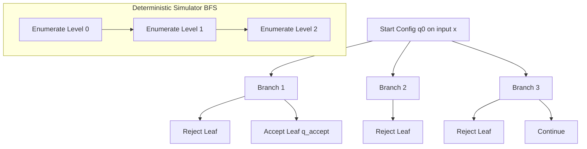
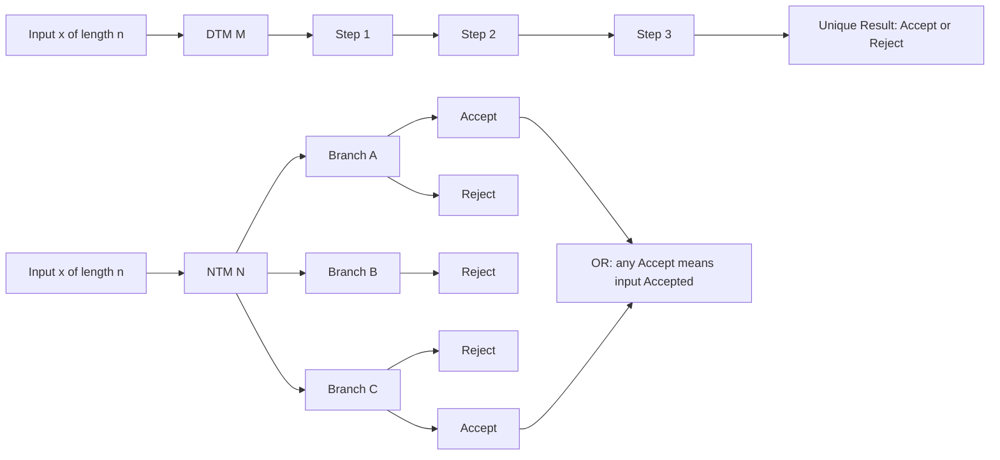
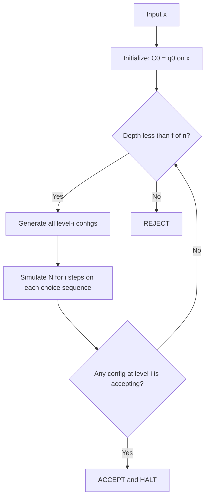

# Deterministic and nondeterministic models

<!-- SECTION_1_START -->
# Deterministic and Nondeterministic Models in Complexity Theory

## 1. Core Technical Definition

> [!IMPORTANT]
> **Deterministic Turing Machine (DTM):** A Deterministic Turing Machine is a 7-tuple $M = (Q, \Sigma, \Gamma, \delta, q_0, q_{accept}, q_{reject})$ where each configuration has **at most one** valid next configuration determined by the current state and the symbol being read. The transition function $\delta : Q \times \Gamma \rightarrow Q \times \Gamma \times \{L, R\}$ maps deterministically — meaning a single unique next step is chosen for every input.

> [!IMPORTANT]
> **Nondeterministic Turing Machine (NTM):** A Nondeterministic Turing Machine shares the same 7-tuple structure, but the transition function is modified to $\delta : Q \times \Gamma \rightarrow \mathcal{P}(Q \times \Gamma \times \{L, R\})$ — a relation rather than a function. At each step, the machine may choose **any one** of multiple valid next configurations, leading to a tree of possible computation paths.

### Intuitive Real-World Analogy

Imagine you are solving a maze. A **deterministic** solver walks through one corridor at a time — if they hit a dead end, they backtrack manually. A **nondeterministic** solver magically explores **all corridors in parallel** at every fork, and we say the maze is "solvable" if **at least one** parallel copy finds the exit. Determinism commits to one path; nondeterminism explores all possibilities simultaneously.

| Property | Deterministic Model | Nondeterministic Model |
|----------|--------------------|-----------------------|
| Transition rule | Function | Relation |
| Number of next states | Exactly one | Zero, one, or many |
| Computation structure | Linear sequence | Computation tree |
| Acceptance criterion | Accepts on the unique path | Accepts if **any** branch accepts |
| Determinism symbol | $1^{\text{st}}$ component of $Q \times \Gamma$ | Subset of $Q \times \Gamma$ |

> [!NOTE]
> **Syllabus Highlight:** The class **P** is defined as the set of languages decidable by a DTM in polynomial time $O(n^k)$, and **NP** is the set of languages decidable by an NTM in polynomial time. The famous unresolved problem $\mathbf{P \stackrel{?}{=} NP}$ asks whether every problem whose solution can be *verified* in polynomial time can also be *solved* in polynomial time.

> [!VISUALIZATION CONTROL]
> **Concept:** Computation tree of a nondeterministic Turing machine on a 3-symbol input.
> **GeoGebra / Desmos Input Equations (custom points):**
> * $P_0 = (0, 5)$ — Root configuration
> * $P_1 = (-3, 3),\ P_2 = (0, 3),\ P_3 = (3, 3)$ — Level-1 branches
> * $P_4 = (-4, 1),\ P_5 = (-2, 1),\ P_6 = (1, 1),\ P_7 = (2, 1),\ P_8 = (4, 1)$ — Level-2 leaves
> * Accepting leaves highlighted at $y = 1$ in solid color.
> **Visual Description:** A binary tree rooted at the start configuration, branching outward as the NTM makes nondeterministic choices. An accepting leaf represents a successful computation; the input is accepted if any leaf node is marked `ACCEPT`.

<!-- SECTION_1_END -->

<!-- SECTION_2_START -->
# Deep Theoretical Analysis & KTU High-Yield Formula Sheet

## 2. Structural Breakdown of the Models

### 2.1 Deterministic Turing Machine — Operational Anatomy
- **Tape alphabet** $\Gamma$ contains the input alphabet $\Sigma$ and the distinguished blank symbol $\sqcup$.
- **Transition function** $\delta(q, a) = (q', b, D)$ where $q \in Q$ is current state, $a \in \Gamma$ is read symbol, $q' \in Q$ is next state, $b \in \Gamma$ is write symbol, and $D \in \{L, R\}$ is head movement.
- A configuration is a complete snapshot: $C = u\,q\,v$ where $u, v \in \Gamma^*$ describe the tape contents left and right of the head, and $q \in Q$ is the current state.
- A DTM computes exactly **one** sequence of configurations $C_0 \rightarrow C_1 \rightarrow \cdots \rightarrow C_T$ for any given input $x$, ending in either $q_{accept}$ or $q_{reject}$.

### 2.2 Nondeterministic Turing Machine — Operational Anatomy
- The transition function becomes a *finite* subset: $\delta(q, a) = \{(q_1, b_1, D_1), (q_2, b_2, D_2), \ldots, (q_k, b_k, D_k)\}$.
- A configuration may yield **zero, one, or multiple** successor configurations.
- The NTM defines a **computation tree** whose root is the start configuration $C_0$ and whose leaves are halting configurations.
- **Acceptance Rule:** Input $x$ is accepted iff there exists **at least one** root-to-leaf path in the tree that ends in $q_{accept}$. The running time is the **depth of the shallowest accepting leaf** (i.e., the shortest accepting computation).

### 2.3 Time Complexity Formally
- For a DTM $M$, the **time** $t_M(x)$ is the number of steps before $M$ halts on $x$.
- For an NTM $N$, $t_N(x)$ is the minimum number of steps on any accepting branch (or undefined if no branch accepts).
- A language $L$ is in $\mathbf{DTIME}(f(n))$ if some DTM decides $L$ in $O(f(n))$ steps.
- A language $L$ is in $\mathbf{NTIME}(f(n))$ if some NTM decides $L$ in $O(f(n))$ steps on every branch.

### 2.4 The Simulation Theorem (NTM → DTM)
> [!IMPORTANT]
> **Core Theorem:** Every NTM $N$ running in time $f(n)$ can be simulated by a DTM $M$ running in time $O(c^{f(n)})$ for some constant $c$ depending on the maximum branching factor of $N$.

This exponential blow-up underlies the $\mathbf{P \subseteq NP \subseteq EXPTIME}$ hierarchy.

## 3. KTU Formula Sheet

| Symbol / Concept | Formal Definition | Use Case in Engineering |
|------------------|-------------------|-------------------------|
| $M = (Q, \Sigma, \Gamma, \delta, q_0, q_{accept}, q_{reject})$ | Deterministic TM 7-tuple | Reference model for all algorithms |
| $\delta : Q \times \Gamma \rightarrow Q \times \Gamma \times \{L, R\}$ | Deterministic transition | One-step deterministic move |
| $\delta : Q \times \Gamma \rightarrow \mathcal{P}(Q \times \Gamma \times \{L, R\})$ | Nondeterministic transition | Multi-branch computation |
| $C \vdash_M C'$ | Yields-in-one-step relation | Configuration evolution |
| $C \vdash_M^* C'$ | Yields-in-zero-or-more-steps | Reflexive-transitive closure |
| $L(M) = \{x \in \Sigma^* : (q_0, \underline{\sqcup} x) \vdash_M^* C_{accept}\}$ | Language accepted by $M$ | The decision problem solved by $M$ |
| $\mathbf{P} = \bigcup_k \mathbf{DTIME}(n^k)$ | Polynomial-time DTM class | Efficient solvability |
| $\mathbf{NP} = \bigcup_k \mathbf{NTIME}(n^k)$ | Polynomial-time NTM class | Efficient verifiability |
| $t_M(x) = $ number of steps of $M$ on $x$ | Time complexity of DTM | Algorithm running time |
| $t_N(x) = \min$ steps on accepting branch | Time complexity of NTM | Shortest accepting witness |

> [!IMPORTANT]
> **Critical Memory Aid:** "D" in DTIME stands for **Deterministic**, "N" in NTIME stands for **Nondeterministic**, and the class **P** is the cornerstone of tractable computation. Whenever KTU questions ask for the formal model, always specify that $\delta$ is a *function* (not a relation) for the deterministic case.

### Real-World Engineering Relevance
- **Compilers and Optimizers:** Deterministic models underpin parsing, register allocation, and code generation where the next state must be uniquely determined.
- **SAT Solvers and Cryptanalysis:** Nondeterministic abstraction inspires branch-and-bound, backtracking, and parallel-search heuristics used in real solvers.
- **Quantum Computing:** Nondeterministic Turing machines are conceptually related (though not identical) to quantum superposition — both explore multiple paths, but quantum models allow interference.
- **Formal Verification:** Model checking uses explicit-state search over nondeterministic transition systems to verify safety/liveness properties of hardware and protocols.

<!-- SECTION_2_END -->

<!-- SECTION_3_START -->
# Step-by-Step Derivations & Symbolic Implementation

## 4. Formal Derivation: Deterministic vs Nondeterministic Time Classes

### 4.1 Proving $\mathbf{P} \subseteq \mathbf{NP}$

**Step 1.** Let $L \in \mathbf{P}$. Then there exists a DTM $D$ and a polynomial $p(n)$ such that $D$ decides $L$ in $O(p(n))$ time on every input of length $n$.

**Step 2.** Construct an NTM $N$ that simply simulates $D$. Since $D$ is deterministic, its transition $\delta_D$ satisfies $\vert \delta_D(q, a) \vert = 1$ for every $(q, a)$ pair.

**Step 3.** Define $N$ with the nondeterministic relation $\delta_N(q, a) = \{\delta_D(q, a)\}$ — a singleton set. This is a valid NTM transition because it returns a finite subset of $Q \times \Gamma \times \{L, R\}$.

**Step 4.** On any input $x$, $N$ has exactly **one** computation branch, identical to $D$'s computation. Hence $N$ decides $L$ in time $O(p(n))$.

**Step 5.** Therefore $L \in \mathbf{NTIME}(p(n)) \subseteq \mathbf{NP}$, completing the proof that:

$$
\mathbf{P} \subseteq \mathbf{NP}
$$

> [!NOTE]
> **Examiner Tip:** When asked to justify $\mathbf{P} \subseteq \mathbf{NP}$ in an exam, the key trick is to make the NTM "ignore" its nondeterminism by collapsing every transition to a singleton set. The simulation cost is therefore **zero overhead**.

### 4.2 Proving the Simulation Bound $O(c^{f(n)})$

**Given:** An NTM $N$ with maximum branching factor $b \geq 2$ and time bound $f(n)$.

**Step 1.** A computation tree of depth $f(n)$ where each internal node has at most $b$ children contains at most $b^{f(n)}$ leaves.

**Step 2.** Construct a deterministic simulator $M$ that performs a **breadth-first search** on this tree.

**Step 3.** For each level $i$ from $0$ to $f(n)$:
- $M$ enumerates all configurations at depth $i$ by trying every possible sequence of nondeterministic choices of length $i$ (there are at most $b^i$ such sequences).
- For each sequence, $M$ simulates $N$ for $i$ steps and checks the resulting configuration.
- If any configuration is an accepting one, $M$ halts and accepts.

**Step 4.** Total configurations explored by $M$ is bounded by:

$$
\text{Total configurations} = \sum_{i=0}^{f(n)} b^{i} \;=\; \frac{b^{f(n)+1} - 1}{b - 1} \;=\; O(b^{f(n)})
$$

**Step 5.** Let $c = b$. Then the deterministic time is $O(c^{f(n)})$. In particular, for $f(n) = O(n^k)$ we get $O(c^{n^k}) = O(2^{n^k \log_2 c})$, placing the problem inside $\mathbf{EXPTIME}$.

### 4.3 Python Implementation — NTM Simulator Skeleton

```python
"""
Minimal Nondeterministic Turing Machine simulator.
Validates acceptance by exhaustive tree exploration.
"""

from typing import Dict, List, Set, Tuple, Optional

Transition = Tuple[str, str, str]   # (new_state, write_symbol, direction)
Config = Tuple[str, str, int]        # (tape_left, tape_right, state_index)


class NTM:
    def __init__(
        self,
        states: List[str],
        alphabet: Set[str],
        blank: str,
        transitions: Dict[Tuple[str, str], List[Transition]],
        start: str,
        accept: str,
        reject: str,
    ) -> None:
        self.states = states
        self.alphabet = alphabet
        self.blank = blank
        self.transitions = transitions
        self.start = start
        self.accept = accept
        self.reject = reject

    def step(
        self, tape_left: str, tape_right: str, state: str
    ) -> List[Config]:
        """Return all valid successor configurations."""
        if state in (self.accept, self.reject):
            return []
        head = tape_right[0] if tape_right else self.blank
        options = self.transitions.get((state, head), [])
        successors: List[Config] = []
        for new_state, write_sym, direction in options:
            new_right = tape_right[1:] if tape_right else ""
            if direction == "L":
                # move head left, prepend written symbol
                new_left = tape_left[:-1] if tape_left else ""
                new_right = tape_left[-1] + write_sym + new_right if tape_left else write_sym + new_right
                # If tape_left is empty, extend with blank
                if not tape_left:
                    new_right = self.blank + write_sym + new_right
            else:  # direction == "R"
                if not tape_left:
                    new_left = write_sym
                else:
                    new_left = tape_left + write_sym
                new_right = self.blank + new_right if direction == "R" else new_right
            successors.append((new_left, new_right, new_state))
        return successors

    def accepts(self, input_str: str, max_depth: int) -> Tuple[bool, int]:
        """
        Bounded-depth BFS over the computation tree.
        Returns (accepted, steps_used).
        """
        start_config: Config = (self.blank, self.blank + input_str, self.start)
        frontier: List[Config] = [start_config]

        for depth in range(max_depth + 1):
            next_frontier: List[Config] = []
            for cfg in frontier:
                left, right, state = cfg
                if state == self.accept:
                    return True, depth
                if state == self.reject:
                    continue
                for nxt in self.step(left, right, state):
                    nl, nr, ns = nxt
                    if ns == self.accept:
                        return True, depth + 1
                    if ns == self.reject:
                        continue
                    next_frontier.append(nxt)
            frontier = next_frontier
        return False, max_depth


# Example: a tiny NTM that accepts strings of the form 'a^n b^n c^n' via guessing partitions.
if __name__ == "__main__":
    sample = NTM(
        states=["q0", "q1", "q2", "qA", "qR"],
        alphabet={"a", "b", "c"},
        blank="_",
        transitions={
            ("q0", "a"): [("q0", "a", "R"), ("q1", "a", "R")],
            ("q1", "b"): [("q1", "b", "R"), ("q2", "b", "R")],
            ("q2", "c"): [("q2", "c", "R"), ("qA", "c", "R")],
        },
        start="q0",
        accept="qA",
        reject="qR",
    )
    accepted, steps = sample.accepts("abc", max_depth=10)
    print(f"Accepted: {accepted}, Steps: {steps}")
```

**Step-by-step explanation of the code:**

- `__init__` stores all components of the 7-tuple including the transition **relation** (a `Dict` whose values are `List[Transition]`).
- `step` enumerates all valid next configurations — this is the source of nondeterminism.
- `accepts` performs a **bounded BFS**, treating each level of the computation tree as a frontier. It returns the depth of the shallowest accepting configuration.
- The `if __name__ == "__main__":` block demonstrates usage on the input `abc` with a depth cap of 10.

<!-- SECTION_3_END -->

<!-- SECTION_4_START -->
# Structural Diagrams & Schematics

## 5. Computation Tree Architecture (Mermaid)



## 6. DTM vs NTM — Sequential Processing Topology

| Feature | DTM Linear Path | NTM Tree of Paths |
|---------|-----------------|-------------------|
| Branching factor | Exactly $1$ | At most $b$ |
| State storage | One current state | Frontier of states |
| Worst-case backtracking | Manual | Implicit via tree search |
| Acceptance check | Final state | Any leaf with $q_{accept}$ |
| Resource prediction | Precise | Upper-bounded by $b^{f(n)}$ |



## 7. Functional Architecture of the DTM Simulator of an NTM



<!-- SECTION_4_END -->

<!-- SECTION_5_START -->
# KTU 2024 Scheme Examination Question Bank & Topic Recap

## 8. KTU Examination Question Bank

### Part A — 3 Mark Questions

> **Question 1.** `[KTU University Exam - July 2024]`  
> **State the formal definition of a Deterministic Turing Machine.** Mention the role of the transition function $\delta$.  
> **Course Outcome:** CO1 | **Bloom Level:** Remember | **Marks:** 3

**Model Answer (Valuation Key):**
A Deterministic Turing Machine is a 7-tuple $M = (Q, \Sigma, \Gamma, \delta, q_0, q_{accept}, q_{reject})$ **[1 Mark]**, where $Q$ is a finite set of states, $\Sigma$ is the input alphabet, $\Gamma \supseteq \Sigma \cup \{\sqcup\}$ is the tape alphabet, $\sqcup$ is the blank symbol, $q_0$ is the start state, $q_{accept}$ and $q_{reject}$ are halting states, and $\delta : Q \times \Gamma \rightarrow Q \times \Gamma \times \{L, R\}$ is the transition function **[1 Mark]**. The transition function takes the current state and the symbol under the head and returns a unique next state, symbol to write, and head direction **[1 Mark]**.

---

> **Question 2.** `[KTU University Exam - Dec 2023]`  
> **Differentiate between deterministic and nondeterministic Turing machines with respect to the transition function and acceptance criterion.**  
> **Course Outcome:** CO1 | **Bloom Level:** Understand | **Marks:** 3

**Model Answer (Valuation Key):**

| Aspect | DTM | NTM |
|--------|-----|-----|
| Transition $\delta$ | Function: $Q \times \Gamma \rightarrow Q \times \Gamma \times \{L, R\}$ **[1 Mark]** | Relation: $Q \times \Gamma \rightarrow \mathcal{P}(Q \times \Gamma \times \{L, R\})$ **[1 Mark]** |
| Number of next moves | Exactly one | Zero, one, or many |
| Acceptance | Unique computation reaches $q_{accept}$ | Some branch reaches $q_{accept}$ **[1 Mark]** |

---

### Part B — 14 Mark Questions (ESE Module Internal Choice)

> **Question A.** `[KTU University Exam - July 2024]`  
> **(a)** Define the class **P** and the class **NP** in terms of deterministic and nondeterministic Turing machines. State one decision problem that lies in NP but is not known to be in P. **[7 Marks]**  
> **(b)** Show by construction that if $L \in \mathbf{P}$ then $L \in \mathbf{NP}$. Also, explain why the converse is unresolved. **[7 Marks]**  
> **Course Outcome:** CO2 | **Bloom Levels:** Understand (a) + Apply (b) | **Total Marks:** 14

#### Model Solution — Part (a)

**Definition of P:** $\mathbf{P} = \bigcup_{k \geq 1} \mathbf{DTIME}(n^k)$ — the class of languages decidable by a DTM in time polynomial in the input length **[1 Mark]**. A DTM $M$ decides $L$ in polynomial time if there exists a polynomial $p$ such that for every input $x$, $M$ halts within $p(\vert x \vert)$ steps **[1 Mark]**.

**Definition of NP:** $\mathbf{NP} = \bigcup_{k \geq 1} \mathbf{NTIME}(n^k)$ — the class of languages decidable by an NTM in time polynomial in the input length **[1 Mark]**. Equivalently, NP is the class of languages whose memberships can be **verified** in polynomial time given a certificate (a witness string) **[1 Mark]**.

**Example Problem — SUBSET-SUM:** Given integers $a_1, a_2, \ldots, a_n$ and a target $T$, decide whether some subset sums to $T$ **[1 Mark]**. A nondeterministic machine guesses a subset (in time $n$), sums the chosen elements, and accepts iff the sum equals $T$ (verifiable in polynomial time) **[1 Mark]**. SUBSET-SUM is in NP, but it is not currently known to be solvable in deterministic polynomial time **[1 Mark]**.

#### Model Solution — Part (b)

**Construction that $\mathbf{P} \subseteq \mathbf{NP}$:** Let $L \in \mathbf{P}$, witnessed by a DTM $D$ running in time $O(p(n))$ for some polynomial $p$ **[1 Mark]**. Define an NTM $N$ with the same tape and state set as $D$, but with the nondeterministic transition:

$$
\delta_N(q, a) = \big\{ \delta_D(q, a) \big\} \quad \text{for all } (q, a) \in Q \times \Gamma
$$

That is, $\delta_N$ is a singleton set whose only element is $D$'s deterministic next move **[1 Mark]**. By construction, $N$ is a valid NTM (its transition is a finite subset of $Q \times \Gamma \times \{L, R\}$) **[1 Mark]**. On any input $x$, $N$ has exactly one computation branch, identical to $D$'s run, so it halts within $O(p(n))$ steps **[1 Mark]**. Therefore $L \in \mathbf{NTIME}(p(n)) \subseteq \mathbf{NP}$ **[1 Mark]**.

**Why the converse is unresolved:** The simulation of an NTM by a DTM incurs an exponential blow-up (time $O(c^{f(n)})$ via BFS over the computation tree) **[1 Mark]**. No polynomial-time deterministic simulation of polynomial-time NTMs is currently known, so we cannot prove or disprove $\mathbf{P} = \mathbf{NP}$ with present techniques. Resolving this would require either a new polynomial-time algorithm for an NP-complete problem or a proof of lower bounds separating $\mathbf{P}$ from $\mathbf{NP}$ **[1 Mark]**.

> [!WARNING]
> **Examiner's Valuation Pitfall:** Many students forget to state explicitly that $\delta_N$ returns a **set** (a singleton here). Writing it as if it were a function loses the 1 mark for "valid NTM construction." Also, do not say "P equals NP" in the unresolved part — KTU evaluators deduct marks for asserting an unproven conjecture as fact.

---

> **Question B (Alternative Choice).** `[KTU University Exam - Dec 2023]`  
> **(a)** Define a nondeterministic Turing machine formally. Explain the concept of a computation tree and state the acceptance condition for an NTM. **[7 Marks]**  
> **(b)** An NTM $N$ runs in time $f(n) = n^2$ with maximum branching factor $b = 3$. Show that $N$ can be simulated by a deterministic TM $M$ in time $O(3^{n^2})$. Describe the BFS procedure used by $M$. **[7 Marks]**  
> **Course Outcome:** CO2 | **Bloom Levels:** Remember (a) + Apply (b) | **Total Marks:** 14

#### Model Solution — Part (a)

**Formal Definition of NTM:** An NTM is a 7-tuple $N = (Q, \Sigma, \Gamma, \Delta, q_0, q_{accept}, q_{reject})$ where all components are identical to a DTM except the transition **relation** $\Delta \subseteq (Q \times \Gamma \times Q \times \Gamma \times \{L, R\})$ **[1 Mark]**. Equivalently, $\Delta : Q \times \Gamma \rightarrow \mathcal{P}(Q \times \Gamma \times \{L, R\})$ is a finite-set-valued function, returning the set of all possible next moves **[1 Mark]**.

**Computation Tree:** For an input $x$, the root is the start configuration $C_0 = (q_0, \underline{\sqcup} x)$. Each internal node $C$ expands to all configurations $C'$ such that $(C, C') \in \Delta$ — i.e., $C \vdash_N C'$ **[1 Mark]**. A leaf is any node that is either an accepting or a rejecting configuration (no outgoing moves) **[1 Mark]**. Each root-to-leaf path represents one possible deterministic computation of $N$ on $x$ **[1 Mark]**.

**Acceptance Condition:** $N$ accepts $x$ if and only if **there exists at least one** path in the computation tree from the root to a configuration containing $q_{accept}$ **[1 Mark]**. The time $t_N(x)$ is the depth of the shallowest such accepting leaf **[1 Mark]**. If no accepting leaf exists, $N$ rejects (or loops forever, but for decidable languages it must halt on all branches) **[1 Mark]**.

#### Model Solution — Part (b)

**Bounded Computation Tree:** With branching factor $b = 3$ and depth bound $f(n) = n^2$, the computation tree has at most $3^{n^2}$ leaves **[1 Mark]**. A deterministic simulator $M$ can enumerate all of these leaves systematically using breadth-first search **[1 Mark]**.

**BFS Procedure of $M$:**  
1. Initialize a queue with the start configuration $C_0$ **[0.5 Mark]**.  
2. For $i = 0, 1, 2, \ldots, n^2$, expand every configuration in the queue: for each configuration $C$, generate all successors $C'$ with $(C, C') \in \Delta$ (at most $3$ per node) **[1 Mark]**.  
3. Enqueue all newly generated configurations at level $i+1$ and check whether any of them is in state $q_{accept}$ **[1 Mark]**.  
4. If an accepting configuration is found at level $d \leq n^2$, halt and accept; the number of steps taken is $d$ **[0.5 Mark]**.  
5. If after expanding level $n^2$ no accepting configuration has been found, halt and reject **[0.5 Mark]**.

**Time Analysis of $M$:** The number of configurations at level $i$ is at most $3^i$. The total configurations explored across all $n^2$ levels is:

$$
\sum_{i=0}^{n^2} 3^i \;=\; \frac{3^{n^2 + 1} - 1}{3 - 1} \;=\; \frac{3^{n^2 + 1} - 1}{2} \;=\; O(3^{n^2})
$$

**[2 Marks]** — for writing the geometric series and identifying the dominant term $3^{n^2}$.

Hence $M$ decides the same language as $N$ in deterministic time $O(3^{n^2})$, establishing the inclusion $\mathbf{NTIME}(n^2) \subseteq \mathbf{DTIME}(O(3^{n^2}))$ **[1 Mark]**.

> [!WARNING]
> **Examiner's Valuation Pitfall:** A common mistake is forgetting the **base case** ($i = 0$) in the geometric sum, which yields an off-by-one in the constant. Another frequent error is confusing $t_N(x)$ — the **shortest** accepting path — with the **longest** path. NTMs accept on the *shortest* accepting witness, not the worst case. Finally, do not omit the BFS enumeration loop in the procedure description; KTU evaluators allocate 2 marks specifically to the step-by-step BFS algorithm.

---

## 9. Topic Recap & Important Things to Remember

> [!IMPORTANT]
> **Quick-Reference Revision Checklist:**

- **DTM 7-tuple:** Always write $M = (Q, \Sigma, \Gamma, \delta, q_0, q_{accept}, q_{reject})$ and remember that $\delta$ is a *function* producing a unique next move.
- **NTM 7-tuple:** Same components, but $\delta$ is a *relation* (or equivalently, a finite-set-valued function) producing zero or more next moves.
- **Configuration:** Snapshot $C = u\,q\,v$ where $u$ is the tape left of the head, $v$ the tape right of the head (starting with the symbol under the head), and $q$ the current state.
- **Yields Relation:** $C \vdash_M C'$ means $M$ moves from $C$ to $C'$ in one step. The reflexive-transitive closure is $C \vdash_M^* C'$.
- **Computation Tree:** NTMs define a tree, not a path. Branches represent nondeterministic choices; leaves are halting configurations.
- **Acceptance:** NTM accepts iff at least one root-to-accepting-leaf path exists. Time = depth of shallowest accepting leaf.
- **Class P:** $\bigcup_k \mathbf{DTIME}(n^k)$ — solvable by a DTM in polynomial time.
- **Class NP:** $\bigcup_k \mathbf{NTIME}(n^k)$ — solvable by an NTM in polynomial time.
- **Containment:** $\mathbf{P} \subseteq \mathbf{NP}$ (proven by letting the NTM "ignore" its nondeterminism). The reverse is the famous unresolved $\mathbf{P \stackrel{?}{=} NP}$ problem.
- **Simulation Bound:** An NTM with branching factor $b$ and time $f(n)$ is simulated by a DTM in time $O(b^{f(n)})$ via BFS.
- **Geometric Series:** $\sum_{i=0}^{f(n)} b^i = O(b^{f(n)})$ — know how to derive this from the closed form $\frac{b^{f(n)+1}-1}{b-1}$.
- **Engineering Relevance:** Determinism = compilers, parsing, model checking. Nondeterminism = SAT solvers, brute-force search, cryptanalysis, quantum-inspired algorithms.
- **Common Pitfall:** Do **not** claim $\mathbf{P} = \mathbf{NP}$ in exams unless explicitly proved; KTU evaluators penalize unsourced assertions. Always specify whether your transition is a function (DTM) or a relation (NTM).

<!-- SECTION_5_END -->
