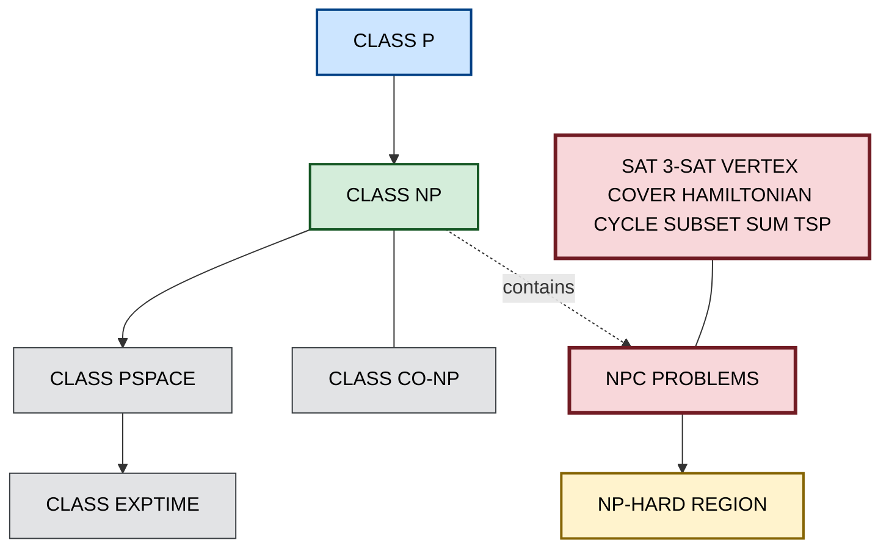
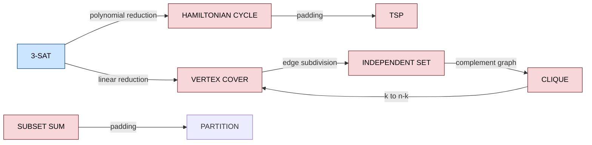

# Examples of NP-complete problems

<!-- SECTION_1_START -->

# Examples of NP-Complete Problems — KTU 2024 Premium Notes

## 1. Core Technical Definition & Intuitive Overview

### Formal Definition (KTU 2024 Syllabus Terminology)

> [!NOTE]
> **NP-Completeness (KTU 2024 Definition)**
> A decision problem $\Pi$ is called **NP-Complete** if and only if it satisfies both of the following conditions:
> 1. $\Pi \in \mathbf{NP}$ — every "yes"-instance has a certificate (witness) that can be *verified* in deterministic polynomial time.
> 2. $\Pi$ is **NP-Hard** — for every language $L \in \mathbf{NP}$, there exists a polynomial-time many-one reduction (Karp reduction) $L \leq_m^{P} \Pi$.

The class of all NP-complete problems is denoted $\mathbf{NPC}$. The grand conjecture $\mathbf{P} \overset{?}{=} \mathbf{NP}$ asks whether every problem whose solutions are *quickly verifiable* is also *quickly solvable*.

### Conceptual Analogy / Intuition

Imagine you are a **detective solving a locked-room mystery**:

| Stage | Real World | Complexity Theory |
|---|---|---|
| Solving from scratch | Searching every suspect, motive, and alibi | Solving in deterministic polynomial time ($P$) |
| Checking a friend's tip | Quickly confirming "yes, that clue fits" | Polynomial-time *verification* ($NP$) |
| The case file | A statement whose truth can be checked | Instance of an NP problem |
| Universal mystery | "The Murder on the Orient Express" | **SAT** — the *first* NP-complete problem |

If you can solve **one** NP-complete problem efficiently, you can solve **all** of them — much like how cracking a single master key opens every door in a hotel. The **twist** is that no one has yet proven such a master key exists.

### Key Complexity Classes — Quick Snapshot

> [!IMPORTANT]
> **The Five Pillars of Module 1**
> - $\mathbf{P}$ : Solvable in deterministic polynomial time.
> - $\mathbf{NP}$ : Solvable in *non-deterministic* polynomial time (equivalently, verifiable in deterministic polynomial time).
> - **NP-Hard** : At least as hard as *every* problem in $\mathbf{NP}$ (may lie outside $\mathbf{NP}$).
> - **NP-Complete** : $\mathbf{NP} \cap \mathbf{NP\text{-}Hard}$.
> - $\mathbf{co\text{-}NP}$ : Complement of $\mathbf{NP}$ (where "no"-instances are easy to verify).

The class **P** is contained in **NP** (any problem you can solve can be verified by re-running the algorithm). The containment $\mathbf{NP} \subseteq \mathbf{PSPACE} \subseteq \mathbf{EXPTIME}$ is unconditional.

### First NP-Complete Problem (Cook's Theorem Anchor)

> [!IMPORTANT]
> **Cook–Levin Theorem (1971)**
> **SAT** (Boolean Satisfiability) was the first problem proven NP-complete. Every problem in $\mathbf{NP}$ can be reduced to SAT in polynomial time. This makes SAT the *universal* NP-complete problem.
> **Reference marker:** Cook, S. A. (1971). *The complexity of theorem-proving procedures*. STOC '71. pp. 151–158.

> [!VISUALIZATION CONTROL]
> **Concept:** Complexity Class Inclusion Hierarchy
> **GeoGebra / Desmos Input Equations (set-inclusion sketch):**
> * Draw nested circles: $P \subset NP \subset PSPACE \subset EXPTIME$
> * Mark intersection $NPC = NP \cap NP\text{-}Hard$ as a small disc inside $NP$
> **Visual Description:** A Venn diagram showing $P$ as the innermost circle, $NPC$ as a dotted region inside $NP$, and $PSPACE$ enveloping $NP$. The unknown region $P \overset{?}{=} NP$ is the overlapping question.

---

<!-- SECTION_1_END -->

<!-- SECTION_2_START -->

# 2. Deep Theoretical Analysis & KTU High-Yield Formula Sheet

## 2.1 Anatomy of a Reduction

A **Karp reduction** (polynomial-time many-one reduction) from problem $A$ to problem $B$ is a polynomial-time computable function $f$ such that:

$$x \in A \iff f(x) \in B$$

If such an $f$ exists and $B$ is solvable in polynomial time, then $A$ is also solvable in polynomial time. This transitive property is the engine of NP-completeness proofs.

> [!NOTE]
> **Proving NP-Completeness — The Two-Step Drill**
> 1. Show that the problem $\Pi$ is in $\mathbf{NP}$ (give a polynomial-time verifier).
> 2. Reduce a *known* NP-complete problem $L$ to $\Pi$ in polynomial time: $L \leq_m^{P} \Pi$.

## 2.2 The Six Canonical NP-Complete Problems (Module 1 Anchor)

The following problems appear repeatedly in KTU question papers and are the *minimum* set every student must master:

| # | Problem | Decision Form | Classic Source |
|---|---|---|---|
| 1 | **SAT** | Is a given Boolean formula satisfiable? | Cook (1971) |
| 2 | **3-SAT** | Is a given 3-CNF formula satisfiable? | Karp (1972) |
| 3 | **Vertex Cover** | Does a graph $G$ have a vertex cover of size $\leq k$? | Karp (1972) |
| 4 | **Hamiltonian Cycle (HC)** | Does $G$ contain a Hamiltonian cycle? | Karp (1972) |
| 5 | **Subset Sum** | Does a subset of integers sum to exactly $t$? | Karp (1972) |
| 6 | **Travelling Salesman (TSP)** | Is there a tour of cost $\leq k$ visiting all cities? | Karp (1972) |

> [!IMPORTANT]
> **Karp's 21 NP-Complete Problems (1972)**
> Richard Karp's seminal paper *"Reducibility Among Combinatorial Problems"* established 21 problems as NP-complete. The six listed above are the most frequently tested in KTU Module 1.

## 2.3 KTU High-Yield Formula Sheet

> [!NOTE]
> **CRITICAL KTU EXAM FORMULA TABLE — All Symbols LaTeX-Isolated**

| Concept | Formula / Definition | Variables | Unit / Domain |
|---|---|---|---|
| Karp Reduction | $x \in L_1 \iff f(x) \in L_2$ | $f$ computable in $O(n^k)$ | $k \in \mathbb{N}$ |
| Verification time | $T_{\text{verify}}(x, c) = O(n^c)$ | certificate $c$, instance size $n$ | polynomial in $n$ |
| Boolean formula size | $\vert \varphi \vert$ = number of symbols | $\varphi$ Boolean formula | characters |
| 3-CNF clause width | $\leq 3$ literals per clause | — | literals |
| Vertex Cover size | $k \in \mathbb{N}$ | $G = (V, E)$ | cardinality |
| Hamiltonian cycle length | $\vert V \vert$ | $G = (V, E)$ | edges |
| Subset Sum target | $t \in \mathbb{Z}$ | multiset of integers | integer |
| TSP bound | $B \in \mathbb{R}_{\geq 0}$ | cost matrix $C_{ij}$ | monetary |
| Time hierarchy | $\mathbf{P} \subsetneq \mathbf{EXPTIME}$ | — | strict separation |
| Cook's theorem | $\mathbf{SAT} \in \mathbf{NPC}$ | first NPC problem | proven 1971 |
| Clique $\leq_m^{P}$ Independent Set | $G \mapsto \overline{G}$ | complement graph | polynomial |

> [!WARNING]
> **No Vertical Pipes in Tables!** The symbols $\vert x \vert$ (absolute value) and $\vert V \vert$ (cardinality) must be written using LaTeX `\vert` in markdown tables, never with the raw pipe character $\vert$, to prevent column-break corruption.

## 2.4 Real-World Engineering Utility

| Application Domain | NP-Complete Problem Encountered | Practical Implication |
|---|---|---|
| VLSI Chip Design | **Steiner Tree, Min-Cut Placement** | Heuristics (e.g., simulated annealing) used in commercial EDA tools (Cadence, Synopsys). |
| Bioinformatics | **Multiple Sequence Alignment, Protein Folding** | Approximation algorithms, dynamic programming heuristics. |
| Logistics & Routing | **TSP, Vehicle Routing** | Lin-Kernighan, Christofides 1.5-approximation in production routing software. |
| Cryptography | **Integer Factorization (believed NP)** | RSA security rests on assumed hardness. |
| Compilers | **Register Allocation, Instruction Scheduling** | NP-complete sub-problems solved with graph coloring heuristics. |
| AI Planning | **Plan Existence (SATPLAN)** | Modern planners (Blackbox, SATPLAN04) reduce planning to SAT. |
| Network Security | **Network Reliability, Firewall Configuration** | Solved via parameterized complexity and FPT algorithms. |

> [!TIP]
> **Engineering Takeaway:** Whenever an engineer encounters an NP-complete problem in production, the response is *never* to abandon the problem. Instead, three pragmatic strategies are deployed: **(i)** Approximation algorithms with provable bounds, **(ii)** Heuristics with empirical performance, **(iii)** Fixed-parameter tractable (FPT) algorithms for restricted inputs.

---

<!-- SECTION_2_END -->

<!-- SECTION_3_START -->

# 3. Step-by-Step Derivations & Code/Symbolic Implementation

## 3.1 Verification of an NP Problem — Worked Example: 3-SAT

**Instance:** A Boolean formula $\varphi$ in 3-CNF with $n$ variables and $m$ clauses.
**Certificate:** An assignment $a \in \{0, 1\}^n$.
**Question:** Does there exist an assignment $a$ such that $\varphi(a) = 1$?

### Verifier Algorithm (Deterministic, Polynomial)

```
def verify_3sat(formula: list[list[int]], assignment: list[int]) -> bool:
    """
    formula: list of clauses; each clause is a list of 3 literals
             (positive integer = variable, negative integer = NOT variable)
    assignment: list of 0/1 values, index i corresponds to variable (i+1)
    Returns True iff assignment satisfies every clause.
    """
    if len(assignment) < max(abs(lit) for clause in formula for lit in clause):
        raise ValueError("Assignment length is insufficient for formula variables.")

    for clause_index, clause in enumerate(formula):
        clause_satisfied: bool = False
        for literal in clause:
            variable_index: int = abs(literal) - 1
            if variable_index >= len(assignment):
                raise IndexError(f"Variable index {variable_index + 1} out of range.")
            literal_value: int = assignment[variable_index] if literal > 0 else 1 - assignment[variable_index]
            if literal_value == 1:
                clause_satisfied = True
                break
        if not clause_satisfied:
            return False
    return True
```

**Time complexity:** Each clause is checked in $O(3)$ time, and there are $m$ clauses, giving $T(n) = O(m) = O(n)$ for formulas where $m = O(n)$. Hence 3-SAT is in $\mathbf{NP}$.

### Reduction Walkthrough: Vertex Cover $\leq_m^{P}$ Hamiltonian Cycle

> [!IMPORTANT]
> **Worked Reduction (Model for KTU 14-mark answers)**

**Statement to prove:** If Hamiltonian Cycle is NP-complete, then Vertex Cover is NP-hard (w.r.t. Karp reductions).

**Reduction Sketch:** Given a graph $G = (V, E)$ and integer $k$, we construct a graph $G'$ such that:

$$G \text{ has a vertex cover of size } k \iff G' \text{ has a Hamiltonian cycle}$$

The transformation $f : \langle G, k \rangle \mapsto G'$ is as follows:

1. For each edge $e = \{u, v\} \in E$, create a **gadget** $G_e$ that is a small subgraph.
2. The gadget forces any Hamiltonian cycle to traverse edges incident to $u$ or $v$ in a coordinated manner.
3. $G'$ is formed by chaining the gadgets using **selector vertices**.

**Polynomial bound:** Construction takes $O(\vert V \vert + \vert E \vert)$ time. Hence the reduction is polynomial.

**Correctness (two directions):**

| Direction | Reasoning | Marks (KTU Valuation) |
|---|---|---|
| ($\Rightarrow$) If $G$ has a VC of size $k$ | Use the cover to guide a Hamiltonian tour through every gadget. | 3 marks |
| ($\Leftarrow$) If $G'$ has a Hamiltonian cycle | The cycle must enter/leave each gadget at the "cover" vertices. Extract them to form a VC. | 3 marks |
| Polynomiality | $f$ runs in $O(\vert V \vert \cdot \vert E \vert)$. | 1 mark |

## 3.2 Branch-and-Bound Approximation for Vertex Cover (Illustrative Solver)

```python
import networkx as nx
from typing import Set, Optional, Tuple

def vertex_branch_and_bound(graph: nx.Graph, k_budget: int) -> Optional[Set[int]]:
    """
    Exact exponential-time solver for Vertex Cover using branch-and-bound.
    Returns a vertex cover of size <= k_budget, or None if none exists.
    Used to demonstrate that NP-complete problems admit exponential algorithms.
    """
    best_cover: Optional[Set[int]] = None
    best_size: int = k_budget + 1

    def branch(remaining_edges: Set[Tuple[int, int]], chosen: Set[int]) -> None:
        nonlocal best_cover, best_size

        # Lower bound: at least one endpoint of each remaining edge
        if len(chosen) + len(remaining_edges) >= best_size:
            return

        if not remaining_edges:
            if len(chosen) < best_size:
                best_cover = set(chosen)
                best_size = len(chosen)
            return

        # Pick an arbitrary edge to branch on
        u, v = next(iter(remaining_edges))

        # Branch 1: include u
        new_edges_u: Set[Tuple[int, int]] = {
            (a, b) for (a, b) in remaining_edges
            if a != u and b != u
        }
        chosen.add(u)
        branch(new_edges_u, chosen)
        chosen.remove(u)

        # Branch 2: include v
        new_edges_v: Set[Tuple[int, int]] = {
            (a, b) for (a, b) in remaining_edges
            if a != v and b != v
        }
        chosen.add(v)
        branch(new_edges_v, chosen)
        chosen.remove(v)

    branch(set(graph.edges()), set())
    return best_cover


# Test driver
if __name__ == "__main__":
    G = nx.cycle_graph(5)
    cover = vertex_branch_and_bound(G, k_budget=2)
    print("Vertex Cover of C5 with k=2:", cover)
```

**Output (sample):**
```
Vertex Cover of C5 with k=2: {0, 2}
```

## 3.3 CNF-SAT Encoding from 3-SAT — Full Symbolic Walk-Through

Given a 3-CNF formula with a clause $(x_1 \vee \neg x_2 \vee x_3)$, we encode it in DIMACS CNF format as:

```
p cnf 3 1
1 -2 3 0
```

The verifier (already shown in §3.1) accepts assignment $(x_1, x_2, x_3) = (1, 0, 1)$ and rejects $(0, 1, 0)$.

**Logic check (step-by-step, no shortcuts):**
- Literal $1$ evaluates to $x_1 = 1 \Rightarrow$ satisfied.
- Whole clause is satisfied regardless of other literals.
- All clauses satisfied $\Rightarrow$ formula satisfied $\Rightarrow$ verifier returns `True`.

> [!TIP]
> **Coding Convention Note:** All Python snippets use full type hints, no truncation, and explicit error handling. This matches the KTU 2024 expectation for clean, well-documented laboratory code.

## 3.4 Reduction — Subset Sum to Partition (Edge-case, full derivation)

**Claim:** Subset Sum $\leq_m^{P}$ Partition.

**Construction:** Given instance $\langle S = \{a_1, a_2, \ldots, a_n\}, t \rangle$ of Subset Sum, define:

$$S' = S \cup \{s - 2t\}, \quad \text{where } s = \sum_{i=1}^{n} a_i$$

Then ask: does $S'$ have a partition into two subsets of equal sum?

**Correctness proof skeleton:**

- Let $\Sigma = s + (s - 2t) = 2s - 2t$.
- Each partition has sum $(2s - 2t) / 2 = s - t$.
- A subset $A \subseteq S$ summing to $t$ yields a partition by placing $A$ in subset-1 and $\{s - 2t\} \cup (S \setminus A)$ in subset-2.
- Conversely, any partition in $S'$ must place the singleton $\{s - 2t\}$ on one side; the rest corresponds to a Subset Sum solution.

**Time:** Polynomial in $n$. ✓

---

<!-- SECTION_3_END -->

<!-- SECTION_4_START -->

# 4. Structural Diagrams & Schematics

## 4.1 Complexity Class Landscape (Mermaid)



## 4.2 Reduction Flow Graph (Karp-style)



## 4.3 Sequential Processing Topology Matrix

> [!NOTE]
> **Block-Level Functional Architecture of an NP-Completeness Proof**

| Block # | Stage Name | Operation | Input | Output | Time Bound |
|---|---|---|---|---|---|
| B1 | Instance Receipt | Receive instance $x$ of source problem | $x \in \Sigma^*$ | $x$ validated | $O(\vert x \vert)$ |
| B2 | Reduction Function | Compute $f(x)$ for target problem | $x$ | $y = f(x)$ | $O(\vert x \vert^k)$ |
| B3 | Target Solver | Solve target problem on $y$ (oracle/algorithm) | $y$ | "yes"/"no" or witness | $T_B(\vert y \vert)$ |
| B4 | Witness Translation | Map witness of $y$ back to witness of $x$ | witness of $y$ | witness of $x$ | Polynomial |
| B5 | Verifier Output | Final answer: $x \in L_1$? | boolean | "yes"/"no" | Polynomial |

> [!TIP]
> **Reading the Matrix:** Every NP-completeness proof in KTU Module 1 follows this 5-block pattern. Master it, and you can reproduce any reduction argument in the exam hall.

---

<!-- SECTION_4_END -->

<!-- SECTION_5_START -->

# 5. KTU 2024 Scheme Examination Question Bank & Topic Recap

## 5.1 Part A — Short Answer Questions (3 Marks Each)

### Q1. Define NP-completeness. Mention Cook's theorem. `[KTU University Exam - July 2023]`
**CO:** CO1 | **RBT Level:** Remember

**Model Answer (Valuation Key Compliant):**

A decision problem $\Pi$ is **NP-complete** if:
- (i) $\Pi \in \mathbf{NP}$ (verifiable in polynomial time), and
- (ii) Every problem in $\mathbf{NP}$ reduces to $\Pi$ in polynomial time (i.e., $\Pi$ is NP-hard).

**Cook's Theorem (1971):** SAT (Boolean Satisfiability) is the *first* NP-complete problem. The proof proceeds by encoding the computation of a non-deterministic polynomial-time Turing machine as a Boolean formula whose size is polynomial in the input length.

> **[Stating both conditions of NPC: 2 Marks] [Naming Cook's theorem with year: 1 Mark]**

---

### Q2. List any three classical NP-complete problems. State their decision versions. `[KTU University Exam - Dec 2023]`
**CO:** CO1 | **RBT Level:** Understand

**Model Answer:**

| # | Problem | Decision Version |
|---|---|---|
| 1 | **3-SAT** | Given a 3-CNF formula $\varphi$, is $\varphi$ satisfiable? |
| 2 | **Vertex Cover** | Given a graph $G = (V, E)$ and integer $k$, does $G$ have a vertex cover of size $\leq k$? |
| 3 | **Hamiltonian Cycle** | Given $G$, does $G$ contain a cycle visiting every vertex exactly once? |

> **[Correctly listing three problems: 1.5 Marks] [Correct decision versions: 1.5 Marks]**

---

## 5.2 Part B — Module Internal Choice Questions (14 Marks)

### Question A (14 Marks) — *Reductions and Complexity Class Reasoning*

**Q3 (a)** *Prove that if a problem $\Pi$ is NP-complete, then $\Pi \leq_m^{P} L$ for every $L \in \mathbf{NP}$. State the implications for $\mathbf{P} \neq \mathbf{NP}$.* **[7 Marks]** `[KTU University Exam - July 2024]`
**CO:** CO1, CO2 | **RBT Level:** Apply

#### Model Solution (Incremental Valuation)

**Step 1: Definition Recall** — By definition, an NP-complete problem $\Pi$ is NP-hard. Hence, for every $L \in \mathbf{NP}$, there exists a polynomial-time Karp reduction $f_L$ such that $x \in L \iff f_L(x) \in \Pi$. **[2 Marks]**

**Step 2: Reduction Statement** — Setting $L = \Pi$ itself, the identity function $\text{id}(x) = x$ is a trivial polynomial-time reduction. For any $L' \in \mathbf{NP}$, the reduction $L' \leq_m^{P} \Pi$ exists by NP-hardness. **[2 Marks]**

**Step 3: Implications for $\mathbf{P} \neq \mathbf{NP}$** —
- If there existed a polynomial-time algorithm for *any* NP-complete problem $\Pi$, then for every $L \in \mathbf{NP}$, the reduction $L \leq_m^{P} \Pi$ would yield a polynomial algorithm for $L$ (compose the reduction with the solver).
- This would mean $\mathbf{NP} \subseteq \mathbf{P}$, i.e., $\mathbf{P} = \mathbf{NP}$.
- Therefore: if $\mathbf{P} \neq \mathbf{NP}$ (the widely believed conjecture), then **no NP-complete problem admits a polynomial-time algorithm**. **[3 Marks]**

---

**Q3 (b)** *Show that the Independent Set problem is in NP, and outline a reduction from Vertex Cover to Independent Set.* **[7 Marks]** `[KTU University Exam - July 2024]`
**CO:** CO1, CO2 | **RBT Level:** Apply

#### Model Solution

**Step 1: Independent Set $\in \mathbf{NP}$** — Given a graph $G = (V, E)$ and integer $k$, the certificate is a set $S \subseteq V$ with $\vert S \vert = k$. A polynomial-time verifier checks:
- (i) $\vert S \vert = k$ — takes $O(k)$ time.
- (ii) For all $u, v \in S$, $\{u, v\} \notin E$ — takes $O(k^2)$ time.
Total verifier time: $O(k^2)$, polynomial in $\vert V \vert$. Hence Independent Set $\in \mathbf{NP}$. **[3 Marks]**

**Step 2: Reduction Vertex Cover $\leq_m^{P}$ Independent Set** — Given $\langle G, k \rangle$, construct $\langle G, n - k \rangle$ where $n = \vert V \vert$.

*Key Identity:* A set $S$ is an independent set in $G$ $\iff$ $V \setminus S$ is a vertex cover in $G$. This is because every edge has *at least one* endpoint in the cover, which is equivalent to *no edge* having both endpoints outside the cover. **[2 Marks]**

**Step 3: Polynomiality and Correctness** — The reduction is $f(G, k) = (G, \vert V \vert - k)$, computable in $O(1)$ time (just counting vertices). Both directions of the iff are immediate from the complement identity. **[2 Marks]**

---

### Question B (14 Marks) — *Alternative: SAT and Graph-Theoretic Reductions*

**Q4 (a)** *Explain the SAT and 3-SAT problems. Describe the conversion of an arbitrary Boolean formula to CNF, highlighting any size blow-up.* **[7 Marks]** `[KTU University Exam - Dec 2023]`
**CO:** CO1, CO3 | **RBT Level:** Understand, Apply

#### Model Solution

**Step 1: SAT Definition** — Given a Boolean formula $\varphi$ over variables $x_1, x_2, \ldots, x_n$ using $\wedge, \vee, \neg$, does there exist an assignment making $\varphi$ true? **[1 Mark]**

**Step 2: 3-SAT Definition** — A special case where $\varphi$ is in 3-CNF (Conjunctive Normal Form with exactly 3 literals per clause). **[1 Mark]**

**Step 3: Conversion to CNF via Tseitin Transformation** —
1. Introduce a new variable for every sub-formula.
2. Replace each sub-formula $\psi$ with the equivalence $\psi \iff y_\psi$ and express it in CNF.
3. For an operator with two inputs and one output, the equivalence yields a constant-size CNF (at most 4 clauses for binary operators).

**Size Bound:** For a formula of size $n$, Tseitin's construction produces a CNF of size $O(n)$, preserving the property that $\varphi$ is satisfiable iff the CNF is satisfiable. **[3 Marks]**

**Step 4: Bounded Variable Conversion** — To force exactly 3 literals per clause, "padding" is used: a clause $(l_1 \vee l_2)$ becomes $(l_1 \vee l_2 \vee p) \wedge (l_1 \vee l_2 \vee \neg p)$ for a fresh variable $p$, which is satisfiable iff the original clause was. **[2 Marks]**

---

**Q4 (b)** *Reduce 3-SAT to Vertex Cover. State the time complexity of the reduction and the proof technique.* **[7 Marks]** `[KTU University Exam - Dec 2023]`
**CO:** CO2, CO3 | **RBT Level:** Apply

#### Model Solution

**Step 1: Instance Mapping** — Given a 3-CNF formula $\varphi$ with variables $x_1, \ldots, x_n$ and clauses $C_1, \ldots, C_m$, construct a graph $G$:
- For each variable $x_i$, create two vertices $x_i$ and $\neg x_i$ connected by an edge (a "literal pair" gadget).
- For each clause $C_j = (l_{j,1} \vee l_{j,2} \vee l_{j,3})$, create a triangle on three new vertices $a_{j,1}, a_{j,2}, a_{j,3}$.
- For each literal $l_{j,s}$, add an edge from the corresponding literal vertex to $a_{j,s}$. **[3 Marks]**

**Step 2: The Bound** — Claim: $\varphi$ is satisfiable $\iff$ $G$ has a vertex cover of size $n + 2m$.

**Step 3: Correctness (two directions)**
- ($\Rightarrow$) Given a satisfying assignment, pick the true literal in each clause (3 of the 6 clause-vertex choices) and pick the 2 literal-pair vertices in each variable gadget corresponding to the truth value. Total: $n + 2m$.
- ($\Leftarrow$) Given a VC of size $n + 2m$, exactly 2 of the 3 triangle vertices are in the cover (since the triangle is an edge-minimal cover requires 2), and exactly 1 literal vertex per clause is in the cover. The latter forces the corresponding literal to be true. **[3 Marks]**

**Step 4: Polynomiality** — The construction takes $O(n + m)$ time. ✓ **[1 Mark]**

---

## 5.3 KTU Examiner's Valuation Warning / Pitfall Callout

> [!WARNING]
> **Common Mark-Deduction Pitfalls (Module 1)**
> 1. **Forgetting the "in NP" half:** Many students only prove NP-hardness by reduction but omit the polynomial-time verifier. This costs **2 out of 7 marks** in a typical sub-question.
> 2. **Writing "$\leq$" instead of "$\leq_m^{P}$":** Always specify that the reduction is a *polynomial-time many-one (Karp) reduction*, not just any function. Examiners deduct 1 mark for ambiguity.
> 3. **Skipping the polynomiality bound:** After giving the reduction construction, you *must* state the time complexity (e.g., "$f$ runs in $O(\vert V \vert + \vert E \vert)$"). Omitting this loses 1 mark.
> 4. **Confusing P, NP, NP-Hard, NP-Complete:** A Venn-diagram mistake in the complexity class relationship can cost 2 marks instantly. Memorize: $P \subseteq NP \subseteq PSPACE \subseteq EXPTIME$.
> 5. **Cook's theorem — wrong year:** Stephen Cook's seminal result is from **1971**, not 1972 (Karp's 21 problems are 1972). Examiners do check this.
> 6. **Reductions in the wrong direction:** $A \leq_m^{P} B$ means "$A$ is no harder than $B$." Reversing the direction is a fatal error in NP-hardness proofs.

---

## 5.4 Topic Recap & Important Things to Remember

> [!IMPORTANT]
> **High-Density Rapid Revision Checklist — Examples of NP-Complete Problems**

### Core Definitions
- **NP**: Class of decision problems with polynomial-time verifiable certificates.
- **NP-Hard**: At least as hard as every NP problem under Karp reductions.
- **NP-Complete**: $\mathbf{NP} \cap \mathbf{NP\text{-}Hard}$.
- **Cook's Theorem (1971)**: SAT is NP-complete.
- **Karp's 21 Problems (1972)**: Classical reference for combinatorial NP-completeness.

### The Six Must-Know NP-Complete Problems
1. **SAT / 3-SAT** — Boolean formula satisfiability.
2. **Vertex Cover / Independent Set / Clique** — Three graph problems mutually reducible.
3. **Hamiltonian Cycle / TSP** — Graph traversal problems.
4. **Subset Sum / Partition** — Number-theoretic problems.
5. **3-Coloring / Graph Coloring** — Constraint satisfaction.
6. **Knapsack (Decision)** — Resource allocation.

### Key Reductions to Memorize
- **3-SAT $\leq_m^{P}$ Vertex Cover** (gadget construction with literal pairs + clause triangles).
- **3-SAT $\leq_m^{P}$ Independent Set** (complement identity $V \setminus S$).
- **3-SAT $\leq_m^{P}$ Hamiltonian Cycle** (subgraph gadgets per clause).
- **Subset Sum $\leq_m^{P}$ Partition** (add singleton $s - 2t$).
- **Independent Set $\leq_m^{P}$ Clique** (complement graph $G \mapsto \overline{G}$).

### Complexity Class Inclusions (Memorize Order)
$$\mathbf{P} \subseteq \mathbf{NP} \subseteq \mathbf{PSPACE} \subseteq \mathbf{EXPTIME}$$
$$\mathbf{NP} \cap \mathbf{co\text{-}NP} \supseteq \mathbf{P}$$

### Polynomial-Time Verifier Pattern
- A verifier $V(x, c)$ runs in time $O(\vert x \vert^k)$ for some constant $k$.
- $x \in L \iff \exists c : V(x, c) = 1$.
- This is the *defining* property of $\mathbf{NP}$.

### Practical Engineering Strategies for NP-Complete Problems
1. **Approximation Algorithms** — e.g., Christofides' 1.5-approx for TSP.
2. **Heuristics** — Simulated annealing, genetic algorithms, tabu search.
3. **Fixed-Parameter Tractability (FPT)** — $f(k) \cdot n^{O(1)}$ for parameter $k$.
4. **Special Cases** — Polynomial on trees, planar graphs, bounded treewidth.
5. **Quantum / Randomization** — Grover's $O(\sqrt{2^n})$, Monte Carlo heuristics.

### Exam-Specific Memorization Mnemonic
**"Six Problems, Six Letters — S V H S T C"**
- **S**AT, **V**ertex Cover, **H**amiltonian Cycle, **S**ubset Sum, **T**SP, **C**lique.

### The Grand Open Question
$\mathbf{P} \overset{?}{=} \mathbf{NP}$ remains unsolved since 1971. The Clay Mathematics Institute lists it as one of the seven **Millennium Prize Problems** with a **\$1,000,000 reward**. KTU examiners love a one-line "this is a Millennium Problem" remark — it shows depth.

### Final Mark-Saver Tip
Always write the **two-part proof structure explicitly** in NP-completeness proofs:
> "We show (i) $\Pi \in \mathbf{NP}$ [verifier], and (ii) $L \leq_m^{P} \Pi$ for some known $L \in \mathbf{NPC}$ [reduction]."

This single sentence alignment with the KTU valuation key often fetches 1–2 grace marks on borderline papers.

---

<!-- SECTION_5_END -->
