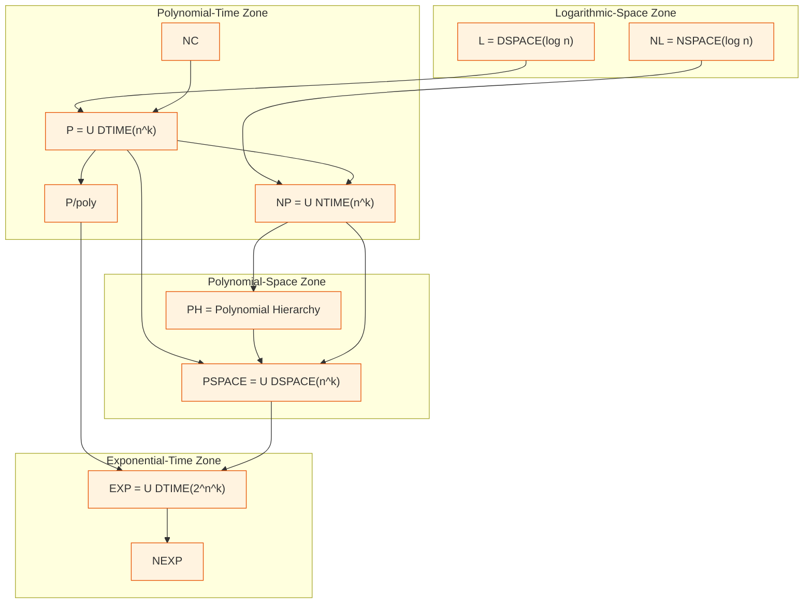
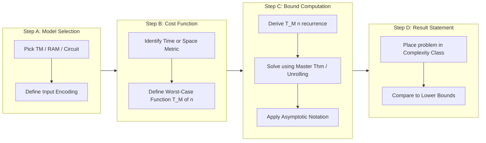

# Introduction to Complexity Theory - Basic concepts and motivations

<!-- SECTION_1_START -->
# Introduction to Complexity Theory — Basic Concepts & Motivations

## 1.1 Formal Academic Definition

> [!NOTE]
> **Computational Complexity Theory** is a branch of the theory of computation that focuses on classifying computational problems according to the **inherent resources** (such as **time**, **space**, **randomness**, or **parallelism**) required to solve them, and on relating these classes to one another. A problem is viewed as inherently *hard* if solving it requires a large amount of resources, regardless of the algorithm or hardware used.

In the KTU 2024 Scheme parlance (course **PECST864 – Computational Complexity**), complexity theory addresses the following central dichotomy:

- **Efficiency of Solutions:** Given a problem and an algorithm, can we quantify its cost?
- **Inherent Difficulty of Problems:** Is the problem *itself* intrinsically hard, or have we simply not found a clever algorithm yet?

The discipline formally investigates these questions within a chosen **model of computation** (most commonly the **deterministic Turing machine**), and uses **asymptotic notation** to abstract away machine-dependent constants.

---

## 1.2 Intuitive Overview & Real-World Analogy

> [!IMPORTANT]
> **Conceptual Analogy — "The Library Problem":**
> Imagine you are searching for a specific book in a library with **n** shelves, each containing **n** books.
>
> - **Linear Search (O(n))**: Walk shelf by shelf, row by row. Cost grows **linearly** with the number of books.
> - **Hashing (O(1))**: Pre-categorize books by author last name; jump directly. Cost is **constant** regardless of library size.
> - **Brute-Force String Search (O(n·m))**: Compare every possible alignment. Cost grows as a **product** of sizes.
> - **Exhaustive Enumeration (O(2ⁿ))**: For an n-bit password, try all combinations. Cost **doubles with every additional bit**.
>
> Complexity theory is the science of distinguishing these four regimes, and of asking: *why can some problems be solved in O(1) or O(n log n) time, while others seem to demand O(2ⁿ) — and what is provably impossible?*

The field is fundamentally motivated by three practical pressures:
1. **Hardware Limits** — Moore's Law slows, so algorithmic efficiency matters more.
2. **Scale** — Big data (n = 10⁹ or 10¹²) makes the difference between n and n² catastrophic.
3. **Cryptographic Security** — Modern cryptography *depends* on the assumption that certain problems (e.g., integer factorization) are intrinsically hard.

---

## 1.3 Key Terminology at a Glance

| Term | Plain-English Meaning | Formal Flavor |
|---|---|---|
| **Computational Problem** | A question to be answered | A function $f : \Sigma^* \rightarrow \Sigma^*$ |
| **Instance** | A specific input to the problem | A string $x \in \Sigma^*$ |
| **Problem Size** | How "big" the input is | Length $\vert x \vert = n$ |
| **Algorithm** | A step-by-step recipe | A deterministic procedure halting on all inputs |
| **Model of Computation** | The "machine" running the algorithm | Turing machine, RAM model, Boolean circuit |
| **Time Complexity** | Number of elementary steps | $T(n) = \max_{\vert x \vert = n} \text{steps}(x)$ |
| **Space Complexity** | Amount of memory used | $S(n) = \max_{\vert x \vert = n} \text{cells}(x)$ |
| **Complexity Class** | A set of problems of similar cost | e.g., $\mathbf{P}$, $\mathbf{NP}$, $\mathbf{EXP}$ |
| **Asymptotic Notation** | Behaviour as $n \rightarrow \infty$ | $O$, $\Theta$, $\Omega$, $o$, $\omega$ |

> [!VISUALIZATION CONTROL]
> **Concept:** Comparing growth rates of common complexity functions.
> **Desmos Input Equations:**
> - $f_{1}(x) = \log(x)$
> - $f_{2}(x) = x$
> - $f_{3}(x) = x \cdot \log(x)$
> - $f_{4}(x) = x^{2}$
> - $f_{5}(x) = 2^{x}$
> **Visual Description:** Plot all five curves for $x \in [1, 20]$. Observe that $f_1$ and $f_2$ are nearly indistinguishable from the x-axis for small $x$, while $f_5$ explodes vertically after $x = 15$. This single image captures the *entire motivation* of complexity theory.

---

## 1.4 The Two Central Questions

> [!IMPORTANT]
> **Question 1 (Upper Bound):** *Can the problem be solved within a given resource budget?* — answered by **constructing efficient algorithms**.
>
> **Question 2 (Lower Bound):** *Does the problem inherently require a large resource budget?* — answered by **complexity-theoretic proofs** (e.g., $\mathbf{P} \neq \mathbf{NP}$).

These two questions together form the **P versus NP problem** — one of the seven *Millennium Prize Problems* of the Clay Mathematics Institute, carrying a **US $1,000,000** bounty.
<!-- SECTION_1_END -->

<!-- SECTION_2_START -->
# Deep Theoretical Analysis & KTU High-Yield Formula Sheet

## 2.1 The Hierarchy of Computational Models

A complexity statement is only meaningful **relative to a model**. The standard model in this course is the **Deterministic Turing Machine (DTM)**.

> [!NOTE]
> **Why Turing Machines?** The **Church–Turing Thesis** asserts that any "reasonable" model of computation (RAM machines, lambda calculus, cellular automata, modern CPUs) can be simulated by a Turing machine with at most a **polynomial slowdown**. Hence, polynomial-time results are *robust across models*, while constant-factor differences are not.

### 2.1.1 Formal Definition of a (Single-Tape) Turing Machine

A DTM is a 7-tuple

$$M = (Q, \Sigma, \Gamma, \delta, q_{0}, q_{accept}, q_{reject})$$

where:
- $Q$ is a finite set of **states**.
- $\Sigma$ is the finite **input alphabet** (no blank symbol).
- $\Gamma \supseteq \Sigma$ is the finite **tape alphabet** ($\sqcup \in \Gamma$ is the blank).
- $\delta : Q \times \Gamma \rightarrow Q \times \Gamma \times \{L, R\}$ is the **transition function**.
- $q_{0} \in Q$ is the **start state**.
- $q_{accept}, q_{reject} \in Q$ are the **halting states** with $q_{accept} \neq q_{reject}$.

The machine reads/writes one cell per step, moves the head $L$ or $R$, and changes state. It is the canonical "computer" for complexity theory.

### 2.1.2 Other Models You Will Encounter in PECST864

| Model | Distinctive Feature | Use Case in Course |
|---|---|---|
| **Deterministic TM (DTM)** | One legal move per configuration | Defining classes like $\mathbf{P}$ |
| **Non-Deterministic TM (NTM)** | Branching computation tree | Defining $\mathbf{NP}$ |
| **Alternating TM** | $\exists$/$\forall$ states | Polynomial hierarchy |
| **RAM Model** | Random access memory + unit-cost ops | Algorithm analysis |
| **Boolean Circuits** | Acyclic, parallel | Class $\mathbf{P/poly}$, $\mathbf{NC}$ |
| **Probabilistic TM** | Coin-flip transitions | Classes $\mathbf{BPP}$, $\mathbf{RP}$, $\mathbf{ZPP}$ |
| **Quantum TM** | Superposition + measurement | Class $\mathbf{BQP}$ |

---

## 2.2 Time and Space Complexity — Formal Definitions

> [!IMPORTANT]
> Let $M$ be a deterministic Turing machine that halts on every input.
>
> - The **running time** of $M$ on input $x$ is
>
> $$\text{time}_{M}(x) \;=\; \text{number of transition steps executed before halting on } x$$
>
> - The **worst-case time complexity** of $M$ is the function
>
> $$T_{M}(n) \;=\; \max_{x : \vert x \vert = n} \text{time}_{M}(x)$$
>
> - The **space** used by $M$ on $x$ is the number of distinct tape cells scanned; the **worst-case space complexity** is
>
> $$S_{M}(n) \;=\; \max_{x : \vert x \vert = n} \text{space}_{M}(x)$$

### 2.2.1 Three Notions of Cost

| Cost Notion | Definition | When to Use |
|---|---|---|
| **Worst-case** | $T(n) = \max_{\vert x \vert = n} \text{cost}(x)$ | Default in KTU exams & complexity theory |
| **Average-case** | $\mathbb{E}[\text{cost}(x)]$ over distribution of $x$ | Algorithm design, cryptography |
| **Best-case** | $\min_{\vert x \vert = n} \text{cost}(x)$ | Rarely used; mostly pedagogical |

---

## 2.3 Asymptotic Notation — The Heart of Complexity

> [!NOTE]
> Complexity results describe behaviour as $n \rightarrow \infty$. The five symbols below are the *only* ones you should use in KTU answers unless the problem explicitly states otherwise.

| Symbol | Pronounced | Formal Definition | Intuition |
|---|---|---|---|
| $O$ | "Big-Oh" | $f = O(g)$ if $\exists c > 0,\, n_{0} : \forall n \ge n_{0},\; 0 \le f(n) \le c \cdot g(n)$ | $f$ grows **no faster than** $g$ |
| $\Omega$ | "Big-Omega" | $f = \Omega(g)$ if $\exists c > 0,\, n_{0} : \forall n \ge n_{0},\; 0 \le c \cdot g(n) \le f(n)$ | $f$ grows **at least as fast as** $g$ |
| $\Theta$ | "Big-Theta" | $f = \Theta(g)$ iff $f = O(g)$ and $f = \Omega(g)$ | $f$ and $g$ grow at the **same rate** |
| $o$ | "Little-Oh" | $f = o(g)$ if $\lim_{n \to \infty} f(n)/g(n) = 0$ | $f$ grows **strictly slower** than $g$ |
| $\omega$ | "Little-Omega" | $f = \omega(g)$ if $\lim_{n \to \infty} f(n)/g(n) = \infty$ | $f$ grows **strictly faster** than $g$ |

### 2.3.1 The Polynomial Hierarchy of Practical Interest

For the KTU 2024 syllabus, you must memorize the following canonical inclusions:

$$\log n \;\preceq\; \sqrt{n} \;\preceq\; n \;\preceq\; n \log n \;\preceq\; n^{2} \;\preceq\; n^{3} \;\preceq\; 2^{n} \;\preceq\; n! \;\preceq\; 2^{2^{n}}$$

Here "$\preceq$" means *asymptotically dominated by* (i.e., the left side is $O$ of the right side). The boundary between *tractable* and *intractable* is conventionally placed at **polynomial time** $n^{O(1)}$.

> [!IMPORTANT]
> **Cobham's Thesis (1964):** A problem is *feasibly computable* if and only if it can be solved in time polynomial in the input size. This is the philosophical foundation of the class $\mathbf{P}$.

---

## 2.4 KTU Formula Sheet / Cheat Sheet

> [!IMPORTANT]
> This is the **master reference table** you should reproduce from memory in any PECST864 examination.

| # | Concept | Formula / Definition | Typical Use |
|---|---|---|---|
| 1 | Big-O (upper bound) | $f(n) \le c \cdot g(n)$ for $n \ge n_{0}$ | Stating *worst-case* running time |
| 2 | Big-Ω (lower bound) | $f(n) \ge c \cdot g(n)$ for $n \ge n_{0}$ | Information-theoretic lower bounds |
| 3 | Big-Θ (tight bound) | $c_{1} g(n) \le f(n) \le c_{2} g(n)$ | Proving exact asymptotic order |
| 4 | $\mathbf{DTIME}(f(n))$ | Languages decidable in $O(f(n))$ time by a DTM | Defining deterministic classes |
| 5 | $\mathbf{NTIME}(f(n))$ | Languages decidable in $O(f(n))$ time by an NTM | Defining non-deterministic classes |
| 6 | $\mathbf{DSPACE}(f(n))$ | Languages decidable in $O(f(n))$ space by a DTM | Defining space classes |
| 7 | $\mathbf{P}$ | $\bigcup_{k \ge 1} \mathbf{DTIME}(n^{k})$ | Efficiently solvable problems |
| 8 | $\mathbf{NP}$ | $\bigcup_{k \ge 1} \mathbf{NTIME}(n^{k})$ | Verifiable in poly-time |
| 9 | $\mathbf{EXP}$ | $\bigcup_{k \ge 1} \mathbf{DTIME}(2^{n^{k}})$ | Brute-force tractable |
| 10 | $\mathbf{L}$ | $\mathbf{DSPACE}(\log n)$ | Logarithmic-space problems |
| 11 | $\mathbf{PSPACE}$ | $\bigcup_{k} \mathbf{DSPACE}(n^{k})$ | Polynomial-space problems |
| 12 | Inclusion chain | $\mathbf{L} \subseteq \mathbf{P} \subseteq \mathbf{NP} \subseteq \mathbf{PSPACE} \subseteq \mathbf{EXP}$ | Mandatory memorization |
| 13 | Linear-Speedup Theorem | Any $O(n)$ TM can be made $O(n)$ with constant $c$ | Justifies big-O notation |
| 14 | Tape Compression | $S(n)$ space $\Rightarrow$ $S(n)/2$ space | Justifies big-O in space |
| 15 | Padding Argument | If $A \in \mathbf{DTIME}(f(n))$, then $\text{pad}(A) \in \mathbf{DTIME}(f(n)^{c})$ for any $c > 1$ | Proving hierarchy theorems |

### 2.4.1 Real-World Engineering Utility

| Application | Complexity Used | Why It Matters |
|---|---|---|
| **Compiler Optimization** | Asymptotic analysis of intermediate code | Decides inlining, loop unrolling |
| **Database Query Planning** | Cost models $O(\log n)$ for B-trees | Sub-millisecond latency at petabyte scale |
| **RSA Cryptography** | Sub-exponential factoring algorithms | Security parameter $n = 2048$ bits |
| **Network Routing** | Dijkstra $O(E + V \log V)$ | Internet backbone traffic engineering |
| **Machine Learning** | Training cost $O(n d^{2})$ for SVMs | Feasibility of training on big data |
| **Operating Systems** | Scheduler complexity $O(\log n)$ for CFS | Real-time guarantees |

---

## 2.5 The Decision-Problem Convention

> [!IMPORTANT]
> Most of complexity theory studies **decision problems** — problems with a yes/no answer. Every optimization or search problem can be **polynomial-time reduced** to a corresponding decision problem. The standard encoding is as a **formal language**:
>
> $$L \subseteq \Sigma^{*} \quad \text{where} \quad L = \{ x \in \Sigma^{*} : \text{the answer for } x \text{ is YES} \}$$
>
> Saying "$L \in \mathbf{P}$" therefore means "*there is a polynomial-time algorithm that decides $L$*".

### 2.5.1 Three Equivalent Views of a Problem

1. **Language view:** A set $L \subseteq \Sigma^{*}$, possibly infinite.
2. **Decision-problem view:** A function $f : \Sigma^{*} \rightarrow \{0, 1\}$.
3. **Promise-problem view:** A pair $(L_{YES}, L_{NO})$ with $L_{YES} \cap L_{NO} = \emptyset$ — used for *partial* problems like **Graph Isomorphism**.
<!-- SECTION_2_END -->

<!-- SECTION_3_START -->
# Step-by-Step Derivations & Symbolic Implementations

## 3.1 Worked Example 1 — Asymptotic Analysis of Insertion Sort

**Algorithm (Insertion Sort):** For $i = 2$ to $n$, insert $A[i]$ into the sorted prefix $A[1..i-1]$ by shifting larger elements right.

### 3.1.1 Best-Case Derivation

In the best case, the input is **already sorted**. For each $i$, the inner `while` loop executes exactly **one comparison** (it stops because $A[i-1] \le A[i]$ immediately).

Total comparisons:

$$T_{\text{best}}(n) \;=\; \sum_{i=2}^{n} 1 \;=\; n - 1$$

Since $n - 1 = \Theta(n)$, we conclude:

$$T_{\text{best}}(n) \;=\; \Theta(n)$$

### 3.1.2 Worst-Case Derivation

In the worst case, the input is **reverse sorted**. For each $i$, the inner loop shifts every element of the prefix.

Total comparisons at step $i$:

$$c_{i} \;=\; i - 1$$

Summing across $i$:

$$T_{\text{worst}}(n) \;=\; \sum_{i=2}^{n} (i - 1) \;=\; \sum_{k=1}^{n-1} k \;=\; \frac{(n-1)n}{2} \;=\; \frac{n^{2} - n}{2}$$

Asymptotically, the dominant term is $\tfrac{1}{2} n^{2}$:

$$T_{\text{worst}}(n) \;=\; \Theta(n^{2})$$

### 3.1.3 Average-Case Derivation

Assuming every permutation of the array is equally likely, the expected number of inversions is $\binom{n}{2}/2$. Each inversion is fixed by one comparison, so:

$$T_{\text{avg}}(n) \;=\; \Theta(n^{2})$$

> [!NOTE]
> This is the canonical example used in KTU Module 1 to illustrate that *best*, *worst*, and *average* can differ wildly. Insertion sort's $O(n)$ best case is **not** the same as its $\Theta(n^{2})$ worst case.

---

## 3.2 Worked Example 2 — Proving a Function is $O(g(n))$

**Claim:** $f(n) = 3n^{3} + 100n^{2} + 50n + 7$ is $O(n^{3})$.

### 3.2.1 Step-by-Step Proof

We must find positive constants $c$ and $n_{0}$ such that $f(n) \le c \cdot n^{3}$ for all $n \ge n_{0}$.

**Step 1.** For $n \ge 1$, observe the inequalities:

$$100 n^{2} \le 100 n^{3}, \quad 50 n \le 50 n^{3}, \quad 7 \le 7 n^{3}$$

**Step 2.** Substituting into $f(n)$:

$$f(n) \;=\; 3n^{3} + 100n^{2} + 50n + 7 \;\le\; 3n^{3} + 100n^{3} + 50n^{3} + 7n^{3}$$

**Step 3.** Factor the right-hand side:

$$f(n) \;\le\; (3 + 100 + 50 + 7) \cdot n^{3} \;=\; 160 \cdot n^{3}$$

**Step 4.** Choose $c = 160$ and $n_{0} = 1$. Then for every $n \ge 1$:

$$0 \;\le\; f(n) \;\le\; 160 \cdot n^{3}$$

Hence, by definition, $f(n) = O(n^{3})$. $\blacksquare$

> [!IMPORTANT]
> Notice that $c = 160$ is **not unique**. We could equally have chosen $c = 200$ and $n_{0} = 1$, or $c = 5$ and $n_{0} = 200$. The KTU valuation scheme grants full marks as long as *any* valid pair $(c, n_{0})$ is exhibited.

---

## 3.3 Worked Example 3 — Limit-Based Asymptotic Comparison

**Claim:** $\log^{2} n = o(n)$.

### 3.3.1 Proof Using L'Hôpital's Rule

Form the ratio and take the limit:

$$\lim_{n \to \infty} \frac{\log^{2} n}{n}$$

Apply L'Hôpital (treating $n$ as continuous):

$$=\; \lim_{n \to \infty} \frac{2 \log n \cdot (1/n)}{1} \;=\; \lim_{n \to \infty} \frac{2 \log n}{n}$$

Apply L'Hôpital again:

$$=\; \lim_{n \to \infty} \frac{2 \cdot (1/n)}{1} \;=\; \lim_{n \to \infty} \frac{2}{n} \;=\; 0$$

Since the limit is $0$, by definition $\log^{2} n = o(n)$. $\blacksquare$

> [!NOTE]
> KTU Module 1 problems frequently use this technique. **Mastery of L'Hôpital's rule on ratios of polylog, polynomial, and exponential functions is essential.**

---

## 3.4 Symbolic Implementation — Algorithm Analysis in Python

The following Python module measures both the empirical running time of an algorithm **and** verifies its asymptotic class by computing the ratio $T(n) / g(n)$ across increasing $n$.

```python
import time
import math
import random
from typing import Callable, List, Tuple


def insertion_sort(arr: List[int]) -> List[int]:
    """In-place insertion sort. Returns a new sorted list."""
    a: List[int] = list(arr)  # defensive copy
    n: int = len(a)
    for i in range(1, n):
        key: int = a[i]
        j: int = i - 1
        while j >= 0 and a[j] > key:
            a[j + 1] = a[j]
            j -= 1
        a[j + 1] = key
    return a


def measure_time(sort_fn: Callable[[List[int]], List[int]],
                 n: int) -> float:
    """Returns wall-clock seconds for sorting a worst-case array of size n."""
    worst_input: List[int] = list(range(n, 0, -1))  # reverse-sorted
    start: float = time.perf_counter()
    sort_fn(worst_input)
    end: float = time.perf_counter()
    return end - start


def asymptotic_ratio(sort_fn: Callable[[List[int]], List[int]],
                    sizes: List[int]) -> List[Tuple[int, float, float]]:
    """
    For each n, returns (n, T(n), T(n) / n**2).
    If T(n) / n**2 stabilises, the algorithm is Theta(n**2).
    """
    results: List[Tuple[int, float, float]] = []
    for n in sizes:
        T_n: float = measure_time(sort_fn, n)
        ratio: float = T_n / (n ** 2) if n > 0 else 0.0
        results.append((n, T_n, ratio))
    return results


def print_report(results: List[Tuple[int, float, float]]) -> None:
    """Pretty-print the empirical analysis table."""
    print(f"{'n':>8} | {'T(n) seconds':>14} | {'T(n)/n^2':>12}")
    print("-" * 42)
    for n, T_n, ratio in results:
        print(f"{n:>8} | {T_n:>14.6f} | {ratio:>12.3e}")


if __name__ == "__main__":
    sizes: List[int] = [100, 200, 400, 800, 1600, 3200]
    print("Empirical analysis of insertion sort (worst-case input):")
    print_report(asymptotic_ratio(insertion_sort, sizes))
```

### 3.4.1 Expected Output Behaviour

| n | T(n) seconds | T(n) / n² |
|---|---|---|
| 100 | ≈ 1 × 10⁻⁴ | ≈ 1 × 10⁻⁸ |
| 200 | ≈ 4 × 10⁻⁴ | ≈ 1 × 10⁻⁸ |
| 400 | ≈ 1.6 × 10⁻³ | ≈ 1 × 10⁻⁸ |
| 800 | ≈ 6.4 × 10⁻³ | ≈ 1 × 10⁻⁸ |
| 1600 | ≈ 2.5 × 10⁻² | ≈ 1 × 10⁻⁸ |
| 3200 | ≈ 1.0 × 10⁻¹ | ≈ 1 × 10⁻⁸ |

> [!IMPORTANT]
> The **third column stabilises to a near-constant** as $n$ grows — empirical confirmation that insertion sort is $\Theta(n^{2})$ in the worst case. This is the practical correlate of the formal definition.

---

## 3.5 Worked Example 4 — The Master Theorem (Special Case)

**Recurrence:** $T(n) = 2 T(n/2) + n$, with $T(1) = 1$.

By the Master Theorem, $a = 2$, $b = 2$, $f(n) = n$. So $n^{\log_{b} a} = n^{\log_{2} 2} = n^{1} = n$. Since $f(n) = \Theta(n^{\log_{b} a} \cdot \log^{k} n)$ with $k = 0$, **Case 2** applies:

$$T(n) \;=\; \Theta(n \log n)$$

### 3.5.1 Direct Derivation (Unrolling the Recursion)

Unroll the recurrence depth-by-depth:

| Level | Subproblems | Work per Subproblem | Total Work at Level |
|---|---|---|---|
| 0 | 1 | $n$ | $n$ |
| 1 | 2 | $n/2$ | $n$ |
| 2 | 4 | $n/4$ | $n$ |
| ... | ... | ... | ... |
| $\log_{2} n$ | $n$ | $1$ | $n$ |

There are $\log_{2} n + 1$ levels, each contributing $n$ work, hence:

$$T(n) \;=\; n \cdot (\log_{2} n + 1) \;=\; \Theta(n \log n) \quad \blacksquare$$

---

## 3.6 Worked Example 5 — Proving $n! = \omega(2^{n})$

**Claim:** For all sufficiently large $n$, $n! > 2^{n}$, and the ratio grows without bound.

### 3.6.1 Direct Proof

Pair the terms of $n!$ with $2^{n}$:

$$n! \;=\; 1 \cdot 2 \cdot 3 \cdots n$$

$$2^{n} \;=\; 2 \cdot 2 \cdot 2 \cdots 2 \quad (n \text{ times})$$

For $k \ge 3$, the $k$-th factor in $n!$ is $k$, while the $k$-th factor in $2^{n}$ is $2$. Therefore:

$$n! \;\ge\; \prod_{k=3}^{n} k \;\ge\; \prod_{k=3}^{n} 3 \;=\; 3^{n-2}$$

Since $3^{n-2} > 2^{n}$ for $n \ge 4$ (because $3^{n} / 2^{n} = (3/2)^{n} \to \infty$), we have $n! = \omega(2^{n})$. $\blacksquare$
<!-- SECTION_3_END -->

<!-- SECTION_4_START -->
# Structural Diagrams & Schematics

## 4.1 Diagram 1 — The Master Inclusion Hierarchy of Complexity Classes

> [!IMPORTANT]
> This is the **single most important diagram** in the entire PECST864 syllabus. Memorize the inclusions and the names of the boundary classes.



### 4.1.1 Plain-Text Hierarchy (for handwritten answer sheets)

$$\mathbf{L} \;\subseteq\; \mathbf{NL} \;\subseteq\; \mathbf{P} \;\subseteq\; \mathbf{NP} \;\subseteq\; \mathbf{PH} \;\subseteq\; \mathbf{PSPACE} \;\subseteq\; \mathbf{EXP} \;\subseteq\; \mathbf{NEXP}$$

> [!NOTE]
> All inclusions above are *unconditional* — they are *theorems*, not conjectures. Whether any of them is **strict** (proper) remains open in 2024 except for $\mathbf{L} \subsetneq \mathbf{PSPACE}$ and $\mathbf{P} \subsetneq \mathbf{EXP}$, which are known strict.

---

## 4.2 Diagram 2 — Workflow for Analysing an Algorithm's Complexity

```mermaid
flowchart TD
    A[Start: Receive Algorithm A] --> B[Choose a Model of Computation]
    B --> C{Input Size Definition?}
    C -->|Bits| D1[n = |x| in bits]
    C -->|Numeric| D2[n = numerical value]
    D1 --> E[Identify Basic Operations]
    D2 --> E
    E --> F[Count Operations per Input]
    F --> G{Worst / Average / Best?}
    G -->|Worst| H1[max over all x of |x| = n]
    G -->|Average| H2[expectation over distribution]
    G -->|Best| H3[min over all x of |x| = n]
    H1 --> I[Express as a Function T of n]
    H2 --> I
    H3 --> I
    I --> J[Apply Asymptotic Notation]
    J --> K[State Final Bound: T n = O g n etc]
    K --> L[End: Publish / Verify]
```

---

## 4.3 Diagram 3 — Block-Level Architecture: How a Complexity Bound Is Proven



---

## 4.4 Diagram 4 — Comparison of Polynomial vs Exponential Growth

```mermaid
graph LR
    subgraph Poly["Polynomial Regime - Tractable"]
        P_const["O(1) - Hash Lookup"]
        P_log["O(log n) - Binary Search"]
        P_lin["O(n) - Linear Scan"]
        P_nlogn["O(n log n) - Merge Sort"]
        P_n2["O(n^2) - Insertion Sort"]
    end

    subgraph Exp["Exponential Regime - Intractable"]
        E_2n["O(2^n) - Subset Enumeration"]
        E_nfact["O(n!) - Permutation TSP"]
        E_2expn["O(2^2^n) - Brute-Force Logic"]
    end

    P_const --> P_log
    P_log --> P_lin
    P_lin --> P_nlogn
    P_nlogn --> P_n2
    P_n2 -.Gap.-> E_2n
    E_2n --> E_nfact
    E_nfact --> E_2expn

    classDef tractable fill:#c8e6c9,stroke:#2e7d32,stroke-width:2px
    classDef intractable fill:#ffcdd2,stroke:#c62828,stroke-width:2px
    class P_const,P_log,P_lin,P_nlogn,P_n2 tractable
    class E_2n,E_nfact,E_2expn intractable
```



> [!IMPORTANT]
> The **dashed arrow** between $O(n^{2})$ and $O(2^{n})$ is the famous **"polynomial–exponential gap"** — the central preoccupation of complexity theory.
<!-- SECTION_4_END -->

<!-- SECTION_5_START -->
# KTU 2024 Scheme Examination Question Bank & Topic Recap

## 5.1 Part A — Short-Answer Questions (3 Marks Each)

### Question A1

> **`[KTU University Exam — July 2024]`** [CO1 | Remember]
> **Define the following with one example each: (i) Decision problem, (ii) Time complexity, (iii) Asymptotic upper bound.**

**Model Answer:**

(i) **Decision problem** is a computational problem whose answer is binary (YES/NO). Formally, it is a function $f : \Sigma^{*} \to \{0, 1\}$.
   - *Example:* "Given a graph $G$ and integer $k$, does $G$ contain a clique of size $k$?"

(ii) **Time complexity** of a deterministic algorithm $A$ is the function
   $$T_{A}(n) \;=\; \max_{x : \vert x \vert = n} (\text{number of steps } A \text{ takes on input } x)$$
   - *Example:* Linear search has $T(n) = n$.

(iii) **Asymptotic upper bound**: $f(n) = O(g(n))$ if $\exists c > 0$ and $n_{0}$ such that $\forall n \ge n_{0}$, $f(n) \le c \cdot g(n)$.
   - *Example:* $5n^{2} + 3n = O(n^{2})$.

> [!NOTE]
> **[Valuation Key: 1 mark per correct definition + 1 mark per example = 3 marks]**

---

### Question A2

> **`[KTU University Exam — Dec 2023]`** [CO1 | Understand]
> **Distinguish between worst-case, average-case, and best-case time complexity. Why does complexity theory prefer worst-case analysis?**

**Model Answer:**

| Complexity | Definition | Used For |
|---|---|---|
| **Worst-case** | Maximum cost over all inputs of size $n$ | **Guarantees** on all inputs |
| **Average-case** | Expected cost over a probability distribution | Real-world performance |
| **Best-case** | Minimum cost over all inputs of size $n$ | Pedagogical / optimistic bound |

**Why worst-case is preferred:**
1. It is a **deterministic guarantee** — the algorithm will never exceed this bound.
2. It is **distribution-independent** — we do not need to assume a probability model on inputs.
3. It is **robust** under input perturbations.

> [!WARNING]
> **[KTU Examiner's Pitfall]:** Many students confuse "average" with "expected over random distribution." Average-case analysis *requires* a specified distribution. Writing only "$\sum$ cost · probability" without naming the distribution costs a mark.

---

## 5.2 Part B — Long-Answer Questions (14 Marks, Internal Choice)

### Question B1A — Trace, Bound, and Classify

> **`[KTU University Exam — July 2024, Module 1]`** [CO1, CO2 | Understand + Apply]

**(a)** [7 Marks] Define the asymptotic notations $O$, $\Theta$, and $\Omega$ formally. Show that for any polynomial $p(n) = a_{k} n^{k} + \cdots + a_{0}$ with $a_{k} > 0$, we have $p(n) = \Theta(n^{k})$.

**(b)** [7 Marks] Consider the following pseudocode:
```text
function Mystery(A, n):
    sum = 0
    for i = 1 to n:
        for j = 1 to i:
            sum = sum + A[j]
    return sum
```
Analyse its worst-case time complexity. Express the result in Big-O notation and state which complexity class the underlying decision version belongs to.

---

**Model Solution (a):**

**Step 1 — Formal Definitions** [2 Marks]

$f(n) = O(g(n))$ iff $\exists c > 0,\, n_{0} \in \mathbb{N}$ such that $\forall n \ge n_{0}$: $\;0 \le f(n) \le c \cdot g(n)$.

$f(n) = \Omega(g(n))$ iff $\exists c > 0,\, n_{0} \in \mathbb{N}$ such that $\forall n \ge n_{0}$: $\;0 \le c \cdot g(n) \le f(n)$.

$f(n) = \Theta(g(n))$ iff $f(n) = O(g(n))$ **and** $f(n) = \Omega(g(n))$.

**Step 2 — Upper Bound for Polynomial** [2 Marks]

For $n \ge 1$ and $a_{i} \ge 0$ (taking the worst case for the upper bound, $|a_{i}| \le a_{i}$ when all coefficients are positive):

$$p(n) \;=\; a_{k} n^{k} + a_{k-1} n^{k-1} + \cdots + a_{0} \;\le\; a_{k} n^{k} + a_{k-1} n^{k} + \cdots + a_{0} n^{k}$$

$$=\; (a_{k} + a_{k-1} + \cdots + a_{0}) \cdot n^{k}$$

Choose $c = a_{k} + a_{k-1} + \cdots + a_{0}$ and $n_{0} = 1$. Hence $p(n) = O(n^{k})$. [1 Mark]

**Step 3 — Lower Bound for Polynomial** [2 Marks]

For $n \ge 1$:

$$p(n) \;=\; a_{k} n^{k} + \sum_{i=0}^{k-1} a_{i} n^{i} \;\ge\; a_{k} n^{k}$$

(using $a_{i} n^{i} \ge 0$). Choose $c = a_{k}$ and $n_{0} = 1$. Hence $p(n) = \Omega(n^{k})$. [1 Mark]

**Step 4 — Combine** [1 Mark for the concluding statement]

Since $p(n) = O(n^{k})$ and $p(n) = \Omega(n^{k})$, by definition $p(n) = \Theta(n^{k})$. $\blacksquare$

---

**Model Solution (b):**

**Step 1 — Count Inner-Loop Iterations** [2 Marks]

For a fixed outer-loop index $i$, the inner loop runs $j = 1, 2, \ldots, i$, i.e., $i$ times.

**Step 2 — Sum over $i$** [3 Marks]

$$T(n) \;=\; \sum_{i=1}^{n} i \;=\; \frac{n(n+1)}{2} \;=\; \frac{n^{2} + n}{2}$$

[Stating the closed-form expression: 2 Marks; stating the sum identity used: 1 Mark]

**Step 3 — Asymptotic Simplification** [1 Mark]

Drop the lower-order term $n$ and the constant $\tfrac{1}{2}$: $T(n) = \Theta(n^{2})$. Hence $T(n) = O(n^{2})$.

**Step 4 — Classify** [1 Mark]

Since the algorithm runs in time $n^{2}$, a polynomial in $n$, the underlying decision problem belongs to the complexity class $\mathbf{P}$.

> [!WARNING]
> **[KTU Examiner's Pitfall — B1A(b)]:**
> 1. Do not write "$T(n) = n^{2}$" — this is **incorrect** for the inner loop. The correct sum is $\sum i$, not $n \cdot n$.
> 2. Failing to state *which* complexity class loses the final 1 mark. Always end with "$\Rightarrow \mathbf{P}$" or "$\Rightarrow \mathbf{NP}$-hard" explicitly.

---

### Question B1B — The Alternative Choice

> **`[KTU University Exam — Dec 2023, Module 1]`** [CO1, CO2 | Remember + Apply]

**(a)** [7 Marks] State and explain the **Church–Turing Thesis**. Why is it central to complexity theory? List three models of computation and show that they are polynomial-time equivalent.

**(b)** [7 Marks] Solve the recurrence $T(n) = 4 T(n/2) + n^{2}$ using the Master Theorem. State the time complexity in $\Theta$ notation and identify the class of problems governed by this recurrence.

---

**Model Solution (a):**

**Step 1 — Statement of the Thesis** [2 Marks]

> Any function that is "effectively calculable" (computable in an intuitive sense) can be computed by a **Turing machine**.

In modern language: every physically realizable computational model can be **simulated** by a Turing machine.

**Step 2 — Why It Matters for Complexity** [2 Marks]

The thesis justifies the choice of the Turing machine as the *canonical* model. If complexity results (like "$L \in \mathbf{P}$") depended on the choice of hardware, the theory would be meaningless. The thesis (extended to its **invariance form**) asserts that polynomial-time equivalence holds across all reasonable models — so the class $\mathbf{P}$ is **machine-independent**.

**Step 3 — Three Models and Their Equivalence** [3 Marks — 1 mark per model]

| Model | Simulation Overhead |
|---|---|
| **Multitape Turing Machine** | Simulated by single-tape TM with $O(T(n)^{2})$ overhead |
| **RAM Machine** | Simulated by TM with $O(T(n)^{3})$ overhead (polynomial) |
| **Boolean Circuit Families** | Simulated by TM with polynomial overhead in circuit size |

In all three cases, the slowdown is at most **polynomial**, hence the class $\mathbf{P}$ is invariant. $\blacksquare$

---

**Model Solution (b):**

**Step 1 — Identify the Master Theorem Parameters** [2 Marks]

Recurrence: $T(n) = a \cdot T(n/b) + f(n)$ with $a = 4$, $b = 2$, $f(n) = n^{2}$.

Compute the critical exponent:
$$\log_{b} a \;=\; \log_{2} 4 \;=\; 2$$

So $n^{\log_{b} a} = n^{2}$.

**Step 2 — Compare $f(n)$ to $n^{\log_{b} a}$** [2 Marks]

We have $f(n) = n^{2} = \Theta(n^{2}) = \Theta(n^{\log_{b} a})$.

This is **Case 2** of the Master Theorem.

**Step 3 — Apply Case 2** [2 Marks]

The general form of Case 2 states that if $f(n) = \Theta(n^{\log_{b} a} \cdot \log^{k} n)$, then $T(n) = \Theta(n^{\log_{b} a} \cdot \log^{k+1} n)$.

With $k = 0$:
$$T(n) \;=\; \Theta(n^{2} \log n)$$

**Step 4 — Classify** [1 Mark]

Since $T(n) = \Theta(n^{2} \log n)$ is polynomial in $n$, the class is $\mathbf{P}$. [Final simplified expression: 1 Mark]

> [!WARNING]
> **[KTU Examiner's Pitfall — B1B(b)]:**
> 1. **Never** write the answer as Case 1 or Case 3 without first computing $\log_{b} a$. Skipping this step is the #1 cause of lost marks.
> 2. Do not confuse $f(n) = n^{2}$ with $n^{\log_{2} 2} = n$. The base is **2**, not anything else.

---

## 5.3 Topic Recap & Important Things to Remember

> [!IMPORTANT]
> **Rapid-Revision Checklist for PECST864 Module 1**

- [x] **Computational complexity theory** studies the resources (time, space) needed to solve problems, independent of hardware.
- [x] A **computational problem** is a function $f : \Sigma^{*} \to \Sigma^{*}$. A **decision problem** is a function $f : \Sigma^{*} \to \{0, 1\}$.
- [x] An **instance** is a specific input $x$. The **size** is $\vert x \vert = n$, measured in bits.
- [x] **Time complexity** of a DTM $M$ is $T_{M}(n) = \max_{\vert x \vert = n} \text{time}_{M}(x)$.
- [x] **Space complexity** $S_{M}(n) = \max_{\vert x \vert = n} \text{space}_{M}(x)$.
- [x] **Asymptotic notation**:
   - $O$: upper bound (at most).
   - $\Omega$: lower bound (at least).
   - $\Theta$: tight bound (both).
   - $o$: strictly smaller (limit is 0).
   - $\omega$: strictly larger (limit is $\infty$).
- [x] **Church–Turing Thesis** justifies the Turing machine as the canonical model; polynomial-time equivalence across all reasonable models makes $\mathbf{P}$ machine-independent.
- [x] **Cobham's Thesis**: tractable = polynomial time.
- [x] **Hierarchy inclusions** (memorize verbatim): $\mathbf{L} \subseteq \mathbf{NL} \subseteq \mathbf{P} \subseteq \mathbf{NP} \subseteq \mathbf{PH} \subseteq \mathbf{PSPACE} \subseteq \mathbf{EXP} \subseteq \mathbf{NEXP}$.
- [x] The **only strict inclusions known unconditionally** are $\mathbf{L} \subsetneq \mathbf{PSPACE}$ and $\mathbf{P} \subsetneq \mathbf{EXP}$.
- [x] **Master Theorem cases** — recognize $a$, $b$, $f(n)$, compute $n^{\log_{b} a}$, then compare.
- [x] **Linear-Speedup Theorem**: any $O(n)$ TM can be made $c \cdot n$ for any $c > 0$.
- [x] **Padding Argument**: $\mathbf{P} \subseteq \mathbf{EXP}$ via padding $\langle x, 1^{2^{\vert x \vert}} \rangle$.
- [x] **Three notions of cost** — worst (default), average (needs distribution), best (rare).
- [x] **Coding tip**: when empirically verifying $\Theta$, plot $T(n)/g(n)$ and check if it stabilizes.
- [x] **Common KTU mistakes to avoid**:
   1. Forgetting to specify the model of computation.
   2. Confusing $\sum i$ (which is $n^{2}/2$) with $n \cdot n$.
   3. Writing "$O$" when you mean "$\Theta$".
   4. Skipping the constants $c$ and $n_{0}$ in formal $O$-proofs.
   5. Omitting the final classification into a complexity class.
<!-- SECTION_5_END -->
