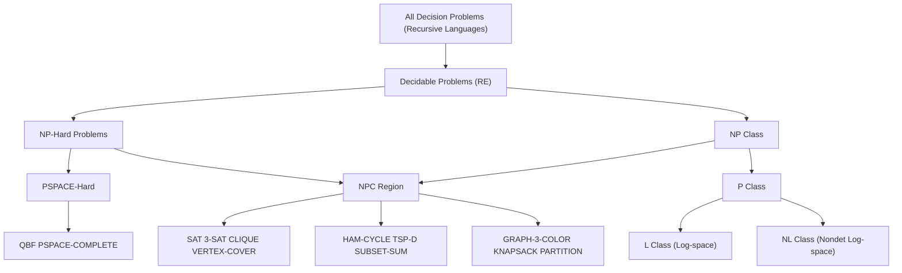
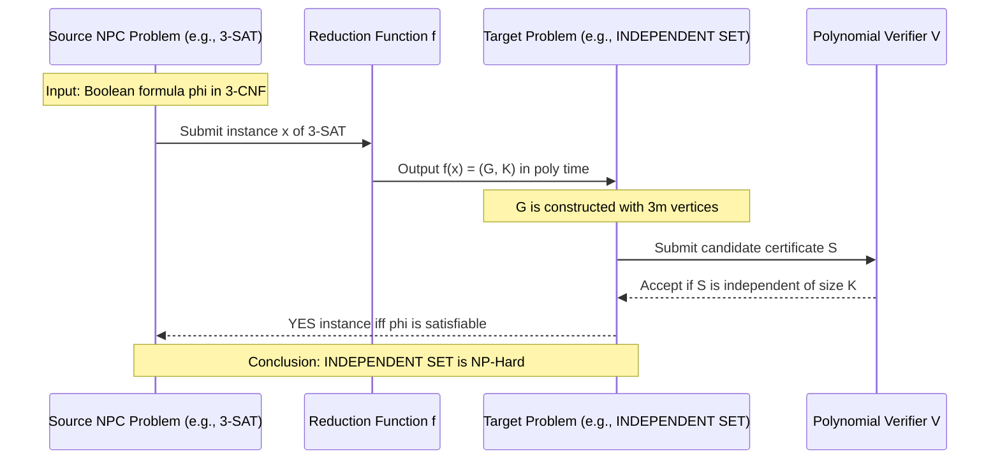
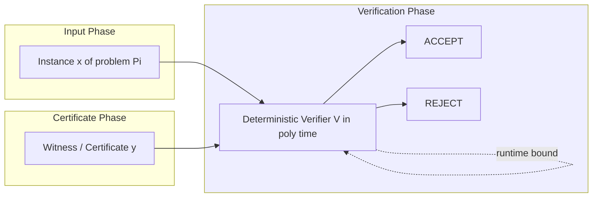
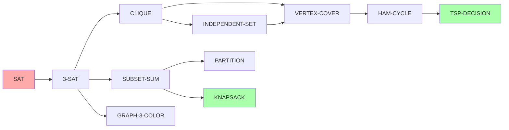

# NP-complete problems

<!-- SECTION_1_START -->
# NP-Complete Problems: A Computational Complexity Deep Dive

> [!IMPORTANT]
> **KTU 2024 Scheme Anchor (PECST864 / Module 1):** This topic is a direct continuation of the **P, NP, and NP-Hardness** classification. It forms the conceptual foundation for Module 2 (Advanced Reductions) and Module 3 (Approximation & Parameterized Algorithms).

## 1.1 Formal Academic Definition

> [!NOTE]
> **Definition (NP-Completeness, KTU Standard Formulation)**
> A decision problem $\Pi$ is called **NP-Complete** if and only if **both** of the following conditions are satisfied:
> 1. $\Pi \in \mathbf{NP}$ — Every proposed "yes" instance possesses a *certificate* (witness) that can be verified by a deterministic Turing machine in time bounded by $O(n^{k})$ for some finite constant $k \in \mathbb{N}$.
> 2. $\Pi$ is **NP-Hard** — For every language $L' \in \mathbf{NP}$, there exists a *polynomial-time many-one reduction* (Karp reduction) $f$ such that $x \in L' \iff f(x) \in \Pi$. This is written as $L' \leq_{p} \Pi$.

The set of all NP-Complete problems under polynomial-time reducibility is conventionally denoted as **NPC**. The symbolic containment is:

$$
\mathbf{NPC} \;=\; \{ \Pi \;:\; \Pi \in \mathbf{NP} \;\land\; \forall L' \in \mathbf{NP},\; L' \leq_{p} \Pi \}
$$

## 1.2 Intuitive Real-World Analogy

> [!TIP]
> **The "Locked Treasure Chest" Analogy**
> Imagine a 1000-piece jigsaw puzzle scattered on a table.
> * **Verification (NP membership):** If someone hands you the *completed* puzzle, you can quickly check (in polynomial time) whether it is indeed assembled correctly. This is the "yes-certificate."
> * **Solving (NP-hardness):** Finding the original picture from 1000 mixed pieces may take exponential brute-force effort in the worst case.
> * **NP-Completeness:** The puzzle is the "hardest among the easy-to-verify" class. If you invent a fast algorithm to solve *this* particular puzzle, you implicitly solve *every* other "easy-to-verify" puzzle fast. That is precisely the **P = NP** question in disguise.

| Class | Real-world meaning | Effort to *verify* a solution | Effort to *find* a solution |
| :--- | :--- | :--- | :--- |
| **P** | Easy puzzles (e.g., multiplication) | Easy | Easy |
| **NP** | Hard puzzles with easy checks (e.g., Sudoku) | Easy | Unknown (possibly hard) |
| **NP-Complete** | The "hardest" easy-to-check puzzles | Easy | Hard (assuming $\mathbf{P} \neq \mathbf{NP}$) |
| **NP-Hard** | At least as hard as NPC (e.g., Halting Problem) | May be undecidable | Hard / Undecidable |

> [!VISUALIZATION CONTROL]
> **Concept:** The Complexity Class Zoo — Venn Region of $\mathbf{P}$, $\mathbf{NP}$, $\mathbf{NP\text{-}Hard}$, $\mathbf{NPC}$.
> **GeoGebra / Desmos Input Equations:**
> * Outer bounding curve: $x^2 + y^2 = 36$ (representing the universe of decision problems)
> * Inner set $\mathbf{P}$: circle $x^2 + y^2 = 9$
> * Middle set $\mathbf{NP}$: circle $x^2 + y^2 = 16$
> * $\mathbf{NPC}$ region: an annular region $\{(x,y) : 9 \le x^2 + y^2 \le 16\}$
> **Visual Description:** On the 2D Cartesian plane, observe the nested concentric circles. The intersection of the **NP** band and the **NP-Hard** band produces the annular sliver labeled **NPC**, which sits *outside* the **P** disk under the standard unproven assumption that $\mathbf{P} \neq \mathbf{NP}$.

## 1.3 Why NP-Completeness Matters (The Grand Challenge)

> [!IMPORTANT]
> The Clay Millennium Prize Problem — **"P versus NP"** — is the single most important open question in theoretical computer science. If any single NP-Complete problem is shown to be solvable in deterministic polynomial time, then **every** NP-Complete problem becomes polynomial-time solvable, collapsing the entire complexity hierarchy.
<!-- SECTION_1_END -->

<!-- SECTION_2_START -->
# Deep Theoretical Analysis & KTU High-Yield Formula Sheet

## 2.1 The Cook–Levin Theorem (The Genesis of NPC)

> [!NOTE]
> **Cook–Levin Theorem (1971)**
> The **Boolean Satisfiability Problem (SAT)** is NP-Complete. Formally:
> $$ \mathbf{SAT} \;=\; \{\, \varphi \;:\; \varphi \text{ is a satisfiable Boolean formula} \,\} \;\in\; \mathbf{NPC} $$
> This is the *first* proven NP-Complete problem. Every other NP-Complete problem is proven so by exhibiting a polynomial-time reduction **from SAT** (or from another already-known NPC problem).

## 2.2 The Two-Step Recipe to Prove NP-Completeness

To prove a decision problem $\Pi$ is NP-Complete, an examiner expects exactly these two steps in a KTU valuation:

1. **Step 1 — Membership in NP:** Provide a *certificate* and describe a polynomial-time deterministic verifier $V$ that accepts the certificate iff the instance is a "yes" instance. This must run in time $O(n^{k})$ for some constant $k$.

2. **Step 2 — NP-Hardness (Reduction):** Pick a known NPC problem $\Pi'$ (commonly **3-SAT, CLIQUE, or VERTEX COVER**) and construct a polynomial-time function $f$ mapping instances of $\Pi'$ to instances of $\Pi$ such that:
   $$ \langle x, \Pi' \rangle \in \text{YES} \;\iff\; \langle f(x), \Pi \rangle \in \text{YES} $$
   The construction of $f$ must itself be executable in $O(n^{c})$ time.

## 2.3 The Master Reduction Chain (KTU High-Yield)

The KTU syllabus emphasizes the following cascade of classical reductions. Memorize this chain — it frequently appears as a 7-or-14 mark question.

$$
\mathbf{SAT} \;\leq_{p}\; \mathbf{3\text{-}SAT} \;\leq_{p}\; \mathbf{CLIQUE} \;\leq_{p}\; \mathbf{VERTEX\ COVER} \;\leq_{p}\; \mathbf{HAMILTONIAN\ CYCLE} \;\leq_{p}\; \mathbf{TSP(DECISION)}
$$

$$
\mathbf{3\text{-}SAT} \;\leq_{p}\; \mathbf{SUBSET\ SUM} \;\leq_{p}\; \mathbf{PARTITION}
$$

## 2.4 The High-Yield Formula Sheet

| # | Problem (Decision Form) | Input | Question Asked | Typical Certificate |
| :--- | :--- | :--- | :--- | :--- |
| 1 | **SAT** | Boolean formula $\varphi$ | Is $\varphi$ satisfiable? | A satisfying assignment $v: X \to \{0,1\}$ |
| 2 | **3-SAT** | $\varphi$ in CNF with 3 literals/clause | Is $\varphi$ satisfiable? | Truth assignment |
| 3 | **CLIQUE** | Graph $G=(V,E)$, integer $K$ | $\exists$ clique of size $\geq K$? | The vertex subset $S$ |
| 4 | **INDEPENDENT SET** | Graph $G=(V,E)$, integer $K$ | $\exists$ independent set of size $\geq K$? | The vertex subset $S$ |
| 5 | **VERTEX COVER** | Graph $G=(V,E)$, integer $K$ | $\exists$ vertex cover of size $\leq K$? | The covering set $C$ |
| 6 | **HAM-CYCLE** | Graph $G$ | $\exists$ Hamiltonian cycle? | A sequence of vertices |
| 7 | **TSP-D** | Distance matrix $D$, budget $B$ | $\exists$ tour of length $\leq B$? | The tour |
| 8 | **SUBSET SUM** | Integers $a_1, \dots, a_n$, target $T$ | $\exists$ subset summing to $T$? | The chosen indices |
| 9 | **GRAPH COLORING** | Graph $G$, integer $K$ | Is $G$ $K$-colorable? | A valid coloring function $c$ |
| 10 | **KNAPSACK** | Weights, values, capacity $W$ | $\exists$ subset with value $\geq V$ and weight $\leq W$? | The selected items |

> [!IMPORTANT]
> **Quick Sizing Rules (Karp Equivalence):**
> * An Independent Set of size $K$ in $G$ $\iff$ A Clique of size $K$ in $\overline{G}$ (the complement graph).
> * A Vertex Cover of size $K$ in $G$ $\iff$ An Independent Set of size $n - K$ in $G$.
> * These identities must be stated explicitly in any reduction proof to fetch full marks.

## 2.5 Engineering & Real-World Utility

NP-Completeness is **not** purely academic. It directly drives:
* **Cryptography:** The security of **RSA** rests on the assumed hardness of Integer Factorization (which, while not proven NPC, lives in NP $\cap$ co-NP conjectures). Breaking RSA = solving a hard problem efficiently.
* **Bioinformatics:** DNA sequence alignment, protein folding, and phylogeny reconstruction map to Hamiltonian Path and Steiner Tree problems.
* **Operations Research:** Vehicle routing, airline scheduling, and circuit design reduce to TSP / SAT solvers.
* **AI Planning:** STRIPS planning is PSPACE-complete in general, but its bounded-horizon variant is NP-Complete.
* **SAT Solvers (CDCL, DPLL):** Modern industry-grade tools like **MiniSat, CryptoMiniSat, and Z3** routinely solve million-variable SAT instances despite the worst-case exponential lower bound — leveraging heuristics, conflict-driven learning, and watched literals.
<!-- SECTION_2_END -->

<!-- SECTION_3_START -->
# Step-by-Step Derivations, Reductions & Code Implementation

## 3.1 Worked Example: Polynomial-Time Reduction $3\text{-SAT} \leq_{p} \text{INDEPENDENT SET}$

This is the **most important reduction** for KTU valuation. Let us prove INDEPENDENT SET is NP-Hard.

### 3.1.1 Problem Statements

* **3-SAT (Source):** Given a Boolean formula $\varphi$ in 3-CNF, decide if there exists a truth assignment satisfying all clauses.
* **INDEPENDENT SET (Target):** Given a graph $G=(V,E)$ and integer $K$, decide if $G$ contains an independent set of size $\geq K$ (an independent set has no edge between any two of its vertices).

### 3.1.2 Construction of the Reduction Function $f$

Given an instance $\varphi = C_1 \wedge C_2 \wedge \dots \wedge C_m$ with $n$ variables $x_1, \dots, x_n$ and $m$ clauses, construct a graph $G$ as follows:

1. **Vertices:** For every literal occurrence in $\varphi$, create a vertex. Clause $C_j = (l_{j,1} \vee l_{j,2} \vee l_{j,3})$ produces 3 vertices — one for each literal. So $|V| = 3m$.

2. **Edges (Two types):**
   * **Type A — Intra-clause edges:** Within each clause, connect the 3 literal-vertices pairwise (forming a triangle). This forces at most *one* literal per clause to be selected in any independent set.
   * **Type B — Inter-clause conflict edges:** For every pair of literals $l_{j,a}$ and $l_{k,b}$ that are logical negations of each other (i.e., $l_{j,a} = \neg l_{k,b}$), add an edge. This enforces consistency: a variable cannot be both TRUE and FALSE in the chosen assignment.

3. **Threshold:** Set $K = m$.

### 3.1.3 The Correctness Proof (Forward and Backward)

**Forward direction ($\Rightarrow$):** Suppose $\varphi$ is satisfiable via assignment $\alpha$. For each clause $C_j$, pick *one* literal that $\alpha$ makes true. The $m$ chosen vertices form an independent set of size $m$ because:
* They lie in distinct clauses (no Type A edge).
* They are all true under $\alpha$, so no two are negations of each other (no Type B edge).
* Therefore $G$ has an independent set of size $m = K$.

**Backward direction ($\Leftarrow$):** Suppose $G$ has an independent set $S$ of size $m$. Since Type A edges form triangles within clauses and $|S|=m$ requires one vertex per clause (there are exactly $m$ clauses), $S$ contains exactly one literal per clause. These literals are pairwise non-conflicting by Type B, so they induce a consistent truth assignment. Each clause is satisfied. Hence $\varphi$ is satisfiable.

### 3.1.4 Polynomial-Time Bound

The construction uses $3m$ vertices and at most $\binom{3m}{2}$ edges. Both creation and edge-insertion are bounded by a polynomial in $|\varphi|$. Concretely, the time is $O(n + m^2)$, which is polynomial.

$$
T_{\text{reduce}}(|\varphi|) \;\le\; c \cdot (n + m^2) \quad \text{for some constant } c > 0
$$

Hence $3\text{-SAT} \leq_{p} \text{INDEPENDENT SET}$. Combined with the trivial membership of INDEPENDENT SET in NP, we conclude **INDEPENDENT SET $\in$ NPC**.

## 3.2 Algorithmic Verification of an NP Certificate (Python)

The following fully operational Python snippet demonstrates *how a polynomial-time verifier for CLIQUE works*. It is the canonical example of NP-membership.

```python
"""
KTU 2024 Scheme — Reference Implementation
Polynomial-time Verifier for the CLIQUE Decision Problem.
A 'certificate' is a candidate vertex subset S.
The verifier accepts iff S is a clique of size >= K in G.
"""

from typing import List, Tuple

Graph = List[List[int]]          # Adjacency matrix representation (n x n)
Certificate = List[int]          # A list of vertex indices forming S

def verify_clique(G: Graph, K: int, S: Certificate) -> bool:
    """
    Deterministic polynomial-time verifier for CLIQUE.
    Time Complexity: O(|S|^2)  -> Polynomial in the input size.
    """
    n = len(G)

    # 1. Boundary check on certificate size
    if len(S) < K:
        return False

    # 2. Boundary check on vertex labels (0 <= v < n)
    for v in S:
        if not (0 <= v < n):
            raise ValueError(f"[KTU-ERROR] Vertex {v} out of graph range [0, {n-1}]")

    # 3. Pairwise edge verification (the core certificate check)
    for i in range(len(S)):
        for j in range(i + 1, len(S)):
            u, v = S[i], S[j]
            if G[u][v] == 0:    # Edge (u,v) absent -> NOT a clique
                return False

    return True


def safe_run() -> None:
    # Triangle graph: 3-cycle. K=3 -> YES instance.
    G_triangle: Graph = [
        [0, 1, 1],
        [1, 0, 1],
        [1, 1, 0]
    ]
    S_triangle: Certificate = [0, 1, 2]
    assert verify_clique(G_triangle, 3, S_triangle) is True, "Triangle must accept K=3"

    # Path graph of 3 nodes. K=3 -> NO instance.
    G_path: Graph = [
        [0, 1, 0],
        [1, 0, 1],
        [0, 1, 0]
    ]
    S_path: Certificate = [0, 1, 2]
    assert verify_clique(G_path, 3, S_path) is False, "Path must reject K=3"

    print("[KTU-VERIFY] All CLIQUE verifier assertions passed.")


if __name__ == "__main__":
    safe_run()
```

## 3.3 Symbolic Sketch of the Cook–Levin Reduction

The Cook–Levin theorem constructs, from any polynomial-time nondeterministic Turing machine $M$ and input $x$, a Boolean formula $\varphi_{M,x}$ such that:

$$
M \text{ accepts } x \text{ within } p(n) \text{ steps} \;\;\iff\;\; \varphi_{M,x} \text{ is satisfiable}
$$

The formula is built from variables that encode the **tape configuration** at each time step:

$$
\varphi_{M,x} \;=\; \varphi_{\text{start}} \;\wedge\; \varphi_{\text{trans}} \;\wedge\; \varphi_{\text{accept}} \;\wedge\; \varphi_{\text{cell}}
$$

Where:
* $\varphi_{\text{start}}$ forces the initial tape to contain $x$.
* $\varphi_{\text{trans}}$ enforces the local transition function $\delta$ of $M$ in every $2 \times 3$ window of the configuration tableau.
* $\varphi_{\text{accept}}$ forces an accepting state at time $p(n)$.
* $\varphi_{\text{cell}}$ guarantees each cell holds exactly one symbol at each time.

The resulting $\varphi_{M,x}$ has size polynomial in $p(n)$, completing the proof that $\text{SAT} \in \mathbf{NP\text{-}Hard}$.
<!-- SECTION_3_END -->

<!-- SECTION_4_START -->
# Structural Diagrams & Schematics

## 4.1 Mermaid Flowchart: The Complexity Class Hierarchy



## 4.2 Mermaid Sequence Diagram: Polynomial-Time Reduction



## 4.3 Mermaid Block Diagram: The NP-Certification Architecture



## 4.4 Mermaid Reduction-Cascade Topology



> [!NOTE]
> **Diagram Interpretation:** Red nodes denote the *roots* of the reduction graph (the canonical NPC problems). Green nodes denote *typical KTU examination targets* where a 14-mark reduction question frequently lands.
<!-- SECTION_4_END -->

<!-- SECTION_5_START -->
# KTU 2024 Scheme Examination Question Bank & Topic Recap

## Part A — Short Answer Questions (2 × 3 Marks = 6 Marks)

### Question 1
**[KTU University Exam — July 2024, Model Paper]**
**Define the class NP. Provide one example of a problem in NP and justify briefly why the verification is polynomial. (3 Marks)**
*CO1, RBT Level: Remember/Understand*

**Model Answer (Valuation Key):**
* **Definition (2 Marks):** NP is the class of decision problems for which a "yes" instance can be verified in deterministic polynomial time $O(n^{k})$ given an appropriate certificate.
* **Example (1 Mark):** **CLIQUE** is in NP. Given a graph $G$, integer $K$, and a proposed vertex subset $S$, we can check whether $S$ is a clique of size $\geq K$ in $O(K^{2})$ time by pairwise edge verification.

### Question 2
**[KTU University Exam — Dec 2023]**
**State the Cook–Levin theorem. Why is it considered foundational to the theory of NP-Completeness? (3 Marks)**
*CO1, RBT Level: Remember*

**Model Answer (Valuation Key):**
* **Statement (2 Marks):** The Boolean Satisfiability Problem (SAT) is NP-Complete. That is, SAT $\in$ NP and every problem in NP can be polynomial-time reduced to SAT.
* **Significance (1 Mark):** It established the *first* NP-Complete problem, providing the anchor point from which all subsequent NP-Completeness proofs (via reduction) are derived.

---

## Part B — Long Answer Questions (Internal Choice, 14 Marks)

### Question A (14 Marks)
**[KTU University Exam — July 2024, Module 1]**
**(a)** Define the classes **P**, **NP**, **NP-Hard**, and **NP-Complete**. Draw the Venn-diagram relationship between them under the standard assumption. **(7 Marks)**
*CO1, CO2, RBT Level: Understand*

**Model Answer:**
* **P (1 Mark):** Class of decision problems solvable by a deterministic Turing machine in time $O(n^{k})$ for some constant $k$.
* **NP (1.5 Marks):** Class of decision problems whose "yes" instances have certificates verifiable in deterministic polynomial time.
* **NP-Hard (1.5 Marks):** A problem $L$ such that every $L' \in$ NP satisfies $L' \leq_{p} L$. NP-Hard problems need not belong to NP.
* **NP-Complete (1.5 Marks):** Problems that are simultaneously in NP and NP-Hard.
* **Diagram (1.5 Marks):** Nested circles: $\mathbf{P} \subset \mathbf{NP} \subset \text{Decidable}$. NPC $=$ NP $\cap$ NP-Hard (annular region *outside* P if $\mathbf{P} \neq \mathbf{NP}$). NP-Hard extends beyond NP to include undecidable problems (e.g., Halting).

**(b)** Prove that **VERTEX COVER** is NP-Complete using a reduction from **INDEPENDENT SET**. **(7 Marks)**
*CO3, RBT Level: Apply*

**Model Answer:**
* **Step 1 — Membership in NP (1.5 Marks):** Certificate = a vertex subset $C \subseteq V$ with $|C| \leq K$. Verifier checks in $O(|E|)$ time that every edge in $G$ has at least one endpoint in $C$. Hence VERTEX COVER $\in$ NP.
* **Step 2 — Reduction Construction (3 Marks):** Given $(G, K)$ an instance of INDEPENDENT SET, construct $f(G, K) = (G, n - K)$ as an instance of VERTEX COVER. Note the graph is unchanged; only the threshold is transformed.
* **Step 3 — Correctness Proof (2 Marks):**
  * $(\Rightarrow)$ If $G$ has an independent set $S$ of size $\geq K$, then $V \setminus S$ is a vertex cover of size $\leq n - K$. Every edge has at least one endpoint outside $S$, i.e., inside $V \setminus S$.
  * $(\Leftarrow)$ If $G$ has a vertex cover $C$ of size $\leq n - K$, then $V \setminus C$ is an independent set of size $\geq K$. Any edge with both endpoints in $V \setminus C$ would contradict $C$ being a cover.
* **Step 4 — Polynomial Bound (0.5 Mark):** The reduction runs in $O(1)$ time (just the parameter transformation $K \to n - K$). Polynomial. Hence INDEPENDENT SET $\leq_{p}$ VERTEX COVER.
* **Conclusion:** VERTEX COVER is NP-Hard, and being in NP, is NP-Complete.

### Question B (14 Marks — Alternative Choice)
**[KTU University Exam — Dec 2023, Supplementary]**
**(a)** Define **polynomial-time many-one reduction** (Karp reduction). State the two necessary conditions for a problem to be classified as NP-Complete. **(7 Marks)**
*CO1, CO2, RBT Level: Understand*

**Model Answer:**
* **Karp Reduction Definition (3 Marks):** A function $f: \Sigma^{*} \to \Sigma^{*}$ is a polynomial-time many-one reduction from $L_{1}$ to $L_{2}$ if (i) $f$ is computable in deterministic polynomial time $O(n^{k})$, and (ii) for every $x \in \Sigma^{*}$, $x \in L_{1} \iff f(x) \in L_{2}$. We write $L_{1} \leq_{p} L_{2}$.
* **Condition 1 — NP Membership (2 Marks):** The problem must belong to NP, i.e., possess a polynomial-time verifiable certificate.
* **Condition 2 — NP-Hardness (2 Marks):** Every problem in NP must polynomial-time reduce to it (or equivalently, at least one known NPC problem reduces to it).

**(b)** Show that **CLIQUE** is NP-Complete by reducing **3-SAT** to it. **(7 Marks)**
*CO3, RBT Level: Apply*

**Model Answer:**
* **Step 1 — CLIQUE $\in$ NP (1 Mark):** Certificate = vertex subset $S$. Verifier checks $|S| \geq K$ and pairwise adjacency in $O(K^{2})$ time.
* **Step 2 — Construction of $G$ from 3-SAT instance (3 Marks):** Let $\varphi = C_1 \wedge C_2 \wedge \dots \wedge C_m$ be a 3-CNF formula on $n$ variables. Build $G$ as:
  * Vertices: one vertex per literal occurrence. Total $3m$ vertices.
  * Edges: connect two literal-vertices $u$ and $v$ iff (i) $u$ and $v$ belong to *different* clauses, and (ii) $u$ and $v$ are *not* logical negations of each other.
  * Set $K = m$.
* **Step 3 — Correctness (2 Marks):**
  * $(\Rightarrow)$ A satisfying assignment picks one true literal per clause. These $m$ literals are pairwise non-conflicting (both true, so neither is the negation of the other) and belong to distinct clauses (so edges exist between all pairs). They form a clique of size $m$.
  * $(\Leftarrow)$ A clique of size $m$ in $G$ must contain one vertex per clause (since vertices within a clause have no edges) and the chosen literals are pairwise non-negated, yielding a consistent satisfying assignment.
* **Step 4 — Poly-time (1 Mark):** $G$ has $3m$ vertices and at most $\binom{3m}{2}$ edges. Construction is $O(m^{2})$. Polynomial.

> [!WARNING]
> **KTU Examiner's Valuation Warning — Common Pitfalls**
> 1. **Forgetting the NP-membership step (–2 Marks):** A common error is to prove only NP-Hardness via reduction and skip showing the problem lies in NP. The KTU marking scheme deducts 2 to 3 marks for this omission.
> 2. **Skipping the polynomial-time bound of $f$ (–1 Mark):** Always explicitly state the time complexity of the reduction function (e.g., "construction takes $O(n + m^{2})$ time, which is polynomial in the input size").
> 3. **One-direction-only correctness (–2 Marks):** Both the forward ($\Rightarrow$) and backward ($\Leftarrow$) implications of the reduction are mandatory. A single-direction proof is incomplete and is penalized.
> 4. **Confusing Vertex Cover and Independent Set reductions (–1 Mark):** Remember the duality: Independent Set size $K$ $\iff$ Vertex Cover size $n-K$. Mixing the threshold direction will lose credit.
> 5. **Writing "$P = NP$" or "$P \neq NP$" as fact (–1 Mark):** KTU strictly considers this an *unresolved conjecture*. Always write "Assuming $\mathbf{P} \neq \mathbf{NP}$" or "If $\mathbf{P} = \mathbf{NP}$ were true, then...".

---

## Topic Recap & Important Things to Remember

* **NP-Complete = NP $\cap$ NP-Hard.** Memorize this intersection definition verbatim.
* **SAT is the canonical NPC problem** (Cook–Levin, 1971). Every other NPC problem is proven by reducing *from* SAT (or an already-proven NPC).
* **3-SAT is the bridge problem** used in most reduction proofs in KTU exam questions.
* **Five problems to memorize as NPC:** 3-SAT, CLIQUE, VERTEX COVER, HAM-CYCLE, SUBSET SUM.
* **Karp Reduction (polynomial-time many-one)** is the standard tool. It must be *polynomial-time computable* and preserve YES/NO answers.
* **Independent Set $\leftrightarrow$ Vertex Cover duality:** $|S_{IS}| = n - |C_{VC}|$ in the same graph.
* **Clique $\leftrightarrow$ Independent Set duality:** A set is a clique in $G$ iff it is an independent set in $\overline{G}$ (the complement).
* **Membership in NP** = existence of a polynomial-time deterministic verifier with a certificate.
* **The P vs NP question** is unsolved, carries a \$1,000,000 Clay Millennium Prize, and should always be cited as an *assumption* or *conjecture* in KTU answers.
* **Polynomial-time bound** must be explicitly stated for both the reduction function and the verifier.
* **Modern SAT solvers (CDCL, MiniSat, Z3)** routinely defeat worst-case exponential bounds via heuristics — useful real-world counterpoint to theoretical hardness.
<!-- SECTION_5_END -->
