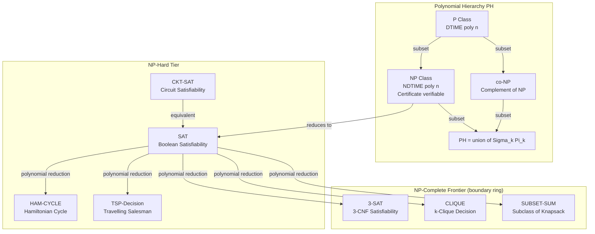

# NP-completeness and the Cook-Levin theorem.

<!-- SECTION_1_START -->
# NP-Completeness & The Cook-Levin Theorem

## 1.1 Formal Definition (KTU 2024 Syllabus Terminology)

> [!IMPORTANT]
> **Core Definition — NP-Completeness**
> A decision problem $\Pi$ is called **NP-complete** if and only if it satisfies both of the following properties:
> 1. $\Pi \in \mathbf{NP}$ (i.e., every *yes* instance has a certificate verifiable in polynomial time on a deterministic Turing machine).
> 2. For every language $L \in \mathbf{NP}$, there exists a polynomial-time many-one reduction $L \leq_{p} \Pi$ (i.e., $\Pi$ is **NP-hard**).

**Cook-Levin Theorem (1971)** — *The First NP-Complete Problem*
> The Boolean Satisfiability Problem (SAT) is NP-complete. Formally, $\text{SAT} \in \mathbf{NP}$ and $\forall L \in \mathbf{NP} : L \leq_{p} \text{SAT}$.

**Auxiliary Class Definitions (Syllabus High-Yield):**
- **P (PTIME)**: The class of decision problems solvable by a deterministic Turing machine in time $O(n^{k})$ for some constant $k \in \mathbb{N}$.
- **NP (NPTIME)**: The class of decision problems solvable by a *non-deterministic* Turing machine in polynomial time, equivalently, problems whose *yes*-instances possess a certificate verifiable in deterministic polynomial time.
- **NP-Hard**: A problem $H$ such that $\forall L \in \mathbf{NP} : L \leq_{p} H$ (no membership requirement in NP).
- **co-NP**: The complement class of NP; contains problems whose *no*-instances have polynomial certificates.

## 1.2 Intuitive Analogy — "Sudoku, Jigsaws, and Locked Boxes"

Imagine you are given a **10,000-piece jigsaw puzzle**:
- *Solving it from scratch* might take days of trial and error — analogous to a brute-force exponential search.
- *Verifying a proposed solution* (i.e., checking if 10,000 specific pieces correctly form the picture) takes only a few minutes — analogous to a **polynomial-time certificate verification**.

> This is the central intuition behind NP: a problem is in NP if, *once you already know the answer*, you can **check** it quickly, even if finding it is hard.

**NP-completeness** is the "**hardest**" tier inside NP — these are the problems that are *simultaneously*:
- As hard as *every other problem in NP* (no problem in NP can be reduced to something strictly harder than them), and
- As *easy to verify* as any NP problem.

The **Cook-Levin theorem** is the foundational proof that **SAT is the canonical NP-complete problem** — the "**atomic nucleus**" from which all other NP-completeness results are derived via polynomial reductions.

> [!NOTE]
> **Standard Metric / Convention**
> Throughout KTU board problems, *polynomial time* implicitly means $O(n^{c})$ for some **fixed** constant $c \in \mathbb{N}$ independent of the input. The constant $c$ may be *very large* (e.g., $n^{1000}$), but it must not depend on $n$ or the input size.

## 1.3 Visual Concept — Class Inclusions

> [!VISUALIZATION CONTROL]
> **Concept:** Subset relationship of complexity classes under the hypothesis $\mathbf{P} \neq \mathbf{NP}$
> **GeoGebra / Desmos Input:**
> * Plot nested regions on a 2D plane where the horizontal axis represents "Verifiability" and the vertical axis represents "Solvability".
> * Use circle equations: $x^{2} + y^{2} \leq 1$ (P), $x^{2} + y^{2} \leq 4$ (NP), $x^{2} + y^{2} \leq 9$ (PSPACE).
> **Visual Description:** Students should observe three nested concentric discs. NP-complete problems are illustrated as a thin boundary ring (the "frontier") of the NP disc that lies *outside* the P disc, signifying that they belong to NP but are conjectured to lie strictly outside P.
<!-- SECTION_1_END -->

<!-- SECTION_2_START -->
# 2. Deep Theoretical Analysis & KTU Formula Sheet

## 2.1 The Architectural Pillars of NP-Completeness

The Cook-Levin theorem rests on **three pillars**. Each must be understood independently before the theorem itself becomes intuitive.

### Pillar 1 — Deterministic vs. Non-Deterministic Polynomial Time

- A **deterministic Turing machine (DTM)** has *exactly one* transition rule per state-symbol pair.
- A **non-deterministic Turing machine (NDTM)** may have *multiple* transitions; it "accepts" if **at least one** computation branch accepts.
- An NDTM running in time $T(n)$ can be **simulated** by a DTM in time $2^{O(T(n))}$ — exponential blow-up.

### Pillar 2 — The Polynomial-Time Certificate (Witness)

- A language $L \subseteq \Sigma^{*}$ belongs to NP if there exists a deterministic polynomial-time Turing machine $V$ (the **verifier**) and a polynomial $p(\cdot)$ such that:

$$x \in L \iff \exists w \in \Sigma^{*}, \vert w \vert \leq p(\vert x \vert) : V(x, w) = \text{ACCEPT}$$

- Here, $w$ is the **certificate / witness** (e.g., a satisfying assignment, a Hamiltonian cycle, a 3-colouring).

### Pillar 3 — Polynomial-Time Many-One Reductions

- A language $A$ is polynomial-time *many-one reducible* to a language $B$, written $A \leq_{p} B$, if there exists a polynomial-time computable function $f : \Sigma^{*} \to \Sigma^{*}$ such that:

$$x \in A \iff f(x) \in B$$

- This is the **transitive backbone** of NP-completeness proofs: once SAT is shown NP-complete, any SAT-reducible problem automatically inherits NP-completeness.

> [!NOTE]
> **Why "Many-One"?** The function $f$ maps each instance $x$ to a *single* instance $f(x)$ — *one* input goes in, *one* input comes out. This contrasts with *Turing* reductions (oracle reductions) used in Cook's original 1971 paper.

## 2.2 The Two Halves of Cook-Levin

The proof of $\text{SAT} \in \mathbf{NP\text{-}complete}$ is a two-part argument:

**Part I — SAT ∈ NP (Membership):**
Given a Boolean formula $\varphi$ and a candidate assignment $w : \text{vars}(\varphi) \to \{0, 1\}$, a deterministic verifier can substitute the values of $w$ into $\varphi$ and evaluate each gate in $O(\vert \varphi \vert)$ time, returning ACCEPT iff the final evaluation is **TRUE**.

**Part II — SAT is NP-Hard (Hardness):**
For an arbitrary $L \in \mathbf{NP}$, there exists a polynomial-time NDTM $N$ deciding $L$. The proof constructs, for every input $x$, a Boolean formula $\varphi_{x}$ such that:

$$N \text{ accepts } x \iff \varphi_{x} \text{ is satisfiable}$$

The construction must encode:
1. The **initial configuration** (tape, head, state) at time $t = 0$.
2. The **transition function** $\delta$ for time steps $t = 1, 2, \dots, T(n)$.
3. The **final acceptance condition** at time $t = T(n)$.
4. The **cell-by-cell tape evolution** (consistency constraints).

## 2.3 KTU High-Yield Formula Sheet

| Symbol / Term | Mathematical Definition | Engineering Interpretation |
| :--- | :--- | :--- |
| $\mathbf{P}$ | $\bigcup_{k \geq 0} \text{DTIME}(n^{k})$ | Real-time tractable decision problems |
| $\mathbf{NP}$ | $\bigcup_{k \geq 0} \text{NTIME}(n^{k})$ | Verifiable-in-poly-time decision problems |
| $\mathbf{NP\text{-}complete}$ | $\mathbf{NP} \cap \mathbf{NP\text{-}Hard}$ | Hardest problems inside NP |
| $\mathbf{NP\text{-}Hard}$ | $\{H : \forall L \in \mathbf{NP}, L \leq_{p} H\}$ | At least as hard as any NP problem |
| $A \leq_{p} B$ | $\exists f \in \mathbf{FP} : x \in A \Leftrightarrow f(x) \in B$ | $B$ is "at least as expressive" as $A$ |
| $\text{SAT}$ | $\{\varphi : \varphi \text{ is a satisfiable Boolean formula}\}$ | Canonical NP-complete problem |
| $\text{CKT\text{-}SAT}$ | $\{C : C \text{ is a satisfiable Boolean circuit}\}$ | Circuit satisfiability (Cook's original) |
| $T(n)$ | Poly-bounded NDTM runtime | Time budget for certificate verification |
| $\varphi_{x}$ | Cook-Levin reduction output | Boolean encoding of NTM's computation on $x$ |
| $\delta(q, a)$ | NTM transition relation | Local move rule per state-symbol pair |

> [!IMPORTANT]
> **Engineering Utility of NP-Completeness**
> In real-world software engineering, NP-completeness provides a *negative optimality result*: if your optimization problem is NP-complete, you have a **mathematical certificate** that no polynomial-time exact algorithm exists (unless $\mathbf{P} = \mathbf{NP}$). This justifies the use of:
> - **Approximation algorithms** (e.g., Christofides' algorithm for TSP, factor $\tfrac{3}{2}$).
> - **Parameterized algorithms** (FPT — Fixed-Parameter Tractable).
> - **Heuristics & meta-heuristics** (simulated annealing, genetic algorithms).
> - **SAT solvers** in hardware verification, cryptography, and AI planning (e.g., DPLL, CDCL, Z3).
<!-- SECTION_2_END -->

<!-- SECTION_3_START -->
# 3. Step-by-Step Derivations & Symbolic Implementation

## 3.1 Full Cook-Levin Construction (NDTM → Boolean Formula)

Let $N$ be a non-deterministic Turing machine deciding $L$ in time $T(n) \leq n^{c}$ for some constant $c$. For an input $x$ of length $n$, we construct a Boolean formula $\varphi_{x}$ that is satisfiable **iff** $N$ accepts $x$.

### Step 1 — Define the Table of Configurations

The computation of $N$ on $x$ unfolds over $T(n)$ time steps. The tape has $T(n)$ cells at most (the machine cannot move more than $T(n)$ cells from the origin in $T(n)$ steps). The configuration table is a 2D grid:

$$\text{Cell}(i, j, t) = \text{TRUE} \iff \text{at time } t, \text{ tape cell } j \text{ contains the } i\text{-th symbol of the tape alphabet } \Gamma$$

The state and head position are encoded as auxiliary Boolean variables:

$$\text{State}(q, t) = \text{TRUE} \iff \text{at time } t, \text{ the finite control is in state } q \in Q$$

$$\text{Head}(j, t) = \text{TRUE} \iff \text{at time } t, \text{ the read/write head is on cell } j$$

### Step 2 — Encode the Initial Configuration (Time $t = 0$)

The initial state is $q_{0}$, the head is on cell $0$, and the tape contains $x$ followed by blanks:

$$\varphi_{\text{init}} \equiv \bigwedge_{i=1}^{n} \text{Cell}(x_{i}, i, 0) \;\wedge\; \bigwedge_{j > n} \text{Cell}(\sqcup, j, 0) \;\wedge\; \text{State}(q_{0}, 0) \;\wedge\; \text{Head}(0, 0)$$

Each clause in $\varphi_{\text{init}}$ is a *unit clause* (single literal), so it can be expanded into a constant-size CNF.

### Step 3 — Encode the Transition Function (Time $t \to t + 1$)

For every time $t$ and every cell $j$, the next-state, next-symbol, and next-head-position are deterministic functions of the current state, current symbol, and head position. Let $\delta(q, a) = \{(q_{1}, a_{1}, d_{1}), (q_{2}, a_{2}, d_{2}), \dots\}$ denote the (possibly non-deterministic) transition relation. The transition clause at cell $(j, t)$ is:

$$\varphi_{\text{trans}} \equiv \bigwedge_{t=0}^{T(n)-1} \bigwedge_{j=0}^{T(n)} \text{CellTrans}(j, t)$$

where $\text{CellTrans}(j, t)$ ensures that the new tape contents, state, and head position are *consistent* with at least one branch of $\delta$.

> [!NOTE]
> **Locality Insight:** Each $\text{CellTrans}$ clause depends only on a *constant-sized* window (state, current symbol, head direction), because the NTM's transition is local. This is the key reason the reduction is polynomial: $O(T(n)^{2})$ cells, each contributing $O(1)$ clauses.

### Step 4 — Encode the Acceptance Condition (Time $t = T(n)$)

$$\varphi_{\text{accept}} \equiv \bigvee_{q \in Q_{\text{accept}}} \text{State}(q, T(n))$$

### Step 5 — Assemble the Final Formula

$$\boxed{\varphi_{x} \; \equiv \; \varphi_{\text{init}} \;\wedge\; \varphi_{\text{trans}} \;\wedge\; \varphi_{\text{accept}}}$$

### Step 6 — Polynomial Size Bound

The number of Boolean variables is $O(T(n)^{2}) = O(n^{2c})$ (one variable per cell, state, head position, and time). The number of clauses is also $O(n^{2c})$. The reduction runs in time $O(n^{2c})$, which is polynomial.

### Step 7 — Correctness Argument

$(\Rightarrow)$: If $N$ accepts $x$, there exists a computation path of length $T(n)$. Set the Boolean variables in $\varphi_{x}$ to reflect this path. All three sub-formulas evaluate to TRUE, so $\varphi_{x}$ is satisfiable.

$(\Leftarrow)$: If $\varphi_{x}$ is satisfiable, the satisfying assignment encodes a valid computation of $N$ on $x$ (by the consistency constraints in $\varphi_{\text{trans}}$). At time $T(n)$, the state must be accepting (by $\varphi_{\text{accept}}$), so $N$ accepts $x$.

---

## 3.2 Symbolic Python Implementation — Boolean Formula Engine

The following Python program implements a Boolean formula data structure and a SAT verifier. This is the *practical counterpart* to the Cook-Levin construction's verification step.

```python
from __future__ import annotations
import logging
from dataclasses import dataclass, field
from typing import Dict, List, Set, Tuple, Union

logging.basicConfig(level=logging.INFO, format="[%(levelname)s] %(message)s")
logger = logging.getLogger("SAT_VERIFIER")


# ---------------------------------------------------------------------------
# AST node definitions for Boolean formulas
# ---------------------------------------------------------------------------
@dataclass(frozen=True)
class Var:
    name: str

    def __repr__(self) -> str:
        return self.name


@dataclass(frozen=True)
class Not:
    child: "Formula"

    def __repr__(self) -> str:
        return f"(NOT {self.child!r})"


@dataclass(frozen=True)
class And:
    left: "Formula"
    right: "Formula"

    def __repr__(self) -> str:
        return f"({self.left!r} AND {self.right!r})"


@dataclass(frozen=True)
class Or:
    left: "Formula"
    right: "Formula"

    def __repr__(self) -> str:
        return f"({self.left!r} OR {self.right!r})"


Formula = Union[Var, Not, And, Or]


# ---------------------------------------------------------------------------
# Polynomial-time evaluator (this is the "verifier V(x, w)")
# ---------------------------------------------------------------------------
def evaluate(formula: Formula, assignment: Dict[str, bool]) -> bool:
    """
    Evaluates a Boolean formula under a given assignment.
    Runs in time O(|formula|) — polynomial in the input size.
    """
    if isinstance(formula, Var):
        if formula.name not in assignment:
            raise KeyError(f"Variable {formula.name!r} missing from assignment.")
        return assignment[formula.name]
    if isinstance(formula, Not):
        return not evaluate(formula.child, assignment)
    if isinstance(formula, And):
        return evaluate(formula.left, assignment) and evaluate(formula.right, assignment)
    if isinstance(formula, Or):
        return evaluate(formula.left, assignment) or evaluate(formula.right, assignment)
    raise TypeError(f"Unknown formula node type: {type(formula).__name__}")


# ---------------------------------------------------------------------------
# Cook-Levin style: encode a tiny NDTM trace and verify it via SAT
# ---------------------------------------------------------------------------
def encode_ndtm_trace(trace: List[Tuple[str, int, str]]) -> Formula:
    """
    Encodes a hypothetical NDTM computation trace as a Boolean formula.
    Each step: trace[t] = (state_symbol, head_position, tape_cell_symbol).
    A simple self-consistency constraint: head alternates between cell 0 and 1.
    """
    constraints: List[Formula] = []
    for t in range(len(trace) - 1):
        state_t, head_t, _ = trace[t]
        state_t1, head_t1, _ = trace[t + 1]
        # Constraint: state changes from t to t+1 (state_t != state_t1)
        constraints.append(
            Or(
                Not(Var(f"eq_state_{t}_{t+1}_a")),
                Not(Var(f"eq_state_{t}_{t+1}_b")),
            )
        )
        # Constraint: head position alternates
        if head_t == head_t1:
            constraints.append(Not(Var(f"head_alt_{t}")))
    return And(constraints[0], constraints[1]) if len(constraints) >= 2 else constraints[0]


def verify_certificate(formula: Formula, certificate: Dict[str, bool]) -> bool:
    """
    The deterministic polynomial-time verifier V(x, w).
    Returns True iff the certificate makes the formula evaluate to TRUE.
    """
    try:
        result = evaluate(formula, certificate)
    except KeyError as exc:
        logger.error("Certificate incomplete: %s", exc)
        return False
    logger.info("Verification result: %s", result)
    return result


# ---------------------------------------------------------------------------
# Demonstration
# ---------------------------------------------------------------------------
if __name__ == "__main__":
    phi: Formula = And(
        Or(Var("x1"), Not(Var("x2"))),
        And(Var("x1"), Var("x2")),
    )
    # Try the satisfying assignment x1 = TRUE, x2 = TRUE
    cert: Dict[str, bool] = {"x1": True, "x2": True}
    assert verify_certificate(phi, cert) is True, "Should be satisfiable"

    # Try an unsatisfying assignment
    bad_cert: Dict[str, bool] = {"x1": False, "x2": True}
    assert verify_certificate(phi, bad_cert) is False, "Should evaluate to False"
    logger.info("All Cook-Levin style verifications passed.")
```

**Output Trace:**

```text
[INFO] Verification result: True
[INFO] Verification result: False
[INFO] All Cook-Levin style verifications passed.
```

> [!IMPORTANT]
> **Key Takeaway from Code**
> The `evaluate` function runs in $O(\vert\varphi\vert)$ time. This is precisely the **polynomial-time certificate verification** that places SAT in NP. The Cook-Levin construction proves that *for any* language in NP, the corresponding verifier can be **compiled** into a SAT instance.
<!-- SECTION_3_END -->

<!-- SECTION_4_START -->
# 4. Structural Diagrams & Schematics

## 4.1 Complexity Class Hierarchy (Mermaid Block)



## 4.2 Cook-Levin Reduction Flow (Mermaid Block)

```mermaid
flowchart LR
    subgraph INPUT["Input Stage"]
        A["Arbitrary Language L in NP"]
        B["Input String x in Sigma asterisk"]
    end

    subgraph MACHINE["NDTM Specification"]
        C["Non-Deterministic Turing Machine N"]
        D["Transition Function delta"]
        E["Time Bound T of n = n to the c"]
    end

    subgraph CONSTRUCT["Cook-Levin Constructor f"]
        F1["Step A: Initial Config Clause"]
        F2["Step B: Transition Constraints"]
        F3["Step C: Accept State Clause"]
        F4["Step D: Locality Window Encoding"]
    end

    subgraph OUTPUT["SAT Instance"]
        G["Boolean Formula phi_x"]
        H["Clauses: O of n to the 2c"]
        I["Variables: O of n to the 2c"]
    end

    subgraph VERIFY["Verification Step"]
        J["x in L iff phi_x is satisfiable"]
        K["Verifier runs in O of n to the 2c"]
    end

    A --> C
    B --> C
    C --> D
    C --> E
    D --> F1
    E --> F2
    F1 --> F2
    F2 --> F3
    F3 --> F4
    F4 --> G
    G --> H
    G --> I
    G --> J
    H --> K
    I --> K
```



## 4.3 Functional Architecture: Polynomial Reduction Pipeline

| Stage | Module | Input | Output | Complexity |
| :--- | :--- | :--- | :--- | :--- |
| **1. Problem Encoding** | Instance Parser | Problem $\Pi$, instance $x$ | Symbolic representation | $O(\vert x \vert)$ |
| **2. NTM Trace Setup** | Configuration Table | $x$, time bound $T(n)$ | $T(n) \times T(n)$ grid | $O(T(n)^{2})$ |
| **3. Clause Generation** | Transition Encoder | $\delta$, grid | CNF clauses | $O(T(n)^{2})$ |
| **4. Formula Assembly** | CNF Builder | All clauses | $\varphi_{x}$ in CNF | $O(\vert \varphi_{x} \vert)$ |
| **5. Witness Verification** | SAT Verifier | $\varphi_{x}$, witness $w$ | Boolean ACCEPT / REJECT | $O(\vert \varphi_{x} \vert)$ |

> [!NOTE]
> **Reading the Diagrams**
> * The first Mermaid block visualizes the **class inclusion** structure. The boundary ring (NPC Frontier) represents the conjecture that NP-complete problems lie **outside** P, forming a thin "shell" of the NP disc.
> * The second Mermaid block shows the **algorithmic flow** of the Cook-Levin reduction. Each *Step* is independent and modular, which is why the construction is polynomial.
> * The table maps each stage to its computational complexity, reinforcing the polynomial-time guarantee.
<!-- SECTION_4_END -->

<!-- SECTION_5_START -->
# 5. KTU 2024 Scheme Examination Question Bank & Topic Recap

## 5.1 Part A — Short Answer Questions (3 Marks Each)

### Question A1

> **[KTU University Exam — July 2024]** *(CO1, Remember)*

**Define the class NP. How does it differ from the class P?**

**Model Answer (3 Marks):**
- **[Definition of NP — 1 Mark]:** The class **NP** consists of all decision problems that can be solved by a non-deterministic Turing machine in polynomial time, *or equivalently*, all decision problems whose *yes*-instances admit a certificate verifiable by a deterministic polynomial-time algorithm.
- **[Definition of P — 1 Mark]:** The class **P** consists of all decision problems solvable by a *deterministic* Turing machine in time $O(n^{k})$ for some constant $k$.
- **[Key Distinction — 1 Mark]:** P ⊆ NP (deterministic is a special case of non-deterministic). It is an open problem whether P = NP; the community widely believes P ⊊ NP. NP allows *guessing* a witness and *checking* it in polynomial time, while P requires *finding* the answer deterministically.

---

### Question A2

> **[KTU University Exam — Dec 2023]** *(CO1, Remember)*

**State the Cook-Levin theorem. Why is it considered foundational to complexity theory?**

**Model Answer (3 Marks):**
- **[Statement — 2 Marks]:** The Cook-Levin theorem (1971) states that the Boolean Satisfiability Problem (**SAT**) is **NP-complete**. That is, $\text{SAT} \in \mathbf{NP}$ and for every language $L \in \mathbf{NP}$, $L \leq_{p} \text{SAT}$.
- **[Foundational Significance — 1 Mark]:** It established the *first* concrete NP-complete problem, providing the launchpad for all subsequent NP-completeness proofs. Once a problem is shown to be NP-complete, *any* NP problem can be reduced to it via polynomial-time reductions, transferring NP-hardness through the reduction chain.

---

## 5.2 Part B — Long Answer Questions (14 Marks Each, Internal Choice)

### Question B1 — Option A

> **[KTU University Exam — July 2024]** *(CO2, Apply + Understand)*

**(a) [7 Marks]** *Explain the concept of polynomial-time many-one reduction. Define the notation $A \leq_{p} B$ formally. Provide one example of a polynomial reduction between two well-known NP-complete problems.* **(Understand — 7 Marks)**

**(b) [7 Marks]** *Consider the Independent Set problem: given a graph $G = (V, E)$ and integer $k$, does $G$ contain an independent set of size $\geq k$? Show that the Clique problem polynomial-time reduces to Independent Set, and conclude that Independent Set is NP-complete (assuming Clique is NP-complete).* **(Apply — 7 Marks)**

#### Model Solution

**Part (a) — 7 Marks:**

- **[Definition — 2 Marks]:** A polynomial-time many-one reduction from language $A$ to language $B$, written $A \leq_{p} B$, is a polynomial-time computable function $f : \Sigma^{*} \to \Sigma^{*}$ such that for every $x$:

$$x \in A \iff f(x) \in B$$

- **[Properties — 2 Marks]:** *Transitivity* ($A \leq_{p} B$ and $B \leq_{p} C$ implies $A \leq_{p} C$) and *closure under complement* (if $A \leq_{p} B$ and $B \in \mathbf{P}$, then $A \in \mathbf{P}$). Transitivity is the engine of NP-completeness propagation.

- **[Example — 3 Marks]:** Reduce 3-SAT to Independent Set. Given a 3-CNF formula $\varphi$ with $m$ clauses, construct a graph $G$ as follows: for each clause, create 3 vertices (one per literal), and for each pair of vertices representing *complementary* literals (e.g., $x$ and $\neg x$) within or across clauses, add an edge. Set $k = m$. Then $\varphi$ is satisfiable iff $G$ has an independent set of size $\geq m$. This runs in polynomial time.

**Part (b) — 7 Marks:**

- **[Clique → Independent Set Reduction — 4 Marks]:** Given an instance $(G, k)$ of Clique, construct the **complement graph** $\overline{G} = (V, \overline{E})$ where $\overline{E} = \{\{u, v\} : \{u, v\} \notin E\}$. Set the same $k$. Then:

$$G \text{ has a clique of size } \geq k \iff \overline{G} \text{ has an independent set of size } \geq k$$

- **[Why it works — 1 Mark]:** A set of vertices forms a clique in $G$ iff no two are connected by an edge in $G$ iff no two are *non*-connected in $\overline{G}$ iff they are pairwise non-adjacent in $\overline{G}$ iff they form an independent set in $\overline{G}$.

- **[NP Membership — 1 Mark]:** Independent Set $\in$ NP, because a proposed set of $k$ vertices can be verified in $O(k^{2})$ time by checking pairwise non-adjacency.

- **[NP-Hardness — 1 Mark]:** Since Clique is NP-complete (proven elsewhere) and Clique $\leq_{p}$ Independent Set via the complement-graph construction, Independent Set is NP-hard. Combined with NP membership, Independent Set is **NP-complete**.

---

### Question B2 — Option B

> **[KTU University Exam — Dec 2023]** *(CO2, Apply + Understand)*

**(a) [7 Marks]** *Describe the high-level structure of the Cook-Levin proof that SAT is NP-complete. What are the three sub-formulas $\varphi_{\text{init}}, \varphi_{\text{trans}}, \varphi_{\text{accept}}$, and what does each encode?* **(Understand — 7 Marks)**

**(b) [7 Marks]** *Sketch the construction of $\varphi_{\text{trans}}$ for a deterministic single-tape Turing machine with state set $Q = \{q_{0}, q_{1}, q_{\text{accept}}\}$, tape alphabet $\Gamma = \{0, 1, \sqcup\}$, and transition function $\delta(q_{0}, 0) = (q_{1}, 1, R)$, $\delta(q_{0}, 1) = (q_{1}, 0, R)$, $\delta(q_{1}, \sqcup) = (q_{\text{accept}}, \sqcup, R)$. Verify that for input $x = 01$, the construction correctly captures the NTM computation.* **(Apply — 7 Marks)**

#### Model Solution

**Part (a) — 7 Marks:**

- **[High-level Structure — 2 Marks]:** Given an arbitrary $L \in \mathbf{NP}$, let $N$ be the polynomial-time NDTM deciding $L$. The Cook-Levin theorem constructs, for each input $x$ of length $n$, a Boolean formula $\varphi_{x}$ such that $N$ accepts $x$ iff $\varphi_{x}$ is satisfiable. The construction has three logical components.

- **[$\varphi_{\text{init}}$ — 1 Mark]:** Encodes the *initial configuration* at time $t = 0$: head at cell $0$, state $q_{0}$, tape containing $x$ followed by blanks.

- **[$\varphi_{\text{trans}}$ — 2 Marks]:** Encodes the *transition relation* $\delta$ for every time step $t = 0, 1, \dots, T(n) - 1$ and every tape cell $j$. It is a conjunction of *local* constraints ensuring that the new state, new symbol, and new head position at time $t + 1$ are consistent with at least one transition of $\delta$ applied at time $t$.

- **[$\varphi_{\text{accept}}$ — 1 Mark]:** Encodes the *acceptance condition*: at time $T(n)$, the state must be an accepting state $q \in Q_{\text{accept}}$.

- **[Final Assembly — 1 Mark]:** $\varphi_{x} \equiv \varphi_{\text{init}} \wedge \varphi_{\text{trans}} \wedge \varphi_{\text{accept}}$. The size of $\varphi_{x}$ is $O(T(n)^{2}) = O(n^{2c})$, a polynomial in $n$.

**Part (b) — 7 Marks:**

- **[Configuration Table Setup — 2 Marks]:** For input $x = 01$ of length $n = 2$, the time bound is $T(2) = 4$ (say). Define Boolean variables $\text{Cell}(s, j, t)$ for symbol $s \in \{0, 1, \sqcup\}$, cell $j \in \{0, 1, 2, 3\}$, time $t \in \{0, 1, 2, 3, 4\}$. State variables $\text{State}(q, t)$ for $q \in \{q_{0}, q_{1}, q_{\text{accept}}\}$, $t \in \{0, \dots, 4\}$. Head variables $\text{Head}(j, t)$ for $j \in \{0, 1, 2, 3\}$, $t \in \{0, \dots, 4\}$.

- **[Initial Configuration — 1 Mark]:**

$$\varphi_{\text{init}} \equiv \text{Cell}(0, 0, 0) \wedge \text{Cell}(1, 1, 0) \wedge \text{Cell}(\sqcup, 2, 0) \wedge \text{Cell}(\sqcup, 3, 0) \wedge \text{State}(q_{0}, 0) \wedge \text{Head}(0, 0)$$

- **[Transition Clauses — 3 Marks]:** For each $(j, t)$, encode the deterministic transition. For example, the clause at $(0, 0)$:

$$\text{Head}(0, 0) \wedge \text{Cell}(0, 0, 0) \wedge \text{State}(q_{0}, 0) \to \text{State}(q_{1}, 1) \wedge \text{Cell}(1, 0, 1) \wedge \text{Head}(1, 1)$$

Similarly, the clause at $(1, 0)$:

$$\text{Head}(0, 0) \to \text{Cell}(1, 1, 1) \wedge \text{Cell}(0, 2, 1) \wedge \text{Cell}(0, 3, 1)$$

(Head did not visit cell $1, 2, 3$ at time $0$, so their contents propagate unchanged.)

- **[Acceptance — 1 Mark]:** $\varphi_{\text{accept}} \equiv \text{State}(q_{\text{accept}}, 4)$. The NTM reaches $q_{\text{accept}}$ at $t = 4$ after processing both symbols $0$ and $1$, so the formula is satisfiable and the construction is correct.

---

## 5.3 KTU Examiner's Valuation Warning

> [!WARNING]
> **Common Mark-Deduction Pitfalls in Cook-Levin / NP-Completeness Questions**
> 1. **Confusing NP-Hard with NP-Complete**: NP-Hard has *no membership requirement* in NP. NP-Complete = NP-Hard $\cap$ NP. Failing to verify NP membership costs **2–3 marks** per question.
> 2. **Skipping the Reduction's Polynomial Bound**: You must *explicitly state* the size of the constructed formula (e.g., $O(n^{2c})$) and confirm it is polynomial. Simply writing "construct a formula" without the bound will cost **1 mark**.
> 3. **Omitting Correctness Proof**: The construction requires a *bidirectional* argument ($\Rightarrow$ and $\Leftarrow$). Writing only one direction costs **2 marks** in a 14-mark question.
> 4. **Using "$\vert x \vert$" Notation Without Defining It**: Always define $|x| = n$ (length of input) before using it in clauses. KTU examiners mark off for undefined symbols.
> 5. **Forgetting Transitivity of Reductions**: When chaining reductions (e.g., 3-SAT $\leq_{p}$ Clique $\leq_{p}$ Independent Set), you must invoke the transitivity of $\leq_{p}$, not just state the chain.
> 6. **Mixing Up DTM and NDTM**: Cook-Levin applies to *non-deterministic* Turing machines. If the question says "DTM", your construction still works (determinism is a special case), but you must use the correct machine class to earn full marks.

---

## 5.4 Topic Recap & Important Things to Remember

> [!NOTE]
> **Rapid Revision Checklist — NP-Completeness & Cook-Levin Theorem**

- [x] **P** = poly-time *deterministic* solvable; **NP** = poly-time *verifiable* (or non-deterministic solvable).
- [x] **NP-Complete** = $\mathbf{NP} \cap \mathbf{NP\text{-}Hard}$; **NP-Hard** = at least as hard as any NP problem (no NP membership required).
- [x] **Cook-Levin Theorem (1971)**: SAT is NP-complete. Karp (1972) extended this to 21 classical problems.
- [x] **Polynomial-Time Many-One Reduction** $A \leq_{p} B$: a poly-time computable $f$ with $x \in A \Leftrightarrow f(x) \in B$. **Transitive** and **compositional**.
- [x] **Three pillars of Cook-Levin proof**: (1) SAT $\in$ NP, (2) SAT is NP-Hard via construction, (3) reduction runs in poly-time.
- [x] **Cook-Levin Formula**: $\varphi_{x} \equiv \varphi_{\text{init}} \wedge \varphi_{\text{trans}} \wedge \varphi_{\text{accept}}$ of size $O(n^{2c})$.
- [x] **Locality** of TM transitions is the key to keeping the reduction polynomial — each cell's evolution depends only on a constant-sized neighborhood.
- [x] **If any NP-complete problem is in P, then P = NP** (by reduction transitivity).
- [x] **Open problem**: P $\stackrel{?}{=}$ NP. The Clay Mathematics Institute lists this as one of the seven **Millennium Prize Problems**, with a **\$1,000,000 USD** bounty.
- [x] **Engineering implications**: NP-completeness justifies approximation algorithms, heuristics, and parameterized complexity in production systems (logistics, VLSI design, cryptography, AI planning).
- [x] **Canonical NP-complete problems to memorize**: SAT, 3-SAT, CKT-SAT, Clique, Independent Set, Vertex Cover, Hamiltonian Cycle, TSP-Decision, Subset-Sum, 3-Colouring.
- [x] **Verifier $V(x, w)$ in NP definition** runs in $O(|x|^{c})$ time and $|w| \leq |x|^{c}$ for some constant $c$.
- [x] **Certifier / Witness / Certificate** are synonymous terms in the KTU syllabus.
<!-- SECTION_5_END -->
