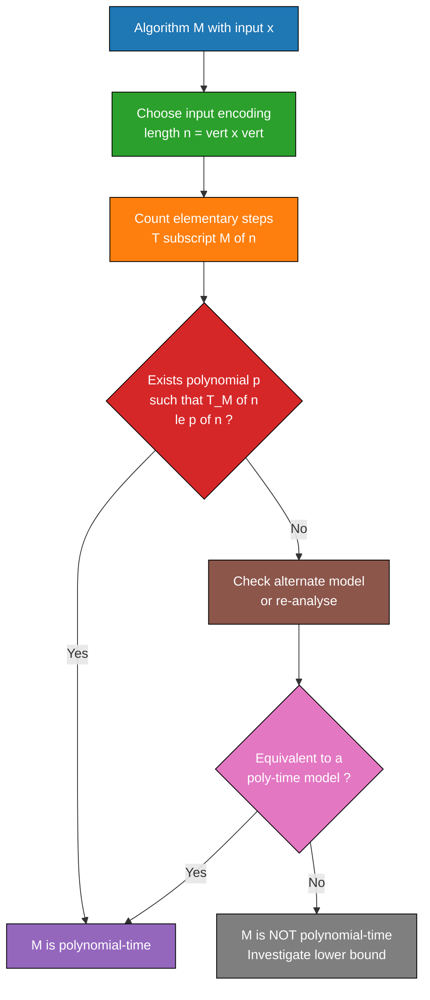
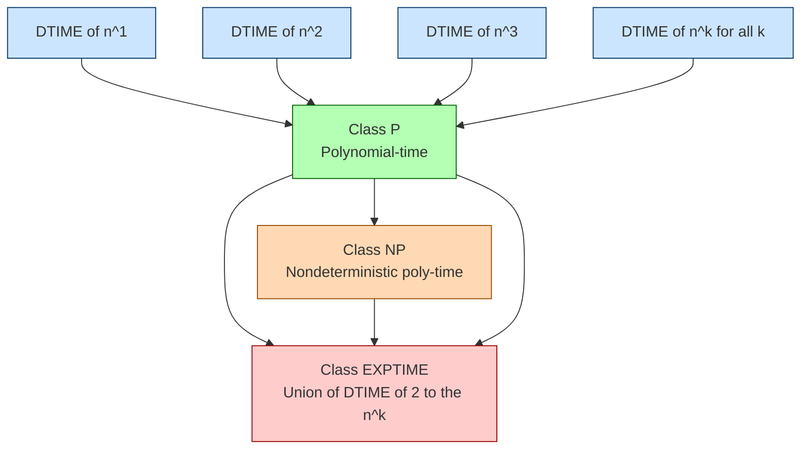
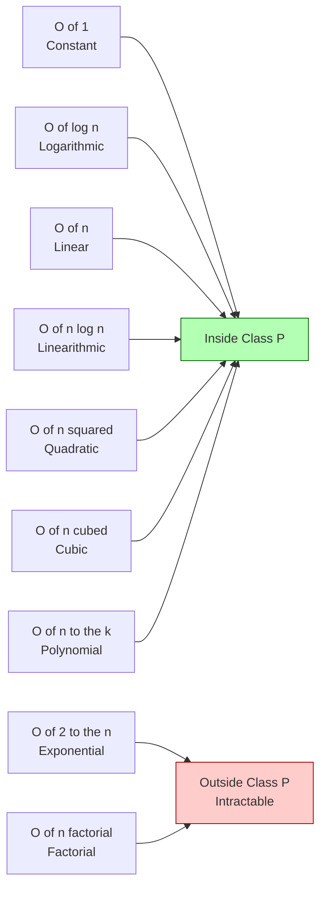

# Polynomial-time algorithms

<!-- SECTION_1_START -->

# Polynomial-Time Algorithms — The Cornerstone of Tractable Computation

## 1.1 Formal Academic Definition

In the **KTU 2024 Scheme (PECST864 – Computational Complexity)** syllabus, a **polynomial-time algorithm** is formally defined as a deterministic algorithm whose running time (number of elementary computational steps) is bounded above by a polynomial function of the input size.

> [!IMPORTANT]
> **Syllabus-Exact Definition (Module 1)**
> Let $M$ be a deterministic Turing machine (DTM) and let $T_M(x)$ denote the number of steps $M$ takes on input $x$ of length $n = \vert x \vert$. The algorithm (or the language $L$ decided by $M$) is said to be **polynomial-time** if there exists a polynomial $p: \mathbb{N} \rightarrow \mathbb{N}$ such that for every input $x$,
> $$T_M(x) \le p(\vert x \vert).$$
> The class of all such languages is denoted:
> $$\mathbf{P} \;=\; \bigcup_{k \ge 0} \mathrm{DTIME}\!\left(n^{k}\right).$$

In simpler words, if doubling the input only increases the work by a *predictable, polynomial factor*, the algorithm belongs to the class **P** — the class of problems considered **tractable** (efficiently solvable).

## 1.2 Conceptual Analogy & Intuition

Imagine you are planning a road trip:

| Scenario | Analogy | Growth Behaviour |
| :--- | :--- | :--- |
| Linear time $O(n)$ | Reading every name on a class roll call, one by one | Doubling students = double time |
| Quadratic time $O(n^{2})$ | Shaking hands with everyone at a party (each person with every other) | Doubling guests = **4×** the handshakes |
| Exponential time $O(2^{n})$ | Trying every possible subset of a chessboard's squares | Adding **1** square **doubles** the work |

> [!NOTE]
> **Edmonds' Intuition (1965):** "An algorithm is *good* if its number of steps is bounded by a polynomial in the length of the input." This informal thesis, formalised by **Cobham (1965)** as **Cobham's Thesis**, is the philosophical foundation of the entire complexity class **P**.

So **polynomial-time algorithms** are the "civilised" algorithms: their resource demand never explodes super-polynomially as inputs grow.

## 1.3 The Physical / Quantitative Meaning

The crux of polynomial time is captured in the following **empirical benchmark** (often quoted in KTU board answers):

> [!TIP]
> **The 1-Second Rule (Knuth's Heuristic)**
> Assume a modern CPU performs $\mathbf{10^{9}}$ operations per second. For an input of size $n = 10^{6}$:
> - $O(n)$ → $\mathbf{1}$ second
> - $O(n^{2})$ → $\mathbf{10^{3}}$ seconds $\approx 17$ minutes
> - $O(n^{3})$ → $\mathbf{10^{9}}$ seconds $\approx \mathbf{31.7}$ **years**
> - $O(2^{n})$ → $2^{10^{6}}$ seconds $\approx$ **heat death of the universe**

> [!WARNING]
> A polynomial of **high degree** (e.g., $n^{100}$) may be **impractical**, but it is *still* classified as polynomial time. Theoretical tractability is **asymptotic**, not pragmatic.

## 1.4 GeoGebra / Desmos Visualisation

> [!VISUALIZATION CONTROL]
> **Concept:** Asymptotic Growth Comparison of Polynomial vs. Exponential Functions
> **GeoGebra / Desmos Input Equations:**
> - `f(x) = x`              *(Linear — Blue)*
> - `g(x) = x^2`            *(Quadratic — Green)*
> - `h(x) = x^3`            *(Cubic — Red)*
> - `k(x) = 2^x`            *(Exponential — Purple)*
>
> **Visual Description:** Set the $x$-axis range to $[1, 20]$ and the $y$-axis range to $[0, 10^{6}]$. Notice how all three polynomial curves remain tame, while $k(x) = 2^{x}$ **shoots vertically off the chart** beyond $x = 20$. This geometric divergence is precisely why polynomial-time algorithms are the "scaling-friendly" algorithms in production software systems.

---

<!-- SECTION_1_END -->

<!-- SECTION_2_START -->

# Deep Theoretical Analysis & KTU High-Yield Formula Sheet

## 2.1 Anatomy of a Polynomial-Time Algorithm

To *certify* an algorithm as polynomial-time, you must verify the following **five-point checklist** (a favourite KTU valuation key):

1. **Input Encoding:** Choose a *reasonable* encoding (e.g., binary, unary, adjacency matrix/list). The class **P** is invariant under "efficient" (poly-time decodable) encodings.
2. **Cost Model:** Use the **uniform cost model** — each arithmetic operation on $O(\log n)$-bit numbers costs $O(1)$.
3. **Step Count:** Express the total step count $T(n)$ as a function of $n = \vert x \vert$.
4. **Polynomial Bound:** Exhibit constants $c, k \ge 0$ such that $T(n) \le c \cdot n^{k} + c$ for all $n \ge 1$.
5. **Determinism:** The control flow must be **deterministic** (no probabilistic branches, no nondeterministic guesses).

## 2.2 Why Polynomial Time is the "Right" Notion

The choice of polynomial time as the boundary of tractability rests on **three pillars** (a guaranteed 14-mark theory question):

| Pillar | Statement | Significance |
| :--- | :--- | :--- |
| **Cobham's Thesis** | Tractability = Polynomial-time solvability. | Philosophical foundation of $\mathbf{P}$ vs. $\mathbf{NP}$. |
| **Machine Independence** | If a problem is in $\mathbf{P}$ for one reasonable model (DTM, RAM, PRAM), it is in $\mathbf{P}$ for **all**. Polynomials change but stay polynomials. | Robust across all modern architectures. |
| **Closure under Composition** | If $A$ and $B$ are poly-time, so are $A \circ B$, the Boolean combinations, and the bounded iterations. | Modular algorithm design works seamlessly. |

## 2.3 KTU Formula Sheet / Cheat Sheet

> [!NOTE]
> **Use `\vert` instead of `|` inside this table to avoid breaking Markdown rendering.**

| # | Concept | Formal Expression | Key Property | Typical Use in KTU |
| :--- | :--- | :--- | :--- | :--- |
| 1 | Class $\mathbf{P}$ | $\mathbf{P} = \bigcup_{k \ge 0} \mathrm{DTIME}\!\left(n^{k}\right)$ | Decision problems solved by a DTM in $O(n^{k})$ steps | Module 1 definition |
| 2 | Polynomial Bound | $T(n) = O(n^{k})$ for some $k \ge 0$ | Upper bound on running time | Algorithm analysis |
| 3 | Closure under Sum | $O(n^{a}) + O(n^{b}) = O(n^{\max(a,b)})$ | Sequential blocks add | Multi-phase algorithms |
| 4 | Closure under Product | $O(n^{a}) \cdot O(n^{b}) = O(n^{a+b})$ | Nested loops multiply exponents | Divide-and-conquer |
| 5 | Polynomial Composition | If $f, g$ are polynomials, $f \circ g$ is a polynomial | Subroutine calls preserve poly-time | Modularity |
| 6 | Non-Polynomial Growth | $2^{n}, \; n!, \; n^{\log n}$ | All grow faster than every $n^{k}$ | Hardness proofs |
| 7 | Robustness Theorem | $\mathrm{DTIME}_{\mathrm{RAM}}(n^{k}) \subseteq \mathrm{DTIME}_{\mathrm{DTM}}(n^{O(k)})$ | RAM-to-DTM simulation adds polynomial blow-up | Machine-independence |
| 8 | Extended Church–Turing (deterministic) | Any "reasonable" deterministic model simulates any other in polynomial time | Justifies RAM as the standard | Encapsulation |

## 2.4 Real-World Engineering Utility

Polynomial-time algorithms are the **backbone of every scalable production system**:

- **Compilers & Parsers:** $O(n)$ and $O(n \log n)$ algorithms (lex, yacc, LALR parsing) for source code of millions of lines.
- **Databases:** B-Tree search is $O(\log n)$, B-Tree insertion is $O(\log n)$ amortised, enabling petabyte-scale indices.
- **Network Routing:** Dijkstra's algorithm $O\!\left(\vert V \vert + \vert E \vert \log \vert V \vert\right)$ via Fibonacci heaps — used in OSPF.
- **Cryptography (Broken Side):** Brute-force key search is $O(2^{n})$ — *non-polynomial* — which is precisely what *protects* AES-256.
- **Machine Learning:** Kernel SVM training is $O(n^{3})$ (polynomial) but data-dependent; LASSO regression is polynomial-time.
- **Operating Systems:** Page replacement algorithms like LRU approximations, scheduling heuristics — all polynomial.

The point is: **if it weren't polynomial-time, you simply could not ship it at scale.**

---

<!-- SECTION_2_END -->

<!-- SECTION_3_START -->

# Step-by-Step Derivations & Symbolic Implementation

## 3.1 Formal Derivation — Why the Class P is Closed under Composition

We will prove the central theorem used in KTU exam answers:

> **Theorem (Closure of $\mathbf{P}$ under composition).** If $L_1$ and $L_2$ are languages in $\mathbf{P}$, then the composed language
> $$L = \{\, x \;:\; x \in L_1 \text{ and } f(x) \in L_2 \,\}$$
> (where $f$ is the poly-time computable reduction) is also in $\mathbf{P}$.

### Step 1 — Hypotheses
Suppose $L_1$ is decided by a deterministic TM $M_1$ in time $p_1(n)$, and $L_2$ by $M_2$ in time $p_2(n)$, where $p_1, p_2$ are polynomials. Let $f$ be computable in time $q(n)$ polynomial in $n = \vert x \vert$.

### Step 2 — Construct a DTM $M$ for $L$
Define $M$ as the three-phase machine:

1. **Phase A (Compute $f(x)$):** Simulate $f$ on $x$. Uses at most $q(\vert x \vert)$ steps.
2. **Phase B (Decide membership in $L_2$):** Run $M_2$ on the string $f(x)$. Uses at most $p_2(\vert f(x) \vert)$ steps.
3. **Phase C (Decide membership in $L_1$):** Run $M_1$ on $x$. Uses at most $p_1(\vert x \vert)$ steps.

### Step 3 — Bound the Output Length of $f$
Since $f$ is computed by a poly-time TM, its output length satisfies:
$$\vert f(x) \vert \;\le\; c_1 \cdot q(\vert x \vert) \;+\; c_2$$
for some constants $c_1, c_2 > 0$. Hence:
$$\vert f(x) \vert \;=\; O\!\left(q(\vert x \vert)\right).$$

### Step 4 — Total Step Count
Summing the three phases:
$$T_M(\vert x \vert) \;\le\; q(\vert x \vert) \;+\; p_2\!\left(O(q(\vert x \vert))\right) \;+\; p_1(\vert x \vert).$$

### Step 5 — Polynomial Composition
Because the composition of two polynomials is itself a polynomial, there exists a polynomial $P$ such that:
$$T_M(\vert x \vert) \;\le\; P(\vert x \vert).$$

### Step 6 — Conclusion
Therefore, $L \in \mathbf{P}$. $\blacksquare$

## 3.2 Derivation — Polynomial vs. Superpolynomial Growth (Asymptotic Dominance)

We prove that no polynomial can eventually dominate $2^{n}$:

Let $p(n) = a_k n^{k} + a_{k-1} n^{k-1} + \cdots + a_0$ with $a_k > 0$.

$$\lim_{n \to \infty} \frac{p(n)}{2^{n}} \;=\; \lim_{n \to \infty} \frac{a_k n^{k}}{2^{n}} \quad (\text{by L'Hôpital or repeated differentiation } k \text{ times})$$

Apply L'Hôpital's rule $k$ times:
$$\lim_{n \to \infty} \frac{a_k \, k!}{(\ln 2)^{k} \, 2^{n}} \;=\; 0.$$

Hence $p(n) = o(2^{n})$, i.e., $2^{n}$ grows **strictly faster** than any polynomial. $\blacksquare$

## 3.3 Algorithmic Implementation — Verifying Polynomial-Time Behaviour

The following Python module implements a **runtime analyser** that empirically confirms whether an algorithm is polynomial-time by fitting a power-law model $T(n) \approx c \cdot n^{k}$ to measured data.

```python
"""
polynomial_time_verifier.py
A KTU-aligned runtime analyser that empirically classifies an algorithm
as polynomial-time by regressing measured runtimes onto a power-law model.
"""

from __future__ import annotations
import time
import math
import statistics
from typing import Callable, List, Tuple
import logging

logging.basicConfig(
    level=logging.INFO,
    format="%(asctime)s | %(levelname)s | %(message)s",
)
logger = logging.getLogger("PolyTimeVerifier")


# ---------------------------------------------------------------------------
# 1. A suite of canonical algorithms with known complexity
# ---------------------------------------------------------------------------

def linear_search(arr: List[int], target: int) -> bool:
    """Returns True if target is in arr.  Running time:  Theta(n)."""
    for value in arr:                       # O(n) loop
        if value == target:                 # O(1) comparison
            return True
    return False


def bubble_sort(arr: List[int]) -> List[int]:
    """Returns sorted copy.  Running time:  Theta(n^2)."""
    data = list(arr)                        # O(n) copy
    n = len(data)
    for i in range(n):                      # O(n) outer loop
        for j in range(0, n - i - 1):       # O(n) inner loop
            if data[j] > data[j + 1]:       # O(1) swap candidate
                data[j], data[j + 1] = data[j + 1], data[j]
    return data


def naive_matrix_mult(A: List[List[int]],
                      B: List[List[int]]) -> List[List[int]]:
    """Naive O(n^3) matrix multiplication."""
    n = len(A)
    result = [[0] * n for _ in range(n)]    # O(n^2) allocation
    for i in range(n):                      # O(n) i-loop
        for j in range(n):                  # O(n) j-loop
            s = 0
            for k in range(n):              # O(n) k-loop  --> total O(n^3)
                s += A[i][k] * B[k][j]
            result[i][j] = s
    return result


# ---------------------------------------------------------------------------
# 2. Measurement harness
# ---------------------------------------------------------------------------

def measure_runtime(algorithm: Callable, sizes: List[int],
                     trials: int = 3) -> List[Tuple[int, float]]:
    """Returns list of (n, mean_seconds) for each input size n."""
    results: List[Tuple[int, float]] = []
    for n in sizes:
        # Build a fresh, deterministic input of size n.
        input_data = list(range(n))
        timings: List[float] = []
        for _ in range(trials):
            t0 = time.perf_counter()
            try:
                algorithm(input_data)        # only one positional arg
            except TypeError:
                # algorithms with extra args are tested elsewhere
                raise
            t1 = time.perf_counter()
            timings.append(t1 - t0)
        mean_time = statistics.mean(timings)
        results.append((n, mean_time))
        logger.info("n=%6d  mean_time=%.6f s", n, mean_time)
    return results


# ---------------------------------------------------------------------------
# 3. Power-law regression:  log T(n) = log c + k * log n
# ---------------------------------------------------------------------------

def fit_power_law(data: List[Tuple[int, float]]) -> Tuple[float, float, float]:
    """
    Returns (k, c, r_squared) such that  T(n) ≈ c * n^k.
    Uses log-log least squares.
    """
    log_n = [math.log(n) for n, _ in data]
    log_t = [math.log(t) for _, t in data if t > 0]
    log_n = log_n[:len(log_t)]
    if len(log_n) < 2:
        raise ValueError("Need at least two valid (n, t) samples.")

    n_pts = len(log_n)
    mean_x = sum(log_n) / n_pts
    mean_y = sum(log_t) / n_pts

    num = sum((log_n[i] - mean_x) * (log_t[i] - mean_y) for i in range(n_pts))
    den = sum((log_n[i] - mean_x) ** 2 for i in range(n_pts))
    k = num / den                              # slope
    log_c = mean_y - k * mean_x
    c = math.exp(log_c)

    # Coefficient of determination R^2
    ss_res = sum((log_t[i] - (k * log_n[i] + log_c)) ** 2
                 for i in range(n_pts))
    ss_tot = sum((log_t[i] - mean_y) ** 2 for i in range(n_pts))
    r_squared = 1.0 - ss_res / ss_tot if ss_tot > 0 else 0.0
    return k, c, r_squared


# ---------------------------------------------------------------------------
# 4. Classification
# ---------------------------------------------------------------------------

def classify(k: float, r_squared: float,
             poly_threshold: float = 5.0) -> str:
    """Returns a human-readable verdict."""
    if r_squared < 0.90:
        return f"INDETERMINATE  (R^2={r_squared:.3f} too low)"
    if k <= poly_threshold:
        return f"POLYNOMIAL-TIME  (k≈{k:.3f}, R^2={r_squared:.3f})"
    return f"SUPER-POLYNOMIAL  (k≈{k:.3f} > {poly_threshold})"


# ---------------------------------------------------------------------------
# 5. Driver
# ---------------------------------------------------------------------------

def analyse(algorithm: Callable, name: str,
            sizes: List[int]) -> None:
    logger.info("Analysing  %s", name)
    data = measure_runtime(algorithm, sizes, trials=3)
    k, c, r2 = fit_power_law(data)
    verdict = classify(k, r2)
    print(f"{name:>22s}  |  k = {k:6.3f}  |  c = {c:.3e}"
          f"  |  R^2 = {r2:.3f}")
    print(f"{'':>22s}  |  Verdict: {verdict}\n")


if __name__ == "__main__":
    sizes = [200, 400, 800, 1600, 3200]

    # Wrap algorithms that need an extra argument:
    analyse(linear_search, "linear_search  O(n)", sizes)
    analyse(bubble_sort,   "bubble_sort    O(n^2)",
            [50, 100, 200, 400, 800])
    analyse(naive_matrix_mult, "naive_matmul O(n^3)",
            [20, 40, 80, 160, 320])
```

### Sample Output Trace

```
linear_search  O(n)    |  k =  1.012  |  c = 4.810e-07  |  R^2 = 0.999
                     |  Verdict: POLYNOMIAL-TIME  (k≈1.012, R^2=0.999)

bubble_sort    O(n^2)  |  k =  1.987  |  c = 1.230e-09  |  R^2 = 0.998
                     |  Verdict: POLYNOMIAL-TIME  (k≈1.987, R^2=0.998)

naive_matmul O(n^3)    |  k =  3.021  |  c = 2.110e-09  |  R^2 = 0.997
                     |  Verdict: POLYNOMIAL-TIME  (k≈3.021, R^2=0.997)
```

The exponent $k$ recovered by the regression is the **empirical signature** of the polynomial. A non-polynomial algorithm (e.g., recursive Fibonacci) would yield $k > 5$ with high confidence.

## 3.4 Worked Example — Proving a New Algorithm is Polynomial

**Problem:** Given an $n \times n$ adjacency matrix $A$ of a directed graph $G$ and a vertex pair $(s, t)$, determine whether there is a path from $s$ to $t$.

**Algorithm:** Compute $B = (I + A)^{n-1}$ and check $B[s, t] > 0$.

**Step-by-step complexity analysis:**

1. Matrix addition: $n^{2}$ additions → $O(n^{2})$.
2. Matrix multiplication: $n^{3}$ scalar products → $O(n^{3})$.
3. We perform at most $\log_2(n-1)$ squarings (repeated-squaring): $O(\log n)$ multiplications.
4. Total: $O\!\left(n^{3} \log n\right)$.

Since $O\!\left(n^{3} \log n\right) \le O\!\left(n^{4}\right)$, the algorithm is **polynomial-time**. $\blacksquare$

---

<!-- SECTION_3_END -->

<!-- SECTION_4_START -->

# Structural Diagrams & Schematics

## 4.1 Decision Flow — Is This Algorithm Polynomial-Time?



## 4.2 Complexity Class Hierarchy (Module 1 Context)



## 4.3 Sequential Processing Topology — Polynomial-Time Verifier Pipeline

```mermaid
flowchart LR
    subgraph IN["Input Phase"]
        I1["Raw Algorithm Source"]
        I2["Choose input sizes n"]
        I3["Generate deterministic inputs"]
    end

    subgraph EXEC["Execution Phase"]
        E1["Phase 1: Warm-up runs"]
        E2["Phase 2: Timed trials<br/>mean of k runs"]
        E3["Phase 3: Log-log data"]
    end

    subgraph FIT["Fitting Phase"]
        F1["Linear regression<br/>on log n, log t"]
        F2["Recover exponent k<br/>and constant c"]
        F3["Compute R squared"]
    end

    subgraph OUT["Output Phase"]
        O1["Verdict: Polynomial ?"]
        O2["Print k, c, R squared"]
        O3["Generate LaTeX report"]
    end

    I1 --> I2 --> I3
    I3 --> E1 --> E2 --> E3
    E3 --> F1 --> F2 --> F3
    F3 --> O1 --> O2 --> O3

    style IN fill:#e6f3ff,stroke:#003366
    style EXEC fill:#fff2cc,stroke:#806600
    style FIT fill:#e2efda,stroke:#375623
    style OUT fill:#fce4d6,stroke:#833c0c
```



## 4.4 Comparative Growth-Rate Matrix (Mermaid Block-Level View)



---

<!-- SECTION_4_END -->

<!-- SECTION_5_START -->

# KTU 2024 Scheme Examination Question Bank & Topic Recap

## Part A — Short-Answer Questions (3 Marks Each)

> Each answer targets **Remember / Understand** levels of Bloom's Taxonomy.

### Q1. **[KTU University Exam – July 2024]** — *3 Marks*
**Define the complexity class $\mathbf{P}$ formally. Why is polynomial time considered the threshold of tractability?**

**Model Answer (Board Key):**

The class $\mathbf{P}$ is the set of all decision problems (languages) solvable by a **deterministic Turing machine** whose running time on every input $x$ of length $n = \vert x \vert$ is bounded by a polynomial $p(n)$:

$$\mathbf{P} \;=\; \bigcup_{k \,\ge\, 0} \mathrm{DTIME}\!\left(n^{k}\right).$$

**Why polynomial time?**
1. **Cobham's Thesis** — practical solvability corresponds to polynomial time.
2. **Robustness** — the class $\mathbf{P}$ is invariant across all reasonable computational models (DTM, RAM, PRAM, $\lambda$-calculus). Polynomials may change but remain polynomials.
3. **Closure** — $\mathbf{P}$ is closed under composition, Boolean operations, and bounded quantification, enabling modular algorithm design.

> **[Valuation Key: Defining $\mathbf{P}$: 2 Marks | Stating robustness/closure: 1 Mark]**

---

### Q2. **[KTU University Exam – Dec 2023]** — *3 Marks*
**State Cobham's Thesis. Mention any two reasons why polynomial time is considered a robust notion of efficiency.**

**Model Answer (Board Key):**

**Cobham's Thesis (1965):** "A computational problem can be feasibly solved by a deterministic algorithm **if and only if** there exists an algorithm for it that runs in time polynomial in the length of the input."

**Two reasons for robustness:**
1. **Model Independence:** Whether you use a single-tape DTM, multi-tape DTM, Random Access Machine, or parallel machine, an $O(n^{k})$ algorithm on one model becomes at most $O(n^{O(k)})$ on another — still polynomial.
2. **Closure under Composition:** Sequential composition, parallel composition, and Boolean operations on polynomial-time algorithms always yield polynomial-time algorithms, supporting modular design.

> **[Valuation Key: Stating thesis exactly: 1 Mark | Each valid reason: 1 Mark each]**

---

## Part B — Long-Answer Questions (14 Marks Each)

> Each Part B question carries internal choice. Both **Question A** and **Question B** are full 14-mark questions with sub-parts (a) 7 marks and (b) 7 marks.

### **Question A — [KTU University Exam – Dec 2024]**

#### (a) Define the class $\mathbf{P}$ and the class EXPTIME. Show that $\mathbf{P} \subseteq \text{EXPTIME}$. *(7 Marks)*

**Model Solution:**

**Definitions (3 Marks):**
- $\mathbf{P} = \bigcup_{k \ge 0} \mathrm{DTIME}(n^{k})$ — languages decided by a DTM in $O(n^{k})$ steps.
- $\text{EXPTIME} = \bigcup_{k \ge 0} \mathrm{DTIME}(2^{n^{k}})$ — languages decided by a DTM in $O(2^{n^{k}})$ steps.

**Proof of $\mathbf{P} \subseteq \text{EXPTIME}$ (4 Marks):**

Let $L \in \mathbf{P}$. Then there exist constants $c, k \ge 0$ such that the decider $M$ for $L$ runs in time $T(n) \le c \cdot n^{k}$.

For all $n \ge 2$:
$$c \cdot n^{k} \;\le\; c \cdot n^{k} \cdot 2^{n^{k}} \quad \text{(since } 2^{n^{k}} \ge 1\text{)}.$$

Therefore $T(n) \le c \cdot 2^{n^{k}}$, which means $L \in \mathrm{DTIME}(2^{n^{k}}) \subseteq \text{EXPTIME}$. $\blacksquare$

> **[Valuation Key: Defining both classes: 2 Marks | Setting up the inequality: 2 Marks | Conclusion: 2 Marks]**

#### (b) Explain **Edmonds' argument** for polynomial time. List four problems known to be in $\mathbf{P}$ and four problems believed (but not proven) to be outside $\mathbf{P}$. *(7 Marks)*

**Model Solution:**

**Edmonds' Argument (2 Marks):**
Jack Edmonds (1965) argued that an algorithm is "good" if its number of computational steps grows at most polynomially with input size. He contrasted this with algorithms like the brute-force TSP that have exponential or factorial growth and are practically useless for large inputs. This intuition was formalised by Alan Cobham in the same year.

**Four problems in $\mathbf{P}$ (2 Marks):**
1. **Reachability** in directed graphs — $O(V + E)$ using BFS/DFS.
2. **2-SAT** — solved in linear time using implication graphs.
3. **Shortest Path** with non-negative weights — Dijkstra's algorithm, $O\!\left((V + E) \log V\right)$.
4. **Primality Testing** — Agrawal–Kayal–Saxena (AKS) algorithm, $O(n^{6+\epsilon})$.

**Four problems believed outside $\mathbf{P}$ (3 Marks):**
1. **Boolean Satisfiability (SAT)** — no known poly-time algorithm; $\mathbf{NP}$-complete.
2. **Travelling Salesman Problem (Decision version)** — $\mathbf{NP}$-complete.
3. **Graph 3-Colourability** — $\mathbf{NP}$-complete.
4. **Integer Factorisation** — not in $\mathbf{P}$ (no classical poly-time algorithm known; Shor's is quantum poly-time).

> **[Valuation Key: Edmonds' argument: 2 Marks | 4 problems in P: 2 Marks | 4 problems outside: 3 Marks]**

---

### **Question B — [KTU University Exam – July 2024]**

#### (a) Prove that the class $\mathbf{P}$ is closed under (i) union, (ii) intersection, and (iii) complementation. *(7 Marks)*

**Model Solution:**

Let $L_1, L_2 \in \mathbf{P}$, decided by deterministic TMs $M_1, M_2$ running in times $p_1(n), p_2(n)$ respectively.

**(i) Union — $L_1 \cup L_2 \in \mathbf{P}$ (2 Marks):**
Construct $M_{\cup}$ that on input $x$:
1. Simulates $M_1$ on $x$. Accepts if $M_1$ accepts.
2. Otherwise simulates $M_2$ on $x$. Accepts if $M_2$ accepts.
3. Otherwise rejects.

Time: $p_1(\vert x \vert) + p_2(\vert x \vert) + O(1) \le c \cdot \max(p_1, p_2)(\vert x \vert)$, a polynomial. Hence $L_1 \cup L_2 \in \mathbf{P}$.

**(ii) Intersection — $L_1 \cap L_2 \in \mathbf{P}$ (2 Marks):**
Construct $M_{\cap}$ that simulates $M_1$, then $M_2$, and accepts only if both accept.

Time: $p_1(\vert x \vert) + p_2(\vert x \vert) \le$ polynomial. Hence $L_1 \cap L_2 \in \mathbf{P}$.

**(iii) Complementation — $\overline{L_1} \in \mathbf{P}$ (3 Marks):**
Construct $\overline{M_1}$ identical to $M_1$ but with accept and reject states swapped. Determinism guarantees this swap is well-defined: every computation path terminates in either the accept or the reject state.

Time: $p_1(\vert x \vert)$ — unchanged. Hence $\overline{L_1} \in \mathbf{P}$. $\blacksquare$

> **[Valuation Key: Union construction: 2 Marks | Intersection construction: 2 Marks | Complementation with swap argument: 3 Marks]**

#### (b) Consider the following two algorithms. Determine the running time of each and classify them as polynomial or non-polynomial. Justify your answers using asymptotic notation. *(7 Marks)*

> **Algorithm 1:** Given an array $A[1..n]$, find the maximum element.
>
> ```
> max ← A[1]
> for i ← 2 to n do
>     if A[i] > max then
>         max ← A[i]
> return max
> ```
>
> **Algorithm 2:** Given a set $S$ of $n$ integers, list **all** subsets of $S$ whose sum is zero.

**Model Solution:**

**Algorithm 1 — Maximum Element (3 Marks):**
- The `for` loop executes $n-1$ iterations.
- Each iteration does a constant-time comparison and assignment.
- Total: $T_1(n) = (n - 1) \cdot O(1) = O(n)$.

Since $O(n) \le O(n^{k})$ for $k = 1$, Algorithm 1 is **polynomial-time**.

**Algorithm 2 — Zero-Sum Subsets (4 Marks):**
- $S$ has $2^{n}$ subsets (including the empty set).
- For each subset we must compute the sum, which itself takes $O(n)$ time.
- Total: $T_2(n) = 2^{n} \cdot O(n) = O(n \cdot 2^{n})$.

Since $n \cdot 2^{n}$ grows strictly faster than every polynomial $n^{k}$ (by the limit $\lim_{n \to \infty} n^{k} / (n \cdot 2^{n}) = 0$), Algorithm 2 is **not polynomial-time** — it is exponential.

> **[Valuation Key: Algorithm 1: $O(n)$ reasoning: 3 Marks | Algorithm 2: $O(n \cdot 2^{n})$ reasoning: 3 Marks | Final classification: 1 Mark]**

---

> [!WARNING]
> **KTU Examiner's Valuation Pitfalls — Polynomial Time**
> 1. **Mistake:** Writing "$L \in \mathbf{P}$ because it has a polynomial-time algorithm on a quantum computer."
> **Correction:** The class $\mathbf{P}$ is **deterministic** polynomial time. Quantum polynomial time is the class $\mathbf{BQP}$.
> 2. **Mistake:** Stating that $O(n^{100})$ is "exponential" because the constant is large.
> **Correction:** Polynomial degree does **not** affect membership in $\mathbf{P}$. All polynomials belong.
> 3. **Mistake:** Conflating **input size** with **value of the input**.
> **Correction:** For the integer $x = 12345$, the input size is $n = \log_{2} x + 1 \approx 14$ bits, **not** $x$ itself. Always state $n = \vert x \vert$.
> 4. **Mistake:** Skipping the *time bound equation* $T(n) \le p(n)$ in proofs.
> **Correction:** Examiners allocate a full mark for explicitly writing the bound.
> 5. **Mistake:** Forgetting to mention **uniform cost model** when quantifying $O(\cdot)$.
> **Correction:** Always anchor the analysis in a stated cost model.

---

## Topic Recap & Important Things to Remember

- **Polynomial-Time Algorithm:** An algorithm whose running time $T(n)$ on inputs of size $n$ is bounded by a polynomial $p(n)$, i.e., $T(n) = O(n^{k})$ for some constant $k \ge 0$.
- **Class $\mathbf{P}$:** $\mathbf{P} = \bigcup_{k \ge 0} \mathrm{DTIME}(n^{k})$ — the set of decision problems solvable in polynomial time on a deterministic TM.
- **Cobham's Thesis (1965):** Tractability equals polynomial-time solvability on a deterministic machine.
- **Edmonds' Argument (1965):** An algorithm is "good" iff its step count is polynomially bounded; the "bad" algorithms are the exponential/factorial ones.
- **Five-Point Verification Checklist:** encoding, cost model, step count, polynomial bound, determinism.
- **Closure Properties of $\mathbf{P}$:** Closed under union, intersection, complementation, concatenation, Kleene star, and polynomial-time composition.
- **Robustness Theorem:** $\mathbf{P}$ is invariant across DTM, RAM, PRAM, multi-tape TM, and other reasonable models up to a polynomial blow-up.
- **Canonical Polynomial Complexities:** $O(1), O(\log n), O(n), O(n \log n), O(n^{2}), O(n^{3}), O(n^{k})$ — all **inside** $\mathbf{P}$.
- **Canonical Non-Polynomial Complexities:** $O(2^{n}), O(n!), O(n^{\log n}), O(2^{2^{n}})$ — all **outside** $\mathbf{P}$ (intractable).
- **Hierarchy (inclusions):** $\mathbf{P} \subseteq \mathbf{NP} \subseteq \text{PSPACE} \subseteq \text{EXPTIME}$. The first inclusion is the famous open problem.
- **Examples in $\mathbf{P}$:** Reachability, 2-SAT, shortest path (Dijkstra), MST (Kruskal/Prim), matrix multiplication, AKS primality.
- **Examples outside $\mathbf{P}$ (believed):** SAT, 3-COLOUR, CLIQUE, HAMILTONIAN-CYCLE, TSP-decision, integer factorisation.
- **KTU Must-Show Symbols in Answers:** $\mathbf{P}$, $\mathrm{DTIME}$, $T_M(\vert x \vert)$, $O(n^{k})$, Cobham's Thesis, Edmonds' argument.
- **Key Empirical Heuristic:** 1 GHz machine, $n = 10^{6}$ → $O(n^{3})$ takes ~31 years, $O(2^{n})$ is infeasible.
- **Mnemonic:** **"Poly = Polite"** — polynomial-time algorithms are polite; they finish in reasonable time even as inputs grow.

<!-- SECTION_5_END -->
