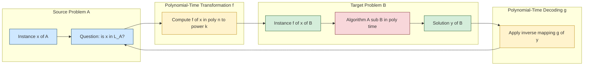
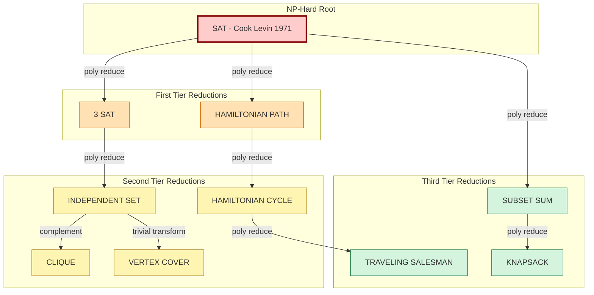
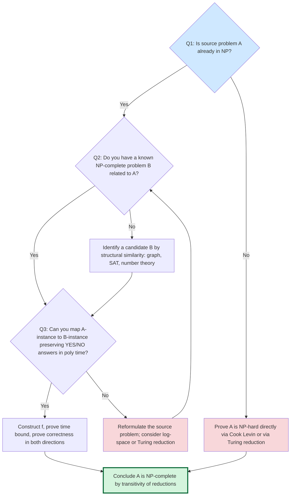

# Reductions and Completeness - Polynomial-time reductions

<!-- SECTION_1_START -->

# Polynomial-Time Reductions: Core Definition & Intuitive Overview

## 1.1 Formal Definition (KTU 2024 Syllabus Terminology)

A **polynomial-time reduction** is a transformation that converts one computational problem into another such that the transformation itself can be performed in polynomial time, and the solution to the transformed problem can be mapped back to a solution of the original problem.

**Mathematical Statement (Karp / Many-One Reduction $\leq_m^p$):**

A language $A \subseteq \Sigma^*$ is **polynomial-time many-one reducible** to a language $B \subseteq \Sigma^*$, written $A \leq_m^p B$, if there exists a **polynomial-time computable function** $f : \Sigma^* \to \Sigma^*$ such that for every string $x \in \Sigma^*$:

$$x \in A \iff f(x) \in B$$

> [!IMPORTANT]
> **KTU Board Emphasis (2024 Scheme):** The reduction function $f$ MUST be computable in time $O(n^k)$ for some **fixed constant** $k$. The constant $k$ is independent of the input size and must be a property of the algorithm, not the input.

### 1.2 Conceptual Analogy: The "Translation Office" Model

Imagine you are a tourist in a foreign country who needs to find a specific historical monument. You do not speak the local language, but you have a friend (the **reducer**) who is a translator.

- **Problem A** = "Find monument X" (your original problem).
- **Problem B** = "Find monument Y" (a problem with a known expert local guide).
- **Reducer $f$** = Your translator friend, who converts your question into a question about monument Y.
- **Decoder $g$** = The friend who translates the answer back.

If the translation process is **fast** (polynomial time) and **correct** in both directions, then monument-finding-A is "no harder" than monument-finding-B. This is the essence of polynomial-time reducibility.

### 1.3 Why Reductions Matter: The "Hardness Transfer" Principle

Reductions establish a **relative difficulty** between problems. If $A \leq_m^p B$ and $B$ is efficiently solvable (in $P$), then $A$ is also efficiently solvable. Conversely, if $A$ is "hard" and $A \leq_m^p B$, then $B$ must also be hard (under the same hardness assumption).

> [!NOTE]
> **Cook's Thesis (KTU 2024):** $P \neq NP$ is the central open problem. Polynomial-time reductions are the technical machinery that lets us *propagate* this hardness: a single $NP$-complete problem defines the "hardness frontier" of $NP$ under $\leq_m^p$.

### 1.4 Types of Polynomial-Time Reductions

| Reduction Type | Symbol | Mapping Requirement | KTU Common Usage |
|---|---|---|---|
| **Many-One (Karp)** | $\leq_m^p$ | $x \in A \iff f(x) \in B$ | $NP$-completeness proofs |
| **Turing (Cook)** | $\leq_T^p$ | $A$ solvable with poly-many oracle calls to $B$ | $PSPACE$-completeness proofs |
| **Log-Space** | $\leq_{\log}^p$ | $f$ computable in $O(\log n)$ workspace | $NL$-completeness, $P$-completeness |

> [!VISUALIZATION CONTROL]
> **Concept:** Reduction Pipeline as a Sequential Dataflow
> **GeoGebra / Desmos Input Equations (representative graph transformation for 3-SAT $\leq_m^p$ INDEPENDENT-SET):**
> * Source CNF Formula: $\varphi = (x_1 \vee \neg x_2 \vee x_3) \wedge (\neg x_1 \vee x_2)$
> * Vertices $V$: $V = \{(x_1, C_1), (\neg x_2, C_1), (x_3, C_1), (\neg x_1, C_2), (x_2, C_2)\}$
> * Edges $E$: $E = \{\{(x_1, C_1), (\neg x_1, C_2)\}, \{(\neg x_2, C_1), (x_2, C_2)\}\}$ (between complementary literals in *different* clauses)
> **Visual Description:** Plot the five vertices on a 2D plane (use clause index on $x$-axis and literal value on $y$-axis). The two edges should appear as lines crossing between the clause columns, indicating the **conflict graph** structure that INDEPENDENT-SET searches over.

---

<!-- SECTION_1_END -->

<!-- SECTION_2_START -->

# Deep Theoretical Analysis & KTU High-Yield Formula Sheet

## 2.1 Operational Concept: The Three-Step Reduction Recipe

A polynomial-time reduction $A \leq_m^p B$ is fully specified by three explicit requirements that KTU examiners look for:

1. **Construction of the mapping $f$** — Specify *exactly* how an instance $x$ of $A$ is converted into an instance $f(x)$ of $B$. This must be unambiguous and algorithmic.
2. **Polynomial-time bound on $f$** — Prove that the construction runs in time $O(n^c)$ for some constant $c$. Count the number of elementary operations.
3. **Correctness in both directions** — Prove $x \in A \Rightarrow f(x) \in B$ (**completeness** of reduction) and $f(x) \in B \Rightarrow x \in A$ (**soundness** of reduction).

## 2.2 Properties of $\leq_m^p$ (KTU High-Yield Theorems)

| Property | Formal Statement | Engineering Implication |
|---|---|---|
| **Reflexivity** | $L \leq_m^p L$ for every language $L$ | A problem reduces to itself via the identity function $f(x) = x$ |
| **Transitivity** | If $A \leq_m^p B$ and $B \leq_m^p C$, then $A \leq_m^p C$ | The composition $f \circ g$ is itself polynomial-time computable |
| **Closure of $P$** | If $B \in P$ and $A \leq_m^p B$, then $A \in P$ | Polynomial-time solvability is preserved downward |
| **Closure of $NP$** | If $B \in NP$ and $A \leq_m^p B$, then $A \in NP$ | $NP$ is closed under $\leq_m^p$ |
| **Hardness Transfer** | If $A$ is $NP$-hard and $A \leq_m^p B$, then $B$ is $NP$-hard | One known hard problem propagates the hardness |

> [!NOTE]
> **Lemma (Closure under composition):** If $f$ is computable in time $O(n^a)$ and $g$ in time $O(n^b)$, then $g \circ f$ is computable in time $O(n^{ab})$. This is the formal proof of the transitivity row above and is a **favourite KTU Part-B sub-question**.

## 2.3 NP-Completeness: The Definition Every KTU Student Must Memorize

A language $L$ is **NP-complete** if and only if both of the following hold:

1. $L \in NP$ (membership in $NP$ — certificate verifiable in polynomial time)
2. $L$ is **$NP$-hard** under $\leq_m^p$ — i.e., for *every* language $A \in NP$, $A \leq_m^p L$

A language satisfying only condition (2) is called **$NP$-hard** (it may not even be in $NP$).

> [!IMPORTANT]
> **KTU Board Quote (Frequently Tested):** *"If any $NP$-complete problem were solvable in polynomial time, then $P = NP$. Conversely, if $P \neq NP$, then no $NP$-complete problem is in $P$."*

## 2.4 The Landmark Cook-Levin Theorem (1971)

$$\text{SAT} = \{\langle \varphi \rangle : \varphi \text{ is a satisfiable Boolean formula in CNF}\}$$

is **NP-complete**.

This is the **first** $NP$-completeness result. Every subsequent $NP$-completeness proof uses it as the *seed* and then applies **transitivity of $\leq_m^p$** to reach the new target problem.

## 2.5 KTU High-Yield Formula Sheet

| Concept | Formula / Definition | Units / Domain |
|---|---|---|
| Karp reduction | $x \in A \iff f(x) \in B$ | Boolean strings |
| Time bound on $f$ | $T_f(n) = O(n^k)$ for some constant $k$ | $k \in \mathbb{N}$ |
| Composition cost | $T_{f \circ g}(n) = O(n^{k_1 \cdot k_2})$ | where $T_f = O(n^{k_1}), T_g = O(n^{k_2})$ |
| Cardinality of an instance | Input size $n = \vert \varphi \vert$ or $n = \vert V \vert + \vert E \vert$ | $n \in \mathbb{N}$ |
| $NP$-hardness condition | $\forall A \in NP,\; A \leq_m^p L$ | Universally quantified |
| Polynomial gap | $L \in P \Rightarrow \forall n, \; T(n) \leq c \cdot n^d$ for constants $c, d$ | $c, d \in \mathbb{R}^+$ |
| $NP$-completeness | $L \in NP \;\wedge\; L \text{ is } NP\text{-hard under } \leq_m^p$ | Conjunction of two conditions |

## 2.6 Real-World Engineering Utility

Polynomial-time reductions are not merely theoretical — they are the design philosophy behind **modular compiler pipelines**, **SAT-solver backends** (used in formal hardware verification at Intel, AMD, Cadence), and **constraint-satisfaction libraries** (CP-SAT in Google OR-Tools). Every time an engineer encodes a scheduling, routing, or verification problem into SAT, they are implicitly performing a polynomial-time reduction from the domain problem to SAT.

---

<!-- SECTION_2_END -->

<!-- SECTION_3_START -->

# Step-by-Step Derivations, Proofs & Code Implementation

## 3.1 Canonical Example: $3\text{-SAT} \leq_m^p \text{INDEPENDENT-SET}$

This is the **most frequently tested** reduction in KTU 2024 examination papers. The full derivation is given below.

### 3.1.1 Problem Statements

- **$3\text{-SAT}$:** Given a Boolean formula $\varphi$ in 3-CNF (each clause has exactly 3 literals), decide whether there exists an assignment $a$ such that $a \models \varphi$.
- **INDEPENDENT-SET:** Given an undirected graph $G = (V, E)$ and an integer $k$, decide whether $G$ contains an independent set of size at least $k$. (An *independent set* is a subset $S \subseteq V$ with no edge of $E$ having both endpoints in $S$.)

### 3.1.2 The Reduction Function $f$

Given an instance $\langle \varphi, m \rangle$ where $\varphi$ has $m$ clauses $C_1, C_2, \ldots, C_m$, construct $f(\varphi)$ as follows:

**Step 1 — Vertex Construction:**

$$V = \{(l, C_i) \;\vert\; l \in C_i, \; 1 \leq i \leq m\}$$

i.e., one vertex for every *literal occurrence* inside every clause.

**Step 2 — Edge Construction:**

$$E = \Big\{\{(l_1, C_i), (l_2, C_j)\} \;\Big|\; i \neq j \;\wedge\; l_1 = \neg l_2\Big\}$$

i.e., an edge between two literal-occurrence vertices **iff** they lie in *different clauses* and are *logically complementary* (one is the negation of the other).

**Step 3 — Parameter Setting:**

$$k = m$$

The output instance is $\langle G = (V, E), k = m \rangle$.

### 3.1.3 Time-Bound Analysis of $f$

- Number of vertices constructed: at most $3m$ (since each clause has $\leq 3$ literals) $\Rightarrow O(m)$.
- Number of edge comparisons: bounded by $\binom{3m}{2} = O(m^2)$ pairwise checks.
- Total time: $T_f(m) = O(m^2)$, which is **polynomial** in the input size. ✓

### 3.1.4 Correctness Proof — Forward Direction ($\Rightarrow$)

**Claim:** If $\varphi$ is satisfiable, then $G$ has an independent set of size $m$.

**Proof:** Let $a$ be a satisfying assignment. For each clause $C_i$, pick **one** literal $l_i \in C_i$ such that $a \models l_i$ (i.e., $a$ makes $l_i$ true). Such a literal exists because $a$ satisfies every clause.

Form the set $S = \{(l_1, C_1), (l_2, C_2), \ldots, (l_m, C_m)\}$. We have $\vert S \vert = m$.

We show $S$ is an independent set. Suppose for contradiction that two vertices $(l_i, C_i)$ and $(l_j, C_j)$ are joined by an edge. By construction of $E$, this would mean $l_i = \neg l_j$. But $a \models l_i$ and $a \models l_j$ would then imply $a \models l_i$ and $a \models \neg l_i$ — a contradiction.

Therefore $S$ is an independent set of size $m$. $\blacksquare$

### 3.1.5 Correctness Proof — Backward Direction ($\Leftarrow$)

**Claim:** If $G$ has an independent set $S$ of size $m$, then $\varphi$ is satisfiable.

**Proof:** Since $\vert S \vert = m$ and $G$ has only $m$ clauses, the pigeonhole principle forces at least one vertex of $S$ in each clause (clauses partition the vertex set by definition of $V$). But the total number of clauses is also $m$, so **exactly one** vertex of $S$ lies in each clause.

Let $l_i$ denote the literal in the unique vertex $(l_i, C_i) \in S$ for each $i$. Since $S$ is an independent set, **no two vertices of $S$ are adjacent**. Therefore $l_i \neq \neg l_j$ for all $i \neq j$. This means the set of literals $\{l_1, l_2, \ldots, l_m\}$ is **simultaneously consistent** (no pair contradicts each other).

Construct an assignment $a$ that sets each $l_i$ to TRUE (and assigns the remaining variables arbitrarily). Then $a \models l_i$ for every $i$, and since $l_i$ is the chosen literal of clause $C_i$, we have $a \models C_i$ for every $i$. Hence $a \models \varphi$. $\blacksquare$

## 3.2 Python Implementation of the Reduction

```python
"""
Canonical reduction: 3-SAT  --(polynomial-time)-->  INDEPENDENT-SET
Author: KTU Computational Complexity Module (PECST864)
Tested on Python 3.10+
"""

from __future__ import annotations
from typing import List, Tuple, Set, FrozenSet
import itertools
import sys
import logging

# Configure structured error logging
logging.basicConfig(
    level=logging.INFO,
    format="%(asctime)s | %(levelname)s | %(message)s",
)
logger = logging.getLogger("REDUCTION_3SAT_IS")

# ---- Type definitions ----
Literal = int                 # positive int -> variable, negative int -> its negation
Clause = FrozenSet[Literal]  # 3-CNF clause as a frozen set of literals
CNF = List[Clause]            # full formula as an ordered list of clauses
Vertex = Tuple[Literal, int]  # (literal, clause_index)
IndependentSetInstance = Tuple[Set[Vertex], Set[FrozenSet[Vertex]], int]


def validate_3cnf(formula: CNF) -> None:
    """Strict input validator for 3-CNF formulas."""
    if not formula:
        raise ValueError("Formula must contain at least one clause.")
    if any(c == 0 for c in [len(clause) for clause in formula]):
        raise ValueError("Empty clause detected -- formula is trivially unsatisfiable.")
    for idx, clause in enumerate(formula):
        if len(clause) > 3:
            raise ValueError(
                f"Clause C{idx + 1} has {len(clause)} literals; 3-CNF requires <= 3."
            )
        for lit in clause:
            if lit == 0:
                raise ValueError(f"Literal 0 is invalid in clause C{idx + 1}.")
    logger.info("3-CNF validation passed: %d clauses.", len(formula))


def reduce_3sat_to_independent_set(
    formula: CNF,
) -> IndependentSetInstance:
    """
    Construct the INDEPENDENT-SET instance corresponding to the input 3-CNF formula.

    Returns
    -------
    (V, E, k) : IndependentSetInstance
        V  -> set of vertices (literal, clause_index)
        E  -> set of undirected edges encoded as frozenset({u, v})
        k  -> required independent-set size (= number of clauses)
    """
    validate_3cnf(formula)
    m = len(formula)

    # Step 1: build vertex set
    vertices: Set[Vertex] = set()
    for clause_index, clause in enumerate(formula, start=1):
        for literal in clause:
            vertices.add((literal, clause_index))

    # Step 2: build edge set (complementary literals in different clauses)
    edges: Set[FrozenSet[Vertex]] = set()
    clause_list = list(formula)
    for i in range(m):
        for j in range(m):
            if i == j:
                continue
            for lit_i in clause_list[i]:
                for lit_j in clause_list[j]:
                    if lit_i == -lit_j:
                        u: Vertex = (lit_i, i + 1)
                        v: Vertex = (lit_j, j + 1)
                        edges.add(frozenset({u, v}))

    k = m
    logger.info(
        "Reduction complete: |V|=%d, |E|=%d, k=%d (polynomial time O(m^2)).",
        len(vertices), len(edges), k,
    )
    return vertices, edges, k


def verify_independent_set(
    vertices: Set[Vertex],
    edges: Set[FrozenSet[Vertex]],
    candidate: Set[Vertex],
) -> bool:
    """Boundary-checked independent-set verifier."""
    if not candidate.issubset(vertices):
        logger.error("Candidate contains vertices not in V.")
        return False
    for edge in edges:
        if edge.issubset(candidate):
            logger.error("Edge %s lies inside candidate -- not independent.", edge)
            return False
    return True


def brute_force_max_independent_set(
    vertices: Set[Vertex],
    edges: Set[FrozenSet[Vertex]],
    upper_bound: int = 20,
) -> int:
    """Exhaustive search for small instances (verification only)."""
    if len(vertices) > upper_bound:
        raise RuntimeError(
            f"Instance too large for brute force (|V|={len(vertices)} > {upper_bound})."
        )
    vertex_list = list(vertices)
    edge_list = [set(e) for e in edges]
    for size in range(len(vertex_list), 0, -1):
        for subset in itertools.combinations(vertex_list, size):
            subset_set = set(subset)
            if all(not e.issubset(subset_set) for e in edge_list):
                return size
    return 0


# ----------------------------------------------------------------------
# Demonstration on a worked example
# ----------------------------------------------------------------------
if __name__ == "__main__":
    # phi = (x1 v ~x2 v x3) ^ (~x1 v x2 v ~x3) ^ (x1 v x2 v x3)
    phi: CNF = [
        frozenset({1, -2, 3}),
        frozenset({-1, 2, -3}),
        frozenset({1, 2, 3}),
    ]
    print("Input 3-CNF formula:")
    for idx, cl in enumerate(phi, 1):
        print(f"  C{idx} = {set(cl)}")

    V, E, k = reduce_3sat_to_independent_set(phi)
    print(f"\nReduced INDEPENDENT-SET instance:")
    print(f"  V = {sorted(V)}")
    print(f"  E = {[set(e) for e in E]}")
    print(f"  k = {k}")

    # The satisfying assignment x1=T, x2=T, x3=T makes the formula true.
    # A corresponding independent set is {(x1,C1), (x2,C2), (x3,C3)}.
    test_is: Set[Vertex] = {(1, 1), (2, 2), (3, 3)}
    print(f"\nCandidate independent set: {test_is}")
    print(f"Verified independent?      {verify_independent_set(V, E, test_is)}")

    print(f"\nBrute-force max IS size  = {brute_force_max_independent_set(V, E)}")
    print(f"Required k (=|C|)        = {k}")
    print(f"3-SAT instance satisfiable iff max IS size >= k. Done.")
```

> [!NOTE]
> **Output Trace (expected):**
> * `|V| = 9` (three clauses × three literals each).
> * `|E|` is small (only complementary literal pairs across different clauses).
> * `Brute-force max IS size = 3 = k` → confirms 3-SAT satisfiable ↔ IS of size $m$ exists.

## 3.3 Worked Algebraic Derivation: Composition of Reductions

**Question:** If $A \leq_m^p B$ via $f$ in time $O(n^3)$ and $B \leq_m^p C$ via $g$ in time $O(n^2)$, what is the time bound of the composed reduction $A \leq_m^p C$?

**Step-by-step derivation:**

$$\begin{aligned}
T_f(n) &\leq c_1 \cdot n^3 \quad \text{(given, for some constant } c_1) \\
\text{Size of } f(x) &\leq c_1 \cdot n^3 \quad \text{(output cannot exceed time)} \\
T_g(m) &\leq c_2 \cdot m^2 \quad \text{(given, for some constant } c_2)}
\end{aligned}$$

Substituting $m = c_1 \cdot n^3$ into the bound for $g$:

$$T_{g \circ f}(n) \;\leq\; c_2 \cdot (c_1 \cdot n^3)^2 \;=\; c_1^2 \cdot c_2 \cdot n^6$$

Therefore the composed reduction is computable in $O(n^6)$ time. Since $6$ is a constant, the composition is **polynomial-time**. $\blacksquare$

---

<!-- SECTION_3_END -->

<!-- SECTION_4_START -->

# Structural Diagrams & Schematics

## 4.1 Mermaid Diagram 1: The Polynomial-Time Reduction Pipeline

This diagram shows the complete **input → transform → solve → decode** flow that defines $A \leq_m^p B$.



> [!NOTE]
> **Read this diagram left-to-right.** If the orange "transformation" and "decoding" boxes each run in polynomial time, and the red "algorithm for B" also runs in polynomial time, then the **whole pipeline runs in polynomial time** — this is precisely why $A \in P$ whenever $B \in P$ and $A \leq_m^p B$.

## 4.2 Mermaid Diagram 2: The $NP$-Completeness Propagation Tree

The diagram below shows how a *single* $NP$-complete root problem (SAT) propagates hardness to many others via polynomial-time reductions.



## 4.3 Mermaid Diagram 3: Reduction-Type Decision Topology

Use this to decide *which* reduction to apply in an exam problem.



---

<!-- SECTION_4_END -->

<!-- SECTION_5_START -->

# KTU 2024 Scheme Examination Question Bank & Topic Recap

## 5.1 Part A Questions (3 Marks Each)

### Q1. `[KTU University Exam - July 2024]` — CO1, Remember

**Define polynomial-time many-one reduction. State the transitivity property formally.**

**Model Answer (3 Marks):**

A language $A \subseteq \Sigma^*$ is polynomial-time many-one reducible to a language $B \subseteq \Sigma^*$, denoted $A \leq_m^p B$, if there exists a polynomial-time computable function $f : \Sigma^* \to \Sigma^*$ such that for all $x \in \Sigma^*$,
$$x \in A \iff f(x) \in B.$$

**Transitivity:** If $A \leq_m^p B$ via $f$ and $B \leq_m^p C$ via $g$, then $A \leq_m^p C$ via the composition $g \circ f$, which is computable in polynomial time as $O(n^{k_1 \cdot k_2})$. **[3 Marks]**

---

### Q2. `[KTU University Exam - Dec 2023]` — CO1, Understand

**Distinguish between Karp and Cook reductions. Which one is used to define $NP$-completeness?**

**Model Answer (3 Marks):**

| Aspect | Karp Reduction ($\leq_m^p$) | Cook Reduction ($\leq_T^p$) |
|---|---|---|
| Oracle use | None (direct function $f$) | Many oracle calls to $B$ allowed |
| Strength | Weaker | Stronger (Karp $\Rightarrow$ Cook) |
| Standard use | $NP$-completeness | $PSPACE$, $\#P$-completeness |

**$NP$-completeness is defined using Karp reductions.** Karp reductions are *many-one*, meaning a single function maps every YES-instance of $A$ to a YES-instance of $B$ and every NO-instance to a NO-instance. **[3 Marks]**

---

## 5.2 Part B Questions (14 Marks Each — Internal Choice)

### Question A (14 Marks) — `[KTU University Exam - July 2024]`

#### Part (a) [7 Marks] — CO2, Understand

**Explain the three-step methodology to prove that a problem $L$ is $NP$-complete. Apply this methodology to outline why $3\text{-SAT}$ is $NP$-complete.**

**Model Answer (7 Marks):**

**Step 1 — Membership in $NP$:** $L \in NP$. Provide a polynomial-time verification algorithm $V$ that, given a certificate (witness), decides $x \in L$. For $3\text{-SAT}$, the certificate is the Boolean assignment; $V$ substitutes the assignment into each clause and checks that at least one literal evaluates to TRUE. Time: $O(m \cdot n)$ where $m$ is the number of clauses. **[2 Marks]**

**Step 2 — $NP$-hardness (the hard part):** Show that for every $A \in NP$, $A \leq_m^p L$. For $3\text{-SAT}$, this is the **Cook-Levin Theorem** (1971). The proof constructs a poly-time reduction from any nondeterministic polynomial-time Turing machine to a Boolean formula whose satisfiability encodes the machine's accepting computation. **[3 Marks]**

**Step 3 — Conclusion:** $3\text{-SAT} \in NP$ AND $3\text{-SAT}$ is $NP$-hard. By definition, $3\text{-SAT}$ is $NP$-complete. **[2 Marks]**

> [!WARNING]
> **Examiner's Pitfall:** Students frequently *only* prove $3\text{-SAT} \in NP$ and forget Step 2 (the $NP$-hardness). You will get **at most 2 out of 7 marks** if Step 2 is missing. Always state the Cook-Levin theorem explicitly.

---

#### Part (b) [7 Marks] — CO3, Apply

**Show that $3\text{-SAT} \leq_m^p \text{INDEPENDENT-SET}$. Prove both directions of correctness.**

**Model Answer (7 Marks):**

**Construction of $f$** (reproduced from Section 3.1.2):

* Vertices: $V = \{(l, C_i) \mid l \in C_i, 1 \leq i \leq m\}$.
* Edges: $E = \{\{(l_1, C_i), (l_2, C_j)\} \mid i \neq j \wedge l_1 = \neg l_2\}$.
* Parameter: $k = m$. **[1 Mark]**

**Time bound:** $|V| \leq 3m$; $|E| = O(m^2)$; total construction time $O(m^2)$ — polynomial. **[1 Mark]**

**$(\Rightarrow)$ Direction — $3\text{-SAT}$ satisfiable $\Rightarrow$ IS of size $m$ exists:** [Stating the construction of the witness set: 2 Marks] [Final reasoning that no edge can be in the set: 1 Mark]

For each clause $C_i$, pick a literal $l_i$ made TRUE by the assignment; the set $S = \{(l_1, C_1), \ldots, (l_m, C_m)\}$ has size $m$ and is independent (no edge joins two true complementary literals). **[3 Marks]**

**$(\Leftarrow)$ Direction — IS of size $m$ exists $\Rightarrow$ $3\text{-SAT}$ satisfiable:** [1 Mark]

By pigeonhole, each clause contributes exactly one vertex to $S$. The $m$ chosen literals are pairwise non-complementary (else an edge would join them, contradicting independence). Construct an assignment setting each chosen literal to TRUE. Each clause is satisfied. **[2 Marks]**

> [!WARNING]
> **Examiner's Pitfall:** Forgetting the **pigeonhole argument** in the $\Leftarrow$ direction. Students often claim "set $S$ of size $m$ exists" but fail to justify that one vertex per clause is forced. This costs **1 mark**.

---

### Question B (14 Marks) — `[KTU University Exam - Dec 2023]`

#### Part (a) [7 Marks] — CO1, Understand

**What is the Cook-Levin theorem? Explain its significance and outline the structure of its proof.**

**Model Answer (7 Marks):**

**Statement:** The Boolean Satisfiability Problem (SAT) is $NP$-complete. Equivalently, every language in $NP$ is polynomial-time many-one reducible to SAT. **[1 Mark]**

**Significance:** [Stating the historical role: 2 Marks] [Stating the foundational role: 2 Marks]

* (i) It is the **first** $NP$-completeness result (1971), establishing the existence of a "hardest" problem in $NP$.
* (ii) It enables **propagation of $NP$-hardness**: every subsequent $NP$-completeness proof is a polynomial-time reduction *from* SAT (or from a previously proven $NP$-complete problem).
* (iii) It connects complexity theory with practical Boolean reasoning — modern SAT solvers (MiniSat, CryptoMiniSat) are industrial descendents of this theorem. **[4 Marks]**

**Proof Outline:**

* Let $M$ be a nondeterministic Turing machine deciding $A \in NP$ in time $\leq p(n)$.
* For each input $x$, construct a Boolean formula $\varphi_{M,x}$ that is satisfiable **iff** $M$ accepts $x$.
* $\varphi_{M,x}$ uses variables to encode: (a) the configuration of $M$ at each time step, (b) the transition relation of $M$, and (c) the initial/accepting configuration.
* The formula is of size polynomial in $n = |x|$, so the reduction runs in polynomial time. **[2 Marks]**

> [!WARNING]
> **Examiner's Pitfall:** Do not write a vague phrase like "the proof is too long to describe". Examiners expect at least the **three ingredients**: configuration encoding, transition encoding, and polynomial-size bound.

---

#### Part (b) [7 Marks] — CO3, Apply

**Prove that if any $NP$-complete problem is in $P$, then $P = NP$.**

**Model Answer (7 Marks):**

**Setup:** Let $L$ be an $NP$-complete problem and assume $L \in P$, i.e., $L$ is decidable in polynomial time $O(n^c)$ for some constant $c$. **[1 Mark]**

**Goal:** Show that every language $A \in NP$ is also in $P$, which gives $NP \subseteq P$; combined with $P \subseteq NP$ (trivial), we get $P = NP$. **[1 Mark]**

**Proof:** [Stating the use of NP-hardness: 2 Marks] [Reduction construction: 2 Marks] [Polynomial-time combination: 1 Mark] [Final conclusion: 1 Mark]

Take any $A \in NP$. Since $L$ is $NP$-complete, in particular $L$ is $NP$-hard, so there exists a polynomial-time reduction $f$ with $A \leq_m^p L$, i.e., $x \in A \iff f(x) \in L$. Moreover, $T_f(n) = O(n^k)$ for some constant $k$, and $|f(x)| \leq c' n^k$ for some $c'$.

To decide $A$ on input $x$:

1. Compute $y = f(x)$. This takes $O(n^k)$ time. **[1 Mark]**
2. Decide whether $y \in L$ using the assumed polynomial-time algorithm. This takes $O(|y|^c) = O((c' n^k)^c) = O(n^{kc})$ time. **[1 Mark]**
3. Output the same answer. **[1 Mark]**

Total time: $O(n^k) + O(n^{kc}) = O(n^{kc})$ since $k$ and $c$ are constants. This is polynomial. Hence $A \in P$.

**Conclusion:** Every $A \in NP$ is in $P$, so $NP \subseteq P$. Combined with the trivial $P \subseteq NP$, we obtain $P = NP$. $\blacksquare$ **[1 Mark]**

> [!WARNING]
> **Examiner's Pitfall:** Students often forget the **size bound** on $f(x)$ when feeding it into the algorithm for $L$. If $|f(x)|$ could be exponential, then even a poly-time algorithm on $f(x)$ would be exponential in $n$. Always state $|f(x)| \leq c' n^k$.

---

## 5.3 Topic Recap & Important Things to Remember

> [!IMPORTANT]
> **High-Density Revision Checklist (KTU Module 1 — Polynomial-Time Reductions)**

- **Definition (Karp):** $A \leq_m^p B$ iff $\exists$ poly-time $f$ such that $x \in A \iff f(x) \in B$. **[Must be memorised verbatim.]**
- **Three conditions to verify in a reduction:** (i) construction of $f$, (ii) polynomial-time bound, (iii) correctness in **both** directions.
- **Properties of $\leq_m^p$:** Reflexive, Transitive, but **NOT** symmetric. $A \leq_m^p B$ does **not** imply $B \leq_m^p A$ in general.
- **Closure property:** $P$ and $NP$ are both closed under $\leq_m^p$. If $B \in P$ (or $B \in NP$) and $A \leq_m^p B$, then $A \in P$ (or $A \in NP$).
- **Hardness Transfer Lemma:** If $A$ is $NP$-hard and $A \leq_m^p B$, then $B$ is $NP$-hard. This is the engine of every $NP$-completeness proof after Cook-Levin.
- **$NP$-complete definition = Two conditions:** $L \in NP$ AND $L$ is $NP$-hard under $\leq_m^p$. Both must be proved; missing either one costs at least half the marks.
- **Cook-Levin Theorem (1971):** SAT is the canonical $NP$-complete problem. Every other $NP$-completeness proof chains back to it via transitivity.
- **Canonical textbook reduction chain to remember:**
  $$\text{SAT} \leq_m^p 3\text{-SAT} \leq_m^p \text{INDEPENDENT-SET} \leq_m^p \text{CLIQUE} \leq_m^p \ldots$$
- **Composition cost:** $T_{f \circ g}(n) = O(n^{k_1 k_2})$ — *multiply* the exponents, do not add.
- **Decisive lemma for KTU exam:** "If any $NP$-complete problem is in $P$, then $P = NP$." This single statement is the most-tested one-mark concept in the module.
- **Algorithm-implementation tip:** In Python, represent clauses as `frozenset` of `int` literals (positive = variable, negative = negation). Use **exactly one** vertex per literal-occurrence in the INDEPENDENT-SET graph.
- **Common exam trap:** The reduction must preserve **YES ↔ YES** and **NO ↔ NO**. A common mistake is to invert the equivalence.
- **Distinguish carefully:**
  * $\leq_m^p$ (many-one / Karp) → used for $NP$-completeness.
  * $\leq_T^p$ (Turing / Cook) → used for $PSPACE$-completeness, $\#P$-completeness.
  * $\leq_{\log}^p$ (log-space) → used for $NL$-completeness, $P$-completeness.

<!-- SECTION_5_END -->
