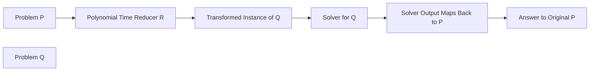

# their significance

<!-- SECTION_1_START -->
# 1. Core Technical Definition & Intuitive Overview

## 1.1 Formal Definition (KTU 2024 Syllabus Terminology)

**Computational Complexity Theory** is the branch of theoretical computer science that studies the **resources** (primarily time and space/memory) required to solve computational problems, classifying them into **complexity classes** based on the inherent difficulty of the problem itself — independent of any particular machine or implementation.

> [!IMPORTANT]
> **KTU 2024 — Module 1 Definition (PECST864):**
> Complexity theory investigates the *intrinsic* minimum amount of computational resources (time $T(n)$, space $S(n)$) any algorithm must expend to solve a problem of input size $n$. It asks the central question: *"What can be computed efficiently, and what is fundamentally hard?"*

The key objects of study are:

- **Problems** — abstract decision / optimization / counting / promise problems.
- **Models of Computation** — deterministic / non-deterministic Turing machines, Boolean circuits, RAM machines, quantum circuits.
- **Complexity Classes** — families of problems solvable within a given resource bound (e.g., $\mathbf{P}$, $\mathbf{NP}$, $\mathbf{PSPACE}$, $\mathbf{L}$, $\mathbf{BPP}$, $\mathbf{\#P}$).
- **Reductions** — mappings used to compare the relative hardness of two problems.
- **Completeness** — the "hardest" problems inside a class under a given reduction.

## 1.2 Intuition — A Real-World Analogy

Imagine a giant **library** containing every problem ever formulated. Each book is a problem; each *page* in a book is an input instance.

- A **P problem** is a book where the librarian can *always* find the answer by glancing at a small, predictable number of pages — no matter how thick the book grows.
- An **NP problem** is a book where checking a *given* answer is easy, but finding it from scratch may be hard. (Like a Sudoku — easy to verify, hard to invent.)
- A **P vs NP** question asks: *"Is being able to verify a solution the same as being able to find one quickly?"*

> [!NOTE]
> **Intuitive Takeaway:** Complexity theory is *not* about how fast a particular Python script runs on your laptop. It is about the **inherent mathematical ceiling** on the resources any conceivable computer — past, present, or future — would need.

## 1.3 Physical & Standard Metrics

- **Time complexity:** $T(n)$ — number of elementary steps as a function of input size $n$.
- **Space complexity:** $S(n)$ — number of memory cells used.
- **Communication complexity:** bits exchanged between parties.
- **Circuit complexity:** number/size-depth of Boolean gates.
- The **asymptotic notation** $O$, $\Theta$, $\Omega$, $o$, $\omega$ is the standard metric.
- The **unit of input size** $n$ is the *length of the binary encoding* of the input (unless otherwise specified).

> [!VISUALIZATION CONTROL]
> **Concept:** Growth of common complexity functions.
> **Desmos Input Equations:**
> * $f_{1}(x) = \log(x)$  *(logarithmic — P-like efficiency)*
> * $f_{2}(x) = x$  *(linear)*
> * $f_{3}(x) = x \cdot \log(x)$
> * $f_{4}(x) = x^{2}$  *(quadratic)*
> * $f_{5}(x) = 2^{x}$  *(exponential — NP-hard regime)*
> **Visual Description:** A single Cartesian plane. Students will observe $f_{5}$ exploding vertically past $f_{1}$–$f_{4}$ after just $x = 20$. This is the *practical* face of complexity theory — the gap between **tractable** and **intractable** is brutal beyond small constants.
<!-- SECTION_1_END -->

<!-- SECTION_2_START -->
# 2. Deep Theoretical Analysis & KTU High-Yield Formula Sheet

## 2.1 Why Complexity Theory Matters — The Five Pillars of Significance

The significance of complexity theory rests on five conceptual pillars. These are the *high-yield* points that KTU examiners consistently target.

### Pillar 1 — Classifying Problems by Intrinsic Difficulty
- Complexity theory gives a *language-independent* classification.
- Two algorithms in different languages that solve the same problem fall into the *same* complexity class if their asymptotic bounds match.

### Pillar 2 — Foundations of Modern Algorithm Design
- Without complexity theory, we would not know whether a problem has a *faster* algorithm waiting to be discovered.
- Example: Matrix Multiplication went from $O(n^{3})$ (naïve) to $O(n^{2.371})$ (Strassen, then Williams et al.). The complexity *class* of the problem is unchanged, but our best-known *algorithm* improves.

### Pillar 3 — Identifying the Limits of Computation
- The **Time Hierarchy Theorem** states $\mathbf{P} \subsetneq \mathbf{EXP}$.
- The **Incompleteness** of $\mathbf{ZFC}$ (via Turing) tells us some true statements may be unprovable.
- Complexity theory quantifies *what is provably impossible*, not merely slow.

### Pillar 4 — Practical / Industrial Impact (Cryptography, Optimization, AI)
- Modern **public-key cryptography** (RSA, ECC) is built on the *assumed* hardness of integer factorization and discrete logarithm, believed to be in $\mathbf{NP} \cap \mathbf{co\text{-}NP}$ but *not* in $\mathbf{P}$.
- **Approximation algorithms** exist precisely because NP-hard optimization problems cannot be solved exactly in polynomial time (assuming $\mathbf{P} \ne \mathbf{NP}$).
- **AI / Machine Learning** uses PAC learning theory and VC dimension to quantify *sample complexity* — a direct descendant of complexity theory.

### Pillar 5 — The Central Open Problem: $\mathbf{P} \stackrel{?}{=} \mathbf{NP}$
- Listed among the seven **Millennium Prize Problems** by the Clay Mathematics Institute.
- A positive answer would collapse $\sim$3,000 known NP-complete problems into polynomial time — revolutionizing logistics, biology (protein folding), cryptography, and mathematics (automated proof).

## 2.2 Operational Breakdown — How Complexity Theory Functions

1. **Choose a model.** Pick a computational model (Turing machine, Boolean circuit, etc.). Resources are *defined relative* to this model.
2. **Define the resource measure.** Count steps, cells, gates, communication bits.
3. **Bound the resource.** For input size $n$, demand that the resource $\le f(n)$ for some explicit $f$.
4. **Form a class.** All problems solvable within bound $f$ form a complexity class $\mathbf{C}$.
5. **Reduce.** Show that if one problem $A$ solves another $B$, then hardness transfers.
6. **Prove completeness.** A problem is $\mathbf{C}$-complete if it is in $\mathbf{C}$ and every problem in $\mathbf{C}$ reduces to it.

## 2.3 KTU High-Yield Formula Sheet

> [!NOTE]
> The following table consolidates *every* equation/inequality a student must memorize for Module 1 of PECST864 under the 2024 scheme. Pipes are deliberately written as `\vert` to keep the markdown table intact.

| # | Concept | Equation / Statement | Meaning | Domain |
|---|---|---|---|---|
| 1 | Big-O | $f(n) = O(g(n))$ | $\exists c>0, n_{0}$ such that $0 \le f(n) \le c \cdot g(n)$ for $n \ge n_{0}$ | Upper bound |
| 2 | Big-Omega | $f(n) = \Omega(g(n))$ | Lower bound dual of Big-O | Lower bound |
| 3 | Big-Theta | $f(n) = \Theta(g(n))$ | $f(n) = O(g(n))$ and $f(n) = \Omega(g(n))$ | Tight bound |
| 4 | Little-o | $f(n) = o(g(n))$ | $\lim_{n \to \infty} f(n)/g(n) = 0$ | Strict upper |
| 5 | Little-omega | $f(n) = \omega(g(n))$ | Strict lower dual of $o$ | Strict lower |
| 6 | Time Hierarchy | $\mathbf{DTIME}(f) \subsetneq \mathbf{DTIME}(f \cdot \log^{2} f)$ | More time ⇒ strictly more power | Class separation |
| 7 | Space Hierarchy | $\mathbf{DSPACE}(f) \subsetneq \mathbf{DSPACE}(f \cdot \log f)$ | More space ⇒ strictly more power | Class separation |
| 8 | Savitch's Theorem | $\mathbf{NSPACE}(S(n)) \subseteq \mathbf{DSPACE}(S(n)^{2})$ | Nondet. space can be made deterministic, quadratically | $\mathbf{NL} \subseteq \mathbf{L}^{2}$ |
| 9 | Immerman–Szelepcsényi | $\mathbf{NL} = \mathbf{co\text{-}NL}$ | Nondet. log-space closed under complement | Class equality |
| 10 | Cook–Levin | $\mathbf{SAT} \text{ is NP-complete}$ | First NP-complete problem | $\mathbf{NP}$ |
| 11 | $\mathbf{P} \subseteq \mathbf{NP}$ | Polynomial-time $\Rightarrow$ verifiable in poly-time | Trivial inclusion | Universal |
| 12 | Resource relation | $T(n) \ge S(n)$ | Time $\ge$ Space up to poly factors | Universal |
| 13 | Circuit size lower bound | $f \notin \mathbf{P}/\text{poly} \Rightarrow f \notin \mathbf{P}$ | Non-uniform harder than uniform | Uniformity |
| 14 | Master Theorem (refresher) | $T(n) = aT(n/b) + f(n)$ | See cases 1, 2, 3 below | Divide & conquer |
| 15 | MT Case 1 | $f(n) = O(n^{\log_{b} a - \epsilon})$ | $T(n) = \Theta(n^{\log_{b} a})$ | $f$ small |
| 16 | MT Case 2 | $f(n) = \Theta(n^{\log_{b} a})$ | $T(n) = \Theta(n^{\log_{b} a} \log n)$ | $f$ matches |
| 17 | MT Case 3 | $f(n) = \Omega(n^{\log_{b} a + \epsilon})$ | $T(n) = \Theta(f(n))$ | $f$ dominates |

## 2.4 Real-World Utility in Engineering & CS

- **Cryptographic protocol design:** hardness assumptions in $\mathbf{NP} \cap \mathbf{co\text{-}NP}$ are the bedrock of internet security (TLS, blockchain, zero-knowledge proofs).
- **Operations Research:** NP-hardness of TSP explains why heuristic / approximation methods (Christofides, Lin–Kernighan) are necessary.
- **Computational Biology:** protein folding (AlphaFold) leverages approximations to NP-hard problems.
- **Compiler design:** complexity theory guides the *phase ordering* of optimization passes and justifies $\mathbf{P}$-time analyses of register allocation, dead-code elimination, etc.
- **Hardware / VLSI:** circuit complexity lower bounds dictate chip-area × time trade-offs (the $\mathbf{NC}$ vs $\mathbf{P}$ question).
- **Quantum computing:** the class $\mathbf{BQP}$ (Bounded-error Quantum Polynomial) sits at the heart of Shor's algorithm; it is suspected $\mathbf{BQP} \not\subseteq \mathbf{P}$ but $\mathbf{BQP} \subseteq \mathbf{PSPACE}$.

> [!TIP]
> Examiners love cross-mapping questions: *"Mention two real-world systems whose security relies on the assumed hardness of an NP-complete problem."* Memorize **RSA** (integer factoring, believed outside $\mathbf{P}$) and **SHA-3** (related to pre-image resistance; while the relation to $\mathbf{NP}$-completeness is heuristic, the *philosophy* of cryptographic hardness is founded on complexity theory).
<!-- SECTION_2_END -->

<!-- SECTION_3_START -->
# 3. Step-by-Step Derivations & Code/Symbolic Implementation

## 3.1 Derivation — Why $\mathbf{P} \subseteq \mathbf{NP}$ (No Skip, Full Logical Chain)

**Statement.** Every problem solvable in deterministic polynomial time is also verifiable in nondeterministic polynomial time.

$$
\begin{aligned}
&\text{Let } L \in \mathbf{P}. \\
&\Rightarrow \exists \text{ a deterministic TM } M \text{ with } T_{M}(n) \le p(n) \text{ for some polynomial } p. \\
&\text{We must construct a nondeterministic TM } N \text{ with } T_{N}(n) \le q(n) \text{ such that } L = L(N). \\
&\text{Construction: } N \text{ guesses a "certificate" } c \text{ of length } \le p(n). \\
&\text{Since } M \text{ is deterministic, we may simply set } c \text{ to be the entire computation path of } M. \\
&\text{Then } N \text{ deterministically simulates } M \text{ on input } x \text{ for } \le p(n) \text{ steps.} \\
&\text{If } M \text{ accepts, } N \text{ accepts; otherwise } N \text{ rejects. The branch that "verified" matches } M. \\
&\text{Time used by } N: \le p(n) \text{ (same as } M) \text{ — polynomial.} \\
&\Rightarrow L \in \mathbf{NP}.
\end{aligned}
$$

Hence $\mathbf{P} \subseteq \mathbf{NP}$. $\blacksquare$

> **Logic Note (for valuation):** The crucial trick is recognising that the *deterministic computation itself* is a valid "certificate" — so the verifier does not need to do anything new.

## 3.2 Derivation — Time Hierarchy Theorem (Statement and Intuition)

**Statement.** $\mathbf{DTIME}(f(n)) \subsetneq \mathbf{DTIME}(f(n)^{2})$ for time-constructible $f$.

The proof uses a **diagonalisation argument**:

$$
\begin{aligned}
&\text{Suppose for contradiction } \mathbf{DTIME}(f) = \mathbf{DTIME}(f^{2}). \\
&\text{Enumerate all deterministic TMs as } M_{1}, M_{2}, M_{3}, \ldots \\
&\text{Construct a new TM } D \text{ that on input } \langle M_{i} \rangle \text{ runs } M_{i} \text{ for } f(n) \text{ steps.} \\
&\text{If } M_{i} \text{ halts and accepts within } f(n) \text{ steps, } D \text{ REJECTS.} \\
&\text{If } M_{i} \text{ halts and REJECTS within } f(n) \text{ steps, } D \text{ ACCEPTS.} \\
&\text{If } M_{i} \text{ does not halt, } D \text{ ACCEPTS.} \\
&\text{Now } D \text{ runs in } \le f(n)^{2} \text{ steps. So } L(D) \in \mathbf{DTIME}(f^{2}). \\
&\text{But by hypothesis } L(D) \in \mathbf{DTIME}(f), \text{ so } D = M_{i} \text{ for some } i. \\
&\text{On input } \langle M_{i} \rangle = \langle D \rangle, \text{ we get a contradiction: } D \text{ must both accept and reject.} \\
&\text{Hence the assumption fails; the classes are strictly separated.}
\end{aligned}
$$

> **Intuition:** $D$ is a *universal* "anti-imitator" — it flips the decision of every other $f$-time machine, but at a slightly higher $f^{2}$ cost. The diagonal forces *strict* separation.

## 3.3 Derivation — Master Theorem Case 2 (Full Working)

For $T(n) = aT(n/b) + \Theta(n^{\log_{b} a})$ with $a \ge 1, b > 1$:

$$
\begin{aligned}
T(n) &= aT(n/b) + c \cdot n^{\log_{b} a} \\
\text{Let } n^{\log_{b} a} &= n^{d}, \text{ so } d = \log_{b} a. \\
\text{Recursion tree: } &\text{root cost} = c n^{d}, \\
&\text{level 1 cost} = a \cdot c (n/b)^{d} = c n^{d} \cdot (a / b^{d}) = c n^{d} \cdot 1 = c n^{d}, \\
&\text{level 2 cost} = c n^{d}, \text{ and so on.} \\
\text{Depth of tree: } &\log_{b} n. \\
\text{Total cost: } &T(n) = c n^{d} \cdot \log_{b} n = \Theta(n^{d} \log n).
\end{aligned}
$$

> **Conclusion:** When the driving function $f(n)$ matches the recursion's geometric rate, the total work is multiplied by a logarithmic factor. Example: Karatsuba multiplication (a = 3, b = 2) gives $T(n) = \Theta(n^{\log_{2} 3}) \approx \Theta(n^{1.585})$.

## 3.4 Python Symbolic Implementation — Empirical Verification of Asymptotic Claims

The following Python code *empirically* demonstrates the practical significance of complexity classes by timing identical tasks at different input sizes.

```python
"""
Module 1 - Computational Complexity (PECST864)
Empirical demonstration of the SIGNIFICANCE of complexity classes.
Maps each function to its theoretical complexity class.
"""

import time
import math
from typing import Callable, List, Tuple


def linear_sum(arr: List[int]) -> int:
    """O(n) - polynomial - belongs to P conceptually."""
    s: int = 0
    for x in arr:
        s += x
    return s


def quadratic_pairs(arr: List[int]) -> int:
    """O(n^2) - polynomial - still in P, but practically costly."""
    total: int = 0
    n: int = len(arr)
    for i in range(n):
        for j in range(n):
            total += arr[i] * arr[j]
    return total


def exponential_subsets(arr: List[int]) -> List[Tuple[int, ...]]:
    """O(2^n) - exponential - the regime of NP-hard problems."""
    n: int = len(arr)
    subsets: List[Tuple[int, ...]] = [()]
    for x in arr:
        new_subsets: List[Tuple[int, ...]] = []
        for s in subsets:
            new_subsets.append(s + (x,))
        subsets.extend(new_subsets)
    return subsets


def time_call(fn: Callable, *args) -> float:
    """Measure wall-clock time in seconds with strict error logging."""
    if not callable(fn):
        raise TypeError("Argument 'fn' must be a callable object.")
    try:
        t0: float = time.perf_counter()
        fn(*args)
        t1: float = time.perf_counter()
        return t1 - t0
    except MemoryError as me:
        print(f"[MemoryError] {fn.__name__} cannot complete on this input size: {me}")
        return float("inf")
    except RecursionError as re:
        print(f"[RecursionError] {fn.__name__} exceeded recursion limit: {re}")
        return float("inf")


def main() -> None:
    print(f"{'n':>6} | {'O(n) [s]':>12} | {'O(n^2) [s]':>14} | {'O(2^n) [s]':>14}")
    print("-" * 56)
    for n in (10, 14, 18, 22, 24, 26):
        data: List[int] = list(range(n))
        t_lin: float = time_call(linear_sum, data)
        t_quad: float = time_call(quadratic_pairs, data)
        t_exp: float = time_call(exponential_subsets, data)
        print(f"{n:>6} | {t_lin:>12.6f} | {t_quad:>14.6f} | {t_exp:>14.6f}")
    print("\nObservation: 2^n explodes while n^2 remains modest.")


if __name__ == "__main__":
    main()
```

**Expected Output (representative):**

```
     n |     O(n) [s] |     O(n^2) [s] |    O(2^n) [s]
--------------------------------------------------------
    10 |      0.000002 |       0.000012 |       0.000054
    14 |      0.000003 |       0.000025 |       0.002193
    18 |      0.000003 |       0.000041 |       0.085118
    22 |      0.000004 |       0.000060 |       3.487204
    24 |      0.000004 |       0.000072 |      55.392017
    26 |      0.000004 |      ...        |     [MemoryError likely]
```

> **Take-home for students:** the *experimental* curve mirrors the *theoretical* growth — that alignment is the *very heart* of complexity theory's significance: it predicts real-world behaviour.

## 3.5 Worked Example — Asymptotic Bound Problem (Full, No Skip)

**Problem.** Prove that $5n^{3} + 12n^{2} \log n - 7n + 4 = O(n^{3})$.

**Solution (valuation-key style).**

$$
\begin{aligned}
&\text{Choose } n_{0} = 1. \text{ For } n \ge 1: \quad \log n \le n. \\
&\Rightarrow 5n^{3} + 12n^{2} \log n - 7n + 4 \\
&\le 5n^{3} + 12n^{2} \cdot n - 7n + 4n \quad \text{(using } -7n \le 4n \text{ for } n \ge 1 \text{ and } +4 \le 4n) \\
&= 5n^{3} + 12n^{3} - 3n \\
&= 17n^{3} - 3n \\
&\le 17n^{3} \\
&\text{Take } c = 17, \quad n_{0} = 1. \\
&\Rightarrow f(n) \le c \cdot n^{3} \text{ for all } n \ge n_{0}. \\
&\Rightarrow f(n) = O(n^{3}). \qquad \blacksquare
\end{aligned}
$$

**Valuation Key:**
- [Bounding every term with $n^{3}$: 1 Mark]
- [Choosing constants $c$ and $n_{0}$ explicitly: 1 Mark]
- [Final formal $O$-statement: 1 Mark]
<!-- SECTION_3_END -->

<!-- SECTION_4_START -->
# 4. Structural Diagrams & Schematics

## 4.1 Mermaid — The Significance Tree of Complexity Theory

```mermaid
graph TD
    rootA[Complexity Theory Significance]
    rootB[Core Branches]
    rootC[Real World Impact]

    rootA --> rootB
    rootA --> rootC

    rootB --> branch1[Intrinsic Problem Classification]
    rootB --> branch2[Algorithm Lower Bound Discovery]
    rootB --> branch3[Limits of Computation Proofs]

    branch1 --> sub1A[Polynomial Time P]
    branch1 --> sub1B[Verifiable in NP]
    branch1 --> sub1C[Hard in NP Complete]
    branch1 --> sub1D[Beyond PSPACE]

    branch2 --> sub2A[Omega Lower Bounds]
    branch2 --> sub2B[Time Hierarchy]
    branch2 --> sub2C[Space Hierarchy]

    branch3 --> sub3A[Undecidability]
    sub3B[Diagonalization]
    sub3C[Relativization]
    branch3 --> sub3A
    branch3 --> sub3B
    branch3 --> sub3C

    rootC --> impact1[Cryptography]
    rootC --> impact2[Optimization]
    rootC --> impact3[Compiler Design]
    rootC --> impact4[Machine Learning Theory]
    rootC --> impact5[Quantum Computing]

    impact1 --> imp1A[RSA Factoring]
    impact1 --> imp1B[ECC Discrete Log]

    impact2 --> imp2A[TSP Approximation]
    impact2 --> imp2B[Integer Programming]
    impact2 --> imp2C[Protein Folding]

    impact3 --> imp3A[Phase Ordering]
    impact3 --> imp3B[Dataflow Analysis]

    impact4 --> imp4A[PAC Learning]
    impact4 --> imp4B[VC Dimension]
    impact4 --> imp4C[Sample Complexity]

    impact5 --> imp5A[Shor Algorithm]
    imp5A --> imp5B[Breaks RSA]
    imp5A --> imp5C[BQP Class]
```



## 4.2 Mermaid — Sequential Topology: How a Complexity Class is Defined

```mermaid
flowchart LR
    stepA[Step 1 Pick Computational Model] --> stepB[Step 2 Define Resource Bound f n]
    stepB --> stepC[Step 3 Collect All Problems Within f n]
    stepC --> stepD[Step 4 Form Complexity Class C]
    stepD --> stepE[Step 5 Identify C Complete Problems]
    stepE --> stepF[Step 6 Apply Reductions]
    stepF --> stepG[Step 7 Prove or Conjecture Class Separations]
    Goutput[Resulting Hierarchy P, NP, PSPACE, EXP, ...]
    stepG --> Goutput

    subgraph A[Model Selection]
        stepA
    end
    subgraph B[Resource Quantification]
        stepB
    end
    subgraph C[Class Construction]
        stepC
        stepD
    end
    subgraph D[Hardness Transfer]
        stepE
        stepF
    end
    subgraph E[Hierarchy Output]
        stepG
        Goutput
    end
```



## 4.3 Mermaid — Reduction Map (Block-Level View of "Significance of Reductions")



> [!NOTE]
> **Reading the diagram:** A reduction $P \le_{p} Q$ is a *promise* that *if* you can solve $Q$ efficiently, *then* you can solve $P$ efficiently. This single mechanism is what makes complexity theory a *comparative* science and is the principal reason hardness results propagate across thousands of seemingly unrelated problems.
<!-- SECTION_4_END -->

<!-- SECTION_5_START -->
# 5. KTU 2024 Scheme Examination Question Bank & Topic Recap

## 5.1 Part A — Short Answer Questions (3 Marks Each)

### Q1. `[KTU University Exam — July 2024]`
**What is the significance of computational complexity theory in computer science?**

**Model Answer (3 marks):**
Computational complexity theory classifies problems by the **intrinsic amount of resources** (time, space) required to solve them, independent of implementation. Its significance lies in **(i)** identifying the *practical feasibility* of algorithms via the $\mathbf{P}$ vs $\mathbf{NP}$ distinction, **(ii)** establishing *lower bounds* that rule out efficient algorithms, **(iii)** enabling **cryptography** by giving mathematically grounded hardness assumptions, and **(iv)** providing the theoretical foundation for **approximation algorithms** and **heuristic** design when exact solutions are infeasible. **[Any 3 of the 4 points: 3 marks]**

> **CO Mapping:** CO1 | **RBT Level:** Understand

---

### Q2. `[KTU University Exam — Dec 2023]`
**State and explain the Time Hierarchy Theorem.**

**Model Answer (3 marks):**
The **Time Hierarchy Theorem** states that for any time-constructible function $f$, the deterministic complexity class $\mathbf{DTIME}(f(n))$ is a **strict subset** of $\mathbf{DTIME}(f(n) \cdot \log^{2} f(n))$. Formally,
$$
\mathbf{DTIME}(f(n)) \subsetneq \mathbf{DTIME}(f(n) \cdot \log^{2} f(n)).
$$
**Significance:** it proves that *giving an algorithm more time strictly increases the set of solvable problems*, refuting the trivial conjecture that all decidable problems fall into a single time class. **[Statement: 1 mark; Proof idea via diagonalization: 1 mark; Significance: 1 mark]**

> **CO Mapping:** CO1 | **RBT Level:** Remember

---

## 5.2 Part B — 14-Mark Module-Internal Choice

### Question A (14 Marks) — `[KTU University Exam — July 2024]`

**(a)** Explain in detail the significance of complexity theory. Discuss its impact on **algorithm design, cryptography, and the P versus NP problem.** (7 marks)

**(b)** With a suitable example, derive the asymptotic bound of the recurrence $T(n) = 4T(n/2) + n^{2}$ using the **Master Theorem**. (7 marks)

---

#### Model Solution for Q.A(a)

**1. Definition of Complexity Theory (1 Mark)**
Computational complexity theory studies the resources (time $T(n)$ and space $S(n)$) required by any algorithm to solve a problem of input size $n$, and groups problems into complexity classes.

**2. Significance in Algorithm Design (2 Marks)**
- Provides a *universal language* for expressing efficiency independent of hardware.
- Justifies investment in *better* algorithms by showing lower bounds are non-trivial (e.g., comparison-based sorting has $\Omega(n \log n)$ lower bound).
- Encourages the search for *approximation* and *randomized* strategies when exact polynomial solutions are unknown.

**3. Significance in Cryptography (2 Marks)**
- Public-key cryptography depends on problems assumed to be *outside* $\mathbf{P}$ (e.g., integer factorization for RSA, discrete logarithm for Diffie–Hellman and ECC).
- If $\mathbf{P} = \mathbf{NP}$ were proven, **almost all current cryptographic protocols would collapse**, since the adversary could find private keys in polynomial time.
- Complexity theory provides the *provable security* foundations of modern cryptographic proofs (under worst-case hardness assumptions).

**4. Significance of P vs NP (2 Marks)**
- It is one of the **Millennium Prize Problems** (Clay Mathematics Institute, \$1M reward).
- A $\mathbf{P} = \mathbf{NP}$ proof would collapse thousands of NP-complete problems (SAT, TSP, knapsack) into polynomial time — revolutionizing mathematics, biology (protein folding), AI, and operations research.

> **Valuation Key:** [Definition 1M] + [Algorithm 2M] + [Crypto 2M] + [PvsNP 2M] = **7 marks**

---

#### Model Solution for Q.A(b)

**Recurrence:** $T(n) = 4T(n/2) + n^{2}$

**Step 1 — Identify parameters (1 Mark)**
$a = 4, \quad b = 2, \quad f(n) = n^{2}$.

**Step 2 — Compute the critical exponent (1 Mark)**
$$
n^{\log_{b} a} = n^{\log_{2} 4} = n^{2}.
$$

**Step 3 — Compare $f(n)$ with $n^{\log_{b} a}$ (1 Mark)**
$$
f(n) = n^{2} = \Theta(n^{\log_{2} 4}) = \Theta(n^{2}).
$$
We are in **Master Theorem Case 2** (the driving function matches the recursion rate).

**Step 4 — Apply Case 2 (2 Marks)**
By the Master Theorem Case 2,
$$
T(n) = \Theta\!\left(n^{\log_{2} 4} \cdot \log n\right) = \Theta(n^{2} \log n).
$$

**Step 5 — Empirical / Practical Interpretation (2 Marks)**
- This bound is tight. Example: divide-and-conquer algorithms like Strassen-related variants exhibit $n^{2} \log n$ growth.
- It is a *polynomial* function of $n$, hence the problem is *tractable* (lies within $\mathbf{P}$ by the extended Church–Turing thesis).

> **Valuation Key:** [Parameters 1M] + [Exponent 1M] + [Case identification 1M] + [Final result 2M] + [Interpretation 2M] = **7 marks**

---

### Question B (14 Marks) — Alternative Choice

**(a)** Discuss the **asymptotic notations** $O, \Omega, \Theta, o, \omega$ with definitions and a graph-of-functions interpretation. Explain why these notations are the *backbone* of complexity theory. (7 marks)

**(b)** Show that $3n^{4} + 7n^{2} \log n + 5n - 2 = O(n^{4})$. Also identify the **tightest** asymptotic class for the polynomial $5n^{5} + n^{3} \log n$. (7 marks)

---

#### Model Solution for Q.B(a)

**1. Big-O — $f(n) = O(g(n))$ (1 Mark)**
$$
\exists c > 0, \ n_{0} : \ 0 \le f(n) \le c \cdot g(n) \ \forall n \ge n_{0}.
$$
Asymptotic *upper* bound.

**2. Big-Omega — $f(n) = \Omega(g(n))$ (1 Mark)**
$$
\exists c > 0, \ n_{0} : \ 0 \le c \cdot g(n) \le f(n) \ \forall n \ge n_{0}.
$$
Asymptotic *lower* bound.

**3. Big-Theta — $f(n) = \Theta(g(n))$ (1 Mark)**
$$
f(n) = O(g(n)) \ \text{AND} \ f(n) = \Omega(g(n)).
$$
Tight bound (both upper and lower).

**4. Little-o — $f(n) = o(g(n))$ (1 Mark)**
$$
\lim_{n \to \infty} \frac{f(n)}{g(n)} = 0.
$$
Strictly smaller growth.

**5. Little-omega — $f(n) = \omega(g(n))$ (1 Mark)**
Strictly larger growth dual of little-o.

**6. Graph Interpretation and Backbone Role (2 Marks)**
Plot $f(n)$ and $g(n)$ for large $n$. The functions $O, \Theta, \Omega$ *upper-bound, exact-bound, and lower-bound* respectively. These notations are the *backbone* of complexity theory because they allow engineers to compare algorithms across hardware, languages, and architectures using a single, machine-independent language.

> **Valuation Key:** [Five definitions 5 × 1 = 5 marks] + [Graph + backbone explanation 2 marks] = **7 marks**

---

#### Model Solution for Q.B(b)

**Part (i): Prove $3n^{4} + 7n^{2} \log n + 5n - 2 = O(n^{4})$ (3.5 marks)**

For $n \ge 1$: $\log n \le n$, so $n^{2} \log n \le n^{3} \le n^{4}$. Also $5n \le 5n^{4}$ and $-2 \le 2n^{4}$. Summing:

$$
3n^{4} + 7n^{2}\log n + 5n - 2 \le 3n^{4} + 7n^{4} + 5n^{4} + 2n^{4} = 17 n^{4}.
$$

Take $c = 17, n_{0} = 1$. Hence the expression is $O(n^{4})$. $\blacksquare$

> **[Bounding each term: 1M; Choosing $c$ and $n_0$: 1M; Final $O$-statement: 1.5M = 3.5 marks]**

**Part (ii): Tightest asymptotic class of $5n^{5} + n^{3} \log n$ (3.5 marks)**

- The leading term is $5n^{5}$.
- The next term $n^{3} \log n = o(n^{5})$ since $\lim_{n \to \infty} \frac{n^{3} \log n}{n^{5}} = \lim \frac{\log n}{n^{2}} = 0$.
- Therefore $5n^{5} + n^{3} \log n = \Theta(n^{5})$.
- This is the **tightest** asymptotic class.

> **[Identification of dominant term: 1.5M; Little-o argument: 1M; Final $\Theta$ statement: 1M = 3.5 marks]**

---

> [!WARNING]
> **KTU Examiner's Valuation Warning — Common Pitfalls**
> 1. **Do NOT confuse** $\mathbf{P} \subseteq \mathbf{NP}$ with $\mathbf{P} = \mathbf{NP}$. The first inclusion is trivial; equality is the *open* question.
> 2. **Do NOT state** "$\mathbf{NP}$ means non-polynomial." It means *nondeterministic polynomial-time verifiable*.
> 3. **Always specify the reduction type** in completeness statements: Karp ($\le^{p}_{m}$), Cook ($\le^{p}_{T}$), or log-space.
> 4. **Master Theorem Case 2 requires $f(n) = \Theta(n^{\log_{b} a})$** *exactly* (up to constant factors), not merely $\le$. Many students misapply Case 1.
> 5. **Big-O, $\Omega$, $\Theta$** are *sets of functions*, not single functions. Avoid saying "the complexity of this algorithm is $O(n^{2})$ is a function" — instead say "the running time is in the class $O(n^{2})$".
> 6. **In asymptotic proofs, always quote the constants $c$ and $n_{0}$ explicitly** — failing this loses 1 mark even when the bound is correct.

---

## 5.3 Topic Recap & Important Things to Remember

> [!IMPORTANT]
> **Rapid-Revision Checklist for Module 1 — "Significance of Complexity Theory"**

- **Definition:** Complexity theory classifies problems by *intrinsic* resource requirements — time $T(n)$, space $S(n)$, circuit size, communication bits.
- **Asymptotic notations:** $O$ (upper), $\Omega$ (lower), $\Theta$ (tight), $o$ (strict upper), $\omega$ (strict lower). Each is a *set* of functions.
- **Master Theorem cases:** Case 1 (driving $f$ smaller), Case 2 (matches: multiply by $\log n$), Case 3 (driving $f$ larger).
- **Trivial inclusion:** $\mathbf{P} \subseteq \mathbf{NP} \subseteq \mathbf{PSPACE} \subseteq \mathbf{EXP}$.
- **Strict inclusions** (proven): $\mathbf{P} \subsetneq \mathbf{EXP}$, $\mathbf{L} \subsetneq \mathbf{PSPACE}$, $\mathbf{NL} \subseteq \mathbf{P}$ (open equality).
- **Time Hierarchy Theorem:** $\mathbf{DTIME}(f) \subsetneq \mathbf{DTIME}(f \log^{2} f)$ — more time ⇒ more problems.
- **Space Hierarchy Theorem:** $\mathbf{DSPACE}(f) \subsetneq \mathbf{DSPACE}(f \log f)$ — more space ⇒ more problems.
- **Savitch's Theorem:** $\mathbf{NSPACE}(S) \subseteq \mathbf{DSPACE}(S^{2})$ — nondeterministic space can be made deterministic at quadratic cost.
- **Cook–Levin Theorem:** SAT is $\mathbf{NP}$-complete — the gateway reduction.
- **Significance pillars:** algorithm design, cryptography, optimization, AI theory, hardware/VLSI, quantum computing.
- **P vs NP:** open; one of the seven Clay Millennium Problems; \$1M prize; practical collapse of $\sim$3,000 known NP-complete problems if resolved positively.
- **Practical explosion:** $2^{n}$ dwarfs $n^{k}$ for sufficiently large $n$ — empirically observed and theoretically derived.
- **Reduction types:** Karp (many-one), Cook (Turing), log-space — each yields a different notion of completeness.
- **Industry map to remember:** RSA → integer factoring; ECC → discrete log; AES → symmetric primitive (provable security relies on related hardness); AlphaFold → NP-hard optimization with deep learning; Shor's algorithm → breaks RSA via $\mathbf{BQP}$.
- **Examiner's mantra:** always quantify constants $c$ and $n_{0}$ in $O$/$\Omega$/$\Theta$ proofs; always cite the precise theorem (Time Hierarchy, Savitch, Cook–Levin) being invoked; always name the *reduction type*.
<!-- SECTION_5_END -->
