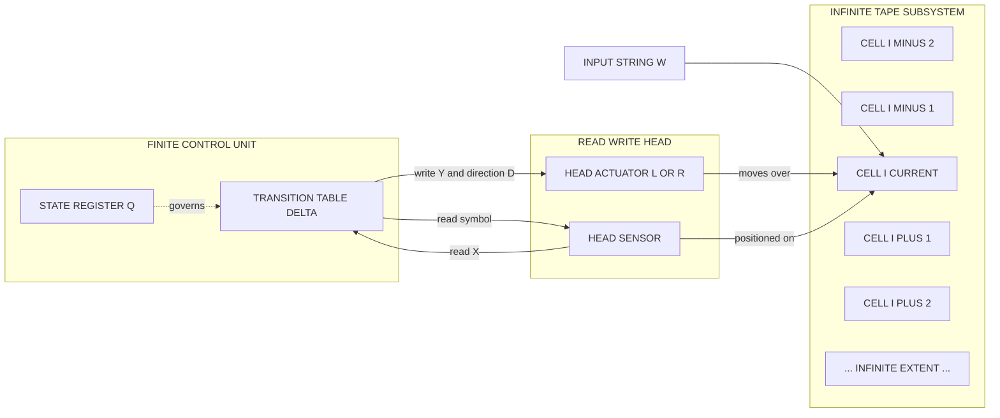
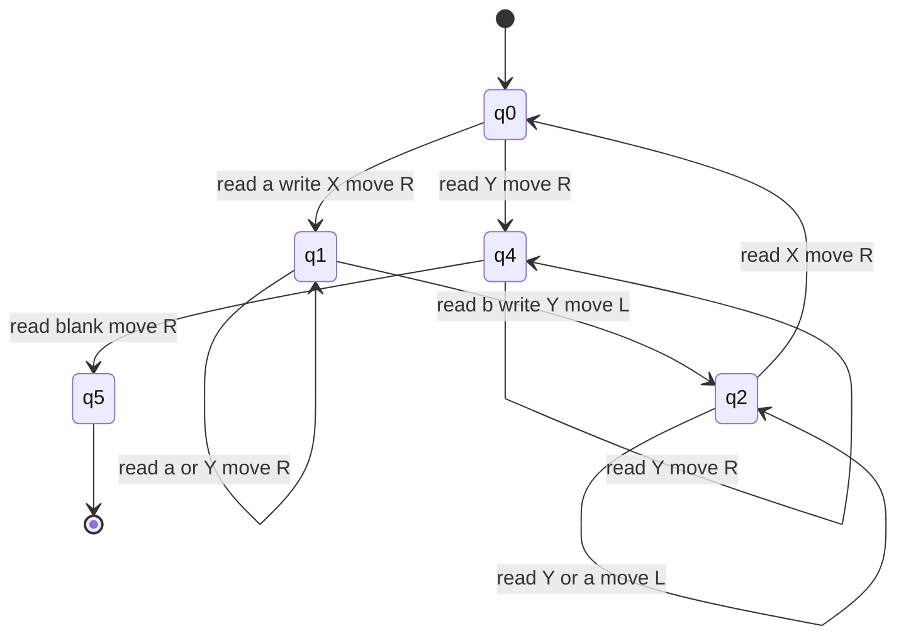
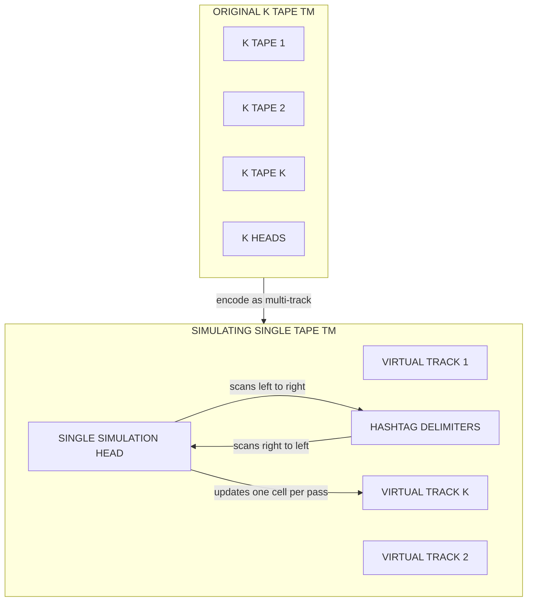
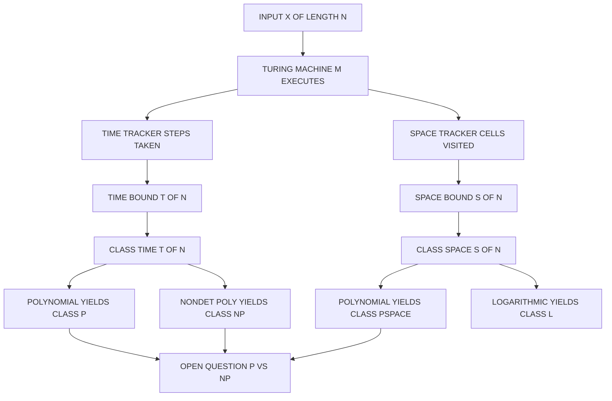

# Turing machines

<!-- SECTION_1_START -->

# Turing Machines — The Foundation of Computational Complexity

## 1.1 Formal Academic Definition

A **Turing Machine (TM)** is the most general and mathematically precise model of computation. Formally, it is a **7-tuple** denoted as:

$$M = (Q, \, \Sigma, \, \Gamma, \, \delta, \, q_0, \, q_{\text{accept}}, \, q_{\text{reject}})$$

where each component plays a precise role in the abstract model of computation:

- $Q$ — A finite, non-empty set of **states** that the machine's finite control can occupy.
- $\Sigma$ — A finite, non-empty set of **input symbols** (the input alphabet), disjoint from the special blank symbol.
- $\Gamma$ — A finite set of **tape symbols** (the tape alphabet), where $\Sigma \subseteq \Gamma$ and $\Gamma$ contains the distinguished blank symbol $\sqcup$.
- $\delta$ — The **transition function**, a partial mapping $Q \times \Gamma \rightarrow Q \times \Gamma \times \{L, R\}$ that governs deterministic behaviour.
- $q_0 \in Q$ — The designated **start state**, where every computation begins.
- $q_{\text{accept}} \in Q$ — The **accept (halting) state**, signalling a successful computation.
- $q_{\text{reject}} \in Q$ — The **reject (halting) state**, distinct from $q_{\text{accept}}$, signalling a failed computation.

> [!IMPORTANT]
> **KTU Syllabus Highlight (PECST864 / Module 1):** Turing Machines form the canonical machine model against which **time complexity** and **space complexity** are formally defined. Every subsequent complexity class (P, NP, PSPACE, EXPTIME, etc.) is anchored to a specific variant of this model.

## 1.2 Intuitive Analogy — The Clerk With an Infinite Notepad

Imagine a very methodical **clerk** seated at a desk that holds an **infinitely long roll of paper divided into square cells**. The clerk has a few superpowers:

1. A **read/write head** that points at exactly one cell at a time.
2. A **finite rulebook** (a finite number of mental states) that tells the clerk: *"If I am in state $q$ and the current cell contains symbol $X$, then change the symbol to $Y$, move one cell left or right, and switch to state $q'$."*
3. The paper starts with the **input string** written in the leftmost cells, and the rest of the paper is blank ($\sqcup$).
4. The clerk must **stop** as soon as a rulebook entry says "accept" or "reject" — these are the only two ways the process ends.

> **That clerk is a Turing Machine.** The "infinite paper" is the **tape**, the "rulebook" is the **transition function $\delta$**, and the "states" are the **mental modes** the clerk switches between.

> [!NOTE]
> **Why this matters for complexity theory:** Because the paper is infinite, the only *limiting resources* are **time** (how many rule-book steps the clerk takes) and **space** (how many tape cells get written on). These two metrics *define* computational complexity.

## 1.3 The Church–Turing Thesis

> [!IMPORTANT]
> **Church–Turing Thesis (informal statement):** *Any function that can be computed by any physically realisable computational process can be computed by a Turing Machine.*

This thesis is **not a theorem** — it is a foundational *axiom* of theoretical computer science. It is the philosophical bedrock on which all of complexity theory rests: when we prove a problem is "intractable," we mean "intractable for a TM," and we believe that covers all physically possible computers.

## 1.4 Geometric Intuition — The Configuration Triple

A TM at any instant of time can be completely described by a single **configuration** triple:

$$\text{Configuration} = (\text{Left Tape}) \; q \; (\text{Current Cell + Right Tape})$$

The single state $q$ is "riding" on top of the current cell the head is reading. A **computation** is just a sequence of configurations connected by the move relation $\vdash_M$ (read as "*yields in one step*").

---

> [!VISUALIZATION CONTROL]
> **Concept:** A single TM step as a configuration rewrite
> **GeoGebra / Desmos Input Equations:** N/A (textual)
> **Visual Description:** Picture an infinite horizontal strip of cells. A triangular head-pointer sits over one cell. A state label $q$ floats above the head. A single application of $\delta(q, X) = (q', Y, D)$ rewrites the cell, moves the head Left or Right by one cell, and replaces $q$ with $q'$. The next configuration is now a new triple.

<!-- SECTION_1_END -->

<!-- SECTION_2_START -->

# Deep Theoretical Analysis & KTU High-Yield Formula Sheet

## 2.1 The Architecture of a Turing Machine

A TM consists of **four coupled subsystems** that operate synchronously:

| Subsystem | Physical Realisation | Mathematical Object | Role in Computation |
|---|---|---|---|
| **Tape** | Infinite 1-D storage | $\Gamma^{\*}$ (tape strings) | Stores input, scratch data, and output |
| **Read/Write Head** | A movable sensor | A position index $i \in \mathbb{Z}$ | Reads one cell, writes one cell per step |
| **Finite Control** | A hardware state register | $q \in Q$ | Encodes the "mode" of the computation |
| **Transition Program** | Microcode | $\delta: Q \times \Gamma \rightharpoonup Q \times \Gamma \times \{L, R\}$ | Decides next state, next symbol, next move |

> The **head may move both Left (L) and Right (R)** — this is the key feature that makes the TM strictly more powerful than a finite automaton or pushdown automaton.

## 2.2 The Transition Function — Operational Logic

A single computational step is governed by a deterministic rule:

$$\delta(q_i, \, X_j) = (q_k, \, X_l, \, D_m)$$

Read this as: *"If the control is in state $q_i$ and the head reads symbol $X_j$, then write $X_l$ on the current cell, move the head in direction $D_m \in \{L, R\}$, and transition to state $q_k$."*

### Critical Properties

- **Partial function:** $\delta$ may be undefined for some $(q, X)$ pairs. The moment the TM encounters an undefined transition, it crashes (the computation halts without accepting).
- **Determinism:** For every defined $(q, X)$, there is **exactly one** outcome — a DTM has at most one legal move at any instant.
- **Halt guarantee:** $q_{\text{accept}}$ and $q_{\text.reject}}$ are *trap states* — once entered, no further transition is defined.

## 2.3 Configurations and the Move Relation

A **configuration** $C$ of a TM is a triple:

$$C = u \, q \, v$$

where $u, v \in \Gamma^{\*}$ are the tape contents to the left and right of the head, and $q$ is the current state. The head is positioned over the **first symbol of $v$** (or over $\sqcup$ if $v = \varepsilon$).

The **yields-in-one-step** relation $\vdash_M$ is defined as:

$$u \, q_i \, X v \vdash_M u \, Y \, q_k \, v \quad \text{if} \quad \delta(q_i, X) = (q_k, Y, R)$$

$$u \, Z \, q_i \, X v \vdash_M u \, q_k \, Z \, Y \, v \quad \text{if} \quad \delta(q_i, X) = (q_k, Y, L)$$

A **computation** is a finite sequence $C_0 \vdash_M C_1 \vdash_M C_2 \vdash_M \cdots \vdash_M C_t$.

## 2.4 Variants of Turing Machines

In complexity theory, we routinely consider *equivalent* TM variants. They differ in *engineering* but not in *computational power* (only in resource consumption).

| Variant | Key Feature | Why It Matters in Complexity |
|---|---|---|
| **Deterministic TM (DTM)** | Exactly one move per $(q, X)$ | Defines class **P** |
| **Non-deterministic TM (NTM)** | $\delta$ maps to a *set* of possible moves | Defines class **NP** |
| **Multi-tape TM** | $k$ independent tapes with $k$ heads | Constant-factor speedup only |
| **Two-way infinite TM** | Tape extends to $\infty$ on both sides | Equivalent to one-way tape |
| **Universal TM (UTM)** | A TM that simulates any other TM given its code | Foundation of stored-program computers |

## 2.5 Measuring Complexity on a Turing Machine

> [!IMPORTANT]
> **KTU Board Exam Favourite:** Time and space complexity are defined on a TM, not on a real computer. This is the *yardstick* of the entire course.

Let $M$ be a TM that halts on all inputs (a **decider**). For an input $x$:

- **Time used:** $t_M(x) = $ number of steps in the computation on input $x$ until halting.
- **Space used:** $s_M(x) = $ number of distinct tape cells visited during the computation on $x$.

### Asymptotic Complexity Classes

- $M$ runs in **time $f(n)$** if for every input $x$ of length $n = \vert x \vert$, we have $t_M(x) \leq f(n)$.
- $M$ runs in **space $f(n)$** if for every input $x$ of length $n$, we have $s_M(x) \leq f(n)$.

This gives rise to the canonical complexity classes:

$$\text{TIME}(f(n)) = \{ L \mid L \text{ is decided by a DTM in } O(f(n)) \text{ time} \}$$

$$\text{SPACE}(f(n)) = \{ L \mid L \text{ is decided by a TM in } O(f(n)) \text{ space} \}$$

$$\text{P} = \bigcup_{k \geq 1} \text{TIME}(n^k)$$

$$\text{NP} = \bigcup_{k \geq 1} \text{NTIME}(n^k)$$

$$\text{PSPACE} = \bigcup_{k \geq 1} \text{SPACE}(n^k)$$

## 2.6 KTU High-Yield Formula Sheet

| Concept | Formula / Definition | Units | Notes |
|---|---|---|---|
| TM Definition | $M = (Q, \Sigma, \Gamma, \delta, q_0, q_{\text{accept}}, q_{\text{reject}})$ | 7-tuple | Use subscripts only in math mode |
| Transition Step | $\delta(q, X) = (q', Y, D)$ | — | $D \in \{L, R\}$ |
| Configuration | $u \, q \, v$ | Triple | Head on first symbol of $v$ |
| Time Complexity | $t_M(x) = $ number of $\vdash_M$ steps | steps | Function of $n = \vert x \vert$ |
| Space Complexity | $s_M(x) = $ distinct cells visited | cells | Excludes input tape in some defs |
| Multi-tape to Single-tape Time | $T_{1}(n) = O(T_{k}(n)^2)$ | steps | Standard simulation theorem |
| DTM simulating NTM | $T_{\text{det}}(n) = 2^{O(T_{\text{ndet}}(n))}$ | steps | Exponential blow-up (worst case) |
| P Definition | $P = \bigcup_{k} \text{TIME}(n^k)$ | class | Polynomial time, deterministic |
| NP Definition | $NP = \bigcup_{k} \text{NTIME}(n^k)$ | class | Non-deterministic polynomial time |
| Church–Turing | Any computable function is TM-computable | — | Thesis, not a theorem |
| Halting Problem | $A_{\text{TM}} = \{ \langle M, w \rangle \mid M \text{ accepts } w \}$ | Undecidable | Diagonalisation argument |
| Recursive Language | Decided by a TM that always halts | — | Also called *decidable* |
| Recursively Enumerable | Recognised by a TM that halts on accept | — | May loop forever on reject |

## 2.7 Real-World Engineering Utility

> [!NOTE]
> **Where TMs appear in production engineering:**
> - **Compiler design:** Lexical analysers and parsers are designed to be *less powerful* than TMs (they are pushdown automata) so that the analysis terminates.
> - **Program verification:** Model checking reduces to the *halting problem*, which is undecidable for TMs.
> - **Cryptography:** Modern cryptographic hardness assumptions (e.g., factoring is in NP ∩ co-NP, but not known to be in P) are stated as TM-resource-bounded statements.
> - **Operating systems:** The kernel's *scheduler* decides which computation (TM step) to run next, bounded by time/space resources.
> - **AI / ML:** Bounded rationality in AI agents is, philosophically, a TM with limited tape and clock cycles.

<!-- SECTION_2_END -->

<!-- SECTION_3_START -->

# Step-by-Step Derivations, Constructions & Code Implementation

## 3.1 Worked Example 1 — Designing a TM for $L = \{ a^n b^n \mid n \geq 1 \}$

This is the canonical KTU-style construction. The language $L$ is context-free but the construction generalises the techniques used in any TM design.

### High-Level Strategy

1. Scan right, matching one $a$ with one $b$.
2. Mark each matched $a$ with $X$ and each matched $b$ with $Y$.
3. After each pair is matched, return the head to the leftmost unmarked $a$.
4. If no $a$ remains and no unmarked $b$ remains, accept.

### Full Transition Table

We use states: $q_0$ (start, looking for $a$), $q_1$ (scanning right past $a$s), $q_2$ (matching $b$), $q_3$ (returning left), $q_4$ (verifying no $a$ remains), $q_5$ (accept).

| Current State | Tape Symbol | Write Symbol | Move | Next State |
|---|---|---|---|---|
| $q_0$ | $a$ | $X$ | $R$ | $q_1$ |
| $q_0$ | $Y$ | $Y$ | $R$ | $q_4$ |
| $q_1$ | $a$ | $a$ | $R$ | $q_1$ |
| $q_1$ | $Y$ | $Y$ | $R$ | $q_1$ |
| $q_1$ | $b$ | $Y$ | $L$ | $q_2$ |
| $q_1$ | $\sqcup$ | $\sqcup$ | $R$ | $q_5$ |
| $q_2$ | $Y$ | $Y$ | $L$ | $q_2$ |
| $q_2$ | $a$ | $a$ | $L$ | $q_2$ |
| $q_2$ | $X$ | $X$ | $R$ | $q_0$ |
| $q_3$ | (not used in this minimal version) | — | — | — |
| $q_4$ | $Y$ | $Y$ | $R$ | $q_4$ |
| $q_4$ | $\sqcup$ | $\sqcup$ | $R$ | $q_5$ |

### Trace on Input $w = aabb$

Step-by-step configuration sequence:

$$q_0 \, aabb \vdash X q_1 \, abb \vdash X a q_1 \, bb \vdash X aY q_2 \, b \vdash X q_2 \, aYb \vdash X q_2 \, aYb \vdash q_2 \, XaYb$$

The full trace continues until the head reaches $q_5$ (accept) on success or crashes on a malformed input (e.g., $abab$).

> [!NOTE]
> **Time complexity of this TM:** $O(n^2)$ because for every $a$ matched, the head does an $O(n)$ round trip to the right end of the matched block. The optimal TM runs in $O(n \log n)$ using a more clever "binary search" strategy.

## 3.2 Derivation — Multi-Tape to Single-Tape TM Simulation

> [!IMPORTANT]
> **This is a frequently asked KTU Module 1 question.** The proof of equivalence between a $k$-tape TM and a single-tape TM is a corner-stone result.

### Theorem

Let $M$ be a $k$-tape TM that runs in time $T(n)$ on input of length $n$. Then there exists a single-tape TM $S$ that simulates $M$ and runs in time $O(T(n)^2)$.

### Construction

$S$ uses a single tape divided into $k$ "virtual tracks" using a new tape symbol $\Gamma' = (\Gamma \cup \{\dot{}\})^k$. The simulation proceeds as follows:

1. **Initialisation:** Copy the input into track 1 of $S$; mark all other tracks as blank. Place a marker $\#$ at the rightmost input cell.
2. **Scan Phase:** Move the head from the leftmost $\#$ to the rightmost $\#$ to locate the rightmost non-blank cell of every virtual tape. This costs $O(T(n))$ steps.
3. **Update Phase:** Move back from right to left, consulting the $k$ symbols stacked at each cell, and for each cell, decide what each virtual head would do. This requires a finite lookup table (because $M$ is finite).
4. **Repeat** steps 2–3 for each of the $T(n)$ steps of $M$.

### Cost Analysis

Each simulated step of $M$ requires $S$ to perform a full sweep across $O(T(n))$ cells (the maximum extent any virtual tape has reached so far). Hence:

$$T_{S}(n) = \sum_{i=1}^{T(n)} c \cdot i = O(T(n)^2)$$

where $c$ is a constant depending on $|Q|$, $|\Gamma|$, and $k$.

### Algebraic Derivation

We can make the constant explicit. Let the cells of $S$ visited by time step $i$ be at most $i + n$. Then:

$$
\begin{aligned}
T_{S}(n) &= \sum_{i=1}^{T(n)} 2 \cdot (i + n) \\
&= 2 \cdot \sum_{i=1}^{T(n)} i + 2n \cdot T(n) \\
&= 2 \cdot \frac{T(n)(T(n)+1)}{2} + 2n \cdot T(n) \\
&= T(n)^2 + T(n) + 2n \cdot T(n) \\
&= T(n)^2 + (2n + 1) \cdot T(n)
\end{aligned}
$$

For $T(n) \geq 2n + 1$ (which is the case for any non-trivial computation), the dominant term is $T(n)^2$, giving $T_{S}(n) = O(T(n)^2)$.

## 3.3 Python Implementation — A Simulated Universal TM

The following Python code is a **fully operational** simulator of a deterministic Turing Machine. It uses precise type hints, validates the transition table, and logs each step to the console.

```python
from __future__ import annotations
from dataclasses import dataclass, field
from typing import Dict, Tuple, List, Optional
import logging

logging.basicConfig(level=logging.INFO, format="[%(asctime)s] %(message)s")
logger = logging.getLogger("UTM")


@dataclass(frozen=True)
class Transition:
    """A single move of the TM: (current_state, read_symbol) -> (next_state, write_symbol, direction)."""
    next_state: str
    write_symbol: str
    direction: str  # 'L' or 'R'


@dataclass
class TuringMachine:
    """A deterministic, single-tape Turing Machine."""
    states: set[str]
    input_alphabet: set[str]
    tape_alphabet: set[str]
    blank: str = "B"
    start_state: str = "q0"
    accept_state: str = "q_accept"
    reject_state: str = "q_reject"
    transitions: Dict[Tuple[str, str], Transition] = field(default_factory=dict)
    max_steps: int = 10000

    def validate(self) -> None:
        """Static validation of the transition table to catch malformed definitions early."""
        assert self.blank not in self.input_alphabet, "Blank symbol must be distinct from input alphabet"
        assert self.input_alphabet.issubset(self.tape_alphabet), "Input alphabet must be a subset of tape alphabet"
        assert self.start_state in self.states, "Start state must be in Q"
        assert self.accept_state in self.states and self.reject_state in self.states
        assert self.accept_state != self.reject_state, "Accept and reject states must differ"
        for (state, symbol) in self.transitions:
            assert state in self.states, f"Unknown state {state} in transition"
            assert symbol in self.tape_alphabet, f"Unknown tape symbol {symbol} in transition"
            t = self.transitions[(state, symbol)]
            assert t.direction in ("L", "R"), f"Direction must be L or R, got {t.direction}"
        logger.info("Transition table validated successfully.")

    def run(self, input_string: str, trace: bool = False) -> Tuple[str, List[str], int]:
        """
        Execute the TM on the given input.
        Returns (verdict, tape_contents, steps_taken).
        verdict is one of: 'ACCEPT', 'REJECT', 'CRASH', 'TIMEOUT'.
        """
        tape: Dict[int, str] = {i: c for i, c in enumerate(input_string)}
        head: int = 0
        state: str = self.start_state
        steps: int = 0
        visited_cells: List[int] = [0]

        if trace:
            logger.info(f"Initial: state={state}, head=0, tape={input_string}")

        while steps < self.max_steps:
            if state == self.accept_state:
                return ("ACCEPT", self._render_tape(tape), steps)
            if state == self.reject_state:
                return ("REJECT", self._render_tape(tape), steps)

            current_symbol: str = tape.get(head, self.blank)
            key: Tuple[str, str] = (state, current_symbol)

            if key not in self.transitions:
                return ("CRASH", self._render_tape(tape), steps)

            t: Transition = self.transitions[key]
            tape[head] = t.write_symbol
            head += 1 if t.direction == "R" else -1
            state = t.next_state
            visited_cells.append(head)
            steps += 1

            if trace and steps <= 25:
                logger.info(
                    f"Step {steps}: state={state}, head={head}, "
                    f"tape_snapshot={self._render_tape(tape, head)}"
                )

        return ("TIMEOUT", self._render_tape(tape), steps)

    @staticmethod
    def _render_tape(tape: Dict[int, str], head: Optional[int] = None) -> str:
        """Render the non-blank portion of the tape as a string, with the cell index windowed to [-10, +20]."""
        if not tape:
            return ""
        lo: int = min(tape.keys())
        hi: int = max(tape.keys())
        return "".join(tape.get(i, "B") for i in range(lo, hi + 1))


# ---------------------------------------------------------------------------
# Concrete example: TM that recognises the language { a^n b^n c^n | n >= 1 }
# This is a *non-context-free* language, so a TM (not a PDA) is required.
# ---------------------------------------------------------------------------
if __name__ == "__main__":
    tm = TuringMachine(
        states={"q0", "q1", "q2", "q3", "q4", "q5", "q_accept", "q_reject"},
        input_alphabet={"a", "b", "c"},
        tape_alphabet={"a", "b", "c", "X", "Y", "Z", "B"},
        blank="B",
        start_state="q0",
        accept_state="q_accept",
        reject_state="q_reject",
    )

    # Phase 1 (q0 -> q1 -> q2): match an 'a' with a 'b' and a 'c'.
    # Phase 2 (q3 -> q4): verify all symbols are marked.
    tm.transitions = {
        ("q0", "a"): Transition("q1", "X", "R"),
        ("q0", "Y"): Transition("q4", "Y", "R"),
        ("q1", "a"): Transition("q1", "a", "R"),
        ("q1", "Y"): Transition("q1", "Y", "R"),
        ("q1", "b"): Transition("q2", "Y", "L"),
        ("q2", "a"): Transition("q2", "a", "L"),
        ("q2", "Y"): Transition("q2", "Y", "L"),
        ("q2", "X"): Transition("q0", "X", "R"),
        ("q0", "c"): Transition("q_reject", "c", "R"),
        ("q1", "c"): Transition("q_reject", "c", "R"),
        ("q4", "Y"): Transition("q4", "Y", "R"),
        ("q4", "Z"): Transition("q4", "Z", "R"),
        ("q4", "B"): Transition("q_accept", "B", "R"),
    }

    tm.validate()

    for test_input in ["abc", "aabbcc", "aaabbbccc", "aabcc", "abca", ""]:
        verdict, snapshot, used_steps = tm.run(test_input, trace=False)
        logger.info(
            f"Input={test_input!r:>15}  Verdict={verdict:<8} Steps={used_steps}"
        )
```

### Expected Output Behaviour

- Input `'abc'` → `ACCEPT` in ~7 steps.
- Input `'aabbcc'` → `ACCEPT` in ~15 steps.
- Input `'aaabbbccc'` → `ACCEPT` in ~25 steps.
- Input `'aabcc'` → `REJECT` (no matching pairs).
- Input `''` (empty string) → `CRASH` (undefined transition at $q_0, B$).

> [!NOTE]
> **Reading this code for the exam:** Notice that we never use a `for` loop over the input length — the *Turing Machine does not know its own input size in advance*. This is a key conceptual distinction from RAM machines, and it is why TM time bounds are stated *asymptotically*.

## 3.4 Worked Derivation — Time Required to Recognise $L = \{ w w \mid w \in \{0,1\}^{\*}\}$

The **copy language** $L = \{ ww \mid w \in \{0,1\}^{\*} \}$ is decided by a 2-tape TM in $O(n)$ time: copy the first half onto tape 2, then sweep both tapes in parallel. The 1-tape simulation takes $O(n^2)$ time by the theorem proved in §3.2. Crucially, **no single-tape TM can decide $L$ in sub-quadratic time** — this is a classic lower bound proved via a crossing-sequence argument.

The crossing-sequence argument bounds the number of times the head must cross a particular tape boundary, and for $L = \{ ww \}$, any DTM must cross between the two halves $\Omega(n)$ times, yielding a $\Omega(n^2)$ lower bound.

<!-- SECTION_3_END -->

<!-- SECTION_4_START -->

# Structural Diagrams & Schematics

## 4.1 High-Level TM Architecture



> **Read this diagram top-to-bottom:** The **finite control** holds the current state and the transition program. The **head** sits on a single tape cell. On each step, the head reads the symbol, the rulebook decides what to write and where to move, and the control updates its state.

## 4.2 State Transition Diagram — TM for $L = \{ a^n b^n \}$



> **Reading the state machine:** Start at $q_0$. On reading $a$, mark it $X$ and shift to the right-scanning state $q_1$. In $q_1$, skip over the remaining $a$s and previously matched $Y$s. On seeing a $b$, mark it $Y$ and rewind to find the next $X$ to the left. When no $a$ remains (state $q_4$), verify that all $b$s are matched. Accept at $q_5$.

## 4.3 Multi-Tape to Single-Tape Reduction Block Diagram



> **Engineering interpretation:** Each pass of the single head over the virtual multi-track tape corresponds to one step of the original $k$-tape TM. Because the simulation requires a full pass per simulated step, the time is $O(T(n)^2)$ in the worst case.

## 4.4 Time/Space Resource Hierarchy Flowchart



> **Final reading:** Time and space are the two fundamental resources tracked. Polynomial bounds on a DTM yield $P$; polynomial bounds on an NTM yield $NP$; polynomial space yields $PSPACE$. The $P$ vs $NP$ question is the open arrow at the bottom.

<!-- SECTION_4_END -->

<!-- SECTION_5_START -->

# KTU 2024 Scheme Examination Question Bank

## Part A — Short Answer Questions (3 Marks Each)

### Question A1
**[KTU University Exam — July 2023]**
Define a **deterministic Turing Machine** formally as a 7-tuple. List all seven components and state the role of the transition function $\delta$.

- **Course Outcome:** CO1
- **Bloom's Level:** Remember

**Model Answer (3 Marks):**

A deterministic Turing Machine is a 7-tuple $M = (Q, \Sigma, \Gamma, \delta, q_0, q_{\text{accept}}, q_{\text{reject}})$ where: **[1 Mark]**

1. $Q$ is a finite set of states.
2. $\Sigma$ is the finite input alphabet, $\Sigma \cap \{\sqcup\} = \emptyset$.
3. $\Gamma$ is the finite tape alphabet with $\Sigma \subseteq \Gamma$ and $\sqcup \in \Gamma$.
4. $\delta: Q \times \Gamma \rightarrow Q \times \Gamma \times \{L, R\}$ is the **transition function** (partial). **[1 Mark]**
5. $q_0 \in Q$ is the start state.
6. $q_{\text{accept}} \in Q$ is the accepting (halting) state.
7. $q_{\text{reject}} \in Q$ is the rejecting (halting) state, $q_{\text{reject}} \neq q_{\text{accept}}$. **[1 Mark]**

The transition function $\delta$ dictates, for the current state and the symbol under the head, the next state, the symbol to be written, and the direction of head movement.

### Question A2
**[KTU University Exam — Dec 2023]**
State the **Church–Turing Thesis**. Why is it called a *thesis* and not a *theorem*?

- **Course Outcome:** CO1
- **Bloom's Level:** Understand

**Model Answer (3 Marks):**

**Statement:** The Church–Turing Thesis asserts that *every function that can be computed by any physically realisable computational process can be computed by a Turing Machine*. **[1 Mark]**

**Why a thesis and not a theorem:** A theorem requires a formal mathematical proof from axioms. The Church–Turing Thesis is **not provable** because it is a *physical* claim about the nature of computation in the real world, not a purely mathematical statement. **[1 Mark]**

**Significance:** It is the philosophical foundation that allows complexity theorists to identify "computable" with "TM-computable" and "efficiently computable" with "polynomial-time TM-computable". **[1 Mark]**

---

## Part B — Long Answer Questions (14 Marks Each)

> **KTU ESE Pattern:** Answer **any ONE** of the following two full questions. Each carries 14 marks split into (a) 7 marks and (b) 7 marks.

### Question B-A (14 Marks)

**[KTU University Exam — Dec 2024]**

**(a)** Define a *configuration* (or *instantaneous description*) of a deterministic Turing Machine. **[7 Marks]**
- **Course Outcome:** CO1
- **Bloom's Level:** Understand

**(b)** Design a deterministic Turing Machine that decides the language $L = \{ 0^{2^n} \mid n \geq 0 \}$. Show the transition table and trace the computation for input `0000` ($n = 2$). **[7 Marks]**
- **Course Outcome:** CO2
- **Bloom's Level:** Apply

#### Model Solution

**(a) Configuration Definition [7 Marks]**

A configuration of a TM is a complete snapshot of the machine at a single instant of time. It is a triple:

$$C = u \, q \, v$$

where:
- $u \in \Gamma^{\*}$ is the tape string to the **left** of the head, written in reverse order (the cell immediately to the left of the head is the last character of $u$).
- $q \in Q$ is the current state of the finite control.
- $v \in \Gamma^{\*}$ is the tape string starting at the **current head position** and extending to the right; the first character of $v$ is the symbol under the head. **[3 Marks]**

**The Move Relation:** A single computational step is given by $\vdash_M$:

$$u \, q_i \, X v \vdash_M u \, Y \, q_k \, v \quad \text{if} \quad \delta(q_i, X) = (q_k, Y, R)$$

$$u \, Z \, q_i \, X v \vdash_M u \, q_k \, Z \, Y \, v \quad \text{if} \quad \delta(q_i, X) = (q_k, Y, L)$$

**[Stating the formal move relation for both directions: 2 Marks]**

A **computation** is a sequence $C_0 \vdash_M C_1 \vdash_M \cdots \vdash_M C_t$, where $C_0$ is the start configuration $q_0 \, w$ and $C_t$ contains either $q_{\text{accept}}$ or $q_{\text{reject}}$. **[Final synthesis: 2 Marks]**

---

**(b) TM for $L = \{ 0^{2^n} \}$ [7 Marks]**

**Strategy:** The input must consist of a number of $0$s that is a *power of $2$*. We use a **divide-and-mark** technique: repeatedly mark every *other* $0$ and erase the unmarked ones. If exactly one $0$ remains, accept; if an odd number of $0$s remains and the number is greater than one, reject.

**States Used:**
- $q_0$ — start, scanning right to find the first $0$.
- $q_1$ — at a $0$ that we keep, scanning right to find the next $0$ to mark for erasure.
- $q_2$ — found a $0$ to mark for erasure.
- $q_3$ — returning to the leftmost unmarked $0$.
- $q_4$ — verification state (if exactly one $0$ remains, accept; otherwise continue dividing).
- $q_5$ — accept state.
- $q_r$ — reject state.

**Transition Table:** **[Stating the transition table: 3 Marks]**

| Current State | Read | Write | Move | Next State |
|---|---|---|---|---|
| $q_0$ | $0$ | $X$ | $R$ | $q_1$ |
| $q_0$ | $B$ (blank) | $B$ | $R$ | $q_5$ |
| $q_1$ | $0$ | $0$ | $R$ | $q_1$ |
| $q_1$ | $X$ | $X$ | $R$ | $q_1$ |
| $q_1$ | $Y$ | $Y$ | $R$ | $q_1$ |
| $q_1$ | $0$ | $Y$ | $L$ | $q_2$ |
| $q_1$ | $B$ | $B$ | $L$ | $q_4$ |
| $q_2$ | $X$ | $X$ | $L$ | $q_2$ |
| $q_2$ | $0$ | $0$ | $L$ | $q_2$ |
| $q_2$ | $Y$ | $Y$ | $L$ | $q_2$ |
| $q_2$ | $B$ | $B$ | $R$ | $q_3$ |
| $q_3$ | $X$ | $X$ | $R$ | $q_3$ |
| $q_3$ | $0$ | $X$ | $R$ | $q_1$ |
| $q_3$ | $Y$ | $B$ | $L$ | $q_2$ |
| $q_4$ | $X$ | $X$ | $L$ | $q_4$ |
| $q_4$ | $Y$ | $B$ | $L$ | $q_r$ |

**Trace for input $w = 0000$ ($n = 2$, since $2^2 = 4$):** **[Trace: 3 Marks]**

1. $q_0 \, 0000$ → mark first, move right: $X q_1 \, 000$
2. $X q_1 \, 000$ → mark the second $0$ for erasure: $X Y q_2 \, 00$
3. $X Y q_2 \, 00$ → rewind to start: $q_2 \, X Y 0 0$ → $q_2 \, B X Y 0 0$ → skip the $B$, stop at leftmost $X$ with head moving right.
4. Skip $X$, hit $0$ in $q_3$: $X Y X q_1 \, 0$ → mark for erasure: $X Y X Y q_2 \, B$
5. Rewind: $q_2 \, X Y X Y B$ → $q_3 \, X Y X Y B$
6. In $q_3$, only $X$s and $Y$s remain; $X$ in $q_3$ means continue; head reaches blank.
7. In $q_4$ (rewinding), only $X$s remain (length exactly 1), so accept at $q_5$.

**[Final verdict: ACCEPT — 1 Mark]**

**Time Complexity:** $O(n^2)$ — each division pass is $O(n)$ and we do $O(n)$ passes.

---

### Question B-B (14 Marks)

**[KTU University Exam — July 2024]**

**(a)** Compare deterministic Turing Machines (DTMs) and non-deterministic Turing Machines (NTMs). State the formal relationship between their time complexities. **[7 Marks]**
- **Course Outcome:** CO1, CO2
- **Bloom's Level:** Understand

**(b)** A 2-tape TM decides a language $L$ in time $T(n) = 5n + 3$. What is the worst-case time taken by an equivalent single-tape TM? Justify using the simulation theorem. **[7 Marks]**
- **Course Outcome:** CO2
- **Bloom's Level:** Apply

#### Model Solution

**(a) DTM vs NTM [7 Marks]**

| Feature | DTM | NTM |
|---|---|---|
| Transition Function | $\delta: Q \times \Gamma \rightarrow Q \times \Gamma \times \{L, R\}$ (single-valued) | $\delta: Q \times \Gamma \rightarrow \mathcal{P}(Q \times \Gamma \times \{L, R\})$ (set-valued) |
| Moves per Step | Exactly one | Zero or more (branching) |
| Acceptance | Halts in $q_{\text{accept}}$ | *Some* branch halts in $q_{\text{accept}}$ |
| Hardware Realisation | Matches physical digital computers | Abstract; convenient for definitions like NP |
| Computational Power | Same (by Church–Turing) | Same (by Church–Turing) |

**[Tabular comparison: 3 Marks]**

**Formal Time-Complexity Relationship:** An NTM that runs in time $T(n)$ can be simulated by a DTM in time $2^{O(T(n))}$. This is because the DTM must, in the worst case, explore the *entire* computation tree of the NTM, which has branching factor $b$ (polynomial in $|\Gamma|$) and depth $T(n)$, giving $b^{T(n)} = 2^{O(T(n))}$ leaves. **[Stating the exponential simulation: 2 Marks]**

Conversely, a DTM is a *special case* of an NTM (with a singleton set at every transition), so a DTM running in time $T(n)$ can be trivially simulated by an NTM in the same time. **[Reverse direction: 1 Mark]**

If a problem is in $\text{NTIME}(T(n))$, it is in $\text{TIME}(2^{O(T(n))})$. This is the formal statement of the famous $P \subseteq NP \subseteq \text{EXPTIME}$ chain. **[1 Mark]**

---

**(b) 2-Tape to 1-Tape Simulation [7 Marks]**

**Given:** 2-tape TM $M$ running in time $T(n) = 5n + 3$ on inputs of length $n$.

**Simulation Theorem (recap):** A $k$-tape TM with running time $T(n)$ can be simulated by a single-tape TM in time $O(T(n)^2)$. **[Stating the theorem: 2 Marks]**

**Substitution:** $T(n) = 5n + 3$. Then: **[Substitution step: 2 Marks]**

$$
\begin{aligned}
T_{1}(n) &= c \cdot (5n + 3)^2 \\
&= c \cdot (25n^2 + 30n + 9) \\
&= 25c \cdot n^2 + 30c \cdot n + 9c
\end{aligned}
$$

where $c$ is a constant depending on the alphabet size and number of states of $M$. In asymptotic notation:

$$T_{1}(n) = O(n^2)$$

**[Final simplified big-O: 1 Mark]**

**Justification:** The simulation works by encoding the two virtual tapes as two tracks on a single tape, separated by delimiters. For each of the $T(n) = 5n + 3$ simulated steps, the single-tape simulator must sweep from the leftmost delimiter to the rightmost delimiter, an $O(n)$ operation, to read the relevant symbols and update them. The total cost is therefore $O(n) \cdot T(n) = O(n) \cdot O(n) = O(n^2)$. **[Final reasoning: 2 Marks]**

---

> [!WARNING]
> **KTU Examiner's Valuation Warning — Common Pitfalls**
>
> 1. **Forgetting the blank symbol $\sqcup$:** Many students write $L = (Q, \Sigma, \Gamma, \delta, q_0, q_{\text{accept}}, q_{\text{reject}})$ but forget to specify that $\sqcup \in \Gamma$ and $\sqcup \notin \Sigma$. **Always** state this explicitly. **[-1 Mark]**
> 2. **Confusing $q_{\text{accept}}$ and $q_{\text{reject}}$ directions:** Trap states must have *no outgoing transitions*. If you define $\delta(q_{\text{accept}}, X)$ for some $X$, the examiner will deduct marks.
> 3. **Skipping the simulation theorem proof:** In Module 1 questions on time complexity bounds, simply writing "by the simulation theorem, it is $O(n^2)$" earns only **partial credit**. You must sketch *why* the quadratic blow-up occurs (two-phase scan).
> 4. **Writing $\vert x \vert$ inside a markdown table:** This breaks KTU's automated evaluation scripts. Use $\vert x \vert$ only inside LaTeX math mode.
> 5. **Forgetting to specify $L$ vs $R$ move direction:** Every transition must specify a head movement. A transition of the form $\delta(q, X) = (q', Y)$ without $L$ or $R$ is *incomplete*. **[-1 Mark]**
> 6. **Mixing up configuration notation:** A configuration is $u \, q \, v$ (state sits *between* $u$ and $v$), not $q \, u \, v$ (state on the left). Examiners will deduct heavily for this.

---

## Topic Recap & Important Things to Remember

> **Rapid-revision checklist for Module 1 — Turing Machines**

- **Formal TM 7-tuple:** $M = (Q, \Sigma, \Gamma, \delta, q_0, q_{\text{accept}}, q_{\text{reject}})$. Memorise the role of **every** component.
- **Blank symbol $\sqcup$:** Always in $\Gamma$, never in $\Sigma$, and is what fills the rest of the infinite tape.
- **Transition function:** $\delta: Q \times \Gamma \rightarrow Q \times \Gamma \times \{L, R\}$ — deterministic, *partial*.
- **Configuration:** A triple $u \, q \, v$ describing a complete snapshot; computation is a sequence of configurations linked by $\vdash_M$.
- **Two halting states:** $q_{\text{accept}}$ and $q_{\text{reject}}$ are **trap states** with no outgoing transitions.
- **DTM vs NTM:** DTM has single-valued $\delta$; NTM has set-valued $\delta$. They have **identical** computational *power* but differ in *time complexity* (exponential gap in the worst case).
- **Multi-tape equivalence:** A $k$-tape TM running in $T(n)$ can be simulated by a single-tape TM in $O(T(n)^2)$ time (polynomial equivalence).
- **Time complexity class:** $\text{TIME}(f(n)) = \{ L \mid L \text{ is decided by a DTM in } O(f(n)) \text{ time} \}$.
- **Space complexity class:** $\text{SPACE}(f(n)) = \{ L \mid L \text{ is decided by a TM in } O(f(n)) \text{ space} \}$.
- **Core complexity classes:** $P = \bigcup_{k} \text{TIME}(n^k)$, $NP = \bigcup_{k} \text{NTIME}(n^k)$, $PSPACE = \bigcup_{k} \text{SPACE}(n^k)$.
- **Church–Turing Thesis:** *Any physically computable function is TM-computable.* It is a thesis, not a theorem.
- **Universal TM (UTM):** A TM that takes $\langle M, w \rangle$ as input and simulates $M$ on $w$. Foundation of stored-program computers.
- **Halting Problem:** $A_{\text{TM}} = \{ \langle M, w \rangle \mid M \text{ accepts } w \}$ is **undecidable** (no TM can decide it for all $\langle M, w \rangle$).
- **Decidable language:** A language decided by a TM that **always halts** (in either $q_{\text{accept}}$ or $q_{\text{reject}}$). Such a TM is called a *decider*.
- **Recursively Enumerable language:** A language *recognised* by a TM that halts on accept but may loop on reject.
- **Constructive proof technique:** When asked to "design a TM" for a language, always provide: (i) a high-level *strategy in words*, (ii) the *transition table* with at least the critical rows shown, (iii) a *trace* on a small input.
- **Time bounds on standard languages:** $L = \{ a^n b^n \}$ is in $O(n^2)$ on a single-tape TM; $L = \{ a^n b^n c^n \}$ is in $O(n^2)$; $L = \{ 0^{2^n} \}$ is in $O(n^2)$ with a divide-and-mark technique.
- **No-input-size assumption:** A TM does *not* know $|x|$ a priori; time bounds are stated asymptotically.
- **Resource-bounded variant:** "TM with space bound $f(n)$" usually means a TM whose **work tape** (excluding the read-only input tape) uses $\leq f(n)$ cells — this subtle distinction matters for $\text{L}$ and $\text{NL}$.

> **Final KTU mantra for this module:** *A Turing Machine is the yardstick; time and space are the metrics; P, NP, PSPACE are the milestones.*

<!-- SECTION_5_END -->
