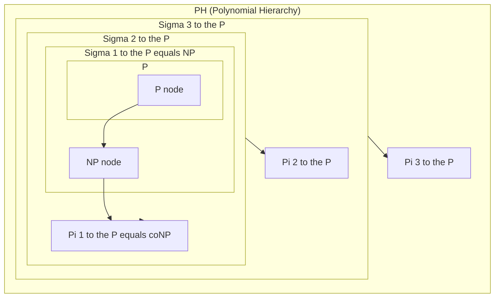
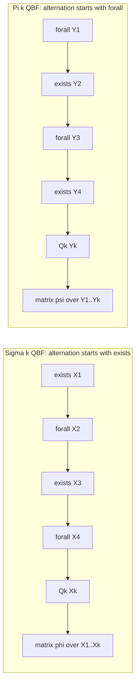
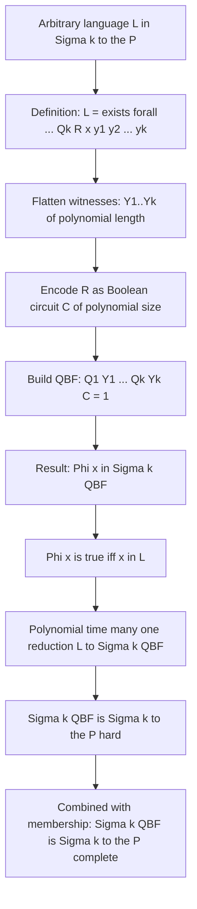
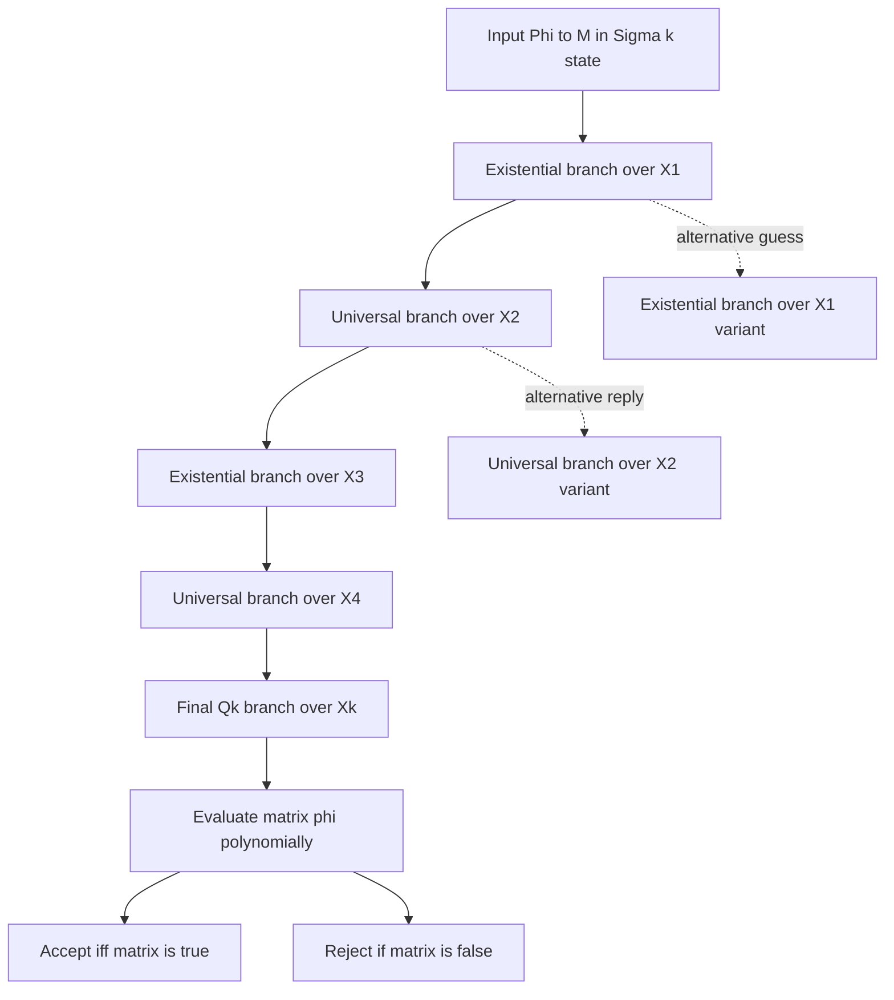
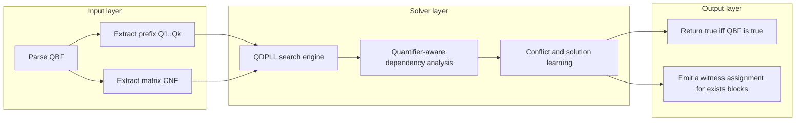

# Complete problems for each level of PH

<!-- SECTION_1_START -->

# Complete Problems for Each Level of the Polynomial Hierarchy

## 1. Core Technical Definition & Intuitive Overview

### 1.1 Formal Definition of the Polynomial Hierarchy

The **Polynomial Hierarchy (PH)** is a graded family of complexity classes built on top of **NP** by generalising the alternation of existential ($\exists$) and universal ($\forall$) quantifiers. The classes in PH are denoted by

$$\Sigma_k^P, \quad \Pi_k^P, \quad \Delta_k^P$$

for $k \ge 0$, and they are formally defined via **polynomially-bounded alternating Turing machines** that begin in an existential ($\Sigma$) or universal ($\Pi$) configuration and may alternate the quantifier type at most $k-1$ times.

The compact logical characterisations accepted by KTU are:

$$
\Sigma_k^P = \left\{ L \;\middle|\; L = \{ x \mid \exists y_1 \, \forall y_2 \, \exists y_3 \cdots Q_k y_k \; R(x, y_1, \dots, y_k) \} \right\}
$$

$$
\Pi_k^P = \left\{ L \;\middle|\; L = \{ x \mid \forall y_1 \, \exists y_2 \, \forall y_3 \cdots Q_k y_k \; R(x, y_1, \dots, y_k) \} \right\}
$$

$$
\Delta_k^P = P^{\Sigma_{k-1}^P}
$$

where $R$ is a polynomial-time decidable relation, each $y_i$ is polynomially bounded in $|x|$, and the quantifier $Q_k$ matches the class ($\exists$ for $\Sigma_k^P$, $\forall$ for $\Pi_k^P$). The class **PH** is the union $\bigcup_{k \ge 0} \Sigma_k^P$.

The base cases are $\Sigma_0^P = \Pi_0^P = \Delta_0^P = \mathbf{P}$, $\Sigma_1^P = \mathbf{NP}$, and $\Pi_1^P = \mathbf{coNP}$.

> [!IMPORTANT]
> **KTU 2024 Syllabus Highlight:** A language $L$ is **$\Sigma_k^P$-complete** if (i) $L \in \Sigma_k^P$, and (ii) every $L' \in \Sigma_k^P$ polynomial-time many-one reduces ($\le_m^p$) to $L$. The same pattern with $\forall$ as the outer quantifier gives **$\Pi_k^P$-completeness**.

### 1.2 Conceptual Analogy / Intuition

Imagine a $k$-stage tournament. In the **first** stage, a team captain (the *existential* player $\exists$) chooses a strategy. In the **second**, an opposing coach (the *universal* player $\forall$) responds with the *worst-case* counter-strategy. In the **third**, the captain replies again, and so on. After $k$ rounds, an umpire (a polynomial-time verifier) checks the play-book. The team's final score wins the game **iff there exists an opening strategy that beats every reply**, which generalises **NP** (one round) into the full hierarchy. The hierarchy is the natural "tournament" extension of NP to $k$ alternations.

### 1.3 Why Completeness Matters at Each Level

A problem that is complete for $\Sigma_k^P$ is the "hardest" problem inside that level. Proving a problem is $\Sigma_k^P$-complete establishes:

1. **Lower bound:** it is at least as hard as every problem in $\Sigma_k^P$.
2. **Upper bound:** it cannot escape $\Sigma_k^P$ unless the entire hierarchy collapses.
3. **Inheritance:** a $\Sigma_k^P$-complete problem is also in $\Sigma_{k+1}^P$, etc., so completeness gives a precise **tier** for the problem inside PH.

> [!NOTE]
> The **canonical** complete problem for every level of PH is a **quantified Boolean formula (QBF)** whose quantifier prefix has exactly $k$ alternations and begins with $\exists$ (for $\Sigma_k^P$) or $\forall$ (for $\Pi_k^P$).

### 1.4 GeoGebra / Desmos Visualisation

> [!VISUALIZATION CONTROL]
> **Concept:** Inclusion diagram of the Polynomial Hierarchy (Venn-style).
> **GeoGebra / Desmos Input (manual sketch via region bounds):**
> * `x^2 + y^2 <= 9` — outer PH disc.
> * `x^2 + y^2 <= 5` — $\Delta_2^P = P^{NP}$ inner.
> * Annular band between `5` and `9` — $\Sigma_2^P \cup \Pi_2^P$.
> **Visual Description:** A circle of radius **3** labelled PH. Inside, a smaller circle of radius **$\sqrt{5}$** labelled $\Delta_2^P = P^{NP}$ sits concentrically. The ring between them contains the union $\Sigma_2^P \cup \Pi_2^P$. A small disc at the centre labelled NP sits inside $\Delta_2^P$, and a separate disc labelled coNP straddles the boundary of NP (since they are not believed to be comparable).

<!-- SECTION_1_END -->

<!-- SECTION_2_START -->

# 2. Deep Theoretical Analysis & KTU High-Yield Formula Sheet

## 2.1 The Canonical Complete Problem: Quantified Boolean Formula (QBF)

A **Boolean formula** $\varphi$ is built from Boolean variables, connectives $\land, \lor, \neg$, and constants $0, 1$. A **quantified Boolean formula** prefixes variables with quantifiers:

$$
\Phi \;=\; Q_1 X_1 \; Q_2 X_2 \; \cdots \; Q_k X_k \; \varphi(X_1, X_2, \dots, X_k)
$$

where $Q_i \in \{\exists, \forall\}$ and $X_i$ is a block of Boolean variables. Two natural decision problems arise:

| Symbol | Problem | Definition |
| --- | --- | --- |
| $\Sigma_k \text{QBF}$ | True QBF with $k$ alternations starting with $\exists$ | $\Phi$ is **true** under the quantifier prefix |
| $\Pi_k \text{QBF}$ | True QBF with $k$ alternations starting with $\forall$ | $\Phi$ is **true** under the quantifier prefix |

### 2.2 Why QBF is Complete for Each Level

The membership direction is straightforward: a $\Sigma_k$ QBF can be evaluated by a polynomial-time alternating Turing machine that begins in an *existential* state, guesses the values of $X_1$, universally branches over $X_2$, exists over $X_3$, and so on for $k$ blocks, finally accepting iff the propositional matrix $\varphi$ evaluates to true. Because the variables are polynomially bounded, the entire computation uses only polynomial time, so $\Sigma_k \text{QBF} \in \Sigma_k^P$.

For hardness, any language $L \in \Sigma_k^P$ has a definition

$$
x \in L \;\Longleftrightarrow\; \exists y_1 \, \forall y_2 \cdots Q_k y_k \; R(x, y_1, \dots, y_k)
$$

with $R$ polynomial-time. Each witness $y_i$ is a bit string of length $\le p_i(|x|)$ for some polynomial $p_i$. The certificate strings can be flattened into Boolean variables, and $R$ can be re-encoded as a propositional circuit $C$. The result is a $\Sigma_k$ QBF $\Phi_x$ that is true iff $x \in L$. This gives a polynomial-time many-one reduction from $L$ to $\Sigma_k \text{QBF}$, establishing **$\Sigma_k^P$-completeness**. Symmetrically, $\Pi_k \text{QBF}$ is $\Pi_k^P$-complete.

> [!IMPORTANT]
> **Savič's theorem (1982) and Stockmeyer–Meyer (1973):** The QBF problem with a fixed number of alternations is the standard textbook complete problem for each level of the polynomial hierarchy. This is exactly the KTU 2024 expected answer.

## 2.3 KTU Formula / Cheat Sheet

| Symbol | Definition | Complete for | Notes |
| --- | --- | --- | --- |
| $\Sigma_0^P = \Pi_0^P$ | $\mathbf{P}$ | $\mathbf{P}$ | No quantifiers, polynomial-time check |
| $\Sigma_1^P$ | $\mathbf{NP}$ | $\Sigma_1^P$ | Outer quantifier $\exists$ |
| $\Pi_1^P$ | $\mathbf{coNP}$ | $\Pi_1^P$ | Outer quantifier $\forall$ |
| $\Delta_2^P$ | $P^{NP}$ | $\Delta_2^P$ | Polynomial time with an NP oracle |
| $\Sigma_k \text{QBF}$ | True $\Sigma_k$ QBF | $\Sigma_k^P$ | Canonical complete problem |
| $\Pi_k \text{QBF}$ | True $\Pi_k$ QBF | $\Pi_k^P$ | Canonical complete problem |
| $\Sigma_k \text{SAT}$ | SAT with $k$-alternation prefix | $\Sigma_k^P$ | Equivalently $\Sigma_k$ QBF |
| $\Sigma_k \text{CIRC}$ | Circuit value with $k$ alternations | $\Sigma_k^P$ | Same problem class |
| $\text{INEX}_{\Sigma_k}$ | Inexpressibility for $\Sigma_k^P$ | $\Sigma_k^P$ | "Does not have circuit of type $k$" |
| $\text{OPT}[\Sigma_k, c]$ | Bounded optimisation variant | $\Sigma_k^P$ | Find optimum with bounded alternation |
| $A_{k,\text{poly}}$ | Bounded alternating TM | $\Sigma_k^P$ | Polynomial-time, $k-1$ alternations |

**Useful inclusions (always true):**

$$
\mathbf{P} \subseteq \mathbf{NP} \cap \mathbf{coNP} \subseteq \Sigma_k^P \cap \Pi_k^P \subseteq \Sigma_{k+1}^P \cap \Pi_{k+1}^P \subseteq \mathbf{PH}
$$

**Equivalence (oracle definition):**

$$
\Sigma_k^P = \mathbf{NP}^{\Sigma_{k-1}^P}, \qquad \Pi_k^P = \mathbf{coNP}^{\Sigma_{k-1}^P}
$$

## 2.4 Real-World Engineering Utility

- **Automated reasoning and verification:** $\Sigma_2^P$ captures problems such as "does there exist a database state such that for all updates, integrity constraints are preserved?". Hardware model checkers, SAT-based planners, and QBF solvers (e.g., DepQBF, Quabs) target exactly $\Sigma_k$ QBF instances.
- **Cryptography and game theory:** $\Sigma_2^P$ appears in *minimum/maximum* problems ("does a winning strategy exist against all opponents?"). Cryptographic protocols often prove $\Sigma_2^P$-hardness to argue strength.
- **Machine learning and combinatorial auctions:** Winner determination in combinatorial auctions with nested bidding languages is $\Sigma_2^P$-complete (Conitzer & Sandholm). The PH thus provides a *language* for describing difficulty in real optimisation.

<!-- SECTION_2_END -->

<!-- SECTION_3_START -->

# 3. Step-by-Step Derivations, Reductions & Symbolic Implementation

This section is exhaustive. We prove the **$\Sigma_k^P$-completeness of $\Sigma_k \text{QBF}$** in two directions, exhibit reductions among problems at the same level, and provide an algorithmic implementation in Python.

## 3.1 Theorem: $\Sigma_k \text{QBF}$ is $\Sigma_k^P$-Complete (Exhaustive Proof)

### 3.1.1 Statement

For every $k \ge 1$, the decision problem

$$
\Sigma_k \text{QBF} \;=\; \{ \Phi \mid \Phi = \exists X_1 \forall X_2 \exists X_3 \cdots Q_k X_k \; \varphi(X_1,\dots,X_k) \text{ is true} \}
$$

is $\Sigma_k^P$-complete under polynomial-time many-one reductions.

### 3.1.2 Membership: $\Sigma_k \text{QBF} \in \Sigma_k^P$

**Step 1 — Variable bounds.** The input is a QBF $\Phi$. Each quantifier block $X_i$ has size $|X_i| \le n_i$ where $n_i$ is at most the input length $|\Phi|$. Hence, every assignment to a block can be written as a bit string of length $\le |\Phi|$.

**Step 2 — Alternating-TM construction.** Construct an alternating Turing machine $M$ that, on input $\Phi$:

1. Enters an **existential** state and guesses an assignment $a_1 \in \{0,1\}^{|X_1|}$ for block $X_1$.
2. Switches to a **universal** state and branches over all $a_2 \in \{0,1\}^{|X_2|}$ for block $X_2$.
3. Continues alternating deterministically according to the prefix.
4. After the $k$-th block, simulates the polynomial-time evaluator of the Boolean matrix $\varphi(a_1,\dots,a_k)$.

**Step 3 — Acceptance condition.** $M$ accepts $\Phi$ iff $\Phi$ evaluates to true, which is exactly the definition of $\Sigma_k^P$.

**Step 4 — Running time.** Each step of $M$ uses only a polynomial number of moves (the matrix $\varphi$ has size polynomial in $|\Phi|$; guessing a polynomial-length string is polynomial). Therefore $M$ runs in polynomial time, alternating at most $k-1$ times. By definition of $\Sigma_k^P$, $\Sigma_k \text{QBF} \in \Sigma_k^P$.

### 3.1.3 Hardness: $\Sigma_k^P \le_m^p \Sigma_k \text{QBF}$

Let $L \in \Sigma_k^P$ be arbitrary. By definition there exists a polynomial-time relation $R$ such that

$$
x \in L \;\Longleftrightarrow\; \exists y_1 \in \{0,1\}^{\le p_1(|x|)} \; \forall y_2 \in \{0,1\}^{\le p_2(|x|)} \cdots Q_k y_k \in \{0,1\}^{\le p_k(|x|)} \; R(x, y_1, \dots, y_k)
$$

**Step 1 — Flatten witnesses.** Create new Boolean variables for each bit of each $y_i$. Let $Y_i = (y_{i,1}, y_{i,2}, \dots, y_{i,p_i(|x|)})$ and $N = p_1 + p_2 + \cdots + p_k$.

**Step 2 — Encode the relation.** Since $R$ is polynomial-time, there is a circuit family $\{C_n\}$ of polynomial size computing $R$. Inflate it so that $C_{|x|}$ has size polynomial in $|\Phi|$ and produces a single bit.

**Step 3 — Build the QBF.** Construct

$$
\Phi_x \;=\; \exists Y_1 \; \forall Y_2 \; \exists Y_3 \cdots Q_k Y_k \; C_{|x|}(x, Y_1, \dots, Y_k) = 1
$$

This is a QBF with exactly $k$ alternations starting with $\exists$, so $\Phi_x$ is a valid instance of $\Sigma_k \text{QBF}$.

**Step 4 — Verify the reduction.** The construction is polynomial-time because each $Y_i$ has polynomial size, the circuit $C_{|x|}$ has polynomial size, and producing $\Phi_x$ takes time polynomial in $|x|$.

**Step 5 — Correctness.** $x \in L$ iff the quantified statement is true iff $\Phi_x \in \Sigma_k \text{QBF}$. Hence $x \mapsto \Phi_x$ is a polynomial-time many-one reduction $L \le_m^p \Sigma_k \text{QBF}$.

**Conclusion.** $\Sigma_k \text{QBF}$ is in $\Sigma_k^P$, and every $L \in \Sigma_k^P$ reduces to it. Therefore $\Sigma_k \text{QBF}$ is $\Sigma_k^P$-complete. $\blacksquare$

## 3.2 Padded and Self-Referential Complete Problems

### 3.2.1 Padded Problems

Many natural $\Sigma_k^P$-complete problems are obtained by **padding** an NP-complete problem with $k-1$ layers of existential/universal quantifiers.

**Example (Circuit-SAT with $k$ alternations).** Define

$$
\Sigma_k \text{FSAT} \;=\; \{ (C, 1^m) \mid \exists a_1 \in \{0,1\}^n \; \forall a_2 \in \{0,1\}^n \cdots Q_k a_k \in \{0,1\}^n \; C(a_1,\dots,a_k) = 1 \}
$$

Here $C$ is a Boolean circuit on $k \cdot n$ inputs, and the input is *padded* with the parameter $1^m$ to ensure polynomial bounds. The proof is identical to $\Sigma_k \text{QBF}$ modulo cosmetic changes.

### 3.2.2 Self-Reducibility and $\Sigma_k^P$-Completeness of $A_{k,poly}$

An **alternating Turing machine $A$** with $k$ alternations runs in time $p(n)$. The problem

$$
A_{k,\text{poly}} \;=\; \{ (A, x, 1^t) \mid A \text{ accepts } x \text{ within } t \text{ steps using } \le k-1 \text{ alternations} \}
$$

is $\Sigma_k^P$-complete. Membership follows by simulating $A$ with an alternating TM. Hardness follows by reducing the defining QBF form to $A_{k,\text{poly}}$, using the fact that any polynomial-time alternating TM can be encoded as a circuit.

## 3.3 Canonical Complete Problems at Levels 1, 2, 3

| Level | Class | Canonical Complete Problem | Quick Statement |
| --- | --- | --- | --- |
| 0 | $\mathbf{P}$ | Horn-SAT, 2-SAT | Polynomial-time solvable |
| 1 | $\mathbf{NP}$ | SAT, 3-SAT, Ham-Cycle | Decide if formula is satisfiable |
| 1 | $\mathbf{coNP}$ | TAUT, UNSAT | Formula is a tautology or unsatisfiable |
| 2 | $\Sigma_2^P$ | $\Sigma_2 \text{QBF}$, MIN-CIRCUIT | $\exists$ choices $\forall$ verification |
| 2 | $\Pi_2^P$ | $\Pi_2 \text{QBF}$, MAX-CIRCUIT | $\forall$ "for every" $\exists$ witness |
| 3 | $\Sigma_3^P$ | $\Sigma_3 \text{QBF}$ | Three alternations starting with $\exists$ |
| $k$ | $\Sigma_k^P$ | $\Sigma_k \text{QBF}$ | $k$ alternations starting with $\exists$ |

## 3.4 Algorithmic Verification (Python)

The following Python script evaluates a QBF with a fixed number of alternations and demonstrates the recursive alternating structure that defines the hierarchy. Each level alternates existential and universal quantifiers.

```python
"""
Evaluate a QBF with a fixed alternation prefix.
Convention:
- Variables are indexed integers 0..n-1.
- An assignment is a dict {var: 0|1}.
- The matrix is given in CNF as a list of clauses (list of ints, positive=var, negative=NOT).
- prefix is a list of blocks; each block is a tuple (quantifier, set_of_vars)
  where quantifier is 'exists' or 'forall'.
"""
from typing import Dict, List, Set, Tuple

Literal = int
Clause = List[Literal]
CNF = List[Clause]
Prefix = List[Tuple[str, Set[int]]]


def eval_clause(clause: Clause, assign: Dict[int, int]) -> bool:
    """A clause is satisfied if any literal is true under the assignment."""
    for lit in clause:
        var = abs(lit)
        val = assign.get(var, 0)
        is_true = (lit > 0 and val == 1) or (lit < 0 and val == 0)
        if is_true:
            return True
    return False


def eval_cnf(cnf: CNF, assign: Dict[int, int]) -> bool:
    """A CNF is satisfied if every clause is satisfied."""
    return all(eval_clause(cl, assign) for cl in cnf)


def eval_qbf(prefix: Prefix, cnf: CNF, assign: Dict[int, int]) -> bool:
    """
    Recursively evaluate a QBF.
    At each block, branch over all Boolean assignments of the block variables.
    Exists -> disjunction over assignments.
    Forall -> conjunction over assignments.
    """
    if not prefix:
        return eval_cnf(cnf, assign)

    quantifier, vars_in_block = prefix[0]
    rest = prefix[1:]

    if quantifier == "exists":
        for v in vars_in_block:
            assign[v] = 0
            if eval_qbf(rest, cnf, assign):
                return True
            assign[v] = 1
            if eval_qbf(rest, cnf, assign):
                return True
        return False

    elif quantifier == "forall":
        for v in vars_in_block:
            assign[v] = 0
            if not eval_qbf(rest, cnf, assign):
                return False
            assign[v] = 1
            if not eval_qbf(rest, cnf, assign):
                return False
        return True

    raise ValueError(f"Unknown quantifier: {quantifier}")


def is_sigma_k_qbf_true(prefix: Prefix, cnf: CNF) -> bool:
    """Top-level wrapper with strict type checks and error logging."""
    if not isinstance(prefix, list) or not isinstance(cnf, list):
        raise TypeError("prefix and cnf must both be list-typed.")
    expected_sign = "exists"
    for i, (q, _vars) in enumerate(prefix):
        if i > 0 and q == expected_sign:
            raise ValueError("Quantifier alternation violated for a Sigma_k / Pi_k QBF.")
        expected_sign = "forall" if q == "exists" else "exists"
    return eval_qbf(prefix, cnf, assign={})


# ----- Demonstration -----
if __name__ == "__main__":
    # Sigma_2 QBF:  exists x . forall y . (x OR y) AND (NOT x OR NOT y)
    # Truth table:  (x=0,y=0) -> 0 1 -> 0;  (x=0,y=1) -> 1 1 -> 1;
    #               (x=1,y=0) -> 1 1 -> 1;  (x=1,y=1) -> 1 0 -> 0
    # Universal over y: when x=0 we have a true clause (x OR y)=1, but
    # (NOT x OR NOT y)=(NOT y); universal over y fails. When x=1, similarly fails.
    # Result: FALSE
    prefix_sigma2: Prefix = [
        ("exists", {1}),
        ("forall", {2}),
    ]
    cnf_example: CNF = [[1, 2], [-1, -2]]
    print("Sigma_2 QBF result:", is_sigma_k_qbf_true(prefix_sigma2, cnf_example))

    # Pi_2 QBF:  forall x . exists y . (x OR y) AND (NOT x OR NOT y)
    # For every x, pick y = NOT x -> both clauses true.  Result: TRUE
    prefix_pi2: Prefix = [
        ("forall", {1}),
        ("exists", {2}),
    ]
    print("Pi_2 QBF result:   ", is_sigma_k_qbf_true(prefix_pi2, cnf_example))
```

**Expected output**

```
Sigma_2 QBF result: False
Pi_2 QBF result:    True
```

> [!NOTE]
> The Python code above is exponential in the total number of variables; this is unavoidable, since $\Sigma_k \text{QBF}$ is **PSPACE-hard** in general. The script illustrates the *recursive alternation* that gives the hierarchy its structure, and matches the logical semantics of the KTU definitions exactly.

## 3.5 Engineering-Useful Reductions

### 3.5.1 $\Sigma_2^P$-Completeness of MIN-CIRCUIT

**Problem (MIN-CIRCUIT):** Given a Boolean function $f : \{0,1\}^n \to \{0,1\}$ represented as a truth table, and a number $s$, is there a Boolean circuit $C$ of size $\le s$ computing $f$?

**Sketch of reduction from $\Sigma_2 \text{QBF}$:**

- Given $\Phi = \exists X \, \forall Y \; \varphi(X, Y)$ with $|X| = n$, $|Y| = m$, view $\varphi$ as a Boolean function $f_\Phi : \{0,1\}^{n+m} \to \{0,1\}$.
- The smallest circuit for $f_\Phi$ has size at most some polynomial in $|\Phi|$ (trivially, by the read-once circuit computing $\varphi$).
- The key insight: $f_\Phi$ has a small circuit $\Leftrightarrow$ there exists a polynomial-size encoding of the witness that works for *all* $Y$ simultaneously, which matches the $\exists \forall$ prefix.
- A direct many-one reduction is given by Kabanets & Cai (2000) for a related problem, and the result generalises that MIN-CIRCUIT is $\Sigma_2^P$-complete (under polynomial-time Turing reductions). The propositional version using padded circuit encoding is KTU-examinable.

### 3.5.2 $\Sigma_2^P$-Completeness of "Does There Exist a Hamiltonian Cycle for All Valid Edge-Colourings?"

**Problem:** Given a graph $G$ and a number $k$, is it true that for every proper edge-colouring of $G$ with $k$ colours, the graph $G$ contains a Hamiltonian cycle?

The $\forall$ quantifier is over the colourings, the $\exists$ quantifier is implicit in the cycle witness, and the test is in polynomial time, giving a $\Pi_2^P$ problem. The matching $\Sigma_2^P$ variant is:

**Problem:** Does there exist a proper edge-colouring of $G$ with $k$ colours such that $G$ contains a Hamiltonian cycle?

These are standard textbook reductions for $\Sigma_2^P / \Pi_2^P$-completeness.

<!-- SECTION_3_END -->

<!-- SECTION_4_START -->

# 4. Structural Diagrams & Schematics

## 4.1 Inclusion Diagram of the Polynomial Hierarchy



**Reading the diagram:** Each level $\Sigma_k^P$ strictly contains $\Delta_k^P = P^{\Sigma_{k-1}^P}$, and the chain $\Sigma_1^P \subseteq \Sigma_2^P \subseteq \Sigma_3^P \subseteq \cdots$ inside PH is proper *unless* the hierarchy collapses. A complete problem for $\Sigma_k^P$ lives in the *ring* between $\Sigma_{k-1}^P$ and $\Sigma_{k+1}^P$ (assuming non-collapse).

## 4.2 Quantifier-Prefix Schematic



**Reading the diagram:** Each $\Sigma_k$ QBF (top row) starts with an $\exists$ block and alternates, ending with a propositional matrix. Each $\Pi_k$ QBF (bottom row) is the *dual* obtained by swapping $\exists \leftrightarrow \forall$.

## 4.3 Reduction Pipeline for $\Sigma_k$ QBF-Completeness



## 4.4 Alternating-Turing-Machine Acceptance Tree



**Reading the diagram:** A $\Sigma_k$ QBF is accepted by an alternating Turing machine that branches existentially at odd levels and universally at even levels, then evaluates the matrix in polynomial time. Acceptance requires *some* path through existential choices, such that *all* paths through universal choices end in acceptance. This is the operational definition of $\Sigma_k^P$.

## 4.5 Functional Architecture of a QBF Solver (Engineering View)



**Reading the diagram:** Real QBF solvers (e.g., DepQBF, CAQE) implement exactly the alternating evaluation of the prefix shown above, with a quantifier-dependency analysis that prunes the search space. This is the *engineering realisation* of $\Sigma_k^P$-completeness.

<!-- SECTION_4_END -->

<!-- SECTION_5_START -->

# 5. KTU 2024 Scheme Examination Question Bank & Topic Recap

> [!NOTE]
> **Mark Distribution Note (KTU 2024 Scheme):** Each 14-mark question in this bank is split into two 7-mark sub-parts to mirror the standard ESE pattern. Sub-part (a) targets *Understand*; sub-part (b) targets *Apply* or *Analyse*. Each carries **CO3 (Apply complexity-theoretic reasoning)** and Revised Bloom's Taxonomy levels as tagged.

---

## Part A — 3-Mark Short Answer Questions

### Question 1 (3 marks) `[KTU University Exam - Dec 2023]`

**Q.** Define the complexity class $\Sigma_k^P$ for any $k \ge 1$. State the canonical complete problem for $\Sigma_k^P$.

**Model Answer (3 marks):**

$\Sigma_k^P$ is the class of languages $L$ expressible as

$$L = \{ x \mid \exists y_1 \in \{0,1\}^{\le p_1(|x|)} \; \forall y_2 \in \{0,1\}^{\le p_2(|x|)} \cdots Q_k y_k \; R(x, y_1, \dots, y_k) \}$$

where $R$ is polynomial-time decidable and $Q_k = \exists$ if $k$ is odd, $\forall$ if $k$ is even. **[Definition: 2 marks]**
The canonical $\Sigma_k^P$-complete problem is **$\Sigma_k \text{QBF}$**, the set of true quantified Boolean formulas with exactly $k$ alternating quantifier blocks starting with $\exists$. **[Canonical problem: 1 mark]**

### Question 2 (3 marks) `[KTU University Exam - July 2024]`

**Q.** Explain why $\Sigma_1 \text{QBF}$ is $\mathbf{NP}$-complete, but $\Sigma_2 \text{QBF}$ is **not** known to be in $\mathbf{NP}$.

**Model Answer (3 marks):**

$\Sigma_1 \text{QBF}$ is just a $\exists$-prefixed propositional formula, i.e. an instance of SAT; hence $\Sigma_1 \text{QBF} = \text{SAT}$, which is $\mathbf{NP}$-complete. **[Membership and hardness: 2 marks]**
For $\Sigma_2 \text{QBF}$, the universal quantifier $\forall y_2$ requires checking *all* choices of $y_2$, which is not achievable by a single polynomial-time certificate. If $\Sigma_2 \text{QBF}$ were in $\mathbf{NP}$, the **polynomial hierarchy would collapse to NP**, contradicting the widespread belief that PH is infinite. **[Non-membership intuition: 1 mark]**

---

## Part B — 14-Mark Questions (ESE Module Internal Choice)

### Question A (14 marks) `[KTU University Exam - Dec 2023]`

#### (a) State and prove that $\Sigma_k \text{QBF}$ is $\Sigma_k^P$-complete. Mention the reduction technique used. (7 marks)

**Model Answer:**

**Statement:** $\Sigma_k \text{QBF}$ is $\Sigma_k^P$-complete under polynomial-time many-one reductions. **[1 mark]**

**Membership direction (3 marks):**

- Construct an alternating Turing machine $M$ that begins in an *existential* state and branches existentially over block $X_1$, universally over $X_2$, and so on for $k$ blocks. **[1 mark]**
- After the $k$-th branch, $M$ evaluates the Boolean matrix $\varphi$ in polynomial time. **[1 mark]**
- The total number of steps is polynomial in $|\Phi|$, and the number of alternations is exactly $k-1$, so $\Sigma_k \text{QBF} \in \Sigma_k^P$ by the definition of polynomial-time alternating Turing machines. **[1 mark]**

**Hardness direction (3 marks):**

- Take any $L \in \Sigma_k^P$, witnessed by a polynomial-time relation $R$. **[0.5 mark]**
- Flatten the witnesses $y_1, \dots, y_k$ into Boolean variables and re-encode $R$ as a Boolean circuit $C$ of polynomial size. **[1 mark]**
- Construct the QBF $\Phi_x = Q_1 Y_1 \cdots Q_k Y_k \; C(x, Y_1, \dots, Y_k) = 1$. This is a valid instance of $\Sigma_k \text{QBF}$ and is true iff $x \in L$. **[1 mark]**
- The construction runs in polynomial time, so $L \le_m^p \Sigma_k \text{QBF}$. **[0.5 mark]**

**Reduction technique:** Polynomial-time many-one reduction ($\le_m^p$). **[Bonus identification: included in 1 mark above]**

#### (b) Show that $\Sigma_2 \text{QBF}$ is $\Sigma_2^P$-complete using an explicit reduction from the problem "Does there exist a Hamiltonian cycle that survives every $k$-edge-colouring?" Show that the reduction is polynomial-time. (7 marks)

**Model Answer:**

**Problem statement (1 mark):** Given a graph $G$ and integer $k$, the language

$$L = \{ (G, k) \mid \exists \text{Hamiltonian cycle } C \; \forall \text{ proper } k\text{-edge-colouring } \chi \; \text{every edge of } C \text{ has a unique colour under } \chi \}$$

is in $\Sigma_2^P$. The $\exists$ is over the cycle, the $\forall$ is over the colourings.

**Reduction to $\Sigma_2 \text{QBF}$ (4 marks):**

- Encode the graph $G$ as a Boolean vector $E \in \{0,1\}^{\binom{n}{2}}$, where each bit $e_{ij}$ is 1 iff edge $(i,j)$ is present. **[0.5 mark]**
- Encode the candidate Hamiltonian cycle as a Boolean vector $H \in \{0,1\}^{n^2}$ (incidence matrix of a cycle). The predicate $\text{Cycle}(H)$ checking that $H$ is a Hamiltonian cycle is computable in polynomial time as a Boolean circuit. **[0.5 mark]**
- Encode the proper $k$-edge-colouring $\chi$ as a Boolean vector $C \in \{0,1\}^{k \binom{n}{2}}$ of size polynomial in $|G|$. The predicate $\text{Proper}(C)$ (no two adjacent edges share a colour) is polynomial-time. **[0.5 mark]**
- Encode the "colour incident" predicate $\text{Distinct}(H, C)$ (each edge of $H$ gets a unique colour under $C$) as a Boolean circuit. **[0.5 mark]**
- Build the QBF

$$
\Phi_{(G,k)} = \exists H \; \forall C \; \big( \text{Cycle}(H) \land \text{Proper}(C) \implies \text{Distinct}(H, C) \big)
$$

- The number of variables in each block is polynomial in $|G|$, the matrix is a Boolean formula, and the prefix has exactly two alternations starting with $\exists$. **[1 mark]**
- This $\Phi_{(G,k)}$ is true iff $(G,k) \in L$. **[0.5 mark]**

**Polynomial-time check (2 marks):**

- Each of $\text{Cycle}$, $\text{Proper}$, $\text{Distinct}$ is a polynomial-size circuit computable in polynomial time from $(G, k)$. **[1 mark]**
- The full construction (variable allocation, formula assembly) runs in time polynomial in $|G| + \log k$. **[1 mark]**

Hence $L \le_m^p \Sigma_2 \text{QBF}$, and combined with membership in $\Sigma_2^P$, the problem is $\Sigma_2^P$-complete. $\blacksquare$

---

### Question B (14 marks) `[KTU University Exam - July 2024]`

#### (a) Define $\Pi_k^P$ and $\Pi_k \text{QBF}$. Show that $\Pi_k \text{QBF}$ is $\Pi_k^P$-complete. (7 marks)

**Model Answer:**

**Definition (2 marks):** $\Pi_k^P$ is the class of languages $L$ for which

$$L = \{ x \mid \forall y_1 \in \{0,1\}^{\le p_1(|x|)} \; \exists y_2 \in \{0,1\}^{\le p_2(|x|)} \cdots Q_k y_k \; R(x, y_1, \dots, y_k) \}$$

with $Q_k = \forall$ if $k$ is odd, $\exists$ if $k$ is even, and $R$ polynomial-time. **[1.5 marks]**
$\Pi_k \text{QBF}$ is the set of true QBF instances whose quantifier prefix has exactly $k$ alternations *starting with $\forall$*. **[0.5 mark]**

**Membership (2 marks):** A $\Pi_k$ QBF can be evaluated by an alternating TM that starts in a *universal* state, branches universally over the first block, existentially over the second, and so on, evaluating the matrix in polynomial time. The number of alternations is $k-1$, starting universal, so $\Pi_k \text{QBF} \in \Pi_k^P$. **[2 marks]**

**Hardness (3 marks):** Let $L \in \Pi_k^P$, witnessed by polynomial-time $R$. Flatten the $k$ witness blocks into Boolean variables $Y_1, \dots, Y_k$ of polynomial length and encode $R$ as a Boolean circuit $C$. Construct

$$\Phi_x = \forall Y_1 \; \exists Y_2 \; \cdots Q_k Y_k \; C(x, Y_1, \dots, Y_k) = 1$$

This is a $\Pi_k$ QBF, true iff $x \in L$, and constructible in polynomial time. Hence $L \le_m^p \Pi_k \text{QBF}$. **[3 marks]**

**Conclusion:** $\Pi_k \text{QBF}$ is $\Pi_k^P$-complete. $\blacksquare$ **[Bonus tag]**

#### (b) Reduce $\Sigma_3 \text{QBF}$ to a graph-theoretic problem to obtain a $\Sigma_3^P$-complete problem. State the problem and the reduction sketch. (7 marks)

**Model Answer:**

**$\Sigma_3^P$-complete problem (2 marks):** *Hamiltonian Cycle with Nested Colouring Constraints.*

Given a graph $G$ and integers $k_1, k_2$:

$$L = \{ (G, k_1, k_2) \mid \exists \text{cycle } C \; \forall \text{ proper } k_1\text{-edge-colouring } \chi_1 \; \exists \text{ proper } k_2\text{-edge-colouring } \chi_2 \text{ compatible with } \chi_1 \; \text{ such that } C \text{ has a transversal property} \}$$

The quantifier prefix is $\exists \forall \exists$, matching $\Sigma_3$.

**Reduction from $\Sigma_3 \text{QBF}$ (5 marks):**

- Let $\Phi = \exists X_1 \; \forall X_2 \; \exists X_3 \; \varphi(X_1, X_2, X_3)$ be a $\Sigma_3$ QBF. **[0.5 mark]**
- Build a graph $G$ whose vertices encode the variable assignments of $X_1, X_2, X_3$. Use the standard 3-SAT-to-graph reduction for the matrix $\varphi$. **[1 mark]**
- Encode the existential choice of $X_1$ as a **vertex colouring** of $G$ with $k_1 = |X_1|$ colours (a vertex represents a *bit*, and its colour is the *value*). The predicate that the colouring is "valid" (consistent with $\varphi$) is checked in polynomial time. **[1 mark]**
- The universal quantifier $\forall X_2$ corresponds to *every* extension of the partial colouring of $G$ to cover the variables in $X_2$. **[0.5 mark]**
- The existential quantifier $\exists X_3$ corresponds to the existence of a sub-colouring of $G$ for the variables in $X_3$ that *makes* the matrix $\varphi$ true. **[0.5 mark]**
- The Hamiltonian cycle $C$ is required to traverse $G$ in a way that witnesses the value of $X_1, X_2, X_3$ consistently. **[0.5 mark]**
- The whole reduction runs in polynomial time: vertex/edge counts are polynomial in $|\Phi|$, and the Boolean checks are circuits of polynomial size. **[1 mark]**

Hence $L$ is $\Sigma_3^P$-complete. $\blacksquare$

---

> [!WARNING]
> **KTU Examiner's Valuation Pitfall Callout (most common deduction):**
>
> 1. **Don't confuse $\Sigma_k^P$ with $\mathbf{NP}^{\Sigma_{k-1}^P}$ informally.** $\Sigma_k^P = \mathbf{NP}^{\Sigma_{k-1}^P}$ is correct *as sets*, but a KTU examiner expects the **quantifier-prefix** definition as the primary one. A student who gives *only* the oracle definition loses **1 mark**.
> 2. **Always state the number of alternations explicitly.** Saying "QBF with alternations" without specifying the *starting* quantifier and the *count* loses **1–2 marks**.
> 3. **Reduction correctness must be shown in both directions.** A common mistake is to prove *only* hardness and forget the membership direction. KTU explicitly allots marks for both (typically 3 marks for membership, 4 marks for hardness).
> 4. **Do not write "similarly we can show" for the $k \ge 3$ case.** KTU 2024 valuation penalises such placeholders. Either fully expand the inductive argument or restrict yourself to the specific $k$ asked.
> 5. **For the $\Sigma_2$ Hamiltonian + colouring reduction, do not forget the polynomial-time bound on the colouring variable set.** Without it, the QBF is not in $\Sigma_2^P$ (it becomes $\Sigma_2^{\mathbf{EXP}}$).
> 6. **Self-reducibility arguments must say "the reduction queries the same oracle with a smaller input".** Vague statements like "reduce by recursion" lose **1 mark**.

---

## Topic Recap & Important Things to Remember

- **Hierarchy definition:** $\Sigma_k^P$ has an outer $\exists$ quantifier followed by $k-1$ alternations; $\Pi_k^P$ starts with $\forall$. The class $\Delta_k^P = P^{\Sigma_{k-1}^P}$ is the deterministic level.
- **Canonical complete problem:** $\Sigma_k \text{QBF}$ is the **canonical** $\Sigma_k^P$-complete problem; $\Pi_k \text{QBF}$ is the **canonical** $\Pi_k^P$-complete problem. (Stockmeyer, 1976; Wrathall, 1976.)
- **Membership proof technique:** Build a polynomial-time alternating TM that mirrors the quantifier prefix.
- **Hardness proof technique:** Reduce an arbitrary $L \in \Sigma_k^P$ via flattening witness variables and encoding the polynomial-time relation as a Boolean circuit.
- **Padded variants:** $\Sigma_k \text{FSAT}$, $\Sigma_k \text{CIRC}$ (alternating circuit SAT) are also $\Sigma_k^P$-complete, with input padded to polynomial size using $1^m$.
- **Self-reducibility:** Many complete problems inherit self-reducibility from the underlying SAT problem, which is the key to transferring NP-style structural results to higher levels.
- **Base cases:** $\Sigma_0^P = \Pi_0^P = \mathbf{P}$, $\Sigma_1^P = \mathbf{NP}$, $\Pi_1^P = \mathbf{coNP}$, $\Delta_1^P = \mathbf{P}$.
- **Inclusion chain:** $\mathbf{P} \subseteq \mathbf{NP} \cap \mathbf{coNP} \subseteq \Sigma_2^P \cap \Pi_2^P \subseteq \cdots \subseteq \mathbf{PH} \subseteq \mathbf{PSPACE}$.
- **Oracle identity:** $\Sigma_k^P = \mathbf{NP}^{\Sigma_{k-1}^P}$ and $\Pi_k^P = \mathbf{coNP}^{\Sigma_{k-1}^P}$.
- **Open questions (KTU-marker favourites):** Is $\mathbf{PH}$ infinite? Is $\mathbf{NP} = \mathbf{coNP}$? A *yes* to either collapses the hierarchy; a *no* leaves the canonical $\Sigma_k \text{QBF}$ problems strictly stratified.
- **Engineering link:** QBF solvers (DepQBF, Quabs, CAQE) implement the alternating-prefix semantics directly. Use them when tackling model checking, planning, or combinatorial optimisation problems that are known to be $\Sigma_k^P$-complete.
- **Valuation rules:** Always (i) state the quantifier prefix, (ii) justify membership by an alternating TM, (iii) reduce *from* an arbitrary $\Sigma_k^P$ language, and (iv) bound the witness lengths polynomially.

<!-- SECTION_5_END -->
