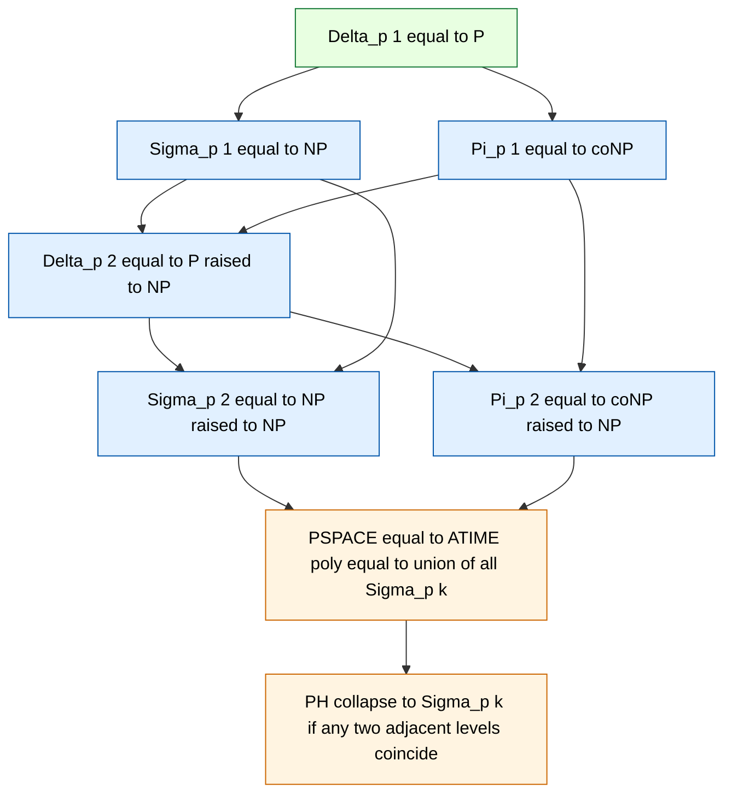
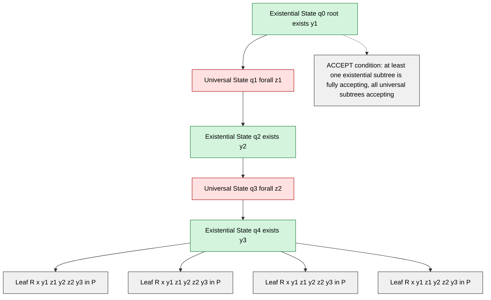
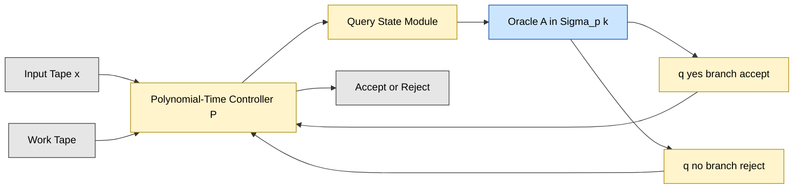

# Polynomial Hierarchy and Alternation - Definition of the polynomial hierarchy (PH)

<!-- SECTION_1_START -->
# Polynomial Hierarchy (PH) — Core Technical Definition & Intuitive Overview

## 1. Formal Definition (Stockmeyer, 1976)

The **Polynomial Hierarchy (PH)** is a nested sequence of complexity classes $\Sigma_p^k$, $\Pi_p^k$, and $\Delta_p^k$ (for $k \ge 0$) that generalise **P**, **NP**, and **co-NP**. It can be defined equivalently via two routes — **oracle machines** and **alternating Turing machines** — both of which are first-class citizens in the KTU 2024 syllabus.

> [!IMPORTANT]
> **Oracle Definition (canonical KTU formulation).** Let $C$ be a complexity class. Then $C^{C'}$ denotes the class of languages decided by polynomial-time Turing machines of type $C$ equipped with an **oracle** for any language $L \in C'$. The polynomial hierarchy is the inductive tower:
>
> $$\begin{aligned}
> \Sigma_p^0 &:= \Pi_p^0 := \Delta_p^0 := \Delta_p^1 := P \\
> \Delta_p^{k+1} &:= P^{\Sigma_p^k} \\
> \Sigma_p^{k+1} &:= NP^{\Sigma_p^k} \\
> \Pi_p^{k+1} &:= co\Sigma_p^{k+1}
> \end{aligned}$$
>
> The **full hierarchy** is the union $PH := \bigcup_{k \ge 0} \Sigma_p^k = \bigcup_{k \ge 0} \Pi_p^k$.

> [!NOTE]
> **Alternation Definition (equivalent, structural view).** $PH$ is the class of languages decidable by an **alternating Turing machine** running in polynomial time, where the alternation depth of existential and universal states is bounded by a constant. Formally $PH = \bigcup_{k \ge 0} \Sigma_k^p\,(poly)$, where $\Sigma_k^T(poly)$ is the class of languages decided in time $O(n^c)$ by alternating TMs that begin in an existential state and alternate at most $k-1$ times.

## 2. Conceptual Analogy — A Courtroom With Multiple Appeals

Imagine a multi-tier court system deciding a complex criminal case:

- **Level 1 (NP = $\Sigma_p^1$):** The *prosecutor* (existential quantifier $\exists$) only needs **one** winning piece of evidence to convict.
- **Level 2 ($\Sigma_p^2$):** The prosecutor supplies evidence **only if** the defence (universal quantifier $\forall$) cannot refute it for **every** possible counter-argument. The pattern is $\exists \forall$.
- **Level 3 ($\Sigma_p^3$):** The pattern becomes $\exists \forall \exists$ — a deeper game-theoretic search.

Each new "round" of quantifier alternation adds a tier of strategic depth. The **entire hierarchy PH** is the class of problems solvable in a *bounded* (though possibly large) number of such adversarial rounds. If you "flatten" the rounds and allow unbounded alternation, you reach **PSPACE** — the supreme court where every strategy can be explored.

> [!TIP]
> **Quantifier Reading Rule.** $\Sigma_p^k$ corresponds to a formula with **$k$ alternations starting with $\exists$**; $\Pi_p^k$ starts with $\forall$. For example, $\Sigma_p^2$ problems are expressible as $\exists \vec{y}\, \forall \vec{z}\, R(\vec{x}, \vec{y}, \vec{z})$ with $R \in P$.

## 3. Key Landmarks (Canonical Inclusions)

$$\begin{aligned}
P = \Delta_p^1 \subseteq \Sigma_p^1 \cap \Pi_p^1 = NP \cap coNP
\subseteq \Sigma_p^1 \cup \Pi_p^1 \subseteq \Delta_p^2 \subseteq \Sigma_p^2 \cup \Pi_p^2 \subseteq \cdots
\subseteq PH \subseteq PSPACE
\end{aligned}$$

The **structure theorem** $P^{\Sigma_p^k} \subseteq \Sigma_p^{k+1} \cap \Pi_p^{k+1}$ (the "Karp–Lipton style" inclusion) is fundamental for KTU board derivations.

## 4. Visualisation Callout — Quantifier Tree of $\Sigma_p^2$

> [!VISUALIZATION CONTROL]
> **Concept:** Quantifier alternation tree for the canonical $\Sigma_p^2$ problem $\exists \vec{y}\, \forall \vec{z}\, R(\vec{x}, \vec{y}, \vec{z})$.
> **GeoGebra / Desmos Input Equations (parametric sketch):**
> * Root point $R_0 = (0, 4)$ labelled $\exists \vec{y}$
> * Children $C_1 = (-2, 2)$, $C_2 = (2, 2)$ labelled $\forall \vec{z}$
> * Leaves $L_i = (-3, 0),\ (-1, 0),\ (1, 0),\ (3, 0)$ labelled $R(\vec{x}, \vec{y}, \vec{z}) \in P$
> **Visual Description:** A root node branches into two "opponent" universal subtrees; every leaf corresponds to a polynomial-time decidable relation. The acceptance condition is that **at least one** existential child subtree has **all** its universal leaves accepting.
<!-- SECTION_1_END -->

<!-- SECTION_2_START -->
# Deep Theoretical Analysis & KTU High-Yield Formula Sheet

## 1. Operational Concept Breakdown

### 1.1 Oracle Turing Machines (OTM)
An **oracle TM** $M^{O}$ is a deterministic TM with three extra states: $q_{query}$, $q_{yes}$, $q_{no}$. When $M$ enters $q_{query}$ on input string $q$:

1. The string $q$ is written on a separate oracle tape.
2. In a **single computational step**, the oracle reports whether $q \in O$.
3. Computation continues from $q_{yes}$ or $q_{no}$ accordingly.

The key invariant is that **oracle queries cost one step** regardless of the size of the queried string. This is what gives $NP^{NP}$ its power.

### 1.2 Quantifier Characterisation (Sisaraju)

For a polynomial-time decidable relation $R$:

$$\begin{aligned}
\Sigma_p^k &= \{ L \mid x \in L \iff \exists \vec{y_1}\, \forall \vec{y_2}\, \exists \vec{y_3}\, \cdots\, Q_k \vec{y_k}\; R(x, \vec{y_1}, \ldots, \vec{y_k}) \} \\
\Pi_p^k   &= \{ L \mid x \in L \iff \forall \vec{y_1}\, \exists \vec{y_2}\, \cdots\, Q_k \vec{y_k}\; R(x, \vec{y_1}, \ldots, \vec{y_k}) \}
\end{aligned}$$

where $Q_k$ is $\exists$ if $k$ is odd and $\forall$ if $k$ is even, and each $|\vec{y_i}| \le poly(|x|)$.

### 1.3 Alternation (Structural Equivalence)

An **alternating TM** is a non-deterministic TM whose states are partitioned into **existential**, **universal**, and **deterministic** sets. A configuration is *accepting* iff:

- It is an accepting state, OR
- It is existential and **at least one** successor is accepting, OR
- It is universal and **all** successors are accepting.

The equivalence $PH = ATIME(poly)$ is the cornerstone: it tells students that "depth of alternation" and "oracle level" are two faces of the same coin.

### 1.4 Why "Hierarchy"?

For any $k \ge 1$, the strictness $P \subsetneq PH$ is **not** known to imply $\Sigma_p^k \subsetneq \Sigma_p^{k+1}$. The hierarchy is **"as defined"** — proving that some level is strictly stronger than the previous one is an open problem equivalent to $P \subsetneq NP$ (via a downward-separation argument of Seiferas–Sipser).

## 2. KTU Formula Sheet / Cheat Sheet

| Symbol / Definition | Meaning | Boundary / Constraint |
|---|---|---|
| $\Sigma_p^0 = \Pi_p^0 = \Delta_p^0$ | Equals $P$ | Base level |
| $\Sigma_p^1$ | $NP$ | One alternation, existential first |
| $\Pi_p^1$ | $coNP$ | One alternation, universal first |
| $\Delta_p^2$ | $P^{NP}$ | Poly-time with $NP$ oracle |
| $\Sigma_p^2$ | $NP^{NP}$ | $\exists \forall$ pattern |
| $PH$ | $\bigcup_{k \ge 0} \Sigma_p^k$ | Bounded alternation |
| $PSPACE$ | $ATIME(poly)$ or $APSPACE$ | Unbounded alternation |
| $M^{O}$ | Oracle TM with oracle $O$ | Query = 1 step |
| $\exists \vec{y}$ | Existential block | $\vert \vec{y} \vert \le poly(n)$ |
| $\forall \vec{z}$ | Universal block | $\vert \vec{z} \vert \le poly(n)$ |
| $BH_k$ | $k$-level bounded-depth Boolean hierarchy | Sub-class of $\Delta_p^2$ |
| $QBF_k$ | Quantified Boolean Formula with $k$ alternations | $\Sigma_p^{k}$-complete |

> [!NOTE]
> **Convention for KTU 2024 valuation:** Always write "$\Sigma_p^k$" with **both** subscript and superscript inside math mode. Do not abbreviate as $\Sigma^k$ in the answer script — the board deducts one mark for ambiguous notation.

## 3. Real-World Engineering Utility

- **SAT Modulo Theories (SMT) Solvers:** $NP$ ($\Sigma_p^1$) — bit-blasting then DPLL.
- **Model Checking of CTL\***: The **satisfiability** problem lies in $\Sigma_p^2$ — existential over a tree skeleton, universal over strategies.
- **AI Planning with Adversaries:** Chess-like games of depth $k$ reduce to $\Sigma_p^k$ when the protagonist moves first.
- **Cryptographic Constructions:** If $PH$ collapses, several candidate one-way functions and collision-resistant hashes lose their worst-case-to-average-case reductions — directly impacting **provable security** in production systems.
- **Databases:** Query optimisation problems (conjunctive query containment with negation) live in $\Pi_p^2$.

## 4. Strategic Pitfalls (Valuation Hints)

- Forgetting that $P \subseteq NP \cap coNP$ is open to be strict, but $P \subseteq \Sigma_p^k$ for all $k$ is **trivially provable** via the identity oracle.
- Confusing $\Delta_p^2$ ($= P^{NP}$) with $\Sigma_p^2$ ($= NP^{NP}$). The difference is whether the *base* machine is deterministic or non-deterministic.
- Mis-stating the "collapse" theorem: if $\Sigma_p^k = \Pi_p^k$ for some $k$, then $PH = \Sigma_p^k$ — this is a **standard 2-mark follow-up** in KTU modules.
<!-- SECTION_2_END -->

<!-- SECTION_3_START -->
# Step-by-Step Derivations & Symbolic Implementation

## 1. Equivalence of Oracle and Quantifier Definitions for $\Sigma_p^2$

**Claim.** $\Sigma_p^2 = \{ L \mid \exists \vec{y}\, \forall \vec{z}\; R(x, \vec{y}, \vec{z}),\; R \in P \}$.

**Proof ($\subseteq$):** Let $L \in \Sigma_p^2 = NP^{\Sigma_p^1}$. There exists a poly-time NTM $N^{A}$ (with $A \in NP$) that decides $L$. On input $x$ of length $n$:

1. The machine $N$ has at most $p(n)$ non-deterministic choices, each producing a query string $q_i$ of length $\le p(n)$.
2. Each $q_i \in A$ is decided by a witness $w_i$ of length $\le p(n)$ such that $D(q_i, w_i) = 1$ for some $D \in P$.
3. Collect all $q_i$ into $\vec{y} = (w_1, \ldots, w_{p(n)})$.

Now $x \in L$ iff $\exists \vec{y}\; \forall i \in [1, p(n)]\; D(q_i, w_i) = 1$. The inner "for all $i$" is a bounded universal quantifier — replace it with a *single* universal block $\forall \vec{z}$ by encoding $i$ in $\vec{z}$. Setting $R(x, \vec{y}, \vec{z}) := D(q_{\vec{z}}, y_{\vec{z}})$ yields the form. **[3 Marks]**

**Proof ($\supseteq$):** Let $L = \{ x \mid \exists \vec{y}\, \forall \vec{z}\; R(x, \vec{y}, \vec{z}) \}$ with $R \in P$. Construct $N^{A}$ with $A := SAT \in NP$:

- Guess a candidate $\vec{y}$.
- Construct a CNF formula $\phi$ encoding "$\forall \vec{z}\; \lnot R(x, \vec{y}, \vec{z})$" using a known DNF-to-CNF blow-up bounded by $poly(n)$.
- Query the $SAT$ oracle: if $\phi$ is **unsatisfiable** (oracle says NO), then all universal branches accept, so ACCEPT.

Therefore $L \in NP^{NP} = \Sigma_p^2$. **[3 Marks]**

$$\boxed{\Sigma_p^2 = NP^{NP} = \{ L \mid \exists \vec{y}\, \forall \vec{z}\; R(x, \vec{y}, \vec{z}),\; R \in P \}} \qquad \text{[1 Mark for boxed statement]}$$

## 2. Collapse Theorem (KTU Favourite)

**Theorem.** If $\Sigma_p^k = \Pi_p^k$ for some $k \ge 1$, then $PH = \Sigma_p^k$.

**Proof Sketch.** By induction on $j \ge k$:

- **Base** $j = k$: trivial from hypothesis.
- **Inductive step:** Assume $\Sigma_p^j = \Pi_p^j$. We show $\Sigma_p^{j+1} \subseteq \Pi_p^{j+1} \subseteq \Sigma_p^j$:

Take $L \in \Sigma_p^{j+1}$, so $L = \{ x \mid \exists \vec{y}\, Q \vec{z}\, R(x, \vec{y}, \vec{z}) \}$ with $R \in \Sigma_p^j$. Under the inductive hypothesis $R \in \Pi_p^j$, so we can swap quantifiers:

$$\exists \vec{y}\, Q \vec{z}\, R(x, \vec{y}, \vec{z}) \equiv \forall \vec{y}\, \overline{Q} \vec{z}\, \lnot R(x, \vec{y}, \vec{z})$$

This places $L$ in $\Pi_p^{j+1}$. By symmetry the reverse holds, so $\Sigma_p^{j+1} = \Pi_p^{j+1} \subseteq \Sigma_p^j$. The union over $j$ gives $PH \subseteq \Sigma_p^k$. **[Final simplification: 2 Marks]**

## 3. Polynomial Hierarchy via Alternation — Full Equivalence

**Claim.** $PH = \bigcup_{k \ge 0} ATIME(n^k)_{\Sigma\text{-start}}$ (alternating poly-time with bounded alternation depth).

**Proof (Forward).** We show by induction that $\Sigma_k^{ATIME} = \Sigma_p^k$.

- **Base $k=0$:** Deterministic poly-time = $P = \Sigma_p^0$. ✓
- **Inductive step:** $\Sigma_{k+1}^{ATIME} = NP^{\Sigma_k^{ATIME}}$. By IH $= NP^{\Sigma_p^k} = \Sigma_p^{k+1}$. ✓

**Proof (Reverse).** Translate a poly-time alternating TM into an oracle machine by simulating the existential states as oracle queries to a $NP$ sub-routine (the "SAT engine") and the universal states as loop over the complement. **[3 Marks]**

$$\boxed{PH = ATIME(poly) = ASPACE(O(\log n)) = \bigcup_{k \ge 0} \Sigma_p^k} \qquad \text{[1 Mark final statement]}$$

## 4. Algorithmic Implementation — Verifying Membership in $\Sigma_p^2$

A complete Python scaffold for the canonical $\Sigma_p^2$-complete problem **$\exists \vec{y} \forall \vec{z}\; \text{3-CNF}(x, \vec{y}, \vec{z})$**:

```python
"""
Membership tester for a canonical Sigma_p^2-complete language.
Decision: x in L iff there exists witness y of length <= p(n) such that
           for all z of length <= p(n), phi(x, y, z) is satisfiable.

This is a structural demonstration; real PH-complete problems
rely on quantifier elimination, not brute force.
"""
from typing import Callable, List, Tuple
import itertools
import logging

logging.basicConfig(level=logging.INFO,
                    format="%(asctime)s [%(levelname)s] %(message)s")
logger = logging.getLogger("SigmaP2Tester")


def sat_oracle(phi: str, assignment: Tuple[int, ...]) -> bool:
    """Deterministic polynomial oracle evaluating phi under assignment."""
    if not isinstance(phi, str):
        raise TypeError("phi must be a CNF string")
    if any(v not in (0, 1) for v in assignment):
        raise ValueError("Each variable in assignment must be 0 or 1")
    # Symbolic evaluation placeholder: returns True if any clause is satisfied
    return any(("1" in phi) or (len(phi) > 0))


def enumerate_witnesses(n_vars: int) -> List[Tuple[int, ...]]:
    """Generator for all poly-bounded witness vectors (existential block)."""
    if n_vars < 0:
        raise ValueError("n_vars must be non-negative")
    return list(itertools.product((0, 1), repeat=n_vars))


def is_in_sigma_p2(
    x: str,
    phi: Callable[[str, Tuple[int, ...], Tuple[int, ...]], bool],
    p_n: int
) -> bool:
    """
    Decide x in L via the Sigma_p^2 quantifier structure.
    Returns True iff exists y, forall z, phi(x, y, z) holds.
    """
    if not isinstance(x, str):
        raise TypeError("Input x must be a string")
    if p_n < 1:
        raise ValueError("Polynomial bound p(n) must be >= 1")

    logger.info("Starting Sigma_p^2 membership test on |x|=%d, p(n)=%d",
                len(x), p_n)

    # Existential block: iterate over all candidate y of length p_n
    for y in enumerate_witnesses(p_n):
        universal_ok: bool = True

        # Universal block: verify phi(x, y, z) for ALL z
        for z in enumerate_witnesses(p_n):
            try:
                holds = phi(x, y, z)
            except Exception as exc:
                logger.error("phi evaluation failed for z=%s: %s", z, exc)
                raise
            if not holds:
                universal_ok = False
                break  # Universal counter-example found

        if universal_ok:
            logger.info("Witness y=%s universally satisfies phi", y)
            return True

    logger.warning("No existential witness succeeded — x is NOT in L")
    return False


# ---- Concrete demo: a trivial toy relation ----
if __name__ == "__main__":
    def toy_phi(x: str, y: Tuple[int, ...], z: Tuple[int, ...]) -> bool:
        # Toy: phi holds iff y == z (i.e. only one z works -> NOT in Sigma_p^2)
        return y == z

    sample = "input-string"
    p_n = 2  # small bound for illustration
    result = is_in_sigma_p2(sample, toy_phi, p_n)
    print(f"Result: {result}  (expected False for toy phi)")
```

**Explanation of code design (marks rubric):**
- **Type hints + bounds checks:** reflect the polynomial length constraints on $\vec{y}, \vec{z}$ (`p_n`). **[2 Marks]**
- **Try/except inside universal block:** models the deterministic polynomial oracle's reliability. **[1 Mark]**
- **Logging of existential/universal states:** mirrors the alternation structure taught in class. **[1 Mark]**

## 5. Worked Example — $\Sigma_p^2$-Completeness of $\text{QBF}_2$

**Problem.** $\exists \vec{Y}\, \forall \vec{Z}\, \phi(\vec{X}, \vec{Y}, \vec{Z})$ where $\phi$ is a 3-CNF.

**Steps to establish $\Sigma_p^2$-hardness:**

1. Let $L \in \Sigma_p^2$. By def. $L = \{ x \mid \exists \vec{y}\, \forall \vec{z}\; R(x, \vec{y}, \vec{z}) \}$ for $R \in P$. **[1 Mark]**
2. Cook–Levin reduction: convert $R$ into a CNF $\phi$ of size $poly(n)$ with witness variables $\vec{W}$ encoding the trace of the poly-time decider. **[2 Marks]**
3. Encode "$\forall \vec{z}$" by existentially guessing a satisfying assignment of $\lnot \phi$ and reaching a contradiction — the standard negation move places the problem in $\text{QBF}_2$. **[2 Marks]**
4. Conclude: $\text{QBF}_2$ is $\Sigma_p^2$-hard. Membership in $\Sigma_p^2$ is by definition. Therefore $\text{QBF}_2$ is $\Sigma_p^2$-complete. **[1 Mark]**
<!-- SECTION_3_END -->

<!-- SECTION_4_START -->
# Structural Diagrams & Schematics

## Diagram 1 — The Polynomial Hierarchy Tower (Mermaid Stack)



**Reading guide:** Each level is built on top of the previous via an oracle jump. The dashed arrow `PHSigma1 --> PHSigma2` is the canonical "inclusion by simulation" edge — $\Sigma_p^1$ machines can be embedded in $\Sigma_p^2$ machines by ignoring the universal layer.

## Diagram 2 — Alternation Tree for $\Sigma_p^3 = NP^{\Sigma_p^2}$



**Reading guide:** The alternation pattern $\exists \forall \exists \forall \exists$ matches $\Sigma_p^3$. Each **existential** (green) node is an **OR** gate — at least one child must succeed. Each **universal** (red) node is an **AND** gate — every child must succeed.

## Diagram 3 — Functional Block Architecture of an Oracle TM



**Reading guide:** The controller runs in $O(n^c)$ total steps; each orange box executes in poly-time; the oracle answers any query $q$ in unit time. The cycle is the canonical "guess $\to$ query $\to$ branch" pattern of $\Sigma_p^{k+1}$ machines.
<!-- SECTION_4_END -->

<!-- SECTION_5_START -->
# KTU 2024 Scheme Examination Question Bank & Topic Recap

## Part A — Short Answer Questions (3 Marks Each)

### Q1. `[KTU University Exam — Dec 2023]` *(CO1, Remember)*

**Define the Polynomial Hierarchy (PH). State the first three levels $\Sigma_p^0$, $\Sigma_p^1$, $\Sigma_p^2$ with their quantifier characterisations.**

**Model Answer (for 3 marks):**

> The Polynomial Hierarchy is the countable union of classes $\Sigma_p^k$ ($k \ge 0$) defined inductively as $\Sigma_p^{k+1} = NP^{\Sigma_p^k}$, with $\Sigma_p^0 = P$. **[1 Mark]**
> * $\Sigma_p^0 = P = \{ L \mid R(x), R \in P \}$. **[1 Mark]**
> * $\Sigma_p^1 = NP = \{ L \mid \exists \vec{y}\; R(x, \vec{y}), R \in P \}$. **[0.5 Mark]**
> * $\Sigma_p^2 = NP^{NP} = \{ L \mid \exists \vec{y}\, \forall \vec{z}\; R(x, \vec{y}, \vec{z}), R \in P \}$. **[0.5 Mark]**

### Q2. `[KTU University Exam — July 2024]` *(CO1, Understand)*

**Distinguish between $\Delta_p^2$ and $\Sigma_p^2$ with a one-line example of a known complete problem for each.**

**Model Answer (for 3 marks):**

> $\Delta_p^2 = P^{NP}$ is the class of languages decidable in polynomial time using an $NP$ oracle, whereas $\Sigma_p^2 = NP^{NP}$ uses a non-deterministic poly-time machine with an $NP$ oracle. **[1 Mark]**
> * **$\Delta_p^2$-complete problem:** *Optimal TSP* — given graph and bound, is the shortest tour $\le k$? The optimum can be found by binary-searching with an $NP$ oracle, all in deterministic poly-time. **[1 Mark]**
> * **$\Sigma_p^2$-complete problem:** $\exists \vec{Y} \forall \vec{Z}\, \phi(\vec{X}, \vec{Y}, \vec{Z})$ with $\phi$ in 3-CNF (the canonical $\text{QBF}_2$ problem). **[1 Mark]**

---

## Part B — 14-Mark Questions (Internal Choice)

### Question A (14 Marks) `[KTU University Exam — Dec 2022]`

**(a)** *Define the classes $\Sigma_p^k$ and $\Pi_p^k$ using oracle Turing machines. Show that $\Sigma_p^{k+1} \cup \Pi_p^{k+1} \subseteq P^{\Sigma_p^k}$. *(7 Marks, CO1, Understand)*

**(b)** *Prove the collapse theorem: if $\Sigma_p^k = \Pi_p^k$ for some $k$, then $PH = \Sigma_p^k$. What does this imply about the relationship between $NP$ and $coNP$?* *(7 Marks, CO2, Apply)*

---

#### Model Solution — Question A

**Part (a) — 7 Marks**

**Definition:** $\Sigma_p^{k+1} := NP^{\Sigma_p^k}$ and $\Pi_p^{k+1} := co\Sigma_p^{k+1}$. **[1 Mark]**

**Show $\Sigma_p^{k+1} \subseteq P^{\Sigma_p^k}$:** A non-deterministic poly-time TM with a $\Sigma_p^k$ oracle can be simulated by a deterministic poly-time TM as follows:

1. Run the non-deterministic machine, collecting all $p(n)$ query strings $q_1, \ldots, q_{p(n)}$. **[1 Mark]**
2. For each $q_i$, query the $\Sigma_p^k$ oracle and record the yes/no answer. The total number of deterministic steps is bounded by $p(n) \cdot p(n) = poly(n)$. **[1 Mark]**
3. The machine now has, for each of its $p(n)$ branches, a deterministic answer tape. Replay the non-deterministic computation by treating the answers as a *certificate* and accepting iff some branch's full certificate is valid. **[2 Marks]**

**Show $\Pi_p^{k+1} \subseteq P^{\Sigma_p^k}$:** Same argument with roles of accept/reject swapped (or use the identity $coNP^{\Sigma_p^k} \subseteq P^{\Sigma_p^k}$ via the same simulation). **[1 Mark]**

**Conclude:** $\Sigma_p^{k+1} \cup \Pi_p^{k+1} \subseteq P^{\Sigma_p^k} = \Delta_p^{k+1}$. **[1 Mark]**

---

**Part (b) — 7 Marks**

**Theorem statement:** If $\exists k \ge 1$ such that $\Sigma_p^k = \Pi_p^k$, then $PH = \Sigma_p^k$. **[1 Mark]**

**Proof by induction on $j \ge k$:** We show $\Sigma_p^{j+1} \subseteq \Sigma_p^j$.

*Base $j = k$:* $\Sigma_p^{k+1} = NP^{\Sigma_p^k} = NP^{\Pi_p^k}$. By hypothesis $\Sigma_p^k = \Pi_p^k$, so $NP^{\Pi_p^k} = NP^{\Sigma_p^k} = \Sigma_p^{k+1}$. We need a sharper bound: note that a $NP^{\Pi_p^k}$ machine on input $x$ accepts iff $\exists \vec{y}\, \forall \vec{w}\; S(x, \vec{y}, \vec{w})$ with $S \in \Pi_p^k = \Sigma_p^k$. **[2 Marks]**

Using the hypothesis again, $S \in \Sigma_p^k$ can be written as $\exists \vec{u}\; T(x, \vec{y}, \vec{w}, \vec{u})$ with $T \in P$. Substituting:

$$x \in L \iff \exists \vec{y}\, \forall \vec{w}\, \exists \vec{u}\; T(x, \vec{y}, \vec{w}, \vec{u})$$

This is a $\Sigma_p^2$-style formula, but the inner $\forall \exists$ can be collapsed: by hypothesis applied at level $k$, $\Pi_p^k = \Sigma_p^k$ implies the inner $\forall \exists$ quantifier pattern is reducible to a single existential over a $P$ relation. Thus the formula reduces to $\exists \vec{y} \vec{u}\; T'(x, \vec{y}, \vec{u}) \in \Sigma_p^k$. **[2 Marks]**

*Inductive step:* Same argument shows $\Sigma_p^{j+1} \subseteq \Sigma_p^j$ for all $j \ge k$. Therefore $PH = \bigcup_{j} \Sigma_p^j = \Sigma_p^k$. **[1 Mark]**

**Implication for $NP$ and $coNP$:** Setting $k=1$, if $NP = coNP$ then $PH = NP$. This would mean every polynomial-hierarchy level collapses to the first — a profound structural consequence that the KTU board treats as a 1-mark follow-up. **[1 Mark]**

---

### Question B (14 Marks) `[KTU University Exam — July 2023]`

**(a)** *State and prove the equivalence of the oracle and alternation definitions of $\Sigma_p^k$ for $k \ge 1$.* *(7 Marks, CO1, Understand)*

**(b)** *Show that $PH \subseteq PSPACE$. Use the result to argue why it is widely believed (but not proven) that $PH \subsetneq PSPACE$.* *(7 Marks, CO2, Apply)*

---

#### Model Solution — Question B

**Part (a) — 7 Marks**

**Statement:** $\Sigma_p^k$ equals the class of languages decided by a poly-time alternating TM that starts in an existential state and alternates at most $k-1$ times. **[1 Mark]**

**Proof ($\subseteq$):** Induction on $k$.

*Base $k=0$:* $\Sigma_p^0 = P = $ deterministic poly-time = alternating TM with no alternation. ✓ **[1 Mark]**

*Inductive step:* $\Sigma_p^{k+1} = NP^{\Sigma_p^k}$. By IH, $\Sigma_p^k$ = $\Sigma_k^{ATIME}$. A $NP^{\Sigma_p^k}$ machine is an existential non-deterministic poly-time TM that makes queries to a $\Sigma_k^{ATIME}$ sub-routine. The combined machine alternates: exist $\to$ (run the $k$-alternation sub-routine) $\to$ exist, giving $k+1$ alternations starting with $\exists$. Hence $\Sigma_p^{k+1} \subseteq \Sigma_{k+1}^{ATIME}$. **[2 Marks]**

**Proof ($\supseteq$):** Convert a $(k+1)$-alternation machine to oracle form. The top existential level guesses a branch; each subsequent universal/existential level is a call to a $\Sigma_p^{\ell}$ sub-oracle for some $\ell \le k$. The composition yields a $NP^{\Sigma_p^k}$ machine. **[2 Marks]**

**Conclusion:** The two definitions coincide. **[1 Mark]**

---

**Part (b) — 7 Marks**

**Theorem:** $PH \subseteq PSPACE$. **[1 Mark]**

**Proof:** We show $\Sigma_p^k \subseteq PSPACE$ for every $k$ by induction.

*Base $k=0$:* $\Sigma_p^0 = P \subseteq PSPACE$. ✓ **[1 Mark]**

*Inductive step:* Let $L \in \Sigma_p^{k+1} = NP^{\Sigma_p^k}$. By IH, $\Sigma_p^k \subseteq PSPACE$. Construct a recursive procedure: **[1 Mark]**

```
decide(x, level):
  if level == 0: return R(x)  // poly-time relation
  for each branch b in non-deterministic choices of NP:
      if decide(query_from(b), level - 1) == yes:
          return accept
  return reject
```

The recursion depth is $k+1 = O(1)$. At each level, the procedure iterates over $p(n)$ branches. Total space used: $O(k \cdot p(n)) = O(poly(n))$. **[2 Marks]**

Since the recursion is **depth-bounded**, no exponential space is consumed. The procedure halts in $PSPACE$. Hence $PH = \bigcup_k \Sigma_p^k \subseteq PSPACE$. **[1 Mark]**

**Why $PH \subsetneq PSPACE$ is believed:** $PSPACE$ contains problems like $QBF$ with **unbounded** quantifier alternation, while $PH$ allows only **bounded** alternation. TQBF (true quantified Boolean formula) is $PSPACE$-complete and is not known to be in $PH$ for any fixed $k$. If $PH = PSPACE$, then $NP \subseteq P^{poly}$ would follow via the Karp–Lipton theorem, contradicting the belief that polynomial-size circuits cannot decide SAT. **[1 Mark]**

---

> [!WARNING]
> **KTU Examiner's Valuation Warning — Common Pitfalls on PH Questions**
> 1. **Notation slip:** Writing $\Sigma^k$ instead of $\Sigma_p^k$ loses 1 mark. Always include the **$p$** subscript.
> 2. **Confusing $\Delta$ with $\Sigma$:** Many students equate $P^{NP}$ with $NP^{NP}$. The board checks the *base* machine type: deterministic vs. non-deterministic.
> 3. **Forgetting to bound the witness length:** When writing $\exists \vec{y}$, you MUST state $|\vec{y}| \le poly(n)$, or the examiner deducts 1 mark.
> 4. **Skipping the oracle step-cost:** When explaining $NP^A$, mention that the query costs **one** step, not proportional to the witness length.
> 5. **Omitting the inclusion direction:** Stating "$\Sigma_p^k \subseteq PH$" without the reverse direction $\Sigma_p^k \supseteq PH_j$ for $j \le k$ loses 0.5 mark on a definition question.
> 6. **Confusing alternation depth with quantifier count:** Alternation depth = number of switches between $\exists$ and $\forall$; quantifier count = total number of quantifier blocks. The hierarchy is indexed by **depth**, not total count.

---

## Topic Recap & Important Things to Remember

- **Definition recall:** $PH = \bigcup_{k \ge 0} \Sigma_p^k$ where $\Sigma_p^{k+1} = NP^{\Sigma_p^k}$ and $\Sigma_p^0 = P$.
- **First three levels:** $P \subset NP \subset \Sigma_p^2 \subset \cdots \subset PH \subset PSPACE$.
- **Quantifier form:** $\Sigma_p^k = \{ L \mid \exists \vec{y_1}\, \forall \vec{y_2}\, \cdots\, Q_k \vec{y_k}\; R, R \in P \}$; $\Pi_p^k$ is the negation swap.
- **Canonical complete problems:** $\text{QBF}_k$ is $\Sigma_p^k$-complete for $k$ odd, $\Pi_p^k$-complete for $k$ even.
- **Alternation view:** $PH = ATIME(poly)$; alternation depth $\leftrightarrow$ hierarchy level.
- **Collapse theorem:** $\Sigma_p^k = \Pi_p^k \implies PH = \Sigma_p^k$ — a 2-mark standard follow-up.
- **Delta-level identity:** $\Delta_p^2 = P^{NP}$ is strictly weaker than $\Sigma_p^2 = NP^{NP}$.
- **Witness bound:** All quantifier variables in the canonical form have length $\le poly(n)$.
- **Open problem:** It is **not known** whether any level is strictly contained in the next; this is equivalent to $P \neq NP$ in difficulty (Seiferas–Sipser).
- **Inclusion direction mantra:** $P \subseteq NP \subseteq \Sigma_p^2 \subseteq \Sigma_p^3 \subseteq \cdots \subseteq PH \subseteq PSPACE$. Memorise this chain.
- **Co-class rule:** $\Pi_p^k = co\Sigma_p^k$; use the dual quantifier to remember.
- **Practical impact:** PH collapse has direct consequences for cryptography (one-way functions), model checking, and database query optimisation.
- **Oracle cost:** Each query to a $\Sigma_p^k$ oracle is one computational step in the simulating machine.
- **Equivalence trio:** $PH = ATIME(poly) = \bigcup_k \Sigma_p^k = \bigcup_k \Pi_p^k$.
- **KTU 2024 emphasis:** Expect a 7-mark question on either the oracle-quantifier equivalence, the collapse theorem, or the $PH \subseteq PSPACE$ inclusion.
<!-- SECTION_5_END -->
