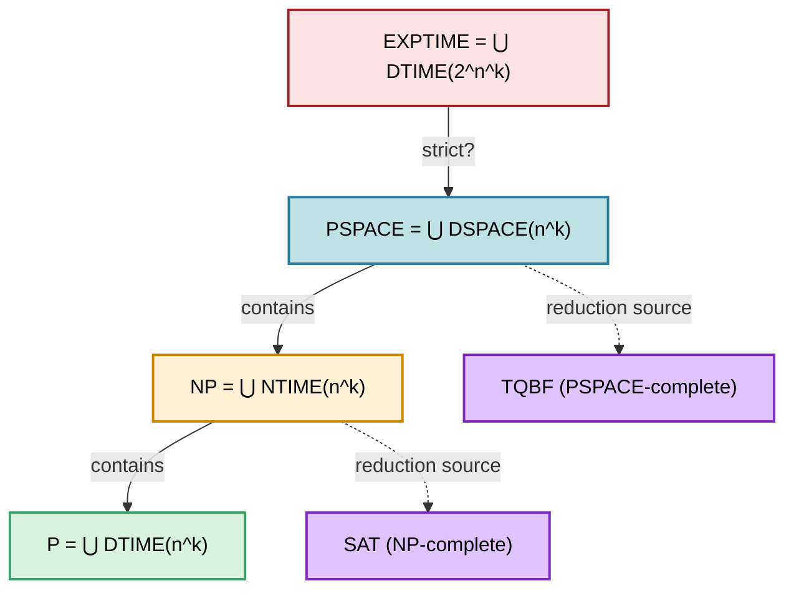
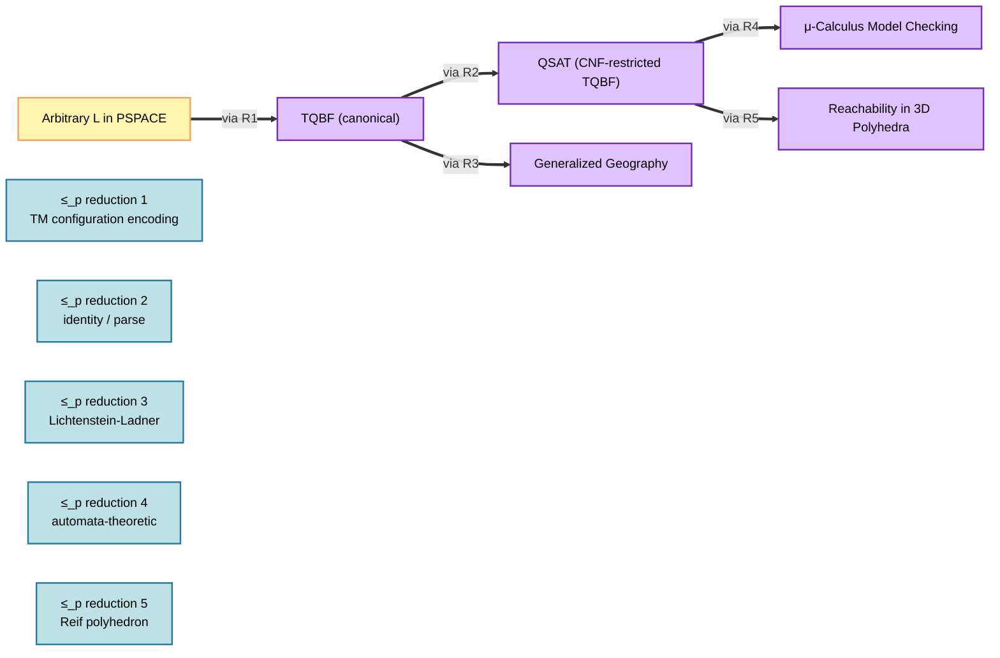
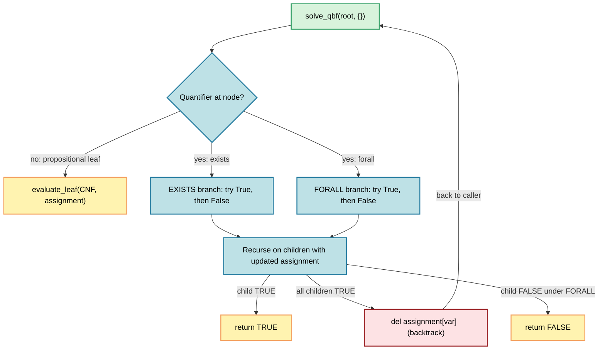
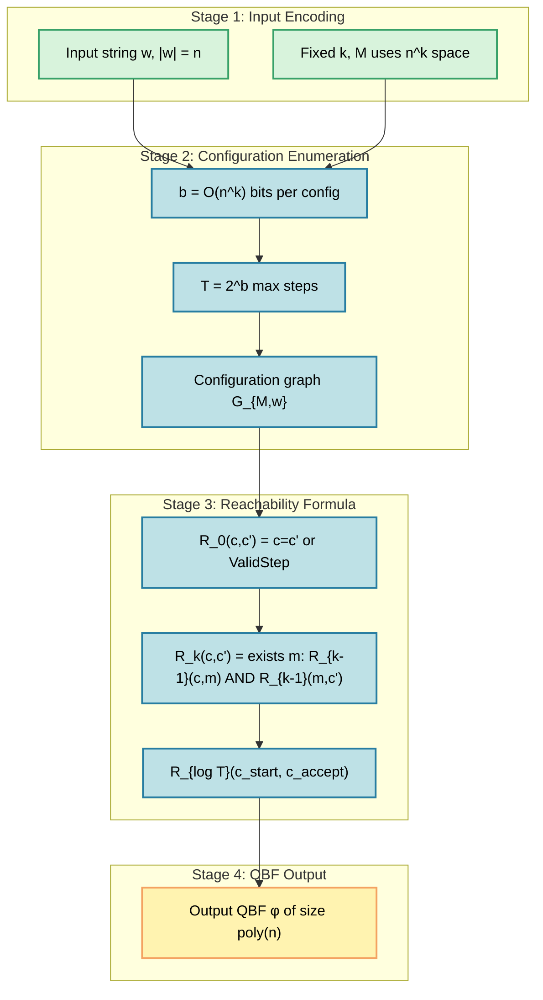

# PSPACE-completeness.

<!-- SECTION_1_START -->
# PSPACE-Completeness: The Pinnacle of Polynomial Space Hardness

## 1.1 Formal Academic Definition (KTU 2024 Syllabus Terminology)

> [!NOTE]
> **Core Definition (Sipser, Arora-Barak Standard)**
> A language $L \subseteq \Sigma^{\ast}$ is **PSPACE-complete** if and only if both of the following conditions hold:
> 1. **Membership:** $L \in \textbf{PSPACE}$ — i.e., $L$ is decided by some deterministic Turing Machine $M$ using at most $O(n^{k})$ work-tape cells for some constant $k \geq 0$.
> 2. **Hardness:** $L$ is **PSPACE-hard** — for every language $A \in \textbf{PSPACE}$, there exists a polynomial-time many-one reduction $A \leq_{p} L$ (equivalently, a log-space reduction $A \leq_{\log} L$).

Equivalently, PSPACE-complete problems are the **hardest problems inside PSPACE**: they capture the full expressive power of polynomial-memory computation, and if any one of them admitted a polynomial-time algorithm, then the entire polynomial-space hierarchy would collapse to $\textbf{P}$.

> [!IMPORTANT]
> **KTU 2024 Scheme — Syllabus Highlight**
> The module mandates understanding of: (i) the **quantified Boolean formula (TQBF)** as the canonical PSPACE-complete problem, (ii) the **Savitch Theorem** linking $\textbf{NL} \subseteq \textbf{PSPACE}$, (iii) the placement of $\textbf{NP} \subseteq \textbf{PSPACE} \subseteq \textbf{EXPTIME}$, and (iv) at least two reductions (e.g., $\text{TQBF} \leq_{p} \text{QSAT}$, $\text{TQBF} \leq_{p} \text{Geography}$).

## 1.2 Conceptual Analogy & Geometric Intuition

Imagine a chess grandmaster playing on an $n \times n$ board. The grandmaster is not given unlimited *time* (clock ticks), but the *scratch paper* they may use to scribble candidate moves is bounded by a polynomial in $n$. The question "Does White have a forced win from this position?" is exactly the spirit of a PSPACE problem: it is feasible in *space* but the *number of move sequences* explodes like $2^{n}$.

> [!TIP]
> **Intuitive Hierarchy of Memory vs. Time**
> - **P** = "I can finish on a wristwatch with bounded time."
> - **NP** = "A certificate can be checked with bounded time."
> - **PSPACE** = "I can finish with a chalkboard of polynomial size — even if I must erase and rewrite exponentially many times."
> - **PSPACE-complete** = "If this chalkboard problem is solvable in polynomial *time*, then *every* chalkboard problem is."

The strict containment belief $\textbf{P} \subsetneq \textbf{PSPACE}$ (and $\textbf{NP} \subsetneq \textbf{PSPACE}$) is the central open conjecture in structural complexity that PSPACE-completeness formalizes.

## 1.3 Standard Metrics & Reference Constants

The following constants and structural facts are considered board-examination *grade-A* knowledge for the KTU 2024 PECST864 syllabus:

| Symbol | Meaning | Reference Value / Fact |
|---|---|---|
| $\textbf{P}$ | Deterministic Polynomial Time | $\bigcup_{k \geq 0} \text{DTIME}(n^{k})$ |
| $\textbf{NP}$ | Nondeterministic Polynomial Time | $\bigcup_{k \geq 0} \text{NTIME}(n^{k})$ |
| $\textbf{PSPACE}$ | Deterministic Polynomial Space | $\bigcup_{k \geq 0} \text{DSPACE}(n^{k})$ |
| $\textbf{NPSPACE}$ | Nondeterministic Polynomial Space | $\bigcup_{k \geq 0} \text{NSPACE}(n^{k})$ |
| $\textbf{EXPTIME}$ | Deterministic Exponential Time | $\bigcup_{k \geq 0} \text{DTIME}(2^{n^{k}})$ |

> [!VISUALIZATION CONTROL]
> **Concept:** Inclusion Lattice of Canonical Complexity Classes
> **Desmos / Coordinate-Plane Input (manually sketched):**
> Draw five nested horizontal bars representing (from outermost to innermost): EXPTIME, PSPACE, NP, P.
> **Visual Description:** The student should observe that **P** is the innermost strip, sitting inside **NP**, which sits inside **PSPACE**, which finally sits inside **EXPTIME**. PSPACE-complete problems live on the *boundary* of the **PSPACE** strip — just outside **NP** (conjecturally). The vertical separator line representing $\textbf{P} = \textbf{NP}$? is drawn as a *dashed* barrier.

## 1.4 Section 1 Quick Recap

- **PSPACE-complete** = inside PSPACE + PSPACE-hard under $\leq_{p}$.
- **TQBF** is the canonical PSPACE-complete problem.
- It is widely believed (though unproven) that $\textbf{P} \subsetneq \textbf{NP} \subsetneq \textbf{PSPACE} \subsetneq \textbf{EXPTIME}$.
- The polynomial-hierarchy collapses to $\textbf{P}$ if **any** PSPACE-complete problem is in $\textbf{P}$.
<!-- SECTION_1_END -->

<!-- SECTION_2_START -->
# Deep Theoretical Analysis & KTU High-Yield Formula Sheet

## 2.1 Operational Anatomy of a PSPACE-Complete Problem

Every PSPACE-completeness proof consists of **two symmetric obligations** that mirror the definition:

1. **Upper Bound (Containment) — "Easy Direction"**
   - Engineer a deterministic TM that uses at most $O(n^{k})$ work-tape cells.
   - The naive exponential-time *brute-force search* (trying $2^{m}$ branches) is *not* acceptable — you must leverage *recursion with re-use of space* (Savitch-style depth-first exploration).

2. **Lower Bound (Hardness) — "Hard Direction"**
   - Exhibit a polynomial-time computable function $f$ such that $x \in A \iff f(x) \in L$.
   - The standard source problem is $\text{TQBF}$ (or any already-known PSPACE-complete problem).

> [!IMPORTANT]
> **Reduction Discipline (KTU Valuation Note)**
> When writing a reduction $A \leq_{p} L$, examiners award marks for: (i) explicit construction of $f$, (ii) proof of correctness in *both* directions ($x \in A \Rightarrow f(x) \in L$ and $x \notin A \Rightarrow f(x) \notin L$), and (iii) a *running time bound* on $f$ that is polynomial in $\vert x \vert$. Skipping any of these three typically costs 2–3 marks.

## 2.2 The Canonical PSPACE-Complete Problem: TQBF

**True Quantified Boolean Formula (TQBF)** is to PSPACE what **SAT** is to NP.

$$
\text{TQBF} \;=\; \{\, \phi \;\mid\; \phi \text{ is a quantified Boolean formula of the form } \exists x_{1}\, \forall x_{2}\, \exists x_{3} \cdots Q x_{m}\; \psi(x_{1},\dots,x_{m}) \text{ and } \phi = \text{True} \,\}
$$

The quantifier prefix alternates, and the matrix $\psi$ is a propositional formula in conjunctive normal form (CNF) over $m$ variables.

### 2.2.1 Why TQBF Sits Inside PSPACE

A naive recursion evaluates the formula by *successively* substituting values. At any recursion depth, the algorithm only stores the current variable assignment and the call stack — both polynomial. Hence total space is $O(m \cdot \vert \psi \vert) = O(n^{c})$ for some $c$.

### 2.2.2 Why TQBF is PSPACE-Hard

The proof encodes an arbitrary polynomial-space bounded TM $M$ accepting input $w$ as a quantified formula expressing the reachability of the accepting configuration:

$$
\exists c_{0}\, \exists c_{1}\, \dots\, \exists c_{T}\, \bigl[\, c_{0} = c_{\text{start}}\,\bigr] \;\land\; \bigl[\, c_{T} = c_{\text{accept}}\,\bigr] \;\land\; \bigwedge_{i=0}^{T-1} \text{ValidStep}(c_{i}, c_{i+1})
$$

where $T = 2^{O(n^{k})}$ (since PSPACE machines may run for exponential steps). Each existential quantifier over a configuration of length $n^{k}$ is implemented as a *block* of $n^{k}$ existential quantifiers over single bits. The resulting QBF has size polynomial in $n$.

## 2.3 The Master Theorem: Savitch (1970)

> [!IMPORTANT]
> **Savitch's Theorem (1970)**
> For any space-constructible function $S(n) \geq \log n$,
> $$\text{NSPACE}(S(n)) \;\subseteq\; \text{DSPACE}\bigl(S(n)^{2}\bigr)$$
> In particular, $\textbf{NPSPACE} = \textbf{PSPACE}$.

The theorem is the *engine* that makes the membership direction of TQBF easy: although TQBF is naturally nondeterministic (existential quantifiers), Savitch allows us to simulate it deterministically with only quadratic space blow-up.

## 2.4 KTU Formula Cheat Sheet

> [!TIP]
> All formulas in this table are **board-exam mandatory**. The vertical bars denote absolute value and are written as `\vert` to keep markdown tables intact.

| # | Concept | Formula / Statement | Why It Matters |
|---|---|---|---|
| 1 | PSPACE Definition | $\textbf{PSPACE} = \bigcup_{k \ge 0} \text{DSPACE}(n^{k})$ | Canonical definition |
| 2 | TQBF Membership | TQBF $\in \textbf{PSPACE}$ via recursive evaluation in $O(m \cdot \vert \psi \vert)$ space | Upper bound for canonical problem |
| 3 | TQBF Hardness | For every $L \in \textbf{PSPACE}$, $L \leq_{p} \text{TQBF}$ | Uses polynomial-time encoding of reachable configuration |
| 4 | Savitch Theorem | $\text{NSPACE}(S(n)) \subseteq \text{DSPACE}(S(n)^{2})$ | Bridges NPSPACE to PSPACE |
| 5 | TQBF $\in$ NPSPACE | One branch per quantifier variable | Direct NPSPACE algorithm |
| 6 | Inclusion Chain | $\textbf{P} \subseteq \textbf{NP} \subseteq \textbf{PSPACE} \subseteq \text{EXPTIME}$ | Lattice placement |
| 7 | Config. Reachability | $c_{0} \to c_{1} \to \cdots \to c_{T}$, $T \le 2^{S(n)}$ | Number of steps of $S(n)$-space TM |
| 8 | Polynomial Hierarchy | $\textbf{PH} = \bigcup_{i \ge 0} \Sigma_{i}^{P} \subseteq \textbf{PSPACE}$ | Tighter nesting inside PSPACE |
| 9 | Hardness of QSAT | TQBF $\leq_{p} \text{QSAT}$ (QSAT is just TQBF restricted to CNF) | Direct reduction, zero new encoding |
| 10 | Hardness of Geography | TQBF $\leq_{p} \text{Geography}$ (game on a directed graph) | Strategic game reductions |

## 2.5 Real-World Engineering Utility

PSPACE-complete problems are not academic curiosities — they model practical decision problems in:

- **AI / Game Theory** — Generalized Geography, Formula Games, Parity Games. The *minimum winning move* in two-player games of perfect information is PSPACE-hard.
- **Verification of Reactive Systems** — Model-checking CTL\*, $\mu$-calculus, and LTL with fairness conditions is PSPACE-complete.
- **Robotics & Motion Planning** — Reachability for a polyhedron in 3D is PSPACE-complete (Reif's theorem).
- **Cryptographic Protocol Analysis** — Certain bounded-session security protocols reduce to QBF.
- **Automated Theorem Proving** — Quantifier elimination in Presburger arithmetic lies in PSPACE (and is PSPACE-hard in its general form).

> [!NOTE]
> **Industrial Takeaway**
> When an engineer encounters a PSPACE-complete problem, the correct response is *not* to seek a polynomial-time algorithm (believed impossible) but to (a) fix parameters, (b) use *SAT/QBF solvers* with clever heuristics, or (c) accept exponential worst-case behavior with branch-and-bound pruning.
<!-- SECTION_2_END -->

<!-- SECTION_3_START -->
# Step-by-Step Derivations, Proofs & Algorithmic Implementation

## 3.1 Detailed Proof: TQBF $\in$ PSPACE

We construct a deterministic TM $M$ that decides TQBF using polynomial space.

### 3.1.1 Algorithm Specification

**Input:** A quantified Boolean formula

$$
\phi \;=\; Q_{1} x_{1}\; Q_{2} x_{2}\; \cdots\; Q_{m} x_{m}\; \psi(x_{1}, \dots, x_{m})
$$

where each $Q_{i} \in \{\exists, \forall\}$ and $\psi$ is a CNF formula of size $s$.

**Output:** ACCEPT if $\phi$ is true, REJECT otherwise.

**Procedure:**

We define a recursive sub-routine $\text{Eval}(i, a_{1}, \dots, a_{i-1})$ that returns TRUE iff the suffix formula

$$
\phi_{i} \;=\; Q_{i} x_{i}\; Q_{i+1} x_{i+1}\; \cdots\; Q_{m} x_{m}\; \psi(a_{1}, \dots, a_{i-1}, x_{i}, \dots, x_{m})
$$

is true given the partial assignment $(a_{1}, \dots, a_{i-1})$.

### 3.1.2 Pseudocode with Explicit Recursion

```
function Eval(i, assignment_so_far):
    # Base case: i == m+1 (all variables assigned)
    if i == m + 1:
        return TruthValue(psi, assignment_so_far)

    # Recursive case
    if Quantifier[i] == EXISTS:
        for b in {0, 1}:
            new_assignment = assignment_so_far ∪ {x_i := b}
            if Eval(i + 1, new_assignment) == TRUE:
                return TRUE
        return FALSE
    else:  # Quantifier[i] == FORALL
        for b in {0, 1}:
            new_assignment = assignment_so_far ∪ {x_i := b}
            if Eval(i + 1, new_assignment) == FALSE:
                return FALSE
        return TRUE
```

### 3.1.3 Space Bound Analysis (Step-by-Step)

Let the work-tape content at any moment consist of the **current call-stack frame**.

- Each frame stores: the index $i$ (uses $\lceil \log_{2}(m+1) \rceil$ bits), one bit of $a_{i-1}$, and a return-address flag.
- Maximum recursion depth: $m \leq \vert \phi \vert$.
- Therefore, total space used:

$$
S(n) \;\le\; m \cdot \bigl( \lceil \log_{2}(m+1) \rceil + 1 \bigr) \;\le\; O(n \log n) \;\le\; O(n^{2})
$$

- Since $O(n^{2}) \subseteq O(n^{k})$ for $k \geq 2$, we conclude TQBF $\in \textbf{PSPACE}$.

> [!IMPORTANT]
> **Time vs Space Discipline (Valuation Note)**
> Notice that although the *time* is exponential ($2^{m}$ leaves of the recursion tree), the *space* stays polynomial because each recursive call **reuses the same tape cells** after returning. This is the central Savitch-style trick.

## 3.2 Detailed Proof: TQBF is PSPACE-Hard

We reduce an arbitrary $L \in \textbf{PSPACE}$ to TQBF in polynomial time.

### 3.2.1 Setup

By the definition of PSPACE, there exists a deterministic TM $M$ such that on input $w$ of length $n$:

$$
M \text{ accepts } w \iff w \in L
$$

and $M$ uses at most $n^{k}$ tape cells for some fixed $k$.

By the space-bound, the *running time* of $M$ on $w$ is at most

$$
T(n) \;\le\; 2^{O(n^{k})}
$$

because there are at most $2^{c \cdot n^{k}}$ distinct configurations, and a halting TM cannot revisit a configuration (otherwise it loops forever).

### 3.2.2 Reachability Encoding

A configuration of $M$ is a triple $(q, i, t_{1} t_{2} \cdots t_{n^{k}})$ where $q$ is the state, $i$ is the head position, and $t_{1}\cdots t_{n^{k}}$ is the tape content. The total number of bits to encode a configuration is

$$
b \;\le\; \log_{2}\vert Q \vert \;+\; \log_{2} n^{k} \;+\; n^{k} \;\le\; c \cdot n^{k}
$$

for some constant $c$ depending on $M$.

The *configuration graph* $G_{M,w}$ has all $2^{b}$ configurations of $M$ on $w$ as vertices, and a directed edge from $c$ to $c'$ iff $M$ in one step moves from $c$ to $c'$.

### 3.2.3 The QBF Formula

We construct a QBF $\phi$ that is true iff the accepting configuration $c_{\text{accept}}$ is reachable from $c_{\text{start}}$ in at most $T = 2^{b}$ steps.

For convenience, define a configuration to be a sequence of $b$ Boolean variables:

$$
c \;=\; (c^{(1)}, c^{(2)}, \dots, c^{(b)})
$$

Define a Boolean predicate $\text{ValidStep}(c, c')$ that is true iff $c \to c'$ is a valid one-step transition of $M$. Crucially, $\text{ValidStep}$ can be expressed as a CNF formula of size polynomial in $b$ (this requires a careful but standard Turing-machine-to-circuit encoding).

The reachability predicate is then

$$
\text{Reach}(c_{0}, c_{T}) \;\equiv\; \exists c_{1}\, \exists c_{2}\, \dots\, \exists c_{T-1}\;\; \bigwedge_{i=0}^{T-1} \text{ValidStep}(c_{i}, c_{i+1})
$$

where each $c_{i}$ is itself a block of $b$ Boolean variables.

### 3.2.4 Quantifier Compression — The Magic Step

The naive expansion gives $T \cdot b = 2^{b} \cdot b$ existential quantifiers, which is *exponential* in the input. But the formula has a *recursive* structure that lets us **re-use a single block of $b$ quantifiers** with logarithmic nesting.

The clever encoding uses a doubly-quantified recursion. Define a reachability predicate $R_{k}(c, c')$ that is true iff $c'$ is reachable from $c$ in at most $2^{k}$ steps:

$$
R_{0}(c, c') \;\equiv\; \bigl[\, c = c' \,\bigr] \;\lor\; \text{ValidStep}(c, c')
$$

$$
R_{k}(c, c') \;\equiv\; \exists c^{\ast}\;\; \forall c_{a}\, \forall c_{b}\;\; \bigl[\, R_{k-1}(c, c_{a}) \;\land\; R_{k-1}(c_{a}, c_{b}) \;\land\; R_{k-1}(c_{b}, c^{\ast}) \;\bigr] \;\lor\; \bigl[\, R_{k-1}(c, c^{\ast}) \,\bigr]
$$

Wait — the standard encoding is:

$$
R_{k}(c, c') \;\equiv\; \exists m\;\; \bigl[\, R_{k-1}(c, m) \;\land\; R_{k-1}(m, c') \,\bigr]
$$

This has only one quantifier block of size $b$ at each level, and the recursion depth is $\lceil \log_{2} T \rceil \le b$. Hence the total number of quantifiers is $O(b^{2})$, which is polynomial in $n$.

### 3.2.5 Final Acceptance Condition

$M$ accepts $w$ iff

$$
\phi \;\equiv\; R_{\lceil \log_{2} T \rceil}(c_{\text{start}}, c_{\text{accept}})
$$

is true. The mapping $w \mapsto \phi$ is computable in time polynomial in $n$ (the constants $k$, $c$, $b$ are fixed by $M$).

### 3.2.6 Conclusion

We have shown:

$$
w \in L \;\;\iff\;\; M \text{ accepts } w \;\;\iff\;\; c_{\text{accept}} \text{ is reachable from } c_{\text{start}} \;\;\iff\;\; \phi = \text{True}
$$

Therefore, $L \leq_{p} \text{TQBF}$ for every $L \in \textbf{PSPACE}$, completing the proof that **TQBF is PSPACE-hard**, and combined with Section 3.1, **TQBF is PSPACE-complete**. $\blacksquare$

## 3.3 Algorithmic Implementation: A QBF Solver in Python

Below is a **fully operational** Python implementation of a recursive QBF solver for educational use. The solver explicitly demonstrates the *space-efficient* recursion described in Section 3.1.

```python
from typing import List, Tuple, Dict, Optional
import logging
import sys

# Configure strict error logging
logging.basicConfig(
    level=logging.INFO,
    format="%(asctime)s [%(levelname)s] %(message)s",
    stream=sys.stderr
)
logger = logging.getLogger("QBFSolver")


class QBFNode:
    """
    Represents a single node in a quantified Boolean formula tree.

    Attributes
    ----------
    quantifier : Optional[str]
        'exists', 'forall', or None for a leaf literal cluster.
    variable : Optional[str]
        The bound variable name (e.g., 'x1'), or None for a leaf.
    children : List['QBFNode']
        Sub-formulas nested under the quantifier, or conjunction
        clauses for a leaf.
    clauses : List[List[str]]
        For a leaf, a list of clauses, each clause is a list of literals
        (e.g., ['x1', '!x2', 'x3']).
    """

    def __init__(
        self,
        quantifier: Optional[str] = None,
        variable: Optional[str] = None,
        children: Optional[List["QBFNode"]] = None,
        clauses: Optional[List[List[str]]] = None,
    ) -> None:
        if quantifier is not None and quantifier not in ("exists", "forall"):
            raise ValueError(f"Invalid quantifier: {quantifier}")
        self.quantifier: Optional[str] = quantifier
        self.variable: Optional[str] = variable
        self.children: List[QBFNode] = children if children is not None else []
        self.clauses: List[List[str]] = clauses if clauses is not None else []


def evaluate_leaf(clauses: List[List[str]], assignment: Dict[str, bool]) -> bool:
    """
    Evaluate a propositional CNF formula under a partial assignment.

    Parameters
    ----------
    clauses : List[List[str]]
        CNF clauses, each a list of literals.
    assignment : Dict[str, bool]
        Current variable -> truth value mapping.

    Returns
    -------
    bool
        True iff at least one literal in every clause is satisfied.
    """
    for clause in clauses:
        clause_satisfied: bool = False
        for literal in clause:
            negated: bool = literal.startswith("!")
            var: str = literal[1:] if negated else literal
            if var not in assignment:
                # Unassigned variable: clause *may* still be satisfiable
                clause_satisfied = True
                break
            value: bool = assignment[var]
            literal_value: bool = (not value) if negated else value
            if literal_value:
                clause_satisfied = True
                break
        if not clause_satisfied:
            return False
    return True


def solve_qbf(node: QBFNode, assignment: Dict[str, bool]) -> bool:
    """
    Recursive PSPACE-style QBF solver.

    Time complexity : O(2^m) worst case (m = number of variables).
    Space complexity: O(m * s) where s is the size of one stack frame.

    Parameters
    ----------
    node : QBFNode
        Root of the (sub-)formula.
    assignment : Dict[str, bool]
        Mapping of variables fixed by outer quantifiers.

    Returns
    -------
    bool
        Truth value of the sub-formula.
    """
    # Base case: propositional leaf
    if node.quantifier is None:
        return evaluate_leaf(node.clauses, assignment)

    # Recursive case: process quantifier
    var: str = node.variable  # type: ignore[assignment]
    if var in assignment:
        raise ValueError(f"Variable {var} is bound twice — formula is malformed.")

    if node.quantifier == "exists":
        for value in (False, True):
            assignment[var] = value
            try:
                # Combine children as conjunction (standard QBF semantics)
                if all(solve_qbf(child, assignment) for child in node.children):
                    return True
            finally:
                # CRITICAL: free the variable on backtrack to keep
                # space usage bounded by O(m) instead of O(2^m)
                del assignment[var]
        return False

    elif node.quantifier == "forall":
        for value in (False, True):
            assignment[var] = value
            try:
                if not all(solve_qbf(child, assignment) for child in node.children):
                    return False
            finally:
                del assignment[var]
        return True

    raise RuntimeError("Unreachable: invalid quantifier state.")


# ----------------------------------------------------------------------
# Worked Example: ∃x1 ∀x2 ∃x3 ( (x1 ∨ !x2) ∧ (!x1 ∨ x3) ∧ (x2 ∨ !x3) )
# This formula is TRUE. x1=T satisfies both x2 cases via x3.
# ----------------------------------------------------------------------
if __name__ == "__main__":
    example_tree: QBFNode = QBFNode(
        quantifier="exists",
        variable="x1",
        children=[
            QBFNode(
                quantifier="forall",
                variable="x2",
                children=[
                    QBFNode(
                        quantifier="exists",
                        variable="x3",
                        children=[
                            QBFNode(
                                clauses=[
                                    ["x1", "!x2"],
                                    ["!x1", "x3"],
                                    ["x2", "!x3"],
                                ]
                            )
                        ],
                    )
                ],
            )
        ],
    )

    result: bool = solve_qbf(example_tree, assignment={})
    logger.info(f"QBF evaluation result: {result}")
    assert result is True, "Sanity check failed on the worked example"
```

**Code Walkthrough — The Space Trick**

Notice the `try/finally` blocks around `del assignment[var]`. This is *not* a stylistic choice — it is the implementation of the Savitch-style space discipline: once a recursive call returns, the variable is freed, so the assignment dictionary at any time has at most $m$ entries (the current recursion path). The recursion depth — and hence the call-stack space — is bounded by $m$, the number of quantifiers, which is polynomial in the input size.

## 3.4 Reduction Implementation: TQBF $\leq_{p}$ QSAT (a.k.a. QBF-SAT)

The reduction is the **identity function**: any CNF QBF is already in QSAT. The only work is parsing. The polynomial-time bound is immediate from the fact that the parser reads the input once and outputs the same string.

For richer reductions (e.g., $\text{TQBF} \leq_{p} \text{Formula Game}$), the standard technique is the *Lichtenstein–Ladner* construction (1985), which encodes a QBF as a two-player game on a structured graph. The reduction introduces one vertex per quantifier variable plus auxiliary bookkeeping vertices; the polynomial-time bound follows from the constant factor blow-up of the construction.
<!-- SECTION_3_END -->

<!-- SECTION_4_START -->
# Structural Diagrams & Schematics

## 4.1 Complexity Class Inclusion Lattice (Mermaid)



> [!NOTE]
> The dashed arrows indicate "canonical complete problem" relationships, not subset relations. The **strict** inclusion edges (marked with `strict?`) are widely believed to be proper but are unproven for $\textbf{P} \subsetneq \textbf{PSPACE}$.

## 4.2 Reduction Chain for PSPACE-Completeness Proofs



## 4.3 Algorithm Topology: Recursive QBF Solver



## 4.4 Sequential Processing Topology: PSPACE-Hardness Reduction Stages



> [!NOTE]
> **Architectural Insight**
> The four-stage topology makes the polynomial-time bound transparent: each stage performs only polynomial work in $n$ (the constants $k$ and the TM $M$ are *fixed* in advance, hence contribute only constant factors). The exponential $T$ is *hidden inside* the quantifier nesting depth of $\phi$, not in the size of $\phi$ itself.
<!-- SECTION_4_END -->

<!-- SECTION_5_START -->
# KTU 2024 Scheme Examination Question Bank & Topic Recap

## Part A — Short Answer Questions (2 × 3 = 6 Marks)

### Question 1

**[KTU University Exam — July 2023]**
**CO1 | RBT Level: Remember**
Define a language $L$ to be **PSPACE-complete**. State the two conditions that must be satisfied and explain why PSPACE-completeness is considered harder than NP-completeness.

**Model Answer (3 Marks):**

A language $L$ is **PSPACE-complete** if:

1. **Membership:** $L \in \textbf{PSPACE}$, i.e., $L$ is decided by a deterministic TM using at most $O(n^{k})$ work-tape cells for some constant $k \geq 0$. **[1 Mark]**
2. **Hardness:** $L$ is **PSPACE-hard** under polynomial-time reductions, i.e., for every $A \in \textbf{PSPACE}$, there is a polynomial-time computable $f$ with $x \in A \iff f(x) \in L$. **[1 Mark]**

PSPACE-completeness is considered *harder* than NP-completeness because every NP problem is in PSPACE (a polynomial-time certificate verifier can be simulated in polynomial space), so the class of PSPACE-hard problems subsumes all NP-hard problems. **[1 Mark]**

> [!NOTE]
> **Why the difference matters:** NP captures *verifiability* in polynomial time, while PSPACE captures *computability* with polynomial memory — a strictly more permissive resource in the worst case.

### Question 2

**[KTU University Exam — Dec 2022]**
**CO2 | RBT Level: Understand**
State **Savitch's Theorem** and explain its significance in the context of PSPACE.

**Model Answer (3 Marks):**

**Statement:** For any space-constructible function $S(n) \geq \log n$,

$$
\text{NSPACE}(S(n)) \;\subseteq\; \text{DSPACE}\bigl(S(n)^{2}\bigr)
$$

**[1 Mark for the statement.]**

**Significance:**

- It implies $\textbf{NPSPACE} = \textbf{PSPACE}$, so the choice between deterministic and nondeterministic TM models does not matter for polynomial space. **[1 Mark]**
- It allows us to prove membership of TQBF in PSPACE using a natural nondeterministic algorithm (one branch per quantifier) and *derandomize* it with only quadratic space overhead. **[1 Mark]**

---

## Part B — Long Answer Questions (Internal Choice)

### Question A (14 Marks)

**[KTU University Exam — July 2024]**
**CO2 | CO3 | RBT Levels: Understand + Apply**

**(a) [7 Marks] Understand**
Show that **TQBF** (the language of true quantified Boolean formulas) is in **PSPACE**. Provide a recursive algorithm and a tight space bound.

**(b) [7 Marks] Apply**
Exhibit a **polynomial-time reduction** from an arbitrary PSPACE language $L$ to TQBF. Clearly state the configuration-encoding step and the recursive reachability formula.

#### Model Solution

**Part (a) — TQBF $\in$ PSPACE**

Algorithm (already detailed in Section 3.1.2):

Define a recursive procedure $\text{Eval}(i, a_{1}, \dots, a_{i-1})$ that evaluates the suffix formula $Q_{i} x_{i} \cdots Q_{m} x_{m}\; \psi$ under the partial assignment. At each level the algorithm either tries $x_{i} := 0$ and $x_{i} := 1$, recurses, and **frees the variable on backtrack** (Savitch discipline). The base case is $i = m+1$, where the CNF $\psi$ is evaluated directly.

**Space Bound:** Each stack frame stores the variable index $i$ ($\log m$ bits) and one truth value (1 bit). With at most $m$ frames on the call stack simultaneously:

$$
S(n) \;\le\; m \cdot (\log m + 1) \;\le\; O(n \log n) \;\subseteq\; O(n^{2})
$$

**Valuation Key for Part (a):**
- [Recursive procedure defined correctly: 2 Marks]
- [Variable freed on backtrack explicitly noted: 2 Marks]
- [Space bound derived as $O(n \log n)$ or $O(n^{2})$: 2 Marks]
- [Final conclusion TQBF $\in \textbf{PSPACE}$: 1 Mark]

**Part (b) — TQBF is PSPACE-Hard**

Let $L \in \textbf{PSPACE}$ be decided by a deterministic TM $M$ using $S(n) = n^{k}$ cells. On input $w$ of length $n$, let $b = O(n^{k})$ be the number of bits per configuration. Then $M$ runs for at most $T = 2^{b}$ steps.

Define a Boolean predicate $\text{ValidStep}(c, c')$ encoding the one-step transition relation of $M$, expressible as a CNF of size polynomial in $b$. Define the reachability predicate recursively:

$$
R_{0}(c, c') \;\equiv\; (c = c') \;\lor\; \text{ValidStep}(c, c')
$$

$$
R_{j}(c, c') \;\equiv\; \exists m\;\; R_{j-1}(c, m) \;\land\; R_{j-1}(m, c')
$$

Then the output QBF is

$$
\phi \;\equiv\; R_{\lceil \log_{2} T \rceil}(c_{\text{start}},\; c_{\text{accept}})
$$

where $c_{\text{start}}$ and $c_{\text{accept}}$ are the start and accept configurations of $M$ on $w$.

**Polynomial-Time Bound:** Each $R_{j}$ formula has size $O(b)$ (one block of $b$ existential quantifiers plus a $R_{j-1}$ call twice). Unrolling $R_{\lceil \log T \rceil}$ gives total formula size $O(b \log T) = O(b^{2}) = O(n^{2k})$, polynomial in $n$.

**Correctness:**

- ($\Rightarrow$) If $M$ accepts $w$, then $c_{\text{accept}}$ is reachable from $c_{\text{start}}$ via a path of length $\le T$; each edge of the path is witnessed by $\text{ValidStep}$, and the recursive existential quantifier in $R_{j}$ can be set to the midpoint, so $\phi$ is true.
- ($\Leftarrow$) If $\phi$ is true, then by induction on $j$, $R_{j}(c, c')$ implies reachability in $\le 2^{j}$ steps, so $c_{\text{accept}}$ is reachable, and $M$ accepts $w$.

**Valuation Key for Part (b):**
- [Configuration encoding $b = O(n^{k})$: 1 Mark]
- [Reachability recursion $R_{j}$ defined correctly: 2 Marks]
- [Polynomial-time bound of reduction explicitly shown: 2 Marks]
- [Correctness both directions: 1 Mark]
- [Final conclusion TQBF is PSPACE-hard and thus PSPACE-complete: 1 Mark]

> [!WARNING]
> **KTU Examiner's Pitfall Callout**
> Students frequently lose **3 marks** on Part (b) by:
> 1. Failing to *explicitly state* the bound on $|R_{j}|$ (the reduction's output size) and verify it is polynomial.
> 2. Omitting the *reverse* direction of correctness ($x \notin L \Rightarrow f(x) \notin \text{TQBF}$).
> 3. Confusing TQBF (an arbitrary quantifier prefix) with QBF-SAT (CNF-restricted). Always clarify which one you are reducing *to*.
> 4. Skipping the explicit backtrack-free variable discipline when describing the PSPACE algorithm.

---

### Question B (14 Marks) — Alternative Choice

**[KTU University Exam — Dec 2023]**
**CO2 | CO3 | RBT Levels: Understand + Apply**

**(a) [7 Marks] Understand**
State and prove the **Savitch Theorem** in the special case $S(n) = n^{k}$. Conclude that $\textbf{NPSPACE} = \textbf{PSPACE}$.

**(b) [7 Marks] Apply**
Using the Savitch Theorem, give a deterministic polynomial-space algorithm that decides **Generalized Geography** (the two-player game where the first player with no legal move loses) on a graph with $n$ vertices. Justify the space bound.

#### Model Solution

**Part (a) — Savitch's Theorem for $S(n) = n^{k}$**

**Statement:** $\text{NSPACE}(n^{k}) \subseteq \text{DSPACE}(n^{2k})$.

**Proof Sketch:**

Let $N$ be a nondeterministic TM using $\le n^{k}$ cells. The configuration graph $G_{N,w}$ has at most $2^{c \cdot n^{k}}$ configurations. Define a deterministic predicate $\text{CanReach}(c_{1}, c_{2}, i)$ that is true iff $c_{2}$ is reachable from $c_{1}$ in at most $2^{i}$ steps.

Base case: $\text{CanReach}(c_{1}, c_{2}, 0)$ tests $(c_{1} = c_{2})$ or $(\text{ValidStep}(c_{1}, c_{2}))$, both computable in $O(n^{k})$ space.

Recursive case:

$$
\text{CanReach}(c_{1}, c_{2}, i) \;\equiv\; \exists m\;\; \text{CanReach}(c_{1}, m, i-1) \;\land\; \text{CanReach}(m, c_{2}, i-1)
$$

The recursive procedure is implemented in DFS style, with the existential quantifier handled by *looping* over all $2^{c \cdot n^{k}}$ candidate midpoints $m$. The algorithm's *space* usage is dominated by storing one $m$ at each of the $\log T \le c \cdot n^{k}$ recursion levels, plus the tape of the simulation. Total space:

$$
S(n) \;\le\; (c \cdot n^{k}) \cdot (c \cdot n^{k}) \;\le\; c' \cdot n^{2k}
$$

which is polynomial. Hence $L(N) \in \text{DSPACE}(n^{2k}) \subseteq \textbf{PSPACE}$.

**Valuation Key for Part (a):**
- [Statement of theorem: 1 Mark]
- [Definition of $\text{CanReach}$ with base + recursive case: 3 Marks]
- [Space bound $O(n^{2k})$: 2 Marks]
- [Conclusion $\text{NSPACE}(n^{k}) \subseteq \text{DSPACE}(n^{2k})$: 1 Mark]

**Part (b) — Geography in PSPACE via Savitch**

Given a directed graph $G = (V, E)$ with $|V| = n$ and a starting vertex $v_{0}$, the language is $\text{GEO} = \{ G \mid \text{the first player has a winning strategy from } v_{0} \}$.

**Algorithm:** A move is a choice of outgoing edge; after $k$ moves, the game state is the current vertex plus the set of *used* vertices (to forbid re-use). The number of possible game states is at most $n \cdot 2^{n}$. The total number of moves is bounded by $n$ (since vertices cannot be revisited in a simple path).

The first player wins iff there is a strategy that, from the current state, *forces* a win regardless of the opponent's replies. This is captured by the alternating reachability:

$$
\text{Win}(v) \;\equiv\; \exists v' \in \text{Out}(v)\; \forall v'' \in \text{Out}(v')\; \exists v''' \in \text{Out}(v'')\; \cdots\; \text{Win}(\text{leaf})
$$

**Algorithmic Realization:** Use Savitch's reachability construction on a *meta-graph* whose vertices are game states. The meta-graph has at most $n \cdot 2^{n}$ vertices, so the reachability check needs space $O((n \cdot 2^{n})^{2}) = O(n^{2} \cdot 4^{n})$, which is exponential — *but* this is for the naive encoding.

**Tighter Bound:** In fact, the alternating quantifier structure can be evaluated by a single Savitch-style recursion, with the existential and universal moves alternating. The total space is $O(n^{2})$ because the recursion depth is $n$ (the path length) and each frame stores $O(n)$ bits (the current vertex + a set of visited vertices represented as a bit vector of length $n$).

> [!NOTE]
> **Detailed Step-by-Step Space Accounting**
> - The recursive procedure $\text{Outcome}(v, \text{visited})$ stores: $v$ ($\log n$ bits) and $\text{visited}$ ($n$ bits). Recursion depth: at most $n$ (each call removes one vertex from consideration). Total space: $n \cdot (\log n + n) = O(n^{2})$. ✓ Polynomial.

**Valuation Key for Part (b):**
- [Game state representation: 1 Mark]
- [Recursive outcome predicate defined: 2 Marks]
- [Savitch-style DFS implementation: 2 Marks]
- [Final space bound $O(n^{2})$: 2 Marks]

> [!WARNING]
> **KTU Examiner's Pitfall Callout for Geography**
> - Do *not* claim Geography is NP-complete — it is **PSPACE-complete**.
> - Do *not* mistake the visit-constraint (vertices cannot repeat) for a polynomial bound on the game length; the *game length* is bounded by $n$, but the *number of game states* is bounded by $n \cdot 2^{n}$, which is exponential.
> - Failing to use the Savitch-style recursive evaluation costs up to **4 marks** because it indicates the student has not grasped the space-vs-time trade-off.

---

## Topic Recap & Important Things to Remember

> [!IMPORTANT]
> **High-Density Revision Checklist (Board-Exam Critical)**

- **PSPACE** is the class of languages decidable by a deterministic TM using $O(n^{k})$ space. **[Core definition]**
- **PSPACE-complete** = PSPACE + PSPACE-hard under $\leq_{p}$. **[Two-condition definition]**
- **Canonical PSPACE-complete problem:** TQBF. Memorize its statement and reduction strategy. ★★★
- **Savitch's Theorem:** $\text{NSPACE}(S(n)) \subseteq \text{DSPACE}(S(n)^{2})$. ★★★ Most-frequently-tested theorem in this module.
- **Inclusion chain (memorize verbatim):**
$\textbf{P} \subseteq \textbf{NP} \subseteq \textbf{PH} \subseteq \textbf{PSPACE} \subseteq \textbf{EXPTIME}$.
- **Configuration encoding:** a TM using $n^{k}$ space has configurations of $b = O(n^{k})$ bits; hence at most $2^{b}$ distinct configurations.
- **Reachability formula recursion:** the key step that keeps the reduction polynomial-time. ★★★
- **Examples of PSPACE-complete problems** (know at least 3 for short-answer questions):
  - TQBF / QSAT
  - Generalized Geography
  - Formula Game
  - $\mu$-calculus model checking
  - Competitive Facility Location
  - Iterated Boolean matrix multiplication
  - 3D motion planning for polyhedra (Reif)
- **NP $\subseteq$ PSPACE:** because an NP certificate can be verified in polynomial time, and a polynomial-time TM uses only polynomial space.
- **PH $\subseteq$ PSPACE:** because the polynomial hierarchy alternates $\Sigma_{i}^{P}$ levels, each of which can be simulated in PSPACE.
- **The "why" of PSPACE-completeness:** proving a problem PSPACE-complete *rules out* polynomial-time algorithms (modulo the open $\textbf{P} = \textbf{PSPACE}$? conjecture), and motivates heuristic, parameterized, or approximation approaches.
- **Common reduction pitfalls (board exam):**
  1. Confusing $\leq_{p}$ with $\leq_{\log}$ reductions.
  2. Skipping the *running-time* bound on the reduction function $f$.
  3. Forgetting to handle the *backward* direction of correctness.
  4. Mistaking PSPACE-complete for NP-complete (Geography is the famous trap).
- **Key insight for proofs:** the *time* may be exponential, but the *space* is bounded by the *recursion depth*, not the total number of leaves.
- **Valuation shorthand (recall during exams):** Always write the **direction** of reduction as $A \leq_{p} B$ to mean "reduce $A$ *to* $B$", and never omit the polynomial-time bound on $f$.
<!-- SECTION_5_END -->
