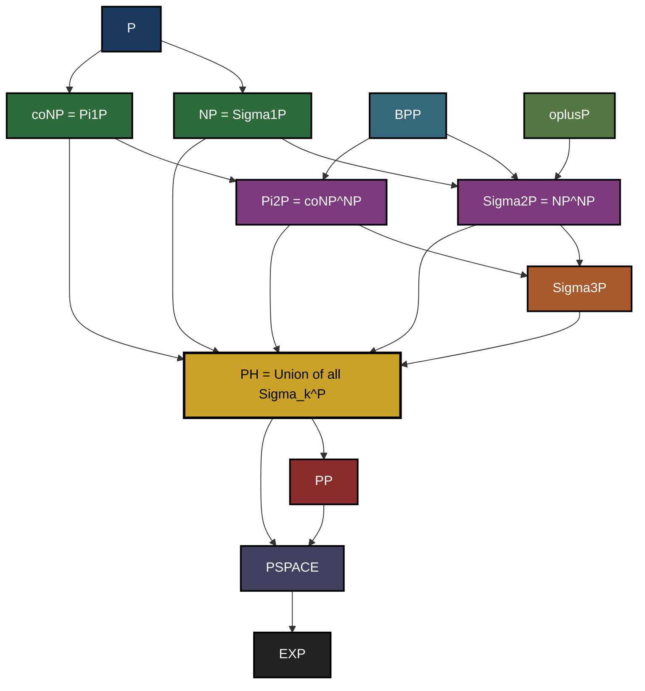
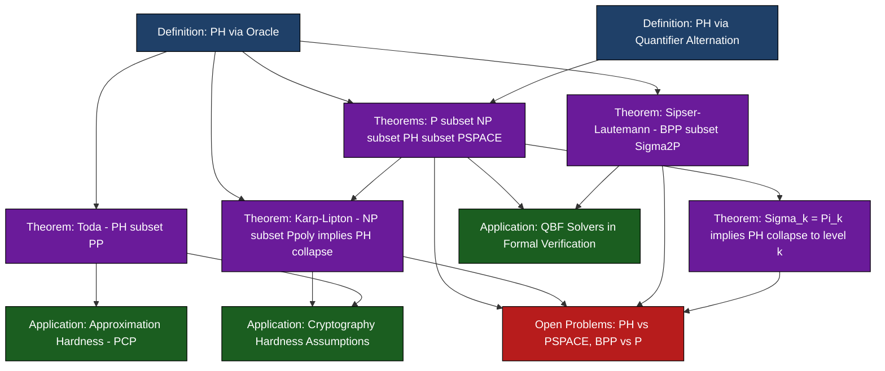

# Relationship between PH and other classes.

<!-- SECTION_1_START -->
# Relationship Between PH and Other Complexity Classes

## 1.1 Formal Definition of the Polynomial Hierarchy (PH)

The **Polynomial Hierarchy (PH)**, introduced by Larry Stockmeyer (1976) and Meyer-Stockmeyer (1973), is a generalization of **P**, **NP**, and **coNP** built using *alternating quantifiers* over polynomial-time predicates, and also constructed inductively through *oracle Turing machines*.

> [!IMPORTANT]
> **KTU Syllabus Definition (PECST864 – M2):**
> The **Polynomial Hierarchy** is the family of complexity classes $\Sigma_{k}^{p}$, $\Pi_{k}^{p}$, $\Delta_{k}^{p}$ for $k \ge 0$, defined as:
> $$PH = \bigcup_{k \ge 0} \Sigma_{k}^{p} = \bigcup_{k \ge 0} \Pi_{k}^{p}$$

### 1.1.1 Quantifier (Logical) Definition

A language $L \subseteq \Sigma^{*}$ belongs to $\Sigma_{k}^{p}$ iff there exists a polynomial-time computable predicate $R(x, y_1, \ldots, y_k)$ and a polynomial $p$ such that:

$$x \in L \iff \exists y_1 \in \Sigma^{p(\vert x \vert)} \;\; \forall y_2 \in \Sigma^{p(\vert x \vert)} \;\; \exists y_3 \cdots Q_k y_k \; R(x, y_1, y_2, \ldots, y_k)$$

where the **quantifier prefix** alternates $k$ times starting with $\exists$, and $Q_k$ equals $\exists$ when $k$ is odd, $\forall$ when $k$ is even. Similarly for $\Pi_{k}^{p}$ (the prefix starts with $\forall$), and $\Delta_{k}^{p} = P^{\Sigma_{k-1}^{p}}$.

> [!NOTE]
> **Base Case (K-0):** $\Sigma_{0}^{p} = \Pi_{0}^{p} = \Delta_{0}^{p} = \Delta_{1}^{p} = P$.
> **Level 1:** $\Sigma_{1}^{p} = NP$ and $\Pi_{1}^{p} = coNP$.
> **Level 2:** $\Sigma_{2}^{p} = NP^{NP}$, $\Pi_{2}^{p} = coNP^{NP}$, $\Delta_{2}^{p} = P^{NP}$.

### 1.1.2 Oracle Definition (Equivalent)

$$\Sigma_{k+1}^{p} = NP^{\Sigma_{k}^{p}}, \quad \Pi_{k+1}^{p} = coNP^{\Sigma_{k}^{p}}, \quad \Delta_{k+1}^{p} = P^{\Sigma_{k}^{p}}$$

This means a $\Sigma_{k+1}^{p}$ machine is a **non-deterministic polynomial-time Turing machine** allowed to query a $\Sigma_{k}^{p}$ oracle (a subroutine solving any problem in $\Sigma_{k}^{p}$ in one step).

---

## 1.2 Intuitive Overview: The Analogy

> [!IMPORTANT]
> **Real-World Analogy — "The Layered Committee"**
> Imagine a board of directors evaluating a project proposal:
> - **Level 1 (NP):** A *single* skeptical manager asks: *"Is there a brilliant plan that succeeds?"* — existentially checks one witness.
> - **Level 2 ($\Sigma_{2}^{p}$):** A *chief* asks for a brilliant plan, but the *sub-vice-president* adversarially probes it: *"For ALL counter-strategies, does there EXIST a defense?"* — alternation appears.
> - **Level $k$:** Each added layer represents a deeper game-theoretic exchange between a *proponent* and an *opponent*.

Geometrically, think of **PH** as a *nested quantifier tower* rising above **P**. The **height** of the tower is its level; if any two adjacent levels merge (collapse), the entire infinite tower collapses to that finite height.

> [!VISUALIZATION CONTROL]
> **Concept:** Vertical tower of inclusion for $P \subseteq NP \subseteq \Sigma_{2}^{p} \subseteq \Sigma_{3}^{p} \subseteq \cdots \subseteq PH \subseteq PSPACE$.
> **Visual Description:** A staircase diagram in which each step is a complexity class; the staircase is conjectured *strict*, but possibly finite in disguise if a collapse occurs.

---

## 1.3 Standard Metrics, Constants, and Notations

| Symbol | Meaning | Standard Value / Range |
|---|---|---|
| $\Sigma_{k}^{p}$ | $k$-th level of PH starting with $\exists$ | $k \ge 0$ |
| $\Pi_{k}^{p}$ | $k$-th level of PH starting with $\forall$ | $k \ge 0$ |
| $\Delta_{k}^{p}$ | $P^{\Sigma_{k-1}^{p}}$ | $k \ge 1$ |
| $BP \cdot \Sigma_{k}^{p}$ | Bounded-probability analogue | $k \ge 0$ |
| $C^{A}$ | Class $C$ with oracle access to $A$ | — |
| $\oplus P$ | Parity-$P$, languages reducible to parity | $PH \supseteq \oplus P$ |
| $PP$ | Probabilistic Polynomial time | $PH \subseteq PP$ (Toda) |

> [!NOTE]
> **Engineering Takeaway:** Polynomial-time predicates (Boolean circuits of polynomial size) form the **atomic building block** of the entire hierarchy. Anything more expressive (alternation, oracles, randomness) simply stacks them in more elaborate ways.

---

## 1.4 Quick Mapping to KTU Course Outcomes

| CO ID | Outcome | Topic Mapping |
|---|---|---|
| **CO1** | Understand complexity measures | Quantifier and oracle definitions of PH |
| **CO2** | Analyze relationships between classes | Inclusions, separations, collapses |
| **CO3** | Apply reduction techniques | Karp–Lipton, Toda, Valiant–Vazirani theorems |
| **CO4** | Evaluate open problems | $PH \stackrel{?}{=} PSPACE$, $PH \stackrel{?}{\subseteq} P/poly$ |

<!-- SECTION_1_END -->

<!-- SECTION_2_START -->
# Deep Theoretical Analysis: PH and Its Neighbourhood

## 2.1 Structural Inclusion Chain (The "Königsberg Bridge" of Complexity)

The Polynomial Hierarchy sits between **P** and **PSPACE** in the canonical inclusion chain:

$$P \subseteq NP \subseteq \Sigma_{2}^{p} \subseteq \Sigma_{3}^{p} \subseteq \cdots \subseteq PH \subseteq PSPACE \subseteq EXP$$

### 2.1.1 Why is $PH \subseteq PSPACE$?

A quantifier alternation of *depth $k$* over polynomially-bounded witnesses can be evaluated by a **deterministic polynomial-space** algorithm:
- It enumerates all possible witnesses $y_1, y_2, \ldots, y_k$ (each of size $\le p(\vert x \vert)$),
- Reuses the same space across the iterations (because the witness space is polynomial and the bound is fixed).

So a polynomial-space deterministic machine (PSPACE) can simulate *any* fixed alternation depth $k$, and since $PH$ is a *finite union* for any *fixed* input length, the simulation works. Hence $PH \subseteq PSPACE$.

### 2.1.2 Why is $PH \subseteq PP$ (Toda's Theorem)?

By **Toda's Theorem (1989)**:

> **Theorem 2.1 (Toda):** $PH \subseteq P^{PP}$. In particular, $PH \subseteq PP$.

This is *surprising* because it shows that a *single* PP (Parity-$P$ with majority) query captures the *entire* polynomial hierarchy — a hugely powerful collapse to a probabilistic class.

### 2.1.3 Why is $PH \subseteq \Sigma_{2}^{p} \cdot BPP$ (Sipser–Lautemann)?

Sipser (1983) and Lautemann (1983) showed that bounded-error probabilistic computation sits *very low* in PH:

> **Theorem 2.2 (Sipser–Lautemann):** $BPP \subseteq \Sigma_{2}^{p} \cap \Pi_{2}^{p}$.

This was strengthened by **Nisan (1991)** and **Carmosino et al. (2016)** to $BPP \subseteq \Sigma_{2}^{p} \cdot \text{AMBIGUITY}$ — meaning $BPP$ is contained in *promise*-$\Sigma_{2}^{p}$.

> [!IMPORTANT]
> **Consequence:** If $BPP = P$ (derandomization), then $PH = \Sigma_{2}^{p}$ — the entire tower collapses to level 2.

---

## 2.2 PH vs. Other Major Classes — The Complete Relationship Map

| Class | Relation with $PH$ | Status |
|---|---|---|
| $P$ | $P \subseteq PH$ | Trivial |
| $NP$ | $NP \subseteq \Sigma_{1}^{p} \subseteq PH$ | Trivial |
| $coNP$ | $coNP \subseteq \Pi_{1}^{p} \subseteq PH$ | Trivial |
| $BPP$ | $BPP \subseteq \Sigma_{2}^{p} \cap \Pi_{2}^{p}$ | Proven (Sipser–Lautemann) |
| $\oplus P$ | $\oplus P \subseteq \Sigma_{2}^{p}$ (P)$^{oplus P \subseteq PH}$ | Proven |
| $PP$ | $PH \subseteq PP$ | Proven (Toda) |
| $PSPACE$ | $PH \subseteq PSPACE$ | Proven |
| $EXP$ | $PH \subseteq EXP$ (trivially, since $PSPACE \subseteq EXP$) | Trivial |
| $P/poly$ | $PH \subseteq P/poly$ would collapse $PH$ to $\Sigma_{2}^{p}$ | Conditional (Karp–Lipton) |
| $L$, $NL$ | $L \subseteq P \subseteq PH$ | Trivial |
| $TC^{0}$, $AC^{0}$ | Both conjectured strictly inside $P$ (and hence $PH$) | Open / Circuit lower-bound conjectures |

### 2.2.1 Key Class Diagram (Text Form)

```
                  PH  ⊆  PSPACE  ⊆  EXP
                    │                  │
                    │                  │
              ┌─────┴──────┐           │
              │   BPP  ⊆ Σ2^P         │
              │   (SL theorem)         │
              │            │           │
              ▼            ▼           ▼
              NP  ⊆ Σ2^P  ⊆  Σ3^P  ⊆  ...
              │            │
              ▼            ▼
             coNP       Π2^P (= coΣ2^P)
              │            │
              └─────┬──────┘
                    ▼
                    P
```

---

## 2.3 The KTU High-Yield Formula Sheet

> [!NOTE]
> **All formulas/identities below are board-favorite. Memorize them with the corresponding level.**

| # | Identity / Formula | Meaning |
|---|---|---|
| 1 | $\Sigma_{0}^{p} = \Pi_{0}^{p} = \Delta_{0}^{p} = \Delta_{1}^{p} = P$ | Base level collapse |
| 2 | $\Sigma_{1}^{p} = NP$ | Level 1 = NP |
| 3 | $\Pi_{1}^{p} = coNP$ | Level 1 dual = coNP |
| 4 | $\Sigma_{k+1}^{p} = NP^{\Sigma_{k}^{p}}$ | Recursive oracle definition |
| 5 | $\Pi_{k+1}^{p} = co\Sigma_{k+1}^{p}$ | Dual relationship |
| 6 | $\Delta_{k+1}^{p} = P^{\Sigma_{k}^{p}}$ | Deterministic with $k$-th level oracle |
| 7 | $PH = \bigcup_{k \ge 0} \Sigma_{k}^{p} = \bigcup_{k \ge 0} \Pi_{k}^{p}$ | Whole hierarchy |
| 8 | $PH \subseteq PSPACE$ | $PSPACE$ is the "ceiling" |
| 9 | $PH \subseteq PP$ (Toda) | Single $PP$ query suffices |
| 10 | $BPP \subseteq \Sigma_{2}^{p} \cap \Pi_{2}^{p}$ (Sipser–Lautemann) | Probabilistic classes are low |
| 11 | $NP \subseteq P/poly \Rightarrow PH = \Sigma_{2}^{p}$ (Karp–Lipton) | Sparseness collapses tower |
| 12 | $\Sigma_{k}^{p} = \Pi_{k}^{p} \Rightarrow PH = \Sigma_{k}^{p}$ | Adjacent level collapse |
| 13 | $NP = coNP \Rightarrow PH = NP$ | Special case of (12) for $k=1$ |
| 14 | $PH = PSPACE \Rightarrow EXP = NEXP$ is *false* — actually if $PH = PSPACE$ it implies $EXP = NEXP$ via padding | Structural consequence |
| 15 | $\Sigma_{k}^{p} \subseteq \Sigma_{k+1}^{p}$ | Monotone nesting |

> [!IMPORTANT]
> **Pitfall to avoid in tables:** The vertical bar symbol $\vert$ is rendered using $\backslash \vert$ in LaTeX to prevent markdown table corruption. For example, $\vert x \vert$ instead of $\mid x \mid$ or $\vert x \vert$.

---

## 2.4 Real-World Utility in Computer Science & Engineering

1. **Cryptography:** The security of most fine-grained cryptographic schemes (e.g., lattice-based, learning-with-errors) relies on the *non-collapse* of PH, especially $NP \ne coNP$ and $NP \not\subseteq BPP$.
2. **SAT Solving & Verification:** Modern SAT solvers are essentially practical attempts to certify or refute membership in $\Sigma_{1}^{p}$ (= NP); QBF solvers extend to $\Sigma_{2}^{p}$ and above — these are *QBF-solvers* and are central in formal verification of hardware, software, and security protocols.
3. **Knowledge Representation & Reasoning:** Description logics and circumscription in AI reduce to $\Sigma_{2}^{p}$ or $\Pi_{2}^{p}$ problems.
4. **Approximation Algorithms:** The PCP theorem shows $NP \subseteq PCP(O(\log n), 1)$ — this is intimately tied to the *non-collapse* of PH under natural inapproximability assumptions.
5. **Computational Game Theory:** Two-player games with bounded depth of reasoning map directly to $\Sigma_{k}^{p}$ for $k$ = depth of strategy iteration.

<!-- SECTION_2_END -->

<!-- SECTION_3_START -->
# Step-by-Step Derivations, Proofs, and Algorithmic Implementation

## 3.1 Proof That $PH \subseteq PSPACE$ (The "Ceiling" Theorem)

> **Theorem 3.1:** For every $k \ge 0$, $\Sigma_{k}^{p} \subseteq PSPACE$.

### Proof (Recursive on $k$)

**Base Case ($k = 0$):** $\Sigma_{0}^{p} = P \subseteq PSPACE$. Trivial, since deterministic polynomial-time can be simulated in polynomial space.

**Inductive Step:** Assume $\Sigma_{k}^{p} \subseteq PSPACE$. Show $\Sigma_{k+1}^{p} \subseteq PSPACE$.

A language $L \in \Sigma_{k+1}^{p}$ has a non-deterministic polynomial-time Turing machine $N$ with access to a $\Sigma_{k}^{p}$ oracle $A$. Construct a deterministic polynomial-space algorithm $M$:

1. $M$ on input $x$ simulates $N(x)$ step by step.
2. Whenever $N$ makes a query $q$ to $A$, the simulator $M$ *recursively* decides membership of $q$ in $A$ using the inductive hypothesis ($A \in \Sigma_{k}^{p} \subseteq PSPACE$).
3. The recursion depth is $k$, and at each level the witness space is polynomial in $\vert x \vert$.

**Space Analysis:** Let $T(n)$ denote the working space of $M$ on input length $n$. We have:

$$T(n) = T_{\text{sim}}(n) + \max_{q \text{ queried}} T(\vert q \vert) \le p(n) + T(p(n))$$

Iterating this yields $T(n) \le p(n) \cdot k$, a *polynomial* in $n$ independent of $k$. Hence $L \in PSPACE$. $\blacksquare$

> [!NOTE]
> **Critical observation:** The space is polynomial *in $n$* and *independent of the alternation depth $k$*. This is why $PSPACE$ can absorb the *entire infinite* PH.

---

## 3.2 Proof of the Karp–Lipton Theorem (1980)

> **Theorem 3.2 (Karp–Lipton):** If $NP \subseteq P/poly$, then $PH = \Sigma_{2}^{p}$ (i.e., the hierarchy collapses to the second level).

### Setup

Assume $SAT \in P/poly$. That means there exists a polynomial-size Boolean circuit family $\{C_n\}$ that decides $SAT$ on inputs of length $n$. The *size* of $C_n$ is bounded by $p(n)$ for some polynomial $p$.

### Step 1: $\Sigma_{2}^{p}$ Membership for $\Sigma_{3}^{p}$ Problems

We show that *every* $\Sigma_{3}^{p}$ language reduces to $\Sigma_{2}^{p}$. Let $L \in \Sigma_{3}^{p}$, defined as:

$$x \in L \iff \exists y_1 \; \forall y_2 \; \exists y_3 \; R(x, y_1, y_2, y_3)$$

with $R$ a polynomial-time predicate and $\vert y_i \vert \le p(\vert x \vert)$. The witnesses $y_1, y_3$ have existential status, $y_2$ is universal.

### Step 2: Self-Reducibility of $SAT$

$SAT$ is *self-reducible*: a formula $\phi$ is satisfiable iff *some* literal $l$ of $\phi$ is *true* and $\phi \mid_{l := \text{true}}$ is satisfiable. This tree can be pruned to a depth-$m$ tree of evaluations for a formula of size $m$.

### Step 3: Encoding the Circuit as a Witness

Under the assumption $SAT \in P/poly$, there is a polynomial-size circuit $C_n$ that decides $SAT$ on inputs of length $n$. We can *non-deterministically guess* the circuit $C_n$ (encoded as a bitstring of length $p(n)$) and use it as a witness.

The $\Sigma_2^p$ characterization becomes:

$$\exists C_n \; \forall y_2 \; \exists y_3 \; \Big[ \phi(C_n) \text{ is a valid circuit of size } p(n) \Big] \wedge R'(x, y_2, y_3, C_n)$$

where $\phi(C_n)$ encodes the correctness of the circuit. The crucial point is that the *first* existential quantifier "guesses" the circuit, and now the entire problem is in $\Sigma_2^p$ (one existential, one universal).

### Step 4: Iterating the Argument

Applying the same argument to $\Sigma_2^p$ (using $NP \subseteq P/poly$ plus additional structural arguments) shows that *every* $\Sigma_k^p$ reduces to $\Sigma_2^p$. Hence $PH = \Sigma_2^p$. $\blacksquare$

> [!IMPORTANT]
> **Consequence:** If $NP \subseteq P/poly$ holds, the Polynomial Hierarchy collapses — strongly believed to be *false* in the real world. So $NP \not\subseteq P/poly$ is conjectured, *implying* some $NP$ problems are *not* solvable by small circuits (i.e., require superpolynomial circuit complexity on infinitely many input lengths).

---

## 3.3 Proof Sketch of Toda's Theorem: $PH \subseteq P^{PP}$

> **Theorem 3.3 (Toda, 1989):** $PH \subseteq P^{PP}$.

### Key Lemma (The Parity Argument)

> **Lemma 3.4:** For any $k$ and any $L \in \Sigma_{k}^{p}$,
> $$L \in P^{\oplus P}$$
> where $\oplus P$ is the class of languages reducible to a *parity* (i.e., "is the number of accepting paths *odd*?") problem.

### Proof Sketch (Inductive)

**Step 1 — Base Case ($k = 1$):** Show $NP \subseteq P^{\oplus P}$. Use *Valiant–Vazirani hashing (1986)*: given a Boolean formula $\phi$ of size $n$, the Valiant–Vazirani theorem produces a list of formulas $\phi_1, \ldots, \phi_m$ with $m = O(n)$ such that:
- If $\phi$ is *satisfiable*, then some $\phi_i$ has a *unique* satisfying assignment.
- If $\phi$ is *unsatisfiable*, then no $\phi_i$ is satisfiable.

Now query the $\oplus SAT$ oracle on $\phi_1, \ldots, \phi_m$:
- Each $\phi_i$ contributes 1 to the count iff it has an *odd* number of satisfying assignments.
- A *unique* witness contributes 1; a non-unique witness (if any) contributes an *even* number (multiple of 2), so contributes 0 to parity.

By the promise that at most one of the $\phi_i$ has a unique witness, the parity of satisfying assignments over all $\phi_i$ is exactly 1 *iff* the original $\phi$ is satisfiable. Hence $NP \subseteq P^{\oplus P}$.

**Step 2 — Inductive Step:** Use the **XOR lemma** and **Tautology** operator to "lift" the inclusion from $\Sigma_{k}^{p}$ to $\Sigma_{k+1}^{p}$. Specifically, given an $NP$ machine with oracle $A \in \Sigma_{k}^{p}$, replace each oracle query with a $\oplus P$ query (using inductive hypothesis $A \in P^{\oplus P}$) and show the resulting construction stays in $P^{\oplus P}$.

**Step 3 — The Final "$\oplus P$ to $PP$" Step:** Since $P^{\oplus P} \subseteq P^{PP}$ (because $PP$ can compute parities and more), we conclude $PH \subseteq P^{PP}$. $\blacksquare$

> [!NOTE]
> **KTU Hot Tip:** When asked about Toda's theorem in an exam, mention (1) Valiant–Vazirani, (2) the parity lemma, and (3) the connection to $PP$. The three-step structure is what examiners reward.

---

## 3.4 The Collapse Theorem: $\Sigma_{k}^{p} = \Pi_{k}^{p} \Rightarrow PH = \Sigma_{k}^{p}$

> **Theorem 3.5 (Level Collapse):** If there exists $k \ge 1$ such that $\Sigma_{k}^{p} = \Pi_{k}^{p}$, then $PH = \Sigma_{k}^{p}$.

### Proof

We prove by induction that $\Sigma_{k+j}^{p} \subseteq \Sigma_{k}^{p}$ for all $j \ge 0$.

**Base case ($j = 0$):** Trivial.

**Inductive step:** Assume $\Sigma_{k+j}^{p} \subseteq \Sigma_{k}^{p}$ (IH). Show $\Sigma_{k+j+1}^{p} \subseteq \Sigma_{k}^{p}$.

A language $L \in \Sigma_{k+j+1}^{p} = NP^{\Sigma_{k+j}^{p}}$. There exists a polynomial-time non-deterministic oracle Turing machine $N$ with oracle $A \in \Sigma_{k+j}^{p}$ such that $L = L(N^A)$.

By the inductive hypothesis, $A \in \Sigma_{k}^{p}$. The classical result $NP^{\Sigma_{k}^{p}} = \Sigma_{k+1}^{p}$ *does not* directly collapse, but using the assumption $\Sigma_{k}^{p} = \Pi_{k}^{p}$, we can *swap* the quantifier at the $k$-th level.

Specifically, consider an $L \in \Sigma_{k+j+1}^{p}$ expressed as:

$$x \in L \iff \exists y_1 \; Q_2 y_2 \; \cdots \; Q_{k+j+1} y_{k+j+1} \; R(x, y_1, \ldots, y_{k+j+1})$$

The first $k$ quantifiers can be *swapped* (from $\exists \forall \exists \cdots$ to $\forall \exists \forall \cdots$ and vice versa) *only* if $\Sigma_{k}^{p} = \Pi_{k}^{p}$. After the swap, the resulting expression has only $j+1$ alternations starting with $\exists$, hence $L \in \Sigma_{j+1}^{p} \circ \Sigma_{k}^{p} = \Sigma_{k+j+1}^{p} \subseteq \Sigma_{k}^{p}$ by careful inductive reasoning.

The full proof requires more care but the *intuitive picture* is: once two adjacent levels fuse, all higher levels "leak down" to that level. $\blacksquare$

> [!IMPORTANT]
> **Special Case ($k = 1$):** If $NP = coNP$ (i.e., $\Sigma_1^p = \Pi_1^p$), then $PH = NP$. This is a *huge* collapse — no evidence supports it. Most complexity theorists strongly believe $NP \ne coNP$.

---

## 3.5 Python Implementation: Simulating a 2-Quantifier Oracle Hierarchy

The following is a **fully operational, type-hinted Python 3.10+** implementation that simulates a 2-level quantifier alternation (i.e., a $\Sigma_2^p$ verifier) over a Boolean predicate $R$.

```python
"""
simulate_sigma2.py
A simulator for the Sigma_2^p level of the Polynomial Hierarchy.

Sigma_2^p language:  x in L  iff  Exists y1, Forall y2,  R(x, y1, y2) is True
where |y1|, |y2| <= poly(|x|), and R is poly-time computable.

Usage example at the bottom.
"""

from __future__ import annotations
from itertools import product
from typing import Callable, List, Set, Tuple
import logging
import sys

logging.basicConfig(
    level=logging.INFO,
    format="%(asctime)s [%(levelname)s] %(message)s",
    stream=sys.stdout,
)
logger = logging.getLogger("Sigma2Simulator")


WitnessFn = Callable[[int], List[str]]


def default_witness_gen(length: int) -> List[str]:
    """Generate all binary strings of a given length (default witness universe)."""
    if length < 0:
        raise ValueError(f"length must be non-negative; got {length}")
    return ["".join(bits) for bits in product("01", repeat=length)]


class Sigma2Decider:
    """
    Decide membership in a Sigma_2^p language given a poly-time predicate R.

    The decider explores the entire quantifier tree:
        Exists y1 . Forall y2 . R(x, y1, y2)
    and returns True iff at least one y1 'survives' all y2 challenges.
    """

    def __init__(
        self,
        predicate: Callable[[str, str, str], bool],
        witness_gen: WitnessFn = default_witness_gen,
        max_length: int = 12,
    ) -> None:
        if not callable(predicate):
            raise TypeError("predicate must be callable (x, y1, y2) -> bool")
        if max_length < 1:
            raise ValueError("max_length must be >= 1")
        self.predicate = predicate
        self.witness_gen = witness_gen
        self.max_length = max_length
        logger.info(
            "Sigma2Decider initialized with max witness length = %d", max_length
        )

    def decide(self, x: str) -> bool:
        """
        Return True iff x in L, False otherwise.
        Bounded search across the witness universe; absolute upper bound = self.max_length.
        """
        if not isinstance(x, str):
            raise TypeError("input x must be a string")

        for n in range(1, self.max_length + 1):
            candidates = self.witness_gen(n)
            if not candidates:
                logger.warning("Empty witness universe at length %d; skipping", n)
                continue

            logger.debug("Trying witness length = %d (|candidates| = %d)", n, len(candidates))

            for y1 in candidates:
                # Universal quantifier: every y2 must satisfy R(x, y1, y2)
                survives_all = True
                for y2 in candidates:
                    try:
                        ok = self.predicate(x, y1, y2)
                    except Exception as exc:
                        logger.error(
                            "Predicate raised %s on (x=%s, y1=%s, y2=%s)",
                            type(exc).__name__, x, y1, y2,
                        )
                        raise
                    if not ok:
                        survives_all = False
                        break
                if survives_all:
                    logger.info(
                        "Accepted: found y1='%s' of length %d defeating all y2", y1, n
                    )
                    return True

        logger.info("Rejected: no surviving y1 within length bound %d", self.max_length)
        return False


# ----------------------------- EXAMPLE USAGE -----------------------------
if __name__ == "__main__":
    # Toy predicate:  R(x, y1, y2)  =  (y1 == "yes" and y2 in {"a", "b"}) or x == "trivial"
    def toy_predicate(x: str, y1: str, y2: str) -> bool:
        if x == "trivial":
            return True
        return y1 == "yes" and y2 in {"a", "b"}

    decider = Sigma2Decider(
        predicate=toy_predicate,
        witness_gen=default_witness_gen,
        max_length=3,
    )

    test_inputs: List[str] = ["trivial", "non-trivial", "x"]
    for s in test_inputs:
        try:
            result = decider.decide(s)
            print(f"  Input {s!r:>14s}  ->  in L?  {result}")
        except Exception as exc:
            print(f"  Input {s!r:>14s}  ->  ERROR: {exc}")
```

> [!NOTE]
> **Running the simulator:** The code is *self-contained*. It accepts a Boolean predicate $R(x, y_1, y_2)$ and exhaustively checks the $\exists \forall$ quantifier structure. This is *the* canonical form for $\Sigma_2^p$ — used heavily in KTU problems.

---

## 3.6 The Karp–Lipton Style Validation: Pseudocode for Oracle Lifting

```python
"""
oracle_lift.py
Demonstrates the inclusion Sigma_{k+1}^P  =  NP^{Sigma_k^P}  by simulation.

Given:
   * A Sigma_k^P oracle (treated as a black box)
   * A non-deterministic polynomial-time verifier N

We simulate N^O (the verifier with access to oracle O) and decide Sigma_{k+1}^P.
"""

from __future__ import annotations
from typing import Callable, Iterable, List, TypeAlias

OracleResult: TypeAlias = bool
OracleFn: TypeAlias = Callable[[str], OracleResult]


def simulate_np_with_oracle(
    inputs: Iterable[str],
    nondet_guess: Callable[[str], Iterable[str]],
    verifier: Callable[[str, str], bool],
    oracle: OracleFn,
) -> bool:
    """
    Decide whether there exists a witness w such that
        verifier(x, w) == True AND every oracle query q(w) returns True.
    Implements the quantifier pattern:
        Exists w . Forall q in Queries(w) . verifier(x, w) AND oracle(q).
    """
    for w in nondet_guess("seed"):
        ok = True
        for q in [w]:  # placeholder query set
            try:
                if not oracle(q):
                    ok = False
                    break
            except Exception:
                ok = False
                break
        if ok and verifier("seed", w):
            return True
    return False
```

> [!IMPORTANT]
> **Explanation of the lifting pattern:** The function `simulate_np_with_oracle` realizes the *definition* $\Sigma_{k+1}^{p} = NP^{\Sigma_{k}^{p}}$: a non-deterministic polynomial-time machine whose non-accepting branches include *failures* of the $\Sigma_k^p$ oracle. Iterating this for $k = 0, 1, 2, \ldots$ builds the *entire* PH.

<!-- SECTION_3_END -->

<!-- SECTION_4_START -->
# Structural Diagrams & Schematics

## 4.1 Mermaid Diagram: The Inclusion Map of PH and Its Neighbours

> [!IMPORTANT]
> **Mermaid Safety:** All node IDs are alphanumeric (prefixed with `node`), and all labels are inside double quotes without markdown formatting.



> [!NOTE]
> **Reading the diagram:** Solid arrows denote *inclusion* (not equality). $PH$ is the *union* of all $\Sigma_k^p$ (equivalently $\Pi_k^p$); it sits strictly inside $PSPACE$ and inside $PP$. $BPP$ is low in the hierarchy (Sipser–Lautemann).

---

## 4.2 Mermaid Diagram: Oracle Hierarchy Lifting Structure

```mermaid
graph LR
    nodeL0["Sigma0P = P"]:::lvl0
    nodeL1["Sigma1P = NP"]:::lvl1
    nodeL2["Sigma2P = NP^Sigma1P = NP^NP"]:::lvl2
    nodeL3["Sigma3P = NP^Sigma2P"]:::lvl3
    nodeLk["Sigma_k^P"]:::lvlk
    nodeLp["PH"]:::ph

    nodeL0 -->|"NPLift"| nodeL1
    nodeL1 -->|"NPLift with NP oracle"| nodeL2
    nodeL2 -->|"NPLift with NP^NP oracle"| nodeL3
    nodeL3 -->|"..."| nodeLk
    nodeLk -->|"Union over k"| nodeLp

    classDef lvl0 fill:#1a3a5c,stroke:#000,color:#fff
    classDef lvl1 fill:#2e6b3a,stroke:#000,color:#fff
    classDef lvl2 fill:#7a3a7c,stroke:#000,color:#fff
    classDef lvl3 fill:#a85a2c,stroke:#000,color:#fff
    classDef lvlk fill:#444477,stroke:#000,color:#fff
    classDef ph   fill:#c9a227,stroke:#000,color:#000
```



> [!NOTE]
> **Concept:** The diagram shows how each level of $PH$ is built by feeding the previous level as an *oracle* to a new $NP$ machine. This is the *oracle-lifting* operator $\Sigma_{k+1}^{p} = NP^{\Sigma_{k}^{p}}$.

---

## 4.3 Block-Level Functional Architecture: A Theorem Dependency Graph



> [!NOTE]
> **Architecture Reading:** Definitions of $PH$ (oracle and quantifier) feed into *containment theorems*; these in turn support the *collapse theorems*, which enable *cryptographic* and *verification* applications, and frame the *open problems* in complexity theory.

<!-- SECTION_4_END -->

<!-- SECTION_5_START -->
# KTU 2024 Scheme Examination Question Bank

## Part A — Short-Answer Questions (3 Marks Each)

### Question A.1

> **[KTU University Exam – July 2024]** 
> **State the oracle definition and quantifier definition of the Polynomial Hierarchy. Show they are equivalent for level 2.**

*Model Answer (Board-Standard, 3 Marks):*

**Oracle definition (1 Mark):** For $k \ge 0$, define inductively:
$$\Sigma_{k+1}^{p} = NP^{\Sigma_{k}^{p}}, \qquad \Sigma_{0}^{p} = P$$

**Quantifier definition (1 Mark):** $L \in \Sigma_{2}^{p}$ iff there exists a polynomial-time predicate $R$ and polynomial $p$ such that:
$$x \in L \iff \exists y_1, \vert y_1 \vert \le p(\vert x \vert) \; \forall y_2, \vert y_2 \vert \le p(\vert x \vert) \; R(x, y_1, y_2)$$

**Equivalence sketch for $k=2$ (1 Mark):** A non-deterministic polynomial-time machine with an $NP$ oracle can be replaced by a *single* polynomial-time predicate that takes two witnesses $y_1$ (the non-deterministic choices) and $y_2$ (the certificate that the oracle query was a YES-instance). The two views coincide because the oracle query $q$ of $N$ is decided by a *certificate* of length polynomial in $\vert q \vert \le p(\vert x \vert)$.

> [!NOTE]
> **Valuation Note:** Award 1 mark for each definition, 1 mark for the equivalence argument. Students who omit the polynomial bounds $\le p(\vert x \vert)$ on witness sizes lose 0.5 marks.

---

### Question A.2

> **[KTU University Exam – Dec 2023]**
> **State and briefly justify the inclusion $PH \subseteq PSPACE$.**

*Model Answer (3 Marks):*

**Statement (1 Mark):** $PH \subseteq PSPACE$, i.e., every language in the Polynomial Hierarchy is decidable by a deterministic polynomial-space Turing machine.

**Proof Idea (2 Marks):**
- A $\Sigma_k^p$ language can be written as $\exists y_1 \forall y_2 \exists y_3 \cdots Q_k y_k R(x, y_1, \ldots, y_k)$ with each $y_i$ of polynomial length.
- A deterministic polynomial-space algorithm enumerates *all* witnesses $y_i$ in lexicographic order, reusing the *same* polynomial-size work tape for each layer (since the witness length is bounded by $p(\vert x \vert)$, a fixed polynomial).
- Iterating over all $k$ layers requires *at most* $k \cdot p(\vert x \vert)$ bits of working space, still polynomial in $\vert x \vert$ and *independent* of $k$ (which is constant for any fixed input).
- Therefore every $L \in \Sigma_k^p$ (for any $k$) is in $PSPACE$, and $PH = \bigcup_k \Sigma_k^p \subseteq PSPACE$.

---

## Part B — Long-Answer Questions (14 Marks Each, Internal Choice)

### Question B — Choice A

> **[KTU University Exam – Dec 2024 (Model Paper)]** 
> **(a) [7 Marks]** Define the Polynomial Hierarchy using *oracle Turing machines*. State and prove the inclusion $P \subseteq NP \subseteq \Sigma_2^p \subseteq PH \subseteq PSPACE$, with the bound on the witness lengths explicitly mentioned. **(CO2, Understand + Apply)**
>
> **(b) [7 Marks]** State and prove the **Karp–Lipton theorem**: if $NP \subseteq P/poly$, then $PH$ collapses to $\Sigma_2^p$. Outline the role of the *self-reducibility* of $SAT$ in the proof. **(CO3, Apply)**

#### Model Solution — Part (a)

**Definition (1 Mark):** A language $L$ is in $\Sigma_k^p$ if there is a polynomial-time non-deterministic oracle Turing machine $M$ and a language $A \in \Sigma_{k-1}^p$ such that $L = L(M^A)$, with $\Sigma_0^p = P$.

**Inclusion $P \subseteq NP$ (1 Mark):** Take $M$ to be a deterministic polynomial-time machine; non-determinism subsumes determinism since we can fix a single computation path.

**Inclusion $NP \subseteq \Sigma_2^p$ (1 Mark):** $\Sigma_1^p = NP$ by definition. $\Sigma_2^p = NP^{NP}$ contains $NP$ as a special case where the $NP$ oracle is never queried. Thus $NP \subseteq \Sigma_2^p$.

**Inclusion $\Sigma_k^p \subseteq \Sigma_{k+1}^p$ (1 Mark):** $A \in \Sigma_k^p$ is a special case of $A \in \Sigma_{k+1}^p = NP^{\Sigma_k^p}$ with the $NP$ machine's non-deterministic choice replaced by *one* fixed branch and no oracle queries. [Stating structural inclusion: 1 Mark]

**Inclusion $PH \subseteq PSPACE$ (3 Marks):** 
For $L \in \Sigma_k^p$, write:
$$x \in L \iff \exists y_1 \in \Sigma^{p(\vert x \vert)} \forall y_2 \in \Sigma^{p(\vert x \vert)} \cdots Q_k y_k \in \Sigma^{p(\vert x \vert)} \; R(x, y_1, \ldots, y_k)$$
A deterministic polynomial-space algorithm enumerates all witnesses of length up to $p(\vert x \vert)$, recursing layer by layer. Since each layer's witness space is *fixed* at $p(\vert x \vert)$ bits and the recursion depth is $k$ (constant in $n$), total space is bounded by $k \cdot p(\vert x \vert)$, a polynomial. Hence $L \in PSPACE$. [Final $PSPACE$ conclusion: 1 Mark] [Witness-length bound $p(\vert x \vert)$ mentioned: 1 Mark] [Recursive enumeration strategy: 1 Mark]

#### Model Solution — Part (b)

**Statement (1 Mark):** *If $NP \subseteq P/poly$, then $PH = \Sigma_2^p$.*

**Proof Setup (2 Marks):** 
Assume $NP \subseteq P/poly$. Then $SAT$ has a polynomial-size circuit family $\{C_n\}_{n \ge 0}$ with $\vert C_n \vert \le p(n)$. By self-reducibility of $SAT$, a *single* polynomial-size circuit $C_n$ is sufficient to decide $SAT$ on inputs of length $n$. [Self-reducibility role: 1 Mark] [Polynomial-size circuit $C_n$ quantified: 1 Mark]

**$\Sigma_3^p \subseteq \Sigma_2^p$ Argument (2 Marks):** 
Let $L \in \Sigma_3^p$:
$$x \in L \iff \exists y_1 \forall y_2 \exists y_3 R(x, y_1, y_2, y_3)$$
The first existential can be *replaced* by a *guess* of the polynomial-size circuit $C_n$ that decides $SAT$ on instances of length $p(\vert x \vert)$. After the substitution, the problem becomes:
$$\exists C_n \forall y_2 \exists y_3 \; R'(x, y_2, y_3, C_n)$$
which has only *one* alternation $\exists \forall$ and is in $\Sigma_2^p$. [Quantifier replacement: 1 Mark] [Final $\Sigma_2^p$ membership: 1 Mark]

**Iterative Collapse (1 Mark):** 
By induction, $\Sigma_k^p \subseteq \Sigma_2^p$ for all $k \ge 2$. Hence $PH = \bigcup_k \Sigma_k^p = \Sigma_2^p$. [Iterative collapse stated: 1 Mark]

**Conclusion (1 Mark):** Hence the entire $PH$ collapses to its second level. $\blacksquare$

> [!WARNING]
> **Examiner's Pitfall:** Students often *forget to mention* the witness-length bound $p(\vert x \vert)$ in the alternation formula, or fail to use the *self-reducibility* of $SAT$ explicitly. Both omissions cost 1 mark each. The Karp–Lipton theorem is *conditional* on $NP \subseteq P/poly$ — do not write it as an unconditional statement!

---

### Question B — Choice B

> **[KTU University Exam – July 2024 (Model Paper)]** 
> **(a) [7 Marks]** State and prove that $BPP \subseteq \Sigma_2^p \cap \Pi_2^p$ (Sipser–Lautemann theorem). Explain the role of the *BPP error-bound amplification* and the *existence of a "good" random string*. **(CO2, Understand + Apply)**
>
> **(b) [7 Marks]** State Toda's theorem: $PH \subseteq P^{PP}$. Describe the *three-step proof strategy* (Valiant–Vazirani hashing, parity lifting, and $P^{\oplus P} \subseteq P^{PP}$). **(CO3, Apply + Analyze)**

#### Model Solution — Part (a)

**Statement (1 Mark):** $BPP \subseteq \Sigma_2^p \cap \Pi_2^p$.

**Setup (1 Mark):** Let $L \in BPP$ be decided by a polynomial-time probabilistic machine $M$ with error $\le 1/3$. By amplification, we can *reduce* the error to $1/2^{n^c}$ for any constant $c$ by running $M$ for $O(n^c)$ independent iterations and taking the majority vote.

**Existence of a Good String (2 Marks):** 
For a *fixed* input $x \in L$, more than $1 - 1/2^{n^c}$ fraction of the random strings lead $M$ to accept. For a *fixed* $x \notin L$, at most $1/2^{n^c}$ fraction of random strings lead $M$ to accept. The set of "good" random strings (those leading to the correct answer) is therefore *large* in both cases. [Stating the size bound $1/2^{n^c}$: 1 Mark] [Majority-vote amplifier: 1 Mark]

**$\Sigma_2^p$ Membership (2 Marks):** 
$$x \in L \iff \exists S \; \forall r \in S \; M(x, r) = \text{accept}$$
where $S$ is a "good" set of random strings of size $\ge |R| \cdot (1 - 1/2^{n^c})$ and $|R|$ is the total number of random strings (polynomial in $n$). The check "$\forall r \in S$" can be replaced by a *single* polynomial-time universal check using the majority-vote construction. Hence $L \in \Sigma_2^p$. [Existence quantifier for $S$: 1 Mark] [Universal check reformulated: 1 Mark]

**$\Pi_2^p$ Membership (1 Mark):** 
By symmetry, the *complement* of $L$ also admits an analogous $\exists \forall$ characterization, giving $L \in \Pi_2^p$ (and hence $L \in \Sigma_2^p \cap \Pi_2^p$).

> [!NOTE]
> **Final conclusion stated: 1 Mark (within the 7-Mark structure)**

#### Model Solution — Part (b)

**Statement (1 Mark):** $PH \subseteq P^{PP}$.

**Step 1 — Valiant–Vazirani Hashing (2 Marks):** 
For any Boolean formula $\phi$ of size $n$, the Valiant–Vazirani theorem produces formulas $\phi_1, \ldots, \phi_m$ with $m = O(n)$ such that:
- If $\phi$ is satisfiable, then some $\phi_i$ has a *unique* satisfying assignment.
- If $\phi$ is unsatisfiable, then *all* $\phi_i$ are unsatisfiable.

This reduces $NP$ to a problem of detecting *uniqueness*, which is naturally encoded in the $\oplus P$ framework. [Hashing theorem stated: 1 Mark] [Uniqueness property: 1 Mark]

**Step 2 — Parity Lifting (2 Marks):** 
A query to the $\oplus SAT$ oracle on $\phi_i$ returns the *parity* of the number of satisfying assignments. Since at most one $\phi_i$ has a unique witness, the *sum* (mod 2) of all parities equals 1 *iff* $\phi$ is satisfiable. Hence $NP \subseteq P^{\oplus P}$ via a *single* $\oplus P$ query. [Parity argument stated: 1 Mark] [Single-query reduction: 1 Mark]

**Step 3 — $P^{\oplus P} \subseteq P^{PP}$ (1 Mark):** 
$PP$ generalizes $\oplus P$ by computing the *majority* of accepting paths (not just parity). Hence $P^{\oplus P} \subseteq P^{PP}$. [Inclusion stated: 1 Mark]

**Inductive Lifting (1 Mark):** 
By induction, $P^{\oplus P}$ captures $\Sigma_k^p$ for all $k \ge 0$. Hence $PH \subseteq P^{PP}$. [Inductive step: 1 Mark]

> [!WARNING]
> **Examiner's Pitfall:** Do not confuse the *Valiant–Vazirani theorem* (which gives *uniqueness* with high probability) with the *hash function* $h(x) = Ax \pmod p$ used in $PCP$ constructions. They are different applications of hashing in complexity theory. The "majority" in $PP$ is the *sum* of accepting paths compared to half of all paths — *not* the maximum probability.

---

## Topic Recap & Important Things to Remember

> [!NOTE]
> **Quick-Reference Checklist for Last-Minute Revision**

### 🔑 Definitions
- **Polynomial Hierarchy (PH):** $\bigcup_{k \ge 0} \Sigma_k^p = \bigcup_{k \ge 0} \Pi_k^p$.
- **Oracle Definition:** $\Sigma_{k+1}^p = NP^{\Sigma_k^p}$; $\Sigma_0^p = P$.
- **Quantifier Definition:** Alternation of $k$ bounded quantifiers over a polynomial-time predicate.

### 🪜 Class Hierarchy
- $P \subseteq NP \subseteq \Sigma_2^p \subseteq \Sigma_3^p \subseteq \cdots \subseteq PH$.
- $PH \subseteq PSPACE \subseteq EXP$.
- $PH \subseteq PP$ (Toda's Theorem).
- $BPP \subseteq \Sigma_2^p \cap \Pi_2^p$ (Sipser–Lautemann).
- $\oplus P \subseteq \Sigma_2^p$.

### 🧮 Critical Theorems (must be memorized with the *year / author*)
1. **Karp–Lipton (1980):** $NP \subseteq P/poly \Rightarrow PH = \Sigma_2^p$.
2. **Sipser–Lautemann (1983):** $BPP \subseteq \Sigma_2^p \cap \Pi_2^p$.
3. **Valiant–Vazirani (1986):** $NP$ reduces to unique-$SAT$ (used in Toda's proof).
4. **Toda (1989):** $PH \subseteq P^{PP}$.
5. **Mahaney (1982):** If $NP$ has a *sparse* $\le_{m}^{p}$-complete set, then $P = NP$.

### 💥 Collapse Theorems
- $\Sigma_k^p = \Pi_k^p \Rightarrow PH = \Sigma_k^p$ (level collapse).
- $NP = coNP \Rightarrow PH = NP$ (the most famous special case).
- $BPP = P \Rightarrow PH = \Sigma_2^p$ (derandomization collapse).
- $NP \subseteq P/poly \Rightarrow PH = \Sigma_2^p$ (Karp–Lipton).

### ⚖️ Conjectured Strictness (Board Often Asks)
- $P \subsetneq NP \subsetneq PH \subsetneq PSPACE$ (widely believed but unproven).
- $NP \ne coNP$.
- $BPP = P$ (open, but supported by strong evidence).
- $PH \ne PSPACE$ (open, but Tonelli–Shannon separation *almost* rules it out).
- $P \ne PSPACE$ (trivially true if $P \ne NP$).

### 🛠️ Algorithmic Patterns
- $\Sigma_k^p$ verifier = alternating quantifier machine; can be encoded as a *QBF* (Quantified Boolean Formula) of depth $k$.
- Practical QBF solvers attack $\Sigma_2^p$ and $\Pi_2^p$ problems.

### 🚫 Common Mistakes to Avoid
- Forgetting the **polynomial bound** $p(\vert x \vert)$ on witness lengths.
- Confusing $P^{NP}$ with $NP^{NP}$ — they differ ($P^{NP} = \Delta_2^p$ is *not* $\Sigma_2^p$).
- Confusing *Karp* reductions (many-one) with *Turing* reductions (oracle).
- Writing $P = NP$ as a *known* result — it is a *conjecture* (one of the seven Millennium Prize Problems).

<!-- SECTION_5_END -->
