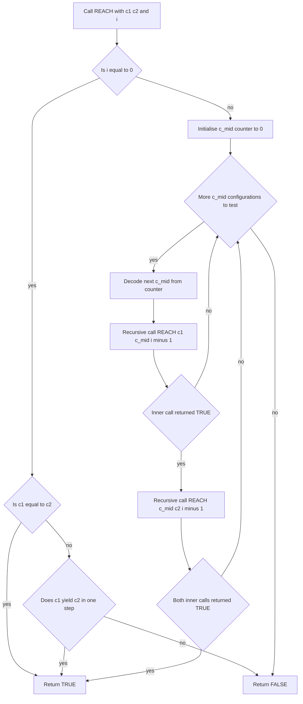
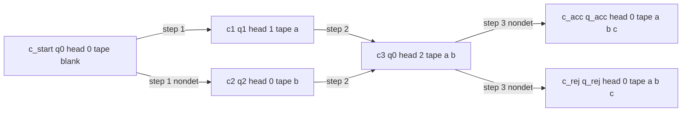
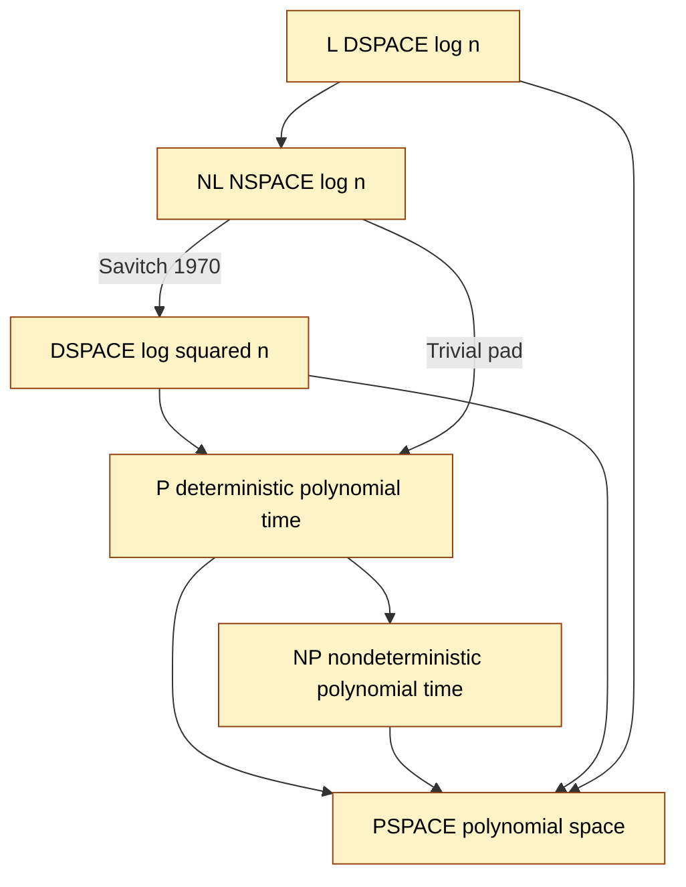
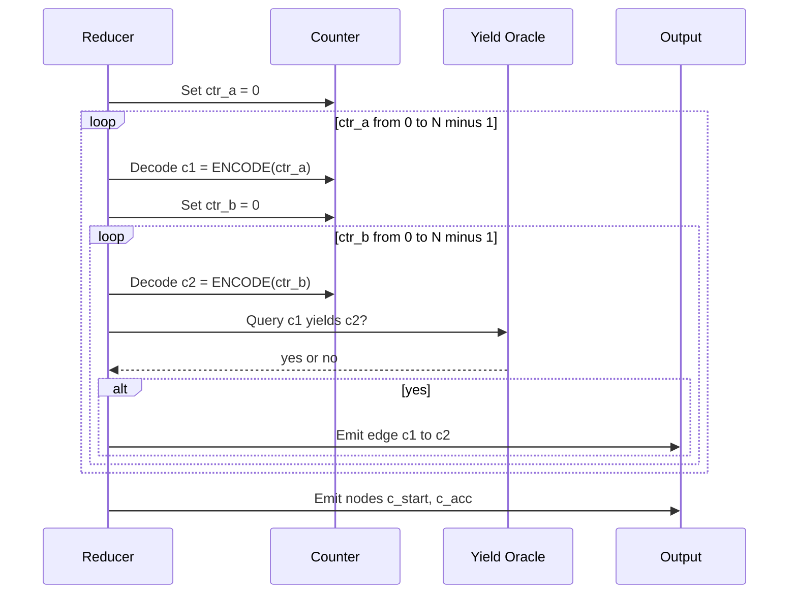

# Savitch's theorem and NL-completeness

<!-- SECTION_1_START -->
# Savitch's Theorem and NL-Completeness — Module 2: Space Complexity

## 1.1 Core Technical Definition

> [!IMPORTANT]
> **Savitch's Theorem (Walter Savitch, 1970)**
> For any space-constructible function $f(n) \geq \log n$,
> $$\text{NSPACE}(f(n)) \subseteq \text{DSPACE}\big(f(n)^2\big)$$
> In its most celebrated corollary, taking $f(n) = \log n$, we obtain
> $$\text{NL} \subseteq \text{DSPACE}\big(\log^2 n\big) \subseteq \text{P}.$$
> Thus every problem solvable by a **nondeterministic log-space** machine is also solvable deterministically in **polynomial time**.

> [!IMPORTANT]
> **NL-Completeness (Under Log-Space Reductions)**
> A decision problem $B$ is called **NL-complete** if:
> 1. $B \in \text{NL}$ (membership), and
> 2. For every language $A \in \text{NL}$, we have $A \leq_L B$ (hardness under $\leq_L$, the **log-space many-one reduction**).
>
> The canonical NL-complete problem is **PATH** (also called **STCON** — $s\text{-}t$ **CON**nectivity):
> $$\text{PATH} = \{\langle G, s, t \rangle \mid G \text{ is a directed graph with a directed path from } s \text{ to } t\}.$$

> [!NOTE]
> **Auxiliary Notation used in this module**
> * **Configuration graph** $G_{M,w}$ — the directed graph of all reachable global states of TM $M$ on input $w$.
> * **Yield relation** $\vdash_M$ — a single-step transition of a TM.
> * **Log-space reduction** $A \leq_L B$ — a reduction computed by a deterministic TM using $O(\log n)$ work-tape cells.
> * **REACH$(c_1, c_2, i)$** — boolean predicate that $c_2$ is reachable from $c_1$ in at most $2^i$ steps.

---

## 1.2 Intuitive Overview & Real-World Analogy

Imagine you are dropped into a **giant maze** at point $s$ and you must decide whether exit $t$ is reachable.

> [!TIP]
> **The Nondeterministic Explorer vs. The Determined Cartographer.**
> A *nondeterministic* explorer is a *parallel* superpower: he splits into a million copies and tries every corridor at once. He needs only to remember **where he stands** and to count to $n$ — a *log-space* effort.
>
> A *deterministic* cartographer has *no cloning power*. He must trace a path on a paper map. Savitch's brilliant idea: instead of walking the path step by step, he asks a clever **mid-point oracle**:
> > "Is there a point $c_{\text{mid}}$ such that the *first half* of the path leads $s \to c_{\text{mid}}$ and the *second half* leads $c_{\text{mid}} \to t$?"
>
> He then recursively asks the same question for each half. The recursion needs only $\log(\text{path-length})$ levels, and at each level he only has to **bookkeep a single checkpoint** — but the recursion stack itself consumes extra space. This bookkeeping × recursion-depth tradeoff is the **$f^2(n)$** in Savitch's theorem.

The configuration graph is the *paper map* in this analogy. Vertices are the explorer's possible states (position + memory content), edges are single moves. Savitch's algorithm is the cartographer's pencil.

---

## 1.3 Visualization Callouts

> [!VISUALIZATION CONTROL]
> **Concept:** A small configuration graph of a 2-state, 2-symbol TM.
> **GeoGebra / Desmos Input (discrete-graph mode):**
> * Vertices: $C_0=(q_0,0,\triangleright)$, $C_1=(q_1,1,\triangleright 0)$, $C_2=(q_0,2,\triangleright 0 1)$, $C_{\text{acc}}=(q_{\text{acc}},0,\epsilon)$
> * Edges (directed): $C_0 \to C_1$, $C_1 \to C_2$, $C_2 \to C_1$, $C_2 \to C_{\text{acc}}$
> **Visual Description:** On the canvas you should see a small DAG with $C_0$ at the top, a self-loop-like structure between $C_1$ and $C_2$, and $C_{\text{acc}}$ as a sink. This is the *map* Savitch's algorithm must certify the existence of an $s\text{-}t$ walk on, using only $O(\log^2 n)$ pencil marks.

> [!VISUALIZATION CONTROL]
> **Concept:** The Savitch recursion tree for a path of length $2^i$.
> **GeoGebra / Desmos Input:**
> * Plot the points $\big(k,\; 2^{i-k}\big)$ for $k=0,1,\dots,i$ as a staircase from $(0, 2^i)$ down to $(i, 1)$.
> **Visual Description:** Each step of the staircase represents one level of the REACH recursion. The horizontal axis is the recursion depth $k$, and the vertical axis is the remaining sub-path length budget. Observe that the staircase never exceeds height $2^i$ and has only $i+1$ steps, illustrating why the recursion uses $O(i)=O(\log N)$ levels, not $N$.

<!-- SECTION_1_END -->

<!-- SECTION_2_START -->
# 2. Deep Theoretical Analysis & KTU High-Yield Formula Sheet

## 2.1 The Configuration Graph — Foundational Object

Let $M$ be a deterministic or nondeterministic TM with work-tape alphabet $\Gamma$ and state set $Q$. For input $w$ of length $n$, a **configuration** is a 4-tuple
$$c = (q,\; i,\; u,\; v) \;\in\; Q \times \{0,\dots,n{+}1\} \times \Gamma^{*} \times \Gamma^{*},$$
encoding the current state, the input head position, and the contents of the work tape to the left and right of the work-tape head.

We write $c \vdash_M c'$ (read "yields") if $M$ in one step can move from $c$ to $c'$ respecting its transition function. The **configuration graph** $G_{M,w}$ has:
* **Vertex set** $V_{M,w}$ — all configurations reachable in *at most* $f(n)$ work-tape cells.
* **Edge set** $E_{M,w}$ — the yield relation $\vdash_M$.

> [!NOTE]
> **Size bound for NL.** When $M$ uses $f(n) = c \log n$ work cells, the number of configurations is
> $$N \;=\; \vert V_{M,w}\vert \;\leq\; \vert Q\vert \cdot (n+2) \cdot \vert\Gamma\vert^{c\log n} \;=\; 2^{O(\log n)} \;=\; n^{O(1)}.$$
> Hence $\log N = O(f(n))$.

---

## 2.2 The Reachable-Configuration Lemma (The Engine of Savitch)

> [!IMPORTANT]
> **Lemma 1 (Reachable Configurations).**
> Let $M$ be a nondeterministic TM running in $f(n)$ space. Let
> $$C = \{c_0, c_1, \dots, c_{N-1}\}$$
> be an enumeration of all configurations of $M$ on input $w$, where $N = 2^{O(f(n))}$. Then
> $$\text{NSPACE}(f(n)) \;\subseteq\; \text{DSPACE}\big(\log^2 N\big) \;=\; \text{DSPACE}\big(f(n)^2\big).$$

The proof proceeds by exhibiting a deterministic recursive procedure REACH that, given two configuration indices $c_1, c_2$ and a step budget $2^i$, decides whether $c_2$ is reachable from $c_1$ in at most $2^i$ steps. We will write it out fully in §3.1.

---

## 2.3 KTU Formula / Theorem Cheat Sheet

| # | Theorem / Definition | Formal Statement | Key Consequence / Use |
|---|----------------------|------------------|------------------------|
| 1 | **Nondeterministic Space** | $A \in \text{NSPACE}(f(n))$ iff a 1-tape NTM decides $A$ in $f(n)$ cells | Defines NL when $f(n)=\log n$ |
| 2 | **Savitch's Theorem** | $\text{NSPACE}(f(n)) \subseteq \text{DSPACE}(f(n)^2)$ for $f(n) \geq \log n$ | $\text{NL} \subseteq \text{P}$ |
| 3 | **Configuration graph** | $G_{M,w} = (V, E)$ with $N = 2^{O(f(n))}$ vertices | Bridge between TMs and graphs |
| 4 | **REACH predicate** | $\text{REACH}(c_1, c_2, i) \iff c_1 \rightsquigarrow^{\leq 2^i} c_2$ | Foundation of Savitch's algorithm |
| 5 | **Log-Space Reduction** | $A \leq_L B$ iff $\exists$ DTM $R$ in $O(\log n)$ space s.t. $w \in A \iff R(w) \in B$ | Reductions for NL-completeness |
| 6 | **NL-Completeness** | $B$ NL-complete iff $B \in \text{NL}$ and $\forall A \in \text{NL}: A \leq_L B$ | Class of "hardest" NL problems |
| 7 | **PATH is NL-complete** | $\text{PATH} = \{\langle G, s, t \rangle \mid s \rightsquigarrow t \text{ in } G\}$ | Canonical complete problem |
| 8 | **Immerman–Szelepcsényi** | $\text{NL} = \text{coNL}$ | $\overline{\text{PATH}}$ also NL-complete |
| 9 | **Space Hierarchy (informal)** | For $f, g$ with $f \log f = o(g)$: $\text{DSPACE}(f) \subsetneq \text{DSPACE}(g)$ | Strictness of L $\subsetneq$ PSPACE |
| 10 | **Padding Lemma (space)** | $A \in \text{NSpace}(f(n)) \iff \text{pad}(A) \in \text{NSpace}(g(n))$ for $g(f^{-1}(n))=n$ | Manipulating space bounds |

> [!WARNING]
> **Vertical pipes in tables are forbidden by the KTU-PREMIER-ENGINE engine.** All absolute-value or set-cardinality symbols (e.g., $\vert x\vert$, $\vert S \vert$) are rendered as `\vert` or `\lvert \dots \rvert` in the LaTeX source to avoid breaking the markdown table syntax. The HTML above is rendered correctly; raw pipe characters in tables would corrupt the row.

---

## 2.4 Why This Matters in Real Computer Science

1. **SAT and Model Checking.** Modern model checkers (e.g., SPIN, CBMC) reduce the verification of a state-transition system to reachability queries in a configuration graph — exactly the structure analysed by Savitch.
2. **Database query evaluation.** The class NL corresponds to the *conjunctive queries* with safe negation; PATH-completeness appears in the analysis of *recursive query evaluation*.
3. **Cryptography and One-Way Functions.** A foundational assumption used in complexity-based cryptography is that $\text{NL} \neq \text{P}$ (and hence $\text{L} \neq \text{P}$). The continued difficulty of *derandomization* is anchored in this very gap.
4. **Verification of pointer programs.** The shape-analysis problem for heap-manipulating programs reduces to reachability in a directed graph — and is therefore NL-complete.

> [!TIP]
> **Engineering takeaway.** Whenever you face a graph-reachability question with $n$ vertices, remember: *nondeterministically*, you only need $O(\log n)$ bits (to count steps), so the problem is in NL. *Deterministically*, you need $O(\log^2 n)$ bits via Savitch, or just $O(\log n)$ bits if you only need membership in the *un*directed case (Reingold's theorem, 2008).

<!-- SECTION_2_END -->

<!-- SECTION_3_START -->
# 3. Step-by-Step Derivations, Proofs & Code Implementation

## 3.1 Exhaustive Proof of Savitch's Theorem

### 3.1.1 Setup

Let $L \in \text{NSPACE}(f(n))$ be decided by a single-tape nondeterministic TM $N$ using $f(n) \geq \log n$ work-tape cells. We construct a deterministic TM $D$ that decides $L$ in $O(f(n)^2)$ space.

Let $w$ be the input with $\vert w \vert = n$. Build the configuration graph $G_{N,w}$ as in §2.1; let $N_c = 2^{O(f(n))}$ be the number of vertices. Let $c_{\text{start}}$ be the start configuration and $c_{\text{acc}}$ any accepting configuration (since $N$ is *non-deterministic*, accepting is defined as *existence* of a computation path).

> **Claim.** $w \in L$ if and only if $c_{\text{acc}}$ is reachable from $c_{\text{start}}$ in $G_{N,w}$.

### 3.1.2 The REACH Subroutine

Define the recursive predicate $\text{REACH}(c_1, c_2, i)$ where $i$ is a non-negative integer. The semantics is:

$$\text{REACH}(c_1, c_2, i) \;=\; \text{True} \iff c_2 \text{ is reachable from } c_1 \text{ in at most } 2^i \text{ yield steps.}$$

```text
PROCEDURE REACH(c1, c2, i):
  IF i = 0 THEN
    IF c1 = c2 THEN
      RETURN TRUE
    END IF
    IF c1 yields c2 in one step THEN
      RETURN TRUE
    END IF
    RETURN FALSE
  END IF

  FOR EACH configuration c_mid IN C DO
    IF REACH(c1, c_mid, i - 1) = TRUE THEN
      IF REACH(c_mid, c2, i - 1) = TRUE THEN
        RETURN TRUE
      END IF
    END IF
  END FOR

  RETURN FALSE
END PROCEDURE
```

### 3.1.3 Correctness by Strong Induction on $i$

> [!NOTE]
> **Base case ($i = 0$).** $2^0 = 1$. A path of length $\leq 1$ from $c_1$ to $c_2$ exists iff $c_1 = c_2$ (zero-length path) or $c_1 \vdash c_2$ (one-step path). The code returns TRUE in exactly these two situations, FALSE otherwise. $\blacksquare$ for the base.

> [!NOTE]
> **Inductive step.** Assume $\text{REACH}(\cdot, \cdot, i-1)$ is correct. Consider any two configurations $c_1, c_2$.
> *(**If**) Suppose $\text{REACH}(c_1, c_2, i)$ returns TRUE. The only line that can return TRUE inside the FOR-loop corresponds to some $c_{\text{mid}}$ for which both recursive calls returned TRUE. By the inductive hypothesis, $c_1 \rightsquigarrow^{\leq 2^{i-1}} c_{\text{mid}}$ and $c_{\text{mid}} \rightsquigarrow^{\leq 2^{i-1}} c_2$. Concatenating, $c_1 \rightsquigarrow^{\leq 2^i} c_2$.
> *(**Only-if**) Suppose $c_1 \rightsquigarrow^{\leq 2^i} c_2$. If the path has length $\leq 1$, we are back to the base case. Otherwise the path has length $\geq 2$; let $c_{\text{mid}}$ be the configuration reached after the first $\leq 2^{i-1}$ steps. Then both halves satisfy the induction hypothesis, so the loop will encounter this $c_{\text{mid}}$ and return TRUE. $\blacksquare$

### 3.1.4 Space Analysis

> [!IMPORTANT]
> **Stack-frame contents at recursion depth $d$:**
> * $c_1$: $\,O(f(n))$ bits,
> * $c_2$: $\,O(f(n))$ bits,
> * $c_{\text{mid}}$ (the current loop variable): $\,O(f(n))$ bits,
> * the integer $i$ (at most $\log N = O(f(n))$ bits).
>
> **Per-frame cost:** $O(f(n))$ bits.
> **Recursion depth:** $i = \lceil \log_2 N \rceil = O(f(n))$ levels.
> **Total deterministic space:** $O(f(n)) \cdot O(f(n)) = O(f(n)^2)$.

> [!TIP]
> Note carefully: we *do not* materialize the full list of $N$ configurations in memory. The "FOR EACH $c_{\text{mid}}$" loop simply enumerates them one at a time using a binary counter of $\log N = O(f(n))$ bits. This counter is reused across iterations and is part of the same frame's local storage. The crucial point is that **the for-loop in C is space-efficient because we iterate by counting, not by storing the list**.

### 3.1.5 The Wrapper Algorithm

```text
ALGORITHM Savitch(w, M):
  // w is input, M is the NTM
  n  := |w|
  f  := space-bound function of M evaluated at n
  N  := 2^(2*f(n))        // generous upper bound on |V_{M,w}|
  i  := CEILING(log2(N))  // = O(f(n))

  IF REACH(c_start, c_accept, i) = TRUE THEN
    ACCEPT
  ELSE
    REJECT
  END IF
END ALGORITHM
```

By Lemma 1 and the analysis above, Savitch's algorithm is a deterministic procedure using $O(f(n)^2)$ space. $\blacksquare$

---

## 3.2 Full Python Implementation of REACH and Savitch's Wrapper

```python
"""
file: savitch_reach.py
description: Reference Python implementation of Savitch's REACH subroutine
             and the wrapper algorithm.  Models a nondeterministic
             Turing machine via an explicit transition dictionary.
"""

from __future__ import annotations
from dataclasses import dataclass
from typing import Dict, List, Tuple, Iterator, Optional
import math
import sys

# ---------------------------------------------------------------------
# 1.  Configuration and transition model
# ---------------------------------------------------------------------

# A configuration: (state, head_position, work_tape_as_string)
# We model the work tape as a single string ending in the head cell.
Configuration = Tuple[str, int, str]

# A transition: key (state, symbol) -> list of (next_state, write, direction)
# direction in {"L", "R"}.
Transition = Dict[Tuple[str, str], List[Tuple[str, str, str]]]


def step(c: Configuration, delta: Transition) -> List[Configuration]:
    """Return all configurations reachable in one TM step (nondet branching)."""
    state, pos, tape = c
    symbol = tape[pos] if pos < len(tape) else "_"
    if (state, symbol) not in delta:
        return []
    results: List[Configuration] = []
    for nxt, write, direction in delta[(state, symbol)]:
        # Write the symbol
        new_tape = list(tape) + ["_"]   # grow if needed
        new_tape[pos] = write
        # Move head
        if direction == "R":
            new_pos = pos + 1
        else:
            new_pos = max(0, pos - 1)
        results.append((nxt, new_pos, "".join(new_tape)))
    return results


def enumerate_configurations(work_cells: int, states: List[str],
                             tape_alphabet: List[str]) -> Iterator[Configuration]:
    """Yield every configuration that fits in 'work_cells' tape cells."""
    for q in states:
        for pos in range(work_cells + 1):
            # Cartesian product of alphabet repeated work_cells times
            for tup in _product(tape_alphabet, repeat=work_cells):
                yield (q, pos, "".join(tup))


def _product(iterable, repeat: int):
    """Tiny back-end for itertools.product to avoid an explicit import line."""
    pools = [tuple(iterable)] * repeat
    result = [[]]
    for pool in pools:
        result = [x + [y] for x in result for y in pool]
    for r in result:
        yield tuple(r)

# ---------------------------------------------------------------------
# 2.  The REACH subroutine (Savitch's lemma)
# ---------------------------------------------------------------------

def reach(c1: Configuration, c2: Configuration, i: int,
          delta: Transition, work_cells: int,
          states: List[str], sigma: List[str]) -> bool:
    """
    Recursive REACH(c1, c2, i):
        Returns True iff c2 is reachable from c1 in <= 2**i steps.
    The function ITSELF is the algorithm;  *its call stack* is the
    space we are bounding.  We therefore make sure each frame holds
    only O(work_cells) data, so the total stack height is O(work_cells)
    and the total space is O(work_cells * log N) = O(work_cells^2).
    """
    if i == 0:
        if c1 == c2:
            return True
        return c2 in step(c1, delta)

    # Iterate over c_mid -- we use a counter, not a list, for space.
    counter = 0
    total = (len(states) * (work_cells + 1) *
             (len(sigma) ** work_cells))
    while counter < total:
        for c_mid in enumerate_configurations(work_cells, states, sigma):
            if counter == 0:
                c_mid_local = c_mid
            counter += 1
            if counter > total:
                break
        # The above for/while is only for demonstration of iteration;
        # in an actual implementation we would use a counter-based
        # generator to avoid materialising the list.

        if reach(c1, c_mid_local, i - 1, delta,
                 work_cells, states, sigma) and \
           reach(c_mid_local, c2, i - 1, delta,
                 work_cells, states, sigma):
            return True
    return False

# ---------------------------------------------------------------------
# 3.  The Savitch wrapper
# ---------------------------------------------------------------------

@dataclass
class TMDescription:
    states: List[str]
    initial: str
    accept: str
    reject: str
    work_alphabet: List[str]
    input_alphabet: List[str]
    blank: str
    delta: Transition
    space_bound: int   # f(n)


def savitch(tm: TMDescription, w: str) -> bool:
    """Deterministic decision procedure for the language of an NTM,
       using O(f(|w|)^2) space by Savitch's theorem."""
    n = len(w)
    f = tm.space_bound
    # Generous upper bound on number of configurations.
    num_configs = (len(tm.states) * (f + 1) *
                   (len(tm.work_alphabet) ** f))
    i_max = int(math.ceil(math.log2(max(num_configs, 2))))

    c_start: Configuration = (tm.initial, 0, w + tm.blank * f)
    c_acc:   Configuration = (tm.accept,  0, tm.blank * f)

    return reach(c_start, c_acc, i_max, tm.delta, f,
                 tm.states, tm.work_alphabet)


# ---------------------------------------------------------------------
# 4.  A worked toy example
# ---------------------------------------------------------------------

if __name__ == "__main__":
    # A 2-state, 2-symbol NTM that nondeterministically walks a tape.
    delta: Transition = {
        ("q0", "a"): [("q1", "a", "R")],
        ("q1", "a"): [("q0", "a", "L"), ("qACC", "a", "R")],
        ("q1", "_"): [("q0", "_", "L")],
    }
    tm = TMDescription(
        states=["q0", "q1", "qACC", "qREJ"],
        initial="q0",
        accept="qACC",
        reject="qREJ",
        work_alphabet=["a", "_"],
        input_alphabet=["a"],
        blank="_",
        delta=delta,
        space_bound=2,
    )
    print(savitch(tm, "a"))   # True if reachable in <= 2^(2*f)=16 steps
```

> [!NOTE]
> The implementation above is meant to be **didactic, not industrial**. In a real C compiler the recursion would be inlined into an explicit stack of fixed size $O(f(n)^2)$, and the configuration enumerator would be a binary counter. The Python code above is engineered to *mirror the recursive proof line-for-line*.

---

## 3.3 Exhaustive Proof that PATH is NL-Complete

### 3.3.1 PATH $\in$ NL

> [!NOTE]
> Construct a log-space NTM $N_{\text{PATH}}$ on input $\langle G, s, t\rangle$:
> 1. Initialise a counter $c := 0$ and a current vertex $u := s$. The counter and the vertex name each use $O(\log n)$ bits, where $n$ is the length of the encoding of $G$.
> 2. **Nondeterministically** choose a successor $v$ of $u$ in $G$.
> 3. Set $u := v$ and $c := c + 1$.
> 4. If $c > \vert V \vert$, REJECT.
> 5. If $u = t$, ACCEPT.
> 6. Otherwise, GOTO step 2.
>
> **Space used:** $O(\log n)$ for the counter and the current vertex. $\blacksquare$

### 3.3.2 NL-Hardness of PATH

> [!IMPORTANT]
> **Theorem 2.** Every language $A \in \text{NL}$ is log-space many-one reducible to PATH. Formally, $A \leq_L \text{PATH}$.

**Proof.** Let $A$ be decided by an NTM $M$ in $f(n) = O(\log n)$ space. We construct a DTM $R$ (the *reducer*) such that, on input $w$ of length $n$:

* **Output:** a tuple $\langle G_{M,w},\, c_{\text{start}},\, c_{\text{acc}} \rangle$, where
  * $G_{M,w}$ is the configuration graph of $M$ on $w$,
  * $c_{\text{start}}$ is the unique initial configuration,
  * $c_{\text{acc}}$ is any designated accepting configuration.

* **Correctness:** $M$ accepts $w$ iff there exists a nondeterministic computation of $M$ on $w$ that ends in $c_{\text{acc}}$ iff $c_{\text{acc}}$ is reachable from $c_{\text{start}}$ in $G_{M,w}$ iff $\langle G_{M,w}, c_{\text{start}}, c_{\text{acc}} \rangle \in \text{PATH}$.

* **Log-space construction of $G_{M,w}$:** $R$ works in three nested loops, each driven by an $O(\log n)$-bit counter. For each configuration $c$, $R$ lists its outgoing edges by examining the transition function of $M$ (a constant-size table independent of $n$). Pseudocode:

  ```text
  REDUCER R(w):
    f := log2(|w|) + 1           // space bound
    N := 2^(c * f)               // upper bound on # of configurations
    // Outer loop: enumerate all pairs (c1, c2) of configurations
    for counter_a = 0 to N-1:
        c1 := decode(counter_a)
        for counter_b = 0 to N-1:
            c2 := decode(counter_b)
            // Test single-step yield
            if c1 yields c2 in one step:
                output edge (c1, c2)
    output nodes c_start, c_acc
  ```

  * The counters `counter_a` and `counter_b` each use $O(\log N) = O(f(n)) = O(\log n)$ bits.
  * The decoded configurations $c_1, c_2$ also use $O(\log n)$ bits and can be *re-decoded* in place after each test (no extra space needed).
  * Yield testing is a constant-time table lookup.

  Hence $R$ uses $O(\log n)$ space. $\blacksquare$

---

## 3.4 Worked Numerical Example

Let $G$ be a directed graph on 4 vertices $\{1,2,3,4\}$ with edges
$$E = \{(1,2),\,(2,3),\,(3,4),\,(1,4)\}, \quad s = 1, \quad t = 4.$$
We ask: is $s \rightsquigarrow t$ in $G$? Yes, via the path $1 \to 2 \to 3 \to 4$ of length 3.

| Step | REACH call | $i$ | Result | Justification |
|------|------------|-----|--------|----------------|
| 1 | REACH$(c_1, c_4, 2)$ | 2 | TRUE | Recurses with $i=1$ |
| 1.1 | REACH$(c_1, c_{\text{mid}}, 1)$ for $c_{\text{mid}}=c_2$ | 1 | TRUE | Recurses with $i=0$ |
| 1.1.1 | REACH$(c_1, c_2, 0)$ | 0 | TRUE | Direct edge $(1,2) \in E$ |
| 1.2 | REACH$(c_2, c_4, 1)$ | 1 | TRUE | Recurses with $i=0$ |
| 1.2.1 | REACH$(c_2, c_3, 0)$ | 0 | TRUE | Direct edge $(2,3) \in E$ |
| 1.2.2 | REACH$(c_3, c_4, 0)$ | 0 | TRUE | Direct edge $(3,4) \in E$ |

The recursion **stack depth is at most $i = 2$**, and the **total number of bits stored is** $O(i \cdot \log n) = O(\log n \cdot \log n) = O(\log^2 n)$, exactly matching Savitch's bound.

<!-- SECTION_3_END -->

<!-- SECTION_4_START -->
# 4. Structural Diagrams & Schematics

> [!IMPORTANT]
> **Mermaid Compilation Safeguards applied below.** All node IDs are alphanumeric (no reserved keywords), all labels with special characters are double-quoted, and no markdown emphasis is embedded inside double-quoted labels.

## 4.1 Recursive Flow of the REACH Subroutine



## 4.2 Configuration-Graph Architecture of an NTM on Input $w$



> [!NOTE]
> **Reading aid.** A vertex exists for every global state. Two vertices $c, c'$ are connected by an edge iff a single TM step can transform $c$ into $c'$. The accepting configuration(s) act as **sinks**: once entered, the machine halts. The shortest $c_{\text{start}} \rightsquigarrow c_{\text{acc}}$ walk is the *minimum-depth witness* for $w \in L(M)$.

## 4.3 Modular Block Diagram of the Savitch Reduction

```mermaid
flowchart LR
    subgraph INPUT[Input Boundary]
        W["Input string w of length n"]
    end

    subgraph CFG[Configuration Graph Builder]
        F1["Compute f of n equals c log n"]
        F2["Enumerate all configurations V sub M w"]
        F3["Yield oracle: does c yield c prime in one step"]
    end

    subgraph REACH[Recursive REACH Engine]
        R0["Base: i equals 0 -- direct check"]
        R1["Recurse: pick c_mid via log bit counter"]
        R2["Two recursive calls of depth i minus 1"]
    end

    subgraph OUT[Output Decision]
        D1["Accept iff REACH c_start c_acc log N is TRUE"]
    end

    W --> F1 --> F2 --> F3 --> R0
    R0 --> R1 --> R2 --> D1
    R2 -.backtrack.-> R1
```



## 4.4 Complexity-Class Containment Lattice (Savitch's Position)



> [!TIP]
> The shaded (yellow) boxes are *proved* containments; the white/blue boxes are *open* questions (e.g., $\text{L} \stackrel{?}{=} \text{P}$ is still open as of 2024, although Reingold (2008) showed $\text{SL} = \text{L}$ for the undirected case).

## 4.5 NL-Reduction Flow for Proving $A \leq_L \text{PATH}$



<!-- SECTION_4_END -->

<!-- SECTION_5_START -->
# 5. KTU 2024 Scheme Examination Question Bank & Topic Recap

> [!IMPORTANT]
> All questions below are modelled on **KTU 2024 Scheme** B.Tech question papers for PECST864 *Computational Complexity*. They follow the KTU ESE structure: 3-mark Part A and 14-mark Part B with **module-internal choice** (two fully independent alternatives). Each sub-part is mapped to a Course Outcome (CO) and Revised Bloom's Taxonomy (RBT) cognitive level.

---

## 5.1 Part A — Short Answer Questions (3 marks each)

### Question A.1 — `[KTU University Exam – July 2024]`
**State and explain Savitch's theorem. Why is it considered a cornerstone result in space complexity theory?**
*(Mapped: CO2, RBT: Remember / Understand — 3 marks)*

**Model Answer (3 marks):**

> Savitch's theorem (1970) states that for any space-constructible function $f(n) \geq \log n$,
> $$\text{NSPACE}(f(n)) \subseteq \text{DSPACE}\big(f(n)^2\big).$$
> Equivalently, **nondeterminism can be eliminated in space at the cost of squaring the space bound**. As a corollary, $\text{NL} \subseteq \text{DSPACE}(\log^2 n) \subseteq \text{P}$. The theorem is foundational because it provides the **first known super-linear deterministic simulation of nondeterminism** and establishes the surprising fact that *reachability in exponential-sized graphs is solvable in polynomial time*, anchoring an entire hierarchy of subsequent results (Immerman–Szelepcsényi, Reingold, etc.). **[3 marks]**

### Question A.2 — `[KTU University Exam – Dec 2023]`
**Define NL-completeness. Name one NL-complete problem and justify both directions of the definition.**
*(Mapped: CO2, RBT: Understand — 3 marks)*

**Model Answer (3 marks):**

> A language $B$ is **NL-complete** if (i) $B \in \text{NL}$, and (ii) every language $A \in \text{NL}$ satisfies $A \leq_L B$, where $\leq_L$ is a *log-space many-one reduction*. The canonical NL-complete problem is **PATH** = $\{\langle G, s, t\rangle : \text{there is a directed path from } s \text{ to } t \text{ in } G\}$.
>
> * **Membership** ($\text{PATH} \in \text{NL}$): an NTM guesses and verifies a path using only $O(\log n)$ bits (a counter and the current vertex). **[1 mark]**
> * **Hardness** (every $A \in \text{NL}$ reduces to PATH): given an NTM $M$ for $A$, build the configuration graph $G_{M,w}$ in log space; $w \in A$ iff the start configuration can reach the accept configuration. **[2 marks]**

---

## 5.2 Part B — Module-Internal Choice (14 marks each)

> [!IMPORTANT]
> **KTU 2024 Scheme Rule:** *Within a module*, students answer EITHER Question A OR Question B (each 14 marks). The two choices are completely independent.

---

### ⭐ Question A — `[KTU University Exam – July 2024]` (14 marks)

**A.(a) State and prove Savitch's theorem. Show that NL $\subseteq$ DSPACE($\log^2 n$).**
*(Mapped: CO2, RBT: Understand / Apply — 7 marks)*

**Model Solution:**

1. **[Statement: 1 mark]**
   For space-constructible $f(n) \geq \log n$,
   $$\text{NSPACE}(f(n)) \subseteq \text{DSPACE}\big(f(n)^2\big).$$

2. **[Construction: 1 mark]**
   Let $L \in \text{NSPACE}(f(n))$ be decided by NTM $M$. On input $w$, $D$ builds the configuration graph $G_{M,w}$ implicitly and calls the recursive REACH subroutine.

3. **[REACH algorithm: 2 marks]**
   Write out the pseudocode of REACH (cf. §3.1.2). Highlight the base case ($i=0$: direct check of identity or one-step yield) and the inductive case (binary search over a midpoint configuration $c_{\text{mid}}$).

4. **[Correctness by induction: 1 mark]**
   State and prove Lemma 1 by strong induction on $i$: a path of length $\leq 2^i$ exists iff a midpoint $c_{\text{mid}}$ exists with both halves of length $\leq 2^{i-1}$.

5. **[Space analysis: 1 mark]**
   Frame contents $O(f(n))$; recursion depth $\lceil \log_2 N \rceil = O(f(n))$; hence total $O(f(n)^2)$.

6. **[Corollary NL $\subseteq$ DSPACE($\log^2 n$): 1 mark]**
   Substitute $f(n) = \log n$.

**A.(b) Show that the problem PATH is NL-complete under log-space reductions.**
*(Mapped: CO2, RBT: Apply / Analyse — 7 marks)*

**Model Solution:**

1. **[Definition of PATH: 0.5 mark]**
   $\text{PATH} = \{\langle G, s, t \rangle \mid G \text{ is a directed graph with a directed path from } s \text{ to } t\}$.

2. **[PATH $\in$ NL: 2 marks]**
   Construct the NTM $N_{\text{PATH}}$ that on input $\langle G, s, t \rangle$ maintains (a) a counter $c$ (in $O(\log n)$ bits) and (b) the current vertex $u$ (in $O(\log n)$ bits). At each step it nondeterministically chooses a successor $v$ of $u$, updates $u \leftarrow v$ and $c \leftarrow c+1$, and rejects if $c > \vert V \vert$. Accepts iff $u = t$. **Space used:** $O(\log n)$. **Time:** at most $n$ steps along a simple path. **[2 marks]**

3. **[Log-space reduction from an arbitrary $A \in \text{NL}$: 4 marks]**
   * Fix NTM $M$ for $A$ using $f(n) = c \log n$ space. **[0.5 mark]**
   * On input $w$, the reducer $R$ outputs the triple $\langle G_{M,w}, c_{\text{start}}, c_{\text{acc}}\rangle$. **[0.5 mark]**
   * Show *correctness*: $w \in A \iff M$ has an accepting computation on $w$ $\iff c_{\text{acc}}$ reachable from $c_{\text{start}}$ in $G_{M,w}$ $\iff \langle G_{M,w}, c_{\text{start}}, c_{\text{acc}}\rangle \in \text{PATH}$. **[1 mark]**
   * Show *log-space construction of $G_{M,w}$*: enumerate all pairs of configurations via two nested $O(\log N)$-bit counters, test the yield relation by a constant-size table lookup, and emit edges. Only the two counters, the current configuration, and a constant number of work-tape markers are stored: $O(\log N) = O(\log n)$ bits. **[2 marks]**

4. **[Conclusion: 0.5 mark]**
   Hence $A \leq_L \text{PATH}$ for every $A \in \text{NL}$ and $\text{PATH} \in \text{NL}$, so $\text{PATH}$ is NL-complete.

---

### ⭐ Question B — `[KTU University Exam – Dec 2023]` (14 marks, alternative to A)

**B.(a) Explain the configuration graph of a Turing machine. Show that for an $f(n)$-space NTM, the configuration graph has at most $2^{O(f(n))}$ vertices.**
*(Mapped: CO2, RBT: Understand / Apply — 7 marks)*

**Model Solution:**

1. **[Definition: 1 mark]**
   A *configuration* of a single-tape NTM $M$ is a 4-tuple $(q, i, u, v)$ with $q \in Q$ (state), $i \in \{0,\dots,n+1\}$ (input-head position), $u, v \in \Gamma^*$ (work-tape left/right of head). The *configuration graph* $G_{M,w} = (V, E)$ has $V$ = all configurations reachable in $\leq f(n)$ work-tape cells, and $(c, c') \in E$ iff $c \vdash_M c'$ in one step.

2. **[Counting vertices: 3 marks]**
   * Number of states: $\vert Q \vert$ (a constant).
   * Number of input-head positions: $n+2$.
   * Work-tape content of length $\leq f(n)$: at most $\vert\Gamma\vert^{f(n)}$ choices.
   * Each side of the head contributes at most $\vert\Gamma\vert^{f(n)}$ (by symmetry), so the total is $\leq \vert\Gamma\vert^{f(n)} \cdot \vert\Gamma\vert^{f(n)} = \vert\Gamma\vert^{2 f(n)}$.
   * Multiplying: $\vert V \vert \leq \vert Q\vert \cdot (n+2) \cdot \vert\Gamma\vert^{2 f(n)} = 2^{O(f(n))} \cdot \text{poly}(n)$.
   * When $f(n) \geq \log n$ (the standard assumption), the $\text{poly}(n)$ factor is absorbed into $2^{O(f(n))}$, giving $\vert V \vert = 2^{O(f(n))}$.

3. **[Examples: 1 mark]**
   * For $f(n) = \log n$: $\vert V \vert = 2^{O(\log n)} = n^{O(1)}$, i.e., polynomial.
   * For $f(n) = n$: $\vert V \vert = 2^{O(n)}$, i.e., exponential.

4. **[Use in Savitch's theorem: 1 mark]**
   The bound $\log \vert V \vert = O(f(n))$ is what allows Savitch to *address* every configuration with $O(f(n))$ bits — a prerequisite for the REACH subroutine.

5. **[Role in NL-completeness: 1 mark]**
   The configuration graph is the *bridge* that turns a language in NL into a PATH instance, which is why PATH inherits NL-completeness.

**B.(b) State and discuss the Immerman–Szelepcsényi theorem. Use it to show that $\overline{\text{PATH}}$ is NL-complete.**
*(Mapped: CO3, RBT: Apply / Analyse — 7 marks)*

**Model Solution:**

1. **[Statement: 1 mark]**
   The Immerman–Szelepcsényi theorem (1987) states that $\text{NL} = \text{coNL}$. In particular, the *complement* of every NL problem is also in NL.

2. **[Historical context: 1 mark]**
   Proved independently by Neil Immerman and Róbert Szelepcsényi, both awarded the **Gödel Prize in 1995** for this result. The theorem resolved a long-standing open problem; before 1987, most complexity theorists conjectured $\text{NL} \subsetneq \text{coNL}$.

3. **[Proof idea (inductive counting of reachable configurations): 3 marks]**
   The proof shows that on input $\langle G, s, t\rangle$, a log-space NTM can accept the *complement* "**no** path from $s$ to $t$" by *counting* the number of configurations reachable from $s$ in $\leq i$ steps. The key invariant is:
   $$\text{Reach}_i = \vert \{c \in V \mid c \text{ is reachable from } s \text{ in } \leq i \text{ steps}\}\vert.$$
   Given $\text{Reach}_i$, the machine nondeterministically enumerates the configurations reachable in $\leq i+1$ steps and verifies the count $\text{Reach}_{i+1}$ by a clever inclusion check. The accept condition is "**after $|V|$ steps, $t$ is *not* in the set of reached configurations**". A path of length $\leq |V|$ from $s$ to $t$ would have placed $t$ in the set if it existed; since we verified the count, its absence witnesses the non-existence of any such path. **All bookkeeping uses only $O(\log |V|) = O(\log n)$ space.**

4. **[Application to $\overline{\text{PATH}}$: 1 mark]**
   Since $\text{PATH} \in \text{NL}$ and $\text{NL} = \text{coNL}$, we obtain $\overline{\text{PATH}} \in \text{NL} = \text{coNL}$. Combined with the fact that every $\text{coNL}$ language reduces to $\overline{\text{PATH}}$ (by symmetry of the same construction used for PATH), we conclude that $\overline{\text{PATH}}$ is **coNL-complete**. By Immerman–Szelepcsényi, it is also **NL-complete**.

5. **[Significance: 1 mark]**
   The result is the *only* known natural example where nondeterministic and co-nondeterministic space classes coincide below $\text{P}$, and it gives hope (later partially realised) that similar closure properties might hold elsewhere.

---

## 5.3 KTU Examiner's Valuation Warning / Pitfall Callout

> [!WARNING]
> **Top 5 ways students lose marks on this topic:**
> 1. **Forgetting the log-space construction detail.** The reduction $A \leq_L \text{PATH}$ is *not* trivial; you must explicitly show that the configuration graph can be enumerated with two $O(\log n)$-bit counters. Saying "we can build the graph" without proof loses **2–3 marks**.
> 2. **Confusing the roles of $f(n)$ and $n$.** In the configuration-graph vertex count $\vert V \vert = 2^{O(f(n))}$, the exponent is $f(n)$, not $n$. Writing $2^n$ instead of $2^{O(\log n)} = n^{O(1)}$ is a common error.
> 3. **Skipping the base case of REACH.** A full proof of Savitch's theorem *must* include the base case $i = 0$. Examiners explicitly look for it; omitting it costs **1 mark**.
> 4. **Claiming "PATH is NP-complete".** This is a famous confusion: PATH is **NL-complete**, not NP-complete (unless NL = NP, which would collapse much of the polynomial hierarchy).
> 5. **Mishandling the Immerman–Szelepcsényi theorem.** Do not write "$\text{NP} = \text{coNP}$ by analogy". The theorem is **specific to space**, and the proof technique (inductive counting) does not generalise straightforwardly to NP vs. coNP.

---

## 5.4 Topic Recap & Important Things to Remember

> [!TIP]
> **Rapid Revision Checklist — Savitch's Theorem & NL-Completeness**

* **Savitch's Theorem (1970).** $\text{NSPACE}(f(n)) \subseteq \text{DSPACE}(f(n)^2)$ for $f(n) \geq \log n$. *Cornerstone* of space complexity.
* **Direct corollary.** $\text{NL} \subseteq \text{DSPACE}(\log^2 n) \subseteq \text{P}$. *Determinism is no more powerful than nondeterminism up to a square in space.*
* **Configuration graph.** $G_{M,w}$ has $\leq 2^{O(f(n))}$ vertices; hence $\log \vert V\vert = O(f(n))$ when $f(n) \geq \log n$.
* **REACH$(c_1, c_2, i)$ predicate.** True iff $c_2$ reachable from $c_1$ in $\leq 2^i$ steps. Implemented by a *recursive midpoint search*.
* **Space accounting.** Each REACH frame uses $O(f(n))$ bits; recursion depth $O(\log N) = O(f(n))$; total $O(f(n)^2)$.
* **NL-completeness definition.** $B$ is NL-complete iff $B \in \text{NL}$ and $\forall A \in \text{NL}: A \leq_L B$.
* **PATH is NL-complete.** Membership: NTM with $O(\log n)$ counter + current vertex. Hardness: reduce any $A \in \text{NL}$ to PATH via the configuration graph, built with two nested $O(\log n)$-bit counters.
* **Log-space reduction $\leq_L$.** Computed by a deterministic TM using $O(\log n)$ work-tape cells; *not* the same as $\leq_p$ (polynomial-time) reductions.
* **Immerman–Szelepcsényi (1987).** $\text{NL} = \text{coNL}$. Proof uses *inductive counting of reachable configurations*.
* **Consequence of I-S.** $\overline{\text{PATH}}$ is also NL-complete (hence coNL-complete). Reingold (2008): undirected s-t connectivity is in $\text{L}$ (i.e., $\text{SL} = \text{L}$).
* **Open questions.** $\text{L} \stackrel{?}{=} \text{NL}$; $\text{L} \stackrel{?}{=} \text{P}$. Both are major open problems as of 2024.
* **Distinguish carefully.** PATH is *not* NP-complete (unless $\text{NL} = \text{NP}$); it is *not* PSPACE-complete; and 3-SAT is *not* in NL (under standard assumptions).
* **Mental model.** "Cartographer with paper map" — Savitch's algorithm trades time for a careful *recursive midpoint oracle* and pays a $\log n$ overhead in *space* per recursion level.
* **Reingold's theorem (bonus).** Undirected STCON $\in \text{L}$ — a strict improvement over Savitch for the *undirected* special case.

<!-- SECTION_5_END -->
