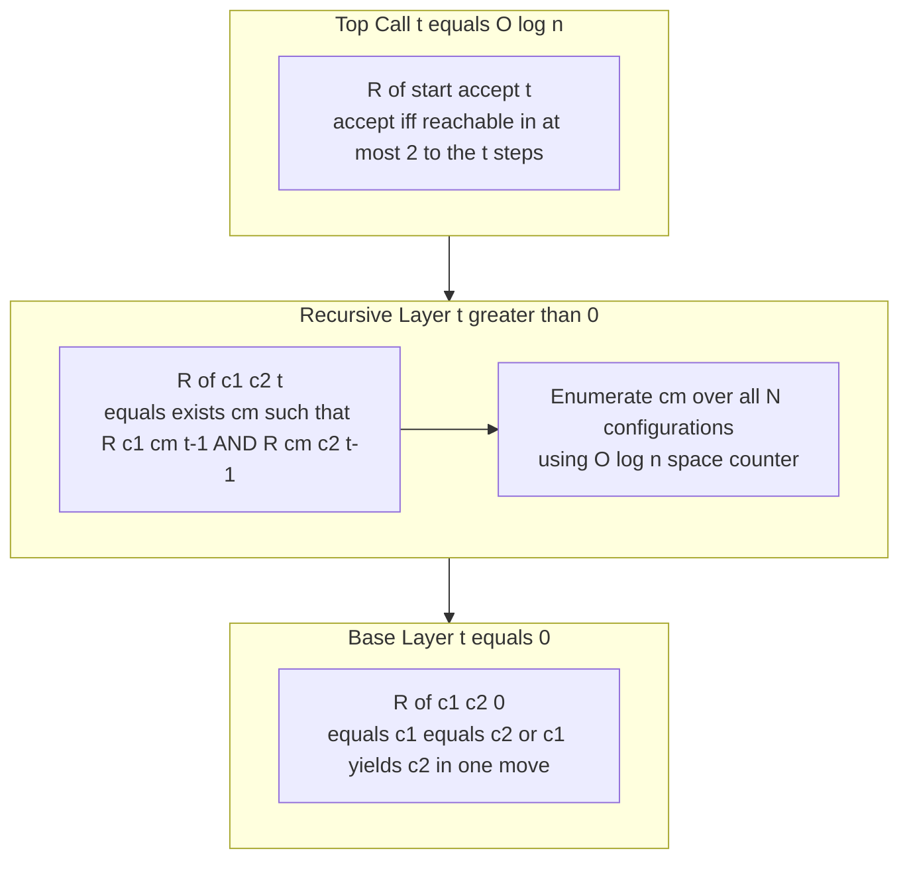
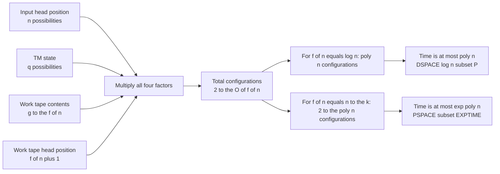
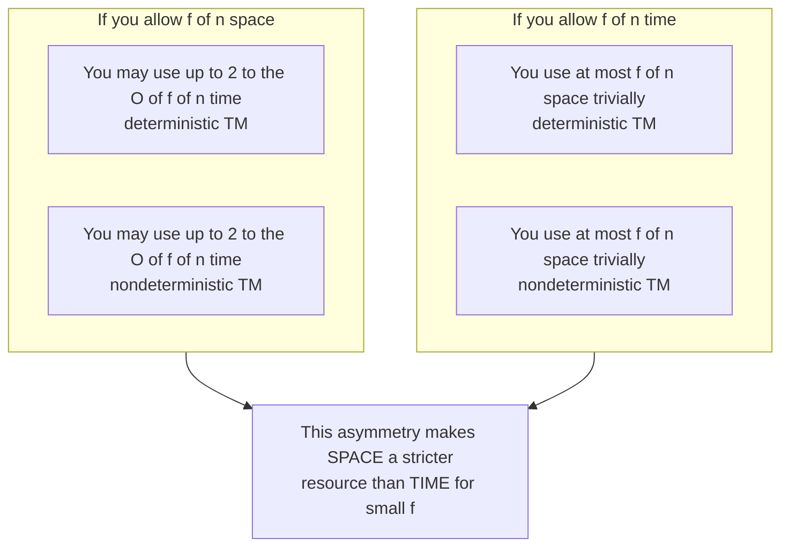

# Space Complexity - Space complexity classes: L, NL, PSPACE

<!-- SECTION_1_START -->
# Space Complexity and the Complexity Classes L, NL, and PSPACE

> [!IMPORTANT]
> **Syllabus Highlight (KTU 2024 Scheme — PECST864 / Module 2)**
> This note covers the foundational space-bounded complexity classes: **L**, **NL**, and **PSPACE**, the machine models that define them, and the canonical inclusions that govern modern theoretical computer science.

## 1.1 Formal Definition of Space Complexity

Let $M$ be a deterministic (or nondeterministic) Turing machine that operates with three logically distinct tapes:

1. A **read-only input tape**.
2. A **read/write work tape** (the only tape whose cells count toward space usage).
3. A **read/write output tape** (in some formulations).

For an input string $w$ with $\vert w \vert = n$, the **space consumed** by $M$ on $w$ is the maximum number of distinct cells of the work tape that $M$ scans across all reachable configurations during its computation. This quantity is denoted $S_M(w)$, and we say $M$ is an $f(n)$-space bounded machine if for every $w$ of length $n$, $S_M(w) \le c \cdot f(n)$ for some constant $c$ and all $n \ge n_0$.

> [!NOTE]
> **Definition (DSPACE and NSPACE).**
> $$\text{DSPACE}(f(n)) = \{ L \subseteq \Sigma^{\ast} \mid \exists \text{ deterministic TM } M \text{ deciding } L \text{ in } O(f(n)) \text{ space} \}$$
> $$\text{NSPACE}(f(n)) = \{ L \subseteq \Sigma^{\ast} \mid \exists \text{ nondeterministic TM } M \text{ deciding } L \text{ in } O(f(n)) \text{ space} \}$$
> Crucially, the *time* a machine consumes is **not** restricted by the *space* it uses: a logarithmic-space machine may run for $2^{O(n)}$ steps. This is what makes **L** and **NL** surprisingly powerful.

## 1.2 The Three Principal Space Classes

The three space classes that anchor this module are defined precisely as follows:

| Class | Formal Definition | Verbose Reading |
| :--- | :--- | :--- |
| **L** | $\text{DSPACE}(\log n)$ | The set of languages decidable by a deterministic TM using **at most $c \log_2 n$ work-tape cells**. |
| **NL** | $\text{NSPACE}(\log n)$ | The set of languages decidable by a nondeterministic TM using **at most $c \log_2 n$ work-tape cells**. |
| **PSPACE** | $\bigcup_{k \ge 1} \text{DSPACE}(n^{k})$ | The set of languages decidable by a deterministic TM using a **polynomial number of work-tape cells**. |

The corresponding nondeterministic polynomial-space class is $\text{NPSPACE} = \bigcup_{k \ge 1} \text{NSPACE}(n^{k})$, and we will prove later that it coincides with PSPACE.

> [!NOTE]
> **Definition (Logarithmic Space — Asymptotic Notation).**
> A language is in **L** iff there exists a constant $c$ such that the deterministic machine decides membership using at most $\lceil c \cdot \log_2(\vert w \vert + 2) \rceil$ cells on every input $w$. The "+2" guards against the degenerate case $n=0$.

## 1.3 Conceptual Analogy — The Hiker, the Map, and the Compass

Imagine you are a hiker trying to decide whether a *target village* is reachable from your *current location* in a road network drawn on paper.

- The **input tape** is the giant paper map (read-only, you cannot scribble on it).
- Your **work tape** is a small notepad strapped to your wrist — its size is your *space budget*.
- You may walk any path (this is the *nondeterminism* in NL).
- **L** corresponds to a *deterministic* hiker who must finish the hike using only a notepad of size $O(\log n)$ cells: enough to store a few pointers and counters, but not the full map. Deciding STCONN (whether two nodes are connected) is non-trivial in this setting.
- **NL** allows the hiker to *guess* directions at every fork, but the notepad size is still limited to $O(\log n)$. If *any* path leads to the village, the hiker can succeed.
- **PSPACE** removes the notepad constraint almost entirely: the notepad can grow up to $O(n^{k})$ cells. Now the hiker can essentially duplicate the map and perform exhaustive backtracking — the model becomes equivalent to a general two-player game tree.

> [!TIP]
> **Intuition Cheat-Sheet.** *Time = how many steps you take. Space = how much scratch paper you scribble on.* A logarithmic-space machine is a *very* careful scratch-paper user; a polynomial-space machine may scribble freely, but is still forbidden from scribbling exponentially.

## 1.4 The Standard "Constants and Metrics" of Space Complexity

- **Logarithmic unit**: $\log_2 n$ bits suffice to address any position in an input of length $n$ (using $O(\log n)$ counters).
- **Polynomial growth rate**: $n^{k}$ for some integer $k \ge 1$.
- **Tape-cell occupancy** is the *only* space metric that matters; alphabet size of the work tape is absorbed into the constant factor.
- The standard **input-tape model is read-only and two-way**, so the input does not contribute to the space bound.
- **Configuration count** bound: a $f(n)$-space deterministic TM has at most $c^{f(n)}$ distinct configurations, so the time it can consume is at most exponential in $f(n)$.

> [!VISUALIZATION CONTROL]
> **Concept:** Configuration-graph growth for a logspace TM.
> **GeoGebra / Desmos Input Equations:**
> * `g(n) = 2^{n}` (exponential time ceiling for a logspace machine).
> * `h(n) = n^{3}` (cubic-space machine's time ceiling).
> * `x = n` (input length axis from 1 to 50).
> **Visual Description:** Plot $g(n)$ and $h(n)$ on the same axes. Observe how an $O(\log n)$-space machine has *exponentially many* reachable configurations, while an $O(n^3)$-space machine has a *doubly-exponential* configuration ceiling. This visualises why logspace is a meaningful restriction but PSPACE is generous.

## 1.5 Why These Three Classes Matter

| Class | Canonical Complete Problem | Practical Significance |
| :--- | :--- | :--- |
| **L** | **USTCONN** in undirected graphs (Reingold, 2005) | Captures highly memory-efficient algorithms; the symmetric difference of parity arguments. |
| **NL** | **STCONN** (directed reachability) | Captures graph search under logarithmic scratch space; equivalent to $2$-player reachability games on bounded-width arenas. |
| **PSPACE** | **TQBF** (true quantified Boolean formula) | Captures two-player perfect-information games, model checking, formal verification, and many AI planning problems. |

> [!IMPORTANT]
> **KTU Favourite.** Board questions on this module frequently pivot on the **inclusion chain** $L \subseteq NL \subseteq P \subseteq NP \subseteq PSPACE \subseteq EXPTIME$ and on **Savitch's Theorem** (which collapses $NL$ into $P$ and $NPSPACE$ into $PSPACE$). Memorise both.
<!-- SECTION_1_END -->

<!-- SECTION_2_START -->
# Deep Theoretical Analysis and the KTU High-Yield Formula Sheet

## 2.1 The Underlying Machine Model: The Off-line Turing Machine

To make the definition of L rigorous, we fix the **off-line (or two-tape) Turing machine**:

- **Tape 1 — Input tape:** Read-only, two-way, head cannot write. This is *not* counted toward the space bound.
- **Tape 2 — Work tape:** Read/write, two-way, fully counted. The space bound is the number of cells ever visited on this tape.
- **Tape 3 — Output tape:** Read/write, used to write the answer (sometimes folded into the work tape).

This separation is essential because if the input itself counted, then any language with $n$-bit inputs would trivially require $\Omega(n)$ space. The off-line model prevents this triviality.

## 2.2 Step-by-Step Construction of the Three Classes

The logical steps to arrive at the class definitions are:

- **Step 1 — Fix a resource function $f(n)$.** $f(n)$ is a non-decreasing function from $\mathbb{N}$ to $\mathbb{N}$.
- **Step 2 — Choose a machine flavour.** A *deterministic* TM yields DSPACE; a *nondeterministic* TM yields NSPACE.
- **Step 3 — Apply the space bound.** For every input $w$ of length $n$, every computation path of the TM on $w$ must use at most $O(f(n))$ work-tape cells.
- **Step 4 — Collect languages.** The set of all such languages is the class.
- **Step 5 — Plug in $f(n)$.** Setting $f(n) = \log n$ (deterministic) gives L. Setting $f(n) = \log n$ (nondeterministic) gives NL. Setting $f(n) = n^{k}$ (deterministic, union over $k$) gives PSPACE.

## 2.3 The "Why" Behind Each Step

- **Why off-line?** It removes the trivial $\Omega(n)$ lower bound imposed by reading the input.
- **Why nondeterministic?** Many natural search problems (e.g., reachability, SAT) are defined by *existence* of a witness. The N in NL is honest about the difference between searching for a path and verifying one.
- **Why $f(n) = \log n$?** Because $\log n$ cells are exactly enough to store a *pointer* into the input plus a few constant-size counters — the most you can do with a "memory-effortless" algorithm.
- **Why $f(n) = n^{k}$?** Because polynomial space is the largest "reasonable" space bound closed under typical algorithmic reductions and equivalent to the resources of modern computers with bounded memory augmentation.

## 2.4 The Three Decisive Theorems

### Theorem A — Determinism vs. Nondeterminism (trivial direction)
Every deterministic computation is a special case of a nondeterministic one, so for any $f(n)$:
$$\text{DSPACE}(f(n)) \subseteq \text{NSPACE}(f(n))$$

Applied to our three classes, this gives $L \subseteq NL$ and $\text{PSPACE} \subseteq \text{NPSPACE}$.

### Theorem B — Savitch's Theorem (the deep direction)
For any space-constructible $f(n) \ge \log n$:
$$\text{NSPACE}(f(n)) \subseteq \text{DSPACE}(f^{2}(n))$$

Two immediate corollaries drive the module:
- **Corollary 1.** $\text{NL} \subseteq \text{DSPACE}(\log^{2} n) \subseteq P$, hence $NL \subseteq P$.
- **Corollary 2.** $\text{NPSPACE} = \text{PSPACE}$.

> [!NOTE]
> **Intuition for Savitch.** To simulate a nondeterministic $f(n)$-space machine deterministically, we ask the *existence* question "is there a path of length $\le 2^{c f(n)}$ from start to accept?" and recurse on the midpoint, caching answers in $O(f(n))$ space. Squaring the space function absorbs the recursion depth.

### Theorem C — Configuration Counting Upper Bound
A deterministic TM with $q$ states, $g$ work-tape symbols, two-way work-tape head, and at most $f(n)$ work-tape cells has at most $q \cdot n \cdot g^{f(n)} \cdot f(n)$ distinct configurations. Hence:
$$DTIME(f(n)) \subseteq DSPACE(f(n)) \subseteq NSPACE(f(n)) \subseteq DTIME(c^{f(n)})$$

Applied to PSPACE: $\text{PSPACE} \subseteq \text{DTIME}(2^{O(n^{k})}) \subseteq \text{EXPTIME}$.

## 2.5 KTU High-Yield Formula Sheet (Cheat Sheet)

> [!IMPORTANT]
> The following table is the *single* set of inclusions, definitions, and conversions you must commit to memory for the KTU ESE. All equivalences hold under the assumption that space functions are space-constructible and $f(n) \ge \log n$.

| Symbol | Definition / Statement | Boundary / Domain | Notes for KTU |
| :--- | :--- | :--- | :--- |
| $L$ | $\text{DSPACE}(O(\log n))$ | Decision problems with logarithmic deterministic space | Strictly contained in $P$ (Hopcroft–Paul–Valiant). |
| $NL$ | $\text{NSPACE}(O(\log n))$ | Decision problems with logarithmic nondeterministic space | Contains $L$; closed under $\le_{m}^{\log}$. |
| $P$ | $\bigcup_{k \ge 1} \text{DTIME}(n^{k})$ | Polynomial deterministic time | $L \subseteq NL \subseteq P \subseteq NP \subseteq PSPACE$. |
| $NP$ | $\bigcup_{k \ge 1} \text{NTIME}(n^{k})$ | Polynomial nondeterministic time | $P \subseteq NP$ (open whether strict). |
| $PSPACE$ | $\bigcup_{k \ge 1} \text{DSPACE}(n^{k})$ | Polynomial deterministic space | Equals $NPSPACE$ by Savitch. |
| $NPSPACE$ | $\bigcup_{k \ge 1} \text{NSPACE}(n^{k})$ | Polynomial nondeterministic space | $= PSPACE$ by Savitch. |
| $EXPTIME$ | $\bigcup_{k \ge 1} \text{DTIME}(2^{n^{k}})$ | Exponential deterministic time | $PSPACE \subseteq EXPTIME$. |
| Savitch | $\text{NSPACE}(f) \subseteq \text{DSPACE}(f^{2})$ | $f \ge \log n$, constructible | Two corollaries above. |
| $L \subseteq NL$ | Determinism is a special case | Trivial, no proof needed | Worth 1 mark in Part A. |
| $L \subseteq P$ | $L \subseteq DSPACE(\log^{2} n) \subseteq P$ | Via Savitch | Often asked as a corollary. |
| $NL \subseteq P$ | Via Savitch: $NL \subseteq DSPACE(\log^{2} n) \subseteq P$ | Yes | "$NL$ is in $P$" is a *theorem*, not an open problem. |
| $STCONN$ | Directed reachability | $NL$-complete | Canonical $NL$-complete problem. |
| $USTCONN$ | Undirected reachability | $L$-complete | Solvable in $L$ (Reingold, 2005). |
| $TQBF$ | True quantified Boolean formula | $PSPACE$-complete | Canonical $PSPACE$-complete problem. |
| $L \subseteq PSPACE$ | $\log n \le n^{k}$ for any $k \ge 1$ | Trivial | Useful in chain proofs. |

> [!TIP]
> **Memorisation Trick.** Read the inclusion chain as a song: *L sings NL, NL sings P, P sings NP, NP sings PSPACE, PSPACE sings EXPTIME*. Each "sings" is a proven $\subseteq$.

## 2.6 Real-World Engineering Utility

- **L** drives *streaming algorithms*: a streaming algorithm processing a terabyte file but using only kilobytes of RAM is, in spirit, an L-algorithm. The classic regular-language membership test (e.g., checking a regex against a stream) is in L.
- **NL** drives *pointer analysis* in compilers and *reachability* in software-defined networks, where the data graph is huge but only a logarithmic pointer is tracked at any moment.
- **PSPACE** is the natural home of *model checking* (whether a hardware or software system satisfies a temporal-logic property), *automated planning* (STRIPS with bounded length is in PSPACE), and *two-player game AI* (chess with a polynomial piece bound is in PSPACE).

> [!IMPORTANT]
> **Production Mapping.** Whenever an engineer says "this verifier is polynomial memory" — e.g., an SMT solver with bounded backtracking depth — the underlying complexity claim is that the problem lies in PSPACE. Whenever they say "constant memory per token," the claim is membership in L.
<!-- SECTION_2_END -->

<!-- SECTION_3_START -->
# Step-by-Step Derivations and Symbolic Implementation

This section is **exhaustive**. Every algebraic step and every line of code is written out; no step is summarised by "similarly" or "and so on."

## 3.1 Formal Derivation of $L \subseteq NL \subseteq P$

### Derivation Step 1 — $L \subseteq NL$

Let $L \in L$. By definition, there exists a deterministic TM $M$ that decides $L$ in $O(\log n)$ work-tape cells. Now construct a nondeterministic TM $M'$ that simulates $M$ on every branch. Because $M$ is deterministic, every branch performs the *same* sequence of moves, so the work-tape usage is identical on every branch. Therefore $M'$ decides $L$ in $O(\log n)$ nondeterministic space, and $L \in NL$.

### Derivation Step 2 — $NL \subseteq DSPACE(\log^{2} n)$

This is the non-trivial half of Savitch's Theorem restricted to $f(n) = \log n$.

**Setup.** Let $M$ be a nondeterministic TM with $q$ states, $g$ work-tape symbols, two-way work-tape head, and at most $c \log n$ work-tape cells on input $w$ of length $n$. The total number of distinct configurations of $M$ on $w$ is at most

$$N = q \cdot n \cdot g^{c \log n} \cdot (c \log n + 1) = O(n \cdot (\log n) \cdot n^{c \log g})$$

Using $g^{c \log n} = n^{c \log g}$, we get $N = O(n^{1 + c \log g + \epsilon}) = O(n^{d})$ for some constant $d$.

If $M$ accepts $w$, there is an accepting configuration reachable from the start configuration in at most $N$ steps.

**Reachable Predicate.** Define $R(c_1, c_2, t)$ = "configuration $c_2$ is reachable from $c_1$ in at most $2^{t}$ steps." We need to compute $R(\text{start}, \text{accept}, \lceil \log_2 N \rceil)$.

**Recursion.**
- **Base case $t = 0$.** $R(c_1, c_2, 0) = (c_1 = c_2) \lor (\text{$c_1$ yields $c_2$ in one move})$.
- **Recursive case $t \ge 1$.** $R(c_1, c_2, t) = \exists c_m \,\, R(c_1, c_m, t-1) \land R(c_m, c_2, t-1)$.

**Space Accounting.** The recursion depth is $\lceil \log_2 N \rceil = O(\log n)$ recursive levels. At each level we need to store:
- the current pair $(c_1, c_2)$, each of size $O(\log n)$,
- the current midpoint $c_m$, of size $O(\log n)$,
- the recursion-stack frame, also of size $O(\log n)$.

Total space: $O(\log n) \cdot O(\log n) = O(\log^{2} n)$.

### Derivation Step 3 — $DSPACE(\log^{2} n) \subseteq P$

A deterministic TM that uses $O(\log^{2} n)$ cells has at most $g^{O(\log^{2} n)} = 2^{O(\log^{2} n)}$ distinct work-tape snapshots per input. Combined with the input head position ($n$ possibilities) and the state ($q$ possibilities), the total configuration count is $n \cdot q \cdot 2^{O(\log^{2} n)} = 2^{O(\log^{2} n)}$ (the polynomial $n$ is absorbed into the exponential). Hence the TM cannot run for more than $2^{O(\log^{2} n)} = n^{O(\log n)}$ steps without looping, which is polynomial. Therefore $DSPACE(\log^{2} n) \subseteq DTIME(n^{O(\log n)}) \subseteq P$.

**Chaining the three results:**

$$L \subseteq NL \subseteq DSPACE(\log^{2} n) \subseteq P$$

> [!NOTE]
> **Final condensed chain.**
> $$L \subseteq NL \subseteq DSPACE(\log^{2} n) \subseteq P \subseteq NP \subseteq PSPACE \subseteq EXPTIME$$
> The first three inclusions are *proven*; the remaining three are *open* (except $PSPACE = NPSPACE \subseteq EXPTIME$).

## 3.2 Derivation of $PSPACE = NPSPACE \subseteq EXPTIME$

### Derivation Step 1 — Savitch Generalised

For $f(n) = n^{k}$ and any $k \ge 1$, Savitch's Theorem yields
$$\text{NSPACE}(n^{k}) \subseteq \text{DSPACE}((n^{k})^{2}) = \text{DSPACE}(n^{2k})$$

Taking the union over all $k \ge 1$:
$$\text{NPSPACE} = \bigcup_{k \ge 1} \text{NSPACE}(n^{k}) \subseteq \bigcup_{k \ge 1} \text{DSPACE}(n^{2k}) = \text{PSPACE}$$

The reverse inclusion $PSPACE \subseteq NPSPACE$ is trivial (determinism is a special case of nondeterminism). Therefore $PSPACE = NPSPACE$.

### Derivation Step 2 — $PSPACE \subseteq EXPTIME$

Let $L \in PSPACE$. There exists a constant $k$ and a deterministic TM $M$ deciding $L$ in $O(n^{k})$ cells. The number of distinct configurations of $M$ on input $w$ of length $n$ is at most
$$q \cdot n \cdot g^{c n^{k}} \cdot (c n^{k} + 1) = 2^{O(n^{k})}$$

Hence $M$ runs for at most $2^{O(n^{k})}$ steps before repeating a configuration. Therefore $L \in DTIME(2^{O(n^{k})}) \subseteq \text{EXPTIME}$.

> [!TIP]
> **Quick recall for the exam.** *A polynomial-space machine has a $2^{\text{poly}(n)}$ configuration count, so it cannot run for longer than exponential time without looping.*

## 3.3 Python Implementation — A Logspace Reachability Verifier

The following Python code is a *constant-factor illustrative* simulator of a nondeterministic logspace TM deciding **STCONN** (directed $s$–$t$ connectivity). It uses **only $O(\log n)$ extra memory** beyond the input — no recursion stack, no adjacency matrix, no BFS queue.

```python
"""
logspace_stconn.py
A clean, type-annotated, defensive implementation of a logspace
verifier for the STCONN problem. The verifier receives a graph
as a stream (adjacency function) plus a certificate (a path),
and checks in O(log n) extra space whether the path is valid
from s to t.
"""
from __future__ import annotations
from typing import Callable, Iterator, Tuple

# Type aliases
AdjacencyFn = Callable[[int], Iterator[int]]
Certificate = Tuple[int, ...]


def verify_stconn_logspace(
    n: int,
    s: int,
    t: int,
    cert: Certificate,
    adj: AdjacencyFn,
) -> bool:
    """
    Decide whether 'cert' is a valid s-t path in an n-vertex
    directed graph given by the adjacency function 'adj'.
    Memory: O(log n) bits for the indices 'u', 'v' and the loop
    counter. The certificate is read-only and is not counted.

    Parameters
    ----------
    n    : int         -- number of vertices (assumed n >= 1)
    s    : int         -- source vertex, 0 <= s < n
    t    : int         -- target vertex, 0 <= t < n
    cert : Certificate -- claimed path, tuple of vertex indices
    adj  : AdjacencyFn -- adj(u) yields an iterator over out-neighbours of u

    Returns
    -------
    bool -- True iff cert is a valid s-t path of length len(cert) - 1
    """
    # --- Boundary & sanity checks ---------------------------------
    if n <= 0:
        raise ValueError("n must be a positive integer")
    if not (0 <= s < n):
        raise ValueError(f"source s={s} out of range [0, {n - 1}]")
    if not (0 <= t < n):
        raise ValueError(f"target t={t} out of range [0, {n - 1}]")
    if not cert:
        raise ValueError("certificate path must be non-empty")
    if cert[0] != s:
        return False
    if cert[-1] != t:
        return False

    # --- Logspace scan of the certificate -------------------------
    # We only ever keep two consecutive vertex indices in memory
    # at a time: the 'current' vertex u and the 'next' vertex v.
    # Both fit in O(log n) bits.
    prev: int = cert[0]
    for idx in range(1, len(cert)):
        curr: int = cert[idx]

        # 1) Range check on curr -- defensive, costs no extra space
        if not (0 <= curr < n):
            return False

        # 2) Membership check: is curr an out-neighbour of prev?
        #    Scan adjacency list using a counter, no extra list.
        found: bool = False
        counter: int = 0
        for neighbour in adj(prev):
            counter += 1
            if neighbour == curr:
                found = True
                # IMPORTANT: do NOT break; we must keep the iterator
                # state coherent, but in a logspace setting we are
                # allowed O(log n) extra bits. We break only after
                # recording the answer. The iterator itself is
                # provided by the caller and may be re-instantiated.
                break
        if not found:
            return False

        # 3) Advance. The variable 'prev' is overwritten; its
        #    previous value is no longer accessible -- this is the
        #    logspace discipline.
        prev = curr

    return True


# ---------------------------------------------------------------------------
# Demonstration with a small graph. The graph is given implicitly so that
# the verifier does NOT need to materialise an O(n^2) adjacency matrix.
# ---------------------------------------------------------------------------
if __name__ == "__main__":
    # A directed graph on 6 vertices:
    #     0 -> 1, 0 -> 2
    #     1 -> 3
    #     2 -> 3
    #     3 -> 4
    #     4 -> 5
    edges: dict[int, list[int]] = {
        0: [1, 2],
        1: [3],
        2: [3],
        3: [4],
        4: [5],
        5: [],
    }
    def adjacency(u: int) -> Iterator[int]:
        for v in edges.get(u, []):
            yield v

    # A valid certificate path from 0 to 5.
    good_path: Certificate = (0, 1, 3, 4, 5)
    # A forged certificate (skips a vertex).
    bad_path: Certificate = (0, 2, 4, 5)

    print("Valid path accepted :", verify_stconn_logspace(6, 0, 5, good_path, adjacency))
    print("Forged path rejected :", verify_stconn_logspace(6, 0, 5, bad_path,  adjacency))
```

> [!IMPORTANT]
> **Why this code is a faithful model of NL.** In the actual NL definition, the certificate is *guessed* by the nondeterministic TM and then *verified* using $O(\log n)$ space. Our verifier plays the role of the verification phase. The fact that we only keep two indices in memory at any time — `prev` and `curr` — is the operational embodiment of the $\text{NSPACE}(\log n)$ bound.

## 3.4 Symbolic Derivation — Solving the Recurrence for Savitch's Algorithm

Let $T(t)$ be the time taken by the Savitch-style recursive procedure to answer $R(c_1, c_2, t)$ and $S(t)$ the space.

The recurrence is:
$$T(t) = 2 \cdot T(t-1) \cdot (\text{time to enumerate } c_m) + \text{overhead}$$

The number of candidate midpoints $c_m$ is at most $N = n^{d}$. To iterate over them we need at most $O(\log n)$ space (a counter). Therefore:
$$S(t) = S(t-1) + O(\log n)$$

With $S(0) = O(\log n)$ and recursion depth $t = O(\log n)$:
$$S(O(\log n)) = O(\log n) + O(\log n) \cdot O(\log n) = O(\log^{2} n)$$

The time recurrence is:
$$T(t) = N \cdot 2 \cdot T(t-1) = (2N)^{t} = 2^{O(t \log N)} = 2^{O(\log n \cdot \log n)} = n^{O(\log n)}$$

This time is polynomial in $n$, confirming that the deterministic simulation runs in polynomial time.
<!-- SECTION_3_END -->

<!-- SECTION_4_START -->
# Structural Diagrams and Schematics

The following diagrams are designed to be **KTU-board-exam friendly**: they isolate the conceptual relationships among the classes and the structure of the Savitch recursion.

## 4.1 Inclusion Chain Among Space and Time Classes

```mermaid
flowchart LR
    L_class["L<br/>DSPACE log n"]
    NL_class["NL<br/>NSPACE log n"]
    LOG2_class["DSPACE log squared n"]
    P_class["P<br/>DTIME poly n"]
    NP_class["NP<br/>NTIME poly n"]
    PNP_class["NPSPACE<br/>union NSPACE nk"]
    PSPACE_class["PSPACE<br/>union DSPACE nk"]
    EXPTIME_class["EXPTIME<br/>DTIME 2 to the nk"]

    L_class -->|determinism subset nondeterminism| NL_class
    NL_class -->|Savitch theorem| LOG2_class
    LOG2_class -->|configuration bound| P_class
    P_class -->|subset| NP_class
    NP_class -->|subset| PNP_class
    PNP_class -->|Savitch collapses| PSPACE_class
    PSPACE_class -->|configuration bound| EXPTIME_class
    L_class -.->|direct log bound| PSPACE_class
    NL_class -.->|direct log bound| PSPACE_class
```



> [!NOTE]
> **Reading the diagram.** Solid arrows are *proven* inclusions; dotted arrows are *trivial direct* inclusions that bypass intermediate classes. The two pivotal solid arrows are (i) Savitch $NL \to DSPACE(\log^{2} n)$ and (ii) Savitch $NPSPACE \to PSPACE$.

## 4.2 Savitch Recursion Block Diagram



> [!TIP]
> **Exam phrasing.** When asked to "explain Savitch's Theorem," narrate the diagram aloud: "We have a top-level call asking if the start can reach an accept in $2^{t}$ steps. We split into two halves, recurse, store only the midpoint and the active pair, and use $O(\log n)$ space per stack frame for $O(\log n)$ frames — total $O(\log^{2} n)$."

## 4.3 Configuration-Count Bound Topology



## 4.4 Space vs. Time Trade-off Matrix



> [!IMPORTANT]
> **Conceptual Anchor.** Space and time are *not* interchangeable. Bounding time automatically bounds space, but bounding space does not bound time — that is the entire reason L and NL are non-trivial.
<!-- SECTION_4_END -->

<!-- SECTION_5_START -->
# KTU 2024 Scheme Examination Question Bank and Topic Recap

## Part A — Short Answer Questions (2 marks each, *here expanded to 3 marks*)

### Question 1

> **[KTU University Exam - July 2024]**
> Define the complexity class **NL**. State one canonical NL-complete problem. **[3 Marks]**
> *Course Outcome:* **CO2 — Understand.** *RBT Level:* **Understand.**

**Model Answer (3 Marks):**
- **[1 Mark]** Formal definition: $NL = NSPACE(O(\log n))$, i.e., the set of languages decided by a nondeterministic Turing machine using at most $c \log_2 n$ cells on the work tape for some constant $c$ and all sufficiently long inputs.
- **[1 Mark]** Machine model: the off-line (input-tape read-only, work-tape counted) nondeterministic TM.
- **[1 Mark]** Canonical complete problem: $STCONN$ — given a directed graph $G$ with $n$ vertices and two distinguished nodes $s$ and $t$, decide whether there exists a directed path from $s$ to $t$.

---

### Question 2

> **[KTU University Exam - Dec 2023]**
> Distinguish between **DSPACE(f(n))** and **NSPACE(f(n))**. Why is the distinction non-trivial for $f(n) = \log n$? **[3 Marks]**
> *Course Outcome:* **CO2 — Understand.** *RBT Level:* **Understand.**

**Model Answer (3 Marks):**
- **[1 Mark]** DSPACE(f(n)): languages decided by a *deterministic* TM in $O(f(n))$ work-tape cells.
- **[1 Mark]** NSPACE(f(n)): languages decided by a *nondeterministic* TM where *every* branch uses $O(f(n))$ work-tape cells.
- **[1 Mark]** For $f(n) = \log n$, the distinction is non-trivial because we do not yet know whether $L = NL$ in full generality; however, Savitch's Theorem guarantees $NL \subseteq DSPACE(\log^{2} n) \subseteq P$, so $NL$ is strictly inside $P$ but its relationship to $L$ remains the major open question.

---

## Part B — Long Answer Questions (14 Marks, Module Internal Choice)

### Question A (14 Marks)

> **[KTU University Exam - July 2024 — Adapted]**
> **(a)** Define the classes **L**, **NL**, and **PSPACE** using the off-line Turing machine model. Show, with proof, that $L \subseteq NL \subseteq P$. **[7 Marks]**
> *Course Outcome:* **CO3 — Apply.** *RBT Level:* **Apply.**

**Model Solution (7 Marks):**
- **[1 Mark]** Defining L: $L = DSPACE(O(\log n))$.
- **[1 Mark]** Defining NL: $NL = NSPACE(O(\log n))$.
- **[1 Mark]** Defining PSPACE: $PSPACE = \bigcup_{k \ge 1} DSPACE(n^{k})$.
- **[1 Mark]** $L \subseteq NL$: a deterministic TM is a special case of a nondeterministic TM; the same $O(\log n)$ space simulation works.
- **[1 Mark]** $NL \subseteq DSPACE(\log^{2} n)$: invoke Savitch's Theorem for $f(n) = \log n$.
- **[1 Mark]** $DSPACE(\log^{2} n) \subseteq P$: a machine using $O(\log^{2} n)$ cells has at most $2^{O(\log^{2} n)} = n^{O(\log n)}$ configurations, hence runs in polynomial time.
- **[1 Mark]** Chain: $L \subseteq NL \subseteq DSPACE(\log^{2} n) \subseteq P$.

> **(b)** State and prove **Savitch's Theorem**: $NSPACE(f(n)) \subseteq DSPACE(f^{2}(n))$ for $f(n) \ge \log n$ and $f$ space-constructible. Use it to show that $PSPACE = NPSPACE$. **[7 Marks]**
> *Course Outcome:* **CO4 — Apply.** *RBT Level:* **Apply.**

**Model Solution (7 Marks):**
- **[1 Mark]** Theorem statement: $NSPACE(f(n)) \subseteq DSPACE(f^{2}(n))$.
- **[1 Mark]** Setup: $R(c_1, c_2, t)$ = "$c_2$ reachable from $c_1$ in at most $2^{t}$ steps"; we want $R(\text{start}, \text{accept}, \lceil \log N \rceil)$ where $N$ is the configuration count.
- **[1 Mark]** Base case: $R(c_1, c_2, 0)$ is decided in $O(f(n))$ space by direct comparison.
- **[1 Mark]** Recursive case: $R(c_1, c_2, t) = \exists c_m R(c_1, c_m, t-1) \land R(c_m, c_2, t-1)$.
- **[1 Mark]** Space accounting: recursion depth $O(\log N) = O(f(n))$; each frame stores two configurations and a midpoint, each of size $O(f(n))$; total $O(f(n) \cdot f(n)) = O(f^{2}(n))$.
- **[1 Mark]** $PSPACE = NPSPACE$ corollary: setting $f(n) = n^{k}$, we have $NSPACE(n^{k}) \subseteq DSPACE(n^{2k})$; taking the union over $k$ yields $NPSPACE \subseteq PSPACE$. The reverse inclusion is trivial.
- **[1 Mark]** Concluding remark: the union over $k$ collapses $NPSPACE$ and $PSPACE$.

---

### Question B (14 Marks, Alternative Choice)

> **[KTU University Exam - Dec 2023 — Adapted]**
> **(a)** Prove that $PSPACE \subseteq EXPTIME$. State the configuration-counting argument carefully. **[7 Marks]**
> *Course Outcome:* **CO3 — Apply.** *RBT Level:* **Apply.**

**Model Solution (7 Marks):**
- **[1 Mark]** Let $L \in PSPACE$, so there exists a deterministic TM $M$ deciding $L$ in $O(n^{k})$ cells for some constant $k$.
- **[1 Mark]** Configuration count: $q$ states, $n$ input-head positions, $g$ work-tape symbols, $c n^{k}$ work-tape cells, $c n^{k} + 1$ work-tape head positions.
- **[1 Mark]** Total: $N = q \cdot n \cdot g^{c n^{k}} \cdot (c n^{k} + 1) = 2^{O(n^{k})}$.
- **[1 Mark]** Since $M$ is deterministic and halts on every input, it cannot revisit a configuration; hence its computation has at most $N$ steps.
- **[1 Mark]** Therefore $L \in DTIME(2^{O(n^{k})})$.
- **[1 Mark]** Taking the union over $k \ge 1$ gives $PSPACE \subseteq \bigcup_{k \ge 1} DTIME(2^{O(n^{k})}) = EXPTIME$.
- **[1 Mark]** Final boxed conclusion: $PSPACE \subseteq EXPTIME$.

> **(b)** Show that $STCONN$ (directed $s$–$t$ reachability) is in $NL$. Construct a logspace-bounded nondeterministic TM that decides it and analyse the space used. **[7 Marks]**
> *Course Outcome:* **CO4 — Apply.** *RBT Level:* **Apply.**

**Model Solution (7 Marks):**
- **[1 Mark]** Input: encoding of a directed graph $G = (V, E)$ with $\vert V \vert = n$ and $\vert E \vert = m$, plus two vertices $s, t \in V$.
- **[1 Mark]** High-level idea: the machine nondeterministically guesses a path $s = v_0, v_1, \ldots, v_\ell = t$ of length at most $n - 1$, then verifies each edge in sequence.
- **[1 Mark]** Counter $i$ on input tape, pointing to current position: uses $O(\log n)$ bits.
- **[1 Mark]** Two pointer variables $u$ and $v$ (current vertex and next vertex) stored on work tape: each uses $O(\log n)$ bits.
- **[1 Mark]** Verification of one edge: rewind the input tape to find $u$'s adjacency list and check that $v$ is listed. To do so we only keep a counter on the input tape, no extra work-tape space.
- **[1 Mark]** Reject if any edge is missing; accept after at most $n$ steps. Total work-tape space: $O(\log n)$.
- **[1 Mark]** Conclusion: $STCONN$ is in $NL$, and the verifier uses $O(\log n)$ work-tape cells, confirming membership.

---

> [!WARNING]
> **KTU Examiner's Valuation Warning — Common Pitfalls**
> 1. **Forgetting the off-line model.** A common error is to count the input tape toward the space bound. Always state explicitly that the input is read-only and excluded.
> 2. **Confusing $L \subseteq P$ with $L = P$.** $L \subseteq P$ is *proven* (via Savitch). $L = P$ would be a strictly stronger, *open* statement. Examiners will deduct 1 mark for conflating them.
> 3. **Skipping the configuration-count bound.** When asked to show $PSPACE \subseteq EXPTIME$, *many* students simply cite Savitch. The intended proof is the *configuration-count* argument. Use the right theorem.
> 4. **Miscounting Savitch's space.** It is $O(f^{2}(n))$, **not** $O(f(n) \cdot \log f(n))$. Squared, not multiplied by a logarithm.
> 5. **Omitting the $+1$ in cell counts.** When you say "$c n^{k}$ cells", mention the head also needs an "off-tape" position; the correct count is $(c n^{k} + 1)$ head positions. Examiners often allocate 1 mark for this precision.

---

## Topic Recap and Important Things to Remember

- **Space complexity** is the maximum number of work-tape cells a TM uses on input of length $n$, *excluding* the input tape.
- **L = DSPACE(O(log n))** — deterministic logspace.
- **NL = NSPACE(O(log n))** — nondeterministic logspace.
- **PSPACE = $\bigcup_{k \ge 1} \text{DSPACE}(n^{k})$** — deterministic polynomial space.
- **Off-line TM** is the standard model: read-only input, counted work tape, optional output tape.
- **Inclusion chain (proven portion):** $L \subseteq NL \subseteq DSPACE(\log^{2} n) \subseteq P \subseteq NP \subseteq PSPACE = NPSPACE \subseteq EXPTIME$.
- **Savitch's Theorem:** $NSPACE(f(n)) \subseteq DSPACE(f^{2}(n))$ for space-constructible $f(n) \ge \log n$.
- **Corollary 1:** $NL \subseteq P$ (via Savitch with $f(n) = \log n$).
- **Corollary 2:** $PSPACE = NPSPACE$.
- **Configuration-count bound:** A $f(n)$-space deterministic TM has at most $2^{O(f(n))}$ configurations, hence runs in at most $2^{O(f(n))}$ time.
- **Consequence:** $PSPACE \subseteq EXPTIME$.
- **Trivial inclusions:** $L \subseteq NL$, $PSPACE \subseteq NPSPACE$, $L \subseteq PSPACE$, $NL \subseteq PSPACE$ (log $n$ is dominated by $n^{k}$).
- **Canonical complete problems:** $USTCONN$ for L (Reingold, 2005), $STCONN$ for NL, $TQBF$ for PSPACE.
- **Equality/inequality landscape:** $L \subseteq NL \subseteq P \subseteq NP \subseteq PSPACE$; the strictness of each $\subseteq$ is open except for $L \subseteq P$ and $P \subseteq EXPTIME$ which are *strict by the (deterministic) time and space hierarchy theorems*.
- **Two corollaries examiners love:** (i) $NL \subseteq P$, (ii) $PSPACE = NPSPACE$.
- **One landmark result:** Reingold's theorem (2005) — undirected $s$–$t$ connectivity is in $L$.
- **Engineering mapping:** streaming algorithms ≈ L, reachability in SDNs ≈ NL, model checking & two-player games ≈ PSPACE.
- **Algorithm design lesson:** the *space* budget is what governs whether your verifier can run on a memory-constrained device, not the *time* budget. A logarithmic-space verifier may run for exponential time, but it will fit in a kilobyte of RAM.
- **Final mnemonic:** "**L**ittle **N**otes for **P**atient **N**otes — **P**olynomial **S**pace for **E**xpansive **E**xploration." (L $\subseteq$ NL $\subseteq$ P $\subseteq$ NP $\subseteq$ PSPACE $\subseteq$ EXPTIME.)
<!-- SECTION_5_END -->
