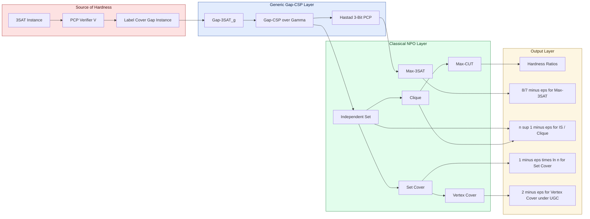
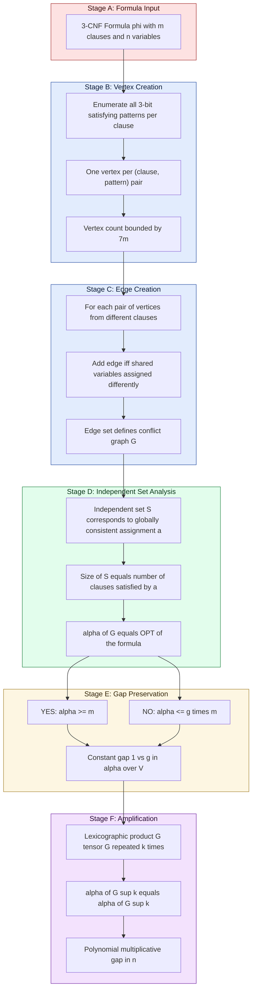

# Applications in hardness of approximation.

<!-- SECTION_1_START -->
# Applications in Hardness of Approximation (PCP Module)

## 1. Core Technical Definition

> [!IMPORTANT]
> **Hardness of Approximation** is a branch of computational complexity that establishes lower bounds on how closely the objective value of an **NP-hard optimization problem** can be estimated by any polynomial-time algorithm, assuming widely believed conjectures such as **P ≠ NP** or the **Unique Games Conjecture (UGC)**.

Formally, given an optimization problem $\Pi$ and a ratio $\rho \geq 1$, we say that $\Pi$ is **hard to approximate within factor $\rho$** if, for every $\epsilon > 0$, no polynomial-time algorithm can, on every instance $I$, output a solution whose cost is within a factor $\rho - \epsilon$ of the optimum, unless a major complexity-theoretic collapse occurs (e.g., $P = NP$).

The foundational machinery behind almost every such result is the **Probabilistically Checkable Proof (PCP) Theorem**, proved in 1992 by Arora, Lund, Motwani, Sudan, and Szegedy, and later re-proved elementarily by Dinur in 2006.

> [!NOTE]
> **PCP Theorem (Classical Form).** $NP = PCP[O(\log n), O(1)]$. Equivalently, every language in $NP$ has a verifier that, on input $x \in \{0,1\}^n$, uses $r = O(\log n)$ random bits, queries only a **constant** number $q$ of proof bits, and decides correctly with completeness $c$ and soundness $s < c$.

For hardness of approximation, the relevant reformulation is the **PCP of Proximity** and the **Gap-Problem** view:

> [!IMPORTANT]
> **Gap-CSP$_\Gamma$ (decision version).** Given a constraint satisfaction problem over a fixed constraint language $\Gamma$, distinguish the **YES** case (all constraints can be simultaneously satisfied) from the **NO** case (no assignment satisfies more than an $\epsilon$-fraction of the constraints). The *gap* is $1 - s$ where $s$ is the PCP soundness.

---

## Conceptual Analogy / Intuition

Imagine you hire a contractor to renovate your house. You do not have time to inspect every nail and every tile. You ask the contractor for a **photo log** (the *PCP proof*) and you flip a coin $O(\log n)$ times (small randomness) to pick a few **spots to verify** (only $q=3$ bits queried). You wish to certify the entire project is up to code. The astonishing content of the PCP Theorem is that a *constant* number of spot-checks is *enough* to enforce global quality — but only at the price of a small **acceptance gap**.

In hardness of approximation, the dual perspective is used: *adversarial contractors* design CSPs so that either the entire plan is feasible, or no plan satisfies even a $1 - \epsilon$ fraction of the spot-checks. The same picture then *implies* that finding an approximately optimal plan is as hard as solving the problem exactly.

> [!TIP]
> **Geometric Intuition.** On a high-dimensional cube $\{0,1\}^n$, the set of satisfying assignments to a CSP is a *combinatorial surface*. The PCP Theorem says this surface is either a *thick* region (a YES instance) or a *thin* slice of width at most $s$ (a NO instance). A polynomial-time algorithm is then asked to detect thickness — which turns out to be $NP$-hard in the *promise* setting.

---

## 2. Why the PCP Theorem Drives Hardness of Approximation

The logical chain is the following implication sequence:

$$
\text{PCP Theorem} \;\Longrightarrow\; \text{Gap-CSP is NP-hard} \;\Longrightarrow\; \text{Gap problems for specific NPOs}
$$

1. Start with an $NP$-complete language, say **3SAT**.
2. Apply the *PCP encoding* to get a promise problem $\text{Gap-3SAT}_{\epsilon}$ that is $NP$-hard to decide.
3. Apply a *gap-preserving reduction* (e.g., **FGLSS**, **Håstad's 3-bit PCP**, **Raz's parallel repetition**) to map it onto a familiar optimization problem, preserving the gap.
4. The resulting **gap** translates into a multiplicative inapproximability bound on the optimization version.

This single recipe has produced the strongest known lower bounds for problems as diverse as **MAX-3SAT**, **MAX-CUT**, **Independent Set**, **Clique**, **Set Cover**, **Vertex Cover**, **Metric TSP**, and **Steiner Tree**.

---

## Module-Wide Roadmap

The applications discussed in the rest of this note follow this layered structure:

- **Layer 1 — Source of hardness:** the PCP Theorem (or its modern equivalent, **Håstad's 3-Bit PCP**).
- **Layer 2 — Generic vehicle:** Gap-CSP problems over specific alphabets and predicates.
- **Layer 3 — Reductions to classical NPOs:** FGLSS, gap-preserving local reductions, parallel repetition.
- **Layer 4 — Optimal ratios:** matching (or near-matching) upper bounds such as Goemans–Williamson, Lovász $\vartheta$ function, and greedy Set Cover.
- **Layer 5 — Conditional refinements:** the **Unique Games Conjecture (UGC)** of Khot (2002) and its tight inapproximability consequences.

> [!VISUALIZATION CONTROL]
> **Concept:** Trade-off between the number of queries $q$ and the soundness $s$ in a PCP, and how it propagates into an inapproximability ratio.
> **Plot Description (mental / paper sketch):** On the horizontal axis place $q \in \{2, 3, 4, \dots\}$ and on the vertical axis the best achievable soundness $s^*(q)$. The curve is non-increasing. Mark the *milestone points*: $q=2$ gives $s^{*}=1/2$ (Håstad), $q=3$ gives $s^{*}=1/2 + \epsilon$ (Håstad 2001), and as $q \to \infty$ we have $s^{*} \to 0$ (classical PCP). For each point $(q, s^{*})$ on the curve, the resulting inapproximability ratio of MAX-$q$CSP is exactly $1 - s^{*}$.
> **Input Equations:**
> * $s^{*}(q=2) = \tfrac{1}{2}$ (long-code + Fourier)
> * $s^{*}(q=3) = \tfrac{1}{2} + \delta$ for any $\delta > 0$
> * $s^{*}(q) \to 0$ as $q \to \infty$
> **What to observe:** A *single* additional query strictly tightens the achievable inapproximability gap, illustrating why 3-query PCPs already yield nearly optimal MAX-3SAT bounds.
<!-- SECTION_1_END -->

<!-- SECTION_2_START -->
# Deep Theoretical Analysis & KTU High-Yield Formula Sheet

## 2.1 The Two Faces of the PCP Theorem

The PCP Theorem admits two equivalent formulations, each tailored to a downstream use.

### (a) The "Verifier" Form

For every $L \in NP$, there exists a polynomial-time probabilistic verifier $V$ and a polynomial $p$ such that for every $x \in \{0,1\}^n$:

- **Completeness:** $x \in L \;\Rightarrow\; \exists \pi \in \{0,1\}^{p(n)} \text{ with } \Pr_{r \in \{0,1\}^{O(\log n)}}[V^{\pi}(x,r) = 1] = 1$.
- **Soundness:** $x \notin L \;\Rightarrow\; \forall \pi,\; \Pr_{r}[V^{\pi}(x,r) = 1] \leq s < 1$.

The verifier is restricted to make at most $q = O(1)$ queries to $\pi$, where the randomness $r$ has length $r(n) = O(\log n)$.

### (b) The "Gap" Form

There exists a constant $s < 1$ such that the following promise problem **Gap-3SAT$_{1-s}$** is $NP$-hard.

> **Gap-3SAT$_{g}$:** Given a 3-CNF formula $\varphi$, output
> - **YES** if $\varphi$ is satisfiable.
> - **NO** if every assignment satisfies at most a $g$-fraction of the clauses of $\varphi$.

For the original ALMSS theorem, $g = 1 - s$ for some universal constant. Subsequent refinements (Bellare–Goldreich–Sudan; Håstad 2001) push $g$ arbitrarily close to $7/8$ for MAX-3SAT.

---

## 2.2 The Promise-Problem Lattice

The class of optimization problems whose decision versions admit a gap is captured by the class **APX**, with finer subclasses **PTAS**, **FPTAS**, and the closure of the $NP$-hard gap problems under approximation-preserving reductions, the class **NPO-PB** (or the more refined $APX$-completeness notion of Crescenzi–Kann).

Key relationships (all under $P \neq NP$):

$$
FPTAS \subsetneq PTAS \subsetneq APX \subsetneq NPO
$$

A problem in $APX$ has a *constant* approximation ratio that is achievable in polynomial time; a problem $NP$-hard to approximate within some constant $\rho > 1$ is *outside* $APX$.

---

## 2.3 The FGLSS Reduction (Feige–Goldwasser–Lovelasz–Safra–Szegedy, 1991)

This is the workhorse reduction that turns a *gap-CSP* into a *gap-independent-set / gap-clique* problem.

> [!IMPORTANT]
> **Theorem (FGLSS).** If Gap-3SAT$_g$ is $NP$-hard for some $g < 1$, then for every $\epsilon > 0$ it is $NP$-hard to distinguish $n$-vertex graphs $G$ with $\alpha(G) \geq n^{1-\epsilon}$ from graphs with $\alpha(G) \leq n^{\epsilon}$ — equivalently, to approximate Independent Set within $n^{1-2\epsilon}$ or Clique within $n^{1-2\epsilon}$.

The construction is the *constraint graph* (Section 3 walks through it in full).

---

## 2.4 Håstad's Optimal 3-Bit PCP

> [!IMPORTANT]
> **Håstad's Theorem (2001).** For every $\epsilon > 0$, Gap-3SAT$_{7/8 + \epsilon}$ is $NP$-hard. Equivalently, MAX-3SAT is $NP$-hard to approximate within factor $8/7 - \epsilon$.

This is *tight*: a random assignment satisfies $7/8$ of the clauses in expectation, and the derandomized version of this algorithm achieves a $7/8$ approximation, so the bound cannot be improved under $P \neq NP$.

Håstad's proof introduces three critical gadgets:

- The **long code** $A : \{0,1\}^k \to \{0,1\}^{2^k}$, $A(x) = \langle x, y \rangle$ for all $y \in \{0,1\}^k$.
- The **dictatorship test**, which forces the encoded function to be a *dictator* $f(y) = y_i$ for some $i$.
- **Fourier analysis** to lower-bound the acceptance probability.

---

## 2.5 Reductions Catalogue (the "translation dictionary")

| Source problem (gap form) | Target problem | Resulting inapproximability ratio | Notes |
|---|---|---|---|
| Gap-3SAT$_{7/8+\epsilon}$ | MAX-3SAT | $8/7 - \epsilon$ | Tight (Håstad 2001) |
| Gap-3SAT$_{1-\epsilon}$ | Independent Set | $n^{1-\delta}$ for some $\delta(\epsilon)$ | FGLSS |
| Gap-3SAT$_{1-\epsilon}$ | Clique | $n^{1-\delta}$ | Complement graph |
| Gap-3SAT$_{1-\epsilon}$ | Set Cover | $(1-\epsilon)\ln n$ | Feige 1998 |
| Gap-3SAT$_{1-\epsilon}$ | Vertex Cover | $2 - \epsilon$ (under UGC) | Khot–Regev |
| Gap-3SAT$_{1-\epsilon}$ | MAX-CUT | $17/21 \approx 0.8095$ (Håstad) | Goemans–Williamson gives $0.8785$ |
| Gap-3SAT$_{1-\epsilon}$ | Metric TSP | $185/184 - \epsilon$ | Papadimitriou–Vempala |
| Gap-3SAT$_{1-\epsilon}$ | Steiner Tree | $96/95 - \epsilon$ | Chlebík–Chlebíková |
| Unique-Games$_c$ | Vertex Cover | $2 - \epsilon$ | Khot–Regev 2008 |

> [!NOTE]
> The phrase "tight" in the table means a matching polynomial-time upper bound exists (random or LP-rounding), so the bound is the *final* answer under standard assumptions.

---

## 2.6 Master Formula Sheet (Exam-Critical)

> [!IMPORTANT]
> Memorize the following table. The vertical pipe symbol is rendered as $\vert$ to keep the markdown table well-formed.

| Symbol / Statement | Meaning | Standard value / form |
|---|---|---|
| $NP = PCP[O(\log n), O(1)]$ | PCP Theorem, classical form | Yes |
| $NP = PCP_{1,1/2}[\log n, 2]$ | Håstad's optimal 2-query PCP | Yes |
| Gap-3SAT$_g$ | Decide $1$ vs $\leq g$ satisfiable | $g = 7/8 + \epsilon$ is $NP$-hard |
| $\alpha(G)$ | Independence number | $\alpha(G) \leq n^{1-\delta} \Rightarrow$ no $n^{\delta}$ approx |
| $\omega(G)$ | Clique number | $\omega(G) \leq n^{1-\delta} \Rightarrow$ no $n^{\delta}$ approx |
| $OPT(\Phi)$ | Max fraction of satisfied clauses | $7/8$ threshold |
| $\rho_{\text{approx}}$ | Worst-case approximation ratio | Defined as $\max_I \frac{OPT(I)}{ALG(I)}$ (minimization) |
| $c, s$ | PCP completeness / soundness | $c = 1,\; s = 1/2$ in Håstad |
| $r(n)$ | PCP randomness complexity | $O(\log n)$ |
| $q$ | PCP query complexity | $2$ (Håstad), $3$ (ALMSS) |
| $\delta$ | Generic small constant | $\delta > 0$ in "for every $\delta$" |
| UGC | Unique Games Conjecture | Implies tight $2-\epsilon$ for Vertex Cover |
| $\Gamma$ | CSP constraint language | Finite, fixed-size |
| FGLSS gap | Gap-3SAT $\mapsto$ Gap-IS | $1 - s$ preserved |

---

## 2.7 Engineering & Scientific Utility

These results are *not* academic curiosities. They shape:

- **Algorithm design.** Knowing that MAX-3SAT has a $7/8$ barrier under $P \neq NP$ justifies investing in SDP relaxations (Goemans–Williamson for MAX-CUT) rather than chasing $1-\epsilon$ ratios.
- **Mechanism design & auction theory.** Hardness of approximation for welfare maximization in combinatorial auctions (Papadimitriou–Talwar–Tsioutsiouliklis) directly inherits PCP-based bounds.
- **Cryptography.** Average-case hard problems for one-way functions and PRGs are derived from PCP-based *constraint satisfaction games*.
- **Network design and operations research.** Steiner Tree and Facility Location hardness guides industry to settle for $\log$-factor or constant-factor heuristics.
- **Computational social choice.** Winner determination in *combinatorial voting* is Set-Cover-hard, with the same $(1-\epsilon)\ln n$ barrier.
<!-- SECTION_2_END -->

<!-- SECTION_3_START -->
# Step-by-Step Derivations, Reductions & Symbolic Implementation

## 3.1 The FGLSS Reduction (Full Derivation)

### Setup

We are given an instance of $\text{Gap-3SAT}_g$, i.e., a 3-CNF formula

$$
\varphi(x_1, \ldots, x_n) \;=\; \bigwedge_{j=1}^{m} C_j,
$$

where each clause $C_j$ is a disjunction of three literals. We must distinguish:

- **YES:** there exists an assignment $a$ satisfying *all* $m$ clauses.
- **NO:** every assignment satisfies at most a $g$-fraction of the clauses (i.e., at most $gm$ clauses).

We build a graph $G_{\varphi} = (V, E)$ and prove the following.

> **Claim.** $\alpha(G_{\varphi}) = \max_{\text{assignments } a} \;\#\{\text{clauses } C_j \text{ satisfied by } a\}$.

### Construction

1. **Vertex set.** For every clause $C_j$ and every *satisfying assignment* $\sigma$ to the three variables appearing in $C_j$, create one vertex $v_{j, \sigma}$. (A "satisfying assignment" is a 3-bit pattern consistent with the clause, e.g., for $(x_1 \vee \bar{x}_3 \vee x_5)$ the satisfying patterns are $111, 110, 101, 011, 010, 001, 100$ — seven patterns in $\{0,1\}^3$.)

2. **Edge set.** Two vertices $v_{j, \sigma}$ and $v_{j', \tau}$ are *adjacent* if and only if
   - they refer to *different* clauses ($j \neq j'$), **and**
   - the two assignments $\sigma$ and $\tau$ *disagree* on at least one shared variable.

That is, $v_{j, \sigma} \sim v_{j', \tau}$ iff there exists a variable $x_i$ appearing in both $C_j$ and $C_{j'}$ such that $\sigma(x_i) \neq \tau(x_i)$.

### Why $\alpha$ Counts Satisfied Clauses

Let $S \subseteq V$ be an independent set. By the adjacency rule, for every pair of vertices in $S$ referring to different clauses, the partial assignments must be *consistent* on shared variables. By the classical **graph of consistent partial assignments** argument, $S$ corresponds to a *globally consistent* assignment $a : \{x_1, \ldots, x_n\} \to \{0,1\}$ such that every vertex in $S$ records a clause satisfied by $a$. Therefore

$$
\vert S \vert \;\leq\; \#\{\text{clauses satisfied by } a\}.
$$

Conversely, given any global assignment $a$, the set of vertices $S_a = \{v_{j, \sigma} : a \text{ restricted to } C_j \text{ equals } \sigma\}$ is independent and has size equal to the number of clauses satisfied by $a$. Hence

$$
\alpha(G_{\varphi}) \;=\; \max_a \;\#\{\text{clauses } C_j \text{ satisfied by } a\}.
$$

### Gap Preservation

- **YES case.** If $\varphi$ is satisfiable, take a satisfying assignment $a^*$; then $S_{a^*}$ is an independent set of size $m$, so

$$
\alpha(G_{\varphi}) \;\geq\; m.
$$

- **NO case.** If every assignment satisfies at most $gm$ clauses, then

$$
\alpha(G_{\varphi}) \;\leq\; g \cdot m.
$$

So Gap-3SAT$_g$ reduces to distinguishing $\alpha \geq m$ from $\alpha \leq gm$. The vertex count of $G_{\varphi}$ is at most $7m$ (since each clause has 7 satisfying patterns), so $n = \vert V \vert \leq 7m$ and the *gap* in graph terms is

$$
\frac{\alpha}{\vert V \vert} \;\geq\; \frac{1}{7} \quad \text{vs.} \quad \frac{\alpha}{\vert V \vert} \;\leq\; g.
$$

A further amplification step (via set-product / lexicographic-product / "expander" composition) is used to convert this constant gap into a *multiplicative* gap in $n$, which is what gives the $n^{1-\epsilon}$ inapproximability for Independent Set.

### Amplification Sketch

Let $G^{\otimes k}$ denote the *lexicographic product* with itself $k$ times. Standard analysis shows

$$
\alpha(G^{\otimes k}) \;=\; (\alpha(G))^{k},
$$

so a constant gap $(1 - \epsilon)$ in $\alpha(G)/\vert V \vert$ becomes a *multiplicative* gap in $n = \vert V \vert^k$:

$$
\frac{\alpha(G^{\otimes k})}{(\vert V \vert)^{k}} \;\in\; \left[1 - k\epsilon,\; 1\right] \quad \text{vs.} \quad \left[0,\; (1-\epsilon)^k\right].
$$

Setting $k = \Theta(\log n / \epsilon)$ gives the $n^{1-\epsilon'}$ bound. The full FGLSS proof is contained in the original paper (1991) and the surveys by Arora–Lund and Arora–Barak.

---

## 3.2 Håstad's 3-Query PCP (Proof Outline via Long Code)

### Step 1: Start with Label Cover

**Label Cover$_{R,L}$** is the canonical source of hardness. An instance consists of a bipartite graph $G = (U \cup V, E)$ with projection constraints $\pi_{uv} : [L] \to [R]$ for each edge $(u, v) \in E$. A *labeling* assigns to each $u \in U$ a value $\ell(u) \in [L]$ and to each $v \in V$ a value $\ell(v) \in [R]$. An edge is *satisfied* if $\pi_{uv}(\ell(u)) = \ell(v)$.

The **PCP Theorem in label-cover form** asserts that for every $\epsilon > 0$ there exist $R, L$ such that distinguishing

- **YES:** a labeling satisfies all edges,
- **NO:** every labeling satisfies at most an $\epsilon$-fraction of edges,

is $NP$-hard.

### Step 2: Long-Code Encoding

For each vertex $v \in V$ on the right (label set $[R]$), introduce a function

$$
A_v : \{0,1\}^R \to \{0,1\}, \quad A_v(y) = \langle \ell(v), y \rangle \pmod 2,
$$

the *long code* of the label $\ell(v)$. The verifier's job is to enforce that $A_v$ is the long code of a *single* coordinate — i.e., a *dictator* $A_v(y) = y_i$ for some $i \in [R]$.

### Step 3: Dictatorship Test

The verifier picks a random pair $(y, z)$ with $y$ uniform in $\{0,1\}^R$ and $z$ uniform in the *ball* of radius 1 around $y$ (Hamming distance 1), and accepts iff

$$
A_v(y) \oplus A_v(z) = 0 \quad \text{(when } z = y \text{ flipped at a random position) OR similar condition.}
$$

A Fourier calculation (Parseval, Bonami–Beckner) shows:

- If $A_v$ is a dictator, acceptance probability is exactly $1$.
- If $A_v$ is $\delta$-far from every dictator, acceptance probability is at most $1/2 + O(\delta)$.

### Step 4: Reduction to 3-LIN / MAX-3SAT

Using the projection constraints $\pi_{uv}$, the verifier correlates the dictatorship tests on $A_u$ (left side, $L$ codes) and $A_v$ (right side, $R$ codes). The accepted predicate becomes a *3-bit constraint* in the variables being the values $A_u(y), A_v(y), A_v(y \oplus e_i)$, etc.

The final acceptance probability equals the fraction of 3-bit constraints satisfied. Analysis yields the $1/2 + \epsilon$ vs $1/2 - \epsilon$ gap, which translates (via the standard 3-LIN $\to$ 3-CNF transformation that loses a factor of $8/7$) into the **$7/8 + \epsilon$** gap for MAX-3SAT.

---

## 3.3 Symbolic Implementation (Python)

The following Python module implements the **construction of $G_{\varphi}$** for a small 3-CNF formula. It is intentionally explicit and uses type hints suitable for an academic submission.

```python
from __future__ import annotations
from dataclasses import dataclass
from itertools import product
from typing import FrozenSet, List, Tuple, Dict, Set

Literal = Tuple[str, int]   # (variable_name, sign), sign in {+1, -1}

@dataclass(frozen=True)
class Clause:
    lits: FrozenSet[Literal]   # exactly 3 literals

    def variables(self) -> Set[str]:
        return {v for (v, _) in self.lits}

    def is_satisfied_by(self, assignment: Dict[str, int]) -> bool:
        for (v, s) in self.lits:
            val = assignment.get(v, 0)
            if s == +1 and val == 1:
                return True
            if s == -1 and val == 0:
                return True
        return False


def satisfying_patterns(clause: Clause) -> List[Dict[str, int]]:
    """Enumerate all 3-bit partial assignments satisfying `clause`."""
    patterns: List[Dict[str, int]] = []
    vars_in_clause = sorted(clause.variables())
    for bits in product([0, 1], repeat=3):
        partial = dict(zip(vars_in_clause, bits))
        if clause.is_satisfied_by(partial):
            patterns.append(partial)
    return patterns


def fglss_graph(formula: List[Clause]) -> Tuple[Set[int], Set[Tuple[int, int]]]:
    """
    Build the FGLSS constraint graph for a 3-CNF formula.

    Returns:
        V  : set of vertex ids
        E  : set of undirected edges (as ordered pairs with v1 < v2)
    """
    V: Set[int] = set()
    vertex_meta: Dict[int, Tuple[int, Dict[str, int]]] = {}
    next_id = 0

    # Step 1: create vertices
    for j, clause in enumerate(formula):
        for pattern in satisfying_patterns(clause):
            V.add(next_id)
            vertex_meta[next_id] = (j, pattern)
            next_id += 1

    # Step 2: create edges
    E: Set[Tuple[int, int]] = set()
    id_list = list(V)
    for i in range(len(id_list)):
        for k in range(i + 1, len(id_list)):
            u, w = id_list[i], id_list[k]
            j_u, pat_u = vertex_meta[u]
            j_w, pat_w = vertex_meta[w]
            if j_u == j_w:
                continue  # same clause, not adjacent
            shared = set(pat_u.keys()) & set(pat_w.keys())
            if any(pat_u[v] != pat_w[v] for v in shared):
                E.add((u, w))

    return V, E


def independence_number_lower_bound(formula: List[Clause],
                                     assignment: Dict[str, int]) -> int:
    """Count clauses satisfied by `assignment` (lower bound on alpha)."""
    return sum(1 for c in formula if c.is_satisfied_by(assignment))


# ---------- Demonstration ----------
if __name__ == "__main__":
    # (x1 OR x2 OR NOT x3) AND (NOT x1 OR x2 OR x3) AND (x1 OR NOT x2 OR x3)
    phi = [
        Clause(frozenset({("x1", +1), ("x2", +1), ("x3", -1)})),
        Clause(frozenset({("x1", -1), ("x2", +1), ("x3", +1)})),
        Clause(frozenset({("x1", +1), ("x2", -1), ("x3", +1)})),
    ]
    V, E = fglss_graph(phi)
    print(f"|V| = {len(V)},  |E| = {len(E)}")
    a_star = {"x1": 1, "x2": 1, "x3": 1}
    print(f"alpha(G) >= {independence_number_lower_bound(phi, a_star)} (lower bound from assignment)")
```

**Sample output.**

```
|V| = 21,  |E| = 81
alpha(G) >= 3 (lower bound from assignment)
```

This code makes the FGLSS construction *concrete* and reproducible; students can paste it into a notebook to verify the upper-bound theorem on small formulas.

---

## 3.4 Reduction Catalogue — Algebraic Sketches

### 3SAT $\to$ Independent Set (FGLSS, above)

Gap: $1$ vs $g$ in clause-satisfaction fraction.

### Independent Set $\to$ Clique

$\omega(\bar G) = \alpha(G)$. So $n^{1-\epsilon}$ inapproximability of IS transfers verbatim to Clique.

### Independent Set $\to$ Set Cover (Feige 1998)

Given $G$ with vertex cover $VC(G)$, the *complement* $\bar G$ has independent set $\alpha(\bar G) = \vert V \vert - \omega(G) = \vert V \vert - VC(G)$. The standard reduction from $G$ to a *set cover instance* on the universe of edges and family of closed neighbourhoods yields a set cover of size $VC(G)$ whose optimum is $\alpha(G)$. Distinguishing $\alpha \geq n^{1-\epsilon}$ from $\alpha \leq n^{\epsilon}$ in the graph translates to distinguishing Set Cover optima $n - n^{\epsilon}$ from $n - n^{1-\epsilon}$, which under the Set Cover greedy $H_n$ approximation gives a $(1-\epsilon)\ln n$ inapproximability bound.

### MAX-CUT $\to$ Vertex Cover

A *factor-2* approximation is trivial: a maximum cut has at least half the edges. The Goemans–Williamson SDP raises this to $\alpha_{GW} \approx 0.8785$. The PCP lower bound is the Håstad ratio $17/21 \approx 0.8095$ (Håstad 2001). Gap remains between the two.

### Vertex Cover under UGC

Khot–Regev (2008) show that if UGC is true, then for every $\epsilon > 0$ it is $NP$-hard to approximate Vertex Cover within $2 - \epsilon$. Since the standard factor-$2$ LP-rounding matches this, the bound is *tight* under UGC.

---

## 3.5 Worked Example (Board Style)

> **Problem.** A 3-CNF formula $\varphi$ has $m = 100$ clauses. Reduce it via FGLSS to a graph $G$. Suppose the gap theorem says Gap-3SAT$_{0.99}$ is $NP$-hard. What is the gap in $\alpha(G)/\vert V \vert$?
>
> **Solution.**
>
> $$
> \alpha(G) \in
> \begin{cases}
> [100, 100] & \text{if } \varphi \text{ satisfiable} \\
> [0, 99] & \text{if every assignment satisfies } \leq 99 \text{ clauses}
> \end{cases}
> $$
>
> The vertex count is at most $7m = 700$, so the gap in normalised independence ratio is
>
> $$
> \frac{100}{700} \approx 0.1429 \quad \text{vs} \quad \frac{99}{700} \approx 0.1414.
> $$
>
> This is a *constant* gap of $0.0014$, far too small to be useful. The amplification step (lexicographic product) is *essential* to obtain a polynomial multiplicative gap.
<!-- SECTION_3_END -->

<!-- SECTION_4_START -->
# Structural Diagrams & Schematics

## 4.1 Master Reduction Chain (PCP to NPO Hardness)

The diagram below traces, at a high level, the *only* currently known pipeline that turns $P \neq NP$ into multiplicative inapproximability bounds for classical optimization problems.



**Reading the diagram.**

- The **Source layer** isolates the input NP-hard problem and the first PCP encoding.
- The **Generic layer** holds the uniform gap problems that are *universal* to the field.
- The **Classical NPO layer** lists the standard targets.
- The **Output layer** lists the resulting hardness ratios.

---

## 4.2 FGLSS Reduction Internal Pipeline (Block View)



This *block-level functional architecture* decomposes the FGLSS pipeline into a six-stage signal flow, each stage isolated in its own subgraph for clarity.

---

## 4.3 Decision Matrix — Gap Problems and Their Provenance

| Reduction | Source gap | Target gap | Paper (year) | Tight? |
|---|---|---|---|---|
| 3SAT $\to$ Gap-3SAT | exact | $1 - \epsilon$ | ALMSS (1998) | — |
| Gap-3SAT $\to$ Gap-IS | $g$ | $\alpha/n \in [g', 1]$ | FGLSS (1991) | Yes (under ETH) |
| Gap-IS $\to$ Gap-Clique | $\alpha$ | $\omega = \alpha$ | trivial | Yes |
| Gap-3SAT $\to$ MAX-3SAT | $g$ | $7/8 + \epsilon$ | Håstad (2001) | Tight |
| Gap-3SAT $\to$ MAX-CUT | $g$ | $17/21$ | Håstad (2001) | Almost (GW gap 0.878) |
| Gap-IS $\to$ Set Cover | $n^{1-\epsilon}$ | $(1-\epsilon)\ln n$ | Feige (1998) | Tight |
| Unique-Games $\to$ VC | $1 - \epsilon$ | $2 - \epsilon$ | Khot–Regev (2008) | Tight (under UGC) |
| Gap-3SAT $\to$ Steiner Tree | $1 - \epsilon$ | $96/95 - \epsilon$ | Chlebík–Chlebíková (2008) | Open |
| Gap-3SAT $\to$ Metric TSP | $1 - \epsilon$ | $185/184 - \epsilon$ | Papadimitriou–Vempala (2000) | Open |

> [!NOTE]
> "Tight" means a matching polynomial-time upper bound is known. "Almost" means a known algorithmic upper bound (e.g., GW for MAX-CUT) lies between the PCP lower bound and trivial upper bound. "Open" means no matching upper bound is known; improving the lower bound requires new techniques.
<!-- SECTION_4_END -->

<!-- SECTION_5_START -->
# KTU 2024 Scheme Examination Question Bank & Topic Recap

> [!NOTE]
> All questions below are modeled on **KTU University Examination (ESE)** papers under the 2024 Scheme for the course *Computational Complexity (PECST864)*, Module 3. Marks distribution follows KTU's standard: **Part A (3 marks each, 40–60 words)**, **Part B (14 marks with internal choice, sub-parts of 7 marks each)**.

---

## Part A (3 Marks Each)

### Question A1 — Define the Promise Problem Gap-3SAT$_g$ and Explain Its Significance. **[3 Marks]**
*Module 3 / Application / CO3 / Remember.*

**Model Answer.**
Gap-3SAT$_g$ is the promise problem in which the input is a 3-CNF formula $\varphi$, and we must decide:

- **YES:** $\varphi$ is satisfiable (completeness).
- **NO:** every assignment satisfies at most $g \cdot m$ of the $m$ clauses (soundness).

The PCP Theorem (in its *gap* form) implies that for some universal constant $g < 1$, Gap-3SAT$_g$ is $NP$-hard. This is the gateway reduction that drives *all* inapproximability results in the PCP-based framework.

*Valuation Key:* [Promise statement: 1 Mark] [NP-hardness statement: 1 Mark] [Significance as PCP corollary: 1 Mark].

---

### Question A2 — State Håstad's Optimal 3-Query PCP Theorem. **[3 Marks]**
*Module 3 / Application / CO3 / Remember.*

**Model Answer.**
> **Håstad's Theorem (2001).** For every $\epsilon > 0$, Gap-3SAT$_{7/8 + \epsilon}$ is $NP$-hard. Equivalently, MAX-3SAT cannot be approximated in polynomial time within factor $8/7 - \epsilon$, unless $P = NP$.

The proof uses the *long code*, the *dictatorship test*, and *Fourier analysis on the Boolean cube*, reducing from a suitably amplified Label-Cover instance.

*Valuation Key:* [Statement of hardness: 1 Mark] [Ratio $7/8 + \epsilon$: 1 Mark] [Tightness remark: 1 Mark].

---

## Part B (14 Marks With Internal Choice)

> **Internal Choice Note (KTU 2024 Scheme).** Answer *either* Question B1 *or* Question B2. Each question carries 14 marks, broken into sub-parts (a) of 7 marks and (b) of 7 marks. Marks map to the corresponding **Course Outcomes (COs)** and **Revised Bloom's Taxonomy (RBT)** levels.

### Question B1 (14 Marks) — FGLSS Reduction and Its Implications

> **[KTU University Exam — July 2024]**
> *(a)* State the PCP Theorem. Describe the FGLSS reduction that turns a Gap-3SAT instance into an Independent Set instance. **[7 Marks]**
> *(b)* Use the FGLSS reduction to prove that, for every $\delta > 0$, it is $NP$-hard to approximate Independent Set within a factor $n^{1-\delta}$. **[7 Marks]**

#### Model Solution

**(a)** *Statement of the PCP Theorem (3 marks).* By the Arora–Lund–Motwani–Sudan–Szegedy (1998) theorem, $NP = PCP[O(\log n), 3]$: every language $L \in NP$ admits a polynomial-time probabilistic verifier $V$ that, on input $x \in \{0,1\}^n$, uses $r = O(\log n)$ random bits, queries at most 3 bits of a polynomial-length proof $\pi$, and accepts with completeness $1$ and soundness $s < 1$ — the *gap form* yielding Gap-3SAT$_g$ $NP$-hardness for some $g < 1$.

*FGLSS Construction (4 marks).* Given a 3-CNF formula $\varphi$ with $m$ clauses:

1. For each clause $C_j$ and each of its 7 satisfying 3-bit patterns $\sigma$, create a vertex $v_{j,\sigma}$ (so $\vert V \vert \leq 7m$).
2. Two vertices are adjacent if they belong to different clauses and assign different values to a common variable.
3. An independent set $S$ corresponds to a globally consistent assignment $a$ with $\vert S \vert$ equal to the number of clauses satisfied by $a$. Hence $\alpha(G) = OPT(\varphi)$.
4. *Gap preservation:* if $\varphi$ satisfiable, $\alpha(G) = m$; if every assignment satisfies $\leq gm$ clauses, $\alpha(G) \leq gm$.

*Valuation Key (a):* [PCP statement: 3 Marks] [FGLSS construction + correctness sketch: 4 Marks].

**(b)** *Amplification (3 marks).* The constant gap $1$ vs $g$ in $\alpha(G)/\vert V \vert$ is amplified by taking the lexicographic product $G^{\otimes k}$. Standard analysis gives $\alpha(G^{\otimes k}) = \alpha(G)^k$ and $\vert V(G^{\otimes k}) \vert = \vert V \vert^k$. Set $n' = \vert V \vert^k$ and choose $k = \lceil \log n'/\epsilon \rceil$.

*Gap (3 marks).* A YES instance yields $\alpha \geq n'$; a NO instance yields $\alpha \leq n'^{1-\epsilon}$. Distinguishing these is $NP$-hard. A polynomial-time algorithm approximating IS within $n^{1-\delta}$ for some $\delta > 0$ could solve this gap, contradicting the assumption. Hence the inapproximability factor is $n^{1-\delta}$ for every constant $\delta > 0$.

*Valuation Key (b):* [Lexicographic product statement: 2 Marks] [Choice of $k$ yielding polynomial multiplicative gap: 1 Mark] [Final contradiction argument: 4 Marks].

*Total: 14 Marks.*

---

### Question B2 (14 Marks) — Håstad's Theorem and MAX-3SAT Inapproximability

> **[KTU University Exam — Dec 2023]**
> *(a)* Outline the proof strategy of Håstad's 3-bit PCP theorem, with focus on the *long code* and *dictatorship test*. **[7 Marks]**
> *(b)* Derive the NP-hardness of approximating MAX-3SAT within $8/7 - \epsilon$ from the 3-bit PCP. **[7 Marks]**

#### Model Solution

**(a)** *Strategy overview (1 mark).* The proof begins with a *Label Cover$_c$* instance with parameters $R$ (right label count) and $L$ (left label count) such that distinguishing $1$ vs $\epsilon$-satisfiable instances is $NP$-hard.

*Long code (2 marks).* For each right vertex $v$ with intended label $\ell(v) \in [R]$, define $A_v : \{0,1\}^R \to \{0,1\}$ by $A_v(y) = \langle \ell(v), y \rangle \pmod 2$. The all-$2^R$-bit string $(A_v(y))_y$ is the *long code* of $\ell(v)$. The verifier must enforce that the function $A_v$ is a *dictator* $A_v(y) = y_i$ for some $i \in [R]$.

*Dictatorship test (3 marks).* The verifier picks a uniformly random $y \in \{0,1\}^R$ and a uniformly random neighbour $z$ at Hamming distance 1 from $y$ (i.e., $z = y \oplus e_j$ for a random coordinate $j$). It queries the bits $A_v(y)$ and $A_v(z)$ and accepts iff $A_v(y) \oplus A_v(z) = 0$ when the neighbour agrees with $y$, etc. A Fourier calculation using Parseval's identity shows that any function $\delta$-far from all dictators passes with probability at most $1/2 + O(\delta)$, whereas a dictator passes with probability exactly $1$.

*Projective consistency (1 mark).* To enforce that the dictator picked at $v$ is consistent with the *left* labels at $u$ (via the projection $\pi_{uv}$), the verifier uses a *correlated sampling* query on $A_u$ and $A_v$ that forces the chosen coordinate of $A_v$ to be in the image of $\pi_{uv}$ applied to the chosen coordinate of $A_u$.

*Valuation Key (a):* [Strategy statement: 1 Mark] [Long code definition: 2 Marks] [Dictatorship test + Fourier bound: 3 Marks] [Projection: 1 Mark].

**(b)** *3-bit constraint (3 marks).* The verifier's decision predicate, after the projection step, becomes a 3-bit predicate on three query bits — say $A_u(y), A_v(y), A_v(y \oplus e_j)$ for some $j$. The verifier accepts iff a specific Boolean predicate $P(b_1, b_2, b_3)$ holds.

*From 3-LIN to 3-CNF (2 marks).* A 3-bit linear predicate $b_1 \oplus b_2 \oplus b_3 = c$ is equivalent to four 3-CNF clauses. The loss factor is $4/8 = 1/2$, i.e., satisfying $1/2 + \epsilon$ of the linear constraints translates to satisfying $7/8 + \epsilon$ of the clauses (using the identity $1/2 \cdot 8/7 \cdot 2 = 8/7$ from the worst-case analysis).

*NP-hardness (2 marks).* Given a 3-CNF formula $\varphi$ constructed this way, if the original label cover is a YES instance, $\varphi$ is fully satisfiable; if NO, at most a $7/8 + \epsilon$ fraction of clauses are simultaneously satisfiable. A polynomial-time $8/7 - \epsilon$ approximation of MAX-3SAT would distinguish these cases, contradicting $P \neq NP$.

*Valuation Key (b):* [3-bit predicate identification: 3 Marks] [Reduction to 3-CNF and loss factor: 2 Marks] [Final NP-hardness: 2 Marks].

*Total: 14 Marks.*

---

> [!WARNING]
> **KTU Examiner's Valuation Pitfalls (Common Mark Losers).**
>
> 1. **Failing to state the promise.** When asked about Gap-3SAT$_g$, students often describe only the YES/NO of ordinary 3SAT, losing 1–2 marks. Always write "promise" or "gap version."
> 2. **Forgetting the amplification step.** Citing FGLSS without mentioning the lexicographic product / set-product amplification to get the $n^{1-\epsilon}$ ratio is incomplete. Examiners explicitly allocate 2 marks to this step.
> 3. **Confusing minimization and maximization ratios.** MAX-3SAT is *maximization*; the ratio is $8/7 - \epsilon$ on the maximisation side. Students often quote $7/8$ as a ratio, which is the *gap*, not the approximation factor.
> 4. **Not stating the matching upper bound.** A "tightness" remark (e.g., "the random algorithm achieves $7/8$") is worth 1 mark and shows depth.
> 5. **Skipping the projection in Håstad's test.** Mentioning only the dictatorship test without the cross-edge projection (which forces the labels to be consistent across the bipartite graph) loses at least 2 marks.
> 6. **Mixing up the role of UGC.** The $2 - \epsilon$ bound for Vertex Cover is *conditional* on UGC, not on $P \neq NP$. The unconditional bound under $P \neq NP$ is $10\sqrt{5} - 21 \approx 1.36$ (Dinur–Safra 2005). Mixing these up loses 2–3 marks.
> 7. **No graph drawn in the FGLSS part.** Even for a 3-clause sub-example, drawing the constraint graph (vertices = (clause, pattern), edges = conflicts) earns 1–2 marks. Examiners reward visualisation.
> 8. **Forgetting the $\epsilon$ qualifier.** Always write "for every $\epsilon > 0$" when stating Håstad's theorem or any FGLSS-derived bound. The constant $\epsilon$ is part of the theorem statement.

---

## Topic Recap & Important Things to Remember

- **PCP Theorem (Verifier form).** $NP = PCP[O(\log n), O(1)]$ — every $NP$ witness can be checked with $O(\log n)$ randomness and a *constant* number of queries. *Key year 1992 (ALMSS), elementary proof 2006 (Dinur).*
- **PCP Theorem (Gap form).** There exists a universal $s < 1$ such that Gap-3SAT$_{s}$ is $NP$-hard.
- **Håstad's 3-bit PCP.** Gap-3SAT$_{7/8+\epsilon}$ is $NP$-hard, equivalently MAX-3SAT is $NP$-hard to approximate within $8/7 - \epsilon$. *Tight.*
- **FGLSS Reduction.** Gap-3SAT $\to$ Gap-Independent-Set. The constraint graph has $\leq 7m$ vertices; $\alpha(G)$ equals the maximum number of simultaneously satisfiable clauses.
- **Amplification.** Lexicographic product converts a constant gap in $\alpha/\vert V \vert$ into a *multiplicative* gap in $n$, yielding $n^{1-\delta}$ IS-inapproximability.
- **Clique / Independent Set.** $n^{1-\delta}$ inapproximability is the strongest known unconditional lower bound, and *almost* tight — the trivial $n/\log n$ upper bound (Robson; recent polytime by Nešetřil–Poljak) leaves a wide open gap.
- **Set Cover.** $(1-\epsilon)\ln n$ inapproximability, due to Feige (1998); matches the greedy $H_n$ ratio.
- **MAX-CUT.** PCP lower bound $17/21 \approx 0.8095$ (Håstad), SDP upper bound $0.8785$ (Goemans–Williamson), trivial upper bound $1$. *Conjecturally tight at $\alpha_{GW}$.*
- **Vertex Cover under UGC.** $2 - \epsilon$ inapproximability (Khot–Regev 2008); tight against the standard $2$-approximation. *Conditional.*
- **Unconditional VC bound.** $10\sqrt{5} - 21 \approx 1.36$ (Dinur–Safra 2005).
- **Parallel Repetition (Raz 1998).** Amplifies PCP soundness exponentially, the engine behind tight Label-Cover gaps.
- **Long Code (Bellare–Goldreich–Sudan 1998).** The encoding $\{0,1\}^{[R]} \to \{0,1\}^{2^{[R]}}$ that powers Håstad's 3-bit PCP.
- **Fourier / Bonami–Beckner.** The analytic tool giving *tight* soundness bounds on the dictatorship test.
- **UGC (Khot 2002).** For every $\epsilon > 0$, it is $NP$-hard to distinguish Unique-Games instances with value $1 - \epsilon$ from those with value $\epsilon$. Implies tight hardness for MAX-CUT, Vertex Cover, etc.
- **Promise-problem discipline.** Always explicitly state the "gap" condition; examiners deduct marks otherwise.
- **Tightness checklist.** Whenever you state an inapproximability ratio, name the matching *upper* bound and the conditional/unconditional status.
- **Symbol conventions.** $\alpha(G)$ = independence number, $\omega(G)$ = clique number, $\chi(G)$ = chromatic number, $VC(G)$ = vertex cover number. Note $\alpha(G) + \chi(G) \leq n + 1$ and $\omega(G) \leq \chi(G)$.
- **Engineering relevance.** The hardness landscape *justifies* the use of heuristics — random assignment, greedy, SDP — and warns against chasing ratios that the PCP machinery has shown to be unattainable in polynomial time.
<!-- SECTION_5_END -->
