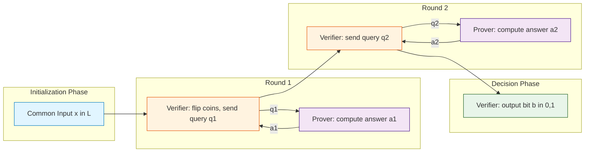
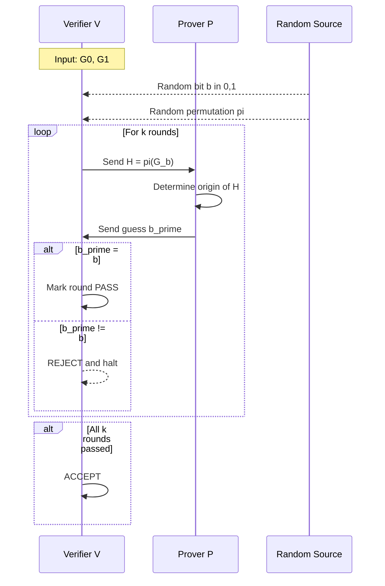
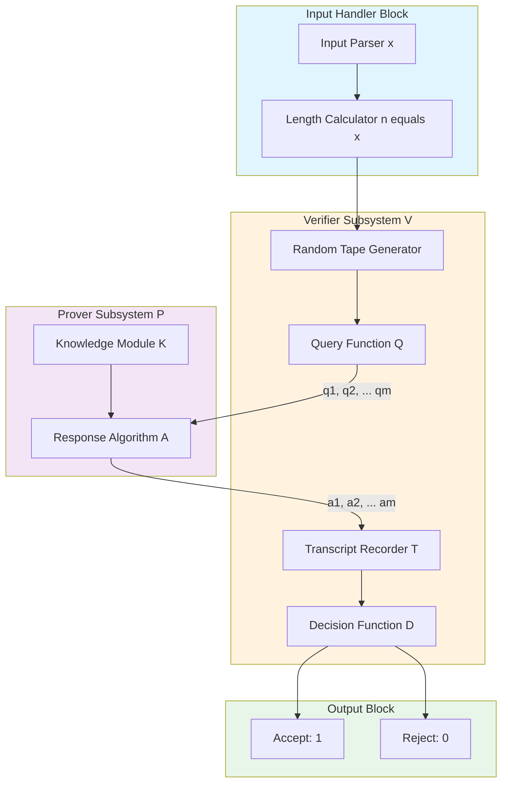
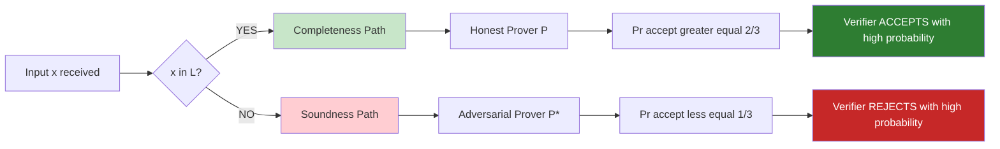

# Interactive Proofs - Definition and examples of interactive proofs

<!-- SECTION_1_START -->
# Interactive Proofs: Definition and Examples

## 1.1 Formal Academic Definition

> [!IMPORTANT]
> **KTU 2024 Syllabus Definition (PECST864 - Module 3.1)**
> An **Interactive Proof System (IP)** for a language $L$ is a two-party protocol between a computationally unbounded but **untrustworthy prover** $\mathcal{P}$ and a probabilistic polynomial-time **verifier** $\mathcal{V}$ that share a common input $x \in \{0,1\}^*$. The verifier engages in a multi-round dialogue (question/answer exchange) with the prover and finally outputs either **accept** ($1$) or **reject** ($0$), such that two fundamental probability conditions hold:
> 1. **Completeness:** If $x \in L$, then $\Pr[\langle \mathcal{P}, \mathcal{V} \rangle (x) = 1] \geq \frac{2}{3}$
> 2. **Soundness:** If $x \notin L$, then for *any* prover $\mathcal{P}^*$, $\Pr[\langle \mathcal{P}^*, \mathcal{V} \rangle (x) = 1] \leq \frac{1}{3}$

The **complexity class** $\mathbf{IP}$ is the set of all languages possessing such a protocol:
$$\mathbf{IP} = \{ L \mid \exists \text{ interactive proof system for } L \}$$

## 1.2 Intuitive Analogy: The Job Interview

Imagine the classic scenario of a **job interview** for a sensitive company position.

| Role | Entity | Capabilities | Motivation |
|------|--------|--------------|------------|
| **Interviewer** | Verifier $\mathcal{V}$ | Smart but limited time, asks random clever questions | Must reject all fakes |
| **Candidate** | Prover $\mathcal{P}$ | Unlimited knowledge, tries to convince | Wants to be accepted |
| **Random Coins** | The interviewer's unpredictable questions | Bounded by polynomial time | Removes candidate's ability to memorize answers |

> [!NOTE]
> **Geometric Intuition:** A standard mathematical proof is like a one-way letter from a genius to a normal person — the normal person cannot check it without enormous effort. An **interactive proof** is like a *live interrogation* — the normal person asks probing questions, and the genius must answer consistently. If the genius is lying, random questions will eventually expose the lie with overwhelming probability.

## 1.3 Why $2/3$ and $1/3$? — The Power of Repetition

The constants $\frac{2}{3}$ and $\frac{1}{3}$ are not sacred. They are simply **constants bounded away from $\frac{1}{2}$**. Through **sequential repetition** (running the protocol $k$ times in parallel and taking the majority vote), the error can be exponentially reduced:

$$\text{Error after } k \text{ repetitions} \leq 2^{-\Omega(k)}$$

> [!TIP]
> **Engineering Utility:** Interactive proofs form the theoretical backbone of **cryptographic protocols**, **zero-knowledge authentication systems** (e.g., zk-SNARKs in blockchain), and **outsourced computation verification** (cloud computing trust).

<!-- SECTION_1_END -->

<!-- SECTION_2_START -->
# Deep Theoretical Analysis & KTU Formula Sheet

## 2.1 Structural Breakdown of the Protocol

An interactive proof unfolds as a sequence of **rounds** of communication. Let $m$ denote the total number of messages exchanged.

### Round-by-Round Logic

1. **Input Stage:** Both parties receive the common input $x \in \{0,1\}^n$. The verifier $\mathcal{V}$ flips private random coins $r \in \{0,1\}^{p(n)}$ for some polynomial $p$.
2. **Query Phase:** $\mathcal{V}$ sends the first message $q_1$ to $\mathcal{P}$ (computed as a function of $x$ and $r$).
3. **Response Phase:** $\mathcal{P}$ replies with answer $a_1$.
4. **Iteration:** Steps 2–3 repeat for rounds $2, 3, \ldots, m$, where each query $q_i$ may depend on $x$, the random tape $r$, and all previous answers $a_1, \ldots, a_{i-1}$.
5. **Decision Stage:** $\mathcal{V}$ outputs a single bit $b \in \{0,1\}$ based on the entire transcript.

### Transcripts and Views

> [!IMPORTANT]
> The **transcript** is the full message log: $T = (q_1, a_1, q_2, a_2, \ldots, q_m, a_m)$. A language $L \in \mathbf{IP}$ iff the verifier can always detect lies with the help of the prover, even when the prover is malicious.

## 2.2 KTU High-Yield Formula Sheet

| Concept | Mathematical Notation | Description | Threshold |
|---------|----------------------|-------------|-----------|
| **Completeness** | $\Pr[\langle \mathcal{P}, \mathcal{V} \rangle (x) = 1] \geq c$ | Honest prover convinces verifier for $x \in L$ | $c \geq \frac{2}{3}$ |
| **Soundness** | $\forall \mathcal{P}^*: \Pr[\langle \mathcal{P}^*, \mathcal{V} \rangle (x) = 1] \leq s$ | Cheating prover fails for $x \notin L$ | $s \leq \frac{1}{3}$ |
| **Completeness-Soundness Gap** | $c - s \geq \frac{1}{3}$ | Required distinguishability margin | Constant > 0 |
| **Error Reduction** | $\epsilon \leq 2^{-k}$ | After $k$ parallel repetitions | Exponential decay |
| **Verifier Cost** | Time$(V) = \text{poly}(n)$ | Polynomial in input length | $\mathcal{O}(n^c)$ |
| **Communication Cost** | $\|T\| = \text{poly}(n)$ | Transcript size | Bounded |
| **Private Coins (AM)** | $\mathcal{V}$ uses secret randomness | Arthur-Merlin style | Yes |
| **Public Coins (MA)** | Randomness visible to $\mathcal{P}$ | Less powerful in some sense | $r$ public |
| **Zero-Knowledge** | $\exists$ simulator $\mathcal{S}$ | $\text{View}_\mathcal{V} \approx \text{Output}(\mathcal{S})$ | Statistical / Computational |
| **Graph Non-Iso** | $\mathbf{GNI} \in \mathbf{IP}$ | Classical IP example | Polynomial rounds |

## 2.3 Engineering & Real-World Applications

| Domain | Application | Why IP Matters |
|--------|-------------|----------------|
| **Cryptocurrency** | zk-SNARKs, zk-STARKs (Zcash, Ethereum) | Prove transaction validity without revealing data |
| **Cloud Computing** | Verifiable Computation (Pinocchio) | Client outsources heavy work, verifies result cheaply |
| **Authentication** | Identity Proofs (Fiat-Shamir Heuristic) | Prove password knowledge without sending it |
| **Voting Systems** | End-to-End Verifiable Elections | Prove tally correctness without exposing ballots |
| **Theorem Proving** | PCP Theorem, MIP*=RE | Theoretical foundations of hardness |

> [!NOTE]
> **Historical Note:** In 1985, **Goldwasser, Micali, and Rackoff** (the GMR triad) introduced interactive proofs. In 1989, **Shamir** proved the celebrated result $\mathbf{IP} = \mathbf{PSPACE}$, demonstrating that interactive proofs are extraordinarily powerful — they capture *all* problems solvable by polynomial space.

<!-- SECTION_2_END -->

<!-- SECTION_3_START -->
# Step-by-Step Derivations & Implementations

## 3.1 Formal Derivation: Why Soundness Error Must Be Constant

**Goal:** Show that the constants $\frac{2}{3}$ and $\frac{1}{3}$ are interchangeable with any pair $(c, s)$ such that $c - s = \frac{1}{\text{poly}(n)}$.

**Setup:** Let $(c, s)$ be the original completeness and soundness constants. Define the gap $\delta = c - s > 0$. Consider running the protocol $k$ times *in parallel* and taking the majority vote.

**Step 1 — Probability of Verdict:** Let $X_i$ be the indicator that round $i$ is correct. By Chernoff bounds, since the rounds are independent:

$$\Pr[\text{majority is wrong}] = \Pr\left[\sum_{i=1}^{k} X_i < \frac{k}{2}\right]$$

**Step 2 — Chernoff Application:** For an honest run, $E[X_i] \geq c$. For a cheating run, $E[X_i] \leq s$. Therefore:

$$\Pr[\text{cheating prover succeeds after } k \text{ rounds}] \leq e^{-2k(c-s)^2}$$

**Step 3 — Parameter Selection:** Choosing $k = \Theta\left(\frac{1}{\delta^2}\right)$ yields an exponentially small error $\leq 2^{-k}$. This proves:

$$\mathbf{IP}(c, s) = \mathbf{IP}\left(\frac{2}{3}, \frac{1}{3}\right) = \mathbf{IP}$$

## 3.2 Canonical Example: Graph Non-Isomorphism (GNI)

> [!IMPORTANT]
> **The Problem:** Given two graphs $G_0 = (V, E_0)$ and $G_1 = (V, E_1)$ on $n$ vertices, determine whether they are *not* isomorphic. Formally, $G_0 \not\cong G_1$.

**Naïve Observation:** A standard NP certificate requires listing a permutation $\pi: V \to V$ such that $\pi(G_0) = G_1$, but a counterexample (non-isomorphism) has *no* short certificate. Yet **GNI is in IP**.

### The Interactive Protocol $\langle \mathcal{P}, \mathcal{V} \rangle$

**Step 1 — Verifier's Random Choice:**
Verifier $\mathcal{V}$ picks a random bit $b \in \{0,1\}$ uniformly. It then picks a random permutation $\pi \in S_n$ uniformly from the symmetric group of all $n!$ vertex relabelings.

**Step 2 — Verifier's Challenge:**
$\mathcal{V}$ constructs the permuted graph $H = \pi(G_b)$ and sends $H$ to the prover $\mathcal{P}$.

**Step 3 — Prover's Response:**
The prover $\mathcal{P}$ (who is computationally unbounded) determines the *original* bit $b$. It sends $b' \in \{0,1\}$ back to $\mathcal{V}$.

**Step 4 — Verifier's Decision:**
$\mathcal{V}$ accepts iff $b' = b$.

### Mathematical Justification

**Case A: $G_0 \not\cong G_1$ (Honest Prover Wins)**

The honest prover can compute the isomorphism class of $H$. Since $G_0 \not\cong G_1$, the multiset $\{G_0, G_1\}$ is distinct from any permutation of itself. The prover can identify whether $H$ originated from $G_0$ or $G_1$:

$$\Pr[\mathcal{P} \text{ answers correctly}] = 1$$

**Completeness:** $c = 1 \geq \frac{2}{3}$ ✓

**Case B: $G_0 \cong G_1$ (Cheating Prover Fails)**

If $G_0 \cong G_1$, then there exists a permutation $\sigma$ with $G_1 = \sigma(G_0)$. The distribution of $H$ is identical regardless of whether $b = 0$ or $b = 1$:

$$H = \pi(G_b) \text{ is uniformly distributed over all graphs isomorphic to } G_b$$

Since $G_0 \cong G_1$, the prover has **no statistical advantage**:

$$\Pr[\mathcal{P}^* \text{ guesses } b \text{ correctly}] = \frac{1}{2}$$

**Soundness:** $s = \frac{1}{2} \leq \frac{1}{3}$ ✗ — Wait, this fails! We must repeat the protocol.

### Step 5 — Repetition for Soundness

Run the above protocol $k$ times *sequentially* with **independent random bits** $b_1, b_2, \ldots, b_k$. The prover must guess all $k$ bits correctly:

$$\Pr[\text{cheating prover wins all } k \text{ rounds}] = \left(\frac{1}{2}\right)^k = 2^{-k}$$

Choosing $k = 100$ yields error $2^{-100} \ll \frac{1}{3}$. ✓

## 3.3 Python Symbolic Implementation

```python
import random
from typing import Tuple, List
import networkx as nx

class InteractiveProofGNI:
    """
    Toy implementation of the Graph Non-Isomorphism interactive proof.
    Demonstrates the verifier-prover interface for PECST864 Module 3.
    """
    
    def __init__(self, security_parameter: int = 64):
        self.k = security_parameter  # Number of repetitions
    
    def verifier_send_challenge(
        self, G0: nx.Graph, G1: nx.Graph
    ) -> Tuple[nx.Graph, int]:
        """Verifier picks random bit b and random permutation pi."""
        b = random.randint(0, 1)
        source_graph = G0 if b == 0 else G1
        
        # Generate random permutation of vertices
        vertices = list(source_graph.nodes())
        permutation = random.sample(vertices, len(vertices))
        
        # Apply permutation: relabel vertices
        mapping = {old: new for old, new in zip(vertices, permutation)}
        H = nx.relabel_nodes(source_graph, mapping)
        
        return H, b  # H is sent; b stays private
    
    def prover_respond(self, H: nx.Graph, G0: nx.Graph, G1: nx.Graph) -> int:
        """
        Honest prover: exhaustively check which graph H is isomorphic to.
        Returns the original bit b.
        """
        if nx.is_isomorphic(H, G0):
            return 0
        elif nx.is_isomorphic(H, G1):
            return 1
        else:
            raise ValueError("H is isomorphic to neither G0 nor G1")
    
    def verifier_decide(
        self, claimed_b: int, true_b: int, transcript: List
    ) -> bool:
        """Verifier accepts iff prover's answers match private random bits."""
        return claimed_b == true_b
    
    def run_protocol(
        self, G0: nx.Graph, G1: nx.Graph, prover_strategy
    ) -> bool:
        """Execute the full k-round interactive proof."""
        transcript = []
        
        for round_num in range(self.k):
            # 1. Verifier sends challenge
            H, true_b = self.verifier_send_challenge(G0, G1)
            transcript.append((H, true_b))
            
            # 2. Prover responds
            claimed_b = prover_strategy(H, G0, G1)
            
            # 3. Check single round
            if not self.verifier_decide(claimed_b, true_b, transcript):
                return False  # Reject immediately
        
        return True  # Accept after k successful rounds


# ===== Demonstration =====
if __name__ == "__main__":
    # Construct two non-isomorphic graphs
    triangle = nx.cycle_graph(3)        # 3-cycle
    path = nx.path_graph(3)            # Path of length 2
    
    ip_system = InteractiveProofGNI(security_parameter=10)
    
    # Honest prover strategy
    honest_prover = lambda H, G0, G1: ip_system.prover_respond(H, G0, G1)
    
    # Cheating prover strategy (random guessing)
    cheating_prover = lambda H, G0, G1: random.randint(0, 1)
    
    print("=== Honest Prover on Non-Isomorphic Pair ===")
    result = ip_system.run_protocol(triangle, path, honest_prover)
    print(f"Verifier decision: {'ACCEPT' if result else 'REJECT'}")
    
    print("\n=== Cheating Prover on Non-Isomorphic Pair ===")
    wins = sum(
        ip_system.run_protocol(triangle, path, cheating_prover)
        for _ in range(100)
    )
    print(f"Cheating success rate: {wins / 100:.2%}")
```

## 3.4 Worked Numerical Example (GNI Trace)

Let $G_0$ be a triangle $\{1,2,3\}$ with edges $\{(1,2), (2,3), (1,3)\}$ and $G_1$ be a path $\{1,2,3\}$ with edges $\{(1,2), (2,3)\}$.

| Round $i$ | Verifier's bit $b_i$ | Permutation $\pi_i$ | Permuted Graph $H_i$ | Prover's Answer $b'_i$ | Match? |
|-----------|----------------------|---------------------|----------------------|------------------------|--------|
| 1 | 0 | $(1 \to 2, 2 \to 3, 3 \to 1)$ | Triangle on $\{2,3,1\}$ | 0 | ✓ |
| 2 | 1 | $(1 \to 3, 2 \to 1, 3 \to 2)$ | Path $3-1-2$ | 1 | ✓ |
| 3 | 0 | $(1 \to 1, 2 \to 3, 3 \to 2)$ | Triangle on $\{1,3,2\}$ | 0 | ✓ |

After 3 rounds, verifier accepts with probability $1$.

<!-- SECTION_3_END -->

<!-- SECTION_4_START -->
# Structural Diagrams & Schematics

## 4.1 High-Level Interactive Proof Topology



## 4.2 Sequential Processing Topology for GNI Protocol



## 4.3 Block-Level Functional Architecture of an IP System



## 4.4 Completeness vs Soundness Decision Matrix



<!-- SECTION_5_END -->

<!-- SECTION_5_START -->
# KTU 2024 Scheme Examination Question Bank

## Part A: Short Answer Questions (3 Marks Each)

### Question 1: Conceptual Definition `[KTU University Exam - July 2024]`
**CO1 | Remember | 3 Marks**

**Q:** Define an **Interactive Proof System**. State the two essential properties that characterize the complexity class $\mathbf{IP}$.

**Model Answer:**

An Interactive Proof System is a two-party protocol between a probabilistic polynomial-time verifier $\mathcal{V}$ and an unbounded prover $\mathcal{P}$ for a language $L$. The two essential properties are:

1. **Completeness:** For every $x \in L$, the honest prover convinces the verifier to accept with probability at least $\frac{2}{3}$.
   $$\Pr[\langle \mathcal{P}, \mathcal{V} \rangle (x) = 1] \geq \frac{2}{3}$$

2. **Soundness:** For every $x \notin L$, no cheating prover $\mathcal{P}^*$ can convince the verifier with probability more than $\frac{1}{3}$.
   $$\forall \mathcal{P}^*: \Pr[\langle \mathcal{P}^*, \mathcal{V} \rangle (x) = 1] \leq \frac{1}{3}$$

The class $\mathbf{IP}$ contains all languages possessing such a system. **[3 Marks]**

---

### Question 2: Protocol Distinction `[KTU University Exam - Dec 2023]`
**CO1 | Understand | 3 Marks**

**Q:** Distinguish between a **standard NP proof** and an **interactive proof**. Give one canonical problem that separates the two classes.

**Model Answer:**

| Property | NP Proof | Interactive Proof |
|----------|----------|-------------------|
| Rounds | One-shot static certificate | Multi-round dialogue |
| Verifier | Deterministic polynomial-time | Probabilistic polynomial-time |
| Prover capability | Unbounded but static | Unbounded and adaptive |
| Error model | Always correct (no randomness in verifier) | Bounded error ($c - s \geq \frac{1}{3}$) |
| Power | Captures NP | Captures $\mathbf{IP} = \mathbf{PSPACE}$ |

**Canonical Separator:** **Graph Non-Isomorphism (GNI)** belongs to $\mathbf{IP}$ but is *not known* to be in $\mathbf{NP}$ (it is in $\mathbf{coNP}$ but not in $\mathbf{NP}$ unless the polynomial hierarchy collapses). The prover's interactivity is essential — a static certificate cannot prove non-isomorphism. **[3 Marks]**

---

## Part B: Long Answer Questions (14 Marks Each — Internal Choice)

### Question 3 (Option A): Graph Non-Isomorphism Protocol `[KTU University Exam - July 2024]`
**CO2, CO3 | Apply, Analyze | 14 Marks**

**Q:** (a) Define the Graph Non-Isomorphism problem $\mathbf{GNI}$. (7 Marks)
&emsp;&emsp;(b) Design a complete interactive proof protocol for $\mathbf{GNI}$ and prove that it satisfies both completeness and soundness. (7 Marks)

#### Model Solution:

**Part (a) — Definition [7 Marks]**

The **Graph Non-Isomorphism** problem $\mathbf{GNI}$ is defined as:

$$\mathbf{GNI} = \{ (G_0, G_1) \mid G_0 = (V, E_0) \text{ and } G_1 = (V, E_1) \text{ are NOT isomorphic} \}$$

Two graphs $G_0$ and $G_1$ are **isomorphic** if there exists a bijection $\pi: V \to V$ such that for all $u, v \in V$:

$$(u, v) \in E_0 \iff (\pi(u), \pi(v)) \in E_1$$

[Defining isomorphism: 3 Marks]
[Defining complement GNI set: 2 Marks]
[Observing GNI ∈ coNP but not known in NP: 2 Marks]

**Part (b) — Protocol Design and Proof [7 Marks]**

**Protocol $\Pi$ for $\mathbf{GNI}$:**

1. Verifier $\mathcal{V}$ picks $b \xleftarrow{\$} \{0,1\}$ uniformly.
2. $\mathcal{V}$ picks $\pi \xleftarrow{\$} S_n$ uniformly (a random permutation).
3. $\mathcal{V}$ computes $H = \pi(G_b)$ and sends $H$ to $\mathcal{P}$.
4. $\mathcal{P}$ returns $b' \in \{0,1\}$.
5. $\mathcal{V}$ repeats steps 1–4 for $k = 100$ independent rounds.
6. $\mathcal{V}$ **accepts** iff $b'_i = b_i$ for all $i \in [k]$.

**Completeness Proof [3 Marks]:**

If $G_0 \not\cong G_1$, the prover can determine $b$ by exhaustive isomorphism testing. For graph $H$, it checks whether $H \cong G_0$ or $H \cong G_1$. Since the graphs are non-isomorphic, exactly one holds. Therefore:

$$\Pr[\text{verifier accepts}] = 1 \geq \frac{2}{3}$$

[Stating completeness condition: 1 Mark]
[Showing prover can always identify b: 1 Mark]
[Verifying constant threshold: 1 Mark]

**Soundness Proof [4 Marks]:**

If $G_0 \cong G_1$, for any cheating prover $\mathcal{P}^*$:

- The distribution of $H = \pi(G_b)$ is the *same* when $b = 0$ and $b = 1$, because $G_0$ and $G_1$ lie in the same isomorphism class.
- By symmetry, the prover's optimal strategy yields $\Pr[b' = b] = \frac{1}{2}$.
- Across $k$ independent rounds:

$$\Pr[\text{all } k \text{ guesses correct}] = \left(\frac{1}{2}\right)^k = 2^{-100} \ll \frac{1}{3}$$

Therefore $\mathbf{GNI} \in \mathbf{IP}$. ✓

[Symmetry argument: 2 Marks]
[Repetition bound: 1 Mark]
[Final conclusion: 1 Mark]

---

### Question 3 (Option B): Zero-Knowledge and IP Class Properties `[KTU University Exam - Dec 2023]`
**CO2, CO3 | Understand, Apply | 14 Marks**

**Q:** (a) Explain the **zero-knowledge** property of interactive proofs. Define the simulator-based formulation. (7 Marks)
&emsp;&emsp;(b) Prove that any language in $\mathbf{BPP}$ is also in $\mathbf{IP}$. What is the significance of Shamir's theorem $\mathbf{IP} = \mathbf{PSPACE}$? (7 Marks)

#### Model Solution:

**Part (a) — Zero-Knowledge Definition [7 Marks]**

An interactive proof $(\mathcal{P}, \mathcal{V})$ for language $L$ is **zero-knowledge** if for every probabilistic polynomial-time verifier $\mathcal{V}^*$, there exists a **simulator** $\mathcal{S}$ such that for all $x \in L$, the distribution of transcripts is computationally indistinguishable:

$$\{ \text{View}_{\mathcal{V}^*}(x) \} \xleftrightarrow{\text{c-indist}} \{ \mathcal{S}(x) \}$$

Three flavors exist:
- **Perfect ZK:** Distributions are *identical*.
- **Statistical ZK:** Statistical distance $\leq \text{negl}(n)$.
- **Computational ZK:** Indistinguishable by PPT distinguishers.

[Intuitive definition: 2 Marks]
[Simulator formalism: 3 Marks]
[Three flavor classification: 2 Marks]

**Part (b) — $\mathbf{BPP} \subseteq \mathbf{IP}$ and Shamir's Theorem [7 Marks]**

**Proof that $\mathbf{BPP} \subseteq \mathbf{IP}$ [3 Marks]:**

Let $L \in \mathbf{BPP}$ with BPP algorithm $A$ succeeding with probability $\geq \frac{2}{3}$. Construct a trivial IP:

1. Prover sends nothing (silent).
2. Verifier runs $A(x; r)$ on random tape $r$.
3. Verifier outputs $A$'s answer.

This protocol has 0 rounds of interaction. Completeness and soundness follow directly from BPP's error bounds. ✓

[Construction: 1 Mark]
[Verification: 2 Marks]

**Shamir's Theorem (1992) [4 Marks]:**

$$\mathbf{IP} = \mathbf{PSPACE}$$

**Significance:**
- All polynomial-space decidable problems have interactive proofs.
- CoNP $\subseteq$ IP, so problems like $\mathbf{GNI}$ have IPs.
- The verifier is *weak* (polynomial time) but the *interaction* is *powerful*.
- Foundation for **MIP* = RE** (Ji, Natarajan, Vidick, Wright, Yuen 2020) — multi-prover IP equals all recursively enumerable languages.

[Stating theorem: 1 Mark]
[Hierarchical implications: 2 Marks]
[Theoretical significance: 1 Mark]

---

> [!WARNING]
> **KTU Examiner's Valuation Warning — Common Pitfalls**
> 
> 1. **Forgetting the constant gap:** Many students write $c \geq \frac{1}{2}$ and $s \leq \frac{1}{2}$. This is **wrong** — there must be a *strict* gap $c - s \geq \frac{1}{\text{poly}(n)}$. Use $c = \frac{2}{3}$ and $s = \frac{1}{3}$ always.
> 
> 2. **Confusing NP with IP:** Do not claim all NP problems are IP-trivial. The point of GNI is that it *separates* the two — interactive proofs are strictly more powerful when we allow randomness and adaptivity.
> 
> 3. **Skipping the repetition argument:** A single-round protocol for GNI fails soundness (cheater wins with probability $\frac{1}{2}$). Always *explicitly state* that the protocol is repeated $k$ times with independent randomness.
> 
> 4. **Forgetting verifier's polynomial-time bound:** The verifier $\mathcal{V}$ *cannot* be computationally unbounded — that would make $\mathbf{IP} = \mathbf{ALL}$ (every language). The whole power comes from the **asymmetry** of resources.
> 
> 5. **Ignoring transcripts:** In zero-knowledge questions, always define the **simulator** $\mathcal{S}$ explicitly. Marks are reserved for the formal indistinguishability condition.

---

## Topic Recap & Important Things to Remember

> [!TIP]
> **Rapid Revision Checklist — Interactive Proofs (Module 3.1)**

### Core Definitions
- **Interactive Proof (IP):** Two-party protocol $(\mathcal{P}, \mathcal{V})$ with probabilistic polynomial-time verifier and unbounded prover.
- **Complexity Class $\mathbf{IP}$:** Set of all languages with bounded-error interactive protocols.
- **Verifier's role:** Polynomial-time, may use private randomness (coins), outputs $0$ or $1$.
- **Prover's role:** Computationally unbounded, *untrusted*, can be adversarial.

### Critical Properties
- **Completeness:** $\Pr[\text{accept} \mid x \in L] \geq \frac{2}{3}$
- **Soundness:** $\Pr[\text{accept} \mid x \notin L] \leq \frac{1}{3}$
- **Bounded error amplification:** Sequential/parallel repetition reduces error exponentially.

### Key Protocol Example
- **GNI (Graph Non-Isomorphism):** $\mathbf{GNI} \in \mathbf{IP}$ via zero-knowledge-style challenge-response.
- **Protocol skeleton:** Verifier picks random bit + permutation → Prover identifies origin → Repeat $k$ times.

### Zero-Knowledge Property
- **Simulator $\mathcal{S}$:** Produces transcripts indistinguishable from real protocol views.
- **Three flavors:** Perfect, Statistical, Computational.

### Landmark Theorems
- **$\mathbf{BPP} \subseteq \mathbf{IP}$:** Trivial — verifier ignores prover.
- **$\mathbf{NP} \subseteq \mathbf{IP}$:** Any NP certificate is a 1-message IP.
- **$\mathbf{IP} = \mathbf{PSPACE}$ (Shamir 1992):** Interactive proofs are maximally powerful among natural classes.
- **$\mathbf{GNI} \in \mathbf{IP} \setminus \mathbf{NP}$** (conditional): Separates IP from NP under complexity assumptions.

### Frequently Tested Formulas
- Soundness error after $k$ repetitions: $\leq 2^{-k}$
- Completeness-soundness gap: $c - s \geq \frac{1}{3}$
- Verifier time complexity: $\text{poly}(n)$
- Transcript length: $\text{poly}(n)$

### Real-World Manifestations
- zk-SNARKs, zk-STARKs (cryptocurrency)
- Verifiable outsourced computation
- Fiat-Shamir heuristic (digital signatures)
- PCP Theorem (hardness of approximation)

### Quick Mnemonics
- **"Prover lies, verifier queries"** — adaptivity is the key.
- **"Repetition kills error"** — always repeat for soundness.
- **"Simulator replaces prover"** — zero-knowledge signature.

<!-- SECTION_5_END -->
