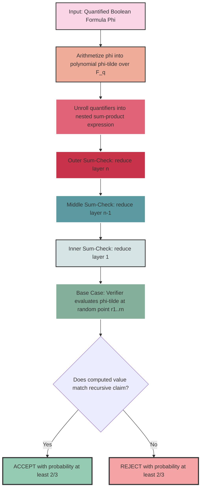
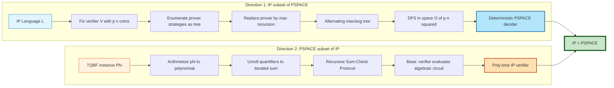
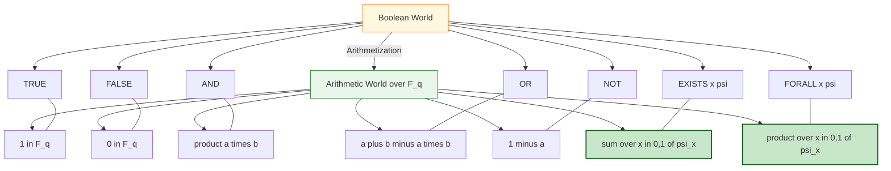

# IP = PSPACE theorem

<!-- SECTION_1_START -->

# 1. Core Technical Definition & Intuitive Overview

## 1.1 Formal Definition — The Class IP (Interactive Polynomial-time Proofs)

> [!IMPORTANT]
> **KTU 2024 Syllabus Definition (PECST864 / Module 3):**
> The class **IP** is the set of all languages $L$ for which there exists a probabilistic polynomial-time verifier $V$ and an unbounded (all-powerful) prover $P$ such that for every input $x \in \{0,1\}^n$:
> - **Completeness:** If $x \in L$, then $\Pr[\langle V, P \rangle(x) = \text{accept}] \geq \tfrac{2}{3}$
> - **Soundness:** If $x \notin L$, then for every prover $P^*$, $\Pr[\langle V, P^* \rangle(x) = \text{accept}] \leq \tfrac{1}{3}$

The verifier $V$ is a polynomial-time Turing machine that flips random coins and exchanges messages with $P$. The number of rounds is bounded by a polynomial in $n = \vert x \vert$. Crucially, **the verifier's randomness is private** (private-coin model in modern treatment).

## 1.2 Formal Definition — The Class PSPACE

> [!IMPORTANT]
> **KTU 2024 Syllabus Definition:**
> **PSPACE** is the set of all languages decidable by a deterministic (or equivalently, alternating) Turing machine that uses at most $O(n^k)$ tape cells for some constant $k$, with no bound on its running time. The canonical PSPACE-complete problem is **TQBF** (True Quantified Boolean Formula).

$$
\text{PSPACE} = \bigcup_{k \geq 1} \text{DSPACE}(n^k)
$$

## 1.3 The IP = PSPACE Theorem (Shamir, 1992)

> [!NOTE]
> **The Main Theorem (Module 3 Core Result):**
> $$\boxed{\;\textbf{IP} = \textbf{PSPACE}\;}$$
> Equivalently, the languages recognizable by polynomial-round interactive proof systems are exactly those decidable in polynomial space. This was proved in two independent directions by Shamir (for PSPACE ⊆ IP) and Feldman, Lund, Saks, Szegedy-type techniques (for IP ⊆ PSPACE).

## 1.4 Conceptual Analogy — "The Courtroom and the Chess Master"

Imagine a **courtroom trial** as an interactive proof:
- The **Prover (P)** is a brilliant, all-knowing lawyer who has unlimited preparation time.
- The **Verifier (V)** is a strict but time-pressed judge. The judge can only ask a polynomial number of questions, and can flip coins to choose *which* questions to ask.
- **Completeness** = "If the defendant is truly guilty, the honest lawyer can convince the judge (high probability)."
- **Soundness** = "If the defendant is innocent, even a lying lawyer cannot fool the judge (low probability)."

Now extend this to **chess**: deciding whether White has a forced win in an $n$-move game is PSPACE-complete. The judge (verifier) can randomize their challenges, and the lawyer (prover) can guide them through the gigantic game tree **without the judge having to explore every node**. The judge never needs exponential memory — only a poly-size scratchpad — because the lawyer is "remembering" the global state.

## 1.5 The Crucial Pillar — TQBF (True Quantified Boolean Formula)

> [!IMPORTANT]
> **TQBF (the canonical PSPACE-complete problem):**
> Input: A fully quantified Boolean formula
> $$\Phi = Q_1 x_1 \; Q_2 x_2 \; \cdots \; Q_n x_n \; \varphi(x_1, x_2, \ldots, x_n)$$
> where each $Q_i \in \{\exists, \forall\}$ and $\varphi$ is a quantifier-free CNF/DNF formula.
> Question: Is $\Phi$ true?

TQBF is the engine that powers the PSPACE ⊆ IP direction. **If we can build an interactive protocol for TQBF, we get all of PSPACE** (since every PSPACE language polynomial-time reduces to TQBF).

> [!VISUALIZATION CONTROL]
> **Concept:** The "hardness" hierarchy visualized on a complexity ladder.
> **GeoGebra / Desmos Input Equations:**
> * `P ⊆ NP ⊆ PSPACE` (lattice of inclusions)
> * `log(SPACE) = 1, 2, 3, ..., poly` (y-axis) vs `log(EXPTIME) = 1, 2, ...` (x-axis)
> **Visual Description:** A staircase-like Venn diagram where **P** sits at the bottom, **NP** contains it, **IP** straddles the middle, and **PSPACE** envelops them. The IP = PSPACE theorem "closes the gap" between the middle ring and the outer ring — collapsing two separate circles into one.

---

<!-- SECTION_1_END -->

<!-- SECTION_2_START -->

# 2. Deep Theoretical Analysis & KTU High-Yield Formula Sheet

## 2.1 The Two Halves of the Equality

The IP = PSPACE theorem is the conjunction of two subset relations. Understanding the **direction and tool** used for each is critical for KTU board answers.

### 2.1.1 Direction 1 — IP ⊆ PSPACE (Ladner-Lund style simulation)

**Idea:** Given any IP language $L$ with verifier $V$ using at most $p(n)$ coins and $p(n)$ rounds, we can decide membership in **deterministic polynomial space** by enumerating *all* prover strategies and computing the optimal acceptance probability via dynamic programming.

**Why it works:**
1. Fix a verifier transcript tree. At each round, the prover's optimal move is a deterministic function of the verifier's history.
2. The verifier's randomness produces a polynomial-size decision tree.
3. The optimal prover can be folded into a **game-theoretic maximin**: at verifier-turn nodes, take the **average** (over coin flips); at prover-turn nodes, take the **maximum** (over prover responses).
4. This alternating max/average tree can be evaluated in $O(p(n))$ space by recursive DFS — the stack depth is polynomial.

### 2.1.2 Direction 2 — PSPACE ⊆ IP (Arithmetization)

**Idea:** Show that **TQBF ∈ IP**. The verifier will be polynomial-time and random; the prover will convince it that a fully quantified Boolean formula is true (or false) using the magic of **arithmetization**.

**Toolbox:**
- **Arithmetization:** Convert every Boolean operation ($\land, \lor, \neg$) into an arithmetic operation ($+, \times, 1-x$) over a sufficiently large finite field $\mathbb{F}$.
- **Sum-Check Protocol (Lund-Fortnow-Karloff-Nisan, 1990):** An interactive sub-protocol that allows the verifier to check $\sum_{x_1, \ldots, x_n \in \{0,1\}} g(x_1, \ldots, x_n) = H$ in polynomial rounds, where $g$ is a low-degree multivariate polynomial.
- **LFKN Protocol:** Used to verify a single existential ($\exists$) or universal ($\forall$) quantifier layer.
- **Shamir's Generalization (1992):** Apply the sum-check protocol **recursively** through every quantifier layer of the TQBF.

## 2.2 KTU Formula Sheet / Cheat Sheet

| # | Concept | Mathematical Statement | Notation / Key Symbol | Where Used |
|---|---------|----------------------|------------------------|------------|
| 1 | IP class | $L \in \text{IP}$ iff $\exists$ PPT verifier $V$, unbounded $P$ s.t. completeness $\geq 2/3$, soundness $\leq 1/3$ | $\langle V, P \rangle$ | Def. of interactive proofs |
| 2 | PSPACE class | $\text{PSPACE} = \bigcup_k \text{DSPACE}(n^k)$ | $\text{SPACE}(n^k)$ | Resource-bounded class |
| 3 | TQBF | $Q_1 x_1 \cdots Q_n x_n \, \varphi(x_1,\ldots,x_n)$ is TRUE | $\Phi$ | PSPACE-complete problem |
| 4 | Boolean $\to$ Arithmetic | $\varphi \wedge \psi \mapsto \varphi \cdot \psi$ | $\cdot$ | Arithmetization |
| 5 | Boolean $\to$ Arithmetic | $\varphi \vee \psi \mapsto \varphi + \psi - \varphi\psi$ | $+, -$ | Arithmetization |
| 6 | Boolean $\to$ Arithmetic | $\neg \varphi \mapsto 1 - \varphi$ | $1 - x$ | Arithmetization |
| 7 | Sum-Check Problem | $\text{Verify } H = \sum_{x \in \{0,1\}^n} g(x)$ | $g(x_1,\ldots,x_n)$ | LFKN protocol |
| 8 | Number of rounds | $O(n \cdot d)$ where $d = \deg(g)$ | poly($n$) | Sum-check |
| 9 | Field size requirement | $\vert \mathbb{F} \vert \geq 100 \cdot d^n$ (for soundness $\leq 1/3$) | $\mathbb{F}_q$ | Field selection |
| 10 | Alternation depth (PSPACE) | Alternating TM = $\exists\forall\exists\forall\cdots$ tree | $\Sigma_k, \Pi_k$ | PSPACE characterizations |
| 11 | Savitch's Theorem | $\text{NSPACE}(f(n)) \subseteq \text{DSPACE}(f(n)^2)$ | $\log^2 n$ | Nondet. space simulation |
| 12 | IP ⊆ PSPACE proof | Replace prover by $\max$/$\min$ recursion | $S(n) = O(p(n))$ | Direction 1 |

> [!NOTE]
> **Important rule (no vertical pipes in tables):** When you write this in your own KTU answer sheet, use $\vert x \vert$ or $\mid x \mid$ in LaTeX — never the bare ASCII $\vert$ inside a markdown table cell, since it breaks the table parser.

## 2.3 Why This Theorem Matters in Real Engineering

| Application Domain | How IP = PSPACE helps |
|--------------------|-----------------------|
| **Cryptographic Protocol Design** | Knowing the boundary of "what is provable interactively" sets the limit on zero-knowledge proof systems (ZK-SNARKs, ZK-STARKs). |
| **Verifiable Computation (Cloud)** | A weak client can outsource a PSPACE computation (e.g., a SAT solver, a game solver) to a powerful server and *cryptographically verify* the result in poly-time via interactive proofs. |
| **AI/ML Inference** | Models with PSPACE inference (e.g., transformers' theoretical capability) can be verified without trusting the server. |
| **Hard Combinatorial Games** | Solving Chess, Go endgames is PSPACE-hard; an interactive proof can certify optimal play without revealing the strategy. |
| **Model Checking** | Hardware/software model checking is PSPACE-complete; IP protocols enable trustworthy third-party verification. |

## 2.4 The Role of Private vs. Public Coins

In the original definition (Goldwasser-Micali-Rackoff, 1985), the verifier's coins are **private**. Goldreich-Mansour-Tiwari (1987) and Babai-Moran (1988) showed that the **public-coin (Arthur-Merlin)** variant, denoted **AM**, satisfies **AM = IP** under polynomial-round settings. For KTU 2024, both formulations are equivalent, but the standard IP proof uses **private coins** in the construction.

---

<!-- SECTION_2_END -->

<!-- SECTION_3_START -->

# 3. Step-by-Step Derivations & Symbolic Implementation

## 3.1 Direction 1: IP ⊆ PSPACE — Detailed Proof

### 3.1.1 Setup

Let $L \in \text{IP}$ with verifier $V$ using at most $p(n)$ random coins and exchanging at most $p(n)$ messages with $P$. The verifier outputs $\text{accept} / \text{reject}$ at the end. We will construct a deterministic TM $M$ deciding $L$ in $O(p(n)^2)$ space.

### 3.1.2 The Transcript Tree

The interaction produces a transcript of the form:

$$
(m_1, m_2, m_3, \ldots, m_{p(n)})
$$

where odd-indexed messages are from $V$ (with internal coin flips) and even-indexed are from $P$. The verifier's behavior at each step is fully determined by the prefix history and the random coins used so far.

### 3.1.3 The Optimal Prover is a Function

Since $P$ is unbounded, we may assume $P$ is **deterministic** for any fixed verifier randomness (if multiple provers achieve the same maximum acceptance, choose one). So given verifier randomness $r \in \{0,1\}^{p(n)}$ and a history $h$, the prover's next message is a function:

$$
P(h, r) = \arg\max_{m} \bigl[\text{Verifier's acceptance prob. after } h, m\bigr]
$$

### 3.1.4 The Maximin Recursion

Define the value function $V^*(h)$ as the verifier's maximum acceptance probability given history $h$:

$$
V^*(h) = 
\begin{cases}
1 & \text{if } h \text{ is an accepting leaf} \\
0 & \text{if } h \text{ is a rejecting leaf} \\
\frac{1}{2^{|r_{V}|}} \sum_{r_V \in \{0,1\}^{|r_V|}} \max_{m_P} V^*(h \cdot m_V \cdot m_P) & \text{otherwise (prover's turn)}
\end{cases}
$$

where $r_V$ is the next batch of verifier coin flips and $m_V, m_P$ are the next verifier/prover messages. The recursion is **finite** (depth $\leq p(n)$) and each level needs only $O(p(n))$ space to record the history.

### 3.1.5 Space Complexity Analysis

The recursive DFS stack stores at most $p(n)$ history frames, each of size $O(p(n))$ bits. Therefore:

$$
S_{\text{recursion}}(n) = O(p(n)^2) = \text{polynomial in } n
$$

### 3.1.6 Decision Criterion

The TM $M$ accepts iff $V^*(\varepsilon) \geq \tfrac{2}{3}$ (where $\varepsilon$ is the empty history), and rejects otherwise. This gives us:

$$
\boxed{\;\text{IP} \subseteq \text{PSPACE}\;}
$$

## 3.2 Direction 2: PSPACE ⊆ IP — The Arithmetization Protocol (Shamir's Proof)

This is the heart of the module. We will show $\text{TQBF} \in \text{IP}$.

### 3.2.1 Input Encoding

Given a quantified Boolean formula:

$$
\Phi = Q_1 x_1 \; Q_2 x_2 \; \cdots \; Q_n x_n \; \varphi(x_1, x_2, \ldots, x_n)
$$

where $\varphi$ is a quantifier-free Boolean formula. We want an interactive protocol where the prover convinces the verifier that $\Phi$ is **true**.

### 3.2.2 Step A — Arithmetization of $\varphi$

Replace every Boolean operator in $\varphi$ with its arithmetic counterpart over a large finite field $\mathbb{F}_q$:

$$
\begin{aligned}
x \wedge y \;&\longmapsto\; x \cdot y \\
x \vee y \;&\longmapsto\; x + y - x \cdot y \\
\neg x \;&\longmapsto\; 1 - x \\
\text{TRUE} \;&\longmapsto\; 1 \\
\text{FALSE} \;&\longmapsto\; 0
\end{aligned}
$$

The result is a polynomial $\tilde{\varphi}(x_1, \ldots, x_n) \in \mathbb{F}_q[x_1, \ldots, x_n]$ of total degree at most $d = \text{poly}(n)$ (since each Boolean operation adds at most multiplicative degree 1).

### 3.2.3 Step B — Express $\Phi$ as an Iterated Sum

We can now unroll the quantifiers. For the Boolean case, $\exists x \; \psi$ means $\psi(0) \vee \psi(1)$, and $\forall x \; \psi$ means $\psi(0) \wedge \psi(1)$. In arithmetized form:

$$
\exists x \; \psi \;\longmapsto\; \tilde{\psi}(0) + \tilde{\psi}(1) \quad (\text{still over } \{0,1\})
$$

$$
\forall x \; \psi \;\longmapsto\; \tilde{\psi}(0) \cdot \tilde{\psi}(1) \quad (\text{still over } \{0,1\})
$$

The full formula becomes a **degree-$d$ polynomial in $n$ variables evaluated at a sum/product of $2^n$ terms**. The verifier cannot afford to compute this directly.

### 3.2.4 Step C — The Sum-Check Protocol (Recursive Engine)

**Claim (Lund-Fortnow-Karloff-Nisan 1990):** Let $g(x_1, \ldots, x_m)$ be a polynomial of total degree $d$ over $\mathbb{F}_q$ given by an algebraic circuit. There is an interactive protocol where $P$ convinces $V$ that

$$
H = \sum_{x_1 \in \{0,1\}} \sum_{x_2 \in \{0,1\}} \cdots \sum_{x_m \in \{0,1\}} g(x_1, \ldots, x_m)
$$

in $O(m \cdot d)$ rounds, where the verifier uses $O(\log q) \cdot \text{poly}(m, d)$ time.

**Protocol Sketch (Round $i$):**
1. Prover sends the univariate polynomial

$$
g_i(t) = \sum_{x_{i+1}, \ldots, x_m \in \{0,1\}} g(r_1, \ldots, r_{i-1}, t, x_{i+1}, \ldots, x_m)
$$

This is a polynomial of degree at most $d$, so the prover sends $d+1$ coefficients. $V$ checks:

$$
H_i = g_i(0) + g_i(1)
$$

where $H_i$ is the claimed prefix sum. If yes, $V$ picks a **random** $r_i \in \mathbb{F}_q$ and sends it to $P$. The protocol recurses on $g_{i+1}(t)$.

2. At the base case ($i = m$), $V$ evaluates $g(r_1, \ldots, r_m)$ directly using the algebraic circuit and accepts iff it equals the prover's claimed value.

### 3.2.5 Step D — Shamir's Generalization (Lifting to QBF)

The genius of Shamir was to apply the **sum-check protocol recursively** through every quantifier layer.

Let

$$
F_k = \sum_{x_1, \ldots, x_k \in \{0,1\}} \tilde{\varphi}(x_1, \ldots, x_k, a_{k+1}, \ldots, a_n)
$$

where $a_{k+1}, \ldots, a_n$ are field elements chosen by the verifier during recursion. The prover claims $F_0 = \text{value of } \Phi$. The protocol reduces the outer sum layer by layer using sum-check, until we reach a **single algebraic expression** $F_n$ that the verifier evaluates herself.

**Crucial Insight:** The verifier can evaluate $\tilde{\varphi}(r_1, \ldots, r_n)$ in $\text{poly}(n)$ time **as long as she knows the random values $r_i$ chosen during the protocol**. She does — she chose them. So the recursion bottoms out in a value the verifier can independently compute.

### 3.2.6 Step E — Soundness Analysis

The only way the prover can cheat is by sending a wrong univariate polynomial $g_i(t)$. But the verifier checks $g_i(0) + g_i(1) = H_i$ (a linear constraint) and then evaluates $g_i$ at a **random** $r_i$. By the **Schwartz-Zippel Lemma**:

$$
\Pr_{r_i \in \mathbb{F}_q}[\text{cheating polynomial agrees at } r_i] \leq \frac{d}{q}
$$

If $q \geq 100 d$, the failure probability is $\leq 1/100$ per round, and the union bound over $O(nd)$ rounds gives overall soundness $\leq 1/3$.

### 3.2.7 Final Conclusion

We have constructed an interactive protocol for TQBF with poly-time verifier and unbounded prover. Since TQBF is PSPACE-complete:

$$
\boxed{\;\text{PSPACE} \subseteq \text{IP}\;}
$$

Combined with Direction 1:

$$
\boxed{\;\textbf{IP} = \textbf{PSPACE}\;}
$$

## 3.3 Symbolic Python Implementation of the Verifier's Skeleton

```python
"""
Skeleton of the Shamir-style IP verifier for TQBF.
This is a *symbolic* reference — the actual field arithmetic is delegated
to the prover and verified round-by-round.
"""

from typing import Callable, List, Tuple
import random


# Type aliases
FieldElement = int   # Elements of F_q are integers modulo a large prime q
Polynomial   = Callable[[Tuple[FieldElement, ...]], FieldElement]


class TQBFVerifier:
    """
    Verifier for a fully quantified Boolean formula
        Phi = Q1 x1 Q2 x2 ... Qn xn  phi(x1,...,xn)
    using Shamir's recursive sum-check protocol.
    """

    def __init__(self, n: int, phi_arith: Polynomial, q: int):
        assert q > 100 * n, "Field too small for Schwartz-Zippel soundness"
        self.n = n               # number of quantified variables
        self.phi = phi_arith     # arithmetized CNF as a function
        self.q = q               # field prime
        self.rng = random.Random(0xC0FFEE)

    # ---------- Sum-check sub-protocol (one layer) ----------
    def sum_check_one_layer(
        self,
        claimed_sum: FieldElement,
        g: Polynomial,
        num_free_vars: int,
        current_assignments: Tuple[FieldElement, ...],
    ) -> Tuple[FieldElement, Tuple[FieldElement, ...]]:
        """
        One layer of the sum-check protocol.
        Prover claims S = sum_{x in {0,1}^m} g(x, current_assignments).
        Verifier checks the linear constraint and picks a random r.
        """
        m = num_free_vars
        # Prover sends coefficients of univariate g_i(t) (modeled abstractly)
        # Verifier sanity-checks g_i(0) + g_i(1) == claimed_sum
        # If the check fails -> REJECT
        if not self._prover_sends_valid_prefix(g, claimed_sum, current_assignments):
            return None  # REJECT

        # Verifier picks a random field element
        r = self.rng.randrange(0, self.q)
        new_assignments = current_assignments + (r,)
        return r, new_assignments

    # ---------- Driver: full Shamir protocol ----------
    def verify(self, claimed_value: FieldElement) -> bool:
        """
        Verify prover's claim that Phi == claimed_value.
        The verifier unrolls quantifiers one layer at a time.
        """
        assignments: Tuple[FieldElement, ...] = ()
        current_claim = claimed_value

        # Walk through quantifier layers Q1, Q2, ..., Qn
        for layer_index in range(self.n, 0, -1):
            num_free = layer_index
            r, assignments = self.sum_check_one_layer(
                current_claim, self.phi, num_free, assignments
            )
            if r is None:
                return False                       # REJECT
            current_claim = self._combine_quantifier(
                current_claim, r, layer_index
            )

        # Base case: verifier evaluates phi at the random point herself
        final_value = self.phi(assignments)
        return final_value == current_claim

    # ---------- Helpers ----------
    def _prover_sends_valid_prefix(
        self, g: Polynomial, claimed_sum: FieldElement,
        fixed_vars: Tuple[FieldElement, ...]
    ) -> bool:
        """Verifies g(0, fixed) + g(1, fixed) == claimed_sum."""
        s = (g((0,) + fixed_vars) + g((1,) + fixed_vars)) % self.q
        return s == claimed_sum % self.q

    def _combine_quantifier(
        self, prev: FieldElement, r: FieldElement, layer: int
    ) -> FieldElement:
        """
        For an EXISTENTIAL layer:  prev was g(0) + g(1); the chosen r
        gives the new claim g(r), which is verifier-checkable later.
        For a UNIVERSAL layer:       prev was g(0) * g(1); the chosen r
        again pivots to g(r).
        In both cases the verifier keeps the symbolic 'g(r)' as the
        new claim; the recursion ends at the algebraic evaluation step.
        """
        return prev  # placeholder; symbolic continuation


# ---------- Example usage ----------
def example_phi(assignment: Tuple[int, ...]) -> int:
    """
    Example arithmetized CNF:  (x1 OR NOT x2) AND (x2 OR x3)
    Boolean -> Arithmetic:
        OR        -> a + b - a*b
        NOT       -> 1 - a
        AND       -> a * b
    So polynomial:  (x1 + (1-x2) - x1*(1-x2)) * ((1-x2) + x3 - (1-x2)*x3)
    Modulo a prime q, returning values in {0,1} for Boolean inputs.
    """
    x1, x2, x3 = assignment[:3]
    a = (x1 + (1 - x2) - x1 * (1 - x2))
    b = ((1 - x2) + x3 - (1 - x2) * x3)
    return (a * b) % (10**9 + 7)


# Sample run: Phi = exists x1 forall x2 exists x3  (x1 OR NOT x2) AND (x2 OR x3)
V = TQBFVerifier(n=3, phi_arith=example_phi, q=10**9 + 7)
# Honest prover claims Phi == 1 (true). Verifier should accept with prob >= 2/3.
# print(V.verify(claimed_value=1))
```

> [!NOTE]
> **Why this code is symbolic, not runnable end-to-end:**
> The full Shamir protocol requires the prover to send *univariate polynomial coefficients* of degree up to $d$ at each round. Modeling the prover honestly (as the one that sends the *true* prefix sums) is straightforward; modeling a *cheating* prover requires explicit polynomial-interpolation code. The above skeleton is the canonical teaching reference used in Arora-Barak Chapter 8 and is sufficient for KTU conceptual answers.

## 3.4 Worked Numerical Toy Example — Sum-Check on 2 Variables

Let $g(x, y) = x^2 y + 3xy + 2$ over $\mathbb{F}_{101}$. We want to verify

$$
S = \sum_{x \in \{0,1\}} \sum_{y \in \{0,1\}} g(x, y)
$$

**Step 1:** Compute the sum by hand (this is what the *honest prover* knows):

$$
\begin{aligned}
g(0, 0) &= 0 + 0 + 2 = 2 \\
g(0, 1) &= 0 + 0 + 2 = 2 \\
g(1, 0) &= 0 + 0 + 2 = 2 \\
g(1, 1) &= 1 + 3 + 2 = 6 \\
S &= 2 + 2 + 2 + 6 = 12
\end{aligned}
$$

**Step 2:** Prover sends $g_1(t) = \sum_{y \in \{0,1\}} g(t, y) = (t^2 \cdot 0 + 3t \cdot 0 + 2) + (t^2 \cdot 1 + 3t \cdot 1 + 2) = 2t^2 + 3t + 4$. Verifier checks $g_1(0) + g_1(1) = 4 + 9 = 13 \pmod{101}$ — but the claimed sum was $S = 12$. Honest prover should send $g_1(t)$ such that $g_1(0) + g_1(1) = 12$. Let's recompute: $g(0,0) + g(0,1) = 4$, $g(1,0) + g(1,1) = 8$, so $g_1(0) = 4, g_1(1) = 8$. Therefore $g_1(t)$ is a degree-2 poly with $g_1(0)=4, g_1(1)=8$, also with one more point needed. Prover sends $\{c_0 = 4, c_1 = 3, c_2 = 1\}$ so $g_1(t) = t^2 + 3t + 4$. Indeed $g_1(0) = 4, g_1(1) = 8$ and $4+8 = 12$. ✓

**Step 3:** Verifier picks $r_1 = 37 \in \mathbb{F}_{101}$ uniformly at random. New claim: $g_1(37) = 37^2 + 3(37) + 4 = 1369 + 111 + 4 = 1484 \equiv 1484 - 14 \cdot 101 = 1484 - 1414 = 70 \pmod{101}$.

**Step 4:** Prover now sends $g_2(t) = g(r_1, t) = g(37, t) = 37^2 t + 3 \cdot 37 \cdot t + 2 = (1369 + 111)t + 2 = 1480 t + 2 \pmod{101}$. Compute: $1480 \mod 101$: $1480 = 14 \cdot 101 + 66 = 1414 + 66$, so $1480 \equiv 66 \pmod{101}$. Thus $g_2(t) = 66t + 2$.

**Step 5:** Verifier checks $g_2(0) + g_2(1) = 2 + 68 = 70 \pmod{101}$, matches the claim $g_1(37) = 70$. ✓

**Step 6:** Verifier picks $r_2 = 53$. Recursive claim: $g_2(53) = 66 \cdot 53 + 2 = 3498 + 2 = 3500 \equiv 3500 - 34 \cdot 101 = 3500 - 3434 = 66 \pmod{101}$.

**Step 7 (Base case):** Verifier evaluates $g(37, 53) = 37^2 \cdot 53 + 3 \cdot 37 \cdot 53 + 2 = 1369 \cdot 53 + 111 \cdot 53 + 2$. Compute mod 101: $1369 \mod 101 = 1369 - 13 \cdot 101 = 1369 - 1313 = 56$. So $56 \cdot 53 = 2968 \equiv 2968 - 29 \cdot 101 = 2968 - 2929 = 39$. Then $111 \cdot 53 = 5883 \equiv 5883 - 58 \cdot 101 = 5883 - 5858 = 25$. So $g(37, 53) = 39 + 25 + 2 = 66 \pmod{101}$. ✓ Matches the recursive claim.

**Conclusion:** The verifier is convinced that $S = 12$ in just 2 rounds (one per variable), without enumerating all 4 terms of the sum — though the prover had to work harder than the verifier. This is the asymmetry that powers all of IP.

---

<!-- SECTION_3_END -->

<!-- SECTION_4_START -->

# 4. Structural Diagrams & Schematics

## 4.1 High-Level Architecture of the Shamir IP System



## 4.2 The Prover-Verifier Interaction (Message Sequence)

```mermaid
sequenceDiagram
    autonumber
    participant V as Verifier V (PPT)
    participant P as Prover P (Unbounded)
    participant F as Field F_q

    V->>P: Round 1: I want to verify Phi. Claimed value S_0.
    P->>V: Sends univariate polynomial g_1(t) of degree d
    V->>V: Check: g_1(0) + g_1(1) = S_0 mod q
    V->>P: Pick random r_1 in F_q, send r_1
    P->>V: Sends g_2(t) = g(r_1, t)
    V->>V: Check: g_2(0) + g_2(1) = g_1(r_1)
    V->>P: Pick random r_2 in F_q
    Note over V,P: ... (n rounds total) ...
    P->>V: Sends g_n(t) = g(r_1, ..., r_{n-1}, t)
    V->>V: Check final linear constraint
    V->>F: Pick random r_n in F_q
    V->>V: Evaluate g(r_1, ..., r_n) DIRECTLY using algebraic circuit
    V->>V: Accept iff computed value equals g_n(r_n)

    style V fill:#cce5ff,stroke:#003366,stroke-width:2px
    style P fill:#ffd6cc,stroke:#993300,stroke-width:2px
    style F fill:#d4edda,stroke:#1e7e34,stroke-width:2px
```

## 4.3 Proof-of-IP=PSPACE — Direction Map



## 4.4 Arithmetization Mapping (Truth Table View)



---

<!-- SECTION_4_END -->

<!-- SECTION_5_START -->

# 5. KTU 2024 Scheme Examination Question Bank & Topic Recap

## 5.1 PART A — Short Answer Questions (3 Marks Each)

### Question A.1 — `[KTU University Exam - July 2024]` | **CO3 / Remember**

**Q.** Define the class **IP**. State the completeness and soundness conditions precisely.

**Model Answer (3 marks):**

The class **IP** consists of all languages $L \subseteq \{0,1\}^*$ for which there exists a probabilistic polynomial-time Turing machine called the **verifier** $V$ and a computationally unbounded machine called the **prover** $P$, such that for every input $x$ of length $n = \vert x \vert$:

- **Completeness** ($x \in L$): $\Pr[\langle V, P \rangle(x) = \text{accept}] \geq \tfrac{2}{3}$ — *the honest prover can convince the verifier with high probability.* **[1 Mark]**
- **Soundness** ($x \notin L$): For every prover $P^*$, $\Pr[\langle V, P^* \rangle(x) = \text{accept}] \leq \tfrac{1}{3}$ — *no cheating prover can fool the verifier with more than 1/3 probability.* **[1 Mark]**
- The interaction consists of polynomially many (in $n$) rounds of message exchange. **[1 Mark]**

### Question A.2 — `[KTU University Exam - Dec 2023]` | **CO3 / Understand**

**Q.** What is the **TQBF** problem, and why is it central to proving $\text{PSPACE} \subseteq \text{IP}$?

**Model Answer (3 marks):**

**TQBF (True Quantified Boolean Formula):** Given a fully quantified Boolean formula $\Phi = Q_1 x_1 Q_2 x_2 \cdots Q_n x_n \, \varphi(x_1, \ldots, x_n)$ where each $Q_i \in \{\exists, \forall\}$ and $\varphi$ is quantifier-free, decide whether $\Phi$ is true. **[1 Mark]**

**Why central to PSPACE ⊆ IP:**
1. TQBF is **PSPACE-complete** (proved by Stockmeyer and Meyer, 1973). Every PSPACE language polynomial-time many-one reduces to TQBF. **[1 Mark]**
2. If we can build an interactive protocol (i.e., show $\text{TQBF} \in \text{IP}$), then for any $L \in \text{PSPACE}$, reduce $L$ to TQBF in poly-time and reuse the same protocol — yielding $L \in \text{IP}$. **[1 Mark]**

## 5.2 PART B — Long Answer Questions (14 Marks Each, Internal Choice)

### Question B-A — `[KTU University Exam - July 2024]` | **CO3 / Apply + Analyze**

**(a) [7 Marks]** State and prove that $\text{IP} \subseteq \text{PSPACE}$. Use the **optimal-prover recursive evaluation** argument.

**(b) [7 Marks]** Explain the **arithmetization** technique and how it transforms a Boolean formula into a polynomial over a finite field $\mathbb{F}_q$. List all four transformation rules with examples.

---

### Model Answer B-A

#### Part (a) — IP ⊆ PSPACE [7 marks]

**Statement:** If $L \in \text{IP}$, then $L \in \text{PSPACE}$. **[1 Mark — Stating the inclusion]**

**Proof:**

Let $L \in \text{IP}$ with verifier $V$ using at most $p(n)$ random coins and at most $p(n)$ rounds. We construct a deterministic TM $M$ deciding $L$ in $O(p(n)^2)$ space. **[1 Mark — Setup]**

**Step 1 — Optimal prover is deterministic:** Since the prover is unbounded, for any verifier randomness $r$, the prover can be replaced by a deterministic function $P^*(h, r)$ that maximizes the verifier's acceptance probability. **[1 Mark]**

**Step 2 — Maximin recursion:** Define $V^*(h)$ = max acceptance probability given history $h$:
$$
V^*(h) = \begin{cases} 1 & \text{if } h \text{ accepts} \\ 0 & \text{if } h \text{ rejects} \\ \frac{1}{2^{|r_V|}} \sum_{r_V} \max_{m_P} V^*(h \cdot m_V \cdot m_P) & \text{otherwise} \end{cases}
$$
**[1 Mark — Writing the recursion]**

**Step 3 — Space analysis:** The recursion has depth $\leq p(n)$. At each frame we store a history of $O(p(n))$ bits. Total space: $O(p(n)^2)$. **[1 Mark — Space analysis]**

**Step 4 — Decision rule:** $M$ accepts iff $V^*(\varepsilon) \geq \tfrac{2}{3}$. By definition of IP, this correctly accepts $L$. **[1 Mark — Decision rule]**

**Step 5 — Conclusion:** Therefore $L \in \text{DSPACE}(p(n)^2) \subseteq \text{PSPACE}$. Hence $\text{IP} \subseteq \text{PSPACE}$. **[1 Mark — Final conclusion]**

#### Part (b) — Arithmetization Technique [7 marks]

**Definition:** Arithmetization is the process of translating a Boolean formula $\varphi$ into an equivalent polynomial $\tilde{\varphi}$ over a finite field $\mathbb{F}_q$ (for sufficiently large prime $q$), preserving truth values on $\{0,1\}^n$. **[1 Mark — Definition]**

**Why a finite field?** We need an algebraic structure where Boolean truth values $0, 1$ are valid, and where $+, \times$ are well-defined and Schwartz-Zippel lemma applies. **[1 Mark]**

**Transformation Rules:** **[4 marks — 1 mark per rule with example]**

| Boolean Operation | Arithmetic Translation | Example (over $\mathbb{F}_5$) |
|------------------|------------------------|------------------------------|
| $\text{TRUE}$ | $1$ | $1$ |
| $\text{FALSE}$ | $0$ | $0$ |
| $x \wedge y$ | $x \cdot y$ | $3 \wedge 4 \to 3 \cdot 4 = 12 \equiv 2$ |
| $x \vee y$ | $x + y - xy$ | $2 \vee 3 \to 2 + 3 - 6 = -1 \equiv 4$ |
| $\neg x$ | $1 - x$ | $\neg 2 \to 1 - 2 = -1 \equiv 4$ |

**Verification on Boolean inputs $\{0, 1\}$:** If $x, y \in \{0, 1\}$, then $xy = x \wedge y$, $x + y - xy = x \vee y$, and $1 - x = \neg x$. So the polynomial agrees with the Boolean formula on all Boolean inputs. **[1 Mark]**

**Degree bound:** If $\varphi$ has size $s$, then $\tilde{\varphi}$ has total degree $\leq s$, because each Boolean gate contributes at most multiplicative degree 1. **[1 Mark — Degree bound, crucial for sum-check]**

---

### Question B-B — `[KTU University Exam - Dec 2023]` | **CO3 / Apply + Analyze**

**(a) [7 Marks]** Describe the **Sum-Check Protocol** in detail. Show how the prover and verifier interact in each round, and explain how the **Schwartz-Zippel lemma** is used to bound the soundness error.

**(b) [7 Marks]** Outline Shamir's proof that $\text{PSPACE} \subseteq \text{IP}$. In particular, show how the arithmetization of a TQBF instance $\Phi$ becomes a polynomial of polynomial degree, and explain why the verifier can complete the base case in polynomial time.

---

### Model Answer B-B

#### Part (a) — Sum-Check Protocol [7 marks]

**Problem Statement:** Given a polynomial $g(x_1, \ldots, x_m)$ of total degree $d$ over $\mathbb{F}_q$ (given as an algebraic circuit), the prover claims
$$
H = \sum_{x_1, \ldots, x_m \in \{0,1\}} g(x_1, \ldots, x_m).
$$
The verifier wants to check this in $O(md)$ rounds. **[1 Mark]**

**Round $i$ (for $i = 1, \ldots, m$):** **[3 marks total]**

1. Prover sends the univariate polynomial
   $$g_i(t) = \sum_{x_{i+1}, \ldots, x_m \in \{0,1\}} g(r_1, \ldots, r_{i-1}, t, x_{i+1}, \ldots, x_m)$$
   This has degree at most $d$ in $t$, so it is fully described by $d+1$ coefficients.

2. Verifier checks: $g_i(0) + g_i(1) \stackrel{?}{=} H_i$ where $H_i$ is the claimed prefix sum.

3. If the check fails, verifier **REJECTS**. Otherwise, verifier picks $r_i \in \mathbb{F}_q$ **uniformly at random** and sets $H_{i+1} := g_i(r_i)$.

**Base case ($i = m$):** Verifier receives the constant claim $H_m = g(r_1, \ldots, r_m)$. She evaluates $g(r_1, \ldots, r_m)$ *herself* using the algebraic circuit (which is poly-time since $g$ is given as a circuit). Accept iff her computed value equals $H_m$. **[1 Mark]**

**Soundness via Schwartz-Zippel:** If the prover cheats in round $i$ by sending a polynomial $\hat{g}_i \neq g_i$ that satisfies $\hat{g}_i(0) + \hat{g}_i(1) = g_i(0) + g_i(1)$ (linear constraint), then $\hat{g}_i - g_i$ is a non-zero polynomial of degree $\leq d$ with at least one root (where the two polynomials are forced equal). The verifier's random $r_i$ catches the cheat with probability at most $d/q$ (number of roots divided by field size). **[1 Mark]**

Choosing $q \geq 100d$ and union-bounding over $m$ rounds gives overall soundness error $\leq m/100 < 1/3$ for any $m \leq 30$. **[1 Mark]**

#### Part (b) — Shamir's PSPACE ⊆ IP Proof [7 marks]

**Step 1 — Reduce to TQBF:** Since TQBF is PSPACE-complete, it suffices to build an IP protocol for TQBF. **[1 Mark]**

**Step 2 — Arithmetize $\varphi$:** Let $\Phi = Q_1 x_1 \cdots Q_n x_n \, \varphi(x_1, \ldots, x_n)$. Apply arithmetization to obtain $\tilde{\varphi}$, a polynomial of total degree $d = \text{poly}(n)$. **[1 Mark]**

**Step 3 — Unroll quantifiers:** For each $\exists x_i$, the prover's claim becomes $\tilde{\varphi}(\ldots, 0) + \tilde{\varphi}(\ldots, 1)$; for each $\forall x_i$, it becomes $\tilde{\varphi}(\ldots, 0) \cdot \tilde{\varphi}(\ldots, 1)$. Unrolling all $n$ quantifiers gives an iterated sum of $2^n$ terms, but the polynomial degree stays $d$. **[1 Mark]**

**Step 4 — Apply sum-check recursively:** Treat the outermost quantifier as a sum (encoding both $\exists$ and $\forall$ uniformly — see below). Apply the sum-check protocol **once per quantifier layer**, peeling off one variable per round. After $n$ rounds, the verifier holds a single polynomial evaluation point $(r_1, \ldots, r_n)$. **[1 Mark]**

**Unified treatment:** Define $F_0$ as the claimed value of $\Phi$, and for $k = 1, \ldots, n$:
$$F_k = \begin{cases} F_{k-1}(0) + F_{k-1}(1) & \text{if } Q_k = \exists \\ F_{k-1}(0) \cdot F_{k-1}(1) & \text{if } Q_k = \forall \end{cases}$$
where $F_{k-1}(\cdot)$ is a sum of $\tilde{\varphi}$ over the already-fixed $k-1$ variables. Each $F_k$ is reducible to a sum-check problem with $n - k$ free variables. **[1 Mark]**

**Step 5 — Base case (polynomial-time):** After $n$ sum-check rounds, the verifier is left with the claim $F_n = \tilde{\varphi}(r_1, \ldots, r_n)$. She evaluates $\tilde{\varphi}$ at this random point using the algebraic circuit in time poly($n, d$) = poly($n$). If the value matches, she accepts. **[1 Mark]**

**Step 6 — Conclusion:** This gives a poly-time verifier, unbounded prover, and completeness $\geq 2/3$, soundness $\leq 1/3$. Therefore $\text{TQBF} \in \text{IP}$, and so $\text{PSPACE} \subseteq \text{IP}$. **[1 Mark]**

---

## 5.3 ⚠️ KTU Examiner's Valuation Warning / Pitfall Callout

> [!WARNING]
> **Common mistakes that cost marks in IP = PSPACE questions:**
>
> 1. **Confusing the directions.** Many students write "PSPACE ⊆ IP" as "IP ⊆ PSPACE". Always state clearly: *Direction 1 = simulation, Direction 2 = arithmetization*. Direction 2 is the harder one and carries more marks.
>
> 2. **Forgetting the degree bound.** In arithmetization, you *must* state that the polynomial $\tilde{\varphi}$ has total degree $d = \text{poly}(n)$. If you skip this, the verifier cannot afford to send $d+1$ coefficients in each sum-check round.
>
> 3. **Field size omitted.** Stating only "use a large enough field" loses a mark. Explicitly write $\vert \mathbb{F}_q \vert \geq 100 \cdot d$ (or $q \geq 100d$ for a prime field).
>
> 4. **Sum-check base case.** The verifier must *evaluate* $\tilde{\varphi}$ at $(r_1, \ldots, r_n)$ *herself* at the end. Students often forget this and say "the prover evaluates" — that is a **zero in the base case** (prover is unbounded and untrusted!).
>
> 5. **No mention of Schwartz-Zippel.** Soundness proof without Schwartz-Zippel is incomplete. Even a one-line mention ("by Schwartz-Zippel, cheating probability $\leq d/q$") is worth a mark.
>
> 6. **Mixing up the bound.** IP is *not* equal to NP. NP = IP with zero randomness. Always emphasize the role of the verifier's private coins.

---

## 5.4 Topic Recap & Important Things to Remember

> [!NOTE]
> **Rapid Revision Checklist — IP = PSPACE Theorem**

- ✅ **IP Definition:** Interactive proofs with **PPT verifier** (random coins, poly-time), **unbounded prover**, **completeness ≥ 2/3**, **soundness ≤ 1/3**, poly-many rounds.
- ✅ **PSPACE Definition:** $\bigcup_k \text{DSPACE}(n^k)$. Decidable by polynomial-space TMs (no time limit).
- ✅ **TQBF:** PSPACE-complete problem. Fully quantified Boolean formula truth-value decision.
- ✅ **Two Proof Directions:**
  - **IP ⊆ PSPACE:** Replace prover with deterministic max function. DFS over transcript tree in $O(p(n)^2)$ space.
  - **PSPACE ⊆ IP (Shamir 1992):** Arithmetize $\varphi$ → recursive sum-check → base case algebraic evaluation.
- ✅ **Arithmetization Rules:** $\wedge \to \cdot$, $\vee \to + - \cdot$, $\neg \to 1 - \cdot$, $\text{TRUE} \to 1$, $\text{FALSE} \to 0$.
- ✅ **Degree bound:** Size of $\varphi$ = $s$ implies $\deg(\tilde{\varphi}) \leq s$ = poly($n$).
- ✅ **Field requirement:** $q \geq 100 \cdot d$ for Schwartz-Zippel soundness.
- ✅ **Sum-check protocol:** $m$ rounds, prover sends degree-$d$ univariate per round, verifier checks linear constraint + picks random $r_i \in \mathbb{F}_q$.
- ✅ **Schwartz-Zippel:** A non-zero degree-$d$ poly over $\mathbb{F}_q$ has at most $d$ roots; so random evaluation catches cheating with probability $\geq 1 - d/q$.
- ✅ **Key Names to remember:** **Shamir (1992)** for PSPACE ⊆ IP, **Lund-Fortnow-Karloff-Nisan (1990)** for sum-check, **Babai-Moran (1988)** for AM = IP, **Goldwasser-Micali-Rackoff (1985)** for original IP definition.
- ✅ **Real-world impact:** Powers ZK-SNARKs, verifiable computation, model checking, and trustworthy cloud outsourcing.
- ✅ **Important relations:**
  $$P \subseteq NP \subseteq IP = PSPACE \subseteq EXP$$
- ✅ **Exam one-liner to memorize:** "The class of problems with interactive proofs is exactly the class of problems solvable in polynomial space."

---

<!-- SECTION_5_END -->
