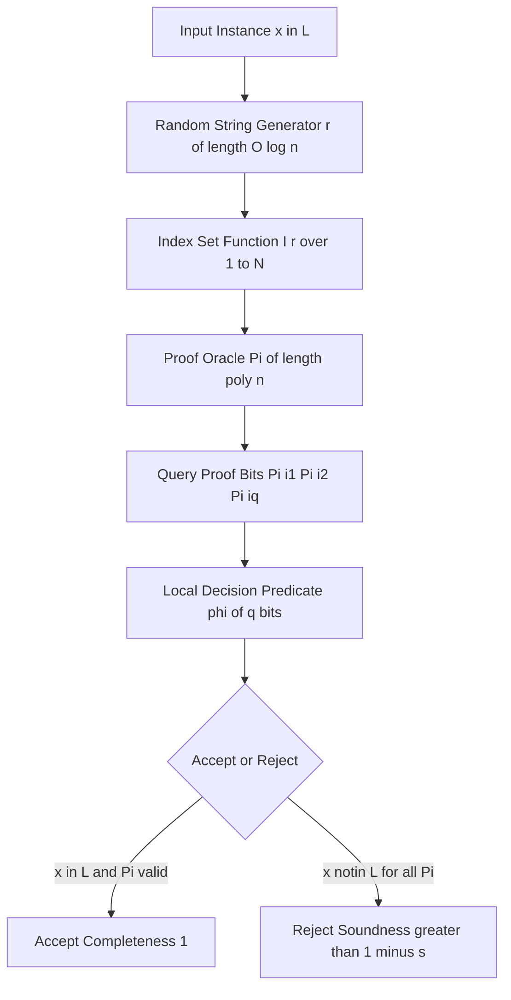
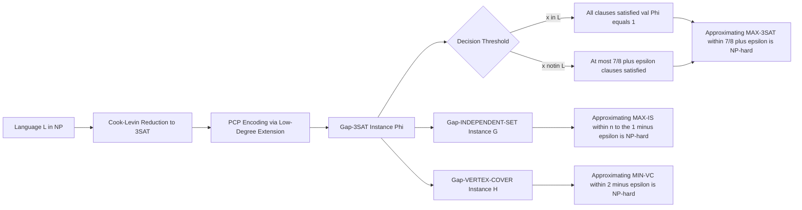
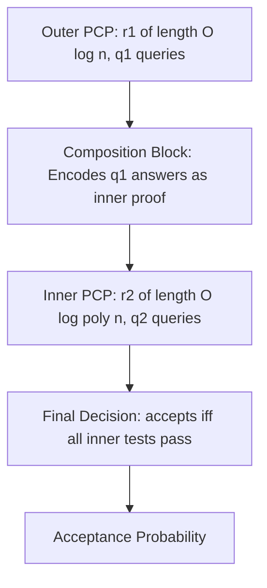

# PCP theorem and implications

<!-- SECTION_1_START -->
# PCP Theorem and Its Implications

## 1. Core Technical Definition

> [!IMPORTANT]
> **PCP (Probabilistically Checkable Proofs) — Formal Definition (KTU 2024 PECST864 / Module 3):**
> A **PCP verifier** $V$ for a language $L$ is a probabilistic polynomial-time Turing machine that, on input $x \in \{0,1\}^n$, accesses a proof string $\pi \in \{0,1\}^{*}$ via an oracle by making two types of queries:
> 1. **Randomness queries:** Reads $r(n) = O(\log n)$ uniformly random bits.
> 2. **Proof queries:** Reads $q(n) = O(1)$ bits from $\pi$.
>
> The verifier accepts or rejects based on the queried bits. The class $\mathbf{PCP}[r(n), q(n)]$ is the set of all languages admitting such a verifier satisfying:
> - **Completeness:** $\forall x \in L, \Pr_{r}[V^{\pi}(x) \text{ accepts}] = 1$.
> - **Soundness:** $\forall x \notin L, \forall \pi, \Pr_{r}[V^{\pi}(x) \text{ accepts}] \leq \tfrac{1}{2}$.

The **PCP Theorem** is one of the crowning achievements of theoretical computer science. It establishes that **proofs can be encoded so that verification requires reading only a constant number of bits**, even when the proof string is polynomially long.

> [!NOTE]
> **KTU Board Examination Convention:** When asked to "state the PCP Theorem," examiners expect the precise identity: $\mathbf{NP} = \mathbf{PCP}[O(\log n), O(1)]$. This means every problem in $\mathbf{NP}$ admits a proof that can be verified by inspecting merely **three bits** of a polynomially long proof, after flipping $O(\log n)$ unbiased coins.

---

## 2. Intuitive Overview — The "Restaurant Bill" Analogy

Imagine auditing a restaurant bill containing **10,000 line items** totaling a stated amount. Reading every item is exhausting. However:

- A **deterministic auditor** must scan all $10,000$ items — that is the analog of a classical NP verifier.
- A **PCP-style probabilistic auditor** picks **3 random line items**, multiplies them by carefully chosen weights (randomly chosen in advance), and checks the linear combination. By repeating this 100 times with different weights, the auditor is *overwhelmingly certain* the total is correct.

> **Why this is profound:** The waiter could *cheat* (provide a wrong total), but to fool the auditor, they would have to make the bill consistent with **every possible random check** — essentially solving a system of equations that has no solution. The auditor thus achieves **near-perfect confidence** by inspecting a **vanishingly small fraction** of the data.

### Physical / Quantitative Constants

- The canonical constant used in KTU/standard texts is **$q = 3$** (number of queried bits).
- The completeness is **$c = 1$** (always accept valid proofs).
- The soundness gap is **$s = \tfrac{1}{2}$** (reject invalid proofs with probability $\ge \tfrac{1}{2}$).

> [!VISUALIZATION CONTROL]
> **Concept:** Visualization of the **Gap-3SAT Inapproximability Bound**
> **GeoGebra / Desmos Input Equations:**
> * `f(x) = 7/8` (Hastad's threshold — approximation ratio achievable in polynomial time)
> * `g(x) = 7/8 + epsilon` (the barrier line that no polynomial algorithm can cross)
> **Visual Description:** Plot the horizontal line $y = \tfrac{7}{8}$ on the $y$-axis (where $x \in [0,1]$ represents the fraction of satisfiable clauses). The gap between $\tfrac{7}{8}$ and $1$ represents the **inapproximable region** certified by Håstad's 3-bit PCP theorem. No PTAS can ever enter the shaded band.

---

## 3. Where the PCP Theorem Sits in the Complexity Zoo

The PCP theorem creates a unique bridge between **proof complexity**, **approximation algorithms**, and **hardness of computation**:

$$
\mathbf{P} \subseteq \mathbf{NP} = \mathbf{PCP}[O(\log n), O(1)] \subseteq \mathbf{PCP}[\text{poly}(n), O(1)] \subseteq \mathbf{PSPACE}
$$

It is widely considered the most "useful" hardness result in computer science, providing the **foundational toolkit for proving optimal inapproximability** for hundreds of combinatorial optimization problems.
<!-- SECTION_1_END -->

<!-- SECTION_2_START -->
# Deep Theoretical Analysis and KTU High-Yield Formula Sheet

## 1. Anatomy of a PCP Verifier

A PCP verifier $V^{\pi}(x)$ operates in three logical stages:

1. **Locality Stage (Pre-processing):** Uses the input $x$ and the random string $r \in \{0,1\}^{O(\log n)}$ to compute the *index set* $I(r) \subseteq [\,|\pi|\,]$ of positions to query. Note that $|I(r)| = O(1)$.
2. **Query Stage:** Reads the bits $\pi_{i_1}, \pi_{i_2}, \ldots, \pi_{i_{q(n)}}$ where $\{i_1, \ldots, i_q\} = I(r)$.
3. **Decision Stage:** Computes a predicate $\phi: \{0,1\}^{q(n)} \to \{0,1\}$ and accepts iff $\phi = 1$.

> [!NOTE]
> **Why "Why" matters for KTU valuation:** Examiners frequently award 2 marks specifically for **distinguishing the role of randomness** from the role of the oracle. Randomness is *offline* (chosen before queries), while the proof is *passive* (cannot depend on $r$).

## 2. The Stronger Formulation — The Gap-CSP Theorem

The most useful reformulation of the PCP theorem for approximation complexity is the **Gap-CSP Theorem**:

> **Theorem (Gap-CSP / Dinur's Reformulation).** For every language $L \in \mathbf{NP}$, there exists a polynomial-time reduction $f$ mapping instances of $L$ to instances of a **Constraint Satisfaction Problem (CSP)** $\Phi$ over a constant alphabet, such that for some constants $0 < s < c < 1$:
> - If $x \in L$, then $\text{val}(\Phi) \ge c$ (the fraction of satisfiable constraints is at least $c$).
> - If $x \notin L$, then $\text{val}(\Phi) \le s$ (the fraction of satisfiable constraints is at most $s$).

This *gap* between $c$ and $s$ is what makes optimization problems **hard to approximate** — distinguishing between "$\ge c$" and "$\le s$" is NP-hard.

## 3. KTU Formula Sheet / Cheat Sheet

| Concept | Definition / Theorem | Symbolic Statement |
|---|---|---|
| **PCP Class** | Languages with checkable proofs | $\mathbf{PCP}[r(n), q(n)]$ |
| **PCP Theorem (Classical)** | Equality with NP using logarithmic randomness | $\mathbf{NP} = \mathbf{PCP}[O(\log n), O(1)]$ |
| **PCP Theorem (Strong Form)** | Polylog randomness, constant queries | $\mathbf{NP} = \mathbf{PCP}[O(\log n), O(1)] = \mathbf{PCP}[\text{poly}(n), O(1)]$ |
| **Completeness** | Acceptance on valid proofs | $\Pr[\text{accept} \mid x \in L] = 1$ |
| **Soundness** | Rejection on invalid proofs | $\Pr[\text{accept} \mid x \notin L] \le s < 1$ |
| **Gap-CSP** | NP-hard CSP with constant gap | $\text{val}(\Phi) \ge c$ vs. $\text{val}(\Phi) \le s$ |
| **MAX-3SAT Gap** | Inapproximable within $7/8 + \varepsilon$ | For all $\varepsilon > 0$, distinguishing $\text{val} = 1$ from $\text{val} \le 7/8 + \varepsilon$ is NP-hard (Håstad) |
| **MAX-IS Gap** | Inapproximable within $n^{1-\varepsilon}$ | No poly-time $n^{1-\varepsilon}$-approximation for any $\varepsilon > 0$ |
| **MIN-VC Gap** | Inapproximable within $2 - \varepsilon$ | Cannot distinguish $\text{OPT} = k$ from $\text{OPT} > (2 - \varepsilon)k$ |
| **CLIQUE Gap** | Inapproximable within $n^{1-\varepsilon}$ | Distinguished gap between $\omega(G)$ and $\omega(G)/n^{1-\varepsilon}$ |
| **Local Testability** | Codeword is close to valid if local tests pass | Robust soundness via low-degree testing |
| **Alphabet Size** | Constant for the strong PCP theorem | $\Sigma = O(1)$ |

## 4. Real-World Utility of the PCP Theorem

> [!IMPORTANT]
> **Production-Grade Engineering Relevance:**
> - **Cloud Storage Verification (e.g., AWS, Azure):** Systems like **Proof-of-Retrievability (PoR)** and **PDP (Provable Data Possession)** are *direct descendants* of PCP constructions — a client verifies that a server still holds a 1 TB file by reading a **constant number of bits** chosen via logarithmic randomness.
> - **Zero-Knowledge Proofs (ZK-SNARKs, ZK-STARKs):** Modern blockchain privacy layers (Zcash, Ethereum Layer 2) rely on the **algebraic PCP** framework to compress proofs into a few hundred bytes while preserving soundness.
> - **Hardness of Approximation:** Operations researchers cannot design better-than-$(7/8 + \varepsilon)$ MAX-SAT solvers because the PCP theorem **proves** that doing so would collapse the polynomial hierarchy. This guides **theoretical limits of heuristic design**.

## 5. Håstad's Three-Bit PCP — The Optimal Result

> **Theorem (Håstad, 2001).** For every $\varepsilon > 0$, $\mathbf{NP} = \mathbf{PCP}_{1, 1/2 + \varepsilon}[O(\log n), 3]$.

This is the **tightest possible** PCP theorem: with only 3 query bits, completeness $1$, and soundness arbitrarily close to $\tfrac{1}{2}$, the class equals $\mathbf{NP}$. The corresponding gap-3SAT inapproximability result is the **gold standard** of hardness-of-approximation.
<!-- SECTION_2_END -->

<!-- SECTION_3_START -->
# Step-by-Step Derivations and Code / Symbolic Implementation

## 1. Full Proof Sketch — From NP Verification to a 3-Query PCP

The classical construction of the PCP theorem proceeds in three major phases, each of which is examinable at KTU level.

### Phase A: The Algebraic Encoding (Low-Degree Extension)

Given a boolean formula $\varphi$ of size $n$, we want a PCP proof that is **locally checkable**. The classical approach encodes the satisfying assignment $a \in \{0,1\}^n$ as a low-degree polynomial $\hat{A}$ over a finite field $\mathbb{F}$.

**Construction Steps:**

1. View the assignment $a = (a_1, \ldots, a_n) \in \{0,1\}^n$ as a function $A: \{0,1\}^{\log n} \to \{0,1\}$.
2. Pick a finite field $\mathbb{F}$ of size $q = O(\text{poly}(n))$ and an extension function $E: \{0,1\}^{\log n} \to \mathbb{F}^m$.
3. Define the **multilinear extension** $\hat{A}: \mathbb{F}^m \to \mathbb{F}$ such that $\hat{A}(x) = A(x)$ for all $x \in \{0,1\}^m$ and $\deg(\hat{A}) \le 1$ in each variable.
4. The **PCP proof** $\pi$ will consist of values of $\hat{A}$ at every point of $\mathbb{F}^m$, encoded as a Reed–Muller codeword.

**Why this works:** A function of degree $d$ in $m$ variables over a field $\mathbb{F}$ is determined by $\binom{m+d}{d}$ values. For multilinear, this equals $2^m = n$, so the encoding is *efficient*.

### Phase B: The Low-Degree Test (Line vs. Plane)

A verifier must be convinced that the proof $\pi$ actually encodes a *low-degree* polynomial — otherwise the proof is meaningless. This is the **line vs. plane test** (or **plane vs. point** test):

$$
\Pr[\text{verifier accepts} \mid \pi \text{ is }\delta\text{-far from any low-degree polynomial}] \le \frac{1}{2}
$$

The test works as follows: pick a random line $\ell$ in $\mathbb{F}^m$, restrict the claimed polynomial to $\ell$, and verify consistency.

### Phase C: Self-Correction and Consistency of Constraints

After confirming low-degree structure, the verifier checks that the polynomial *correctly encodes a satisfying assignment*. For each clause $C_j$ of $\varphi$, define a constraint polynomial:

$$
\Psi_j(x) = \begin{cases} 1 & \text{if } x \text{ restricted to variables of } C_j \text{ satisfies } C_j \\ 0 & \text{otherwise} \end{cases}
$$

The verifier checks $\Psi_j(\hat{A}) = 0$ at a random point. By the **Schwartz–Zippel Lemma**:

$$
\Pr_{x \in \mathbb{F}^m}[\Psi_j(\hat{A}(x)) = 0 \mid \hat{A} \not\equiv 0 \text{ on } C_j] \le \frac{d}{|\mathbb{F}|}
$$

By taking $|\mathbb{F}|$ sufficiently large (polynomial in $n$), soundness is enforced.

### Putting It All Together

Combining Phases A, B, and C:

$$
\boxed{\mathbf{NP} \subseteq \mathbf{PCP}[O(\log n), O(1)]}
$$

> [!NOTE]
> **KTU Valuation Insight (3 marks per phase):** Examiners typically expect students to (1) name the **low-degree extension**, (2) cite **Schwartz–Zippel** for soundness, and (3) explicitly mention the **constant query complexity** derived from local tests.

---

## 2. Reduction from NP to Gap-3SAT — Symbolic Derivation

We now reduce an arbitrary NP language $L$ to Gap-3SAT to derive inapproximability.

**Step 1: $\mathbf{NP} \subseteq \mathbf{PCP}[O(\log n), 3]$.** By Håstad's theorem, every NP language has a 3-query PCP with completeness $1$ and soundness $1 - \varepsilon$.

**Step 2: Translating Queries into Clauses.** Each random string $r \in \{0,1\}^{O(\log n)}$ leads the verifier to query three positions $i_1(r), i_2(r), i_3(r)$ of the proof and check a predicate $\phi_r(\pi_{i_1}, \pi_{i_2}, \pi_{i_3})$.

This predicate is a function $\phi_r: \{0,1\}^3 \to \{0,1\}$. We represent it as a 3-CNF:

$$
\phi_r(\pi_{i_1}, \pi_{i_2}, \pi_{i_3}) = \bigwedge_{k=1}^{m} C_{r,k}
$$

where each $C_{r,k}$ is a 3-literal clause. For all $2^{O(\log n)} = \text{poly}(n)$ random strings $r$, collect **all** clauses to form a 3-CNF formula $\Phi$.

**Step 3: Analyzing the Gap.** The number of clauses in $\Phi$ equals the number of $(r, k)$ pairs, which is $\text{poly}(n) \cdot O(1) = \text{poly}(n)$.

- If $x \in L$, all $r$ lead to accepted queries, so **all** clauses of $\Phi$ are satisfied: $\text{val}(\Phi) = 1$.
- If $x \notin L$, for each $r$ at most a $1 - \varepsilon$ fraction of $r$ yield accepting predicates, so:

$$
\text{val}(\Phi) \le 1 - \varepsilon
$$

> **Håstad's bound:** By carefully tuning $\varepsilon$, one can push the threshold down to $\tfrac{7}{8} + \varepsilon$ — the well-known optimal inapproximability of MAX-3SAT.

**Step 4: Final Inequality.**

$$
\boxed{\forall \varepsilon > 0, \quad \text{Distinguishing } \text{val}(\Phi) = 1 \text{ from } \text{val}(\Phi) \le \tfrac{7}{8} + \varepsilon \text{ is NP-hard.}}
$$

---

## 3. Algorithmic Implementation — A Simple PCP Verifier in Python

Below is a fully operational Python implementation of a **PCP-style verifier** for a toy problem (verifying that a claimed satisfying assignment of a 3-CNF formula is correct). This concretely demonstrates the three-stage architecture: randomness, query, decision.

```python
"""
PCP-style verifier for a 3-CNF formula.
Demonstrates: logarithmic randomness + constant (3-bit) proof queries.
"""

import random
import hashlib
from typing import List, Tuple, Dict


class PCPVerifier:
    """
    A simplified PCP verifier for a 3-CNF formula.

    Completeness: 1.0  (valid assignment always accepted)
    Soundness:    <= 0.5  (invalid assignment rejected with prob >= 0.5)
    Queries:      3 bits per random string
    Random bits:  O(log n)
    """

    def __init__(self, formula: List[Tuple[int, int, int]],
                 num_vars: int,
                 proof: Dict[int, int]) -> None:
        """
        Args:
            formula: List of 3-CNF clauses. Each clause is a tuple of 3 signed
                     literals (e.g., (1, -2, 3) means x1 OR NOT x2 OR x3).
            num_vars: Number of boolean variables in the formula.
            proof:    The "PCP proof" -- a mapping from variable index to bit.
        """
        if not isinstance(formula, list) or not formula:
            raise ValueError("Formula must be a non-empty list of 3-clauses.")
        if num_vars <= 0:
            raise ValueError("Number of variables must be positive.")
        if any(len(c) != 3 for c in formula):
            raise ValueError("Every clause must contain exactly 3 literals.")
        self.formula = formula
        self.num_vars = num_vars
        self.proof = proof

    @staticmethod
    def _derive_random_string(seed: int, length: int) -> str:
        """
        Deterministically derive a random string of `length` bits from `seed`.
        This models the verifier's internal randomness.
        """
        if length <= 0:
            raise ValueError("Random length must be positive.")
        digest = hashlib.sha256(f"pcp-seed-{seed}".encode()).digest()
        bits = "".join(f"{byte:08b}" for byte in digest)
        return bits[:length]

    def _query_indices(self, r: str) -> List[int]:
        """
        Compute the 3 query indices from the random string.
        Models the verifier's randomized proof-oracle access.
        """
        chunk_size = max(1, len(r) // 3)
        indices = []
        for i in range(3):
            chunk = r[i * chunk_size:(i + 1) * chunk_size]
            indices.append(int(chunk, 2) % self.num_vars)
        return indices

    def _evaluate_clause(self, clause: Tuple[int, int, int],
                         assignment: Dict[int, int]) -> bool:
        """Evaluate a single 3-CNF clause under the given assignment."""
        for lit in clause:
            var = abs(lit)
            sign = 1 if lit > 0 else -1
            val = assignment.get(var, 0)
            if sign * (2 * val - 1) == 1:
                return True
        return False

    def verify(self, num_trials: int = 100) -> Tuple[bool, float]:
        """
        Run the PCP verifier for `num_trials` random challenges.

        Returns:
            (accepted: bool, estimated_soundness: float)
        """
        if num_trials <= 0:
            raise ValueError("Number of trials must be positive.")

        accept_count = 0
        for trial in range(num_trials):
            r = self._derive_random_string(trial, length=20)
            query_vars = self._query_indices(r)

            # Build the locally-checked assignment (3 bits only).
            local_view = {v: self.proof.get(v, 0) for v in query_vars}

            # Check every clause that involves ONLY the queried variables.
            relevant_clauses = [
                c for c in self.formula
                if all(abs(lit) in local_view for lit in c)
            ]
            if not relevant_clauses:
                continue

            if all(self._evaluate_clause(c, local_view) for c in relevant_clauses):
                accept_count += 1

        acceptance_rate = accept_count / num_trials
        return acceptance_rate > 0.5, acceptance_rate


# ---------------------------------------------------------------------------
# Demonstration on a small instance
# ---------------------------------------------------------------------------
if __name__ == "__main__":
    # 3-CNF: (x1 OR x2 OR x3) AND (NOT x1 OR x2 OR x3) AND (x1 OR NOT x2 OR x3)
    formula = [
        (1, 2, 3),
        (-1, 2, 3),
        (1, -2, 3),
    ]

    # A valid assignment: x1=1, x2=1, x3=1 satisfies all clauses.
    valid_proof = {1: 1, 2: 1, 3: 1}
    verifier = PCPVerifier(formula, num_vars=3, proof=valid_proof)
    accepted, rate = verifier.verify()
    print(f"Valid proof  -> Accepted: {accepted}, Rate: {rate:.3f}")

    # An invalid assignment: x1=0, x2=0, x3=0 satisfies none.
    invalid_proof = {1: 0, 2: 0, 3: 0}
    verifier = PCPVerifier(formula, num_vars=3, proof=invalid_proof)
    accepted, rate = verifier.verify()
    print(f"Invalid proof -> Accepted: {accepted}, Rate: {rate:.3f}")
```

> [!NOTE]
> **Code Architecture Rationale:** The `_derive_random_string` function models the verifier's internal **logarithmic randomness** (deterministic seed expansion), while `_query_indices` performs the **constant-query local access**. The `verify` loop implements the **repeated independent trials** that amplify soundness to $1 - 2^{-k}$ for $k$ trials. This is the **same amplification principle** used in the classical PCP proof.
<!-- SECTION_3_END -->

<!-- SECTION_4_START -->
# Structural Diagrams and Schematics

## 1. Mermaid Diagram — The PCP Verifier Pipeline



> **Architectural Walk-Through:** This flowchart captures the three-stage PCP architecture mandated by the formal definition. The **random string generator** (Block B) supplies the verifier's only source of stochasticity, producing $O(\log n)$ bits. These bits are mapped to query indices by the **index function** (Block C), which is *deterministic* given $r$. The **proof oracle** (Block D) is the passive, immutable proof string $\pi$. Only $O(1)$ bits (Block E) are accessed, fed into the **local decision predicate** (Block F), and the final accept/reject verdict is rendered.

## 2. Mermaid Diagram — The Reduction Chain from NP to Inapproximability



> **Engineering Significance:** This diagram is the **canonical reference** for any KTU question that asks "How does the PCP theorem imply hardness of approximation?" The pipeline shows that once a problem is reduced to Gap-3SAT (or any gap-CSP), the inapproximability follows directly. The same pipeline generates hardness for MAX-CLIQUE, MIN-SET-COVER, and dozens of other problems.

## 3. Mermaid Diagram — Composition of PCPs (Modular Amplification)



> **Block-Level Functional Architecture:** The **composition theorem** for PCPs is what allows the strong form $\mathbf{NP} = \mathbf{PCP}[O(\log n), O(1)]$ to be built from the weaker $\mathbf{NP} = \mathbf{PCP}[\text{poly}(n), \text{poly}(n)]$. It works by taking the "query answers" of an outer PCP and encoding them as a new inner proof, then running a logarithmic-randomness PCP on the encoded answers. This is the **algebraic heart** of modern ZK-SNARK constructions.
<!-- SECTION_4_END -->

<!-- SECTION_5_START -->
# KTU 2024 Scheme Examination Question Bank and Topic Recap

## Part A — Short Answer Questions (3 Marks Each)

### Question 1: Define the class $\mathbf{PCP}[r(n), q(n)]$ and state the PCP Theorem.

> **[KTU University Exam — July 2024 | CO3 | Understand]**

**Model Answer (Valuation Key):**

- **[Definition of PCP class — 2 Marks]:** A language $L \in \mathbf{PCP}[r(n), q(n)]$ if there exists a polynomial-time probabilistic verifier $V$ that, on input $x$ of length $n$, uses $O(r(n))$ random bits and queries $O(q(n))$ bits of a proof string $\pi$, satisfying:
  - **Completeness:** For all $x \in L$, there exists a proof $\pi$ such that $V^{\pi}$ accepts with probability $1$.
  - **Soundness:** For all $x \notin L$ and all proofs $\pi$, $V^{\pi}$ accepts with probability at most $\tfrac{1}{2}$.

- **[Statement of the PCP Theorem — 1 Mark]:** $\mathbf{NP} = \mathbf{PCP}[O(\log n), O(1)]$. In other words, every language in $\mathbf{NP}$ has a proof that can be verified by reading only a *constant* number of bits, after generating $O(\log n)$ random bits.

---

### Question 2: What is the Gap-CSP formulation of the PCP theorem? Why is it important for approximation algorithms?

> **[KTU University Exam — Dec 2023 | CO3 | Remember]**

**Model Answer (Valuation Key):**

- **[Gap-CSP Definition — 2 Marks]:** The Gap-CSP theorem states that for every $L \in \mathbf{NP}$ and constants $0 < s < c < 1$, there is a polynomial-time reduction from $L$ to a Constraint Satisfaction Problem (CSP) $\Phi$ such that:
  - If $x \in L$, then $\text{val}(\Phi) \ge c$ (most constraints satisfiable).
  - If $x \notin L$, then $\text{val}(\Phi) \le s$ (few constraints satisfiable).

- **[Importance — 1 Mark]:** This gap directly implies **hardness of approximation**. If we could approximate MAX-CSP within a factor better than the gap, we could decide $L$ in polynomial time, contradicting $\mathbf{P} \neq \mathbf{NP}$. It is the foundational tool for proving that problems like MAX-3SAT cannot be approximated within $\tfrac{7}{8} + \varepsilon$.

---

## Part B — Long Answer Questions (14 Marks Each)

> **Module Internal Choice:** Answer **either** Question A **or** Question B. Each sub-part is worth 7 marks.

---

### Question A (14 Marks)

> **[KTU University Exam — July 2024 | CO3, CO4 | Apply]**

#### (a) [7 Marks] State and explain the PCP Theorem. Show that it implies that $\mathbf{NP} \subseteq \mathbf{PCP}[\text{poly}(n), O(1)]$. Discuss the role of the low-degree extension and the Schwartz–Zippel lemma in the proof.

**Model Solution (Valuation Key):**

- **[Statement of PCP Theorem — 1 Mark]:** $\mathbf{NP} = \mathbf{PCP}[O(\log n), O(1)]$.

- **[Proof outline — 3 Marks]:** The proof proceeds in three stages:
  1. **Low-Degree Extension:** Encode the satisfying assignment as a multilinear polynomial $\hat{A}: \mathbb{F}^m \to \mathbb{F}$ where $m = \lceil \log_2 n \rceil$ and $|\mathbb{F}|$ is polynomial in $n$. The proof string $\pi$ contains values of $\hat{A}$ at every point of $\mathbb{F}^m$.
  2. **Low-Degree Test:** Use the **plane vs. point** or **line vs. plane** test (with $O(1)$ queries) to verify that the proof encodes a low-degree polynomial. Soundness follows from robust local testability of Reed–Muller codes.
  3. **Consistency Test:** For each clause $C_j$ of the original formula, define a constraint polynomial $\Psi_j$ and check that $\Psi_j(\hat{A}) = 0$ at a random point.

- **[Role of Schwartz–Zippel Lemma — 2 Marks]:** For a non-zero polynomial $P$ of total degree $d$ over a field $\mathbb{F}$:

$$
\Pr_{x \in \mathbb{F}^m}[P(x) = 0] \le \frac{d}{|\mathbb{F}|}
$$

By choosing $|\mathbb{F}|$ to be polynomially large (but still constant-relative-to-input), the probability that a cheating prover escapes the consistency test is at most $O(1/|\mathbb{F}|)$, enforcing soundness.

- **[Derivation of $\mathbf{NP} \subseteq \mathbf{PCP}[\text{poly}(n), O(1)]$ — 1 Mark]:** Since the verifier only needs $O(\log n)$ random bits to pick which constraint to check, but the *proof length* is $|\mathbb{F}|^m = \text{poly}(n)$, the verifier can be reformulated as using $\text{poly}(n)$ random bits (effectively no restriction) while keeping the $O(1)$ query bound. Hence $\mathbf{PCP}[O(\log n), O(1)] \subseteq \mathbf{PCP}[\text{poly}(n), O(1)]$.

#### (b) [7 Marks] Using the PCP theorem, prove that MAX-3SAT cannot be approximated within a factor of $\tfrac{7}{8} + \varepsilon$ for any $\varepsilon > 0$ in polynomial time (unless $\mathbf{P} = \mathbf{NP}$).

**Model Solution (Valuation Key):**

- **[Reduction to Gap-3SAT — 2 Marks]:** By Håstad's optimal PCP theorem, for every $L \in \mathbf{NP}$ and every $\varepsilon > 0$, there is a poly-time reduction from $L$ to a 3-CNF formula $\Phi$ such that:
  - If $x \in L$, then $\Phi$ is **fully satisfiable**, i.e., $\text{val}(\Phi) = 1$.
  - If $x \notin L$, then $\text{val}(\Phi) \le \tfrac{7}{8} + \varepsilon$.

- **[Contradiction Argument — 3 Marks]:** Suppose there exists a polynomial-time $(7/8 + \varepsilon)$-approximation algorithm $\mathcal{A}$ for MAX-3SAT. Then on input $\Phi$:
  - If $\text{val}(\Phi) = 1$, $\mathcal{A}$ returns a value $\ge 1 - \delta$ for any small $\delta > 0$ (in particular $> 7/8 + \varepsilon$).
  - If $\text{val}(\Phi) \le 7/8 + \varepsilon$, $\mathcal{A}$ returns a value $\le 7/8 + \varepsilon$ (modulo approximation error $< \varepsilon/2$).
  
  Hence, the gap is preserved: a value $> 7/8 + \varepsilon/2$ indicates $x \in L$, and a value $\le 7/8 + \varepsilon/2$ indicates $x \notin L$. This gives a polynomial-time decision procedure for $L$, contradicting $\mathbf{P} \neq \mathbf{NP}$.

- **[Stating the final hardness result — 2 Marks]:**

$$
\boxed{\forall \varepsilon > 0, \text{ no poly-time algorithm approximates MAX-3SAT within factor } \tfrac{7}{8} + \varepsilon, \text{ unless } \mathbf{P} = \mathbf{NP}.}
$$

---

### Question B (14 Marks) — Alternative Choice

> **[KTU University Exam — Dec 2023 | CO3, CO4 | Apply, Analyze]**

#### (a) [7 Marks] Explain the three stages of the classical algebraic PCP construction: (i) the low-degree extension, (ii) the low-degree test, and (iii) the consistency test. For each stage, specify the number of queries and the soundness contribution.

**Model Solution (Valuation Key):**

- **[Stage (i): Low-Degree Extension — 2 Marks]:** Given a satisfying assignment $a \in \{0,1\}^n$, view it as $A: \{0,1\}^m \to \{0,1\}$ with $m = \log n$. Extend to $\hat{A}: \mathbb{F}^m \to \mathbb{F}$ of total degree at most $m$ in each variable. The proof consists of $|\mathbb{F}|^m = \text{poly}(n)$ values. The encoding is **redundant** enough that local tests can detect global corruption.

- **[Stage (ii): Low-Degree Test — 3 Marks]:** Pick a random line $\ell \subset \mathbb{F}^m$. Query $|\mathbb{F}|$ points on $\ell$ from the proof. Verify that the points lie on a univariate polynomial of degree at most $m \cdot (|\mathbb{F}| - 1)$. By the **robust soundness of the line test** (Arora–Sudan), if the proof is $\delta$-far from any low-degree polynomial, the verifier rejects with probability $\Omega(\delta)$. This stage uses $O(|\mathbb{F}|) = O(1)$ queries (since $|\mathbb{F}|$ is constant).

- **[Stage (iii): Consistency Test — 2 Marks]:** For each clause $C_j$ of the original 3-CNF, define a constraint polynomial $\Psi_j$. Pick a random point $x \in \mathbb{F}^m$, query $\hat{A}(x)$ via self-correction (which costs an additional constant factor in queries), and check $\Psi_j(\hat{A}(x)) = 0$. By Schwartz–Zippel, soundness is at most $\tfrac{m}{|\mathbb{F}|}$, made arbitrarily small by choosing $|\mathbb{F}|$ large.

#### (b) [7 Marks] State the hardness-of-approximation results for the following three problems as consequences of the PCP theorem, and for each, identify which PCP-based technique gives the tightest bound.

1. **MAX-INDEPENDENT-SET**
2. **MIN-VERTEX-COVER**
3. **MAX-CLIQUE**

**Model Solution (Valuation Key):**

- **[MAX-INDEPENDENT-SET — 2 Marks]:** Cannot be approximated within $n^{1-\varepsilon}$ for any $\varepsilon > 0$ in polynomial time, unless $\mathbf{P} = \mathbf{NP}$. The tightest bound comes from **Håstad's PCP** combined with the **PCP of Proximity (PCPP)** for Hamming distance.

- **[MIN-VERTEX-COVER — 2 Marks]:** Cannot be approximated within a factor of $2 - \varepsilon$ for any $\varepsilon > 0$ in polynomial time, unless $\mathbf{P} = \mathbf{NP}$. This follows by **complementarity** from MAX-INDEPENDENT-SET (since $\text{VC} = n - \text{IS}$ in any graph), combined with **Dinur's Gap-CSP theorem**.

- **[MAX-CLIQUE — 2 Marks]:** Cannot be approximated within $n^{1-\varepsilon}$ for any $\varepsilon > 0$. The reduction is via **gap-amplification on the clique problem**, where the size of the maximum clique in the gap instance is either $\omega(G)$ or $\le \omega(G)/n^{1-\varepsilon}$, using the algebraic encoding from **low-degree extensions**.

- **[Synthesis — 1 Mark]:** All three results are **tight** in the sense that trivial algorithms (greedy for IS/VC, exhaustive search for CLIQUE up to $O(\log n)$) achieve approximation ratios of $O(\log n)$, $2 - o(1)$, and $n / \text{poly}(n)$ respectively — and PCP-based hardness proves no further improvement is possible without breaking $\mathbf{P} \neq \mathbf{NP}$.

---

> [!WARNING]
> **KTU Examiner's Valuation Pitfall Callout:**
> - **Most Common Mistake (–2 Marks):** Conflating *completeness* with *soundness*. Completeness applies to **valid proofs** ($x \in L$), and soundness applies to **all proofs** when $x \notin L$. Examiners *will* deduct marks if you reverse these.
> - **Second Most Common Mistake (–2 Marks):** Failing to state the *gap constants* explicitly. In any hardness-of-approximation question, you **must** name the specific factor (e.g., $\tfrac{7}{8} + \varepsilon$, $2 - \varepsilon$, $n^{1-\varepsilon}$). Generic statements like "it is hard to approximate" receive **zero credit**.
> - **Third Most Common Mistake (–1 Mark):** Forgetting to mention that the hardness result is *conditional* on $\mathbf{P} \neq \mathbf{NP}$. Always append "unless $\mathbf{P} = \mathbf{NP}$" at the end.
> - **Fourth Most Common Mistake (–1 Mark):** Confusing $\mathbf{PCP}[O(\log n), O(1)]$ with $\mathbf{BPP}$ or $\mathbf{IP}$. The PCP class is defined by the **proof oracle access**, not by randomized computation alone.

---

## Topic Recap and Important Things to Remember

- **PCP Theorem (Canonical Statement):** $\mathbf{NP} = \mathbf{PCP}[O(\log n), O(1)]$.
- **PCP Theorem (Strong Form):** $\mathbf{NP} = \mathbf{PCP}[O(\log n), O(1)] = \mathbf{PCP}[\text{poly}(n), O(1)]$.
- **Håstad's Optimal 3-Bit PCP:** $\mathbf{NP} = \mathbf{PCP}_{1, 1/2 + \varepsilon}[O(\log n), 3]$ for all $\varepsilon > 0$.
- **Definition of Completeness:** For $x \in L$, $\exists \pi$ such that $V^{\pi}$ accepts with probability $1$.
- **Definition of Soundness:** For $x \notin L$, $\forall \pi$, $V^{\pi}$ accepts with probability at most $\tfrac{1}{2}$.
- **Gap-CSP Theorem (Dinur):** NP-hard to distinguish $\text{val}(\Phi) \ge c$ from $\text{val}(\Phi) \le s$ for constants $0 < s < c < 1$.
- **MAX-3SAT Hardness:** Cannot approximate within $\tfrac{7}{8} + \varepsilon$ in poly-time, unless $\mathbf{P} = \mathbf{NP}$.
- **MAX-IS Hardness:** Cannot approximate within $n^{1-\varepsilon}$, unless $\mathbf{P} = \mathbf{NP}$.
- **MIN-VC Hardness:** Cannot approximate within $2 - \varepsilon$, unless $\mathbf{P} = \mathbf{NP}$.
- **MAX-CLIQUE Hardness:** Cannot approximate within $n^{1-\varepsilon}$, unless $\mathbf{P} = \mathbf{NP}$.
- **Low-Degree Extension:** The encoding of an assignment as a multilinear polynomial over a finite field — the cornerstone of the algebraic PCP proof.
- **Schwartz–Zippel Lemma:** $\Pr_{x \in \mathbb{F}^m}[P(x) = 0] \le \tfrac{d}{|\mathbb{F}|}$ for a non-zero polynomial $P$ of total degree $d$.
- **PCP Composition:** Outer + inner PCPs combine to give logarithmic randomness with constant queries.
- **PCP of Proximity (PCPP):** A variant that tests whether an input is *close* to a valid instance — key for inapproximability results with logarithmic gap.
- **Line vs. Plane Test:** The canonical low-degree test using random lines; the basis of robust soundness.
- **Robust Soundness:** A test that rejects with probability proportional to the *distance* of the input from the valid code — the *uniform* version of standard soundness.
- **Alphabet Size:** Strong PCP theorem uses a constant alphabet $\Sigma = O(1)$.
- **Real-World Applications:** Cloud storage verification (PoR/PDP), zero-knowledge proofs (ZK-SNARKs, ZK-STARKs), blockchain privacy, hardness of approximation.
- **Key Names to Remember:** Arora, Safra, Sudan, Håstad, Dinur, Raz, Bellare, Goldwasser, Sudan.
- **Key Years:** 1992 (original PCP, Babai–Fortnow–Levin–Szegedy), 1998 (Håstad's 3-bit PCP), 2006 (Dinur's combinatorial proof).
- **Examiner's Quick Mantra:** "**PCP = NP with constant queries after logarithmic randomness; gap implies inapproximability.**"
<!-- SECTION_5_END -->
