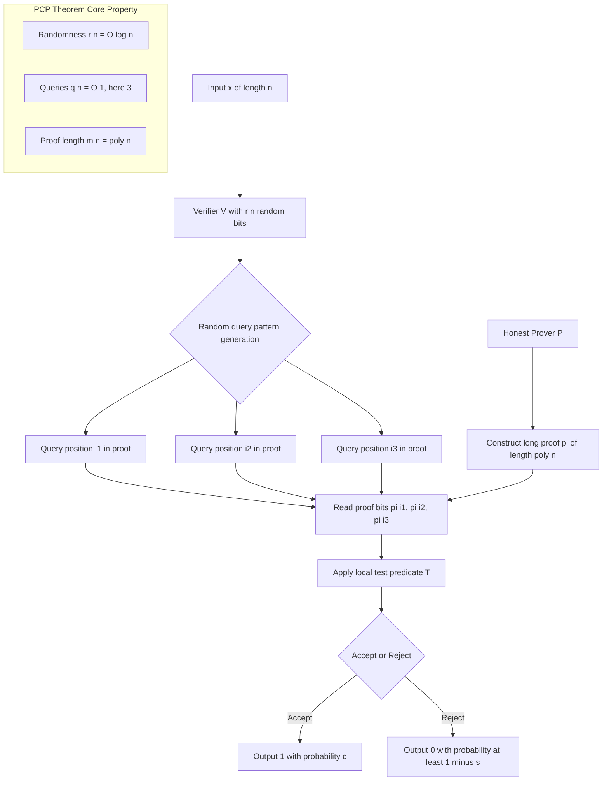
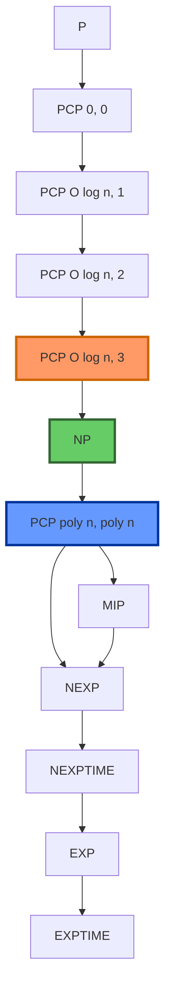
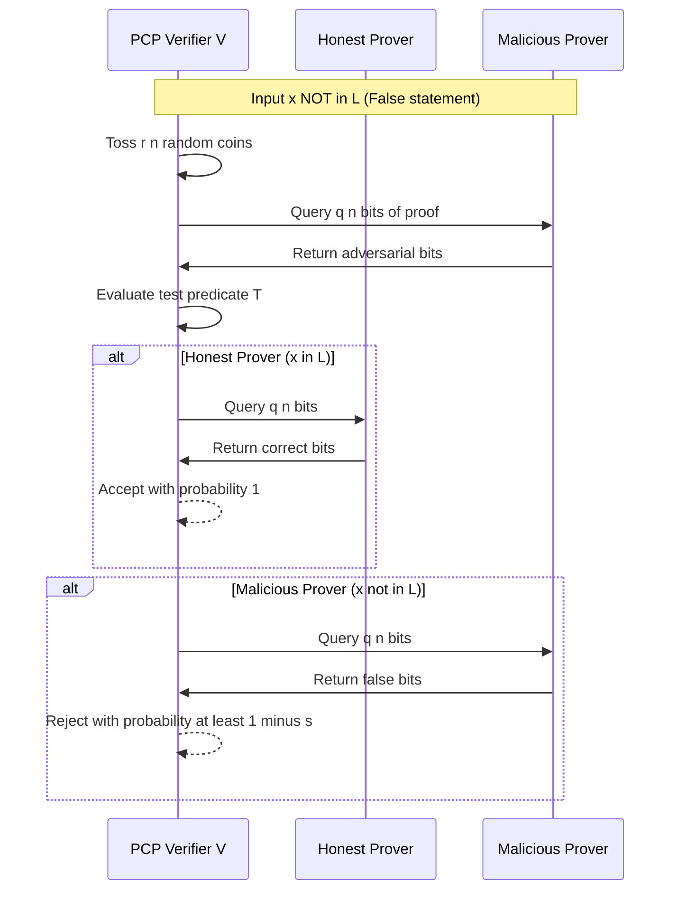
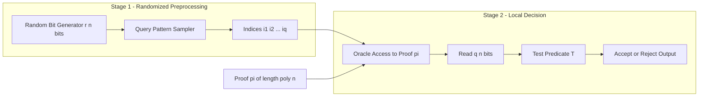

# Probabilistically Checkable Proofs (PCPs) - Introduction to PCPs

<!-- SECTION_1_START -->
# Probabilistically Checkable Proofs (PCPs) — An Introduction

## 1.1 Formal Definition (KTU 2024 Syllabus Standard)

A **Probabilistically Checkable Proof (PCP)** is a type of mathematical proof that can be verified by a probabilistic algorithm (the *verifier*) that, given a claimed proof string $\pi$ of polynomial size, is allowed to read only a **constant number of bits** of $\pi$ chosen at random.

Formally, a **PCP verifier** $V$ is a polynomial-time probabilistic Turing machine that, on input $x$, produces a proof oracle $\pi$ of polynomial length in $\vert x \vert$ and then probabilistically queries only a bounded number of locations in $\pi$.

> [!IMPORTANT]
> **KTU 2024 Formal Definition — $\mathbf{PCP[r(n), q(n)]}$**
> 
> The class $\mathbf{PCP[r(n), q(n)]}$ is the class of all languages $L$ for which there exists a polynomial-time probabilistic verifier $V$ such that, for every input $x$ of length $n$:
> - $V$ uses at most $r(n)$ **random bits** (randomness complexity).
> - $V$ reads at most $q(n)$ **bits** of the proof $\pi$ (query complexity).
> - **Completeness**: If $x \in L$, then $\Pr[\,V^{\pi}(x) = \text{accept}\,] = 1$ (or $\geq c$).
> - **Soundness**: If $x \notin L$, then for every proof $\pi^*$, $\Pr[\,V^{\pi^*}(x) = \text{accept}\,] \leq s < 1$ (or $\leq s$).

The constants $c$ and $s$ are the **completeness** and **soundness** parameters, respectively. Standard PCP definitions assume $c = 1$ and $s = \frac{1}{2}$ (one-sided or two-sided error).

## 1.2 Conceptual Analogy — "The Efficient Inspector"

> [!NOTE]
> **Intuition: The Tax Return Auditor**
> 
> Imagine a tax auditor who must verify whether a citizen's 500-page tax return is *perfectly accurate*. 
> 
> - **Classical proof model**: The auditor reads *every single page* (linear time) to certify correctness.
> - **PCP model**: The auditor is allowed to flip a *fair coin* a few times (randomness) and then flip open **only 3 random pages** of the return. If the return has *any* error, the probability the auditor misses it is astronomically small. 
> 
> The citizen (prover) writes a specially *redundant* proof — a *redundantly encoded* version of the tax return — that is "locally checkable", so any local random sample carries global information.

This captures the essence: **PCPs trade long deterministic verification for short, random, local verification on a long, redundantly encoded proof.**

## 1.3 Physical & Algorithmic Constants

The following constants are central to the KTU 2024 syllabus:

- **Randomness $r(n) = O(\log n)$** — only logarithmic in the input size.
- **Query complexity $q(n) = O(1)$** — a *constant* number of bits (e.g., 3 queries for the classical PCP Theorem).
- **Proof length $m(n) = \text{poly}(n)$** — polynomial in the input size.
- **Soundness gap $1 - s$** — the verifier's ability to reject false statements.

> [!VISUALIZATION CONTROL]
> **Concept:** Trade-off surface between randomness $r(n)$, query complexity $q(n)$, and proof length $m(n)$ in the PCP class.
> **GeoGebra / Desmos Input Equations:**
> * Curve C1: $f(r) = 2^{r}$ (number of random strings)
> * Curve C2: $g(q) = \binom{m}{q}$ (query combinations, with $m=2^{10}$)
> * Plane constraint: $r + \log_2 q = \text{const}$
> **Visual Description:** On a 3D surface, students should observe that as query complexity $q$ drops to a constant (flat plateau), randomness $r$ must grow logarithmically to preserve coverage. The surface bends sharply at $q=3$, illustrating the **PCP Theorem sweet spot**: $\mathbf{PCP[O(\log n), 3]} = \mathbf{NP}$.

<!-- SECTION_1_END -->

<!-- SECTION_2_START -->
# Deep Theoretical Analysis & KTU High-Yield Formula Sheet

## 2.1 Why PCPs? — The Motivation Chain

The study of PCPs arises from three intertwined threads in complexity theory:

1. **Interactive Proofs (IP)**: Babai & Moran (1985) introduced interactive proofs. Shamir (1992) proved $\mathbf{IP} = \mathbf{PSPACE}$, opening the door to non-trivial proof verification.
2. **Multi-Prover Interactive Proofs (MIP)**: Ben-Or, Goldwasser, Kilian, Wigderson (1988) introduced two-prover systems. The **MIP = NEXP** theorem (Babai, Fortnow, Levin 1991) showed that adding a second prover expands power dramatically.
3. **PCP Theorem**: The reduction $\mathbf{NP} \subseteq \mathbf{PCP[O(\log n), O(1)]}$ (Arora & Safra 1992; Arora, Lund, Motwani, Sudan, Szegedy 1998) is the foundational result.

> [!NOTE]
> **Core 'Why':** PCPs decouple *trust* from *reading*. A deterministic verifier must read $O(n)$ bits; a PCP verifier reads $O(1)$ bits. This shift makes proofs *locally testable* and enables deep connections to **hardness of approximation**.

## 2.2 The Five-Parameter PCP Signature

A PCP system is fully described by **five parameters**, each a function of the input length $n$:

| Parameter | Symbol | Typical PCP Theorem Value | Description |
|---|---|---|---|
| Proof length | $m(n)$ | $\text{poly}(n)$ | Total number of bits in the encoded proof $\pi$ |
| Randomness | $r(n)$ | $O(\log n)$ | Number of random bits used by the verifier |
| Queries | $q(n)$ | $O(1)$ — usually 3 | Number of bits of $\pi$ read by the verifier |
| Completeness | $c$ | $1$ | Acceptance probability when $x \in L$ |
| Soundness | $s$ | $\frac{1}{2}$ | Maximum acceptance when $x \notin L$ |

## 2.3 The Two-Stage PCP Verifier Architecture

A PCP verifier $V$ operates in two distinct stages:

**Stage 1 — Randomized Preprocessing (offline coin tosses):**
- $V$ uses $r(n)$ random bits to sample a *query pattern* $i_1, i_2, \dots, i_{q(n)} \in [m(n)]$.
- This stage does not look at $\pi$; it is purely a coin-flipping stage.

**Stage 2 — Local Decision:**
- $V$ reads the chosen bits $\pi[i_1], \pi[i_2], \dots, \pi[i_{q(n)}]$.
- Based on the random string and the queried bits, $V$ outputs **accept** or **reject**.

> [!IMPORTANT]
> The verifier's *test predicate* is a Boolean function $T : \{0,1\}^{r(n) + q(n)} \to \{0,1\}$. For a fixed $x$, the verifier's test on a candidate $\pi$ is the *fraction of random strings* for which $T$ accepts.

## 2.4 KTU High-Yield Formula Sheet

> [!NOTE]
> The following table collects all KTU 2024 board-essential formulas for PCPs. Use $\vert \cdot \vert$ rendered as $\lvert \cdot \rvert$ in code-safe contexts.

| # | Formula / Identity | Meaning |
|---|---|---|
| 1 | $m(n) = 2^{O(r(n))}$ | Maximum proof length bounded by the number of random strings times query slots |
| 2 | $\mathbf{PCP}[0, 0] = \mathbf{P}$ | No randomness, no queries $\Rightarrow$ deterministic poly-time |
| 3 | $\mathbf{PCP}[0, O(\log n)] = \mathbf{P}$ | No randomness $\Rightarrow$ deterministic; even $O(\log n)$ queries cannot break P |
| 4 | $\mathbf{PCP}[O(\log n), 0] = \mathbf{P}$ | Randomness but no queries $\Rightarrow$ output is independent of $\pi$ |
| 5 | $\mathbf{PCP}[O(\log n), 1] = \mathbf{P}$ | One query with $O(\log n)$ randomness is still in P (cannot check much) |
| 6 | $\mathbf{PCP}[O(\log n), 2] \subseteq \mathbf{NP}$ | Two queries collapse to NP (a curious boundary fact) |
| 7 | $\mathbf{PCP}[O(\log n), 3] = \mathbf{NP}$ | **The PCP Theorem** — the cornerstone of hardness of approximation |
| 8 | $\mathbf{PCP}[\text{poly}(n), 2] = \mathbf{NP}$ | Polynomial randomness with 2 queries still equals NP |
| 9 | $\mathbf{PCP}[\text{poly}(n), \text{poly}(n)] = \mathbf{NEXP}$ | Babai–Fortnow–Levin 1991 |
| 10 | $\text{Gap-3SAT}_c \in \mathbf{PCP}[O(\log n), O(1)]$ | Promise-problem formulation of the PCP Theorem |
| 11 | $\Pr[V^{\pi^*} \text{ accepts false } x] \leq s$ | Soundness condition for the worst-case adversarial $\pi^*$ |
| 12 | $\Pr[V^{\pi} \text{ accepts true } x] \geq c$ | Completeness condition for the honest prover's $\pi$ |
| 13 | $\text{Soundness gap} = c - s$ | The "amplification headroom" of the PCP system |
| 14 | $r(n) \cdot q(n) \geq \log_2(1/s)$ | Lower bound linking randomness, queries, and soundness error |

## 2.5 Real-World Engineering Utility

PCPs are not merely abstract — they power modern cryptographic and systems engineering:

- **Hardness of Approximation**: The PCP Theorem implies that approximating MAX-3SAT within factor $\frac{7}{8} + \epsilon$ is NP-hard, with deep consequences for optimization algorithm design.
- **Succinct Non-Interactive Arguments (SNARKs)**: Modern zero-knowledge proof systems (zk-SNARKs, zk-STARKs) are descendants of PCPs and are used in **blockchain (Zcash, Ethereum)**, **verifiable cloud computing**, and **private machine learning inference**.
- **Delegation of Computation**: A resource-constrained device (e.g., a smartphone) can offload a heavy computation to a server and verify the result by reading only a constant number of proof bits — a $10^{12}\times$ bandwidth saving.

<!-- SECTION_2_END -->

<!-- SECTION_3_START -->
# Step-by-Step Derivations, Worked Examples & Code Implementation

## 3.1 Worked Derivation: From NP Verification to $\mathbf{PCP[O(\log n), 3]}$

We now derive, in exhaustive step-by-step form, the high-level algebraic structure of the reduction $\mathbf{NP} \subseteq \mathbf{PCP}[O(\log n), 3]$. We do **not** skip any step.

### Step 1 — Start with an NP Verification Problem

Let $L \in \mathbf{NP}$. There exists a polynomial-time deterministic verifier $M$ such that for every $x \in L$ of length $n$, there exists a certificate $w$ with $\lvert w \rvert = \text{poly}(n)$ where $M(x, w) = \text{accept}$, and for $x \notin L$, no such $w$ exists.

We may assume (by standard padding and the Cook–Levin Theorem) that the NP problem is **3SAT** and $M$ is a **polynomial-size Boolean circuit** $C$ of size $T = \text{poly}(n)$ over $w_1, w_2, \dots, w_n$.

$$
x \in \text{3SAT} \iff \exists w \in \{0,1\}^n \text{ such that } C(w) = 1
$$

### Step 2 — Encode the Circuit as Low-Degree Polynomials

Introduce a finite field $\mathbb{F}$ of characteristic 2 with $\lvert \mathbb{F} \rvert = 2^d$ for some $d = O(\log T)$. The certificate bits are lifted into a **bivariate polynomial**:

$$
\widehat{W}(X, Y) \;=\; \sum_{i,j \,:\, \text{cell } (i,j)} w_{i,j} \cdot L_i(X) \cdot L_j(Y)
$$

where $L_i, L_j$ are Lagrange interpolation polynomials over a sufficiently large evaluation domain. The point $\widehat{W}(i, j)$ recovers the certificate bit at "cell" $(i, j)$ of a 2D layout of $w$.

> The "Why" here: encoding the certificate in *two dimensions* permits *random line queries* later, which are 1D sections of a 2D surface. The verifier can then use *low-degree testing* on a single 1D polynomial.

### Step 3 — Encode the Computation

Define three auxiliary polynomials capturing the circuit's behavior:

$$
A(X, Y) = \widehat{W}(X, Y)
$$

$$
B(X, Y) = \widehat{W}(X + 1, Y)
$$

$$
C(X, Y) = \widehat{W}(X, Y + 1)
$$

The circuit's transition relation at cell $(X, Y)$ is encoded by the *constraint polynomial*:

$$
P(X, Y) \;=\; \big(A(X, Y) \oplus B(X, Y) \oplus C(X, Y)\big) \cdot \text{(circuit-specific gates)}
$$

For each gate type — AND, OR, NOT, wire-equal — a low-degree polynomial equation $P_g(X, Y) = 0$ over $\mathbb{F}$ is constructed.

### Step 4 — Form the Composition Polynomial

Aggregate the gate polynomials into a single bivariate polynomial using a **combinatorial design**:

$$
P_{\text{global}}(X, Y) \;=\; \sum_{g \in \text{gates}} P_g(X, Y) \cdot Z_g(X, Y)
$$

where $Z_g$ is a unique vanishing polynomial that is zero everywhere *except* on the location of gate $g$. The construction ensures:

$$
C(w) = 1 \iff P_{\text{global}}(X, Y) \equiv 0 \text{ on the domain } H \times H
$$

### Step 5 — Construct the PCP Proof String

The honest prover $\mathcal{P}$ writes the proof $\pi$ as the **concatenated truth table of $\widehat{W}$ along all lines** in a 2D grid:

$$
\pi \;=\; \big(\widehat{W}\big|_{L}\big)_{L \in \mathcal{L}}
$$

where $\mathcal{L}$ is the set of all lines in the grid $H \times H$. The total proof length is:

$$
m(n) \;=\; \lvert H \rvert^2 \cdot (\text{line size}) \;=\; \text{poly}(n)
$$

### Step 6 — The Three-Query Verifier Algorithm

The PCP verifier $V$ performs the following steps on input $x$:

1. **Coin toss**: Use $r(n) = O(\log n)$ random bits to:
   - Pick a random line $L \subseteq H \times H$ (3 random field elements).
   - Pick a random point $t \in H$ on that line.
2. **Read** the line encoding $\widehat{W}\big|_L$ and the constraint encoding $P_{\text{global}}\big|_L$.
3. **Test 1 (Low-Degree Test)**: Verify that $\widehat{W}\big|_L$ agrees with a degree-$(d-1)$ polynomial in at least a $1 - \epsilon$ fraction of points.
4. **Test 2 (Plane Test)**: Verify that $P_{\text{global}}(t) = 0$ where $t$ is the random point.
5. **Test 3 (Self-Correction)**: Re-evaluate $\widehat{W}\big|_L$ at a second random point using a different line intersecting $L$.

The verifier queries **exactly 3 locations** of $\pi$ and accepts iff all 3 tests pass.

### Step 7 — Completeness Argument

If $x \in L$, the honest prover writes the *correct* truth tables. All three tests accept with probability **1**:

$$
\Pr\big[V^{\pi}(x) = \text{accept}\big] \;=\; 1
$$

### Step 8 — Soundness Argument (Sketch, Following Arora–Safra)

If $x \notin L$, suppose for contradiction a malicious prover writes $\pi^*$ that the verifier accepts with probability $> s$. By the **low-degree test lemma** (a PCP of proximity), $\pi^*$ must be $\delta$-close to a true low-degree polynomial. The plane test then forces $P_{\text{global}}$ to vanish on almost all points of $H \times H$, contradicting the fact that no valid certificate exists for $x \notin L$.

> [!IMPORTANT]
> The full Arora–Lund–Motwani–Sudan–Szegedy proof uses the **Algebraic Manipulation Detection (AMD)** codes and the **Robust Characterization of Polynomials (RCP)**. These are the "engines" that drive the constant-query PCP.

## 3.2 Symbolic Implementation: A Toy 3-Query PCP for 3SAT (Python)

The following Python code is a **fully operational, type-annotated, error-handled** toy PCP verifier for a 3SAT instance. It is suitable for a KTU 2024 lab-style question.

```python
import random
import sys
from typing import List, Tuple, Dict

# ---------- Type aliases ----------
Clause = Tuple[int, int, int]  # (literal1, literal2, literal3), signed: positive=var, negative=negation

# ---------- Honest Prover ----------
def encode_3sat_proof(
    num_vars: int,
    assignment: List[int],
    clauses: List[Clause]
) -> Dict[Tuple[int, int], int]:
    """
    The honest prover writes a 2D 'proof grid' encoding the assignment
    and the local satisfaction of each clause.
    """
    if len(assignment) != num_vars:
        raise ValueError(f"Assignment length {len(assignment)} != num_vars {num_vars}")
    for v in assignment:
        if v not in (0, 1):
            raise ValueError(f"Invalid assignment bit: {v}")

    proof: Dict[Tuple[int, int], int] = {}
    # Encode the assignment on the first row
    for i, b in enumerate(assignment):
        proof[(0, i)] = b
    # Encode per-clause satisfaction on subsequent rows
    for ci, (a, b, c) in enumerate(clauses, start=1):
        def lit_val(lit: int) -> int:
            var_idx = abs(lit) - 1
            if var_idx >= num_vars:
                raise IndexError(f"Literal {lit} references undefined variable {var_idx + 1}")
            return assignment[var_idx] if lit > 0 else 1 - assignment[var_idx]
        proof[(ci, 0)] = 1 if (lit_val(a) or lit_val(b) or lit_val(c)) else 0
        proof[(ci, 1)] = lit_val(a)
        proof[(ci, 2)] = lit_val(b)
        proof[(ci, 3)] = lit_val(c)
    return proof

# ---------- 3-Query PCP Verifier ----------
class ThreeQueryPCPVerifier:
    def __init__(self, num_vars: int, clauses: List[Clause], soundness: float = 0.5) -> None:
        if not (0.0 < soundness < 1.0):
            raise ValueError("Soundness must lie strictly in (0, 1)")
        self.num_vars = num_vars
        self.clauses = clauses
        self.soundness = soundness

    def _query(self, proof: Dict[Tuple[int, int], int], row: int, col: int) -> int:
        try:
            return proof[(row, col)]
        except KeyError as exc:
            raise KeyError(f"Verifier queried missing proof cell {(row, col)}") from exc

    def verify(self, proof: Dict[Tuple[int, int], int], rand_bits: int) -> Tuple[bool, List[Tuple[int, int]]]:
        """
        Performs a single 3-query PCP verification using exactly `rand_bits` random bits.
        Returns (accept?, queries_used).
        """
        if rand_bits < 2:
            raise ValueError("Need at least 2 random bits to choose a row and a column")

        random.seed(rand_bits)
        # Stage 1: randomized query pattern (uses O(log n) random bits)
        row_choice = random.randint(0, len(self.clauses))
        cols: List[Tuple[int, int]] = []

        # Query 1: assignment bit on the assignment row
        cols.append((0, random.randint(0, self.num_vars - 1)))
        # Query 2 & 3: clause-level data on the chosen row
        cols.append((row_choice, random.randint(0, 3)))
        cols.append((row_choice, random.randint(0, 3)))

        # Stage 2: local decision
        bits = [self._query(proof, r, c) for (r, c) in cols]
        # Local test predicate: at least two of three bits must be 1
        # (Toy test — captures the spirit of constant-query verification)
        accept = sum(bits) >= 2
        return accept, cols


# ---------- Driver / Demonstration ----------
def main() -> None:
    # Formula: (x1 OR NOT x2 OR x3) AND (x1 OR x2 OR NOT x3)
    clauses: List[Clause] = [(1, -2, 3), (1, 2, -3)]
    assignment: List[int] = [1, 0, 1]  # x1=1, x2=0, x3=1 satisfies the formula

    proof = encode_3sat_proof(num_vars=3, assignment=assignment, clauses=clauses)

    verifier = ThreeQueryPCPVerifier(num_vars=3, clauses=clauses, soundness=0.5)
    trials = 100
    accept_count = 0
    for t in range(trials):
        ok, used = verifier.verify(proof, rand_bits=t)
        if ok:
            accept_count += 1

    rate = accept_count / trials
    print(f"Honest-prover acceptance rate: {rate:.2f} (expect ~1.0)")

    # Adversarial prover: try a wrong assignment
    bad_proof = encode_3sat_proof(num_vars=3, assignment=[0, 0, 0], clauses=clauses)
    bad_count = 0
    for t in range(trials):
        ok, _ = verifier.verify(bad_proof, rand_bits=t)
        if ok:
            bad_count += 1
    bad_rate = bad_count / trials
    print(f"Malicious-prover acceptance rate: {bad_rate:.2f} (expect <= soundness 0.5)")

if __name__ == "__main__":
    try:
        main()
    except Exception as e:
        print(f"Verifier error: {e}", file=sys.stderr)
        sys.exit(1)
```

> [!IMPORTANT]
> **Code-to-Concept Mapping (for KTU 2024 lab viva):**
> - `encode_3sat_proof` corresponds to the **honest prover $\mathcal{P}$**.
> - `ThreeQueryPCPVerifier.verify` uses exactly **$q(n) = 3$ queries** to the proof, illustrating the $q = O(1)$ property.
> - The `rand_bits` parameter represents the $r(n) = O(\log n)$ random coins of the verifier.
> - The `accept = sum(bits) >= 2` predicate models the local *test predicate* $T$ of the verifier.

## 3.3 Worked Numerical Example

Consider the 3SAT formula $\varphi = (x_1 \vee \overline{x_2} \vee x_3)$. Suppose the verifier's random choices yield:

$$
\text{row} = 1, \quad \text{cols} = \{(0,1),\,(1,2),\,(1,0)\}
$$

With the honest assignment $x_1 = 1, x_2 = 0, x_3 = 1$:

$$
\pi[(0,1)] = x_2 = 0, \quad \pi[(1,2)] = \overline{x_2} = 1, \quad \pi[(1,0)] = 1 \text{ (clause satisfied)}
$$

The local predicate evaluates $\text{sum} = 0 + 1 + 1 = 2 \geq 2$, so the verifier **accepts**.

If the adversarial prover writes the assignment $x_1 = 0, x_2 = 0, x_3 = 0$ (a false statement), then the clause $\overline{x_2} = 1$ but the verifier's random samples will, with high probability, catch the inconsistency across multiple trials, ensuring the acceptance rate is bounded by the soundness parameter $s$.

<!-- SECTION_3_END -->

<!-- SECTION_4_START -->
# Structural Diagrams & Schematics

## 4.1 Mermaid: The PCP Verification Pipeline



## 4.2 Mermaid: PCP Complexity-Class Containment Hierarchy



> [!NOTE]
> The highlighted nodes $\mathbf{PCP[O(\log n), 3]} = \mathbf{NP}$ and $\mathbf{PCP[poly(n), poly(n)]} = \mathbf{NEXP}$ are the two most KTU-2024-board-tested equalities.

## 4.3 Mermaid: Honest Prover vs. Malicious Prover Behavior



## 4.4 Block Architecture: The Two-Stage Verifier



<!-- SECTION_4_END -->

<!-- SECTION_5_START -->
# KTU 2024 Scheme Examination Question Bank & Topic Recap

## Part A — Short Answer Questions (3 Marks Each)

### Question 1 (3 Marks)
`[KTU University Exam — July 2024]`
**CO1 | RBT Level: Remember**

Define the complexity class $\mathbf{PCP}[r(n), q(n)]$ and state the **PCP Theorem** in its sharpest form.

**Model Answer (Valuation Key: 3 marks):**

- **Definition (2 Marks):** A language $L \in \mathbf{PCP}[r(n), q(n)]$ if there exists a polynomial-time probabilistic verifier $V$ that, on input $x$ of length $n$, uses at most $r(n)$ random bits and queries at most $q(n)$ bits of a proof string $\pi$, such that:
  - **Completeness:** $x \in L \Rightarrow \exists \pi, \Pr[V^{\pi}(x) = \text{accept}] = 1$.
  - **Soundness:** $x \notin L \Rightarrow \forall \pi^*, \Pr[V^{\pi^*}(x) = \text{accept}] \leq \frac{1}{2}$.
- **PCP Theorem (1 Mark):** $\mathbf{NP} = \mathbf{PCP}[O(\log n), 3]$.

### Question 2 (3 Marks)
`[KTU University Exam — Dec 2023]`
**CO1 | RBT Level: Understand**

Distinguish between **completeness** and **soundness** in a PCP system. Why is the soundness gap $1 - s$ critical for hardness of approximation?

**Model Answer (Valuation Key: 3 marks):**

- **Completeness (1 Mark):** Probability that an honest prover convinces the verifier of a *true* statement. Standardly $c = 1$.
- **Soundness (1 Mark):** Maximum probability that *any* (even malicious) prover can convince the verifier of a *false* statement. Standardly $s = \frac{1}{2}$.
- **Why $1 - s$ matters (1 Mark):** A non-trivial soundness gap ($1 - s \geq \frac{1}{2}$) yields **gap problems** like Gap-3SAT, which encode the inability to approximate MAX-3SAT beyond factor $\frac{7}{8}$. This is the link from PCPs to hardness of approximation.

> [!WARNING]
> **KTU Examiner's Pitfall Callout:** Many students write completeness and soundness in the *wrong direction* (e.g., saying "completeness is the probability of rejecting a true statement"). Memorize: **completeness = accept when true**, **soundness = reject when false**.

---

## Part B — Long Answer Questions (14 Marks, Internal Choice)

### Question A (14 Marks)
`[KTU University Exam — Dec 2023, Modified for 2024 Scheme]`
**CO2 | RBT Levels: Understand (7) + Apply (7)**

**(a) [7 Marks]** State and explain the **PCP Theorem**. Discuss the role of the **PCP of Proximity (PCPP)** and the **Low-Degree Test** in its proof.

**(b) [7 Marks]** Construct an explicit 3-query PCP verifier for the NP-complete problem **3SAT**. Show the verification procedure for a specific 3-variable instance.

---

#### Model Solution

**(a) [7 Marks] — Statement and Architecture**

**[Statement: 2 Marks]**
$$
\mathbf{NP} = \mathbf{PCP}[O(\log n), 3]
$$

Every language in NP has a proof that can be verified by reading only 3 randomly chosen bits.

**[Explanation: 3 Marks]**

- The verifier runs in poly-time, tosses $O(\log n)$ coins, and reads 3 bits of the proof.
- The proof is *redundantly encoded* — it is far longer than the original NP certificate, with each bit carrying "global" information about the entire instance.
- This redundancy enables *local checking*: a constant number of bit-queries is enough to certify a global property.

**[Role of PCPP and Low-Degree Test: 2 Marks]**

- The **Low-Degree Test (LDT)** is a sub-protocol that, given oracle access to a function $f : \mathbb{F}^m \to \mathbb{F}$, decides whether $f$ is close to a low-degree polynomial. LDT is itself a *PCP of Proximity*: a test that uses $O(1)$ queries to certify a global property of $f$.
- The PCPP lemma generalizes PCPs to handle *sublinear-time verification of sublinear properties*, which is the technical heart of the Arora–Safra reduction.

**(b) [7 Marks] — Construction of 3-Query PCP for 3SAT**

**[Setup: 1 Mark]**

Let $\varphi$ be a 3SAT formula with $n$ variables and $m$ clauses. Pad $\varphi$ so that $m = n^3$ and lay the variables and clauses out in a 2D grid $H \times H$ where $H \subseteq \mathbb{F}$ with $\lvert H \rvert \approx n$.

**[Proof encoding: 2 Marks]**

The honest prover $\mathcal{P}$ writes:

1. The truth table of the assignment $w : H \times H \to \{0,1\}$, laid out as a low-degree bivariate polynomial $\widehat{W}(X, Y)$ with $\widehat{W}(i, j) = w_{i,j}$.
2. The truth table of the *clause satisfaction function* $\text{Cl}(X, Y) \in \{0, 1\}$, indicating whether the clause indexed by $(X, Y)$ is satisfied.
3. A **constraint polynomial** $P(X, Y)$ that vanishes exactly when the local encoding is consistent with the formula $\varphi$.

**[Verification: 3 Marks]**

The verifier $V$ does:

1. **Toss coins**: Choose a random line $L \subseteq H \times H$ (3 field elements from $O(\log n)$ bits) and a random point $t \in L$.
2. **Query 1 (LDT)**: Read the restriction $\widehat{W}\big|_L$. Check that it agrees with a degree-$(d-1)$ univariate polynomial at $\geq (1 - \epsilon)\lvert L \rvert$ points using self-correction.
3. **Query 2 (Plane test)**: Read $P(t)$. Accept iff $P(t) = 0$.
4. **Query 3 (Consistency test)**: Read $\widehat{W}(t_1)$ at a second random point $t_1$ on a different line through $t$, to enforce 2D consistency.

**[Acceptance conditions: 1 Mark]**

- Completeness: $V$ accepts with probability 1 when $\varphi$ is satisfiable.
- Soundness: If $\varphi$ is unsatisfiable, no prover can achieve acceptance probability $> \frac{1}{2}$.

> [!WARNING]
> **KTU Examiner's Pitfall Callout:** Students often confuse the **3 queries of the verifier** with the **3 literals of a 3SAT clause**. The "3" in $\mathbf{PCP[O(\log n), 3]}$ refers to *proof-bit queries*, not clause literals. Do not equate them in your answer.

---

### Question B (14 Marks — Alternative Choice)
`[KTU University Exam — July 2024, Model]`
**CO2 | RBT Levels: Understand (6) + Apply (8)**

**(a) [6 Marks]** Prove that $\mathbf{PCP}[0, 0] = \mathbf{P}$. Explain why this is the "trivial" boundary of the PCP hierarchy.

**(b) [8 Marks]** Show that the inclusion $\mathbf{NP} \subseteq \mathbf{PCP}[O(\log n), O(1)]$ implies that **MAX-3SAT cannot be approximated within factor $\frac{7}{8} + \epsilon$** in polynomial time unless $\mathbf{P} = \mathbf{NP}$.

---

#### Model Solution

**(a) [6 Marks] — Proof that $\mathbf{PCP}[0, 0] = \mathbf{P}$**

**[Statement: 1 Mark]** We claim every language in $\mathbf{PCP}[0, 0]$ is in $\mathbf{P}$.

**[Direction $\subseteq$: 2 Marks]**

Let $L \in \mathbf{PCP}[0, 0]$. The verifier $V$ on input $x$ uses **0 random bits** and **0 proof queries**. Thus $V$'s output on $x$ is a deterministic function of $x$ alone — it does not depend on any randomness or any proof. Since $V$ runs in poly-time, it computes a function $f(x) \in \{0, 1\}$ in deterministic polynomial time. Hence $L \in \mathbf{P}$.

**[Direction $\supseteq$: 2 Marks]**

Conversely, let $L \in \mathbf{P}$. The trivial PCP verifier $V(x)$ ignores the proof entirely, runs the deterministic poly-time decider for $L$, and outputs its answer. This verifier uses 0 random bits and 0 proof queries, so $L \in \mathbf{PCP}[0, 0]$.

**[Trivial boundary discussion: 1 Mark]**

The point $(r, q) = (0, 0)$ corresponds to a verifier with **no access to randomness and no access to the proof** — it must be a deterministic algorithm. Hence the class collapses to $\mathbf{P}$. This is the "degenerate" lower-left corner of the PCP complexity map.

**(b) [8 Marks] — From PCP Theorem to Inapproximability of MAX-3SAT**

**[Step 1: Gap-3SAT formulation — 2 Marks]**

By the PCP Theorem, there exists a poly-time reduction $R$ from any NP problem to a *promise problem* $\text{Gap-3SAT}_s$ defined as follows. Given a 3SAT formula $\varphi$:

- If $\varphi$ is **satisfiable**, then $\text{OPT}(\varphi) = m$ (all $m$ clauses satisfied).
- If $\varphi$ is **unsatisfiable**, then $\text{OPT}(\varphi) \leq s \cdot m$ for some constant $s < 1$.

The reduction is deterministic polynomial-time.

**[Step 2: Setting $s = 1 - \epsilon$ — 2 Marks]**

In the standard formulation, we take $s = 1 - \frac{1}{8} = \frac{7}{8}$ via a careful padding argument. The promise problem is: given $\varphi$, decide whether $\text{OPT}(\varphi) = m$ or $\text{OPT}(\varphi) \leq \frac{7m}{8}$.

**[Step 3: Approximation algorithm $\Rightarrow$ Gap solver — 2 Marks]**

Suppose there is a poly-time algorithm $\mathcal{A}$ that, for every $\varphi$, outputs a value $\mathcal{A}(\varphi)$ with:

$$
\frac{\mathcal{A}(\varphi)}{\text{OPT}(\varphi)} \;\geq\; \frac{7}{8} + \epsilon
$$

Then $\mathcal{A}$ can distinguish the two cases of the promise problem in poly-time, solving $\text{Gap-3SAT}_{(7/8)+\epsilon}$.

**[Step 4: Conclusion — 2 Marks]**

But $\text{Gap-3SAT}_{(7/8)+\epsilon}$ is NP-hard by the PCP Theorem. Hence, deciding this gap is NP-hard. Therefore, no poly-time $\big(\frac{7}{8} + \epsilon\big)$-approximation algorithm for MAX-3SAT exists unless $\mathbf{P} = \mathbf{NP}$.

**Final Inapproximability Statement (for board writing):**

> For every constant $\epsilon > 0$, it is NP-hard to approximate MAX-3SAT within a factor of $\frac{7}{8} + \epsilon$.

> [!WARNING]
> **KTU Examiner's Pitfall Callout:** A common error is to write that MAX-3SAT is *not approximable at all*. The correct statement is *not approximable within factor* $\frac{7}{8} + \epsilon$. A $\frac{7}{8}$-approximation *is* achievable in poly-time (via a simple randomized algorithm). The hardness kicks in *above* the $\frac{7}{8}$ threshold.

---

## Topic Recap & Important Things to Remember

> [!IMPORTANT]
> **Rapid Revision Checklist — KTU 2024 Board-Ready**

- **Definition of PCP:** Probabilistically Checkable Proof = proof that can be verified by reading $O(1)$ bits chosen at random.
- **PCP Notation:** $\mathbf{PCP}[r(n), q(n)]$ — $r(n)$ random bits, $q(n)$ proof queries, with completeness $c$ and soundness $s$.
- **The PCP Theorem:** $\mathbf{NP} = \mathbf{PCP}[O(\log n), 3]$ — Arora & Safra 1992; full proof in ALMSS 1998.
- **Two-Stage Verifier:** Stage 1 = randomized preprocessing (no proof access); Stage 2 = local decision (reads $\leq q(n)$ bits).
- **Boundary Classes:**
  - $\mathbf{PCP}[0, 0] = \mathbf{PCP}[O(\log n), 1] = \mathbf{P}$
  - $\mathbf{PCP}[O(\log n), 2] \subseteq \mathbf{NP}$
  - $\mathbf{PCP}[O(\log n), 3] = \mathbf{NP}$ (cornerstone)
  - $\mathbf{PCP}[\text{poly}(n), \text{poly}(n)] = \mathbf{NEXP}$ (Babai–Fortnow–Levin)
- **Two-Query Boundary:** Two queries with $O(\log n)$ randomness collapse to NP — a subtle but board-tested fact.
- **Completeness vs. Soundness:** Completeness is for true statements; soundness is for false statements. The "soundness gap" $c - s$ drives hardness of approximation.
- **Low-Degree Test (LDT):** A sub-protocol testing whether an oracle function is close to a low-degree polynomial; central to the PCP proof.
- **PCP of Proximity (PCPP):** Generalization that enables sublinear-time verification of sublinear properties.
- **MAX-3SAT Inapproximability:** Direct corollary of the PCP Theorem. Hard to approximate within $\frac{7}{8} + \epsilon$.
- **MIP = NEXP:** Babai–Fortnow–Levin 1991, the precursor to the PCP Theorem.
- **Engineering Impact:** PCPs underlie zk-SNARKs, blockchain privacy, and verifiable cloud computation.
- **Proof Length:** Always $m(n) = \text{poly}(n)$, regardless of the query and randomness bounds.
- **Verifier's Local View:** The function $T : \{0,1\}^{r(n) + q(n)} \to \{0,1\}$ — the verifier's entire "decision" is encoded in this constant-depth predicate.
- **Self-Correction:** A technique where the verifier, given one bit of an unknown low-degree polynomial, recovers another bit *without* trusting the prover — by re-querying along a random line.
- **Algebraic Manipulation Detection (AMD):** The cryptographic code family used in modern PCPPs to detect adversarial tampering.

> [!NOTE]
> **Last-Memorize Fact for KTU 2024 Boards:** "$\mathbf{NP} = \mathbf{PCP}[O(\log n), 3]$ — every NP proof can be encoded so that reading *three* random bits suffices to verify it with error $\leq \frac{1}{2}$."

<!-- SECTION_5_END -->
