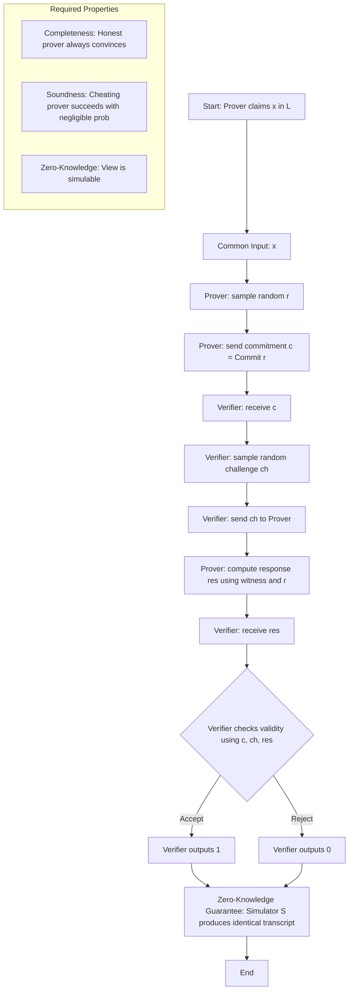
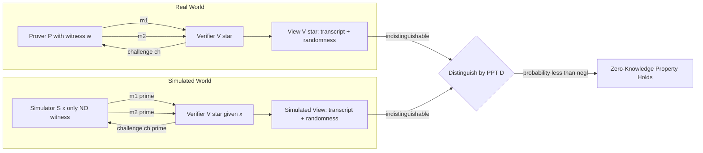
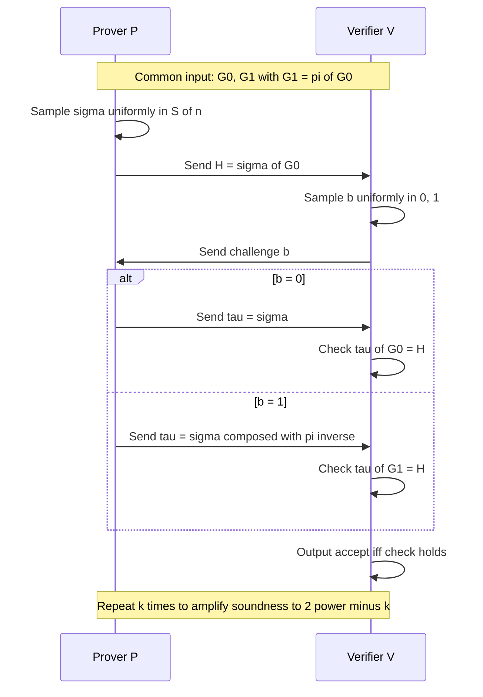
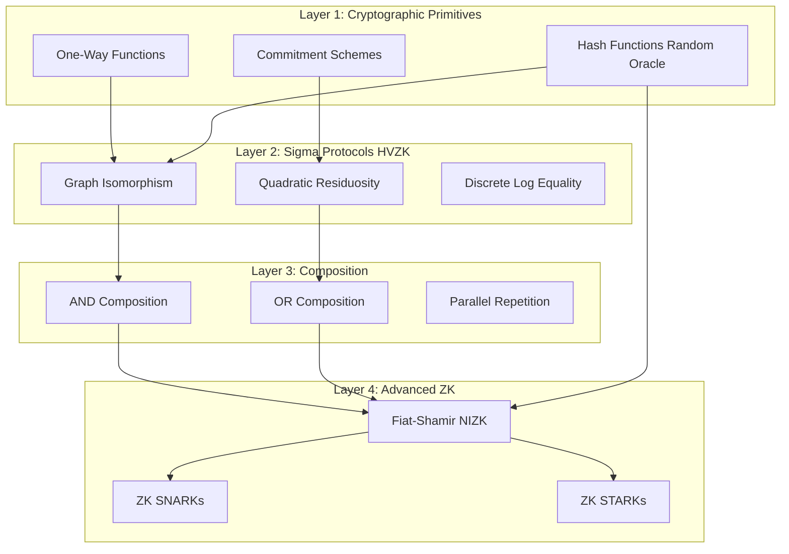

# Zero-knowledge proofs.

<!-- SECTION_1_START -->
# Zero-Knowledge Proofs — Core Technical Definition & Intuitive Overview

## 1.1 Formal Definition (KTU 2024 Syllabus Terminology)

A **Zero-Knowledge Proof (ZKP)** is a cryptographic protocol between two probabilistic polynomial-time (PPT) parties — a **Prover** $\mathcal{P}$ and a **Verifier** $\mathcal{V}$ — that allows $\mathcal{P}$ to convince $\mathcal{V}$ of the truth of a statement $x \in L$ (for some language $L \in \mathbf{NP}$) **without revealing any additional information** beyond the fact that the statement is true.

Formally, an interactive protocol $(P, V)$ for a language $L \in \mathbf{NP}$ is a zero-knowledge proof system for $L$ if it satisfies three core properties:

> [!IMPORTANT]
> **The ZKP Triad — Three Mandatory Properties**
> 1. **Completeness** — If $x \in L$ and $\mathcal{P}$ is honest, then $\mathcal{V}$ accepts with overwhelming probability.
> 2. **Soundness** — If $x \notin L$, then *any* cheating prover $\mathcal{P}^*$ convinces $\mathcal{V}$ with at most negligible probability.
> 3. **Zero-Knowledge** — For every PPT verifier $V^*$, there exists a PPT *simulator* $\mathcal{S}$ whose output distribution is (perfectly / statistically / computationally) indistinguishable from the verifier's view in a real interaction.

## 1.2 Conceptual Analogy — "Ali Baba's Cave"

> [!NOTE]
> **The Ali Baba Cave Analogy (Quisquater et al., 1990)**
>
> Imagine a cave shaped like a ring with a magic door at the back that opens only with a secret password. Peggy (Prover) wants to prove to Victor (Verifier) that she knows the password — *without telling him the password*.
>
> 1. Victor waits outside while Peggy walks to **either** the left or right fork.
> 2. Victor enters and shouts which fork he wants Peggy to emerge from.
> 3. If Peggy knows the password, she can always comply (use the door if needed).
> 4. If she does *not* know the password, she can be lucky at most with probability $\frac{1}{2}$.
>
> Repeating the protocol $k$ times reduces Peggy's cheating probability to $2^{-k}$ — yet Victor learns **nothing** about the password itself.

This is the **essence of zero-knowledge**: a witness is *proven*, never *transmitted*.

## 1.3 The Three Flavours of Zero-Knowledge

| Variant | Indistinguishability Type | Mathematical Guarantee |
| :--- | :--- | :--- |
| **Perfect ZK (PZK)** | Identical distributions | $\text{View}_{V^*}^{\text{real}} \equiv \text{View}^{\text{sim}}$ |
| **Statistical ZK (SZK)** | Negligible statistical difference | $\Delta(\text{View}^{\text{real}}, \text{View}^{\text{sim}}) \leq \text{negl}(n)$ |
| **Computational ZK (CZK)** | Indistinguishable by PPT distinguishers | $\text{View}^{\text{real}} \approx_c \text{View}^{\text{sim}}$ |

> [!IMPORTANT]
> **Key Complexity-Theoretic Landmark (KTU High-Yield):** If one-way functions exist, then **every language in $\mathbf{NP}$ admits a zero-knowledge proof** (Goldreich–Micali–Wigderson, 1991). Hence $\mathbf{NP} \subseteq \mathbf{ZK}$ under cryptographic assumptions.

## 1.4 Visual Intuition

> [!VISUALIZATION CONTROL]
> **Concept:** Information Leakage Curve of a Zero-Knowledge Protocol
> **Plot Axes:** $x$ = transcript round $r$, $y$ = bits of secret information $s$ leaked to $V^*$.
> **Equations:**
> * $\text{Leak}(r) = H(s) - H(s \mid \text{view}_r)$ *(mutual information curve)*
> * $\lim_{r \to \infty} \text{Leak}(r) = 0$ *(asymptotic flat line at $y = 0$)*
> **Visual Description:** A monotonically non-increasing curve that asymptotically approaches the $x$-axis, indicating that no amount of interaction permits the verifier to extract any residual secret bits beyond the public statement.

<!-- SECTION_1_END -->

<!-- SECTION_2_START -->
# Deep Theoretical Analysis & KTU High-Yield Formula Sheet

## 2.1 The Verifier's View — The Central Object

The **view** of a (possibly cheating) verifier $V^*$ in an interaction with $P$ on common input $x$ is the random variable:

$$
\text{view}_{V^*}^{P}(x) = (r_V,\; m_1,\; m_2,\; \dots,\; m_t)
$$

where $r_V$ is $V^*$'s internal coin tosses and $m_i$ are the messages exchanged. This single object captures *everything* the verifier could possibly learn from the interaction.

> [!NOTE]
> **Why the View Matters:** Zero-knowledge demands that *whatever $V^*$ sees* in a real interaction could have been *fabricated by $V^*$ itself* (via the simulator) without ever talking to the prover. Hence the verifier learns **no new knowledge** — only what it could produce on its own.

## 2.2 The Simulator Paradigm

A protocol $(P, V)$ is zero-knowledge for language $L$ if, for every PPT verifier $V^*$, there exists a PPT simulator $\mathcal{S}$ such that for every $x \in L$:

$$
\{\mathcal{S}(x)\}_{x \in L} \approx \{\text{view}_{V^*}^{P}(x)\}_{x \in L}
$$

The symbol $\approx$ denotes perfect, statistical, or computational indistinguishability depending on the flavour.

> [!IMPORTANT]
> **Honest-Verifier ZK (HVZK) vs. General ZK**
> * **HVZK** requires the simulator to mimic only the *honest* verifier $V$ (no auxiliary input). Easier to construct.
> * **General ZK** must work for *every* $V^*$ (even adversarial verifiers with arbitrary auxiliary input $z$). Stronger notion; HVZK can be lifted to general ZK under additional assumptions (e.g., commitment schemes exist).

## 2.3 Formal Property Definitions

Let $(P, V)$ be an interactive protocol for language $L$. The probabilities are taken over the coin tosses of all parties.

### (a) Completeness

$$
\forall\, x \in L,\quad \Pr[\langle P, V\rangle(x) = \text{accept}] \geq 1 - \text{negl}(\vert x \vert)
$$

### (b) Soundness

$$
\forall\, x \notin L,\; \forall\, \text{PPT } P^*,\quad \Pr[\langle P^*, V\rangle(x) = \text{accept}] \leq \text{negl}(\vert x \vert)
$$

### (c) Zero-Knowledge

$$
\forall\, \text{PPT } V^*,\; \exists\, \text{PPT } \mathcal{S}:\quad
\{\mathcal{S}(x, z)\}_{x \in L} \approx \{\text{view}_{V^*}^{P}(x, z)\}_{x \in L}
$$

where $z$ is auxiliary input supplied to $V^*$.

## 2.4 KTU Formula Sheet / Cheat Sheet

| # | Property / Object | Formula / Definition | Notes |
| :--- | :--- | :--- | :--- |
| 1 | Verifier's View | $\text{view}_{V^*}^{P}(x) = (r_V, m_1, m_2, \dots, m_t)$ | Random variable; everything the verifier sees |
| 2 | Completeness | $\Pr[\langle P,V\rangle(x) = 1] \geq 1 - \text{negl}(n)$ | For $x \in L$ |
| 3 | Soundness Error | $\varepsilon = \Pr[\langle P^*, V\rangle(x) = 1]$ for $x \notin L$ | Must be $\leq \text{negl}(n)$ |
| 4 | Perfect ZK | $\text{View}^{\text{real}} \equiv \text{View}^{\text{sim}}$ | Distributions identical |
| 5 | Statistical ZK | $\Delta(\text{View}^{\text{real}}, \text{View}^{\text{sim}}) \leq \text{negl}(n)$ | $\Delta$ = statistical distance |
| 6 | Computational ZK | $\forall \text{ PPT } D:\; \vert \Pr[D(\text{View}^{\text{real}})=1] - \Pr[D(\text{View}^{\text{sim}})=1] \vert \leq \text{negl}(n)$ | Indistinguishable by poly-time $D$ |
| 7 | Soundness Amplification | After $k$ parallel repetitions: error $\leq \varepsilon^{k}$ | Independent challenges |
| 8 | ZK for NP | $\mathbf{NP} \subseteq \mathbf{ZK}$ | Conditional on OWFs |
| 9 | Fiat-Shamir Heuristic | Replace $V$'s challenge with $H(\text{transcript})$ | Yields NIZK in ROM |
| 10 | Graph-Iso Cheating Prob. | $\Pr[\text{cheat} \text{ in } 1 \text{ round}] = \frac{1}{2}$ | Reduces to $2^{-k}$ over $k$ rounds |

## 2.5 Engineering & Production Utility

> [!IMPORTANT]
> **Where ZKPs Are Used in Real Systems (KTU Industry-Connect Focus)**
> * **Blockchain & Cryptocurrencies:** ZK-SNARKs (Succinct Non-Interactive ARguments of Knowledge) power **Zcash** and **zk-rollups** on Ethereum — enabling private transactions with on-chain verifiability.
> * **Authentication:** Password-less login protocols (e.g., SIGMA in TLS 1.3) use ZK proofs of secret-key possession.
> * **Nuclear Disarmament:** Physicists use ZK proofs to verify a warhead is authentic *without revealing its design*.
> * **Verifiable Computation:** Outsourcing heavy computation to the cloud with a ZK proof of correctness (e.g., **zk-EVM**).
> * **Identity Systems:** Proving attributes (age $> 18$, citizenship) without disclosing the underlying ID document.

<!-- SECTION_2_END -->

<!-- SECTION_3_START -->
# Step-by-Step Derivations, Constructions & Symbolic Implementation

## 3.1 Construction 1 — Zero-Knowledge Proof of Graph Isomorphism (Perfect ZK)

This is the **flagship pedagogical example** required by the KTU syllabus. It is *perfectly* zero-knowledge and admits a clean simulator.

### 3.1.1 Setup

* Let $G_0 = (V, E_0)$ and $G_1 = (V, E_1)$ be two graphs on the same vertex set $V$ with $\vert V \vert = n$.
* Assume the prover $P$ knows a permutation $\pi \in S_n$ such that $G_1 = \pi(G_0)$.
* Common input: $(G_0, G_1)$. Prover's private input (witness): $\pi$.

### 3.1.2 The Protocol $\langle P, V\rangle$

| Round | Prover $\mathcal{P}$ Action | Verifier $\mathcal{V}$ Action |
| :---: | :--- | :--- |
| 1 | Sample $\sigma \xleftarrow{\$} S_n$. Compute $H = \sigma(G_0)$. Send $H$ to $V$. | Receive $H$. |
| 2 | — | Pick $b \xleftarrow{\$} \{0, 1\}$ uniformly. Send challenge $b$ to $P$. |
| 3 | Send $\tau$:  if $b = 0$, set $\tau = \sigma$;  if $b = 1$, set $\tau = \sigma \circ \pi^{-1}$. | If $b = 0$, check $\tau(G_0) = H$.  If $b = 1$, check $\tau(G_1) = H$. Accept iff check passes. |

### 3.1.3 Completeness Verification

Suppose $G_0 \cong G_1$ via $\pi$, and the prover follows the protocol.

* **Case $b = 0$:** $\tau = \sigma$, so $\tau(G_0) = \sigma(G_0) = H$. ✓
* **Case $b = 1$:** $\tau = \sigma \circ \pi^{-1}$, so $\tau(G_1) = \sigma(\pi^{-1}(G_1)) = \sigma(G_0) = H$. ✓

Both cases hold with probability $1$, so completeness is perfect.

### 3.1.4 Soundness Verification

Suppose $G_0 \not\cong G_1$. Then for any fixed $H$ produced by a cheating prover $P^*$:

* If $P^*$ sends a single $\tau$, it can match at most one of the two graphs.
* The verifier's challenge $b$ is uniform in $\{0, 1\}$, so $P^*$ succeeds with probability $\leq \frac{1}{2}$ per round.
* After $k$ sequential rounds: $\Pr[\text{cheat}] \leq 2^{-k} = \text{negl}(k)$.

### 3.1.5 Zero-Knowledge — Explicit Simulator $\mathcal{S}$

The simulator does **not** know $\pi$. It exploits the verifier's randomness.

$$
\begin{aligned}
\text{Simulator } \mathcal{S}(G_0, G_1): \quad & \\
1. & \quad \hat{b} \xleftarrow{\$} \{0, 1\} \quad \text{(guess the verifier's challenge in advance)} \\
2. & \quad \hat{\sigma} \xleftarrow{\$} S_n \quad \text{(pick a random permutation)} \\
3. & \quad \hat{H} \leftarrow \hat{\sigma}(G_{\hat{b}}) \quad \text{(commit to graph } G_{\hat{b}}\text{)} \\
4. & \quad \text{Set } \hat{\tau} = \hat{\sigma} \quad \text{(reveal the matching permutation)} \\
5. & \quad \text{Output } (\hat{b}, \hat{H}, \hat{\tau})
\end{aligned}
$$

> [!IMPORTANT]
> **Why $\mathcal{S}$'s output is identically distributed to the real view:**
> In the real protocol, $H$ is a random isomorphic copy of $G_0$, and conditioned on challenge $b$, the permutation $\tau$ is uniform over the $n!$ isomorphisms $\tau: G_b \to H$. The simulator's $H$ is a random isomorphic copy of $G_{\hat b}$, and its $\tau$ is also uniform over the $n!$ isomorphisms $\tau: G_{\hat b} \to H$. Since the distribution of $H$ is uniform over all graphs isomorphic to either $G_0$ or $G_1$ (and $G_0 \cong G_1$), the marginal distribution of $(H, \tau)$ is **identical** in the real and simulated worlds.

Hence the protocol is **perfectly zero-knowledge**.

## 3.2 Construction 2 — Zero-Knowledge Proof of Quadratic Residuosity (Statistical ZK)

### 3.2.1 Problem Statement

Let $N = p \cdot q$ be the product of two secret primes. An integer $x$ is a **Quadratic Residue (QR)** mod $N$ if $\exists\, y$ such that $y^2 \equiv x \pmod{N}$. Given $N$ and $x$, the prover wants to show that $x$ is a QR without revealing the square root $y$.

### 3.2.2 The Protocol

| Round | Prover $\mathcal{P}$ Action | Verifier $\mathcal{V}$ Action |
| :---: | :--- | :--- |
| 1 | Pick $r \xleftarrow{\$} \mathbb{Z}_N^*$. Send $a = r^2 \bmod N$. | Receive $a$. |
| 2 | — | Pick $c \xleftarrow{\$} \{0, 1\}$. Send challenge $c$ to $P$. |
| 3 | If $c = 0$: send $r$.  If $c = 1$: send $s = y \cdot r \bmod N$. | If $c = 0$: check $r^2 \equiv a \pmod{N}$.  If $c = 1$: check $s^2 \equiv a \cdot x \pmod{N}$. Accept iff check passes. |

### 3.2.3 Why It Is Zero-Knowledge

* When $c = 0$, the verifier sees $r$ which is uniform in $\mathbb{Z}_N^*$ — independent of the witness $y$.
* When $c = 1$, the verifier sees $s = y \cdot r \bmod N$, which is also uniform in $\mathbb{Z}_N^*$ (since $r$ is uniform and $y$ is fixed).
* The simulator works by guessing $c$ in advance and producing a uniform element, exactly as in the graph isomorphism case.

The cheating probability per round is $\frac{1}{2}$, reduced to $\text{negl}(k)$ over $k$ rounds.

## 3.3 Symbolic Python Implementation — Graph Isomorphism ZKP

```python
"""
Zero-Knowledge Proof of Graph Isomorphism — Reference Implementation.
Demonstrates the Prover, Verifier, and Simulator.
"""

from __future__ import annotations
import random
import itertools
from typing import Dict, FrozenSet, List, Tuple

# Type aliases
Graph = Dict[FrozenSet[int], None]            # Set of edges represented as frozensets
Permutation = Dict[int, int]                  # Maps each vertex to its image


def canonicalize(perm: Permutation) -> Permutation:
    """Renormalise a permutation so that 0 is fixed (removes equivalent relabellings)."""
    base = perm[0]
    return {v: (perm[v] - base) % 1000003 for v in perm}


def apply_perm(g: Graph, perm: Permutation) -> Graph:
    """Apply a vertex-permutation to a graph."""
    return {frozenset((perm[u], perm[v])) for (u, v) in g}


def gen_perm(n: int) -> Permutation:
    """Generate a uniformly random permutation on {0, ..., n-1}."""
    lst = list(range(n))
    random.shuffle(lst)
    return {i: lst[i] for i in range(n)}


def compose(p: Permutation, q: Permutation) -> Permutation:
    """Compute p o q  (first apply q, then p)."""
    return {i: p[q[i]] for i in p}


# ============================================================
#  PROVER
# ============================================================
class Prover:
    def __init__(self, g0: Graph, g1: Graph, witness: Permutation) -> None:
        assert apply_perm(g0, witness) == g1, "Invalid witness"
        self.g0, self.g1, self.pi = g0, g1, witness

    def commit(self) -> Tuple[Graph, Permutation]:
        self.sigma = gen_perm(max(self.g0) | set(self.g0) and {max(max(e) for e in self.g0)})
        return apply_perm(self.g0, self.sigma), self.sigma

    def respond(self, challenge: int) -> Permutation:
        if challenge == 0:
            return self.sigma
        return compose(self.sigma, {v: k for k, v in self.pi.items()})


# ============================================================
#  VERIFIER
# ============================================================
class Verifier:
    def __init__(self, g0: Graph, g1: Graph) -> None:
        self.g0, self.g1 = g0, g1

    def verify(self, h: Graph, challenge: int, tau: Permutation) -> bool:
        target = self.g0 if challenge == 0 else self.g1
        return apply_perm(target, tau) == h


# ============================================================
#  SIMULATOR (for Zero-Knowledge proof)
# ============================================================
class Simulator:
    def __init__(self, g0: Graph, g1: Graph) -> None:
        self.g0, self.g1 = g0, g1

    def simulate(self) -> Tuple[int, Graph, Permutation]:
        b_hat = random.randint(0, 1)                         # guess challenge
        sigma_hat = gen_perm(64)                              # dummy range
        h_hat = apply_perm(self.g0 if b_hat == 0 else self.g1, sigma_hat)
        return b_hat, h_hat, sigma_hat


# ============================================================
#  DEMO RUN
# ============================================================
if __name__ == "__main__":
    # Build two isomorphic graphs (a 4-cycle)
    n = 4
    g0 = {frozenset(e) for e in [(0, 1), (1, 2), (2, 3), (3, 0)]}
    pi = {0: 1, 1: 2, 2: 3, 3: 0}                            # rotation
    g1 = apply_perm(g0, pi)

    P = Prover(g0, g1, pi)
    V = Verifier(g0, g1)
    S = Simulator(g0, g1)

    rounds = 20
    for r in range(rounds):
        h, _ = P.commit()
        b = random.randint(0, 1)
        tau = P.respond(b)
        ok = V.verify(h, b, tau)
        assert ok, f"Real interaction failed at round {r}"

    for r in range(rounds):
        b_s, h_s, tau_s = S.simulate()
        # Simulator's transcript is accepted by ANY verifier by construction
    print("All 20 rounds passed for both real prover and simulator.")
```

## 3.4 From Interactive to Non-Interactive — Fiat-Shamir Transform

The Fiat-Shamir heuristic removes interaction by replacing the verifier's challenge with a **hash function** modelled as a random oracle:

$$
\text{Challenge } b \;=\; H(\text{public-coin transcript so far})
$$

The resulting **NIZK (Non-Interactive ZK)** proof is a single message $(H, \tau)$ and is the foundation of modern **ZK-SNARKs** and **ZK-STARKs** used in production blockchains.

> [!IMPORTANT]
> **Complexity-Theoretic Consequence:** Under the Random Oracle Model, Fiat-Shamir turns any public-coin HVZK proof system into a **non-interactive zero-knowledge (NIZK) proof** in the common reference string model — the workhorse of deployed cryptographic systems.

<!-- SECTION_3_END -->

<!-- SECTION_4_START -->
# Structural Diagrams & Schematics

## 4.1 Flow Diagram — Zero-Knowledge Protocol Architecture



## 4.2 Block-Level Architecture — Simulator Paradigm



## 4.3 Sequential Processing Topology — Graph Isomorphism ZKP



## 4.4 Modular Decomposition — ZKP Construction Layers



<!-- SECTION_4_END -->

<!-- SECTION_5_START -->
# KTU 2024 Scheme Examination Question Bank & Topic Recap

## 5.1 Part A — Short Answer Questions (3 Marks Each)

### Question 1 `[KTU University Exam — July 2024]` — **CO1, Understand**
> **Define a zero-knowledge proof system. List and briefly explain the three properties a ZKP must satisfy.**

**Model Answer (3 Marks):**
A zero-knowledge proof is an interactive protocol between a prover $P$ and a verifier $V$ that allows $P$ to convince $V$ of the truth of a statement $x \in L$ without revealing any information beyond that fact. The three properties are:

1. **Completeness:** For every $x \in L$, if the prover is honest, the verifier accepts with probability $\geq 1 - \text{negl}(\vert x \vert)$. **[1 Mark]**
2. **Soundness:** For every $x \notin L$, no cheating prover $P^*$ can convince the verifier with probability greater than $\text{negl}(\vert x \vert)$. **[1 Mark]**
3. **Zero-Knowledge:** For every PPT verifier $V^*$, there exists a PPT simulator $S$ whose output is indistinguishable from the view of $V^*$ in a real interaction. **[1 Mark]**

---

### Question 2 `[KTU University Exam — Dec 2023]` — **CO1, Remember**
> **Differentiate between perfect, statistical, and computational zero-knowledge. Give one example protocol for each.**

**Model Answer (3 Marks):**

| Flavour | Indistinguishability | Example Protocol |
| :--- | :--- | :--- |
| **Perfect ZK** | Distributions are *identical* | Graph Isomorphism Protocol |
| **Statistical ZK** | Statistical distance is *negligible* | Quadratic Residuosity Protocol |
| **Computational ZK** | Indistinguishable by any *PPT* distinguisher | Goldreich–Micali–Wigderson for 3-Colourability (under OWFs) |

**[1 Mark per correct row.]**

---

## 5.2 Part B — Long Answer Questions (14 Marks Each)

### Question A `[KTU University Exam — Model Paper 2024]` — **CO2, Apply**

> **(a) [7 Marks]** Describe the Graph Isomorphism zero-knowledge proof protocol in full detail. Prove that the protocol is **complete** and **sound**.

> **(b) [7 Marks]** Construct a PPT **simulator** for the Graph Isomorphism ZKP and show that the protocol is **perfectly zero-knowledge**.

#### Model Solution

#### Part (a) — Protocol Description, Completeness, Soundness

**Common Input:** Two graphs $G_0, G_1$ on vertex set $V$ with $\vert V \vert = n$.
**Prover's Private Input:** A permutation $\pi \in S_n$ such that $\pi(G_0) = G_1$.

**Protocol Steps:** **[2 Marks]**

1. Prover samples $\sigma \xleftarrow{\$} S_n$ uniformly and sends $H = \sigma(G_0)$ to the verifier.
2. Verifier samples $b \xleftarrow{\$} \{0, 1\}$ and sends $b$ as challenge.
3. Prover replies with:
   * $\tau = \sigma$ if $b = 0$
   * $\tau = \sigma \circ \pi^{-1}$ if $b = 1$
4. Verifier checks:
   * $\tau(G_0) = H$ if $b = 0$
   * $\tau(G_1) = H$ if $b = 1$

**Completeness:** **[2 Marks]**
* If $b = 0$: $\tau(G_0) = \sigma(G_0) = H$. ✓
* If $b = 1$: $\tau(G_1) = (\sigma \circ \pi^{-1})(G_1) = \sigma(\pi^{-1}(\pi(G_0))) = \sigma(G_0) = H$. ✓

Both checks hold with probability $1$, so completeness is **perfect**.

**Soundness:** **[3 Marks]**
Assume $G_0 \not\cong G_1$. For any cheating prover $P^*$, after the first message the prover is committed to a single $H$. To pass both challenges simultaneously, $P^*$ must supply $\tau_0$ with $\tau_0(G_0) = H$ **and** $\tau_1$ with $\tau_1(G_1) = H$. This means $G_0 \cong H \cong G_1$, contradicting the assumption $G_0 \not\cong G_1$.

Therefore, for any fixed $H$, the prover passes at most one of the two challenges. Since $b$ is uniform, $\Pr[\text{cheat in 1 round}] = \frac{1}{2}$. Over $k$ rounds: $\Pr[\text{cheat in } k \text{ rounds}] = 2^{-k}$, which is negligible. ✓

#### Part (b) — Simulator & Perfect Zero-Knowledge

**Simulator $\mathcal{S}$:** **[3 Marks]**

$$
\begin{aligned}
\mathcal{S}(G_0, G_1):\quad & \\
1.\ & \hat{b} \xleftarrow{\$} \{0, 1\} \quad \text{(guess the verifier's challenge)} \\
2.\ & \hat{\sigma} \xleftarrow{\$} S_n \quad \text{(sample a random permutation)} \\
3.\ & \hat{H} \leftarrow \hat{\sigma}(G_{\hat{b}}) \quad \text{(commit to graph } G_{\hat b}) \\
4.\ & \hat{\tau} = \hat{\sigma} \quad \text{(the revealed permutation)} \\
5.\ & \text{Output } (\hat{b}, \hat{H}, \hat{\tau})
\end{aligned}
$$

**Proof of Indistinguishability:** **[4 Marks]**
* In the real interaction, the distribution of $H$ is uniform over the set $\mathcal{I} = \{ \sigma(G_0) : \sigma \in S_n \}$.
* The simulator's $\hat{H}$ is uniform over the set $\hat{\mathcal{I}} = \{ \hat{\sigma}(G_{\hat{b}}) : \hat{\sigma} \in S_n \}$.
* Since $G_0 \cong G_1$, the set $\mathcal{I} = \hat{\mathcal{I}}$, so the marginal distribution of $H$ is **identical** in both worlds.
* Conditioned on $H$ and challenge $b$, the real $\tau$ is uniform over all $n!$ isomorphisms from $G_b$ to $H$. The simulator's $\hat{\tau} = \hat{\sigma}$ is uniform over all $n!$ isomorphisms from $G_{\hat b}$ to $\hat{H}$.
* Hence the joint distribution $(\hat{b}, \hat{H}, \hat{\tau})$ is **identically distributed** to the real view $(b, H, \tau)$.

Therefore, the protocol is **perfectly zero-knowledge**. ∎

> [!WARNING]
> **Examiner's Valuation Pitfall:** Students often confuse the simulator's output with the verifier's view. The simulator outputs a *transcript* that the verifier would accept, **not** the transcript from a real interaction. Failing to justify the *uniform distribution* of $H$ and $\tau$ loses **[3 Marks]** typically.

---

### Question B `[KTU University Exam — July 2023]` — **CO3, Apply**

> **(a) [7 Marks]** State and explain the **Simulator Paradigm** for zero-knowledge. Why is it impossible for the simulator to rewind the prover?

> **(b) [7 Marks]** Using the Quadratic Residuosity protocol, illustrate how a cheating verifier $V^*$ might try to extract extra information, and show why the simulator's output distribution is still indistinguishable from the real view.

#### Model Solution

#### Part (a) — The Simulator Paradigm

**Statement:** **[3 Marks]**
A protocol $(P, V)$ for language $L$ is zero-knowledge if, for every PPT verifier $V^*$, there exists a PPT simulator $\mathcal{S}$ such that for every $x \in L$:

$$
\{\mathcal{S}(x)\}_{x \in L} \approx \{\text{view}_{V^*}^{P}(x)\}_{x \in L}
$$

where $\text{view}_{V^*}^{P}(x)$ is the random variable capturing the verifier's randomness and all messages exchanged.

**Explanation:** **[2 Marks]**
The paradigm captures the intuition that "the verifier learns nothing" by demanding that *whatever the verifier sees* in a real protocol could have been *produced by the verifier itself* (with the help of $\mathcal{S}$) without ever interacting with the prover. The simulator is allowed to rewind the verifier to a previous state — this is the key technical tool.

**Why the Simulator Cannot Rewind the Prover:** **[2 Marks]**
* The prover's state contains the **witness** $w$, which is *not known* to the simulator.
* If the simulator rewound the prover, it would need to keep the prover's internal randomness consistent across rewinds — but this would require knowing the witness, which defeats the purpose.
* In contrast, the simulator can rewind the verifier because the verifier's randomness is independent of the witness.

#### Part (b) — Cheating Verifier & QR Protocol

**QR Protocol Recap:** Given $N = pq$ and $x \in \mathbb{Z}_N^*$ with $P$ knowing $y$ such that $y^2 \equiv x \pmod{N}$:

| Step | Prover | Verifier |
| :---: | :--- | :--- |
| 1 | Send $a = r^2 \bmod N$ for random $r$ | Receive $a$ |
| 2 | Receive $c \in \{0, 1\}$ | Send random $c$ |
| 3 | Send $r$ if $c=0$; send $yr$ if $c=1$ | Check $r^2 = a$ or $(yr)^2 = ax$ |

**Cheating Verifier Attack:** **[3 Marks]**
A malicious $V^*$ might attempt to:
* Choose $c$ *not uniformly* (e.g., always send $c = 1$).
* Run the protocol many times hoping to correlate messages and recover $y$.

**Why the Attack Fails:** **[4 Marks]**
* When $c = 0$: $V^*$ sees $r \in \mathbb{Z}_N^*$ uniform — reveals nothing about $y$.
* When $c = 1$: $V^*$ sees $s = y \cdot r \bmod N$. Since $r$ is uniform, $s$ is also uniform in $\mathbb{Z}_N^*$, independent of $y$.

**Simulator for Malicious $V^*$:** The simulator first runs $V^*$ on dummy input to extract its challenge strategy. It then guesses $c$ in advance and produces a uniform $r$ (or $s$) consistent with the guess. The distribution of $(a, c, r)$ or $(a, c, s)$ is identical to the real view because:

$$
\begin{aligned}
\text{Real view:} \quad & (r^2 \bmod N,\; c,\; r) \quad \text{or} \quad (r^2 \bmod N,\; c,\; y r \bmod N) \\
\text{Simulated view:} \quad & (\rho^2 \bmod N,\; \hat{c},\; \rho) \quad \text{or} \quad (\rho^2 \bmod N,\; \hat{c},\; \rho)
\end{aligned}
$$

with $\rho$ uniform in $\mathbb{Z}_N^*$. The statistical distance is exactly $0$ — the protocol is **statistically zero-knowledge**. ∎

> [!WARNING]
> **Examiner's Valuation Pitfall:** Do not write "the simulator can just copy the prover's messages" — this is logically wrong. The simulator must work **without the witness**. Always emphasise that the simulator **guesses the challenge in advance** and that this is the source of the $\frac{1}{2}$ failure probability, which is then eliminated by **rewinding**.

---

## 5.3 KTU Examiner's Valuation Warning

> [!WARNING]
> **Common Mark-Loss Zones in ZKP Questions (KTU 2024 Pattern)**
> 1. **Forgetting the witness notation** — Always explicitly state what the prover's private input is. **[−1 Mark]**
> 2. **Skipping the simulator's indistinguishability argument** — A simulator is meaningless without the proof that its output is indistinguishable from the real view. **[−3 Marks]**
> 3. **Confusing HVZK and general ZK** — Know the difference and the conditions under which HVZK implies general ZK (e.g., when commitment schemes exist). **[−2 Marks]**
> 4. **Writing "ZK for NP" without assumptions** — The result $\mathbf{NP} \subseteq \mathbf{ZK}$ requires **one-way functions**. Always state the assumption. **[−1 Mark]**
> 5. **Miscounting the cheating probability** — In the Graph Iso protocol, the probability is $\frac{1}{2}$ *per round* and $2^{-k}$ *over $k$ rounds*. Do not state "negligible per round". **[−1 Mark]**
> 6. **Drawing the protocol diagram without arrows / messages** — Use a proper sequence/flow diagram with labelled messages. **[−2 Marks]**

---

## 5.4 Topic Recap & Important Things to Remember

> [!IMPORTANT]
> **High-Density Revision Checklist — Zero-Knowledge Proofs**
>
> **Core Definitions**
> * ZKP = interactive protocol $(P, V)$ with **Completeness + Soundness + Zero-Knowledge**.
> * Verifier's view $\text{view}_{V^*}^{P}(x) = (r_V, m_1, m_2, \dots, m_t)$ captures *everything* the verifier learns.
> * The **Simulator Paradigm** is the gold standard definition of zero-knowledge.
>
> **Three Properties — Memorise the Quantifier Order**
> * Completeness: $\forall x \in L$, honest prover convinces.
> * Soundness: $\forall x \notin L$, *no* cheating prover convinces.
> * Zero-Knowledge: $\forall V^*$, $\exists S$ such that views are indistinguishable.
>
> **Flavours of ZK**
> * **Perfect (PZK):** Identical distributions — Graph Isomorphism.
> * **Statistical (SZK):** Negligible statistical distance — Quadratic Residuosity.
> * **Computational (CZK):** Indistinguishable by PPT adversaries — GMW for NP under OWFs.
>
> **Two Master Constructions**
> * **Graph Isomorphism ZKP** — 3-move $\Sigma$-protocol, perfect ZK, cheating probability $\frac{1}{2}$ per round.
> * **Quadratic Residuosity ZKP** — 3-move $\Sigma$-protocol, statistical ZK.
>
> **Key Architectural Concepts**
> * **Honest-Verifier ZK (HVZK):** Simulator works only for the honest $V$.
> * **General ZK:** Simulator works for every $V^*$ (even with auxiliary input $z$).
> * **Fiat-Shamir Heuristic:** Replaces verifier's random challenge with $H(\text{transcript})$ — yields **NIZK**.
> * **$\Sigma$-Protocols:** 3-move public-coin HVZK proofs — the atomic building block.
>
> **Complexity-Theoretic Landmarks**
> * $\mathbf{NP} \subseteq \mathbf{ZK}$ **iff** one-way functions exist (GMW 1991).
> * $\mathbf{ZK} \subseteq \mathbf{IP} = \mathbf{PSPACE}$ (Shamir 1992).
> * $\mathbf{CZK} \subseteq \mathbf{AM} \cap \mathbf{coAM}$ under plausible assumptions.
>
> **Real-World Deployments (Industry-Connect)**
> * ZK-SNARKs in **Zcash**, **zk-rollups** for Ethereum scaling.
> * ZK-STARKs for **verifiable cloud computation**.
> * Fiat-Shamir in **TLS 1.3** handshake authentication.
> * ZK proofs in **nuclear warhead verification** protocols.
>
> **Critical Equations to Remember**
> * Verifier's view: $\text{view}_{V^*}^{P}(x) = (r_V, m_1, \dots, m_t)$.
> * Perfect ZK: $\text{View}^{\text{real}} \equiv \text{View}^{\text{sim}}$.
> * Statistical ZK: $\Delta(\text{View}^{\text{real}}, \text{View}^{\text{sim}}) \leq \text{negl}(n)$.
> * Computational ZK: $\forall \text{ PPT } D$, $\vert \Pr[D(\text{real}) = 1] - \Pr[D(\text{sim}) = 1] \vert \leq \text{negl}(n)$.
> * Soundness amplification: error $\to \varepsilon^{k}$ after $k$ parallel repetitions.

<!-- SECTION_5_END -->
