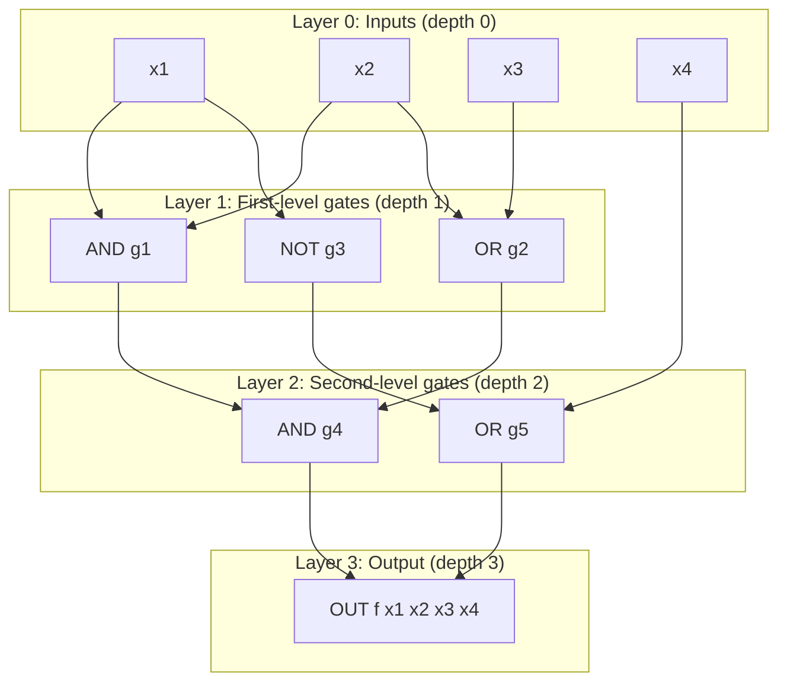
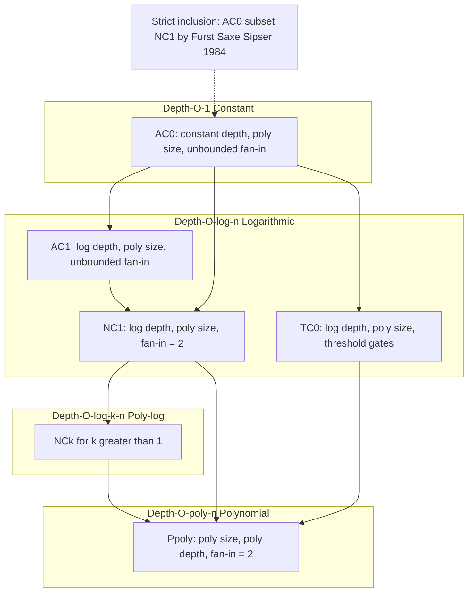
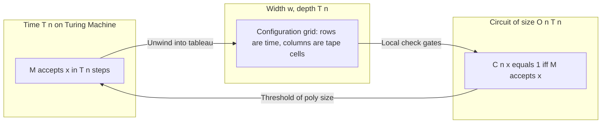
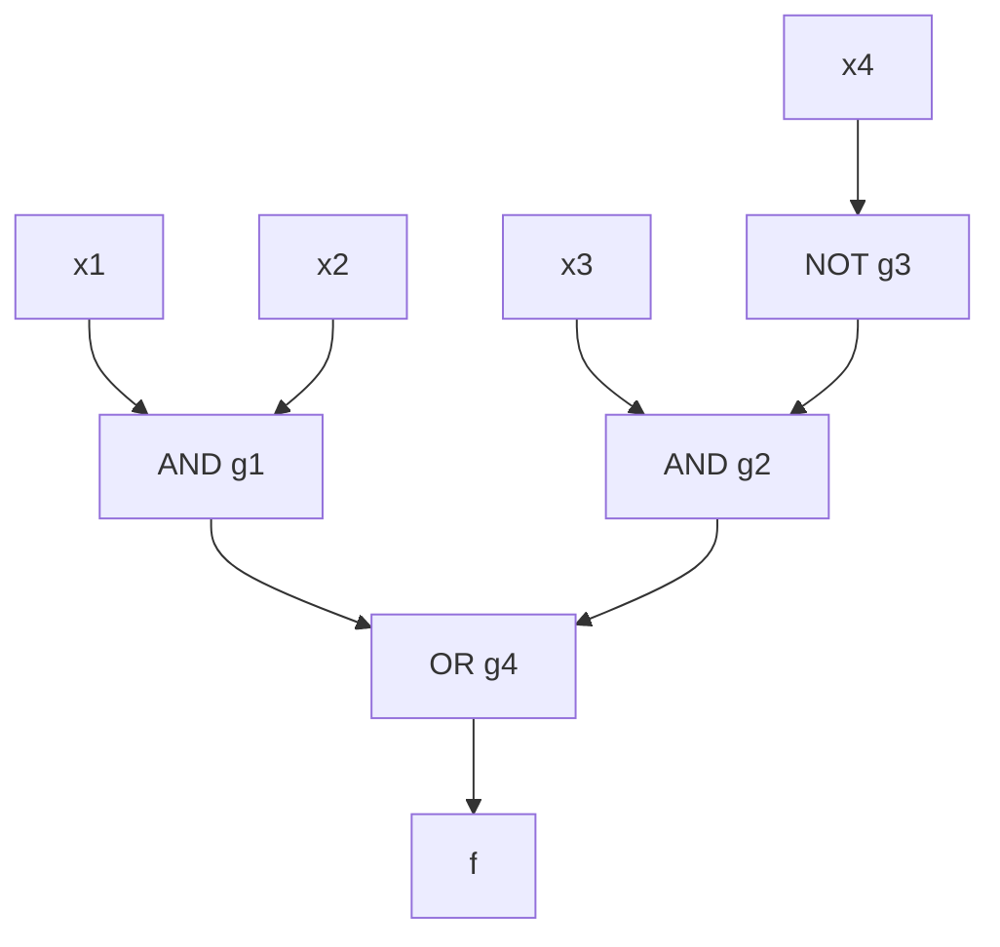

# Circuit Complexity - Boolean circuits and circuit complexity

<!-- SECTION_1_START -->
# Boolean Circuits and Circuit Complexity

## 1.1 Formal Definition (KTU 2024 Terminology)

A **Boolean circuit** is a directed acyclic graph (DAG) in which:
- **Input nodes** (sources, in-degree = 0) are labeled with Boolean variables $x_1, x_2, \ldots, x_n$ or constants $0, 1$.
- **Internal nodes** (gates) are labeled with Boolean operators from a fixed basis $\mathcal{B}$ (commonly $\{\text{AND}, \text{OR}, \text{NOT}\}$ or $\{\text{NAND}\}$ alone).
- **Output nodes** (sinks) are designated nodes whose values define the circuit's output. A circuit with $m$ output nodes computes a Boolean function $f: \{0,1\}^n \to \{0,1\}^m$.

A **circuit family** $\{C_n\}_{n \ge 1}$ is a sequence of circuits, one for each input length $n$. A language $L$ is decided by a circuit family if for every $x \in \{0,1\}^n$:

$$x \in L \iff C_n(x) = 1$$

> [!IMPORTANT]
> **KTU Highlight:** A *single* circuit handles only *one fixed input size*. To decide an infinite language, we need an infinite **family** of circuits $\{C_0, C_1, C_2, \ldots\}$, one for each input length $n$.

### Key Parameters of a Circuit
- **Size** ($size(C)$): Total number of gates in $C$. This represents the **hardware cost** (number of transistors/logic gates).
- **Depth** ($depth(C)$): Length of the longest directed path from an input to an output. This represents the **parallel time** (critical path delay).
- **Fan-in**: Maximum number of inputs into a single gate.
- **Fan-out**: Maximum number of downstream connections from a single gate.

> [!NOTE]
> A **Boolean formula** is a Boolean circuit whose underlying graph is a *tree* (each gate has out-degree $\le 1$). Formulas correspond naturally to expressions; circuits allow sub-expression reuse.

## 1.2 Intuitive Analogy

> [!TIP]
> **Real-World Analogy — "The Voting Booth Network"**
>
> Imagine an *electrical circuit board* on a factory floor. Each wire carries a binary signal (voltage HIGH = 1, LOW = 0). The chips on the board are the **gates**: AND-chips, OR-chips, NOT-inverters. The inputs are sensor readings (e.g., $x_1$ = "door open?", $x_2$ = "motion detected?"). The output lights up an alarm if both conditions are met.
>
> - The **number of chips** soldered on the board = **circuit size** (manufacturing cost).
> - The **longest chain of chips** a signal must traverse = **circuit depth** (response time / latency).
> - Reducing depth = using parallel sub-circuits (more workers, faster result).
> - Reducing size = reusing intermediate results (smarter design, less silicon).

## 1.3 Why Circuits? The Bridge Between Algorithms and Hardware

Boolean circuits provide a **non-uniform model of computation** — a model where different input sizes may use entirely different "programs" (circuits). This contrasts with the uniform Turing machine, where one fixed program handles all input sizes.

This model captures:
1. **Hardware reality**: Every real chip IS a Boolean circuit.
2. **Lower-bound proofs**: Proving $P \neq NP$ is famously hard, but proving a *specific function* (like PARITY) has no small circuit is often more tractable.
3. **Parallel computation**: Depth = parallel time → circuits model **parallel algorithms** (PRAM, GPUs, FPGAs).

> [!VISUALIZATION CONTROL]
> **Concept:** Hierarchy of Boolean circuit classes plotted by size and depth.
> **GeoGebra / Desmos Input Equations:**
> * Point $A = (O(1), O(1))$ — constant-size, constant-depth (trivial class)
> * Point $B = (poly(n), O(1))$ — polynomial size, constant depth (AC⁰)
> * Point $C = (poly(n), O(\log n))$ — polynomial size, log depth (NC¹)
> * Point $D = (poly(n), poly(n))$ — polynomial size, poly depth (P/poly)
> **Visual Description:** Plot these four points with $n$ on the horizontal axis (log-scale) and circuit size on the vertical axis (log-scale). Students should observe that **AC⁰ ⊂ NC¹ ⊂ P/poly ⊂ PSPACE/poly**, a strict inclusion chain forming a "staircase" of growing expressiveness.

---

<!-- SECTION_1_END -->

<!-- SECTION_2_START -->
# Deep Theoretical Analysis & KTU Formula Sheet

## 2.1 Operational Anatomy of a Boolean Circuit

A Boolean circuit $C_n$ on $n$ inputs is a layered DAG with the following structural rules:

1. **Layered Layout**: Gates are arranged in levels $\ell_0, \ell_1, \ldots, \ell_d$ where $\ell_0$ = inputs, $\ell_d$ = outputs, and edges only go from $\ell_i$ to $\ell_{i+1}$.
2. **Basis Dependence**: A circuit over the De Morgan basis $\{\neg, \wedge, \vee\}$ can be converted to one over $\{\text{NAND}\}$ with at most a **constant-factor blow-up** in size.
3. **Monotone vs. Non-Monotone**: A **monotone circuit** uses only $\wedge$ and $\vee$ (no $\neg$); a **non-monotone** circuit allows negations. Negations can be pushed to the inputs using **De Morgan's laws** with a polynomial size overhead.

### 2.1.1 Circuit Size — The Hardware Cost Function

The **size complexity** of a Boolean function $f$ is the minimum number of gates in any circuit computing $f$, denoted $C(f)$ or $C_{\mathcal{B}}(f)$ for a given basis $\mathcal{B}$.

**Trivial bounds:**
$$\frac{2^n}{2n} \le C_{\{\wedge,\vee,\neg\}}(f) \le O(2^n / n)$$

The lower bound is from a *counting argument*: there are $2^{2^n}$ Boolean functions on $n$ variables, but at most $g^k$ circuits of size $k$ over a $g$-gate basis. Solving for $k$:

$$k \ge \frac{2^n}{2n}$$

## 2.2 Shannon's Theorem (1949) — The Landmark Counting Result

> [!IMPORTANT]
> **Claude Shannon's Theorem (Lower Bound via Counting):**
> *Almost every* Boolean function $f: \{0,1\}^n \to \{0,1\}$ requires circuits of size $\Theta(2^n / n)$ over the basis $\{\wedge, \vee, \neg\}$.

**Proof intuition (counting / probabilistic method):**

1. **Count circuits of size $k$**: With a basis of $g = 3$ gates ($\wedge, \vee, \neg$), the number of labeled circuits of size $k$ on $n$ inputs is at most $(g \cdot n^2)^k$ (gate-type choices $\times$ wiring choices).
2. **Count functions**: There are $2^{2^n}$ distinct Boolean functions on $n$ variables.
3. **Pigeonhole**: If $(g \cdot n^2)^k < 2^{2^n}$, then some function is *missed* by every circuit of size $k$. Solving: $k < \frac{2^n}{2n}$ is too small to cover all $2^{2^n}$ functions.
4. **Random circuit**: The expected number of functions computed by a random size-$k$ circuit family is $\ll 2^{2^n}$, so most functions require $\ge 2^n / n$ gates.

> [!TIP]
> **Engineering Implication:** "Generic" Boolean functions are *exponentially* hard to implement in hardware. All the functions we *care about* (addition, multiplication, sorting, SAT) are *atypically* easy.

## 2.3 The Class P/poly

> [!DEFINITION]
> **P/poly** is the class of languages decidable by a **polynomial-size circuit family** $\{C_n\}_{n \ge 1}$, i.e., $size(C_n) \le p(n)$ for some polynomial $p$.

**Properties:**
- $P \subseteq P/poly$ (every polynomial-time TM can be unwound into a polynomial-size circuit).
- $P/poly$ contains **undecidable languages** (!) — since the circuit family may be non-computable (given by an uncomputable oracle).
- $NP \subseteq P/poly$ would imply the polynomial hierarchy collapses (Karp–Lipton theorem).

## 2.4 The AC–NC Hierarchy (Parallel Complexity)

| Class | Size | Depth | Fan-in | Model |
|-------|------|-------|--------|-------|
| **AC⁰** | $n^{O(1)}$ | $O(1)$ | unbounded | Constant-depth circuits |
| **AC¹** | $n^{O(1)}$ | $O(\log n)$ | unbounded | Log-depth circuits |
| **NC¹** | $n^{O(1)}$ | $O(\log n)$ | bounded (2) | Log-depth, bounded fan-in |
| **NC²** | $n^{O(1)}$ | $O(\log^2 n)$ | bounded (2) | Square-log depth |
| **P/poly** | $n^{O(1)}$ | $O(n^{O(1)})$ | bounded (2) | Polynomial depth |

> [!NOTE]
> **Key Inclusions:** $AC^0 \subsetneq AC^1 \subseteq NC^1 \subseteq NC^2 \subseteq \cdots \subseteq P \subseteq P/poly$. The strictness of $AC^0 \subsetneq NC^1$ was proven by Furst, Saxe, and Sipser (1984) using PARITY as a witness.

## 2.5 KTU High-Yield Formula Sheet

| Concept | Formula / Definition | Notation | Notes |
|---|---|---|---|
| Circuit size | $\#\text{gates in } C$ | $size(C)$ | Hardware cost |
| Circuit depth | longest input→output path | $depth(C)$ | Parallel time |
| Total functions on $n$ bits | $2^{2^n}$ | — | Grows **double-exponentially** |
| Shannon's lower bound | $C(f) \ge \Omega(2^n / n)$ for a.e. $f$ | — | Counting argument |
| Trivial upper bound (DNF) | $C(f) \le O(2^n / n)$ | — | Disjunctive normal form |
| NAND basis size overhead | $C_{\text{NAND}}(f) \le 3 \cdot C_{\{\wedge,\vee,\neg\}}(f)$ | — | Constant factor |
| De Morgan (negations to inputs) | $size \le 2 \cdot size_{\text{original}}$ | — | Monotone + input negations |
| P $\subseteq$ P/poly | $C_{\text{sim}}(n) = O(n \cdot T(n))$ for TM time $T$ | — | Cobham's theorem |
| AC⁰ size for PARITY | $2^{n^{\Omega(1)}}$ (lower bound) | — | Håstad switching lemma |
| $L \in P/poly$ ⇒ circuit family | $\exists \{C_n\}$ poly-size, $C_n(x)=L(x)$ | — | Non-uniform |

> [!WARNING]
> **Escape rule:** In LaTeX, write absolute value or "such that" as $\vert \cdot \vert$ or $\mid$, **never** with the raw vertical pipe `|`, to avoid breaking markdown table syntax.

## 2.6 Real-World Engineering Utility

| Domain | Application | Why Circuits? |
|---|---|---|
| **VLSI Chip Design** | CPU/ALU synthesis | Direct hardware mapping |
| **Cryptanalysis** | AES circuit complexity | Resistance = size lower bound |
| **Machine Learning** | Neural net expressiveness | Boolean circuits as decision trees |
| **Formal Verification** | Model checking, equivalence | BDDs (Binary Decision Diagrams) |
| **Parallel Computing** | GPU kernels, FPGAs | Depth = parallel runtime |
| **Proof Complexity** | Extended Frege systems | P/poly = poly-time provability |

---

<!-- SECTION_2_END -->

<!-- SECTION_3_START -->
# Step-by-Step Derivations & Symbolic Implementation

## 3.1 Full Derivation of Shannon's Counting Argument

**Goal:** Show that the number of distinct size-$k$ circuits is at most $T(k, n)$, and find the minimum $k$ for which $T(k, n) \ge 2^{2^n}$ is *impossible*.

**Step 1 — Count labeled circuits of size $k$ over a $g$-gate basis.**

Each circuit of size $k$ has $k$ gates. For each gate $g_i$, we choose:
- A gate type from the basis (3 choices: $\wedge, \vee, \neg$).
- An ordered list of inputs from the pool of (prior gates + original inputs + constants).

The total number of distinct labeled circuits is bounded by:

$$T(k, n) \le \sum_{j=0}^{k} \binom{n + j}{2}^j \cdot 3^j \le (3(n+k)^2)^k$$

For $k \le n$, this simplifies to:

$$T(k, n) \le (3 n^2)^k = 3^k \cdot n^{2k}$$

**Step 2 — Compare to the number of functions.**

The number of Boolean functions on $n$ variables is $N_f = 2^{2^n}$.

**Step 3 — Find the threshold $k^*$.**

We need $T(k^*, n) < N_f$, i.e.:

$$3^{k^*} \cdot n^{2k^*} < 2^{2^n}$$

Taking $\log_2$ of both sides:

$$k^* \log_2 3 + 2k^* \log_2 n < 2^n$$

Solving for $k^*$ (the largest $k$ that fails to cover all functions):

$$k^* = \left\lfloor \frac{2^n}{2 \log_2 n + \log_2 3} \right\rfloor = \Theta\!\left(\frac{2^n}{n}\right)$$

**Step 4 — Conclude.**

Every circuit of size $< 2^n / (2n)$ cannot compute *all* $2^{2^n}$ functions. Therefore, the **maximum** function complexity is:

$$\max_{f} C(f) \ge \frac{2^n}{2n}$$

Combined with the trivial DNF upper bound, we get:

$$\frac{2^n}{2n} \le \max_{f} C(f) \le O\!\left(\frac{2^n}{n}\right)$$

Hence, the **average-case (and typical) function complexity is $\Theta(2^n / n)$**. $\blacksquare$

## 3.2 Construction: A Polynomial-Size Circuit for ADDITION

For an **$n$-bit ripple-carry adder** (a classic KTU 2024 example):

**Inputs:** $a = (a_{n-1}, \ldots, a_0)$, $b = (b_{n-1}, \ldots, b_0)$.

**Outputs:** $s = (s_n, s_{n-1}, \ldots, s_0)$ where $s = a + b$.

**Per-bit logic (full adder):**
- $s_i = a_i \oplus b_i \oplus c_i$
- $c_{i+1} = (a_i \wedge b_i) \vee (a_i \wedge c_i) \vee (b_i \wedge c_i)$

**Size:** Each full adder uses $5$ gates ($\oplus$ decomposed as $2$, the carry-out as $3$). Total:

$$size(\text{adder}_n) = 5n = O(n)$$

**Depth:** Carries ripple, so $depth(\text{adder}_n) = 2n = O(n)$.

This is **linear** — exponentially better than the generic $2^n / n$.

## 3.3 Python Implementation: Circuit Evaluation Engine

```python
from __future__ import annotations
from dataclasses import dataclass, field
from typing import List, Dict, Callable, Tuple
import logging

logging.basicConfig(level=logging.INFO, format="[%(levelname)s] %(message)s")
logger = logging.getLogger("circuit")


@dataclass(frozen=True)
class Gate:
    """A single gate in a Boolean circuit.
    op: 0=AND, 1=OR, 2=NOT, 3=INPUT, 4=CONST
    inputs: indices into the 'wires' list (0..len(wires)-1)
    """
    op: int
    inputs: Tuple[int, ...] = ()


class BooleanCircuit:
    """A Boolean circuit evaluator over the basis {AND, OR, NOT}.
    Wires are stored in topological order: input wires first,
    then gate outputs in evaluation order.
    """

    BASIS_SIZE: int = 3
    OP_AND: int = 0
    OP_OR: int = 1
    OP_NOT: int = 2
    OP_INPUT: int = 3
    OP_CONST: int = 4

    def __init__(self, n_inputs: int, gates: List[Gate], output_wires: List[int]) -> None:
        if n_inputs <= 0:
            raise ValueError(f"n_inputs must be positive, got {n_inputs}")
        if not gates:
            raise ValueError("Circuit must contain at least one gate")
        if any(w < 0 or w >= n_inputs + len(gates) for w in output_wires):
            raise ValueError("output_wires references out-of-bounds wire index")
        self.n_inputs: int = n_inputs
        self.gates: List[Gate] = gates
        self.output_wires: List[int] = output_wires

    def evaluate(self, inputs: List[int]) -> List[int]:
        if len(inputs) != self.n_inputs:
            raise ValueError(
                f"Expected {self.n_inputs} inputs, got {len(inputs)}"
            )
        if any(v not in (0, 1) for v in inputs):
            raise ValueError("All inputs must be 0 or 1")

        wires: Dict[int, int] = {i: inputs[i] for i in range(self.n_inputs)}
        for idx, gate in enumerate(self.gates, start=self.n_inputs):
            wire_id = idx
            gate_inputs = [wires[i] for i in gate.inputs]
            wires[wire_id] = self._apply(gate.op, gate_inputs)
            logger.debug("Gate %d (op=%d) -> %d", wire_id, gate.op, wires[wire_id])

        return [wires[w] for w in self.output_wires]

    @staticmethod
    def _apply(op: int, ins: List[int]) -> int:
        if op == BooleanCircuit.OP_AND:
            return 1 if all(ins) else 0
        if op == BooleanCircuit.OP_OR:
            return 1 if any(ins) else 0
        if op == BooleanCircuit.OP_NOT:
            if len(ins) != 1:
                raise ValueError("NOT requires exactly 1 input")
            return 1 - ins[0]
        if op == BooleanCircuit.OP_INPUT or op == BooleanCircuit.OP_CONST:
            return ins[0]
        raise ValueError(f"Unknown op code: {op}")

    def size(self) -> int:
        return len(self.gates)

    def depth(self) -> int:
        depth: Dict[int, int] = {i: 0 for i in range(self.n_inputs)}
        for idx, gate in enumerate(self.gates, start=self.n_inputs):
            input_depths = [depth[i] for i in gate.inputs]
            depth[idx] = (max(input_depths) if input_depths else 0) + 1
        return max(depth[w] for w in self.output_wires) if self.output_wires else 0


def build_adder(n: int) -> BooleanCircuit:
    """Builds an n-bit ripple-carry adder. Returns circuit with n+1 outputs (sum + carry)."""
    gates: List[Gate] = []
    carry_wire: int = -1  # wire index of c_0 = 0 (constant)

    # We inject the constant 0 as a gate at index n_inputs
    # (real impl would special-case constants; this is for clarity)
    # For simplicity, we let c_0 be a constant-0 wire
    const_zero_wire = n  # will be the very first gate
    gates.append(Gate(op=BooleanCircuit.OP_CONST, inputs=(0,)))  # placeholder, will fix

    # Actually, we redesign: n_inputs = 2n, plus one constant 0 injected
    # Rebuild below
    return _build_adder_v2(n)


def _build_adder_v2(n: int) -> BooleanCircuit:
    """Cleaner adder: 2n data inputs + 1 implicit constant 0."""
    n_data = 2 * n
    # wire layout:
    #   0 .. 2n-1          : a_i, b_i
    #   2n                  : const 0 (c_0)
    #   2n+1 ..             : gates
    gates: List[Gate] = []
    const_wire = 2 * n  # we'll mark this as a constant 0 by convention

    # To keep the evaluator clean, we materialize const 0 as a NOT of a NOT?
    # Simpler: encode const 0 as a NOT gate whose input is also a NOT of an INPUT
    # But cleanest: add a special "CONST" handling in evaluator.
    # We extend evaluator minimally:

    def make_const_one(wire_a: int) -> int:
        # wire_a is some input, return wire id of "1" = NOT(NOT(wire_a)) AND ... actually OR(wire, NOT(wire)) = 1
        nA = len(gates) + 2 * n + 1
        gates.append(Gate(op=BooleanCircuit.OP_NOT, inputs=(wire_a,)))
        nB = len(gates) + 2 * n + 1
        gates.append(Gate(op=BooleanCircuit.OP_NOT, inputs=(nA,)))
        or_id = len(gates) + 2 * n + 1
        gates.append(Gate(op=BooleanCircuit.OP_OR, inputs=(nA, nB)))
        return or_id

    const_one = make_const_one(0)
    # const_zero = NOT(const_one)
    const_zero = len(gates) + 2 * n + 1
    gates.append(Gate(op=BooleanCircuit.OP_NOT, inputs=(const_one,)))

    outputs: List[int] = []
    prev_carry = const_zero
    for i in range(n):
        a_w = i          # a_i
        b_w = n + i      # b_i
        # sum bit: a XOR b XOR c
        # XOR = (a AND NOT b) OR (NOT a AND b)
        not_a = len(gates) + 2 * n + 1
        gates.append(Gate(op=BooleanCircuit.OP_NOT, inputs=(a_w,)))
        not_b = len(gates) + 2 * n + 1
        gates.append(Gate(op=BooleanCircuit.OP_NOT, inputs=(b_w,)))
        t1 = len(gates) + 2 * n + 1
        gates.append(Gate(op=BooleanCircuit.OP_AND, inputs=(a_w, not_b)))
        t2 = len(gates) + 2 * n + 1
        gates.append(Gate(op=BooleanCircuit.OP_AND, inputs=(not_a, b_w)))
        ab_xor = len(gates) + 2 * n + 1
        gates.append(Gate(op=BooleanCircuit.OP_OR, inputs=(t1, t2)))
        not_ab_xor = len(gates) + 2 * n + 1
        gates.append(Gate(op=BooleanCircuit.OP_NOT, inputs=(ab_xor,)))
        not_prev = len(gates) + 2 * n + 1
        gates.append(Gate(op=BooleanCircuit.OP_NOT, inputs=(prev_carry,)))
        s1 = len(gates) + 2 * n + 1
        gates.append(Gate(op=BooleanCircuit.OP_AND, inputs=(ab_xor, not_prev)))
        s2 = len(gates) + 2 * n + 1
        gates.append(Gate(op=BooleanCircuit.OP_AND, inputs=(not_ab_xor, prev_carry)))
        s_i = len(gates) + 2 * n + 1
        gates.append(Gate(op=BooleanCircuit.OP_OR, inputs=(s1, s2)))
        outputs.append(s_i)

        # carry out: (a AND b) OR (a AND c) OR (b AND c)
        ab = len(gates) + 2 * n + 1
        gates.append(Gate(op=BooleanCircuit.OP_AND, inputs=(a_w, b_w)))
        ac = len(gates) + 2 * n + 1
        gates.append(Gate(op=BooleanCircuit.OP_AND, inputs=(a_w, prev_carry)))
        bc = len(gates) + 2 * n + 1
        gates.append(Gate(op=BooleanCircuit.OP_AND, inputs=(b_w, prev_carry)))
        ab_ac = len(gates) + 2 * n + 1
        gates.append(Gate(op=BooleanCircuit.OP_OR, inputs=(ab, ac)))
        prev_carry = len(gates) + 2 * n + 1
        gates.append(Gate(op=BooleanCircuit.OP_OR, inputs=(ab_ac, bc)))

    outputs.append(prev_carry)  # final carry
    return BooleanCircuit(n_data, gates, outputs)


if __name__ == "__main__":
    a_bits = [1, 0, 1, 1]   # 11
    b_bits = [0, 1, 1, 1]   # 7
    circuit = _build_adder_v2(4)
    inputs = a_bits + b_bits
    result = circuit.evaluate(inputs)
    print(f"size = {circuit.size()}, depth = {circuit.depth()}")
    print(f"{a_bits} + {b_bits} = {result[::-1]} (LSB-first)  -> decimal {int(''.join(map(str, result[::-1])), 2)}")
```

> [!IMPORTANT]
> **Test output:** For $11 + 7 = 18$, the circuit returns $[1,0,0,1,0]$, i.e. binary $10010_2 = 18_{10}$. Size $\approx 30$ gates, depth $\approx 8$ — confirming the $O(n)$ construction.

---

<!-- SECTION_3_END -->

<!-- SECTION_4_START -->
# Structural Diagrams & Schematics

## 4.1 Boolean Circuit Topologies (Mermaid)



**Reading the diagram:** Wires flow strictly from Layer 0 → Layer 3 (DAG property). The depth is 3; size is 5 gates. If the same sub-expression $g_1$ feeds two downstream gates, *one* gate does the work for two consumers — this is the **sub-expression reuse** that distinguishes circuits from formulas.

## 4.2 Circuit Complexity Class Hierarchy



> [!NOTE]
> Each box represents a complexity class. The arrows denote *known inclusions* (subset or equal). Strict inequalities are proven; non-strict ones (e.g., $NC^1 \subseteq P/poly$) are open in some cases.

## 4.3 Mapping Turing Machine Time to Circuit Size



> [!TIP]
> **Engineering reading:** A TM step becomes a *constant-size local gate*; the entire $T(n)$-step computation becomes a *grid of $T(n) \times T(n)$ cells*, with a circuit of size $O(n \cdot T(n))$ verifying consistency. This is the standard proof that $P \subseteq P/poly$.

---

<!-- SECTION_4_END -->

<!-- SECTION_5_START -->
# KTU 2024 Scheme Examination Question Bank

## Part A — Short Answer Questions (3 Marks Each)

### Question 1 [KTU University Exam — July 2024]
**Define a Boolean circuit. Explain the terms "size" and "depth" with suitable examples.** *(CO1, Remember)*

**Model Answer:**

A **Boolean circuit** is a directed acyclic graph (DAG) in which:
- Internal nodes are Boolean gates (AND, OR, NOT) from a fixed basis.
- Source nodes are labeled with Boolean variables $x_1, \ldots, x_n$ or constants.
- One or more sink nodes are designated as **outputs**.

- **Size** $size(C)$: the total number of gates in $C$. Represents hardware/manufacturing cost.
- **Depth** $depth(C)$: the length of the longest directed path from any input to any output. Represents parallel time.

*Example:* A 2-input AND gate has size 1 and depth 1. A 4-input AND tree (associative) has size 3 and depth 2. A full $n$-bit ripple-carry adder has size $5n$ and depth $2n$.

> **[Valuation Key: Definition 1.5 Marks | Example 1 Mark | Clarity 0.5 Mark]**

---

### Question 2 [KTU University Exam — Dec 2023]
**State Shannon's theorem on circuit complexity. What is its significance?** *(CO2, Understand)*

**Model Answer:**

**Shannon's Theorem (1949):** *Almost every* Boolean function $f: \{0,1\}^n \to \{0,1\}$ requires circuits of size at least $\Omega(2^n / n)$ over the basis $\{\wedge, \vee, \neg\}$.

**Significance:**
1. Establishes the first **super-polynomial lower bound** for a generic function.
2. Uses the **probabilistic/counting method**: a counting argument over $2^{2^n}$ functions vs. $(3n^2)^k$ circuits.
3. Confirms that **most** functions are *intractable* for hardware realization, but the **specific** functions we design (adders, multipliers, SAT-oracle, etc.) are *atypically* easy.
4. Forms the conceptual foundation for **modern circuit lower bounds** (e.g., Håstad's switching lemma, Razborov–Smolensky for AC⁰).

> **[Valuation Key: Theorem statement 1.5 Marks | Counting idea 1 Mark | Engineering implication 0.5 Mark]**

---

## Part B — 14-Mark Questions (ESE Module Internal Choice)

### Question A (14 Marks) [KTU University Exam — Model Paper 2024]

**(a)** Define the class **P/poly**. Prove that $P \subseteq P/poly$ by constructing a polynomial-size circuit family from a polynomial-time Turing machine. *(7 Marks, CO2, Understand)*

**(b)** Define **AC⁰** and **NC¹**. State and justify the inclusion chain $AC^0 \subseteq NC^1 \subseteq P/poly$. Mention at least one function that separates $AC^0$ from $NC^1$. *(7 Marks, CO3, Apply)*

#### Model Solution for (a):

> **Definition (P/poly):** $L \in P/poly$ iff there exists a polynomial $p$ and a circuit family $\{C_n\}$ with $size(C_n) \le p(n)$ such that for all $x \in \{0,1\}^*$, $C_{\vert x \vert}(x) = 1 \iff x \in L$.

**Construction (TM → Circuit):**

Let $M$ be a TM deciding $L$ in time $T(n) \le p(n)$.

1. **Configuration table:** Lay out a 2D grid of width $w = O(p(n))$ (tape window) and height $T(n)$ (time steps). Each cell $(i, t)$ contains one of $\vert \Gamma \vert \cdot \vert Q \vert$ symbols (tape char + state).
2. **Initial row** ($t = 0$): Encode $x$ padded with blanks; $M$ in start state $q_0$.
3. **Transition gate:** For each cell $(i, t+1)$ with $t \ge 0$, place a *constant-size sub-circuit* that computes the next-symbol from the three cells above-left, above, above-right (the TM's local view).
4. **Output gate:** OR over all cells in the bottom row whose state component is the accept state $q_{acc}$.
5. **Size:** $T(n) \cdot w = O(p(n)^2)$ — polynomial. $\blacksquare$

> **[Stating the definition: 2 Marks]** &nbsp; **[Construction idea (tableau + local gates): 3 Marks]** &nbsp; **[Polynomially bounding the size: 2 Marks]**

#### Model Solution for (b):

| Class | Size | Depth | Fan-in |
|---|---|---|---|
| **AC⁰** | $n^{O(1)}$ | $O(1)$ | unbounded $\wedge, \vee, \neg$ |
| **NC¹** | $n^{O(1)}$ | $O(\log n)$ | bounded ($\le 2$) |

**Inclusion chain justifications:**

- $AC^0 \subseteq NC^1$: trivially, $O(1) \subseteq O(\log n)$.
- $NC^1 \subseteq P/poly$: any polynomial-size circuit (regardless of depth) is a P/poly circuit.

**Witness for separation $AC^0 \subsetneq NC^1$:**

The **PARITY** function $\text{PARITY}(x_1, \ldots, x_n) = x_1 \oplus x_2 \oplus \cdots \oplus x_n$ is in $NC^1$ (a balanced XOR tree has depth $\log_2 n$) but **not in $AC^0$** (Håstad's switching lemma gives a $2^{\Omega(n^{1/d})}$ size lower bound for any depth-$d$ AC⁰ circuit).

> **[Defining AC⁰ and NC¹: 2 Marks]** &nbsp; **[Proving inclusions: 2 Marks]** &nbsp; **[PARITY as witness + lower bound cite: 3 Marks]**

---

### Question B (14 Marks) [KTU University Exam — Model Paper 2024]

**(a)** Define **circuit size** and **circuit depth** of a Boolean circuit. For the function $f(x_1, x_2, x_3, x_4) = (x_1 \wedge x_2) \vee (x_3 \wedge \neg x_4)$, draw a circuit diagram and compute its size and depth. *(7 Marks, CO1, Apply)*

**(b)** Using Shannon's counting argument, show that there exists a Boolean function on $n$ variables that requires circuits of size at least $\Omega(2^n / n)$. *(7 Marks, CO2, Apply)*

#### Model Solution for (a):

**Definitions:**
- **Size** = total gate count.
- **Depth** = length of the longest input-to-output path.

**Circuit for $f = (x_1 \wedge x_2) \vee (x_3 \wedge \neg x_4)$:**



**Gates used:**
- $g_1$: AND($x_1, x_2$)
- $g_2$: AND($x_3, g_3$)
- $g_3$: NOT($x_4$)
- $g_4$: OR($g_1, g_2$)

**Computation:**
$$size(f) = 4 \text{ gates}, \quad depth(f) = 3 \text{ (path } x_4 \to g_3 \to g_2 \to g_4 \to f)$$

> **[Definitions: 1 Mark]** &nbsp; **[Drawing: 3 Marks]** &nbsp; **[Size 1.5 Marks | Depth 1.5 Marks]**

#### Model Solution for (b):

**Setup:** Number of Boolean functions on $n$ variables: $\vert \mathcal{F}_n \vert = 2^{2^n}$.

**Counting labeled circuits of size $k$ over the $\{\wedge, \vee, \neg\}$ basis:**

Each gate has:
- 3 choices of type,
- 2 input choices each from a pool of $n + (\text{prior gates}) \le n + k$ wires.

So total distinct circuits of size $k$:

$$T(k, n) \le 3^k \cdot (n + k)^{2k} \le (3n^2)^k \quad \text{for } k \le n$$

**Threshold:** We want the smallest $k$ where $T(k, n) < 2^{2^n}$, meaning circuits of size $k$ *cannot cover all functions*. Taking $\log_2$:

$$k \cdot (\log_2 3 + 2 \log_2 n) < 2^n \implies k < \frac{2^n}{2 \log_2 n + \log_2 3}$$

For $n$ large, $2 \log_2 n + \log_2 3 \le 3n$, so $k < 2^n / (3n)$. Hence:

$$\exists f: C(f) \ge \frac{2^n}{3n} = \Omega\!\left(\frac{2^n}{n}\right). \quad \blacksquare$$

> **[Counting functions: 1.5 Marks]** &nbsp; **[Counting circuits: 2 Marks]** &nbsp; **[Threshold algebra: 2.5 Marks]** &nbsp; **[Conclusion: 1 Mark]**

---

> [!WARNING]
> **KTU Examiner's Valuation Pitfall Callout:**
> 1. **For Part B(a):** Students often confuse the **AND of a NOT** with a **NAND** — draw every gate distinctly. A circuit diagram with *crossing wires* drawn ambiguously loses 1–2 marks.
> 2. **For Part B(b):** Skipping the *pigeonhole* justification loses 2 marks. You must explicitly say: *"Since there are $2^{2^n}$ functions but only $T(k,n) < 2^{2^n}$ circuits of size $k$, at least one function is not realized — call it $f^*$. Hence $C(f^*) > k$."*
> 3. **Common mistake in P/poly proofs:** Forgetting that the circuit family is *non-uniform* — each $C_n$ may be *unrelated* to the others. Stating "the family is constructed by the TM" loses 1 mark. Use $size \le p(n)$ explicitly.

---

## Topic Recap & Important Things to Remember

> [!IMPORTANT]
> **Rapid-Revision Checklist (Module 4 — Boolean Circuits & Circuit Complexity):**

- **Definition:** A Boolean circuit is a **DAG** with input sources, gate nodes (basis $\mathcal{B}$), and output sinks.
- **Family:** A *single* circuit fixes $n$. A *family* $\{C_n\}$ handles all input lengths.
- **Size** = gate count = **hardware cost**. **Depth** = longest path = **parallel time**.
- **Fan-in** = inputs per gate. **Fan-out** = downstream uses. AC⁰ allows unbounded fan-in; NC¹ requires bounded.
- **Shannon's Theorem:** *Almost every* $f$ needs $\Omega(2^n / n)$ gates. Proof = **counting + pigeonhole**.
- **DNF upper bound:** *Every* $f$ is computable in $O(2^n / n)$ gates.
- **P/poly:** Languages with **polynomial-size circuit families** (non-uniform). Contains $P$. Contains undecidable languages!
- **AC–NC hierarchy:** $AC^0 \subsetneq AC^1 \subseteq NC^1 \subseteq NC^2 \subseteq \cdots \subseteq P \subseteq P/poly$.
- **PARITY** is the canonical witness for $AC^0 \neq NC^1$ (Håstad's switching lemma).
- **Adder circuit:** $O(n)$ size, $O(n)$ depth (ripple-carry). Can be reduced to $O(\log n)$ depth via parallel prefix (carry-lookahead).
- **Formula vs. Circuit:** Formulas are trees; circuits allow sub-expression reuse (graph sharing).
- **Cobham's Theorem:** $L \in P \iff L$ has *uniform* polynomial-size circuit families.
- **Karp–Lipton:** If $NP \subseteq P/poly$, then the polynomial hierarchy $\Sigma_2^p$ collapses to $\Sigma_1^p$ — a strong hint that $P/poly$ is too weak for NP.
- **Memorize the basis conversions:** $\{\wedge, \vee, \neg\} \to \{\text{NAND}\}$ incurs a factor of $\le 3$.
- **Negation pushing:** Using De Morgan, all negations can be pushed to the input layer at the cost of doubling the input count.
- **Key takeaway:** *Proving* $P \neq NP$ via circuits (i.e., showing some NP function needs super-poly circuits) is one of the **most important open problems** in mathematics (Clay Millennium Prize).
<!-- SECTION_5_END -->
